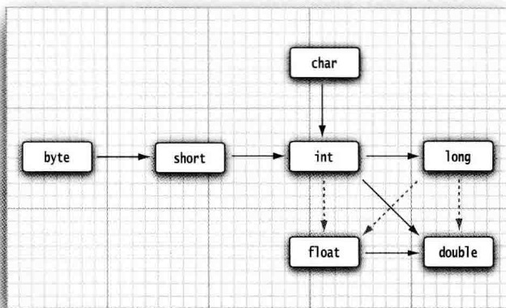

### Java学习路线

#### 第一阶段：**Java 基础**

最开始要学习的是 Java 基础，学习了这部分，就会对 Java 语言有一个初步的了解。

这部分主要学习的内容有：**基本程序结构，类与对象，接口，泛型，反射，集合，异常与调试， Java 网络编程， Java I/O和多线程**


#### 第二阶段：**数据库**

MySQL 和 Oracle 都是广受企业欢迎的数据库，其中 MySQL 是目前应用最广泛的开源关系数据库，目前只学习 MySQL 就可以了。

这部分主要学习的内容有：数据库的**CRUD操作、JDBC API、数据库特性和数据库连接池**。

其中，数据库连接池是为了避免频繁地创建和销毁 JDBC 连接，常见连接池包括**C3P0，Druid 和 HikariCP**，目前使用最广泛的是HikariCP


#### 第三阶段：**Java Web**

学习 Java Web，我们不仅需要掌握后端 Java 技术，还需要学习些前端知识。

前端有三大基础技术 **Html、CSS和 Java Script**，初学的话，学习这些就可以了。如果想做出更好的交互式效果，可以再学习Vue和React等前端技术。

后端 Java 技术包括 **Servlet、Filter、Listener、Session、Cookie、JSP、EL 表达式和 JSTL 等**。其中，像 JSP 这样比较老的技术，目前在各大互联网公司基本不再使用，已经被 **Freemark、Thymeleaf** 这样的模板引擎所替代，我们只需要了解基本使用即可


#### 第四阶段：**主流框架**

这部分我们要学习的主流框架主要有 **Spring、Spring MVC 和 MyBatis**，俗称 **SSM** 框架。学习这些框架之前，先学习Maven和Git

`Maven` 本质就是一个巨大的 jar 包资源库，使用 Maven 构建项目，只需在项目的 pom.xml 中配置相关依赖后，就可以直接从远程仓库同步到本地，再也不用满世界搜索下载 jar 包了，省了很多查找和下载的烦恼。


`Git` 是一个开源的分布式版本控制系统，最大作用就是对文件进行版本管理，方便在不同版本进行切换修改，还可以很方便的协作开发。

`GitHub` 是基于 Git 的代码库托管站，学会了 Git ，我们就能愉快地上 Github 交友了


**SSM框架**:

`Spring` 是一个轻量级的 Java 开发框架，现在已经是最受欢迎的企业级 Java 应用程序开发框架。Spring 框架的核心特性是依赖注入(DI)与面向切面编程(AOP).


`Spring MVC` 是一个基于MVC架构，用来简化web应用程序开发的框架，它是 Spring 的一部分，SpringMVC 已经成为目前最主流的 MVC 框架之一


`MyBatis` 是一款优秀的持久层框架，它支持自定义 SQL、存储过程以及高级映射。

在使用传统JDBC时，往往需要写很多JDBC代码，需要自己写SQL语句以及自己装配参数，然后自己对结果集进行封装处理.

而Mybatis则帮我们简化了以上功能，只需要一些配置文件（xml）或是注解即可完成对数据库的查询以及结果的映射封装.


整合SSM框架还是比较繁琐的，时间紧张的小伙伴可以不用在整合这里花费时间，因为这种整合方式目前也不在流行了，现在直接使用更强大的利器**Spring Boot**就可以了。

`Spring Boot` 采用约定大约配置的方式，大量的减少了配置文件的使用，从而使开发人员不再需要定义样板化的配置。

那要不要跳过了 SSM 直接去学习 Spring Boot呢？

如果只是为了使用 Spring Boot，当然可以跳过，毕竟 SSM 配置太繁琐了

**如果想深入学习，尤其是找 Java 开发的工作，面试中会出现很多 Spring 的底层问题，因此还是要学习 SSM 的，如果跳过了不利于学习原理**


#### 第五阶段：**服务器中间件**

学完上面的内容，我们已经具备实际项目的开发能力了，但是要解决些复杂的业务场景，我们还要学习Redis、MQ、Elasticsearch这些中间件。

`Redis` 是一个 key-value 存储系统，是跨平台的非关系型数据库，可用作数据库，高速缓存和消息队列代理,Redis作为当下主流的缓存技术，已经成为互联网企业的不二首选.


`MQ（Message Queue）`是一种跨进程的通信机制，用于传递消息。通俗点说，就是一个先进先出的数据结构。MQ有三大主要作用分别为解耦、异步、削峰/限流

`Elasticsearch`全文搜索属于最常见的需求，开源的 Elasticsearch是目前全文搜索引擎的首选。

它可以快速地储存、搜索和分析海量数据。维基百科、Stack Overflow、Github 都采用它。

Elasticsearch的底层是开源库 Lucene。但是，必须自己写代码去调用Lucene的接口。Elastic 是 Lucene 的封装，提供了 REST API 的操作接口，开箱即用


#### 第六阶段：**微服务和分布式**

`Spring Cloud` 是一套完整的微服务解决方案，基于 Spring Boot框架。

准确的说，Spring Cloud 是一系列框架的有序集合，它利用 Spring Boot 的开发便利性简化了分布式系统的开发，比如服务发现、服务网关、服务路由、链路追踪等.


`Dubbo`值得一提的是，还有阿里开源Dubbo，Dubbo一个高性能优秀的服务框架。简单地说，Dubbo是一个基于Spring的RPC（远程过程调用）框架，能够实现服务的远程调用、服务的治理。


`ZooKeeper`是一个高可用的分布式管理与协调框架，基于ZAB算法（原子消息广播协议）的实现。该框架能够保证分布式环境中数据的一致性，使得ZooKeeper成为了解决分布式一致性问题的利器


### 一、Java基础

#### 1 注意事项和细节

>  一个源文件最多只有一个public类(也可以没有)，其它类的个数不限

`代码：org.example.Hello`

当执行Hello类中的main方法后，编译后会生成 `Hello.class`、`Dog.class`、`Cat.class` 三个class文件

> 如果源文件包含一个public类，则文件名必须按该类名命名

##### 1.1 小思考

```markdown
问：Java多个类(接口也是一样的)写到同一个文件和分开写有什么好处呢？
答：有好处和弊端，
好处：方便管理，比如Dog和Cat类写在了Hello类中，而一个文件只能有一个类使用public修饰，所以Dog和Cat不能使用public修饰，所以只能在本包内使用，在其他包无法使用，刚好这两个类我们也仅仅设计成只能 Hello类 来访问，所以这时写到一个文件中。

弊端：不能被其他包的类访问，不方便后续扩展。

补充：类和接口修饰只能使用 public 和 默认
interface A{} 或者 public interface A{}，类就是如：public class A{} 或者 class A{} 【使用public修饰就要跟文件名一致】
```

###### 1.2 学习新技术的方法：

```markdown
1、先学习基本原理和基本语法（不要考虑细节）
2、快速入门案例（基本程序，crud）
3、考虑研究技术的注意事项，使用细节，使用规范，如何优化
```

***

#### 2 转义字符

##### 2.1 java 常用的转义字符

```markdown
1. \t：一个制表位，实现对齐功能
2. \n：换行符
3. \\：一个\
4. \ "：一个"
5. \ '：一个'
6. \r：一个回车
```

`org.example.ChangeChar`

##### 2.2 转义字符练习

`org.example.ChangeCharExer01`

***

#### 3 注释

##### 3.1 介绍

用于注解说明**解释程序的文字**就是注释，注释提高了代码的阅读性（可读性）；注释是一个程序员必须要具有的良好变成习惯。将自己的思想通过注释先整理出来，再用代码去实现。

Java中的注释类型

- 单行注释
- 多行注释
- 文档注释 

##### 3.2 注释使用

```markdown
【单行注释】
	格式：//注释的文字

【多行注释】
	格式：/* 注释的文字 */
	
【使用细节】
1、被注释的文字，不会被JVM解释执行
2、多行注释里面不允许哟多行注释嵌套
```

##### 3.3 文档注释

```markdown
注释内容可以被JDK提供的工具javadoc所解析，生成一套以网页文件形式体现的该程序的说明文档，一般写在类。
```

`org.example.Comment02`

生成文档命令：wing@WangShaoYoudeMacBook-Pro example % javadoc -d temp -author -version Comment02.java

生成的文档保存在temp目录下，可以直接点开目录里的index.html就能访问到刚才生成的文档了。

| 标签          | 描述                                                 | 示例                                                         |
| ------------- | ---------------------------------------------------- | ------------------------------------------------------------ |
| @author       | 标识一个类的作者                                     | @author description                                          |
| @deprecated   | 指明一个过期的类或成员                               | @deprecated description                                      |
| {@docRoot}    | 指明当前文档根目录的路径                             | Directory Path                                               |
| @exception    | 标志一个类抛出的异常                                 | @exception exception-name explanation                        |
| {@inheritDoc} | 从直接父类继承的注释                                 | Inherits a comment from the immediate superclass             |
| {@link}       | 插入一个到另一个主题的链接                           | {@link name text}                                            |
| {@linkplain}  | 插入一个到另一个主题的链接，但是该链接显示纯文本字体 | Inserts an in-line link to another topic.                    |
| @param        | 说明一个方法的参数                                   | @param parameter-name explanation                            |
| @return       | 说明返回值类型                                       | @return explanation                                          |
| @see          | 指定一个到另一个主题的链接                           | @see anchor                                                  |
| @serial       | 说明一个序列化属性                                   | @serial description                                          |
| @serialData   | 说明通过writeObject()和writeExternal()方法写的数据   | @serialData description                                      |
| @serialField  | 说明一个ObjectStreamField组件                        | @serialField name type description                           |
| @since        | 标记当引入一个特定的变化时                           | @since release                                               |
| @throws       | 和 @exception标签一样                                | The @throws tag has the same meaning as the @exception tag.  |
| {@value}      | 显示常量的值，该常量必须是static属性                 | Displays the value of a constant,which must be a statuc field |
| @version      | 指定类的版本                                         | @version info                                                |

##### 3.4 Java代码规范

1. 类、方法的注释，要以javadoc的方式来写
2. 非java Doc的注释，往往是给代码的维护者看的，着重告诉读者为什么要这样写，如何修改，注意什么问题等。（那反过来JavaDoc的注释是给使用者看的，使用者只要知道怎么使用就行）
3. 运算符和 = 两边习惯性各加一个空格，比如 int i = 1 + 2 * 3;
4. 源文件使用utf-8编码
5. 行宽度不要超过80字符
6. 代码编写`次行风格`和`行尾风格`

```java
// 行尾风格(推荐)
public void test{ 
}
// 次行风格
public void test
{
}
```

***

#### 4 变量

##### 4.1 变量介绍

变量是程序的基本组成单位

变量有三个基本要素（类型 + 名称 + 值 ）

##### 4.2 +号的使用

1. 当左右两边都是数值类型时，做加法运算
2. 当左右两边有一方为字符串，做拼接运算

##### 4.3 基本数据类型

每一种数据都定义了明确的数据类型，在内存中分配了不同大小的内存空间（字节）

Java数据类型分为两大类：`基本数据类型`和`引用数据类型`

- `基本数据类型`：有8种，`数值型`[byte,short,int long,float,double] `字符型`[char], `布尔型`[boolean]
- `引用类型`：类、接口、数组

| 类型         | byte[字节] | short[短整型]                 | int[整型]                               | long[长整型] | float | double | boolean | char  |
| ------------ | ---------- | ----------------------------- | --------------------------------------- | ------------ | ----- | ------ | ------- | ----- |
| 占用存储空间 | 1字节      | 2字节                         | 4字节                                   | 8字节        | 4字节 | 8字节  | 1字节   | 2字节 |
| 范围         | -128～127  | -2^15~2^15-1【-32768～32767】 | -2^31~2^31-1【-2147483648～2147483647】 | -2^63~2^63-1 |       |        |         |       |

> 小思考

```markdown
问：如果我的数很大，long也存不进去怎么办呢？
答：可以使用 BigInteger、BigDecimal
```

> 整型的使用细节

- Java各整数类型有固定的范围和字段长度，不受具体OS（操作系统）的影响，以保证Java程序的可移植性
- Java的整型常量默认为int类型（比如直接在代码写 5），声明long类型常量须后加'l'或'L'，建议使用大些L，因为小写和数字1不好区分
- Java程序中变量常声明为int类型，除非不足以表示大数，才使用long
- bit：计算机中的`最小存储单位`，byte：计算机中`基本存储单元`，1byte = 8 bit。

> 浮点类型

| 类型          | 占用存储空间 | 范围                   |
| ------------- | ------------ | ---------------------- |
| 单精度float   | 4字节        | -3.403E38 ~ 3.403E38   |
| 双精度doouble | 8字节        | -1.798E308 ~ 1.798E308 |

说明：

- 关于浮点数在机器中存放形式的简单说明，`浮点数 = 符号位 + 指位数 + 尾位数`
- 尾数部分可能丢失，造成精度损失（小数都是近似值）

> 浮点型的使用细节

- Java的浮点型常量默认为double类型（比如直接在代码写 5.1，见下面演示），声明float类型常量须后加'f'或'F'，建议使用大些F
- 浮点型常量有`两种表示形式`

​       十进制数形式：如：5.12、  512.0f    .512（必须有小数点，见下面演示）

​       科学计数法形式：如：5.12e2[5.12 * 10的2次方].   5.12E-2[5.12 / 10的2次方]

- 通常情况下，应该使用double型，因为它比float型更精确
- 浮点数使用陷进：2.7 和 8.1/3 比较

> 演示

```java
public class Test{
  public static void main(String[] args){
    float num1 = 1.1; // 这里错误，因为浮点型常量默认为double类型，应该这样写 float num1 = 1.1F
    double num2 = .512; // 正确，.512等价于 0.512 0可以省略
    System.out.println(5.12e2); // 512.0
    System.out.println(5.12E-2); // 0.0512
    
    // 比较 double 和 float 的精度
    double num9 = 2.1234567851;
    float num10 = 2.1234567851F;
    System.out.println(num9); //  2.1234567851 (全部能输出，精度更高)
    System.out.println(num10); //  2.1234567  (部分输出，精度比double低)
  }
}
```

> 字符类型

> 字符类型的使用细节

- 字符常量是用单引号（''）括起来的单个字符。例如：char c1 = 'a'; char c2 = '王';
- java中还允许使用转义字符'\'来将其后的字符转变为特殊字符型常量。例如： char c3 = '\n'；
- 在Java中，char的本质是一个整数，在输出时，是 Unicode码对应的字符，要输出对应的数字，可以(int)字符，见下面演示
- char类型是可以进行运算的，相当于一个整数，因为它都对应有Unicode码

> 演示

```java
public class Test{
  public static void main(String[] args){
    char c1 = 'a';
    char c2 = '\t';
    char c3 = '王';
    char c4 = 97;
    System.out.println(c1); // a
    System.out.println(c2); // 
    System.out.println(c3); // 王
    System.out.println(c4); // a   [会输出97表示的字符]
    System.out.println((int)c1); // 97
  }
}
```

字符类型可以使用单个字符，字符类型是char，char是两个字节（可以存放汉字），多个字符使用字符串String

> 布尔类型

- 布尔类型也叫boolean类型，boolean类型数据只允许取值 true 和 false，无 null
- boolean 类型占用 1 个字节
- boolean 类型适用于逻辑运算，一般用于程序流程控制（if、while、do-while、for）

##### 4.4 编码

> 字符编码表

- ASCII(ASCII编码表，`一个字节`表示，一共 128 个字符，实际上一个字节可以表示 256 个字符，只用了 128个)
- Unicode(Unicode编码表固定大小的编码，使用两个字节来表示字符，字母和汉字统一都是占用两个字节，这样浪费空间)
- Utf-8（编码表，大小可变的编码，字母使用1个字节，汉字使用3个字节）
- Gbk（可以表示汉字，而且范围广，字母使用1个字节，汉字2个字节）
- Gb2312(可以表示汉字，gb2312 < gbk，用得少，了解)
- big5码（繁体中文，台湾，香港）

> 小思考

```markdown
问：有了ASCII为什么还要用Unicode呢？
答：因为一开始只有美国人用，美国只有字母 ASCII 128 就够表示了，但是这时中国人也要用，那128不够用了（其他国家也是一样不够用），即使使用一个字节用满 256 个也不够用了，所以机构出来了重新设计了一个在ASCII标准下的另一个标准 Unicode（使用两个字节来表示）。
Unicode码兼容ASCII码（比如a在Unicode表示97，在ASCII码中也是）

补充：utf-8也是在Unicode之上进行的改进，因为Unicode都是使用的两个字节表示（字母也是），而utf-8变得更加灵活了（字母使用1个字节，汉字使用3个字节表示）

补充：相同的一个.java文件，如果文件里面的内容仅仅就是 “abc王”,如果保存该文件使用不同的编码方式保存，那么文件的大小也不一样，如果使用utf-8保存，那么文件大小为：6字节；如果使用gbk保存相同的文件，那么文件大小为：5字节；

补充：如果有一个文件里面很极端，内容是 aabbccaabbccaabbccaabbcc王aabbccaabbcc，很长的内容里面只有一个汉字，如果使用Unicode编码，那么这就很浪费存储空间了,文件就会变得很大，因为不管字母还是汉字都是使用2个字节来表示；但此时使用utf-8好处就出现了，这时字母只需要1个字节，汉字3个字节，也因为汉字使用3子字节表示，所以能表示的范围更多了，gbk虽然字母也使用一个字节，但是汉字使用两个字节，表示的范围没有utf-8范围广。

补充：utf-8是一种变长的编码方式，它可以使用 1-6 个字节来表示一个符号，根据不同的符号而变化字节长度。
```

##### 4.5 基本数据类型转换

> 自动类型转换

当Java程序在进行赋值或者运算时，精度小的类型自动转换为精度大的类型，这个就是`自动类型转换`

数据类型按精度（容量）大小排序为：

1. char  < int < long < float < double ;
2. byte < short  < int < long < float < double ;

```java
int num = 'a';   // ok  char -> int
double d1 = 80;  // ok  int -> double
```

> 自动类型转换注意和细节

1. 有多种类型的数据混合运算时，系统首先自动将所有数据转换成容量最大的那种数据类型，然后再进行计算。
2. 当我们把精度大的数据类型赋值给精度小的数据类型时，会出错；反之小的赋值给大的就会进行自动类型转换。
3. byte,short和char之间不会相互自动转换
4. byte, short,char 他们三者可以计算，在计算时首先转换为int类型
5. boolean,不参与运算
6. 自动提升原则：表达式结果的类型自动提升为操作数中最大的类型



```java
int n1 = 10;  
float d1 = n1 + 1.1;  // 错误，按照上面的第一点原则：有多种类型的数据混合运算时，系统首先自动将所有数据转换成容量最大的那种数据类型，然后再进行计算。 （n1 + 1.1）结果是double类型
//分析：n1 是 int 类型； 1.1是double类型（没写后缀L或D，默认double），两者运算转成最大的double进行运算，最终结果为double类型，所以不能直接赋值给float
  
// 如果就是想使用float接收呢，可以
float d1 = n1 + 1.1F; 
float d1 = float(n1 + 1.1); 

byte b1 = 10;  // -128 ～ 127，ok，为什么呢，10不是int类型吗，怎么能赋值给 byte类型呢
// 解答：当把具体的数赋值给byte类型时，编译器会先判断该数是否在byte范围内，如果是就可以

int n2 = 1;
byte b2 = n2; // 错误，原因：如果是变量赋值，int不能赋值给 byte

//byte,short和char之间不会相互自动转换
byte b1 = 10;
char c1 = b1; // 错误，原因：byte不能自动转成char

//byte, short,char 他们三者可以计算，在计算时首先转换为int类型
byte b2 = 1;
byte b3 = 2;
short s1 = 1;
short s2 = b2 + s1; // 错误，原因：运算时已经提升为了int类型

byte b4 = b2 + b3; //错误，原因：只要有byte, short,char 他们三者参与了计算，都会提升为int，所以b2 + b3 最终类型为 int ，所以不行
```

> 强制类型转换

自动类型转换的逆过程，将容量大的数据类型转换为容量小的数据类型，使用时要加上强制转换符()，但可能造成精度降低或溢出，格外要注意。

```java 
int n1 = (int)1.9;
System.out.println("n1=" + n1);// 结果：n1=1；精度损失，所以要格外注意

int n2 = 2000;
byte b1 = (byte)n2;
System.out.println("b1=" + b1);//结果b1=-48；数据溢出，并不是想象的 128

// char类型可以保存int的常量值，但不能保存int的变量值，需要强转
char c1 = 100;
int m = 100;
char c2 = m; // 错误
char c3 = (char)m;  // ok
System.out.println(c3);

// 强转符号只针对最近的操作数有效，往往会使用小括号提升优先级
int n1 = (int)10 * 3.5 + 6 * 1.1; // 编译错误
int n1 = (int)(10 * 3.5 + 6 * 1.1); // ok
```

##### 4.6 基本数据类型和String类型转换

程序开发中，我们经常需要将基本数据类型转成String类型，或者将String类型转成基本数据类型。

> 基本数据类型转Sting类型，后面加 ""就能转成功

```java
int n1 = 100;
float f1 = 1.1F;
double d1 = 4.5;
boolean b1 = true;

String s1 = n1 + "";  // 100
String s2 = f1 + "";  // 1.1
String s3 = d1 + "";  // 4.5
String s4 = b1 + "";  // true
```

> String类型转成基本数据类型，使用parseXX()；

```java
String str = "123";
byte b1 = Byte.parseByte(str); // 123
short s1 = Short.parseShort(str); // 123
int num1 = Integer.parseInt(str);  // 123
long lo1 = Long.parseLong(str);  // 123
float f1 = Float.parseFloat(str); // 123.0
double d1 = Double.parseDouble(str); // 123.0
boolean boo = Boolean.parseBoolean("true"); // true

// 怎么把String转成char呢？因为char只能有一个字符,取索引，所以转换方式如下
char ch = str.charAt(2); // 3
```

***

#### 5 运算符

##### 5.1 运算符介绍

运算符是一种特殊的符号，用以表示数据的运算、赋值和比较等。

##### 5.2 算术运算符

算术运算符是对数值类型的变量进行运算的，在Java程序中使用的非常多。

算数运算符包含： + ，-，*，/，%，++，--

```java
System.out.println( 10 /4);  // 数学角度等于2.5，但是这里是得到一个int类型，所以等于 2
System.out.println( 10.0 /4);  // 等于 2.5，因为最终结果是double类型
double d = 10 / 4;
System.out.println( d );  // 等于 2.0,因为最终结果为int，int赋值给double

// 取模（取余）【重点公式】
// % 的本质，看一个公式： a % b = a - a / b * b   
// 比如求  -10.5%3 = ？ 重点：  a % b当a是小数时，公式 =  a - (int)a / b * b  
// -10.5 - (int)(-10.5) / 3 * 3 = -1.5(注意：有小数参与的运算得到的结果是近似值，比如：-10.4%3)

// -10 % 3 = -10 -（-10）/ 3 * 3 = -1
// 10 % -3 = 10 -（10）/(-3) * (-3) = 1
// -10 % -3 = -10 -（-10）/(-3) * (-3) = -1
System.out.println( 10 % 3);  // 1
System.out.println( -10 % 3);  // -1
System.out.println( 10 % -3);  // 1
System.out.println( -10 % -3);  // -1
```

##### 5.3 关系运算符

关系运算符包含： ==，!=，<，>，<=，>=，instances（检查是否类的对象）

##### 5.4 逻辑运算符

用于连接多个条件（多个关系表达式）,最终的结果也是一个boolean值

逻辑运算符包含：&(逻辑与)，|(逻辑或)，^(逻辑异或)，&&(短路与)，||(短路或)，！(取反)

| a     | b     | a&b   | a&&b  | a\|b  | a\|\|b | !a    | a^b   |
| ----- | ----- | ----- | ----- | ----- | ------ | ----- | ----- |
| true  | true  | true  | true  | true  | true   | false | false |
| true  | false | false | false | true  | true   | false | true  |
| false | true  | false | false | true  | true   | true  | true  |
| false | false | false | false | false | false  | true  | false |

```java
boolean x = true;
boolean y = false;
short z = 46;
if((z++==46)&&(y=true)){ // true && true
    z++;
}
if((x=false)||(++z==49)){// false || true
    z++;
}
System.out.println(z); // 50
```

##### 5.5 赋值运算符

赋值运算符就是将某个运算后的值，赋给指定的变量

基本赋值运算符： = 

复合赋值运算符：+=，-=，*=，/=，%=【a +=b;等价于 a=a+b;】

```java
byte b = 3;
b += 2; //等价于 b = (byte)(b + 2);  并不是等价于 b = b + 2,假设等价于这个，那么 b + 2值类型为int 赋值给 byte会报错
b++;  //等价于 b = (byte)(b + 1);
```

##### 5.6 三元运算符

条件表达式 ？ 表达式1 ： 表达式2；

1.如果条件表达式为true，运算后的结果是表达式1；

2.如果条件表达式为false，运算后的结果是表达式2；

##### 5.7 运算符优先级

1.运算符有不同的优先级，所谓优先级就是表达式运算中的运算顺序。

下面优先级（从上往下，从高到低）

| .      ()       {}       ;       ,【举例：int a=1,b=5;】 |
| -------------------------------------------------------- |
| ++       --       ~       !(date_type)                   |
| *      /      %                                          |
| +      -                                                 |
| <<      >>      >>>      位移                            |
| <      >      <=      >=      instance                   |
| ==      !=                                               |
| &                                                        |
| ^                                                        |
| \|                                                       |
| &&                                                       |
| \|\|                                                     |
| ?      :                                                 |
| =      *=      /=      %=                                |
| +=      -=      <<=      >>=                             |
| >>>=      &=      ^=      \|=                            |

```markdown
简单记忆上面的优先级由高到低：
1）(),{}等
2）单目运算符
3）算术运算符
4）位移运算符
5）比较运算符
6）逻辑运算符
7）三元运算符
8）赋值运算符

```

##### 5.8 标识符规则

1. Java对各种变量、方法和类等命名时使用的字符序列称为标识符
2. 凡是自己可以起名字的地方都叫标识符

> 标识符的命名规则（必须遵守）

1. 由26个英文字母大小写，0-9，_或$组成
2. 数字不可以开头。
3. 不可以使用关键字和保留字，但能包含关键字和保留字
4. Java严格区分大小写，长度无限制
5. 标识符不能包含空格

> 标识符的命名规范（建议这样使用）

1. `包名`：多单词组成时所有字母都小写：aaa.bbb.ccc //比如：com.wing.crm
2. `类名`、`接口名`：多单词组成，所有单词首字母大写：XxxYyyZzz，如TankShotGame
3. `变量名`、`方法名`：多单词组成时，第一个单词首字母小写，第二个单词开始每个单词首字母大写： xxxYyyZzz，如：tankShotGame
4. `常量名`：所有字母都大写，多单词时每个单词用下划线连接：XXX_YYY_ZZZ,如：TAX_RATE

##### 5.9 键盘输入

```java
Scanner scanner = new Scanner(System.in);
System.out.println("请输入：");
String name = scanner.next();  // 这里会等待键盘输入
System.out.println("name=" + name);
```

***

#### 6 进制

##### 6.1 进制介绍

对于整数，有四种表示方式：

1. `二进制`：0,1 满2进1，以0b或0B开头
2. `十进制`：0-9 满10进1
3. `八进制`：0-7 满8进1,以数字0开头表示
4. `十六进制`：0-9以及A-F，满16进1，以0x或0X开头表示，此处A-F不区分大小写

```java
/* 演示四种进制 */
// 二进制（0b开头）
int n1 = 0b1010;  // 10
// 十进制
int n2 = 1010;    // 1010
// 八进制 （0 开头）
int n3 = 01010;   // 520
// 十六进制（0x开头）
int n4 = 0x1010;  // 4112

//进制计算器：https://www.matools.com/app/radix
```

##### 6.2 进制的转换(略)

##### 6.3 原码、反码和补码

1. 二进制的最高位是符号位：0表示正数，1表示负数
2. 正数的原码，反码，补码都一样（三码合一）
3. 负数的反码 = 它的原码符号位不变，其他位取反
4. 负数的补码=它的反码 + 1，负数的反码 = 负数的补码 - 1
5. 0的反码，补码都是0
6. Java没有无符号数，换言之，Java中的数都是有符号的
7. 在计算机运算的时候，都是以`补码的方式来运算`的（重点）
8. 当我们看运算结果时，要看它的`原码`（重点）

##### 6.4 位运算符

Java中有7个位运算符（&、|、^、~、>>、<< 和 >>>）

分别是 **按位与&、按位或|、按位异或^、按位取反~**，它们的运算规则是：

- 按位与&：两位全为1，结果为1，否则为0
- 按位或|：两位有一个为1，结果为1，否则为0
- 按位异或^：两位一个为1，一个为0，结果为1，否则为0
- 按位取反~：0变1，1变0

```java
/** 计算机所有的运算都是使用"补码"来进行的 */
// 第一步：先得到2的原码（int是四个字节）：00000000 00000000 00000000 00000010 ，因为正数三码合一，所以补码也是这个
// 2的补码：00000000 00000000 00000000 00000010
// 第二步：先得到3的原码：00000000 00000000 00000000 00000011，
// 3的补码：00000000 00000000 00000000 00000011
// 计算 2&3 ： 00000000 00000000 00000000 00000010
//          & 00000000 00000000 00000000 00000011
//          --------------------------------------
// 得到补码结果 00000000 00000000 00000000 00000010，因为符号位为0，所以反码、原码结果和补码相同（看结果要看原码）
// 原码结果    00000000 00000000 00000000 00000010
System.out.println(2&3);  // 2
// 第一步：先得到-2的原码 10000000 00000000 00000000 00000010
// 第二步：计算-2的反码   11111111 11111111 11111111 11111101
// 第三步：计算-2的补码   11111111 11111111 11111111 11111110 （有了补码就可以计算了）
// 第四步：计算 ~-2结果   00000000 00000000 00000000 00000001 （结果是补码，很幸运，补码符号位是正数，所以三码合一）
System.out.println(~-2);  // 1
// 第一步：先得到2的补码   00000000 00000000 00000000 00000010 （三码合一）
// 第二步：计算 ~2结果    11111111 11111111 11111111 11111101 （结果符号位是负数）
// 第三步：计算对应的补码  11111111 11111111 11111111 11111100 （结果符号位是负数）
// 第四步：计算对应的原码  10000000 00000000 00000000 00000011
System.out.println(~2);  // 3
```

还有3个位运算符： **>>、<<、>>>**，它们的运算规则是：

- 算术右移 >>：低位溢出，符号位不变，并用符号位补溢出的高位
- 算术左移 <<：符号位不变，低位补0
- 逻辑右移 >>>：也叫无符号右移，运算规则是：低位溢出，高位补0
- 正数的无符号右移和右移结果相同(例：12>>>2 = 12>>2)
- 特别说明：没有 <<< 符号

```markdown
int a=1>>2  => 00000001 => 00000000 本质 1/2/2=0
int a=1<<2  => 00000001 => 00000100 本质 1*2*2=4
```

```java
//12的源码: 00000000 00000000 00000000 00001100
        // 左移两位:00000000 00000000 00000000 00110000 本质 12 * 2 * 2 = 48
        System.out.println(12 << 2);  // 48

        //12的源码: 00000000 00000000 00000000 00001100
        //右移两位:00000000 00000000 00000000 00000011 本质 12 / 2 / 2 = 3
        System.out.println(12 >> 2);  // 3

        //-12的源码: 10000000 00000000 00000000 00001100
        //左移两位:  10000000 00000000 00000000 00110000 本质 -12 * 2 * 2 = -48
        System.out.println(-12 << 2); // -48

        //-12的源码: 10000000 00000000 00000000 00001100
        //右移两位:10000000 00000000 00000000 00000011 本质 -12 / 2 / 2 = -3
        System.out.println(-12 >> 2); // -3

// -16的源码:  10000000 00000000 00000000 00010000
        // -16的反码:  11111111 11111111 11111111 11101111
        // -16的补码:  11111111 11111111 11111111 11110000
        // -16 >>> 2结果:  11111111 11111111 11111111 11111100
        System.out.println(-16 >>> 2);  // 1073741820
```

> 总结

1. ">>>"无符号右移：可以看成除以2，然后向下取整【6 >>> 1=3，7 >>> 1=3】

***

#### 7 控制结构

在程序中，程序运行的流程控制决定程序是如何执行的，是程序员必须掌握的。有三大流程控制语句分别是：顺序控制、分支控制和循环控制。

##### 7.1 顺序控制

程序从上到下逐行执行，中间没有任何判断和跳转。

##### 7.2 分支控制

> 单分支

```java
// 基本语法
if(条件表达式){
  执行代码块；
}
// 说明：当条件表达式为true时，就会执行{}的代码，如果为false，就不执行，特别说明，如果{}中只有一条语句，则可以不用{}，建议写上{}
```

> 双分支

```java
// 基本语法
if(条件表达式){
  执行代码块1；
}else{
  执行代码块2；
}
// 说明：当条件表达式为true时，执行代码块1;否则，执行代码块2
```

> 多分支

```java
// 基本语法
if(条件表达式1){
  执行代码块1；
}else if(条件表达式2){
  执行代码块2；
}
......
else{
  执行代码块3；
}

// 说明：
//1、当条件表达式1为true时，执行代码块1;
//2、当条件表达式1为false时，才去判断条件表达式2是否为true;
//3、如果条件表达式2为true时，执行代码块2;
//4、以此类推，如果所有的表达式都不成立
//5、则执行else的代码块
```

> switch分支结构

```java
// 基本语法
switch(表达式){
    case 常量1:
    语句块1;
    break;
    case 常量2:
    语句块2;
    break;
    case 常量3:
    语句块3;
    break;
    ...
    case 常量n:
    语句块n;
    break;
    default:
    语句块default
    break;
}

// 说明：
//1、switch关键字，表示switch分支
//2、表达式对应一个值
//3、当表达式的值等于常量1，就执行语句块1
//4、break：表示退出switch
//5、如果和case常量1匹配，就执行语句块1，如果没有匹配，就继续匹配case 常量2
//6、如果一个都没有匹配上，执行 default

// 注意：假如switch case 常量1和 case 常量2 里面漏了写break，那么会出现这样的现象，如果表达式的值与常量1匹配，那么会先执行完语句块1，因为没有写break，所以会继续往下面执行（此时不会判断下面的case 2中的常量值），直接执行语句块2，因为case 常量2 里面也没有写break，所以会继续执行 语句块3，此时因为case 常量3 里面有break，所以会停止。
【总结：如果匹配上了case里面的常量之后，会一直执行下面的case里面的语句（不会再进行判断），直到遇到break跳出，如果都没有break，则语句块default也会执行】// 这个比较坑需要注意
```

> switch细节点

1. 表达式数据类型，应和case后的常量`类型一致`,或者是可以自动转成可以相互比较的类型，比如输入的是字符，而常量是 int
2. switch(表达式)中的表达式的返回值必须是：(byte,short,int char enum,String)
3. case子句中的值必须是常量，而不能是变量
4. default子句是可选的，当没有匹配的case时执行default

> Switch 和 if的比较

1. 如果判断的具体数值不多，而且符合 (byte,short,int char enum,String) 这6种类型，建议使用switch
2. 其他情况：对区间判断，对结果为boolean类型判断，使用if

##### 7.3 循环控制

> 介绍

可以让代码循环的执行

> for循环控制

```java
//基本语法
for(循环变量初始值;循环条件;循环变量迭代){
  循环操作的语句;
}
```

> for注意事项和细节

1. 循环条件是返回一个布尔值的表达式
2. for(;循环判断条件;)中的初始化和变量迭代可以写到其他地方，但是两边的分号不能省略
3. 循环初始值可以有多条初始化语句，但要求类型一样，并且中间用逗号隔开，循环变量迭代也可以有多条变量迭代语句，中间用逗号隔开

```java
int i = 1; // 循环变量的初始化
//for( int i = 1 ; i <= 10 ; ){  //如果这样写，那么i只能在for循环中使用
for( ; i <= 10 ; ){
  System.out.println("hello");
  i++;    // i++ 也可以写到循环体里面，不写到括号里面
}

// 循环结束后需要使用i
System.out.println(i);

//解析：为什么要将i写到外面呢？
//答：假如有个需求，就是for循环遍历完结束后还想使用变量i，所以要写到外面提升作用域
```

```java
// 死循环
for(;;){
  System.out.println("hello");
}
```

```java
// 也可以这样的写法
int count = 3;
for (int i = 0,j = 0; i < count ; i++,j+=2){
    System.out.println("i=" + i);
    System.out.println("j=" + j);
}
```

> while循环控制

```java
//基本语法
循环变量初始值;
while(循环条件){
  循环体(语句);
  循环变量迭代;
}
```

> while注意事项和细节

1. 循环条件是返回一个布尔值的表达式
2. while循环是先判断再执行语句

> do while循环控制

```java
//基本语法
循环变量初始值;
do{
  循环体(语句);
  循环变量迭代;
}while(循环条件);
```

> do while注意事项和细节

1. 先执行再判断，也就是说，一定会执行一次
2. while最后有一个分号

##### 7.4 break

> 跳转控制语句break

break语句用于终止某个语句块的执行，一般使用在switch或者循环中

```java
//基本语法
{
  ......
  break;
  ......
}
```

> break注意事项和细节

1. break语句出现在多层嵌套的语句块中时，可以通过标签指明要终止的是哪一层语句块
2. 开发中不建议使用标签的方式

```java
wing1:  // 这是标签名，可自定义
for (int i = 0; i < 10; i++) {
wing2:  // 这是标签名，可自定义
    for (int j = 0; j < 5; j++) {
        if(i == 2){
            //break;   // 等价于 break wing2；（默认跳出最近的循环体）
            break wing1;   // 指定退出到某个标签位置
        }
         System.out.println("i=" + i);
    }
}
```

##### 7.5 continue

> 跳转控制语句continue

continue语句用于结束本次循环，继续执行下一次循环

continue语句出现在多层嵌套的循环语句体中时，可以通过标签指明要跳过的是哪一层循环，这个和前面的标签的使用的规则一样（不演示）

```java
//基本语法
{
  ......
  continue;
  ......
}
```

```java
for (int i = 0; i < 10; i++) {
   if(i == 2){
       continue;
   }
    System.out.println("i=" + i);
}
```

##### 7.6 return

> 介绍

return使用在方法，表示跳出所在的方法，如果return写在main方法，退出程序...

***

#### 8 数组、排序和查找

##### 8.1 数组

> 案例引出,传统方式实现

```java
//需求，有六只鸡，体重分别如下，然后求平均体重
double hen1 = 3;
double hen2 = 5;
double hen3 = 1;
double hen4 = 12;
double hen5 = 3.4;
double hen6 = 6;
double totalWeight = hen1 + hen2 + hen3 + hen4 + hen5 + hen6;
double avgWeight = totalWeight / 6;
System.out.println("平均体重：" + avgWeight);
```

> 数组介绍

数组可以存放多个`同一类型`的数据，数组也是一种数据类型，是引用类型。

```java
//解决传统方式 - 数组静态初始化方式
double[] hens = {3,5,1,12,3.4,6};
double totalWeight = 0.0;
for (int i = 0; i < hens.length; i++) {
    totalWeight += hens[i];
}
double avgWeight = totalWeight / 6;
System.out.println("平均体重：" + avgWeight);
```

> 数组的使用

> 使用方式1-动态初始化

```java
语法：数据类型 数组名[] = new 数据类型[大小];
    或者 数据类型[] 数组名 = new 数据类型[大小];
例：int[] a = new int[10];  // 创建了一个数组，名字a，存放5个int，默认值都是0

```

> 使用方式2-动态初始化

```java
第一步：先声明数组
  语法：数据类型 数组名[];也可以，数据类型[] 数组名;
例：int a[]; 或者 int[] a;
  
第二步：创建数组
  语法：数组名 = new 数据类型[大小];
例：a = new int[10];

// 问：什么情况会先声明再分配大小呢？
// 答：可能在 for循环外面先声明，但还不知道数组的长度大小，在for循环里面满足某个条件才知道长度是多少，for循环里面才创建数组的大小。
```

> 使用方式3-静态初始化

```java
// 当知道数组有多少个元素，并且也知道具体值，可以使用该方式
语法：数据类型[] 数组名 = {元素值，元素值...}
例：int a[] = {1,2,4,5,8};
```

> 数组使用注意事项和细节

1. 数组是多个`相同类型`数据的组合，实现对这些数据的统一管理
2. 数组中的元素可以是任何数据类型，包括`基本类型`和`引用类型`，但是`不能混用`
3. 数组创建后，如果没有赋值，有默认值 int->0,short->0,byte->0,long->0,float->0.0,double->0.0,char \u0000,boolean -> false,String null

> 数组赋值机制

1. 基本数据类型赋值，这个值就是具体的数据，而且相互不影响（int n1 = 2;int n2 = n1;）
2. 数组在默认情况下是引用传递，赋的值是地址

```java
// 值传递
int n1 = 10;
int n2 = n1;
n2 = 80;
System.out.println("n1=" + n1);
System.out.println("n2=" + n2);
// 引用传递
int[] arr1 = {1,2,3};
int[] arr2 = arr1;
arr2[0] = 100;
for (int i = 0; i < arr1.length; i++) {
    System.out.println("arr1=" + arr1[i]);
}
for (int j = 0; j < arr2.length; j++) {
    System.out.println("arr2=" + arr2[j]);
}
```

##### 8.2 排序

> 介绍

排序是将多个数据，依指定的顺序进行排列的过程

排序的分类：

1. 内部排序：

指将需要处理的所有数据都加载到内部存储器中进行排序，包括（`交换式排序法、选择式排序法`和`插入式排序法`）

2. 外部排序法：

数据量过大，无法全部加载到内存中，需要借助外部存储进行排序，包括（`合并排序法`和`直接合并排序法`）ps:大数据开发时会遇到

> 冒泡排序法

冒泡排序（Bubble Sorting）的基本思想是：通过对待排序序列从后向前（从下标较大的元素开始，也可以从前向后，从下标较小的元素开始），依次比较相邻元素的值，若发现逆序则交换，使值较大的元素逐渐从前移向后部。

```java
// 值传递
int[] arr = {24,69,80,57,13,-2,0,6};
  int[] arr = {1,2,3,4,5,6,7,8};
int temp = 0;
for (int i = 0; i < arr.length - 1; i++) {
    // 记录某一轮如果都没有交换位置，说明已经排好了，直接退出
    boolean flag = true;
    for (int j = 0; j < arr.length - i - 1; j++) {
        if(arr[j] > arr[j + 1]){
            temp = arr[j];
            arr[j] = arr[j + 1];
            arr[j + 1] = temp;
            flag = false;
        }
    }
    if(flag){
        System.out.println("break" + i);
        break;
    }
}
for (int i = 0; i < arr.length; i++) {
    System.out.println(arr[i]);
}
```

##### 8.3 多维数组

```java
 // 请用二维数组输出如下图形
 // 0 0 0 0 0 0
 // 0 0 1 0 0 0
 // 0 2 0 0 0 0
 // 0 0 0 3 0 0
 // 1.从定义形式上看 int[][]
 // 2.可以这样理解，原来的一维数组的每个元素是一维数组
 int [][] arr = {{0, 0, 0, 0, 0, 0},
                 {0, 0, 1, 0, 0, 0},
                 {0, 2, 0, 0, 0, 0},
                 {0, 0, 0, 3, 0, 0}};
 for (int i = 0; i < arr.length; i++) {
     for (int j = 0; j < arr[i].length; j++) {
         System.out.print(arr[i][j] + " ");
     }
     System.out.println();
 }
```

***

#### 9 面向对象编程（基础）

##### 9.1 类与对象

比如：猫有很多种类，但是猫都有属性和行为，然后将这些共有的属性抽取到一个类中，这就是猫类，可以通过猫类new出具体的对象，比如new出田园猫，橘猫等等。具体的就是对象。

> 类与对象的区别和联系

1. 类是抽象的，概念的，代表一类事物，比如人类，猫类...，即它是数据类型
2. 对象是具体的，实际的，代表一个具体事物，即是实例
3. 类是对象的模板，对象是类的一个个体，对应一个实例

> 成员变量/属性的注意事项和细节

1. 属性的定义语法同变量，示例：访问修饰符 属性类型 属姓名；
2. 属性的定义类型可以为任意类型，包含基本类型或引用类型
3. 属性如果不赋值，有默认值( int->0,short->0,byte->0,long->0,float->0.0,double->0.0,char \u0000,boolean -> false,String null)

`代码 org.example.classtest.PropertiesDetail `

> 如何创建对象

```java
1. 先声明再创建
Person p1; // 在栈先声明一个变量p1，该变量p1指向的地址为空（还没开辟空间，new才会开辟空间）
p1 = new Person(); // 在堆内存开辟空间（开辟空间就有地址）,然后把地址填到上面p1指向的地址中

2. 直接创建
Person p1 = new Person();
```

> 类和对象的内存分配机制（Java内存的结构分析）

1. 栈：一般存放基本数据类型（局部变量）
2. 堆：存放对象（Person p1，数组等）
3. 方法区：常量池（常量，比如字符串），类加载信息

##### 9.2 成员方法

> 介绍

在某些情况下，我们需要定义成员方法（简称方法）)。比如人类除了有一些属外（年龄，姓名),我们人类还有一些行为比如：可以说话，跑步...通过学习，还可以做算术题。这时就需要用成员方法才能完成。

> 成员方法的定义

```java
访问修饰符 返回数据类型 方法名（形参列表...）{
  语句；
  return 返回值；
}
```

> 成员方法的好处

1. 提高代码的复用性
2. 可以将实现的细节封装起来，然后供其他用户来调用即可

> 方法调用小结

1. 【最开始main方法开始执行也会开辟一个main方法的栈空间】当程序(main方法)执行到方法(getSum())时，就会开辟一个getSum方法独立的空间(栈空间)
2. 当方法getSum执行完毕，或者执行到return语句时．就会返回（开辟的getSum栈空间会被销毁）

3. 返回到调用方法的地方
4. 返回后，继续执行方法后面的代码（main代码也执行完的话，main方法的栈空间也会销毁）
5. 当main方法（栈）执行完毕，整个程序退出
6. 调用方法时，如果传进去的是基本数据类型，传递的是值（值拷贝），形参的任何改变不影响实参
7. 调用方法时，如果传进去的是引用数据类型，传递的是地址值，形参的任何改变会影响实参

> 成员方法的注意事项和细节

1. 如果方法是 void 则方法体中可以没有return语句，或者只写 return 
2. 返回类型可以是任意类型，包含基本类型或引用类型

```java
// 返回int 可以使用double ，自动转换类型
double d1 = getInt();
double d2 = getDou(); 
public static int getInt(){
     int n = 100;
     return n; // 返回int类型
 }
 public static double getDou(){
     int n = 100;
     return n;  // 方法返回值是double ,真实返回int类型
 }
```

> 方法调用细节说明

1. 同一个类中的方法调用：直接调用即可。
2. 跨类中的方法A类调用B类方法：需要通过对象名调用。比如 对象名.方法名(参数);

```java
// 同一个类中的方法调用：直接调用即可
class A{
    public void print(int n){
        System.out.println(n);
    }
    public void sayOk(){
        print(1);
    }
}
// 跨类中的方法A类调用B类方法：需要通过对象名调用
class A{
    public void print(int n){
        System.out.println(n);
    }
    public void sayOk(){
        print(1);
    }
}
class B{
    public void sayOk(){
        A a = new A();
        a.print(2);
    }
}
```

> 方法递归调用-介绍

递归就是方法自己调用自己，每次调用时传入不同的变量，递归有助于编程者解决复杂问题，同时可以让代码变得简洁

```java
// 求阶乘 5 * 4 * 3 * 2 * 1 = 120
public static int factorial(int n){
    if(n == 1){
        return 1;
    }else{
        return factorial(n - 1) * n;
    }
}
// 斐波那契数 1,1,2,3,5,8,13,21...
public static int test1(int n){
    if(n < 3){
        return 1;
    }
    return (test1(n - 1) + test1(n - 2));
}
```

> 递归重要规则

1. 执行一个方法时，就创建一个新的受保护的独立空间(栈空间）
2. 方法的局部变量是独立的，不会相互影响，比如n变量
3. 如果方法中使用的是引用类型变量(比如数组），就会共享该引用类型的数据
4. 送归必须向退出递归的条件逼近，否则就是无限递归,出现StackOverflowError，死龟了
5. 当一个方法执行完毕，或者遇到return，就会返回，遵守谁调用，就将结果返回给谁，同时当方法执行完毕或者返回时，该方法也就执行完毕

##### 9.3 成员方法传参机制（重要）

##### 9.4 方法重载overload

> 介绍

java中允许同一个类中，多个`同名方法`的存在，但要求 形参列表不一致

> 注意事项和细节

1. 方法名：必须相同
2. 参数列表：必须不同（参数类型或个数或顺序，至少有一样不同，参数名无要求）
3. 返回类型：无要求

##### 9.5 可变参数

> java允许将同一个类中多个同名同功能但`参数个数不同`的方法，封装成一个方法

```java
// 基本语法
访问修饰符 返回类型 方法名(数据类型…形参名）{
}
```

> 可变参数引出案例

```java
// 求两个数的和
public static int sum(int n1,int n2){
    return n1 + n2;
}
// 求三个数的和
public static int sum(int n1,int n2,int n3){
    return n1 + n2 + n3;
}
// 求四个数的和
public static int sum(int n1,int n2,int n3,int n4){
    return n1 + n2 + n3 + n4;
}
```

> 优化上面的方法

上面的三个方法名称相同，功能相同，参数个数不同

```java
 System.out.println(sum()); // 0
 System.out.println(sum(1)); // 1
 System.out.println(sum(1,2)); // 3
 System.out.println(sum(1,2,3));  // 6
// 求多个数的和
 public static int sum(int... nums ){
     int totalNum = 0;
     for (int i = 0; i < nums.length; i++) {
         totalNum += nums[i];
     }
     return totalNum;
 }
/* 也可以传一个数组 */
int[] arr = {1,2,3,9};
System.out.println(sum(arr)); // 15

/* 可变参数和普通参数一起，但可变参数要在最后 */ 
int[] arr = {1,2,3,9};
System.out.println(sum("test",arr));

public static int sum(String str,int... nums ){
    int totalNum = 0;
    System.out.println(str);
    for (int i = 0; i < nums.length; i++) {
        totalNum += nums[i];
    }
    return totalNum;
}
```

> 可变参数注意事项和使用细节

1. 可变参数的实参可以为0个或任意多个
2. 可变参数的实参可以为数组。
3. 可变参数的本质就是`数组`
4. 可变参数可以和普通类型的参数一起放在形参列表，但必须保证可变参数在最后
5. 一个形参列表中只能出现一个可变参数

##### 9.6 作用域

> 基本介绍

1. 在java编程中，主要的变量就是属性(成员变量）和局部变量（方法中和代码块中）。
2. 我们说的`局部变量`一般是指在`成员方法`中定义的变量
3. java中作用域的分类
    全局变量：也就是属性，作用域为整个类体 Cat类：cry eat 等方法使用属性
4. 全局变量(属性)可以不赋值，直接使用，因为有默认值，局部变量必须赋值后，才能使用，因为没有默认值

```java
class Cat{
    // 全局变量也就是属性，作用域为整个类体，属性定义时可以直接赋值
    int age = 10;
    // 全局变量（属性）可以不赋值，直接使用，因为有默认值
    double weigth;
    public void cry(){
        // 1. 局部变量一般是指在成员方法中定义的变量
        // 2. n 和 name 就是局部变量
        // 3. n 和 name的作用域在 cry 方法中
        int n = 10;
        String name = "jack";
        double test;
        // 全局变量未赋值可以直接使用，有默认值
        System.out.println(weigth);
        // 局部变量未赋值不可以直接使用
        System.out.println(test);  
    }
}
```

> 作用域的注意事项和细节

1. 属性和局部变量可以重名，访问时遵循就近原则。
2. 在同一个作用域中，比如在同一个成员方法中，两个局部变量，不能重名
3. 属性生命周期较长，伴随着对象的创建而创建，伴随着对象的死亡而死亡。局部变量，生命周期较短，伴随着它的代码块的执行而创建，伴随着代码块的结束而死亡。即在一次方法调用过程中生效
4. 作用域范围不同
    全局变量：，可以被本类使用，或其他类使用（通过对象调用）
    局部变量：只能在本类中对应的方法中使用
5. 修饰符不同
    全局变量/属性可以加修饰符
    局部变量不可以加修饰符

##### 9.7 构造器/构造方法

> 基本介绍

构造方法又叫构造器，是类的一种特殊的方法，它的主要作用是完成对`新对象的初始化`(构造器只是对，对象的属性进行初始化，并不是创建对象，也就是说，执行构造器前，对象已经创建好了并且属性已经有了初始值)

> 基本语法

```java
[修饰符〕方法名(形参列表）{
		方法体;
}
```

> 基本说明

1. 构造器的修饰符可以默认
2. 构造器`没有返回值`，也不能写void
3. `方法名` 和`类名字`必须一样
4. 参数列表 和 成员方法一样的规则
5. 构造器的调用由系统完成
6. 一个类可以定义多个不同的构造器，即构造器重载
7. 如果程序没有定义构造方法，系统会自动给类生成一个默认无参构造方法(也叫默认构造方法）
8. 一旦定义了自己的构造器,默认的构造器就覆盖了，就不能再使用默认的无参构造器，除非显式的定义一下

> 创建对象的过程 

```java
class Person{
  int age = 90;
  String name;
  Person(String n,int a){
    name = n;
    age = a;
  }
}

Person p = new Person("Wing",20);
```

1. 加载Person类信息(Person.class)，只会加载一次
2. 在堆中分配空间(地址）
3. 完成对象初始化 【3.1 默认初始化 age=0 name=null 3.2 显式初始化age=90,name=null, 3.3构造器的初始化 age =20,name=Wing】
4. 在对象在堆中的地址,返回给p

##### 9.8 this

哪个对象调用，this 就代表哪个对象

```java
// 可以简单将 hashCode 理解成对象的地址
class Person{
    String name;
    int age;
    public Person(String name,int age){
        this.age = age;
        this.name = name;
        System.out.println("this 的hashCode:" + this.hashCode());
    }
}
Person p1 = new Person("wang",19);
System.out.println("p1 的hashCode:" + p1.hashCode());
Person p2 = new Person("li",18);
System.out.println("p2 的hashCode:" + p2.hashCode());
//输出结果
this 的hashCode:901506536
p1 的hashCode:901506536
this 的hashCode:747464370
p2 的hashCode:747464370
```

> this的注意事项和细节

1. this关键字可以用来访问本类的`属性`、`方法`、`构造器`
2. this用于区分当前类的属性和局部変量
3. 访问成员方法的语法：this.方法名（参数列表);
4. 访问构造器语法：this(参数列表)；注意只能在构造器中使用(**注意：有这样的语法则this()必须放在构造器的第一条语句**)
5. this不能在类定义的外部使用，只能在`类定义的方法中`使用

***

#### 10 面向对象编程（中级）

##### 10.1 包

> 包的三大作用

1. 区分相同名字的类
2. 当类很多时,可以很好的管理类
3. 控制访问范围

> 包的本质

包的本质 实际上就是创建不同的文件夹/目录，来保存类文件

> 包的命名规则

只能包含数字、字母、下划线、小圆点，但不能用数字开头，不能是关键字或保留字

> 包的命名规范

一般是小写字母 + 小圆点，一般是：com.公司名.项目名 业务模块名，举例如下：

1. com.sina.crm.user //用户模块
2. com.sina.crm.order //订单模块
3. com.sina.crm.utils//工具类

> 常用的包

一个包下,包含很多的类,java中常用的包有：

- java.lang.*   //lang包是基本包，默认引入，不需要再引入
- java.util.*    //util 包，系统提供的工具包，工具类，使用 Scanner
- java.net.*   //网络包，网络开发
- java.awt.*  //是做java的界面开发，GUI

```java
// 注意：需要使用哪个类，就导入哪个类即可，不建议使用*号全导入
import java.util.Scanner;  // 表示只会引入 Scanner 这个类
import java.util.*;  // 表示将 java.util 包下的所有类引入
```

> 注意事项和使用细节

1. package 的作用是声明当前类所在的包，需要放在类的最上面，一个类中最多只有一句package
2. import指令 位置放在package的下面，在类定义前面,可以有多句且没用顺序要求

##### 10.2 访问修饰符

> 基本介绍

java提供四种访问控制修饰符号，用于控制方法和属性(成员变量)的访问权限（范围）

1. 公开级别;用`public` 修饰,对外公开
2. 受保护级别：用`protected`修饰,对子类和同一个包中的类公开
3. 默认级别;没有修饰符号,向同一个包的类公开.
4. 私有级别：用`private`修饰,只有类本身可以访问,不对外公开.

> 四种访问修饰符的访问范围

| 访问级别 | 访问控制修饰符 | 同类 | 同包 | 不同包的子类 | 不同包 |
| -------- | -------------- | ---- | ---- | ------------ | ------ |
| 公开     | public         | √    | √    | √            | √      |
| 受保护   | protected      | √    | √    | √            | x      |
| 默认     | 没有修饰符     | √    | √    | x            | x      |
| 私有     | private        | √    | x    | x            | x      |

> 使用注意事项

1. 修饰符可以用来修饰类中的属性，成员方法以及类
2. 只有`默认`的和`public`才能修饰类！，并且遵循上述访问权限的特点
3. 成员方法的访问规则和属性完全一样

##### 10.3 封装

面向对象的三大特征：封装，继承和多态

> 封装介绍

封裝(encapsulation)就是把抽象出的数据【属性】和对数据的操作【方法】封装在一起,数据被保护在内部,程序的其它部分只有通过被授权的操作【方法】,才能对数据进行操作

> 封装的理解和好处

1. 隐藏实现细节
2. 可以对数据进行验证，保证安全合理

> 封装实现的三步

1. 将属性进行私有化private【不能直接修改属性】
2. 提供一个公共的(public)set方法，用于对属性判断井赋值（set方法里面可以加入数据验证的业务逻辑）
3. 提供一个公共的(public)get方法，用于获取属性的值

##### 10.4 继承

> 介绍

继承可以解決代码复用,让我们的编程更加靠近人类思维，当多个类存在相同的厲性(变量)和方法时,可以从这些类中抽象士父类,在父类中定义这些相同的属性和方法，所有的类不需要重新定义这些属性和方法，只需要通过extends来声明继承父类即可

```java
// 继承的基本语法
class 子类 extends 父类{}

// 举例，A类是父类，B和C类会继承到A类中的属性和方法
class A类{
  共有属性
  共有方法
}
class B类 extends A类{
  B类的特有属性
  B类的特有方法
}
class C类 extends A类{
  C类的特有属性
  C类的特有方法
}
```

> 注意和细节点

1. 子类继承了`所有的`属性和方法，**非私有的属性和方法可以在子类直接访问（但是具体得看该子类是否跟父类在同一个包下，如果是，那么除了 private的属性和方法都能访问，如果不同包下，那么只能访问 public 和 protected的属性和方法）**，但是`私有属性`和`私有方法`不能在子类直接访问，要通过`父类的公共方法`去访问
2. 子类必须调用父类的构造器,完成父类的初始化
3. 当创建子类对象时，不管使用子类的哪个构造器，`默认情况下总会去调用父类的无参构造器`，如果`父类没有提供无参构造器`，则必须在子类的构造器中`用 super 去指定使用父类的哪个构造器`完成对父类的初始化工作，否则，编泽不会通过
4. 如果希望指定去调用父类的某个构造器，则显式的调用一下
5. super在使用时，需要放在构造器第一行(super只能在构造器中使用，不能在成员方法中使用)
6. **supe() 和 this() 都只能放在构造器第一行，因此这两个方法不能共存在一个构造器**
7. java所有类都是Object类的子类，Object 是所有类的基类。
8. 父类构造器的调用不限于直接父类！将一直往上追湖直到Object类(顶级父类）
9. 子类最多只能继承一个父类(即直接继承），即java中是单继承机制。
10. 不能滥用继承，子类和父类之间必须满足逻辑关系（即 Dog不能继承Person）

```java
class GrandPa{
    String name = "大头爷爷";
    String hobby = "旅游";
}
class Father extends GrandPa{
    String name = "大头爸爸";
    int age = 39;
}
class Son extends Father{
    String name = "大头儿子";
}

// 《第一次测试开始》继承的内存布局如下图
Son son = new Son();
/**
  这时请大家注意，要按照查找关系来返回信息
  (1〕首先看子类是否有该属性
  (2）如果子类有这个属性，并且可以访间，则返回信息
  (3）如果子类没有这个属性，就看父类有没有这个属性(如果父类有该属性，并且可以访间，就返回信息〕
  (4）如果父类没有就按照（3)的规则，继续找上级父类，直到Object.如果都没有找到，报错
 * */
System.out.println(son.name); // 大头儿子
System.out.println(son.age);  // 39
System.out.println(son.hobby);// 旅游

// 《第二次测试开始》假如将 Father 的 age 设置成私有
class Father extends GrandPa{
    String name = "大头爸爸";
    private int age = 39;
}
// 那么直接访问会报错 
System.out.println(son.age);  // 报错，提示私有属性不能访问
// 在Father提供共有的方法进行访问age
class Father extends GrandPa{
    String name = "大头爸爸";
    private int age = 39;
    public int getAge() {
        return age;
    }
    public void setAge(int age) 
        this.age = age;
    }
}
// 继续访问 通过
System.out.println(son.getAge()); // 39

// 《第三次测试开始》继续深一步理解，假如GrandPa也有一个共有的age呢，使用son.age访问不到Father（私有），但是能访问到GrandPa的age吗？
class GrandPa{
    String name = "大头爷爷";
    String hobby = "旅游";
    int age = 88;  // 增加了age
}

System.out.println(son.age);  // 依然报错，提示私有属性不能访问
// 解释上面为什么不能访问：因为根据查找关系，先查 Son 是否有age属性，没有，继续查 Father 是否有 age 属性，有（并且是私有的），直接报错提示私有不能访问，因为Father中已经查到了age这个属性了，所有不会因为访问不到而继续去查GrandPa中是否有age属性【这个查找的关系很重要】

// 《第四次测试开始》继续深一步研究，假如GrandPa、Father和Son都有一个同名的属性，假如叫 String phone，此时使用下面的会输出什么呢？
class GrandPa{
    String phone = "老人机";
}
class Father extends GrandPa{
    String phone = "小米";
}
class Son extends Father{
   String phone = "苹果";
}

Son son = new Son();
System.out.println(son.phone);  // 苹果
System.out.println(this.phone);  // 苹果
System.out.println(super.phone);  // 小米

// 问题来了，那我怎么样才能访问到 GrandPa 的 phone 呢？
// 答：目前来说访问不到，因为向上访问的关键字只能是 super，当使用super.phone会触发查找原则，先查找父类 Father 是否有 phone 这个属性并且能访问，很明显这里就查到了，就直接返回了“小米”,要想访问到 GrandPa 的 phone ，除非 父类 Father 没有 phone 这个属性。

// 重要：使用super会先对父类进行查找，查不到就继续再向上的父类进行查找，会遵循就近原则，查到就返回
```


> 好处

1. 代码的复用性提高了
2. 代码的扩展性和维护性提高了

##### 10.5 Super关键字

> 介绍

super代表父类的引用，用于访问父类的属性、方法、构造器

> 使用细节

1. 访问父类的属性，但不能访问父类的private属性(具体看是否在同包下，如果子类和父类不在同一个包下，那么父类默认修饰符的属性也是不能访问的) `super.属性名`
2. 访问父类的方法，不能访问父类的private方法(规则同上)，`super.方法名（参数列表)`;
3. 访问父类的构造器 `super(参数列表)`;只能放在构造器的第一句，只能出现一句
4. 代码里只要看到super.就直接跳过本类，直接从父类开始查找，查到就返回，查不到就报错

> 细节

1. 调用父类的构造器的好处（分工明确，父类属性由父类初始化，子类的属性由子类初始化）
2. 当子类中有和父类中的成员（属性和方法） 重名时，为了访问父类的成员，必须通过super。如果没有重名，使用super、this.直接访问是一样的效果
3. super的访问不限于直接父类，如果爷爷类和本类中有同名的成员，也可以使用super去访回爷爷类的成员；如果多个基类(上级类)中都有同名的成员，使用super访问遵循就近原则。A->B->C

`看上面的多继承代码案例，有详细说明super`

| No.  | 区别点     | this                                                   | super                                  |
| ---- | ---------- | ------------------------------------------------------ | -------------------------------------- |
| 1    | 访问属性   | 访问本类中的属性，如果本类没有此属性则从父类中继续查找 | 从父类开始查找属性                     |
| 2    | 调用方法   | 访问本类中的方法,如果本类没有此方法则从父类继续查找    | 从父类开始查找方法                     |
| 3    | 调用构造器 | 调用本类构造器，必须放在构造器首行                     | 调用父类构造器，必须放在子类构造器首行 |
| 4    | 特殊       | 表示当前对象                                           | 子类中访问父类对象                     |

##### 10.6 方法重写/覆盖override

> 介绍

方法覆盖（重写）就是子类有一个方法,和父类的某个方法的`名称`，`访问修饰符(特殊，见下面分析)`，`返回类型(特殊，见下面分析)`，`参数`一样,那么我们就说子类的这个方法覆盖了父类的那个方法

> 注意事项和细节

1. 子类的方法的参数,方法名称,要和父类方法的参数,方法名称完全一样（**返回类型和访问修饰符可以不用完全一样，见下面说明**）
2. 子类方法的返回类型和父类方法返回类型一样，或者是父类返回类型的子类(比如父类 返回类型是 Obiect,子类方法返回类型是String)，比如：父类 public Object getInfo(){}，子类 public String getInfo(){} 这是可以的，String是Object的子类
3. 子类方法`不能缩小`父类方法的`访问权限`，比如：父类 void sayOk(){}，子类 public void sayOk(){} 这是可以的,子类public改成private就不可以。

| 名称            | 发生范围 | 方法名   | 形参列表                               | 返回类型                                                     | 修饰符                             |
| --------------- | -------- | -------- | -------------------------------------- | ------------------------------------------------------------ | ---------------------------------- |
| 重载(overload)  | 本类     | 必须一样 | `类型`、`个数`或者`顺序`至少有一个不同 | 无要求                                                       | 无要求                             |
| 重写(override） | 父子类   | 必须一样 | 相同                                   | 子类重写的方法，返回的类型和父类返回的类型一致，或者是其子类 | 子类方法不能缩小父类方法的访问范围 |

##### 10.7 多态

> 介绍

方法或对象具有多种形态。是面向对象的第三大特征，多态是建立在封装和继承基础

之上的。

> 多态的具体表现（重写和重载就体现多态）

第一种表现：方法的多态

```java
class A {
    public int sum(int a,int b){
        return a + b;
    }
    public int sum(int a,int b,int c){
        return a + b + c;
    }
}
// 调用sum方法，根据入参不同，调用的方法不同，这就是多态的体现
A a = new A();
System.out.println(a.sum(1, 2));
System.out.println(a.sum(1, 2, 3));
```

第二种表现：对象的多态（核心和重点）

1. 一个对象的编译类型和运行类型可以不一致
2. 编译类型在定义对象时，就确定了，不能改变
3. 运行类型是可以变化的
4. 编译类型看定义时=号 的左边，运行类型看=号的 右边

```java
class Animal {
    public void cry(){
        System.out.println("动物在 叫唤");
    }
}
class Cat extends Animal {
    public void cry() {
        System.out.println("猫在 叫唤");
    }
    // 猫特有的方法
    public void catchMouse(){
        System.out.println("猫捉老鼠");
    }
}
class Dog extends Animal {
    public void cry(){
        System.out.println("狗在 叫唤");
    }
}
// animal 的编译类型是 Animal，运行类型是 Dog
// 父类的引用指向子类的对象（向上转型）
// 只有在运行的时候，才知道animal指向Dog，编译时是不知道的，所以父类的引用不能调用子类特有的方法
Animal animal = new Dog();
// 也可以使用这样的方式，Object 也是Dog的父类
Object obj = new Dog();
animal.cry(); // 运行到这里时，animal的运行类型是 Dog

animal = new Cat();
animal.cry();
//这里报错，父类的引用不能调用子类特有的方法，因为在编译阶段，能调用哪些成员，是由编译类型来决定的
//animal.catchMouse(); 
Cat cat = (Cat)animal;
// 调用Cat特有方法
cat.catchMouse();
```

> 多态的注意事项和细节

1. 多态的前提是：两个对象（类）`存在继承关系`
2. 属性没有重写之说！属性的值看编译类型（重点！！,看下面代码）
3. instanceOf 比较操作符，用于判断对象的`运行类型`(不是编译类型)是否为xx类型或xx类型的子类型

```java
// 属性没有重写之说！属性的值看编译类型
class Base{
    int count = 10;
}
class Sub extends Base{
    int count = 20;
}
 Base base = new Sub();
 System.out.println(base.count); // 10
 Sub sub = new Sub();
 System.out.println(sub.count); // 20

//instanceOf 比较操作符，用于判断对象的运行类型是否为xx类型或xx类型的子类型
if(base instanceof Base){
    System.out.println("Base yes"); // Base yes
}
if(base instanceof Sub){
    System.out.println("Sub yes");  // Sub yes
}
if(sub instanceof Base){
    System.out.println("Sub1 yes"); // Sub1 yes
}
```

> 多态的向上转型

1. 本质：`父类的引用`指向了`子类的对象`
2. 语法：父类类型 引用名=new 子类类型()：
3. 特点：编译类型看左边，运行类型看右边。
    可以调用父类中的所有成员(需遵守访问权限），不能调用子类中特有成员；最终运行效果看子类的具体实现

> 多态的向下转型

1. 语法：子类类型 引用名=(子类类型)父类引用;如：Cat cat = (Cat)animal;
2. 只能强转父类的引用，不能强转父类的对象
3. 要求父类的引用必须指向的是当前目标类型的对象
4. 可以调用子类类型中所有的成员

[重点练习题，巩固！（多态的练习2）](######9、多态的练习2)

> Java的动态绑定机制

```
1. 当调用对象方法的时候，该方法会和该对象的内存地址/运行类型绑定
2. 当调用对象属性时，没有动态绑定机制，哪里声明，哪里使用
```

[重点练习题，巩固！（多态的练习3）](######10、多态的练习3)

##### 10.8 Object类详解

> == 的细节

1. ==：既可以判断基本类型，又可以判断引用类型
2. ==：如果判断基本类型，判断的是值是否相等。
3. ==：如果判断引用类型，判断的是地址是否相等，即判定是不是同一个对象

###### 10.8.1 equals 方法

1. 是Object中的方法，**只能判断引用类型**
2. 默认判断的是地址是否相等，子类中往往重写该方法，用于判断内容是否相等

###### 10.8.2 hashCode 方法

1. 提高具有哈希结构的容器的效率（例如：HashTable）
2. 两个引用，如果指向的是同一个对象，则哈希值肯定是一样的
3. 两个引用，如果指向的是不同对象，则哈希值是不一样的（不绝对，也有可能是不一样的，存在哈希碰撞，只不过概率很低，姑且这里认为是不一样的，到集合会提到）
4. 哈希值主要根据地址号来的！但是不能完全将哈希值等价于地址
5. 后面在集合，中hashCode 如果需要的话，也会重写

###### 10.8.3 toString 方法

```java
// object源码 toString输出全类名+hashCode转成十六进制的的值（Integer.toHexString()转成16进制方法）
public String toString() {
    return getClass().getName() + "@" + Integer.toHexString(hashCode());
}
```

1. 默认返回：全类名(包名+类名)＋@+哈希值的十六进制
2. 子类往往重写toString方法，用于返回对象的属性信息
3. 重写tostring方法，打印对象或拼接对象时，都会自动调用该对象的toString形式
4. 当直接输出一个对象时，toString 方法会被默认的调用

###### 10.8.4 finalize方法（实际开发中几乎不会使用这个方法）

1. 当对象被回收时，系统自动调用该对象的finalize方法。子类可以重写该方法，做一些释放资源的操作
2. 什么时候被回收：当某个对象没有任何引用时，则jvm就认为这个对象是一个垃圾对象，就会使用垃圾回收机制来销毁该对象，在销毁该对象前，会先调用 finalize方法
3. 垃圾回收机制的调用，是由系统来决定，也可以通过System.gc() 主动触发垃圾回收机制

```java
class Car{
    private String name;
    public Car(String name){
        this.name = name;
    }

    @Override
    protected void finalize() throws Throwable {
        // 写自己的逻辑代码
        System.out.println("销毁的资源逻辑");
    }
}

Car bmw = new Car("宝马");
//这时 car对象就是一个垃圾，垃圾回收器就会回收(销毁)对象，在销毁对象前，会调用该对象的finalize方法
//程序员重写Object的finalize方法，就可以在重写的finalize中，写自己的业务逻辑代码（比如释放资源：数据库连接，或者打开文件。。）
bmw = null;
System.gc(); // 主动调用垃圾回收器
System.out.println("程序结束");
```

##### 10.9 不要让惰性毁了你

```java
《每个人都可以活的更精彩，不要让惰性毁了你》
  
   每一个人智商差不了太多，没有说哪个人比谁更聪明一些，更多的是看哪个人更努力，我见过清华大学牛人很多，真正厉害的不是他们有多聪明，而是他们非常的勤奋，部分人晚上一两点都还在学习，所以这些人会越来越强。
   见过一些人整体素质非常不错，包括能力，英语水平，理解能力都很好，但是很奇怪的是，有一些学生，你感觉他将来会有很好的成绩，但是过了几年你再跟他联系，会发现他却变得很平庸了，为什么，就是这个可怕的惰性。
   其实每个人都是有缺陷的，人性就是好逸恶劳的，每个人都想舒服一点，包括我自己有时也想听听音乐，打打游戏，放放松，我们可以适当的放松享受生活，当你享受完了一定要记住，我们还要扬帆起航！我们每个人都可以做的比现在更好，关键的是自己能不能克服这种惰性，如果你能克服，树立一个目标，每天前进一点，最终是能达到一定水平的，虽然说不能达到一个很高很高的水平，达到像马云，马化腾这样的高度，当然我们能达到自己能够得着的最高的水平，这就够了，这样生活就会越来越好，越来越有冲劲，总而言之一句话，要想以后的生活更加舒服更加精彩，那么一定要克服自己的惰性，不要让惰性毁了你的聪明才智，休息一下，再扬帆起航！   -- 清华大学韩顺平老师

```

***

#### 11 面向对象编程（高级）

#####  11.1 类变量和类方法

> 介绍

类变量也叫静态变量/静态属性，是该类的所有对象共享的变量,任何一个该类的对象去访问它时,取到的都是相同的值,同样任何一个该类的对象去修改它时,修改的也是同一个变量。

```java
// 定义语法
// 第一种
访问修饰符 static 数据类型 变量名：【推荐】
//第二种
static 访问修饰符 数据类型 变量名;【不推荐】
```

> 如何访问类变量

```java
// 使用方式 静态变量的访问修饰符的访问权限和范围 和 普通属性是一样的。
//方式一
类名.类变量名    //【推荐】
//方式二
对象名.类变量名  //【不推荐】
```

> 类变量和类方法使用注意事项和细节

1. 什么时候需要用类变量，当我们需要让某个类的所有对象都共享一个变量时，就可以考虑使用类变量(静态变量)
2. 类变量与实例变量（普通属性） 区别：类变量是该类的所有对象共享的，而实例变量是每个对象独享的
3. 加上static称为类变量或静态变量，否则称为实例变量/普通变量/非静态变量
4. 类变量可以通过 【类名.类变量名】 或者 【对象名.类变量名】 来访问，但java设计者推荐我们使用 类名.类变量名方式访问。
5. 实例变量不能通过 类名.类变量名 方式访问
6. 类变量是在类加载时就初始化了，也就是说，即使你没有创建对象，只要类加载了就可以使用类变量了
7. 类变量的生命周期是随类的加载开始，随着类消亡而销毁。

> 类方法介绍

类方法也叫静态方法

```java
// 定义形式如下：
//方式一
访问修饰符 static 数据返回类型 方法名(){}   // 【推荐】
//方式二
static 访问修饰符 数据返回类型 方法名(){}   // 【不推荐】
```

> 类方法的调用

```java
// 使用方式   前提是满足访问修饰符的访问权限和范围
//方式一
【类名.类方法名】   // 【推荐】
//方式二
【对象名.类方法名】  // 【不推荐】
```

> 使用场景

当方法中不涉及到任何对象相关的成员，则可以将方法设计成静态方法，提高开发效率，比如 Math、Arrays、Collections集合类等

> 类方法使用注意事项和细节

1. 类方法和普通方法都是随着类的加载而加载，将结构信息存储在方法区：类方法中无this的参数（普通方法中隐含着this的参数）
2. 类方法中不允许使用和对象有关的关键字，比如this和super。普通方法(成员方法）可以
3. 类方法(静态方法)中 只能访问 静态变量 或静态方法
4. 静态方法，只能访问静态的成员，非静态的方法，可以访问静态成员和非静态成员，也就是可以访问所有的成员(必须遵守访问权限）

#####  11.2 理解main方法语法

> 解释main方法的形式：public static void main (String [] args){}

1. main方法由虛拟机调用
2. java虛拟机需要调用类的main()方法，所以该方法的访问权限必须是public
3. java虛拟机在执行main()方法时不必创建对象，所以该方法必须是static
4. 该方法接收String类型的数组参数，该数组中保存执行java命令时传递给所运行的类的参数

```java
比如在命令行执行一个类：java Hello tom wing li
那么String[] args数组接收到的内容就是：
arg[0]：tom
arg[0]：wing
arg[0]：li
```

#####  11.3 代码块

> 介绍

代码化块又称为初始化块;属于类中的成员【即是类的一部分】，类似于方法，将逻辑语句封装在方法体中，通过{}包裹起来。

但和方法不同，没有方法名，没有返回，没有参数，只有方法体，而且不用通过对象或类显式调用，而是**加载类(静态代码块)或创建对象(普通代码块)时隐式调用**

```java
// 基本语法
[修饰符]{
 代码
};
// 注意：
1）修饰符 可选，要写的话，也只能写 static
2）代码块分为两类，使用static 修饰的叫静态代码块，没有static修饰的，叫普通代码块
3）逻辑语句可以为任何逻辑语句（输入、输出、方法调用、循环、判断等）
4）分号“;”可以写上，也可以省略
```

> 好处和使用场景

1. 相当于另外一种形式的构造器（对构造器的补充机制），可以做初始化的操作
2. 场景：如果多个构造器中都有重复的语句，可以抽取到初始化块中，提高代码的重用性

> 代码块使用注意事项和细节

1. 代码块优先于构造器执行
2. 静态代码块优先于普通代码块执行
3. `static代码块`也叫静态代码块，作用就是对类进行初始化，而且它随着**类的加载**而执行，并且**只会执行一次**。如果是`普通代码块`，每创建一个对象，就执行
4. 普通的代码块，在创建对象实例时，会被隐式的调用。被创建一次，就会调用一次，如果**只是使用类的静态成员时，普通代码块井不会执行**

```java
// 类什么时候被加载(重点)
1)创建对象实例时(new)
2)创建子类对象实例，父类也会被加载
3)使用类的静态成员时(静态属性，静态方法）
```

> 创建一个对象，在一个类，调用的顺序是(重点！！！)：

1. `第一步`先**调用静态代码块和静态属性初始化**(注意：静态代码块和静态属性初始化调用的优先级一样，如果有多个静态代码块和多个静态变量初始化，则按他们定义的顺序调用）
2. `第二步`**调用普通代码块和普通属性的初始化**(注意：普通代码块和普通属性初始化调用的优先级一样，如果有多个普通代码块和多个普通属性初始化，则按定义顺序调用）
3. `最后`调用构造方法。
4. 构造器 的最前面其实隐含了 supe()和 调用普通代码块，静态相关的代码块， 属性初始化，在类加载的，就执行完毕，因此是优先于 构造器和普通代码块执行的
5. 注意，如果有继承关系，B继承A类，new B()时，加载顺序是：**A类静态属性或者静态代码块**（优先级一样，按顺序执行） >  **B类静态属性或者静态代码块**（优先级一样，按顺序执行 ）> **A类普通属性初始化和普通代码块**（优先级一样，按顺序执行 ） > **A类构造方法** > **B类普通属性初始化和普通代码块**（优先级一样，按顺序执行 ） > **B类构造方法** 【见下面输出，这个真的很重要！！！】
6. 静态代码块只能直接调用静态成员(静态属性和静态方法），普通代码块可以调用任意成员

```java
//我们看一下创建一个子类时(继承关系)，他们的静态代码块，静态属性初始化，普通代码块，普通属性初始化，构造方法的调用顺序如下：
1)父类的静态代码块和静态属性(优先级一样，按定义顺序执行)
2)子类的静态代码块和静态属性(优先级一样，按定义顺序执行)
3)父类的普通代码块和普通属性初始化(优先级一样，按定义顺序执行）
4)父类的构造方法
5)子类的普通代码块和普通属性初始化(优先级一样，按定义顺序执行）
6)子类的构造方法
```

```java
class A{
   static {
       System.out.println("AAA 静态代码块 1 执行");
   }
   private static int age = getAge();
   static {
       System.out.println("AAA 静态代码块 2 执行");
   }
   private static String name = getName();
   {
       System.out.println("AAA 普通代码块执行");
   }
    private int hobby = getHobby();
    private int fatherField = getFatherField();
   A(){
       System.out.println("AAA 构造方法执行");
   }
   private String nickName = getNickName();
   public static int getAge(){
       System.out.println("AAA 静态属性 age 赋值");
       return age;
   }
   public int getHobby(){
       System.out.println("AAA 普通属性 hobby 赋值");
       return hobby;
   }
   public int getFatherField(){
       System.out.println("AAA 普通属性(特有) fatherField 赋值
       return fatherField;
   }
   public static String getName(){
       System.out.println("AAA 静态属性 name 赋值");
       return name;
   }
   public String getNickName(){
       System.out.println("AAA 普通属性nickName赋值");
       return nickName;
   }
}
class B extends A{
    private static int age = getAge();
    static {
        System.out.println("BBB 静态代码块 1 执行");
    }
    static {
        System.out.println("BBB 静态代码块 2 执行");
    }
    {
        System.out.println("BBB 普通代码块执行");
    }
    private int hobby = getHobby();
    private static String name = getName();
    private String nickName = getNickName();
    private int sonField = getSonField();
    B(){
        System.out.println("BBB 构造方法执行");
    }
    public static int getAge(){
        System.out.println("BBB 静态属性 age 赋值");
        return age;
    }
    public static String getName(){
        System.out.println("BBB 静态属性 name 赋值");
        return name;
    }
    public int getHobby(){
        System.out.println("BBB 普通属性 hobby 赋值");
        return hobby;
    }
    public String getNickName(){
        System.out.println("BBB 普通属性 nickName 赋值");
        return nickName;
    }
    public int getSonField(){
        System.out.println("BBB 普通属性(特有) sonField 赋值")
        return sonField;
    }
}              
 new B();
/* 打印结果如下： */
// AAA 静态代码块 1 执行
// AAA 静态属性 age 赋值
// AAA 静态代码块 2 执行
// AAA 静态属性 name 赋值
// BBB 静态属性 age 赋值
// BBB 静态代码块 1 执行
// BBB 静态代码块 2 执行
// BBB 静态属性 name 赋值
// AAA 普通代码块执行
// BBB 普通属性 hobby 赋值 //【按查找顺序，子类BBB有getHobby()方法就直接使用，不会使用AAA的getHobby()方法】
// AAA 普通属性(特有) fatherField 赋值 //【按查找顺序，子类BBB没有getFatherField()方法，所以使用AAA的getFatherField()方法】
// BBB 普通属性 nickName 赋值 //【按查找顺序，子类BBB有getHobby()方法就直接使用，不会使用AAA的getHobby()方法】
// AAA 构造方法执行
// BBB 普通代码块执行
// BBB 普通属性 hobby 赋值
// BBB 普通属性 nickName 赋值
// BBB 普通属性(特有) sonField 赋值
// BBB 构造方法执行
```

#####  11.4 单例设计模式

> 什么是单例设计模式

1. 静态方法和属性的经典使用
2. 设计模式是在大量的实践中总结和理论化之后优选的代码结构、编程风格、以及解决问题的思考方式。设计模式就像是经典的棋谱，不同的棋局，我们用不同的棋谱，免去我们自己再思考和摸索
3. 所谓类的单例设计模式，就是采取一定的方法保证在整个的软件系统中，对某个类只能存在一个对象实例，井且该类只提供一个取得其对象实例的方法
4. 单例模式有两种方式：1）**饿汉式** 2)**懒汉式**
5. 设计模式有23种，比如：单例、工厂、代理、观察者、装饰者等

> 单例模式什么场景下会使用呢

比如：有一个类，而且是核心类，并且是重量级，非常耗费资源的，但实际上我们整个系统只需要一个。这时就可以将这个类设计成单例模式。

> 单例模式使用步骤

1. 构造器私有化（不允许创建对象）
2. 类的内部创建对象
3. 向外暴露一个可获取该对象的静态的公共方法 getInstance()

> 饿汉式和懒汉式

```java
/** 饿汉式 */
class GirlFriend{
    public static int age = 10;
    // 【饿汉式】类加载时就创建，不管是否有使用，先加载
    private static GirlFriend gf = new GirlFriend();
    private GirlFriend(){System.out.println("GirlFriend 构造器被调用");}
    public static GirlFriend getInstance(){
        return gf;
    }
}
/** 懒汉式 */
class BoyFriend{
    public static int age = 20;
    // 【懒汉式】类加载时不创建，使用时才创建
    private static BoyFriend bf = null;
    private BoyFriend(){System.out.println("BoyFriend 构造器被调用");}
    public static BoyFriend getInstance(){
        if(bf == null){
            bf = new BoyFriend();
        }
        return bf;
    }
}
/** 测试是否执行了构造器 */
System.out.println(GirlFriend.age);
System.out.println(BoyFriend.age);
/** 测试饿汉式 */
GirlFriend gf1 = GirlFriend.getInstance();
GirlFriend gf2 = GirlFriend.getInstance();
System.out.println(gf1 == gf2 ); //true
/** 测试懒汉式 */
BoyFriend bf1 = BoyFriend.getInstance();
BoyFriend bf2 = BoyFriend.getInstance();
System.out.println(bf1 == bf2 ); //true
```

> 饿汉式VS懒汉式

1. 二者最主要的区别在于创建对象的时机不同：饿汉式是在类加载就创建了对象实例，而懒汉式是在使用时才创建
2. 饿汉式不存在线程安全问题，懒汉式存在线程安全问题
3. 饿汉式存在浪费资源的可能。因为如果程序员一个对象实例都没有使用，那么饿汉式创建的对象就浪费了，懒汉式是使用时才创建，就不存在这个问题
4. 在我们javaSE标准类中，java.lang.Runtime就是经典的单例模式

#####  11.5 final关键字

> 基本介绍

1. 当不希望类被继承时,可以用final修饰
2. 当不希望父类的某个方法被子类覆盖/重写(override)时（可以继承）,可以用final关键字修饰
3. 当不希望类的的某个属性的值被修改,可以用final修饰
4. 当不希望某个局部变量被修改，可以使用final修饰

> 注意事项和细节

1. final修饰的属性又叫常量，一般 用XX_XX_XX来命名

2. final修饰的属性（非静态）在定义时,必须赋初值,并且以后不能再修改，赋值可以在如下位置之一【选择一个位置赋初值即可】

   1）定义时

   2）在构造器中

   3）在代码块中

3. 如果final修饰的属性是**静态**的，则初始化的位置只能是：

   1）定义时

   2）在静态代码块（不能在构造器中赋值）

4. final类不能继承，但是可以实例化对象

5. 如果类不是final类，但是含有final方法，则该方法虽然不能重写，但是可以被继承。

6. 一般来说，如果一个类已经是final类了，就没有必要再将方法修饰成final方法

7. final不能修饰构造方法

8. final 和 static 往往搭配使用，效率更高，不会导致类加载，底层编译器做了优化处理【见下面代码,有点意思】

9. 包装类(Integer,Double,Float, Boolean等都是final),String也是final类。

```java
class A{
    public static int num1 = 100;
    public final static int num2 = 200;
    static {
        System.out.println("A 的静态代码块被执行了");
    }
}
 // 单独输出A.num1，会执行静态代码块，导致类加载
 System.out.println(A.num1);
 // 单独输出A.num2，不会执行静态代码块，不会进行类加载
 //System.out.println(A.num2);
```

#####  11.6 抽象类

> 介绍

当父类的某些方法，需要声明，但是又不确定如何实现时，可以将其声明为抽象方法（具体实现交给子类实现），那么这个类就是抽象类。抽象类的价值更多作用是在于设计，是设计者设计好后，让子类继承实现抽象类

> 注意事项和细节

1. 一个类有抽象方法时，这个类必须声明为抽象类，abstract修饰
2. 抽象类中不一定存在抽象方法，也可以没有抽象的方法
3. 抽象类不能被实例化
4. abstract 只能修饰类和方法，不能修饰属性和其它的
5. 抽象类可以有任意成员 【因为抽象类还是类】，比如：非抽象方法、构造器、静态属性等
6. 如果一个类继承了抽象类，则它必须实现抽象类的所有抽象方法，除非它自己也声明为abstract类。

> 抽象类如何做成“模板设计模式” 【阅读代码，很有价值】

看代码：

原始：org.example.abstract_.test01.TestTemplate01

改进：org.example.abstract_.test02.TestTemplate02

最终：org.example.abstract_.test03.TestTemplate03

> 最终版代码

```java
public class AA extends Template {
    @Override
    public void job(){
        long num = 0;
        for (long i = 0; i < 800000; i++) {
            num += i;
        }
    }
}
public class BB extends Template{
    @Override
    public void job(){
        long num = 0;
        for (long i = 0; i < 100000; i++) {
            num *= i;
        }
    }
}
abstract public class Template {
    public abstract void job();// 抽象方法
    public void calculateTime(){
        long start = System.currentTimeMillis();
        job();
        long end = System.currentTimeMillis();
        System.out.println("执行时间：" + (end - start));
    }
}
AA aa = new AA();
aa.calculateTime();
BB bb = new BB();
bb.calculateTime();
```

> 小细节

```java
// 第一父类
public abstract class A {
    public void test(int index){
    }
}
// 父类
public abstract class AA{
    public abstract void test(int index);
}
// 子类
public class B extends AA {
    @Override
    public void test(int index) {
    }
}

// 解读：虽然第一父类的test方法不是抽象方法，但是 AA 继承 A 后将 test方法重置为抽象方法，所以B类必须要实现 test 
```


****

#####  11.7 接口

> 介绍

接口就是给出一些没有实现的方法,封装到一起,到某个类要使用的时候,在根据具体情况把这出方法写出来

> 注意事项和细节

1. 在Jdk7.0前 接口里的所有方法都没有方法体
2. Jdk8.0后（包括）接口类可以有静态方法，**默认方法(default修饰)，也就是说接口中可以有方法的具体实现**
3. 接口中定义的没有实现体的方法，`默认为抽象方法`，可以省略abstract关键字
4. 接口不能被实例化
5. 接口中所有的方法是 public方法，接口中抽象方法，可以不用abstract 修饰
6. 一个普通类实现接口,就必须将该接口的所有方法都实现。
7. 抽象类实现接口，可以不用实现接口的方法
8. 一个类同时可以实现多个接口
9. 接口中的属性，只能是final的，而且是 public static final 修饰符。比如：int a=1;实际上是 public static final int a=1;（必须初始化）
10. 接口中属性的访问形式：接口名.属性名
11. 接口不能继承其它的类,但是可以继承多个别的接口
12. 接口的修饰符 只能是 **public 和默认**，这点和类的修饰符是一样的,如：interface A{} 或者 public interface A{}，类就是如：public class A{} 或者 class A{} 【使用public修饰就要跟文件名一致】

> 续上面第2点 default

> 1.default方法的定义

```java
default 方法是 Java 8 中引入的新特性，它是接口中的一种特殊方法，可以在接口中提供默认实现，不需要实现类去实现接口中的抽象方法。
default 方法使得接口可以添加新的方法而不会破坏实现了该接口的类。
default 方法可以使用 public. protected 和 default 修饰，但不能使用private 修饰。
```

> 2.default方法的特点

```java
default 方法可以为接口提供默认实现，使得接口的实现类不必提供新的方法实现。default 方法具有多态性，可以被子类重号，也可以被实现类调用。default 方法可以被多 个实现类共享，减少代码冗余。
default方法可以访问接口中的 static 方法和常量 ，但不能访问实现类中的非静态成员变量和实例方法
```

> 3.default方法的使用

比如A接口定义了一个 default 修饰的 getName 默认方法，B类也定义了一个 getName方法，C类继承B类并且实现A接口后，C类调用 getName方法，调用的是B的还是A中的呢？

> 接口默认方法的” 类优先”原则

若一个接口中定义了一个默认方法，而另外一个父类或接口中又定义了一个同名的方法时:

- 选择父类中的方法。如果一个父类提供了具体的实现，那么接口中具有相同名称和参数的默认方法会被忽略
- 接口沖突。如果一个父接口提供一个默认方法，而另一个接口也提供了一个具有相同名称和参数列表的方法 （不管方法
  是否是默认方法，，那么必须覆盖该方法来解决冲突

```java
default 方法可以让实现接口的类拥有默认的行为，而不需要实现接口中定义的所有方法。这样可以使接口重加灵活，更容易扩展，而不会影响到己有的实现。使用default 方法时，需要在接口中使用 default 关键字来声明，并在方法体中实观具体的行为
```

```java
// 重点：接口里面可以定义属性，还可以定义方法，方法只能定义这三种（1.抽象方法 2.默认实现方法 3.静态方法）
public interface AInterface {
    public int n1 = 10;
    // 普通抽象方法
    public void hi();
    //接口可以定义默认方法（JDK8或者之后）
    default public void ok(){
        System.out.println("ok");
    }
    //接口可以定义静态方法（JDK8或者之后）
    public static void cry(){
        System.out.println("cry");
    }
}
```

> 验证接口中的方法是public修饰的

```java
public interface AInterface {
    void say();// 假如接口不是public，那这里没写就是默认
}
class Cat implements AInterface{
    @Override
    void say() {}   // 子类实现时，也设置成默认，按照子类不能缩小父级的修饰符权限，这应当是可以的，但是这里会报错，所以验证完毕，接口里的方法都是public修饰的
}
```

[类和接口的修饰符](#####1.1 小思考)

> 实现接口 VS 继承类

接口和继承解决的问题不同

`继承的价值主要在于`：解决代码的复用性和可维护性。

`接口的价值主要在于`：设计，设计好各种规范(方法），让其它类去实观这些方法。

接口比继承更加灵活，接口在一定程度上实现代码解耦

> 多态传递

```java
interface IG extends IH{}   // 1）这里继承了 IH
interface IH{}
class Student implements IG{}
IG ig = new Student();
IH ih = new Student();   // 2）所以这里可以接收，这就是多态传递
```

> 子类实现接口，父类如果也实现了接口的方法，那么子类可以不用重写（来源ArrayList源码）

```java
// 接口
public interface A {
    void containsAll();
}
// 实现接口的方法
public class AA implements A{     // 这里AA也可以不用实现A,也能通过编译 -> public class AA{
    @Override
    public void containsAll() {
    }
}
// B可以不用重写A接口中的方法，因为在父类已经重写
public class B extends AA implements A{
}
```

#####  11.8 内部类

> 介绍

一个类的内部又完整的嵌套了另一个类结构。被嵌套的类称为内部类(inner class),嵌套其他类的类称为外部类(outer class)。是我们`类的第五大成员`，**内部类最大的特点就是可以直接访问私有属性**，并且可以体现类与类之间的包含关系。

```java
// 基本语法
class Outer{  // 外部类
  class Inner{  // 内部类
  }
}
```

> 类的五大成员

1. 成员属性
2. 成员方法
3. 构造方法
4. 代码块
5. 内部类

> 内部类的分类

```java
/* 定义在外部类局部位置上（比如方法内）：*/
1）局部内部类（有类名）
2）匿名内部类（没有类名，重点！！！！！！）

/* 定义在外部类的成员位置上：*/
1）成员内部类（没有static修饰）
2）静态内部类（使用static修饰）
```

###### 11.8.1 局部内部类

说明：局部内部类是定义在外部类的局部位置，比如方法中，也可以代码块中，并且有类名

1. 可以直接访问外部类的**所有成员**，包含私有的
2. **不能添加访问修饰符**,因为它的地位就是一个局部变量。局部变量是不能使用修饰符的。但是可以使用final 修饰，因为局部变量也可以使用final【在外部类的同一个方法里面，比如有两个内部类 Inner01(使用final修饰，说明不能被继承)、Inner02，这时Inner02 extends Inner01 会报错，因为Inner01使用了final修饰】
3. 作用域：仅仅在定义它的方法或代码块中
4. 局部内部类----访问---->外部类的成员【访问方式：直接访问】
5. 外部类----访问---->局部内部类的成员【访问方式：创建对象，再访问(注意：必须在作用域内）比如外部类里面有一个方法m1，m1方法里面有一个内部类Inner02,那么直接在m1方法里面，new Inner02(); 就行】
6. 外部其他类--不能访问-----＞局部内部类（ 因为 局部内部类地位是一个局部变量）
7. 如果外部类和局部内部类的成员重名时，默认遵循就近 原则，如果想访问外部类的成员，则可以使用（外部类名.this.成员）去访问【比如外部类有一个变量 n1，局部内部类也有一个变量n1，那么局部内部类里面的方法输出n1时，输出的是哪个呢？就近原则，使用的是局部内部类的，但是想输出外部类的n1，怎么访问呢？可以使用“外部类名.this.成员”来访问】

```java
class Outer02{  // 外部类
    private int n1 = 100;
    private void m2(){  // 私有方法
        System.out.println("Outer02 m2()");
    }
    public void m1(){  // 公有方法
        //1.局部内部类是定义在外部类的局部位置，通常在方法
        //3.不能添加访问修饰符，但是可以使用final 修饰
        //4.作用域：仅仅在定义它的方法或代码块中
        final class Inner02{//局部内部类(本质仍然是一个类)
            private int n1 = 200;
            //2.可以直接访问外部类的所有成员，包含私有的,见f1方法
            public void f1(){
                //5．局部内部类可以直接访问外部类的成员，比如下面 外部类n1 和m2()
                // 6如果外部类和局部内部类的成员重名时都是n1，默认遵循就近原则，如果想访问外部类的成员，则可以使用（外部类名.this.成员）去访问【Outer02.this 就是调用 m1 的对象，谁调用了m1，】
                System.out.println("n1=" + n1 + "  " + Outer02.this.n1 );
              System.out.println("Outer02.this hashCode:" + Outer02.this.hashCode());
              System.out.println("this hashCode:" + this.hashCode());
                m2();
            }
        }
        Inner02 inner02 = new Inner02();
        inner02.f1();
    }
}

Outer02 outer02 = new Outer02();
outer02.m1();
System.out.println("outer02 hashCode:" + outer02.hashCode());
System.out.println("inner02 hashCode:" + inner02.hashCode());

//输出结果：
n1=200  100
Outer02.this hashCode:747464370  // 和下面输出的 hashCode一样，说明是同一个对象引用
this hashCode:1513712028
Outer02 m2()
inner02 hashCode:1513712028
outer02 hashCode:747464370
```

###### 11.8.2 匿名内部类

> 介绍

本质还是类，该类没有名字，同时还是一个对象，匿名内部类是定义在外部类的局部位置，比如方法中，井且没有类名（准确来说是有类名，只是类名由系统分配）

```java
// 基本语法
new 类或接口(参数列表){
  类体
};
```

> 匿名内部类基于接口使用

```java
// 匿名内部类作用：简化开发，我们只想使用一次之后就不再使用了，所以没必要再写一个类来实现接口，再去调用（匿名内部类一般用于传递参数）

interface IA{
    void cry();
}
// 编译类型：IA
// 运行类型：匿名内部类
/*
  底层会帮我们创建出一个类并且实现接口 类名自动分配比如：Outer04$1,并且创建好之后里面就new了一个Outer04$1实例，并且把地址返回给了 ia 的引用（匿名内部类使用一次之后就没有了，但是引用 ia 可以多次调用）：
   class Outer04$1 implements IA{
        @Override
        public void cry() {
            System.out.println("老虎叫唤。。");
        }
    }
* */
IA ia = new IA() {
    @Override
    public void cry() {
        System.out.println("老虎叫唤。。");
    }
};
ia.cry();
// 获取运行类型
System.out.println("匿名内部类的运行类型：" + ia.getClass());
老虎叫唤。。
匿名内部类的名称：class org.example.innerclass.Outer04$1
```

> 匿名内部类基于类使用

```java
class Father{
    public void cry(){
        System.out.println("father 叫唤");
    }
}
Father fa1 = new Father();
System.out.println("运行类型：" + fa1.getClass());
Father fa2 = new Father() {
    @Override
    public void cry() {
        System.out.println("儿子叫唤。。");
    }
};
fa2.cry();
// 获取运行类型
System.out.println("匿名内部类的运行类型：" + fa2.getClass());

运行类型：class org.example.innerclass.Father
儿子叫唤。。
匿名内部类的运行类型：class org.example.innerclass.Outer04$1
```

> 注意事项和细节

1. 可以直接访问外部类的所有成员，包含私有的
2. 匿名内部类不能添加访问修饰符,因为它的地位就是一个局部变量（Father fa2 = public new Father() {} 不能这样写）
3. 作用域：仅仅在定义它的方法或代码块中
4. 外部其他类--不能访问-----＞匿名内部类（因为 匿名内部类地位是一个局部变量）
5. 如果外部类和匿名内部类的成员重名时，匿名内部类访问的话，默认遵循就近原则，如果想访问外部类的成员，则可以使用 （外部类名,this.成员）去访问（参考上面局部内部类的代码）

***

###### 11.8.3 成员内部类

> 介绍

成员内部类是定义在外部类的成员位置，井且没有static修饰

> 使用注意事项和细节

1. 可以直接访问外部类的所有成员，包含私有的
2. 可以添加任意访问修饰符(public. protected、默认、private),因为它的地位就是一个成员
3. 作用域和外部类的其他成员一样，为整个类体，比如前面案例，在外部类的成员方法中创建成员内部类对象，再调用方法
4. 成员内部类---访问---->外部类成员(比如：属性）[访问方式：直接访问]
5. 外部类---访问------>成员内部类（说明）访问方式：创建对象，再访问
6. 外部其他类---访问---＞成员内部类【2种方式，见下面演示】
7. 如果外部类和内部类的成员重名时，内部类访问的话，默认遵循就近原则，如果想访问外部类的成员，则可以使用(外部类名.this.成员）去访问

> 简单使用

```java
class Outer08{
    private int n1 = 10;
    public String name = "Wing";
    // 成员内部类
    class Inner08{
        public void say(){
            // 1、成员内部类，是定义在外部类成员的位置上
// 2、成员内部类跟成员一样，可以使用所有的修饰符修饰
            System.out.println("n1 = " + n1 + ",name = " + name);
        }
    }
    public void t1(){
        // 可以在成员方法，new 成员内部类的对象
        Inner08 inner08 = new Inner08();
        inner08.say();
    }
   public Inner08 getInstance(){
     return new Inner08();
    }
  
}
Outer08 outer08 = new Outer08();
outer08.t1();
n1 = 10,name = Wing
```

> 外部其他类---访问---＞成员内部类的2种方式

```java
// 方式1
Outer08.Inner08 inner081 = new Outer08().new Inner08();
inner081.say();
或者
Outer08 outer08 = new Outer08();
Outer08.Inner08 inner08 = outer08.new Inner08();
// 方式2
Outer08.Inner08 instance = outer08.getInstance();
instance.say();
```

###### 11.8.4 静态内部类

1. 静态内部类是定义在外部类的成员位置，并且有static修饰

2. 可以直接访问外部类的所有静态成员，包含私有的，但不能直接访问非静态成员

3. 可以添加任意访问修饰符(public. protected 、默认、private),因为它的地位就是
    一个成员。

4. 作用域：同其他的成员，为整个类体

5. 静态内部类---访问---->外部类(比如：静态属性）[访问方式：直接访问所有静

   态成员]

6. 外部类--访问------>静态内部类 访问方式：创建对象，再访问

7. 外部其它类--访问------>静态内部类 访问方式：创建

8. 如果外部类和静态内部类的成员重名时，静态内部类访问的时，默认遵循就近

   原则，如果想访问外部类的成员，则可以使用(外部类名.成员）去访问

> 外部类访问静态内部类

```java
class Outer10{
    private int n1 = 10;
    private static String name = "Wing";
    // 1、放在外部类的成员位置上
    // 2、使用static 修饰
    // 3、可以访问外部类所有静态成员，不能访问非静态成员
    static class Inner10{
        private static String name = "Wang";
        public void say(){
            //可以直接访问外部类的所有成员，包含私有的
//内部和外部同名，就近原则
System.out.println("name = " + name + ",外部name = " + Outer10.name);
        }
    }
    public void m1(){
        //外部类--访问------>静态内部类 访问方式：创建对象，再访问
        Inner10 inner10 = new Inner10();
        inner10.say();
    }
    public Inner10 getInstance(){
      return new Inner10();
    }
    public static Inner10 getInstance1(){
      return new Inner10();
    }
}
Outer10 outer10 = new Outer10();
outer10.m1();
```

> 外部其它类访问静态内部类

```java
// 方法一：静态内部类，可以通过类名直接访问（前提是满足访问权限）
Outer10.Inner10 inner10 = new Outer10.Inner10();
inner10.say();
// 方法二：外部类定义一个getInstance()来获取
Outer10 outer10 = new Outer10();
Outer10.Inner10 instance = outer10.getInstance();
instance.say();
// 方法三：外部类定义一个静态getInstance()来获取
 Outer10.Inner10 instance1 = Outer10.getInstance1();
 instance1.say();
```

> 静态内部类开发应用场景

> 来源：LinkedList源码阅读

```java
// LinkedList 源码里的一个节点静态内部类(为什么源码里Node要定义成静态内部类，下面有案例和个人理解参考)
private static class Node<E> {
    E item;
    Node<E> next;
    Node<E> prev;
    Node(Node<E> prev, E element, Node<E> next) {
        this.item = element;
        this.next = next;
        this.prev = prev;
    }
}
```

> 要求：定义一个Order类表示一个订单，它包含了一个订单号和一个商品项列表。OrderItem类表示一个商品项，它包含了一个商品ID和商品数量。
>
> 好处：通过静态内部类，我们可以将相关的类组织在一起，提高代码的可读性和可维护性。
>
> 应用场景：Java静态内部类的使用场景。静态内部类可以直接在外部类中使用，无需创建外部类的实例。它可以将相关的类组织在一起，提高代码的可读性和可维护性。在实际开发中，**静态内部类常用于表示某个类的辅助类或者某个类的组**（上面Node静态内部类就是LinkedList类的辅助类）

```java
public class Order {
    public static void main(String[] args) {
        Order order = new Order("12345");
        order.addOrderItem("A001",200);
        order.addOrderItem("B002",300);
        order.printOrderItems();
    }
    private String orderId;
    private List<OrderItem> orderItems;
    public Order(String orderId) {
        this.orderId = orderId;
        this.orderItems = new ArrayList<>();
    }
    public void addOrderItem(String productId, int quantity){
        OrderItem item = new OrderItem(productId, quantity);
        orderItems.add(item);
    }
    public void printOrderItems(){
        for (OrderItem item : orderItems) {
            System.out.println(item.productId + ":" + item.getQuantity());
        }
    }
    // 解释说明：这里可以定义为静态内部类，也可以定义为成员内部类
    // 如果这个内部类不会去访问外部类的属性（或者只会访问外部类的静态属性，不会访问非静态的属性），那么定义成静态的最合适
    // 如果这个内部类有使用到外部类的非静态属性，就定义为成员内部类
    // public class OrderItem{
    public static class OrderItem{
        private String productId;
        private int quantity;
        public OrderItem(String productId, int quantity) {
            this.productId = productId;
            this.quantity = quantity;
        }
        public String getProductId() {
            return productId;
        }
        public int getQuantity() {
            return quantity;
        }
    }
}
```

#### 12 枚举和注解

1. 枚举对应英文(enumeration，简写 enum)
2. 枚举是一组常量的集合
3. 可以这里理解：枚举属于一种特殊的类，里面只包含一组有限的特定的对象

> 枚举的实现方式

1. 自定义类实现枚举
2. 使用enum关键字实现枚举

#####  12.1 自定义类实现枚举

> 自定义类实现枚举

```java
class Season{
    // 定义的固定四个对象
    public static final Season SPRING = new Season("春天","温暖");
    public static final Season WINTER = new Season("冬天","寒冷");
    public static final Season AUTUMN = new Season("秋天","凉爽");
    public static final Season SUMMER = new Season("夏天","炎热");

    private String name;
    private String desc;
    // 构造方法私有，不允许创建
    private Season(String name, String desc){
        this.name = name;
        this.desc = desc;
    }
    public String getName() {
        return name;
    }
    public String getDesc() {
        return desc;
    }
}
System.out.println(Season.SUMMER.getName());  // 夏天
System.out.println(Season.SUMMER.getDesc());  // 炎热
```

##### 12.2 enum关键字实现枚举

> 使用enum关键字实现枚举（基于自定义类实现改造）

```java
// 演示使用enum关键字来实现枚举类
enum Season2 {
    // 如果使用了enum来实现枚举类
    // 1.使用enum关键字替代class关键字
    // 2. public static final Season SPRING = new Season("春天","温暖");  --> SPRING("春天","温暖");
    // 3. 如果有多个常量（对象）,使用英文逗号间隔
    // 4. 要求将定义的常量对象写在最前面，比如 SPRING("春天","温暖") 写在 private String name; 后面会报错
    SPRING("春天","温暖"),
    WINTER("冬天","寒冷"),
    AUTUMN("秋天","凉爽"),
    SUMMER("夏天","炎热"),
    What;  // 这里实际上是 What()，只不过，调用无参构造器时小括号可以省略
    private String name;
    private String desc;
    // 构造方法私有，不允许创建
    private Season2(String name, String desc){
        this.name = name;
        this.desc = desc;
    }
    private Season2(){
    }
    public String getName() {
        return name;
    }
    public String getDesc() {
        return desc;
    }
}
System.out.println(Season2.SUMMER.getName());  // 夏天
System.out.println(Season2.SUMMER.getDesc());  // 炎热
```

> enum关键字实现枚举注意事项

1. 当我们使用enum 关健字开发一个枚举类时，**默认会继承Enum类**（作为父类），而且是一个final类
2. 传统的 public static final Season2 SPRING = new Season2（"春天”，"温暖")：简化成 SPRING("春天”“温暖”)， 这里必须知道，它调用的是哪个构造器
3. 如果使用无参构造器 创建 枚举对象，则实参列表和小括号都可以省略
4. 当有多个枚举对象时，使用，间隔，最后有一个**分号结尾**
5. 枚举对象必须放在枚举类的行首。
6. 使用enum关键字后，就不能再继承其它类了，因为enum会隐式继承Enum，而Java是单继承机制
7. 枚举类和普通类一样，可以实现接口，如下形式。enum 类名 implements 接口1，接口21

> Enum 类常用方法（我们写一个枚举类时，会默认继承 Enum 类，所以我们可以用父类的属性和方法）

1. `tostring`:Enum类已经重马过了，返回的是当前对象名,子类可以重号该方法，用于返回对象的属性信息
2. `name`：返回当前对象名（常量名），子类中不能重写
3. `ordinal`：返回当前对象的位置号，默认从0开始
4. `values`：返回当前枚类中所有的常量
5. `valueof`：将字符串转换成枚举对象，要求字符串必须为已有的常量名，否则报异常
6. `compareTo` ：比较两个枚举常量，比较的就是位置号

[见练习题](######20、enum枚举练习)

##### 12.3 JDK内置的基本注解类型

> 介绍

1. 注解(Annotation)也被称为元数据(Metadata)，用于修饰解释包、类、方法、 属性、构造器、局部变量等数据信息
2. 和注释一样，注解不影响程序逻辑，但注解可以被编译或运行，相当于嵌入在代码中的补充信息
3. 在JavaSE中，注解的使用目的比较简单，例如标记过时的功能，忽路警告等。在JavaEE中注解占据了更重要的角色，例如用来配置应用程序的任何切面，代替javaEE旧版中所遗留的繁冗代码和XML配置等

> 三个基本的 Annotation

1. @Override： 限定某个方法，是重写父类方法，该注解只能用于方法
2. @Deprecated：用于表示某个程序元素(类，方法等)己过时，过时不代表不能用，只是不推荐使用，可以修饰方法，类，字段，包,参数 等等
3. @SuppressWarnings:抑制编译器警告

```java
1)查看@Override注解源码为 @Target(ElementType. IKETHOD),说明只能修饰方法
2)@Target 是修饰注解的注解，称为元注解
```

##### 12.4 元注解（了解即可）

> 元注解基本介绍

本身作用不大，但看源码时，可以知道他是干什么

> 元注解的种类（使用不多，了解，不用深入研究）

1. `Retention`   //指定注解的作用范围，三种 SOURCE,CLASS,RUNTIME
2. `Target` // 指定注解可以在哪些地方使用
3. `Documented` //指定该注解是否会在javadoc体现
4. `lnherited` //子类会继承父类注解

> @Retention 注解

```markdown
说明:
只能用于修饰一个 Annotation 定义，用于指定该 Annotation 可以保留多长时间，@Rentention 包含一个 RetentionPolicy 类型的成员变量，使用 @Rentention时必须为该 value 成员变量指定值：
@Retention的三种值
1) RetentionPolicy.SOURCE：编译器使用后，直接丢弃这种策略的注释
2) RetentionPolicy.CLASS: 编译器将把注解记录在 class 文件中.当运行 Java 程序时，JVM 不会保留注解。这是默认值
3) RetentionPolicy.RUNTIME:编译器将把注解记录在class 文件中.当运行Java 程序时，JVM 会保留注释．程序可以通过反射获取该注解
补充解释：
1) RetentionPolicy.SOURCE：作用在Java源文件（比如，@Override）,编译成class时生效，但不会保留到class文件
2) RetentionPolicy.CLASS: 作用在Java源文件，并且编译后依然会保留到class文件，但JVM运行时不会保留
3) RetentionPolicy.RUNTIME:作用在Java源文件，并且编译后会保留到class文件，JVM运行时也会保留
```


>  @Target 注解

```markdown
说明：
用于修饰 Annotation 定义，用于指定被修饰的 Annotation 能用于修饰哪些程序元素，@Target 也包含一个名为 value 的成员变量
```

>  @Documented 注解

```markdown
@Documented：用于指定被该元 Annotation 修饰的 Annotation 类将被javadoc 工具提取成文档，即在生成文档时，可以看到该注解

说明：定义为Documented的注解必须设置Retention值为RUNTIME
```

>  @lnherited 注解

```markdown
被它修饰的 Annotation 将具有继承性-如果某个类使用了被 @lnherited 修的 Annotation，则其子类将自动具有该注解

说明：实际应用中，使用较少。了解即可。
```

#### 13 异常

##### 13.1 异常的概念

> 基本概念

Java语言中，将程序执行中发生的不正常情况称为“异常”。(开发过程中的语法错误和逻辑错误不是异常）

> 执行过程中所发生的异常事件可分为两类

1. Error(错误）：java虚拟机无法解決的严重问题。如：JVM系统内部错误、资源耗尽等严重情況。比如：StackOverflowError[栈溢出]和OOM(out ofmemory)，Error 是严重错误，程序会崩溃
2. Exception： 其它因编程错误或偶然的外在因素导致的一般性问题，可以使用针对性的代码进行处理。例如空指针访向，试图读取不存在的文件，网络连接中断等等，Exception 分为两大类：**运行时异常（非受检异常）**[程序运行时，发生的异常]和**编译时异常（受检异常）**[编译时，编译器检查出的异常]

##### 13.2 异常体系图


> 异常小结

1. 异常分为两大类，`运行时异常`和`编译时异常`
2. 运行时异常，编泽器检测不出来。一般是指编程时的逻辑错误，是程序员应该避免其出现的异常。java.lang.RuntimeException类及它的子类都是运行时异常
3. 对于运行时异常，可以不作处理，因为这类异常很普遍，若全处理可能会对程序的可读性和运行效率产生影响
4. 编译时异常，是编译器要求必须处置的异常

> 编译异常 FileNotFoundException异常演示

```java
 FileInputStream fis;
 fis = new FileInputStream("d:\\a.jpg");   // 这一行会爆红，提示异常必须处理，否则编译不通过
 fis.close();
```

##### 13.3 常见的异常

> 常见的运行时异常（程序在运行时发生的异常）

1. NullPointerException 空指针异常
2. ArithmeticException 数字运算异常
3. ArrayIndexOutOfBoundsExcetpion 数组下标越界异常
4. ClassCastExcetpion 类型转换异常
5. NumberFormatException 数字格式异常

> 常见的编译时异常（程序在编译时发生的异常）

1. SQLException 操作数据库，查询表可能发生的异常
2. IOException 操作文件，可能发生的异常
3. FileNotFoundException 当操作一个不存在的文件时，发生的异常
4. ClassNotFoundException 加载类，而该类不存在发生的异常
5. EOFException 操作文件，到文件末尾发生的异常
6. IllegalArguementException 参数异常

##### 13.4 异常处理概念

> 基本介绍

异常处理就是当异常发生时，对异常处理的方式

##### 13.5 异常处理分类

> 异常处理方式 try-catch-finally

1. `try-catch-finally` 程序员在代码中捕获发生的异常，自行处理
2. `throws` 将发生的异常抛出，交给调用者(方法)来处理，最顶级的处理者就是JVM【JVM处理简单暴力，打印异常信息，然后中断程序】
3. 可以进行`try-finally`配合使用，这种用法**相当于没有捕获异常**，因此程序会直接崩掉 。应用场景，就是执行一段代码，不管是否发生异常，都必须执行某个业务逻辑

> throws异常处理

1. 如果一个方法(中的语句执行时)可能生成某种异常，但是并不能确定如何处理这种异常，则此方法应显示地声明抛出异常，表明该方法将不对这些异常进行处理，而由该方法的调用者负责处理
2. 对于运行时异常， 程序中如果没有处理，默认是 throws 方式处理
3. 子类重写父类的方法时，对抛出异常的规定：子类重写的方法，所抛出的异常类型么和父类抛出的异常一致，要么为父类抛出的异常的类型的子类型，否则编译不通过

##### 13.6 自定义异常

> 基本介绍

当程序中出现了某些“错误”，但该错误信息并没有在Throwable子类中描述处理，这个时候可以自己设计异常类，用于描述该错误信息

> 自定义异常的步骤

1. 定义类：自定义异常类名(程序员自己写） 继承Exception或Runtime Exception
2. 如果继承Exception，属于编译异常
3. 如果继承RuntimeException，属于运行异常（一般来说，继承RuntimeException)

##### 13.7 throw和throws的对比

|        | 意义                     | 位置       | 后面跟的东西 |
| ------ | ------------------------ | ---------- | ------------ |
| throws | 异常处理的一种方式       | 方法声明处 | 异常类型     |
| throw  | 手动生成异常对象的关键宇 | 方法体中   | 异常对象     |

#### 14 常用类

##### 14.1 包装类-Wrapper

> 包装类的分类

1. 针对**八种基本数据类型**相应的引用类型一包装类
2. 有了类的特点，就可以调用类中的方法

| 基本数据类型 | 包装类    |
| ------------ | --------- |
| boolean      | Boolean   |
| char         | Character |
| byte         | Byte      |
| short        | Short     |
| int          | Integer   |
| long         | Long      |
| float        | Float     |
| double       | Double    |


###### 14.1.1 包装类和基本数据的转换

1. jdk5 前的手动装箱和拆箱方式，装箱：基本类型->包装类型，反之，拆箱
2. jdk5 以后(含jdk5) 的自动装箱和拆箱方式
3. 自动装箱底层调用的是valueOf方法，比如integer.valueOf()

> 演示int为例

```java
/* 演示jdk5前 手动装箱 */
int n1 = 100;
// 方式一
Integer integer = new Integer(n1);
// 方式二
Integer integer2 = Integer.valueOf(n1);
/* 演示jdk5前 手动拆箱 */
int i = integer.intValue();

/* 演示jdk5后（包含），自动装箱和拆箱 */
int n2 = 200;
Integer integer3 = n2;  // 底层调用的还是 Integer.valueOf() 方法
int n3 = integer3;  // 底层调用的还是 integer.intValue(); 方法
```

###### 14.1.2 包装类型和String类型的相互转换

```java
/* 包装类(Integer) -> String */
 Integer i = 100;
 //方式1
 String str1 = i + "";
 //方式2
 String str2 = i.toString();
 //方式3
 String str3 = String.valueOf(i);

 /* String -> 包装类(Integer) */
 String str4 = "123";
 //方式1
 Integer i1 = Integer.parseInt(str4); // 使用到自动装箱
 //方式2
 Integer i2 = new Integer(str4);
```

##### 14.2 String

> String类的理解

1. String 对象用于保存字符串，也就是一组字符序列
2. 字符串常量对象是用双引号括起的字符序列。例如：“你好”、“12.97"、“boy"等
3. 字符串的字符使用Unicode字符编码，一个字符(不区分字母还是汉字）占两个字节
4. String 类实现了 `Serializable`【可序列化，可在网络传输】 和 `Comparable`【说明String可以进行比较大小】
5. String 有属性 **private final char value[]**; 用于存放字符串内容，一定要注意value是一个final类型，**说明不可以修改**（不可修改的是地址，不是地址里的内容，指向的地址里的内容还是可以修改的）
6. String类较常用构造方法

- String s1 = new String();
- String s2 = new String(String original);
- String s3 = new String(char[] a);
- String s4 = new String(char[] a, int start, int count);

> 说明

String类是保存字符串常量的。每次更新都需要重新开辟空间，效率较低,因此java设计者还提供了String Builder 和 String Buffer 来增强String的功能，并提高效率

> 创建String对象的两种方式

1. 方式一：直接赋值 String s ="hsp";
2. 方式二：调用构造器 String s = new String("hsp");

> 方式一

先从常量池查看是否有”hsp” 数据空间，如果有，直接指向；如果没有则重新创建，然后指向。s最终指向的是常量池的空间地址

> 方式二

先在堆中创建空间，里面维护了value属性，指向常量池的hsp空间。如果常量池没有"hsp”，重新创建，如果有，直接通过value指向。最终指向的是堆中的空间地址。


> String类的 intern() 方法介绍

当调用 intern 方法时，如果池已经包含一个等于此 String 对象的字符串（用equals(Object 方法确定），则返回池中的字符串。否则，将此 String 对象添加到池中，并返回此 String 对象的引用。

解读：(1)b.intern() 方法最终返回的是常量池的地址（对象）

对于任何两个字符串`s`和`t` ， `s.intern() == t.intern()`是`true`当且仅当`s.equals(t)`是`true` 

> String 的一些常用方法可以看API文档

##### 14.3 StringBuffer

> 基本介绍

代表可变的字符序列，可以对字符串内容进行增删，很多方法与string相同，但StringBuffer是可变长度的

> String VS String Buffer

1. String保存的是字符串常量，里面的值不能更改，每次String类的更新实际上就是更改地址，效率较低 //private final char value[];

2. StringBuffer保存的是字符串变量，里面的值可以重改，每次StringBuffer的更新实际上可以更新内容，不用重新地址，效率较高

   //char[] value; // 这个放在堆。

```java
// 看源码就知道答案
String str = null;
StringBuffer sb = new StringBuffer();
sb.append(str);
System.out.println(sb);  // null
StringBuffer sb1 = new StringBuffer(str); //NullPointerException
System.out.println(sb1);
```

##### 14.4 StringBuilder

> 基本介绍

1. 一个可变的宇符序列。此类提供一个与 5tringBuffer 兼容的 AP!，但不保证同步（不是线程安全的）。该类被设计用作 StringBuffer 的一个简易替换，用在字符串缓冲区被单个线程使用的时候。如果可能，建议优先采用该类，因为在大多数实现中，它比String Buffer 要快
2. 在StringBuilder 上的主要操作是append 和 insert 方法，可重载这些方法，以接受任意类型的数据

> 效率

StringBuilder(没有加锁优势高效)  >  StringBuffer(加了锁优势安全)    > String(优势是复用性高) 

> string、StringBuffer 和StringBuilder的选择

1. 如果字符串存在大量的修改操作， 一般使用 StringBuffer 或StringBuilder
2. 如果字符串存在大量的修改操作，并在单线程的情况，使用 String Builder
3. 如果字符串存在大量的修改操作，并在多线程的情况，使用 StringBuffer
4. 如果我们字符串很少修改，被多个对象引用，使用String，比如配置信息等

##### 14.5 Math

##### 14.6 Arrays

##### 14.7 System

> 常用方法

1. exit 退出当前程序
2. currentTimeMillens返回当前时间距离1970-1-1 的毫秒数
3. gc 运行垃圾回收机制 System.gc();

##### 14.8 BigInteger BigDecimal

> 应用场景

1. Biginteger适合保存比较大的整型
2. BigDecimal适合保存精度更高的浮点型（小数）

> BigInteger的使用

```java
// 在对 BigInteger 进行加减乘除的时候，需要使用对应的方法，不能直接进行 + - * /
BigInteger bigInteger = new BigInteger("12388677777779999999999");
BigInteger bigInteger2 = new BigInteger("100");
System.out.println(bigInteger); // 12388677777779999999999
//加法
BigInteger add = bigInteger.add(bigInteger2);
System.out.println(add);  // 12388677777780000000099
//减法
BigInteger subtract = bigInteger.subtract(bigInteger2);
System.out.println(subtract);  // 12388677777779999999899
//乘法
BigInteger multiply = bigInteger.multiply(bigInteger2);
System.out.println(multiply);  // 1238867777777999999999900
//除法
BigInteger divide = bigInteger.divide(bigInteger2);
System.out.println(divide);  // 123886777777799999999
```

> BigDecimal的使用

```java
// 当我们需要保存一个精度很高的数时，double不够用，可以使用BigDecimal
//在对 BigDecimal 进行加减乘除的时候，需要使用对应的方法，不能直接进行 + - * /
BigDecimal bigDecimal = new BigDecimal("1238.9999999999888888888888");
BigDecimal bigDecimal2 = new BigDecimal("1.1");
System.out.println(bigDecimal); //
//加法
BigDecimal add = bigDecimal.add(bigDecimal2);
System.out.println(add);  //
//减法
BigDecimal subtract = bigDecimal.subtract(bigDecimal2);
System.out.println(subtract);  //
//乘法
BigDecimal multiply = bigDecimal.multiply(bigDecimal2);
System.out.println(multiply);  //
//除法
  BigDecimal divide = bigDecimal.divide(bigDecimal2); // 可能抛出异常 ArithmeticException
// 解决方案，指定精度(如果有无限循环，就会保留分子的精度)
BigDecimal divide = bigDecimal.divide(bigDecimal2,BigDecimal.ROUND_CEILING);
System.out.println(divide);  //
```

##### 14.9 日期类

【开发推荐使用第三代日期】

> 第一代日期：Date (一般和SimpleDateFormat组合使用)

略

> 第二代日期：Calendar

```java
Calendar c = Calendar.getInstance();
System.out.println("年：" + c.get(Calendar.YEAR));
// 这里返回月的时候是从0开始，所以要加1
System.out.println("月：" + (c.get(Calendar.MONTH) + 1));
System.out.println("日：" + c.get(Calendar.DAY_OF_MONTH));
System.out.println("小时：" + c.get(Calendar.HOUR));
System.out.println("小时(24小时制)：" + c.get(Calendar.HOUR_OF_DAY));
System.out.println("分钟：" + c.get(Calendar.MINUTE));
System.out.println("秒：" + c.get(Calendar.SECOND));
// Calendar 没有专门的格式化方法，所以需要程序员自己来组合显示
System.out.println(c.get(Calendar.YEAR) + "年" + (c.get(Calendar.MONTH) + 1) + "月" +
        c.get(Calendar.DAY_OF_MONTH) + "日");
```

> 第三代日期：LocalDate(日期/年月日)、 LocalTime(时间/时分秒)、 LocalDateTime(日期时间)【JDK8加入】

```java
// LocalDateTime.now(); 【如果只关注年月日时分秒用这个】
// LocalDate.now(); 【如果只关注年月日用这个】
// LocalTime.now()【如果只关注时分秒用这个】
LocalDateTime ldt = LocalDateTime.now();
System.out.println(ldt);   // 2023-12-19T00:07:26.072429 【可以使用DateTimeFormatter来进行格式化，看下面】
System.out.println("年=" + ldt.getYear());
System.out.println("月=" + ldt.getMonth());
System.out.println("月=" + ldt.getMonthValue());
System.out.println("日=" + ldt.getDayOfMonth()) ;
System.out.println("时=" + ldt.getHour()) ;
System.out.println("分=" + ldt.getMinute());
System.out.println("秒=" + ldt.getSecond());

// DateTimeFormatter格式日期类，类似于SimpleDateFormat
Date TimeFormat dtf = DateTimeFormatter.ofPattern(格式）;
String str = dtf.format(日期对象）;
                        
DateTimeFormatter dtf = DateTimeFormatter.ofPattern("yyyy-MM-dd HH:mm:ss");
String format = dtf.format(ldt);
System.out.println("DateTimeFormatter格式化后：" + format); //DateTimeFormatter格式化后：2023-12-19 00:17:30
                        
// 直接计算多少天后
LocalDateTime localDateTime = ldt.plusDays(5);
System.out.println("5天后=" + dtf.format(localDateTime));  //5天后=2023-12-24 00:17:30
                        
// 看看在 10分钟前是什么时候
LocalDateTime localDateTime1 = ldt.minusMinutes(10);
System.out.println("10分钟前=" + dtf.format(localDateTime1));
```

#### 15 泛型

> 使用传统方法的问题分析

1. 不能对加入到集合 ArrayList中的数据类型进行约束(不安全）(如果没有泛型，ArrayList arr = new ArrayList(); 那么 arr可以添加Dog,也可以添加Cat)
2. 遍历的时候，需要进行类型转换，如果集合中的数据量较大，对效率有影响


> 使用泛型后，只能限制加入特定的类型，否则报错，并且遍历时不用向下转型


> 泛型的好处

1. 编译时，检查添加元素的类型，提高了安全性
2. 减少了类型转换的次数，提高效率

> 泛型的作用

1. 泛型又称参数化类型，是Jdk5.0 出现的新特性 解决数据类型的安全性问题
2. 在类声明或实例化时只要指定好需要的具体的类型即可
3. 可以在类声明时通过一个标识表示类中某个属性的类型，或者是某个方法的返回值的类型，或者是参数类型

##### 15.1 泛型语法

> 语法

```java
// 1.泛型的声明
interface 接口名<T>{}
class 类名<K,V>{}
// 比如：List , ArrayList
说明：
  1）其中，T.K.V不代表值，而是表示类型。
  2）任意字母都可以。常用 T 表示，是Type的缩写
// 2.泛型的实例化
  1）List<String> strList = new ArrayList<String>();
  2）Iterator <Customer> iterator = customers.iterator();
```

> 简单案例

```java
class A{}
class B extends A{}
class Person<E>{
    E s;
    Person(E s){
        this.s = s;
    }
    public void show(){
        System.out.println(s + ",运行类型：" + s.getClass());
    }
}
Person<String> p = new Person<>("Wing");
p.show();
Person<Integer> p1 = new Person<>(100);
p1.show();
Person<A> p2 = new Person<>(new A());
p2.show();
Person<A> p3 = new Person<>(new B());  // 这里虽然指定的类型是A，但是B是A的子类，所以也没问题
p3.show();
Wing,运行类型：class java.lang.String
100,运行类型：class java.lang.Integer
org.example.exception_.A@2c8d66b2,运行类型：class org.example.exception_.A
org.example.exception_.B@3cb5cdba,运行类型：class org.example.exception_.B
```

> 泛型使用注意事项和细节

1. interface List<T>{} , public class HashSet <E>{}. 等等

- 说明：T,E只能是引用类型，List <int> list2 = new Array List <int>();这是错误的，非引用类型

2. 在指定泛型具体类型后，**可以传入该类型或者其子类类型**
3. 泛型使用的两种形式

   1）List <Integer> list1 = new ArrayList < Integer>();

   2）List <Integer> list1 = new ArrayList <>();

4. **如果我们这样写 List list3 = new ArrayList(); 默认给它的 泛型是 [<E>E就是 Object ]**

##### 15.2 自定义泛型

###### 15.2.1 泛型类

```java
// 基本语法
class 类名<T,R...＞{
  T t;
  R r;
  ...
  成员
}
```

> 注意细节

1. 普通成员可以使用泛型（属性、方法）
2. 使用泛型的数组，，不能初始化 T[] ts = new T[8]; // 这是错的
3. 静态方法中不能使用类的泛型（很好理解，静态跟类相关，只有创建对象了才知道具体泛型是哪种类型）
4. 泛型类的类型，是在创建对象时确定的（因为创建对象时，需要指定确定类型）
5. 如果在创建对象时，没有指定类型，默认为Object

###### 15.2.2 泛型接口

```java
// 基本语法
class 接口<T,R...＞{
}
```

> 注意细节

1. 接口中，静态成员也不能使用泛型（这个和泛型类规定一样）
2. 泛型接口的类型，在`继承接口`或者`实现接口`时确定
3. 没有指定类型，默认为Object

```java
/* 普通类中使用泛型方法 */
class Car{ //普通类
    public void run(){ //普通方法
    }
    //说明：
    //1.<T,R>就是泛型
    //2.提供给 fly 使用的
    public <T,R> void fly(T t,R r){ // 泛型方法
        System.out.println(t.getClass()); //class java.lang.String
        System.out.println(r.getClass()); //class java.lang.Integer
    }
}
/* 泛型类中使用泛型方法 */
class Fish<T,R>{
    public void run(){ //普通方法
    }
    public <U,M> void eat(U u,M m){ // 泛型方法
    }
    //说明：
    //1.下面hi方法不是泛型方法
    //2.是hi方法使用了类声明的泛型
    public void hi(T t){}
    //泛型方法，可以使用类声明的泛型，也可以使用自己声明的泛型
    public<K> void hello(R r,K k){
        System.out.println(r.getClass());
        System.out.println(k.getClass());
    }
}
Car car = new Car();
car.fly("宝马",100); // 当调用方法时传入参数，编译器就会确定类型
System.out.println("==========");
Car car2 = new Car();
car2.fly(300,1.1);
System.out.println("==========");
Fish<String, ArrayList> fish = new Fish<>();
fish.hello(new ArrayList(),11.3f);
class java.lang.String
class java.lang.Integer
==========
class java.lang.Integer
class java.lang.Double
==========
class java.util.ArrayList
class java.lang.Float
```

###### 15.2.3 自定义泛型方法

```java
//基本语法
修饰符 <T,R...> 返回类型 方法名（参数列表）{}
```

> 细节

1. 泛型方法，可以定义在普通类中，也可以定义在泛型类中
2. 当泛型方法被调用时，类型会确定
3. public void eat(E e){}，修饰符后没有<T,R...> eat方法不是泛型方法，而是使用了泛型。

##### 15.3 泛型继承和通配符

1. **泛型不具备继承性**（List<Object> list = new ArrayList<String >():// 这是错的）
2. <?>：支持任意泛型类型
3. <? extends A>：支持A类以及A类的子类，规定了泛型的上限
4. <? super A>：支持A类以及A类的父类，不限于直接父类，规定了泛型的下限

```java
class AAA{
}
class BBB extends AAA{
}
class CCC extends BBB{
}
public class CenericExercise05 {
    public static void main(String[] args) {
        List<Object> list1 = new ArrayList<>();
        List<String> list2 = new ArrayList<>();
        List<AAA> list3 = new ArrayList<>();
        List<BBB> list4 = new ArrayList<>();
        List<CCC> list5 = new ArrayList<>();
        // <?> : 可以接收所有泛型类型
        printCollection1(list1);
        printCollection1(list2);
        printCollection1(list3);
        printCollection1(list4);
        printCollection1(list5);
        // <? extends AAA> : 可以接收AAA或者AAA的子类
        printCollection2(list3);
        printCollection2(list4);
        printCollection2(list5);
        // <? super AAA> : 可以接收AAA或者AAA的父类，不限于直接父类
        printCollection3(list1);
        printCollection3(list3);
    }
    // List<?> 表示任意的泛型类型都可以接收
    public static void printCollection1(List<?> c){
        for(Object object : c){ // 通配符，取出来时就是Object
            System.out.println(object);
        }
    }
    // List<? extends AAA> 表示上限，可以接收AAA或者AAA的子类
    public static void printCollection2(List<? extends AAA> c){
    }
    // List<? super AAA> 表示下限，可以接收AAA或者AAA的父类，不限于直接父类
    public static void printCollection3(List<? super AAA> c){
    }
}
```

##### 15.4 泛型提升案例

> 案例来源 

看了Collection接口后，有个方法：**boolean addAll(Collection<? extends E> c);**，存在疑问，因为上面学习到【15.1 泛型语法 -> 泛型使用注意事项和细节 -> 2.在指定泛型具体类型后，**可以传入该类型或者其子类类型**】，那么**boolean addAll(Collection<? extends E> c);** 如果改成 **boolean addAll(Collection<E> c);**不也一样吗？，下面开始编写案例模拟Collection的方式验证两种方式是否有区别。

> 验证 boolean addAll(Collection<E> c);

```java
interface Collection1<E>{  // 自己定义了一个类，模拟 Collection
    boolean addAll(Collection1<E> c);
}
class ArrayList1<E> implements Collection1<E>{
    @Override
    public boolean addAll(Collection1<E> c) {
        return false;
    }
}
class Person{}
class Stu extends Person{}
class Tea extends Person{}

ArrayList1<Person> arrayList1 = new ArrayList1<>();
ArrayList1<Person> personList = new ArrayList1<>();
ArrayList1<String> strList = new ArrayList1<>();
ArrayList1<Stu> stuList = new ArrayList1<>();
ArrayList1<Tea> teaList = new ArrayList1<>();
arrayList1.addAll(personList); // ok
arrayList1.addAll(strList); // 编译错误
arrayList1.addAll(stuList); // 编译错误
arrayList1.addAll(teaList); // 

/* 测试集合里面的方法 */
ArrayList<Person> list = new ArrayList<>();
list.add(new Person()); // ok
list.add(new Stu()); // ok
list.add(new Tea()); // ok
```

> 验证 boolean addAll(Collection<? extends E> c);

```java
interface Collection1<E>{
    boolean addAll(Collection1<? extends E> c);
}
class ArrayList1<E> implements Collection1<E>{
    @Override
    public boolean addAll(Collection1<? extends E> c) {
        return false;
    }
}
class Person{}
class Stu extends Person{}
class Tea extends Person{}

ArrayList1<Person> arrayList1 = new ArrayList1<>();
ArrayList1<Person> personList = new ArrayList1<>();
ArrayList1<String> strList = new ArrayList1<>();
ArrayList1<Stu> stuList = new ArrayList1<>();
ArrayList1<Tea> teaList = new ArrayList1<>();
arrayList1.addAll(personList); // ok
arrayList1.addAll(strList); // 错误
arrayList1.addAll(stuList); // ok
arrayList1.addAll(teaList); // ok
/* 测试集合里面的方法 */
ArrayList<Person> list = new ArrayList<>();
list.add(new Person()); // ok
list.add(new Stu()); // ok
list.add(new Tea()); // ok
```

> 结论：通过上面两种方式验证后，最终结果是不一样的，并且和上面学习到【15.1 泛型语法 -> 泛型使用注意事项和细节 -> 2.在指定泛型具体类型后，**可以传入该类型或者其子类类型**】不是一样的方式，不能混为一谈，下面验证“可以传入该类型或者其子类类型”的方式【参考代码：com.hspedu.collection_CollectionTest01】

```java
class A{}
class B extends A{}
class Person<E>{
    E s;
    Person(E s){
        this.s = s;
    }
    public void show(){
        System.out.println(s + ",运行类型：" + s.getClass());
    }
}
Person<A> p2 = new Person<>(new A());
p2.show();
Person<A> p3 = new Person<>(new B());  // 这里虽然指定的类型是A，但是B是A的子类，所以也没问题
p3.show();

// 针对这一行进行分析：Person<A> p3 = new Person<>(new B()); 
// 指定泛型类型是A，可以理解成Person变成了下面的格式
class Person{
    A s;
    Person(A s){
        this.s = s;
    }
    public void show(){
        System.out.println(s + ",运行类型：" + s.getClass());
    }
}
// 所以此时调用构造方法传入 new B() 是可以被它的父类 A 接收的（继承的知识），所以这是没有问题的，验证了“可以传入该类型或者其子类类型”
```

#### 16 JUnit测试

> 介绍 为什么需要JUnit

1. 一个类有很多功能代码需要测试，为了测试，就需要号入到main方法中
2. 如果有多个功能代码测试，就需要来回注销，切换很麻烦
3. 如果可以直接运行一个方法，就方便很多，并且可以给出相关信息，就好了-＞JUnit

```java
public class JunitTest {
    public static void main(String[] args) {
        // 传统测试
        //JunitTest junitTest = new JunitTest();
        //junitTest.m1();
        //junitTest.m2();
    }
    @Test
    public void m1(){
        System.out.println("m1被调用");
    }
    @Test
    public void m2(){
        System.out.println("m2被调用");
    }
}
```

#### 17 优雅的代码书写

1.

```java
// 自己平时的书写风格
int hash1(Object key) {
    if(key == null){
        return 0;
    }
    return key.hashCode() ^ (key.hashCode() >>> 16);
}
// 优雅的书写风格
int hash2(Object key) {
    int h;
    return (key == null) ? 0 : (h = key.hashCode()) ^ (h >>> 16);
}
```


#### 练习题

###### 1、JDK,JRE,JVM的关系

1. JDK = JRE + Java开发工具
2. JRE = JVM + 核心类库

###### 2、基本数据类型转换练习题

```java
short s = 12; // ok
s = s-9; //错误 int -> short

byte b = 10; // ok
b = b + 11;  //错误 int -> byte
b = (byte)(b + 11); // ok ,使用强转

char c = 'a'; //ok
int i = 16;  // ok
float d = .314F; // ok
double result = c + i + d; // ok, float -> double

byte b = 16; //ok
short s = 14; //ok
short t = s + b;// 错误 int -> short

double num3 = 3d;  //ok
double num4 = 8;  // ok int -> double
```

###### 3、算术运算符

```java
# ++在后面
int i = 1;
i = i++;
System.out.println(i);  // 请问这里输出什么 答案：1
// 解析：i = i++; 这一行程序执行时会使用临时变量分三步：1)temp=i; 2)i=i+1; 3)i=temp;

# ++在前面
int i = 1;
i = ++i;
System.out.println(i);// 请问这里输出什么  答案：2
// 解析：i = ++i; 这一行程序执行时会使用临时变量分三步：1)i=i+1; 2)temp=i; 3)i=temp;【注意这里的顺序是先执行i=i+1】
```

###### 4、数组练习

```java
// 创建一个 char 类型的26个元素的数组，分别放置 'A' - 'Z'
// 使用for循环访问所有的元素并打印
char[] chars = new char[26];
for (int i = 0; i < chars.length; i++) {
    chars[i] = (char) ('A' + i);
}
for (int i = 0; i < chars.length; i++) {
    System.out.println(chars[i]);
}
```

###### 5、使用Arrays对数组进行排序

```java
import java.util.Arrays;
int[] arr = {-1,3,78,23,5};
Arrays.sort(arr);
```

###### 6、继承的this和super使用

```java
class A{
    A(){
        System.out.println("a 无参构造
    }
    A(String name){
        super();
        System.out.println("a name
    }
}
class B extends A{
    B(){
        this("abc");
        System.out.println("b 无参构造
    }
    B(String name){
        super(); // 这里不写也会默认调用父类的无参构造器
        System.out.println("b name
    }
}
/* main - test */
B b = new B();// 输出如下：
// a 无参构造
// b name 有参构造
// b 无参构造                      
```

###### 7、继承的练习

```java
class Person{
    // 父类的name
    String name;
    int age;
    Person(String name,int age){
        System.out.println("Person：" + this.hashCode());
        // 虽然子类也有一个name，但这里是给父类的name赋值
        this.name = name;
        this.age = age;
    }
    public String say(){
        return "name=" + name + ",age=" + age;
    }
}
class Student extends Person {
    // 子类的name
    String name;
    String hobby;
    Student(String name,int age,String hobby){
        super(name,age);
        this.hobby = hobby;
        // 这里是给子类的name赋值
//        this.name = name;
        System.out.println("Student：" + this.hashCode());
    }
    public String say(){
        // 这里的name访问的是子类的
        return super.say() + age + ",hobby=" + hobby + ",name=" + name;
        // super.name访问的是父类的
//        return super.say() + age + ",hobby=" + hobby + ",name=" + super.
//        return "name=" + name + ",age=" + age + ",hobby=" + hobby;
    }
}
/* main - test */
Student stu = new Student("Wing",18,"敲代码");
System.out.println(stu.say());
//输出内容
Person：747464370    // 和下面打印的相同，可以理解成是同一个对象引用
Student：747464370   
name=Wing,age=1818,hobby=敲代码,name=null 
```

###### 8、多态的练习1

```java
double d = 13.4;   // ok
long l = (long)d;  // ok
System.out.println(l); // 13
int in = 5;
boolean b = (boolean)in; // 不可以 in -> boolean
Object obj = "Hello";  // 可以，向上转型
String str = (String)obj; // 可以，向下转型
System.out.println(str); // Hello
Object objPri = new Integer(5);
String strPri = (String)objPri;  // 不可以 Integer -> String
Integer i = (Integer) objPri; // 可以
System.out.println(i); // 5
```

###### 9、多态的练习2

```java
class Base{
    int count = 10;
    public void display(){
        System.out.println(this.count);
    }
}
class Sub extends Base{
    int count = 20;
    public void display(){
        System.out.println(this.count);
    }
}
/* main - test */
// 这个练习题很重要，记住口诀
// 访问属性时，看编译类型【逐级查找】；访问方法时，看运行类型；
Sub s = new Sub();
System.out.println(s.count);  //访问属性，s的编译类型是 Sub，所以输出：20
s.display();   // 访问方法，s的运行类型是 Sub，所以输出：20
Base b = s;  //向上转型
System.out.println(b == s);  // true
System.out.println(b.count); // 访问属性，b的编译类型是 Base，所以输出：10
b.display();  // 访问方法，b的运行类型是 Sub，所以输出：20
// 假如注释Sub中的 int count = 20; ，那么上面的输出都是 10
```

###### 10、多态的练习3

```java
class A{
    public int i = 10;
    public int sum(){
       return getI() + 10;
    }
    public int sum1(){
       return i + 10;
    }
    public int sum2(){
        return getI() + 10;
    }
    public int sum3(){
        return i + 10;
    }
    public int getI(){
        return i;
    }
}
class B extends A{
    public int i = 20;
    public int sum(){
        return i + 20;
    }
    public int sum1(){
        return i + 10;
    }
    public int getI(){
        return i;
    }
}
/* main - test */
//Java 的动态绑定机制（很重要！！！）
// 1. 当调用对象方法的时候，该方法会和该对象的内存地址/运行类型绑定
// 2. 当调用对象属性时，没有动态绑定机制，哪里声明，哪里使用
A a = new B();
// 访问属性时，看编译类型【逐级查找】；访问方法时，看运行类型【逐级查找】；
// 分析：a的运行类型是B，所以先查B类有没sum方法，有直接执行，很容易知道结果 40
System.out.println(a.sum());  // 40
// 分析：a的运行类型是B，所以先查B类有没sum1方法，有直接执行，很容易知道结果 30

System.out.println(a.sum1()); // 30
// 分析：a的运行类型是B，所以先查B类有没sum2方法，没有，那么执行A类的sum2方法，
// 重点来了，sum2调用了getI()，这个方法B和A类都有，根据上面“动态绑定机制”，会执行B类中的getI()，所以结果为 30
System.out.println(a.sum2()); // 30
// 分析：a的运行类型是B，所以先查B类有没sum3方法，没有，那么执行A类的sum3方法，
// 重点来了，sum3中的 i ，这个属性B和A类都有，根据上面“动态绑定机制”，会使用A类中的 i ，所以结果为 20

System.out.println(a.sum3()); // 20
```

###### 11、多态的练习4

```java
class Person{
    String name;
    int age;
    Person(String name,int age){
        this.name = name;
        this.age = age;
    }
    public String say(){
        return name + "," + age;
    }
}
class Student extends Person{
    double score;
    Student(String name, int age, double score) {
        super(name, age);
        this.score = score;
    }
    public String say(){
        return "学生：" + super.say() + "," + score;
    }
    
    // 学生特有方法
    public String getScore(){
        return "学生成绩：" + score;
    }
}
class Teacher extends Person{
    double salary;
    Teacher(String name, int age, double salary) {
        super(name, age);
        this.salary = salary;
    }
    public String say(){
        return "老师：" + super.say() + "," + salary;
    }
    // 老师特有方法
    public String getSalary(){
        return "老师薪水：" + salary;
    }
}
/* main - test */
Person[] p = new Person[5];
p[0] = new Person("li",18);
p[1] = new Student("qin",19,80);
p[2] = new Student("liu",20,90);
p[3] = new Teacher("wang",21,10000);
p[4] = new Teacher("yang",22,20000);
for (Person person : p) {
    System.out.println(person.say());
    if(person instanceof Student){
        System.out.println(((Student) person).getScore());
    }
    if(person instanceof Teacher){
        System.out.println(((Teacher) person).getSalary());
    }
}
```

###### 12、super、this练习

```java
class Grand{
    String name = "AA";
    private int age = 100;
    public void g1(){
        System.out.println("Grand g1");
    }
}
class Father extends Grand{
    String id = "001";
    private double score;
    public void f1(){
        // ==========《在这里 super 可以访问哪些成员（属性和方法）？super是从父类开始查找》==========
        // super.name 非私有，可访问
        System.out.println(super.name);
        // super.age 私有，不可访问
        // System.out.println(super.age);
        // super.g1 共有，可访问
        super.g1();
        // ==========《在这里 this 可以访问哪些成员（属性和方法）？this是从本类开始查找》==========
        // 本类的全部能访问
        System.out.println(this.id);
        System.out.println(this.score);
        this.f1(); // 形成递归调用
        // this获取父类的
        System.out.println(this.name);
        this.g1();
    }
}
class Son extends Father{
    String name = "BB";
    public void g1(){}
    private void show(){
        // ==========《在这里 super 可以访问哪些成员（属性和方法）？super是从父类开始查找》==========
        System.out.println(super.id);
        // super.score 私有，不可访问
        //System.out.println(super.score);
        super.f1();
        // 调用爷类的属性和方法
        System.out.println(super.name);
        super.g1();
        // ==========《在这里 this 可以访问哪些成员（属性和方法）？this是从本类开始查找》==========
        System.out.println(this.name);
        this.g1();
        this.show(); //形成递归
        // 父类的
        System.out.println(this.id);
        this.f1();
        // 因为本类已经有name，所以this.name访问的是本类，不是爷类的
        System.out.println(this.name);
        // 因为本类已经有g1()，所以访问的是本类，不是爷类的
        this.g1();
    }
}
```

###### 13、构造方法直接的调用

```java
class Test{
    String name = "Rose";
    Test(){
        System.out.println("Test");
    }
    Test(String name){
        this.name = name;
    }
}
class Demo extends Test{
    String name = "Jack";
    Demo(){
        super();
        System.out.println("Demo");
    }
    Demo(String s){
        super(s);
    }
    public void test(){
        System.out.println(super.name);
        System.out.println(this.name);
    }
}
new Demo().test();
new Demo("john").test();
// 输出结果分别是：
//Test Demo Rose Jack john Jack
```

###### 14、final练习

```java
《基本数据类型测试》
class A{
    // 方法形参也能使用final修饰
    public int addOne(final int x){
        // x++;  不允许修改，这是错误的
        return x + 1;
    }
}
 A a = new A();
 System.out.println(a.addOne(4));
/////////////////////////////////////////////////////////////////////////////////////////////////////
《引用数据类型测试》
  class A{
    public void addStudent(final Student stu){
        System.out.println(stu);
        //stu = null; 不允许修改地址
        stu.setAge(20); // 运行修改值
        System.out.println(stu);
    }
}
class Student{
    int age = 10;
    String name = "Wing";
    public int getAge() {
        return age;
    }
    public void setAge(int age) {
        this.age = age;
    }
    public String getName() {
        return name;
    }
    public void setName(String name) {
        this.name = name;
    }
    @Override
    public String toString() {
        return "Student{" +
                "age=" + age +
                ", name='" + name + '\'' +
                '}';
    }
}
A a = new A();
a.addStudent(new Student());
```

###### 15、abstract抽象类

```java
题1，思考：abstract final class A1() 能编译通过吗，why？错误 final是不能继承
题2，思考：abstract public static void test2()；能编译通过吗，why？ 错误，static关键字和方法重写无关
题3，思考：abstract private void test3()；能编译通过吗，why? 错误，私有方法不能被重写
//演示父类的私有方法不能被子类重写 
class A{
    private void add(){} // 父类私有的方法，这里再加一个 abstract 就更错
}
class B extends A{
    @Override
    void add(){}  // 尝试重写父类的方法，报错，因为父类的方法被私有
}  
```

###### 16、接口

```java
public interface A {
    int a = 23;  // 接口的属性默认 public static final
}
public class B implements A{
    public static int a = 100;
}
 B b = new B();
 System.out.println(b.a); // 23
 System.out.println(A.a); // 23
 System.out.println(B.a); // 23  这个也能输出
```

###### 17、继承和实现属性的问题

```java
interface A {
    int x = 10;
}
class B {
    int x = 20;
}
class C extends B implements A{
    public void pX(){
        // System.out.println(x); // 错误，提示x不明确（因为父类和接口都有x）
        // 可以明确的指定x
        // 访问接口的 x 就使用 A.x
        // 访问父类的 x 就使用 super.x
        System.out.println(A.x + "  " + super.x);
    }
}
new C().pX();
```

###### 18、内部类练习

```java
class Outer{
    public Outer(){
        Inner s1 = new Inner();
        s1.a = 10;
        Inner s2 = new Inner();
        System.out.println(s2.a);
    }
    class Inner{
        public int a = 5;
    }
}
public class Outer04 {
    public static void main(String[] args) {
        Outer outer = new Outer();
        Outer.Inner r = outer.new Inner();
        System.out.println(r.a);
    }
}
//结果：5 5
```

###### 19、enum枚举语法判断练习

```java
// 判断下面是否正确
enum Gender{
  BOY,GIRL; // 这里其实是调用了 Gender类的无参构造器
}
答：
  1）上面语法是ok
  2）有一个枚关类Gender， 没有属性
  3）有两个枚举对象 BOY, GIRL，使用的无参构造器创建
```

###### 20、enum枚举练习1

```java
enum Gender2{
    BOY,GIRL;
//    @Override
//    public String toString() {
//        return "heihei";
//    }
}
Gender2 boy1 = Gender2.BOY;  
Gender2 boy2 = Gender2.BOY;
Gender2 boy3 = Gender2.GIRL;
// 本质就是调用 Gender2 的toString()方法，现在 Gender2类 没有写 toString()方法，所以会找他父类Enum的toString()方法
System.out.println(boy1); //BOY  如果上面的 toString 注释打开，那么输出 heihei
System.out.println(boy1 == boy2);// true
System.out.println(boy1.ordinal());// 0
System.out.println(boy2.ordinal());// 0
System.out.println(boy3.ordinal());// 1
System.out.println(boy1.name());// BOY
System.out.println(boy2.name());// BOY
System.out.println(boy3.name());// GIRL

Gender2[] values = Gender2.values();
for (int i = 0; i < values.length; i++) {
    System.out.println(values[i]);
}
// 重点：ordinal() 和 name() 是其父类 Enum 提供的方法
```

###### 21、enum枚举练习2

```java
/**
 * 声明week权举类，基中包含星期一至星期日
 * MONDAY, TUESDAY WEDNESDAY, THURSDAY. FRIDAY, SATURDAY, SUNDAY:
 * 使用values 返回所有的枚举数组，井遍历输出 星期一～星期日
 *
 * */
enum Week{
    MONDAY("星期一"),
    TUESDAY("星期二"),
    WEDNESDAY("星期三"),
    THURSDAY("星期四"),
    FRIDAY("星期五"),
    SATURDAY("星期六"),
    SUNDAY("星期日");
    private String name;
    private Week(String name){
        this.name = name;
    }
    @Override
    public String toString() {
        return name;
    }
}
 Week[] weeks = Week.values();
 for (Week week : weeks) {
     System.out.println(week);  // 观察上面toString写和不写输出的结果
 }
// 不写toString
TUESDAY WEDNESDAY THURSDAY FRIDAY SATURDAY SUNDAY
// 写toString 
星期一 星期二 星期三 星期四 星期五 星期六 星期日
```

###### 22、异常练习1

```java
public static int m1(){
    try {
        int a = 10/0;
        System.out.println("try 语句块");
        return 1;
    }catch (Exception e){
        System.out.println("catch 语句块");
        return 2;
    }finally {
        System.out.println("finally 语句块");
        return 3;
    }
}
// 判断输出什么
// 解答：因为finally不管是否异常都会最终执行，所以即使catch返回了2，但是最终还是finally返回的为准
System.out.println(m1());  // 3
catch 语句块
finally 语句块
3
```

###### 23、异常练习2

```java
public static int m1(){
    int i = 0;
    try {
        int a = 10/0;
        return 1;
    }catch (Exception e){
        return ++i; // i=1 --> 保存临时变量 temp = 1，由于finally没有return，所以执行完finally之后，回到这里return temp的值
    }finally {
        ++i;
        System.out.println("i=" + i);  // 输出 2
    }
}
// 判断输出什么
// 解答：因为finally不管是否异常都会最终执行，所以即使catch返回了2，但是最终还是finally返回的为准
System.out.println(m1());  // 1
```

###### 24、包装类练习题1

```java
 // 要将三元运算符看成一个整体，这个整体，最高精度是 double，所以最后输出 obj 是 1.0
 Object obj = true ? new Integer(1) : new Double(2.0);
 System.out.println(obj); // 1.0

 // if-else 就不是一个整体了，这样最终输出就是 1
 Object obj2;
 if(true){
     obj2 = new Integer(1);
 }else{
     obj2 = new Double(2.0);
 }
 System.out.println(obj2); // 1
```

###### 25、包装类练习题2

```java
Integer i = new Integer(1);
Integer j = new Integer(1);
System.out.println(i == j);  //false 都是new 出来的

// -128~127 底层直接从数组获取返回
Integer m = 1;  // 自动装箱底层使用 Integer.valueOf(1)
Integer n = 1;  // 自动装箱底层使用 Integer.valueOf(1)
System.out.println(m == n); // true

Integer x = 128;
Integer y = 128;
System.out.println(m == n); // false

// 示例1
nteger a = new Integer(127);
nteger b = new Integer(127);
ystem.out.println("a == b: " + (a == b));  // false
// 示例2
nteger c = new Integer(128);
nteger d = new Integer(128);
System.out.println("c == d: " + (c == d));  // false
// 示例3
nteger e = 127;
nteger f = 127;
System.out.println("e == f: " + (e == f));  // true
// 示例4
nteger g = 128;
nteger h = 128;
System.out.println("g == h: " + (g == h));  // false
// 示例5
nteger i = 127;
nteger j = new Integer(127);
System.out.println("i == j: " + (i == j));  // false
// 示例6
nteger k = 127;
nt l = 127;
System.out.println("k == l: " + (k == l));;  // true  有基本数据类型比较时，比较的是值
// 示例7
nteger n = 128;
nt m = 128;
System.out.println("n == m: " + (n == m));  // true  有基本数据类型比较时，比较的是值
```

###### 26、String 练习题1

```java
String a = "abc";
String b = "abc";
System.out.println(a.equals(b)); // true 直接比较的内容
System.out.println(a == b); // true 比较的地址，上面两个都没有new 都是指向常量池的"abc"地址

String a = "hsp";
String b = new String("hsp");
System.out.println(a.equals(b));  // true 比较内容
System.out.println(a == b);  // false  比较地址
System.out.println(a == b.intern());  // true
System.out.println(b == b.intern());  // false
System.out.println(a.intern() == b.intern());  // true
System.out.println(b.equals(b.intern()));  // true
```

###### 27、String 练习题2

```java
class Person{
    public String name;
}
Person p1 = new Person();
p1.name = "hspedu";
Person p2 = new Person();
p2.name = "hspedu";
System.out.println(p1.name.equals(p2.name));  // true
System.out.println(p1.name == p2.name); // true
System.out.println(p1.name == "hspedu");// true
String s1 = new String("bcde");
String s2 = new String("bcde");
System.out.println(s1 == s2);// false
```


###### 28、String练习题3

```java
// 问：创建了几个对象
// 答：3个
String a = "hello";  // 创建 a 对象
String b = "abc"; // 创建 b 对象
// 解读这一行：
// 1. 先创建一个 StringBuilder sb = new StringBuilder();
// 2. 执行 sb.append("hello");
// 3. sb.append("abc");
// 4. String c = sb.toString();
// 最后其实是 c 指向堆中的对象(String) value[] -> 池中 "helloabc"
String c = a + b;

// 重要规则：
String c1 = "ab" + "cd"; 常量相加，看的是池（因为全是字符串的拼接，编译器会进行优化，String c1 = "ab" + "cd";实际等价于 String c1 = "abcd";）。String c2 = a + b;变量相加，是在堆中
```


###### 29、String练习题4

```java
 String s1 = "hspedu";  // s1指向池中的"hspedu"
 String s2 = "java"; // s2指向池中的"java"
 String s5 = "hspedujava"; // s5指向池中的"hspedujava"
 String s6 = (s1 + s2).intern(); // s6指向池中的"hspedujava"（只要看到intern就说明指向的是池中的）
 System.out.println(s5 == s6);  // true
```

###### 30、String练习题5


[471集视频：https://www.bilibili.com/video/BV1fh411y7R8?p=471&vd_source=dc02a4c6e2a8e915fb8ee431999e5b2c]

###### 31、String练习题6

```java
@Test
public void test(){
    String s = new String("2");
    s.intern();
    String s2 = "2";
    System.out.println(s == s2);
    String s3 = new String("3") + new String("3");
    s3.intern();
    String s4 = "33";
    System.out.println(s3 == s4);
}

//jdk6
//false
//false

//jdk7
//false
//true

//jdk6分析
1. String s = new String("2");创建了两个对象，一个在堆中的String Object对象（对象内容保存“2”），一个是在常量池中的全新“2”对象。
2. s.intern();在常量池中寻找与s变量内容相同的对象，发现已经存在内容相同对象“2”，返回对象2的地址。
3. String s2 = "2";使用字面量创建，在常量池寻找是否有相同内容的对象，发现有，返回对象"2"的地址。
4. System.out.println(s == s2);从上面可以分析出，s变量和s2变量地址指向的是不同的对象，所以返回false
5. String s3 = new String("3") + new String("3");创建了两个对象，一个在堆中的String Object对象（对象内容保存“33”），一个是在常量池中的“3”对象。中间还有2个匿名的new String(“3”)我们不去讨论它们。
6. s3.intern();在常量池中寻找与s3变量内容相同的对象，没有发现“33”对象，在常量池中创建全新的“33”对象，返回“33”对象的地址。
7. String s4 = "33";使用字面量创建，在常量池寻找是否有相同内容的对象，发现有，返回对象"33"的地址。
8. System.out.println(s3 == s4);从上面可以分析出，s3变量和s4变量地址指向的是不同的对象，所以返回false

//jdk7及以后分析
1.String s = new String("2");创建了两个对象，一个在堆中的String Object对象（对象内容保存“2”），一个是在堆中的“2”对象，并在常量池中保存“2”对象的引用地址。
2.s.intern();在常量池中寻找与s变量内容相同的对象，发现已经存在内容相同对象“2”，返回对象“2”的引用地址。
3.String s2 = "2";使用字面量创建，在常量池寻找是否有相同内容的对象，发现有，返回对象“2”的引用地址。
4.System.out.println(s == s2);从上面可以分析出，s变量和s2变量地址指向的是不同的对象，所以返回false
5.String s3 = new String("3") + new String("3");创建了两个对象，一个在堆中的String Object对象（对象内容保存“33”），一个是在堆中的“3”对象，并在常量池中保存“3”对象的引用地址。中间还有2个匿名的new String(“3”)我们不去讨论它们。
6.s3.intern();在常量池中寻找与s3变量内容相同的对象，没有发现“33”对象，将s3对应的【String Object对象（对象内容保存“33”）的地址】保存到常量池中，返回String Object对象（对象内容保存“33”）的地址。
7.String s4 = "33";使用字面量创建，在常量池寻找是否有相同内容的对象，发现有，返回其地址，也就是StringObject对象的引用地址。
8.System.out.println(s3 == s4);从上面可以分析出，s3变量和s4变量地址指向的是相同的对象，所以返回true
```

> jdk6


> jdk7


###### 32、泛型练习题1


```java
public class MyDate implements Comparable<MyDate>{
    private int year;
    private int month;
    private int day;
    public MyDate(int year, int month, int day) {
        this.year = year;
        this.month = month;
        this.day = day;
    }
    /*
      getXX(),setXX(),toString()
    */
    // 把对年月日的比较放到这里
    @Override
    public int compareTo(MyDate o) {
        //如果name相同，就比较birthdy - year
        int yearMinus = year - o.getYear();
        if(yearMinus != 0){
            return yearMinus;
        }
        //如果year相同，就比较month
        int monthMinus = month - o.getMonth();
        if(monthMinus != 0){
            return monthMinus;
        }
        return day - o.getDay();    }
}
public class Employee {
    private String name;
    private double sal;
    private MyDate birthday;
    public Employee(String name, double sal, MyDate birthday) {
        this.name = name;
        this.sal = sal;
        this.birthday = birthday;
    }
    /*
      getXX(),setXX(),toString()
    */
}
ArrayList<Employee> employees = new ArrayList<>();
employees.add(new Employee("tom",20000,new MyDate(2000,11,12)));
employees.add(new Employee("jack",12000,new MyDate(2001,11,12)));
employees.add(new Employee("tom",20000,new MyDate(1900,10,12)));
System.out.println(employees);
System.out.println("=========排序后=========");
// 开始对员工进行指定方式排序
employees.sort(new Comparator<Employee>() {
    @Override
    public int compare(Employee emp1, Employee emp2) {
        //先按照name排序，如果name相同，则按生日日期的先后排序。【即：定制排序】
        //先对传入的参数进行验证
        if(!(emp1 instanceof Employee && emp2 instanceof Employee)){
            System.out.println("类型不正确");
            return 0;
        }
        // 比较name
        int i = emp1.getName().compareTo(emp2.getName());
        if(i != 0){
            return i;
        }
        /* 这一段代码放到MyDate中实现
        //如果name相同，就比较birthdy - year
        int yearMinus = emp1.getBirthday().getYear() - emp2.getBirthday().getYear();
        if(yearMinus != 0){
            return yearMinus;
        }
        //如果year相同，就比较month
        int monthMinus = emp1.getBirthday().getMonth() - emp2.getBirthday().getMonth();
        if(monthMinus != 0){
            return monthMinus;
        }
        return emp1.getBirthday().getDay() - emp2.getBirthday().getDay(); */
        //注释上面的之后，这里只需要写这一行就行
        return emp1.getBirthday().compareTo(emp2.getBirthday());
    }
});
System.out.println(employees);
【看代码：org.example.generic.CenericExercise02】
```


##### java API在线文档

> 这个网站很强大，里面有很多技术的文档

https://www.matools.com/

https://www.matools.com/api/java8


