# 1 基础数据结构

## 1.1 初识算法

**1 什么是算法？**

> 定义

在数学和计算机科学领域，算法是一系列有限的严谨指令，通常用于解决一类特定问题或执行计算

说白了，**算法就是任何定义优良的计算过程**：接收一些值作为输入，在有限的时间内，产生一些值作为输出

**2 什么是数据结构？**

> 定义

在计算机科学领域，数据结构是一种数据组织、管理和存储格式，通常被选择用来高效访问数据

说白了，**数据结构是一种存储和组织数据的方式，旨在便于访问和修改**

接下来我们通过对一个非常著名的**二分查找算法**的讲解来认识一下算法

***

### 1.1.1 二分查找

**二分查找**算法也称**折半查找**，是一种非常高效的工作于有序数组的查找算法。学习更多的查找算法之前，不妨用它作为入门

#### 1.1.1.1 基础版

需求：在**有序**数组 A 内，查找值 $target$

- 如果找到返回索引
- 如果找不到返回 -1 

| 算法描述 |                                                              |
| -------- | ------------------------------------------------------------ |
| 前提     | 给定一个内含 $n$ 个元素的有序数组 $A$，满足$A_0$ $\leqslant$$A_1$ $\leqslant$$A_2$ $\leqslant$ $\cdots$  $\leqslant$$A_{n-1}$，一个待查值 $target$ |
| 1        | 设置$i$ = 0，$j$ = $n$ - 1                                   |
| 2        | 如果 $i>j$ ，结束查找，没找到                                |
| 3        | 设置 $m=floor(\frac{i+j}{2})$, $m$为中间索引,$floor$是向下取整（$\leqslant\frac{i+j}{2}$的最小整数） |
| 4        | 如果$target<A_m$，设置$j = m - 1$，跳到第2步                 |
| 5        | 如果$A_m<target$，设置$i = m + 1$，跳到第2步                 |
| 6        | 如果$A_m=target$，结束查找，找到了                           |

> 代码实现

```java
public static int binarySearchBasic(int[] a, int target){
    int i = 0, j = a.length - 1;       // 设置指针和初值
    while (i <= j){                    // i ~ j范围内有数据
        int m = (i + j) / 2;
        if(target < a[m]){             // 目标在左边
            j = m - 1;      
        }else if(a[m] < target){       // 目标在右边
            i = m + 1;
        }else {
            return m;                  // 找到了
        }
    }
    return -1;                         // 找不到返回 -1
}
/* Test */
// 有序数组
int[] a = {2,5,8,14,19,89,102};
BinarySearch.binarySearchBasic(a,5)  // 1
```

> 待优化问题

1. 如果a数组很长，最终结果返回不正确
2. 假如while进入了L次，元素在最左边只判断了L次，元素在最右边判断了 2*L次（因为如果在左边，else if不会执行，少做一次判断），因此目标元素在左或者在右边执行效率也是不平衡的

***

> 问题1：假设当a的数组长度非常大，为Integer最大值，看会出现什么情况

```java
int i = 0;
int j = Integer.MAX_VALUE - 1;
int m = (i + j) / 2;
System.out.println(m);  // 1073741823
//假如目标在右侧 
i = m + 1;
System.out.println(i);  // 1073741824 -> 01000000 00000000 00000000 00000000
System.out.println(j);  // 2147483646 -> 01111111 11111111 11111111 11111110
m = (i + j) / 2;        // 1073741824 + 2147483646 = 3221225470 -> 10111111 11111111 11111111 11111110（java将第一位作为符号位：-1073741822）
System.out.println(m);  // -536870913 = -1073741822 / 2 出现了负数，原因是(i + j)的值大于了Integer的最大值

// 改进,使用无符号向右移动1位
m = (i + j) >>> 1;  // 10111111 11111111 11111111 11111110 右移动一位 -> 01011111 11111111 11111111 11111111
System.out.println(m); // 1610612735  正确
```

#### 1.1.1.2 改动版

> 在基础版之上改动【参考Arrays.binarySearch()，基本和源码一致】

```java
 public static int binarySearchAlternative(int[] a, int target){
     int i = 0, j = a.length;            // 第一处改动，j当成一个边界，不参与比较
     while (i < j){                      // 第二处改动
         int m = (i + j) >>> 1;          // 第三处改动
         if(target < a[m]){
             j = m;                      // 第四处改动
         }else if(a[m] < target){
             i = m + 1;
         }else {
             return m;
         }
     }
     return -1;
 }
```

***

#### 1.1.1.3 衡量算法好坏

#####  1.1.1.3.1 **时间复杂度**

下面的查找算法也能得出与之前二分查找一样的结果，那你能说出它差在哪里吗？

```java
public static int search(int[] a, int k) {
    for (int i = 0; i < a.length; i++) {
        if (a[i] == k) {
            return i;
        }
    }
    return -1;
}
```

> 分析普通查找

考虑最坏情况下（没找到）例如 [1,2,3,4] 查找 5

- `int i = 0` 只执行一次
- `i < a.length` 受数组元素个数 n  的影响，比较 n + 1次
- `i++` 受数组元素个数 n  的影响，自增 n 次
- `a[i] == k` 受元素个数 n 的影响，比较 n 次
- `return -1`，执行一次

粗略认为每行代码执行时间是 t ，假设 n = 4 那么

- 总执行时间是 ( 1 + 4 + 1 + 4 + 4 + 1 ) ∗ t = 15 t
- 可以推导出更一般地公式为，$T = ( 3 ∗ n + 3 ) t $

> 分析二分查找

如果套用二分查找算法，还是 `[1,2,3,4]` 查找 5

- `int i = 0, j = a.length - 1` 各执行 1 次
- `i <= j `比较 $f l o o r ( log_2 ( n ) + 1 ) $ 再加 1 次
- `(i + j) >>> 1 `计算 $f l o o r ( log_2 ( n ) + 1 ) $ 次
- 接下来 `if()` `else if()` `else` 会执行 3 ∗ $f l o o r ( log_2 ( n ) + 1 ) $
- `return -1`，执行一次

结果：

- 总执行时间为： ( 2 + ( 1 + 3 ) + 3 + 3 ∗ 3 + 1 ) ∗ t = 19 t 
- 一般地公式为：$(4 + 5 * f l o o r ( log_2 ( n ) + 1 ))*t $

>**注意：**
>
>左侧未找到和右侧未找到结果不一样，这里不做分析

计算机科学中，**时间复杂度**是用来衡量：一个算法的执行，随数据规模增大，而增长的时间成本（不依赖于环境因素）

如何表示时间复杂度呢？

- 假设算法要处理的数据规模是 $n$ ，代码总的执行行数用函数 $f ( n )$ 来表示，例如：

  线性查找算法的函数： $ f ( n ) = 3*n+3 $

  二分查找算法的函数： $ f ( n ) = ( f l o o r ( l o g 2 ( n ) ) + 1 ) ∗ 5 + 4 $

  

  为了对 $f ( n )$ 进行化简，应当抓住主要矛盾，找到一个变化趋势与之相近的表示法

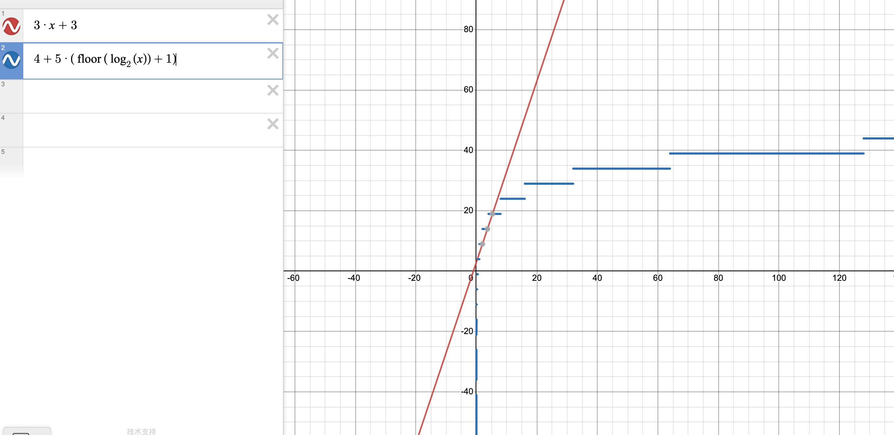


> 大O表示法

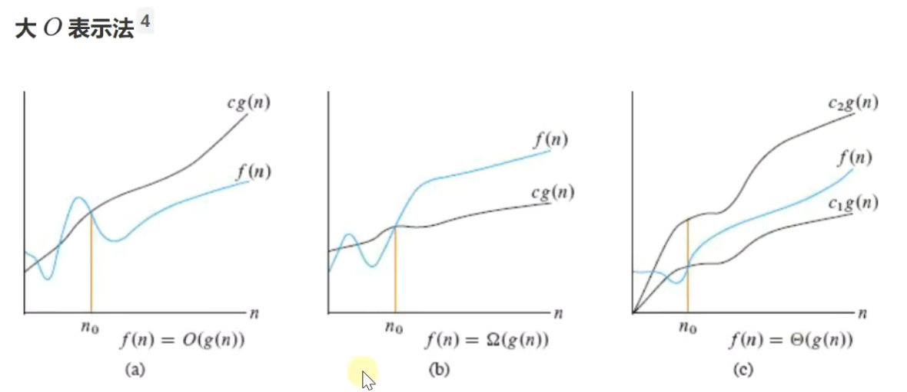

其中

- $c,c_1,c_2$ 都为一个常数
- $f(n)$是实际执行代码行数与$n$的函数
- $g(n)$是经过化简，变化趋势与$f(n)$一致的$n$的函数

找$g(n)$，只找$f(n)$的最高项

***

> **渐进上界 asymptotic upper bound**

`渐进上界`：从某个常数$n_0$开始，$c*g(n)$总是位于$f(n)$上方，那么记作 $O(g(n))$

- 大$O$表示法：代表算法执行的最差情况
- $ 3 * n + 3 ==> O(n)$
- $4 + 5 * f l o o r ( log_2 ( n ) + 1 )==>O(log_2(n))$

> 例子1：

以3 * n + 3线性查找为例(最高项是n)，找它的$g(n) = 4*n$，从上面a图可知大O表示法不用写系数，所以 $ 3 * n + 3 ==> O(n)$

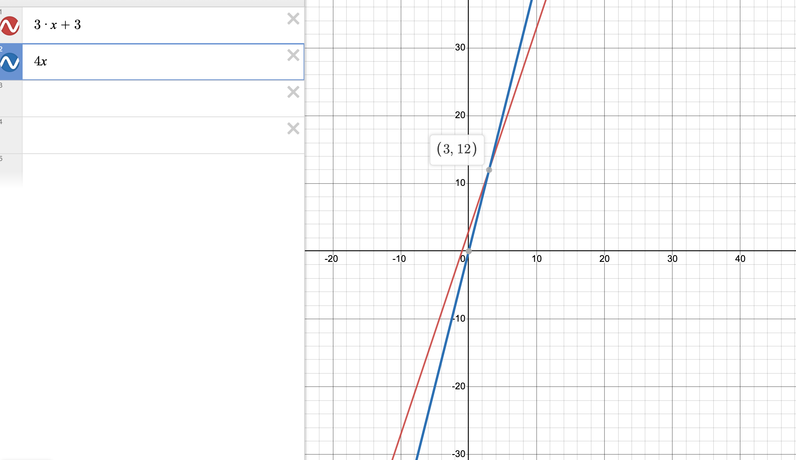

> 例子2：

$4 + 5 * f l o o r ( log_2 ( n ) + 1 )$，先化简原式为：$5 * f l o o r ( log_2 ( n )) + 9$

，找它的$g(n)=log_2(n)$，大O表示法为：$f(n)=O(log_2(n))$

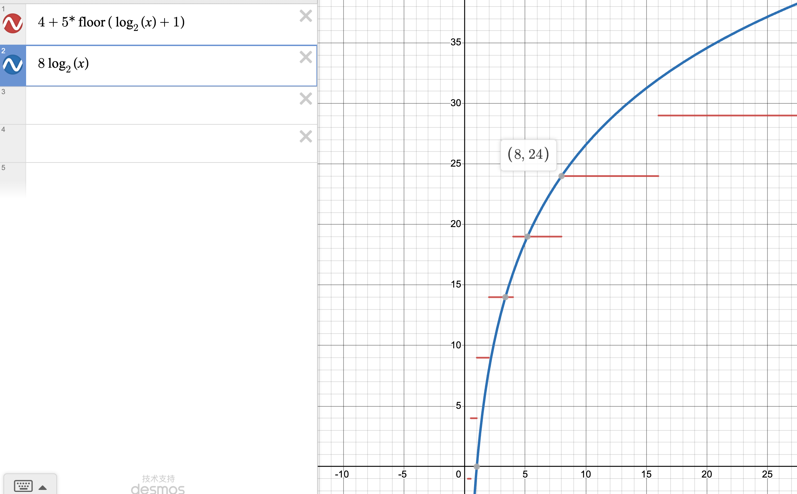

***

> **渐进下界 asymptotic lower bound**

`渐进下界`：从某个常数$n_0$开始，$c*g(n)$总是位于$f(n)$下方，那么记作 $\Omega(g(n))$

- $\Omega$表示法：代表算法执行的最好情况

***

> **渐进紧界 asymptotic tight bounds**

`渐进紧界`：从某个常数$n_0$开始，$f(n)$总在$c_1*g(n)$ 和$c_2*g(n)$之间，那么记作 $\Theta(g(n))$

- $\Theta$表示法：既能代表算法执行的最好情况，也能代表算法的最差情况

***

> 总结

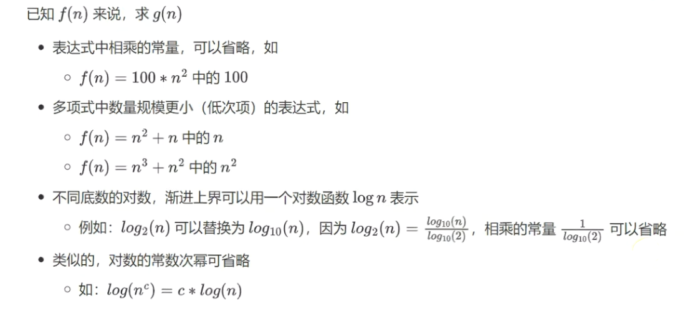

***

> 常见大 O 表示法


按时间复杂度从低到高

- 黑色横线 $O(1)$，常量时间，意味着算法时间并不随数据规模而变化【最优】
- 绿色 $O ( l o g ( n ))$【也紧挨着黑色横线，也很好】
- 蓝色 $O(n)$，线性时间，算法时间与数据规模成正比
- 橙色 $O(n*log(n))$，拟线性时间
- 红色 $O(n^2)$，平方时间
- 黑色朝上 $O(2^n)$ ，指数时间
- 没画出来的 $O(n!)$，阶乘时间

***

##### 1.1.1.3.2 空间复杂度

与**时间复杂度类似**，一般也使用大$O$表示法来衡量：一个算法执行随数据规模增大，而增长的**额外**空间成本（原始数据占用不考虑）

比如上面的二分查找，除了入参，`a` 和 `target`，i、j、m各占用四个字节，那么就是**12个字节**（不会随着循环而增加，会重用空间，栈内存会预先估算出这个方法大概占用多少内存）

**因此二分查找的空间复杂度为$O(1)$**

> 总结二分查找性能

**时间复杂度**

- 最坏情况：$O(log(n))$
- 最好情况：如果待查找元素恰好在数组中央，只需要循环一次$O(1)$

【这里时间复杂度是否可以使用渐进紧界来表示呢？不行，因为渐进紧界$g(n)$是同一个函数】

**空间复杂度**

- 需要常数个指针 $i，j，m$，因此额外占用的空间是$O(1)$

***

> 二分查找

假如while进入了L次，待查找元素在最左边只判断了L次，元素在最右边判断了 2*L次（因为如果在左边，else if不会执行，少做一次判断），因此目标元素在左或者在右边执行效率是不平衡的

```java
/**
 二分查找改动版
 Params: a-待查找的升序数组
 target-待查找的目标值
 Returns:
 找到则返回索引
 找不到返回-1
 * */
public static int binarySearchBasic(int[] a, int target){
    int i = 0, j = a.length - 1;       
    while (i <= j){        
        int m = (i + j) >>> 1; 
        if(target < a[m]){             
            j = m - 1;
        }else if(a[m] < target){         
            i = m + 1;
        }else {
            return m;                 
        }
    }
    return -1;
}
```

#### 1.1.1.4 平衡版

```java
/* 优化后，这里没有了else if，所以每次循环只执行一次if判断，所以现在已经平衡了 */
/**
 二分查找平衡版
 Params: a-待查找的升序数组
 target-待查找的目标值
 Returns:
 找到则返回索引
 找不到返回-1
 * */
public static int binarySearch3(int[] a, int target){
    int i = 0, j = a.length;
    while (1 < j - i){
        int m = (i + j) >>> 1;
        if(target < a[m]){
            j = m;
        }else{
            i = m;
        }
    }
    if(a[i] == target){
        return i;
    }
    return -1;
}
```

> 改成平衡版后，就不存在之前待查找元素恰好在中间第一次就查到时间复杂度为$O(1)$这种情况了，现在时间复杂度都是 $\Theta(log(n))$

***

#### 1.1.1.5 Leftmost

如果存在多个重复元素都是待查找的目标值，那么返回**最左侧**的索引

```java
/**
 二分查找Leftmost
 Params: a-待查找的升序数组
 target-待查找的目标值
 Returns:
 找到则返回索引，如果存在重复的目标值，那么返回最左侧索引
 找不到返回-1
 * */
public static int binarySearchLeftmost(int[] a, int target){
    int i = 0, j = a.length - 1;
    int candidate = -1;
    while (i <= j){
        int m = (i + j) >>> 1;
        if(target < a[m]){
            j = m - 1;
        }else if(a[m] < target){
            i = m + 1;
        }else {
            candidate = m; // 记录候选位置
            j = m - 1;     // 继续向左
        }
    }
    return candidate;
}
```

***

#### 1.1.1.6 Rightmost

如果存在多个重复元素都是待查找的目标值，那么返回**最右侧**的索引

```java
/**
 二分查找Rightmost
 Params: a-待查找的升序数组
 target-待查找的目标值
 Returns:
 找到则返回索引，如果存在重复的目标值，那么返回最右侧索引
 找不到返回-1
 * */
public static int binarySearchRightmost(int[] a, int target){
    int i = 0, j = a.length - 1;
    int candidate = -1;
    while (i <= j){
        int m = (i + j) >>> 1;
        if(target < a[m]){
            j = m - 1;
        }else if(a[m] < target){
            i = m + 1;
        }else {
            candidate = m; // 记录候选位置
            i = m + 1;     // 继续向右
        }
    }
    return candidate;
}
```

***

#### 1.1.1.7 Leftmost 提升

现在不是查询数组中是否包含目标值 target，而是查这个数组中 >= target的最靠左索引值

```java
 /**
  二分查找Leftmost
  Params: a-待查找的升序数组
  target-目标值
  Returns:
  返回 >= target 最靠左的索引值
  * */
 public static int binarySearchLeftmost1(int[] a, int target){
     int i = 0, j = a.length - 1;
     while (i <= j){
         int m = (i + j) >>> 1;
         if(target <= a[m]){
             j = m - 1;
         }else{
             i = m + 1;
         }
     }
     return i;
 }
```

***

#### 1.1.1.8 Rightmost 提升

现在不是查询数组中是否包含目标值 target，而是查这个数组中 <= target的最靠右索引值

```java
  /**
  二分查找Rightmost
  Params: a-待查找的升序数组
  target-待查找的目标值
  Returns:
  返回 <= target 最靠右的索引值
  * */
 public static int binarySearchRightmost1(int[] a, int target){
     int i = 0, j = a.length - 1;
     while (i <= j){
         int m = (i + j) >>> 1;
         if(target < a[m]){
             j = m - 1;
         }else {
             i = m + 1;
         }
     }
     return i - 1;
 }
```

#### 1.1.1.9 总结

通过Leftmost，Rightmost二分查找，我们可以解决很多问题，比如范围查询问题、求排名问题、求前（后）任问题、求最近邻居问题等，以下是解决相应问题的思路


***

## 1.2 数组

### 1.2.1 概述

> 定义

在计算机科学中，数组是由一组元素（值或变量）组成的数据结构，这一组**元素类型都是一致的**，每个元素有至少一个索引或键来标识

***

因为数组内的元素是**连续存储**的，所以数组中元素的地址，可以通过其索引计算出来，例如：

```java
int[] array = {1,2,3,4,5}  // int每个占用四个字节，假如1的地址是b,那么2的地址是b+4,以此类推。
```

知道了数组的**数据**起始地址$BaseAddress$，就可以由公式 $BaseAddress + i * size$计算出索引 $i$元素的地址

- $i$ 即索引，在Java、C等语言都是从0开始
- $size$ 是每个元素占用字节，例如 $int$ 占 4，$double$占8 

***

> 小测试

```java
byte[] array = {1,2,3,4,5} 
```

已知array的数据的起始地址是0x7138f94c8，那么元素 3 的地址是什么？

套用公式：0x7138f94c8 + 2 * 1 = **0x7138f94ca**

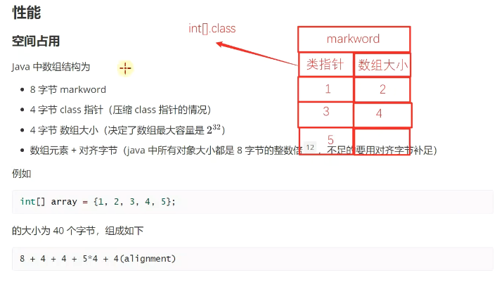

> 随机访问

即根据索引查找元素，时间复杂度是$O(1)$

***

### 1.2.2 动态数组

【**插入、遍历、删除、扩容**，看ArrayList源码就全部了解了，这里不再赘述】

***

### 1.2.3 二维数组

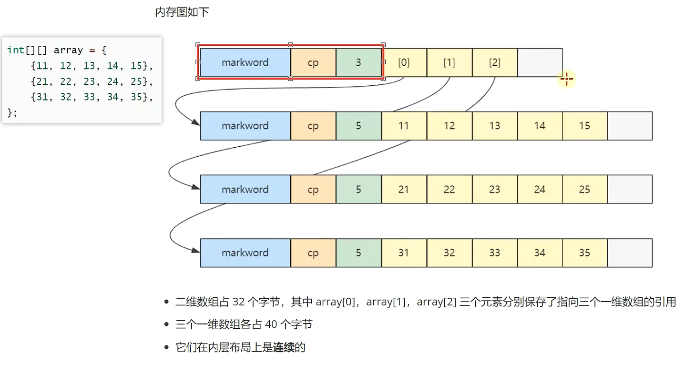

***

### 1.2.4 **局部性原理**

这里只讨论空间局部性

- **cpu** 读取内存（速度慢）数据后，会将其放入高速缓存（速度快）当中，如果后来的计算再用到此数据，在缓存中能读到的话，就不必读内存了
- **缓存**的最小存储单位是**缓存行** （cache line），一般是**64 bytes**，一次读的数据少了不划算啊，因此最少读64 bytes 填满一个缓存行，因此读入某个数据时也会读取其**临近的数据**，这就是所谓**空间局部性**

**补充**：

1.如果读取数据，也将临近的数据读取到缓存中了，但是没有及时的用到，导致后面被新读取的覆盖了，这样就没有**充分利用CPU提高效率**了。

2.缓存加入就是为了提高CPU读写效率，CPU分一级二级三级缓存

> 对效率的影响

比较下面 ij 和 ji 两个方法的执行效率

```java
/* 先遍历行，再遍历列 */
public static void ij(int[][] a, int rows, int columns){
    long sum = 0L;
    for (int i = 0; i < rows; i++) {
        for (int j = 0; j < columns; j++) {
            sum += a[i][j];
        }
    }
}
/* 先遍历列，再遍历行 */
public static void ji(int[][] a, int rows, int columns){
    long sum = 0L;
    for (int j = 0; j < columns; j++) {
        for (int i = 0; i < rows; i++) {
            sum += a[i][j];
        }
    }
}
public void test1() {
    int rows = 1000000;
    int columns = 14;
    int[][] a = new int[rows][columns];
    long start1 = System.currentTimeMillis();
    ij(a,rows,columns);
    long end1 = System.currentTimeMillis();
    System.out.println("ij耗时：" + (end1 - start1)); //ij耗时：12
    long start2 = System.currentTimeMillis();
    ji(a,rows,columns);
    long end2 = System.currentTimeMillis();
    System.out.println("ji耗时：" + (end2 - start2)); //ji耗时：22
}
```

遍历方式不同，效率也不同，这个跟读取缓存有关

```ceylon
cpu     ->     缓存      ->     内存
最快     ->     非常快    ->    较快  
  
cpu需要数据，会先在缓存中找，如果缓存找到，就不用到内存中找，如果缓存找不到才从内存中找。
```

> 分析上面效率

> $ij$方式 

根据上面说的**局部性原理**，如果使用$ij$方式遍历，那么第一次读取 `a[0] [0]` 的元素时，会同时将 `a[0] [0] `以及后面的都读取到缓存中（假设一行全部元素加起来64 bytes刚好一个缓存行），这样之后，下面获取`a[0] [j] `这一行的元素都是从缓存中获取，充分利用了缓存的高效。

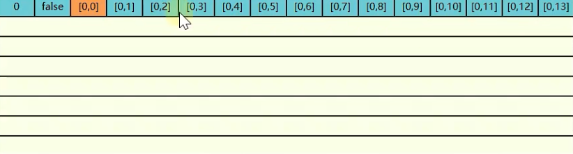

当获取`a[1] [0] `，缓存没有，继续从内存读取到缓存行中

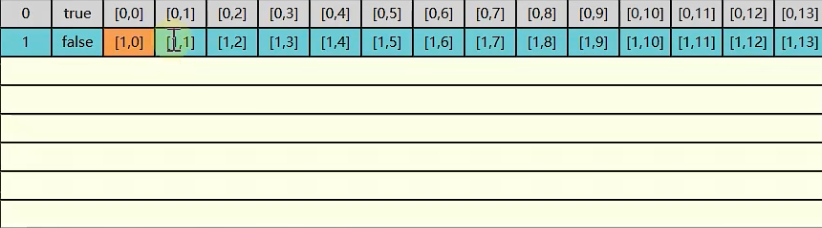

以此类推，所以这是$ij$遍历效率高的原因

> $ji$方式 

第一次读取 `a[0] [0]`


第二次读取`a[1] [0]`，这次读取缓存行没有，第一次读取只是把临近的元素读取到缓存中，所以会再次读取一行到缓存中


以此类推，直到缓存已经放满了

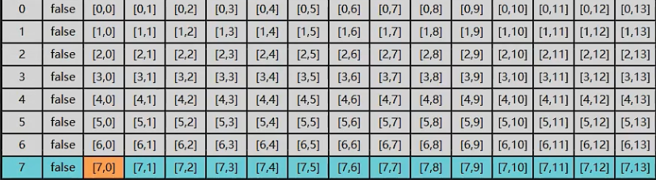

那么继续读取会覆盖

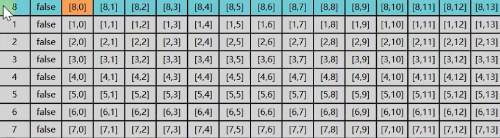

所以当循环要获取`a[0] [1]`时，第一次加入到缓存是有的，但是没用上后面被覆盖了，所以再次读取会继续去内存读取然后加载到缓存中，**这就是为什么 $ji$ 效率低的原因**

***

### 1.2.5 数组性能

`随机访问`即根据索引查找元素，**时间复杂度**是$O(1)$

**数组插入或删除性能**

头部位置，时间复杂度是$O(n)$【需要移动数组】 

中间位置，时间复杂度是$O(n)$【需要移动数组】 

尾部位置，时间复杂度是$O(1)$

***

## 1.3 链表

### 1.3.1 概述

在计算机科学中，链表是数据元素的线性组合，其每个元素都指向下一个元素，**元素存储上并不连续**

可以分类为

- 单向链表，每个元素只知道其下一个元素是谁

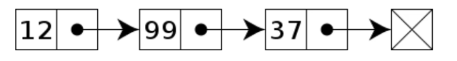

-  双向链表，每个元素知道其下一个元素和下一个元素

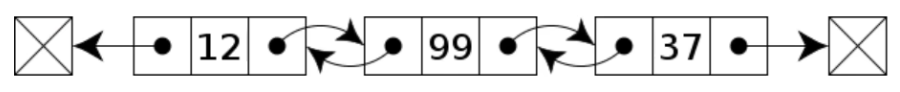

- 循环链表，**循环链表的 tail 指向的是头节点 head **，普通链表尾节点 tail 指向的都是 null

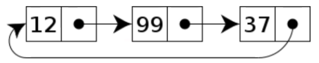

【**插入、遍历、删除、扩容，看**LinkedList源码就全部了解了，这里不再赘述】

***

**补充：LinkedList里面有个Node节点类，为什么不将 Node放到外面作为外部类呢？**

回答：**Node** 给 **LinkedList** 提供服务的，放到LinkedList里面作为内部类，这样使用者就不用知道还有Node这个类了，这样可以**隐藏细节**，并且Node类作为了成员内部类就可以使用**private**修饰，这样外部就更访问不到了，这就体现了**面向对象**的基本**封装**思想了

再补充一个小细节：Node使用的是static静态修饰，那什么时候需要使用static修饰什么情况下不需要呢？如果该内部类使用到了外部类的非静态成员属性时，就不能设置成static。因为Node没有使用外部的非静态成员，因此设计成static最合理。

**总结，当内部类是完全独立的，跟外部类没有任何关系，就可以设置成static**

```java
/* 查找尾部节点 */
private Node findLast(){
  if(head == null)
    return null;
  Node p;
  // 主要学习这个for循环遍历方式
  for(p = head; p.next != null; p = p.next){
    
  }
  return p;
}

/* 尾部添加节点 */
public void addLast(int value){
  Node last = findLast();
  if(last == null)
    addFirst(value);   // 这个方法没有写
  last.next = new Node(value);
}
```

**链表只有遍历时才知道每个元素的索引是多少，遍历时使用index记录当前索引**

***

### 1.3.2 链表性能

`随机访问`根据 index 查找元素，时间复杂度是$O(n)$

**链表插入或删除性能**

头部位置，时间复杂度是$O(1)$ 

中间位置，根据 index 查找时间 + $O(1)$ 

尾部位置，如果已知 tail 尾节点是$O(1)$，不知道 tail 尾节点是$O(n)$

***

## 1.4 递归

### 1.4 1 概述

在计算机科学中，**递归**是一种解决计算问题的方法，其中解决方案取决于同一类问题的更小子集

比如单链表递归遍历的例子：

```java
void f(Node node){
  if(node == null)
    return;
  println("before" + node.value);
  f(node.next);
  println("after" + node.value);
}
```

> 说明

1. 自己调用自己，如果说每个函数对应着一种解决方案，自己调用自己意味着解决方案是一样的（有规律的）
2. 每次调用，函数处理的数据会较上次缩减（子集），而且最后会缩减至无需继续递归
3. 内层函数调用 （子集处理）完成，外层函数才能算调用完成

***

> 伪代码演示递归调用

```java
// 1 -> 2 -> 3 -> null （链表）
void f(Node node = 1){
  println("before:" + node.value);// before:1
    void f(Node node = 2){
      println("before:" + node.value);// before:2
      	void f(Node node = 3){
          println("before:" + node.value);// before:3
            void f(Node node = null){
              if(node == null)
    						return;
            }
          println("after:" + node.value);// after:3
        }
      println("after:" + node.value);// after:2
    }
  println("after:" + node.value);// after:1
}

//输出结果：
before:1
before:2
before:3
after:3
after:2
after:1
```

> 思路

1. 确定能否使用递归求解
2. 推导出递推关系，即父问题与子问题的关系，以及递归的结束条件

例如上面遍历链表的递推关系为：

​                       $f(n)=\begin{cases} 停止，n=null\\ f(n, next)， n\neq null\end{cases}  $


- 深入到最里层叫做**递**
- 从最里层出来叫做**归**
- 在**递**的过程中，外层函数内的局部变量（以及方法参数）并未消失，归的时候还可以用到

***

### 1.4.2 阶乘

用递归方法求阶乘

- 阶乘的定义 $n!=1·2·3···(n-2)·(n-1)·n$，其中$n$为自然数，当然 0！= 1

- 递推关系

​                             $f(n)=\begin{cases} 1，n=1\\ n*f(n-1)， n> 1\end{cases}  $

```java
public int f(int n){
  if(n == 1)
    return 1;
  return n * f(n - 1);
}
```

***

### 1.4.2 反向打印

用递归反向打印字符串，n为字符在整个字符串 str 中的索引位置

递推关系

​                             $f(n)=\begin{cases} 停止，n=str.length()\\ f(n + 1)， 0\leqslant n\leqslant str.length()-1\end{cases}  $

```java
public static void f(int n, String str){
    if(n == str.length())
        return;
    f(n + 1, str);
    System.out.println(str.charAt(n));
}
public void test1() {
    f(2,"hello");
}
// 结果
oll
```

***

### 1.4.3 二分查找

```java
public static int search(int[] a, int target) {
    return f(a, target, 0, a.length - 1);
}
private static int f(int[] a, int target, int i, int j) {
    if(i > j)
        return -1;
    int m = (i + j) >>> 1;
    if(target < a[m]) {
        return f(a, target, i, m - 1);
    }else if(a[m] < target) {
        return f(a, target, m + 1, j);
    }else {
        return m;
    }
}
/* test */
public void test1() {
    int[] a = {2,5,8,14,19,89,102};
    System.out.println(search(a, 102));
}
```

***

### 1.4.4 冒泡排序

```java
public static void sort(int[] a){
    bubble(a, a.length - 1);
}
private static void bubble(int[] a, int j) {
    if(j == 0)
        return;
    for (int i = 0; i < j; i++) {
        if(a[i] > a[i + 1]){
            int temp = a[i];
            a[i] = a[i + 1];
            a[i + 1] = temp;
        }
    }
    bubble(a, j - 1);                           // 递归调用
}
/* test */
public void test1() {
    int[] a = {6, 5, 4, 3, 2, 1};
    sort(a);
    System.out.println(Arrays.toString(a));
}
```

> 改进冒泡排序，如果已经有序了，就提前终止

```java
private static void bubble(int[] a, int j) {
    if(j == 0)
        return;
    int x = 0;                           // 第一处改动
    for (int i = 0; i < j; i++) {
        if(a[i] > a[i + 1]){
            int temp = a[i];
            a[i] = a[i + 1];
            a[i + 1] = temp;
            x = i;                      // 第二处改动
        }
    }
    bubble(a, x);                       // 第三处改动
}
```

***

### 1.4.5 斐波那契

- 之前的例子是每个递归函数只包含一个自身的调用，这称之为 single recursion
- 如果每个递归函数包含多个自身调用，称之为 multi recursion

**递推关系**

​                             $f(n)=\begin{cases} 0，n=0\\ 1， n=1 \\ f(n-1)+f(n-2)， n> 1 \end{cases}  $

```java
private static int f(int n) {
   if(n == 0)
       return 0;
    if(n == 1)
       return 1;
    return f(n - 1) + f(n - 2);
}
```

调用一次 f() 为一次

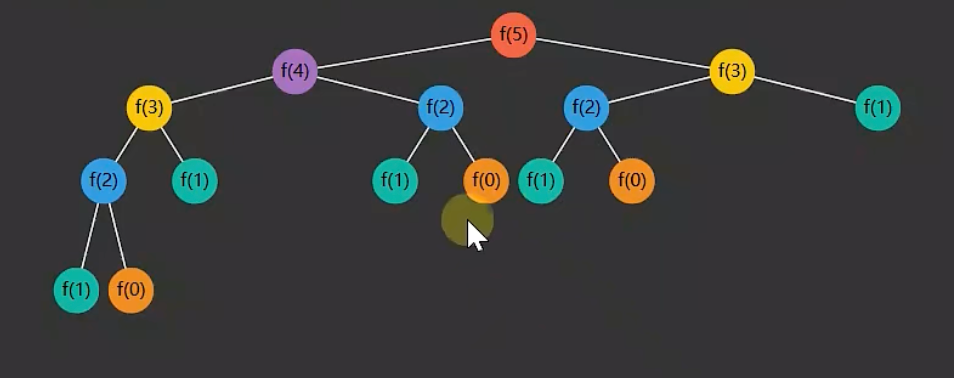

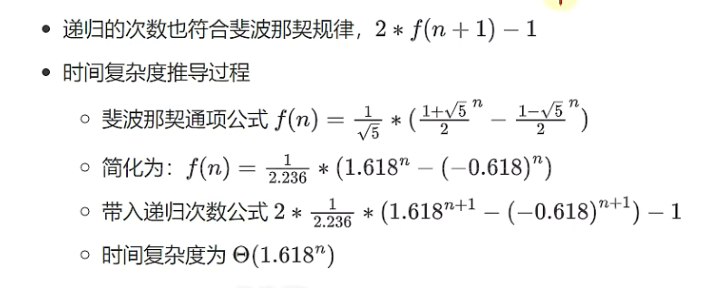

> 优化上面相同颜色重复的计算问题（空间换时间）

**思路：**将计算的结果保存到数组中，然后每次先从数组拿，拿到就不用重复计算，这个方法也被叫做 **Memoization**（**记忆法，也称备忘录**）

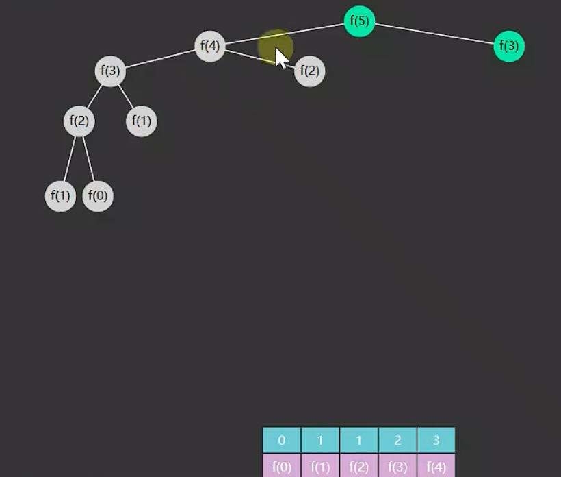

> 使用Memoization改进上面的代码

```java
private static int f(int n, int[] cache) {
    if(cache[n] != -1)
        return cache[n];
    int x = f(n - 1, cache);
    int y = f(n - 2, cache);
    cache[n] = x + y;
    return cache[n];
}
public static int fibonacci(int n) {
    int[] cache = new int[n + 1];
    Arrays.fill(cache, -1);
    cache[0] = 0;
    cache[1] = 1;
    return f(n, cache);
}
public void test1() {
   fibonacci(9)   // 34
}
```

改进后，时间复杂度变成 $O(n)$，代价就是使用了数组，占用了空间复杂度也是 $O(n)$，这就是空间换时间

***

> 例子1 - 青蛙爬楼梯（斐波那契求解）

- 楼梯有n阶
- 青蛙要爬到楼顶，可以一次跳一阶，也可以一次跳两阶
- 只能向上跳，问有多少种跳法

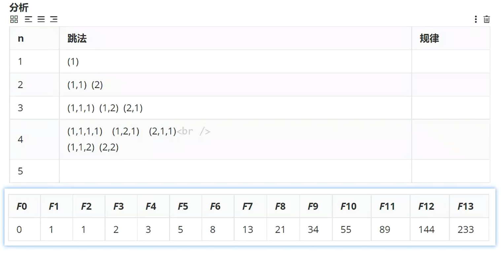

***

### 1.4.6 递归求和(爆栈)

```java
/* n + n-1, ... + 1 */
private static long sum(long n) {
    if(n == 1){
        return 1;
    }
    return sum(n - 1) + n;
}
System.out.println(sum(30000)); // 执行这个太大了，会爆出异常 StackOverflowError 栈溢出异常
// 原因是因为执行一次方法要开一个独立的栈（保存当前的局部变量等信息），递归就是重复开了很多栈，一直不能释放，直到最里面 n = 1,才有返回值，才慢慢向外一层一层释放，开的栈占用内存太大，所以异常了。
```

> 尾调用

如果函数的最后一步是调用一个函数，那么称为尾调用，例如

```java
function a() {
  return b()
}
```

下面三段代码不能叫做尾调用

```java
// 最后一步并非调用函数
function a() {
  const c = b()
  return c
}
// 最后一步虽然调用了函数，但又用到了外层函数的数值1，其实最后一步是加法操作
function a() {
  return b() + 1
}
// 最后一步虽然调用了函数，但又用到了外层函数的变量x
function a(x) {
  return b() + x
}
```

**一些语言**的编译器能够对尾调用做优化，例如下面（注意，java语言没有对尾递归做优化） 

```java
function a() {
  // 做前面的事
  return b()
}

function b() {
   // 做前面的事
  return c()
}

function c() {
  return 1000
}

a()
```

没优化之前的**伪码**（c没有返回之前，a,b都不能结束）

```java
function a() {
  return function b() {
    return function c() {
      return 1000
    }
  }
}
```

优化后的**伪码**（变成了平级调用，a不用等其他结束，a方法就能结束了，提前释放资源）

```java
a()
b()
c()
  
// 解析：a执行完，a都已经把该做的事情做完了，不用等b执行完得到结果要做其他的工作，结果是b提供，因此尾调用编译器可以做这个优化
```

***

### 1.4.7 复杂度计算

**Master theorem 主定理**

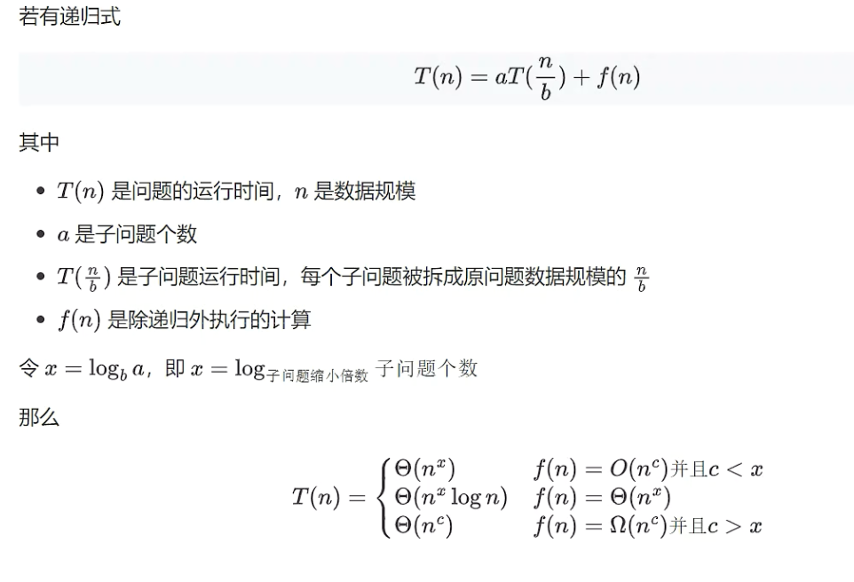

***

> 例1

$T(n)=2T(\frac{n}{2}) + n^4$

- 此时 $x= 1 < 4$，由后者决定整个时间复杂度$\Theta(n^4)$
- 如果觉得对数不好算，可以换为求【$b$ 的几次方能等于 $a$】

***

> 例2

$T(n)=T(\frac{7n}{10}) + n$

- $a=1，b=\frac{10}{7},x=0,c=1$
-  此时$x= 0 < 1$，，由后者决定整个时间复杂度$\Theta(n)$

***

> 例3

$T(n)=16T(\frac{n}{4}) + n^2$

- $a=16，b=4,x=2,c=2$
-  此时$x=2=c$，，时间复杂度$\Theta(n^2log(n)) $

***

> 例4

$T(n)=7T(\frac{n}{3}) + n^2$

- $a=7，b=3,x=1.?,c=2$
-  此时$x=log_37 < c$，，时间复杂度$\Theta(n^2) $

***


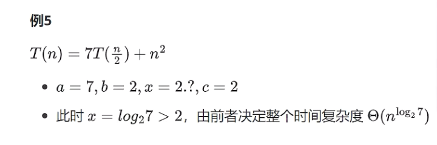

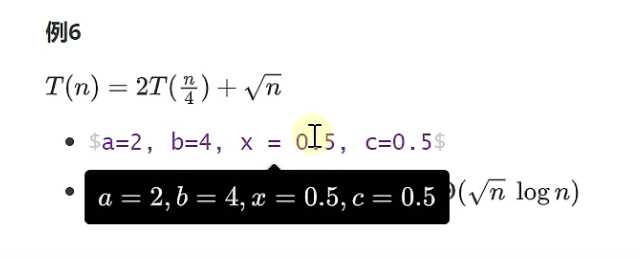

***

> 二分查找递归复杂度计算

```java
private static int f(int[] a, int target, int i, int j) {
    if(i > j)
        return -1;
    int m = (i + j) >>> 1;
    if(target < a[m]) {
        return f(a, target, i, m - 1);
    }else if(a[m] < target) {
        return f(a, target, m + 1, j);
    }else {
        return m;
    }
}
```

- 子问题个数 $a=1$ 
- 子问题数据规模缩小倍数 $b=2$
- 除递归外执行的计算是常熟级 $c=0$

$T(n)=T(\frac{n}{2}) + n^0$

- 此时$x=0=c$，，时间复杂度$\Theta(log(n)) $


**解释 a**：方法里每次又调用了一次本身方法，所以a = 1;

**解释 b**：每次都是从中间值将问题一分为二，所以b = 2;

**解释 c**：除了调用本身方法的语句之外，其他if(i > j)、int m = (i + j) >>> 1; 等跟数据规模无关，所以c = 0;

***

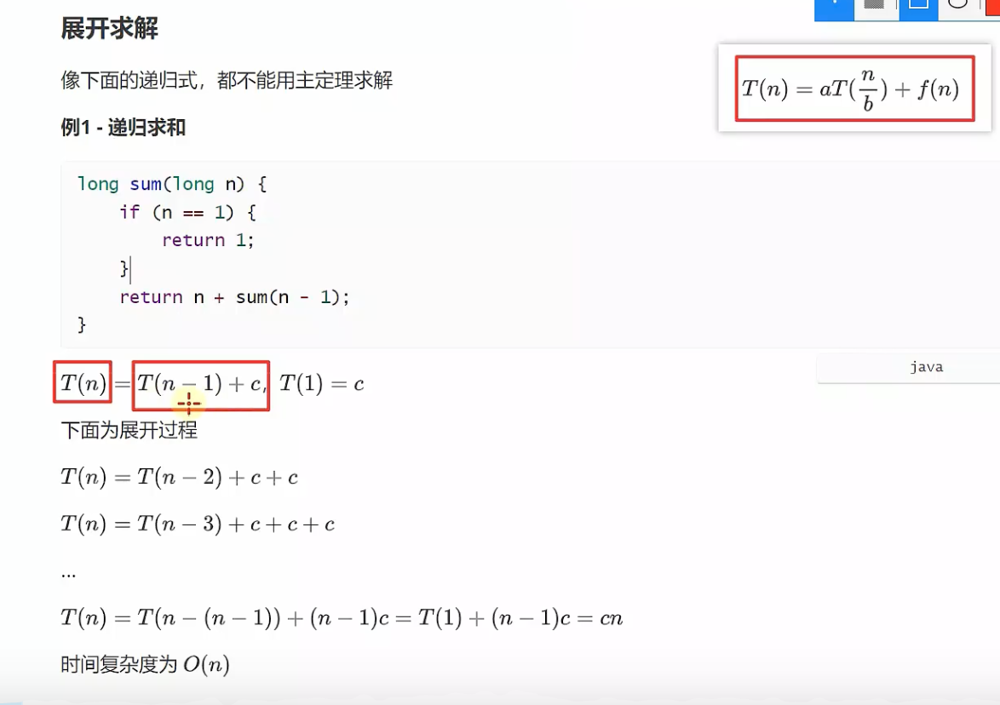

解释c：处理递归之外其他的操作的时间（加法，if判断等跟数据规模没有关系，所以用常数c表示）

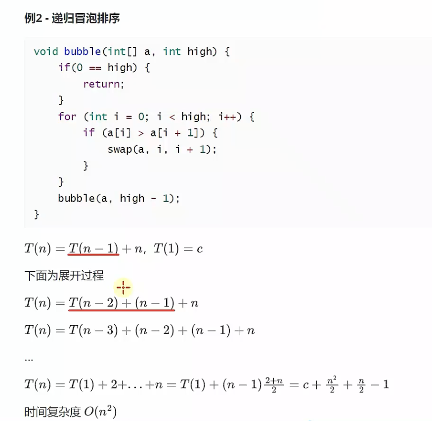

***

## 1.5 队列

### 1.5.1 概述

计算机科学中，queue 是以顺序的方式维护的一组数据集合，在一端添加数据，从另一端移除数据。习惯来说，添加的一端称为**尾**，移除的一端称为**头**，就如同生活中的排队买商品。和链表的区别就是，队列添加只能在尾，移除只能在头，而链表可以在随意位置添加和移除

> 可以使用链表方式实现队列

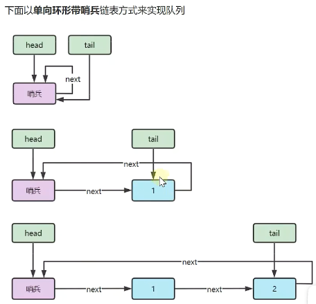


> 环形数组实现

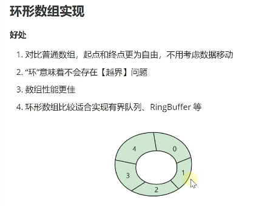

如果使用普通数组（0索引为头，因为添加元素是从0索引开始的）在尾部新增元素，时间复杂度$O(1)$，但是如果在头部移除元素，那么后面的元素都要向前移动一位时间复杂度$O(n)$

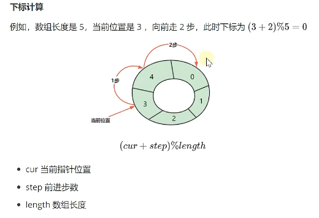

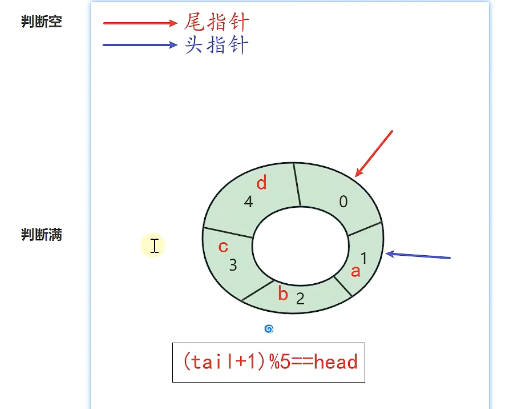


***

### 1.5.2 优先级队列

#### 1.5.2.1 堆实现

删除优先级最高的元素时，先将0索引的位置和最后一个索引位置交换，因为删除在数组尾节点时间复杂度时$O(1)$

【看集合PriorityQueue类的源码】

***

## 1.6 栈

> 概述

计算机科学中，**stack** 是一种线性的数据结构，只能在其一端添加数据和移除数据。习惯来说，这一端称之为**栈顶**，另一端不能操作数据的称之为**栈底**

***

> 链表实现

略

> 数组实现

看集合Stack类的源码

***

`力扣20.有效的括号`

`力扣120.逆波兰表达式求值`

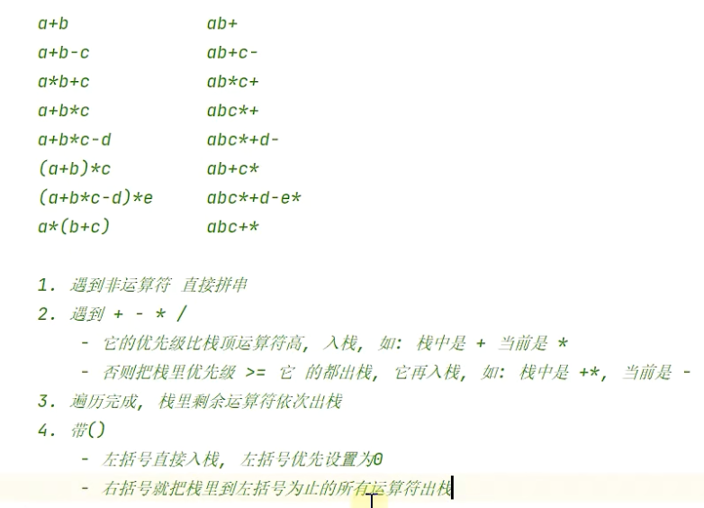

> 双端队列

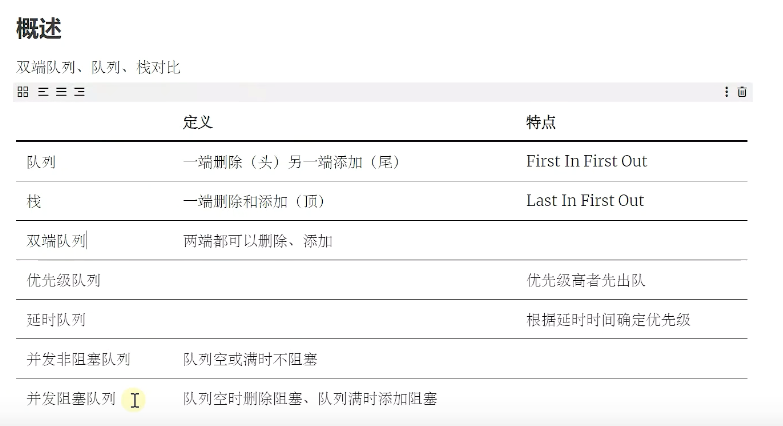

***

> 小技巧：可以用线程的方式来进行Debug

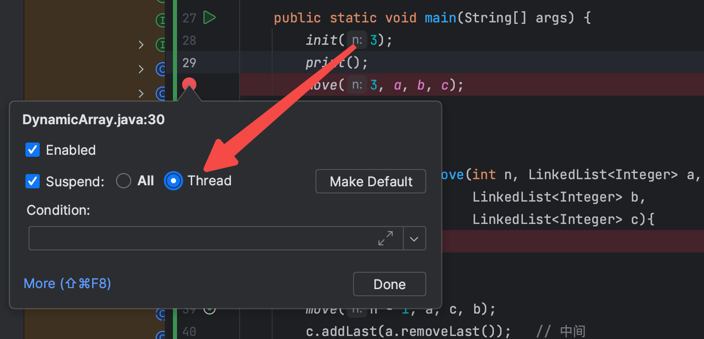

***

## 1.7 堆

**博客：[堆](https://blog.csdn.net/m0_69323023/article/details/132834448)**

> 堆的概念

1、堆在逻辑上是一颗**完全二叉树**（分叉了，所以是非线形结构，数组，链表那些都是线形结构，一条往下的）

2、堆的实现利用的是**数组**，我们通常会利用**动态数组**来存放元素，这样可以快速拓容也不会很浪费空间，我们是将这颗**完全二叉树**用层序遍历的方式储存在数组里的。

3、堆有两种分别是**大根堆**和**小根堆** 

***

> 特征

- 如果从索引0开始存储节点数据
  - 节点 $i$ 的父节点为 $floot((i-1)/2)$，当 $i > 0$ 时
  -  节点 $i$ 的左子节点为 $2i+1$，右子节点为 $2i+2$，当然他们得  $< size$ 
- 如果从索引1开始存储节点数据
  - 节点 $i$ 的父节点为 $floot(i/2)$，当 $i > 1$ 时
  -  节点 $i$ 的左子节点为 $2i$，右子节点为 $2i+1$，同样得  $< size$ 


***

### 1.7.1 大根堆（大顶堆）

大根堆就是整个**完全二叉树**，**任意一个根节点的值都比左右子树的值大**


这就是一个大根堆，所有根节点的值永远比左右子树的大，那么就可以看出，整棵树的根节点，他的值是整个堆中最大的。同时我们也发现没有直接父子关系的节点他们的值没有完全地关系，就像第二层的33和第三层的45以及20，没有规定第三层的元素值必须小于第二层，只要满足根节点比自己左右子树节点的值大即可

***

### 1.7.2   小根堆（小顶堆）

**小根堆**表示整个完全二叉树，**任意一个根节点的值都比左右子树的值小**


以上就是一个简单地小根堆它的定义与大根堆相似，只是跟节点的值小于自己的左右节点的值，同时小根堆的**层与层之间没有直接关系的节点的值也没有必然的大小关系**

***

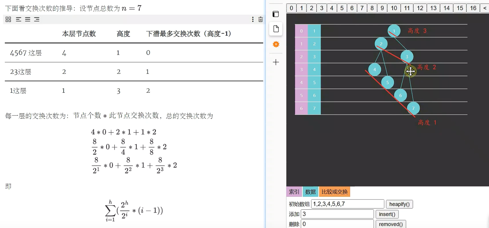


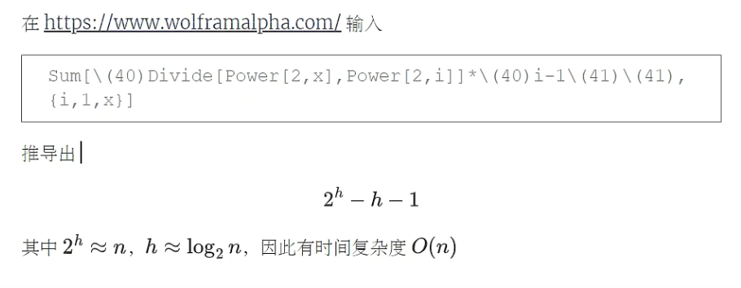

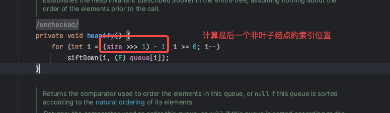


`力扣215.数组中的第k个最大元素`

`力扣703.数据流中的第k大元素`

***

## 1.8 二叉树

> 遍历

遍历也分为两种

1. **广度优先遍历（Breadth-first order）**：尽可能先访问距离根最近的节点，已称为**层序遍历**
2. **深度优先遍历（Depth-first order）**：对于二叉树，可以进一步分成三种
   1. **pre-order 前序遍历**：先访问该节点，然后是左子树，最后是右子树
   2. **in-order 中序遍历**：先访问左子树，然后是该节点，最后是右子树
   3. **pre-order 后序遍历**：先访问左子树，然后是右子树，最后是该节点

***

### 1.8.1 广度优先遍历

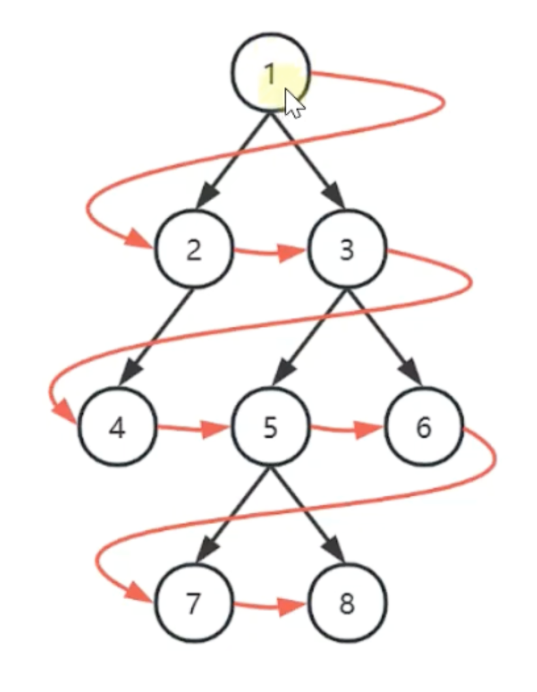

优先级队列中，使用堆实现，堆用的就是数组，遍历这个索引实际就是**广度优先遍历**，这里不做代码演示。

***

### 1.8.2 深度优先遍历

#### 1.8.2.1 递归方式

```java
/**
 * 树节点类
 * */
static class TreeNode{
    public int val;
    public TreeNode left;
    public TreeNode right;
    public TreeNode(int val){
        this.val = val;
    }
    public TreeNode(TreeNode left, int val, TreeNode right){
        this.left = left;
        this.val = val;
        this.right = right;
    }
    @Override
    public String toString() {
        return String.valueOf(this.val);
    }
}
```

> 前序遍历

```java
static void preOrder(TreeNode node){
    if(node == null){
        return;
    }
    System.out.print(node.val + "\t");
    preOrder(node.left);
    preOrder(node.right);
}
```

> 中序遍历

```java
static void inOrder(TreeNode node){
    if(node == null){
        return;
    }
    inOrder(node.left);
    System.out.print(node.val + "\t");
    inOrder(node.right);
}
```

> 后序遍历

```java
static void postOrder(TreeNode node){
    if(node == null){
        return;
    }
    postOrder(node.left);
    postOrder(node.right);
    System.out.print(node.val + "\t");
}
```

> Test

```java
public static void main(String[] args) {
    /*
               1
              / \
             2   3
            /   / \
           4   5   6
     */
    TreeNode root = new TreeNode(
            new TreeNode(new TreeNode(4),2,null),
            1,
            new TreeNode(new TreeNode(5),3,new TreeNode(6)));
    preOrder(root);           //前序
    System.out.println();
    inOrder(root);            //中序
    System.out.println();
    postOrder(root);          //后序
}
```

***

#### 1.8.2.2 非递归方式

> 下面代码就实现了前序和中序的遍历

```java
public static void main(String[] args) {
    /*
               1
              / \
             2   3
            /   / \
           4   5   6
     */
    TreeNode root = new TreeNode(
            new TreeNode(new TreeNode(4),2,null),
            1,
            new TreeNode(new TreeNode(5),3,new TreeNode(6)));
    LinkedList<TreeNode> stack = new LinkedList<>();
    TreeNode curr = root;
    while(curr != null || !stack.isEmpty()) {
        if(curr != null) {
              System.out.println("去：" + curr.val);
            stack.push(curr);   // 压入栈，为了记住回来的路
            curr = curr.left;
        }else{
            TreeNode pop = stack.pop();
            System.out.println("回：" + pop.val);
            curr = pop.right;
        }
    }
}
// 所有打印去的值就是“前序遍历”
// 所有打印回的值就是“中序遍历”
```

> 实现后序遍历

```java
public static void main(String[] args) {
    /*
               1
              / \
             2   3
            /   / \
           4   5   6
     */
    TreeNode root = new TreeNode(
            new TreeNode(new TreeNode(4),2,null),
            1,
            new TreeNode(new TreeNode(5),3,new TreeNode(6)));
    LinkedList<TreeNode> stack = new LinkedList<>();
    TreeNode curr = root;
    TreeNode pop = null; //最近一次弹栈的元素
    while(curr != null || !stack.isEmpty()) {
        if(curr != null) {
            // System.out.println("去：" + curr.val);
            stack.push(curr);   // 压入栈，为了记住回来的路
            curr = curr.left;
        }else {
            TreeNode peek = stack.peek();   // 栈顶元素
            if(peek.right == null || peek.right == pop) {   // 右子树处理完成
                pop = stack.pop();
                System.out.println("回：" + pop.val);
            }else {
                curr = peek.right;
            }
        }
    }
}

// 回打印的就是后序遍历
```

上面的代码**前序**和**中序**是统一的，但是**后序**是单独一套，能否三个统一成一个模板，将来只需用同一个模板就行了呢？可以的，下面开始编写代码

```java
private static void colorPrintln(String origin, int color){
    System.out.printf("\033[%dm%s\033[0m%n", color, origin);
}

public static void main(String[] args) {
    /*
               1
              / \
             2   3
            /   / \
           4   5   6
     */
    TreeNode root = new TreeNode(
            new TreeNode(new TreeNode(4),2,null),
            1,
            new TreeNode(new TreeNode(5),3,new TreeNode(6)));
    LinkedList<TreeNode> stack = new LinkedList<>();
    TreeNode curr = root;
    TreeNode pop = null;
    while(curr != null || !stack.isEmpty()) {
        if(curr != null) {
            stack.push(curr);
            // 待处理左子树
            colorPrintln("前：" + curr.val, 31);  // 31 红色
            curr = curr.left;
        }else {
            TreeNode peek = stack.peek();
            // 没有右子树
            if(peek.right == null) {
                colorPrintln("中：" + peek.val, 36);  // 36 绿色
                pop = stack.pop();
                colorPrintln("后：" + pop.val, 34);  // 34 蓝色
            }
            // 右子树处理完成
            else if(peek.right == pop) {
                pop = stack.pop();
                colorPrintln("后：" + pop.val, 34);
            }
            // 待处理右子树
            else {
                colorPrintln("中：" + peek.val, 36);
                curr = peek.right;
            }
        }
    }
}

// 前序： 1 2 4 3 5 6
// 中序： 4 2 1 5 3 6
// 后序： 4 2 5 6 3 1
```

`力扣94.二叉树的中序遍历和145题`

***

### 1.8.3 对称二叉树

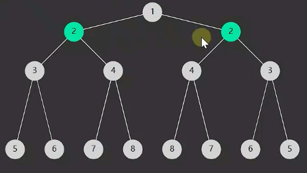


> 校验二叉树是否是对称二叉树

```java
public static boolean isSymmetric(TreeNode root){
    return check(root.left, root.right);
}
private static boolean check(TreeNode left, TreeNode right) {
    if(left == null && right == null) {
        return true;
    }
    // 有了上面的判断，到这里 left 和 right 肯定不能同时为 null
    if(right == null || left == null) {
        return false;
    }
    if(left.val != right.val) {
        return false;
    }
    return check(left.left, right.right) && check(left.right, right.left);
}

public static void main(String[] args) {
    // 对称
    TreeNode root1 = new TreeNode(
            new TreeNode(new TreeNode(3),2,new TreeNode(4)),
            1,
            new TreeNode(new TreeNode(4),2,new TreeNode(3)));
    System.out.println(isSymmetric(root1));  // true
    // 非对称
    TreeNode root2 = new TreeNode(
            new TreeNode(new TreeNode(3),2,new TreeNode(4)),
            1,
            new TreeNode(new TreeNode(3),2,new TreeNode(4)));
    System.out.println(isSymmetric(root2)); // false
}
```

***

### 1.8.4 二叉树的深度

#### 1.8.4.1 最大深度

得到左子树深度，得到右子树深度，二者最大者加一，就是本节点深度

> 方式一：递归方式

```java
/* Test */
TreeNode root1 = new TreeNode(
     new TreeNode(new TreeNode(4),2,new TreeNode(new TreeNode(7),5,null)),
     1,
     new TreeNode(null,3,new TreeNode(6)));
System.out.println(maxDepth(root1));

public static int maxDepth(TreeNode node){
    if(node == null){
        return 0;
    }
    int d1 = maxDepth(node.left);
    int d2 = maxDepth(node.right);
    return Integer.max(d1,d2) + 1;
}
```

> 方式二：非递归方式

```java
/*
   思路：
   1. 使用非递归后序遍历，栈的最大高度即为最大深度
* */
public static int maxDepth(TreeNode root){
    TreeNode curr = root;
    TreeNode pop = null;
    LinkedList<TreeNode> stack = new LinkedList<>();
    int max = 0;  // 栈的最大高度
    while(curr != null || !stack.isEmpty()){
        if(curr != null){
            stack.push(curr);
            int size = stack.size();
            if(size > max){
                max = size;
            }
            curr = curr.left;
        }else{
            TreeNode peek = stack.peek();
            if(peek.right == null || peek.right == pop){
                pop = stack.pop();
            }else{
                curr = peek.right;
            }
        }
    }
    return max;
}
```

***

#### 1.8.4.2 最小深度

略。

***

### 1.8.5 翻转二叉树

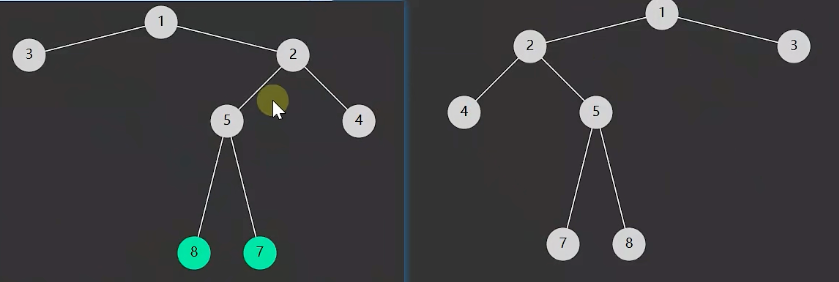

```java
public static void fn(TreeNode node){
    if(node == null)
        return;
    TreeNode t = node.left;
    node.left = node.right;
    node.right = t;
    fn(node.left);
    fn(node.right);
}
```

***

### 1.8.6 根据遍历结果构造二叉树

> 前序中序

```java
/*
    前序：preOrder = {1,2,4,3,6,7}
    中序：inOrder = {4,2,1,6,3,7}
             1
            / \
           2   3
          /   / \
         4   6   7
 */
public static void main(String[] args) {
    int[] preOrder = {1,2,4,3,6,7};
    int[] inOrder = {4,2,1,6,3,7};
    TreeNode treeNode = buildTree(preOrder, inOrder);
    System.out.println(treeNode);
}
/* 这个方法求解的前提是，节点内容不能重复 */
public static TreeNode buildTree(int[] preOrder, int[] inOrder){
    if (preOrder.length == 0)
        return null;
    // 创建根节点
    int rootValue = preOrder[0];
    TreeNode root = new TreeNode(rootValue);
    // 区分左右子树
    for (int i = 0; i < inOrder.length; i++) {
        if (inOrder[i] == rootValue) {
            int[] inLeft = Arrays.copyOfRange(inOrder, 0, i);  //[4,2]
            int[] inRight = Arrays.copyOfRange(inOrder, i + 1, inOrder.length);  //[6,3,7]
            int[] preLeft = Arrays.copyOfRange(preOrder, 1, i + 1);  //[2,4]
            int[] preRight = Arrays.copyOfRange(preOrder, i + 1, inOrder.length);  //[3,6,7]
            root.left = buildTree(preLeft, inLeft);
            root.right = buildTree(preRight, inRight);
            break;
        }
    }
    return root;
}
```

> 中序后序

```java
public static TreeNode buildTree(int[] inOrder, int[] postOrder){
    if (inOrder.length == 0)
        return null;
    // 创建根节点
    int rootValue = postOrder[postOrder.length - 1];
    TreeNode root = new TreeNode(rootValue);
    // 区分左右子树
    for (int i = 0; i < inOrder.length; i++) {
        if (inOrder[i] == rootValue) {
            int[] inLeft = Arrays.copyOfRange(inOrder, 0, i);
            int[] inRight = Arrays.copyOfRange(inOrder, i + 1, inOrder.length);
            int[] postLeft = Arrays.copyOfRange(postOrder, 0, i);
            int[] postRight = Arrays.copyOfRange(postOrder, i, postOrder.length - 1);  
            root.left = buildTree(inLeft, postLeft);
            root.right = buildTree(inRight, postRight);
            break;
        }
    }
    return root;
}
```

***

> 基础数据结构总结

从现有的数据结构中查找一个元素，都是线形结构，效率不高。如果需求是实现更快速的查找，那么就需要引入新的算法或新的数据结构了。

`补充：`二分查找效率也不错，但是有前提条件，需要先将数组排序，这个排序成本很高，得不偿失。

那么不使用数组了，可以使用`二叉搜索树`。

***

# 2 基础算法

## 2.1查找算法

### 2.1.1 二叉搜索树

1. 树节点增加 key 属性，用来比较谁大谁小，**key 不可以重复**。
2. 对于任意一个树节点，它的 key 比左子树的 key 都大，同时也比右子树的 key 都小（意思就是不能存在重复元素）。

> 最差的情况

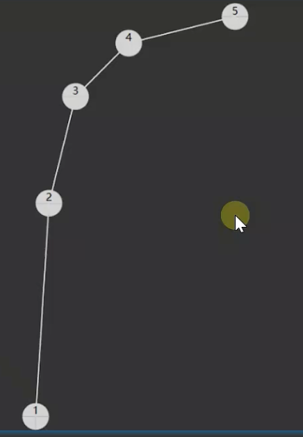

这种树效率又下降了变成 $O(n)$

细节：二叉搜索树，中序遍历就是从小到大排序的

***

> 查找节点的前驱节点

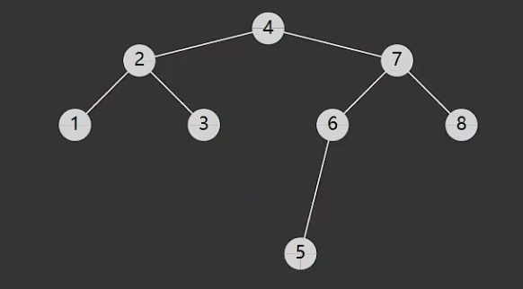

1. 节点**有左子树**，此时前驱节点就是左子树的最大值，上面图中属于这种情况的是
   - 2 的前驱是 1
   - 4 的前驱是 3
   - 6 的前驱是 5
   - 7 的前驱是 6
2. 节点**没有左子树**，若离它最近的祖先自从左而来，此祖先即为前驱，如：
   - 3 的的祖先 2 自左而来，前驱 2
   - 5 的的祖先 4 自左而来，前驱 4
   - 8 的的祖先 7 自左而来，前驱 7
   - 1 没有这样的祖先 ，前驱 null

***

> 查找节点的后继节点

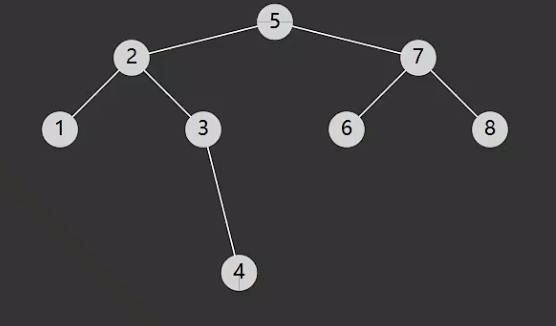

1. 节点**有右子树**，此时前驱节点就是右子树的最小值，上面图中属于这种情况的是
   - 2 的后继是 3
   - 3 的后继是 4
   - 5 的后继是 6
   - 7 的后继是 8
2. 节点**没有右子树**，若离它最近的祖先自从右而来，此祖先即为后继，如：
   - 1 的的祖先 2 自右而来，后继 2
   - 4 的的祖先 5 自右而来，后继 5
   - 6 的的祖先 7 自右而来，后继 7
   - 8 没有这样的祖先 ，后继 null

***

> 删除节点

1. 删除节点没有**左**孩子，将**右**孩子托孤给 **Parent**
2. 删除节点没有**右**孩子，将**左**孩手托孤给 **Parent**
3. 删除节点**左右**孩子都没有，已经被涵盖在情況1、情况2当中，把null托孤给 **Parent**
4. 删除节点**左右**孩子都有，可以将它的后继节点（称为**S**）托孤给**Parent**，再称 **S** 的父亲为 **SP**，又分两种情况
   1. **SP** 就是被删除节点，此时 **D** 与 **S** 紧邻，只需将 **S** 托孤给 **Parent**
   2. **SP** 不是被删除节点，此时 **D** 与 **S** 不相邻，此时需要将 **S** 的后代托孤给 **SP**，再将 **S** 托孤给 **Parent**

***

> 搜索树类

```java
public class BSTTree1 {
    BSTNode root;
    /**
     * 查找关键字对应的值(递归方式)
     * */
//    public Object get(int key) {
//        return doGet(root, key);
//    }
//    private Object doGet(BSTNode node, int key) {
//        if (node == null) {
//            return null;  //没找到
//        }
//        if (key < node.key) {
//            return doGet(node.left, key);
//        } else if (node.key < key) {
//            return doGet(node.right, key);
//        } else {
//            return node.value;  //找到了
//        }
//    }
    /**
     * 查找关键字对应的值(循环方式)
     * */
    public Object get(int key) {
        BSTNode node = root;
        while (node != null) {
            if (key < node.key) {
                node = node.left;
            }else if (node.key < key) {
                node = node.right;
            }else {
                return node.value;
            }
        }
        return null;
    }
    /* 节点类 */
    static class BSTNode {
        int key;
        Object value;
        BSTNode left;
        BSTNode right;
        public BSTNode(int key) {
            this.key = key;
        }
        public BSTNode(int key, Object value) {
            this.key = key;
            this.value = value;
        }
        public BSTNode(int key, Object value, BSTNode left, BSTNode right) {
            this.key = key;
            this.value = value;
            this.left = left;
            this.right = right;
        }
    }
}
```

```java
public class TestBSTTree1 {
    public static BSTTree1 createTree() {
        /*
                        4
                       /  \
                      2    6
                    / \    / \
                   1   3  5   7
         */
        BSTTree1.BSTNode n1 = new BSTTree1.BSTNode(1, "张无忌");
        BSTTree1.BSTNode n3 = new BSTTree1.BSTNode(3, "宋青书");
        BSTTree1.BSTNode n2 = new BSTTree1.BSTNode(2, "周芷若", n1, n3);
        BSTTree1.BSTNode n5 = new BSTTree1.BSTNode(5, "说不得");
        BSTTree1.BSTNode n7 = new BSTTree1.BSTNode(7, "殷离");
        BSTTree1.BSTNode n6 = new BSTTree1.BSTNode(6, "赵敏", n5, n7);
        BSTTree1.BSTNode root = new BSTTree1.BSTNode(4, "小昭", n2, n6);
        BSTTree1 tree = new BSTTree1();
        tree.root = root;
        return tree;
    }
    public static void main(String[] args) {
        BSTTree1 tree = createTree();
        System.out.println(tree.get(7));
    }
}
```

因为 key 需要进行比较，所以使用 int ，但是 key 能否其它类型呢，可以的，下面使用泛型改进。

***

> 将 BSTTree2 中的成员方法单独写出来，方便学习

```java
public class BSTTree2<K extends Comparable<K>,V> {
   BSTNode<K,V> root;
  // 查找关键字对应的值(循环方式)
  public V get(K key) {...}
  // 查找最小关键字对应的值
  public V min() {...}
  // 查找最大关键字对应的值
  public V max() {...}
  // 存储关键字和对应的值
  public void put(K key, V value) {...}
  // 查找关键字的前任值
  public Object predecessor(K key) {...}
  // 查找关键字的后任值
  public Object successor(K key) {...}
  // 删除-(非递归和递归）
  public Object delete(K key) {...}
  // 找 < key 的所有 value
  public List<V> less(K key) {...}
  // 找 > key 的所有 value
  public List<V> greater(K key) {...}
  // 找 >= key1 且 <= key2 的所有 value
  public List<V> between(K key1, K key2) {...}
  
   /* 节点类 */
   static class BSTNode<K,V> {
       K key;
       V value;
       BSTNode<K,V> left;
       BSTNode<K,V> right;
       public BSTNode(K key) {
           this.key = key;
       }
       public BSTNode(K key, V value) {
           this.key = key;
           this.value = value;
       }
       public BSTNode(K key, V value, BSTNode left, BSTNode right) {
           this.key = key;
           this.value = value;
           this.left = left;
           this.right = right;
       }
   }
```

> 1、get 查找关键字对应的值(循环方式)

```java
public V get(K key) {
    // 这里可以优化 key 可能null
    BSTNode<K,V> p = root;
    while (p != null) {
        int result = key.compareTo(p.key);
        if (result < 0) {
            p = p.left;
        } else if (result > 0) {
            p = p.right;
        } else {
            return p.value;
        }
    }
    return null;
}
```

> 2、min 查找最小关键字对应的值(递归版和非递归版)

```java
/* 递归版 */
  public V min() {
      return doMin(root);
  }
  private V doMin(BSTNode<K,V> node) {
      if (node == null) {
          return null;
      }
      if (node.left == null) {
          return node.value;
      }
      return doMin(node.left);
  }
/* 非递归版 */
public V min() {
    return min(root);
}
public V min(BSTNode node) {
    if (node == null) {
        return null;
    }
    BSTNode<K,V> p = node;
    while (p.left != null) {
        p = p.left;
    }
    return p.value;
}
```

> 3、max 查找最大关键字对应的值

```java
// 查找最大关键字对应的值
public V max() {
  return max(root);
}
public V max(BSTNode node) {
    if (node == null) {
        return null;
    }
    BSTNode<K,V> p = node;
    while (p.right != null) {
        p = p.right;
    }
    return p.value;
}
```

> 4、put 存储关键字和对应的值

```java
public void put(K key, V value) {
    BSTNode<K,V> p = root;
    BSTNode<K,V> parent = null;
    while (p != null) {
        parent = p;
        int result = key.compareTo(p.key);
        if (result < 0) {
            p = p.left;
        } else if (result > 0) {
            p = p.right;
        } else {
            // 1.key 存在 更新
            p.value = value;
            return;
        }
    }
    // 2.key 不存在 新增
    if(parent == null){
        root = new BSTNode<>(key,value);
        return;
    }
    int result = key.compareTo(parent.key);
    if (result < 0) {
        parent.left = new BSTNode<>(key,value);
    } else {
        parent.right = new BSTNode<>(key,value);
    }
    new BSTNode(key,value);
}
```

> 5、predecessor 查找关键字的前任值

```java
public Object predecessor(K key) {
    BSTNode<K,V> p = root;
    BSTNode<K,V> ancestorFromLeft = null;
    while (p != null) {
        int result = key.compareTo(p.key);
        if (result < 0) {
            p = p.left;
        } else if (result > 0) {
            ancestorFromLeft = p;
            p = p.right;
        } else {
            break;
        }
    }
    // 没找到节点
    if (p == null) {
        return null;
    }
    // 找到节点
    // 情况1：节点有左子树，此时前任就是左子树的最大值
    if (p.left != null) {
        return max(p.left);
    }
    // 情况2：节点没有左子树，则离它最近，自左而来的祖先就是前任
    return ancestorFromLeft != null ? ancestorFromLeft : null;
}
```

> 6、successor 查找关键字的后任值

```java
public Object successor(K key) {
    BSTNode<K,V> p = root;
    BSTNode<K,V> ancestorFromRight = null;
    while (p != null) {
        int result = key.compareTo(p.key);
        if (result < 0) {
            ancestorFromRight = p;
            p = p.left;
        } else if (result > 0) {
            p = p.right;
        } else {
            break;
        }
    }
    if (p == null) {
        return null;
    }
    if (p.right != null) {
        return min(p.right);
    }
    return ancestorFromRight != null ? ancestorFromRight.value : null;
}
```

> 7.1、delete 删除关键字（非递归）

```java
public Object delete(K key) {
    BSTNode<K,V> p = root;
    BSTNode<K,V> parent = null;
    while (p != null) {
        int result = key.compareTo(p.key);
        if (result < 0) {
            parent = p;
            p = p.left;
        } else if (result > 0) {
            parent = p;
            p = p.right;
        } else {
            break;
        }
    }
    if (p == null) {
        return null;
    }
    // 删除操作
    if (p.left == null) {
        // 情况1 或 情况3
        shift(parent, p, p.right);
    } else if (p.right == null) {
        // 情况2 或 情况3
        shift(parent, p, p.left);
    } else {
        // 情况4
        // 4.1 被删除节点找后继
        BSTNode s = p.right;
        BSTNode sParent = p;   // 后继父亲
        while (s.left != null) {
            sParent = s;
            s = s.left;
        }
        // 后继节点为 S
        if (sParent != p) {  // 不相邻
            // 4.2 删除和后继不相邻，处理后继的后事
            shift(sParent, s, s.right);  // 执行到这不可能有左孩子
            s.right = p.right;
        }
        // 4.3 后继取代被删除节点
        shift(parent, p, s);
        s.left = p.left;
    }
    return p.value;
}
```

> 7.2、delete 删除关键字（递归）

```java
/**
 * 递归删除版
 */
private BSTNode doDelete(BSTNode<K,V> node, K key, ArrayList<V> list) {
    if (node == null) {
        return null;
    }
    int result = key.compareTo(node.key);
    if (result < 0) {
        node.left = doDelete(node.left, key, list);
        return node;
    }
    if (result > 0) {
        node.right = doDelete(node.right, key, list);
        return node;
    }
    list.add(node.value);
    // 找到删除的节点
    // 情况1 - 只有右孩子
    if (node.left == null) {
        return node.right;
    }
    // 情况2 - 只有左孩子
    if (node.right == null) {
        return node.left;
    }
    // 情况3 - 有两个孩子
    BSTNode<K,V> s = node.right;
    while (s.left != null) {
        s = s.left;
    }
    s.right = doDelete(node.right, s.key, new ArrayList<>());
    s.left = node.left;
    return s;
}

public V delete(K key) {
    ArrayList<V> result = new ArrayList<>();
    root = doDelete(root, key, result);
    return result.isEmpty() ? null : result.get(0);
```

> 8、less  找 < key 的所有 value

```java
public List<V> less(K key) {
    ArrayList<V> result = new ArrayList<>();
    BSTNode<K,V> p = root;
    LinkedList<BSTNode> stack = new LinkedList<>();
    while (p != null || !stack.isEmpty()) {
        if (p != null) {
            stack.push(p);
            p = p.left;
        } else {
            BSTNode<K,V> pop = stack.pop();
            int t = key.compareTo(p.key);
            if (t > 0) {
                result.add(pop.value);
            } else {
               break;
            }
            p = pop.right;
        }
    }
    return result;
}
```

> 9、greater  找 > key 的所有 value

```java
/* 版本一效率低 */
public List<V> greater(K key) {
    ArrayList<V> result = new ArrayList<>();
    BSTNode<K,V> p = root;
    LinkedList<BSTNode> stack = new LinkedList<>();
    while (p != null || !stack.isEmpty()) {
        if (p != null) {
            stack.push(p);
            p = p.left;
        } else {
            BSTNode<K,V> pop = stack.pop();
            int t = key.compareTo(p.key);
            if (t < 0) {
                result.add(pop.value);
            }
            p = pop.right;
        }
    }
    return result;
}

/* 降序方式-效率高 */
public List<V> greater(K key) {
    ArrayList<V> result = new ArrayList<>();
    BSTNode<K,V> p = root;
    LinkedList<BSTNode> stack = new LinkedList<>();
    while (p != null || !stack.isEmpty()) {
        if (p != null) {
            stack.push(p);
            p = p.right;
        } else {
            BSTNode<K,V> pop = stack.pop();
            int t = key.compareTo(p.key);
            if (t < 0) {
                result.add(pop.value);
            }  else {
                break;
            }
            p = pop.left;
        }
    }
    return result;
}
```

> 10、between 找 >= key1 且 <= key2 的所有 value

```java
public List<V> between(K key1, K key2) {
    ArrayList<V> result = new ArrayList<>();
    BSTNode<K,V> p = root;
    LinkedList<BSTNode> stack = new LinkedList<>();
    while (p != null || !stack.isEmpty()) {
        if (p != null) {
            stack.push(p);
            p = p.left;
        } else {
            BSTNode<K,V> pop = stack.pop();
            int t1 = key1.compareTo(p.key);
            int t2 = key2.compareTo(p.key);
            if (t1 <= 0 && t2 >= 0) {
                result.add(pop.value);
            } else if (t2 < 0) {
                break;
            }
            p = pop.right;
        }
    }
    return result;
}
```

```java
public class TestBSTTree2 {
    public static BSTTree2 createTree() {
        /*
                        4
                       /  \
                      2    6
                    / \    / \
                   1   3  5   7
         */
        BSTTree2.BSTNode<String,String> n1 = new BSTTree2.BSTNode<>("a", "张无忌");
        BSTTree2.BSTNode<String,String> n3 = new BSTTree2.BSTNode<>("c", "宋青书");
        BSTTree2.BSTNode<String,String> n2 = new BSTTree2.BSTNode<>("b", "周芷若", n1, n3);
        BSTTree2.BSTNode<String,String> n5 = new BSTTree2.BSTNode<>("e", "说不得");
        BSTTree2.BSTNode<String,String> n7 = new BSTTree2.BSTNode<>("g", "殷离");
        BSTTree2.BSTNode<String,String> n6 = new BSTTree2.BSTNode<>("f", "赵敏", n5, n7);
        BSTTree2.BSTNode<String,String> root = new BSTTree2.BSTNode<>("d", "小昭", n2, n6);
        BSTTree2 tree = new BSTTree2();
        tree.root = root;
        return tree;
    }
    public static void main(String[] args) {
        BSTTree2<String,String> tree = createTree();
        System.out.println(tree.get("g"));
        System.out.println(tree.min());
    }
}
```

***

### 2.1.2 平衡二叉搜索树

如果一个节点的**左右孩子高度差超过 1**，则此节点失衡，才需要旋转

- 二叉搜索树在插入和删除时，节点可能失衡
- 如果在插入和删除时通过旋转，始终让二叉搜索树保持平衡，称为自平衡的二叉搜索树
- **AVL 树** 是自平衡二叉搜索树的实现之一

***

**LL**

- 失衡节点（图中5红色）的bf  > 1，即左边更高
- 失衡节点的左孩子（图中3黄色）的 bf＞= 0，即左孩子这边也是左边更高或等高

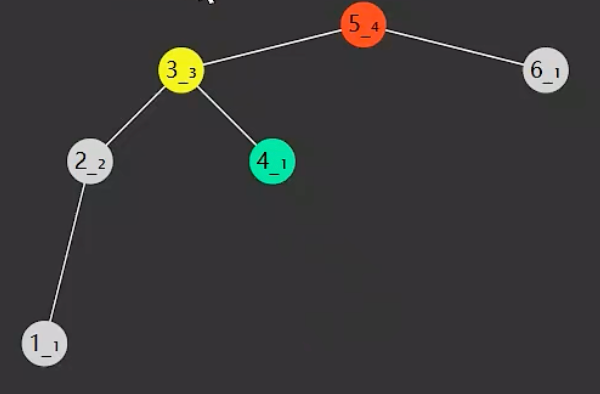

**LR**

- 失衡节点（图中6）的bf  > 1，即左边更高
- 失衡节点的左孩子（图中2红色）的 bf < 0，即左孩子这边是右边更高

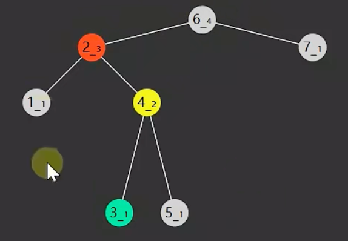

**RL**

- 失衡节点（图中2）的bf  < -1，即右边更高
- 失衡节点的右孩子（图中6红色）的 bf > 0，即右孩子这边是左边更高

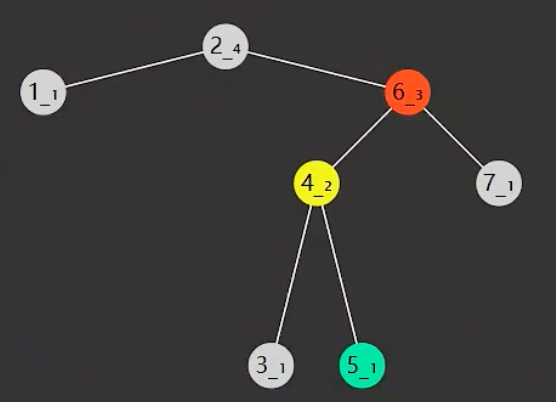

**RR**

- 失衡节点（图中2红色）的bf  < -1，即右边更高
- 失衡节点的右孩子（图中6黄色）的 bf <= 0，即右孩子这边是右边更高或等高

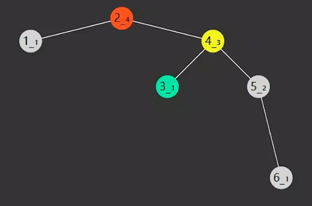

***

> LL（RR相反不举例）

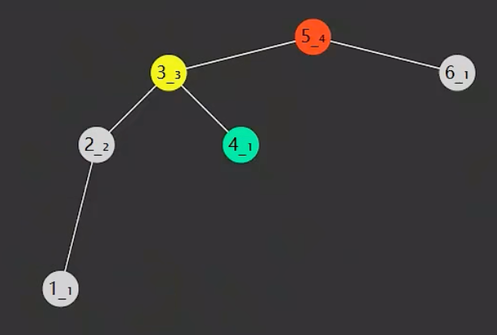

> 只需经历一次右旋即可平衡

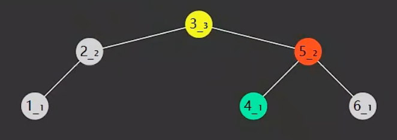


***

> LR（RL相反不举例）

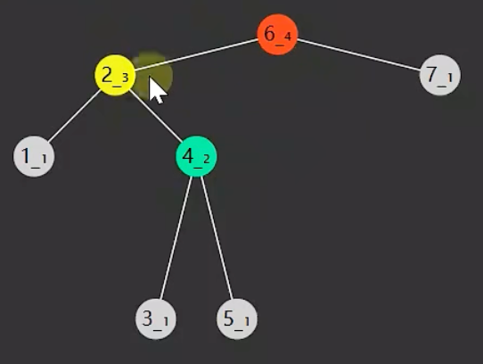

> 先局部左旋一次

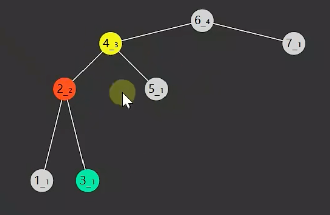

> 右旋一次

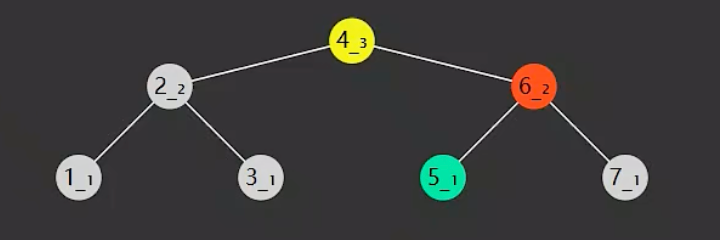

***

```java
// 新增和更新节点方法：put(int key, Object value)
// 删除节点：remove(int key)

public class AVLTree {
    static class AVLNode {
        int key;
        Object value;
        AVLNode root;
        AVLNode left;
        AVLNode right;
        //节点的高度（默认新创建节点的高度为1，而不是0，这是力扣的约定）
        int height = 1;
        public AVLNode(int key, Object value) {
            this.key = key;
            this.value = value;
        }
        public AVLNode(int key) {
            this.key = key;
        }
        public AVLNode(int key, Object value, AVLNode left, AVLNode right) {
            this.key = key;
            this.value = value;
            this.left = left;
            this.right = right;
        }
        // 获取节点高度
        private int height(AVLNode node) {
            return node == null ? 0 : node.height;
        }
        // 更新节点高度(新增，删除，旋转)
        private void updateHeight(AVLNode node) {
            node.height = Integer.max(height(node.left), height(node.right)) + 1;
        }
        // 平衡因子（banlance factor）= 左子树高度 - 右子树高度
        // 0, 1, -1 平衡，否则不平衡
        private int bf(AVLNode node) {
            return height(node.left) - height(node.right);
        }
        // 右旋转
        // 参数：要旋转的节点，返回值：新的根节点
        private AVLNode rightRotate(AVLNode node) {
            AVLNode leftNode = node.left;
            AVLNode rightNode = leftNode.right;
            leftNode.right = node;
            node.left = rightNode;
            updateHeight(node);
            updateHeight(leftNode);
            return leftNode;
        }
        // 左旋转
        private AVLNode leftRotate(AVLNode node) {
            AVLNode rightNode = node.right;
            AVLNode leftNode = rightNode.left;
            rightNode.left = node;
            node.right = leftNode;
            updateHeight(node);
            updateHeight(rightNode);
            return rightNode;
        }
        // 先左旋左子树，再右旋根节点(处理LR)
        private AVLNode leftRightRotate(AVLNode node) {
            node.left = leftRotate(node.left);
            return rightRotate(node);
        }
        // 先右旋右子树，再左旋根节点(处理RL)
        private AVLNode rightLeftRotate(AVLNode node) {
            node.right = rightRotate(node.right);
            return leftRotate(node);
        }
        // 检查节点是否失衡，重新平衡代码
        private AVLNode balance(AVLNode node) {
            if (node == null) {
                return null;
            }
            int bf = bf(node);
            if (bf > 1 && bf(node.left) >= 0) {  // LL
                return rightRotate(node);
            }else if (bf > 1 && bf(node.left) < 0) {  // LR
                return leftRightRotate(node);
            }else if (bf < -1 && bf(node.right) > 0) {  // RL
                return rightLeftRotate(node);
            }else if (bf < -1 && bf(node.right) <= 0) {  // RR
                return leftRotate(node);
            }
            return node;
        }
        public void put(int key, Object value) {
            root = doPut(root, key, value);
        }
        public AVLNode doPut(AVLNode node, int key, Object value) {
            // 1. 找到空位，创建新节点
            if (node == null) {
                return new AVLNode(key, value);
            }
            // 2. key 已存在，更新
            if (key == node.key) {
                node.value = value;
                return node;
            }
            // 3. 继续查找
            if (key < node.key) {
                node.left = doPut(node.left, key, value);  // 向左
            } else {
                node.right = doPut(node.right, key, value);  // 向右
            }
            // 更新高度
            updateHeight(node);
            // 平衡节点
            return balance(node);
        }
    }
  public void remove(int key) {
    root = doRemove(root, key);
  }
  private AVLNode doRemove(AVLNode node, int key) {
      // 1. node == null
      if (node == null) {
          return null;
      }
      // 2. 没找到 key
      if (key < node.key) {
          node.left = doRemove(node.left, key);
      } else if (node.key < key) {
          node.right = doRemove(node.right, key);
      } else {
          // 3. 找到 key 1
          if (node.left == null && node.right == null) {
              return null;
          } else if (node.left == null) {
              node = node.right;
          } else if (node.right == null) {
              node = node.left;
          } else {
              AVLNode s = node.right; // 后继节点
              while (s.left != null) {
                  s = s.left;
              }
              s.right = doRemove(node.right, s.key);
              s.left = node.left;
              node = s;
          }
      }
      // 4. 更新高度
      updateHeight(node);
      // 5. 检查是否失衡
      return balance(node);
  }
}
```

***

### 2.1.3 红黑树

**当在10亿数据进行不到30次比较就能查找到目标时，不禁感叹编程之魅力！人类之伟大呀**

红黑树也是一种自平衡的二叉搜素树，较之AVL，插人和删除时旋转次数更少（红黑树判断平衡与平衡二叉树方式不一样）


> 红黑树特性

1. 每个节点要么红，要么黑色
2. 所有null 视为黑色
3. 红色节点𣎴能相邻
4. 根节点是黑色
5. 从根到任意一个叶子节点，路径中的黑色节点数一样（黑色完美平衡）

***

> 判断是否是红黑树

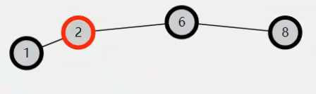

看着好像都满足红黑树特性，但是不是红黑树，我们看特性2，所有null 视为黑色，看下图


这样看到鼠标箭头的节点，经过的黑色节点数只有两个，其他都是三个，所以不平衡

***

下面这个就是平衡的

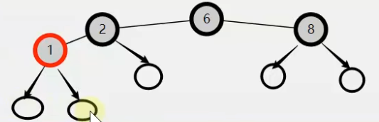

***

> 旋转前（下面rightRotate方法可以参考这个图）

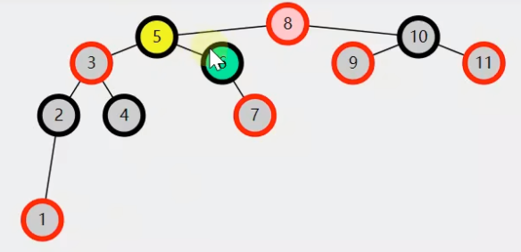

> 旋转后（下面rightRotate方法可以参考这个图）

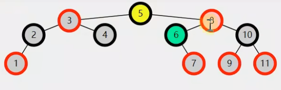

插人节点均视为**红色**

- Case1: 插入节点为根节点，将根节点变**黑**
- Case2: 插入节点的父亲若为黑色，树的红黑性质不变，无需调整

插人节点节点的父亲为**红色**，触发红红相邻

- Case3:  叔叔为红色
  - 父亲变为黑色，为了保证黑色平衡，连带的叔叔也变为黑色
  - 祖父如果是黑色不变，会造成这颗子树黑色过多，因此祖父节点变为红色
  - 祖父如果变成红色，可能会接着触发红红相邻，因此对将祖父进行递归调整
- Case4:  叔叔为黑色
  1. 父亲为左孩于，插人节点也是左孩子，此时即 **LL **不平衡
  2. 父亲为左孩于，插人节点是右孩子，此时即 **LR**不平衡
  3. 父亲为右孩于，插人节点也是右孩子，此时即 **RR **不平衡
  4. 父亲为右孩于，插人节点是左孩子，此时即 **RL **不平衡

```java
package org.example.binarytree;

import static org.example.binarytree.RedBlackTree.Color.BLACK;
import static org.example.binarytree.RedBlackTree.Color.RED;

/**
 * @author wing
 * @create 2024/1/14
 * 红黑树
 */
public class RedBlackTree {

    enum Color {
        RED, BLACK;
    }

    private Node root;

    private static class Node {
        int key;
        Object value;
        Node left;
        Node right;
        Node parent;    // 父节点，相比平衡二叉树增加的属性
        Color color = RED;    // 新增节点默认都是红色

        public Node(int key, Object value) {
            this.key = key;
            this.value = value;
        }

        // 是否是左孩子
        boolean isLeftChild() {
            return parent != null && parent.left == this;
        }

        // 叔叔
        Node uncle() {
            if (parent == null || parent.parent == null) {
                return null;
            }
            if (parent.isLeftChild()) {
                return parent.parent.right;
            } else {
                return parent.parent.left;
            }
        }

        // 兄弟
        Node sibling() {
            if (parent == null) {
                return null;
            }
            if (this.isLeftChild()) {
                return parent.right;
            } else {
                return parent.left;
            }
        }
    }

    // 判断红
    boolean isRed(Node node) {
        return node != null && node.color == RED;
    }

    // 判断黑
    boolean isBlack(Node node) {
        // return !isRed(node);
        return node != null && node.color == BLACK;
    }

    // 右旋
    private void rightRotate(Node pink) {
        Node parent = pink.parent;
        Node yellow = pink.left;
        Node green = yellow.right;
        if (green != null) {
            green.parent = pink;
        }
        yellow.right = pink;
        yellow.parent = parent;
        pink.left = green;
        pink.parent = yellow;
        if (parent == null) {
            root = yellow;
        } else if (parent.left == pink) {
            parent.left = yellow;
        } else {
            parent.right = yellow;
        }
    }
    // 左旋
    private void leftRotate(Node pink) {
        // 参考右旋
    }

    // 新增或更新（正常增，遇到红红不平衡进行调整）
    public void put(int key, Object value) {
        Node p = root;
        Node parent = null;
        while (p != null) {
            parent = p;
            if (key < p.key) {
                p = p.left;
            } else if (key > p.key) {
                p = p.right;
            } else {
                // 找到，更新
                p.value = value;
                return;
            }
        }
        Node inserted = new Node(key, value);
        if (parent == null) {
            root = inserted;
        } else if (parent.key > key) {
            parent.left = inserted;
            inserted.parent = parent;
        } else {
            parent.right = inserted;
            inserted.parent = parent;
        }
        // 插入遇到红红则进行调整
        fixRedRed(inserted);
    }
    // 红红则进行调整
    void fixRedRed(Node x) {
        // Case1: 插入节点为根节点，将根节点变黑
        if (x == root) {
            x.color = BLACK;
            return;
        }
        // Case2: 插入节点的父亲若为黑色，树的红黑性质不变，无需调整
        if (isBlack(x.parent)) {
            return;
        }
        // Case3 和 Case4 会触发红红相邻
        // Case3:  叔叔为红色（操作步骤如下）【变色就能解决平衡】
        //    1）父亲变为黑色，为了保证黑色平衡，连带的叔叔也变为黑色
        //    2）祖父如果是黑色不变的话会造成这颗子树黑色过多，因此祖父节点变为红色
        //    3）祖父变为红色的话，可能会接着触发红红相邻，因此对祖父进行递归调整
        Node parent = x.parent;
        Node uncle = x.uncle();
        Node grandParent = parent.parent;
        if (isRed(uncle)) {
            parent.color = BLACK;
            uncle.color = BLACK;
            grandParent.color = RED;
            // 递归调用
            fixRedRed(grandParent);
            return;
        }

        // Case4:  叔叔为黑色（分下面四种情况）【当有父亲，没有叔叔时，null为黑色，也属于叔叔为黑色的情况】【变色后还不能解决平衡，还需要配合旋转】
        if (parent.isLeftChild() && x.isLeftChild()) { 
            // 1）父亲为左孩子，插入节点也是左孩子，此时即 LL 不平衡【操作：父亲变黑，祖父变红，右旋】
            parent.color = BLACK;
            grandParent.color = RED;
            rightRotate(grandParent);
        } else if (parent.isLeftChild()) { 
            // 2）父亲为左孩子，插入节点是右孩子，此时即 LR 不平衡
            leftRotate(parent);
            x.color = BLACK;
            grandParent.color = RED;
            rightRotate(grandParent);
        } else if (!x.isLeftChild()) { 
            // 3）父亲为右孩子，插入节点也是右孩子，此时即 RR 不平衡
            parent.color = BLACK;
            grandParent.color = RED;
            leftRotate(grandParent);      
        } else {
            // 4）父亲为右孩子，插入节点是左孩子，此时即 RL 不平衡
            rightRotate(parent);
            x.color = BLACK;
            grandParent.color = RED;
            leftRotate(grandParent);
        }

    }
    // 删除（正常删，会用到李代桃僵技巧，遇到黑黑不平衡进行调整）
    public void remove(int key) {
        Node deleted = find(key);
        if (deleted == null) {
            return;
        }
        doRemove(deleted);

    }

    private void fixDouleBlack(Node x) {
        if (x == root) {
            return;
        }
        Node parent = x.parent;
        Node sibling = x.sibling();
        if (isRed(sibling)) {
            if (x.isLeftChild()) {
                leftRotate(parent);
            } else {
                rightRotate(parent);
            }
            parent.color = RED;
            sibling.color = BLACK;
            fixDouleBlack(x);
            return;
        }

        if (sibling != null) {
            if (isBlack(sibling.left) && isBlack(sibling.right)) {
                sibling.color = RED;
                if (isRed(parent)) {
                    parent.color = BLACK;
                } else {
                    fixDouleBlack(parent);
                }
            } else {
                // LL
                if (sibling.isLeftChild() && isRed(sibling.left)) {
                    rightRotate(parent);
                    sibling.left.color = BLACK;
                    sibling.color = parent.color;
                }
                // LR
                else if (sibling.isLeftChild() && isRed(sibling.right)) {
                    sibling.right.color = parent.color;
                    leftRotate(sibling);
                    rightRotate(parent);
                }
                // RL
                else if (!sibling.isLeftChild() && isRed(sibling.left)) {
                    sibling.left.color = parent.color;
                    rightRotate(sibling);
                    leftRotate(parent);
                }
                // RR
                else {
                    leftRotate(parent);
                    sibling.right.color = parent.color;
                    sibling.color = parent.color;
                }
                parent.color = BLACK;
            }
        } else {
            // 留给学生思考，看会不会走到这里
            fixDouleBlack(parent);
        }
    }
    
    private void doRemove(Node deleted) {
        Node replaced = findReplaced(deleted);
        Node parent = deleted.parent;
        // 没有孩子
        if (replaced == null) {
            // case 1 删除的是根节点
            if (deleted == root) {
                root = null;
            } else {
                if (isBlack(deleted)) {
                   // 复杂调整
                    fixDouleBlack(deleted);
                } else {
                    // 红色叶子，无需任何处理
                }
                if (deleted.isLeftChild()) {
                    parent.left = null;
                } else {
                    parent.right = null;
                }
                deleted.parent = null;
            }
            return;
        }
        // 有一个孩子
        if (deleted.left == null || deleted.right == null) {
            // case 1 删除的是根节点
            if (deleted == root) {
                root.key = replaced.key;
                root.value = replaced.value;
                root.left = root.right = null;
            } else {
                if (deleted.isLeftChild()) {
                    parent.left = replaced;
                } else {
                    parent.right = replaced;
                }
                replaced.parent = parent;
                deleted.left = deleted.right = deleted.parent = null; // help gc
                if (isBlack(deleted) && isBlack(replaced)) {
                    // 复杂处理
                    fixDouleBlack(replaced);
                } else {
                    replaced.color = BLACK;
                }
            }
            return;
        }
        // case 0：有两个孩子(李代桃僵技巧 -> 将有两个孩子专成有一个孩子或者没有孩子的节点来删除，复杂问题简单化)
        int t = deleted.key;
        deleted.key = replaced.key;
        replaced.key = t;

        Object v = deleted.value;
        deleted.value = replaced.value;
        replaced.value = v;
        doRemove(replaced);
    }

    // 查找删除节点
    Node find(int key) {
        Node p = root;
        while (p != null) {
            if (key < p.key) {
                p = p.left;
            } else if (key > p.key) {
                p = p.right;
            } else {
                return p;
            }
        }
        return null;
    }

    // 查找剩余节点
    Node findReplaced(Node deleted) {
        if (deleted.left == null && deleted.right == null) {
           return null;
        }
        if (deleted.left == null) {
            return deleted.right;
        }
        if (deleted.right == null) {
            return deleted.left;
        }
        Node s = deleted.right;
        while (s.left != null) {
            s = s.left;
        }
        return s;
    }
}

```

***


### 2.1.4 B树

### 2.1.5 跳表

### 2.1.6 散列表

## 2.2 排序算法

### 2.2.1 插入排序

### 2.2.2 希尔排序

### 2.2.3 快速排序

### 2.2.4 归并排序

### 2.2.5 堆排序

### 2.2.6 计数排序

### 2.2.7 桶排序

# 3 进阶

## 3.1 进阶数据结构

## 3.2 进阶算法

## 3.3 算法思想

### 3.3.1 贪心

### 3.3.2 回溯

### 3.3.3 动态规划

### 3.3.4 分治


```java
typora数学公式博客1：https://blog.csdn.net/mingzhuo_126/article/details/82722455

typora数学公式博客2：https://blog.csdn.net/Snakewood/article/details/130445273?utm_medium=distribute.pc_relevant.none-task-blog-2~default~baidujs_baidulandingword~default-4-130445273-blog-118973667.235^v40^pc_relevant_anti_vip&spm=1001.2101.3001.4242.3&utm_relevant_index=7
```


