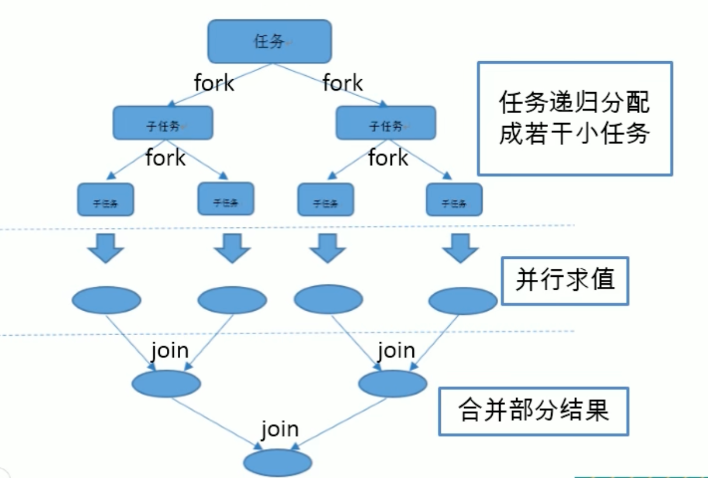

# 1. Lambda 表达式

为什么使用 Lambda 表达式

Lambda是一个**匿名函数**，我们可以把 Lambda表达式理解为是一段可以传递的代码（将代码像数据一样进行传递）。可以写出更简洁、更灵活的代码。作为一种更紧凑的代码风格，使Java的语言表达能力得到了提升。

> 初体验

```java
 // 原来的匿名内部类
 @Test
 public void test1(){
     Comparator<Integer> com = new Comparator<Integer>() {
         @Override
         public int compare(Integer o1, Integer o2) {
             return Integer.compare(o1, o2);
         }
     };
     TreeSet<Integer> ts = new TreeSet<>(com);
 }
 // Lambda 表达式
 @Test
 public void test2(){
     Comparator<Integer> com = (x, y) -> Integer.compare(x, y);
     TreeSet<Integer> ts = new TreeSet<>(com);
 }
```

***

> 案例-普通实现

```java
List<Employee> employees = Arrays.asList(
        new Employee("张三", 18, 9999.99),
        new Employee("李四", 38, 5555.99),
        new Employee("王五", 50, 6666.66),
        new Employee("赵六", 16, 3333.33),
        new Employee("田七", 8, 7777.77)
);
// 需求1：获取当前公司中员工年龄大于 35 的员工信息
public List<Employee> filterEmployees(List<Employee> list) {
    List<Employee> emps = new ArrayList<>();
    for (Employee emp : list) {
        if (emp.getAge() >= 35) {
            emps.add(emp);
        }
    }
    return emps;
}
// 需求2：获取当前公司中员工工资大于 5000 的员工信息
public List<Employee> filterEmployees2(List<Employee> list) {
    List<Employee> emps = new ArrayList<>();
    for (Employee emp : list) {
        if (emp.getSalary() >= 6000) {
            emps.add(emp);
        }
    }
    return emps;
}

@Test
public void test3(){
    // 先过滤年龄大于 35
    List<Employee> list = filterEmployees(employees);
    // 再过滤工资大于 5000
    List<Employee> list1 = filterEmployees2(list);
    for (Employee employee : list1) {
        System.out.println(employee);
    }
}
```

> 优化方式一：策略设计模式

```java
/* 定义接口 */
public interface MyPredicate<T> {
    public boolean test(T t);
}
/* 过滤年龄实现类 */
public class FilterEmployeeByAge implements MyPredicate<Employee>{
    @Override
    public boolean test(Employee t) {
        return t.getAge() >= 35;
    }
}
/* 过滤工资实现类 */
public class FilterEmployeeBySalary implements MyPredicate<Employee>{
    @Override
    public boolean test(Employee t) {
        return t.getSalary() >= 5000;
    }
}
/* 公共方法，不用再修改 */
public List<Employee> filterEmployee(List<Employee> list, MyPredicate<Employee> mp) {
    List<Employee> emps = new ArrayList<>();
    for (Employee employee : list) {
        if (mp.test(employee)) {
            emps.add(employee);
        }
    }
    return emps;
}
@Test
public void test4(){
    // 先过滤年龄大于 35
    List<Employee> list = filterEmployee(employees, new FilterEmployeeByAge());
    // 再过滤工资大于 5000
    List<Employee> list1 = filterEmployee(list, new FilterEmployeeBySalary());
    for (Employee employee : list1) {
        System.out.println(employee);
    }
}
```

> 优化方式二：匿名内部类（不用创建多余的类）

```java
@Test
public void test5(){
    // 先过滤年龄大于 35
    List<Employee> list = filterEmployee(employees, new MyPredicate<Employee>() {
        @Override
        public boolean test(Employee t) {
            return t.getAge() >= 35;
        }
    });
    // 再过滤工资大于 5000
    List<Employee> list1 = filterEmployee(list, new MyPredicate<Employee>() {
        @Override
        public boolean test(Employee t) {
            return t.getSalary() >= 5000;
        }
    });
    for (Employee employee : list1) {
        System.out.println(employee);
    }
}
```

> 优化方式三：lambda

```java
@Test
public void test6(){
    // 先过滤年龄大于 35
    List<Employee> list = filterEmployee(employees, (e) -> e.getAge() >= 35);
    // 再过滤工资大于 5000
    List<Employee> list1 = filterEmployee(list, (e) -> e.getSalary() >= 5000);
    list1.forEach(System.out::println);
}
```

> 优化方式四：Stream API（假设现在只有一个员工集合）

```java
@Test
public void test7(){
    employees.stream()
            .filter((e) -> e.getAge() >= 35)
            .filter((e) -> e.getSalary() >= 6000)
            .limit(2)
            .forEach(System.out::println);
}
```

***

## 1.1 Lambda 表达式的基础语法

Java8中引入了一个新的操作符 "->" 该操作符称为箭头操作符或 Lambda 操作符，箭头操作符将 Lambda 表达式拆分成两部分：

- 左侧：Lambda 表达式的参数列表
- 右侧：Lambda 表达式中所需执行的功能，即Lambda 体

> 语法格式一：无参数，无返回值

```java
@Test
public void test1(){
    Runnable r = new Runnable() {
        @Override
        public void run() {
            System.out.println("Hi");
        }
    };
    r.run();
    System.out.println("---------------");
    Runnable r1 = () -> System.out.println("Hello");
    r1.run();
}
```

> 语法格式二：有一个参数，无返回值

```java
@Test
public void test2(){
    Consumer<String> con = (x) -> System.out.println(x);
    con.accept("hello");
}
```

> 语法格式三：有一个参数，小括号可以省略不写

```java
@Test
public void test3(){
    Consumer<String> con = x -> System.out.println(x);
    con.accept("hi");
}
```

> 语法格式四：有两个以上的参数，省返回值，并且Lambda 体中有多条语句（多条语句要写上大括号）

```java
@Test
public void test4(){
    Comparator<Integer> com = (x, y) -> {
        System.out.println("函数式接口");
        return Integer.compare(x, y);
    };
}
```

> 语法格式五：若Lambda 体中只有一条语句，return 和 大括号都可以省略不写

```java
@Test
public void test5(){
    Comparator<Integer> com = (x, y) -> Integer.compare(x, y);
}
```

> 语法格式六：Lambda 表达式的参数列表的数据类型可以省略不写，因为JVM编译器通过上下文推断出，数据类型，即“类型推断“

```java
@Test
public void test5(){
    Comparator<Integer> com = (x, y) -> Integer.compare(x, y);
    Comparator<Integer> com1 = (Integer x, Integer y) -> Integer.compare(x, y); // 写上参数类型也不会错

}
```

> 总结

Lambda 表达式需要“函数式接口”的支持

**函数式接口**：接口中只有一个抽象方法的接口，称为函数式接口，可以使用 @FunctionalInterface 注解修饰，修饰后会检查是否是函数式接口

***

## 1.2 练习

1. 调用 Collections.sort(）方法，通过定制排序比较两个 Employee(先按年龄比，年龄相同按姓名比)，使用 Lambda 作为参数递。

```java
@Test
public void test8(){
    Collections.sort(employees, (e1, e2) -> {
        if (e1.getAge() == e2.getAge()) {
            return e1.getName().compareTo(e2.getName());
        } else {
            return Integer.compare(e1.getAge(), e2.getAge());
        }
    });
    for (Employee emp : employees) {
        System.out.println(emp);
    }
}
```

***

2.     1）声明函数式接口，接口中声明抽象方法，public string getvalue(string str);

​        2）声明类 TestLambda，类中编写方法使用接口作为参数，将一个字符串转换成大写，并作为方法的返回值。

​        3）再将一个字符串的第2个和第4 个索引位置进行截取子串。

```java
@Test
public void test9(){
    String trimStr = strHandler("\t\t\t hello", (str) -> str.trim());
    System.out.println(trimStr);
  
    String upper = strHandler("hello", (str) -> str.toUpperCase());
    System.out.println(upper);
  
    String newStr = strHandler("hello", (str) -> str.substring(2,4));
    System.out.println(newStr);
}
```

***

# 2. 四大函数式接口

1. Consumer<T>：消费型接口  -->   void accept(T t)
2. Supplier<T>：供给型接口  -->   T get()
3. Function<T,R>：函数型接口  -->   R apply(T t)
4. Predicate<T>：断言型接口  -->   boolean test(T t)

## 2.1 Consumer 消费型

```java
 public void happy(double money, Consumer<Double> con) {
     con.accept(money);
 }
 @Test
 public void test7(){
     happy(1000, (m) -> System.out.println("消费金额：" + m));
 }
```

## 2.2 Supplier 供给型

```java
/* 产生指定数量的随机数 */
public List<Integer> getNumList(int num, Supplier<Integer> sup) {
    List<Integer> list = new ArrayList<>();
    for (int i = 0; i < num; i++) {
        list.add(sup.get());
    }
    return list;
}
@Test
public void test8(){
    List<Integer> numList = getNumList(10, () -> (int)(Math.random() * 100));
    for (Integer num : numList) {
        System.out.println(num);
    }
}
```

## 2.3 Function 函数型

```java
public String strHandler(String str, Function<String,String> fun) {
    return fun.apply(str);
}
@Test
public void test9(){
    String upper = strHandler("hello", (str) -> str.toUpperCase());
    System.out.println(upper);
}
```

## 2.4 Predicate 断言型

```java
public List<String> filterStr(List<String> list, Predicate<String> pre) {
    List<String> strList = new ArrayList<>();
    for (String str : list) {
        if (pre.test(str)) {
            strList.add(str);
        }
    }
    return strList;
}
@Test
public void test10(){
    List<String> list = Arrays.asList("hello", "hi", "Wing", "Lambda");
    List<String> str = filterStr(list, (s) -> s.length() > 4);
    for (String s : str) {
        System.out.println(s);
    }
}
```

***

# 3. 方法引用与构造器引用

## 3.1 方法引用

若 Lambda 体中的内容有方法已经实现了，我们可以使用"方法引用” (可以理解为方法引用是 Lambda 表达式的另外一种表现形式）

主要有三种语法格式：

1. 对象 :: 实例方法名
2. 类 :: 静态方法名
3. 类 :: 实例方法名

**注意**：

1. Lambda 体中调用方法的参数列表与返回值类型，要与函数式接口中抽象方法的函数列表和返回值类型保持一致！
2. 若 Lambda 參数列表中的第一参数是 实例方法的调用者，而第二个参数是实例方法的參数时，可以使用 CIassName ::method

***

> 对象 :: 实例方法名

```java
@Test
public void test1(){
    // 以前方式1
    Consumer<String> con = (x) -> System.out.println(x);
    // 以前方式2
    PrintStream ps1 = System.out;
    Consumer<String> con2 = (x) -> ps1.println(x);
    // 方法引用方式1
    PrintStream ps = System.out;
    //前提是println方法参数和返回值要和Consumer抽象方法的参数和返回值保持一致
    Consumer<String> con1 = ps::println;
    // 方法引用方式2
    Consumer<String> con3 = System.out::println;
    con3.accept("adcd");
}
// adcd

// 方式一
Employee emp = new Employee("张三", 18, 9999.99
//前提是getName方法参数和返回值要和Supplier抽象方法的参数和返回值保持一致
Supplier<String> sup = () -> emp.getName();
String s = sup.get();
System.out.println(s); // 张三
                            
// 方式二
Supplier<Integer> sup1 = emp::getAge;
Integer s1 = sup1.get();
System.out.println(s1); // 18
                             
```

> 类 :: 静态方法名

```java
@Test
public void test3(){
    // 之前
   Comparator<Integer> com = (x, y) -> Integer.compare(x, y);
   // 使用引用(前提是compare方法参数和返回值要和Comparator抽象方法的参数和返回值保持一致)
   Comparator<Integer> com1 = Integer::compare;
}
```

> 类 :: 实例方法名

```java
 @Test
 public void test4(){
     // 之前
     BiPredicate<String, String> bp = (x, y) -> x.equals(y);
     // 使用引用
     BiPredicate<String, String> bp1 = String::equals;
 }

// 上面应该有个疑问，为什么“String::equals”可以写成类::实例方法呢？
// 答：可以这样使用的前提条件是，符合第一个参数 x 实例调用 equals 方法，传入参数是 y（即第一个参数是方法的调用者，第二个参数是方法的参数） ,满足这样的情况，就可以使用 类 :: 实例方法名
```

***

## 3.2 构造器引用

**格式**：CIassName :: method

**注意**：需要调用的构造器的参数列表要与函数式接口中抽象方法的参数列表保持一致！

```java
@Test
public void test5(){
    // 之前
    Supplier<Employee> sup = () -> new Employee();
    // 使用引用
    Supplier<Employee> sup1 = Employee::new; // 调用无参构造器（因为构造方法参数和返回值要和Supplier抽象方法的参数和返回值保持一致）
    Employee employee = sup1.get();
    System.out.println(employee);
}
```

```java
 @Test
 public void test6(){
     // 之前
     Function<Integer, Employee> fun = (x) -> new Employee(x);
     // 使用引用
     Function<Integer, Employee> fun1 = Employee::new;// 调用一个参数构造器（因为构造方法参数和返回值要和Function抽象方法的参数和返回值保持一致）
     Employee employee = fun1.apply(101);
     System.out.println(employee);
     // 调用两个Integer参数构造器（因为构造方法参数和返回值要和BiFunction抽象方法的参数和返回值保持一致）
     BiFunction<Integer, Integer, Employee> bf = Employee::new;

 }
```

## 3.3 数组引用

```java
@Test
public void test7(){
    // 之前
    Function<Integer, String[]> fun = (x) -> new String[x];
    String[] strs = fun.apply(10);
    System.out.println(strs.length);
    // 使用引用
    Function<Integer, String[]> fun1 = String[]::new;
    String[] strs1 = fun1.apply(20);
    System.out.println(strs1.length);
}
```

***

# 4. Stream API

> 了解 Stream

Java8中有两大最为重要的改变。第一个是 **Lambda 表达式**；另外一个则是 **Stream API (java. util. stream. *)。**

Stream 是Java8 中处理集合的关键抽象概念，它可以指定你希望对集合进行的操作，可以执行非常复杂的**查找、过滤**和**映射数据**等操作。使用Stream API 对集合数据进行操作，就类似于使用 SQL 执行的数据库查询。也可以使用 Stream API 来并行执行操作。简而言之，Stream API 提供了一种高效且易于使用的处理数据的方式。

Stream就是对数据源、集合和数组等，做一系列流水线式的中间操作（过滤，切片，分组等），最终产生一个新流，**源数据不受影响**。

***

> 什么是 Stream

流(Stream）到底是什么呢？

是数据渠道，用于操作数据源（集合、数组等）所生成的元素序列。

“ 集合讲的是数据， 流讲的是计算！”

注意：

1. stream 白己不会存储元素
2. stream 不会改变源对象。相反，他们会返回一个持有结果的新Stream。
3. stream 操作是延迟执行的。这意味着他们会等到需要结果的时候才执行

***

> Stream 的操作三个步骤

- 创建 Stream

   一个数据源（如：集合、数组），获取一个流

- 中间操作

   一个中间操作链，对数据源的数据进行处理

- 终止操作（终端操作）

   一个终止操作，执行中间操作链，并产生结果

```java
/* 获取流的四种方式 */ 
@Test
 public void test1() {
     // 1.可以通过 Collection 系列集合提供的stream（）或 parallelstream()
     List<String> list = new ArrayList<>();
     Stream<String> stream1 = list.stream();
   
     // 2.通过 Arrays 中的静态方法 stream(）获取数组流
     Employee [] emps = new Employee [10];
     Stream<Employee> stream2 = Arrays.stream(emps);
   
     // 3.通过 Stream 类中的静态方法 of(）
     Stream<String> stream3 = Stream.of("aa", "bb", "cc");
   
     // 4.创建无限流
     // 4.1迭代
     Stream<Integer> stream4 = Stream.iterate(0, (x) -> x + 2);
     stream4.limit(10).forEach(System.out::println);
     // 4.2生成
     Stream.generate(() -> Math.random())
             .limit(5)
             .forEach(System.out::println);
 }
```

***

> Stream 的中间操作

多个中间操作可以连接起来形成一个**流水线**，除非流水线上**触发终止操作**，否则中间操作**不会执行任何的处理**！

而在终止操作时一次性全部处理，称为“**惰性求值**”

## 4.1 筛选与切片

| 方法                 | 描述                                                         |
| -------------------- | ------------------------------------------------------------ |
| filter (Predicate p) | 接收 Lambda，从流中排除某些元素                              |
| distinct ()          | 筛选，通过流所生成元素的 hashcode 和 equals 除重复元素       |
| limit (long maxSize) | 截断流，使其元素不超过给定数量                               |
| skip(long n)         | 跳过元素，返回一个扔掉了前口个元素的流。若流中元素不足n个，则返回一个空流。与 limit(n）互补 |

> filter

```java
public class TestStreamAPI2 {
    // 2、中间操作
    /*
        筛选与切片
        filter一接收Lambda，从流中排除某些元素。
        1imit一截断流，使其元素不超过给定数量。
        skip(n）— 跳过元素，返回一个扔掉了前n 个元素的流。若流中元素不足n 个，则返回一个空流。与 1imit(n）互补
        distinct一筛选，通过流所生成元素的 hashcode(） 和equals(）去除重复元素
    */
    List<Employee> employees = Arrays.asList(
            new Employee("张三", 18, 9999.99),
            new Employee("李四", 38, 5555.99),
            new Employee("王五", 50, 6666.66),
            new Employee("赵六", 16, 3333.33),
            new Employee("田七", 8, 7777.77)
    );
    //内部迭代：迭代操作由 stream API 完成
    @Test
    public void test1() {
        // 中间操作
        Stream<Employee> stream =employees.stream()
                .filter((e) -> {
                    System.out.println("中间操作");
                    return e.getAge() > 35;
                });
        // 终止操作
        stream.forEach(System.out::println);
    }
}

中间操作
中间操作
Employee{id=0, name='李四', age=38, salary=5555.99}
中间操作
Employee{id=0, name='王五', age=50, salary=6666.66}
中间操作
中间操作
  
// 注意：如果 stream.forEach(System.out::println); 这一行注释掉，没有终止操作的话，所有中间操作都不会打印
```

```java
//外部迭代
@Test
public void test2() {
    Iterator<Employee> it = employees.iterator();
    while (it.hasNext()) {
        System.out.println(it.next());
    }
}
```

> limit

```java
//limit，找到符合的条数后，就不再往下迭代，能提高效率
@Test
public void test3() {
    employees.stream()
            .filter((e) -> {
                System.out.println("短路");
                return e.getSalary() > 5000;
            })
            .limit(2)
            .forEach(System.out::println);
}
```

> skip

```java
//skip 与 limit互补
@Test
public void test4() {
    employees.stream()
            .filter((e) -> {
                System.out.println("短路");
                return e.getSalary() > 5000;
            })
            .skip(1)
            .forEach(System.out::println);
}
```

> distinct 

```java
  //distinct 去重
@Test
public void test4() {
    employees.stream()
            .filter((e) -> {
                System.out.println("去重");
                return e.getSalary() > 5000;
            })
            .skip(1)
            .forEach(System.out::println);
}
```

## 4.2 映射

map—接收 Lambda，将元素转换成其他形式或提取信息。接收一个函数作为參数，该函数会被应用到每个元素上，并将其映射成一个新的元素。

flatMap—接收一个函数作为参数，将流中的每个值都换成另一个流，然后把所有流连接成一个流

```java
 // map 映射
 @Test
 public void test6() {
     List<String> list = Arrays.asList("aaa","bbb","ccc");
     list.stream()
             .map((str) ->str.toUpperCase())
             .forEach(System.out::println);
     System.out.println("----------------------------");
     employees.stream()
             .map(Employee::getName)
             .forEach(System.out::println);
     System.out.println("----------------------------");
     // map处理流 // {{a,a,a},{b,b,b}...} 一个个流在一个大流中
     Stream<Stream<Character>> stream = list.stream()
             .map(TestStreamAPI2::filterCharacter);
     stream.forEach((sm) -> {
         sm.forEach(System.out::println);
         System.out.println("中间");
     });
     System.out.println("----------------------------");
     // flatMap处理流 //{a,a,a,b,b,b...}
     Stream<Character> sm = list.stream()
             .flatMap(TestStreamAPI2::filterCharacter);
     sm.forEach((s) -> {
         System.out.println(s);
         System.out.println("中间");
     });
 }
 public static Stream<Character> filterCharacter(String str) {
     List<Character> list = new ArrayList<>();
     for (Character ch : str.toCharArray()) {
         list.add(ch);
     }
     return list.stream();
 }

a a a 中间 b b b 中间 c c c 中间
----------------------------
a 中间 a 中间 a 中间 b 中间 b 中间 b 中间 c 中间 c 中间 c 中间
```

## 4.3 排序

sorted () 一自然排序（comparable）

sorted (Comparator com)一定制排序（comparator）

```java
 // sorted ()  排序
 @Test
 public void test7() {
     List<String> list = Arrays.asList("ddd","ccc","aaa","bbb");
     list.stream()
             .sorted()
             .forEach(System.out::println);
   
     System.out.println("----------------------------");
   
 // sorted (Comparator com)
     employees.stream()
             .sorted((e1,e2) -> {
                 return e1.getName().compareTo(e2.getName());
             })
             .forEach(System.out::println);
 }
```

## 4.4 查找与匹配

```
 a11Match-检查是否匹配所有元素
 anyMatch—检查是否至少匹配一个元素
 noneMatch-检查是否没有匹配所有元素
 findFirst一返回第一个元素
 findAny一返回当前流中的任意元素【不研究】
 count-返回流中元素的总个数
 max—返回流中最大值
 min一返回流中最小值
```

```java
@Test
public void test1() {
    // a11Match-检查是否匹配所有元素
    boolean b1 = employees.stream()
            .allMatch((e) -> e.getStatus().equals(Employee.Status.BUSY));
    System.out.println(b1);
    // anyMatch—检查是否至少匹配一个元素
    boolean b2 = employees.stream()
            .anyMatch((e) -> e.getStatus().equals(Employee.Status.BUSY));
    System.out.println(b2);
    // noneMatch-检查是否没有匹配所有元素
    boolean b3 = employees.stream()
            .noneMatch((e) -> e.getStatus().equals(Employee.Status.BUSY));
    System.out.println(b3);
    // findFirst一返回第一个元素
    // 放到Optional避免为空，因为findFirst有可能获取不到
    Optional<Employee> op = employees.stream()
            .sorted((e1, e2) -> -Double.compare(e1.getSalary(),e2.getSalar
            .findFirst();
    System.out.println(op.get());
}
@Test
public void test2() {
    // count-返回流中元素的总个数
    long count = employees.stream()
            .count();
    System.out.println(count);
    // max—返回流中最大值的员工信息
    Optional<Employee> op = employees.stream()
            .max((e1, e2) -> Double.compare(e1.getSalary(),e2.getSalary())
    System.out.println(op.get());
    // min一返回流中最小值的工资
    Optional<Double> op1 = employees.stream()
            .map(Employee::getSalary)
            .min(Double::compare);
    System.out.println(op1.get());
}
```

## 4.5 归约

reduce(T identity， Binaryoperator) / reduce (Binaryoperator）一可以将流中元素反复结合起来，得到一个值

**备注**：**map** 和 **reduce** 的连接通常称为 **map-reduce 模式**，因 Google 用它来进行网络搜索而出名

```java
@Test
public void test3() {
    List<Integer> list = Arrays.asList(1,2,3,4,5);
    Integer sum = list.stream()
            .reduce(0, (x,y) -> x + y);
    System.out.println(sum);         // 15
    System.out.println("----------------");
    // 可能为空的值封装到Optional，避免空指针
    Optional<Double> op = employees.stream()
            .map(Employee::getSalary)
            .reduce(Double::sum);
    System.out.println(op.get()); // 33111.51
}
```

***

## 4.6 收集

collect—将流转换为其他形式。接收一个 Collector接口的实现，用于给Stream中元素做汇总的方法

`Collector`接口中方法的实现决定了如何对流执行收集操作（如收集到 List、Set、Map)。但是 `Collectors` 实用类提供了很多静态方法，可以方便地创建常见收集器实例，具休方法与实例如下表：

```java
@Test
public void test4() {
    //取出所有的名字放到List集合中
    List<String> list = employees.stream()
            .map(Employee::getName)
            .collect(Collectors.toList());
    list.forEach(System.out::println);
  
    System.out.println("----------------");
  
    //取出所有的名字放到Set集合中,可以过滤重复
    Set<String> list1 = employees.stream()
            .map(Employee::getName)
            .collect(Collectors.toSet());
    list1.forEach(System.out::println);
  
    System.out.println("----------------");
  
    //取出所有的名字放到HashSet集合中,可以过滤重复
    HashSet<String> list2 = employees.stream()
            .map(Employee::getName)
            .collect(Collectors.toCollection(HashSet::new));
    list2.forEach(System.out::println);
}
```

```java
 @Test
 public void test5() {
     // 总数
     Long count = employees.stream()
             .collect(Collectors.counting());
     System.out.println(count);
     System.out.println("----------------");
     // 平均值
     Double avg = employees.stream()
             .collect(Collectors.averagingDouble(Employee::getSalary));
     System.out.println(avg);
     System.out.println("----------------");
     // 总和
     Double sum = employees.stream()
             .collect(Collectors.summingDouble(Employee::getSalary));
     System.out.println(sum);
     System.out.println("----------------");
     // 最大值
     Optional<Employee> max = employees.stream()
             .collect(Collectors.maxBy((e1,e2) -> Double.compare(e1.getSalary(), e2.getSalary())));
     System.out.println(max.get());
     System.out.println("----------------");
     // 最小值
     Optional<Double> min = employees.stream()
             .map(Employee::getSalary)
             .collect(Collectors.minBy(Double::compare));
     System.out.println(min.get());
 }
```

***

## 4.7 并行流与顺序流

**并行流就是把一个内容分成多个数据块，并用不同的线程分别处理每个数据块的流。**

**Java 8 中将并行进行了优化，我们可以很容易的对数据进行并行操作**。Stream API 可以声明性地通过 paralle() 与sequential() 在**并行流与顺序流之间进行切换**

### 4.7.1 了解Fork/Join 框架

Fork/Join 框架：就是在必要的情况下，将一个大任务，进行拆分(fork） 成若干个小任务（拆到不可再拆时），再将一个个的小任务运算的结果进行 join 汇总

比如从1加到100亿，用一个任务加效率太慢，可以设置临界值，比如10000为一个子任务，最终结果就是全部子任务相加就是结果。



***

> Fork/Join 框架与传统线程池的区别

采用 “工作窃取”模式 (work-stealing）：

当执行新的任务时它可以将其拆分成更小的任务执行，并将小任务加到线程队列中，然后再从一个随机线程的队列中偷一个并把它放在自己的队列中。

相对于一般的线程池实现，fork/ join框架的优势体现在对其中包含的任务的处理方式上，在一般的线程池中，如果一个线程正在执行的任务由于某些原因无法继续运行，那么该线程会处于等待状态。而在fork/ join框架实现中，如果某个子问题由于等待另外一个子问题的完成而无法继续运行． 那么处理该子问题的线程会主动寻找其他尚未运行的子问题来执行．这种方式减少了线程的等待时问，提高了性能。

【普通线程是，假如四核，那么任务有八个的话，每核分到两个任务，假如第一个核阻塞了，但是剩下三个核都顺利执行完了，相当于第一个核繁忙，剩下三个核都空闲，相当于没有很好的利用CPU资源】


​        那么为什么需要使用工作窃取算法呢？假如我们需要做一个比较大的任务，我们可以把这个任务分割为若干互不依赖的子任务，为了减少线程间的竞争，于是把这些子任务分别放到不同的队列里，并为每个队列创建一个单独的线程来执行队列里的任务，线程和队列一一对应，比如A线程负责处理A队列里的任务。但是有的线程会先把自己队列里的任务干完，而其他线程对应的队列里还有任务等待处理。干完活的线程与其等着，不如去帮其他线程干活，于是它就去其他线程的队列里窃取一个任务来执行。而在这时它们会访问同一个队列，所以为了减少窃取任务线程和被窃取任务线程之间的竞争，通常会使用双端队列，被窃取任务线程永远从双端队列的头部拿任务执行，而窃取任务的线程永远从双端队列的尾部拿任务执行。

```java
第一步分割任务：首先我们需要有一个fork类来把大任务分割成子任务，有可能子任务还是很大，所以还需要不停的分割，直到分割出的子任务足够小。
第二步执行任务并合并结果：分割的子任务分别放在双端队列里，然后几个启动线程分别从双端队列里获取任务执行。子任务执行完的结果都统一放在一个队列里，启动一个线程从队列里拿数据，然后合并这些数据。能够轻松的利用多个 CPU 提供的计算资源来协作完成一个复杂的计算任务，提高运行效率！第一步分割任务：首先我们需要有一个fork类来把大任务分割成子任务，有可能子任务还是很大，所以还需要不停的分割，直到分割出的子任务足够小。
第二步执行任务并合并结果：分割的子任务分别放在双端队列里，然后几个启动线程分别从双端队列里获取任务执行。子任务执行完的结果都统一放在一个队列里，启动一个线程从队列里拿数据，然后合并这些数据。能够轻松的利用多个 CPU 提供的计算资源来协作完成一个复杂的计算任务，提高运行效率！
```

> 小案例：计算 0 到 1000亿

```java
public class ForkJoinCalculate extends RecursiveTask<Long> {
    private static final long serialVersionUID = 134656970987L;
    private long start;
    private long end;
    // 阈值
    private static final long THRESHOLD = 10000;
    public ForkJoinCalculate(long start, long end) {
        this.start = start;
        this.end = end;
    }
    // 10000个拆成一个子任务
    @Override
    protected Long compute() {
        long length = end - start;
        if (length <= THRESHOLD) {
            long sum = 0;
            for (long i = start; i <= end; i++) {
                sum += i;
            }
            return sum;
        } else {
            long middle = (start + end) / 2;
            ForkJoinCalculate left = new ForkJoinCalculate(start, middle);
            left.fork(); // 拆分子任务，同时压入线程队列

            ForkJoinCalculate right = new ForkJoinCalculate(middle + 1, end);
            right.fork();

            return left.join() + right.join();
        }
    }
}
```

> 测试

```java
/**
 * 计算0到1亿
 */
public class TestForkJoin {
    /*
     *  FrokJoin 框架
     */
    @Test
    public void test1() {
        // Java 1.8 时间
        Instant start = Instant.now();
        ForkJoinPool pool = new ForkJoinPool();
        ForkJoinTask<Long> task = new ForkJoinCalculate(0, 100000000000L);
        Long sum = pool.invoke(task);
        System.out.println(sum);
        Instant end = Instant.now();
        System.out.println("耗费时间为：" + Duration.between(start, end).toMillis());  // 8430
    }
    /*
     *  普通 for【累加数值越大，FrokJoin效果越明显，如果数值小，for速度比Frok还快，因为Frok拆分任务也需要时间】
     */
    @Test
    public void test2() {
        // Java 1.8 时间
        Instant start = Instant.now();
        long sum = 0L;
        for (long i = 0; i <= 100000000000L; i++) {
            sum += i;
        }
        System.out.println(sum);
        Instant end = Instant.now();
        System.out.println("耗费时间为：" + Duration.between(start, end).toMillis()); // 31214
    }
    /*
     *  java8并行流 【FrokJoin用起来比较麻烦，java8进行了优化，效果比上面还快】
     */
    @Test
    public void test3() {
        // Java 1.8 时间
        Instant start = Instant.now();
        long sum = 0L;
        LongStream.rangeClosed(0, 100000000000L)
                .parallel()  // 并行流，底层还是 ForkJoin
                .reduce(0, Long::sum);
        Instant end = Instant.now();
        System.out.println("耗费时间为：" + Duration.between(start, end).toMillis()); // 5054
    }
}
```

***


> 总结

**第一步分割任务**：首先我们需要有一个fork类来把大任务分割成子任务，有可能子任务还是很大，所以还需要不停的分割，直到分割出的子任务足够小。

**第二步执行任务并合并结果**：分割的子任务分别放在双端队列里，然后几个启动线程分别从双端队列里获取任务执行。子任务执行完的结果都统一放在一个队列里，启动一个线程从队列里拿数据，然后合并这些数据。能够轻松的利用多个 *CPU* 提供的计算资源来协作完成一个复杂的计算任务，提高运行效率！

***

## 4.x Future接口（学完多线程回来继续//TODO）

java.util.concurrent 包下

**优质博客：https://blog.csdn.net/Rambo_Yang/article/details/114640812**

***

### 4.x.1 应用场景

- 在**并发编程**中，我们经常需要用非阻塞的模型，Java 默认**多线程**的三种实现中，继承 **Thread** 类和实现 **Runnable** 接口是异步并且主调函数是无法获取到返回值的。通过实现 **Callback** 接口，并用 **Future **可以来**接收多线程的执行结果**


- **Future** 接收一个可能还没有完成的异步任务的结果，针对这个结果可以添加 **Callable **以便任务执行成功或失败后作出相应的操作

- 采用 **Future** 修改的异步方法，在每次被异步调用以后会马上返回（无论一步方法体是否执行完成），Future 就会监听异步任务执行状态（成功、失败），等到执行完成以后，就能通过 **Future.get() **方法获取到异步返回的结果


- 也就是说，如果批量调用采用 **Future** 修饰的异步方法，程序不会阻塞等待，然后再遍历 Future 列表，即可获取到所有的异步结果（Future 的内部机制是等所有的异步任务完成了才进行遍历）, 这种请求耗时只会略大于耗时最长的一个 Future 修饰的方法

***

### 4.x.2 类图结构


- `RunnableFuture`
  - `RunnableFuture` 接口同时继承了 `Future` 接口和 `Runnable` 接口，在成功执行完成` run() `以后，可以通过 `Future `访问执行结果
  - `RunnableFuture` 接口的实现类是 `FutureTask`，`FutureTask` 是一个可取消的异步计算，`FutureTask `类提供了` Future` 的基本实现，（取消、判断是否取消、判断是否完成、获取异步结果（阻塞）、有限时间获取异步结果（阻塞））
  - `FutureTas`k 能用来包装一个 `Callable `或` Runnable` 对象，因为它实现了 `Runnable` 接口，而且它能被传递到 `Executor` 进行执行，为了提供单例类，这个类再创建自定义的工作类时提供了 `protected` 构造函数

- `SchedualFuture`
  - `SchedualFuture` 表示一个延时的行为可以被取消，通常一个安排好的` Future` 是定时任务 `SchedualedExecutorService` 

- `CompleteFuture`
  - 一个 `Future` 类是显示的完成，而且能被用作一个完成等级，通过它完成触发支持的依赖函数和行为。当两个或多个线程要执行完成或取消操作时，只有一个能够成功
- `ForkJoinTask`
  - 基于任务的抽象类，可以通过 `ForkJoinPool` 来执行。一个 `ForkJoinTask` 是类似于线程实体，但是相对于线程实体是轻量级的。大量的任务和子任务会被 `ForkJoinPool` 池中的真实线程挂起来，以某些使用限制为代价

***

### 4.x.3 接口方法

```java
/* 用来停止一个任务，如果任务可以被停止（通过 mayInterruptIfRunning 来进行判断），则可以返回 true，如果任务已经完成、已经停止或者无法停止，则会返回 false */
boolean cancel(boolean mayInterruptIfRunning);

/* isCancelled 用来判断当前方法是否取消 */
boolean isCancelled();

/* isDone 用来判断当前方法是否完成 */
boolean isDone();

/* get 当异步任务结束后返回一个结果，如果调用 get() 时任务还没有结束，那么调用线程将会阻塞，直到有返回结果为止 */
V get() throws InterruptedException, ExecutionException;

/* get(long time, TimeUnit unit) 最多等待 timeout 的时间就会返回结果，不管异步任务是否执行完成 */
V get(long timeout, TimeUnit unit)
```

***

### 4.x.4 应用示例


***

## 4.x 练习

> 1.给定一个数字列表，如何返回一个由每个数的平方构成的列表呢？给定【1，2，3，4，5】，应该返回【1，4，9，16， 25】

```java
@Test
public void test6() {
    Integer[] nums = new Integer[]{1,2,3,4,5};
    Arrays.stream(nums)
            .map((x) -> x * x)
            .forEach(System.out::println);
}
```

> 2.怎样用map 和reduce 方法数一数流中有多少个Employee呢

```java
@Test
public void test7() {
    Optional<Integer> count = employees.stream()
            .map((e) -> 1)
            .reduce(Integer::sum);
    System.out.println(count.get());
}
```

> 3.综合练习

```java
/**
 * 交易员类
 */
public class Trader {
    private String name;
    private String city;
    public Trader() {
    }
    public Trader(String name, String city) {
        this.name = name;
        this.city = city;
    }
 
    //get/set
      
    @Override
    public String toString() {
        return "Trader{" +
                "name='" + name + '\'' +
                ", city='" + city + '\'' +
                '}';
    }
}

```

```java
/**
 * 交易类
 */
public class Transaction {
    private Trader trader;
    private int year;
    private int value;
    public Transaction() {
    }
    public Transaction(Trader trader, int year, int value) {
        this.trader = trader;
        this.year = year;
        this.value = value;
    }
  
    //get/set
  
    @Override
    public String toString() {
        return "Transaction{" +
                "trader=" + trader +
                ", year=" + year +
                ", value=" + value +
                '}';
    }
}

```

```java
/**
 * @author wing
 * @create 2024/1/20
 */
public class TestTransaction {
    List<Transaction> ts = null;
    @Before
    public void before() {
        Trader raoul = new Trader("Raoul","Cambridge");
        Trader mario = new Trader("Mario","Milan");
        Trader alan = new Trader("Alan","Cambridge");
        Trader brian = new Trader("Brian","Cambridge");
        ts = Arrays.asList(
                new Transaction(brian,2011,300),
                new Transaction(raoul,2012,1000),
                new Transaction(raoul,2011,400),
                new Transaction(mario,2012,710),
                new Transaction(mario,2012,700),
                new Transaction(alan,2012,950)
                );
    }
    //1．找出2011年发生的所有交易， 并按交易额排序（从低到高）
    @Test
    public void test1() {
        ts.stream()
                .filter((t) -> t.getYear() == 2011)
                .sorted((t1, t2) -> Integer.compare(t1.getValue(), t2.getValue()))
                .forEach(System.out::println);
    }
    //2．交易员都在哪些不同的城市工作过？。
    @Test
    public void test2() {
        ts.stream()
                .map((t) -> t.getTrader().getCity())
                .distinct()
                .forEach(System.out::println);
    }
    //3.查找所有来自剑桥的交易员，并按姓名排序。
    @Test
    public void test3() {
        ts.stream()
                .filter((t) -> t.getTrader().getCity().equals("Cambridge"))
                .map(Transaction::getTrader)
                .sorted((t1, t2) -> t1.getName().compareTo(t2.getName()))
                .forEach(System.out::println);
    }
    //4．有没有交易员是在米兰工作的？
    @Test
    public void test4() {
        boolean b = ts.stream()
                .anyMatch((t) -> t.getTrader().getCity().equals("Milan"));
        System.out.println(b);
    }
    //5．打印生活在剑桥的交易员的所有交易额。
    @Test
    public void test5() {
        Optional<Integer> sum = ts.stream()
                .filter((e) -> e.getTrader().getCity().equals("Cambridge"))
                .map(Transaction::getValue)
                .reduce(Integer::sum);
        System.out.println(sum.get());
    }
    //6．所有交易中，最高的交易额是多少。
    @Test
    public void test6() {
        Optional<Integer> max = ts.stream()
                .map((t) -> t.getValue())
                .max(Integer::compare);
        System.out.println(max.get());
    }
    //7. 找到交易额最小的交易
    @Test
    public void test7() {
        Optional<Transaction> op = ts.stream()
                .min((t1, t2) -> Integer.compare(t1.getValue(),t2.getValue()));
        System.out.println(op.get());
    }
}

```

***

# 5.Optional 容器类（//TODO）

**优质博客：https://blog.csdn.net/weixin_45187434/article/details/131795511**

Optional(T〉类(java. util.Optional）是一个容器类，代表一个值存在或不存在，原来用 null 表示一个值不存在，现在 Optional 可以更好的表达这个概念。并且可以避免空指针异常

Optional 类是 Java 8 才引入的，Optional 是个容器，它可以保存类型 T 的值，或者仅仅保存 null。Optional 提供了很多方法，这样我们就不用显式进行空值检测。Optional 类的引入很好的解决空指针异常。

Java 8 引入 Optional 类，用来解决 NullPointerException。 Optional 代替 if…else 解决空指针问题，使代码更加简洁

***

> Java8之前的空指针异常判断

Java 在使用对象过程中，访问任何方法或属性都可能导致 NullPointerException

```java
public String getIsocode (Student student){
    return student.getAge();
}
```

在这样的示例中，如果我们想要避免由 `student` 或 `student.age` 为空而导致的空指针问题，我们就需要采用防御式检查减少 NullPointerException（在访问每一个值之前对其进行明确地检查）：

```java
public String getIsocode (Student student){
     if (null == student) {
         // doSomething
         return "Unknown";
     }
     if (null = student.getAge()) {
         // doSomething
         return "Unknown";
     }
     return student.getAge();
 }
```

然而，这种方案并不是很理想，因为为此会多出多个不同的退出点（return），使得代码维护变得艰难，之后每个可能的 null 检查都会新增一个退出点

为了简化这个过程，我们来看看用 Optional 类是怎么做的

***

> Java8之后Optional的使用

当需要判断的量多时，此时的这些判断语句可能会导致代码臃肿冗余，为此 Java8 特意推出了 Optional 类来帮助我们去处理空指针异常

下面是 Optional 的一些基本用法:

```java
```


***

# 6. 接口中的默认方法与静态方法

比如A接口定义了一个 default 修饰的 getName 默认方法，B类也定义了一个 getName方法，C类继承B类并且实现A接口后，C类调用 getName方法，调用的是B的还是A中的呢？

> 接口默认方法的” 类优先”原则

若一个接口中定义了一个默认方法，而另外一个父类或接口中又定义了一个同名的方法时:

- 选择父类中的方法。如果一个父类提供了具体的实现，那么接口中具有相同名称和参数的默认方法会被忽略
- 接口沖突。如果一个父接口提供一个默认方法，而另一个接口也提供了一个具有相同名称和参数列表的方法 （不管方法
  是否是默认方法，，那么必须覆盖该方法来解决冲突


***

# 7. 新时间日期 API

略。

博客SimpleDateFormat导致的多线程问题：

https://blog.csdn.net/clamaa/article/details/70046601?utm_medium=distribute.pc_relevant.none-task-blog-2~default~baidujs_baidulandingword~default-0-70046601-blog-91358980.235^v40^pc_relevant_anti_vip&spm=1001.2101.3001.4242.1&utm_relevant_index=3

***


# 8. 其他新特性

待探索。。。。。
