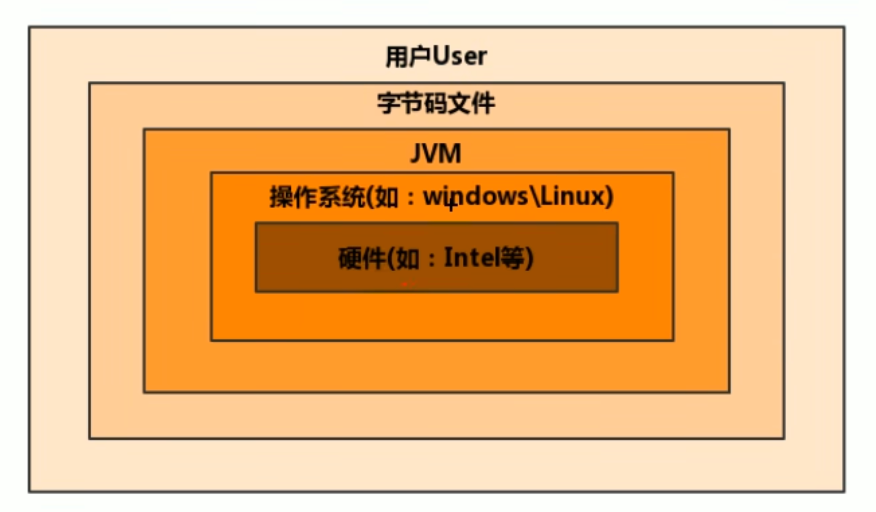
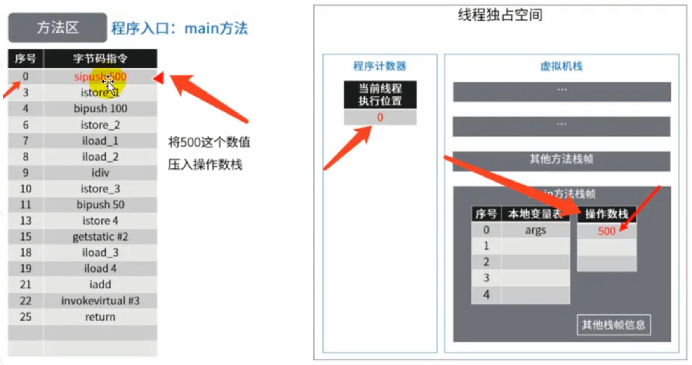
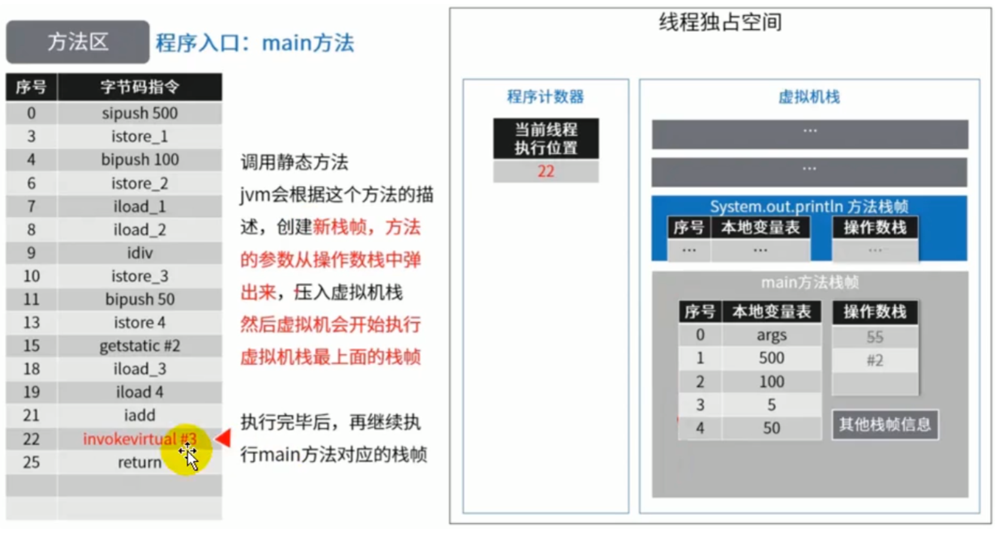
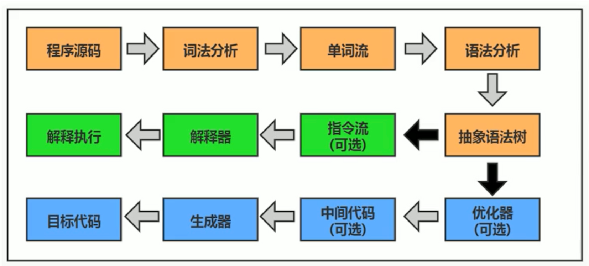
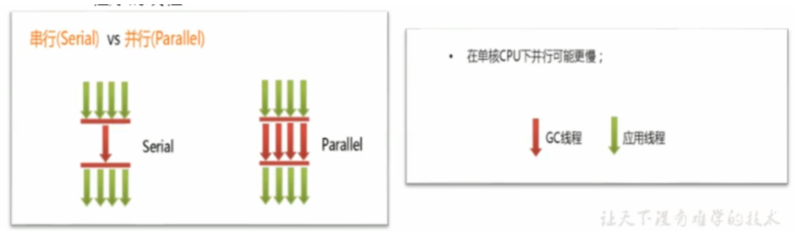
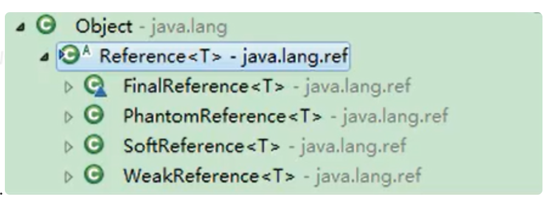
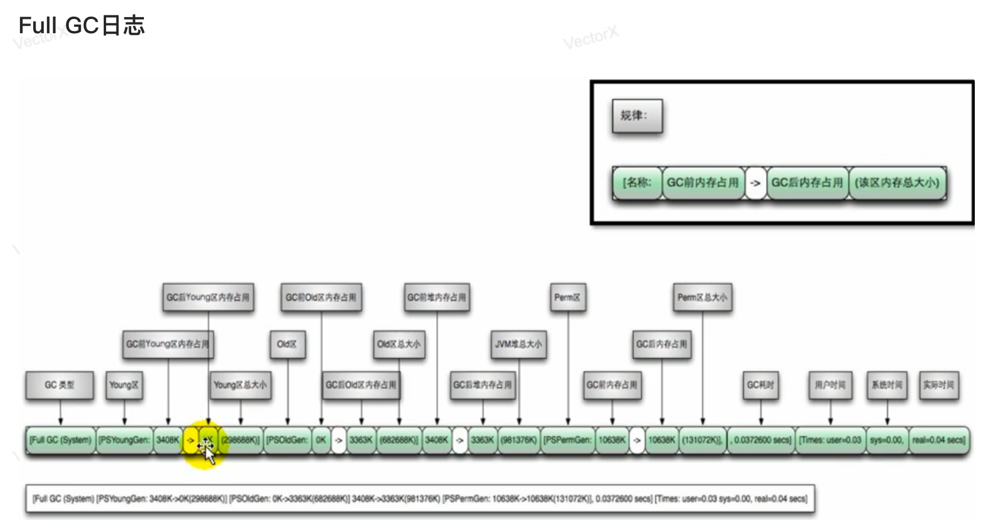
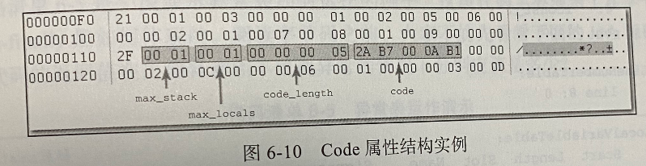
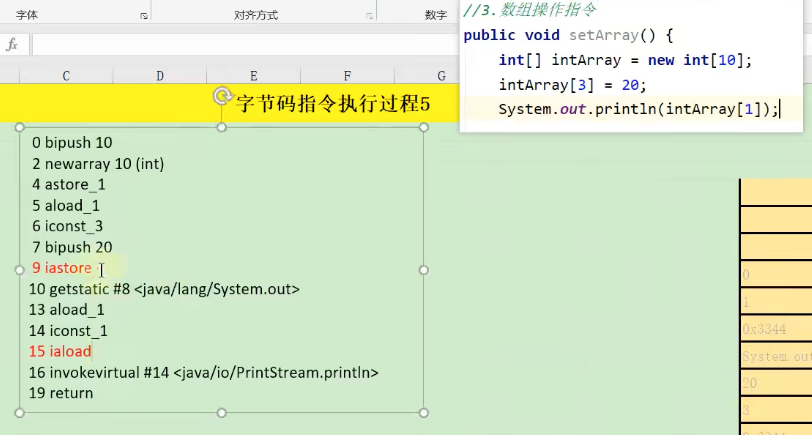
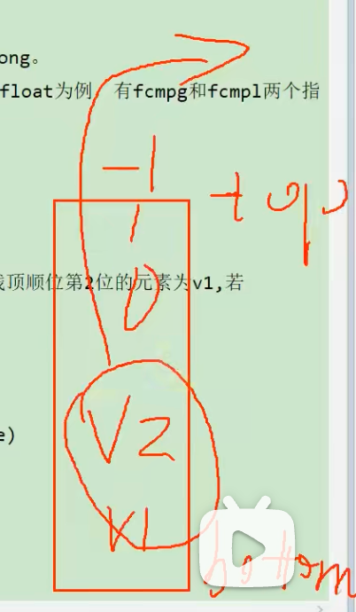

JVM虚拟机完整笔记：https://www.yuque.com/u21195183/jvm/kpugvm

# 前言

你是否也遇到过这些问题？

- 运行着的线上系统突然卡死，系统无法访问，甚至直接OOM
- 想解决线上JVM GC问题，但却无从下手
- 新项目上线，对各种JVM参数设置一脸茫然，直接默认吧，然后就 jj 了
- 每次面试之前都要重新背一遍JVM的一些原理概念性的东西，然布面试官却经常问你在实际项目中如何调优JVM参数，如何解决GC、oON等问题，一脸懵逼

大部分Java开发人员，除会在项目中使用到与Java平台相关的各种高精尖技术，**对于Java技术的核心Java虛拟机了解甚少**

***

> 开发人员如何看待上层框架

- 一些有一定工作经验的开发人员，打心眼儿里觉得SSM、微服务等上层技术才是重点，基础技术并不重要，这其实是一种本末倒置的“病态〞

- 如果我们把核心类库的 API 比做数学公式的话，那么Java 虚拟机的知识就好比公式的推导过程

***


计算机系统体系对我们来说越来越远，在不了解底层实现方式的前提下，通过高级语言很容易编写程序代码，但事实上计算机并不认识高级语言。

***

> 垃圾回收

**垃圾收集机制** 为我们打理了很多繁琐的工作，大大提高了开发的效率，但是，垃圾收集也不是万能的，懂得JVM内部的内存结构、工作机制，是设计高扩展性应用和诊断运行时问题的基础，也是Java工程师进阶的必备能力

> Java生态圈

Java是目前应用最为广泛的软件开发平台之一。随着Java以及Java社区的不断壮大。

Java 也早己不再是简简单单的一门计算机语言了，它更是一个平台、一种文化、一个社区

- **作为一个半台**，Java虚拟机扮演着举足轻重的作用，Groovy、scala、 JRuby、Kotlin等都是Java平台的一部分
- **作为一种文化**，Java几乎成为了 “开源” 的代名词，第三方开源软件和框架。如Tomcat、struts, MyBatis, spring等，就连JDK和JVM自身也有不少开源的实现，如OpenJDK、Harmony
- **作为一个社区**，Java拥有全世界最多的技术拥护者和开源社区支持，有数不清的论坛和资料。从桌面应用软件、联入式开发到企业级应用、后台服务器、中间件，都可以看到Java的身影。其应用形式之复杂、参与人数之众多也令人咋舌。

***

# 1. 内存与垃圾回收篇

## 1.1 JVM与Java体系结构

> 字节码

- 我们平时说的java字节码，指的是用java语言编译成的字节码。准确的说任何能在jvm平台上执行的字节码格式都是一样的。所以应该统称为：jvm字节码。

- 不同的编译器，可以编译出相同的字节码文件，字节码文件也可以在不同的JVM上运行。

- Java 虚拟机与 Java 语言并没有必然的联系，它只与特定的二进制文件格式—Class文件格式所关联，Class 文件中包含了 Java 虛拟机指令集（或者称为宇节码、Bytecodes）和符号表，还有一些其他辅助信息。

### 1.1.1 Java及JVM简介

> Java :跨平台的语言


> JVM：跨语言的平台


**Java虚拟机**根本不关心运行在其内部的程序到底是使用何种编程语言编写的，它只关心“**字节码**”文件。也就是说Java虛拟机拥有语言无关性，并不会单纯地与Java语言“终身绑定”，只要其他编程语言的编译结果满足并包含 Java虛拟机的内部指令集、符号表以及其他的辅助信息，它就是一个有效的字节码文件，就能够被虚拟机所识别并装载运行

> 总结：Java不是最强大的语言，但是JVM是最强大的虛拟机

***

### 1.1.2 虚拟机与Java虚拟机

> 虚拟机

所谓虛拟机(Virtual Mpchine)，就是一台虚拟的计算机。它是一款软件，用来执行一系列虚拟计算机指令。大体上，虚拟机可以分为**系统虚拟机**和**程序虚拟机**

- 大名鼎鼎的visual Box,VMware就属于系统虛拟机，它们**完全是对物理计算机的仿真**，提供了一个可运行完整操作系统的软件平台
- 程序虚拟机的典型代表就是Java虛拟机，它**专门为执行单个计算机程 序而设计**，在Java虚拟机中执行的指令我们称为Java字节码指令

无论是系统虚拟机还是程序虚拟机，在上面运行的软件都被限制于虚拟机提供的资源中

***

> Java 虚拟机

- Java虚拟机是一台执行Java字节码的虚拟计算机，它拥有独立的运行机制，其运行的Java字节码也未必由Java语言编译而成
- JVM平台的各种语言可以共享Java虚拟机带来的跨平台性、优秀的垃圾回器，以及可靠的即时编译器
- **Java技术的核心就是Java虚拟机** (JVM, Java Virtual Machine )，因为所有的Java程序都运行在Java虛拟机内部

***

> 作用

Java虚拟机就是二进制字节码的运行环境，负责装载字节码到其内部，解释/编译为对应平台上的机器指令执行。每一条Java指令，Java虚拟机规范中都有详细定义，如怎么取操作数，拿么处理操作数，处理结果放在哪里

特点：

- 一次编译，到处运行
- 自动内存管理
- 自动垃圾回收功能

***

> JVM 位置



JVM是运行在操作系统之上的，它与硬件没有直接的交互。

***

### 1.1.3 JVM整体结构

- HotSpot VM是目前市面上高性能虚拟机的代表作之一
- 它采用解释器与即时编译器并存的架构


黄色：方法区和堆，是线程共享的；灰色是线程独有的。

***

### 1.1.4 Java代码执行流程


***

### 1.1.5 JVM架构模型

Java编译器输入的指令流基本上是一种基子**栈的指令集架构**，另外一种指令集架构则

是基于**寄存器的指令集架构**

具体来说：这两种架构之间的区别：

- 基于栈式架构的特点

  - 设计和实现更简单，适用于资源受限的系统;
  - 避开了寄存器的分配难题：使用零地址指令方式分配
  - 指令流中的指令大部分是零地址指令，其执行过程依赖于操作栈。指令集更小，编译器容易实现
  - 不需要硬件文持，可移植性更好，更好实现跨平台

- 基于寄存器架构的特点

  - 典型的应用是x86的二进制指令集：比如传统的BC以及Android的Davlik虚

    拟机

  - 指令集架构则完全依赖硬件，可移植性差

  - 性能优秀和执行更高效

  - 花费更少的指令去完成一项操作

  - 在大部分情況下，基于寄存器架构的指令集往往都以一地址指令、二地址指令和三地址指令为主，市基于栈式架构的指令集却是以零地址指令为主

> 举例1

同样执行 2 + 3 这种逻辑操作，其指令分别如下：

> 基于栈的计算流程（指令集小，但执行指令更多）

```java
iconst_2   // 常量2入栈
istore_1   // 放到索引1的位置
iconst_3   // 常量3入栈
istore_2   // 放到索引2的位置
iload_1    // 加载进来
iload_2    // 加载进来
iadd       // 常量2，3出栈，执行相加
istore_3   // 结果5放到索引3的位置
```

> 基于寄存器的计算流程（指令集多，但执行指令少）

```java
mov eax,2  // 将eax寄存器的值设为1
add eax,3  // 使eax寄存器的值加3
```

***

> 总结

**由于跨平台性的设计，Java的指令都是根据栈来设计的**。不同平台CPU架构不同，所以不能设计为基于奇存器的。 优点是跨平台，指令集小，编译器容易实现，缺点是性能下降，实现同样的功能需要更多的指令。

时至今日，尽管嵌入式平台已经不是Java程序的主流运行平台了（准确水说应该是HotspotVM 的宿主环境已经不局限于嵌入式平台了），那么为什么不将架构更换为基于奇存器的架构呢？

栈：

跨平台性、指令集小、指令多、；执行性能比寄存器差

***

### 1.1.6 JVM生命周期

> 虚拟机的启动

Java虚拟机的启动是通过引导类加载器 (bootstrap class loader)创建一个初始类(initial class)来完成的，这个类是由虚拟机的具体实现指定的。

***

> 虚拟机的执行

- 一个运行中的Java虚拟机有着一个清哳的任务：执行Java程序。
- 程序开始执行时他才运行，程序结束时他就停止。
- **执行一个所谓的Java程序的时候，真真正正在执行的是一个叫做Java虚拟机的进程**。

***

> 虛拟机的退出

有如下的几种情况：

- 程序正常执行结束
- 程序在执行过程中遇到了异常或错误而异常终止
- 由于操作系统出现错误而号致Java虛拟机进程终止
- 某线程调用Runtime 类或system类的exit方法，或 Runtime 类的halt方法，并且Java 安全管理器也允许这次exit或halt操作
- 除此之外，JNI ( Java Native Interface)规范描述了用JNI Invocation API来加载或卸载 Java虚拟机时，Java虚拟机的退出情况

***

### 1.1.7 JVM发展历程

> Sun Classic VM

- 早在1996年Java1.0版本的时候，sun公司发布了一款名为Sun Classic VM的Java虚拟机，它同时也是**世界上第一款商用Java虚拟机**，JDK1 .4时完全被淘汰
- 这款虚拟机内部**只提供解释器**
- 如果使用 JIT 编译器，就需要进行外挂。但是一旦使用了JIT编译器，JIT就会接管虚拟机的执行系统。解释器就不再工作。解释器和编译器不能配合工作。
- 现在hotspot内置了此虚拟机。

```java
举例：解释器理解成一行一行执行，如果for循环，也会一行一行执行；
JIT编译器就是将热点代码重复执行的缓存起来。
  
生活案例：
A地点到B地点：解释器就是走路，一说开始，解释器就开始执行了，无需等待；而JIT就理解成坐公交车，说开始时可能等公交车等了十分钟才来（前期等待时间长，无响应），等坐上车之后后续又下车，然后继续等公交车（后续可能会追上步行，但是等确实耗费时间，说不定还没步行快）。

后面将解释器和JIT结合使用，有些地方走路快的，就不等公交车。结合起来效率更高。
```

***

> Exact VM

- 为了解决上一个虚拟机问题，jak1.2时，sun提供了此虛拟机
- Bxact Memory Management： 准确式内存管理
  - 也可以叫Non-conservat ive/Accurate Memory Management
  - **虚拟机可以知道内存中某个位置的数据具体是什么类型。**
- 其备现代高性能虚拟机的雏形
  - 热点探测
  - 编译器与解释器混合工作模式
- 只在Solaris平台短暂使用，其他平台上还是classic vm
  - 英雄气短，终被Hotspot虛拟机替换

***

> SUN公司的 HotSpot VM

- HotSpot历史
  - 最初面一家名为“tongviewrechnologies“的小公司设计
  - 1997年，此公司被sun收购;2009年，sun公司被甲骨文收购
  - JDK1.3时，Hotspot wM成为默认虚拟机
- 目前Hotspot占有绝对的市场地位，称霸武林
  - **不管是现在仍在广泛使用的JDK6，还是使用比例较多的JDK8中，默认的虚拟机都是 HotSpot**
  - Sun/oracle JDK和openJDK的默认虚拟机
  - 因此本课程中默认介绍的虚拟机都是Hotspot，相关机制也主要是指HotSpot的GC机制。（比如其他两个商用虚拟机都没有方法区的慨念）
- 从服务器、桌面到移动端、嵌入式都有应用
- 名称中的Hotspot指的就是它的热点代码探测技术
  - 通过计数器找到最具编译价值代码，触发即时编译或栈上替换
  - 通过编译器与解释器协同工作，在最优化的程序响应时间与最佳执行性能中取得平衡

***

> BEA 的 JRockit

- 专注于服务器端应用
  - 它可以不太关注程序启动速度，因此JRockit内部不包含解析器实现，全部代码都拿即时编译器编译后执行
- 大量的行业基准测试显示，**JRockit JVM是世界上最快的JVM**
  - 使用JRockit产品，客户己经体验到了显著的性能提高（一些超过了70%）和硬件成本的减少（达50%）
- 优势：全而的Java运行时解决方案组合
  - JRockit面问延迟敏感型应用的解决方案JRockit Real Time提供以亳秒或微秒级的JVM响应时间，适合财务、军事指挥、电信网络的需要
  - Missioncontrol服务套件，它是一组以极低的开销来监控、管理和分析生产环境中的应用程序的工具。
- 2008年，BEA被Oracle收购
- oracle表达了整合两大优秀虛拟机的工作，大致在JDR 8中完成。整合的方式是在Hotspot的基础上，移植JRockit的优秀特性
- 高斯林：目前就职于谷歌，研究人工智能和水下机器人

***

> IBM 的 J9

- 全称：IBM Technology for Java Virtual Machine, 简称IT4J，内部代号：J9
- 市场定位与Hotspot接近，服务器端、桌面应用、嵌入式等多用途VM
- 广泛用于IBM的各种Java产品
- 目前，有影响力的三大商用虛拟机之一，也号称是世界上最快的Java虛拟机
- 2017年左右，IBM发布了开源J9 VM，命名为openJ9，交给Eclipse基金会管理，也称为 Eclipse openJ9

***

> TaobaoJVM

- 由AliJVM 团队发布。阿里，国内使用Java最强大的公司，覆盖云计算、金融、物流、电商等众多领域， 需要解决高并发、高可用、分布式的复合问题。有大量的开源产品
- **基于openJDK 开发了自己的定制版不AlibabaJDK**，简称AJDK。是整个阿里Java体系的基石
- 基于openJDK Hotspot VM 发布的国内第一个优化、**深度定制且开源的高性能服务器版Java虚拟机**
  - 创新的GCIH (GC invisible heap ）技术实现了off-heap，**即将生命周期较长的Java对象从heap中移到heap之外，并且GC不能管理GCIH内部的Java 对象，以此达到降低GC 的回收频率和提升GC 的回收效率的目的**
  - GCIH 中的**对象还能够在多个Java 虚拟机进程中实现共享**
  - 使用crc32 指令实现 JVM intrinsic 降低JNI 的调用开销
  - PMU hardware 的Java profiling tool 和诊断协助功能
  - 针对大数据场景的zenGC
- taobao vm应用在阿里产品上性能高，硬件严重依赖inte1的cpu，损失了兼容性，但提高了性能
  - 目前己经在淘宝、天猫上线，把Oracle 官方JVM 版木全部替换了

***

## 1.2 类加载子系统

### 1.2.1 内存结构概述

> 简图


***

> 详细图


***

### 1.2.2 类加载器与类的加载过程


- 类加载器子系统负责从文件系统或者网络中加载Class文件，class文件在文件开头有特定的文件标识
- ClassLoader只负责class文件的加载，至于它是否可以运行，则由Execution Engine决定
- 加载的类信息存放于一块称为方法区的内存空间。除了类的信息外，方法区中还会存放运行时常量池信息，可能还包括字符串字面量和数字常量（这部分常量信息是Class文件中常量池部分的内存映射）

***

> 类加载器ClassLoader角色


1. class file 存在于本地硬盘上，可以理解为设计师画在纸上的模板，而最终这个模板在执行的时候是要加载到JVM当中来根据这个文件实例化出n个一模一样的实例。
2. class file 加载到JVM中，被称为DNA元数据模板，**放在方法区**
3. 在.class文件一＞JVM ->最终成为元数据模板，此过程就要一个远输工具(类装载器 Class Loader)，扮演一个快递员的角色。

***

```java
public class HelloLoader {
  public static void main(String[] args) {
    System.out.println("Hello");
  }
}
```

> 类的加载过程


> 类的加载过程包括三个阶段：加载、链接、初始化


类的加载（广义）过程刚好第一个阶段也叫加载（狭义）

***

#### 1.2.2.1 加载

在加载阶段，Java虚拟机需要完成以下三件事情：

1. 通过一个类的全限定名获取定义此类的二进制字节流
2. 将这个字节流所代表的静态存储结构转化为方法区的运行时数据结构
3. **在内存中生成一个代表这个类的java.lang.Class对象**，作为方法区这个类的各种数据的访问入口

***

> 补充：加载.class文件的方式。上面第一点规则并没有指明要从哪里获取、如何获取。仅仅这一点空隙，Java虚拟机的使用者们就可以在加载阶段搭建出一个相当开放广阔的舞台，如下：

- 从本地系统中直接加载
- 通过网络获取，典型场景：Web Applet
- 从zip压缩包中读取，成为日后jar、war格式的基础
- 运行时计算生成，使用最多的是：动态代理技术
- 由其他文件生成，典型场景：JSP应用
- 从专有数据库中提取。class文件，比较少见
- 从加密文件中获取，典型的防CIass文件被反编译的保护措施

相对于类加载过程的其他阶段，非数组类型的加载阶段（准确的说，是加载阶段中获取类的二进制字节流的动作）是开发人员可控性最强的阶段。

加载阶段结束后，Java虚拟机外部的二进制字节流就按照虚拟机所设定的格式存储在方法区之中了。

加载阶段与链接阶段的部分动作（如一部分字节码文件格式验证动作）是交叉进行的，加载阶段尚未完成，链接阶段可能已经开始，但这些夹在加载阶段之中进行的动作，仍然属于链接阶段的一部分，这两个阶段的开始时间仍然保持着固定的先后顺序。

***

#### 1.2.2.2 链接

##### 1.2.2.2.1 验证

验证是链接阶段的第一步，并且验证阶段的工作量在虚拟机的类加载过程中占了相当大的比重。

Class文件并不一定只能由Java源码编译而来，它可以使用包括键盘 0 和 1 直接在二进制编译器中敲出 Class 文件在内的任何途径产生。Java虚拟机如果不检查输入的字节流，对其完全信任的话，很可能会因为载入了有错误或有恶意企图的字节码流而导致整个系统受攻击甚至崩溃，所以验证字节码是Java虚拟机保护自身的一项必要措施。

- 目的在于确保Class文件的字节流中包含信息符合当前虛拟机要求，保证被加载类的正确性，不会危害虛拟机自身安全
- 主要包括四种验证，**文件格式验证，元数据验证，字节码验证，符号引用验证**

***

<font color="red">1 文件格式验证</font>：第一阶段要验证字节流是否符合Class文件格式的规范，并且能被当前版本的虚拟机处理。这一阶段可能包括下面的验证点：

- 是否以魔术开头
- 主、次版本是否在当前Java虚拟机接受范围之内
- 指向常量的各种索引值中是否有指向不存在的常量或不符合的常量
- ...

该验证阶段的主要目的是保证输入的字节流能正确地解析并存储于方法区之内，格式上符合描述一个Java类型信息的要求。这阶段的验证是基于二进制字节流进行的，只有通过了这个阶段的验证之后，这段字节流才被允许进入 Java 虚拟机内存的方法区中进行存储，所以后面的三个验证阶段全部是基于方法区的存储结构上进行的，不会再直接读取、操作字节流了。

***

<font color="red">2 元数据验证</font>：第二阶段是对字节码描述的信息进行语义分析，以保证其描述的信息符合要求，这个阶段可能包括的验证点如下：

- 这个类是否有父类（除了 Object 之外，所有的类都应当有父类）
- 这个类是否继承了不被允许继承的类（final修饰的类）
- 如果这个类不是抽象类，是否实现了其父类或接口之中要求实现的所有方法。
- ...

第二阶段的主要目的是对类的元数据信息进行语义校验，保证不存在于Java语言规范定义相悖的元数据信息。

***

<font color="red">3 字节码验证</font>：第三阶段是整个验证过程中最复杂的一个阶段，主要目的是通过数据流分析和控制流分析，确定程序语义是合法的、符合逻辑的。在第二阶段对元数据信息中的数据类型校验完毕之后，这阶段就要对类的方法体（Class文件中的 Code属性）进行校验分析，保证被校验类的方法在运行时不会做出危害虚拟机安全的行为，例如：

- 保证任意时刻操作数栈的数据类型与指令代码序列都能配合工作，例如不会出现类似于“在操作栈放置了一个 int 类型的数据，使用时却按 long 类型来加载入本地变量表中”这样的情况。
- 保证任何跳转指令都不会跳转到方法体之外的字节码指令上。
- 保证方法体中的类型转换总是有效的，例如可以把一个子类对象赋值给父类数据类型，这是安全的，但是把父类对象赋值给子类数据类型，甚至把对象赋值给与它毫无继承关系、完全不相干的一个数据类型，则是危险和不合法的。
- ...

如果一个类型中有方法体的字节码没有通过字节码验证，那它肯定是有问题的；但如果通过了验证，也仍然不能保证它一定就是安全的。即使字节码验证阶段中进行了再大量、再严密的检查，也依然不能保证这一点。

***

<font color="red">4 符号引用验证</font>：最后一个阶段的校验行为发生在虚拟机将符号引用转化为直接引用的时候，这个转化动作将在链接的第三个阶段--解析阶段中发生。符号引用验证可以看作是对类自身以外（常量池中的各种符号引用）的各类信息进行匹配性校验，通俗来说就是，该类是否缺少或者被禁止访问它依赖的某些外部类、方法、字段等资源。本阶段通常需要校验下列内容：

- 符号引用中通过字符串描述的全限定名是否能找到对应的类
- 在指定类中是否存在符合方法的字段描述符及简单名称所描述的方法和字段
- 符号引用中的类、字段、方法的可访问性（private、protected、public、<package>是否可被当前类访问）
- ...

符号引用验证的主要目的是确保解析行为能正常执行，如果无法通过符号引用验证，Java虚拟机将会抛出一个 java.lang.IncompatibleClassChangeError 的子类异常，典型的如：java.lang.IllegalAccessError、java.lang.NoSuchFieldError、java.lang.NoSuchMethodError 等。

***

> 总结

​        验证阶段对于虚拟机的类加载机制来说，是一个非常重要的、但却不是必须要执行的阶段，因为验证阶段只有通过或者不通过的差别，只要通过了验证，其后就对程序运行期没有任何影响了。如果程序运行的全部代码（包括自己编写的、第三方包中的、从外部加载的、动态生成的等所有代码）都已经被反复使用和验证过，在生产环境的实施阶段就可以考虑使用` -Xverify:none` 参数来关闭大部分的类验证措施，以缩短虚拟机类加载的时间。

***

##### 1.2.2.2.2 准备

​        准备阶段是正式为类中定义的变量（即静态变量，被static修饰的变量）分配内存并设置类变量初始值的阶段，从概念上讲，这些变量所使用的内存都应当在方法区中进行分配，但必须注意到方法区本身是一个逻辑上的区域，在JDK1.7之前，HotSpot使用永久代来事项方法区时，实现是完全符合这种逻辑概念的；而在JDK1.7及之后，类变量则会随着Class对象一起存放在Java堆中，这时候“类变量在方法区”就完全是一种对逻辑概念的表述了。

**简言之，为类的静态变分配内存，并将其初始化为默认值**

- 为**类变量（static修饰）**分配内存并且设置该类变量的默认初始值，即零值。
- **这里不包含用final修饰的static，因为final在编译的时候就会分配了，准备阶段会显式初始化**
- 这里不会为实例变量分配初始化，类变量会分配在方法区中，而实例变量是会随着对象一起分配到 Java 堆中

```java
public static int value = 123;

变量 value 在准备阶段过后的初始值为 0 而不是 123，因为这时尚未开始执行任何Java方法，而把value赋值为 123 的 putstatic 指令是程序被编译后，存放于类构造器<clinit>（）方法之中，所以把value赋值为 123 的动作要到类的初始化阶段才会被执行。
```

***

> 基本数据类型的零值

| 数据类型 | 零值      | 数据类型  | 零值  |
| -------- | --------- | --------- | ----- |
| int      | 0         | boolean   | false |
| long     | 0L        | float     | 0.0f  |
| short    | (short) 0 | double    | 0.0d  |
| char     | '\u0000'  | reference | null  |
| byte     | (byte) 0  |           |       |

***

如果类字段的字段属性表中存在 ConstantValue 属性，那在准备阶段变量值就会被初始化为 ConstantValue 属性所指定的初始值，假设上面类变量 value 的定义修改为：

```java
public static final int value = 123;
```

编译时 Javac 将会为 value 生成 ConstantValue 属性，在准备阶段虚拟机就会根据 ConstantValue 的设置将 value 赋值为 123

***

##### 1.2.2.2.3 解析

- **将常量池内的符号引用转换为直接引用的过程**
- 事实上，解析操作往往会伴随着JVM在执行完初始化之后再执行
- 符号引用就是一组符号来描述所引用的目标。符号引用的字面量形式明确定义在 《java虛拟机规范》的Class文件格式中。直接引用就是直接指向目标的指针、相对偏移量或一个间接定位到目标的句柄
- 解析动作主要针对类或接口、字段、类方法、接口方法、方法类型等。对应常量池中的CONSTANT_Class_info、 CONSTANT _Fieldref_info、CoNSTANT_Methodref_info等

***

```java
public class HelloApp {
 	private static int a = 1; // prepare阶段： a = 0 ---> initial初始化：a = 1
  public static void main(String[] args) {
  }
}
```

***

#### 1.2.2.3 初始化

**简言之，为类的静态变量赋予正确的初始值**

- 初始化阶段就是执行类构造器方法<C1init>()的过程
- 此方法不需定义，是 javac 编译器自动收集类中的**所有类变量的赋值动作**和**静态代码块中的语句**合并而来（**如果没有static修饰的变量和代码块，字节码不会出现<C1init>**）
- 构造器方法中指令按语句在源文件中出现的顺序执行
- <clinit>()不同于类的构造器。（关联：构造器是虛拟机视角下的<init>()，每个类至少存在一个构造器，对应就是<init>）
- 若该类具有父类，JVM会保证子类的<Clinit>（）执行前，父类的<C1init>(）己经执行完毕
- 虛拟机必须保证一个类的<Clinit>（）方法在多线程下被同步加锁【类加载到内存只需加载一次，<Clinit>（）方法只调用一次】

***

问：Java编译器并不会为所有的类都产生<Clinit>（）初始化方法。哪些类在编译为字节码后，字节码文件中将不会包括<Clinit>（）方法？

- 一个类中并没有声明任何的类变量，也没有静态代码块时
- 一个类中声明类变量，但是没有明确使用类变量的初始化语句以及静态代码块来执行初始化操作时
- 一个类中包含 static final修饰的基本数据类型的字段，这些类字段初始化语句采用编译时常量表达式

***

> 验证子类的<Clinit>执行前，先执行父类的<C1init>

```java
public class ClassInitTest {
    private static int num = 1;
    static {
        num = 2;
        number = 20; // ok 虽然在下面定义，但是在准备阶段已经有默认值了，所以这里可以重新赋值，但不能引用
        System.out.println(num); // ok
        //System.out.println(number); // 报错，非法的前向引用（可以赋值，但是不能使用）
    }
    private static int number = 10; // linking之prepare：number = 0 --> initial: 20 --> 10
    public static void main(String[] args) {
        System.out.println(ClassInitTest.num);   // 2
        System.out.println(ClassInitTest.number);// 10
    }
}
```

> 验证父类优先于子类加载

```java
public class ClinitTest1 {
    static class Father {
        public static int A = 1;
        static {
            A = 2;
        }
    }
    static class Son extends Father {
        public static int B = A;
    }
    public static void main(String[] args) {
        // 先加载Father类（加载-链接-初始化），其次加载Son类
        System.out.println(Son.B);
    }
}
```

> 验证类只被加载一次

```java
public class DeadThreadTest {
    public static void main(String[] args) {
        Runnable r = () -> {
            System.out.println(Thread.currentThread().getName() + "开始");
            DeadThread dead = new DeadThread();
            System.out.println(Thread.currentThread().getName() + "结束");
        };
        Thread t1 = new Thread(r,"线程1");
        Thread t2 = new Thread(r,"线程2");
        t1.start();
        t2.start();
    }
}
class DeadThread {
    static {
        if (true) {
            System.out.println(Thread.currentThread().getName() + "初始化当前类");
            while (true) {}  // 死循环，不会结束，模拟当前类一直加载中
        }
    }
}

线程2开始
线程1开始
线程2初始化当前类
```

***

### 1.2.3 类加载器分类

- JVM 支持两种类型的类加载器，分别为**引导类加载器 (Bootstrap ClassLoader）**和**自定义类加载器 (User-Defined classLoader)**
- 从概念上来讲，自定义类加载器一般指的是程序中由开发人员自定义的一类类加载器，但是Java虚拟机规范却没有这么定义，而是**将所有派生于抽象类ClassIoader的类加载器都划分为自定义类加载器**【按这样划分的话，那么除了Bootstrap ClassLoader，剩下都属于自定义类加载器，见下图】
- 无论类加载器的类型如何划分，在程序中我们最常见的类加载器始终只有3个，如下所示：


**这里的四者之间的关系是包含关系。不是上层下层，也不是子父类的继承关系**

说明：Bootstrap ClassLoader是非java语言编写的，其他都是java语言编写的。

```java
public static void main(String[] args) {
    // 获取系统类加载器
    ClassLoader systemClassLoader = ClassLoader.getSystemClassLoader();
    System.out.println(systemClassLoader); // sun.misc.Launcher$AppClassLoader@18b4aac2
  
    // 获取其上层：扩展类加载器
    ClassLoader extClassLoader = systemClassLoader.getParent();
    System.out.println(extClassLoader); // sun.misc.Launcher$ExtClassLoader@1540e19d
  
    // 获取其上层：获取不到引导类加载器
    ClassLoader bootClassLoader = extClassLoader.getParent();
    System.out.println(bootClassLoader); // null
  
    // 对于用户自定义类来说，默认使用系统类加载器进行加载
    ClassLoader classLoader = ClassLoaderTest.class.getClassLoader();
    System.out.println(classLoader); // sun.misc.Launcher$AppClassLoader@18b4aac2
  
    // String类使用 引导类加载器进行加载 --> java核心类库都是使用引导类进行加载
    ClassLoader stringLoader = String.class.getClassLoader();
    System.out.println(stringLoader); //null
}
```

***

> 虚拟机自带的加载器

- 启动类加载器（也叫引导类加载器，Bootstrap ClassIoader)
  - 这个类加载使用C/C++语言实现的，嵌套在JVM内部
  - 它用来加载Java的核心库 (JAVA HOME/jre/lib/rt.jar、resources. jar等或sun.boot.ciass.path路径下的内容)，用于提供JVM自身需要的类
  - 并不继承自java. lang.classLoader，没有父加载器【C语言写的不可能继承Java的类】
  - **加载扩展类和应用程序 类加载器，并指定为他们的父类加载器**【扩展类和系统类加载器也是由Bootstrap ClassIoader加载，他俩也属于核心库中的】。
  - 出于安全考虑，Bootstrap启动类加载器只加载包名为java、javax、sun等开头的类
- 扩展类加载器 (Extension classLoader)
  - Java语言编写，由sun.misc.Launcher$ExtclassLoader实现
  - 派生于classIoader类
  - 父类加载器为**启动类加载器**
  - 从java.ext.dirs系统属性所指定的目录中加载类库，或从JDK的安装日录的 `jre/lib/ext` 子日录（扩展目录）下加载类库。**如果用户创建的JAR放在此日录下，也会自动由扩展类加载器加载。**
- 应用程序类加载器（系统类加载器 AppCIassIoader)
  - java语言编写，由sun.misc.Launcher$AppclassIoader实现
  - 派生于classIoader类
  - 父类加载器为**扩展类加载器**
  - 它负责加载环境变量classpath或系统属性 java.class.path 指定路径下的类库
  - **该类加载是程序中默认的类加载器**，一般来说，Java应用的类都是由它来完成加载
  - 通过ClassLoader#getsystemclassLoader()方法可以获取到该类加载器

***

> 引导类加载器

```java
 public static void main(String[] args) {
     System.out.println("********** 启动类加载器 ***********");
     URL[] urLs = Launcher.getBootstrapClassPath().getURLs();
     for (URL urL : urLs) {
         System.out.println(urL.toExternalForm());
     }
     // 从 jsse.jar 选择一个类，来看看他的类加载器是什么
     ClassLoader classLoader = Provider.class.getClassLoader();
     System.out.println(classLoader); // null  说明是引导类加载器加载的
   
     System.out.println("********** 扩展类加载器 ***********");
     String extDirs = System.getProperty("java.ext.dirs");
     for (String path : extDirs.split(";")) {
         System.out.println(path);
     }
     // 从 sunec.jar 选择一个类，来看看他的类加载器是什么
     ClassLoader classLoader1 = SunEC.class.getClassLoader();
     System.out.println(classLoader1); //  sun.misc.Launcher$ExtClassLoader@31befd9f  说明是扩展类加载器加载的
 }
********** 启动类加载器 ***********
file:/Library/Java/JavaVirtualMachines/jdk-1.8.jdk/Contents/Home/jre/lib/resources.jar
file:/Library/Java/JavaVirtualMachines/jdk-1.8.jdk/Contents/Home/jre/lib/rt.jar
file:/Library/Java/JavaVirtualMachines/jdk-1.8.jdk/Contents/Home/jre/lib/jsse.jar
file:/Library/Java/JavaVirtualMachines/jdk-1.8.jdk/Contents/Home/jre/lib/jce.jar
file:/Library/Java/JavaVirtualMachines/jdk-1.8.jdk/Contents/Home/jre/lib/charsets.jar
file:/Library/Java/JavaVirtualMachines/jdk-1.8.jdk/Contents/Home/jre/lib/jfr.jar
file:/Library/Java/JavaVirtualMachines/jdk-1.8.jdk/Contents/Home/jre/classes
null
********** 扩展类加载器 ***********
/Users/wing/Library/Java/Extensions:/Library/Java/JavaVirtualMachines/jdk-1.8.jdk/Contents/Home/jre/lib/ext:/Library/Java/Extensions:/Network/Library/Java/Extensions:/System/Library/Java/Extensions:/usr/lib/java
sun.misc.Launcher$ExtClassLoader@31befd9f
```

***

**用户自定义加载器**

- 在Java的日常应用程序开发中，类的加载几乎是由上述3种类加载器相互配合执行的，在必要时，我们还可以自定义类加载器，来定制类的加载方式。
- 为什么要自定义类加载器？
  - 隔离加载类
  - 修改类加载的方式
  - 扩展加载源
  - 防止源码泄漏

***

### 1.2.4 ClassLoader的使用说明

> 关于ClassLoader

Classloader类，它是一个抽象类，其后所有的类加载器都继承自ClassLoader （不包括启动类加载器）

相关方法略。。。

***

### 1.2.5 双亲委派机制

Java虚拟机对class文件采用的是**按需加载**的方式，也就是说当需要使用该类时才会将它的class文件加载到内存生成class对象。而且加载某个类的class 文件时，Java虚拟机采用的是**双亲委派模式**，即把请求交由父类处理，它是一种任务委派模式。

> 我们也创建java.lang包，并且也定义String类（跟核心类库String一样包名和类名）

```java
package java.lang;
public class String {
    static {
        System.out.println("test String");
    }
    // 当执行这个main方法时，会报错，为什么呢？
    // 因为String被引导类加载器加载了，然后去执行核心API String中的main方法，发现没找到，所以报错了
    public static void main(String[] args) {
        System.out.println("hello");
    }
}
```

> 测试

```java
public static void main(String[] args) {
    // 如果这里用的是自定义的String，那么一定会输出 "test String"，但是输出结果并没有
    String str = new String(); // 尝试使用系统类加载器对自定义类进行加载，但是会先向上委托，直到引导类这，引导类加载器看了下是java.lang包下的，所以引导类加载器可以加载，系统类加载器就不会去加载自定义类了，因此这里使用的是核心API的String
    System.out.println("hello" + str);
}
```

> 结论：假如自己定义了java.lang.String，项目中会使用这个而不是用的核心的String会出现什么后果，比如别人给我们一个这样的类，我放到项目中，然后项目直接就挂了


> 工作原理

1. 如果一个类加载器收到了类加载请求： 它并不会自己先去加载，而是把这个请求委托给父类的加载器去执行；
2. 如果父类加载器还存在其父类加载器，则进一步向上委托，依次递归，请求最终将到达顶层的启动类加载器
3. 如果父类加载器可以完成类加载任务，就成功返回，倘若父类加载器无法完成此加载任务，子加载器才会尝试自己去加载，**这就是双亲委派模式。**

***

> 双亲委派机制举例2


​        假如我们的程序中需要使用`SPI接口`，该接口属于核心API，使用双亲委派机制，依次到引导类加载器，引导类加载器去加载核心`rt.jar包`，该包存在一些`interface接口`，接口需要具体的实现类，实现类就涉及到`第三方的jar包`了，假如是`jdbc.jar`，这时候呢jar包属于第三方的了，不属于核心API，因此出现反向委派，依次向下委派给`系统类加载器`，因此具体实现类由`系统类加载器`进行加载。

**总结：核心API中的接口是引导类加载器进行加载，而实现类是由系统类加载器进行加载**

优势：

- 避免类的重复加载
- 保护程序安全，防止核心API被随意篡改
  - 自定义类：java.lang.String
  - 自定义类：java.lang.ShkStart

***

```java
/* 在 java.lang 包下写一个自定义类 */
package java.lang;
public class WsyStart {
    
    public static void main(String[] args) {
        System.out.println("hello");
    }
}
// 启动main方法会报错
Exception in thread "main" java.lang.SecurityException: Prohibited package name: java.lang
```

**原因**：定义在 java.lang 包下的类由引导类加载器进行加载，发现这个不是核心API，所以提示不允许加载

**好处**：保护程序，不然随便写个恶意程序攻击引导类加载器，会导致系统崩溃。

***

> 沙箱安全机制

自定义string类，但是在加载自定义string类的时候会率先使用引导类加载器加载，而引导类加载器在加载的过程中会先加载jdk自带的文件(rt.jar包中java\lang\string.class)，报错信息说没有main方法，就是因为加载的是rt.jar包中的string类。这样可以保证对java核心源代码的保护，这就是**沙箱安全机制**

***

### 1.2.6 其他

- 在 JVM 中表示两个 class 对象是否为同一个类，存在两个必要条件：
  - 类的完整类名必须一致，包括包名
  - 加载这个类的ClassLoader(指ClassIoader实例对象）必须相同。

换句话说，在 JVM 中，即使这两个类对象（Class对象）来源同—个Class文件，被同一个虚拟机所加载，但只要加载它们的ClassLoader实例对象不同，那么这两个类对象也是不相等的。

***

> 对类加载器的引用

​        JVM必须知道一个类型是由`启动加载器`加载的还是由`用户类加载器`加载的。如果一个类型是由用户类加载器加载的，那么 JVM 会**将这个类加载器的一个引用作为类型信息的一部分保存在方法区中（这样类调用getClassLoader()就可以知道当前类是哪个加载器加载的了）**。

当解析一个类型到另一个类型的引用的时候，JVM需要保证这两个类型的类加载器是相同的。

***

#### 1.2.6.1 类的主动使用和被动使用

Java程序对类的使用方式分为：**主动使用和被动使用**

- 主动使用，又分为七种情况：

  - 创建类的实例，使用new

  - 访问某个类或接口的静态变量，或者对该静态变量赋值

  - 调用类的静态方法

  - 反射（比如： Class .forName (“com.atguigu.Test"))

  - 初始化一个类的子类

  - Java虚拟机启动时被标明为启动类的类

  - JDK 7开始提供的动态语言支持

    java. lang .invoke .MethodHandle实例的解析结果 REF_ getstatic、 REF putstatic、 REF_ invokestatic句柄对应的类没有初始化，则初始化

除了以上七种情况，其他使用Java类的方式都被看作是对**类的被动使用**，都**不会导致类的初始化**（被动使用也是使用，也会被加载，但是不会被初始化）

也就是说：**并不是在代码中出现的类，就一定会被加载或者初始化。如果不符合主动使用的条件，类就不会初始化**

***

> 被动使用案例

1.静态字段

```java
/*
 * 通过子类引用父类的静态字段，不会导致子类初始化
 */
public class PassiveUse {
    @Test
    public void test() {
        System.out.println(Child.num);  // 获取父类的类变量
    }
}
class Child extends Parent {
    static {
        System.out.println("Child类的初始化");
    }
}
class Parent {
    static {
        System.out.println("Parent类的初始化");
    }
    public static int num = 1;
}

Parent类的初始化
1
```

结论：当通过子类引用父类的静态变量，不会导致**子类**初始化，只有真正声明这个字段的类（父类）才会被初始化。假如下面，现在打印子类类变量，是不是只初始化子类，而不用初始化父类的？错，java基础就是，只要初始化子类，那么要优先初始化它的父类。

```java
public class PassiveUse {
    @Test
    public void test() {
        System.out.println(Child.num1);  // 子类的类变量
    }
}
class Child extends Parent {
    public static int num1 = 1;
    static {
        System.out.println("Child类的初始化");
    }
}
class Parent {
    static {
        System.out.println("Parent类的初始化");
    }
    public static int num = 1;
}
Parent类的初始化
Child类的初始化
1
```

2.数组定义：通过数组定义类引用，不会触发此类的初始化

```java
Parent[] parents= new Parent[10];   // 这里虽然new 了，但是不会初始化 Parent 类。
System.out.println(parents.getClass());
// new的话才会初始化
parents[0] = new Parent();
```

3.引用常量：引用常量不会触发此类或接口的初始化。因为常量在链接阶段就已经被显式赋值了

```java
/*
 * 常量在编译阶段会存入调用类的常量池中，本质上没有直接引用到定义常量的类，
 * 因此不会触发定义常量的类的初始化
 */
public class ConstClass {
    static {
        System.out.println("ConstClass init");
    }
    public static final String HELLO = "hello";
    public static String HELLO1= "hello";
}

class TestConstClass {
    public static void main(String[] args) {
        System.out.println(ConstClass.HELLO);  // 不会初始化
        System.out.println(ConstClass.HELLO1); // 会初始化
    }
}
hello
ConstClass init
hello
```

4.loadClass 方法：调用 ClassLoader 类的 loadClass()方法加载一个类，并不是对类的主动使用，不会导致类的初始化

```java
Class clazz = ClassLoader.getSystemClassLoader().loadClass("com.test.java.Person");
```

***

## 1.3 运行时数据区概述及线程


***


***

​        **内存** 是非常重要的系统资源，是**硬盘**和**CPU** 的中间仓库及桥梁，承载着操作系统和应用程序的实时运行。**JVM 内存布局规定了Java在运行过程中 内存申请、分配、管理的策略**，保证了JVM的高效稳定运行。**不同的 JVM 对于内存的划分方式和管理机制存在着部分差异**。结合 JVM 虚拟机规范，来探讨一下经典的 JVM 内存布局


***


***

​        Java虚拟机定义了若干种程序运行期间会使用到的运行时数据区，其中有一些会随着虛拟机启动而创建，随着虛拟机退出而销毀。另外一些则是与线程一一对应的，这些与线程对应的数据区域会随着线程开始和结束而创建和销毁。

**灰色**的为单独线程私有的，**红色**的为多个线程共享的。即：

- 每个线程：独立包括程序计数器、栈、本地栈。

- 线程间共享：堆、堆外内存（永久代或元空间、代码缓存）

  

  假如一个进程有5个线程，那么一个进程只有一个堆和方法区，每个线程都单独一份PC、VMS、NMS，5个线程共享一个堆和方法区。

  灰色基本都是进栈和出栈操作，不用进行什么优化，主要优化是在堆和方法区（java8后叫元空间），堆 95% 方法区 5%

**每个JVM只有一个Runtime实例（单例）。即为运行时环境，相当于内存结构的中间的那个框框：运行时环境**

***

> 线程

- 线程是一个程序里的运行单元。JVM允许一个应用有多个线程并行的执行
- 在Hotspot JVM 里，每个线程都与操作系统的本地线程直接映射
  - **当一个Java线程准备好执行以后，此时一个操作系统的本地线程也同时创建**。Java线程执行终止后，本地线程也会回收
- 操作系统负责所有线程的安排调度到任何一个可用的CPU上。一旦本地线程初始化成功，它就会调用Java线程中的run() 方法

***

## 1.4 程序计数器

也叫做 **PC寄存器**

JVM 中的程序计数寄存器 （Program counter Register) 中，Register 的命名源于CPU的寄存器，寄存器存储指令相关的现场信息。CPU只有把数据装载到寄存器才能够运行

这里，并非是广义上所指的物理寄存器，或许将其翻译为PC计数器（或指令计数器）会更加贴切（也称为程序钩子），并且也不容易引起一些不必要的误会。**JVM中的PC寄存器是对物理PC寄存器的一种抽象模拟**

***

> 作用

PC寄存器用来存储指向下一条指令的地址，也即将要执行的指令代码。由执行引擎读取下一条指令。


***

> PC寄存器介绍

- 它是一块很小的内存空间，几乎可以忽略不记。也是运行速度最快的存储区域
- 在 JVM 规范中，每个线程都有它自己的程序计数器，是线程私有的，生命周期与线程的生命周期保持一致。
- 任何时间一个线程都只有一个方法在执行，也就是所谓的**当前方法**。程序序计数器会存储当前线程正在执行的 Java方法的 JVM 指令地址；或者，如果是在执行 native 方法，则是未指定值 （undefined)
- **它是程序控制流的指示器**，分支、循环、跳转、异常处理、线程恢复等基础功能都依赖这个计数器来完成
- 字节码解释器工作时就是通过改变这个计数器的值来选取下一条需要执行的字节码指令
- **它是唯一一个在 Java 虚拟机规范中没有规定任何 outotMemoryError 情况的区域**

**补充：栈只是进栈，出栈，也没有GC垃圾回收，但是会OOM**，PC寄存器比较特殊，即没有GC，也没有OOM。

***


***

> 两个常见问题

> 问题1

**使用PC寄存器存储字节码指令地址有什么用呢？**

**为什么使用PC寄存器记录当前线程的执行地址呢？**

因为CPU需要不停的切换各个线程，这时候切换回来以后，就得知道接着从哪开始继续执行。

JVM 的字节码解释器就需要通过改变PC寄存器的值来明确下一条应该执行什么样的字节码指令。

***

> 问题2

**PC寄存器为什么会被设定为线程私有？**

我们都知道所谓的多线程在一个特定的时间段内只会执行其中某一个线程的方法，CPU 会不停地做任务切换，这样必然导致经常中断或恢复，如何保证分毫无差呢？为了能够准确地记录各个线程正在执行的当前字节码指令地址，最好的办法自然是为每一个线程都分配一个PC寄存器，这样一来各个线程之间便可以进行独立计算，从而不会出现相互干扰的情况。

**假如两个线程：第一个线程执行到5行，CPU切换到第二个线程执行到7行，CPU重新回到第一个线程后从哪里继续执行呢，所以需要每个线程一份PC寄存器来单独记录**

***

> CPU时间片

CPU 时间片即 CPU 分配给各个程序的时间，每个线程被分配一个时间段，称作它的时间片

**在宏观上**：我们可以同时打开多个应用程序，每个程序并行不悖，同时运行

**但在微观上**：由于只有一个 CPU，一次只能处理程序要求的一部分，如何处理公平，一种方法就是引入时间片，每个程序轮流执行


**并行 VS 串行：**

**并行**：同一个时间点有多个线程同时在执行

**串行**：多个线程排队执行，同一个时间点只有一个线程在执行

***

## 1.5 虚拟机栈

### 1.5.1 虚拟机栈概述

> 虛拟机栈出现的背景

由于跨平台性的设计，Java的指令都是根据栈来设计的。不同平台CPU架构不同，所以不能设计为基于寄存器的

**优点是跨平台，指令集小，编译器容易实现，缺点是性能下降，实现同样的功能需要更多的指令**

***

> 内存中的栈与堆

**栈是运行时的单位，而堆是存储的单位**

即：栈解決程序的运行问题，即程序如何执行，或者说如何处理数据。堆解決的是数据存储的问题，即数据怎么放、放在哪儿


***

> Java虚拟机栈是什么？

Java虚拟机栈 (Java Virtual Machine stack），早期也叫 Java 栈。每个线程在创建时都会创建一个虚拟机栈，其内部保存一个个的栈帧(stack Frame），对应着一次次的 Java方法调用（是线程私有的）

**生命周期**：生命周期与线程一致

**作用**：主管 Java 程序的运行，它保存方法的局部变量（8种基本数据类型、对象的引用地址）、部分结果，并参与方法的调用和返回。

- 局部变量 VS 成员变量（或属性）

***


最上面的栈叫**当前方法**，最上面的绿色出栈了，那么蓝色就是当前方法。

***

> 栈的特点（优点）

- 栈是一种快速有效的分配存储方式，访问速度仅次于程序计数器
- JVM直接对Java栈的操作只有两个：
  - 每个方法执行，伴随着进栈（入栈、压栈）
  - 执行结束后的出栈工作
- 对于栈来说不存在垃圾回收问题


***

> 栈中可能出现的异常

- Java 虚拟机规范允许 **Java栈的大小是动态的或者是固定不变的**
  - **如果采用固定大小的 Java 虛拟机栈**，那每一个线程的 Java 虚拟机栈容量可以在线程创建的时候独立选定。如果线程请求分配的栈容量超过 Java 虚拟机栈允许的最大容量，Java虚拟机将会抛出一个 **stackoverflowError 异常。**
  - **如果Java虚拟机栈可以动态扩展**，并日在尝试扩展的时候无法申请到足够的内存，或者在创建新的线程时没有足够的内存去创建对应的虚拟机栈，那Java虛拟机将会抛出一个 **OutOfMemoryError 异常**

***

> 设置栈内存大小

我们可以使用参数-Xss  选项来设置线程的最大栈空间，栈的大小直接决定了函数调用的最大可达深度。

***

### 1.5.2 栈的存储单位

> 栈中存什么

- 每个线程都有自己的栈，栈中的数据都是以**栈帧**(stack Frame）的格式存在
- 在这个线程上正在执行的每个方法都各自对应一个栈帧 (stack Frame)
- 栈帧是一个内存区块，是一个数据集，维系着方法执行过程中的各种数据信息

***

> 栈运行原理

- JVM 直接对 Java 栈的操作只有两个，就是对栈帧的**压栈**和**出栈**，遵循“先进后出“，“后进先出”原则
- 在一条活动线程中，一个时间点上，只会有一个活动的栈帧。即只有当前正在执行的方法的栈帧 （栈顶栈帧）是有效的，这个栈帧被称为**当前栈帧**(Current Frame )，与当前栈帧相对应的方法就是**当前方法** (Current Method），定义这个方法的类就是**当前类** (Current class)
- 执行引擎运行的所有字节码指令只针对当前栈帧进行操作。
- 如果在该方法中调用了其他方法，对应的新的栈帧会被创建出米，放在栈的顶端，成为新的当前帧
- 不同线程中所包含的栈帧是不允许存在相互引用的，即不可能在一个栈帧之中引用另外一个线程的栈帧
- 如果当前方法调用了其他方法，方法返回之际，兰前栈帧会传回此方法的执行结果给前一个栈帧，接著，虛拟机会丢弃当前栈帧，使得前一个栈帧重新成为当前栈帧。
- Java方法有两种返回函数的方式，**一种是正常的函数返回，使用return指令；另外一种是拋出异常。不管使用哪种方式，都会导致栈帧被弹出**


***

> 栈桢的内部结构

每个栈帧中存储着：

- **局部变量表（Local Variables)**
- **操作数栈 (operand stack)（或表达式栈）**
- 动态链接 (Dynamic Linking）（或指向运行时常量池的方法引用）
- 方法返回地址（Return Address)（或方法正常退出或者异常退出的定义）
- 一些附加信息


***


***

### 1.5.3 局部变量表

- 局部变量表也被称之为局部变最数组或本地变量表
- **定义为一个数字数组（八种数据类型和引用类型就是可以使用数字表示），主要用于存储方法参数和定义在方法体内的局部变量**，这些数据类型包括各类基本数据类型、对象引用 (reference），以及returnAddress 类型
- 由于局部变量表是建立在线程的栈上，是线程的私有数据，因此**不存在数据安全问题**
- **局部变量表所需的容量大小是在编译期确定下来的**，并保存在方法的 Code 属性的max imum local variables 数据项中。在方法运行期间是不会改变局部变量表的大小的。

***

> 解析例子


> 编译后使用 jclasslib工具打开（只研究testStatic方法）


**<testStatic>**: 当前方法名称是 testStatic

**<()V>**：没有入参，没有返回值

**[public static]**：公共访问权限的静态方法

***


**字节码**：代码编译后的字节码

**异常表**：当前方法没有异常，所以没有信息

**杂项**：局部变量数为 3 个（**局部变量表所需的容量大小是在编译期确定下来的**）

***


**LineNumberTable**：字节码和源代码行号对应表。比如字节码的**0行**对应代码**16行**，字节码的**8行**对应代码**17行**

***


**LocalVariableTable：**变量作用域范围（对应字节码行号）。比如**起始PC=8，长度=19**，说明变量test从字节码的第8行作用域开始，长度 19 （注意19不是行号），字节码总共有27行，刚好三个变量**起始PC**和**长度**相加都等于27，说明三个变量作用域都是在变量定义到方法结束。

***

> 变量槽slot的理解和演示

- 参数值的存放总是在局部变量数组的index0开始，到数组``长度-1``的索引结束

- 局部变量表，**最基本的存储单元是Slot（变量槽）**

- 局部变量表中存放编译期可知的各种基本数据类型(8种），引用类型(reference)， returnAddress 类型的变量

- 在局部变量表里，**32位以内的类型只占用一个slot（包括returnAddress 类型），64位的类型（long和double）占用两个slot**

  - byte、short、char 在存储前被转换为int，boolean 也被转换为int，0 表示false，非0 表示true
  - long 和double则占据两个Slot

- JVM 会为局部变量表中的每一个Slot 都分配一个访问素引，通过这个素引即可成功访问到局部变量表中指定的局部变量值

- 当一个实例方法被调用的时候，它的方法参数和方法体内都定义的局部变量将会**按照顺序被复制**到局部变量表中的每一个Slot上

- **如果需要访问局部变量表中一个64bit 的局部变量值时，只需要使用前一个索引即可**。（比

  如：访问 long 或 double 类型变量，占的索引位置是 4和5两个slot，那么只需要访问索引4即可）

- 如果当前帧是由构造方法或者实例方法创建（非静态）的，那么**该对象引用this将会存放在index为0的slot处**（所以实例方法可以使用this，因为局部变量表索引0第一个位置就保存了this），其余的参数按照参数表顺序继续排列。


***


weigth double类型，占用3和4两个索引位置。当调用weight变量，只要引用起始3索引位置就可以了。

***

> Slot 的重复利用

**栈帧中的局部变量表中的槽位是可以重用的**，如果一个局部变量过了其作用域，那么在其作用域之后申明的新的局部变量就很有可能会复用过期局部变量的槽位，**从而达到节省资源的目的**


正常有四个局部变量，分别是：this、a、b、c，但是b是代码块里面，出了代码块就出了作用域，这样b的槽位被下面的c重复利用，因此局部变量最大槽位是 3，而不是 4。


***

> 静态变量与局部变量的对比

- 参数表分配完毕之后，再根据方法体内定义的变量的顺序和作用域分配
- 我们知道**类变量表**有两次初始化的机会，第一次是在“**准备阶段**”，执行系统初始化，对类变量设置**零值**，另一次则是在 “**初始化**” 阶段，赋予程序员在代码中定义的**初始值**
- **和类变量初始化不同的是，局部变量表不存在系统初始化的过程，这意味着一旦定义了局部变量则必须人为的初始化，否则无法使用**

```java
public void test() {
  int i;
  System.out.println(i);
}
```

这样的代码是错误的，**没有赋值不能够使用**

***

变量的分类：

- 按照数据类型分：1） 基本数据类型 ；2）引用数据类型

- 按照在类中声明的位置分：1） 成员变量：在使用前，都经历过默认初始化赋值  

  ​                                                       **类变量**：linking 的 prepare 阶段：给类变量默认赋值 --> initial 阶段：给类变量显式赋值即静态代码块赋值 。

  ​                                                       **实例变量**：随着对象的创建，会在**堆空间**中分配实例变量空间，并进行默认赋值。

  ​                                   2）局部变量：在使用前，必须要进行显式赋值的，否则编译不通过。

**总结**：成员变量（类变量和实例变量）都有默认初始化，虽然没有显式赋值，也可以直接使用。但是局部变量没有默认值初始化，因此使用必须要显式初始化。


**补充说明**：

- 在栈帧中，与性能调优关系最为密切的部分就是前面提到的局部变量表。在方法执行时，虛拟机使用局部变量表完成方法的传递。
- **局部变量表中的变量也是重要的垃圾回收根节点，只要被局部变量表中直接或间接引用的对象都不会被回收**

***

### 1.5.4 操作数栈

- 每一个独立的栈帧中除了包含局部变量表以外，还包含一个**后进先出**（Last-In-First-Out）的操作数栈，也可以称之为**表达式栈** (Expression stack)
- **操作数栈，在方法执行过程中，根据字节码指令，往栈中写入数据或提取数据，即入栈 (push）/出栈 (pop)**
  - 某些字节码指令将值压入操作数栈，其余的字节码指令将操作数取出栈。使用它们后再把结果压入栈
  - 比如：执行复制、交换、求和等操作


- **如果被调用的方法带有返回值的话，其返回值将会被压入当前栈帧的操作数栈中**，并更新PC寄存器中下一条需要执行的字节码指令
- 操作数栈中元素的数据类型必须与字节码指令的序列严格匹配，这由编译器在编译器期间进行验证，同时在类加载过程中的类检验阶段的数据流分析阶段要再次验证
- 另外，我们说Java虚拟机的**解释引擎是基于栈的执行引擎**，共中的栈指的就是操作数栈。
- 操作数栈，**主要用于保存计算过程的中间结果，同时作为计算过程中变量临时的存储空间**
- 操作数栈就是JVM执行引擎的一个工作区，当一个方法刚开始执行的时候，一个新的栈帧也会随之被创建出来，**这个方法的操作数栈是空的**（操作数栈使用数组实现，操作数栈创建了，说明数组已经创建，创建数组需要指明长度，说明长度也知道了）
- 每一个操作数栈都会拥有一个明确的栈深度用于存储数值，其所需的最大深度在编译期就定义好了，保存在方法的code属性中，为max_ stack的值
- 栈中的任何一个元素都是可以任意的Java数据类型
  - 32bit的类型占用一个栈单位深度
  - 64bit的类型占用两个栈单位深度
- 操作数栈**并非采用访问索引的方式来进行数据访问的**，而是只能通过标准的入栈（push）和出栈 (pop）操作来完成一次数据访问

***

### 1.5.5 代码追踪

```java
public void testAddOperation() {
    // byte、short、char、boolean：都以int型来保存
    byte i = 15;
    int j = 8;
    int k = i + j;
}

// 编译后
 0 bipush 15   
 2 istore_1
 3 bipush 8    
 5 istore_2
 6 iload_1
 7 iload_2
 8 iadd
 9 istore_3
10 return
```

> 现在分析下上面的指令，看哪些与操作数栈相关，哪些与局部变量表相关。

> 开始前，操作数栈、局部变量表都是空的（但是编译完，操作数栈深度，局部变量表数组长度是确定的）

> 第一步：执行` bipush 15`


开始时，操作数栈、局部变量表都是空，PC寄存器记录下一个执行指令的地址0，当执行第一条指令时，将15 压入操作数栈

***

> 第二步：执行` istore_1`


将操作数栈元素拿到局部变量表中（放到哪个位置呢 istore_1，说明放到数组1的位置，0的位置保存了this），栈就没有元素了，PC寄存器保存下一条指令 2

***

> 第三步：执行` bipush 8`


同第一步操作

***

> 第四步：执行` istore_2`


同第二步操作

***

> 第五步和第六步


iload_1 和 iload_2 意思分别是将局部变量表中索引1和2的数据拿出放到操作数栈中。

***

> 第七步

iadd指令意思就是，在操作数栈取出两个元素进行相加，相加的结果重新放到操作数栈中。


***

> 第八步：执行` istore_3`


同上面操作。最后一步是return结束

***

### 1.5.6 栈顶缓存技术（了解）

前面提过，基于栈式架构的虛拟机所使用的零地址指令更加紧凑，但完成一项操作的时候必然需要使用更多的入栈和出栈指令，这同时也就意味着将需要更多的指令分派 (instruction dispatch）次数和内存读/写次数。

由于操作数是存储在内存中的，因此频繁地执行内存读/写操作必然会影响执行速度。为了解决这个问题，Hotspot JVM 的设计者们提出了栈顶缓存 (Tos, Top-of-stack Cashina）技术，**将栈项元素全部缓存在物理CPU的寄存器中，以此降低对内存的读/写次数，提升执行引擎的执行效率。**

寄存器特点（相对栈）：指令更少，执行速度快

***

### 1.5.7 动态链接


> 动态链接(或指向运行时常量池的方法引用）

- 每一个栈帧内部都包含一个指向**运行时常量池**中该栈帧所属方法的引用。包含这个引用的目的就是为了支持当前方法的代码能够实现**动态链接** (Dynamic Linking)。比如：invokedynamic指令

- 在Java源文件被编译到字节码文件中时，**所有的变量和方法引用都作为符号引用（Symbolic Reference） 保存在class文件的常量池里**。比如：描述一个方法调用了另外的其他方法时，就是通过常量池中指向方法的符号引用来表示的，那么**动态链接的作用就是为了将这些符号引用转换为调用方法的直接引用。**

***


***

> 为什么需要常量池

常量池的作用，就是为了提供一些符号和常量，便于指令的识别。

***

### 1.5.8 方法的调用：解析与分派

在JVM中，将`符号引用`转换为调用方法的`直接引用`与方法的绑定机制相关

符号引用是一定要转成直接引用的了，关键是这个转换过程是在编译期间确定下来的还是运行期间确定下来的，如果编译期间确定，那么就是静态链接；如果运行期间确定，那就是动态链接。

- **静态链接**
  - 当一个字节码文件被装载进JVM内部时，如果被调用的目标方法在编译期可知，且运行期保持不变时。这种情况下将调用方法的符号引用转换为直接引用的过程称之为静态链接
- **动态链接**
  - 如果**被调用的方法在编译期无法被确定下来**，也就是说，只能够在程序运行期将调用方法的符号引用转换为直接引用，由于这种引用转换过程具备动态性，因此也就被称之为动态链接

***

> 方法的调用

对应的方法的绑定机制为：早期绑定 (Early Binding）和晚期绑定(Late Binding）。**绑定是一个字段、方法或者类在符号引用被替换为直接引用的过程，这仅仅发生一次**

- **早期绑定**

早期绑定就是指被调用的**目标方法如果在编译期可知，且运行期保持不变**时，即可将这个方法与所属的类型进行绑定，这样一来，由于明确了被调用的目标方法究竟是哪一个，因此也就可以使用静态链接的方式将符号引用转换为直接引用

- **晚期绑定**

如果**被调用的方法在编译期无法被确定下来，只能够在程序运行期根据实际的类型绑定相关的方法**，这种绑定方式也就被称之为晚期绑定。

***

> 方法的调用：虚方法与非虚方法

非虚方法：

- 如果方法在编译期就确定了具体的调用版本，这个版本在运行时是不可变的。这样的方法称为非虚方法。
- 静态方法、私有方法、final方法、实例构造器、父类方法都是非虚方法（静态方法、私有方法、final方法这三个是不能被重写的，所以就不存在后面父类对象指向子类引用，这是非虚方法；实例构造器中去调用另一个构造器也是确定的；在子类中调用父类的方法也是确定的）
- 其他方法称为虚方法

**子类对象的多态性的使用前提：1）类的继承关系 2）方法的重写**

***

虛拟机中提供了以下几条方法调用指令：

- 普通调用指令：

  1. `invokestatic`：调用静态方法，解析阶段确定唯一方法版本【非虚方法】
  2. `invokespecial`：调用<init>方法、私有及父类方法，解析阶段确定唯一方法版本【非虚方法】
  3. `invokevirtual`：调用所有虚方法
  4. `invokeinterface`：调用接口方法

- 动态调用指令

  5. `invokedynamic`：动态解析出需要调用的方法，然后执行

     

前四条指令固化在虛拟机内部，方法的调用执行不可人为干预，而invokedynamic指令则支持由用户确定方法版本。其中**invokestatic指令和invokespecial指令调用的方法称为非虛方法，其余的(final修饰的除外）称为虛方法。**

***

```java
/**
 * invokestatic指令和invokespecial指令调用的方法称为非虛方法
 */
class Father {
    public Father() {
        System.out.println("father的构造器");
    }
    public static void showStatic(String str) {
        System.out.println("father " + str);
    }
    public final void showFinal() {
        System.out.println("father show final");
    }
    public void showCommon() {
        System.out.println("father 普通方法");
    }
}
public class Son extends Father{
    public Son() {
        // invokespecial
        super();
    }
    public Son(int age) {
        // invokespecial
        this();
    }
    public static void showStatic(String str) {
        System.out.println("son " + str);
    }
    private void showPrivate(String str) {
        System.out.println("son private " + str);
    }
    public void info() {
    }
    public void show() {
        // invokestatic
        showStatic("Wing");
        // invokestatic
        super.showStatic("good!");
        // invokespecial
        showPrivate("hello!");
        // invokespecial
        super.showCommon();
        // invokevirtual
        showFinal();  // 因为此方法声明有final，不能被子类重写，所以也认为此方法是非虚方法
        // invokevirtual 编译时确定不下来，因为子类可能重写该方法
        showCommon();
        info();

        MethodInterface in = null;
        // invokeinterface
        in.methodA();
    }
    public static void main(String[] args) {
        Son so = new Son();
        so.show();
    }
}
interface MethodInterface {
    void methodA();
}

// 字节码指令
 0 ldc #11 <Wing>
 2 invokestatic #12 <org/example/chapter05/Son.showStatic : (Ljava/lang/String;)V>
 5 ldc #13 <good!>
 7 invokestatic #14 <org/example/chapter05/Father.showStatic : (Ljava/lang/String;)V>
10 aload_0
11 ldc #15 <hello!>
13 invokespecial #16 <org/example/chapter05/Son.showPrivate : (Ljava/lang/String;)V>
16 aload_0
17 invokespecial #17 <org/example/chapter05/Father.showCommon : ()V>
20 aload_0
21 invokevirtual #18 <org/example/chapter05/Son.showFinal : ()V>
24 aload_0
25 invokevirtual #19 <org/example/chapter05/Son.showCommon : ()V>
28 aload_0
29 invokevirtual #20 <org/example/chapter05/Son.info : ()V>
32 aconst_null
33 astore_1
34 aload_1
35 invokeinterface #21 <org/example/chapter05/MethodInterface.methodA : ()V> count 1
40 return

```

***

> 方法的调用：关于invokedynamic指令

- JVM字节码指令集一直比较稳定，一直到Java7中才增加了一个 invokedynamic指令，这是**Java为了实现「动态类型语言」支持而做的一种改进**
- 但是在Java7中并没有提供直接生成invokedynamic指令的方法，需要借助ASM这种底层字节码工具来产生invokedynamic指令。**直到Java8的Lambda。 表达式的出现，invokedynamic指令的生成，在Java中才有了直接的生成方式**
- Java7中增加的动态语言类型支持的本质是对Java虚拟机规范的修改，而不是对Java语言规则的修改，这一块相对来讲比较复杂，增加了虚拟机中的方法调用，最直接的受益者就是运行在Java半台的动态语言的编译器

***

> 方法的调用：方法重写的本质

Java 语言中方法重写的本质：

1. 找到操作数栈顶的第一个元素所执行的对象的实际类型，记作C。
2. 如果在过程结束：如果不通类型 C 中找到与常量中`描述符`和`简单名称`都相符的方法，则进行访问权限校验，如果通过则返回这个方法的直接引用，查找过，则返回 java.lang. IIIegalAccessError 异常
3. 否则，按照继承关系从下往上依次对 C 的各个父类进行第 2步的搜索和验证过程
4. 如果始终没有找到合适的方法，则抛出 Java.lang.AbstractMethodError异常

***

> 方法的调用：虚方法表（避免每次找一个方法都要循环从当前类找到对应的父类，虚方法表直接记录方法指向对于的父类，这样就不用每次循环找了）

- 在面向对象的编程中，会很频繁的使用到动态分派，如果在每次动态分派的过程中都要重新在类的方法元数据中搜索合适的目标的话就可能影响到执行效率。因此，为了提高性能，JVM采用在类的方法区建立一个虚方法表virtual method table）（非虚方法不会出现在表中）来实现。**使用索引表来代替查找**
- 每个类中都有一个虚方法表，表中存放着各个方法的实际入口。
- 那么虚方法表什么时候被创建？【虛方法表会在类加载的链接-解析阶段被创建并开始初始化，类的变量初始值准备完成之后，JVM会把该类的方法表也初始化完毕】

***

### 1.5.9 方法返回地址


> 方法返回地址return address

- 存放调用该方法的pc寄存器的值
- 一个方法的结束，有两种方式：
  - 正常执行完成
  - 出现未处理的异常，非正常退出
- 无论通过哪种方式退出，在方法退出后都返回到该方法被调用的位置。方法正常退出时，**调用者的pc计数器的值作为返回地址，即调用该方法的指令的下一条指令的地址**。而通过异常退出的，返回地址是要通过异常表来确定，栈帧中一般不会保存这部分信息
- 本质上，方法的退出就是当前栈帧出栈的过程。此时，需要恢复上层方法的局部变量表、操作数栈、将返回值压入调用者栈帧的操作数栈、设置PC寄存器值等，让调用者方法继续执行下去。
- 正常完成出口和异常完成出口的区别在于：通过异常完成出口退出的不会给他的上层调用者产生任何的返回值

***

### 1.5.10 一些附加信息

略。

***

### 1.5.11 栈的相关面试题

> 1 举例栈溢出的情況？ StackOverFlowError

如果已经设置了固定大小的栈空间了，那么如果栈空间不足，会爆 StackOverFlowError；

如果允许栈空间动态扩展（不足时会申请扩容），如果没有可申请的空间，爆 OOM异常

***

> 2 调整栈大小，就能保证不出现溢出吗？

不一定，比如递归时，调整大小前 5000次就溢出，调整后 6000次才溢出，这只是溢出延后了，但是最终也还是溢出了。也可能调整后，刚好不溢出也是可能的

***

> 3 分配的栈内存越大越好吗？

不是

> 4 垃圾回收是否会涉及到虚拟机栈？

不会

> 5 方法中定义的局部变量是否线程安全？

见下面代码

具体问题具体分析

***


|            | GC   | Error |
| ---------- | ---- | ----- |
| 程序计数器 | x    | x     |
| 虚拟机栈   | x    | √     |
| 本地方法栈 | x    | √     |
| 堆         | √    | √     |
| 方法区     | √    | √     |

```java
// s1的声明方式是线程安全的，因为它是在方法内部new的，每个线程都有自己的
public static void m1() {
  StringBuilder s1 = new StringBuilder();
  s1.append("a");
  s1.append("b");
}

// s的操作过程是线程不安全的，因为s是外面传进来的，可能s是多个线程共享的数据。
public static void m2(StringBuilder s) {
  s.append("a");
  s.append("b");
}

// s1的不是线程安全的，因为它被返回出去有可能被其他线程使用
public static StringBuilder m3() {
  StringBuilder s1 = new StringBuilder();
  s1.append("a");
  s1.append("b");
  return s1;
}

// s1的声明方式是线程安全的
public static String m4() {
  StringBuilder s1 = new StringBuilder();
  s1.append("a");
  s1.append("b");
  return s1.toString();
}
```

> 总结：对象在方法内部产生，内部消亡的，是线程安全的；如果对象是传进来，或者对象是内部产生，但是被返回出去的，就不是线程安全的。

***

## 1.6 本地方法接口


***

> 什么是本地方法

简单地讲，**一个Native Method就是一个Java调用非Java代码的接口**。一个 Native Method是这样一个Java方法：该方法的实现由非Java语言实现，比如 C。这个特征并非Java所特有，很多其它的编程语言都有这一机制，比如在C++中，你可以用extern "c" 告知C++ 编译器去调用一个 C 的函数。

在定义一个native method时，并不提供实现体（有些像定义一个Java interface），因为其实现体是由非java语言在外面实现的

本地接口的作用是融合不同的编程语言为Java所用，它的初表是融合 C/C++程序

***

> 为什么要使用Native Method？

Java使用起来非常方便，然而有些层次的任务用Java实现起来不容易，或者我们对程序的效率很在意时，问题就来了。


- 与Java环境外交互：

**有时Java应用需要与Java外面的环境交互，这是本地方法存在的主要原因。**

你可以想想Java需要与一些底层系统，如操作系统或某些硬件交换信息时的情况。本地方法正是这样一种交流机制：它为我们提供了一个非常简洁的接口，而且我们无需去了解Java应用之外的繁琐的细节。

- 与操作系统交互：

JVM支持着Java语言本身和运行时库，它是Java程序赖以生存的平台，它由一个解释器（解释字节码）和一些连接到本地代码的库组成。然而不管怎样，它毕竟不是一个完整的系统，它经常依赖手一些底层系统的文持。这些底层系统常常是强大的操作系统。**通过使用本地方法，我们得以用Java实现了jre的与底层系统的交互，甚至 JVM的一些部分就是用c写的。还有，如果我们要使用一些Java语言本身没有提供封装的操作系统的特性时，我们也需要使用本地方法**

***

## 1.7 本地方法栈

- **Java虚拟机栈用于管理Java方法的调用，而本地方法栈用于管理本地方法的调用**
- 本地方法栈，也是线程私有的
- 允许被实现成固定或者是可动态扩展的内存大小。（在内存溢出方面是相同的）
  - 如果线程请求分配的栈容量超过本地方法栈允许的最大容量，Java虚拟机将会抛出一个 stackoverflowError异常
  - 如果本地方法栈可以动态扩展，并且在尝试扩展的时候无法申请到足够的内存，或者在创建新的线程时没有足够的内存去创建对应的本地方法栈，那么Java虛拟机将会抛出一个OutOfMemoryError 异常
- 本地方法是使用C语言实现的
- 它的具体做法是Native Method stack中登记native方法，在 Execution Engine 执行时加载本地方法库

***


## 1.8 堆

### 1.8.1 堆的核心概述

堆针对一个JVM进程来说是唯一的，也就是一个进程只有一个JVM，但是进程包含多个线程，他们是共享同一堆空间的。


- 一个JVM实例只存在一个堆内存，堆也是Java内存管理的核心区域。
- Java 堆区在 JVM 启动的时候即被创建，其空间大小也就确定了。是 JVM 管理的最大一块内存空间
  - 堆内存的大小是可以调节的
- 《Java虛拟机规范》规定，堆可以处于**物理上不连续**的内存空间中，但在**逻辑上它应该被视为连续的**
- 所有的线程共享 Java 堆，在这里还可以划分线程私有的缓冲区 (Thread Local Allocation Buffer, TIAB)（因为如果堆都是共享的话，会存在线程问题，所以堆又划分出一小块区域是线程私有的，每个线程一份）
- “几乎”所有的对象实例都在这里分配内存
- 数组和对象可能永远不会存储在栈上，因为栈帧中保存引用，这个引用指向对象或者数组在堆中的位置
- 在方法结束后，堆中的对象不会马上被移除，仅仅在垃圾收集的时候才会被移除
- 堆，是GC （ Garbage collection，垃圾收集器）执行垃圾回收的重点区域


***

> 堆内存细分

Java 7 及之前堆内存**逻辑上**分为三部分：**新生区+养老区+<font color="red">永久区</font>**

- Young Generation Space                       新生区   Young/New 
  - 又被划分为Eden区和Survivor区

- Tenure generation space                      养老区 Old/Tenure

- Permanent Space                                   永久区 Perm

***

Java 8及之后堆内存**逻辑上**分为三部分：**新生区+养老区+<font color="red">元空间</font>**

- Young Generation Space                       新生区 Young/New 
  - 又被划分为Eden区和Survivor区

- Tenure generation space                      养老区 Old/Tenure

- Meta Space                                              元空间 Meta

**约定**：新生区（代）<=>年轻代 、 养老区<=>老年区（代）、 永久区<=>永久代

***

> 堆空间内部结构 JDK 7


> 堆空间内部结构 JDK 8（永久代 PERMGEN被替换成了元空间METASPACE）


***

### 1.8.2 设置堆内存大小与OOM

> 堆空间大小的设置

- Java堆区用于存储Java对象实例，那么堆的大小在JVM启动时就已经设定好了，大家可以通过选项"-Xmx"和"-Xms"来进行设置
  - “-Xms"用于表示堆区的起始内存，等价于`-XX:InitialHeapSize`
  - “-Xmx"则用于表示堆区的最大内存，等价于`-XX:MaxHeapSize`
- 一旦堆区中的内存大小超过“-Xmx"所指定的最大内存时，将会抛出OutOfMemoryError异常
- 通常会将-Xms和-Xmx两个参数配置相同的值，其**目的是为了能够在ava垃圾回收机制清理完堆区后不需要重新分隔计算堆区的大小，从而提高性能**
- 默认情况下
  - 初始内存大小：物理电脑内存大小 / 64
  - 最大内存大小：物理电脑内存大小 / 4

***

```java
/**
 * 1. 设置堆空间大小的参数
 * -Xms 用来设置堆空间（年轻代+老年代）的初始内存大小
 *      -X：是 JVM 的运行参数
 *      ms：是 memory start
 * -Xmx 用来设置堆空间（年轻代+老年代）的最大内存大小
 *
 * 2. 默认堆空间大小
 *    初始内存大小：物理电脑内存大小 / 64
 *    最大内存大小：物理电脑内存大小 / 4
 *
 * 3. 手动设置：-Xms600m -Xmx600m
 *        开发中建议将初始值内存和最大的堆内存设置成相同的值
 *
 * 4.查看设置的参数：
 *        方式一：jps   /  jstat -gc 进程id
 *        方式二：-xx:+PrintGCDetails
 */
public class HeapSpaceInitial {
    public static void main(String[] args) {
        long initialMemory = Runtime.getRuntime().totalMemory() / 1024 / 1024;
        long maxMemory = Runtime.getRuntime().maxMemory() / 1024 / 1024;
        System.out.println("-Xms:" + initialMemory + "M");
        System.out.println("-Xmx:" + maxMemory + "M");

        System.out.println("系统内存大小为:" + initialMemory * 64.0 / 1024 + "G");
        System.out.println("系统内存大小为:" + maxMemory * 4.0 / 1024 + "G");
    }
}
```

> OutOfMemory举例

```java
public class OOMTest {
    public static void main(String[]args){
        ArrayList<Picture> list = new ArrayList<>();
        while(true){
            try {
                Thread.sleep(20);
            } catch (InterruptedException e){
                e.printStackTrace();
            }
            list.add(new Picture(new Random().nextInt(1024*1024)));
        }
    }
}

Exception in thread "main" java.lang.OutofMemoryError: Java heap space
    at com.atguigu. java.Picture.<init>(OOMTest. java:25)
    at com.atguigu.java.O0MTest.main(OOMTest.java:16)
```

***

### 1.8.3 年轻代与老年代

堆空间由年轻代与老年代构成

- 存储在JVM中的Java对象可以被划分为两类：
  - 一类是生命周期较短的瞬时对象，这类对象的创建和消亡都非常迅速
  - 另外一类对象的生命周期却非常长，在某些极端的情况下还能够与JVM的生命周期保持一致
- Java堆区进一步细分的话，可以划分为年轻代（YoungGen）和老年代（oldGen）
- 其中年轻代又可以划分为Eden空间、Survivor0空间和Survivor1空间（有时也叫做from区、to区）


**白话解释**：对象最开始创建的位置在`Eden（伊甸园区）`，后续GC`Eden`时，有的对象回收成功，而有的对象还存活着，那`Eden`中的对象会被放到 `Survivor （幸存者 区）`（具体0区还是1区后面讲），如果幸存者区的对象一定时间后还继续存活，那么会放到`Old Gen（老年区）`

***

下面这参数开发中一般不会调：


- 配置新生代与老年代在堆结构的占比
  - 默认`-XX:NewRatio=2`，表示新生代占1，老年代占2，新生代占整个堆的1/3
  - 可以修改`-XX:NewRatio=4`，表示新生代占1，老年代占4，新生代占整个堆的1/5
- 在HotSpot中，Eden空间和另外两个survivor空间缺省所占的比例是8:1:1
  - `-XX:-UseAdaptivesizePolicy` :关闭自适应的内存分配策略(暂时用不到) 不然看不到8:1:1
- 当然开发人员可以通过选项“`-xx:SurvivorRatio`”调整这个空间比例。比如`-xx:SurvivorRatio=8`
- **几乎所有**的Java对象都是在Eden区被new出来的。（假如new的对象特别大，Eden都放不下，就只能直接在老年代存放了）
- 绝大部分的Java对象的销毁都在新生代进行了
  - IBM公司的专门研究表明，新生代中80%的对象都是“朝生夕死”的。
- 可以使用选项"`-Xmn`"设置新生代最大内存大小（这个是具体指明多大内存，那如果上面也设置了比例呢，怎么知道用多大？如果设置了具体大小，那就按这个设置为准了，上面设置的比例就失效了）
  - 这个参数一般使用默认值就可以了。

***


***

### 1.8.4 图解对象分配过程

​        为新对象分配内存是一件非常严谨和复杂的任务，JVM 的设计者们不仅需要考虑内存如何分配、在哪里分配等问题，并且由于内存分配算法与内存回收算法密切相关，所以还需要考虑GC执行完内存回收后是否会在内存空间中产生内存碎片

1.  new的对象先放伊甸园区。此区有大小限制。 
2.  当伊甸园的空间填满时，程序又需要创建对象，JVM 的垃圾回收器将对伊甸园区进行垃圾回收（MinorGC），将伊甸园区中的不再被其他对象所引用的对象进行销毁。再加载新的对象放到伊甸园区 
3.  然后将伊甸园中的剩余对象移动到幸存者0区。 
4.  如果再次触发垃圾回收，此时上次幸存下来的放到幸存者0区的，如果没有回收，就会放到幸存者1区
5.  如果再次经历垃圾回收，此时会重新放回幸存者0区，接着再去幸存者1区。 
6.  啥时候能去养老区呢？可以设置次数。默认是15次
    - 可以设置参数：进行设置`-Xx:MaxTenuringThreshold= N`
7.  在养老区，相对悠闲。当养老区内存不足时，再次触发GC：Major GC，进行养老区的内存清理
8.  若养老区执行了Major GC之后，发现依然无法进行对象的保存，就会产生OOM异常

***


​        Eden满了，如果再次new对象，那么会触发MinorGC，经过GC后，红色被清理了，而绿色还存活，那么把这两个提升到幸存者0区，刚从Eden到幸存者区的，都有个age记录，刚过来值是1。最终Eden就被清空了，S0有两个对象


​         Eden又满了，如果再次new对象，那么会继续触发MinorGC，那么这时会放到空的幸存者1区，**顺便判断幸存者0区的两个对象是否还存活**，不存活的话就会被GC，如果还继续存活那么幸存者0区的也会拿过来，这时Eden和幸存者0区都空了，而幸存者1区有三个对象（加入0区的两个还继续存活），但age不同了。


​        循环上面过程，直到幸存者的age达到阈值，那么就会提升到老年代。


**重点：**

**1）什么时候会触发MinorGC呢？**

**答：Eden满的时候会触发。**

**2）那么S0或S1区满的时候是否触发MinorGC呢？毕竟S区空间是比较小的**

**答：不会触发**

**3）那S区什么时候才进行MinorGC**

**答：当Eden满的时候触发MinorGC时，GC伊甸园区时，也会GC 幸存者区**

**4）有没可能没有到临界值 15 就提升到 老年区呢？**

**答：有**

**5）有没可能刚new的对象直接到老年区呢？**

**答：有，当存一个超大对象时，发现Eden放不下，那么会触发YGC，GC之后还是放不下（GC后Eden是空的），说明是超大对象，Eden全部空间都放不下，那么直接放到老年区但是假如老年区也放不下，那么会触发FGC，然后再放到老年区，如果FGC后老年区还是放不下，就爆OOM异常**。

***

> 流程图


流程图有几个晋升老年区的特殊情况：

1. 如果刚new一个大对象时，Eden放不下，执行GC之后还是放不下，此时会直接将对象放到老年区（如果老年区还放不下，那么先执行老年区的FGC，然后放进去，如果还放不进去，报 OOM）
2. 如果Eden已经保存了很多对象，当Eden满了执行 YGC 时，需要回收Eden，剩下不能回收的对象需要从 Eden 保存到 幸存者区，但此时幸存者也满了，所以直接将Eden还幸存的对象保存到老年区。

> 代码


> 根据图表示数据存放情况（横坐标-时间，纵坐标-数据量）


***

> 总结

关于垃圾回收：频繁在新生区收集，很少在老年代收集，几乎不再永久代和元空间进行收集

***

**常用调优工具（在JVM下篇：性能监控与调优篇会详细介绍）**

- JDK命令行

- Eclipse:Memory Analyzer Tool

- Jconsole

- VisualVM

- Jprofiler

- Java Flight Recorder

- GCViewer

- GC Easy

***

### 1.8.5 Minor GC、Major GC、Full GC

**JVM 调优目的就是减少 GC**，因为GC太频繁会影响用户线程，GC时，会暂停用户线程，GC完之后才会重启用户线程。

JVM 在进行GC时，并非每次都对上面三个内存区域（新生代、老年代；方法区）一起回收的，大部分时候回收的都是指新生代

***

针对Hotspot VM的实现，它里面的GC按照回收区域又分为两大种类型：一种是**部分收集（Partial GC）**，一种是**整堆收集（FullGC）**

- 部分收集：不是完整收集整个Java堆的垃圾收集。其中又分为： 

- - 新生代收集（Minor GC / Young GC）：只是新生代（Eden\S0,S1）的垃圾收集

- - 老年代收集（Major GC / Old GC）：只是老年代的垃圾收集。 

- - - 目前，只有CMS GC 会有单独收集老年代的行为。

- - - **注意，很多时候Major GC会和Full GC混淆使用，需要具体分辨是老年代回收还是整堆回收。**

- - 混合收集（MixedGC）：收集整个新生代以及部分老年代的垃圾收集。 

- - - 目前，只有G1 GC会有这种行为

- 整堆收集（Full GC）：收集整个java堆和方法区的垃圾收集。

***

>  最简单的分代式GC策略的触发条件

**年轻代GC（Minor GC）触发机制**

- 当年轻代空间不足时，就会触发MinorGC，这里的年轻代满指的是**Eden代满**，**Survivor满不会引发GC**。（每次Minor GC会清理年轻代的内存。） 
- 因为Java对象大多都具备朝生夕灭的特性.，所以Minor GC非常频繁，一般回收速度也比较快。这一定义既清晰又易于理解。 
- Minor GC会引发STW（stop the world）（暂停其它用户的线程，等垃圾回收结束，用户线程才恢复运行 ）

***

**老年代GC（Major GC / Full GC）触发机制**

-  指发生在老年代的GC，对象从老年代消失时，我们说 “Major GC” 或 “Full GC” 发生了 

-  出现了Major Gc，经常会伴随至少一次的Minor GC（但非绝对的，在Paralle1 Scavenge收集器的收集策略里就有直接进行MajorGC的策略选择过程） 

-  - 也就是在老年代空间不足时，会先尝试触发Minor Gc。如果之后空间还不足，则触发Major GC

-  Major GC的速度一般会比Minor GC慢10倍以上，STW的时间更长 

-  如果Major GC后，内存还不足，就报OOM了 

***

**Full GC触发机制（后面细讲）**

触发Full GC执行的情况有如下五种：

1. 调用System.gc()时，系统建议执行Full GC，但是不必然执行
2. 老年代空间不足
3. 方法区空间不足
4. 通过Minor GC后进入老年代的平均大小大于老年代的可用内存
5. 由Eden区、survivor space0（From Space）区向survivor space1（To Space）区复制时，对象大小大于To Space可用内存，则把该对象转存到老年代，且老年代的可用内存小于该对象大小

**说明：Full GC 是开发或调优中尽量要避免的。这样暂时时间会短一些**

***

### 1.8.6 堆空间分代思想

为什么要把 Java 堆分代？不分代就不能正常工作了吗？

- 经研究，不同对象的生命周期不同。70%-99%的对象是临时对象。
  - 新生代：有Eden、两块大小相同的survivor（又称为from/to，s0/s1）构成，to总为空
  - 老年代：存放新生代中经历多次GC仍然存活的对象


​        其实不分代完全可以，分代的唯一理由就是优化GC性能。如果没有分代，那所有的对象都在一块，就如同把一个学校的人都关在一个教室。GC的时候要找到哪些对象没用，这样就会对堆的所有区域进行扫描。而很多对象都是朝生夕死的，如果分代的话，把新创建的对象放到某一地方，当GC的时候先把这块存储“朝生夕死”对象的区域进行回收，这样就会腾出很大的空间出来。


***

### 1.8.7 内存分配策略

如果对象在Eden出生并经过第一次Minor GC后仍然存活，并且能被Survivor容纳的话，将被移动到survivor空间中，并将对象年龄设为1。对象在survivor区中每熬过一次MinorGC，年龄就增加1岁，当它的年龄增加到一定程度（默认为15岁，其实每个JVM、每个GC都有所不同）时，就会被晋升到老年代

对象晋升老年代的年龄阀值，可以通过选项`-XX:MaxTenuringThreshold`来设置

针对不同年龄段的对象分配原则如下所示：

- 优先分配到Eden

- 大对象直接分配到老年代（尽量避免程序中出现过多的大对象）

- 长期存活的对象分配到老年代

- 动态对象年龄判断：如果survivor区中相同年龄（假设age=5）的所有对象大小的总和大于Survivor空间的一半，年龄（假设age1=5）大于或等于该年龄（age=5）的对象可以直接进入老年代，无须等到`MaxTenuringThreshold`中要求的年龄。

- 空间分配担保： `-XX:HandlePromotionFailure`

***

> 演示大对象直接进入老年代


***

### 1.8.8 为对象分配内存：TLAB

为什么有TLAB（Thread Local Allocation Buffer）？

-  **堆区是线程共享区域，任何线程都可以访问到堆区中的共享数据** （说明可以很方便的实现线程间的通讯）

-  由于对象实例的创建在JVM中非常频繁，因此在并发环境下从堆区中划分内存空间是线程不安全的 

-  为避免多个线程操作同一地址，需要使用加锁等机制，进而影响分配速度。 

***

什么是TLAB？

-  从内存模型而不是垃圾收集的角度，对Eden区域继续进行划分，**JVM为每个线程分配了一个私有缓存区域**，它包含在Eden空间内。 

-  多线程同时分配内存时，使用TLAB可以避免一系列的非线程安全问题，同时还能够提升内存分配的吞吐量，因此我们可以将这种内存分配方式称之为**快速分配策略**。 

-  据我所知所有OpenJDK衍生出来的JVM都提供了TLAB的设计。

***


TLAB的再说明:

- 尽管不是所有的对象实例都能够在TLAB中成功分配内存，但**JVM确实是将TLAB作为内存分配的首选。 **

- 在程序中，开发人员可以通过选项“`-XX:UseTLAB`”设置是否开启TLAB空间。 

- **默认情况下**，TLAB空间的内存非常小，**仅占有整个Eden空间的1%**，当然我们可以通过选项 “`-XX:TLABWasteTargetPercent`” 设置TLAB空间所占用Eden空间的百分比大小。 

- 一旦对象在TLAB空间分配内存失败时，JVM就会尝试着通过使用加锁机制确保数据操作的原子性，从而直接在Eden空间中分配内存。 

***

> 对象分配过程


***

### 1.8.9 小结堆空间的参数设置

```java
// 详细的参数内容会在JVM下篇：性能监控与调优篇中进行详细介绍，这里先熟悉下
-XX:+PrintFlagsInitial  //查看所有的参数的默认初始值
-XX:+PrintFlagsFinal  //查看所有的参数的最终值（可能会存在修改，不再是初始值）
-Xms  //初始堆空间内存（默认为物理内存的1/64）
-Xmx  //最大堆空间内存（默认为物理内存的1/4）
-Xmn  //设置新生代的大小。（初始值及最大值）
-XX:NewRatio  //配置新生代与老年代在堆结构的占比
-XX:SurvivorRatio  //设置新生代中Eden和S0/S1空间的比例
-XX:MaxTenuringThreshold  //设置新生代垃圾的最大年龄
-XX:+PrintGCDetails //输出详细的GC处理日志
//打印gc简要信息：①-Xx：+PrintGC ② - verbose:gc
-XX:HandlePromotionFalilure：//是否设置空间分配担保
```

在发生Minor GC之前，虚拟机会  **检查老年代最大可用的连续空间是否大于新生代所有对象的总空间**。

- 如果大于，则此次Minor GC是安全的

- 如果小于，则虚拟机会查看`-XX:HandlePromotionFailure`设置值是否允担保失败。 

- - 如果`HandlePromotionFailure=true`，那么会继续 **检查老年代最大可用连续空间是否大于历次晋升到老年代的对象的平均大小。 **

- - - 如果大于，则尝试进行一次Minor GC，但这次Minor GC依然是有风险的；

- - - 如果小于，则改为进行一次Full GC。

- - 如果`HandlePromotionFailure=false`，则改为进行一次Full Gc。

​        在JDK6 Update24（JDK7）之后，HandlePromotionFailure参数不会再影响到虚拟机的空间分配担保策略（说白了就将HandlePromotionFailure看成是 true），观察openJDK中的源码变化，虽然源码中还定义了HandlePromotionFailure参数，但是在代码中已经不会再使用它。JDK6 Update 24之后的规则变为**只要老年代的连续空间大于新生代对象总大小**或者**历次晋升的平均大小就会进行Minor GC**，否则将进行FullGC。

***

### 1.8.10 堆是分配对象的唯一选择吗

​        在《深入理解Java虚拟机》中关于Java堆内存有这样一段描述：随着JIT编译期的发展与**逃逸分析技术**逐渐成熟，**栈上分配、标量替换优化技术**将会导致一些微妙的变化，所有的对象都分配到堆上也渐渐变得不那么“绝对”了。

​          在Java虚拟机中，对象是在Java堆中分配内存的，这是一个普遍的常识。但是，有一种特殊情况，那就是**如果经过逃逸分析（Escape Analysis）后发现，一个对象并没有逃逸出方法的话，那么就可能被优化成栈上分配**.。这样就无需在堆上分配内存，也无须进行垃圾回收了。这也是最常见的堆外存储技术。

​          此外，前面提到的基于OpenJDK深度定制的TaoBaoVM，其中创新的GCIH（GC invisible heap）技术实现off-heap，将生命周期较长的Java对象从heap中移至heap外，并且GC不能管理GCIH内部的Java对象，以此达到降低GC的回收频率和提升GC的回收效率的目的。

***

> 逃逸分析概述

- 如何将堆上的对象分配到栈，需要使用逃逸分析手段。

- 这是一种可以有效减少Java程序中同步负载和内存堆分配压力的跨函数全局数据流分析算法。

- 通过逃逸分析，Java Hotspot编译器能够分析出一个新的对象的引用的使用范围从而决定是否要将这个对象分配到堆上。

- 逃逸分析的基本行为就是分析对象动态作用域：
  - 当一个对象在方法中被定义后，对象只在方法内部使用，则认为没有发生逃逸。
  - 当一个对象在方法中被定义后，它被外部方法所引用，则认为发生逃逸。例如作为调用参数传递到其他地方中。

***

> 举例1

```java
// V 只在方法内使用，没有发生逃逸，所以可以在栈上分配
public void my_method() {
    V v = new V();
    // use v
    // ....
    v = null;
}
```

没有发生逃逸的对象，则可以分配到栈上，随着方法执行的结束，栈空间就被移除，每个栈里面包含了很多栈帧

```java
public static StringBuffer createStringBuffer(String s1, String s2) {
    StringBuffer sb = new StringBuffer();
    sb.append(s1);
    sb.append(s2);
    return sb;
}
```

sb对象逃逸了，因为返回出去了，如果想要`StringBuffer sb`不发生逃逸，可以这样写

```java
public static String createStringBuffer(String s1, String s2) {
    StringBuffer sb = new StringBuffer();
    sb.append(s1);
    sb.append(s2);
    return sb.toString();
}
```

***

> 举例2

```java
public class EscapeAnalysis {

    public EscapeAnalysis obj;

    /**
     * 方法返回EscapeAnalysis对象，发生逃逸
     * @return
     */
    public EscapeAnalysis getInstance() {
        return obj == null ? new EscapeAnalysis() : obj;
    }

    /**
     * 为成员属性赋值，发生逃逸
     */
    public void setObj() {
        this.obj = new EscapeAnalysis();
    }

    /**
     * 对象的作用于仅在当前方法中有效，没有发生逃逸
     */
    public void useEscapeAnalysis() {
        EscapeAnalysis e = new EscapeAnalysis();
    }

    /**
     * 引用成员变量的值，发生逃逸
     */
    public void useEscapeAnalysis2() {
        EscapeAnalysis e = getInstance();
    }
}
```

**参数设置**

在JDK 6u23 版本之后，HotSpot中默认就已经开启了逃逸分析

如果使用的是较早的版本，开发人员则可以通过：

- 选项“`-XX:+DoEscapeAnalysis`"显式开启逃逸分析

- 通过选项“`-XX:+PrintEscapeAnalysis`"查看逃逸分析的筛选结果

***

**结论**：开发中能使用局部变量的，就不要使用在方法外定义。

***

> 逃逸分析：代码优化

使用逃逸分析，编译器可以对代码做如下优化：

**一、栈上分配：**将堆分配转化为栈分配。如果一个对象在子程序中被分配，要使指向该对象的指针永远不会发生逃逸，对象可能是栈上分配的候选，而不是堆上分配

**二、同步省略：**如果一个对象被发现只有一个线程被访问到，那么对于这个对象的操作可以不考虑同步。

**三、分离对象或标量替换：**有的对象可能不需要作为一个连续的内存结构存在也可以被访问到，那么对象的部分（或全部）可以不存储在内存，而是存储在CPU寄存器中。

***

> 栈上分配

JIT编译器在编译期间根据逃逸分析的结果，发现如果一个对象并没有逃逸出方法的话，就可能被优化成栈上分配。分配完成后，继续在调用栈内执行，最后线程结束，栈空间被回收，局部变量对象也被回收。这样就无须进行垃圾回收了。

**常见的栈上分配的场景**

- 在逃逸分析中，已经说明了。分别是给成员变量赋值、方法返回值、实例引用传递。

***

> 测试（alloc是创建一个对象）


第一次关闭逃逸分析（不实用栈上分配）,说明创建的对象都保存到堆中


第二次修改参数，启动逃逸分析（改成加号）


***

> 同步省略

线程同步的代价是相当高的，同步的后果是降低并发性和性能。

在动态编译同步块的时候，JIT编译器可以借助逃逸分析来**判断同步块所使用的锁对象是否只能够被一个线程访问而没有被发布到其他线程**。如果没有，那么JIT编译器在编译这个同步块的时候就会取消对这部分代码的同步。这样就能大大提高并发性和性能。这个取消同步的过程就叫同步省略，也叫**锁消除。**

```java
// 同步的目的是共享数据，然后用同一把锁锁住，但是这里的锁（hellis）每个线程都创建新的一个，根本都不是同一个锁，没有意义
public void f() {
    Object hellis = new Object();   
    synchronized(hellis) {
        System.out.println(hellis);
    }
}
```

代码中对hellis这个对象加锁，但是hellis对象的生命周期只在f()方法中，并不会被其他线程所访问到，所以在JIT编译阶段就会被优化掉，优化成：

```java
public void f() {
    Object hellis = new Object();
	  System.out.println(hellis);
}
```

> 看字节码


问：刚不是说JIT编译器在处理时会将代码优化，去掉这个同步关键字吗，为什么在字节码还能看到同步关键字的字节码指令？

答：编译成指令还是会有同步的身影的，上面说的**栈上分配，同步省略，是将字节码文件加载到内存中以后才进行的优化**，这个要注意。


***

> 分离对象或标量替换

标量（scalar）是指一个无法再分解成更小的数据的数据。Java中的原始数据类型就是标量

相对的，那些还可以分解的数据叫做聚合量（Aggregate），Java中的对象就是聚合量，因为他可以分解成其他聚合量和标量。

在JIT阶段，如果经过逃逸分析，发现一个对象不会被外界访问的话，那么经过JIT优化，就会**把这个对象拆解成若干个其中包含的若干个成员变量来代替。这个过程就是标量替换。**

> 举例

```java
public static void main(String args[]) {
    alloc();
}
private static void alloc() {
    Point point = new Point(1,2);
    System.out.println("point.x" + point.x + ";point.y" + point.y);
}
class Point {
    private int x;
    private int y;
}
```

```java
private static void alloc() {
    int x = 1;
    int y = 2;
    System.out.println("point.x = " + x + "; point.y=" + y);
}
```

可以看到，Point这个聚合量经过逃逸分析后，发现他并没有逃逸，就被替换成两个标量了。那么标量替换有什么好处呢？就是可以大大减少堆内存的占用。因为一旦不需要创建对象了，那么就不再需要分配堆内存了。 标量替换为栈上分配提供了很好的基础。

***

**标量替换参数设置**

参数-XX:EliminateAllocations：开启了标量替换（默认打开），允许将对象打散分配到栈上。

上述代码在主函数中进行了1亿次alloc。调用进行对象创建，由于User对象实例需要占据约16字节的空间，因此累计分配空间达到将近1.5GB。如果堆空间小于这个值，就必然会发生GC。使用如下参数运行上述代码：

```java
-server -Xmx100m -Xms100m -XX:+DoEscapeAnalysis -XX:+PrintGC -XX:+EliminateAllocations
```

这里设置参数如下：

- 参数`-server`：启动Server模式，因为在server模式下，才可以启用逃逸分析。

- 参数`-XX:+DoEscapeAnalysis`：启用逃逸分析

- 参数`-Xmx10m`：指定了堆空间最大为10MB

- 参数`-XX:+PrintGC`：将打印Gc日志

- 参数`-XX:+EliminateAllocations`：开启了标量替换（默认打开），允许将对象打散分配在栈上，比如对象拥有id和name两个字段，那么这两个字段将会被视为两个独立的局部变量进行分配

***

> 逃逸分析小结：逃逸分析并不成熟

- 关于逃逸分析的论文在1999年就已经发表了，但直到JDK1.6才有实现，而且这项技术到如今也并不是十分成熟。
- 其根本原因就是**无法保证逃逸分析的性能消耗一定能高于他的消耗。虽然经过逃逸分析可以做标量替换、栈上分配、和锁消除。但是逃逸分析自身也是需要进行一系列复杂的分析的，这其实也是一个相对耗时的过程**。 
- 一个极端的例子，就是经过逃逸分析之后，发现没有一个对象是不逃逸的。那这个逃逸分析的过程就白白浪费掉了。
- 虽然这项技术并不十分成熟，但是它也**是即时编译器优化技术中一个十分重要的手段**。
- 注意到有一些观点，认为通过逃逸分析，JVM会在栈上分配那些不会逃逸的对象，这在理论上是可行的，但是取决于JVM设计者的选择。据我所知，**Oracle Hotspot JVM中并未这么做，这一点在逃逸分析相关的文档里已经说明，所以可以明确所有的对象实例都是创建在堆上。**
- 目前很多书籍还是基于JDK7以前的版本，JDK已经发生了很大变化，intern字符串的缓存和静态变量曾经都被分配在永久代上，而永久代已经被元数据区取代。但是，intern字符串缓存和静态变量并不是被转移到元数据区，而是直接在堆上分配，所以这一点同样符合前面一点的**结论：对象实例都是分配在堆上。**

***

## 1.9 方法区

> 从线程共享与否的角度来看


**程序计数器**：没有GC，没有OOM

**虚拟机战和本地方方法栈**：没有GC，有OOM

**堆**：有GC，有OOM

***

### 1.9.1 栈、堆、方法区的交互关系


***

> 方法区在哪里？

《Java虚拟机规范》中明确说明：“尽管所有的方法区在逻辑上是属于堆的一部分，但一些简单的实现可能不会选择去进行垃圾收集或者进行压缩。”但对于HotSpotJVM而言，方法区还有一个别名叫做**Non-Heap（非堆）**，目的就是要和堆分开。

所以，**方法区看作是一块独立于Java堆的内存空间。**


***

### 1.9.2 方法区的理解

- 方法区（Method Area）与Java堆一样，是各个线程共享的内存区域。

- 方法区在JVM启动的时候被创建，并且它的实际的物理内存空间中和Java堆区一样都可以是不连续的。

- 方法区的大小，跟堆空间一样，可以选择固定大小或者可扩展。

- 方法区的大小决定了系统可以保存多少个类，**如果系统定义了太多的类，导致方法区溢出，虚拟机同样会抛出内存溢出错误**：`java.lang.OutOfMemoryError: PermGen space` 或者`java.lang.OutOfMemoryError: Metaspace` 

- - 加载大量的第三方的jar包；Tomcat部署的工程过多（30~50个）；大量动态的生成反射类

- 关闭 JVM 就会释放这个区域的内存。

***

> HotSpot中方法区的演进

**在jdk7及以前，习惯上把方法区，称为永久代。jdk8开始，使用元空间取代了永久代。**

本质上，方法区和永久代并不等价，仅是对hotspot而言的。《Java虚拟机规范》对如何实现方法区，不做统一要求。例如：BEA JRockit / IBM J9 中不存在永久代的概念。

- 现在来看，当年使用永久代，不是好的主意。导致Java程序更容易OOM（超过`-XX:MaxPermsize`上限）


而到了JDK8，终于完全废弃了永久代的概念，改用与JRockit、J9一样在本地内存中实现的元空间（Metaspace）来代替


**元空间的本质和永久代类似，都是对JVM规范中方法区的实现**。不过元空间与永久代最大的区别在于：**元空间不在虚拟机设置的内存中，而是使用本地内存（正常我们的电脑内存都好几个GB，这样方法区就更不容易出现OOM）。**

永久代、元空间二者并不只是名字变了，内部结构也调整了。

根据《Java虚拟机规范》的规定，如果方法区无法满足新的内存分配需求时，将抛出OOM异常。

***

### 1.9.3 设置方法区大小与OOM

方法区的大小不必是固定的，JVM可以根据应用的需要动态调整

**jdk7及以前**

- 通过`-XX:Permsize`来设置永久代初始分配空间。默认值是20.75M

- 通过`-XX:MaxPermsize`来设定永久代最大可分配空间。32位机器默认是64M，64位机器模式是82M

- 当JVM加载的类信息容量超过了这个值，会报异常`OutOfMemoryError:PermGen space`。

***

**JDK8及以后**

- 元数据区大小可以使用参数 `-XX:MetaspaceSize` 和 `-XX:MaxMetaspaceSize`指定

- 默认值依赖于平台。windows下，`-XX:MetaspaceSize=21M -XX:MaxMetaspaceSize=-1//-1表示没有限制`。

- 与永久代不同，如果不指定大小，默认情况下，虚拟机会耗尽所有的可用系统内存。如果元数据区发生溢出，虚拟机一样会抛出异常`OutOfMemoryError:Metaspace`

- `-XX:MetaspaceSize`：设置初始的元空间大小。对于一个64位的服务器端JVM来说，其默认的`-XX:MetaspaceSize`值为21MB。这就是初始的高水位线，一旦触及这个水位线，Full GC将会被触发并卸载没用的类（即这些类对应的类加载器不再存活），然后这个高水位线将会重置。新的高水位线的值取决于GC后释放了多少元空间。如果释放的空间不足，那么在不超过`MaxMetaspaceSize`时，适当提高该值。如果释放空间过多，则适当降低该值。

- 如果初始化的高水位线设置过低，上述高水位线调整情况会发生很多次。通过垃圾回收器的日志可以观察到Full GC多次调用。为了避免频繁地GC，建议将`-XX:MetaspaceSize`设置为一个相对较高的值。

***

举例:**《深入理解Java虚拟机》的例子**


***

> 如何解决这些OOM

1.  要解决OOM异常或heap space的异常，一般的手段是首先通过内存映像分析工具（如Eclipse Memory Analyzer）对dump出来的堆转储快照进行分析，重点是确认内存中的对象是否是必要的，也就是要先分清楚到底是出现了 **内存泄漏（Memory Leak）**还是 **内存溢出（Memory Overflow） **【泄漏：就是该回收的没有回收；溢出：确实都是不该回收的，但在内存确实不足了，详细看下】
2.  如果是内存泄漏，可进一步通过工具查看泄漏对象到GC Roots的引用链。于是就能找到泄漏对象是通过怎样的路径与GCRoots相关联并导致垃圾收集器无法自动回收它们的。掌握了泄漏对象的类型信息，以及GCRoots引用链的信息，就可以比较准确地定位出泄漏代码的位置。 
3.  如果不存在内存泄漏，换句话说就是内存中的对象确实都还必须存活着，那就应当检查虚拟机的堆参数（`-Xmx`与`-Xms`），与机器物理内存对比看是否还可以调大，从代码上检查是否存在某些对象生命周期过长、持有状态时间过长的情况，尝试减少程序运行期的内存消耗。 

```java
内存溢出:
    内存溢出是指程序在申请内存时，所需的内存空间超过了系统所分配的内存空间，使得程序无法正常运行。这通常是由于数据结构的过度增长或者递归调用的深度过深导致的。

内存泄漏:
    内存泄漏则是指程序在申请内存后，未能正确释放。这意味着程序在持续运行过程中，将不断消耗系统资源，最终可能导致系统性能下降甚至崩溃。
```


***

### 1.9.4 方法区的内部结构


***

> 方法区（Method Area）存储什么？

《深入理解Java虚拟机》书中对方法区（Method Area）存储内容描述如下：**它用于存储已被虚拟机加载的类型信息、常量、静态变量、即时编译器编译后的代码缓存等。**


***

> 方法区的内部结构

**类型信息**

对每个加载的类型（类class、接口interface、枚举enum、注解annotation），JVM必须在方法区中存储以下类型信息：

1. 这个类型的完整有效名称（全名=包名.类名）
2. 这个类型直接父类的完整有效名（对于interface或是java.lang.object，都没有父类）
3. 这个类型的修饰符（public，abstract，final的某个子集）
4. 这个类型直接接口的一个有序列表

***

**域（Field）信息**

- JVM必须在方法区中保存类型的所有域的相关信息以及域的声明顺序。
- 域的相关信息包括：域名称、域类型、域修饰符（public，private，protected，static，final，volatile，transient的某个子集）

***

**方法（Method）信息**

JVM必须保存所有方法的以下信息，同域信息一样包括声明顺序：

1. **方法名称**
2. **方法的返回类型**（或void）
3. **方法参数的数量和类型**（按顺序）
4. **方法的修饰符**（public，private，protected，static，final，synchronized，native，abstract的一个子集）
5. **方法的字节码**（bytecodes）、**操作数栈、局部变量表**及大小（abstract和native方法除外）
6. **异常表**（abstract和native方法除外） 

- - 每个异常处理的开始位置、结束位置、代码处理在程序计数器中的偏移地址、被捕获的异常类的常量池索引

- 说明：当class文件被类加载器加载到方法区时，方法区的每个类会记录是被哪个加载器加载的，而加载器也会记录加载了哪些类，互相记录。

***

>  non-final的类变量

- 静态变量和类关联在一起，随着类的加载而加载，他们成为类数据在逻辑上的一部分

- 类变量被类的所有实例共享，即使没有类实例时，你也可以访问它

```java
public class MethodAreaTest {
    public static void main(String[] args) {
        Order order = new Order();
        order.hello();
        System.out.println(order.count);  // 可以访问，但是一般都是‘类名.属性’来访问
    }
}
class Order {
    public static int count = 1;
    public static void hello() {
        System.out.println("hello!");
    }
}
```

> 补充说明：全局常量（static final）

被声明为final的类变量的处理方法则不同，每个全局常量在编译的时候就会被分配最终值了，而只有static修饰的类变量则在类加载的 “链接-准备阶段”会先赋值默认值，在初始化阶段才赋值最终值。

***

> 运行时常量池 VS 常量池


- 方法区，内部包含了运行时常量池

- 字节码文件，内部包含了常量池

​        一个有效的字节码文件中除了包含类的版本信息、字段、方法以及接口等描述符信息外，还包含一项信息就是常量池表（Constant Pool Table），包括各种字面量和对类型、域和方法的符号引用

***

> 为什么需要常量池？

一个java源文件中的类、接口，编译后产生一个字节码文件。而Java中的字节码需要数据支持，通常这种数据会很大以至于不能直接存到字节码里，换另一种方式，可以存到常量池，这个字节码包含了指向常量池的引用。在动态链接的时候会用到运行时常量池，之前有介绍。

比如：如下的代码：

```java
public class SimpleClass {
    public void sayHello() {
        System.out.println("hello");
    }
}
```

虽然只有194字节，但是里面却使用了String、System、PrintStream及Object等结构。这里的代码量其实很少了，如果代码多的话，引用的结构将会更多，这里就需要用到常量池了。


***

**小结**

​        常量池、可以看做是一张表，虚拟机指令根据这张常量表找到要执行的类名、方法名、参数类型、字面量等类型

***

> 运行时常量池

- 运行时常量池（Runtime Constant Pool）是方法区的一部分。

- 常量池表（Constant Pool Table）是Class文件的一部分，**用于存放编译期生成的各种字面量与符号引用，这部分内容将在类加载后存放到方法区的运行时常量池中。**

- 运行时常量池，在加载类和接口到虚拟机后，就会创建对应的运行时常量池。

- JVM为每个已加载的类型（类或接口）都维护一个常量池。池中的数据项像数组项一样，是通过索引访问的。

- 运行时常量池中包含多种不同的常量，包括编译期就已经明确的数值字面量，也包括到运行期解析后才能够获得的方法或者字段引用。此时不再是常量池中的符号地址了，这里换为 **真实地址。**

- 运行时常量池，相对于Class文件常量池的另一重要特征是：**具备动态性。**

- 运行时常量池类似于传统编程语言中的符号表（symboltable），但是它所包含的数据却比符号表要更加丰富一些。

- 当创建类或接口的运行时常量池时，如果构造运行时常量池所需的内存空间超过了方法区所能提供的最大值，则JVM会抛OutOfMemoryError异常。

***

### 1.9.5 方法区使用举例

```java
public class MethodAreaDemo {
    public static void main(String args[]) {
        int x = 500;
        int y = 100;
        int a = x / y;
        int b = 50;
        System.out.println(a+b);
    }
}
```








***

### 1.9.6 方法区的演进细节

1. 首先明确：只有Hotspot才有永久代。BEA JRockit、IBMJ9等来说，是不存在永久代的概念的。原则上如何实现方法区属于虚拟机实现细节，不受《Java虚拟机规范》管束，并不要求统一
2. Hotspot中方法区的变化：

| JDK1.6及之前 | 有永久代（permanet），静态变量存储在永久代上                 |
| ------------ | ------------------------------------------------------------ |
| **JDK1.7**   | **有永久代，但已经逐步 “去永久代”，字符串常量池，静态变量移除，保存在堆中** |
| **JDK1.8**   | **无永久代，类型信息，字段，方法，常量保存在本地内存的元空间，但字符串常量池、静态变量仍然在堆中。** |


***

> 为什么永久代要被元空间替代？

JRockit是和HotSpot融合后的结果，因为JRockit没有永久代，所以他们不需要配置永久代

随着Java8的到来，HotSpot VM中再也见不到永久代了。但是这并不意味着类的元数据信息也消失了。这些数据被移到了一个**与堆不相连的本地内存区域，这个区域叫做元空间（Metaspace）。**

由于类的元数据分配在本地内存中，元空间的最大可分配空间就是系统可用内存空间。

这项改动是很有必要的，原因有：

1. **为永久代设置空间大小是很难确定的。**

在某些场景下，如果动态加载类过多，容易产生Perm区的oom。比如某个实际Web工 程中，因为功能点比较多，在运行过程中，要不断动态加载很多类，经常出现致命错误

而元空间和永久代之间最大的区别在于：**元空间并不在虚拟机中，而是使用本地内存**。 因此，默认情况下，元空间的大小仅受本地内存限制。 

说明：分配空间小了，GC很频繁，分配空间大了，就浪费了

2. **对永久代进行调优是很困难的。**

有些人认为方法区（如HotSpot虚拟机中的元空间或者永久代）是没有垃圾收集行为的，其实不然。《Java虚拟机规范》对方法区的约束是非常宽松的，提到过可以不要求虚拟机在方法区中实现垃圾收集。事实上也确实有未实现或未能完整实现方法区类型卸载的收集器存在（如JDK 11时期的ZGC收集器就不支持类卸载）。 一般来说这个区域的回收效果**比较难**令人满意，尤其是类型的卸载，条件相当苛刻。但是这部分区域的回收有时又确实是必要的。以前Sun公司的Bug列表中，曾出现过的若干个严重的Bug就是由于低版本的HotSpot虚拟机对此区域未完全回收而导致内存泄漏

**方法区的垃圾收集主要回收两部分内容：常量池中废弃的常量和不再使用的类型**

判定一个常量是否“废弃”还是相对简单，而要判定一个类型是否属于“不再被使用的类”的条件就比较苛刻了。需要同时满足下面三个条件：

1. 该类所有的实例都已经被回收，也就是Java堆中不存在该类及其任何派生子类的实例。 
2. 加载该类的类加载器已经被回收，这个条件除非是经过精心设计的可替换类加载器的场景，如OSGi、JSP的重加载等，否则通常是很难达成的。 
3. 该类对应的java.lang.Class对象没有在任何地方被引用，无法在任何地方通过反射访问该类的方法。 

Java虚拟机被允许对满足上述三个条件的无用类进行回收，这里说的仅仅是“被允许”，而并不是和对象一样，没有引用了就必然会回收。关于是否要对类型进行回收，HotSpot虚拟机提供了`-Xnoclassgc`参数进行控制，还可以使用`-verbose:class` 以及 `-XX:+TraceClassLoading`、`-XX:+TraceClassUnLoading`查看类加载和卸载信息

在大量使用反射、动态代理、CGLib等字节码框架，动态生成JSP以及OSGi这类频繁自定义类加载器的场景中，通常都需要Java虚拟机具备类型卸载的能力，以保证不会对方法区造成过大的内存压力。

***

> StringTable为什么要调整位置？

​        jdk7中将StringTable放到了堆空间中。因为永久代的回收效率很低，在full gc的时候才会触发。而full gc是老年代的空间不足、永久代不足时才会触发。这就导致StringTable回收效率不高。而我们开发中会有大量的字符串被创建，回收效率低，导致永久代内存不足。放到堆里，能及时回收内存。

***

> 静态变量存放在那里？

以后研究

***

### 1.9.7 方法区的垃圾回收

方法区的垃圾收集主要回收两部分内容：常量池中废弃的常量和不再使用的类型

先来说说方法区内常量池之中主要存放的两大类常量：字面量和符号引用。字面量比较接近Java语言层次的常量概念，如文本字符串、被声明为final的常量值等。而符号引用则属于编译原理方面的概念，包括下面三类常量：

- 类和接口的全限定名

- 字段的名称和描述符

- 方法的名称和描述符

***

**HotSpot虚拟机对常量池的回收策略是很明确的，只要常量池中的常量没有被任何地方引用，就可以被回收。**

回收废弃常量与回收Java堆中的对象非常类似。

判定一个常量是否“废弃”还是相对简单，而要判定一个类型是否属于“不再被使用的类”的条件就比较苛刻了。需要同时满足下面三个条件：（看上面有）

***

### 1.9.8 总结


***

> 常见面试题

百度：

说一下JVM内存模型吧，有哪些区？分别干什么的？

***

蚂蚁金服：

Java8的内存分代改进 JVM内存分哪几个区，每个区的作用是什么？

一面：JVM内存分布/内存结构？栈和堆的区别？堆的结构？为什么两个survivor区？

二面：Eden和survior的比例分配

***

小米：

jvm内存分区，为什么要有新生代和老年代

***

字节跳动：

二面：Java的内存分区

二面：讲讲vm运行时数据库区 什么时候对象会进入老年代？

***

京东： 

JVM的内存结构，Eden和Survivor比例。

JVM内存为什么要分成新生代，老年代，持久代。

新生代中为什么要分为Eden和survivor。

***

天猫：

一面：Jvm内存模型以及分区，需要详细到每个区放什么。

一面：JVM的内存模型，Java8做了什么改

***

拼多多：

JVM内存分哪几个区，每个区的作用是什么？

***

美团：

java内存分配 jvm的永久代中会发生垃圾回收吗？

一面：jvm内存分区，为什么要有新生代和老年代？

***

## 1.10 对象的实例化内存布局与访问定位

### 1.10.1 对象的实例化


> 创建对象的方式

- new：最常见的方式、Xxx的静态方法，XxxBuilder/XxxFactory的静态方法

- Class的newInstance方法（条件比较苛刻，不建议使用，建议使用下面的）：反射的方式，只能调用空参的构造器，权限必须是public

- Constructor的newInstance(XXX)（建议使用）：反射的方式，可以调用空参、带参的构造器，权限没有要求

- 使用clone()：不调用任何的构造器，要求当前的类需要实现Cloneable接口，实现clone()

- 使用反序列化：从文件中、从网络中获取一个对象的二进制流

- 第三方库 Objenesis

***

前面所述是从字节码角度看待对象的创建过程，现在从执行步骤的角度来分析：

**1. 判断对象对应的类是否加载、链接、初始化**

​        虚拟机遇到一条new指令，首先去检查这个指令的参数能否在Metaspace的常量池中定位到一个类的符号引用，并且检查这个符号引用代表的类是否已经被加载，解析和初始化（即判断类元信息是否存在）。

如果没有，那么在双亲委派模式下，使用当前类加载器以ClassLoader + 包名 + 类名为key进行查找对应的 .class文件；

- 如果没有找到文件，则抛出ClassNotFoundException异常

- 如果找到，则进行类加载，并生成对应的Class对象

***

**2.为对象分配内存**

​        首先计算对象占用空间的大小，接着在堆中划分一块内存给新对象（所以new的时候分配空间时，就已经知道要在堆中开辟多大空间了）。如果实例的**成员变量**是引用变量，仅分配引用变量空间即可，即4个字节大小（比如下面的Account acct;）

```java
public class Customer{
  int id = 1001;
  Account acct;
}
```

**如果内存规整**：虚拟机将采用的是指针碰撞法（Bump The Point）来为对象分配内存。

- 意思是所有用过的内存在一边，空闲的内存放另外一边，中间放着一个指针作为分界点的指示器，分配内存就仅仅是把指针指向空闲那边挪动一段与对象大小相等的距离罢了。如果垃圾收集器选择的是Serial ，ParNew这种基于压缩算法的，虚拟机采用这种分配方式。一般使用带Compact（整理）过程的收集器时，使用指针碰撞。

**如果内存不规整**：虚拟机需要维护一个空闲列表（Free List）来为对象分配内存。

- 已使用的内存和未使用的内存相互交错，那么虚拟机将采用的是空闲列表来为对象分配内存。意思是虚拟机维护了一个列表，记录上那些内存块是可用的，再分配的时候从列表中找到一块足够大的空间划分给对象实例，并更新列表上的内容。

选择哪种分配方式由Java堆是否规整所决定，而Java堆是否规整又由所采用的垃圾收集器是否带有压缩整理功能决定

***

**3. 处理并发问题**

- 采用CAS失败重试、区域加锁保证更新的原子性

- 每个线程预先分配一块TLAB：通过设置 `-XX:+UseTLAB`参数来设定

***

**4.初始化分配到的内存**

所有属性设置默认值，保证对象实例字段在不赋值时可以直接使用

***

**5. 设置对象的对象头**

将对象的所属类（即类的元数据信息）、对象的HashCode和对象的GC信息、锁信息等数据存储在对象的对象头中。这个过程的具体设置方式取决于JVM实现。

***

**6.执行init方法进行初始化**

在Java程序的视角看来，初始化才正式开始。初始化成员变量，执行实例化代码块，调用类的构造方法，并把堆内对象的首地址赋值给引用变量。

因此一般来说（由字节码中跟随invokespecial指令所决定），new指令之后会接着就是执行方法，把对象按照程序员的意愿进行初始化，这样一个真正可用的对象才算完成创建出来。

**给对象属性赋值的操作**

- 属性的默认初始化

- 显式初始化

- 代码块中初始化

- 构造器中初始化

**对象实例化的过程**

1. 加载类元信息
2. 为对象分配内存
3. 处理并发问题
4. 属性的默认初始化（零值初始化）
5. 设置对象头信息
6. 属性的显示初始化、代码块中初始化、构造器中初始化

***

### 1.10.2 对象的内存布局


> 对象头（Header）

对象头包含了两部分，分别是运行时元数据（Mark Word）和类型指针。如果是数组，还需要记录数组的长度

**运行时元数据**

- 哈希值（HashCode）（栈引用记录的值）

- GC分代年龄（幸存者区0和1切换时，记录）

- 锁状态标志

- 线程持有的锁

- 偏向线程ID

- 偏向时间戳


**类型指针**

指向类元数据InstanceKlass，确定该对象所属的类型（简单理解记录我这个实例是哪个Class创建的）。

***

> 实例数据（Instance Data）

它是对象真正存储的有效信息，包括程序代码中定义的各种类型的字段（包括从父类继承下来的和本身拥有的字段）

- 相同宽度的字段总是被分配在一起

- 父类中定义的变量会出现在子类之前

- 如果CompactFields参数为true（默认为true）：子类的窄变量可能插入到父类变量的空隙

***

> 对齐填充（Padding）

不是必须的，也没有特别的含义，仅仅起到占位符的作用

***

> 例子和图示

```java
public class Customer{
    int id = 1001;
    String name;
    Account acct;
    {
        name = "匿名客户";
    }
    public Customer() {
        acct = new Account();
    }
}
public class CustomerTest{
    public static void main(string[] args){
        Customer cust=new Customer();
    }
}
```


***

### 1.10.3 对象的访问定位

JVM是如何通过栈帧中的对象引用访问到其内部的对象实例呢？

> 方式一：句柄访问


reference中存储稳定句柄地址，对象被移动（垃圾收集时移动对象很普遍）时只会改变句柄中实例数据指针即可，reference本身不需要被修改

***

> 方式二：直接指针（HotSpot采用）


直接指针是局部变量表中的引用，直接指向堆中的实例，在对象实例中有类型指针，指向的是方法区中的对象类型数据

***

## 1.11 直接内存

为什么讲这个，是因为JDK8的方法区保存在直接内存

> 直接内存概述

​         不是虚拟机运行时数据区的一部分，也不是《Java虚拟机规范》中定义的内存区域。直接内存是在Java堆外的、直接向系统申请的内存区间。来源于NIO，通过存在堆中的DirectByteBuffer操作Native内存。通常，访问直接内存的速度会优于Java堆，即读写性能高。

因此出于性能考虑，读写频繁的场合可能会考虑使用直接内存。

Java的NIO库允许Java程序使用直接内存，用于数据缓冲区

后面细节略不讲。以后再研究。

***

## 1.12 执行引擎

### 1.12.1 执行引擎概述

执行引擎属于JVM的下层，里面包括解释器、即时编译器、垃圾回收器


执行引擎是Java虚拟机核心的组成部分之一。

“虚拟机”是一个相对于“物理机”的概念，这两种机器都有代码执行能力，其区别是物理机的执行引擎是直接建立在处理器、缓存、指令集和操作系统层面上的，而虚拟机的执行引擎则是由软件自行实现的，因此可以不受物理条件制约地定制指令集与执行引擎的结构体系，能够执行那些不被硬件直接支持的指令集格式。

JVM的主要任务是负责装载字节码到其内部，但字节码并不能够直接运行在操作系统之上，因为字节码指令并非等价于本地机器指令，它内部包含的仅仅只是一些能够被JVM所识别的字节码指令、符号表，以及其他辅助信息。

那么，如果想要让一个Java程序运行起来，执行引擎（Execution Engine）的任务就是将字节码指令解释/编译为对应平台上的本地机器指令.才可以。简单来说，JVM中的执行引擎充当了将高级语言翻译为机器语言的译者。

***

> 执行引擎的工作流程

1. 执行引擎在执行的过程中究竟需要执行什么样的字节码指令完全依赖于PC寄存器。
2. 每当执行完一项指令操作后，PC寄存器就会更新下一条需要被执行的指令地址。
3. 当然方法在执行的过程中，执行引擎有可能会通过存储在局部变量表中的对象引用准确定位到存储在Java堆区中的对象实例信息，以及通过对象头中的元数据指针定位到目标对象的类型信息。

***

### 1.12.2 Java代码编译和执行过程

黄色：前端编译成字节码

绿色：虚拟机解释过程

蓝色：虚拟机编译过程



大部分的程序代码转换成物理机的目标代码或虚拟机能执行的指令集之前，都需要经过上图中的各个步骤

Java代码编译是由Java源码编译器（前端编译器）来完成（生成JVM字节码之前都还跟虚拟机没关系），流程图如下所示：


Java字节码的执行是由JVM执行引擎（后端编译器）来完成（跟虚拟机有关系），流程图 如下所示


***

什么是解释器（Interpreter）？什么是JIT编译器？

**解释器**：当Java虚拟机启动时会根据预定义的规范对字节码采用逐行解释的方式执行，将每条字节码文件中的内容“翻译”为对应平台的本地机器指令执行。

**JIT（Just In Time Compiler）编译器**：就是虚拟机将源代码直接编译成和本地机器平台相关的机器语言

***

为什么Java是半编译半解释型语言？

JDK1.0时代，将Java语言定位为“解释执行”还是比较准确的。再后来，Java也发展出可以直接生成本地代码的编译器。现在JVM在执行Java代码的时候，通常都会将解释执行与编译执行二者结合起来进行。

```java
以前的自己的理解是：.java 编译成 .class，然后虚拟机逐条解释.class中的指令。这个理解是错误的。
正确的理解是：.class文件虚拟机可以使用解释器逐行解释，也有JIT编译器统一编译，两种方式一起使用。
```


***

### 1.12.3 机器码、指令、汇编语言

> 机器码

各种用二进制编码方式表示的指令，叫做机器指令码。开始，人们就用它采编写程序，这就是机器语言。

机器语言虽然能够被计算机理解和接受，但和人们的语言差别太大，不易被人们理解和记忆，并且用它编程容易出差错。

用它编写的程序一经输入计算机，CPU直接读取运行，因此和其他语言编的程序相比，执行速度最快。

机器指令与CPU紧密相关，所以不同种类的CPU所对应的机器指令也就不同。

***

> 指令

由于机器码是有0和1组成的二进制序列，可读性实在太差，于是人们发明了指令。

指令就是把机器码中特定的0和1序列，简化成对应的指令（一般为英文简写，如mov，inc等），可读性稍好

由于不同的硬件平台，执行同一个操作，对应的机器码可能不同，所以不同的硬件平台的同一种指令（比如mov），对应的机器码也可能不同。

***

> 指令集

不同的硬件平台，各自支持的指令，是有差别的。因此每个平台所支持的指令，称之为对应平台的指令集。 如常见的

- x86指令集，对应的是x86架构的平台

- ARM指令集，对应的是ARM架构的平台

***

> 汇编语言

由于指令的可读性还是太差，于是人们又发明了汇编语言。

在汇编语言中，用助记符（Mnemonics）代替机器指令的操作码，用<mark地址符号（Symbol）或标号（Label）代替指令或操作数的地址。在不同的硬件平台，汇编语言对应着不同的机器语言指令集，通过汇编过程转换成机器指令。

由于计算机只认识指令码，所以用汇编语言编写的程序还必须翻译成机器指令码，计算机才能识别和执行。

***

> 高级语言

为了使计算机用户编程序更容易些，后来就出现了各种高级计算机语言。高级语言比机器语言、汇编语言更接近人的语言

当计算机执行高级语言编写的程序时，仍然需要把程序解释和编译成机器的指令码。完成这个过程的程序就叫做解释程序或编译程序。

***

### 1.12.4 解释器

​        JVM设计者们的初衷仅仅只是单纯地为了满足Java程序实现跨平台特性，因此避免采用静态编译的方式直接生成本地机器指令，从而诞生了实现解释器在运行时采用逐行解释字节码执行程序的想法。


***

> 解释器工作机制

解释器真正意义上所承担的角色就是一个运行时“翻译者”，将字节码文件中的内容“翻译”为对应平台的本地机器指令执行。

当一条字节码指令被解释执行完成后，接着再根据PC寄存器中记录的下一条需要被执行的字节码指令执行解释操作。

***

> 现状

由于解释器在设计和实现上非常简单，因此除了Java语言之外，还有许多高级语言同样也是基于解释器执行的，比如Python、Perl、Ruby等。但是在今天，**基于解释器执行已经沦落为低效的代名词**，并且时常被一些C/C++程序员所调侃。

为了解决这个问题，JVM平台支持一种叫作即时编译的技术。即时编译的目的是避免函数被解释执行，而是 **将整个函数体编译成为机器码，每次函数执行时，只执行编译后的机器码即可**，这种方式可以使执行效率大幅度提升。

不过无论如何，基于解释器的执行模式仍然为中间语言的发展做出了不可磨灭的贡献

***

### 1.12.5 JIT编译器

> Java代码的执行分类

-  第一种是将源代码编译成字节码文件，然后在运行时通过解释器将字节码文件转为机器码执行 

-  第二种是编译执行（直接编译成机器码，但是要知道不同机器上编译的机器码是不一样，而字节码是可以跨平台的）。现代虚拟机为了提高执行效率，会使用即时编译技术（JIT，Just In Time）将方法编译成机器码后再执行 

HotSpot VM 是目前市面上高性能虚拟机的代表作之一。**它采用解释器与即时编译器并存的架构**。在Java虚拟机运行时，解释器和即时编译器能够相互协作，各自取长补短，尽力去选择最合适的方式来权衡编译本地代码的时间和直接解释执行代码的时间。

***

> **问题来了**

​        有些开发人员会感觉到诧异，**既然HotSpot VM中已经内置JIT编译器了，那么为什么还需要再使用解释器来“拖累”程序的执行性能呢？**比如JRockit VM内部就不包含解释器，字节码全部都依靠即时编译器编译后执行。

​        首先明确： **当程序启动后，解释器可以马上发挥作用，省去编译的时间，立即执行**。 编译器要想发挥作用，把代码编译成本地代码，需要一定的执行时间。但编译为本地代码后，执行效率高。

​        所以： 尽管 JRockit VM 中程序的执行性能会非常高效，但程序在启动时必然需要花费更长的时间来进行编译。对于服务端应用来说，启动时间并非是关注重点，但对于那些看中启动时间的应用场景而言，或许就需要采用解释器与即时编译器并存的架构来换取一个平衡点。在此模式下，**当Java虚拟器启动时，解释器可以首先发挥作用，而不必等待即时编译器全部编译完成后再执行，这样可以省去许多不必要的编译时间。随着时间的推移，编译器发挥作用，把越来越多的代码编译成本地代码，获得更高的执行效率**。

同时，解释执行在编译器进行激进优化不成立的时候，作为编译器的“逃生门”。

***

> HotSpot JVM执行方式

​        当虚拟机启动的时候，**解释器可以首先发挥作用**，而不必等待即时编译器全部编译完成再执行，这样可以省去许多不必要的编译时间。并且随着程序运行时间的推移，即时编译器逐渐发挥作用，**根据热点探测功能，将有价值的字节码编译为本地机器指令**，以换取更高的程序执行效率。

***

> 案例来了

注意解释执行与编译执行在线上环境微妙的辩证关系。**机器在热机状态可以承受的负载要大于冷机状态**。如果以热机状态时的流量进行切流，可能使处于冷机状态的服务器因无法承载流量而假死。

​        在生产环境发布过程中，以分批的方式进行发布，根据机器数量划分成多个批次，每个批次的机器数至多占到整个集群的1/8。曾经有这样的故障案例：某程序员在发布平台进行分批发布，在输入发布总批数时，误填写成分为两批发布。如果是热机状态，在正常情况下一半的机器可以勉强承载流量，但由于刚启动的JVM均是解释执行，还没有进行热点代码统计和JIT动态编译，导致机器启动之后，当前1/2发布成功的服务器马上全部宕机，此故障说明了JIT的存在。

—阿里团队

***

> 概念解释

Java 语言的“编译期”其实是一段“不确定”的操作过程，因为它可能是指一个**前端编译器**（其实叫“编译器的前端”更准确一些）把.java文件转变成.class文件的过程；

也可能是指虚拟机的**后端运行期编译器**（JIT编译器，Just In Time Compiler）把字节码转变成机器码的过程。

还可能是指使用**静态提前编译器**（AOT编译器，Ahead of Time Compiler）直接把.java文件编译成本地机器代码的过程。

-  前端编译器：Sun的Javac、Eclipse JDT中的增量式编译器（ECJ）。 

-  JIT编译器：HotSpot VM的C1、C2编译器。 

-  AOT 编译器：GNU Compiler for the Java（GCJ）、Excelsior JET。 

***

> 热点代码及探测技术

当然是否需要启动JIT编译器将字节码直接编译为对应平台的本地机器指令，则需要根据代码被调用**执行的频率**而定。关于那些需要被编译为本地代码的字节码，也被称之为**“热点代码”**，JIT编译器在运行时会针对那些频繁被调用的“热点代码”做出**深度优化**，将其直接编译为对应平台的本地机器指令，以此提升Java程序的执行性能。

**一个被多次调用的方法，或者是一个方法体内部循环次数较多的循环体都可以被称之为“热点代码”**，因此都可以通过JIT编译器编译为本地机器指令。由于这种编译方式发生在方法的执行过程中，因此被称之为**栈上替换**，或简称为OSR（On Stack Replacement）编译。

一个方法究竟要被调用多少次，或者一个循环体究竟需要执行多少次循环才可以达到这个标准？必然需要一个明确的阈值，JIT编译器才会将这些“热点代码”编译为本地机器指令执行。这里主要依靠**热点探测功能。**

目前HotSpot VM所采用的热点探测方式是**基于计数器的热点探测。**

采用基于计数器的热点探测，HotSpot VM将会为每一个方法都建立2个不同类型的计数器，分别为**方法调用计数器（Invocation Counter）和回边计数器（Back Edge Counter）**。

- 方法调用计数器用于统计方法的调用次数

- 回边计数器则用于统计循环体执行的循环次数

***

> 方法调用计数器

这个计数器就用于统计方法被调用的次数，它的默认阀值在Client模式下是1500次，在Server模式下是10000次。超过这个阈值，就会触发JIT编译。

这个阀值可以通过虚拟机参数 `-XX:CompileThreshold`来人为设定。

当一个方法被调用时，会先检查该方法是否存在被JIT编译过的版本，如果存在，则优先使用编译后的本地代码来执行。如果不存在已被编译过的版本，则将此方法的调用计数器值加1，然后判断方法调用计数器与回边计数器值之和是否超过方法调用计数器的阀值。如果已超过阈值，那么将会向即时编译器提交一个该方法的代码编译请求。


> 热点衰减

如果不做任何设置，方法调用计数器统计的并不是方法被调用的绝对次数，而是一个相对的执行频率，即一段时间之内方法被调用的次数。当超过**一定的时间限度**，如果方法的调用次数仍然不足以让它提交给即时编译器编译，那这个方法的调用计数器就会被**减少一半**，这个过程称为**方法调用计数器热度的衰减**（Counter Decay），而这段时间就称为此方法统计的**半衰周期**（Counter Half Life Time）

进行热度衰减的动作是在虚拟机进行垃圾收集时顺便进行的，可以使用虚拟机参数 `-XX:-UseCounterDecay` 来**关闭热度衰减**，让方法计数器统计方法调用的绝对次数，这样，**只要系统运行时间足够长，绝大部分方法都会被编译成本地代码。**

另外，可以使用`-XX:CounterHalfLifeTime`参数设置半衰周期的时间，单位是秒。

***

> 回边计数器

它的作用是统计一个**方法中循环体代码执行的次数**，在字节码中遇到控制流向后跳转的指令称为“回边”（Back Edge）。显然，建立回边计数器统计的目的就是为了触发OSR编译。


***

> HotSpotVM 可以设置程序执行方法

**缺省情况下HotSpot VM是采用解释器与即时编译器并存的架构**，当然开发人员可以根据具体的应用场景，通过命令显式地为Java虚拟机指定在运行时到底是**完全采用解释器执行，还是完全采用即时编译器执行**。如下所示：

- `-Xint`：完全采用解释器模式执行程序；

- `-Xcomp`：完全采用即时编译器模式执行程序。如果即时编译出现问题，解释器会介入执行

- `-Xmixed`：采用解释器+即时编译器的混合模式共同执行程序。


***

> HotSpotVM中 JIT 分类

JIT的编译器还分为了两种，分别是C1和C2，在HotSpot VM中内嵌有两个JIT编译器，分别为**Client Compiler**和**Server Compiler**，但大多数情况下我们简称为C1编译器 和 C2编译器。开发人员可以通过如下命令显式指定Java虚拟机在运行时到底使用哪一种即时编译器，如下所示：

- `-client`：指定Java虚拟机运行在Client模式下，并使用C1编译器；C1编译器会对字节码进行**简单和可靠的优化，耗时短**，以达到更快的编译速度。

- `-server`：指定Java虚拟机运行在server模式下，并使用C2编译器。C2进行**耗时较长的优化，以及激进优化**，但优化的代码执行效率更高。

分层编译（Tiered Compilation）策略：程序解释执行（不开启性能监控）可以触发C1编译，将字节码编译成机器码，可以进行简单优化，也可以加上性能监控，C2编译会根据性能监控信息进行激进优化。

不过在Java7版本之后，一旦开发人员在程序中显式指定命令“-server"时，默认将会开启分层编译策略，由C1编译器和C2编译器相互协作共同来执行编译任务。

***

**C1 和 C2编译器不同的优化策略**

在不同的编译器上有不同的优化策略，C1编译器上主要有**方法内联、去虚拟化、冗余消除。**

- 方法内联：将引用的函数代码编译到引用点处，这样可以减少栈帧的生成，减少参数传递以及跳转过程

- 去虚拟化：对唯一的实现类进行内联

- 冗余消除：在运行期间把一些不会执行的代码折叠掉

C2的优化主要是在全局层面，逃逸分析（前面讲过，并不成熟）是优化的基础。基于逃逸分析在C2上有如下几种优化：

- **标量替换**：用标量值代替聚合对象的属性值

- **栈上分配**：对于未逃逸的对象分配对象在栈而不是堆

- **同步消除**：清除同步操作，通常指synchronized

注意：这三种方法只有在 -Server 模式下才有，并且C2是C语言写的。

***

> 总结

一般来讲，JIT编译出来的机器码性能比解释器高。C2编译器启动时长比C1慢，系统稳定执行以后，C2编译器执行速度远快于C1编译器

***

## 1.13 StringTable

### 1.13.1 String 的基本特性

- String：字符串，使用一对""引起来表示
  - String s1 = "hello"; //字面量的定义方式
  - String s2 = new String("hello"); //new的方式

- String声明为final的，不可被继承

- String实现了Serializable接口：表示字符串是支持序列化的。

- String实现了Comparable接口：表示string可以比较大小

- String在jdk8及以前内部定义了final char[] value用于存储字符串数据。JDK9时改为byte[]

***

String：代表不可变的字符序列。简称：**不可变性。**

- 当对字符串重新赋值时，需要重写指定内存区域赋值，不能使用原有的value进行赋值。

- 当对现有的字符串进行连接操作时，也需要重新指定内存区域赋值，不能使用原有的value进行赋值。

- 当调用string的replace()方法修改指定字符或字符串时，也需要重新指定内存区域赋值，不能使用原有的value进行赋值。

**通过字面量的方式（区别于new）给一个字符串赋值，此时的字符串值声明在字符串常量池中。**

***

**字符串常量池是不会存储相同内容的字符串的**

String的 **String Pool是一个固定大小的Hashtable**，默认值大小长度是1009。如果放进String Pool的String非常多，就会造成Hash冲突严重，从而导致链表会很长，而链表长了后直接会造成的影响就是当调用String.intern时性能会大幅下降。

使用`-XX:StringTableSize`可设置StringTable的长度

-  在jdk6中StringTable是固定的，就是 1009 的长度，所以如果常量池中的字符串过多就会导致效率下降很快。StringTablesize设置没有要求 

-  在jdk7中，StringTable的长度默认值是 60013，StringTablesize设置没有要求 

-  在JDK8中，设置StringTable长度的话，1009 是可以设置的最小值 


***

### 1.13.2 String 的内存分配

在Java语言中有8种基本数据类型和一种比较特殊的类型String。这些类型为了使它们在运行过程中速度更快、更节省内存，都提供了一种常量池的概念。

常量池就类似一个Java系统级别提供的缓存。8种基本数据类型的常量池都是系统协调的，**String类型的常量池比较特殊。它的主要使用方法有两种。**

-  直接使用双引号声明出来的String对象会直接存储在常量池中。 

-  如果不是用双引号声明的String对象，可以使用String提供的intern()方法。这个后面重点谈 

Java 6及以前，字符串常量池存放在永久代

Java 7中 Oracle的工程师对字符串池的逻辑做了很大的改变，即将字符串常量池的位置调整到Java堆内

-  所有的字符串都保存在堆（Heap）中，和其他普通对象一样，这样可以让你在进行调优应用时仅需要调整堆大小就可以了。 

-  字符串常量池概念原本使用得比较多，但是这个改动使得我们有足够的理由让我们重新考虑在Java 7中使用`String.intern()`。 

Java8元空间，字符串常量在堆


***

### 1.13.3 String 的基本操作

```java
 public static void main(String[] args) {
     System.out.println();  // 1191
     System.out.println("1");  // 1192
     System.out.println("2"); // 1193
     System.out.println("3");  // 1194
     System.out.println("1"); // 1195
     System.out.println("2"); // 1195
     System.out.println("3"); // 1195
 }
```


这里可以看内存已经加载的字符串常量

***

### 1.13.4 字符串拼接操作

- **常量与常量的拼接结果在常量池，原理是编译期优化**

- 常量池中不会存在相同内容的变量

- **只要其中有一个是变量参与拼接，结果就在堆中。变量拼接的原理是StringBuilder**

- 如果拼接的结果调用intern()方法，则主动将常量池中还没有的字符串对象放入池中，并返回此对象地址，如果常量池有了，那么直接返回对象地址。

```java
  public static void test1() {
      // 都是常量，前端编译期会进行代码优化
      String s1 = "a" + "b" + "c";  
      String s2 = "abc"; 
      // true，有上述可知，s1和s2实际上指向字符串常量池中的同一个值
      System.out.println(s1 == s2); 
  }
```

```java
public static void test5() {
    String s1 = "javaEE";
    String s2 = "hadoop";
    String s3 = "javaEEhadoop";
    String s4 = "javaEE" + "hadoop";    
    String s5 = s1 + "hadoop";
    String s6 = "javaEE" + s2;
    String s7 = s1 + s2;
    System.out.println(s3 == s4); // true 编译期优化
    System.out.println(s3 == s5); // false s1是变量，不能编译期优化
    System.out.println(s3 == s6); // false s2是变量，不能编译期优化
    System.out.println(s3 == s7); // false s1、s2都是变量
    System.out.println(s5 == s6); // false s5、s6 不同的对象实例
    System.out.println(s5 == s7); // false s5、s7 不同的对象实例
    System.out.println(s6 == s7); // false s6、s7 不同的对象实例

  //intern()：判断字符串常量池中是否存在javaEEhadoop值，如果存在，则返回常量池中javaEEhadoop的地址，
  //如果字符申常量池中不存在javaEEhadoop，则在常量池中加载一份javaEEhadoop，并返回此对象的地址
    String s8 = s6.intern();
    System.out.println(s3 == s8); // true intern之后，s8和s3一样，指向字符串常量池中的"javaEEhadoop"
}
```

```java
public static void main(String[] args) {
    String s1 = "a";
    String s2 = "b";
    String s3 = "ab";
    String s4 = s1 + s2;
    System.out.println(s3 == s4); // false
}
```

```java
public static void main(String[] args) {
    final String s1 = "a";
    final String s2 = "b";
    String s3 = "ab";
    String s4 = s1 + s2;
    System.out.println(s3 == s4);  // true
}
```

```java
 public static void main(String[] args) {
    final String s1 = "a";
    String s2 = "b";
    String s3 = "ab";
    String s4 = s1 + s2;
    System.out.println(s3 == s4);  // false
}
```

上面只要有变量引用参与字符串拼接操作，那么底层就会使用 StringBuilder 拼接，上面两个 final 一起拼接（final修饰相当于常量），就不会使用 StringBuilder 拼接了

使用final修饰，即为常量。会在编译器进行代码优化。在实际开发中，能够使用final的，尽量使用

***

通过StringBuilder的append方式的速度，要比直接对String使用“+”拼接的方式快

除此之外，还有那些操作能够帮助我们提高字符串方面的运行效率呢？

StringBuilder空参构造器的初始化大小为16。那么，如果提前知道需要拼接String的个数，就应该直接使用带参构造器指定capacity，以减少扩容的次数（扩容的逻辑可以自行查看源代码）

***

### 1.13.5 intern()的使用

intern是一个native方法，调用的是底层C的方法

```java
public native String intern();
```

如果不是用双引号声明的String对象，可以使用String提供的intern方法，它会从字符串常量池中查询当前字符串是否存在，若不存在就会将当前字符串放入常量池中。

```java
String myInfo = new string("I love atguigu").intern();
```

也就是说，如果在任意字符串上调用String.intern方法，那么其返回结果所指向的那个类实例，必须和直接以常量形式出现的字符串实例完全相同。因此，下列表达式的值必定是true

```java
("a"+"b"+"c").intern() == "abc"
```

通俗点讲，Interned string就是确保字符串在内存里只有一份拷贝，这样可以节约内存空间，加快字符串操作任务的执行速度。注意，这个值会被存放在字符串内部池（String Intern Pool）


***

如何保证变量 s 指向的是字符串常量池中的数据呢？

有两种方式：

方式一：String s = "abc"; //字面量定义的方式

方式二：String s = new String("abc").intern();

​                String s = new StringBuilder("abc").toString().intern();

总结第二种方式，只要调用intern方法前，想尽办法整个String类型来调用就行。

***

> 面试题

题目：new String("ab") 会创建几个对象？

两个，1）new String("ab")；2）常量池"ab"

***

拓展：new String("a") + new String("b") 呢？

五个，

1）new StringBuilder()

2）new String("a")

3）常量池"a"

4）new String("b") 

5）常量池"b"

***

```java
/**
 * ① String s = new String("1")
 * 创建了两个对象
 * 		堆空间中一个new对象
 * 		字符串常量池中一个字符串常量"1"（注意：此时字符串常量池中已有"1"）
 * ② s.intern()由于字符串常量池中已存在"1"
 * 
 * s  指向的是堆空间中的对象地址
 * s2 指向的是堆空间中常量池中"1"的地址
 * 所以不相等
 */
String s = new String("1");
s.intern();
String s2 = "1";
System.out.println(s==s2); // jdk1.6 false jdk7/8 false

/*
 * ① String s3 = new String("1") + new String("1")
 * 等价于StringBuilder调用了toString()方法，方法里有 “new String（"11"）“逻辑，但是，常量池中并不生成字符串"11"；
 *
 * ② s3.intern()
 * 由于此时常量池中并无"11"，所以把s3中记录的对象的地址存入常量池
*/
String s3 = new String("1") + new String("1");
// 执行完上一行代码后，字符串常量池中，不存在”11“
s3.intern(); 
// 上面一行执行后会在常量池中生成“11”。
//如何理解：
// jdk6:创建一个新的对象“11”到永久代中，也就有新的地址
// jdk7&8:字符串常量池不保存在永久代，而是移到了堆中，这个时候常量池没有“11”，但是堆中有 new String("1")，所以为了重用，不创建新的对象“11”，而是把 new String("1")的地址保存在常量池中，因此下面 jdk7/8 true
String s4 = "11";
System.out.println(s3==s4); //jdk1.6 false jdk7/8 true
```

> 参考其他帖子的解释

```java
@Test
public void test(){
    String s = new String("2");
    s.intern();
    String s2 = "2";
    System.out.println(s == s2);
    String s3 = new String("3") + new String("3");
    s3.intern();
    String s4 = "33";
    System.out.println(s3 == s4);
}

//jdk6
//false
//false

//jdk7
//false
//true

//jdk6分析
1. String s = new String("2");创建了两个对象，一个在堆中的String Object对象（对象内容保存“2”），一个是在常量池中的全新“2”对象。
2. s.intern();在常量池中寻找与s变量内容相同的对象，发现已经存在内容相同对象“2”，返回对象2的地址。
3. String s2 = "2";使用字面量创建，在常量池寻找是否有相同内容的对象，发现有，返回对象"2"的地址。
4. System.out.println(s == s2);从上面可以分析出，s变量和s2变量地址指向的是不同的对象，所以返回false
5. String s3 = new String("3") + new String("3");创建了两个对象，一个在堆中的String Object对象（对象内容保存“33”），一个是在常量池中的“3”对象。中间还有2个匿名的new String(“3”)我们不去讨论它们。
6. s3.intern();在常量池中寻找与s3变量内容相同的对象，没有发现“33”对象，在常量池中创建全新的“33”对象，返回“33”对象的地址。
7. String s4 = "33";使用字面量创建，在常量池寻找是否有相同内容的对象，发现有，返回对象"33"的地址。
8. System.out.println(s3 == s4);从上面可以分析出，s3变量和s4变量地址指向的是不同的对象，所以返回false

//jdk7及以后分析
1.String s = new String("2");创建了两个对象，一个在堆中的String Object对象（对象内容保存“2”），一个是在堆中的“2”对象，并在常量池中保存“2”对象的引用地址。
2.s.intern();在常量池中寻找与s变量内容相同的对象，发现已经存在内容相同对象“2”，返回对象“2”的引用地址。
3.String s2 = "2";使用字面量创建，在常量池寻找是否有相同内容的对象，发现有，返回对象“2”的引用地址。
4.System.out.println(s == s2);从上面可以分析出，s变量和s2变量地址指向的是不同的对象，所以返回false
5.String s3 = new String("3") + new String("3");创建了两个对象，一个在堆中的String Object对象（对象内容保存“33”），一个是在堆中的“3”对象，并在常量池中保存“3”对象的引用地址。中间还有2个匿名的new String(“3”)我们不去讨论它们。
6.s3.intern();在常量池中寻找与s3变量内容相同的对象，没有发现“33”对象，将s3对应的【String Object对象（对象内容保存“33”）的地址】保存到常量池中，返回String Object对象（对象内容保存“33”）的地址。
7.String s4 = "33";使用字面量创建，在常量池寻找是否有相同内容的对象，发现有，返回其地址，也就是StringObject对象的引用地址。
8.System.out.println(s3 == s4);从上面可以分析出，s3变量和s4变量地址指向的是相同的对象，所以返回true
```

> jdk6 


> jdk7及以后


总结：为什么在jdk6之后就出现不同结果呢？因为在6时，字符串常量池保存在永久代中，而7后就保存在堆中，因此出现了分水岭，不一样的结果。

***

> intern的效率测试：空间角度

我们通过测试一下，使用了intern和不使用的时候，其实相差还挺多的

```java
public class StringIntern2 {
    static final int MAX_COUNT = 1000 * 10000;
    static final String[] arr = new String[MAX_COUNT];

    public static void main(String[] args) {
        Integer [] data = new Integer[]{1,2,3,4,5,6,7,8,9,10};
        long start = System.currentTimeMillis();
        for (int i = 0; i < MAX_COUNT; i++) {
            //不使用 arr[i] = new String(String.valueOf(data[i%data.length]));
            arr[i] = new String(String.valueOf(data[i%data.length])).intern(); // 使用
        }
        long end = System.currentTimeMillis();
        System.out.println("花费的时间为：" + (end - start));

        try {
            Thread.sleep(1000000);
        } catch (Exception e) {
            e.getStackTrace();
        }
    }
}

// 运行结果
不使用intern：7256ms
使用intern：1395ms
```

**结论**：对于程序中大量使用存在的字符串时，尤其存在很多已经重复的字符串时，使用intern()方法能够**节省内存空间**（时间差别就不考虑了）。

大的网站平台，需要内存中存储大量的字符串。比如社交网站，很多人都存储：北京市、海淀区等信息。这时候如果字符串都调用intern()方法，就会很明显降低内存的大小。

***

### 1.13.6 StringTable的垃圾回收

略。

***

### 1.13.7 G1中的String去重操作

略。

***

## 1.14 垃圾回收概述

### 1.14.1 什么是垃圾

垃圾收集，不是Java语言的伴生产物。早在1960年，第一门开始使用内存动态分配和垃圾收集技术的Lisp语言诞生。

关于垃圾收集有三个经典问题：

- 哪些内存需要回收？

- 什么时候回收？

- 如何回收？

垃圾收集机制是Java的招牌能力，**极大地提高了开发效率**。如今，垃圾收集几乎成为现代语言的标配，即使经过如此长时间的发展，Java的垃圾收集机制仍然在不断的演进中，不同大小的设备、不同特征的应用场景，对垃圾收集提出了新的挑战，这当然也是面试的热点。

***

> 大厂面试题

蚂蚁金服

-  你知道哪几种垃圾回收器，各自的优缺点，重点讲一下cms和G1？ 

-  JVM GC算法有哪些，目前的JDK版本采用什么回收算法？ 

-  G1回收器讲下回收过程? GC是什么？为什么要有GC？ 

-  GC的两种判定方法？CMS收集器与G1收集器的特点 

百度

-  说一下GC算法，分代回收说下 

-  垃圾收集策略和算法 

天猫

-  JVM GC原理，JVM怎么回收内存 

-  CMS特点，垃圾回收算法有哪些？各自的优缺点，他们共同的缺点是什么？ 

滴滴

- Java的垃圾回收器都有哪些，说下g1的应用场景，平时你是如何搭配使用垃圾回收器的 

京东 

-  你知道哪几种垃圾收集器，各自的优缺点，重点讲下cms和G1， 

-  包括原理，流程，优缺点。垃圾回收算法的实现原理 

阿里

-  讲一讲垃圾回收算法。 

-  什么情况下触发垃圾回收？ 

-  如何选择合适的垃圾收集算法？ 

-  JVM有哪三种垃圾回收器？ 

字节跳动

- 常见的垃圾回收器算法有哪些，各有什么优劣？

- System.gc（）和Runtime.gc（）会做什么事情？

- Java GC机制？GC Roots有哪些？

- Java对象的回收方式，回收算法。

- CMS和G1了解么，CMS解决什么问题，说一下回收的过程。

- CMS回收停顿了几次，为什么要停顿两次?

***

> 什么是垃圾？

垃圾是指在**运行程序中没有任何指针指向的对象**，这个对象就是需要被回收的垃圾。

如果不及时对内存中的垃圾进行清理，那么，这些垃圾对象所占的内存空间会一直保留到应用程序的结束，被保留的空间无法被其它对象使用，甚至可能导致**内存溢出**。

***

### 1.14.2 为什么需要GC

> **想要学习GC，首先需要理解为什么需要GC？**

对于高级语言来说，一个基本认知是如果不进行垃圾回收，**内存迟早都会被消耗完**，因为不断地分配内存空间而不进行回收，就好像不停地生产生活垃圾而从来不打扫一样。

除了释放没用的对象，垃圾回收也可以清除内存里的记录碎片。碎片整理将所占用的堆内存移到堆的一端，以便 **JVM将整理出的内存分配给新的对象。**

随着应用程序所应付的业务越来越庞大、复杂，用户越来越多，**没有GC就不能保证应用程序的正常进行**。而经常造成STW的GC又跟不上实际的需求，所以才会不断地尝试对GC进行优化。

***

### 1.14.3 早期垃圾回收

在早期的C/C++时代，垃圾回收基本上是手工进行的。开发人员可以使用new关键字进行内存申请，并使用delete关键字进行内存释放。比如以下代码：

```java
MibBridge *pBridge= new cmBaseGroupBridge();
//如果注册失败，使用Delete释放该对象所占内存区域
if (pBridge->Register(kDestroy) != NO ERROR）
	delete pBridge;
```

​        这种方式可以灵活控制内存释放的时间，但是会给开发人员带来频繁申请和释放内存的管理负担。倘若有一处内存区间由于程序员编码的问题忘记被回收，那么就会产生内存泄漏，垃圾对象永远无法被清除，随着系统运行时间的不断增长，垃圾对象所耗内存可能持续上升，直到出现内存溢出并造成应用程序崩溃。

在有了垃圾回收机制后，上述代码极有可能变成这样

```java
MibBridge *pBridge = new cmBaseGroupBridge(); 
pBridge->Register(kDestroy);
```

​         现在，除了Java以外，C#、Python、Ruby等语言都使用了自动垃圾回收的思想，也是未来发展趋势，可以说这种自动化的内存分配和垃圾回收方式已经成为了现代开发语言必备的标准。

***

### 1.14.4 Java垃圾回收机制

自动内存管理，无需开发人员手动参与内存的分配与回收，这样降低内存泄漏和内存溢出的风险

- 没有垃圾回收器，java也会和cpp一样，各种悬垂指针，野指针，泄露问题让你头疼不已。

自动内存管理机制，将程序员从繁重的内存管理中释放出来，可以更专心地专注于业务开发

***

> 担忧

对于Java开发人员而言，自动内存管理就像是一个黑匣子，如果过度依赖于“自动”，那么这将会是一场灾难，最严重的就会弱化Java开发人员在程序出现内存溢出时定位问题和解决问题的能力。

此时，了解JVM的自动内存分配和内存回收原理就显得非常重要，只有在真正了解JVM是如何管理内存后，我们才能够在遇见outofMemoryError时，快速地根据错误异常日志定位问题和解决问题。

当需要排查各种内存溢出、内存泄漏问题时，当垃圾收集成为系统达到更高并发量的瓶颈时，我们就必须对这些“自动化”的技术**实施必要的监控和调节。**

***

> GC主要关注于 方法区 和堆中的垃圾收集


垃圾收集器可以对年轻代回收，也可以对老年代回收，甚至是全栈和方法区的回收。其中，Java堆是垃圾收集器的工作重点

从次数上讲：

- 频繁收集Young区

- 较少收集Old区

- 基本不收集Perm区（元空间）

***

## 1.15 垃圾回收相关算法

标记阶段：标记哪些是垃圾；清除阶段：清除被标记的垃圾

### 1.15.1 标记阶段：引用计数算法

> 垃圾标记阶段：**对象存活判断**

在堆里存放着几乎所有的Java对象实例，在GC执行垃圾回收之前，首先**需要区分出内存中哪些是存活对象，哪些是已经死亡的对象。只有被标记为己经死亡的对象**，GC才会在执行垃圾回收时，释放掉其所占用的内存空间，因此这个过程我们可以称为**垃圾标记阶段。**

那么在JVM中究竟是如何标记一个死亡对象呢？简单来说，当一个对象已经不再被任何的存活对象继续引用时，就可以宣判为已经死亡。

判断对象存活一般有两种方式：`引用计数算法`和`可达性分析算法`。

***

> 引用计数算法

引用计数算法（Reference Counting）比较简单，对每个对象保存一个整型的引用计数器属性。用于记录对象被引用的情况。

对于一个对象A，只要有任何一个对象引用了A，则A的引用计数器就加1；当引用失效时，引用计数器就减1。只要对象A的引用计数器的值为0，即表示对象A不可能再被使用，可进行回收。

优点：实现简单，垃圾对象便于辨识；判定效率高，回收没有延迟性。

缺点：

- 它需要单独的字段存储计数器，这样的做法增加了存储空间的开销。

- 每次赋值都需要更新计数器，伴随着加法和减法操作，这增加了时间开销。

- 引用计数器有一个严重的问题，即**无法处理循环引用**的情况（因此java不使用该算法）。这是一条致命缺陷，导致在Java的垃圾回收器中没有使用这类算法。

***

> 循环引用

当p的指针断开的时候，内部的引用形成一个循环，这就是循环引用

rc:表示被引用的次数

下面p和第三个next对象都引用了第一个next，所以rc=2,其他两个rc=1，这个时候p赋值为null，说明不想引用了，那第一个next就少一个引用，那么rc=1，因此三个next的rc都不为0，因此不能被GC，但是我们明明p引用都不要了，说明循环里面也都是垃圾了，因此也要GC才对，但很遗憾，解读了`引用计数器`**无法处理循环引用**，所以java没有使用这个算法。


***

> 测试Java中是否采用的是引用计数算法

```java
public class RefCountGC {
    // 这个成员属性的唯一作用就是占用一点内存
    private byte[] bigSize = new byte[5*1024*1024];
    // 引用
    Object reference = null;
    public static void main(String[] args) {
        RefCountGC obj1 = new RefCountGC();
        RefCountGC obj2 = new RefCountGC();
        obj1.reference = obj2;
        obj2.reference = obj1;
        obj1 = null;
        obj2 = null;
        // 显示的执行垃圾收集行为
        // 这里发生GC，obj1和obj2是否被回收？
        System.gc();
    }
}
// 运行结果
PSYoungGen: 15490K->808K(76288K)] 15490K->816K(251392K)
```

上述进行了GC收集的行为，所以可以证明JVM中采用的不是引用计数器的算法


> 小结

引用计数算法，是很多语言的资源回收选择，例如因人工智能而更加火热的Python，它更是同时支持引用计数和垃圾收集机制。

具体哪种最优是要看场景的，业界有大规模实践中仅保留引用计数机制，以提高吞吐量的尝试。

Java并没有选择引用计数，是因为其存在一个基本的难题，也就是很难处理循环引用关系。

Python如何解决循环引用？

- 手动解除：很好理解，就是在合适的时机，解除引用关系。 使用弱引用weakref，weakref是Python提供的标准库，旨在解决循环引用。

***

### 1.15.2 标记阶段：可达性分析算法

> 可达性分析算法（根搜索算法、追踪性垃圾收集）

相对于引用计数算法而言，可达性分析算法不仅同样具备实现简单和执行高效等特点，更重要的是该算法可以**有效地解决在引用计数算法中循环引用的问题**，防止内存泄漏的发生。

相较于引用计数算法，这里的可达性分析就是Java、C#选择的。这种类型的垃圾收集通常也叫作**追踪性垃圾收集**（Tracing Garbage Collection）

***

所谓"GCRoots”根集合就是一组必须活跃的引用。

基本思路：

- 可达性分析算法是以根对象集合（GCRoots）为起始点，按照从上至下的方式**搜索被根对象集合所连接的目标对象是否可达。**

- 使用可达性分析算法后，内存中的存活对象都会被根对象集合直接或间接连接着，搜索所走过的路径称为**引用链（Reference Chain）**

- 如果目标对象没有任何引用链相连，则是不可达的，就意味着该对象己经死亡，可以标记为垃圾对象。

- 在可达性分析算法中，只有能够被根对象集合直接或者间接连接的对象才是存活对象。


***

> **在Java语言中，GC Roots包括以下几类元素：**

- 虚拟机栈中引用的对象 

- - 比如：各个线程被调用的方法中使用到的参数、局部变量等。

- 本地方法栈内JNI（通常说的本地方法）引用的对象

- 方法区中类静态属性引用的对象 

- - 比如：Java类的引用类型静态变量

- 方法区中常量引用的对象 

- - 比如：字符串常量池（String Table）里的引用

- 所有被同步锁synchronized持有的对象

- Java虚拟机内部的引用。 

- - 基本数据类型对应的Class对象，一些常驻的异常对象（如：NullPointerException、OutOfMemoryError），系统类加载器。

- 反映java虚拟机内部情况的JMXBean、JVMTI中注册的回调、本地代码缓存等。


除了这些固定的GC Roots集合以外，根据用户所选用的垃圾收集器以及当前回收的内存区域不同，还可以有其他对象“临时性”地加入，共同构成完整GC Roots集合。比如：分代收集和局部回收（PartialGC）。

如果只针对Java堆中的某一块区域进行垃圾回收（比如：典型的只针对新生代），必须考虑到内存区域是虚拟机自己的实现细节，更不是孤立封闭的，这个区域的对象完全有可能被其他区域的对象所引用，这时候就需要一并将关联的区域对象也加入GCRoots集合中去考虑，才能保证可达性分析的准确性。

小技巧：由于Root采用栈方式存放变量和指针，所以如果一个指针，它保存了堆内存里面的对象，但是自己又不存放在堆内存里面，那它就是一个Root。


**注意**

如果要使用可达性分析算法来判断内存是否可回收，那么分析工作必须在一个能保障一致性的快照中进行。这点不满足的话分析结果的准确性就无法保证。

这点也是导致GC进行时必须“stop The World”的一个重要原因。

- 即使是号称（几乎）不会发生停顿的CMS收集器中，枚举根节点时也是必须要停顿的。

***

### 1.15.3 对象的finalization机制

Java语言提供了对象终止（finalization）机制来允许开发人员提供**对象被销毁之前的自定义处理逻辑。**

当垃圾回收器发现没有引用指向一个对象，即：垃圾回收此对象之前，总会先调用这个对象的finalize()方法。（任何一个对象都有可能调用这个方法，所以定义在Object类当中）

finalize() 方法允许在子类中被重写，用于在对象被回收时进行资源释放。通常在这个方法中进行一些资源释放和清理的工作，比如关闭文件、套接字和数据库连接等。

***

永远不要主动调用某个对象的finalize()方法I应该交给垃圾回收机制调用。理由包括下面三点：

- 在finalize()时可能会导致对象复活。

- finalize()方法的执行时间是没有保障的，它完全由GC线程决定，极端情况下，若不发生GC，则finalize()方法将没有执行机会。

- 一个糟糕的finalize()会严重影响Gc的性能。

***

由于finalize()方法的存在，虚拟机中的对象一般处于三种可能的状态。

如果从所有的根节点都无法访问到某个对象，说明对象己经不再使用了。一般来说，此对象需要被回收。但事实上，也并非是“非死不可”的，这时候它们暂时处于“缓刑”阶段。**一个无法触及的对象有可能在某一个条件下“复活”自己**，如果这样，那么对它的回收就是不合理的，为此，定义虚拟机中的对象可能的三种状态。如下：

- **可触及的**：从根节点开始，可以到达这个对象。

- **可复活的**：对象的所有引用都被释放，但是对象有可能在finalize()中复活。

- **不可触及的**：对象的finalize()被调用，并且没有复活，那么就会进入不可触及状态。不可触及的对象不可能被复活，**因为finalize()只会被调用一次。**

以上3种状态中，是由于finalize()方法的存在，进行的区分。只有在对象不可触及时才可以被回收。

***

判定一个对象objA是否可回收，至少要经历两次标记过程：

1. 如果对象objA到GC Roots没有引用链，则进行第一次标记。
2. 进行筛选，判断此对象是否有必要执行finalize()方法
   - 如果对象objA没有重写finalize()方法，或者finalize()方法已经被虚拟机调用过，则虚拟机视为“没有必要执行”，objA被判定为不可触及的。
   - 如果对象objA重写了finalize()方法，且还未执行过，那么objA会被插入到F-Queue队列中，由一个虚拟机自动创建的、**低优先级的Finalizer线程触发其finalize()方法执行**。
   - finalize()方法是对象逃脱死亡的最后机会，稍后GC会对F-Queue队列中的对象进行第二次标记。如果objA在finalize()方法中与引用链上的任何一个对象建立了联系，那么在第二次标记时，objA会被移出“即将回收”集合。之后，**对象会再次出现没有引用存在的情况。在这个情况下，finalize方法不会被再次调用，对象会直接变成不可触及的状态**，也就是说，一个对象的finalize方法只会被调用一次。

***

```java
public class CanReliveObj {
    // 类变量，属于GC Roots的一部分
    public static CanReliveObj canReliveObj;

    @Override
    protected void finalize() throws Throwable {
        super.finalize();
        System.out.println("调用当前类重写的finalize()方法");
        canReliveObj = this;
    }

    public static void main(String[] args) throws InterruptedException {
        canReliveObj = new CanReliveObj();
        canReliveObj = null;
        System.gc();
        System.out.println("-----------------第一次gc操作------------");
        // 因为Finalizer线程的优先级比较低，暂停2秒，以等待它
        Thread.sleep(2000);
        if (canReliveObj == null) {
            System.out.println("obj is dead");
        } else {
            System.out.println("obj is still alive");
        }

        System.out.println("-----------------第二次gc操作------------");
        canReliveObj = null;
        System.gc();
        // 下面代码和上面代码是一样的，但是 canReliveObj却自救失败了
        Thread.sleep(2000);
        if (canReliveObj == null) {
            System.out.println("obj is dead");
        } else {
            System.out.println("obj is still alive");
        }

    }
}

-----------------第一次gc操作------------
调用当前类重写的finalize()方法
obj is still alive
-----------------第二次gc操作------------
obj is dead
```

***

### 1.15.4 MAT与JProfiler的GC Roots溯源

MAT是什么？

MAT是Memory Analyzer的简称，它是一款功能强大的Java堆内存分析器。用于查找内存泄漏以及查看内存消耗情况。

MAT是基于Eclipse开发的，是一款免费的性能分析工具。

大家可以在 http://www.eclipse.org/mat/ 下载并使用MAT

***

> JProfiler的GC Roots溯源

我们在实际的开发中，一般不会查找全部的GC Roots，可能只是查找某个对象的整个链路，或者称为GC Roots溯源，这个时候，我们就可以使用JProfiler


### 1.15.5 清除阶段：标记-清除算法

当成功区分出内存中存活对象和死亡对象后，GC接下来的任务就是执行垃圾回收，释放掉无用对象所占用的内存空间，以便有足够的可用内存空间为新对象分配内存。

目前在JVM中比较常见的三种垃圾收集算法是**标记一清除算法（Mark-Sweep）、复制算法（copying）、标记-压缩算法（Mark-Compact）**

***

> 背景

标记-清除算法（Mark-Sweep）是一种非常基础和常见的垃圾收集算法，该算法被J.McCarthy等人在1960年提出并并应用于Lisp语言。

> 执行过程

当堆中的有效内存空间（available memory）被耗尽的时候，就会停止整个程序（也被称为stop the world），然后进行两项工作，第一项则是标记，第二项则是清除

-  标记：Collector从引用根节点开始遍历，标记所有被引用的对象。一般是在对象的Header中记录为可达对象。 （能被标记的不是垃圾，反而没有被标记的才是需要清除的 ）

-  清除：Collector对堆内存从头到尾进行线性的遍历，如果发现某个对象在其Header中没有标记为可达对象，则将其回收


缺点

- 标记清除算法的效率不算高

- 在进行GC的时候，需要停止整个应用程序，用户体验较差

- 这种方式清理出来的空闲内存是不连续的，产生内碎片，需要维护一个空闲列表

何为清除？

这里所谓的清除并不是真的置空，而是把需要清除的对象地址保存在空闲的地址列表里。下次有新对象需要加载时，判断垃圾的位置空间是否够，如果够，就存放覆盖原有的地址。

***

### 1.15.6 清除阶段：复制算法

复制（Copying）算法

为了解决标记-清除算法在垃圾收集效率方面的缺陷，M.L.Minsky于1963年发表了著名的论文，“使用双存储区的Lisp语言垃圾收集器CA LISP Garbage Collector Algorithm Using Serial Secondary Storage）”。M.L.Minsky在该论文中描述的算法被人们称为复制（Copying）算法，它也被M.L.Minsky本人成功地引入到了Lisp语言的一个实现版本中。

***

核心思想

将活着的内存空间分为两块，每次只使用其中一块，在垃圾回收时将正在使用的内存中的存活对象复制到未被使用的内存块中，之后清除正在使用的内存块中的所有对象，交换两个内存的角色，最后完成垃圾回收


优点:

- 没有标记和清除过程，实现简单，运行高效

- 复制过去以后保证空间的连续性，不会出现“碎片”问题。

缺点:

- 此算法的缺点也是很明显的，就是需要两倍的内存空间。

- 对于G1这种分拆成为大量region的GC，复制而不是移动，意味着GC需要维护region之间对象引用关系，不管是内存占用或者时间开销也不小（比如栈中的引用指向A堆空间的引用，现在被复制到B了，那么栈中的引用指向也要变了）

特别的:

如果系统中的垃圾对象很少，复制算法不会很理想（假如A区都不是垃圾，就是全部要拷贝到B区了），只有需要复制的存活对象数量并不会太大，或者说非常低，才有很好的效果。

***

> 应用场景

在新生代，对常规应用的垃圾回收，一次通常可以回收70% - 99% 的内存空间。回收性价比很高。所以现在的商业虚拟机都是用这种收集算法回收新生代。


***

### 1.15.7 清除阶段：标记-压缩（整理）算法

背景：

复制算法的高效性是建立在存活对象少、垃圾对象多的前提下的。这种情况在新生代经常发生，但是在老年代，更常见的情况是大部分对象都是存活对象。如果依然使用复制算法，由于存活对象较多，复制的成本也将很高。因此，**基于老年代垃圾回收的特性，需要使用其他的算法。**

标记一清除算法的确可以应用在老年代中，但是该算法不仅执行效率低下，而且在执行完内存回收后还会产生内存碎片，所以JVM的设计者需要在此基础之上进行改进。标记-压缩（Mark-Compact）算法由此诞生。

1970年前后，G.L.Steele、C.J.Chene和D.s.Wise等研究者发布标记-压缩算法。在许多现代的垃圾收集器中，人们都使用了标记-压缩算法或其改进版本。

***

执行过程

1.  第一阶段和标记清除算法一样，从根节点开始标记所有被引用对象 
2.  第二阶段将所有的存活对象压缩到内存的一端，按顺序排放。 
3.  之后，清理边界外所有的空间。 


标记-压缩算法的最终效果等同于标记-清除算法执行完成后，再进行一次内存碎片整理，因此，也可以把它称为**标记-清除-压缩（Mark-Sweep-Compact）算法。**

二者的本质差异在于标记-清除算法是一种**非移动式的回收算法**，标记-压缩是**移动式**的。是否移动回收后的存活对象是一项优缺点并存的风险决策。

可以看到，标记的存活对象将会被整理，按照内存地址依次排列，而未被标记的内存会被清理掉。如此一来，当我们需要给新对象分配内存时，JVM只需要持有一个内存的起始地址即可，这比维护一个空闲列表显然少了许多开销。

***

**指针碰撞（Bump the Pointer）**

如果内存空间以规整和有序的方式分布，即已用和未用的内存都各自一边，彼此之间维系着一个记录下一次分配起始点的标记指针，当为新对象分配内存时，只需要通过修改指针的偏移量将新对象分配在第一个空闲内存位置上，这种分配方式就叫做指针碰撞（Bump tHe Pointer）。

***

**优点**

- 消除了标记-清除算法当中，内存区域分散的缺点，我们需要给新对象分配内存时，JVM只需要持有一个内存的起始地址即可。

- 消除了复制算法当中，内存减半的高额代价。

**缺点**

- 从效率上来说，标记-整理算法要低于复制算法。

- **移动对象的同时，如果对象被其他对象引用，则还需要调整引用的地址**

- 移动过程中，需要全程暂停用户应用程序。即：STW

***

### 1.15.8 小结

> 对比三种算法

|          | Mark-Sweep         | Mark-Compact     | Copying                               |
| -------- | ------------------ | ---------------- | ------------------------------------- |
| 速度     | 中等               | 最慢             | 最快                                  |
| 空间开销 | 少（但会堆积碎片） | 少（不堆积碎片） | 通常需要活对象的2倍空间（不堆积碎片） |
| 移动对象 | 否                 | 是               | 是                                    |

效率上来说，复制算法是当之无愧的老大，但是却浪费了太多内存。

而为了尽量兼顾上面提到的三个指标，标记-整理算法相对来说更平滑一些，但是效率上不尽如人意，它比复制算法多了一个标记的阶段，比标记-清除多了一个整理内存的阶段

***

难道就没有一种最优算法吗？

回答：无，没有最好的算法，只有最合适的算法。

***

### 1.15.9 分代收集算法

前面所有这些算法中，并没有一种算法可以完全替代其他算法，它们都具有自己独特的优势和特点。分代收集算法应运而生。

分代收集算法，是基于这样一个事实：**不同的对象的生命周期是不一样的。因此，不同生命周期的对象可以采取不同的收集方式**，以便提高回收效率。一般是把Java堆分为新生代和老年代，这样就可以根据各个年代的特点使用不同的回收算法，以提高垃圾回收的效率。

在Java程序运行的过程中，会产生大量的对象，其中有些对象是与业务信息相关，比如Http请求中的Session对象、线程、Socket连接，这类对象跟业务直接挂钩，因此生命周期比较长。但是还有一些对象，主要是程序运行过程中生成的临时变量，这些对象生命周期会比较短，比如：String对象，由于其不变类的特性，系统会产生大量的这些对象，有些对象甚至只用一次即可回收。

***

目前几乎所有的GC都采用分代收集算法执行垃圾回收的。

在HotSpot中，基于分代的概念，GC所使用的内存回收算法必须结合年轻代和老年代各自的特点。

**年轻代（Young Gen）**

年轻代特点：区域相对老年代较小，对象生命周期短、存活率低，回收频繁。

这种情况复制算法的回收整理，速度是最快的。复制算法的效率只和当前存活对象大小有关，因此很适用于年轻代的回收。而复制算法内存利用率不高的问题，通过hotspot中的两个survivor的设计得到缓解。

***

**老年代（Tenured Gen）**

老年代特点：区域较大，对象生命周期长、存活率高，回收不及年轻代频繁。

这种情况存在大量存活率高的对象，复制算法明显变得不合适。一般是由标记-清除或者是标记-清除与标记-整理的混合实现。

- Mark阶段的开销与存活对象的数量成正比。

- Sweep阶段的开销与所管理区域的大小成正相关。

- Compact阶段的开销与存活对象的数据成正比。

以HotSpot中的CMS回收器为例，CMS是基于Mark-Sweep实现的，对于对象的回收效率很高。而对于碎片问题，CMS采用基于Mark-Compact算法的Serial Old回收器作为补偿措施：当内存回收不佳（碎片导致的Concurrent Mode Failure时），将采用Serial Old执行Full GC以达到对老年代内存的整理。

分代的思想被现有的虚拟机广泛使用。几乎所有的垃圾回收器都区分新生代和老年代

***

### 1.15.10 增量收集算法、分区算法

> **增量收集算法**

上述现有的算法，在垃圾回收过程中，应用软件将处于一种Stop the World的状态。在Stop the World状态下，应用程序所有的线程都会挂起，暂停一切正常的工作，等待垃圾回收的完成。如果垃圾回收时间过长，应用程序会被挂起很久，**将严重影响用户体验或者系统的稳定性**。为了解决这个问题，即对实时垃圾收集算法的研究直接导致了增量收集（Incremental Collecting）算法的诞生。

***

基本思想：

如果一次性将所有的垃圾进行处理，需要造成系统长时间的停顿，那么就可以让垃圾收集线程和应用程序线程交替执行。每次，**垃圾收集线程只收集一小片区域的内存空间，接着切换到应用程序线程。依次反复，直到垃圾收集完成。**

总的来说，增量收集算法的基础仍是传统的标记-清除和复制算法。增量收集算法通过对线程间冲突的妥善处理，允许垃圾收集线程以分阶段的方式完成标记、清理或复制工作

缺点：

使用这种方式，由于在垃圾回收过程中，间断性地还执行了应用程序代码，所以能减少系统的停顿时间。但是，因为线程切换和上下文转换的消耗，会使得垃圾回收的总体成本上升，**造成系统吞吐量的下降。**

***

> **分区算法**

一般来说，在相同条件下，堆空间越大，一次Gc时所需要的时间就越长，有关GC产生的停顿也越长。为了更好地控制GC产生的停顿时间，将一块大的内存区域分割成多个小块，根据目标的停顿时间，每次合理地回收若干个小区间，而不是整个堆空间，从而减少一次GC所产生的停顿。

分代算法将按照对象的生命周期长短划分成两个部分，分区算法将整个堆空间划分成连续的不同小区间。

每一个小区间都独立使用，独立回收。这种算法的好处是可以控制一次回收多少个小区间。

***

> 写到最后

注意，这些只是基本的算法思路，实际GC实现过程要复杂的多，目前还在发展中的前沿GC都是复合算法，并且并行和并发兼备。

***

## 1.16 垃圾回收相关概念

### 1.16.1 System.gc()的理解

在默认情况下，**通过system.gc()或者Runtime.getRuntime().gc() 的调用，会显式触发Full GC**，同时对老年代和新生代进行回收，尝试释放被丢弃对象占用的内存。

然而System.gc() 调用附带一个免责声明，无法保证对垃圾收集器的调用。(不能确保立即生效)

JVM实现者可以通过System.gc() 调用来决定JVM的GC行为。而一般情况下，垃圾回收应该是自动进行的，无须手动触发，否则就太过于麻烦了。在一些特殊情况下，如我们正在编写一个性能基准，我们可以在运行之间调用System.gc()

```java
public class SystemGCTest {
    public static void main(String[] args) {
        new SystemGCTest();
        System.gc();// 提醒JVM的垃圾回收器执行gc，但是不确定是否马上执行gc（下面的输出有时会打印有时不会）
        // 与Runtime.getRuntime().gc();的作用一样,如果再补上下面一行，就会强制执行
        System.runFinalization();//强制执行使用引用的对象的finalize()方法
    }
    @Override
    protected void finalize() throws Throwable {
        super.finalize();
        System.out.println("SystemGCTest 重写了finalize()");
    }
}
```

### 1.16.2 内存溢出与内存泄漏

> 内存溢出（OOM）

内存溢出相对于内存泄漏来说，尽管更容易被理解，但是同样的，内存溢出也是引发程序崩溃的罪魁祸首之一。

由于GC一直在发展，所有一般情况下，除非应用程序占用的内存增长速度非常快，造成垃圾回收已经跟不上内存消耗的速度，否则不太容易出现OOM的情况。

大多数情况下，GC会进行各种年龄段的垃圾回收，实在不行了就放大招，来一次独占式的Full GC操作，这时候会回收大量的内存，供应用程序继续使用。

javadoc中对OutOfMemoryError的解释是，**没有空闲内存，并且垃圾收集器也无法提供更多内存。**

***

首先说没有空闲内存的情况：说明Java虚拟机的堆内存不够。原因有二：

1. **Java虚拟机的堆内存设置不够。**
   比如：可能存在内存泄漏问题；也很有可能就是堆的大小不合理，比如我们要处理比较可观的数据量，但是没有显式指定JVM堆大小或者指定数值偏小。我们可以通过参数`-Xms` 、`-Xmx`来调整。 
2. **代码中创建了大量大对象，并且长时间不能被垃圾收集器收集（存在被引用）**
   对于老版本的Oracle JDK，因为永久代的大小是有限的，并且JVM对永久代垃圾回收（如，常量池回收、卸载不再需要的类型）非常不积极，所以当我们不断添加新类型的时候，永久代出现OutOfMemoryError也非常多见，尤其是在运行时存在大量动态类型生成的场合；类似intern字符串缓存占用太多空间，也会导致OOM问题。对应的异常信息，会标记出来和永久代相关：“`java.lang.OutOfMemoryError: PermGen space`"。
   随着元数据区的引入，方法区内存已经不再那么窘迫，所以相应的ooM有所改观，出现OOM，异常信息则变成了：“`java.lang.OutofMemoryError:Metaspace`"。直接内存不足，也会导致OOM。 

这里面隐含着一层意思是，在抛出OutOfMemoryError之前，通常垃圾收集器会被触发，尽其所能去清理出空间。

- 例如：在引用机制分析中，涉及到JVM会去尝试回收**软引用指向的对象**等。

- 在`java.nio.BIts.reserveMemory()`方法中，我们能清楚的看到，`System.gc()`会被调用，以清理空间。

**当然，也不是在任何情况下垃圾收集器都会被触发的**

- 比如，我们去分配一个超大对象，类似一个超大数组超过堆的最大值，JVM可以判断出垃圾收集并不能解决这个问题，所以直接抛出OutOfMemoryError。

***

> 内存泄漏（Memory Leak）

也称作“存储渗漏”。**严格来说，只有对象不会再被程序用到了，但是GC又不能回收他们的情况，才叫内存泄漏。**

但实际情况很多时候一些不太好的实践（或疏忽）会导致对象的生命周期变得很长甚至导致OOM，也可以叫做**宽泛意义上的“内存泄漏”。**

尽管内存泄漏并不会立刻引起程序崩溃，但是一旦发生内存泄漏，程序中的可用内存就会被逐步蚕食，直至耗尽所有内存，最终出现OutOfMemory异常，导致程序崩溃。

注意，这里的存储空间并不是指物理内存，而是指虚拟内存大小，这个虚拟内存大小取决于磁盘交换区设定的大小。


**举例**

 1、单例模式
单例的生命周期和应用程序是一样长的，所以单例程序中，如果持有对外部对象的引用的话，那么这个外部对象是不能被回收的，则会导致内存泄漏的产生。 

2、 一些提供close的资源未关闭导致内存泄漏
数据库连接（dataSourse.getConnection() ），网络连接（socket）和io连接必须手动close，否则是不能被回收的。 

***

### 1.16.3 Stop The World

Stop-the-World，简称 **STW**，指的是GC事件发生过程中，会产生应用程序的停顿。**停顿产生时整个应用程序线程都会被暂停，没有任何响应，有点像卡死的感觉，这个停顿称为STW**。

可达性分析算法中枚举根节点（GC Roots）会导致所有Java执行线程停顿。

- 分析工作必须在一个能确保一致性的快照中进行

- 一致性指整个分析期间整个执行系统看起来像被冻结在某个时间点上

- 如果出现分析过程中对象引用关系还在不断变化，则分析结果的准确性无法保证

被STW中断的应用程序线程会在完成GC之后恢复，频繁中断会让用户感觉像是网速不快造成电影卡带一样，所以我们需要减少STW的发生。

***

STW事件和采用哪款GC无关，所有的GC都有这个事件。

哪怕是G1也不能完全避免Stop-the-World情况发生，只能说垃圾回收器越来越优秀，回收效率越来越高，尽可能地缩短了暂停时间。

STW是JVM在**后台自动发起和自动完成**的。在用户不可见的情况下，把用户正常的工作线程全部停掉。

开发中不要用System.gc() 会导致Stop-the-World的发生。

***

### 1.16.4 垃圾回收的并行与并发

> 并发（Concurrent）

在操作系统中，是指一个**时间段中**有几个程序都处于已启动运行到运行完毕之间，且这几个程序都是在同一个处理器上运行。

并发不是真正意义上的“同时进行”，只是CPU把一个时间段划分成几个时间片段（时间区间），然后在这几个时间区间之间来回切换，由于CPU处理的速度非常快，只要时间间隔处理得当，即可让用户感觉是多个应用程序同时在进行。


***

> 并行（Parallel）

当系统有一个以上CPU时，当一个CPU执行一个进程时，另一个CPU可以执行另一个进程，两个进程互不抢占CPU资源，可以同时进行，我们称之为并行（Parallel）。

其实决定并行的因素不是CPU的数量，而是CPU的核心数量，比如一个CPU多个核也可以并行。

适合科学计算，后台处理等弱交互场景


***

> 并发 vs 并行

-  并发，指的是多个事情，在同一时间段内同时发生了。 

-  并行，指的是多个事情，在同一时间点上同时发生了。 

-  并发的多个任务之间是互相抢占资源的。 

-  并行的多个任务之间是不互相抢占资源的。 

-  只有在多CPU或者一个CPU多核的情况中，才会发生并行。 否则，看似同时发生的事情，其实都是并发执行的。 

***

> 垃圾回收的并发与并行

并发和并行，在谈论垃圾收集器的上下文语境中，它们可以解释如下：

**并行（Parallel）**

指多条垃圾收集线程并行工作，但此时用户线程仍处于等待状态。如ParNew、Parallel Scavenge、Parallel Old；

**串行（Serial）**

相较于并行的概念，单线程执行。如果内存不够，则程序暂停，启动JVM垃圾回收器进行垃圾回收。回收完，再启动程序的线程。



**并发（Concurrent）**

指用户线程与垃圾收集线程同时执行（但不一定是并行的，可能会交替执行），垃圾回收线程在执行时不会停顿用户程序的运行。用户程序在继续运行，而垃圾收集程序线程运行于另一个CPU上；如：CMS、G1


### 1.16.5 安全点与安全区域

> 安全点

程序执行时并非在所有地方都能停顿下来开始GC，只有在特定的位置才能停顿下来开始GC，这些位置称为“安全点（Safepoint）”。

Safe Point的选择很重要，如果太少可能导致GC等待的时间太长，如果太频繁可能导致运行时的性能问题。大部分指令的执行时间都非常短暂，通常会根据“是否具有让程序长时间执行的特征”为标准。比如：选择一些执行时间较长的指令作为Safe Point，如**方法调用、循环跳转和异常跳转等。**

如何在GC发生时，检查所有线程都跑到最近的安全点停顿下来呢？

**抢先式中断：（目前没有虚拟机采用了）**

- 首先中断所有线程。如果还有线程不在安全点，就恢复线程，让线程跑到安全点。

**主动式中断**

- 设置一个中断标志，各个线程运行到Safe Point的时候主动轮询这个标志，如果中断标志为真，则将自己进行中断挂起。（有轮询的机制）

***

> 安全区域

Safepoint 机制保证了程序执行时，在不太长的时间内就会遇到可进入GC的Safepoint。但是，程序“不执行”的时候呢？例如线程处于Sleep 状态或Blocked 状态，这时候线程无法响应JVM的中断请求“走”到安全点去中断挂起，JVM也不太可能等待线程被唤醒。对于这种情况，就需要安全区域（Safe Region）来解决。

**安全区域是指在一段代码片段中，对象的引用关系不会发生变化，在这个区域中的任何位置开始Gc都是安全的**。我们也可以把Safe Region看做是被扩展了的Safepoint。

***

> 实际执行时

1. 当线程运行到Safe Region的代码时，首先标识已经进入了Safe Relgion，如果这段时间内发生GC，JVM会忽略标识为Safe Region状态的线程
2. 当线程即将离开Safe Region时，会检查JVM是否已经完成GC，如果完成了，则继续运行，否则线程必须等待直到收到可以安全离开Safe Region的信号为止；

***

### 1.16.6 强引用

我们希望能描述这样一类对象：当内存空间还足够时，则能保留在内存中；如果内存空间在进行垃圾收集后还是很紧张，则可以抛弃这些对象。

【既偏门又非常高频的面试题】强引用、软引用、弱引用、虚引用有什么区别？具体使用场景是什么？

在JDK1.2版之后，Java对引用的概念进行了扩充，将引用分为：**强引用（Strong Reference）、软引用（Soft Reference）、弱引用（Weak Reference）、虚引用（Phantom Reference）**这4种引用强度依次逐渐减弱。

除强引用外，其他3种引用均可以在java.lang.ref包中找到它们的身影。如下图，显示了这3种引用类型对应的类，开发人员可以在应用程序中直接使用它们。



Reference子类中只有终结器引用是包内可见的，其他3种引用类型均为public，可以在应用程序中直接使用

- **强引用（StrongReference）**：最传统的“引用”的定义，是指在程序代码之中普遍存在的引用赋值，即类似“`Object obj = new Object()`”这种引用关系。**无论任何情况下，只要强引用关系还存在，垃圾收集器就永远不会回收掉被引用的对象。**

- **软引用（SoftReference）**：在系统将要发生内存溢出之前，将会把这些对象列入回收范围之中进行第二次回收。如果这次回收后还没有足够的内存，才会抛出内存流出异常。

- **弱引用（WeakReference）**：被弱引用关联的对象只能生存到下一次垃圾收集之前。当垃圾收集器工作时，无论内存空间是否足够，都会回收掉被弱引用关联的对象。

- **虚引用（PhantomReference）**：一个对象是否有虚引用的存在，完全不会对其生存时间构成影响，也无法通过虚引用来获得一个对象的实例。为一个对象设置虚引用关联的**唯一目的就是能在这个对象被收集器回收时收到一个系统通知。**

***

> 强引用（Strong Reference）——不回收

在Java程序中，最常见的引用类型是强引用（**普通系统99%以上都是强引用**），也就是我们最常见的普通对象引用，**也是默认的引用类型。**

当在Java语言中使用new操作符创建一个新的对象，并将其赋值给一个变量的时候，这个变量就成为指向该对象的一个强引用。

**强引用的对象是可触及的，垃圾收集器就永远不会回收掉被引用的对象。**

对于一个普通的对象，如果没有其他的引用关系，只要超过了引用的作用域或者显式地将相应（强）引用赋值为null，就是可以当做垃圾被收集了，当然具体回收时机还是要看垃圾收集策略。

相对的，软引用、弱引用和虚引用的对象是软可触及、弱可触及和虚可触及的，在一定条件下，都是可以被回收的。所以，**强引用是造成Java内存泄漏的主要原因之一。**

强引用具备以下特点：

- 强引用可以直接访问目标对象。

- 强引用所指向的对象在任何时候都不会被系统回收，虚拟机宁愿抛出OOM异常，也不会回收强引用所指向对象。

- 强引用可能导致内存泄漏。

***

### 1.16.7 软引用

> 软引用（Soft Reference）——内存不足即回收

软引用是用来描述一些还有用，但非必需的对象。**只被软引用关联着的对象，在系统将要发生内存溢出异常前，会把这些对象列进回收范围之中进行第二次回收**，如果这次回收还没有足够的内存，才会抛出内存溢出异常。

软引用通常用来实现内存敏感的缓存。比如：高速缓存就有用到软引用。如果还有空闲内存，就可以暂时保留缓存，当内存不足时清理掉，这样就保证了使用缓存的同时，不会耗尽内存。

垃圾回收器在某个时刻决定回收软可达的对象的时候，会清理软引用，并可选地把引用存放到一个引用队列（Reference Queue）。

类似弱引用，只不过Java虚拟机会尽量让软引用的存活时间长一些，迫不得已才清理。

在JDK1.2版之后提供了java.lang.ref.SoftReference类来实现软引用

***

### 1.16.8 弱引用

略

### 1.16.9 虚引用

略

### 1.16.10 终结器引用

略

***

## 1.17 垃圾回收器  

> 概述

垃圾收集器没有在规范中进行过多的规定，可以由不同的厂商、不同版本的JVM来实现。

由于JDK的版本处于高速迭代过程中，因此Java发展至今已经衍生了众多的GC版本。

从不同角度分析垃圾收集器，可以将GC分为不同的类型。

***

### 1.17.1 GC分类与性能指标

> GC分类

按照`工作模式`分，可以分为**并发式垃圾回收器**和**独占式垃圾回收器。**

- 并发式垃圾回收器与应用程序线程交替工作，以尽可能减少应用程序的停顿时间。

- 独占式垃圾回收器（Stop the world）一旦运行，就停止应用程序中的所有用户线程，直到垃圾回收过程完全结束。


按`碎片处理`方式分，可分为**压缩式垃圾回收器**和**非压缩式垃圾回收器。**

- 压缩式垃圾回收器会在回收完成后，对存活对象进行压缩整理，消除回收后的碎片。

- 非压缩式的垃圾回收器不进行这步操作。

按`工作的内存区间`分，又可分为**年轻代垃圾回收器**和**老年代垃圾回收器。**

***

> 评估GC的性能指标

- **吞吐量**：运行用户代码的时间占总运行时间的比例（总运行时间 = 程序的运行时间 + 内存回收的时间）

- 垃圾收集开销：吞吐量的补数，垃圾收集所用时间与总运行时间的比例。

- **暂停时间**：执行垃圾收集时，程序的工作线程被暂停的时间。

- 收集频率：相对于应用程序的执行，收集操作发生的频率。

- **内存占用**：Java堆区所占的内存大小。

吞吐量、暂停时间、内存占用 这三者共同构成一个“不可能三角”。三者总体的表现会随着技术进步而越来越好。一款优秀的收集器通常最多同时满足其中的两项。

这三项里，暂停时间的重要性日益凸显。因为随着硬件发展，内存占用多些越来越能容忍，硬件性能的提升也有助于降低收集器运行时对应用程序的影响，即提高了吞吐量。而内存的扩大，对延迟反而带来负面效果。

简单来说，主要抓住两点：**吞吐量、暂停时间**

***

> 吞吐量

吞吐量就是CPU用于运行用户代码的时间与CPU总消耗时间的比值，即吞吐量 = 运行用户代码时间 /（运行用户代码时间+垃圾收集时间）。比如：虚拟机总共运行了100分钟，其中垃圾收集花掉1分钟，那吞吐量就是99%。

这种情况下，应用程序能容忍较高的暂停时间，因此，高吞吐量的应用程序有更长的时间基准，快速响应是不必考虑的

吞吐量优先，意味着在单位时间内，STW的时间最短：0.2 + 0.2 = 0.4


> 暂停时间

“暂停时间”是指一个时间段内应用程序线程暂停，让GC线程执行的状态。

例如，GC期间100毫秒的暂停时间意味着在这100毫秒期间内没有应用程序线程是活动的。

暂停时间优先，意味着尽可能让单次STW的时间最短：0.1 + 0.1 + 0.1 + 0.1 + 0.1 = 0.5


***

> 吞吐量 vs 暂停时间

高吞吐量较好因为这会让应用程序的最终用户感觉只有应用程序线程在做“生产性”工作。直觉上，吞吐量越高程序运行越快。

低暂停时间（低延迟）较好因为从最终用户的角度来看不管是GC还是其他原因导致一个应用被挂起始终是不好的。这取决于应用程序的类型，有时候甚至短暂的200毫秒暂停都可能打断终端用户体验。因此，具有低的较大暂停时间是非常重要的，特别是对于一个**交互式应用程序。**

不幸的是”高吞吐量”和”低暂停时间”是一对相互竞争的目标（矛盾）。

- **因为如果选择以吞吐量优先，那么必然需要降低内存回收的执行频率，但是这样会导致GC需要更长的暂停时间来执行内存回收。**

- **相反的，如果选择以低延迟优先为原则，那么为了降低每次执行内存回收时的暂停时间，也只能频繁地执行内存回收，但这又引起了年轻代内存的缩减和导致程序吞吐量的下降。**

在设计（或使用）GC算法时，我们必须确定我们的目标：一个GC算法只可能针对两个目标之一（即只专注于较大吞吐量或最小暂停时间），或尝试找到一个二者的折衷。

现在标准：**在最大吞吐量优先的情况下，降低停顿时间**（比如用户能接受的最大暂停时间是 10ms，那么每次垃圾回收都控制在 10ms以内，在这样的条件下去提高吞吐量）

***

### 1.17.2 不同的垃圾回收器概述

垃圾收集机制是Java的招牌能力，极大地提高了开发效率。这当然也是面试的热点。

**那么，Java 常见的垃圾收集器有哪些？**

> 垃圾收集器发展史

有了虚拟机，就一定需要收集垃圾的机制，这就是Garbage Collection，对应的产品我们称为Garbage Collector。

- 1999年随JDK1.3.1一起来的是串行方式的serialGc，它是第一款GC。ParNew垃圾收集器是Serial收集器的多线程版本

- 2002年2月26日，Parallel GC和Concurrent Mark Sweep GC跟随JDK1.4.2一起发布·

- Parallel GC在JDK6之后成为HotSpot默认GC。

- 2012年，在JDK1.7u4版本中，G1可用。

- 2017年，JDK9中G1变成默认的垃圾收集器，以替代CMS。

- 2018年3月，JDK10中G1垃圾回收器的并行完整垃圾回收，实现并行性来改善最坏情况下的延迟。

- 2018年9月，JDK11发布。引入Epsilon 垃圾回收器，又被称为 "No-Op(无操作)“ 回收器。同时，引入ZGC：可伸缩的低延迟垃圾回收器（Experimental）

- 2019年3月，JDK12发布。增强G1，自动返回未用堆内存给操作系统。同时，引入Shenandoah GC：低停顿时间的GC（Experimental）。·

- 2019年9月，JDK13发布。增强ZGC，自动返回未用堆内存给操作系统。

- 2020年3月，JDK14发布。删除CMS垃圾回收器。扩展ZGC在macos和Windows上的应用

***

**7种经典的垃圾收集器**

- 串行回收器：`Serial`、`Serial Old`

- 并行回收器：`ParNew`、`Parallel Scavenge`、`Parallel old`

- 并发回收器：`CMS`、`G1`


***

**7款经典收集器与垃圾分代之间的关系**


-  新生代收集器：Serial、ParNew、Parallel Scavenge； 

-  老年代收集器：Serial Old、Parallel Old、CMS； 

-  整堆收集器：G1； 

***

> 垃圾收集器的组合关系


***

1. 两个收集器间有连线，表明它们可以搭配使用：Serial/Serial Old、Serial/CMS、ParNew/Serial Old、ParNew/CMS、Parallel Scavenge/Serial Old、Parallel Scavenge/Parallel Old、G1；
2. 其中Serial Old作为CMS出现"`Concurrent Mode Failure`"失败的后备预案。
3. （红色虚线）由于维护和兼容性测试的成本，在JDK 8时将Serial+CMS、ParNew+Serial Old这两个组合声明为废弃（JEP173），并在JDK9中完全取消了这些组合的支持（JEP214），即：移除。
4. （绿色虚线）JDK14中：弃用Parallel Scavenge和Serialold GC组合（JEP366）
5. （绿色虚框）JDK14中：删除CMS垃圾回收器（JEP363）

***

> 如何查看默认垃圾收集器

`-XX:+PrintCommandLineFlags`：查看命令行相关参数（包含使用的垃圾收集器）

使用命令行指令：`jinfo -flag 相关垃圾回收器参数 进程ID`


***

### 1.17.3 Seria回收器：串行回收

Serial收集器是最基本、历史最悠久的垃圾收集器了。JDK1.3之前回收新生代唯一的选择。

Serial收集器作为HotSpot中client模式下的默认新生代垃圾收集器。

**Serial收集器采用复制算法、串行回收和"stop-the-World"机制的方式执行内存回收。**

除了年轻代之外，Serial收集器还提供用于执行老年代垃圾收集的Serial Old收集器。**Serial Old收集器同样也采用了串行回收和"Stop the World"机制，只不过内存回收算法使用的是标记-压缩算法。**

- Serial old是运行在Client模式下默认的老年代的垃圾回收器

- Serial old在Server模式下主要有两个用途：① 与新生代的Parallel scavenge配合使用 ② 作为老年代CMS收集器的后备垃圾收集方案


这个收集器是一个单线程的收集器，但它的“单线程”的意义并不仅仅说明它**只会使用一个CPU或一条收集线程去完成垃圾收集工作**，更重要的是在它进行垃圾收集时，**必须暂停其他所有的工作线程**，直到它收集结束（Stop The World）

优势：**简单而高效**（与其他收集器的单线程比），对于限定单个CPU的环境来说，Serial收集器由于没有线程交互的开销，专心做垃圾收集自然可以获得最高的单线程收集效率。运行在Client模式下的虚拟机是个不错的选择。

在用户的桌面应用场景中，可用内存一般不大（几十MB至一两百MB），可以在较短时间内完成垃圾收集（几十ms至一百多ms），只要不频繁发生，使用串行回收器是可以接受的。

在HotSpot虚拟机中，使用`-XX:+UseSerialGC`参数可以指定年轻代和老年代都使用串行收集器。等价于新生代用Serial GC，且老年代用Serial Old GC

**总结**

这种垃圾收集器大家了解，**现在已经不用串行的了**。而且在限定单核cpu才可以用。现在都不是单核的了。

对于交互较强的应用而言，这种垃圾收集器是不能接受的。**一般在Java web应用程序中是不会采用串行垃圾收集器的。**

***

### 1.17.4 ParNew回收器：并行回收

如果说Serial GC是年轻代中的单线程垃圾收集器，那么ParNew收集器则是Serial收集器的多线程版本。Par是Parallel的缩写，New：只能处理的是新生代

ParNew 收集器除了采用**并行回收**的方式执行内存回收外，两款垃圾收集器之间几乎没有任何区别。ParNew收集器在年轻代中同样也是采用复制算法、"Stop-the-World"机制。

ParNew 是很多JVM运行在Server模式下新生代的默认垃圾收集器。


- 对于新生代，回收次数频繁，使用并行方式高效。

- 对于老年代，回收次数少，使用串行方式节省资源。（CPU并行需要切换线程，串行可以省去切换线程的资源）

由于ParNew收集器是基于并行回收，那么是否可以断定ParNew收集器的回收效率在任何场景下都会比serial收集器更高效？

- ParNew 收集器运行在多CPU的环境下，由于可以充分利用多CPU、多核心等物理硬件资源优势，可以更快速地完成垃圾收集，提升程序的吞吐量。

- 但是在**单个CPU的环境下，ParNew收集器不比Serial 收集器更高效**。虽然Serial收集器是基于串行回收，但是由于CPU不需要频繁地做任务切换，因此可以有效避免多线程交互过程中产生的一些额外开销。

因为除Serial外，目前只有ParNew GC能与CMS收集器配合工作

在程序中，开发人员可以通过选项"`-XX:+UseParNewGC`"手动指定使用ParNew收集器执行内存回收任务。它表示年轻代使用并行收集器，不影响老年代。

`-XX:ParallelGCThreads`限制线程数量，默认开启和CPU数据相同的线程数。

***

### 1.17.5 Parallel回收器：吞吐量优先

HotSpot的年轻代中除了拥有ParNew收集器是基于并行回收的以外，Parallel Scavenge收集器同样也采用了**复制算法、并行回收和"Stop the World"机制**。

那么Parallel 收集器的出现是否多此一举？

- 和ParNew收集器不同，ParallelScavenge收集器的目标则是达到一个**可控制的吞吐量**（Throughput），它也被称为吞吐量优先的垃圾收集器。

- 自适应调节策略也是Parallel Scavenge与ParNew一个重要区别。

高吞吐量则可以高效率地利用CPU时间，尽快完成程序的运算任务，**主要适合在后台运算而不需要太多交互的任务(因为暂停时间长)**。因此，常见在服务器环境中使用。**例如，那些执行批量处理、订单处理、工资支付、科学计算的应用程序。**

Parallel 收集器在JDK1.6时提供了用于执行老年代垃圾收集的Parallel Old收集器，用来代替老年代的Serial Old收集器。

Parallel Old收集器采用了**标记-压缩算法**，但同样也是基于**并行回收**和"Stop-the-World"机制。


在程序吞吐量优先的应用场景中，Parallel 收集器和Parallel Old收集器的组合，在Server模式下的内存回收性能很不错。

在Java8中，默认是此垃圾收集器。


***

### 1.17.6 CMS回收器：低延迟

在JDK1.5时期，Hotspot推出了一款在**强交互应用**中几乎可认为有划时代意义的垃圾收集器：CMS（Concurrent-Mark-Sweep）收集器，**这款收集器是HotSpot虚拟机中第一款真正意义上的并发收集器，它第一次实现了让垃圾收集线程与用户线程同时工作。**

CMS收集器的关注点是尽可能缩短垃圾收集时用户线程的停顿时间。停顿时间越短（低延迟）就越适合与用户交互的程序，良好的响应速度能提升用户体验。

- **目前很大一部分的Java应用集中在互联网站或者B/S系统的服务端上，这类应用尤其重视服务的响应速度，希望系统停顿时间最短，以给用户带来较好的体验**。CMS收集器就非常符合这类应用的需求。

CMS的垃圾收集算法采用**标记-清除算法**，并且也会"Stop-the-World"

不幸的是，CMS作为老年代的收集器，却无法与JDK1.4.0中已经存在的新生代收集器Parallel Scavenge配合工作，所以在JDK1.5中使用CMS来收集老年代的时候，新生代只能选择ParNew或者Serial收集器中的一个。

在G1出现之前，CMS使用还是非常广泛的。一直到今天，仍然有很多系统使用CMS GC。


CMS整个过程比之前的收集器要复杂，整个过程分为4个主要阶段，即`初始标记阶段`、`并发标记阶段`、`重新标记阶段`和`并发清除阶段`

- **初始标记**（Initial-Mark）阶段：在这个阶段中，程序中所有的工作线程都将会因为“Stop-the-World”机制而出现短暂的暂停，这个阶段的主要任务**仅仅只是标记出GCRoots能直接关联到的对象(注意这里只是直接，并非全部)**。一旦标记完成之后就会恢复之前被暂停的所有应用线程。由于直接关联对象比较小，所以这里的**速度非常快。**

- **并发标记**（Concurrent-Mark）阶段：从GC Roots的直接关联对象开始遍历整个对象图的过程（上面只是标记了直接的，这里继续上面标记的直接往下继续找），这个过程耗时较长但是不需要停顿用户线程，可以与垃圾收集线程一起并发运行。

- **重新标记**（Remark）阶段：由于在并发标记阶段中，程序的工作线程会和垃圾收集线程同时运行或者交叉运行，因此**为了修正并发标记期间，因用户程序继续运作而导致标记产生变动的那一部分对象的标记记录**，这个阶段的停顿时间通常会比初始标记阶段稍长一些，但也远比并发标记阶段的时间短。

- **并发清除**（Concurrent-Sweep）阶段：此阶段**清理删除掉标记阶段判断的已经死亡的对象，释放内存空间**（不是压缩，所以存在碎片）。由于不需要移动存活对象，所以这个阶段也是可以与用户线程同时并发的

尽管CMS收集器采用的是并发回收（非独占式），但是在其**初始化标记和再次标记这两个阶段中仍然需要执行“Stop-the-World”机制**暂停程序中的工作线程，不过暂停时间并不会太长，因此可以说明目前所有的垃圾收集器都做不到完全不需要“stop-the-World”，只是尽可能地缩短暂停时间。

**由于最耗费时间的并发标记与并发清除阶段都不需要暂停工作，所以整体的回收是低停顿的。**

另外，由于在垃圾收集阶段用户线程没有中断，所以**在CMS回收过程中，还应该确保应用程序用户线程有足够的内存可用**。因此，CMS收集器不能像其他收集器那样等到老年代几乎完全被填满了再进行收集，而是**当堆内存使用率达到某一阈值时，便开始进行回收，以确保应用程序在CMS工作过程中依然有足够的空间支持应用程序运行**。要是CMS运行期间预留的内存无法满足程序需要，就会出现一次“`Concurrent Mode Failure`” 失败，这时虚拟机将启动后备预案：临时启用Serial Old收集器来重新进行老年代的垃圾收集，这样停顿时间就很长了。

CMS收集器的垃圾收集算法采用的是**标记-清除算法**，这意味着每次执行完内存回收后，由于被执行内存回收的无用对象所占用的内存空间极有可能是不连续的一些内存块，不可避免地将会产生一些内存碎片。那么CMS在为新对象分配内存空间时，将无法使用指针碰撞（Bump the Pointer）技术，而只能够选择空闲列表（Free List）执行内存分配。


**有人会觉得既然Mark Sweep会造成内存碎片，那么为什么不把算法换成Mark Compact(标记压缩)？**

答案其实很简单，因为当并发清除的时候，用Compact整理内存的话，原来的用户线程使用的内存还怎么用呢？（比如用户线程的对象有引用的地址，现在碎片整理，需要将把对象整理排列，那就修改的引用的地址，这个对用户线程来说很崩溃）要保证用户线程能继续执行，前提的它运行的资源不受影响嘛。Mark Compact更适合“Stop the World” 这种场景下使用（让用户线程都统一停下，我把对象引用地址都统一改了再继续运行）

**CMS的优点**

- 并发收集

- 低延迟

**CMS的弊端**

- **会产生内存碎片**，导致并发清除后，用户线程可用的空间不足。在无法分配大对象的情况下，不得不提前触发FullGC。

- **CMS收集器对CPU资源非常敏感**。在并发阶段，它虽然不会导致用户停顿，但是会因为占用了一部分线程而导致应用程序变慢，总吞吐量会降低。

- **CMS收集器无法处理浮动垃圾**。可能出现“`Concurrent Mode Failure`"失败而导致另一次Full GC的产生。在并发标记阶段由于程序的工作线程和垃圾收集线程是同时运行或者交叉运行的，那么**在并发标记阶段如果产生新的垃圾对象，CMS将无法对这些垃圾对象进行标记，最终会导致这些新产生的垃圾对象没有被及时回收**，从而只能在下一次执行GC时释放这些之前未被回收的内存空间。


***

> 小结

HotSpot有这么多的垃圾回收器，那么如果有人问，Serial GC、Parallel GC、Concurrent Mark Sweep GC这三个GC有什么不同呢？

请记住以下口令：

- 如果你想要最小化地使用内存和并行开销，请选Serial GC；

- 如果你想要最大化应用程序的吞吐量，请选Parallel GC；

- 如果你想要最小化GC的中断或停顿时间，请选CMS GC。

***

### 1.17.7 G1回收器：区域化分代式

**既然我们已经有了前面几个强大的GC，为什么还要发布Garbage First（G1）？**

原因就在于应用程序所应对的**业务越来越庞大、复杂，用户越来越多**，没有GC就不能保证应用程序正常进行，而经常造成STW的GC又跟不上实际的需求，所以才会不断地尝试对GC进行优化。G1（Garbage-First）垃圾回收器是在Java7 update4之后引入的一个新的垃圾回收器，是当今收集器技术发展的最前沿成果之一。

与此同时，**为了适应现在不断扩大的内存和不断增加的处理器数量，进一步降低暂停时间（pause time），同时兼顾良好的吞吐量。**

官方给G1设定的目标是在延迟可控的情况下获得尽可能高的吞吐量，所以才担当起“全功能收集器”的重任与期望。

***

> **为什么名字叫 Garbage First(G1)呢？**

因为G1是一个**并行回收器**，它把堆内存分割为很多不相关的区域（Region）（物理上不连续的）。使用不同的Region来表示**Eden、幸存者0区，幸存者1区，老年代等。**

G1 GC有计划地避免在整个Java堆中进行全区域的垃圾收集。G1跟踪各个Region里面的垃圾堆积的价值大小（回收所获得的空间大小以及回收所需时间的经验值），在后台维护一个优先列表，**每次根据允许的收集时间，优先回收价值最大的Region。**

由于这种方式的侧重点在于回收垃圾最大量的区间（Region），所以我们给G1一个名字：**垃圾优先（Garbage First）。**

G1（Garbage-First）是一款面向服务端应用的垃圾收集器，**主要针对配备多核CPU及大容量内存的机器**，以极高概率满足GC停顿时间的同时，还兼具高吞吐量的性能特征。

在JDK1.7版本正式启用，移除了Experimenta1的标识，**是JDK9以后的默认垃圾回收器**，取代了CMS回收器以及Parallel+Parallel Old组合。**被Oracle官方称为“全功能的垃圾收集器”。**

与此同时，CMS已经在JDK9中被标记为废弃（deprecated）。在jdk8中还不是默认的垃圾回收器，需要使用`-XX:+UseG1GC`来启用。

***

> G1回收器的特点（优势）

与其他GC收集器相比，G1使用了全新的分区算法，其特点如下所示：

**并行与并发**

- 并行性：G1在回收期间，可以有多个GC线程同时工作，有效利用多核计算能力。此时用户线程STW（只要是并行的垃圾回收，就一定会STW）

- 并发性：G1拥有与应用程序交替执行的能力，部分工作可以和应用程序同时执行，因此，一般来说，不会在整个回收阶段发生完全阻塞应用程序的情况

**分代收集**

- 从分代上看，**G1依然属于分代型垃圾回收器**，它会区分年轻代和老年代，年轻代依然有Eden区和Survivor区。但从堆的结构上看，它不要求整个Eden区、年轻代或者老年代都是连续的，也不再坚持固定大小和固定数量。

- 将**堆空间分为若干个区域（Region），这些区域中包含了逻辑上的年轻代和老年代。**

- 和之前的各类回收器不同，它同时兼顾年轻代和老年代。对比其他回收器，或者工作在年轻代，或者工作在老年代；

**空间整合**

- CMS：“标记-清除”算法、内存碎片、若干次GC后进行一次碎片整理

- G1将内存划分为一个个的region。内存的回收是以region作为基本单位的。**Region之间是复制算法，但整体上实际可看作是标记-压缩（Mark-Compact）算法**，两种算法都可以避免内存碎片。这种特性有利于程序长时间运行，分配大对象时不会因为无法找到连续内存空间而提前触发下一次GC。尤其是当Java堆非常大的时候，G1的优势更加明显。

**可预测的停顿时间模型（即：软实时soft real-time）**

这是G1相对于CMS的另一大优势，G1除了追求低停顿外，还能建立可预测的停顿时间模型，能让使用者明确指定在一个长度为M毫秒的时间片段内，消耗在垃圾收集上的时间不得超过N毫秒。

- 由于分区的原因，G1可以只选取部分区域进行内存回收(之前的回收器要么回收全部新生代，要么回收全部老年代)，这样缩小了回收的范围，因此对于全局停顿情况的发生也能得到较好的控制。

- G1跟踪各个Region里面的垃圾堆积的价值大小（回收所获得的空间大小以及回收所需时间的经验值），在后台维护一个优先列表，**每次根据允许的收集时间，优先回收价值最大的Region**。保证了G1收集器在有限的时间内可以获取尽可能高的收集效率。

- 相比于CMSGC，G1未必能做到CMS在最好情况下的延时停顿，但是最差情况要好很多。


***

> G1垃圾收集器的缺点

相较于CMS，G1还不具备全方位、压倒性优势。比如在用户程序运行过程中，G1无论是为了垃圾收集产生的内存占用（Footprint）还是程序运行时的额外执行负载（Overload）都要比CMS要高。

从经验上来说，在小内存应用上CMS的表现大概率会优于G1，而G1在大内存应用上则发挥其优势。平衡点在6-8GB之间。


**G1收集器的适用场景**

面向服务端应用，针对具有大内存、多处理器的机器。（在普通大小的堆里表现并不惊喜）

最主要的应用是需要低GC延迟，并具有大堆的应用程序提供解决方案；如：在堆大小约6GB或更大时，可预测的暂停时间可以低于0.5秒；（G1通过每次只清理一部分而不是全部的Region的增量式清理来保证每次GC停顿时间不会过长）。

用来替换掉JDK1.5中的CMS收集器；在下面的情况时，使用G1可能比CMS好：

- 超过50%的Java堆被活动数据占用；

- 对象分配频率或年代提升频率变化很大；

- GC停顿时间过长（长于0.5至1秒）

HotSpot垃圾收集器里，除了G1以外，其他的垃圾收集器使用内置的JVM线程执行GC的多线程操作，而G1 GC可以采用应用线程承担后台运行的GC工作，即当JVM的GC线程处理速度慢时，系统会调用应用程序线程帮助加速垃圾回收过程。

***

> 分区Region：化整为零

使用G1收集器时，它将整个Java堆划分成约2048个大小相同的独立Region块，每个Region块大小根据堆空间的实际大小而定，整体被控制在1MB到32MB之间，且为2的N次幂，即1MB，2MB，4MB，8MB，16MB，32MB。可以通过`-XX:G1HeapRegionSize`设定。**所有的Region大小相同，且在JVM生命周期内不会被改变。**

虽然还保留有新生代和老年代的概念，但新生代和老年代不再是物理隔离的了，它们都是一部分Region（不需要连续）的集合。通过Region的动态分配方式实现逻辑上的连续。


一个region有可能属于Eden，Survivor或者Old/Tenured内存区域。但是一个region只可能属于一个角色。图中的E表示该region属于Eden内存区域，S表示属于survivor内存区域，O表示属于Old内存区域。图中空白的表示未使用的内存空间。

G1垃圾收集器还增加了一种新的内存区域，叫做Humongous内存区域，如图中的H块。主要用于存储大对象，如果超过1.5个region，就放到H。

**设置H的原因：**

对于堆中的对象，默认直接会被分配到老年代，但是如果它是一个短期存在的大对象就会对垃圾收集器造成负面影响。为了解决这个问题，G1划分了一个Humongous区，它用来专门存放大对象。**如果一个H区装不下一个大对象，那么G1会寻找连续的H区来存储**。为了能找到连续的H区，有时候不得不启动Full GC。G1的大多数行为都把H区作为老年代的一部分来看待。

***

> G1垃圾回收器的回收过程

G1 GC的垃圾回收过程主要包括如下三个环节：

-  年轻代GC（Young GC） 

-  老年代并发标记过程（Concurrent Marking）

-  混合回收（Mixed GC）
  （如果需要，单线程、独占式、高强度的Full GC还是继续存在的。它针对GC的评估失败提供了一种失败保护机制，即强力回收。） 


顺时针，Young gc -> Young gc + Concurrent mark->Mixed GC顺序，进行垃圾回收

应用程序分配内存，**当年轻代的Eden区用尽时开始年轻代回收过程**；G1的年轻代收集阶段是一个**并行的独占式收集器**。在年轻代回收期，G1 GC暂停所有应用程序线程，启动多线程执行年轻代回收。然后**从年轻代区间移动存活对象到Survivor区间或者老年区间，也有可能是两个区间都会涉及。**

当堆内存使用达到一定值（默认45%）时，开始老年代并发标记过程。

标记完成马上开始混合回收过程。对于一个混合回收期，G1 GC从老年区间移动存活对象到空闲区间，这些空闲区间也就成为了老年代的一部分。和年轻代不同，老年代的G1回收器和其他GC不同，**G1的老年代回收器不需要整个老年代被回收，一次只需要扫描/回收一小部分老年代的Region就可以了**。同时，这个老年代Region是和年轻代一起被回收的。

举个例子：一个Web服务器，Java进程最大堆内存为4G，每分钟响应1500个请求，每45秒钟会新分配大约2G的内存。G1会每45秒钟进行一次年轻代回收，每31个小时整个堆的使用率会达到45%，会开始老年代并发标记过程，标记完成后开始四到五次的混合回收。

***

> Remembered Set（记忆集）

-  一个对象被不同区域引用的问题 

-  一个Region不可能是孤立的，一个Region中的对象可能被其他任意Region中对象引用，判断对象存活时，是否需要扫描整个Java堆才能保证准确？ 

-  在其他的分代收集器，也存在这样的问题（而G1更突出）回收新生代也不得不同时扫描老年代？ 

-  这样的话会降低MinorGC的效率； 

**解决方法：**

无论G1还是其他分代收集器，JVM都是使用Remembered Set来避免全局扫描：

**每个Region都有一个对应的Remembered Set；**

每次Reference类型数据写操作时，都会产生一个Write Barrier暂时中断操作；

然后检查将要写入的引用指向的对象是否和该Reference类型数据在不同的Region（其他收集器：检查老年代对象是否引用了新生代对象）；

如果不同，通过CardTable把相关引用信息记录到引用指向对象的所在Region对应的Remembered Set中；

当进行垃圾收集时，在GC根节点的枚举范围加入Remembered Set；就可以保证不进行全局扫描，也不会有遗漏。


***

> G1回收过程一：年轻代GC

JVM启动时，G1先准备好Eden区，程序在运行过程中不断创建对象到Eden区，当Eden空间耗尽时，G1会启动一次年轻代垃圾回收过程。

**年轻代垃圾回收只会回收Eden区和Survivor区。**

YGC时，首先G1停止应用程序的执行（Stop-The-World），G1创建回收集（Collection Set），回收集是指需要被回收的内存分段的集合，年轻代回收过程的回收集包含年轻代Eden区和Survivor区所有的内存分段。


然后开始如下回收过程：

1. **第一阶段，扫描根**。根是指static变量指向的对象，正在执行的方法调用链条上的局部变量等。根引用连同RSet记录的外部引用作为扫描存活对象的入口。
2. **第二阶段，更新RSet**。处理dirty card queue（见备注）中的card，更新RSet。此阶段完成后，**RSet可以准确的反映老年代对所在的内存分段中对象的引用。**
3. **第三阶段，处理RSet**。识别被老年代对象指向的Eden中的对象，这些被指向的Eden中的对象被认为是存活的对象。
4. **第四阶段，复制对象**。此阶段，对象树被遍历，Eden区内存段中存活的对象会被复制到Survivor区中空的内存分段，Survivor区内存段中存活的对象如果年龄未达阈值，年龄会加1，达到阀值会被会被复制到Old区中空的内存分段。如果Survivor空间不够，Eden空间的部分数据会直接晋升到老年代空间。
5. **第五阶段，处理引用**。处理Soft，Weak，Phantom，Final，JNI Weak 等引用。最终Eden空间的数据为空，GC停止工作，而目标内存中的对象都是连续存储的，没有碎片，所以复制过程可以达到内存整理的效果，减少碎片。

***

> G1回收过程二：并发标记过程

1. **初始标记阶段**：标记从根节点直接可达的对象。这个阶段是STW的，并且会触发一次年轻代GC。
2. **根区域扫描（Root Region Scanning）**：G1 GC扫描Survivor区直接可达的老年代区域对象，并标记被引用的对象。这一过程必须在YoungGC之前完成。
3. **并发标记（Concurrent Marking）**：在整个堆中进行并发标记（和应用程序并发执行），此过程可能被YoungGC中断。在并发标记阶段，**若发现区域对象中的所有对象都是垃圾，那这个区域会被立即回收**。同时，并发标记过程中，会计算每个区域的对象活性（区域中存活对象的比例）。
4. **再次标记（Remark）**：由于应用程序持续进行，需要修正上一次的标记结果。是STW的。G1中采用了比CMS更快的初始快照算法：snapshot-at-the-beginning（SATB）。
5. **独占清理（cleanup，STW）**：计算各个区域的存活对象和GC回收比例，并进行排序，识别可以混合回收的区域。为下阶段做铺垫。是STW的。这个阶段并不会实际上去做垃圾的收集
6. **并发清理阶段**：识别并清理完全空闲的区域。

***

> G1回收过程三：混合回收

当越来越多的对象晋升到老年代old region时，为了避免堆内存被耗尽，虚拟机会触发一个混合的垃圾收集器，即Mixed GC，该算法并不是一个Old GC，除了回收整个Young Region，还会回收一部分的Old Region。这里需要注意：**是一部分老年代，而不是全部老年代**。可以选择哪些Old Region进行收集，从而可以对垃圾回收的耗时时间进行控制。也要注意的是Mixed GC并不是Full GC。


并发标记结束以后，老年代中百分百为垃圾的内存分段被回收了，部分为垃圾的内存分段被计算了出来。默认情况下，这些老年代的内存分段会分8次（可以通过`-XX:G1MixedGCCountTarget`设置）被回收

混合回收的回收集（Collection Set）包括八分之一的老年代内存分段，Eden区内存分段，Survivor区内存分段。混合回收的算法和年轻代回收的算法完全一样，只是回收集多了老年代的内存分段。具体过程请参考上面的年轻代回收过程。

由于老年代中的内存分段默认分8次回收，G1会优先回收垃圾多的内存分段。**垃圾占内存分段比例越高的，越会被先回收**。并且有一个阈值会决定内存分段是否被回收，`-XX:G1MixedGCLiveThresholdPercent`，默认为65%，意思是垃圾占内存分段比例要达到65%才会被回收。如果垃圾占比太低，意味着存活的对象占比高，在复制的时候会花费更多的时间。

混合回收并不一定要进行8次。有一个阈值`-XX:G1HeapWastePercent`，默认值为10%，意思是允许整个堆内存中有10%的空间被浪费，意味着如果发现可以回收的垃圾占堆内存的比例低于10%，则不再进行混合回收。因为GC会花费很多的时间但是回收到的内存却很少。

***

> G1回收可选的过程四：Full GC

G1的初衷就是要避免Full GC的出现。但是如果上述方式不能正常工作，G1会**停止应用程序的执行**（Stop-The-World），使用**单线程**的内存回收算法进行垃圾回收，性能会非常差，应用程序停顿时间会很长。

要避免Full GC的发生，一旦发生需要进行调整。什么时候会发生Full GC呢？比如**堆内存太小**，当G1在复制存活对象的时候没有空的内存分段可用，则会回退到Full GC，这种情况可以通过增大内存解决。

导致G1 Full GC的原因可能有两个：

- Evacuation的时候没有足够的to-space来存放晋升的对象；

- 并发处理过程完成之前空间耗尽。

***

> 补充

从Oracle官方透露出来的信息可获知，回收阶段（Evacuation）其实本也有想过设计成与用户程序一起并发执行，但这件事情做起来比较复杂，考虑到G1只是回一部分Region，停顿时间是用户可控制的，所以并不迫切去实现，而**选择把这个特性放到了G1之后出现的低延迟垃圾收集器（即ZGC）中**。另外，还考虑到G1不是仅仅面向低延迟，停顿用户线程能够最大幅度提高垃圾收集效率，为了保证吞吐量所以才选择了完全暂停用户线程的实现方案。

***

> G1回收器优化建议

年轻代大小

- 避免使用`-Xmn`或`-XX:NewRatio`等相关选项显式设置年轻代大小

- 固定年轻代的大小会覆盖暂停时间目标

暂停时间目标不要太过严苛

- G1 GC的吞吐量目标是90%的应用程序时间和10%的垃圾回收时间

- 评估G1 GC的吞吐量时，暂停时间目标不要太严苛。目标太过严苛表示你愿意承受更多的垃圾回收开销，而这些会直接影响到吞吐量。

***

### 1.17.8 垃圾回收器总结

> 7种经典垃圾回收器总结

截止JDK1.8，一共有7款不同的垃圾收集器。每一款的垃圾收集器都有不同的特点，在具体使用的时候，需要根据具体的情况选用不同的垃圾收集器。

| 垃圾收集器   | 分类           | 作用位置             | 使用算法                | 特点         | 适用场景                             |
| ------------ | -------------- | -------------------- | ----------------------- | ------------ | ------------------------------------ |
| Serial       | 串行运行       | 作用于新生代         | 复制算法                | 响应速度优先 | 适用于单CPU环境下的client模式        |
| ParNew       | 并行运行       | 作用于新生代         | 复制算法                | 响应速度优先 | 多CPU环境Server模式下与CMS配合使用   |
| Parallel     | 并行运行       | 作用于新生代         | 复制算法                | 吞吐量优先   | 适用于后台运算而不需要太多交互的场景 |
| Serial Old   | 串行运行       | 作用于老年代         | 标记-压缩算法           | 响应速度优先 | 适用于单CPU环境下的Client模式        |
| Parallel Old | 并行运行       | 作用于老年代         | 标记-压缩算法           | 吞吐量优先   | 适用于后台运算而不需要太多交互的场景 |
| CMS          | 并发运行       | 作用于老年代         | 标记-清除算法           | 响应速度优先 | 适用于互联网或B／S业务               |
| G1           | 并发、并行运行 | 作用于新生代、老年代 | 标记-压缩算法、复制算法 | 响应速度优先 | 面向服务端应用                       |

> 怎么选择垃圾回收器

Java垃圾收集器的配置对于JVM优化来说是一个很重要的选择，选择合适的垃圾收集器可以让JVM的性能有一个很大的提升。

怎么选择垃圾收集器？

1.  优先调整堆的大小让JVM自适应完成。 
2. 如果内存小于100M，使用串行收集器 
3.  如果是单核、单机程序，并且没有停顿时间的要求，串行收集器 
4.  如果是多CPU、需要高吞吐量、允许停顿时间超过1秒，选择并行或者JVM自己选择 
5.  如果是多CPU、追求低停顿时间，需快速响应（比如延迟不能超过1秒，如互联网应用），使用并发收集器
   官方推荐G1，性能高。现在互联网的项目，基本都是使用G1。 

最后需要明确一个观点：

1. 没有最好的收集器，更没有万能的收集
2. 调优永远是针对特定场景、特定需求，不存在一劳永逸的收集器

***

**面试**

对于垃圾收集，面试官可以循序渐进从理论、实践各种角度深入，也未必是要求面试者什么都懂。但如果你懂得原理，一定会成为面试中的加分项。 这里较通用、基础性的部分如下：

-  垃圾收集的算法有哪些？如何判断一个对象是否可以回收？ 

-  垃圾收集器工作的基本流程。 

另外，大家需要多关注垃圾回收器这一章的各种常用的参数

***

### 1.17.9 GC日志分析

通过阅读Gc日志，我们可以了解Java虚拟机内存分配与回收策略。 内存分配与垃圾回收的参数列表

- `-XX:+PrintGC` 输出GC日志。类似：`-verbose:gc`

- `-XX:+PrintGCDetails` 输出GC的详细日志

- `-XX:+PrintGCTimestamps` 输出GC的时间戳（以基准时间的形式）

- `-XX:+PrintGCDatestamps` 输出GcC的时间戳（以日期的形式，如2013-05-04T21：53：59.234+0800）

- `-XX:+PrintHeapAtGC` 在进行GC的前后打印出堆的信息

- `-Xloggc:../logs/gc.log` 日志文件的输出路径

***

打开GC日志

```shell
-verbose:gc
```

这个只会显示总的GC堆的变化，如下：

```java
[GC (Allocation Failure) 80832K->19298K(227840K),0.0084018 secs]
[GC (Metadata GC Threshold) 109499K->21465K(228352K),0.0184066 secs]
[Full GC (Metadata GC Threshold) 21465K->16716K(201728K),0.0619261 secs]
```

参数解析

```java
GC、Full GC：GC的类型，GC只在新生代上进行，Full GC包括永生代，新生代，老年代。
Allocation Failure：GC发生的原因。
80832K->19298K：堆在GC前的大小和GC后的大小。
228840k：现在的堆大小。
0.0084018 secs：GC持续的时间。
```

打开GC日志

```shell
-verbose:gc -XX:+PrintGCDetails
```

输入信息如下

```java
[GC (Allocation Failure) [PSYoungGen:70640K->10116K(141312K)] 80541K->20017K(227328K),0.0172573 secs] [Times:user=0.03 sys=0.00,real=0.02 secs]
[GC (Metadata GC Threshold) [PSYoungGen:98859K->8154K(142336K)] 108760K->21261K(228352K),0.0151573 secs] [Times:user=0.00 sys=0.01,real=0.02 secs]
[Full GC (Metadata GC Threshold)[PSYoungGen:8154K->0K(142336K)]
[ParOldGen:13107K->16809K(62464K)] 21261K->16809K(204800K),[Metaspace:20599K->20599K(1067008K)],0.0639732 secs]
[Times:user=0.14 sys=0.00,real=0.06 secs]
```

参数解析

```shell
GC，Full FC：同样是GC的类型
Allocation Failure：GC原因
PSYoungGen：使用了Parallel Scavenge并行垃圾收集器的新生代GC前后大小的变化
ParOldGen：使用了Parallel Old并行垃圾收集器的老年代GC前后大小的变化
Metaspace： 元数据区GC前后大小的变化，JDK1.8中引入了元数据区以替代永久代
xxx secs：指GC花费的时间
Times：user：指的是垃圾收集器花费的所有CPU时间，sys：花费在等待系统调用或系统事件的时间，real：GC从开始到结束的时间，包括其他进程占用时间片的实际时间。
```

打开GC日志

```java
-verbose:gc -XX:+PrintGCDetails -XX:+PrintGCTimestamps -XX:+PrintGCDatestamps
```

输入信息如下

```java
2019-09-24T22:15:24.518+0800: 3.287: [GC (Allocation Failure) [PSYoungGen:136162K->5113K(136192K)] 141425K->17632K(222208K),0.0248249 secs] [Times:user=0.05 sys=0.00,real=0.03 secs]

2019-09-24T22:15:25.559+0800: 4.329: [GC (Metadata GC Threshold) [PSYoungGen:97578K->10068K(274944K)] 110096K->22658K(360960K),0.0094071 secs] [Times: user=0.00 sys=0.00,real=0.01 secs]

2019-09-24T22:15:25.569+0800: 4.338: [Full GC (Metadata GC Threshold) [PSYoungGen:10068K->0K(274944K)][ParoldGen:12590K->13564K(56320K)] 22658K->13564K(331264K),[Metaspace:20590K->20590K(1067008K)],0.0494875 secs] [Times: user=0.17 sys=0.02,real=0.05 secs]
```

说明：带上了日期和实践

如果想把GC日志存到文件的话，是下面的参数：

```shell
-Xloggc:/path/to/gc.log
```

日志补充说明

● "[GC"和"[Full GC"说明了这次垃圾收集的停顿类型，如果有"Full"则说明GC发生了"Stop The World" 
● 使用Serial收集器在新生代的名字是Default New Generation，因此显示的是"[DefNew" 
● 使用ParNew收集器在新生代的名字会变成"[ParNew"，意思是"Parallel New Generation" 
● 使用Parallel scavenge收集器在新生代的名字是”[PSYoungGen" 
● 老年代的收集和新生代道理一样，名字也是收集器决定的 
● 使用G1收集器的话，会显示为"garbage-first heap" 
● Allocation Failure 表明本次引起GC的原因是因为在年轻代中没有足够的空间能够存储新的数据了。 
● [PSYoungGen：5986K->696K(8704K) ] 5986K->704K(9216K) 中括号内：GC回收前年轻代大小，回收后大小，（年轻代总大小） 括号外：GC回收前年轻代和老年代大小，回收后大小，（年轻代和老年代总大小） 
● user代表用户态回收耗时，sys内核态回收耗时，rea实际耗时。由于多核的原因，时间总和可能会超过real时间 

```java
Heap（堆）
PSYoungGen（Parallel Scavenge收集器新生代）total 9216K，used 6234K [0x00000000ff600000,0x0000000100000000,0x0000000100000000)
eden space（堆中的Eden区默认占比是8）8192K，768 used [0x00000000ff600000,0x00000000ffc16b08,0x00000000ffe00000)
from space（堆中的Survivor，这里是From Survivor区默认占比是1）1024K， 0% used [0x00000000fff00000,0x00000000fff00000,0x0000000100000000)
to space（堆中的Survivor，这里是to Survivor区默认占比是1，需要先了解一下堆的分配策略）1024K, 0% used [0x00000000ffe00000,0x00000000ffe00000,0x00000000fff00000)
                                                                         
ParOldGen（老年代总大小和使用大小）total 10240K， used 7001K ［0x00000000fec00000,0x00000000ff600000,0x00000000ff600000)
object space（显示个使用百分比）10240K，688 used [0x00000000fec00000,0x00000000ff2d6630,0x00000000ff600000)

PSPermGen（永久代总大小和使用大小）total 21504K， used 4949K [0x00000000f9a00000,0x00000000faf00000,0x00000000fec00000)
object space（显示个使用百分比，自己能算出来）21504K， 238 used [0x00000000f9a00000,0x00000000f9ed55e0,0x00000000faf00000)
```




举例

```java
private static final int _1MB = 1024 * 1024;

public static void testAllocation() {
    byte [] allocation1, allocation2, allocation3, allocation4;
    allocation1 = new byte[2 *_1MB];
    allocation2 = new byte[2 *_1MB];
    allocation3 = new byte[2 *_1MB];
    allocation4 = new byte[4 *_1MB];
}

public static void main(String[] args) {
    testAllocation();
}
```

设置JVM参数

```shell
-Xms10m -Xmx10m -XX:+PrintGCDetails
```

可以用一些工具去分析这些GC日志

常用的日志分析工具有：GCViewer、GCEasy、GCHisto、GCLogViewer、Hpjmeter、garbagecat等

***

### 1.17.10 垃圾回收器的新发展

GC仍然处于飞速发展之中，目前的默认选项G1 GC在不断的进行改进，很多我们原来认为的缺点，例如串行的Fu11GC、Card Table扫描的低效等，都已经被大幅改进，例如，JDK10以后，Fu11GC已经是并行运行，在很多场景下，其表现还略优于ParallelGC的并行Ful1GC实现。

即使是Serial GC，虽然比较古老，但是简单的设计和实现未必就是过时的，它本身的开销，不管是GC相关数据结构的开销，还是线程的开销，都是非常小的，所以随着云计算的兴起，在Serverless等新的应用场景下，Serial GC找到了新的舞台。

比较不幸的是CMSGC，因为其算法的理论缺陷等原因，虽然现在还有非常大的用户群体，但在JDK9中已经被标记为废弃，并在JDK14版本中移除

***


# 3. 性能监控与调优篇

## 4 大厂面试篇


javap -verbose TestClass.class （这条指令反编译的结果不会有private的属性，要想看到需要再加 -p ，如：javap -v -p TestClass.class ）

> 看class文件十六进制字节码命令

 vim TestClass.class

:%!xxd


***

# 4  字节码与类的加载篇

​         Java 技术能够一直保持着非常良好的向后兼容性，Class文件结构的稳定功不可没，任何一门程序语言能够获得商业上的成功，都不可能去做升级版本后，旧版本编译的产品就不再能够运行这种事情。现在讲的 Class 文件结构的内容，绝大部分都是在第一版中就已经定义好的，内容虽然古老，但时至今日，Java 发展经历了十余个大版本，对 Class 文件格式进行了几次更新，但基本上只是在原有结构基础上新增内容、扩充功能，并对已定义的内容作出修改。

```markdown
注意：
    任何一个 Class 文件都对应着唯一的一个类或接口的定义信息，但是反过来说，类或接口并不一定都定义在文件里（譬如类或接口也可以动态生成，直接送入类加载器中）。
```

## 4.1 Class 类文件的结构

​        Class文件是一组以字节为基础单位的**二进制流**，各个数据项目严格按照顺序紧凑地排列在文件之中，中间没有添加任何分隔符，这使得整个Class文件中存储的内容几乎全部是程序运行的必要数据，没有空隙存在。当遇到需要占用单个字节以上空间的数据项时，则会按照高位在前的方式分割成若干个字节进行存储。

​        Class文件格式采用一种类似于C语言结构体的伪结构来存储数据，这种伪结构中只有两种数据类型：**“无符号数”**和**“表”**。后面的解析都要以这两种数据类型为基础。

- <font color="red">无符号数</font>：属于基本数据类型，以u1、u2、u4、u8 来分别代表 1个字节、 2个字节、 4个字节、 8个字节的无符号数，无符号数可以用来描述数字、索引引用、数量值或者按照UTF-8编码构成字符串值。
- <font color="red">表</font>：是由多个无符号数或者其他表作为数据项构成的复合数据类型，为了便于区分，所有表的命名都习惯性的以`“_info”`结尾。表用于描述有层次关系的复合结构的数据，整个Class文件本质上也可以视作是一张表，这张表由下图所示的数据项按严格顺序排列构成。

> Class文件格式

| 类型           | 名称                | 数量                  |
| -------------- | ------------------- | --------------------- |
| u4             | magic               | 1                     |
| u2             | minor_version       | 1                     |
| u2             | major_version       | 1                     |
| u2             | constant_pool_count | 1                     |
| cp_info        | constant_pool       | constant_pool_count-1 |
| u2             | access_flags        | 1                     |
| u2             | this_class          | 1                     |
| u2             | super_class         | 1                     |
| u2             | interfaces_count    | 1                     |
| u2             | interfaces          | interfaces_count      |
| u2             | fields_count        | 1                     |
| field_info     | fields              | fields_count          |
| u2             | methods_count       | 1                     |
| method_info    | methods             | methods_count         |
| u2             | attributes_count    | 1                     |
| attribute_info | attributes          | attributes_count      |

​        无论是无符号数还是表，当需要描述同一类型但数量不定的多个数据时，经常会使用一个前置的容量计数器加若干个连续的数据项的形式，这时候称这一系列连续的某一类型的数据为某一类型的 `“集合”`。

​        需要强调一次，Class的结构不像 XML 等描述语言，由于它没有任何分隔符号，所以在上表中的数据项，无论是顺序还是数量，甚至于数据存储的字节序（Byte Ordering，Class 文件中字节序为 Big-Endian）这样的细节，都是被严格限定的，哪个字节代表什么含义，长度是多少，先后顺序如何，全部都不允许改变。接下来，一起看看这个表中各个数据项的具体含义。

***

> 下面练习题，根据字节码来看，就比较清晰知道答案

```java
/**
 * 成员变量（非静态）的赋值过程：
 * 1.默认初始化
 * 2.显示初始化/代码块初始化
 * 3.构造器初始化
 */
class Father {
    int x = 10;
    public Father(){
        this.print();
        x = 20;
    }
    public void print(){
        System.out.println("Father.x = " + x);
    }
}
class Son extends Father {
    int x = 30;
    public Son(){
        this.print();
        x = 40;
    }
    public void print(){
        System.out.println("Son.x = " + x);
    }
}
public class SonTest {
    public static void main(String[] args) {
        Father f = new Son();
        System.out.println(f.x);  // 属性没有重写，所以f.x肯定就是父类的
    }
}
// 输出结果
Son.x = 0
Son.x = 30
20
```


***

> 代码清单 6-1 简单的 Java 代码

```java
package org.fenixsoft.clazz;
public class TestClass {
  private int m;
  public int inc(){
    return m + 1;
  }
}
```

下面图 6-3 显示的是使用十六进制编辑器打开这个代码编译后 Class 文件的结果 。

> 图 6-3


***

### 4.1.1 魔数与Class文件的版本

​        每个Class文件的头 4 个字节被称为魔数，它的作用是确定这个文件是否为一个能被虚拟机接受的 Class 文件。不仅是 Class 文件，很多文件格式标准中都有使用魔数来进行身份识别的习惯，譬如图片格式，如GIF或者JPEG等在文件头中都存有魔数。使用魔数而不是扩展名来进行识别主要是基于安全考虑，因为文件扩展名可以随意改动。

​       Class 文件的魔数值为 **0xCAFEBABE**，这个魔数值在Java还被称为 “Oak”语言的时候（大约是1991年前后）就已经确定下来了。

​        紧接着魔数的 4 个字节存储的是 Class 文件的版本号：**第 5 和 第 6 个字节**是次版本号（Minor Version），**第 7 和 第 8 个字节**是主版本号 (Major Version)。

***

### 4.1.2 常量池

​        紧接着主、次版本号之后的是常量池入口，**常量池可以比喻为 Class 文件里的资源仓库**，它是 Class 文件结构中与其他项目关联最多的数据，通常也是占用 Class 文件空间最大的数据项目之一，另外，它还是在 Class 文件中第一个出现的表类型数据项目。

​        由于常量池中常量的数量是不固定的，所以在常量池的入口需要放置一项 u2 类型的数据，代表常量池容量计数值（constant_pool_count）。与Java中语言习惯不同，**这个容量计数是从 1 而不是 0 开始的。**

​        常量池中主要存放两大类常量：**字面量**（Literal）和 **符号引用**（Symbolic References）。字面量比较接近于 Java 语言层面的常量概念，如文本字符串、被声明为 final 的常量值等。而符号引用则属于编译原理方面的概念，主要包括下面几类常量：

- 被模块导出或者开放的包（Package）
- 类和接口全限定名（Fully Qualified Name）
- 字段的名称和描述符（Descriptor）
- 方法的名称和描述符
- 方法句柄和方法类型（Method Handle、Method Type、Invoke Dynamic）
- 动态调用点和动态常量（Dynamically-Computed Call Site、Dynamically-Computed Constant）

***

​          Java 代码在进行 Javac 编译的时候，并不像 C 和 C++ 那样有 “连接” 这一步骤，**而是在虚拟机加载 Class 文件的时候进行动态连接**。也就是说，在 Class 文件中不会保存各个方法、字段最终在内存中的布局信息，这些字段、方法的符号引用不经过虚拟机在运行期转换的话是无法得到真正的内存入口地址，也就无法直接被虚拟机使用的。当虚拟机做类加载时，将会从常量池获得对应的符号引用，再在类创建时或运行时解析、翻译到具体的内存地址之中。

​         常量池中每一项常量都是一个表，最初常量表中共有 11 种结构各不相同的表结构数据，后来为了更好地支持动态语言调用，额外增加了 4 种 动态语言相关的常量，为了支持 Java 模块化系统，又加入了 `CONSTANT_Module_info` 和 `CONSTANT_Package_info` 两个常量，所以截止 JDK 13，常量表中分别有 17 种不同类型的常量。

​         这 17 类表都有一个共同的特点，表结构起始的第一位是个 u1 类型的标志位（tag，取值见下表），代表着当前常量属于哪种常量类型。17 种 常量类型所代表的具体含义如下表所示。

> 表 6-3 常量池的项目类型

| 类型                             | 标志 | 描述                           |
| -------------------------------- | ---- | ------------------------------ |
| CONSTANT_Utf8_info               | 1    | UTF-8编码的字符串              |
| CONSTANT_Integer_info            | 3    | 整型字面量                     |
| CONSTANT_Float_info              | 4    | 浮点型字面量                   |
| CONSTANT_Long_info               | 5    | 长整型字面量                   |
| CONSTANT_Double_info             | 6    | 双精度浮点型字面量             |
| CONSTANT_Class_info              | 7    | 类或接口的符号引用             |
| CONSTANT_String_info             | 8    | 字符串类型字面量               |
| CONSTANT_Fieldref_info           | 9    | 字段的符号引用                 |
| CONSTANT_Methodref_info          | 10   | 类中方法的符号引用             |
| CONSTANT_InterfaceMethodref_info | 11   | 接口中方法的符号引用           |
| CONSTANT_NameAndType_info        | 12   | 字段或方法的部分符号引用       |
| CONSTANT_MethodHandle_info       | 15   | 表示方法句柄                   |
| CONSTANT_MethodType_info         | 16   | 表示方法类型                   |
| CONSTANT_Dynamic_info            | 17   | 表示一个动态计算常量           |
| CONSTANT_InvokeDynamic_info      | 18   | 表示一个动态方法调用点         |
| CONSTANT_Moduleinfo              | 19   | 表示一个模块                   |
| CONSTANT_Package_info            | 20   | 表示一个模块中开放或者导出的包 |

​        之所以说常量池是最烦琐的数据，是因为这 17 种常量类型各自有着完全独立的数据结构，两两之间并没有什么共性和联系，因此只能逐项进行讲解。

​        看图 6-3 中常量池的第一项常量，它的标志位（偏移地址：0x0000000A）是 0x07，查表 6-3 的标志列可知这个常量属于 `CONSTANT_Class_info` 类型，此类型的常量代表一个类或者接口的符号引用。`CONSTANT_Class_info`的结构比较简单，如表 6-4 所示。

> 表 6-4 CONSTANT_Class_info 型常量的结构

| 类型 | 名称       | 数量 |
| ---- | ---------- | ---- |
| u1   | tag        | 1    |
| u2   | name_index | 1    |

​        `tag` 是标志位，它用于区分常量类型；`name_index` 是常量池的索引值，它指向常量池中一个`CONSTANT_Utf8_info`类型常量，此常量代表这个类（或者接口）的全限定名，本例中的`name_index`值（偏移地址：0x0000000B）为 0x0002，也就是指向常量池中的第二项常量。继续从图 6-3 中查找第二项常量，它的标志位（偏移地址：0x0000000D）是0x01，查表 6-3 可知确实是一个 `CONSTANT_Utf8_info`类型的常量。`CONSTANT_Utf8_info`类型的结构如表 6-5 所示。

***

> 表 6-5 CONSTANT_Utf8_info 型常量的结构

| 类型 | 名称   | 数量   |
| ---- | ------ | ------ |
| u1   | tag    | 1      |
| u2   | length | 1      |
| u1   | bytes  | length |

​         length 值说明了这个 UTF-8 编码的字符串长度是多少字节，它后面紧跟着的长度为 length 字节的连续数据是一个使用 UTF-8 缩略编码表示的字符串。UTF-8 缩略编码与普通 UTF-8 编码的区别是：从 ‘\u0001’到‘\u007f’之间的字符（相当于1 ～ 127 的 ASCII 码）的缩略编码使用一个字节表示，从 ‘\u0080’到‘\u07ff’之间的所有字符的缩略编码使用两个字节表示，从 ‘\u0800’到‘\uffff’之间的所有字符的缩略编码就按照普通 UTF-8 编码规则使用三个字节表示。

​         顺便提一下，由于 Class 文件中方法、字段等都需要引用`CONSTANT_Utf8_info`型常量来描述名称，所以`CONSTANT_Utf8_info`型常量的最大长度也就是 Java 中方法、字段名的最大长度。而这里的最大长度就是 length 的最大值，既 u2 类型能表达的最大值 65535。所以 Java 程序中如果定义了超过 64 KB 英文字符的变量或方法名，即使规则和全部字符都是合法的，也会无法编译。

​        本例中这个字符串的 length 值（偏移地址：0x0000000E）是 0x001D，也就是长29个字节，往后29个字节正好都在 1～127的 ASCII 码范围以内，内容为` “org/fenixsoft/clazz/TestClass”`，有兴趣可以自己逐个字节换算一下，换算结果如下图选中的部分所示。


​      到此为止，我们仅仅分析了 TestClass.class 常量池中 21 个常量中的两个，还未提到的其余 19 个常量都可以通过类似的方法逐一计算出来，为了避免计算过程占用笔记，后续的 19 个常量的计算过程就不手工去做了，而借助计算机软件来帮忙完成。**在JDK的bin目录中，Oracle公司已经为我们准备好一个专门用于分析 Class 文件字节码的工具：javap。**代码清单 6-2 中列出了使用 javap 工具的 -verbose 参数输出的 TestClass.class文件字节码内容（为节省篇幅，此清单中省略了常量池以外的信息）。曾经提到过 Class 文件中还有很多数据项都要引用常量池中的常量，这个清单在后面讲解会频繁使用到。

> 代码清单 6-2 


​        从代码清单 6-2 中可以看到，计算机已经帮我们把整个常量池的 21 项常量都计算了出来，并且第1、2项常量的计算结果与我们手工计算的结果完全一致。仔细看一下会发现，其中有些常量似乎从来没有在代码中出现过，如 `“I”`，`“V”`，`“<init>”`，`“LineNumberTable”`，`“LocalVariableTable”` 等，这些看起来在源代码中不存在的常量是哪里来的？

​       这部分常量的确不来源于 Java 源代码，它们都是编译器自动生成的，会被后面即将讲到的 **字段表（field_info）、方法表（method_info）、属性表（attribute_info）**所引用，它们将会被用来描述一些不方便使用“固定字节”进行表达的内容，譬如描述方法的返回值是什么，有几个参数，每个参数的类型是什么。因为 Java 中的 “类” 是无穷无尽的，无法通过简单的无符号数来描述一个方法用到了什么类，因此在描述方法的这些信息时，需要引用常量表中的符号引用进行表达。

> 表 6-6 常量池中的 17 种数据类型的结构总表

| 常量                               | 项目                       | 类型 | 描述                                                         |
| ---------------------------------- | -------------------------- | ---- | ------------------------------------------------------------ |
| `CONSTANT_Utf8_info`               | tag                        | u1   | 值为1                                                        |
|                                    | length                     | u2   | UTF-8 编码的字符串占用了字节数                               |
|                                    | bytes                      | u1   | 长度为 length 的 UTF-8 编码的字符串                          |
| `CONSTANT_Integer_info`            | tag                        | u1   | 值为3                                                        |
|                                    | bytes                      | u4   | 按照高位在前存储的 int 值                                    |
| `CONSTANT_Float_info`              | tag                        | u1   | 值为4                                                        |
|                                    | bytes                      | u4   | 按照高位在前存储的 float 值                                  |
| `CONSTANT_Long_info`               | tag                        | u1   | 值为5                                                        |
|                                    | bytes                      | u8   | 按照高位在前存储的 long 值                                   |
| `CONSTANT_Double_info`             | tag                        | u1   | 值为5                                                        |
|                                    | bytes                      | u8   | 按照高位在前存储的 double 值                                 |
| `CONSTANT_Class_info`              | tag                        | u1   | 值为7                                                        |
|                                    | index                      | u2   | 指向全限定名常量项的索引                                     |
| `CONSTANT_String_info`             | tag                        | u1   | 值为8                                                        |
|                                    | index                      | u2   | 指向字符串字面量的索引                                       |
| `CONSTANT_Fieldref_info`           | tag                        | u1   | 值为9                                                        |
|                                    | index                      | u2   | 指向声明字段的类或者接口描述符 `CONSTANT_Class_info` 的索引项 |
|                                    | index                      | u2   | 指向字段描述符`CONSTANT_NameAndType_info`的索引项            |
| `CONSTANT_Methodref_info`          | tag                        | u1   | 值为10                                                       |
|                                    | index                      | u2   | 指向声明方法的类描述符 `CONSTANT_Class_info` 的索引项        |
|                                    | index                      | u2   | 指向名称及类型描述符`CONSTANT_NameAndType_info`的索引项      |
| `CONSTANT_InterfaceMethodref_info` | tag                        | u1   | 值为11                                                       |
|                                    | index                      | u2   | 指向声明方法的接口描述符 `CONSTANT_Class_info` 的索引项      |
|                                    | index                      | u2   | 指向名称及类型描述符`CONSTANT_NameAndType_info`的索引项      |
| `CONSTANT_NameAndType_info`        | tag                        | u1   | 值为12                                                       |
|                                    | index                      | u2   | 指向该字段或方法名称常量项的索引                             |
|                                    | index                      | u2   | 指向该字段或方法描述常量项的索引                             |
| `CONSTANT_MethodHandle_info`       | tag                        | u1   | 值为15                                                       |
|                                    | reference_kind             | u1   | 值必须在 1 至 9 之间（包括1和9），它决定了方法句柄的类型。方法句柄类型的值表示方法句柄的字节码行为 |
|                                    | reference_index            | u2   | 值必须是对常量值的有效索引                                   |
| `CONSTANT_MethodType_info`         | tag                        | u1   | 值为16                                                       |
|                                    | descriptor_index           | u2   | 值必须是对常量值的有效索引，常量池在该索引处的项必须是 `CONSTANT_Utf8_info`结构，表示方法的描述符 |
| `CONSTANT_Dynamic_info`            | tag                        | u1   | 值为17                                                       |
|                                    | bootstrap_method_arr_index | u2   | 值必须是对当前 Class 文件中引导方法表的 bootstrap_methods[] 数组的有效索引 |
|                                    | name_and_type_index        | u2   | 值必须是对当前常量池的有效索引，常量池在该索引处的项必须是`CONSTANT_NameAndType_info`结构，表示方法名和方法描述符 |
| `CONSTANT_InvokeDynamic_info`      | tag                        | u1   | 值为18                                                       |
|                                    | bootstrap_method_arr_index | u2   | 值必须是对当前 Class 文件中引导方法表的 bootstrap_methods[] 数组的有效索引 |
|                                    | name_and_type_index        | u2   | 值必须是对当前常量池的有效索引，常量池在该索引处的项必须是`CONSTANT_NameAndType_info`结构，表示方法名和方法描述符 |
| `CONSTANT_Module_info`             | tag                        | u1   | 值为19                                                       |
|                                    | name_index                 | u2   | 值必须是对常量池的有效索引，常量池在该索引处的项必须是`CONSTANT_Utf8_info`结构，表示模块名字 |
| `CONSTANT_Package_info`            | tag                        | u1   | 值为20                                                       |
|                                    | name_index                 | u2   | 值必须是对常量池的有效索引，常量池在该索引处的项必须是`CONSTANT_Utf8_info`结构，表示包名称 |

***

### 4.1.3 访问标志

​        在常量池结束之后，紧接着的 2 个字节代表访问标志（access_flags），**这个标志用于识别一些类或者接口层次的访问信息**，包括：这个 Class 是类还是接口；是否定义为 public 类型；是否定义为 abstract 类型；如果是类的话，是否被声明为 final ；等等。具体的标志位以及标志的含义见表 6-7

> 表 6-7 访问标志

| 标志名称       | 标志值 | 含义                                                         |
| -------------- | ------ | ------------------------------------------------------------ |
| ACC_PUBLIC     | 0x0001 | 是否为 public 类型                                           |
| ACC_FINAL      | 0x0010 | 是否被声明为 final ，只有类可设置                            |
| ACC_SUPER      | 0x0020 | 是否允许使用 invokespecial 字节码指令的新语义， invokespecial 指令的语义在 JDK 1.0.2 发生过改变，为了区别这条指令使用哪种语义，JDK 1.0.2 之后编译出来的类的这个标志都必须为真 |
| ACC_INTERFACE  | 0x0200 | 标识这个一个接口                                             |
| ACC_ABSTRACT   | 0x0400 | 是否为 abstract 类型，对于接口或者抽象类来说，次标志值为真，其他类型值为假 |
| ACC_SYNTHETIC  | 0x1000 | 标志这个类并非由用户代码产生的                               |
| ACC_ANNOTATION | 0x2000 | 标识这是一个注解                                             |
| ACC_ENUM       | 0x4000 | 标识这是一个枚举                                             |
| ACC_MODULE     | 0x8000 | 标识这是一个模块                                             |

​         **access_flags** 中一共有 16 个标志位可以使用，当前只定义了其中 9 个，没有使用到的标志位要求一律为零。以代码清单 6-1 中的代码为例，TestClass 是一个普通 Java 类，不是接口、枚举、注解或者模块，被 public 关键字修饰但没有被声明为 final 和 abstract，并且它使用了 JDK 1.2 之后的编译器进行编译，因此它的 `ACC_PUBLIC`、`ACC_SUPER`标志应当为真，而`ACC_FINAL`、`ACC_INTERFACE`、`ACC_ABSTRACT`、`ACC_SYNTHETIC`、`ACC_ANNOTATION`、`ACC_ENUM`、`ACC_MODULE`七个标志应当为假，因此它的 access_flags 值应为： 0x0001 ｜ 0x0020 = 0x0021。从图 6-5 中看到，access_flags 标志（偏移地址：0x000000EF ）的确为 0x0021 。


***

### 4.1.4 类索引、父类索引与接口索引集合

​        **类索引（this_class）**和 **父类索引（super_class）**都是一个 u2 类型的数据，而接口索引集合（interfaces）是一组 u2 类型的数据的集合，**Class 文件中由这三项数据来确定该类型的继承关系**。类索引用于确定这个类的全限定名，父类索引用于确定这个类的父类的全限定名。由于 Java 语言不允许多重继承，所以父类索引只有一个，除了 `java.lang.Object`之外， 所有 Java 类的父类索引都不为 0 。接口索引集合就用来描述这个类实现了哪些接口，这些被实现的接口将按 implements 关键字（如果这个 Class 文件表示的是一个接口，则应当是 extends 关键字）后的接口顺序从左到右排列在接口索引集合中。

​        类索引、父类索引和接口索引集合都按顺序排列在访问标志之后，类索引和父类索引用两个 u2 类型的索引值表示，它们各自指向一个类型为 `CONSTANT_Class_info`的类描述符常量，通过 `CONSTANT_Class_info`类型的常量中的索引值可以找到定义在 `CONSTANT_Utf8_info`类型的常量中的全限定名字符串。图 6-6 演示了代码清单 6-1 中代码的类索引查找过程。

> 图 6-6 类索引查找全限定名的过程


​        对于接口索引集合，入口的第一项 u2 类型的数据为接口计数器（interfaces_count），表示索引表的容量。如果该类没有实现任何接口，则该计数器值为 0 ，后面接口的索引表不再占用任何字节。代码清单 6-1 中的代码的类索引、父类索引与接口表索引的内容如图 6-7 所示。

> 图 6-7 类索引、父类索引与接口索引集合


​         从偏移地址 0x000000F1 开始的 3 个 u2 类型的值分别为 0x0001、0x0003、0x0000，也就是类索引为 1，父类索引为 3 ，接口索引集合大小为 0（该类没有实现任何接口）。查询前面代码消单 6-2 中 javap 命令计算出来的常量池，找出对应的类和父类的常量，结果如代码清单 6-3 所示。


***

### 4.1.5 字段表集合

​	    **字段表（field_info）**用于描述接口或者类中声明的变量。Java 语言中的“字段”(Field) 包括  **类级变量** 以及 **实例级变量** ，但不包括在方法内部声明的局部变量。读者可以回忆一下在 Java 语言中描述一个字段可以包含哪些信息。字段可以包括的修饰符有字段的作用域(public、private、protected 修饰符）、是实例变量还是类变量（static 修饰符）、可变性 (final)、并发可见性 (volatile 修饰符，是否强制以主内存读写)、可否被序列化（transient 修饰符)、字段数据类型（基本类型、对象、数组）、字段名称。上述这些信息中，各个修饰符都是布尔值，要么有某个修饰符，要么没有，很适合使用标志位来表示。**而字段叫做什么名字、字段被定义为什么数据类型，这些都是无法固定的，只能引用常量池中的常量来描述**。表 6-8 中列出了字段表的最终格式。

> 表 6-8 字段表结构

| 类型           | 名称             | 数量             |
| -------------- | ---------------- | ---------------- |
| u2             | access_flags     | 1                |
| u2             | name_index       | 1                |
| u2             | descriptor_index | 1                |
| u2             | attributes_count | 1                |
| attribute_info | attributes       | attributes_count |

​        字段修饰符放在 access_flags 项目中，它与类中的 access_flags 项目是非常类似的，都是一个 u2 的数据类型，其中可以设置的标志位和含义如表 6-9 所示。

> 表 6-9 字段访问标志

| 标志名称      | 标志值 | 含义                      |
| ------------- | ------ | ------------------------- |
| ACC_PUBLIC    | 0x0001 | 字段是否 public           |
| ACC_PRIVATE   | 0x0002 | 字段是否 private          |
| ACC_PROTECTED | 0x0004 | 字段是否 protected        |
| ACC_STATIC    | 0x0008 | 字段是否 static           |
| ACC_FINAL     | 0x0010 | 字段是否 final            |
| ACC_VOLATILE  | 0x0040 | 字段是否 volatile         |
| ACC_TRANSIENT | 0x0080 | 字段是否 transient        |
| ACC_SYNTHETIC | 0x1000 | 字段是否 由编译器自动产生 |
| ACC_ENUM      | 0x4000 | 字段是否 enum             |

​        很明显，由于语法规则的约束，`ACC_PUBLIC`、`AC_PRIVATE`、 `ACC_PROTECTED`三个标志最多只能选择其一，`ACC_FINAL`、`ACC_VOLATILE` 不能同时选择。接口之中的字段必须有 `ACC_PUBLIC`、`ACC_STATIC`、 `ACC _FINAL` 标志，这些都是曲 Java本身的语言规则所导致的。

​        跟随 access_flags 标志的是两项索引值：`name_index` 和 `descriptor_index`。它们都是对常量池项的引用，分别代表着字段的`简单名称`以及`字段和方法的描述符`。现在需要解释一下`“简单名称” “描述符”`以及前面出现过多次的`“全限定名”`这三种特殊字符串的概念。

​        **全限定名** 和 **简单名称** 很好理解，以代码清单6-1中的代码为例，`“org/fenixsoft/clazz/TestClass" `是这个类的全限定名，仅仅是把类全名中的 `“.”` 替换成了 `“/”` 而已，为了使连续的多个全限定名之间不产生混淆，在使用时最后一般会加人一个 `“;”` 号表示全限定名结束。**简单名称** 则就是指没有类型和参数修饰的方法或者字段名称，这个类中的 inc() 方法和 m 字段的简单名称分别就是 `“inc”` 和 `“m”`

​        相比于全限定名和简单名称，**方法和字段的描述符** 就要复杂一些。**描述符 的作用是： 1）用来描述字段的数据类型；2）用来描述方法的参数列表（包括数量、类型以及顺序) 和返回值**。根据描述符规则，基本数据类型 (byte、char、double、float、int、 long、 short、 boolean）以及代表无返回值的 void 类型都用一个大写字符来表示，而**对象类型则用字符` L `加对象的全限定名来表示**，详见表 6-10。

> 表 6-10 描述符标识字符含义

| 标识字符 | 含义                            |
| -------- | ------------------------------- |
| B        | 基本类型 byte                   |
| C        | 基本类型 char                   |
| D        | 基本类型 double                 |
| F        | 基本类型 float                  |
| I        | 基本类型 int                    |
| J        | 基本类型 long                   |
| S        | 基本类型 short                  |
| Z        | 基本类型 boolean                |
| V        | 特殊类型 void                   |
| L        | 对象类型，如 Ljava/lang/Object; |

​        对于数组类型，每一维度将使用一个前置的 `“[”` 字符来描述，如一个定义为 `java.lang.String[][]`[][]  类型的二维数组将被记录成` “[[java/lang/String;"`，一个整型数组 `“int[]”`将被记录成 `“[I”`。

​        用描述符来描述方法时，按照先参数列表、后返回值的顺序描述，参数列表按照参数的严格顺序放在一组小括号 `“()”` 之内。如方法 `void inc()`  的描述符为 `“()V” `，方法 `java.lang.String toString()` 的描述符为 `“()Ljava/lang/String;”`，方法 `int indexOf(char[] source, int sourceOffset,int sourceCount, char[] target, int targetOffset, int targetCount, int fromIndex) `的描述符为 `([CII[CIII]])I`

​         对于代码清单 6-1所编泽的 TestClass.class 文件来说，字段表集合从地址 0x000000F8 开始，第一个u2类型的数据为容量计数器 `fields_count`，如图 6-8 所示，其值为 0x0001，说明这个类只有一个字段表数据。接下来紧跟着容量计数器的是 `access_flags` 标志，值为0x002，代表 `private` 修饰符的 `ACC_PRIVATE` 标志位为真( `ACC_PRIVATE` 标志的值为 0x0002），其他修饰符为假。代表字段名称的 `name_index `的值为 0x0005，从代码清单6-2列出的常量表中可查得第五项常量是一个`CONSTANT_Utf8_info` 类型的字符串，其值为` “m”`，代表字段描述符的 `desoriptor_index` 的值为 0x0006，指向常量池的字符串 `“I”`。根据这些信息，我们可以推断出原代码定义的字段为` “private int m;”`

***

**补充说明：**

虚拟机在加载Class文件时才会进行动态链接，也就是说，Class文件中不会保存各个方法和字段的最终内存布局信息。因此，这些字段和方法的符号引用不经过转换是无法直接被虚拟机使用的。**当虚拟机运行时，需要从常量池中获得对应的符号引用，再在类加载过程中的解析阶段将其替换为直接引用，并翻译到具体的内存地址中。**

这里说明下符号引用和直接引用的区别与关联：

- 符号引用：符号引用以一组符号来描述所引用的目标，符号可以是任何形式的字面量，只要使用时能无歧义地定位到目标即可。**符号引用与虚拟机实现的内存布局无关**，引用的目标并不一定已经加载到了内存中。

- 直接引用：直接引用可以是直接**指向目标的指针、相对偏移量或是一个能间接定位到目标的句柄。直接引用是与虚拟机实现的内存布局相关的**，同一个符号引用在不同虚拟机实例上翻译出来的直接引用一般不会相同。如果有了直接引用，那说明引用的目标必定已经存在于内存之中了。

***

> 图 6-8 字段表结构实例


​        字段表所包含的固定数据项目到 `descriptor_index` 为止就全部结束了，不过在 `descriptor_index`之后跟随着一个**属性表集合**，用于存储一些额外的信息，字段表可以在属性表中附加描述零至多项的额外信息。对于本例中的字段 m，它的属性表计数器为 0，也就是没有要额外描述的信息，但是，如果将字段 m 的声明改为`“final static int m = 123;”`，那就可能会存在一项名称为 `Constantvalue` 的属性，其值指向常量123。关于`attribute_info` 的其他内容，将在后面介绍属性表的数据项目时再做进一步讲解。

​        字段表集合中不会列出从父类或者父接口中继承而来的字段，但有可能出现原本 java 代码之中不存在的字段，譬如在内部类中为了保持对外部类的访问性，编译器就会自动添加指向外部类实例的字段。另外，在Java 语言中字段是无法重载的，两个字段的数据类型、修饰符不管是否相同，都必须使用不一样的名称，但是对于 CIass 文件格式来说，只要两个字段的描述符不是完全相同，那字段重名就是合法的。

***

### 4.1.6 方法表集合

​        如果理解了上一节关于字段表的内容，那本节关于方法表的内容将会变得很简单。Class 文件存储格式中对方法的描述与对字段的描述采用了几乎完全一致的方式，方法表的结构如同字段表一样，依次包括访问标志（access_flags）、名称索引（name_index）、描述符索引（descriptor_index）、属性表集合（attributes）几项，如表 6-11 所示。这些数据项目的含义也与字段表中的非常类似，仅在访问标志和属性表集合的可选项中有所区别。

> 表 6-11 方法表结构

| 类型           | 名称             | 数量             |
| -------------- | ---------------- | ---------------- |
| u2             | access_flags     | 1                |
| u2             | name_index       | 1                |
| u2             | descriptor_index | 1                |
| u2             | attributes_count | 1                |
| attribute_info | attributes       | attributes_count |

​       因为 volatile 关键字和 transient 关键字不能修饰方法，所以方法表的访问标志中没有了 `ACC_VOLATILE`标志和 `ACC_TRANSIENT`标志。与之相对，synchronized、native、strictfp 和 abstract 关键字可以修饰方法，方法表的访问标志中也相应地增加了 `ACC_SYNCHRONIZED`、`ACC_NATIVE`、`ACC_STRICTFP`和`ACC_ABSTRACT`标志。对于方法表，所有标志位及其取值可参见表 6-12。

> 表 6-12 方法访问标志

| 标志名称         | 标志值 | 含义                             |
| ---------------- | ------ | -------------------------------- |
| ACC_PUBLIC       | 0x0001 | 方法是否为 public                |
| ACC_PRIVATE      | 0x0002 | 方法是否为 private               |
| ACC_PROTECTED    | 0x0004 | 方法是否为 protected             |
| ACC_STATIC       | 0x0008 | 方法是否为 static                |
| ACC_FINAL        | 0x0010 | 方法是否为 final                 |
| ACC_SYNCHRONIZED | 0x0020 | 方法是否为 synchronized          |
| ACC_BRIDGE       | 0x0040 | 方法是不是由编译器产生的桥接方法 |
| ACC_VARARGS      | 0x0080 | 方法是否接受不定参数             |
| ACC_NATIVE       | 0x0100 | 方法是否为 navice                |
| ACC_ABSTRACT     | 0x0400 | 方法是否为 abstract              |
| ACC_STRICT       | 0x0800 | 方法是否为 strictfp              |
| ACC_SYNTHETIC    | 0x1000 | 方法是否由编译器自动产生         |

​        行文至此，也许有的读者会产生疑问，方法的定义可以通过访问标志、名称索引、描述符索引来表达清楚，但方法里面的代码去哪里了？**方法里的 Java 代码，经过 Javac 编译器编译成字节码指令之后，存放在方法属性表集合中一个名为`“Code"`的属性里面**，属性表作为 Class 文件格式中最具扩展性的一种数据项目，将在下一节中详细讲解。

​         我们继续以代码清单 6-1中的CIass文件为例对方法表集合进行分析。如图6-9所示，方法表集合的入口地址为 0x00000101，第一个 u2 类型的数据 （即计数器容量）的值为 0x0002，代表集合中有两个方法，这两个方法为编译器添加的`实例构造器<init>`和源码中定义的`方法 inc()` 。第一个方法的访问标志值为0x0001，也就是只有 ACC_PUBLIC 标志为真，名称索引值为0x0007，查代码清单6-2的常量池得方法名为`“<init>”`，描述符索引值为0x0008，对应常量为 	`“()V”`，属性表计数器 `attibutes_count` 的值为 0x0001， 表示此方法的属性表集合有 1 项属性，属性名称的索引值为 0x0009，对应常量为 `“Code”`，说明此属性是方法的字节码描述。

> 图 6-9 方法表结构实例


​        与字段表集合相对应地，如果父类方法在子类中没有被重写(Override），方法表集合中就不会出现来自父类的方法信息。但同样地，有可能会出现由编译器自动添加的方法，最常见的便是类构造器` “<clinit>()” `方法和实例构造器`“<init>()”`方法

​        在 Java 语言中，要重载(Overload）一个方法，除了要与原方法具有相同的简单名称之外，还要求必须拥有一个与原方法不同的特征签名。特征签名是指一个方法中各个参数在常量池中的字段符号引用的集合，也正是因为返回值不会包含在特征签名之中，所以 Java语言里面是无法仅仅依靠返回值的不同来对一个已有方法进行重载的。但是在Class 文件格式之中，特征签名的范围明显要更大一些，只要描述符不是完全一致的两个方法就可以共存。也就是说，如果两个方法有相同的名称和特征签名，但返回值不同，那么也是可以合法共存于同一个 Class 文件中的。

***

### 4.1.7 属性表集合

​        **属性表（attribute_info）**在前面的讲解之中已经出现过数次，Class 文件、字段表、方法表都可以携带自己的属性表集合，以描述某些场景专有的信息。

​        与 Class 文件中其他的数据项目要求严格的顺序、长度和内容不同，属性表集合的限制稍微宽松一些，不再要求各个属性表具有严格顺序。

> 表 6-13 虚拟机规范预定义的属性

| 属性名称                          | 使用位置                      | 含义                                                         |
| --------------------------------- | ----------------------------- | ------------------------------------------------------------ |
| Code                              | 方法表                        | Java 代码编译成的字节码指令                                  |
| ConstantValue                     | 字段表                        | 由 final 关键字定义的常量值                                  |
| Deprecated                        | 类、方法表、字段表            | 被声明为 deprecated 的方法和字段                             |
| Exceptions                        | 方法表                        | 方法抛出的异常列表                                           |
| EnclosingMethod                   | 类文件                        | 仅当一个类为局部类或者匿名类时才能拥有这个属性，这个属性用于标示这个类所在的外围方法 |
| InnerClasses                      | 类文件                        | 内部类列表                                                   |
| LineNumberTable                   | Code 属性                     | Java 源码的行号与字节码指令的对应关系                        |
| LocalVariableTable                | Code 属性                     | 方法的局部变量描述                                           |
| StackMapTable                     | Code 属性                     | JDK 6 中新增的属性，供新的类型检查验证器（Type Checker）检查和处理目标方法的局部变量和操作数栈所需要的类型是否匹配 |
| Signature                         | 类、方法表、字段表            | 看书                                                         |
| SourceFile                        | 类文件                        | 记录源文件名称                                               |
| SourceDebugExtension              | 类文件                        | 看书                                                         |
| Synthetic                         | 类、方法表、字段表            | 标识方法或字段为编译器自动生成的                             |
| LocalVariableTypeTable            | 类                            | JDK 5 中新增的属性，他使用特征签名代替描述符，是为了引入泛型语法之后能描述泛型参数化类型而添加 |
| RuntimeVisibleAnnotations         | 类、方法表、字段表            | 以下都看书                                                   |
| RuntimeInvisibleAnnotations       | 类、方法表、字段表            |                                                              |
| RuntimeVisibleParameAnnotations   | 方法表                        |                                                              |
| RuntimeInvisibleParameAnnotations | 方法表                        |                                                              |
| AnnotationDefault                 | 方法表                        |                                                              |
| BootstrapMethods                  | 类文件                        |                                                              |
| RuntimeVisibleTypeAnnotations     | 类、方法表、字段表，Code 属性 |                                                              |
| RuntimeInvisibleTypeAnnotations   | 类、方法表、字段表，Code 属性 |                                                              |
| MethodParameters                  | 方法表                        |                                                              |
| Module                            | 类                            |                                                              |
| ModulePackages                    | 类                            |                                                              |
| ModuleMainClass                   | 类                            |                                                              |
| NestHost                          | 类                            |                                                              |
| NestMembers                       | 类                            |                                                              |

​        对于每一个属性，**它的名称**都要从常量池中引用一个 `CONSTANT_Utf8_info` 类型的常量来表示，而**属性值**的结构则是完全自定义的，只需要通过一个 u4 的长度属性去说明属性值所占用的位数即可。一个符合规则的属性表应该满足下表所定义的结构。

> 表 6-14 属性表结构

| 类型 | 名称                 | 数量             |
| ---- | -------------------- | ---------------- |
| u2   | attribute_name_index | 1                |
| u4   | attribute_length     | 1                |
| u1   | info                 | attribute_length |

***

**1. Code 属性**

​        Java 程序方法体里面的代码经过 Javac 编译器处理之后，最终变为字节码指令存储在 Code 属性内。Code 属性出现在方法表的属性集合之中，但并非所有的方法表都必须存在这个属性，譬如接口或者抽象类中的方法就不存在 Code属性，如果方法表有Code 属性存在，那么它的结构将如表 6-15 所示

> 表 6-15 Code 属性表的结构

| 类型           | 名称                   | 数量                   |
| -------------- | ---------------------- | ---------------------- |
| u2             | attribute_name_index   | 1                      |
| u4             | attribute_length       | 1                      |
| u2             | max_stack              | 1                      |
| u2             | max_locals             | 1                      |
| u4             | code_length            | 1                      |
| u1             | code                   | code_length            |
| u2             | exception_table_length | 1                      |
| exception_info | exception_table        | exception_table_length |
| u2             | attribute_count        | 1                      |
| attribute_info | attributes             | attribute_count        |

​        ` attribute_name_index` 是一项指向 `CONSTANT_Utf8_info`型常量的索引，此常量值固定为。`“Code”`，它代表了该属性的属性名称，`attribute_length` 指示了属性值的长度，由于属性名称索引与属性长度一共为 6 个字节，所以属性值的长度固定为整个属性表长度减去 6 个字节。

​        `max_stack` 代表了操作数栈（Operand Stack）深度的最大值。在方法执行的任意时刻，操作数栈都不会超过这个深度。虚拟机运行的时候需要根据这个值来分配栈帧（Stack Frame）中的操作栈深度。

​        `max_locals` 代表了局部变量表所需的存储空间。在这里，max_locals 的单位是**变量槽（Slot）**，**变量槽是虚拟机为局部变量分配内存所使用的最小单位。**对于 byte、char、float、int、short、boolean 和 returnAddress 等长度不超过 **32 位**的数据类型，每个局部变量占用一个变量槽，而 double 和 long 这两种 **64 位** 的数据类型则需要两个变量槽来存放。**方法参数**（包括实例方法中的隐藏参数 **“this”** ) 、**显式异常处理程序的参数**（Exception Handler Parameter 就是try-catch 语句中catch块中所定义的异常）、**方法体中定义的局部变量**都需要依赖局部变量表来存放。注意，并不是在方法中用了多少个局部些量，就把这些局部变量所占变量槽数量之和作为 max_locals 的值，操作数栈和局部变量表直接決定一个该方法的栈帧所耗费的内存，不必要的操作数栈深度和变量槽数量会造成内存的浪费。

​        Java 虚拟机的做法是将局部变量表中的变量槽进行重用，当代码执行超出一个局部变量的作用域时，这个局部变量所占的变量槽可以被其他局部变量所使用，Javac 编译器会根据变量的作用域来分配变量槽给各个变量使用，根据同时生存的最大局部变量数量和类型计算出 max_locals 的大小。

​         `code_length` 和 `code` 用来存储 Java 源程序编译后生成的字节码指令。code length 代表字节码长度，code 是用于存储字节码指令的一系列字节流。既然叫字节码指令，那顾名思义每个指令就是一个u1 类型的单字节，当虚拟机读取到 code 中的一个字节码时，就可以对应找出这个字节码代表的是什么指令，并且可以知道这条指令后面是否需要跟随参数，以及后续的参数应当如何解析。我们知道一个 u1 数据类型的取值范围为 0x00~0xFF，对应十进制的 0~255，也就是一共可以表达 256 条指令。目前，《 Java 虛拟机规范》已经定义了其中约 200 条编码值对应的指令含义，编码与指令之间的对应关系可查阅本书的附录：**“虚拟机字节码指令表”。**

​         关于code_length，有一件值得注意的事情，虽然它是一个 u4 类型的长度值，理论上最大值可以达到 2 的32 次幂，但是《Java 虚拟机规范》 中明确限制了一个方法不允许超过 65535 条字节码指令，即它实际只使用了 u2 的长度，如果超过这个限制，Javac 编译器就会拒绝编译。一般来讲，编写 Java 代码时只要不是刻意去编写一个超级长的方法来为难编译器，是不太可能超过这个最大值的限制的。但是，某些特殊情况，例如在编译一个很复杂的 JSP 文件时，某些 JSP 编译器会把 JSP 内容和页面输出的信息归并于一个方法之中，就有可能因为方法生成字节码超长的原因而导致编译失败。

​        **Code 属性是 Class 文件中最重要的一个属性**，如果把一个 Java 程序中的信息分为**代码** （Code,方法体里面的 Java 代码）和**元数据**（Metadata，包括类、字段、方法定义及其他信息）两部分，那么在整个Class文件里，Code属性用于描述代码，所有的其他数据项目都用于描述元数据。了解 Code 属性是学习后面两章关于字节码执行引擎内容的必要基础，能直接阅读字节码也是工作中分析 Java 代码语义问题的必要工具和基本技能，为此，笔者准备了一个比较详细的实例来讲解虚拟机是如何使用这个属性的。

​        继续以代码清单 6-1 的 TestClass.class 文件为例，如图 6-10 所示，这是上一节分析过的实例构造器“<init>()” 方法的 Code 属性。它的**操作数栈的最大深度**和**本地变量表的容量**都为 0x0001,字节码区域所占空间的长度为 0x0005 。虚拟机读取到字节码区域的长度后，按照顺序依次读入紧随的 5 个字节，并根据字节码指令表翻译出所对应的字节码指令。翻译  `“2A B7 00 0A B1”` 的过程为：

1. 读入 2A，查表得 0x2A 对应的指令为` aload_0`，这个指令的含义是将第 0 个变量槽中为 reference 类型的本地变量推送到操作数栈顶。
2. 读入 B7，查表得 0xB7 对应的指令为`invokespecial `，这条指令的作用是以栈顶的 reference 类型的数据所指向的对象作为方法接收者，调用此对象的实例构造器方法、private 方法或者它的父类的方法。这个方法有一个 u2 类型的参数说明具体调用哪一个方法，它指向常量池中的一个 `CONSTANT_Methodref_info`类型常量，即此方法的符号引用。
3. 读入 00 0A ，这是 `invokespecial ` 指令的参数，代表一个符号引用，查常量池得 0x000A 对应的常量为实例构造器 `<init>()`方法的符号引用。
4. 读入 B1，查表得 0xB1对应的指令为 `return`，含义是从方法的返回，并返回值为 void 。这条指令执行后，当前方法正常结束。

> 图 6-10 Code 属性结构实例



​        这段字节码虽然很短，但我们可以从中看出它执行过程中的数据交换、方法调用等操作都是基于栈（操作数栈）的。我们可以初步猜测，Java 虚拟机执行字节码应该是基于栈的体系结构。但又发现与通常基于栈的指令集里都是无参数的又不太一样，某些指令（如 invokespecial）后面还会带有参数，关于虚拟机字节码执行的讲解是后面讲解的话题，我们不妨把这个问题放到后面解决。

​        我们再次使用 javap 命令把此 Class 文件中的另一个方法的字节码指令也计算出来，结果如代码清单 6-4 所示。

```java
// 原始Java代码
public class TestClass {
  private int m;
  public int inc(){
    return m + 1;
  }
}
```

> 代码清单 6-4 用 Javap 命令计算字节码指令（常量表部分的输出见代码清单 6-2，因版面原因这里省略掉）


​         如果大家注意到 javap 中输出的 `“Args_size”` 的值，可能还会有疑问：这个类有两个方法----实例构造器 `<init>() `和 `inc()`，这两个方法很明显都是没有参数的，为什么 `Args_size` 会为 1 ？而且无论是在参数列表里还是方法体内，都没有定义任何局部变量，那 `Looals` 又为什么会等于 1 ？如果有这样疑问的读者，大概是忽略了一条 Java 语言里面的潜规则：**在任何实例方法里面，都可以通过 `“this”` 关键字访问到此方法所属的对象**。这个访问机制对 this 关键字的访问转变为对一个普通方法参数的访问，，而它的实现非常简单，仅仅是通过在 Javac 编译器编译的时候把对 this 的访问转变为对一个普通方法参数的访问，然后在虚拟机调用实例方法时自动传入此参数而已。因此在实例方法的局部变量表中至少会存在一个指向当前对象实例的局部变量，局部变量表中也会预留出第一个变量槽位来存放对象实例的引用，所以实例方法参数值以1开始计算。这个处理只对实例方法有效，如果代码清单6-1 中的 inc() 方法被声明为static，那 Args_size 就不会等于1 而是等于0了。

​        在字节码指令之后的是这个方法的显式异常处理表（下文简称“异常表”）集合，异常表对于 Code 属性来说并不是必须存在的，如代码清单 6-4 中就没有异常表生成。

​        如果存在异常表，那它的格式应如下表 6-16 所示，包含四个字段，这些字段的含义为： 如果当字节码从第 `start_pc` 行到第 `end_pc`行之间（不含第end_pc行） 出现了类型为 `catch_type`或者其子类的异常（catch_type 为指向一个 `CONSTANT_Class_info`型常量的索引 ），则转到第 `handler_pc`行继续处理。当 catch_type 的值为 0 时，代表任意异常情况都需要转到 handler_pc 处进行处理。

>  表 6-16 属性表结构

| 类型 | 名称       | 数量 |
| ---- | ---------- | ---- |
| u2   | start_pc   | 1    |
| u2   | end_pc     | 1    |
| u2   | handler_pc | 1    |
| u2   | catch_type | 1    |

​         代码清单 6-5 是一段演示异常表如何运作的例子，这段代码主要演示了在字节码层面 try-catch-finally 是如何体现的。先看看下面的java源码，想一下这段代码的返回值在出现异常和不出现异常的情况下分别应该是多少？

```java
//java 源码
public int inc() {
  int x;
  try {
    x = 1;
    return x;
  } catch(Exception e) {
    x = 2
    return x;
  } finally {
    x = 3;
  }
}
```

> 对应字节码和异常表


​      编译器为这段 Java 源码生成了三条异常表记录，对应三条可能出现的代码执行路径。

从 Java 代码的语义上讲，这三条执行路径分别为：

- 如果 try 语句块中出现属于 Exception 或其子类的异常，转到 catch 语句块处理;

- 如果 try 语句块中出现不属于 Exception 或其子类的异常，转到 finally 语句块处理;

- 如果 catch 语句块中出现任何异常，转到 finally 语句块处理。

​      返回到我们上面提出的问题，这段代码的返回值应该是多少？熟悉 Java 语言的读者应该很容易说出答案：如果没有出现异常，返回值是1；如果出现了 Exception 异常，返回值是2：如果出现了Exception 以外的异常，方法非正常退出，没有返回值。我们一起来分析一下字节码的执行过程，从宇节码的层面上看看为何会有这样的返回结果。

​        字节码中第 0~4 行所做的操作就是将整数 1 赋值给变量 x ，并且将此时 x 的值复制一份副本到最后一个本地变量表的变量槽中（这个变量槽里面的值在 ireturn 指令执行前将会被重新读到操作栈顶，作为方法返回值使用。为了讲解方便，笔者给这个变量槽起个名字：returnValue）。如果这时候没有出现异常，则会继续走到第 5～9 行，将变量 x 赋值为 3，然后将之前保存在 returnValue 中的整数 1 读入到操作栈顶，最后 ireturn 指令会以 int 形式返回操作栈顶中的值，方法结束。如果出现了异常， PC 寄存器指针转到第 10 行，第 10～20 行所做的事情是将 2 赋值给变量 x ，然后将变量 x 此时的值赋值给 returnValue ，最后再将变量 x 的值改为 3 。方法返回前同样将 returnValue 中保留的整数 2 读到了操作栈顶。从第 21 行开始的代码，作用是将变量 x 的值赋为 3 ，并将栈顶的异常抛出，方法结束。

​     尽管大家都知道这段代码出现异常的概率非常之小，但是并不影响它为我们演示异常表的作用。如果大家到这里仍然对字节码的运作过程比较模糊，其实也不要紧，关于虚拟机执行字节码的过程，后面章节会有更详细的讲解。

***

**2. Exception 属性**

​        这里的 Exceptions 属性是在方法表中与 Code 属性平级的一项属性，读者不要与前面刚刚讲解完的异常表产生混淆。 Exceptions 属性的作用是列举出方法中可能抛出的受查异常 （Checked Exceptions），也就是方法描述时在 throws 关键字后面列举的异常。它的结构见表 6-17。

> 表 6-17 Exception

| 类型 | 名称                  | 数量                 |
| ---- | --------------------- | -------------------- |
| u2   | attribute_name_index  | 1                    |
| u4   | attribute_length      | 1                    |
| u2   | number_of_exceptions  | 1                    |
| u2   | exception_index_table | number_of_exceptions |

​        此属性中的 number_of_exceptions 项表示方法可能抛出 number_of_exceptions 种受查异常，每一种受查异常使用一个 exception_index_table 项表示，exception_index_table是一个指向常量池中 CONSTANT_Class_info 型常量的索引，代表了该受查异常的类型。

***

**3. LineNumberTable 属性**

​        `LineNumberTable` 属性用于描述 **Java 源码行号**与**字节码行号**(字节码的偏移量)之间的对应关系。它并不是运行时必需的属性，但默认会生成到 Class 文件之中，可以在 Javac 中使用 `-g:none` 或 `-g:lines` 选项来取消或要求生成这项信息。**如果选择不生成 LineNumberTable 属性，对程序运行产生的最主要影响就是当抛出异常时，堆栈中将不会显示出错的行号，并且在调试程序的时候，也无法按照源码行来设置断点**。 

```markdown
面试问：为什么jvm执行字节码指令报错了，可以很快定位到是哪一行源代码报错？
答：因为 LineNumberTable 记录了Java源码行号与字节码行号(字节码的偏移量)之间的对应关系。
```

LineNumberTable 属性的结构如表 6-18 所示。

> 表 6-18 LineNumberTable 属性结构

| 类型             | 名称                     | 数量                     |
| ---------------- | ------------------------ | ------------------------ |
| u2               | attribute_name_index     | 1                        |
| u4               | attribute_length         | 1                        |
| u2               | line_number_table_length | 1                        |
| line_number_info | line_number_table        | line_number_table_length |

`line_number_table` 是一个数量为 `line_number_table_length`、类型为 `line_number_info` 的集合，line_number_info 表包含 `start_pc `和` line_number` 两个 u2 类型的数据项，前者是字节码行号，后者是 Java 源码行号。

***

**4. LocalVariableTable 及 LocalVariableTypeTable 属性**

​     LocalVariableTable 属性用于描述栈帧中局部变量表的变量与 Java 源码中定义的变量之间的关系，**它也不是运行时必需的属性，但默认会生成到 Class 文件之中，可以在 Javac 中使用 `-g:none`或 `-g:vars` 选项来取消或要求生成这项信息**。如果没有生成这项属性，最大的影响就是当其他人引用这个方法时，所有的参数名称都将会丟失，譬如 IDE 将会使用诸如  arg0、arg1 之类的占位符代替原有的参数名，这对程序运行没有影响，但是会对代码编写带来较大不便，而且在调试期间无法根据参数名称从上下文中获得参数值。LocalVariableTable 属性的结构如表 6-19 所示。

```java
说明：默认情况下，IDEA在编译时会自动帮生成局部变量表、指令和代码行偏移量映射表等信息。
```

> 表 6-19 LocalVariableTable 属性结构

| 类型                | 名称                        | 数量                        |
| ------------------- | --------------------------- | --------------------------- |
| u2                  | attribute_name_index        | 1                           |
| u4                  | attribute_length            | 1                           |
| u2                  | local_variable_table_length | 1                           |
| local_variable_info | local_variable_table        | local_variable_table_length |

​       其中 local_variable_info 项目代表了一个栈帧与源码中的局部变量的关联，结构如表 6-20 所示。

> 表 6-20 local_variable_info 项目结构

| 类型 | 名称             | 数量 |
| ---- | ---------------- | ---- |
| u2   | start_pc         | 1    |
| u2   | length           | 1    |
| u2   | name_index       | 1    |
| u2   | descriptor_index | 1    |
| u2   | index            | 1    |

​        `start_pc`  和 `length` 属性分別代表了这个局部变量的生命周期开始的字节码偏移量

用范围覆盖的长度，两者结合起来就是这个局部变量在字节码之中的作用域范围。

​         `name_index`和 `deseriptor_index` 都是指向常量池中 `CONSTANT_Utf8_info` 型常量的索引，分别代表了局部变量的名称以及这个局部变量的描述符。

​        `index` 是这个局部变量在栈帧的局部变量表中变量槽的位置。当这个变量数据类型是 64 位类型时（ double 和 long )，它占用的变量槽为 `index` 和` index + 1` 两个。

​        顺便提一下，在 JDK 5 引入泛型之后， LocalVariableTable 属性增加了一个 “姊妹属性” -- LocalVariableTypeTable。这个新增的属性结构与 LocalVariableTable 非常相似，仅仅是把记录的字段描述符的 descriptor_index 替换成了字段的特征签名（Signature）。对于非泛型类型来说，描述符和特征签名能描述的信息是能吻合一致的，但是泛型引入之后，由于描述符中泛型的参数化类型被擦除掉，描述符就不能准确描述泛型类型了。因此出现了 LocalVariableTypeTable 属性，使用字段的特征签名来完成泛型的描述。

***

**5. SourceFile 及 SourceDebugExtension 属性**

略

***

**6. ConstantValue 属性**

​     `ConstantValue` 属性的作用是通知虚拟机自动为静态变量赋值。只有被 static 关键字修饰的变量（类变量）才可以使用这项属性。类似 `"int x = 123"` 和 `"static int x = 123"` 这样的变量定义在 Java 程序里面是非常常见的事情，但虚拟机对这两种变量赋值的方式和时刻都有所不同。对非 static 类型的变量（也就是实例变量）的赋值是在实例构造器 <init>() 方法中进行的；而对于类变量，则有两种方式可以选择：在类构造器 <clinit>() 方法中或者使用 ConstantValue 属性。目前 Oracle 公司实现的 Javac 编译器的选择是，如果同时使用 final 和 static 来修饰一个变量（按照习惯。这里称“常量”更贴切， 并且这个常量的数据类型是基本类型或者 java.lang.String 的话，就将会生成 ConstantValue 属性来进行初始化；如果这个变量没有被 final 修饰，或者并非基本类型及字符串，则将会选择在 <clinit> 方法中进行初始化。

***

## 4.2 字节码指令集与解析举例

### 4.2.1 概述

> 执行模型

如果不考虑异常处理的话，那么Java虚拟机的解释器可以使用下面这个伪代码当做最基本的执行模型来理解

```java
do{
    自动计算PC寄存器的值加1;
    根据PC寄存器的指示位置，从字节码流中取出操作码;
    if(字节码存在操作数) 从字节码流中取出操作数;
    执行操作码所定义的操作;
}while(字节码长度>0)；
```

***

> 字节码与数据类型

在Java虚拟机的指令集中，大多数的指令都包含了其操作所对应的数据类型信息。例如，iload指令用于从局部变量表中加载int型的数据到操作数栈中，而fload指令加载的则是float类型的数据。

对于大部分与数据类型相关的字节码指令，它们的操作码助记符中都有特殊的字符来表明专门为哪种数据类型服务：

- i代表对int类型的数据操作，

- l代表long

- s代表short

- b代表byte

- c代表char

- f代表float

- d代表double

也有一些指令的助记符中没有明确地指明操作类型的字母，如arraylength指令，它没有代表数据类型的特殊字符，但操作数永远只能是一个数组类型的对象。

还有另外一些指令，如无条件跳转指令goto则是与数据类型无关的。

大部分的指令都没有支持整数类型byte、char和short，甚至没有任何指令支持boolean类型。编译器会在编译期或运行期将byte和short类型的数据带符号扩展（Sign-Extend）为相应的int类型数据，将boolean和char类型数据零位扩展（Zero-Extend）为相应的int类型数据。与之类似，在处理boolean、byte、short和char类型的数组时，也会转换为使用对应的int类型的字节码指令来处理。因此，大多数对于boolean、byte、short和char类型数据的操作，实际上都是使用相应的int类型作为运算类型。

***

> 指令分析

由于完全介绍和学习这些指令需要花费大量时间。为了让大家能够更快地熟悉和了解这些基本指令，这里将JVM中的字节码指令集按用途大致分成9类。

- 加载与存储指令

- 算术指令

- 类型转换指令

- 对象的创建与访问指令

- 方法调用与返回指令

- 操作数栈管理指令

- 比较控制指令

- 异常处理指令

- 同步控制指令

***

（说在前面）在做值相关操作时：

- 一个指令，可以从局部变量表、常量池、堆中对象、方法调用、系统调用中等取得数据，这些数据（可能是值，可能是对象的引用）被压入操作数栈。

- 一个指令，也可以从操作数栈中取出一到多个值（pop多次），完成赋值、加减乘除、方法传参、系统调用等等操作。

***

### 4.2.2 加载与存储指令

> 作用

加载和存储指令用于将数据从栈帧的局部变量表和操作数栈之间来回传递。

> 常用指令

1. 【局部变量压栈指令】将一个局部变量加载到操作数栈：`xload、xload_<n>`（其中x为i、l、f、d、a，n为0到3）
2. 【常量入栈指令】将一个常量加载到操作数栈：`bipush、sipush、ldc、ldc_w、ldc2_w、aconst_null、iconst_m1、iconst_<i>、lconst_<l>）、fconst_<f>、dconst_<d>`
3. 【出栈装入局部变量表指令】将一个数值从操作数栈存储到局部变量表：`xstore、xstore_<n>`（其中x为i、l、f、d、a，n为0到3）；`xastore`（其中x为i、l、f、d、a、b、c、s）
4. 扩充局部变量表的访问索引的指令：`wide`。

上面所列举的指令助记符中，有一部分是以尖括号结尾的（例如iload_<n>）。这些指令助记符实际上代表了一组指令（例如iload_<n>代表了`iload_0、iload_1、iload_2`和`iload_3`这几个指令）。这几组指令都是某个带有一个操作数的通用指令（例如iload）的特殊形式，**对于这若干组特殊指令来说，它们表面上没有操作数，不需要进行取操作数的动作，但操作数都隐含在指令中**。

**比如：iload_0：将局部变量表中的索引为 0 位置上的数据压入操作数栈中。**

***

> 局部变量压栈指令

```java
iload   从局部变量中装载int类型值
lload   从局部变量中装载long类型值
fload   从局部变量中装载float类型值
dload   从局部变量中装载double类型值
aload   从局部变量中装载引用类型值（refernce）
iload_0 从局部变量0中装载int类型值
iload_1 从局部变量1中装载int类型值
iload_2 从局部变量2中装载int类型值
iload_3 从局部变量3中装载int类型值
lload_0 从局部变量0中装载long类型值 
lload_1 从局部变量1中装载long类型值
lload_2 从局部变量2中装载long类型值
lload_3 从局部变量3中装载long类型值
fload_0 从局部变量0中装载float类型值
fload_1 从局部变量1中装载float类型值
fload_2 从局部变量2中装载float类型值
fload_3 从局部变量3中装载float类型值 
dload_0 从局部变量0中装载double类型值
dload_1 从局部变量1中装载double类型值
dload_2 从局部变量2中装载double类型值
dload_3 从局部变量3中装载double类型值
aload_0 从局部变量0中装载引用类型值
aload_1 从局部变量1中装载引用类型值
aload_2 从局部变量2中装载引用类型值
aload_3 从局部变量3中装载引用类型值
iaload  从数组中装载int类型值
laload  从数组中装载long类型值
faload  从数组中装载float类型值
daload  从数组中装载double类型值
aaload  从数组中装载引用类型值
baload  从数组中装载byte类型或boolean类型值
caload  从数组中装载char类型值
saload  从数组中装载short类型值
```

***

> **常量入栈指令**

常量入栈指令的功能是将常数压入操作数栈，根据数据类型和入栈内容的不同，又可以分为const系列、push系列和ldc指令。

```java
aconst_null 将null对象引用压入栈
iconst_m1 将int类型常量-1压入栈
iconst_0 将int类型常量0压入栈
iconst_1 将int类型常量1压入栈
iconst_2 将int类型常量2压入栈
iconst_3 将int类型常量3压入栈
iconst_4 将int类型常量4压入栈
iconst_5 将int类型常量5压入栈
lconst_0 将long类型常量0压入栈
lconst_1 将long类型常量1压入栈
fconst_0 将float类型常量0压入栈
fconst_1 将float类型常量1压入栈
dconst_0 将double类型常量0压入栈
dconst_1 将double类型常量1压入栈
bipush 将一个8位带符号整数压入栈
sipush 将16位带符号整数压入栈
ldc 把常量池中的项压入栈
ldc_w 把常量池中的项压入栈（使用宽索引）
ldc2_w 把常量池中long类型或者double类型的项压入栈（使用宽索引）
```

`指令const系列：`

用于对特定的常量入栈，入栈的常量隐含在指令本身里。指令有：`iconst_<i>（i从-1到5）、lconst_<l>（1从0到1）、fconst_<f>（f从0到2）、dconst_<d>（d从0到1）、aconst_null`。比如，

- iconst_m1将-1压入操作数栈；

- iconst_x（x为0到5）将x压入栈；

- lconst_0、lconst_1分别将长整数0和1压入栈；

- fconst_0、fconst_1、fconst_2分别将浮点数0、1、2压入栈；

- dconst_0和dconst_1分别将double型0和1压入栈；

- aconst_null 将 null 压入操作数栈；

从指令的命名上不难找出规律，指令助记符的第一个字符总是喜欢表示数据类型，i表示整数，l表示长整数，f表示浮点数，d表示双精度浮点，习惯上用a表示对象引用。如果指令隐含操作的参数，会以下划线形式给出。

```java
例子：
int i = 3; iconst_3
int j = 6; bipush 6

定义一个i = 3的话，因为在 -1 到 5之间，所以用指令 iconst ，但是定义 j = 6，超过了5，因此需要用 push 指令了。
```

***

`指令push系列：`

主要包括bipush和sipush。它们的区别在于接收数据类型的不同，bipush接收8位整数作为参数，sipush接收16位整数，它们都将参数压入栈。

```java
例子：
int k = 32768;

这个时候超过了 push 的最大值（看下面表），所以不能使用 push 了，需要使用 ldc了。
```

***

`指令ldc系列：` 

如果以上指令都不能满足需求，那么可以使用万能的 ldc指令，它可以接收一个8位的参数，该参数指向常量池中的int、float或者String的索引，将指定的内容压入堆栈。类似的还有 `ldc_w`，它接收两个8位参数，能支持的索引范围大于ldc。如果要压入的元素是long或者double类型的，则使用`ldc2_w`指令，使用方式都是类似的

***

> 表格如下：

| 类型                         | 常数指令 | 范围                          |
| ---------------------------- | -------- | ----------------------------- |
| int(boolean,byte,char,short) | iconst   | [-1, 5]                       |
|                              | bipush   | [-128, 127]                   |
|                              | sipush   | [-32768, 32767]               |
|                              | ldc      | any int value                 |
| long                         | lconst   | 0, 1                          |
|                              | ldc      | any long value                |
| float                        | fconst   | 0, 1, 2                       |
|                              | ldc      | any float value               |
| double                       | dconst   | 0, 1                          |
|                              | ldc      | any double value              |
| reference                    | aconst   | null                          |
|                              | ldc      | String literal, Class literal |

***

> 下面看代码已经对应的字节码分析

> 常量入栈指令


***

> 出栈装入局部变量表指令

```java
istore   将int类型值存入局部变量
lstore   将long类型值存入局部变量
fstore   将float类型值存入局部变量
dstore   将double类型值存入局部变量
astore   将将引用类型或returnAddress类型值存入局部变量
istore_0 将int类型值存入局部变量0
istore_1 将int类型值存入局部变量1
istore_2 将int类型值存入局部变量2
istore_3 将int类型值存入局部变量3
lstore_0 将long类型值存入局部变量0
lstore_1 将long类型值存入局部变量1
lstore_2 将long类型值存入局部变量2
lstore_3 将long类型值存入局部变量3
fstore_0 将float类型值存入局部变量0
fstore_1 将float类型值存入局部变量1
fstore_2 将float类型值存入局部变量2
fstore_3 将float类型值存入局部变量3
dstore_0 将double类型值存入局部变量0
dstore_1 将double类型值存入局部变量1
dstore_2 将double类型值存入局部变量2
dstore_3 将double类型值存入局部变量3
astore_0 将引用类型或returnAddress类型值存入局部变量0
astore_1 将引用类型或returnAddress类型值存入局部变量1
astore_2 将引用类型或returnAddress类型值存入局部变量2
astore_3 将引用类型或returnAddress类型值存入局部变量3
iastore  将int类型值存入数组中
lastore  将long类型值存入数组中
fastore  将float类型值存入数组中
dastore  将double类型值存入数组中
aastore  将引用类型值存入数组中
bastore  将byte类型或者boolean类型值存入数组中
castore  将char类型值存入数组中
sastore  将short类型值存入数组中
wide指令
wide 使用附加字节扩展局部变量索引
```

**出栈装入局部变量表指令剖析**

出栈装入局部变量表指令用于将操作数栈中栈顶元素弹出后，装入局部变量表的指定位置，用于给局部变量赋值。这类指令主要以store的形式存在，比如`xstore（x为i、l、f、d、a）、xstore_n（x为i、l、f、d、a，n为0至3）`。

- 其中，指令istore_n将从操作数栈中弹出一个整数，并把它值给局部变量索引n位置。

- 指令xstore由于没有隐含参数信息，故需要提供一个byte类型的参数类指定目标局部变量表的位置。

说明：

**一般说来，类似像store这样的命令需要带一个参数，用来指明将弹出的元素放在局部变量表的第几个位置**。但是，为了尽可能压缩指令大小，使用专门的istore_1指令表示将弹出的元素放置在局部变量表第1个位置。类似的还有istore_0、istore_2、istore_3，它们分别表示从操作数栈顶弹出一个元素，存放在局部变量表第0、2、3个位置。**由于局部变量表前几个位置总是非常常用，因此这种做法虽然增加了指令数量，但是可以大大压缩生成的字节码的体**积。如果局部变量表很大，需要存储的槽位大于3，那么可以使用istore指令，外加一个参数，用来表示需要存放的槽位位置。

***

### 4.2.3 算术指令

> 作用

算术指令用于对两个操作数栈上的值进行某种特定运算，并把**结果重新压入操作数栈。**

> 分类

大体上算术指令可以分为两种：对**整型数据**进行运算的指令与对**浮点类型数据**进行运算的指令。

> byte、short、char和boolean类型说明

在每一大类中，都有针对Java虚拟机具体数据类型的专用算术指令。但没有直接支持byte、short、char和boolean类型的算术指令，对于这些数据的运算，都使用int类型的指令来处理。此外，在处理boolean、byte、short和char类型的数组时，也会转换为使用对应的int类型的字节码指令来处理。

> 运算时的溢出

数据运算可能会导致溢出，例如两个很大的正整数相加，结果可能是一个负数。其实Java虚拟机规范并无明确规定过整型数据溢出的具体结果，仅规定了在处理整型数据时，只有除法指令以及求余指令中当出现除数为0时会导致虚拟机抛出异常ArithmeticException。

```java
int i = 10;
int j = i / 0;  // 报错

int a = 10;
double b = a / 0.0;
System.out.println(b); // Infinity(无穷大)

double n = 0.0;
double m = n / 0.0;
System.out.println(b); // NaN(not a number)
```

> 所有算术指令


```java
int i = 100;
i += 10;

// 字节码
bipush 100
istore_2
iinc 2 by 10        // 直接将局部变量表索引2的数据进行自增 10（相当于 i = i + 10）
return
```

### 4.2.4 类型转换指令

类型转换指令可以将两种不同的数值类型进行相互转换。

这些转换操作一般用于实现用户代码中的显式类型转换操作，或者用来处理字节码指令集中数据类型相关指令无法与数据类型一一对应的问题。

```java
宽化类型转换
i2l 把int类型的数据转化为long类型
i2f 把int类型的数据转化为float类型
i2d 把int类型的数据转化为double类型
l2f 把long类型的数据转化为float类型
l2d 把long类型的数据转化为double类型
f2d 把float类型的数据转化为double类型
 
窄化类型转换
i2b 把int类型的数据转化为byte类型
i2c 把int类型的数据转化为char类型
i2s 把int类型的数据转化为short类型
l2i 把long类型的数据转化为int类型
f2i 把float类型的数据转化为int类型
f2l 把float类型的数据转化为long类型
d2i 把double类型的数据转化为int类型
d2l 把double类型的数据转化为long类型
d2f 把double类型的数据转化为float类型
```

#### 4.2.4.1 宽化类型转换指令

**1.转换规则**

Java虚拟机直接支持以下数值的宽化类型转换（ widening numeric conversion,小范围类型向大范围类型的安全转换）。也就是说，并不需要指令执行，包括

-  从int类型到long、float或者 double类型。对应的指令为：i2l、i2f、i2d 

-  从long类型到float、 double类型。对应的指令为：i2f、i2d 

-  从float类型到double类型。对应的指令为：f2d 

简化为：int-->long-->float-> double

***

**2.精度损失问题**

-  宽化类型转换是不会因为超过目标类型最大值而丢失信息的，例如，从int转换到long,或者从int转换到double,都不会丢失任何信息，转换前后的值是精确相等的。 

-  从int、long类型数值转换到float，或者long类型数值转换到double时，将可能发生精度丢失一一可能丢失掉几个最低有效位上的值，转换后的浮点数值是根据IEEE754最接近含入模式所得到的正确整数值。 

尽管宽化类型转换实际上是可能发生精度丢失的，但是这种转换永远不会导致Java虚拟机抛出运行时异常


***

**3.补充说明**

**从byte、char和 short类型到int类型的宽化类型转换实际上是不存在的**。对于byte类型转为int,拟机并没有做实质性的转化处理，只是简单地通过操作数栈交換了两个数据。而将byte转为long时，使用的是i2l,可以看到在内部，byte在这里已经等同于int类型处理，类似的还有 short类型，这种处理方式有两个特点：

一方面可以减少实际的数据类型，如果为 short和byte都准备一套指令，那么指令的数量就会大増，而**虚拟机目前的设计上，只愿意使用一个字节表示指令，因此指令总数不能超过256个，为了节省指令资源，将 short和byte当做int处理也在情理之中。**

另一方面，由于局部变量表中的槽位固定为32位，无论是byte或者 short存入局部变量表，都会占用32位空间。从这个角度说，也没有必要特意区分这几种数据类型。

***

#### 4.2.4.2 窄化类型转换指令

**1.转换规则**

Java虚拟机也直接支持以下窄化类型转换：

-  从主int类型至byte、 short或者char类型。对应的指令有：i2b、i2c、i2s 

-  从long类型到int类型。对应的指令有：l2i 

-  从float类型到int或者long类型。对应的指令有：f2i、f2l 

-  从double类型到int、long或者float类型。对应的指令有：d2i、d2l、d2f 

***

**2.精度损失问题**

窄化类型转换可能会导致转换结果具备不同的正负号、不同的数量级，因此，转换过程很可能会导致数值丢失精度。

尽管数据类型窄化转换可能会发生上限溢出、下限溢出和精度丢失等情况，但是Java虚拟机规范中明确规定数值类型的窄化转换指令永远不可能导致虚拟机抛出运行时异常

***

**3.补充说明**

当将一个浮点值窄化转换为整数类型T(T限于int或long类型之一)的时候，将遵循以下转换规则：

-  如果浮点值是NaN,那转换结果就是int或long类型的0. 

-  如果浮点值不是无穷大的话，浮点值使用IEEE754的向零含入模式取整，获得整数值v。如果v在目标类型T(int或long)的表示范围之内，那转换结果就是v。否则，将根据v的符号，转换为T所能表示的最大或者最小正数 

当将一个double类型窄化转换为float类型时，将遵循以下转换规则，通过向最接近数舍入模式舍入一个可以使用float类型表示的数字。最后结果根据下面这3条规则判断：

-  如果转换结果的绝对值太小而无法使用float来表示，将返回float类型的正负零 

-  如果转换结果的绝对值太大而无法使用float来表示，将返回float类型的正负无穷大。 

-  对于double类型的NaN值将按规定转换为float类型的NaN值。 

***

### 4.2.5 对象的创建与访问指令

Java是面向对象的程序设计语言，虚拟机平台从字节码层面就对面向对象做了深层次的支持。有一系列指令专门用于对象操作，可进一步细分为创建指令、字段访问指令、数组操作指令、类型检查指令。

```java
//对象操作指令
new 创建一个新对象
getfield 从对象中获取字段
putfield 设置对象中字段的值
getstatic 从类中获取静态字段
putstatic 设置类中静态字段的值
checkcast 确定对象为所给定的类型。后跟目标类，判断栈顶元素是否为目标类 / 接口的实例。如果不是便抛出异常
instanceof 判断对象是否为给定的类型。后跟目标类，判断栈顶元素是否为目标类 / 接口的实例。是则压入 1，否则压入 0
 
//数组操作指令
newarray 分配数据成员类型为基本上数据类型的新数组
anewarray 分配数据成员类型为引用类型的新数组
arraylength 获取数组长度
multianewarray 分配新的多维数组
```

#### 4.2.5.1 创建指令

虽然类实例和数组都是对象，但Java虚拟机对类实例和数组的创建与操作使用了不同的字节码指令：

1. **创建类实例的指令： **

- - 创建类实例的指令：`new`

- - 它接收一个操作数，为指向常量池的索引，表示要创建的类型，执行完成后，将对象的引用压入栈。

2. **创建数组的指令： **

- - 创建数组的指令：`newarray`、`anewarray`、`multianewarray`
  - `newarray`： 创建基本类型数组
  - `anewarray`：创建引用类型数组
  - `multianewarray`：创建多维数组

- 上述创建指令可以用于创建对象或者数组，由于对象和数组在Java中的广泛使用，这些指令的使用频率也非常高。


***

#### 4.2.5.2 字段访问指令

对象创建后，就可以通过对象访问指令获取对象实例或数组实例中的字段或者数组元素。

- 访问类字段（static字段，或者称为类变量）的指令：`getstatic`、`putstatic`

- 访问类实例字段（非static字段，或者称为实例变量）的指令：`getfield`、`putfield`

举例：以getstatic指令为例，它含有一个操作数，为指向常量池的Fieldref索引，它的作用就是获取Fieldref指定的对象或者值，并将其压入操作数栈。

```java
class Order{
    int id;
    static String name;
}
public void method1(){
    Order order = new Order();
    order.id = 1001;
    System.out.println(order.id);

    Order.name = "ORDER";
    System.out.println(Order.name);
}
// 字节码
 0 new #2 <org/example/chapter08/Order>
 3 dup
 4 invokespecial #3 <org/example/chapter08/Order.<init> : ()V>
 7 astore_1
 8 aload_1
 9 sipush 1001
12 putfield #4 <org/example/chapter08/Order.id : I>
15 getstatic #5 <java/lang/System.out : Ljava/io/PrintStream;>
18 aload_1
19 getfield #4 <org/example/chapter08/Order.id : I>
22 invokevirtual #6 <java/io/PrintStream.println : (I)V>
25 ldc #7 <ORDER>
27 putstatic #8 <org/example/chapter08/Order.name : Ljava/lang/String;>
30 getstatic #5 <java/lang/System.out : Ljava/io/PrintStream;>
33 getstatic #8 <org/example/chapter08/Order.name : Ljava/lang/String;>
36 invokevirtual #9 <java/io/PrintStream.println : (Ljava/lang/String;)V>
39 return

```

***

#### 4.2.5.3 数组操作指令

数组操作指令主要有：xastore和xaload指令。具体为：

- 把一个数组元素加载到操作数栈的指令（引用数据类型，所以前面都带个a）：baload（byte和boolean共用）、caload、saload、iaload、laload、faload、daload、aaload

- 将一个操作数栈的值存储到数组元素中的指令：bastore、castore、sastore、iastore、lastore、fastore、dastore、aastore

```java
注意：上面一开始也学到 store 和 load 指令，比如之前 store 是将操作数栈中的数据弹出保存到局部变量表中；而现在引用类型，保存数据，内容不是保存到局部变量表中，而是保存到堆中（引用类型的局部变量表中保存的是地址，真实数据保存在堆中）
```

| 数组指令    | byte(boolean) | char    | short   | long    | long    | float   | double  | reference |
| ----------- | ------------- | ------- | ------- | ------- | ------- | ------- | ------- | --------- |
| **xaload**  | baload        | caload  | saload  | iaload  | laload  | faload  | daload  | aaload    |
| **xastore** | bastore       | castore | sastore | iastore | lastore | fastore | dastore | aastore   |

取数组长度的指令：`arraylength`。该指令弹出栈顶的数组元素，获取数组的长度，将长度压入栈。

> 说明

指令xaload表示将数组的元素压栈，比如saload、caload分别表示压入short数组和char数组。**指令xaload在执行时，要求操作数中栈顶元素为数组索引`i`，栈顶顺位第2个元素为数组引用a，该指令会弹出栈顶这两个元素，并将a[i]重新压入栈**。

xastore则专门针对数组操作，以iastore为例，它用于给一个int数组的给定索引赋值。**在iastore执行前，操作数栈顶需要以此准备3个元素：值、索引、数组引用，iastore会弹出这3个值，并将值赋给数组中指定索引的位置**。




***

#### 4.2.5.4 类型检查指令 

检查类实例或数组类型的指令：instanceof、checkcast。

- 指令instanceof用来判断给定对象是否是某一个类的实例，它会将判断结果压入操作数栈
- 指令checkcast用于检查类型强制转换是否可以进行。如果可以进行，那么checkcast指令不会改变操作数栈，否则它会抛出ClassCastException异常

***

### 4.2.6 方法调用与返回指令

方法调用不是方法执行，方法调用是让jvm确定调用哪个方法，所以，程序运行时的它是最普遍、最频繁的操作。jvm需要在类加载期间甚至运行期间才能确定方法的直接引用

#### 4.2.6.1 方法调用指令

方法调用指令：`invokevirtual`、`invokeinterface`、`invokespecial`、`invokestatic`、`invokedynamic`

以下5条指令用于方法调用：

- `invokevirtual`指令用于调用对象的实例方法，根据对象的实际类型进行分派（虚方法分派），支持多态。这也是Java语言中**最常见的方法分派方式。**

- `invokeinterface`指令用于**调用接口方法**，它会在运行时搜索由特定对象所实现的这个接口方法，并找出适合的方法进行调用。

- `invokespecial`指令用于调用一些需要特殊处理的实例方法，包括**实例初始化方法（构造器）**、**私有方法**和**父类方法**。这些方法都是**静态类型绑定**的，不会在调用时进行动态派发。

- `invokestatic`指令用于调用命名**类中的类方法（static方法）**。这是**静态绑定**的。

- `invokedynamic`指令用于调用动态绑定的方法，这个是JDK1.7后新加入的指令。用于在运行时动态解析出调用点限定符所引用的方法，并执行该方法。

- `invokedynamic`指令的分派逻辑是由用户所设定的引导方法决定的，而前面4条调用指令的分派逻辑都固化在java虚拟机内部。

***

> invokespecial 静态分派


***

> invokestatic 静态分派


***

#### 4.2.6.2 方法返回指令

方法调用结束前，需要进行返回。方法返回指令是**根据返回值的类型区分**的。

- 包括ireturn（当返回值是boolean、byte、char、short和int 类型时使用）、lreturn、freturn、dreturn和areturn

- 另外还有一条return 指令供声明为void的方法、实例初始化方法以及类和接口的类初始化方法使用。

| 方法返回指令 | void   | int     | long    | float   | double  | reference |
| ------------ | ------ | ------- | ------- | ------- | ------- | --------- |
| **xreturn**  | return | ireturn | lreturn | freutrn | dreturn | areturn   |

通过ireturn指令，将当前函数操作数栈的顶层元素弹出，并将这个元素压入调用者函数的操作数栈中（因为调用者非常关心函数的返回值），所有在当前函数操作数栈中的其他元素都会被丢弃。

如果当前返回的是synchronized方法，那么还会执行一个隐含的monitorexit指令，退出临界区。

最后，会丢弃当前方法的整个帧，恢复调用者的帧，并将控制权转交给调用者。

***

### 4.2.7 操作数栈管理指令

如同操作一个普通数据结构中的堆栈那样，JVM提供的操作数栈管理指令，可以用于直接操作操作数栈的指令。

这类指令包括如下内容：

- 将一个或两个元素从栈顶弹出，并且直接废弃：`pop，pop2`

- 复制栈顶一个或两个数值并将复制值或双份的复制值重新压入栈顶：`dup，dup2，dup_x1，dup2_×1，dup_×2，dup2_×2`

- 将栈最顶端的两个Slot数值位置交换：`swap`。Java虚拟机没有提供交换两个64位数据类型（long、double）数值的指令。

- 指令`nop`，是一个非常特殊的指令，它的字节码为0x00。和汇编语言中的nop一样，它表示什么都不做。这条指令一般可用于调试、占位等。

这些指令属于通用型，对栈的压入或者弹出无需指明数据类型。

**对上面指令的说明：**

- **不带_x** 的指令是**复制栈顶数据并压入栈顶**。包括两个指令，`dup，dup2`。dup的系数代表要复制的Slot个数。dup开头的指令用于复制1个Slot的数据。例如1个int或1个reference类型数据dup2开头的指令用于复制2个Slot的数据。例如1个long，或2个int，或`1个int`加上`1个float`类型数据

- **带_x** 的指令是**复制栈顶数据并插入栈顶以下的某个位置**。共有4个指令，`dup_×1，dup2_×1，dup_×2，dup2×2`。对于带x的复制插入指令，只要将指令的dup和x的系数相加，结果即为需要插入的位置。因此:
  - `dup_×1`插入位置：1+1=2，即栈顶2个slot下面;
  - `dup_×2`插入位置：1+2=3，即栈顶3个slot下面；
  - `dup2_×1`插入位置：2+1=3，即栈顶3个Slot下面;
  - `dup2_×2`插入位置：2+2=4，即栈顶4个Slot下面;

- pop：将栈顶的1个Slot数值出栈。例如1个short类型数值

- pop2：将栈顶的2个slot数值出栈。例如1个double类型数值，或者2个int类型数值

***

> **通用(无类型）栈操作**

```java
nop     不做任何操作
pop     弹出栈顶端一个字长的内容
pop2    弹出栈顶端两个字长的内容
dup     复制栈顶部一个字长内容
dup_x1  复制栈顶部一个字长的内容，然后将复制内容及原来弹出的两个字长的内容压入栈
dup_x2  复制栈顶部一个字长的内容，然后将复制内容及原来弹出的三个字长的内容压入栈
dup2    复制栈顶部两个字长内容
dup2_x1 复制栈顶部两个字长的内容，然后将复制内容及原来弹出的三个字长的内容压入栈
dup2_x2 复制栈顶部两个字长的内容，然后将复制内容及原来弹出的四个字长的内容压入栈
swap    交换栈顶部两个字长内容
```

***

### 4.2.8 控制转移指令

程序流程离不开条件控制，为了支持条件跳转，虚拟机提供了大量字节码指令，大体上可以分为

- 1）比较指令

- 2）条件跳转指令

- 3）比较条件跳转指令

- 4）多条件分支跳转指令

- 5）无条件跳转指令等

***

#### 4.2.8.1 比较指令

数值类型的数据，才可以谈大小！boolean、引用数据类型不能比较大小。

- 比较指令的作用是比较栈顶两个元素的大小，并将比较结果入栈。
- 比较指令有： `dcmpg`、`dcmpl`、 `fcmpg`、`fcmpl`、`lcmp`。与前面讲解的指令类似，首字符d表示double类型，f 表示 float , l 表示 long。
- 对于double和float类型的数字，由于NaN的存在，各有两个版本的比较指令。以float为例，有fcmpg和fcmpl两个指令，它们的区别在于在数字比较时，若遇到NaN值，处理结果不同（fcmpg、fcmpl看下面举例，dcmpg、dcmpl类似）。
- 指令dcmpl和 dcmpg也是类似的，根据其命名可以推测其含义，在此不再赘述。
- 指令lcmp针对long型整数，由于 long 型整数没有 NaN 值，故无需准备两套指令。

举例：

指令 `fcmp`和`fcmpl`都从中弹出两个操作数，并将它们做比较，设栈顶的元素为v2，栈顶顺位第2位的元素为v1：若v1=v2，则压入0；若v1>v2，则压入1；若v1<v2，则压入-1。

**两个指令的不同之处在于，如果遇到NaN值， `fcmpg`会压入1,而`fcmpl`会压入-1**，大部分很少遇到NaN，所以正常情况下，这两个指令看成一样就行。



***

#### 4.2.8.2 条件跳转指令

条件跳转指令通常和比较指令结合使用。在条件跳转指令执行前，一般可以先用比较指令进行栈顶元素的准备，然后进行条件跳转。

条件跳转指令有：`ifeq，iflt，ifle，ifne，ifgt，ifge`，`ifnull，ifnonnull`。这些指令都接收两个字节的操作数，用于计算跳转的位置（16位符号整数作为当前位置的offset）。

它们的统一含义为：**弹出栈顶元素，测试它是否满足某一条件，如果满足条件，则跳转到给定位置。**


与前面运算规则一致：

- 对于boolean、byte、char、short类型的条件分支比较操作，都是使用int类型的比较指令完成

- 对于long、float、double类型的条件分支比较操作，则会先执行相应类型的比较运算指令，运算指令会返回一个整型值到操作数栈中，随后再执行int类型的条件分支比较操作来完成整个分支跳转

由于各类型的比较最终都会转为int类型的比较操作，所以Java虚拟机提供的int类型的条件分支指令是最为丰富和强大的。


***

#### 4.2.8.3 比较条件跳转指令

比较条件跳转指令类似于比较指令和条件跳转指令的结合体，它将比较和跳转两个步骤合二为一。

这类指令有：`if_icmpeq`、`if_icmpne`、`if_icmplt`、`if_icmpgt`、`if_icmple`、`if_icmpge`、`if_acmpeq`和`if_acmpne`。其中指令助记符加上“if_”后，以字符“i”开头的指令针对it型整数操作（也包括short和byte类型），以字符“a”开头的指令表示对象引用的比较。


> 注意看上面两张图，字节码指令都是一样的，只是数字不一样

#### 4.2.8.4 多条件分支跳转

多条件分支跳转指令是专为switch-case语句设计的，主要有tableswitch和lookupswitch。

| 指令名称     | 描述                             |
| ------------ | -------------------------------- |
| tableswitch  | 用于switch条件跳转，case值连续   |
| lookupswitch | 用于switch条件跳转，case值不连续 |

从助记符上看，两者都是switch语句的实现，它们的区别：

- tableswitch要求**多个条件分支值是连续的**，它内部只存放起始值和终止值，以及若干个跳转偏移量，通过给定的操作数index，可以立即定位到跳转偏移量位置，**因此效率比较高**。

- lookupswitch内部**存放着各个离散的case-offset对**，每次执行都要搜索全部的case-offset对，找到匹配的case值，并根据对应的offset计算跳转地址，**因此效率较低。**

***

指令tableswitch的示意图如下图所示。由于tableswitch的case值是连续的，因此只需要记录最低值和最高值，以及每一项对应的offset偏移量，根据给定的index值通过简单的计算即可直接定位到offset。


***

指令lookupswitch处理的是离散的case值，但是出于效率考虑，将case-offset对按照case值大小排序，给定index时，需要查找与index相等的case，获得其offset，如果找不到则跳转到default。指令lookupswitch如下图所示。


***

> tableswitch


> lookupswitch


***

#### 4.2.8.5 无条件跳转

目前主要的无条件跳转指令为goto。指令goto接收两个字节的操作数，共同组成一个带符号的整数，**用于指定指令的偏移量，指令执行的目的就是跳转到偏移量给定的位置处。**

如果指令偏移量太大，超过双字节的带符号整数的范围，则可以使用指令goto_w，它和goto有相同的作用，但是它接收4个字节的操作数，可以表示更大的地址范围。

指令jsr、jsr_w、ret虽然也是无条件跳转的，但主要用于try-finally语句，且已经被虚拟机逐渐废弃，故不在这里介绍这两个指令。

| 指令名称 | 描述                                                         |
| -------- | ------------------------------------------------------------ |
| goto     | 无条件跳转                                                   |
| goto_w   | 无条件跳转（宽索引）                                         |
| jsr      | 跳转至指定16位offset位置，并将jsr下一条指令地址压入栈顶      |
| jsr_w    | 跳转至指定32位offer位置，并将jsr_w下一条指令地址压入栈顶     |
| ret      | 返回至由指定的局部变量所给出的指令位置（一般与jsr、jsr_w联合使用） |


***

### 4.2.9 异常处理指令

#### 4.2.9.1 抛出异常指令

1)**athrow指令**

在Java程序中显示抛出异常的操作（throw语句）都是由athrow指令来实现。

除了使用throw语句显示抛出异常情况之外，**JVM规范还规定了许多运行时异常会在其他Java虚拟机指令检测到异常状况时自动抛出**。例如，在之前介绍的整数运算时，当除数为零时，虚拟机会在idiv 或1div指令中抛出ArithmeticException异常。

2)注意

正常情况下，操作数栈的压入弹出都是一条条指令完成的。唯一的例外情况是**在抛异常时，Java虚拟机会清除操作数栈上的所有内容，而后将异常实例压入调用者操作数栈上。**

***

#### 4.2.9.2 异常处理与异常表

**1、处理异常**

在Java虚拟机中，**处理异常**（catch语句）不是由字节码指令来实现的（早期使用jsr、ret指令），而是**采用异常表来完成的。**

***

**2、异常表**

如果一个方法定义了一个try-catch 或者try-finally的异常处理，就会创建一个异常表。它包含了每个异常处理或者finally块的信息。异常表保存了每个异常处理信息。比如：

- 起始位置

- 结束位置

- 程序计数器记录的代码处理的偏移地址

- 被捕获的异常类在常量池中的索引

**当一个异常被抛出时，JVM会在当前的方法里寻找一个匹配的处理，如果没有找到，这个方法会强制结束并弹出当前栈帧**，并且异常会重新抛给上层调用的方法（在调用方法栈帧）。如果在所有栈帧弹出前仍然没有找到合适的异常处理，这个线程将终止。如果这个异常在最后一个非守护线程里抛出，将会导致JVM自己终止，比如这个线程是个main线程。

**不管什么时候抛出异常，如果异常处理最终匹配了所有异常类型，代码就会继续执行**。在这种情况下，如果方法结束后没有抛出异常，仍然执行finally块，在return前，它直接跳到finally块来完成目标

***


***

### 4.2.10 同步控制指令

Java虚拟机支持两种同步结构：`方法级的同步`和`方法内部一段指令序列的同步`，这两种同步都是使用monitor来支持的

#### 4.2.10.1 方法级的同步

方法级的同步：是**隐式的**，即无须通过字节码指令来控制，它实现在方法调用和返回操作之中。虚拟机可以从方法常量池的方法表结构中的ACC_SYNCHRONIZED访问标志得知一个方法是否声明为同步方法（意思就是写了synchronized关键字和不谢，字节码都是一样的）；

当调用方法时，调用指令将会检查方法的ACC_SYNCHRONIZED访问标志是否设置。

- 如果设置了，执行线程将先持有同步锁，然后执行方法。最后在方法完成（无论是正常完成还是非正常完成）时释放同步锁。

- 在方法执行期间，执行线程持有了同步锁，其他任何线程都无法再获得同一个锁。

- 如果一个同步方法执行期间抛出了异常，并且在方法内部无法处理此异常，那这个同步方法所持有的锁将在异常抛到同步方法之外时自动释放。

**举例**

```java
private int i = 0;
public synchronized void add() {
	i++;
}
```

**对应的字节码：**

```java
0  aload_0
1  dup
2  getfield #2 <com/atguigu/java1/SynchronizedTest.i>
5  iconst_1 
6  iadd
7  putfield #2 <com/atguigu/java1/SynchronizedTest.i>
10 return
```

这段代码和普通的无同步操作的代码没有什么不同，没有使用monitorenter(加锁)和monitorexit(释放锁)进行同步区控制。

这是因为，对于同步方法而言，**当虚拟机通过方法的访问标示符判断是一个同步方法时，会自动在方法调用前进行加锁**，当同步方法执行完毕后，不管方法是正常结束还是有异常抛出，均会由虚拟机释放这个锁。

因此，对于同步方法而言，monitorenter和monitorexit指令是隐式存在的，并未直接出现在字节码中。

***

#### 4.2.10.2 方法内指定指令序列的同步

同步一段指令集序列：通常是由java中的synchronized语句块来表示的。jvm的指令集有monitorenter和monitorexit 两条指令来支持synchronized关键字的语义。

当一个线程进入同步代码块时，它使用monitorenter指令请求进入。如果当前对象的监视器计数器为0，则它会被准许进入，若为1，则判断持有当前监视器的线程是否为自己，如果是，则进入，否则进行等待，直到对象的监视器计数器为0，才会被允许进入同步块。

当线程退出同步块时，需要使用monitorexit声明退出。在Java虚拟机中，任何对象都有一个监视器与之相关联，用来判断对象是否被锁定，当监视器被持有后，对象处于锁定状态。

指令monitorenter和monitorexit在执行时，都需要在操作数栈顶压入对象，之后monitorenter和monitorexit的锁定和释放都是针对这个对象的监视器进行的。

下图展示了监视器如何保护临界区代码不同时被多个线程访问，只有当线程4离开临界区后，线程1、2、3才有可能进入。


***

## 4.3 类的加载过程详解

### 4.3.1 概述

在Java中数据类型分为基本数据类型和引用数据类型。**基本数据类型由虚拟机预先定义，引用数据类型则需要进行类的加载。**

按照Java虚拟机规范，从class文件到加载到内存中的类，到类卸载出内存为止，它的整个生命周期包括如下7个阶段：


其中，验证、准备、解析3个部分统称为链接（Linking）

```java
蚂蚁金服：
描述一下JVM加载Class文件的原理机制？
一面：类加载过程
 
百度：
类加载的时机
java类加载过程？
简述java类加载机制？
 
腾讯：
JVM中类加载机制，类加载过程？
 
滴滴：
JVM类加载机制
 
美团：
Java类加载过程
描述一下jvm加载class文件的原理机制
 
京东： 
什么是类的加载？
哪些情况会触发类的加载？
讲一下JVM加载一个类的过程JVM的类加载机制是什么？
```


### 4.3.2 过程一：Loading-加载阶段

### 4.3.3 过程二：Linking-链接阶段

解析阶段补充：


以方法为例，Java虚拟机为每个类都准备了一张方法表，将其所有的方法都列在表中，当需要调用一个类的方法的时候，只要知道这个方法在方法表中的偏移量就可以直接调用该方法。

通过解析操作，符号引用就可以转变为目标方法在类中方法表中的位置，从而使得方法被成功调用。

***

### 4.3.4 过程三：Initialization-初始化阶段

如果出现 ConstantValue属性 就说明是在准备环节赋值


上面三个阶段看《内存与垃圾回收篇》类加载子系统

**类的初始化情况：主动使用vs被动使用**

Java程序对类的使用分为两种：主动使用和被动使用。

**主动使用**

Class只有在必须要首次使用的时候才会被装载，Java虚拟机不会无条件地装载Class类型。Java虚拟机规定，一个类或接口在初次使用前，必须要进行初始化。这里指的“使用”，是指主动使用，主动使用只有下列几种情况：（即：如果出现如下的情况，则会对类进行初始化操作。而初始化操作之前的加载、验证、准备已经完成。

1. 实例化：当创建一个类的实例时，比如使用new关键字，或者通过反射、克隆、反序列化。 
2. 


验证反序列化也会进行类的初始化

```java
/**
 * 反序列化
 */
Class Order implements Serializable {
    static {
        System.out.println("Order类的初始化");
    }
}

public void test() {
    ObjectOutputStream oos = null;
    ObjectInputStream ois = null;
    try {
        // 序列化
        oos = new ObjectOutputStream(new FileOutputStream("order.dat")); 
        oos.writeObject(new Order()); // 本地会得到一个order.dat文件
        // 反序列化
        ois = new ObjectInputStream(new FileOutputStream("order.dat")); 
        Order order = ois.readObject();// 将order.dat文件反序列化为对象（这里会进行Order初始化打印：Order类的初始化）
    }
    catch (IOException e){
        e.printStackTrace();
    }
    catch (ClassNotFoundException e){
        e.printStackTrace();
    }
    finally {
        try {
            if (oos != null) {
                oos.close();
            }
            if (ois != null) {
                ois.close();
            }
        }
        catch (IOException e){
            e.printStackTrace();
        }
    }
}
```


输出`User.num`会初始化，输出`User.num1`不会初始化

***

**被动使用**


***

### 4.3.5 过程四：类的Using（使用）

略

### 4.3.6 过程五：类的Unloading（卸载）

> 类、类的加载器、类的实例之间的引用关系

在类加载器的内部实现中，用一个Java集合来存放所加载类的引用。另一方面，一个Class对象总是会引用它的类加载器，调用Class对象的getClassLoader()方法，就能获得它的类加载器。由此可见，代表某个类的Class实例与其类的加载器之间为双向关联关系。

一个类的实例总是引用代表这个类的Class对象。在Object类中定义了getClass()方法，这个方法返回代表对象所属类的Class对象的引用。此外，所有的java类都有一个静态属性class，它引用代表这个类的Class对象。

> 类的生命周期

当Sample类被加载、链接和初始化后，它的生命周期就开始了。当代表Sample类的Class对象不再被引用，即不可触及时，Class对象就会结束生命周期，Sample类在方法区内的数据也会被卸载，从而结束Sample类的生命周期。

一个类何时结束生命周期，取决于代表它Class对象何时结束生命周期。


**类的卸载**

（1）启动类加载器加载的类型在整个运行期间是不可能被卸载的（jvm和jls规范）

（2）被系统类加载器和扩展类加载器加载的类型在运行期间不太可能被卸载，因为系统类加载器实例或者扩展类的实例基本上在整个运行期间总能直接或者间接的访问的到，其达到unreachable的可能性极小。

（3）被开发者自定义的类加载器实例加载的类型只有在很简单的上下文环境中才能被卸载，而且一般还要借助于强制调用虚拟机的垃圾收集功能才可以做到。可以预想，稍微复杂点的应用场景中（比如：很多时候用户在开发自定义类加载器实例的时候采用缓存的策略以提高系统性能），被加载的类型在运行期间也是几乎不太可能被卸载的（至少卸载的时间是不确定的）。

综合以上三点，一个已经加载的类型被卸载的几率很小至少被卸载的时间是不确定的。同时我们可以看的出来，开发者在开发代码时候，不应该对虚拟机的类型卸载做任何假设的前提下，来实现系统中的特定功能。

***

## 4.4 再谈类的加载器

### 4.4.1 概述

类加载器是JVM执行类加载机制的前提。

**ClassLoader的作用：**

ClassLoader是Java的核心组件，所有的Class都是由ClassLoader进行加载的，ClassLoader负责通过各种方式将Class信息的二进制数据流读入JVM内部，转换为一个与目标类对应的java.lang.Class对象实例。然后交给Java虚拟机进行链接、初始化等操作。因此，ClassLoader在整个装载阶段，只能影响到类的加载，而无法通过ClassLoader去改变类的链接和初始化行为。至于它是否可以运行，则由Execution Engine决定。


```java
蚂蚁金服：
深入分析ClassLoader，双亲委派机制
类加载器的双亲委派模型是什么？一面：双亲委派机制及使用原因
 
百度：
都有哪些类加载器，这些类加载器都加载哪些文件？
手写一个类加载器Demo
Class的forName（“java.lang.String”）和Class的getClassLoader（）的Loadclass（“java.lang.String”）有什么区别？
 
腾讯：
什么是双亲委派模型？
类加载器有哪些？
 
小米：
双亲委派模型介绍一下
 
滴滴：
简单说说你了解的类加载器一面：讲一下双亲委派模型，以及其优点
 
字节跳动：
什么是类加载器，类加载器有哪些？
 
京东：
类加载器的双亲委派模型是什么？
双亲委派机制可以打破吗？为什么
```

> 类加载的分类

类的加载分类：**显式加载** vs **隐式加载**

class文件的显式加载与隐式加载的方式是指JVM加载class文件到内存的方式。

- 显式加载指的是在代码中通过调用ClassLoader加载class对象，如直接使用Class.forName(name)或this.getClass().getClassLoader().loadClass()加载class对象。

- 隐式加载则是不直接在代码中调用ClassLoader的方法加载class对象，而是通过虚拟机自动加载到内存中，如在加载某个类的class文件时，该类的class文件中引用了另外一个类的对象，此时额外引用的类将通过JVM自动加载到内存中。

```java
//隐式加载
User user=new User();
//显式加载，并初始化
Class clazz=Class.forName("com.test.java.User");
//显式加载，但不初始化
ClassLoader.getSystemClassLoader().loadClass("com.test.java.User");
```

>  类加载器的必要性

一般情况下，Java开发人员并不需要在程序中显式地使用类加载器，但是了解类加载器的加载机制却显得至关重要。从以下几个方面说：

- 避免在开发中遇到java.lang.ClassNotFoundException异常或java.lang.NoClassDefFoundError异常时，手足无措。只有了解类加载器的 加载机制才能够在出现异常的时候快速地根据错误异常日志定位问题和解决问题

- 需要支持类的动态加载或需要对编译后的字节码文件进行加解密操作时，就需要与类加载器打交道了。

- 开发人员可以在程序中编写自定义类加载器来重新定义类的加载规则，以便实现一些自定义的处理逻辑。

在日常开发以上两种方式一般会混合使用。

***

> 命名空间

**1.何为类的唯一性？**

对于任何一个类，都需要由它的类加载器和这个类本身一同确认其在Java虚拟机中的唯一性。每一个类加载器，都拥有一个独立的类名称空间：比较两个类是否相等，只有在这两个类是由同一个类加载器加载的前提下才有意义。否则，即使这两个类源自同一个Class文件，被同一个虚拟机加载，只要加载他们的类加载器不同，那这两个类就必定不相等。

**2.命名空间**

-  每个类加载器都有自己的命名空间，命名空间由该加载器及所有的父加载器所加载的类组成 

-  在同一命名空间中，不会出现类的完整名字（包括类的包名）相同的两个类 

-  在不同的命名空间中，有可能会出现类的完整名字（包括类的包名）相同的两个类 

在大型应用中，我们往往借助这一特性，来运行同一个类的不同版本。


### 4.4.2 类的加载器分类

286集


### 4.4.3 测试不同的类加载器

### 4.4.4 ClassLoader 源码解析

### 4.4.5 双亲委派模型


