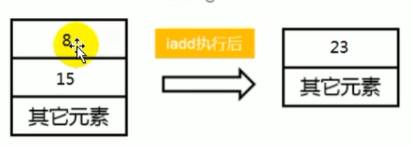

# 前言

你是否也遇到过这些问题？

- 运行着的线上系统突然卡死，系统无法访问，甚至直接OOM
- 想解决线上JVM GC问题，但却无从下手
- 新项目上线，对各种JVY参数设置一脸茫然，直接默认吧，然后就 jj 了
- 每次面试之前都要重新背一遍JM的一些原理概念性的东西，然布面试官却经常问你在实际项目中如何调优JVN参数，如何解决GC、oON等问题，一脸懵逼

大部分Java开发人员，除会在项目中使用到与Java平台相关的各种高精尖技术，**对于Java技术的核心Java虛拟机了解甚少**

***

> 开发人员如何看待上层框架

- 一些有一定工作经验的开发人员，打心眼儿里觉得SSM、微服务等上层技术才是重点，基础技术并不重要，这其实是一种本末倒置的“病态〞

- 如果我们把核心类库的 API 比做数学公式的话，那么Java 虚拟机的知识就好比公式的推导过程

***


计算机系统体系对我们来说越来越远，在不了解底层实现方式的前提下，通过高级语言很容易编写程序代码，但事实上计算机并不认识高级语言。

***

> 垃圾回收

**垃圾收集机制** 为我们打理了很多繁琐的工作，大大提高了开发的效率，但是，垃圾收集也不是万能的，懂得JVM内部的内存结构、工作机制，是设计高扩展性应用和诊断运行时问题的基础，也是Java工程师进阶的必备能力

> Java生态圈

Java是目前应用最为广泛的软件开发平台之一。随着Java以及Java社区的不断壮大。

Java 也早己不再是简简单单的一门计算机语言了，它更是一个平台、一种文化、一个社区

- **作为一个半台**，Java虚拟机扮演着举足轻重的作用，Groovy、scala、 JRuby、Kotlin等都是Java平台的一部分
- **作为一种文化**，Java几乎成为了 “开源” 的代名词，第三方开源软件和框架。如Tomcat、struts, MyBatis, spring等，就连JDK和JVM自身也有不少开源的实现，如OpenJDK、Harmony
- **作为一个社区**，Java拥有全世界最多的技术拥护者和开源社区支持，有数不清的论坛和资料。从桌面应用软件、联入式开发到企业级应用、后台服务器、中间件，都可以看到Java的身影。其应用形式之复杂、参与人数之众多也令人咋舌。

***

# 1. 内存与垃圾回收篇

## 1.1 JVM与Java体系结构

> 字节码

- 我们平时说的java字节码，指的是用java语言编译成的字节码。准确的说任何能在jvm平台上执行的字节码格式都是一样的。所以应该统称为：jvm字节码。

- 不同的编译器，可以编译出相同的字节码文件，字节码文件也可以在不同的JVM上运行。

- Java 虚拟机与 Java 语言并没有必然的联系，它只与特定的二进制文件格式—Class文件格式所关联，Class 文件中包含了 Java 虛拟机指令集（或者称为宇节码、Bytecodes）和符号表，还有一些其他辅助信息。

### 1.1.1 Java及JVM简介

> Java :跨平台的语言


> JVM：跨语言的平台


**Java虚拟机**根本不关心运行在其内部的程序到底是使用何种编程语言编写的，它只关心“**字节码**”文件。也就是说Java虛拟机拥有语言无关性，并不会单纯地与Java语言“终身绑定”，只要其他编程语言的编译结果满足并包含 Java虛拟机的内部指令集、符号表以及其他的辅助信息，它就是一个有效的字节码文件，就能够被虚拟机所识别并装载运行

> 总结：Java不是最强大的语言，但是JVM是最强大的虛拟机

***

### 1.1.2 虚拟机与Java虚拟机

> 虚拟机

所谓虛拟机(Virtual Mpchine)，就是一合虚拟的计算机。它是一款软件，用来执行一系列虚拟计算机指令。大体上，虚拟机可以分为**系统虚拟机**和**程序虚拟机**

- 大名鼎鼎的visual Box,VMware就属于系统虛拟机，它们**完全是对物理计算机的仿真**，提供了一个可运行完整操作系统的软件平台
- 程序虚拟机的典型代表就是Java虛拟机，它**专门为执行单个计算机程 序而设计**，在Java虚拟机中执行的指令我们称为Java字节码指令

无论是系统虚拟机还是程序虚拟机，在上面运行的软件都被限制于虚拟机提供的资源中

***

> Java 虚拟机

- Java虚拟机是一台执行Java字节码的虚拟计算机，它拥有独立的运行机制，其运行的Java字节码也未必由Java语言编译而成
- JVM平台的各种语言可以共享Java虚拟机带来的跨平台性、优秀的垃圾回器，以及可靠的即时编译器
- **Java技术的核心就是Java虚拟机** (JVM, Java Virtual Machine )，因为所有的Java程序都运行在Java虛拟机内部

***

> 作用

Java虚拟机就是二进制字节码的运行环境，负责装载字节码到其内部，解释/编译为对应平台上的机器指令执行。每一条Java指令，Java虚拟机规范中都有详细定义，如怎么取操作数，拿么处理操作数，处理结果放在哪里

特点：

- 一次编译，到处运行
- 自动内存管理
- 自动垃圾回收功能

***

> JVM 位置


JVM是运行在操作系统之上的，它与硬件没有直接的交互。

***

### 1.1.3 JVM整体结构

- HotSpot VM是目前市面上高性能虚拟机的代表作之一
- 它采用解释器与即时编译器并存的架构


黄色：方法区和堆，是线程共享的；灰色是线程独有的。

***

### 1.1.4 Java代码执行流程


***

### 1.1.5 JVM架构模型

Java编译器输入的指令流基本上是一种基子**栈的指令集架构**，另外一种指令集架构则

是基于**寄存器的指令集架构**

具体来说：这两种架构之间的区别：

- 基于栈式架构的特点

  - 设计和实现更简单，适用于资源受限的系统;
  - 避开了寄存器的分配难题：使用零地址指令方式分配
  - 指令流中的指令大部分是零地址指令，其执行过程依赖于操作栈。指令集更小，编译器容易实现
  - 不需要硬件文持，可移植性更好，更好实现跨平台

- 基于寄存器架构的特点

  - 典型的应用是x86的二进制指令集：比如传统的BC以及Android的Davlik虚

    拟机

  - 指令集架构则完全依赖硬件，可移植性差

  - 性能优秀和执行更高效

  - 花费更少的指令去完成一项操作

  - 在大部分情況下，基于寄存器架构的指令集往往都以一地址指令、二地址指令和三地址指令为主，市基于栈式架构的指令集却是以零地址指令为主

> 举例1

同样执行 2 + 3 这种逻辑操作，其指令分别如下：

> 基于栈的计算流程（指令集小，但执行指令更多）

```java
iconst_2   // 常量2入栈
istore_1   // 放到索引1的位置
iconst_3   // 常量3入栈
istore_2   // 放到索引2的位置
iload_1    // 加载进来
iload_2    // 加载进来
iadd       // 常量2，3出栈，执行相加
istore_3   // 结果5放到索引3的位置
```

> 基于寄存器的计算流程（指令集多，但执行指令少）

```java
mov eax,2  // 将eax寄存器的值设为1
add eax,3  // 使eax寄存器的值加3
```

***

> 总结

**由于跨平台性的设计，Java的指令都是根据栈来设计的**。不同平台CPU架构不同，所以不能设计为基于奇存器的。 优点是跨平台，指令集小，编译器容易实现，缺点是性能下降，实现同样的功能需要更多的指令。

时至今日，尽管嵌入式平台已经不是Java程序的主流运行平台了（准确水说应该是HotspotVM 的宿主环境已经不局限于嵌入式平台了），那么为什么不将架构更换为基于奇存器的架构呢？

栈：

跨平台性、指令集小、指令多、；执行性能比寄存器差

***

### 1.1.6 JVM生命周期

> 虚拟机的启动

Java虚拟机的启动是通过引导类加载器 (bootstrap class loader)创建一个初始类(initial class)来完成的，这个类是由虚拟机的具体实现指定的。

***

> 虚拟机的执行

- 一个运行中的Java虚拟机有着一个清哳的任务：执行Java程序。
- 程序开始执行时他才运行，程序结束时他就停止。
- **执行一个所谓的Java程序的时候，真真正正在执行的是一个叫做Java虚拟机的进程**。

***

> 虛拟机的退出

有如下的几种情况：

- 程序正常执行结束
- 程序在执行过程中遇到了异常或错误而异常终止
- 由于操作系统出现错误而号致Java虛拟机进程终止
- 某线程调用Runtime 类或system类的exit方法，或 Runtime 类的halt方法，并且Java 安全管理器也允许这次exit或halt操作
- 除此之外，JNI ( Java Native Interface)规范描述了用JNI Invocation API来加载或卸载 Java虚拟机时，Java虚拟机的退出情况

***

### 1.1.7 JVM发展历程

> Sun Classic VM

- 早在1996年Java1.0版本的时候，sun公司发布了一款名为Sun Classic VM的Java虚拟机，它同时也是**世界上第一款商用Java虚拟机**，JDK1 .4时完全被淘汰
- 这款虚拟机内部**只提供解释器**
- 如果使用 JIT 编译器，就需要进行外挂。但是一旦使用了JIT编译器，JIT就会接管虚拟机的执行系统。解释器就不再工作。解释器和编译器不能配合工作。
- 现在hotspot内置了此虚拟机。

```java
举例：解释器理解成一行一行执行，如果for循环，也会一行一行执行；
JIT编译器就是将热点代码重复执行的缓存起来。
  
生活案例：
A地点到B地点：解释器就是走路，一说开始，解释器就开始执行了，无需等待；而JIT就理解成坐公交车，说开始时可能等公交车等了十分钟才来（前期等待时间长，无响应），等坐上车之后后续又下车，然后继续等公交车（后续可能会追上步行，但是等确实耗费时间，说不定还没步行快）。

后面将解释器和JIT结合使用，有些地方走路快的，就不等公交车。结合起来效率更高。
```

***

> Exact VM

- 为了解决上一个虚拟机问题，jak1.2时，sun提供了此虛拟机
- Bxact Memory Management： 准确式内存管理
  - 也可以叫Non-conservat ive/Accurate Memory Management
  - **虚拟机可以知道内存中某个位置的数据具体是什么类型。**
- 其备现代高性能虚拟机的雏形
  - 热点探测
  - 编译器与解释器混合工作模式
- 只在Solaris平台短暂使用，其他平台上还是classic vm
  - 英雄气短，终被Hotspot虛拟机替换

***

> SUN公司的 HotSpot VM

- HotSpot历史
  - 最初面一家名为“tongviewrechnologies“的小公司设计
  - 1997年，此公司被sun收购;2009年，sun公司被甲骨文收购
  - JDK1.3时，Hotspot wM成为默认虚拟机
- 目前Hotspot占有绝对的市场地位，称霸武林
  - **不管是现在仍在广泛使用的JDK6，还是使用比例较多的JDK8中，默认的虚拟机都是 HotSpot**
  - Sun/oracle JDK和openJDK的默认虚拟机
  - 因此本课程中默认介绍的虚拟机都是Hotspot，相关机制也主要是指HotSpot的GC机制。（比如其他两个商用虚拟机都没有方法区的慨念）
- 从服务器、桌面到移动端、嵌入式都有应用
- 名称中的Hotspot指的就是它的热点代码探测技术
  - 通过计数器找到最具编译价值代码，触发即时编译或栈上替换
  - 通过编译器与解释器协同工作，在最优化的程序响应时间与最佳执行性能中取得平衡

***

> BEA 的 JRockit

- 专注于服务器端应用
  - 它可以不太关注程序启动速度，因此JRockit内部不包含解析器实现，全部代码都拿即时编译器编译后执行
- 大量的行业基准测试显示，**JRockit JVM是世界上最快的JVM**
  - 使用JRockit产品，客户己经体验到了显著的性能提高（一些超过了70%）和硬件成本的减少（达50%）
- 优势：全而的Java运行时解决方案组合
  - JRockit面问延迟敏感型应用的解决方案JRockit Real Time提供以亳秒或微秒级的JVM响应时间，适合财务、军事指挥、电信网络的需要
  - Missioncontrol服务套件，它是一组以极低的开销来监控、管理和分析生产环境中的应用程序的工具。
- 2008年，BEA被Oracle收购
- oracle表达了整合两大优秀虛拟机的工作，大致在JDR 8中完成。整合的方式是在Hotspot的基础上，移植JRockit的优秀特性
- 高斯林：目前就职于谷歌，研究人工智能和水下机器人

***

> IBM 的 J9

- 全称：IBM Technology for Java Virtual Machine, 简称IT4J，内部代号：J9
- 市场定位与Hotspot接近，服务器端、桌面应用、嵌入式等多用途VM
- 广泛用于IBM的各种Java产品
- 目前，有影响力的三大商用虛拟机之一，也号称是世界上最快的Java虛拟机
- 2017年左右，IBM发布了开源J9 VM，命名为openJ9，交给Eclipse基金会管理，也称为 Eclipse openJ9

***

> TaobaoJVM

- 由AliJVM 团队发布。阿里，国内使用Java最强大的公司，覆盖云计算、金融、物流、电商等众多领域， 需要解决高并发、高可用、分布式的复合问题。有大量的开源产品
- **基于openJDK 开发了自己的定制版不AlibabaJDK**，简称AJDK。是整个阿里Java体系的基石
- 基于openJDK Hotspot VM 发布的国内第一个优化、**深度定制且开源的高性能服务器版Java虚拟机**
  - 创新的GCIH (GC invisible heap ）技术实现了off-heap，**即将生命周期较长的Java对象从heap中移到heap之外，并且GC不能管理GCIH内部的Java 对象，以此达到降低GC 的回收频率和提升GC 的回收效率的目的**
  - GCIH 中的**对象还能够在多个Java 虚拟机进程中实现共享**
  - 使用crc32 指令实现 JVM intrinsic 降低JNI 的调用开销
  - PMU hardware 的Java profiling tool 和诊断协助功能
  - 针对大数据场景的zenGC
- taobao vm应用在阿里产品上性能高，硬件严重依赖inte1的cpu，损失了兼容性，但提高了性能
  - 目前己经在淘宝、天猫上线，把Oracle 官方JVM 版木全部替换了

***

## 1.2 类加载子系统

### 1.2.1 内存结构概述

> 简图


***

> 详细图


***

### 1.2.2 类加载器与类的加载过程


- 类加载器子系统负责从文件系统或者网络中加载Class文件，class文件在文件开头有特定的文件标识
- ClassLoader只负责class文件的加载，至于它是否可以运行，则由Execution Engine决定
- 加载的类信息存放于一块称为方法区的内存空间。除了类的信息外，方法区中还会存放运行时常量池信息，可能还包括字符串字面量和数字常量（这部分常量信息是Class文件中常量池部分的内存映射）

***

> 类加载器ClassLoader角色


1. class file 存在于本地硬盘上，可以理解为设计师画在纸上的模板，而最终这个模板在执行的时候是要加载到JVM当中来根据这个文件实例化出n个一模一样的实例。
2. class file 加载到JVM中，被称为DNA元数据模板，**放在方法区**
3. 在.class文件一＞JVM ->最终成为元数据模板，此过程就要一个远输工具(类装载器 Class Loader)，扮演一个快递员的角色。

***

```java
public class HelloLoader {
  public static void main(String[] args) {
    System.out.println("Hello");
  }
}
```

> 类的加载过程


> 类的加载过程包括三个阶段：加载、链接、初始化


类的加载（广义）过程刚好第一个阶段也叫加载（狭义）

***

#### 1.2.2.1 加载

在加载阶段，Java虚拟机需要完成以下三件事情：

1. 通过一个类的全限定名获取定义此类的二进制字节流
2. 将这个字节流所代表的静态存储结构转化为方法区的运行时数据结构
3. **在内存中生成一个代表这个类的java.lang.Class对象**，作为方法区这个类的各种数据的访问入口

***

> 补充：加载.class文件的方式。上面第一点规则并没有指明要从哪里获取、如何获取。仅仅这一点空隙，Java虚拟机的使用者们就可以在加载阶段搭建出一个相当开放广阔的舞台，如下：

- 从本地系统中直接加载
- 通过网络获取，典型场景：Web Applet
- 从zip压缩包中读取，成为日后jar、war格式的基础
- 运行时计算生成，使用最多的是：动态代理技术
- 由其他文件生成，典型场景：JSP应用
- 从专有数据库中提取。class文件，比较少见
- 从加密文件中获取，典型的防CIass文件被反编译的保护措施

相对于类加载过程的其他阶段，非数组类型的加载阶段（准确的说，是加载阶段中获取类的二进制字节流的动作）是开发人员可控性最强的阶段。

加载阶段结束后，Java虚拟机外部的二进制字节流就按照虚拟机所设定的格式存储在方法区之中了。

加载阶段与链接阶段的部分动作（如一部分字节码文件格式验证动作）是交叉进行的，加载阶段尚未完成，链接阶段可能已经开始，但这些夹在加载阶段之中进行的动作，仍然属于链接阶段的一部分，这两个阶段的开始时间仍然保持着固定的先后顺序。

***

#### 1.2.2.2 链接

##### 1.2.2.2.1 验证

验证是链接阶段的第一步，并且验证阶段的工作量在虚拟机的类加载过程中占了相当大的比重。

Class文件并不一定只能由Java源码编译而来，它可以使用包括键盘 0 和 1 直接在二进制编译器中敲出 Class 文件在内的任何途径产生。Java虚拟机如果不检查输入的字节流，对其完全信任的话，很可能会因为载入了有错误或有恶意企图的字节码流而导致整个系统受攻击甚至崩溃，所以验证字节码是Java虚拟机保护自身的一项必要措施。

- 目的在于确保Class文件的字节流中包含信息符合当前虛拟机要求，保证被加载类的正确性，不会危害虛拟机自身安全
- 主要包括四种验证，**文件格式验证，元数据验证，字节码验证，符号引用验证**

***

<font color="red">1 文件格式验证</font>：第一阶段要验证字节流是否符合Class文件格式的规范，并且能被当前版本的虚拟机处理。这一阶段可能包括下面的验证点：

- 是否以魔术开头
- 主、次版本是否在当前Java虚拟机接受范围之内
- 指向常量的各种索引值中是否有指向不存在的常量或不符合的常量
- ...

该验证阶段的主要目的是保证输入的字节流能正确地解析并存储于方法区之内，格式上符合描述一个Java类型信息的要求。这阶段的验证是基于二进制字节流进行的，只有通过了这个阶段的验证之后，这段字节流才被允许进入 Java 虚拟机内存的方法区中进行存储，所以后面的三个验证阶段全部是基于方法区的存储结构上进行的，不会再直接读取、操作字节流了。

***

<font color="red">2 元数据验证</font>：第二阶段是对字节码描述的信息进行语义分析，以保证其描述的信息符合要求，这个阶段可能包括的验证点如下：

- 这个类是否有父类（除了 Object 之外，所有的类都应当有父类）
- 这个类是否继承了不被允许继承的类（final修饰的类）
- 如果这个类不是抽象类，是否实现了其父类或接口之中要求实现的所有方法。
- ...

第二阶段的主要目的是对类的元数据信息进行语义校验，保证不存在于Java语言规范定义相悖的元数据信息。

***

<font color="red">3 字节码验证</font>：第三阶段是整个验证过程中最复杂的一个阶段，主要目的是通过数据流分析和控制流分析，确定程序语义是合法的、符合逻辑的。在第二阶段对元数据信息中的数据类型校验完毕之后，这阶段就要对类的方法体（Class文件中的 Code属性）进行校验分析，保证被校验类的方法在运行时不会做出危害虚拟机安全的行为，例如：

- 保证任意时刻操作数栈的数据类型与指令代码序列都能配合工作，例如不会出现类似于“在操作栈放置了一个 int 类型的数据，使用时却按 long 类型来加载入本地变量表中”这样的情况。
- 保证任何跳转指令都不会跳转到方法体之外的字节码指令上。
- 保证方法体中的类型转换总是有效的，例如可以把一个子类对象赋值给父类数据类型，这是安全的，但是把父类对象赋值给子类数据类型，甚至把对象赋值给与它毫无继承关系、完全不相干的一个数据类型，则是危险和不合法的。
- ...

如果一个类型中有方法体的字节码没有通过字节码验证，那它肯定是有问题的；但如果通过了验证，也仍然不能保证它一定就是安全的。即使字节码验证阶段中进行了再大量、再严密的检查，也依然不能保证这一点。

***

<font color="red">4 符号引用验证</font>：最后一个阶段的校验行为发生在虚拟机将符号引用转化为直接引用的时候，这个转化动作将在链接的第三个阶段--解析阶段中发生。符号引用验证可以看作是对类自身以外（常量池中的各种符号引用）的各类信息进行匹配性校验，通俗来说就是，该类是否缺少或者被禁止访问它依赖的某些外部类、方法、字段等资源。本阶段通常需要校验下列内容：

- 符号引用中通过字符串描述的全限定名是否能找到对应的类
- 在指定类中是否存在符合方法的字段描述符及简单名称所描述的方法和字段
- 符号引用中的类、字段、方法的可访问性（private、protected、public、<package>是否可被当前类访问）
- ...

符号引用验证的主要目的是确保解析行为能正常执行，如果无法通过符号引用验证，Java虚拟机将会抛出一个 java.lang.IncompatibleClassChangeError 的子类异常，典型的如：java.lang.IllegalAccessError、java.lang.NoSuchFieldError、java.lang.NoSuchMethodError 等。

***

> 总结

​        验证阶段对于虚拟机的类加载机制来说，是一个非常重要的、但却不是必须要执行的阶段，因为验证阶段只有通过或者不通过的差别，只要通过了验证，其后就对程序运行期没有任何影响了。如果程序运行的全部代码（包括自己编写的、第三方包中的、从外部加载的、动态生成的等所有代码）都已经被反复使用和验证过，在生产环境的实施阶段就可以考虑使用` -Xverify:none` 参数来关闭大部分的类验证措施，以缩短虚拟机类加载的时间。

***

##### 1.2.2.2.2 准备

​        准备阶段是正式为类中定义的变量（即静态变量，被static修饰的变量）分配内存并设置类变量初始值的阶段，从概念上讲，这些变量所使用的内存都应当在方法区中进行分配，但必须注意到方法区本身是一个逻辑上的区域，在JDK1.7之前，HotSpot使用永久代来事项方法区时，实现是完全符合这种逻辑概念的；而在JDK1.7及之后，类变量则会随着Class对象一起存放在Java堆中，这时候“类变量在方法区”就完全是一种对逻辑概念的表述了。

**简言之，为类的静态变分配内存，并将其初始化为默认值**

- 为**类变量（static修饰）**分配内存并且设置该类变量的默认初始值，即零值。
- **这里不包含用final修饰的static，因为final在编译的时候就会分配了，准备阶段会显式初始化**
- 这里不会为实例变量分配初始化，类变量会分配在方法区中，而实例变量是会随着对象一起分配到Java堆中

```java
public static int value = 123;

变量 value 在准备阶段过后的初始值为 0 而不是 123，因为这时尚未开始执行任何Java方法，而把value赋值为 123 的 putstatic 指令是程序被编译后，存放于类构造器<clinit>（）方法之中，所以把value赋值为 123 的动作要到类的初始化阶段才会被执行。
```

***

> 基本数据类型的零值

| 数据类型 | 零值      | 数据类型  | 零值  |
| -------- | --------- | --------- | ----- |
| int      | 0         | boolean   | false |
| long     | 0L        | float     | 0.0f  |
| short    | (short) 0 | double    | 0.0d  |
| char     | '\u0000'  | reference | null  |
| byte     | (byte) 0  |           |       |

***

如果类字段的字段属性表中存在 ConstantValue 属性，那在准备阶段变量值就会被初始化为 ConstantValue 属性所指定的初始值，假设上面类变量 value 的定义修改为：

```java
public static final int value = 123;
```

编译时 Javac 将会为 value 生成 ConstantValue 属性，在准备阶段虚拟机就会根据 ConstantValue 的设置将 value 赋值为 123

***

##### 1.2.2.2.3 解析

- **将常量池内的符号引用转换为直接引用的过程**
- 事实上，解析操作往往会伴随着JVM在执行完初始化之后再执行
- 符号引用就是一组符号来描述所引用的目标。符号引用的字面量形式明确定义在 《java虛拟机规范》的Class文件格式中。直接引用就是直接指向目标的指针、相对偏移量或一个间接定位到目标的句柄
- 解析动作主要针对类或接口、字段、类方法、接口方法、方法类型等。对应常量池中的CONSTANT_Class_info、 CONSTANT _Fieldref_info、CoNSTANT_Methodref_info等

***

```java
public class HelloApp {
 	private static int a = 1; // prepare阶段： a = 0 ---> initial初始化：a = 1
  public static void main(String[] args) {
  }
}
```

***

#### 1.2.2.3 初始化

**简言之，为类的静态变量赋予正确的初始值**

- 初始化阶段就是执行类构造器方法<C1init>()的过程
- 此方法不需定义，是 javac 编译器自动收集类中的**所有类变量的赋值动作**和**静态代码块中的语句**合并而来（**如果没有static修饰的变量和代码块，字节码不会出现<C1init>**）
- 构造器方法中指令按语句在源文件中出现的顺序执行
- <clinit>()不同于类的构造器。（关联：构造器是虛拟机视角下的<init>()，每个类至少存在一个构造器，对应就是<init>）
- 若该类具有父类，JVM会保证子类的<Clinit>（）执行前，父类的<C1init>(）己经执行完毕
- 虛拟机必须保证一个类的<Clinit>（）方法在多线程下被同步加锁【类加载到内存只需加载一次，<Clinit>（）方法只调用一次】

***

问：Java编译器并不会为所有的类都产生<Clinit>（）初始化方法。哪些类在编译为字节码后，字节码文件中将不会包括<Clinit>（）方法？

- 一个类中并没有声明任何的类变量，也没有静态代码块时
- 一个类中声明类变量，但是没有明确使用类变量的初始化语句以及静态代码块来执行初始化操作时
- 一个类中包含 static final修饰的基本数据类型的字段，这些类字段初始化语句采用编译时常量表达式

***

> 验证子类的<Clinit>执行前，先执行父类的<C1init>

```java
public class ClassInitTest {
    private static int num = 1;
    static {
        num = 2;
        number = 20;
        System.out.println(num); // ok
        //System.out.println(number); // 报错，非法的前向引用（可以赋值，但是不能使用）
    }
    private static int number = 10; // linking之prepare：number = 0 --> initial: 20 --> 10
    public static void main(String[] args) {
        System.out.println(ClassInitTest.num);   // 2
        System.out.println(ClassInitTest.number);// 10
    }
}
```

> 验证父类优先于子类加载

```java
public class ClinitTest1 {
    static class Father {
        public static int A = 1;
        static {
            A = 2;
        }
    }
    static class Son extends Father {
        public static int B = A;
    }
    public static void main(String[] args) {
        // 先加载Father类（加载-链接-初始化），其次加载Son类
        System.out.println(Son.B);
    }
}
```

> 验证类只被加载一次

```java
public class DeadThreadTest {
    public static void main(String[] args) {
        Runnable r = () -> {
            System.out.println(Thread.currentThread().getName() + "开始");
            DeadThread dead = new DeadThread();
            System.out.println(Thread.currentThread().getName() + "结束");
        };
        Thread t1 = new Thread(r,"线程1");
        Thread t2 = new Thread(r,"线程2");
        t1.start();
        t2.start();
    }
}
class DeadThread {
    static {
        if (true) {
            System.out.println(Thread.currentThread().getName() + "初始化当前类");
            while (true) {}  // 死循环，不会结束，模拟当前类一直加载中
        }
    }
}

线程2开始
线程1开始
线程2初始化当前类
```

***

### 1.2.3 类加载器分类

- JVM 支持两种类型的类加载器，分别为**引导类加载器 (Bootstrap ClassLoader）**和**自定义类加载器 (User-Defined classLoader)**
- 从概念上来讲，自定义类加载器一般指的是程序中由开发人员自定义的一类类加载器，但是Java虚拟机规范却没有这么定义，而是**将所有派生于抽象类ClassIoader的类加载器都划分为自定义类加载器**【按这样划分的话，那么除了Bootstrap ClassLoader，剩下都属于自定义类加载器，见下图】
- 无论类加载器的类型如何划分，在程序中我们最常见的类加载器始终只有3个，如下所示：


**这里的四者之间的关系是包含关系。不是上层下层，也不是子父类的继承关系**

说明：Bootstrap ClassLoader是非java语言编写的，其他都是java语言编写的。

```java
public static void main(String[] args) {
    // 获取系统类加载器
    ClassLoader systemClassLoader = ClassLoader.getSystemClassLoader();
    System.out.println(systemClassLoader); // sun.misc.Launcher$AppClassLoader@18b4aac2
  
    // 获取其上层：扩展类加载器
    ClassLoader extClassLoader = systemClassLoader.getParent();
    System.out.println(extClassLoader); // sun.misc.Launcher$ExtClassLoader@1540e19d
  
    // 获取其上层：获取不到引导类加载器
    ClassLoader bootClassLoader = extClassLoader.getParent();
    System.out.println(bootClassLoader); // null
  
    // 对于用户自定义类来说，默认使用系统类加载器进行加载
    ClassLoader classLoader = ClassLoaderTest.class.getClassLoader();
    System.out.println(classLoader); // sun.misc.Launcher$AppClassLoader@18b4aac2
  
    // String类使用 引导类加载器进行加载 --> java核心类库都是使用引导类进行加载
    ClassLoader stringLoader = String.class.getClassLoader();
    System.out.println(stringLoader); //null
}
```

***

> 虚拟机自带的加载器

- 启动类加载器（也叫引导类加载器，Bootstrap ClassIoader)
  - 这个类加载使用C/C++语言实现的，嵌套在JVM内部
  - 它用来加载Java的核心库 (JAVA HOME/jre/lib/rt.jar、resources. jar等或sun.boot.ciass.path路径下的内容)，用于提供JVM自身需要的类
  - 并不继承自java. lang.classLoader，没有父加载器【C语言写的不可能继承Java的类】
  - **加载扩展类和应用程序 类加载器，并指定为他们的父类加载器**【扩展类和系统类加载器也是由Bootstrap ClassIoader加载，他俩也属于核心库中的】。
  - 出于安全考虑，Bootstrap启动类加载器只加载包名为java、javax、sun等开头的类
- 扩展类加载器 (Extension classLoader)
  - Java语言编写，由sun.misc.Launcher$ExtclassLoader实现
  - 派生于classIoader类
  - 父类加载器为**启动类加载器**
  - 从java.ext.dirs系统属性所指定的目录中加载类库，或从JDK的安装日录的 `jre/lib/ext` 子日录（扩展目录）下加载类库。**如果用户创建的JAR放在此日录下，也会自动由扩展类加载器加载。**
- 应用程序类加载器（系统类加载器 AppCIassIoader)
  - java语言编写，由sun.misc.Launcher$AppclassIoader实现
  - 派生于classIoader类
  - 父类加载器为**扩展类加载器**
  - 它负责加载环境变量classpath或系统属性 java.class.path 指定路径下的类库
  - **该类加载是程序中默认的类加载器**，一般来说，Java应用的类都是由它来完成加载
  - 通过ClassLoader#getsystemclassLoader()方法可以获取到该类加载器

***

> 引导类加载器

```java
 public static void main(String[] args) {
     System.out.println("********** 启动类加载器 ***********");
     URL[] urLs = Launcher.getBootstrapClassPath().getURLs();
     for (URL urL : urLs) {
         System.out.println(urL.toExternalForm());
     }
     // 从 jsse.jar 选择一个类，来看看他的类加载器是什么
     ClassLoader classLoader = Provider.class.getClassLoader();
     System.out.println(classLoader); // null  说明是引导类加载器加载的
   
     System.out.println("********** 扩展类加载器 ***********");
     String extDirs = System.getProperty("java.ext.dirs");
     for (String path : extDirs.split(";")) {
         System.out.println(path);
     }
     // 从 sunec.jar 选择一个类，来看看他的类加载器是什么
     ClassLoader classLoader1 = SunEC.class.getClassLoader();
     System.out.println(classLoader1); //  sun.misc.Launcher$ExtClassLoader@31befd9f  说明是扩展类加载器加载的
 }
********** 启动类加载器 ***********
file:/Library/Java/JavaVirtualMachines/jdk-1.8.jdk/Contents/Home/jre/lib/resources.jar
file:/Library/Java/JavaVirtualMachines/jdk-1.8.jdk/Contents/Home/jre/lib/rt.jar
file:/Library/Java/JavaVirtualMachines/jdk-1.8.jdk/Contents/Home/jre/lib/jsse.jar
file:/Library/Java/JavaVirtualMachines/jdk-1.8.jdk/Contents/Home/jre/lib/jce.jar
file:/Library/Java/JavaVirtualMachines/jdk-1.8.jdk/Contents/Home/jre/lib/charsets.jar
file:/Library/Java/JavaVirtualMachines/jdk-1.8.jdk/Contents/Home/jre/lib/jfr.jar
file:/Library/Java/JavaVirtualMachines/jdk-1.8.jdk/Contents/Home/jre/classes
null
********** 扩展类加载器 ***********
/Users/wing/Library/Java/Extensions:/Library/Java/JavaVirtualMachines/jdk-1.8.jdk/Contents/Home/jre/lib/ext:/Library/Java/Extensions:/Network/Library/Java/Extensions:/System/Library/Java/Extensions:/usr/lib/java
sun.misc.Launcher$ExtClassLoader@31befd9f
```

***

**用户自定义加载器**

- 在Java的日常应用程序开发中，类的加载几乎是由上述3种类加载器相互配合执行的，在必要时，我们还可以自定义类加载器，来定制类的加载方式。
- 为什么要自定义类加载器？
  - 隔离加载类
  - 修改类加载的方式
  - 扩展加载源
  - 防止源码泄漏

***

### 1.2.4 ClassLoader的使用说明

> 关于ClassLoader

Classloader类，它是一个抽象类，其后所有的类加载器都继承自ClassLoader （不包括启动类加载器）

相关方法略。。。

***

### 1.2.5 双亲委派机制

Java虚拟机对class文件采用的是**按需加载**的方式，也就是说当需要使用该类时才会将它的class文件加载到内存生成class对象。而且加载某个类的class 文件时，Java虚拟机采用的是**双亲委派模式**，即把请求交由父类处理，它是一种任务委派模式。

> 我们也创建java.lang包，并且也定义String类（跟核心类库String一样包名和类名）

```java
package java.lang;
public class String {
    static {
        System.out.println("test String");
    }
    // 当执行这个main方法时，会报错，为什么呢？
    // 因为String被引导类加载器加载了，然后去执行核心API String中的main方法，发现没找到，所以报错了
    public static void main(String[] args) {
        System.out.println("hello");
    }
}
```

> 测试

```java
public static void main(String[] args) {
    // 如果这里用的是自定义的String，那么一定会输出 "test String"，但是输出结果并没有
    String str = new String(); // 尝试使用系统类加载器对自定义类进行加载，但是会先向上委托，直到引导类这，引导类加载器看了下是java.lang包下的，所以引导类加载器可以加载，系统类加载器就不会去加载自定义类了，因此这里使用的是核心API的String
    System.out.println("hello" + str);
}
```

> 结论：假如自己定义了java.lang.String，项目中会使用这个而不是用的核心的String会出现什么后果，比如别人给我们一个这样的类，我放到项目中，然后项目直接就挂了


> 工作原理

1. 如果一个类加载器收到了类加载请求： 它并不会自己先去加载，而是把这个请求委托给父类的加载器去执行；
2. 如果父类加载器还存在其父类加载器，则进一步向上委托，依次递归，请求最终将到达顶层的启动类加载器
3. 如果父类加载器可以完成类加载任务，就成功返回，倘若父类加载器无法完成此加载任务，子加载器才会尝试自己去加载，**这就是双亲委派模式。**

***

> 双亲委派机制举例2


​        假如我们的程序中需要使用`SPI接口`，该接口属于核心API，使用双亲委派机制，依次到引导类加载器，引导类加载器去加载核心`rt.jar包`，该包存在一些`interface接口`，接口需要具体的实现类，实现类就涉及到`第三方的jar包`了，假如是`jdbc.jar`，这时候呢jar包属于第三方的了，不属于核心API，因此出现反向委派，依次向下委派给`系统类加载器`，因此具体实现类由`系统类加载器`进行加载。

**总结：核心API中的接口是引导类加载器进行加载，而实现类是由系统类加载器进行加载**

优势：

- 避免类的重复加载
- 保护程序安全，防止核心API被随意篡改
  - 自定义类：java.lang.String
  - 自定义类：java.lang.ShkStart

***

```java
/* 在 java.lang 包下写一个自定义类 */
package java.lang;
public class WsyStart {
    
    public static void main(String[] args) {
        System.out.println("hello");
    }
}
// 启动main方法会报错
Exception in thread "main" java.lang.SecurityException: Prohibited package name: java.lang
```

**原因**：定义在 java.lang 包下的类由引导类加载器进行加载，发现这个不是核心API，所以提示不允许加载

**好处**：保护程序，不然随便写个恶意程序攻击引导类加载器，会导致系统崩溃。

***

> 沙箱安全机制

自定义string类，但是在加载自定义string类的时候会率先使用引导类加载器加载，而引导类加载器在加载的过程中会先加载jdk自带的文件(rt.jar包中java\lang\string.class)，报错信息说没有main方法，就是因为加载的是rt.jar包中的string类。这样可以保证对java核心源代码的保护，这就是**沙箱安全机制**

***

### 1.2.6 其他

- 在 JVM 中表示两个 class 对象是否为同一个类，存在两个必要条件：
  - 类的完整类名必须一致，包括包名
  - 加载这个类的ClassLoader(指ClassIoader实例对象）必须相同。

换句话说，在 JVM 中，即使这两个类对象（Class对象）来源同—个Class文件，被同一个虚拟机所加载，但只要加载它们的ClassLoader实例对象不同，那么这两个类对象也是不相等的。

***

> 对类加载器的引用

​        JVM必须知道一个类型是由`启动加载器`加载的还是由`用户类加载器`加载的。如果一个类型是由用户类加载器加载的，那么 JVM 会**将这个类加载器的一个引用作为类型信息的一部分保存在方法区中（这样类调用getClassLoader()就可以知道当前类是哪个加载器加载的了）**。

当解析一个类型到另一个类型的引用的时候，JVM需要保证这两个类型的类加载器是相同的。

***

#### 1.2.6.1 类的主动使用和被动使用

Java程序对类的使用方式分为：**主动使用和被动使用**

- 主动使用，又分为七种情况：

  - 创建类的实例，使用new

  - 访问某个类或接口的静态变量，或者对该静态变量赋值

  - 调用类的静态方法

  - 反射（比如： Class .forName (“com.atguigu.Test"))

  - 初始化一个类的子类

  - Java虚拟机启动时被标明为启动类的类

  - JDK 7开始提供的动态语言支持

    java. lang .invoke .MethodHandle实例的解析结果 REF_ getstatic、 REF putstatic、 REF_ invokestatic句柄对应的类没有初始化，则初始化

除了以上七种情况，其他使用Java类的方式都被看作是对**类的被动使用**，都**不会导致类的初始化**（被动使用也是使用，也会被加载，但是不会被初始化）

也就是说：**并不是在代码中出现的类，就一定会被加载或者初始化。如果不符合主动使用的条件，类就不会初始化**

***

> 被动使用案例

1.静态字段

```java
/*
 * 通过子类引用父类的静态字段，不会导致子类初始化
 */
public class PassiveUse {
    @Test
    public void test() {
        System.out.println(Child.num);  // 获取父类的类变量
    }
}
class Child extends Parent {
    static {
        System.out.println("Child类的初始化");
    }
}
class Parent {
    static {
        System.out.println("Parent类的初始化");
    }
    public static int num = 1;
}

Parent类的初始化
1
```

结论：当通过子类引用父类的静态变量，不会导致**子类**初始化，只有真正声明这个字段的类（父类）才会被初始化。假如下面，现在打印子类类变量，是不是只初始化子类，而不用初始化父类的？错，java基础就是，只要初始化子类，那么要优先初始化它的父类。

```java
public class PassiveUse {
    @Test
    public void test() {
        System.out.println(Child.num1);  // 子类的类变量
    }
}
class Child extends Parent {
    public static int num1 = 1;
    static {
        System.out.println("Child类的初始化");
    }
}
class Parent {
    static {
        System.out.println("Parent类的初始化");
    }
    public static int num = 1;
}
Parent类的初始化
Child类的初始化
1
```

2.数组定义：通过数组定义类引用，不会触发此类的初始化

```java
Parent[] parents= new Parent[10];   // 这里虽然new 了，但是不会初始化 Parent 类。
System.out.println(parents.getClass());
// new的话才会初始化
parents[0] = new Parent();
```

3.引用常量：引用常量不会触发此类或接口的初始化。因为常量在链接阶段就已经被显式赋值了

```java
/*
 * 常量在编译阶段会存入调用类的常量池中，本质上没有直接引用到定义常量的类，
 * 因此不会触发定义常量的类的初始化
 */
public class ConstClass {
    static {
        System.out.println("ConstClass init");
    }
    public static final String HELLO = "hello";
    public static String HELLO1= "hello";
}

class TestConstClass {
    public static void main(String[] args) {
        System.out.println(ConstClass.HELLO);  // 不会初始化
        System.out.println(ConstClass.HELLO1); // 会初始化
    }
}
hello
ConstClass init
hello
```

4.loadClass 方法：调用 ClassLoader 类的 loadClass()方法加载一个类，并不是对类的主动使用，不会导致类的初始化

```java
Class clazz = ClassLoader.getSystemClassLoader().loadClass("com.test.java.Person");
```

***

## 1.3 运行时数据区概述及线程


***


***

​        **内存** 是非常重要的系统资源，是**硬盘**和**CPU** 的中间仓库及桥梁，承载着操作系统和应用程序的实时运行。**JVM 内存布局规定了Java在运行过程中 内存申请、分配、管理的策略**，保证了JVM的高效稳定运行。**不同的 JVM 对于内存的划分方式和管理机制存在着部分差异**。结合 JVM 虚拟机规范，来探讨一下经典的 JVM 内存布局


***


***

​        Java虚拟机定义了若干种程序运行期间会使用到的运行时数据区，其中有一些会随着虛拟机启动而创建，随着虛拟机退出而销毀。另外一些则是与线程一一对应的，这些与线程对应的数据区域会随着线程开始和结束而创建和销毁。

**灰色**的为单独线程私有的，**红色**的为多个线程共享的。即：

- 每个线程：独立包括程序计数器、栈、本地栈。

- 线程间共享：堆、堆外内存（永久代或元空间、代码缓存）

  

  假如一个进程有5个线程，那么一个进程只有一个堆和方法区，每个线程都单独一份PC、VMS、NMS，5个线程共享一个堆和方法区。

  灰色基本都是进栈和出栈操作，不用进行什么优化，主要优化是在堆和方法区（java8后叫元空间），堆 95% 方法区 5%

**每个JVM只有一个Runtime实例（单例）。即为运行时环境，相当于内存结构的中间的那个框框：运行时环境**

***

> 线程

- 线程是一个程序里的运行单元。JVM允许一个应用有多个线程并行的执行
- 在Hotspot JVM 里，每个线程都与操作系统的本地线程直接映射
  - **当一个Java线程准备好执行以后，此时一个操作系统的本地线程也同时创建**。Java线程执行终止后，本地线程也会回收
- 操作系统负责所有线程的安排调度到任何一个可用的CPU上。一旦本地线程初始化成功，它就会调用Java线程中的run() 方法

***

## 1.4 程序计数器

也叫做 **PC寄存器**

JVM 中的程序计数寄存器 （Program counter Register) 中，Register 的命名源于CPU的寄存器，寄存器存储指令相关的现场信息。CPU只有把数据装载到寄存器才能够运行

这里，并非是广义上所指的物理寄存器，或许将其翻译为PC计数器（或指令计数器）会更加贴切（也称为程序钩子），并且也不容易引起一些不必要的误会。**JVM中的PC寄存器是对物理PC寄存器的一种抽象模拟**

***

> 作用

PC寄存器用来存储指向下一条指令的地址，也即将要执行的指令代码。由执行引擎读取下一条指令。


***

> PC寄存器介绍

- 它是一块很小的内存空间，几乎可以忽略不记。也是运行速度最快的存储区域
- 在 JVM 规范中，每个线程都有它自己的程序计数器，是线程私有的，生命周期与线程的生命周期保持一致。
- 任何时间一个线程都只有一个方法在执行，也就是所谓的**当前方法**。程序序计数器会存储当前线程正在执行的 Java方法的 JVM 指令地址；或者，如果是在执行 native 方法，则是未指定值 （undefined)
- **它是程序控制流的指示器**，分支、循环、跳转、异常处理、线程恢复等基础功能都依赖这个计数器来完成
- 字节码解释器工作时就是通过改变这个计数器的值来选取下一条需要执行的字节码指令
- **它是唯一一个在 Java 虚拟机规范中没有规定任何 outotMemoryError 情况的区域**

**补充：栈只是进栈，出栈，也没有GC垃圾回收，但是会OOM**，PC寄存器比较特殊，即没有GC，也没有OOM。

***


***

> 两个常见问题

> 问题1

**使用PC寄存器存储字节码指令地址有什么用呢？**

**为什么使用PC寄存器记录当前线程的执行地址呢？**

因为CPU需要不停的切换各个线程，这时候切换回来以后，就得知道接着从哪开始继续执行。

JVM 的字节码解释器就需要通过改变PC寄存器的值来明确下一条应该执行什么样的字节码指令。

***

> 问题2

**PC寄存器为什么会被设定为线程私有？**

我们都知道所谓的多线程在一个特定的时间段内只会执行其中某一个线程的方法，CPU 会不停地做任务切换，这样必然导致经常中断或恢复，如何保证分毫无差呢？为了能够准确地记录各个线程正在执行的当前字节码指令地址，最好的办法自然是为每一个线程都分配一个PC寄存器，这样一来各个线程之间便可以进行独立计算，从而不会出现相互干扰的情况。

**假如两个线程：第一个线程执行到5行，CPU切换到第二个线程执行到7行，CPU重新回到第一个线程后从哪里继续执行呢，所以需要每个线程一份PC寄存器来单独记录**

***

> CPU时间片

CPU 时间片即 CPU 分配给各个程序的时间，每个线程被分配一个时间段，称作它的时间片

**在宏观上**：我们可以同时打开多个应用程序，每个程序并行不悖，同时运行

**但在微观上**：由于只有一个 CPU，一次只能处理程序要求的一部分，如何处理公平，一种方法就是引入时间片，每个程序轮流执行


**并行 VS 串行：**

**并行**：同一个时间点有多个线程同时在执行

**串行**：多个线程排队执行，同一个时间点只有一个线程在执行

***

## 1.5 虚拟机栈

### 1.5.1 虚拟机栈概述

> 虛拟机栈出现的背景

由于跨平台性的设计，Java的指令都是根据栈来设计的。不同平台CPU架构不同，所以不能设计为基于寄存器的

**优点是跨平台，指令集小，编译器容易实现，缺点是性能下降，实现同样的功能需要更多的指令**

***

> 内存中的栈与堆

**栈是运行时的单位，而堆是存储的单位**

即：栈解決程序的运行问题，即程序如何执行，或者说如何处理数据。堆解決的是数据存储的问题，即数据怎么放、放在哪儿


***

> Java虚拟机栈是什么？

Java虚拟机栈 (Java Virtual Machine stack），早期也叫 Java 栈。每个线程在创建时都会创建一个虚拟机栈，其内部保存一个个的栈帧(stack Frame），对应着一次次的 Java方法调用（是线程私有的）

**生命周期**：生命周期与线程一致

**作用**：主管Java程序的运行，它保存方法的局部变量（8种基本数据类型、对象的引用地址）、部分结果，并参与方法的调用和返回。

- 局部变量 VS 成员变量（或属性）

***


最上面的栈叫**当前方法**，最上面的绿色出栈了，那么蓝色就是当前方法。

***

> 栈的特点（优点）

- 栈是一种快速有效的分配存储方式，访问速度仅次于程序计数器
- JVM直接对Java栈的操作只有两个：
  - 每个方法执行，伴随着进栈（入栈、压栈）
  - 执行结束后的出栈工作
- 对于栈来说不存在垃圾回收问题


***

> 栈中可能出现的异常

- Java 虚拟机规范允许 **Java栈的大小是动态的或者是固定不变的**
  - **如果采用固定大小的 Java 虛拟机栈**，那每一个线程的 Java 虚拟机栈容量可以在线程创建的时候独立选定。如果线程请求分配的栈容量超过 Java 虚拟机栈允许的最大容量，Java虚拟机将会抛出一个 **stackoverflowError 异常。**
  - **如果Java虚拟机栈可以动态扩展**，并日在尝试扩展的时候无法申请到足够的内存，或者在创建新的线程时没有足够的内存去创建对应的虚拟机栈，那Java虛拟机将会抛出一个 **OutOfMemoryError 异常**

***

> 设置栈内存大小

我们可以使用参数-Xss  选项来设置线程的最大栈空间，栈的大小直接决定了函数调用的最大可达深度。

***

### 1.5.2 栈的存储单位

> 栈中存什么

- 每个线程都有自己的栈，栈中的数据都是以**栈帧**(stack Frame）的格式存在
- 在这个线程上正在执行的每个方法都各自对应一个栈帧 (stack Frame)
- 栈帧是一个内存区块，是一个数据集，维系着方法执行过程中的各种数据信息

***

> 栈运行原理

- JVM 直接对 Java 栈的操作只有两个，就是对栈帧的**压栈**和**出栈**，遵循“先进后出“，“后进先出”原则
- 在一条活动线程中，一个时间点上，只会有一个活动的栈帧。即只有当前正在执行的方法的栈帧 （栈顶栈帧）是有效的，这个栈帧被称为**当前栈帧**(Current Frame )，与当前栈帧相对应的方法就是**当前方法** (Current Method），定义这个方法的类就是**当前类** (Current class)
- 执行引擎运行的所有字节码指令只针对当前栈帧进行操作。
- 如果在该方法中调用了其他方法，对应的新的栈帧会被创建出米，放在栈的顶端，成为新的当前帧
- 不同线程中所包含的栈帧是不允许存在相互引用的，即不可能在一个栈帧之中引用另外一个线程的栈帧
- 如果当前方法调用了其他方法，方法返回之际，兰前栈帧会传回此方法的执行结果给前一个栈帧，接著，虛拟机会丢弃当前栈帧，使得前一个栈帧重新成为当前栈帧。
- Java方法有两种返回函数的方式，**一种是正常的函数返回，使用return指令；另外一种是拋出异常。不管使用哪种方式，都会导致栈帧被弹出**


***

> 栈桢的内部结构

每个栈帧中存储着：

- **局部变量表（Local Variables)**
- **操作数栈 (operand stack)（或表达式栈）**
- 动态链接 (Dynamic Linking）（或指向运行时常量池的方法引用）
- 方法返回地址（Return Address)（或方法正常退出或者异常退出的定义）
- 一些附加信息


***


***

### 1.5.3 局部变量表

- 局部变量表也被称之为局部变最数组或本地变量表
- **定义为一个数字数组（八种数据类型和引用类型就是可以使用数字表示），主要用于存储方法参数和定义在方法体内的局部变量**，这些数据类型包括各类基本数据类型、对象引用 (reference），以及returnAddress 类型
- 由于局部变量表是建立在线程的栈上，是线程的私有数据，因此**不存在数据安全问题**
- **局部变量表所需的容量大小是在编译期确定下来的**，并保存在方法的 Code 属性的max imum local variables 数据项中。在方法运行期间是不会改变局部变量表的大小的。

***

> 解析例子


> 编译后使用 jclasslib工具打开（只研究testStatic方法）


**<testStatic>**: 当前方法名称是 testStatic

**<()V>**：没有入参，没有返回值

**[public static]**：公共访问权限的静态方法

***


**字节码**：代码编译后的字节码

**异常表**：当前方法没有异常，所以没有信息

**杂项**：局部变量数为 3 个（**局部变量表所需的容量大小是在编译期确定下来的**）

***


**LineNumberTable**：字节码和源代码行号对应表。比如字节码的**0行**对应代码**16行**，字节码的**8行**对应代码**17行**

***


**LocalVariableTable：**变量作用域范围（对应字节码行号）。比如**起始PC=8，长度=19**，说明变量test从字节码的第8行作用域开始，长度 19 （注意19不是行号），字节码总共有27行，刚好三个变量**起始PC**和**长度**相加都等于27，说明三个变量作用域都是在变量定义到方法结束。

***

> 变量槽slot的理解和演示

- 参数值的存放总是在局部变量数组的index0开始，到数组``长度-1``的索引结束

- 局部变量表，**最基本的存储单元是Slot（变量槽）**

- 局部变量表中存放编译期可知的各种基本数据类型(8种），引用类型(reference)， returnAddress 类型的变量

- 在局部变量表里，**32位以内的类型只占用一个slot（包括returnAddress 类型），64位的类型（long和double）占用两个slot**

  - byte、short、char 在存储前被转换为int，boolean 也被转换为int，0 表示false，非0 表示true
  - long 和double则占据两个Slot

- JVM 会为局部变量表中的每一个Slot 都分配一个访问素引，通过这个素引即可成功访问到局部变量表中指定的局部变量值

- 当一个实例方法被调用的时候，它的方法参数和方法体内都定义的局部变量将会**按照顺序被复制**到局部变量表中的每一个Slot上

- **如果需要访问局部变量表中一个64bit 的局部变量值时，只需要使用前一个索引即可**。（比

  如：访问 long 或 double 类型变量，占的索引位置是 4和5两个slot，那么只需要访问索引4即可）

- 如果当前帧是由构造方法或者实例方法创建（非静态）的，那么**该对象引用this将会存放在index为0的slot处**（所以实例方法可以使用this，因为局部变量表索引0第一个位置就保存了this），其余的参数按照参数表顺序继续排列。


***


weigth double类型，占用3和4两个索引位置。当调用weight变量，只要引用起始3索引位置就可以了。

***

> Slot 的重复利用

**栈帧中的局部变量表中的槽位是可以重用的**，如果一个局部变量过了其作用域，那么在其作用域之后申明的新的局部变量就很有可能会复用过期局部变量的槽位，**从而达到节省资源的目的**


正常有四个局部变量，分别是：this、a、b、c，但是b是代码块里面，出了代码块就出了作用域，这样b的槽位被下面的c重复利用，因此局部变量最大槽位是 3，而不是 4。


***

> 静态变量与局部变量的对比

- 参数表分配完毕之后，再根据方法体内定义的变量的顺序和作用域分配
- 我们知道**类变量表**有两次初始化的机会，第一次是在“**准备阶段**”，执行系统初始化，对类变量设置**零值**，另一次则是在 “**初始化**” 阶段，赋予程序员在代码中定义的**初始值**
- **和类变量初始化不同的是，局部变量表不存在系统初始化的过程，这意味着一旦定义了局部变量则必须人为的初始化，否则无法使用**

```java
public void test() {
  int i;
  System.out.println(i);
}
```

这样的代码是错误的，**没有赋值不能够使用**

***

变量的分类：

- 按照数据类型分：1） 基本数据类型 ；2）引用数据类型

-  按照在类中声明的位置分：1） 成员变量：在使用前，都经历过默认初始化赋值  

  ​                                                       **类变量**：linking 的 prepare 阶段：给类变量默认赋值 --> initial 阶段：给类变量显式赋值即静态代码块赋值 。

  ​                                                       **实例变量**：随着对象的创建，会在**堆空间**中分配实例变量空间，并进行默认赋值。

  ​                                   2）局部变量：在使用前，必须要进行显式赋值的，否则编译不通过。

**总结**：成员变量（类变量和实例变量）都有默认初始化，虽然没有显式赋值，也可以直接使用。但是局部变量没有默认值初始化，因此使用必须要显式初始化。


**补充说明**：

- 在栈帧中，与性能调优关系最为密切的部分就是前面提到的局部变量表。在方法执行时，虛拟机使用局部变量表完成方法的传递。
- **局部变量表中的变量也是重要的垃圾回收根节点，只要被局部变量表中直接或间接引用的对象都不会被回收**

***

### 1.5.4 操作数栈

- 每一个独立的栈帧中除了包含局部变量表以外，还包含一个**后进先出**（Last-In-First-Out）的操作数栈，也可以称之为**表达式栈** (Expression stack)
- **操作数栈，在方法执行过程中，根据字节码指令，往栈中写入数据或提取数据，即入栈 (push）/出栈 (pop)**
  - 某些字节码指令将值压入操作数栈，其余的字节码指令将操作数取出栈。使用它们后再把结果压入栈
  - 比如：执行复制、交换、求和等操作



- **如果被调用的方法带有返回值的话，其返回值将会被压入当前栈帧的操作数栈中**，并更新PC寄存器中下一条需要执行的字节码指令
- 操作数栈中元素的数据类型必须与字节码指令的序列严格匹配，这由编译器在编译器期间进行验证，同时在类加载过程中的类检验阶段的数据流分析阶段要再次验证
- 另外，我们说Java虚拟机的**解释引擎是基于栈的执行引擎**，共中的栈指的就是操作数栈。
- 操作数栈，**主要用于保存计算过程的中间结果，同时作为计算过程中变量临时的存储空间**
- 操作数栈就是JVM执行引擎的一个工作区，当一个方法刚开始执行的时候，一个新的栈帧也会随之被创建出来，**这个方法的操作数栈是空的**（操作数栈使用数组实现，操作数栈创建了，说明数组已经创建，创建数组需要指明长度，说明长度也知道了）
- 每一个操作数栈都会拥有一个明确的栈深度用于存储数值，其所需的最大深度在编译期就定义好了，保存在方法的code属性中，为max_ stack的值
- 栈中的任何一个元素都是可以任意的Java数据类型
  - 32bit的类型占用一个栈单位深度
  - 64bit的类型占用两个栈单位深度
- 操作数栈**并非采用访问索引的方式来进行数据访问的**，而是只能通过标准的入栈（push）和出栈 (pop）操作来完成一次数据访问

***

### 1.5.5 代码追踪

```java
public void testAddOperation() {
    // byte、short、char、boolean：都以int型来保存
    byte i = 15;
    int j = 8;
    int k = i + j;
}

// 编译后
 0 bipush 15   
 2 istore_1
 3 bipush 8    
 5 istore_2
 6 iload_1
 7 iload_2
 8 iadd
 9 istore_3
10 return
```

> 现在分析下上面的指令，看哪些与操作数栈相关，哪些与局部变量表相关。

> 开始前，操作数栈、局部变量表都是空的（但是编译完，操作数栈深度，局部变量表数组长度是确定的）

> 第一步：执行` bipush 15`


开始时，操作数栈、局部变量表都是空，PC寄存器记录下一个执行指令的地址0，当执行第一条指令时，将15 压入操作数栈

***

> 第二步：执行` istore_1`


将操作数栈元素拿到局部变量表中（放到哪个位置呢 istore_1，说明放到数组1的位置，0的位置保存了this），栈就没有元素了，PC寄存器保存下一条指令 2

***

> 第三步：执行` bipush 8`


同第一步操作

***

> 第四步：执行` istore_2`


同第二步操作

***

> 第五步和第六步


iload_1 和 iload_2 意思分别是将局部变量表中索引1和2的数据拿出放到操作数栈中。

***

> 第七步

iadd指令意思就是，在操作数栈取出两个元素进行相加，相加的结果重新放到操作数栈中。


***

> 第八步：执行` istore_3`


同上面操作。最后一步是return结束

***

### 1.5.6 栈顶缓存技术（了解）

前面提过，基于栈式架构的虛拟机所使用的零地址指令更加紧凑，但完成一项操作的时候必然需要使用更多的入栈和出栈指令，这同时也就意味着将需要更多的指令分派 (instruction dispatch）次数和内存读/写次数。

由于操作数是存储在内存中的，因此频繁地执行内存读/写操作必然会影响执行速度。为了解决这个问题，Hotspot JVM 的设计者们提出了栈顶缓存 (Tos, Top-of-stack Cashina）技术，**将栈项元素全部缓存在物理CPU的寄存器中，以此降低对内存的读/写次数，提升执行引擎的执行效率。**

寄存器特点（相对栈）：指令更少，执行速度快

***

### 1.5.7 动态链接


> 动态链接(或指向运行时常量池的方法引用）

- 每一个栈帧内部都包含一个指向**运行时常量池**中该栈帧所属方法的引用。包含这个引用的目的就是为了支持当前方法的代码能够实现**动态链接** (Dynamic Linking)。比如：invokedynamic指令

- 在Java源文件被编译到字节码文件中时，**所有的变量和方法引用都作为符号引用（Symbolic Reference） 保存在class文件的常量池里**。比如：描述一个方法调用了另外的其他方法时，就是通过常量池中指向方法的符号引用来表示的，那么**动态链接的作用就是为了将这些符号引用转换为调用方法的直接引用。**

***


***

> 为什么需要常量池

常量池的作用，就是为了提供一些符号和常量，便于指令的识别。

***

### 1.5.8 方法的调用：解析与分派

在JVM中，将`符号引用`转换为调用方法的`直接引用`与方法的绑定机制相关

符号引用是一定要转成直接引用的了，关键是这个转换过程是在编译期间确定下来的还是运行期间确定下来的，如果编译期间确定，那么就是静态链接；如果运行期间确定，那就是动态链接。

- **静态链接**
  - 当一个字节码文件被装载进JVM内部时，如果被调用的目标方法在编译期可知，且运行期保持不变时。这种情况下将调用方法的符号引用转换为直接引用的过程称之为静态链接
- **动态链接**
  - 如果**被调用的方法在编译期无法被确定下来**，也就是说，只能够在程序运行期将调用方法的符号引用转换为直接引用，由于这种引用转换过程具备动态性，因此也就被称之为动态链接

***

> 方法的调用

对应的方法的绑定机制为：早期绑定 (Early Binding）和晚期绑定(Late Binding）。**绑定是一个字段、方法或者类在符号引用被替换为直接引用的过程，这仅仅发生一次**

- **早期绑定**

早期绑定就是指被调用的**目标方法如果在编译期可知，且运行期保持不变**时，即可将这个方法与所属的类型进行绑定，这样一来，由于明确了被调用的目标方法究竟是哪一个，因此也就可以使用静态链接的方式将符号引用转换为直接引用

- **晚期绑定**

如果**被调用的方法在编译期无法被确定下来，只能够在程序运行期根据实际的类型绑定相关的方法**，这种绑定方式也就被称之为晚期绑定。

***

> 方法的调用：虚方法与非虚方法

非虚方法：

- 如果方法在编译期就确定了具体的调用版本，这个版本在运行时是不可变的。这样的方法称为非虚方法。
- 静态方法、私有方法、final方法、实例构造器、父类方法都是非虚方法（静态方法、私有方法、final方法这三个是不能被重写的，所以就不存在后面父类对象指向子类引用，这是非虚方法；实例构造器中去调用另一个构造器也是确定的；在子类中调用父类的方法也是确定的）
- 其他方法称为虚方法

**子类对象的多态性的使用前提：1）类的继承关系 2）方法的重写**

***

虛拟机中提供了以下几条方法调用指令：

- 普通调用指令：

  1. `invokestatic`：调用静态方法，解析阶段确定唯一方法版本【非虚方法】
  2. `invokespecial`：调用<init>方法、私有及父类方法，解析阶段确定唯一方法版本【非虚方法】
  3. `invokevirtual`：调用所有虚方法
  4. `invokeinterface`：调用接口方法

- 动态调用指令

  5. `invokedynamic`：动态解析出需要调用的方法，然后执行

     

前四条指令固化在虛拟机内部，方法的调用执行不可人为干预，而invokedynamic指令则支持由用户确定方法版本。其中**invokestatic指令和invokespecial指令调用的方法称为非虛方法，其余的(final修饰的除外）称为虛方法。**

***

```java
/**
 * invokestatic指令和invokespecial指令调用的方法称为非虛方法
 */
class Father {
    public Father() {
        System.out.println("father的构造器");
    }
    public static void showStatic(String str) {
        System.out.println("father " + str);
    }
    public final void showFinal() {
        System.out.println("father show final");
    }
    public void showCommon() {
        System.out.println("father 普通方法");
    }
}
public class Son extends Father{
    public Son() {
        // invokespecial
        super();
    }
    public Son(int age) {
        // invokespecial
        this();
    }
    public static void showStatic(String str) {
        System.out.println("son " + str);
    }
    private void showPrivate(String str) {
        System.out.println("son private " + str);
    }
    public void info() {
    }
    public void show() {
        // invokestatic
        showStatic("Wing");
        // invokestatic
        super.showStatic("good!");
        // invokespecial
        showPrivate("hello!");
        // invokespecial
        super.showCommon();
        // invokevirtual
        showFinal();  // 因为此方法声明有final，不能被子类重写，所以也认为此方法是非虚方法
        // invokevirtual 编译时确定不下来，因为子类可能重写该方法
        showCommon();
        info();

        MethodInterface in = null;
        // invokeinterface
        in.methodA();
    }
    public static void main(String[] args) {
        Son so = new Son();
        so.show();
    }
}
interface MethodInterface {
    void methodA();
}

// 字节码指令
 0 ldc #11 <Wing>
 2 invokestatic #12 <org/example/chapter05/Son.showStatic : (Ljava/lang/String;)V>
 5 ldc #13 <good!>
 7 invokestatic #14 <org/example/chapter05/Father.showStatic : (Ljava/lang/String;)V>
10 aload_0
11 ldc #15 <hello!>
13 invokespecial #16 <org/example/chapter05/Son.showPrivate : (Ljava/lang/String;)V>
16 aload_0
17 invokespecial #17 <org/example/chapter05/Father.showCommon : ()V>
20 aload_0
21 invokevirtual #18 <org/example/chapter05/Son.showFinal : ()V>
24 aload_0
25 invokevirtual #19 <org/example/chapter05/Son.showCommon : ()V>
28 aload_0
29 invokevirtual #20 <org/example/chapter05/Son.info : ()V>
32 aconst_null
33 astore_1
34 aload_1
35 invokeinterface #21 <org/example/chapter05/MethodInterface.methodA : ()V> count 1
40 return

```

***

> 方法的调用：关于invokedynamic指令

- JVM字节码指令集一直比较稳定，一直到Java7中才增加了一个 invokedynamic指令，这是**Java为了实现「动态类型语言」支持而做的一种改进**
- 但是在Java7中并没有提供直接生成invokedynamic指令的方法，需要借助ASM这种底层字节码工具来产生invokedynamic指令。**直到Java8的Lambda。 表达式的出现，invokedynamic指令的生成，在Java中才有了直接的生成方式**
- Java7中增加的动态语言类型支持的本质是对Java虚拟机规范的修改，而不是对Java语言规则的修改，这一块相对来讲比较复杂，增加了虚拟机中的方法调用，最直接的受益者就是运行在Java半台的动态语言的编译器

***

> 方法的调用：方法重写的本质

Java 语言中方法重写的本质：

1. 找到操作数栈顶的第一个元素所执行的对象的实际类型，记作C。
2. 如果在过程结束：如果不通类型 C 中找到与常量中的描述符合简单名称都相符的方法，则进行访问权限校验，如果通过则返回这个方法的直接引用，查找过，则返回 java.lang. IIIegalAccessError 异常
3. 否则，按照继承关系从下往上依次对 C 的各个父类进行第 2步的搜索和验证过程
4. 如果始终没有找到合适的方法，则抛出 Java.lang.AbstractMethodError异常

***

> 方法的调用：虚方法表（避免每次找一个方法都要循环从当前类找到对应的父类，虚方法表直接记录方法指向对于的父类，这样就不用每次循环找了）

- 在面向对象的编程中，会很频繁的使用到动态分派，如果在每次动态分派的过程中都要重新在类的方法元数据中搜索合适的目标的话就可能影响到执行效率。因此，为了提高性能，JVM采用在类的方法区建立一个虚方法表virtual method table）（非虚方法不会出现在表中）来实现。**使用索引表来代替查找**
- 每个类中都有一个虚方法表，表中存放着各个方法的实际入口。
- 那么虚方法表什么时候被创建？【虛方法表会在类加载的链接-解析阶段被创建并开始初始化，类的变量初始值准备完成之后，JVM会把该类的方法表也初始化完毕】

***

### 1.5.9 方法返回地址


> 方法返回地址return address

- 存放调用该方法的pc寄存器的值
- 一个方法的结束，有两种方式：
  - 正常执行完成
  - 出现未处理的异常，非正常退出
- 无论通过哪种方式退出，在方法退出后都返回到该方法被调用的位置。方法正常退出时，**调用者的pc计数器的值作为返回地址，即调用该方法的指令的下一条指令的地址**。而通过异常退出的，返回地址是要通过异常表来确定，栈帧中一般不会保存这部分信息
- 本质上，方法的退出就是当前栈帧出栈的过程。此时，需要恢复上层方法的局部变量表、操作数栈、将返回值压入调用者栈帧的操作数栈、设置PC寄存器值等，让调用者方法继续执行下去。
- 正常完成出口和异常完成出口的区别在于：通过异常完成出口退出的不会给他的上层调用者产生任何的返回值

***

### 1.5.10 一些附加信息

略。

***

### 1.5.11 栈的相关面试题

> 1 举例栈溢出的情況？ StackOverFlowError

如果已经设置了固定大小的栈空间了，那么如果栈空间不足，会爆 StackOverFlowError；

如果允许栈空间动态扩展（不足时会申请扩容），如果没有可申请的空间，爆 OOM异常

***

> 2 调整栈大小，就能保证不出现溢出吗？

不一定，比如递归时，调整大小前 5000次就溢出，调整后 6000次才溢出，这只是溢出延后了，但是最终也还是溢出了。也可能调整后，刚好不溢出也是可能的

***

> 3 分配的栈内存越大越好吗？

不是

> 4 垃圾回收是否会涉及到虚拟机栈？

不会

> 5 方法中定义的局部变量是否线程安全？

见下面代码

具体问题具体分析

***


|            | GC   | Error |
| ---------- | ---- | ----- |
| 程序计数器 | x    | x     |
| 虚拟机栈   | x    | √     |
| 本地方法栈 | x    | √     |
| 堆         | √    | √     |
| 方法区     | √    | √     |

```java
// s1的声明方式是线程安全的，因为它是在方法内部new的，每个线程都有自己的
public static void m1() {
  StringBuilder s1 = new StringBuilder();
  s1.append("a");
  s1.append("b");
}

// s的操作过程是线程不安全的，因为s是外面传进来的，可能s是多个线程共享的数据。
public static void m2(StringBuilder s) {
  s.append("a");
  s.append("b");
}

// s1的不是线程安全的，因为它被返回出去有可能被其他线程使用
public static StringBuilder m3() {
  StringBuilder s1 = new StringBuilder();
  s1.append("a");
  s1.append("b");
  return s1;
}

// s1的声明方式是线程安全的
public static String m4() {
  StringBuilder s1 = new StringBuilder();
  s1.append("a");
  s1.append("b");
  return s1.toString();
}
```

> 总结：对象在方法内部产生，内部消亡的，是线程安全的；如果对象是传进来，或者对象是内部产生，但是被返回出去的，就不是线程安全的。

***

## 1.6 本地方法接口


***

> 什么是本地方法

简单地讲，**一个Native Method就是一个Java调用非Java代码的接口**。一个 Native Method是这样一个Java方法：该方法的实现由非Java语言实现，比如 C。这个特征并非Java所特有，很多其它的编程语言都有这一机制，比如在C++中，你可以用extern "c" 告知C++ 编译器去调用一个 C 的函数。

在定义一个native method时，并不提供实现体（有些像定义一个Java interface），因为其实现体是由非java语言在外面实现的

本地接口的作用是融合不同的编程语言为Java所用，它的初表是融合 C/C++程序

***

> 为什么要使用Native Method？

Java使用起来非常方便，然而有些层次的任务用Java实现起来不容易，或者我们对程序的效率很在意时，问题就来了。


- 与Java环境外交互：

**有时Java应用需要与Java外面的环境交互，这是本地方法存在的主要原因。**

你可以想想Java需要与一些底层系统，如操作系统或某些硬件交换信息时的情况。本地方法正是这样一种交流机制：它为我们提供了一个非常简洁的接口，而且我们无需去了解Java应用之外的繁琐的细节。

- 与操作系统交互：

JVM支持着Java语言本身和运行时库，它是Java程序赖以生存的平台，它由一个解释器（解释字节码）和一些连接到本地代码的库组成。然而不管怎样，它毕竟不是一个完整的系统，它经常依赖手一些底层系统的文持。这些底层系统常常是强大的操作系统。**通过使用本地方法，我们得以用Java实现了jre的与底层系统的交互，甚至 JVM的一些部分就是用c写的。还有，如果我们要使用一些Java语言本身没有提供封装的操作系统的特性时，我们也需要使用本地方法**

***

## 1.7 本地方法栈

- **Java虚拟机栈用于管理Java方法的调用，而本地方法栈用于管理本地方法的调用**
- 本地方法栈，也是线程私有的
- 允许被实现成固定或者是可动态扩展的内存大小。（在内存溢出方面是相同的）
  - 如果线程请求分配的栈容量超过本地方法栈允许的最大容量，Java虚拟机将会抛出一个 stackoverflowError异常
  - 如果本地方法栈可以动态扩展，并且在尝试扩展的时候无法申请到足够的内存，或者在创建新的线程时没有足够的内存去创建对应的本地方法栈，那么Java虛拟机将会抛出一个OutOfMemoryError 异常
- 本地方法是使用C语言实现的
- 它的具体做法是Native Method stack中登记native方法，在 Execution Engine 执行时加载本地方法库


## 1.8 堆

## 1.9 方法区

## 1.10 直接内存

## 1.11 执行引擎

## 1.12 StringTable

## 1.13 垃圾回收概述

## 1.14 垃圾回收相关算法

## 1.15 垃圾回收相关概念

## 1.16 垃圾回收器  


# 2. 字节码与类的加载篇

# 3. 性能监控与调优篇

## 4 大厂面试篇