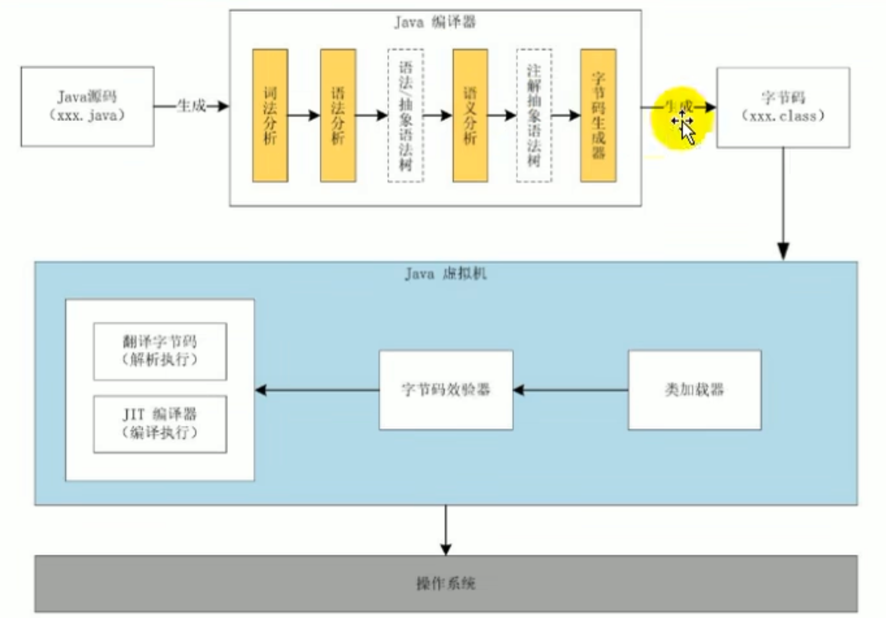
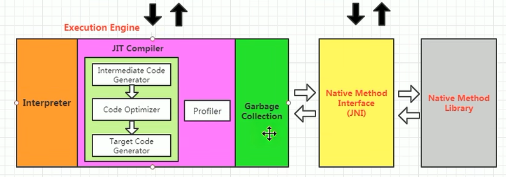
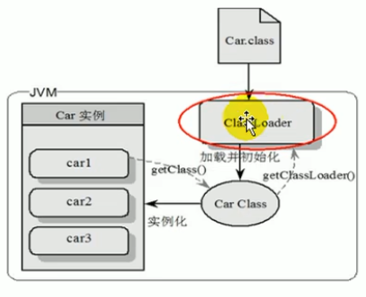
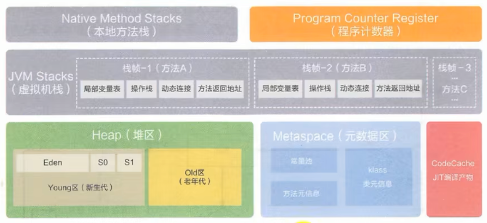

# 前言

你是否也遇到过这些问题？

- 运行着的线上系统突然卡死，系统无法访问，甚至直接OOM
- 想解决线上JVM GC问题，但却无从下手
- 新项目上线，对各种JVY参数设置一脸茫然，直接默认吧，然后就 jj 了
- 每次面试之前都要重新背一遍JM的一些原理概念性的东西，然布面试官却经常问你在实际项目中如何调优JVN参数，如何解决GC、oON等问题，一脸懵逼

大部分Java开发人员，除会在项目中使用到与Java平台相关的各种高精尖技术，**对于Java技术的核心Java虛拟机了解甚少**

***

> 开发人员如何看待上层框架

- 一些有一定工作经验的开发人员，打心眼儿里觉得SSM、微服务等上层技术才是重点，基础技术并不重要，这其实是一种本末倒置的“病态〞

- 如果我们把核心类库的 API 比做数学公式的话，那么Java 虚拟机的知识就好比公式的推导过程

***


计算机系统体系对我们来说越来越远，在不了解底层实现方式的前提下，通过高级语言很容易编写程序代码，但事实上计算机并不认识高级语言。

***

> 垃圾回收

**垃圾收集机制** 为我们打理了很多繁琐的工作，大大提高了开发的效率，但是，垃圾收集也不是万能的，懂得JVM内部的内存结构、工作机制，是设计高扩展性应用和诊断运行时问题的基础，也是Java工程师进阶的必备能力

> Java生态圈

Java是目前应用最为广泛的软件开发平台之一。随着Java以及Java社区的不断壮大。

Java 也早己不再是简简单单的一门计算机语言了，它更是一个平台、一种文化、一个社区

- **作为一个半台**，Java虚拟机扮演着举足轻重的作用，Groovy、scala、 JRuby、Kotlin等都是Java平台的一部分
- **作为一种文化**，Java几乎成为了 “开源” 的代名词，第三方开源软件和框架。如Tomcat、struts, MyBatis, spring等，就连JDK和JVM自身也有不少开源的实现，如OpenJDK、Harmony
- **作为一个社区**，Java拥有全世界最多的技术拥护者和开源社区支持，有数不清的论坛和资料。从桌面应用软件、联入式开发到企业级应用、后台服务器、中间件，都可以看到Java的身影。其应用形式之复杂、参与人数之众多也令人咋舌。

***

# 1. 内存与垃圾回收篇

## 1.1 JVM与Java体系结构

> 字节码

- 我们平时说的java字节码，指的是用java语言编译成的字节码。准确的说任何能在jvm平台上执行的字节码格式都是一样的。所以应该统称为：jvm字节码。

- 不同的编译器，可以编译出相同的字节码文件，字节码文件也可以在不同的JVM上运行。

- Java 虚拟机与 Java 语言并没有必然的联系，它只与特定的二进制文件格式—Class文件格式所关联，Class 文件中包含了 Java 虛拟机指令集（或者称为宇节码、Bytecodes）和符号表，还有一些其他辅助信息。

### 1.1.1 Java及JVM简介

> Java :跨平台的语言


> JVM：跨语言的平台


**Java虚拟机**根本不关心运行在其内部的程序到底是使用何种编程语言编写的，它只关心“**字节码**”文件。也就是说Java虛拟机拥有语言无关性，并不会单纯地与Java语言“终身绑定”，只要其他编程语言的编译结果满足并包含 Java虛拟机的内部指令集、符号表以及其他的辅助信息，它就是一个有效的字节码文件，就能够被虚拟机所识别并装载运行

> 总结：Java不是最强大的语言，但是JVM是最强大的虛拟机

***

### 1.1.2 虚拟机与Java虚拟机

> 虚拟机

所谓虛拟机(Virtual Mpchine)，就是一合虚拟的计算机。它是一款软件，用来执行一系列虚拟计算机指令。大体上，虚拟机可以分为**系统虚拟机**和**程序虚拟机**

- 大名鼎鼎的visual Box,VMware就属于系统虛拟机，它们**完全是对物理计算机的仿真**，提供了一个可运行完整操作系统的软件平台
- 程序虚拟机的典型代表就是Java虛拟机，它**专门为执行单个计算机程 序而设计**，在Java虚拟机中执行的指令我们称为Java字节码指令

无论是系统虚拟机还是程序虚拟机，在上面运行的软件都被限制于虚拟机提供的资源中

***

> Java 虚拟机

- Java虚拟机是一台执行Java字节码的虚拟计算机，它拥有独立的运行机制，其运行的Java字节码也未必由Java语言编译而成
- JVM平台的各种语言可以共享Java虚拟机带来的跨平台性、优秀的垃圾回器，以及可靠的即时编译器
- **Java技术的核心就是Java虚拟机** (JVM, Java Virtual Machine )，因为所有的Java程序都运行在Java虛拟机内部

***

> 作用

Java虚拟机就是二进制字节码的运行环境，负责装载字节码到其内部，解释/编译为对应平台上的机器指令执行。每一条Java指令，Java虚拟机规范中都有详细定义，如怎么取操作数，拿么处理操作数，处理结果放在哪里

特点：

- 一次编译，到处运行
- 自动内存管理
- 自动垃圾回收功能

***

> JVM 位置


JVM是运行在操作系统之上的，它与硬件没有直接的交互。

***

### 1.1.3 JVM整体结构

- HotSpot VM是目前市面上高性能虚拟机的代表作之一
- 它采用解释器与即时编译器并存的架构


黄色：方法区和堆，是线程共享的；灰色是线程独有的。

***

### 1.1.4 Java代码执行流程



***

### 1.1.5 JVM架构模型

Java编译器输入的指令流基本上是一种基子**栈的指令集架构**，另外一种指令集架构则

是基于**寄存器的指令集架构**

具体来说：这两种架构之间的区别：

- 基于栈式架构的特点

  - 设计和实现更简单，适用于资源受限的系统;
  - 避开了寄存器的分配难题：使用零地址指令方式分配
  - 指令流中的指令大部分是零地址指令，其执行过程依赖于操作栈。指令集更小，编译器容易实现
  - 不需要硬件文持，可移植性更好，更好实现跨平台

- 基于寄存器架构的特点

  - 典型的应用是x86的二进制指令集：比如传统的BC以及Android的Davlik虚

    拟机

  - 指令集架构则完全依赖硬件，可移植性差

  - 性能优秀和执行更高效

  - 花费更少的指令去完成一项操作

  - 在大部分情況下，基于寄存器架构的指令集往往都以一地址指令、二地址指令和三地址指令为主，市基于栈式架构的指令集却是以零地址指令为主

> 举例1

同样执行 2 + 3 这种逻辑操作，其指令分别如下：

> 基于栈的计算流程（指令集小，但执行指令更多）

```java
iconst_2   // 常量2入栈
istore_1   // 放到索引1的位置
iconst_3   // 常量3入栈
istore_2   // 放到索引2的位置
iload_1    // 加载进来
iload_2    // 加载进来
iadd       // 常量2，3出栈，执行相加
istore_3   // 结果5放到索引3的位置
```

> 基于寄存器的计算流程（指令集多，但执行指令少）

```java
mov eax,2  // 将eax寄存器的值设为1
add eax,3  // 使eax寄存器的值加3
```

***

> 总结

**由于跨平台性的设计，Java的指令都是根据栈来设计的**。不同平台CPU架构不同，所以不能设计为基于奇存器的。 优点是跨平台，指令集小，编译器容易实现，缺点是性能下降，实现同样的功能需要更多的指令。

时至今日，尽管嵌入式平台已经不是Java程序的主流运行平台了（准确水说应该是HotspotVM 的宿主环境已经不局限于嵌入式平台了），那么为什么不将架构更换为基于奇存器的架构呢？

栈：

跨平台性、指令集小、指令多、；执行性能比寄存器差

***

### 1.1.6 JVM生命周期

> 虚拟机的启动

Java虚拟机的启动是通过引导类加载器 (bootstrap class loader)创建一个初始类(initial class)来完成的，这个类是由虚拟机的具体实现指定的。

***

> 虚拟机的执行

- 一个运行中的Java虚拟机有着一个清哳的任务：执行Java程序。
- 程序开始执行时他才运行，程序结束时他就停止。
- **执行一个所谓的Java程序的时候，真真正正在执行的是一个叫做Java虚拟机的进程**。

***

> 虛拟机的退出

有如下的几种情况：

- 程序正常执行结束
- 程序在执行过程中遇到了异常或错误而异常终止
- 由于操作系统出现错误而号致Java虛拟机进程终止
- 某线程调用Runtime 类或system类的exit方法，或 Runtime 类的halt方法，并且Java 安全管理器也允许这次exit或halt操作
- 除此之外，JNI ( Java Native Interface)规范描述了用JNI Invocation API来加载或卸载 Java虚拟机时，Java虚拟机的退出情况

***

### 1.1.7 JVM发展历程

> Sun Classic VM

- 早在1996年Java1.0版本的时候，sun公司发布了一款名为Sun Classic VM的Java虚拟机，它同时也是**世界上第一款商用Java虚拟机**，JDK1 .4时完全被淘汰
- 这款虚拟机内部**只提供解释器**
- 如果使用 JIT 编译器，就需要进行外挂。但是一旦使用了JIT编译器，JIT就会接管虚拟机的执行系统。解释器就不再工作。解释器和编译器不能配合工作。
- 现在hotspot内置了此虚拟机。

```java
举例：解释器理解成一行一行执行，如果for循环，也会一行一行执行；
JIT编译器就是将热点代码重复执行的缓存起来。
  
生活案例：
A地点到B地点：解释器就是走路，一说开始，解释器就开始执行了，无需等待；而JIT就理解成坐公交车，说开始时可能等公交车等了十分钟才来（前期等待时间长，无响应），等坐上车之后后续又下车，然后继续等公交车（后续可能会追上步行，但是等确实耗费时间，说不定还没步行快）。

后面将解释器和JIT结合使用，有些地方走路快的，就不等公交车。结合起来效率更高。
```

***

> Exact VM

- 为了解决上一个虚拟机问题，jak1.2时，sun提供了此虛拟机
- Bxact Memory Management： 准确式内存管理
  - 也可以叫Non-conservat ive/Accurate Memory Management
  - **虚拟机可以知道内存中某个位置的数据具体是什么类型。**
- 其备现代高性能虚拟机的雏形
  - 热点探测
  - 编译器与解释器混合工作模式
- 只在Solaris平台短暂使用，其他平台上还是classic vm
  - 英雄气短，终被Hotspot虛拟机替换

***

> SUN公司的 HotSpot VM

- HotSpot历史
  - 最初面一家名为“tongviewrechnologies“的小公司设计
  - 1997年，此公司被sun收购;2009年，sun公司被甲骨文收购
  - JDK1.3时，Hotspot wM成为默认虚拟机
- 目前Hotspot占有绝对的市场地位，称霸武林
  - **不管是现在仍在广泛使用的JDK6，还是使用比例较多的JDK8中，默认的虚拟机都是 HotSpot**
  - Sun/oracle JDK和openJDK的默认虚拟机
  - 因此本课程中默认介绍的虚拟机都是Hotspot，相关机制也主要是指HotSpot的GC机制。（比如其他两个商用虚拟机都没有方法区的慨念）
- 从服务器、桌面到移动端、嵌入式都有应用
- 名称中的Hotspot指的就是它的热点代码探测技术
  - 通过计数器找到最具编译价值代码，触发即时编译或栈上替换
  - 通过编译器与解释器协同工作，在最优化的程序响应时间与最佳执行性能中取得平衡

***

> BEA 的 JRockit

- 专注于服务器端应用
  - 它可以不太关注程序启动速度，因此JRockit内部不包含解析器实现，全部代码都拿即时编译器编译后执行
- 大量的行业基准测试显示，**JRockit JVM是世界上最快的JVM**
  - 使用JRockit产品，客户己经体验到了显著的性能提高（一些超过了70%）和硬件成本的减少（达50%）
- 优势：全而的Java运行时解决方案组合
  - JRockit面问延迟敏感型应用的解决方案JRockit Real Time提供以亳秒或微秒级的JVM响应时间，适合财务、军事指挥、电信网络的需要
  - Missioncontrol服务套件，它是一组以极低的开销来监控、管理和分析生产环境中的应用程序的工具。
- 2008年，BEA被Oracle收购
- oracle表达了整合两大优秀虛拟机的工作，大致在JDR 8中完成。整合的方式是在Hotspot的基础上，移植JRockit的优秀特性
- 高斯林：目前就职于谷歌，研究人工智能和水下机器人

***

> IBM 的 J9

- 全称：IBM Technology for Java Virtual Machine, 简称IT4J，内部代号：J9
- 市场定位与Hotspot接近，服务器端、桌面应用、嵌入式等多用途VM
- 广泛用于IBM的各种Java产品
- 目前，有影响力的三大商用虛拟机之一，也号称是世界上最快的Java虛拟机
- 2017年左右，IBM发布了开源J9 VM，命名为openJ9，交给Eclipse基金会管理，也称为 Eclipse openJ9

***

> TaobaoJVM

- 由AliJVM 团队发布。阿里，国内使用Java最强大的公司，覆盖云计算、金融、物流、电商等众多领域， 需要解决高并发、高可用、分布式的复合问题。有大量的开源产品
- **基于openJDK 开发了自己的定制版不AlibabaJDK**，简称AJDK。是整个阿里Java体系的基石
- 基于openJDK Hotspot VM 发布的国内第一个优化、**深度定制且开源的高性能服务器版Java虚拟机**
  - 创新的GCIH (GC invisible heap ）技术实现了off-heap，**即将生命周期较长的Java对象从heap中移到heap之外，并且GC不能管理GCIH内部的Java 对象，以此达到降低GC 的回收频率和提升GC 的回收效率的目的**
  - GCIH 中的**对象还能够在多个Java 虚拟机进程中实现共享**
  - 使用crc32 指令实现 JVM intrinsic 降低JNI 的调用开销
  - PMU hardware 的Java profiling tool 和诊断协助功能
  - 针对大数据场景的zenGC
- taobao vm应用在阿里产品上性能高，硬件严重依赖inte1的cpu，损失了兼容性，但提高了性能
  - 目前己经在淘宝、天猫上线，把Oracle 官方JVM 版木全部替换了

***

## 1.2 类加载子系统

### 1.2.1 内存结构概述

> 简图


***

> 详细图




***

### 1.2.2 类加载器与类的加载过程


- 类加载器子系统负责从文件系统或者网络中加载Class文件，class文件在文件开头有特定的文件标识
- ClassLoader只负责class文件的加载，至于它是否可以运行，则由Execution Engine决定
- 加载的类信息存放于一块称为方法区的内存空间。除了类的信息外，方法区中还会存放运行时常量池信息，可能还包括字符串字面量和数字常量（这部分常量信息是Class文件中常量池部分的内存映射）

***

> 类加载器ClassLoader角色



1. class file 存在于本地硬盘上，可以理解为设计师画在纸上的模板，而最终这个模板在执行的时候是要加载到JVM当中来根据这个文件实例化出n个一模一样的实例。
2. class file 加载到JVM中，被称为DNA元数据模板，**放在方法区**
3. 在.class文件一＞JVM ->最终成为元数据模板，此过程就要一个远输工具(类装载器 Class Loader)，扮演一个快递员的角色。

***

```java
public class HelloLoader {
  public static void main(String[] args) {
    System.out.println("Hello");
  }
}
```

> 类的加载过程


> 类的加载过程包括三个阶段：加载、链接、初始化


类的加载（广义）过程刚好第一个阶段也叫加载（狭义）

***

#### 1.2.2.1 加载

1. 通过一个类的全限定名获取定义此类的二进制字节流
2. 将这个字节流所代表的静态存储结构转化为方法区的运行时数据结构
3. **在内存中生成一个代表这个类的java.lang.Class对象**，作为方法区这个类的各种数据的访问入口

***

> 补充：加载.class文件的方式

- 从本地系统中直接加载
- 通过网络获取，典型场景：Web Applet
- 从zip压缩包中读取，成为日后jar、war格式的基础
- 运行时计算生成，使用最多的是：动态代理技术
- 由其他文件生成，典型场景：JSP应用
- 从专有数据库中提取。class文件，比较少见
- 从加密文件中获取，典型的防CIass文件被反编译的保护措施

***

#### 1.2.2.2 链接

> 验证-Verify

- 目的在于确保Class文件的字节流中包含信息符合当前虛拟机要求，保证被加载类的正确性，不会危害虛拟机自身安全
- 主要包括四种验证，**文件格式验证，元数据验证，字节码验证，符号引用验证**

***

> 准备-Prepare

**简言之，为类的静态变分配内存，并将其初始化为默认值**

- 为**类变量（static修饰）**分配内存并且设置该类变量的默认初始值，即零值。
- **这里不包含用final修饰的static，因为final在编译的时候就会分配了，准备阶段会显式初始化**
- 这里不会为实例变量分配初始化，类变量会分配在方法区中，而实例变量是会随着对象一起分配到Java堆中

***

> 解析-Resolve

- **将常量池内的符号引用转换为直接引用的过程**
- 事实上，解析操作往往会伴随着JVM在执行完初始化之后再执行
- 符号引用就是一组符号来描述所引用的目标。符号引用的字面量形式明确定义在 《java虛拟机规范》的Class文件格式中。直接引用就是直接指向目标的指针、相对偏移量或一个间接定位到目标的句柄
- 解析动作主要针对类或接口、字段、类方法、接口方法、方法类型等。对应常量池中的CONSTANT_Class_info、 CONSTANT _Fieldref_info、CoNSTANT_Methodref_info等

***

```java
public class HelloApp {
 	private static int a = 1; // prepare阶段： a = 0 ---> initial初始化：a = 1
  public static void main(String[] args) {
  }
}
```

***

#### 1.2.2.3 初始化

**简言之，为类的静态变量赋予正确的初始值**

- 初始化阶段就是执行类构造器方法<C1init>()的过程
- 此方法不需定义，是 javac 编译器自动收集类中的**所有类变量的赋值动作**和**静态代码块中的语句**合并而来（**如果没有static修饰的变量和代码块，字节码不会出现<C1init>**）
- 构造器方法中指令按语句在源文件中出现的顺序执行
- <clinit>()不同于类的构造器。（关联：构造器是虛拟机视角下的<init>()，每个类至少存在一个构造器，对应就是<init>）
- 若该类具有父类，JVM会保证子类的<Clinit>（）执行前，父类的<C1init>(）己经执行完毕
- 虛拟机必须保证一个类的<Clinit>（）方法在多线程下被同步加锁【类加载到内存只需加载一次，<Clinit>（）方法只调用一次】

***

问：Java编译器并不会为所有的类都产生<Clinit>（）初始化方法。哪些类在编译为字节码后，字节码文件中将不会包括<Clinit>（）方法？

- 一个类中并没有声明任何的类变量，也没有静态代码块时
- 一个类中声明类变量，但是没有明确使用类变量的初始化语句以及静态代码块来执行初始化操作时
- 一个类中包含 static final修饰的基本数据类型的字段，这些类字段初始化语句采用编译时常量表达式

***

> 验证子类的<Clinit>执行前，先执行父类的<C1init>

```java
public class ClassInitTest {
    private static int num = 1;
    static {
        num = 2;
        number = 20;
        System.out.println(num); // ok
        //System.out.println(number); // 报错，非法的前向引用（可以赋值，但是不能使用）
    }
    private static int number = 10; // linking之prepare：number = 0 --> initial: 20 --> 10
    public static void main(String[] args) {
        System.out.println(ClassInitTest.num);   // 2
        System.out.println(ClassInitTest.number);// 10
    }
}
```

> 验证父类优先于子类加载

```java
public class ClinitTest1 {
    static class Father {
        public static int A = 1;
        static {
            A = 2;
        }
    }
    static class Son extends Father {
        public static int B = A;
    }
    public static void main(String[] args) {
        // 先加载Father类（加载-链接-初始化），其次加载Son类
        System.out.println(Son.B);
    }
}
```

> 验证类只被加载一次

```java
public class DeadThreadTest {
    public static void main(String[] args) {
        Runnable r = () -> {
            System.out.println(Thread.currentThread().getName() + "开始");
            DeadThread dead = new DeadThread();
            System.out.println(Thread.currentThread().getName() + "结束");
        };
        Thread t1 = new Thread(r,"线程1");
        Thread t2 = new Thread(r,"线程2");
        t1.start();
        t2.start();
    }
}
class DeadThread {
    static {
        if (true) {
            System.out.println(Thread.currentThread().getName() + "初始化当前类");
            while (true) {}  // 死循环，不会结束，模拟当前类一直加载中
        }
    }
}

线程2开始
线程1开始
线程2初始化当前类
```

***

### 1.2.3 类加载器分类

- JVM 支持两种类型的类加载器，分别为**引导类加载器 (Bootstrap ClassLoader）**和**自定义类加载器 (User-Defined classLoader)**
- 从概念上来讲，自定义类加载器一般指的是程序中由开发人员自定义的一类类加载器，但是Java虚拟机规范却没有这么定义，而是**将所有派生于抽象类ClassIoader的类加载器都划分为自定义类加载器**【按这样划分的话，那么除了Bootstrap ClassLoader，剩下都属于自定义类加载器，见下图】
- 无论类加载器的类型如何划分，在程序中我们最常见的类加载器始终只有3个，如下所示：


**这里的四者之间的关系是包含关系。不是上层下层，也不是子父类的继承关系**

说明：Bootstrap ClassLoader是非java语言编写的，其他都是java语言编写的。

```java
public static void main(String[] args) {
    // 获取系统类加载器
    ClassLoader systemClassLoader = ClassLoader.getSystemClassLoader();
    System.out.println(systemClassLoader); // sun.misc.Launcher$AppClassLoader@18b4aac2
  
    // 获取其上层：扩展类加载器
    ClassLoader extClassLoader = systemClassLoader.getParent();
    System.out.println(extClassLoader); // sun.misc.Launcher$ExtClassLoader@1540e19d
  
    // 获取其上层：获取不到引导类加载器
    ClassLoader bootClassLoader = extClassLoader.getParent();
    System.out.println(bootClassLoader); // null
  
    // 对于用户自定义类来说，默认使用系统类加载器进行加载
    ClassLoader classLoader = ClassLoaderTest.class.getClassLoader();
    System.out.println(classLoader); // sun.misc.Launcher$AppClassLoader@18b4aac2
  
    // String类使用 引导类加载器进行加载 --> java核心类库都是使用引导类进行加载
    ClassLoader stringLoader = String.class.getClassLoader();
    System.out.println(stringLoader); //null
}
```

***

> 虚拟机自带的加载器

- 启动类加载器（也叫引导类加载器，Bootstrap ClassIoader)
  - 这个类加载使用C/C++语言实现的，嵌套在JVM内部
  - 它用来加载Java的核心库 (JAVA HOME/jre/lib/rt.jar、resources. jar等或sun.boot.ciass.path路径下的内容)，用于提供JVM自身需要的类
  - 并不继承自java. lang.classLoader，没有父加载器【C语言写的不可能继承Java的类】
  - **加载扩展类和应用程序 类加载器，并指定为他们的父类加载器**【扩展类和系统类加载器也是由Bootstrap ClassIoader加载，他俩也属于核心库中的】。
  - 出于安全考虑，Bootstrap启动类加载器只加载包名为java、javax、sun等开头的类
- 扩展类加载器 (Extension classLoader)
  - Java语言编写，由sun.misc.Launcher$ExtclassLoader实现
  - 派生于classIoader类
  - 父类加载器为**启动类加载器**
  - 从java.ext.dirs系统属性所指定的目录中加载类库，或从JDK的安装日录的 `jre/lib/ext` 子日录（扩展目录）下加载类库。**如果用户创建的JAR放在此日录下，也会自动由扩展类加载器加载。**
- 应用程序类加载器（系统类加载器 AppCIassIoader)
  - java语言编写，由sun.misc.Launcher$AppclassIoader实现
  - 派生于classIoader类
  - 父类加载器为**扩展类加载器**
  - 它负责加载环境变量classpath或系统属性 java.class.path 指定路径下的类库
  - **该类加载是程序中默认的类加载器**，一般来说，Java应用的类都是由它来完成加载
  - 通过ClassLoader#getsystemclassLoader()方法可以获取到该类加载器

***

> 引导类加载器

```java
 public static void main(String[] args) {
     System.out.println("********** 启动类加载器 ***********");
     URL[] urLs = Launcher.getBootstrapClassPath().getURLs();
     for (URL urL : urLs) {
         System.out.println(urL.toExternalForm());
     }
     // 从 jsse.jar 选择一个类，来看看他的类加载器是什么
     ClassLoader classLoader = Provider.class.getClassLoader();
     System.out.println(classLoader); // null  说明是引导类加载器加载的
   
     System.out.println("********** 扩展类加载器 ***********");
     String extDirs = System.getProperty("java.ext.dirs");
     for (String path : extDirs.split(";")) {
         System.out.println(path);
     }
     // 从 sunec.jar 选择一个类，来看看他的类加载器是什么
     ClassLoader classLoader1 = SunEC.class.getClassLoader();
     System.out.println(classLoader1); //  sun.misc.Launcher$ExtClassLoader@31befd9f  说明是扩展类加载器加载的
 }
********** 启动类加载器 ***********
file:/Library/Java/JavaVirtualMachines/jdk-1.8.jdk/Contents/Home/jre/lib/resources.jar
file:/Library/Java/JavaVirtualMachines/jdk-1.8.jdk/Contents/Home/jre/lib/rt.jar
file:/Library/Java/JavaVirtualMachines/jdk-1.8.jdk/Contents/Home/jre/lib/jsse.jar
file:/Library/Java/JavaVirtualMachines/jdk-1.8.jdk/Contents/Home/jre/lib/jce.jar
file:/Library/Java/JavaVirtualMachines/jdk-1.8.jdk/Contents/Home/jre/lib/charsets.jar
file:/Library/Java/JavaVirtualMachines/jdk-1.8.jdk/Contents/Home/jre/lib/jfr.jar
file:/Library/Java/JavaVirtualMachines/jdk-1.8.jdk/Contents/Home/jre/classes
null
********** 扩展类加载器 ***********
/Users/wing/Library/Java/Extensions:/Library/Java/JavaVirtualMachines/jdk-1.8.jdk/Contents/Home/jre/lib/ext:/Library/Java/Extensions:/Network/Library/Java/Extensions:/System/Library/Java/Extensions:/usr/lib/java
sun.misc.Launcher$ExtClassLoader@31befd9f
```

***

**用户自定义加载器**

- 在Java的日常应用程序开发中，类的加载几乎是由上述3种类加载器相互配合执行的，在必要时，我们还可以自定义类加载器，来定制类的加载方式。
- 为什么要自定义类加载器？
  - 隔离加载类
  - 修改类加载的方式
  - 扩展加载源
  - 防止源码泄漏

***

### 1.2.4 ClassLoader的使用说明

> 关于ClassLoader

Classloader类，它是一个抽象类，其后所有的类加载器都继承自ClassLoader （不包括启动类加载器）

相关方法略。。。

***

### 1.2.5 双亲委派机制

Java虚拟机对class文件采用的是**按需加载**的方式，也就是说当需要使用该类时才会将它的class文件加载到内存生成class对象。而且加载某个类的class 文件时，Java虚拟机采用的是**双亲委派模式**，即把请求交由父类处理，它是一种任务委派模式。

> 我们也创建java.lang包，并且也定义String类（跟核心类库String一样包名和类名）

```java
package java.lang;
public class String {
    static {
        System.out.println("test String");
    }
    // 当执行这个main方法时，会报错，为什么呢？
    // 因为String被引导类加载器加载了，然后去执行核心API String中的main方法，发现没找到，所以报错了
    public static void main(String[] args) {
        System.out.println("hello");
    }
}
```

> 测试

```java
public static void main(String[] args) {
    // 如果这里用的是自定义的String，那么一定会输出 "test String"，但是输出结果并没有
    String str = new String(); // 尝试使用系统类加载器对自定义类进行加载，但是会先向上委托，直到引导类这，引导类加载器看了下是java.lang包下的，所以引导类加载器可以加载，系统类加载器就不会去加载自定义类了，因此这里使用的是核心API的String
    System.out.println("hello" + str);
}
```

> 结论：假如自己定义了java.lang.String，项目中会使用这个而不是用的核心的String会出现什么后果，比如别人给我们一个这样的类，我放到项目中，然后项目直接就挂了


> 工作原理

1. 如果一个类加载器收到了类加载请求： 它并不会自己先去加载，而是把这个请求委托给父类的加载器去执行；
2. 如果父类加载器还存在其父类加载器，则进一步向上委托，依次递归，请求最终将到达顶层的启动类加载器
3. 如果父类加载器可以完成类加载任务，就成功返回，倘若父类加载器无法完成此加载任务，子加载器才会尝试自己去加载，**这就是双亲委派模式。**

***

> 双亲委派机制举例2


​        假如我们的程序中需要使用`SPI接口`，该接口属于核心API，使用双亲委派机制，依次到引导类加载器，引导类加载器去加载核心`rt.jar包`，该包存在一些`interface接口`，接口需要具体的实现类，实现类就涉及到`第三方的jar包`了，假如是`jdbc.jar`，这时候呢jar包属于第三方的了，不属于核心API，因此出现反向委派，依次向下委派给`系统类加载器`，因此具体实现类由`系统类加载器`进行加载。

**总结：核心API中的接口是引导类加载器进行加载，而实现类是由系统类加载器进行加载**

优势：

- 避免类的重复加载
- 保护程序安全，防止核心API被随意篡改
  - 自定义类：java.lang.String
  - 自定义类：java.lang.ShkStart

***

```java
/* 在 java.lang 包下写一个自定义类 */
package java.lang;
public class WsyStart {
    
    public static void main(String[] args) {
        System.out.println("hello");
    }
}
// 启动main方法会报错
Exception in thread "main" java.lang.SecurityException: Prohibited package name: java.lang
```

**原因**：定义在 java.lang 包下的类由引导类加载器进行加载，发现这个不是核心API，所以提示不允许加载

**好处**：保护程序，不然随便写个恶意程序攻击引导类加载器，会导致系统崩溃。

***

> 沙箱安全机制

自定义string类，但是在加载自定义string类的时候会率先使用引导类加载器加载，而引导类加载器在加载的过程中会先加载jdk自带的文件(rt.jar包中java\lang\string.class)，报错信息说没有main方法，就是因为加载的是rt.jar包中的string类。这样可以保证对java核心源代码的保护，这就是**沙箱安全机制**

***

### 1.2.6 其他

- 在 JVM 中表示两个 class 对象是否为同一个类，存在两个必要条件：
  - 类的完整类名必须一致，包括包名
  - 加载这个类的ClassLoader(指ClassIoader实例对象）必须相同。

换句话说，在 JVM 中，即使这两个类对象（Class对象）来源同—个Class文件，被同一个虚拟机所加载，但只要加载它们的ClassLoader实例对象不同，那么这两个类对象也是不相等的。

***

> 对类加载器的引用

​        JVM必须知道一个类型是由`启动加载器`加载的还是由`用户类加载器`加载的。如果一个类型是由用户类加载器加载的，那么 JVM 会**将这个类加载器的一个引用作为类型信息的一部分保存在方法区中（这样类调用getClassLoader()就可以知道当前类是哪个加载器加载的了）**。

当解析一个类型到另一个类型的引用的时候，JVM需要保证这两个类型的类加载器是相同的。

***

#### 1.2.6.1 类的主动使用和被动使用

Java程序对类的使用方式分为：**主动使用和被动使用**

- 主动使用，又分为七种情况：

  - 创建类的实例

  - 访问某个类或接口的静态变量，或者对该静态变量赋值

  - 调用类的静态方法

  - 反射（比如： Class .forName (“com.atguigu.Test"))

  - 初始化一个类的子类

  - Java虚拟机启动时被标明为启动类的类

  - JDK 7开始提供的动态语言支持

    java. lang .invoke .MethodHandle实例的解析结果 REF_ getstatic、 REF putstatic、 REF_ invokestatic句柄对应的类没有初始化，则初始化

除了以上七种情况，其他使用Java类的方式都被看作是对**类的被动使用**，都**不会导致类的初始化**（被动使用也是使用，也会被加载，但是不会被初始化）

也就是说：**并不是在代码中出现的类，就一定会被加载或者初始化。如果不符合主动使用的条件，类就不会初始化**

***

> 被动使用案例

1.静态字段

```java
public class PassiveUse {
    @Test
    public void test() {
        System.out.println(Child.num);  // 获取父类的类变量
    }
}
class Child extends Parent {
    static {
        System.out.println("Child类的初始化");
    }
}
class Parent {
    static {
        System.out.println("Parent类的初始化");
    }
    public static int num = 1;
}

Parent类的初始化
1
```

结论：当通过子类引用父类的静态变量，不会导致**子类**初始化，只有真正声明这个字段的类（父类）才会被初始化。假如下面，现在打印子类类变量，是不是只初始化子类，而不用初始化父类的？错，java基础就是，只要初始化子类，那么要优先初始化它的父类。

```java
public class PassiveUse {
    @Test
    public void test() {
        System.out.println(Child.num1);  // 子类的类变量
    }
}
class Child extends Parent {
    public static int num1 = 1;
    static {
        System.out.println("Child类的初始化");
    }
}
class Parent {
    static {
        System.out.println("Parent类的初始化");
    }
    public static int num = 1;
}
Parent类的初始化
Child类的初始化
1
```

2.数组定义：通过数组定义类引用，不会触发此类的初始化

```java
Parent[] parents= new Parent[10];
System.out.println(parents.getClass());
// new的话才会初始化
parents[0] = new Parent();
```

3.引用常量：引用常量不会触发此类或接口的初始化。因为常量在链接阶段就已经被显式赋值了

```java
public class PassiveUse {
    public static void main(String[] args) {
        System.out.println(Serival.num);
        // 但引用其他类的话还是会初始化
        System.out.println(Serival.num2);
    }
}
interface Serival {
    public static final Thread t = new Thread() {
        {
            System.out.println("Serival初始化");
        }
    };
    public static int num = 10;
    public static final int num2 = new Random().nextInt(10);
}

```

4.loadClass 方法：调用 ClassLoader 类的 loadClass()方法加载一个类，并不是对类的主动使用，不会导致类的初始化

```java
Class clazz = ClassLoader.getSystemClassLoader().loadClass("com.test.java.Person");
```

***

## 1.3 运行时数据区概述及线程


***


***

​        **内存** 是非常重要的系统资源，是**硬盘**和**CPU** 的中间仓库及桥梁，承载着操作系统和应用程序的实时运行。**JVM 内存布局规定了Java在运行过程中 内存申请、分配、管理的策略**，保证了JVM的高效稳定运行。**不同的 JVM 对于内存的划分方式和管理机制存在着部分差异**。结合 JVM 虚拟机规范，来探讨一下经典的 JVM 内存布局


***



***

​        Java虚拟机定义了若干种程序运行期间会使用到的运行时数据区，其中有一些会随着虛拟机启动而创建，随着虛拟机退出而销毀。另外一些则是与线程一一对应的，这些与线程对应的数据区域会随着线程开始和结束而创建和销毁。

**灰色**的为单独线程私有的，**红色**的为多个线程共享的。即：

- 每个线程：独立包括程序计数器、栈、本地栈。

- 线程间共享：堆、堆外内存（永久代或元空间、代码缓存）

  

  假如一个进程有5个线程，那么一个进程只有一个堆和方法区，每个线程都单独一份PC、VMS、NMS，5个线程共享一个堆和方法区。

  灰色基本都是进栈和出栈操作，不用进行什么优化，主要优化是在堆和方法区（java8后叫元空间），堆 95% 方法区 5%

**每个JVM只有一个Runtime实例（单例）。即为运行时环境，相当于内存结构的中间的那个框框：运行时环境**

***

> 线程

- 线程是一个程序里的运行单元。JVM允许一个应用有多个线程并行的执行
- 在Hotspot JVM 里，每个线程都与操作系统的本地线程直接映射
  - **当一个Java线程准备好执行以后，此时一个操作系统的本地线程也同时创建**。Java线程执行终止后，本地线程也会回收
- 操作系统负责所有线程的安排调度到任何一个可用的CPU上。一旦本地线程初始化成功，它就会调用Java线程中的run() 方法

***

## 1.4 程序计数器

也叫做 **PC寄存器**

JVM 中的程序计数寄存器 （Program counter Register) 中，Register 的命名源于CPU的寄存器，寄存器存储指令相关的现场信息。CPU只有把数据装载到寄存器才能够运行

这里，并非是广义上所指的物理寄存器，或许将其翻译为PC计数器（或指令计数器）会更加贴切（也称为程序钩子），并且也不容易引起一些不必要的误会。**JVM中的PC寄存器是对物理PC寄存器的一种抽象模拟**

***

> 作用

PC寄存器用来存储指向下一条指令的地址，也即将要执行的指令代码。由执行引擎读取下一条指令。


***

> PC寄存器介绍

- 它是一块很小的内存空间，几乎可以忽略不记。也是运行速度最快的存储区域
- 在 JVM 规范中，每个线程都有它自己的程序计数器，是线程私有的，生命周期与线程的生命周期保持一致。
- 任何时间一个线程都只有一个方法在执行，也就是所谓的**当前方法**。程序序计数器会存储当前线程正在执行的 Java方法的 JVM 指令地址；或者，如果是在执行 native 方法，则是未指定值 （undefined)
- **它是程序控制流的指示器**，分支、循环、跳转、异常处理、线程恢复等基础功能都依赖这个计数器来完成
- 字节码解释器工作时就是通过改变这个计数器的值来选取下一条需要执行的字节码指令
- **它是唯一一个在 Java 虚拟机规范中没有规定任何 outotMemoryError 情况的区域**

**补充：栈只是进栈，出栈，也没有GC垃圾回收，但是会OOM**，PC寄存器比较特殊，即没有GC，也没有OOM。

***


***

> 两个常见问题

> 问题1

**使用PC寄存器存储字节码指令地址有什么用呢？**

**为什么使用PC寄存器记录当前线程的执行地址呢？**

因为CPU需要不停的切换各个线程，这时候切换回来以后，就得知道接着从哪开始继续执行。

JVM 的字节码解释器就需要通过改变PC寄存器的值来明确下一条应该执行什么样的字节码指令。

***

> 问题2

**PC寄存器为什么会被设定为线程私有？**

我们都知道所谓的多线程在一个特定的时间段内只会执行其中某一个线程的方法，CPU 会不停地做任务切换，这样必然导致经常中断或恢复，如何保证分毫无差呢？为了能够准确地记录各个线程正在执行的当前字节码指令地址，最好的办法自然是为每一个线程都分配一个PC寄存器，这样一来各个线程之间便可以进行独立计算，从而不会出现相互干扰的情况。

**假如两个线程：第一个线程执行到5行，CPU切换到第二个线程执行到7行，CPU重新回到第一个线程后从哪里继续执行呢，所以需要每个线程一份PC寄存器来单独记录**

***

> CPU时间片

CPU 时间片即 CPU 分配给各个程序的时间，每个线程被分配一个时间段，称作它的时间片

**在宏观上**：我们可以同时打开多个应用程序，每个程序并行不悖，同时运行

**但在微观上**：由于只有一个 CPU，一次只能处理程序要求的一部分，如何处理公平，一种方法就是引入时间片，每个程序轮流执行


**并行 VS 串行：**

**并行**：同一个时间点有多个线程同时在执行

**串行**：多个线程排队执行，同一个时间点只有一个线程在执行

***

## 1.5 虚拟机栈

### 1.5.1 虚拟机栈概述

> 虛拟机栈出现的背景

由于跨平台性的设计，Java的指令都是根据栈来设计的。不同平台CPU架构不同，所以不能设计为基于寄存器的

**优点是跨平台，指令集小，编译器容易实现，缺点是性能下降，实现同样的功能需要更多的指令**

***

> 内存中的栈与堆

**栈是运行时的单位，而堆是存储的单位**

即：栈解決程序的运行问题，即程序如何执行，或者说如何处理数据。堆解決的是数据存储的问题，即数据怎么放、放在哪儿


***

> Java虚拟机栈是什么？

Java虚拟机栈 (Java Virtual Machine stack），早期也叫 Java 栈。每个线程在创建时都会创建一个虚拟机栈，其内部保存一个个的栈帧(stack Frame），对应着一次次的 Java方法调用（是线程私有的）

**生命周期**：生命周期与线程一致

**作用**：主管Java程序的运行，它保存方法的局部变量（8种基本数据类型、对象的引用地址）、部分结果，并参与方法的调用和返回。

- 局部变量 VS 成员变量（或属性）

***


最上面的栈叫**当前方法**，最上面的绿色出栈了，那么蓝色就是当前方法。

***


### 1.5.2 栈的存储单位

### 1.5.3 局部变量表

### 1.5.4 操作数栈

### 1.5.5 代码追踪

### 1.5.6 栈顶缓存技术

### 1.5.7 动态链接

### 1.5.8 方法的调用：解析与分派

### 1.5.9 方法返回地址

### 1.5.10 一些附加信息

### 1.5.11 栈的相关面试题


## 1.6 本地方法接口

## 1.7 本地方法栈

## 1.8 堆

## 1.9 方法区

## 1.10 直接内存

## 1.11 执行引擎

## 1.12 StringTable

## 1.13 垃圾回收概述

## 1.14 垃圾回收相关算法

## 1.15 垃圾回收相关概念

## 1.16 垃圾回收器  


# 2. 字节码与类的加载篇

# 3. 性能监控与调优篇

## 4 大厂面试篇