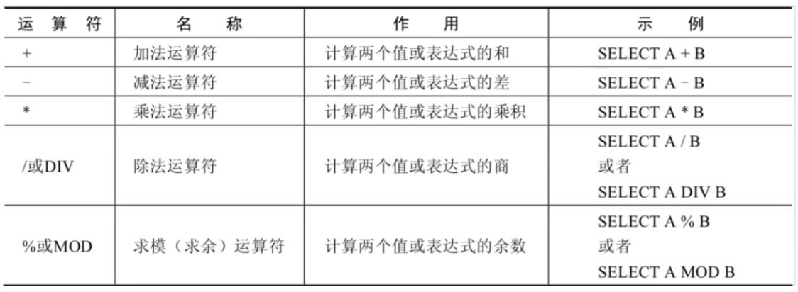
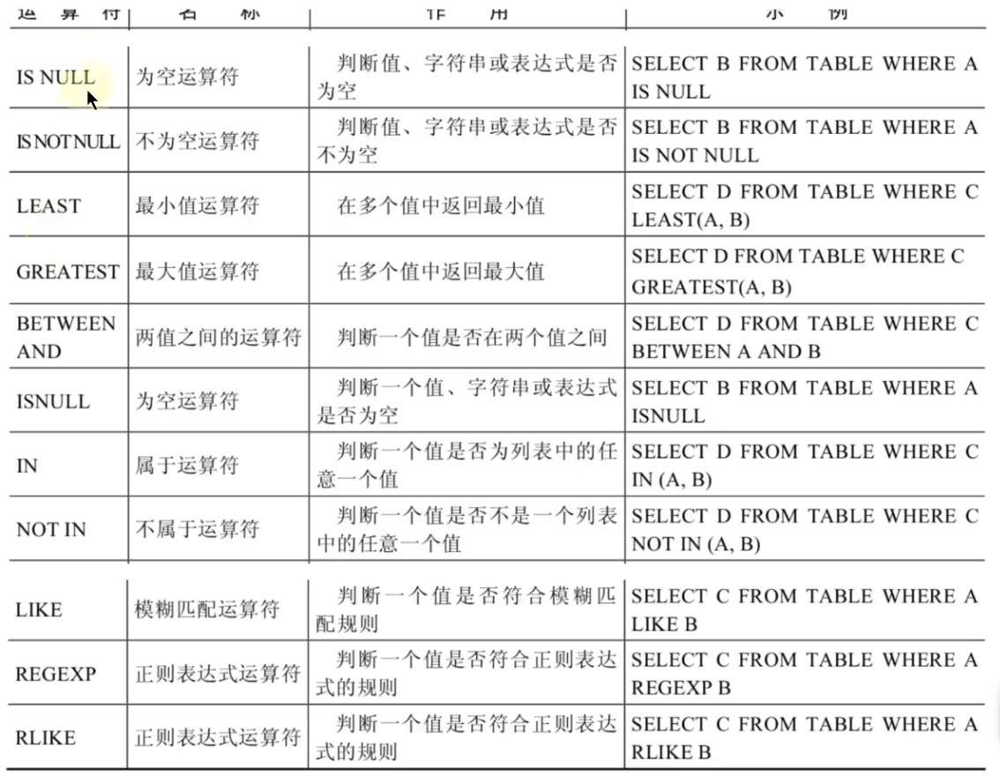
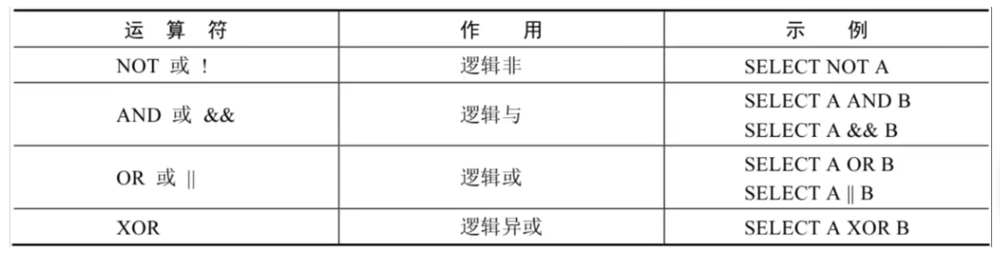
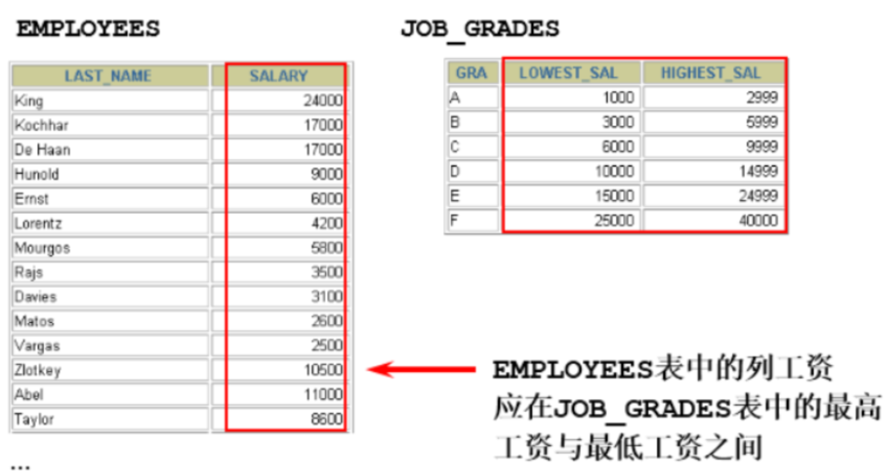
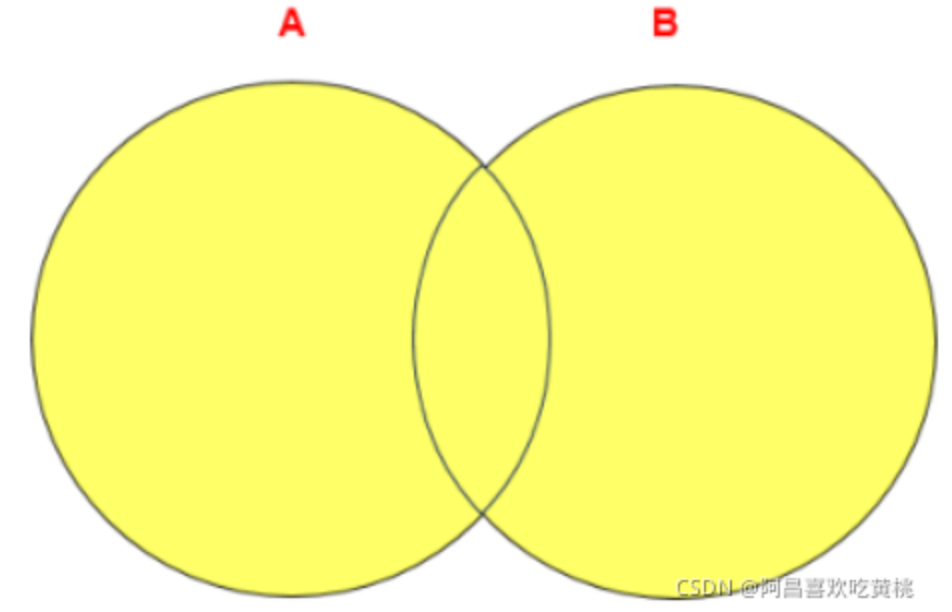
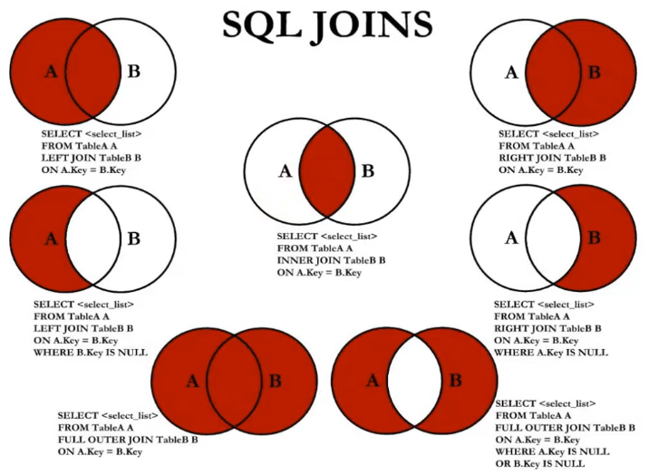
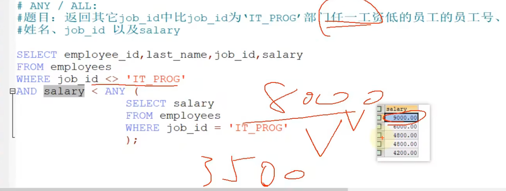

**腾讯云服务器远程连接**

IP：`101.34.235.45`

默认用户名：`root`

登录密码：`|P2AN~gKm#{4`

# 2 SELECT使用篇

**SQL概述**

- SQL 有两个重要的标准，分别是 `SQL92` 和 `SQL99`

***

## 2.1 SQL语言的规则与规范

**1、基本规则**

- 每条命令以 ; 或 \g 或 \G 结束
- 关于标点符号
  - 必须使用英文状态下的半角输入方式
  - `字符串型`和`日期时间类型`的数据可以使用`单引号（' '）`表示
  - 列的`别名`，尽量使用`双引号（" "）`，而且不建议省略as

**2、SQL大小写规范 （建议遵守）**

- MySQL 在 `Windows` 环境下是`大小写不敏感`的

- MySQL 在`Linux` 环境下是`大小写敏感`的
  - 数据库名、表名、表的别名、变量名是严格区分大小写的
  - 关键字、函数名、列名(或字段名)、列的别名(字段的别名) 是忽略大小写的。

- 推荐采用统一的书写规范：
  - 数据库名、表名、表别名、字段名、字段别名等都小写
  - SQL 关键字、函数名、绑定变量等都大写

**3、注释**

```java
单行注释：#注释文字(MySQL特有的方式)
单行注释：-- 注释文字(--后面必须包含一个空格。)
多行注释：/* 注释文字 */
```

**4、数据导入指令**

在`命令行`客户端登录mysql，使用source指令导入

```shell
mysql> source d:\mysqldb.sql
```

***

## 2.2 基本的SELECT语句

**1、去除重复行** `DISTINCT`

```mysql
SELECT DISTINCT department_id,salary
FROM employees;
```

```java
注意：  
DISTINCT 其实是对后面所有列名的组合进行去重，如果你想要看都有哪些不同的部门，只需要写 DISTINCT department_id 即可，后面不需要再加其他的列名了。
```

**2、空值参与运算**

所有运算符或列值遇到null值，运算的结果都为null

```mysql
SELECT employee_id,salary,commission_pct,12 * salary * (1 + commission_pct) "annual_sal"
FROM employees;
```

这里你一定要注意，在 MySQL 里面， 空值不等于空字符串。一个空字符串的长度是 0，而一个空值的长度是空。而且，在 MySQL 里面，空值是占用空间的。

**3、着重号**

`` 着重号

```mysql
SELECT * FROM `ORDER`;
```

我们需要保证表中的字段、表名等没有和保留字、数据库系统或常用方法冲突。如果真的相同，请在SQL语句中使用一对``（着重号）引起来。

***

## 2.3 四大类运算符

### 2.3.1 算术运算符

算术运算符主要用于数学运算，其可以连接运算符前后的两个数值或表达式，对数值或表达式进行加（+）、减（-）、乘（*）、除（/）和取模（%）运算。



#### 2.3.1.1 加法与减法运算符

```mysql
SELECT 100, 100 + 0, 100 - 0, 100 + 50, 100 + 50 -30, 100 + 35.5, 100 - 35.5
FROM dual;
```

```java
由运算结果可以得出如下结论：
1.一个整数类型的值对整数进行加法和减法操作，结果还是一个整数；
2.一个整数类型的值对浮点数进行加法和减法操作，结果是一个浮点数；
3.加法和减法的优先级相同，进行先加后减操作与进行先减后加操作的结果是一样的；
4.在Java中，+的左右两边如果有字符串，那么表示字符串的拼接。但是在MySQL中+只表示数值相加。如果遇到非数值类型，先尝试转成数值，如果转失败，就按0计算。（补充：MySQL中字符串拼接要使用字符串函数CONCAT()实现）
```

***

#### 2.3.1.2 乘法与除法运算符

```mysql
SELECT 100, 100 * 1, 100 * 1.0, 100 / 1.0, 100 / 2,100 + 2 * 5 / 2,100 /3, 100
DIV 0 FROM dual;
```

```java
由运算结果可以得出如下结论：
1.一个数乘以整数1和除以整数1后仍得原数；
2.一个数乘以浮点数1和除以浮点数1后变成浮点数，数值与原数相等；
3.一个数除以整数后，不管是否能除尽，结果都为一个浮点数；
```

#### 2.3.1.3 求模（求余）运算符

```mysql
SELECT 12 % 3, 12 MOD 5 FROM dual;
```

### 2.3.2 比较运算符

比较运算符用来对表达式左边的操作数和右边的操作数进行比较，比较的结果为真则返回1，比较的结果为假则返回0，其他情况则返回NULL。

**比较运算符经常被用来作为SELECT查询语句的条件来使用，返回符合条件的结果记录。**


***

#### 2.3.2.1 等号运算符

- 等号运算符（=）判断等号两边的值、字符串或表达式是否相等，如果相等则返回1，不相等则返回0。
- 在使用等号运算符时，遵循如下规则：
  - 如果等号两边的值、字符串或表达式都为字符串，则MySQL会按照字符串进行比较，其比较的是每个字符串中字符的ANSI编码是否相等。
  - 如果等号两边的值都是整数，则MySQL会按照整数来比较两个值的大小。
  - 如果等号两边的值一个是整数，另一个是字符串，则MySQL会将字符串转化为数字进行比较。
  - 如果等号两边的值、字符串或表达式中有一个为NULL，则比较结果为NULL。
- 对比：SQL中赋值符号使用 :=

#### 2.3.2.2 安全等于运算符

安全等于运算符（<=>）与等于运算符（=）的作用是相似的， `唯一的区别 是‘<=>’可以用来对NULL进行判断`。在两个操作数均为NULL时，其返回值为1，而不为NULL；当一个操作数为NULL时，其返回值为0，而不为NULL。

```mysql
SELECT 1 <=> '1', 1 <=> 0, 'a' <=> 'a', (5 + 3) <=> (2 + 6), '' <=> NULL,NULL <=> NULL FROM dual;
```

***

#### 2.3.2.3 不等于运算符

不等于运算符（<>和!=）用于判断两边的数字、字符串或者表达式的值是否不相等，如果不相等则返回1，相等则返回0。不等于运算符不能判断NULL值。如果两边的值有任意一个为NULL，或两边都为NULL，则结果为NULL。 SQL语句示例如下：

```mysql
SELECT 1 <> 1, 1 != 2, 'a' != 'b', (3+4) <> (2+6), 'a' != NULL, NULL <> NULL;
```

此外，还有非符号类型的运算符：



#### 2.3.2.4 空运算符

空运算符（IS NULL或者ISNULL）判断一个值是否为NULL，如果为NULL则返回1，否则返回0。 SQL语句示例如下：

```mysql
SELECT NULL IS NULL, ISNULL(NULL), ISNULL('a'), 1 IS NULL;
```

```mysql
#查询name等于NULL。比较如下的四种写法
SELECT id,name FROM t WHERE name IS NULL;
SELECT id,name FROM t WHERE name <=> NULL;
SELECT id,name FROM t WHERE ISNULL(name);
SELECT id,name FROM t WHERE name = NULL;
```

#### 2.3.2.5 非空运算符

非空运算符（IS NOT NULL）判断一个值是否不为NULL，如果不为NULL则返回1，否则返回0。 SQL语句示例如下：

```mysql
SELECT NULL IS NOT NULL, 'a' IS NOT NULL,  1 IS NOT NULL;
```

```mysql
#查询name不等于NULL
SELECT id,name FROM t WHERE name IS NOT NULL;
SELECT id,name FROM t WHERE NOT name <=> NULL;
SELECT id,name FROM t WHERE NOT ISNULL(name);
```

#### 2.3.2.6 最小值运算符

语法格式为：LEAST(值1，值2，…，值n)。其中，“值n”表示参数列表中有n个值。

在有两个或多个参数的情况下，返回最小值。

```mysql
SELECT LEAST (1,0,2), LEAST('b','a','c'), LEAST(1,NULL,2);
```

由结果可以看到，当参数是整数或者浮点数时，LEAST将返回其中最小的值；当参数为字符串时，返回字母表中顺序最靠前的字符；当比较值列表中有NULL时，不能判断大小，返回值为NULL。

#### 2.3.2.7 最大值运算符

语法格式为：GREATEST(值1，值2，…，值n)。

其中，n表示参数列表中有n个值。当有两个或多个参数时，返回值为最大值。

假如任意一个自变量为NULL，则GREATEST()的返回值为NULL。

```mysql
SELECT GREATEST(1,0,2), GREATEST('b','a','c'), GREATEST(1,NULL,2);
```

由结果可以看到，当参数中是整数或者浮点数时，GREATEST将返回其中最大的值；当参数为字符串时，返回字母表中顺序最靠后的字符；当比较值列表中有NULL时，不能判断大小，返回值为NULL。

#### 2.3.2.8 BETWEEN AND运算符

BETWEEN运算符使用的格式通常为SELECT D FROM TABLE WHERE C BETWEEN A AND B，此时，当C大于或等于A，并且C小于或等于B时，结果为1，否则结果为0。

```mysql
SELECT 1 BETWEEN 0 AND 1, 10 BETWEEN 11 AND 12, 'b' BETWEEN 'a' AND 'c';
```

#### 2.3.2.9 IN运算符

IN运算符用于判断给定的值是否是IN列表中的一个值，如果是则返回1，否则返回0。

如果给定的值为NULL，或者IN列表中存在NULL，则结果为NULL。

```mysql
mysql> SELECT 'a' IN ('a','b','c'), 1 IN (2,3), NULL IN ('a','b'), 'a' IN ('a', NULL);
```

#### 2.3.2.10 NOT IN运算符

NOT IN运算符用于判断给定的值是否不是IN列表中的一个值，如果不是IN列表中的一个值，则返回1，否则返回0。

```mysql
SELECT 'a' NOT IN ('a','b','c'), 1 NOT IN (2,3);
```

#### 2.3.2.11 LIKE运算符

LIKE运算符主要用来匹配字符串，通常用于模糊匹配，如果满足条件则返回1，否则返回0。

如果给定的值或者匹配条件为NULL，则返回结果为NULL。

LIKE运算符通常使用如下通配符：

```mysql
“%”：匹配0个或多个字符。
“_”：只能匹配一个字符。
```

#### 2.3.2.12 REGEXP运算符

略


### 2.3.3 逻辑运算符

MySQL中支持4种逻辑运算符如下：




### 2.3.4 位运算符

略。

***

## 2.4 排序与分页

### 2.4.1 排序

##### 排序规则

- 使用 `ORDER BY` 子句排序：ASC（ascend）: 升序；DESC（descend）:降序

***

### 2.4.2 分页

- 如果我们知道返回结果只有1 条，就可以使用 LIMIT 1 ，告诉 SELECT 语句只需要返回一条记录即可。
- 这样的好处就是 SELECT 不需要扫描完整的表，只需要检索到一条符合条件的记录即可返回 提升查询效率。

***

## 2.5 多表查询

### 2.5.1 笛卡尔积

***

### 2.5.2 多表查询分类

#### 2.5.2.1 等值连接 vs 非等值连接

- **等值连接**

表与表之间有字段相关联

连接 n个表,至少需要n-1个连接条件

- **非等值连接**

表与表之间没有明确的关联条件，是根据一个表中的字段的，在另一个表中一个范围的情况



```mysql
SELECT e.last_name, e.salary, j.grade_level
FROM  employees e, job_grades j  # job_grades 是工资等级表
WHERE e.salary >= j.lowest_sal AND e.salary <= j.highest_sal; 
```

#### 2.5.2.2 **自连接** vs 非自连接

- **自连接**

同一张表，自己连接自己

```mysql
#查询employees表，返回“Xxx works for Xxx”
SELECT CONCAT(worker.last_name ,' works for '
   , manager.last_name)
FROM  employees worker, employees manager
WHERE worker.manager_id = manager.employee_id ;
```

- 非自连接

不是同一个张表连接

#### 2.5.2.3 内连接 vs 外连接

**SQL92实现外连接：使用(+)创建连接**

- 在 SQL92 中采用（+）代表从表所在的位置。即左或右外连接中，(+) 表示哪个是从表。
- Oracle 对 SQL92 支持较好，而 **MySQL 则不支持 SQL92 的外连接**。

```mysql
#左外连接
SELECT last_name,department_name
FROM employees ,departments
WHERE employees.department_id = departments.department_id(+);

#右外连接
SELECT last_name,department_name
FROM employees ,departments
WHERE employees.department_id(+) = departments.department_id;

# (+)在谁那里就是相反的连接，代表谁补null
# 如果在左边就是右外连接
# 如果在右边就是左外连接
```

- 而且在 SQL92 中，只有左外连接和右外连接，没有满（或全）外连接。

***

**SQL99语法实现多表查询**

**1、基本语法**

- 使用`JOIN...ON`子句创建连接的语法结构：

```mysql
SELECT table1.column, table2.column,table3.column
FROM table1
JOIN table2 ON table1 和 table2 的连接条件
JOIN table3 ON table2 和 table3 的连接条件
```

- SQL99 采用的这种`嵌套结构非常清爽、层次性更强、可读性更强`，即使再多的表进行连接也都清晰可见。

- **语法说明**：
  - 可以使用 `ON 子句指定额外的连接条件`。
  - 这个连接条件是与其它条件分开的。
  - ON 子句使语句具有更高的`易读性`。
  - 关键字 JOIN、INNER JOIN、CROSS JOIN 的含义是一样的，都表示内连接

***

**2、内连接(INNER JOIN)的实现**

```mysql
# 例子
SELECT 
	employee_id, city, department_name
FROM  
	employees e
JOIN departments d ON d.department_id = e.department_id
JOIN locations l ON d.location_id = l.location_id;	
```

***

**3、外连接(OUTER JOIN)的实现**

以一张表为标准，其他表做辅助，如果没有则，辅助表用null填充

- **左外连接**(LEFT OUTER JOIN)

```mysql
# 例子
SELECT 
	e.last_name, e.department_id, d.department_name
FROM employees e
LEFT JOIN departments d ON e.department_id = d.department_id;
```

- **右外连接**(RIGHT OUTER JOIN)

```mysql
# 例子
SELECT e.last_name, e.department_id, d.department_name
FROM  employees e
RIGHT JOIN departments d ON (e.department_id = d.department_id);
```

```mysql
需要注意的是，LEFT JOIN 和 RIGHT JOIN 只存在于 SQL99 及以后的标准中，在 SQL92 中不存在，
只能用 (+) 表示。
```

- **满外连接**(FULL OUTER JOIN)
  - 满外连接的结果 = 左右表匹配的数据 + 左表没有匹配到的数据 + 右表没有匹配到的数据。
  - SQL99是支持满外连接的。使用FULL JOIN 或 FULL OUTER JOIN来实现。
  - 需要注意的是，MySQL不支持FULL JOIN，但是可以用 `LEFT JOIN` UNION`RIGHT JOIN`代替。

***

**4、UNION的使用**

`合并查询结果` 利用UNION关键字，可以给出多条SELECT语句，并将它们的结果组合成单个结果集。

合并时，两个表对应的列数和数据类型必须相同，并且相互对应。各个SELECT语句之间使用UNION或UNION ALL关键字分隔。

```mysql
SELECT column,... FROM table1
UNION [ALL]
SELECT column,... FROM table2
```

- **UNION & UNION ALL**
  - `UNION` 操作符返回两个查询的结果集的并集，**去除重复记录。**
  - 
  - `UNION ALL` 返回两个查询的结果集的并集。对于两个结果集的重复部分，**不去重**
  - 

```java
注意：
执行UNION ALL语句时所需要的资源比UNION语句少。
如果明确知道合并数据后的结果数据不存在重复数据，或者不需要去除重复的数据，则尽量使用UNION ALL语句，以提高数据查询的效率。
```

***

#### 2.5.2.4 七种SQL JOINS的实现



代码实现

```mysql
#中图：内连接 A∩B
SELECT employee_id,last_name,department_name
FROM employees e JOIN departments d
ON e.`department_id` = d.`department_id`;

#左上图：左外连接
SELECT employee_id,last_name,department_name
FROM employees e LEFT JOIN departments d
ON e.`department_id` = d.`department_id`;

#右上图：右外连接
SELECT employee_id,last_name,department_name
FROM employees e RIGHT JOIN departments d
ON e.`department_id` = d.`department_id`;

#左中图：A - A∩B
SELECT employee_id,last_name,department_name
FROM employees e LEFT JOIN departments d
ON e.`department_id` = d.`department_id`
WHERE d.`department_id` IS NULL

#右中图：B - A∩B
SELECT employee_id,last_name,department_name
FROM employees e RIGHT JOIN departments d
ON e.`department_id` = d.`department_id`
WHERE e.`department_id` IS NULL

#左下图：满外连接
# 左中图 + 右上图 A∪B
SELECT employee_id,last_name,department_name
FROM employees e LEFT JOIN departments d
ON e.`department_id` = d.`department_id`
WHERE d.`department_id` IS NULL
UNION ALL  #没有去重操作，效率高
SELECT employee_id,last_name,department_name
FROM employees e RIGHT JOIN departments d
ON e.`department_id` = d.`department_id`;

#右下图
#左中图 + 右中图 A ∪B- A∩B 或者 (A - A∩B) ∪ （B - A∩B）
SELECT employee_id,last_name,department_name
FROM employees e LEFT JOIN departments d
ON e.`department_id` = d.`department_id`
WHERE d.`department_id` IS NULL
UNION ALL
SELECT employee_id,last_name,department_name
FROM employees e RIGHT JOIN departments d
ON e.`department_id` = d.`department_id`
WHERE e.`department_id` IS NULL

```

```java
注意:
我们要控制连接表的数量。多表连接就相当于嵌套 for 循环一样，非常消耗资源，会让 SQL 查询性能下降得很严重，因此不要连接不必要的表。在许多 DBMS 中，也都会有最大连接表的限制。
  
【强制】超过三个表禁止 join。需要 join 的字段，数据类型保持绝对一致；多表关联查询时，保证被关联的字段需要有索引。
说明：即使双表 join 也要注意表索引、SQL性能。
来源：阿里巴巴《Java开发手册》
```

## 2.6 单行函数

### 2.6.1 函数的理解

可以把我们经常使用的代码封装起来，需要的时候直接调用即可。

这样既 `提高了代码效率` ，又 `提高了可维护性` 。

***

> 不同DBMS函数的差异

函数再分为两类：`单行函数`、`聚合函数（或分组函数）`

***

### 2.6.2 数值函数

**1、基本函数**


```mysql
# 单行函数可以嵌套
SELECT TRUNCATE(ROUND(123.456,2),0) FROM DUAL
```

***

### 2.6.3 字符串函数


```java
注意：MySQL中，字符串的位置是从1开始的。
```

### 2.6.4 日期和时间函数

#### 2.6.4.1 获取日期、时间

| 函数                                                         | **用法**                       |
| ------------------------------------------------------------ | ------------------------------ |
| **CURDATE()** ，CURRENT_DATE()                               | 返回当前日期，只包含年、月、日 |
| **CURTIME()** ， CURRENT_TIME()                              | 返回当前时间，只包含时、分、秒 |
| **NOW()** / SYSDATE() / CURRENT_TIMESTAMP() / LOCALTIME() / LOCALTIMESTAMP() | 返回当前系统日期和时间         |
| UTC_DATE()                                                   | 返回UTC（世界标准时间）日期    |
| UTC_TIME()                                                   | 返回UTC（世界标准时间）时间    |

```mysql
SELECT
    CURDATE(), CURRENT_DATE(),
    CURTIME(), CURRENT_TIME(),
    NOW(), SYSDATE(), CURRENT_TIMESTAMP(), LOCALTIME(), LOCALTIMESTAMP(),
    UTC_DATE(), UTC_TIME()
```

***

#### 2.6.4.2 日期与时间戳的转换

| **函数**                 | 用法                                                         |
| ------------------------ | ------------------------------------------------------------ |
| UNIX_TIMESTAMP()         | 以UNIX时间戳的形式返回当前时间。SELECT UNIX_TIMESTAMP() ->1634348884 |
| UNIX_TIMESTAMP(date)     | 将时间date以UNIX时间戳的形式返回。                           |
| FROM_UNIXTIME(timestamp) | 将UNIX时间戳的时间转换为普通格式的时间                       |

```mysql
SELECT UNIX_TIMESTAMP(),UNIX_TIMESTAMP('2020-01-01 10:00:00'),FROM_UNIXTIME('1577894400') FROM DUAL
```

***

#### 2.6.4.3 获取月份、星期、星期数、天数等函数

| 函数                                     | 用法                                       |
| ---------------------------------------- | ------------------------------------------ |
| YEAR(date) / MONTH(date) / DAY(date)     | 返回具体的日期值                           |
| HOUR(time) / MINUTE(time) / SECOND(time) | 返回具体的时间值                           |
| MONTHNAME(date)                          | 返回月份：January，…                       |
| DAYNAME(date)                            | 返回星期几：MONDAY，TUESDAY … SUNDAY       |
| WEEKDAY(date)                            | 返回周几，注意，周1是0，周2是1 ... 周日是6 |
| QUARTER(date)                            | 返回日期对应的季度，范围为1～4             |
| WEEK(date) ， WEEKOFYEAR(date)           | 返回一年中的第几周                         |
| DAYOFYEAR(date)                          | 返回日期是一年中的第几天                   |
| DAYOFMONTH(date)                         | 返回日期位于所在月份的第几天               |
| DAYOFWEEK(date)                          | 返回周几,注意:周日是1，周一是2 ... 周六是7 |

```mysql
# 获取年月日时分秒
SELECT YEAR(CURDATE()), MONTH(CURDATE()), DAY(CURDATE()),
       HOUR(NOW()), MINUTE(NOW()), SECOND(NOW()) FROM DUAL

SELECT MONTHNAME(CURDATE()),DAYNAME(CURDATE()),
       WEEKDAY(CURDATE()),QUARTER(CURDATE()),
       WEEK(CURDATE()),DAYOFYEAR(CURDATE()),
       DAYOFMONTH(CURDATE()),DAYOFWEEK(CURDATE()) FROM DUAL
```

***

#### 2.6.4.4 日期的操作函数

| 函数                    | 用法                                       |
| ----------------------- | ------------------------------------------ |
| EXTRACT(type FROM date) | 返回指定日期中特定的部分，type指定返回的值 |

EXTRACT(type FROM date)函数中type的取值与含义：

| type取值           | 含义                         |
| ------------------ | ---------------------------- |
| MICROSECOND        | 返回毫秒数                   |
| SECOND             | 返回秒数                     |
| MINUTE             | 返回分钟数                   |
| HOUR               | 返回小时数                   |
| DAY                | 返回天数                     |
| WEEK               | 返回日期在一年中的第几个星期 |
| MONTH              | 返回日期在一年中的第几个月   |
| QUARTER            | 返回日期在一年中的第几个季度 |
| YEAR               | 返回日期的年份               |
| SECOND_MICROSECOND | 返回秒和毫秒值               |
| MINUTE_MICROSECOND | 返回分钟和毫秒值             |
| MINUTE_SECOND      | 返回分钟和秒值               |
| HOUR_MICROSECOND   | 返回小时和毫秒值             |
| HOUR_SECOND        | 返回小时和秒值               |
| HOUR_MINUTE        | 返回小时和分钟值             |
| DAT_MICROSECOND    | 返回天和毫秒值               |
| DAT_SECOND         | 返回天和秒值                 |
| DAT_MINUTE         | 返回天和分钟值               |

```mysql
# 只列举几个
SELECT EXTRACT(MICROSECOND FROM NOW()),
       EXTRACT(SECOND FROM NOW()),
       EXTRACT(MINUTE FROM NOW()),
       EXTRACT(HOUR FROM NOW()),
       EXTRACT(DAY FROM NOW()),
       EXTRACT(HOUR_MINUTE FROM NOW()) # 2209 意思是小时和分钟拼一起，相当于 22:09
       FROM DUAL
```

***

#### 2.6.4.5 时间和秒钟转换的函数

| 函数                 | 用法                                                         |
| -------------------- | ------------------------------------------------------------ |
| TIME_TO_SEC(time)    | 将 time 转化为秒并返回结果值。转化的公式为：`小时*3600+分钟*60+秒` |
| SEC_TO_TIME(seconds) | 将 seconds 描述转化为包含小时、分钟和秒的时间                |

```mysql
SELECT TIME_TO_SEC(CURTIME()),SEC_TO_TIME(79985) FROM DUAL
```

***

#### 2.6.4.6 计算日期和时间的函数

| 函数                                                         | 用法                                           |
| ------------------------------------------------------------ | ---------------------------------------------- |
| DATE_ADD(datetime, INTERVAL expr type)，ADDDATE(date,INTERVAL expr type) | 返回与给定日期时间相差INTERVAL时间段的日期时间 |
| DATE_SUB(date,INTERVAL expr type)，SUBDATE(date,INTERVAL expr type) | 返回与date相差INTERVAL时间间隔的日期           |


```mysql
# 在现在的时间加上一年
SELECT DATE_ADD(NOW(), INTERVAL 1 YEAR) FROM DUAL
# 在现在的时间上：分钟加1，秒钟加2
SELECT NOW(),DATE_ADD(NOW(), INTERVAL '1_2' MINUTE_SECOND ) FROM DUAL
```

| 函数                         | 用法                                                         |
| ---------------------------- | ------------------------------------------------------------ |
| ADDTIME(time1,time2)         | 返回time1加上time2的时间。当time2为一个数字时，代表的是`秒`，可以为负数 |
| SUBTIME(time1,time2)         | 返回time1减去time2后的时间。当time2为一个数字时，代表的是`秒`，可以为负数 |
| DATEDIFF(date1,date2)        | 返回date1 - date2的日期间隔天数                              |
| TIMEDIFF(time1, time2)       | 返回time1 - time2的时间间隔                                  |
| FROM_DAYS(N)                 | 返回从0000年1月1日起，N天以后的日期                          |
| TO_DAYS(date)                | 返回日期date距离0000年1月1日的天数                           |
| LAST_DAY(date)               | 返回date所在月份的最后一天的日期                             |
| MAKEDATE(year,n)             | 针对给定年份与所在年份中的天数返回一个日期                   |
| MAKETIME(hour,minute,second) | 将给定的小时、分钟和秒组合成时间并返回                       |

```mysql
SELECT NOW(),
       ADDTIME(NOW(),2), # 当前时间+2秒
       SUBTIME(NOW(),3), # 当前时间-3秒
       SUBTIME(NOW(),'1:2:3'), # 当前时间小时-1，分钟-2，秒-3
       DATEDIFF(NOW(),'2024-03-01') # 两个日期时间间隔
FROM DUAL

# 日期加上0就可以得到一串数字
SELECT NOW(),NOW() + 0 FROM DUAL; # 2024-03-13 01:00:10  20240313010010
```

***

#### 2.6.4.7 日期的格式化与解析

| 函数                              | 用法                                       |
| --------------------------------- | ------------------------------------------ |
| DATE_FORMAT(date,fmt)             | 按照字符串fmt格式化日期date值              |
| TIME_FORMAT(time,fmt)             | 按照字符串fmt格式化时间time值              |
| GET_FORMAT(date_type,format_type) | 返回日期字符串的显示格式                   |
| STR_TO_DATE(str, fmt)             | 按照字符串fmt对str进行解析，解析为一个日期 |

上述`非GET_FORMAT`函数中fmt参数常用的格式符：

| 格式符 | 说明                                                        | 格式符 | 说明                                                        |
| ------ | ----------------------------------------------------------- | ------ | ----------------------------------------------------------- |
| %Y     | 4位数字表示年份                                             | %y     | 表示两位数字表示年份                                        |
| %M     | 月名表示月份（January,…）                                   | %m     | 两位数字表示月份（01,02,03。。。）                          |
| %b     | 缩写的月名（Jan.，Feb.，…）                                 | %c     | 数字表示月份（1,2,3,…）                                     |
| %D     | 英文后缀表示月中的天数（1st,2nd,3rd,…）                     | %d     | 两位数字表示月中的天数(01,02…)                              |
| %e     | 数字形式表示月中的天数（1,2,3,4,5…）                        |        |                                                             |
| %H     | 两位数字表示小数，24小时制（01,02…）                        | %h和%I | 两位数字表示小时，12小时制（01,02…）                        |
| %k     | 数字形式的小时，24小时制(1,2,3)                             | %l     | 数字形式表示小时，12小时制（1,2,3,4…）                      |
| %i     | 两位数字表示分钟（00,01,02）                                | %S和%s | 两位数字表示秒(00,01,02…)                                   |
| %W     | 一周中的星期名称（Sunday…）                                 | %a     | 一周中的星期缩写（Sun.，Mon.,Tues.，…）                     |
| %w     | 以数字表示周中的天数(0=Sunday,1=Monday…)                    |        |                                                             |
| %j     | 以3位数字表示年中的天数(001,002…)                           | %U     | 以数字表示年中的第几周，（1,2,3。。）其中Sunday为周中第一天 |
| %u     | 以数字表示年中的第几周，（1,2,3。。）其中Monday为周中第一天 |        |                                                             |
| %T     | 24小时制                                                    | %r     | 12小时制                                                    |
| %p     | AM或PM                                                      | %%     | 表示%                                                       |

***

### 2.6.5 流程控制函数

MySQL中的流程处理函数主要包括IF()、IFNULL()和CASE()函数。

| 函数                                                         | 用法                                            |
| ------------------------------------------------------------ | ----------------------------------------------- |
| IF(value,value1,value2)                                      | 如果value的值为TRUE，返回value1，否则返回value2 |
| IFNULL(value1, value2)                                       | 如果value1不为NULL，返回value1，否则返回value2  |
| CASE WHEN 条件1 THEN 结果1 WHEN 条件2 THEN 结果2 … [ELSE resultn] END | 相当于Java的if…else if…else…                    |
| CASE expr WHEN 常量值1 THEN 值1 WHEN 常量值1 THEN 值1 … [ELSE 值n] END | 相当于Java的switch…case…                        |

```mysql
# IF()
SELECT last_name,salary,IF(salary >= 6000,'高工资','低工资') FROM employees;
SELECT last_name,IF(commission IS NOT NULL,commission,0) FROM employees;

# IFNULL()
SELECT last_name,IFNULL(commission,0) FROM employees;

# if…else if else
SELECT last_name,salary,
CASE 
WHEN salary >= 15000 THEN '等级一'
WHEN salary >= 10000 THEN '等级二'
ELSE '等级三' 
END FROM employees;

# switch…case…
SELECT last_name,department_id 
CASE department_id
WHEN 10 THEN salary*1.1,
WHEN 20 THEN salary*1.2,
WHEN 30 THEN salary*1.3,
ELSE salary* 1.4 END
FROM employees;
```

***

### 2.6.6 MySQL信息函数

MySQL中内置了一些可以查询MySQL信息的函数，这些函数主要用于帮助数据库开发或运维人员更好地对数据库进行维护工作。

| 函数                                                  | 用法                                                     |
| ----------------------------------------------------- | -------------------------------------------------------- |
| VERSION()                                             | 返回当前MySQL的版本号                                    |
| CONNECTION_ID()                                       | 返回当前MySQL服务器的连接数                              |
| DATABASE()，SCHEMA()                                  | 返回MySQL命令行当前所在的数据库                          |
| USER()，CURRENT_USER()、SYSTEM_USER()，SESSION_USER() | 返回当前连接MySQL的用户名，返回结果格式为“主机名@用户名” |
| CHARSET(value)                                        | 返回字符串value自变量的字符集                            |
| COLLATION(value)                                      | 返回字符串value的比较规则                                |

```mysql
SELECT VERSION(),CONNECTION_ID(),DATABASE(),USER(),CHARSET('王'),COLLATION('王')
```

***

### 2.6.7 其他函数

MySQL中有些函数无法对其进行具体的分类，但是这些函数在MySQL的开发和运维过程中也是不容忽视的。

| 函数                           | 用法                                                         |
| ------------------------------ | ------------------------------------------------------------ |
| CONV(value,from,to)            | 将value的值进行不同进制之间的转换                            |
| INET_ATON(ipvalue)             | 将以点分隔的IP地址转化为一个数字                             |
| INET_NTOA(value)               | 将数字形式的IP地址转化为以点分隔的IP地址                     |
| BENCHMARK(n,expr)              | 将表达式expr重复执行n次。用于测试MySQL处理expr表达式所耗费的时间 |
| CONVERT(value USING char_code) | 将value所使用的字符编码修改为char_code                       |

***

## 2.7 聚合函数

`聚合`（或聚集、分组）函数，它是对一组数据进行汇总的函数，输入的是一组数据的集合，输出的是单个值。

### 2.7.1 聚合函数介绍

- **什么是聚合函数**

聚合函数作用于一组数据，并对一组数据返回一个值。

- **聚合函数类型**

  AVG()、SUM()、MAX()、MIN()、COUNT()

- 聚合函数不能嵌套调用。比如不能出现类似“AVG(SUM(字段名称))”形式的调用。

#### 2.7.1.1 AVG和SUM函数

可以对**数值型数据**使用AVG 和 SUM 函数。

注意：AVG统计总的数据不会统计NULL，并且除以总数也不会将NULL的算进去除，举个例子：家里有3个人，工资分别是 2000，1000，NULL，那么AVG的结果为（2000+1000）/ 2 = 1500；其实平均应该是 1000 才对。这个要注意。

SUM统计时也不会统计NULL。

```mysql
SELECT AVG(salary), SUM(salary) FROM employees

# 上面三个人的工资
# 错误的 commission_pct存在为NULL
SELECT AVG(commission_pct) FROM home

# 正确的1
SELECT SUM(commission_pct)/COUNT(1) FROM home

# 正确的2
SELECT AVG(IFNULL(commission_pct,0)) FROM home
```

***

#### 2.7.1.2 MIN和MAX函数

适用于数值类型，字符串类型，日期时间类型的字段

***

#### 2.7.1.3 COUNT函数

- COUNT(*)返回表中记录总数，适用于**任意数据类型**。

- COUNT(expr) 返回**expr不为空null**的记录总数。【这个要注意】
- COUNT(1) 返回记录总数

```mysql
SELECT COUNT(*) FROM employees WHERE department_id = 50;
SELECT COUNT(commission_pct) FROM employees WHERE department_id = 50;
```


***

**问题1：用count(\*)，count(1)，count(列名)谁好呢?**

- 其实，对于MyISAM引擎的表是没有区别的。这种引擎内部有一计数器在维护着行数。Innodb引擎的表用count(*),count(1)直接读行数，复杂度是O(n)，因为innodb真的要去数一遍。但好于具体的count(列名)。

**问题2：能不能使用count(列名)替换count(\*)?**

- 不要使用 count(列名)来替代 `count(*)`，`count(*)`是 SQL92 定义的标准统计行数的语法，跟数据库无关，跟 NULL 和非 NULL 无关。

  说明：count(*)会统计值为 NULL 的行，而 count(列名)不会统计此列为 NULL 值的行。

***

### 2.7.2 GROUP BY

#### 2.7.2 1 基本使用

**可以使用GROUP BY子句将表中的数据分成若干组**

```java
明确：
1.在SELECT列表中所有未包含在组函数中的列都应该包含在 GROUP BY子句中
```

***

#### 2.7.2 3 GROUP BY中使用WITH ROLLUP

使用`WITH ROLLUP`关键字之后，在所有查询出的分组记录之后增加一条记录，该记录计算查询出的所有记录的总和，即统计记录数量。

```mysql
SELECT department_id,AVG(salary)
FROM employees
WHERE department_id > 80
GROUP BY department_id 
WITH ROLLUP;
```


上面最后一条数据，就是统计全部部门的平均值，所以dapartment_id 没有值。

```java
注意：
当使用ROLLUP时，不能同时使用ORDER BY子句进行结果排序，即ROLLUP和ORDER BY是互相排斥的。
```

***

### 2.7.3 HAVING

**1、基本使用**

- **非法使用聚合函数 ： 不能在 WHERE 子句中使用聚合函数。**如下：

```mysql
SELECT  department_id, AVG(salary)
FROM  employees
WHERE  AVG(salary) > 8000
GROUP BY department_id;
```

- **使用HAVING正确写法**

```mysql
SELECT department_id, MAX(salary)
FROM employees
GROUP BY department_id
HAVING MAX(salary)>10000 ;
```

对比

```mysql
#练习：查询部门id为10,20,30,40这4个部门中最高工资比10000高的部门信息
#方式1：推荐，执行效率高于方式2.
SELECT department_id, MAX (salary)
FROM employees
WHERE department_id IN (10,20,30,40)
GROUP BY department id
HAVING MAX (salary) > 10000;

#方式2:
SELECT department_id, MAX (salary)
FROM employees
GROUP BY department_id
HAVING MAX (salary) > 10000 AND department_id IN (10,20,30,40);

# 结论：当过滤条件中有聚合函数时，则此过滤条件必须声明在HAVING中。当过滤条件中没有聚合函数时，则此过滤条件声明在WHERE中或HAVING中都可以。但是，建议大家声明在WHERE中
```

**WHERE和HAVING的对比**

**区别1**：WHERE 可以直接使用表中的字段作为筛选条件，但不能使用分组中的计算函数作为筛选条件；**HAVING 必须要与 GROUP BY 配合使用**，可以把分组计算的函数和分组字段作为筛选条件。

这决定了，在需要对数据进行分组统计的时候，HAVING 可以完成 WHERE 不能完成的任务。这是因为，在查询语法结构中，WHERE 在 GROUP BY 之前，所以无法对分组结果进行筛选。HAVING 在 GROUP BY 之后，可以使用分组字段和分组中的计算函数，对分组的结果集进行筛选，这个功能是 WHERE 无法完成的。另外，WHERE排除的记录不再包括在分组中。

**区别2：如果需要通过连接从关联表中获取需要的数据，WHERE 是先筛选后连接，而 HAVING 是先连接后筛选**。 这一点，就决定了在关联查询中，WHERE 比 HAVING 更高效。因为 WHERE 可以先筛选，用一个筛选后的较小数据集和关联表进行连接，这样占用的资源比较少，执行效率也比较高。HAVING 则需要先把结果集准备好，也就是用未被筛选的数据集进行关联，然后对这个大的数据集进行筛选，这样占用的资源就比较多，执行效率也较低。

| 优点   | 缺点                           |                                          |
| ------ | ------------------------------ | ---------------------------------------- |
| WHERE  | 先筛选数据再关联，执行`效率高` | 不能使用分组中的计算函数进行筛选         |
| HAVING | 可以使用分组中的计算函数       | 在最后的结果集中进行筛选，执行`效率较低` |

**开发中的选择：**

WHERE 和 HAVING 也不是互相排斥的，我们可以在一个查询里面同时使用 WHERE 和 HAVING。包含分组统计函数的条件用 HAVING，普通条件用 WHERE。这样，我们就既利用了 WHERE 条件的高效快速，又发挥了 HAVING 可以使用包含分组统计函数的查询条件的优点。当数据量特别大的时候，运行效率会有很大的差别。

***

## 2.8 子查询

**子查询指一个查询语句嵌套在另一个查询语句内部的查询**，这个特性从MySQL 4.1开始引入。

### 2.8.1 子查询引出


```mysql
#方式一：自连接
SELECT e2.last_name,e2.salary
FROM employees e1,employees e2
WHERE e1.last_name = 'Abel'
AND e1.`salary` < e2.`salary`

#方式二：子查询
SELECT last_name,salary
FROM employees
WHERE salary > ( SELECT salary FROM employees WHERE last_name = 'Abel');
```

我们按内查询是否被执行多次，将子查询划分为`相关(或关联)子查询`和`不相关(或非关联)子查询`。

子查询从数据表中查询了数据结果，如果这个数据结果只执行一次，然后这个数据结果作为主查询的条件进行执行，那么这样的子查询叫做`不相关子查询`。

同样，如果子查询需要执行多次，即采用循环的方式，先从外部查询开始，每次都传入子查询进行查询，然后再将结果反馈给外部，这种嵌套的执行方式就称为`相关子查询`。

***

### 2.8.2 单行子查询

#### 2.8.2.1 单行比较操作符

| 操作符 | 含义                     |
| ------ | ------------------------ |
| =      | equal to                 |
| >      | greater than             |
| >=     | greater than or equal to |
| <      | less than                |
| <=     | less than or equal to    |
| <>     | not equal to             |

#### 2.8.2.2 HAVING 中的子查询 

**题目：查询最低工资大于50号部门最低工资的部门id和其最低工资**

```mysql
SELECT   department_id, MIN(salary)
FROM     employees
GROUP BY department_id
HAVING   MIN(salary) >
                       (SELECT MIN(salary)
                        FROM   employees
                        WHERE  department_id = 50);
```

#### 2.8.2.3 CASE中的子查询

**题目：显式员工的employee_id,last_name和location。其中，若员工department_id与location_id为1800的department_id相同，则location为’Canada’，其余则为’USA’。**

```mysql
SELECT employee_id, last_name,
       (CASE department_id
        WHEN
             (SELECT department_id FROM departments
	      WHERE location_id = 1800)           
        THEN 'Canada' ELSE 'USA' END) location
FROM   employees;
```

### 2.8.3 多行子查询

#### 2.8.3.1 多行比较操作符

- 也称为集合比较子查询
- 内查询返回多行
- 使用多行比较操作符

| 操作符 | 含义                                                         |
| ------ | ------------------------------------------------------------ |
| IN     | 等于列表中的**任意一个**                                     |
| ANY    | 需要和单行比较操作符一起使用，和子查询返回的**某一个**值比较 |
| ALL    | 需要和单行比较操作符一起使用，和子查询返回的**所有**值比较   |
| SOME   | 实际上是ANY的别名，作用相同，一般常使用ANY                   |

```mysql
体会 ANY 和 ALL 的区别
```



上面先子查询查出`job_id='IT_PROG'`这个部门的全部员工工资（9000、6000、4800、4800、4200）,然后外查询先排除`IT_PROG`这个部门，然后使用 **ANY 过滤**。（那么 3500 是否能查出来呢？可以的，因为比右边截图的工资都低；那 8000 能查出来吗？也可以，因为8000比9000低，只要比子查询任意一个结果都低就都可以查出来，因此言外之意，只要工资低于9000就可以查出来）


直接将ANY改成ALL后，效果就变成要小于子查询中的全部才可以，言外之意就是，工资低于4200才能查出来。

***

**题目：查询平均工资最低的部门id**

```mysql
#方式1：
SELECT department_id
FROM employees
GROUP BY department_id
HAVING AVG(salary) = (
			SELECT MIN(avg_sal)
			FROM (
				SELECT AVG(salary) avg_sal
				FROM employees
				GROUP BY department_id
				) dept_avg_sal
			)

#方式2：
SELECT department_id
FROM employees
GROUP BY department_id
HAVING AVG(salary) <= ALL (
				SELECT AVG(salary) avg_sal
				FROM employees
				GROUP BY department_id
)
```

***

### 2.8.4 相关子查询

#### 2.8.4.1 相关子查询执行流程

如果子查询的执行依赖于外部查询，通常情况下都是因为子查询中的表用到了外部的表，并进行了条件关联，因此每执行一次外部查询，子查询都要重新计算一次，这样的子查询就称之为`关联子查询`。

相关子查询按照一行接一行的顺序执行，主查询的每一行都执行一次子查询。

说明：**子查询中使用主查询中的列**

***

**题目：查询员工中工资大于本部门平均工资的员工的last_name,salary和其department_id**

```mysql
# 方式一：相关子查询
SELECT last name, salary, department id
FROM employees el
WHERE salary > (
      SELECT AVG (salary)
      FROM employees e2
      WHERE e2.department id = el. 'department id'
      ) ;

# 方式二：在 FROM 中使用子查询
SELECT last_name,salary,e1.department_id
FROM employees e1,(
     SELECT department_id,AVG(salary) dept_avg_sal 
     FROM employees 
     GROUP BY department_id) e2
WHERE e1.`department_id` = e2.department_id
AND e2.dept_avg_sal < e1.`salary`;
```

在ORDER BY 中使用子查询：

**题目：查询员工的id,salary,按照department_name 排序**

```mysql
SELECT employee_id,salary
FROM employees e
ORDER BY (
	  SELECT department_name
	  FROM departments d
	  WHERE e.`department_id` = d.`department_id`
	);
```

**题目：若employees表中employee_id与job_history表中employee_id相同的数目不小于2，输出这些相同id的员工的employee_id,last_name和其job_id**

```mysql
SELECT e.employee_id, last_name,e.job_id
FROM   employees e 
WHERE  2 <= (SELECT COUNT(*)
             FROM   job_history 
             WHERE  employee_id = e.employee_id);
```

#### 2.8.4.2 EXISTS 与 NOT EXISTS关键字

- 关联子查询通常也会和 EXISTS操作符一起来使用，用来检查在子查询中是否存在满足条件的行。

- 如果在子查询中不存在满足条件的行：

  - 条件返回 FALSE

  - 继续在子查询中查找

- 如果在子查询中存在满足条件的行：

  - 不在子查询中继续查找

  - 条件返回 TRUE

- NOT EXISTS关键字表示如果不存在某种条件，则返回TRUE，否则返回FALSE。

**题目：查询公司管理者的employee_id，last_name，job_id，department_id信息**

```mysql
# 方式一
SELECT employee_id, last_name, job_id, department_id
FROM   employees e1
WHERE  EXISTS ( SELECT *
                 FROM   employees e2
                 WHERE  e2.manager_id = 
                        e1.employee_id);
# 方式二：自连接
SELECT DISTINCT e1.employee_id, e1.last_name, e1.job_id, e1.department_id
FROM   employees e1 JOIN employees e2
WHERE e1.employee_id = e2.manager_id;

# 方式三：
SELECT employee_id,last_name,job_id,department_id
FROM employees
WHERE employee_id IN (
		     SELECT DISTINCT manager_id
		     FROM employees
		     );
```

**题目：查询departments表中，不存在于employees表中的部门的department_id和department_name**

```mysql
SELECT department_id, department_name
FROM departments d
WHERE NOT EXISTS (SELECT 'X'
                  FROM   employees
                  WHERE  department_id = d.department_id);
```

#### 2.8.4.3 相关更新

```mysql
# 格式
UPDATE table1 t1
SET column = (SELECT expression
                 FROM table2 t2
                 WHERE t1.column = t2.column);
```

使用相关子查询依据一个表中的数据更新另一个表的数据。

**题目：在employees中增加一个department_name字段，数据为员工对应的部门名称**

```mysql
# 1）第一步先新增字段
ALTER TABLE employees
ADD(department_name VARCHAR2(14));

# 2）批量更新操作
UPDATE employees e
SET department_name = (SELECT department_name 
	                       FROM departments d
	                       WHERE e.department_id = d.department_id);
	                       
# 例子
update t_loan_order a set a.app_user_name = (
    select d.name from t_app_user_info as d where d.item_code = a.item_code and d.product_item_code = a.item_code and d.app_user_id = a.app_user_id
    ) where  a.loan_type = 1 and a.loan_order_status = 7 and length(app_user_name) < 1 and a.request_date < '2024-04-16 12:00:00' -- order by request_date limit 500
```

***

#### 2.8.4.4 相关删除

```mysql
 # 格式
 DELETE FROM table1 t1
 WHERE column operator (SELECT expression
                        FROM table2 t2
                        WHERE t1.column = t2.column);
```

使用相关子查询依据一个表中的数据删除另一个表的数据。

**题目：删除表employees中，其与emp_history表皆有的数据**

```mysql
DELETE FROM employees e
WHERE employee_id in  
           (SELECT employee_id
            FROM emp_history 
            WHERE employee_id = e.employee_id);
```

### 2.8.5 抛一个思考题

**问题**：谁的工资比Abel的高？

**解答：**

```mysql
#方式1：自连接
SELECT e2.last_name,e2.salary
FROM employees e1,employees e2
WHERE e1.last_name = 'Abel'
AND e1.`salary` < e2.`salary`

#方式2：子查询
SELECT last_name,salary
FROM employees
WHERE salary > (
		SELECT salary
		FROM employees
		WHERE last_name = 'Abel'
		);
```

**问题：**以上两种方式有好坏之分吗？

**解答：自连接方式好！**

题目中可以使用子查询，也可以使用自连接。一般情况建议你使用自连接，因为在许多 DBMS 的处理过程中，对于自连接的处理速度要比子查询快得多。

可以这样理解：子查询实际上是通过未知表进行查询后的条件判断，而自连接是通过已知的自身数据表进行条件判断，因此在大部分 DBMS 中都对自连接处理进行了优化。

