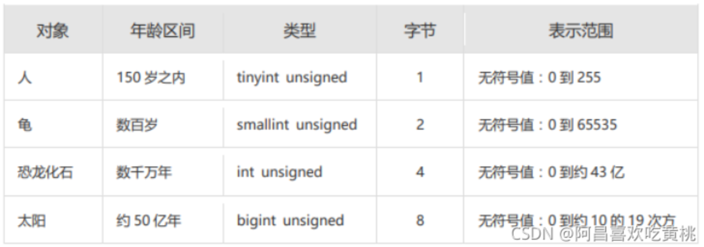
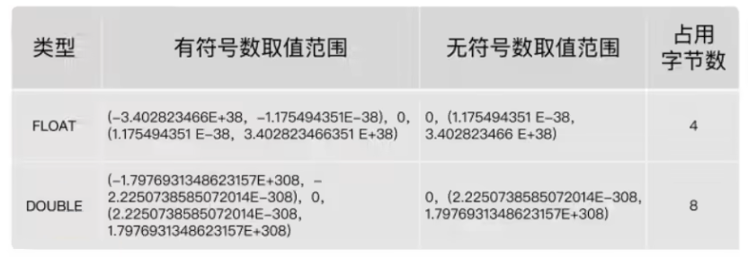
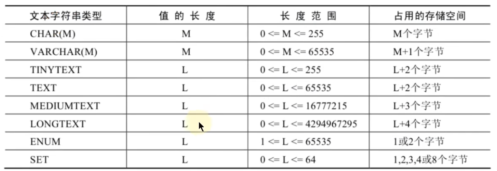

# 3 DDL、DML、DCL使用篇

## 3.1 创建与管理库

### 3.1.1 基础知识

#### 3.1.1.1 标识符命名规则

- 数据库名、表名、字段名等对象名中间不要包含空格
- 必须保证你的字段没有和保留字、数据库系统或常用方法冲突。如果坚持使用，请在SQL语句中使用`（着重号）引起来
- 保持字段名和类型的一致性：在命名字段并为其指定数据类型的时候一定要保证一致性，假如数据类型在一个表里是整数，那在另一个表里可就别变成字符型了（**比如员工表有个部门ID字段，类型为数值类型，那这个字段在部门表中的数据类型也要跟员工表的保持一致，不然做表关联时，数据库还要做一次隐式转换**）

#### 3.1.1.2 MySQL中的数据类型

| 类     型(占 位符   ) | 类型举例                                                     |
| --------------------- | ------------------------------------------------------------ |
| 整数类型              | TINYINT、SMALLINT、MEDIUMINT、**INT(或INTEGER)**、BIGINT     |
| 浮点类型              | FLOAT、DOUBLE                                                |
| 定点数类型            | **DECIMAL**                                                  |
| 位类型                | BIT                                                          |
| 日期时间类型          | YEAR、TIME、**DATE**、DATETIME、TIMESTAMP                    |
| 文本字符串类型        | CHAR、**VARCHAR**、TINYTEXT、TEXT、MEDIUMTEXT、LONGTEXT      |
| 枚举类型              | ENUM                                                         |
| 集合类型              | SET                                                          |
| 二进制字符串类型      | BINARY、VARBINARY、TINYBLOB、BLOB、MEDIUMBLOB、LONGBLOB      |
| JSON类型              | JSON对象、JSON数组                                           |
| 空间数据类型          | 单值：GEOMETRY、POINT、LINESTRING、POLYGON； 集合：MULTIPOINT、MULTILINESTRING、MULTIPOLYGON、GEOMETRYCOLLECTION |


其中，常用的几类类型介绍如下：

| 数据类型      | 描述                                                         |
| ------------- | ------------------------------------------------------------ |
| INT           | 从-231到231-1的整型数据。存储大小为 4个字节                  |
| CHAR(size)    | 定长字符数据。若未指定，默认为1个字符，最大长度255           |
| VARCHAR(size) | 可变长字符数据，根据字符串实际长度保存，**必须指定长度**     |
| FLOAT(M,D)    | 单精度，占用4个字节，M=整数位+小数位，D=小数位。 D<=M<=255,0<=D<=30，默认M+D<=6 |
| DOUBLE(M,D)   | 双精度，占用8个字节，D<=M<=255,0<=D<=30，默认M+D<=15         |
| DECIMAL(M,D)  | 高精度小数，占用M+2个字节，D<=M<=65，0<=D<=30，最大取值范围与DOUBLE相同。 |
| DATE          | 日期型数据，格式’YYYY-MM-DD’                                 |
| BLOB          | 二进制形式的长文本数据，最大可达4G                           |
| TEXT          | 长文本数据，最大可达4G                                       |

***

### 3.1.2 创建和管理数据库

#### 3.1.2.1 创建数据库

```mysql
# 方式1：创建数据库(需要有权限，权限后面章节才讲)
CREATE DATABASE 数据库名; # 此方式创建使用的是默认的字符集

# 方式2：创建数据库并指定字符集
CREATE DATABASE 数据库名 CHARACTER SET 字符集; # 此方式显示指定字符集

# 方式3：判断数据库是否已经存在，不存在则创建数据库（推荐）
CREATE DATABASE IF NOT EXISTS 数据库名; 
# 如果MySQL中已经存在相关的数据库，则忽略创建语句，不再创建数据库。
# 注意：DATABASE 不能改名。一些可视化工具可以改名，它是建新库，把所有表复制到新库，再删旧库完成的。
```

#### 3.1.2.2 使用数据库

```mysql
# 查看数据库的创建信息
SHOW CREATE DATABASE 数据库名;
或者：
SHOW CREATE DATABASE 数据库名\G

# 查看当前所有的数据库
SHOW DATABASES; #有一个S，代表多个数据库

# 查看当前正在使用的数据库
SELECT DATABASE();  #使用的一个 mysql 中的全局函数

# 查看指定库下所有的表
SHOW TABLES FROM 数据库名;

# 查看当前库下所有的表
SHOW TABLES;

# 使用/切换数据库
USE 数据库名;

# 注意：要操作表格和数据之前必须先说明是对哪个数据库进行操作，否则就要对所有对象加上“数据库名.”。
```

***

#### 3.1.2.3 修改数据库

```mysql
# 更改数据库字符集
ALTER DATABASE 数据库名 CHARACTER SET 字符集;  #比如：gbk、utf8等
```

#### 3.1.2.4 删除数据库

```mysql
# 方式1：删除指定的数据库
DROP DATABASE 数据库名;
# 方式2：删除指定的数据库（推荐）
DROP DATABASE IF EXISTS 数据库名;
```

***

### 3.1.3 创建表

#### 3.1.3.1 创建方式1

```mysql
# 语法格式
CREATE TABLE [IF NOT EXISTS] 表名(
	字段1, 数据类型 [约束条件] [默认值],
	字段2, 数据类型 [约束条件] [默认值],
	字段3, 数据类型 [约束条件] [默认值],
	……
	[表约束条件]
);
#加上了IF NOT EXISTS关键字，则表示：如果当前数据库中不存在要创建的数据表，则创建数据表；如果当前数据库中已经存在要创建的数据表，则忽略建表语句，不再创建数据表。
```

- 必须指定：
  - 表名
  - 列名(或字段名)，数据类型，**长度**
- 可选指定：
  - 约束条件
  - 默认值

```mysql
# 创建表举例1：
-- 创建表
CREATE TABLE emp (
  -- int类型
  emp_id INT,
  -- 最多保存20个中英文字符
  emp_name VARCHAR(20),
  -- 总位数不超过15位
  salary DOUBLE,
  -- 日期类型
  birthday DATE
);
```

```java
注意：如果创建表时没有指明实用的字符集，则默认使用表所在的数据库的字符集。创建的时候都手动指定字符集，不要使用默认。
```

#### 3.1.3.2 创建方式2

- 使用 AS subquery 选项，**将创建表和插入数据结合起来**
- 指定的列和子查询中的列要一一对应
- 通过列名和默认值定义列

```mysql
# 创建的emp1有employees表中的数据
CREATE TABLE emp1 AS SELECT * FROM employees; 
# 创建的emp2是空表
CREATE TABLE emp2 AS SELECT * FROM employees WHERE 1=2;
# 创建的emp3更加灵活，别名可以作为新创建的表的字段的名称
CREATE TABLE emp3
AS 
SELECT e.employee_id emp_id, e.last_name, salary*12 ANNSAL, hire_date,d.department_name
FROM employees e JOIN departments d
WHERE e.department_id = d.department_id;
```

#### 3.1.3.3 查看数据表结构

在MySQL中创建好数据表之后，可以查看数据表的结构。MySQL支持使用`DESCRIBE/DESC`语句查看数据表结构，也支持使用`SHOW CREATE TABLE`语句查看数据表结构。

```mysql
SHOW CREATE TABLE 表名\G
```

使用SHOW CREATE TABLE语句不仅可以查看表创建时的详细语句，还可以查看存储引擎和字符编码。

***

### 3.1.4 修改表

修改表指的是修改数据库中已经存在的数据表的结构。

**使用 ALTER TABLE 语句可以实现：**

- 向已有的表中添加列
- 修改现有表中的列
- 删除现有表中的列
- 重命名现有表中的列

#### 3.1.4.1 追加一个列

```mysql
# 格式
ALTER TABLE 表名 ADD 【COLUMN】 字段名 字段类型 【FIRST|AFTER 字段名】;

# 举例 默认添加到表的最后一个字段
ALTER TABLE dept80 ADD job_id varchar(15);
ALTER TABLE dept80 ADD salary DOUBLE(10,2); # 意思一共10位，两位是 默认添加到表的最后一个字段小数位

# 加到第一个位置
ALTER TABLE dept80 ADD job_id varchar(15) FIRST;
# 加到第指定字段位置后面
ALTER TABLE dept80 ADD job_id varchar(15) AFTER emp_name;
```

***

#### 3.1.4.2 修改一个列

- 可以修改列的数据类型，长度、默认值和位置
- 修改字段数据类型、长度、默认值、位置的语法格式如下：
- 还可以通过此种方式修改列的约束。这里暂先不讲。

```mysql
# 格式
ALTER TABLE 表名 MODIFY 【COLUMN】 字段名1 字段类型 【DEFAULT 默认值】【FIRST|AFTER 字段名2】;

# 举例1-修改长度
ALTER TABLE	dept80 MODIFY last_name VARCHAR(30); # 20长度改成30
# 举例1-修改长度并指定默认值，如果插入记录没有赋值时就为默认值
ALTER TABLE	dept80 MODIFY salary double(9,2) default 1000;
```

***

#### 3.1.4.3 重命名一个列

```mysql
# 格式
ALTER TABLE 表名 CHANGE 【column】 列名 新列名 新数据类型;

# 举例 department_name 改成 dept_name 名字 （还可以修改长度为varchar(15)）
ALTER TABLE  dept80 CHANGE department_name dept_name varchar(15); 
```

***

#### 3.1.4.4 删除一个列

```mysql
# 格式
ALTER TABLE 表名 DROP 【COLUMN】字段名

# 举例
ALTER TABLE dept80 DROP COLUMN  job_id; 
```

***

### 3.1.5 重命名表

```mysql
RENAME TABLE emp TO myemp;
```

### 3.1.6 删除表

- 在MySQL中，当一张数据表`没有与其他任何数据表形成关联关系`时，可以将当前数据表直接删除。
- 数据和结构都被删除
- 所有正在运行的相关事务被提交
- 所有相关索引被删除

```mysql
DROP TABLE [IF EXISTS] 数据表1 [, 数据表2, …, 数据表n];
# IF EXISTS的含义为：如果当前数据库中存在相应的数据表，则删除数据表；如果当前数据库中不存在相应的数据表，则忽略删除语句，不再执行删除数据表的操作。

# 举例
DROP TABLE dept80;
```

- DROP TABLE 语句不能回滚

***

### 3.1.7 清空表

- TRUNCATE TABLE语句：
  - 删除表中所有的数据（表结构还在）
  - 释放表的存储空间

```mysql
# 举例
TRUNCATE TABLE detail_dept;
```

- TRUNCATE语句**不能回滚**，而使用 DELETE 语句删除数据，可以回滚

```mysql
DCL 中 COMMIT 和 ROLLBACK 
1)COMMIT:提交数据。一旦执行COMNIT，则数据就被永久的保存在了数据库中，意味着数据不可以回滚。
2)ROLLBACK:回滚数据。一旦执行ROLLBACK,则可以实现数据的回滚，回滚到最近的一次 COMMIT(具体能否真的可以回滚还得看实际情况)。
```

`DELETE FROM`和`TRUNCATE TABLE`都可以删除数据，有什么区别呢？后面介绍事务再讲。

这两个的

 **相同点：**都可以实现对表中所有数据的删除，同时保留表结构

 **不同点：**

- `TRUNCATE TABLE`：一旦执行此操作，表数据全部清除。同时，数据是不可以回滚的
- `DELETE FROM`: 一旦执行此操作，表数据可以全部清除（不带WHERE）。同时，数据是可以实现回滚的（undo日志）

```mysql
# 演示事务回滚 （下面可直接执行）
SET autocommit = FALSE;
DELETE FROM emp2;  # 使用DELETE后，在下面ROLLBACK后数据会回来
#TRUNCATE TABLE emp2; # 使用TRUNCATE后，在下面ROLLBACK后数据不会回来（autocommit对这个无效）
  
SELECT * FROM emp2;
ROLLBACK;
SELECT * FROM emp2;
```

**总结**

执行DDL要慎重，因为无法回滚。比如删除一列后，想回来就不行了

***

### 3.1.8 内容拓展阿里巴巴

```java
阿里开发规范：
【参考】TRUNCATE TABLE 比 DELETE 速度快，且使用的系统和事务日志资源少，但 TRUNCATE 无事务且不触发 TRIGGER，有可能造成事故，故不建议在开发代码中使用此语句。

说明：TRUNCATE TABLE 在功能上与不带 WHERE 子句的 DELETE 语句相同。
```

**拓展1：阿里巴巴《Java开发手册》之MySQL字段命名**

- 【`强制`】表必备三字段：id, gmt_create, gmt_modified。

  - 说明：其中 id 必为主键，类型为BIGINT UNSIGNED、单表时自增、步长为 1。gmt_create, gmt_modified 的类型均为 DATETIME 类型，前者现在时表示主动式创建，后者过去分词表示被动式更新

- 【`推荐`】表的命名最好是遵循 “业务名称_表的作用”。

  - 正例：alipay_task 、 force_project、 trade_config

- 【`推荐`】库名与应用名称尽量一致。

- 【参考】合适的字符存储长度，不但节约数据库表空间、节约索引存储，更重要的是提升检索速度。

  - 正例：无符号值可以避免误存负数，且扩大了表示范围。

  

***

**拓展2：如何理解清空表、删除表等操作需谨慎？！**

`表删除`操作将把表的定义和表中的数据一起删除，并且MySQL在执行删除操作时，不会有任何的确认信息提示，因此执行删除操时应当慎重。在删除表前，最好对表中的数据进行`备份`，这样当操作失误时可以对数据进行恢复，以免造成无法挽回的后果。

同样的，在使用 `ALTER TABLE` 进行表的基本修改操作时，在执行操作过程之前，也应该确保对数据进行完整的备份，因为数据库的改变是`无法撤销`的，如果添加了一个不需要的字段，可以将其删除；相同的，如果删除了一个需要的列，该列下面的所有数据都将会丢失。

***

**拓展3：MySQL8新特性—DDL的原子化**

在MySQL 8.0版本中，InnoDB表的DDL支持事务完整性，即`DDL操作要么成功要么回滚`。DDL操作回滚日志写入到data dictionary数据字典表mysql.innodb_ddl_log（该表是隐藏的表，通过show tables无法看到）中，用于回滚操作。通过设置参数，可将DDL操作日志打印输出到MySQL错误日志中。

分别在MySQL 5.7版本和MySQL 8.0版本中创建数据库和数据表，结果如下：

```mysql
CREATE DATABASE mytest;

USE mytest;

CREATE TABLE book1(
book_id INT ,
book_name VARCHAR(255)
);

SHOW TABLES;
```

（1）在`MySQL 5.7版本`中，测试步骤如下：
删除数据表book1和数据表book2，结果如下：

```shell
mysql> DROP TABLE book1,book2;
ERROR 1051 (42S02): Unknown table 'mytest.book2'
```

再次查询数据库中的数据表名称，结果如下：

```shell
mysql> SHOW TABLES;
Empty set (0.00 sec)
```

从结果可以看出，虽然删除操作时报错了，但是仍然删除了数据表book1。

***

（2）在`MySQL 8.0版本`中，测试步骤如下：
删除数据表book1和数据表book2，结果如下：

```mysql
mysql> DROP TABLE book1,book2;
ERROR 1051 (42S02): Unknown table 'mytest.book2'
```

再次查询数据库中的数据表名称，结果如下：

```shell
mysql> show tables;
+------------------+
| Tables_in_mytest |
+------------------+
| book1            |
+------------------+
1 row in set (0.00 sec)
```

从结果可以看出，数据表book1并没有被删除。

## 3.2 数据处理之增删改

### 3.2.1 插入数据

**方式1：VALUES的方式添加**

**情况1：为表的所有字段按默认顺序插入数据**(不推荐)

```mysql
# 格式
INSERT INTO 表名 VALUES (value1,value2,....);
```

**情况2：为表的指定字段插入数据**（推荐）

```mysql
# 举例（没有指明字段会使用默认值）
INSERT INTO departments(department_id, department_name) VALUES (80, 'IT');
```

**情况3：同时插入多条记录**

INSERT语句可以同时向数据表中插入多条记录，插入时指定多个值列表，每个值列表之间用逗号分隔开，基本语法格式如下：

```shell
# 举例
INSERT INTO emp(emp_id,emp_name) VALUES (1001,'shkstart'),(1002,'atguigu'),(1003,'Tom');
```

```java
因为MySQL执行单条INSERT语句插入多行数据比使用多条INSERT语句快，所以在插入多条记录时最好选择使用单条INSERT语句的方式插入。
```

**小结：**

- `VALUES`也可以写成`VALUE`，但是VALUES是标准写法。

**方式2：将查询结果插入到表中**

INSERT还可以将SELECT语句查询的结果插入到表中，此时不需要把每一条记录的值一个一个输入，只需要使用一条INSERT语句和一条SELECT语句组成的组合语句即可快速地从一个或多个表中向一个表中插入多行。

```mysql
# 举例
INSERT INTO sales_reps(id, name, salary, commission_pct)
SELECT employee_id, last_name, salary, commission_pct
FROM employees
WHERE ob_id LIKE '%REP%';
```

***

### 3.2.2 更新数据

- 如果需要回滚数据，需要保证在DML前，进行设置：**SET AUTOCOMMIT = FALSE;

```mysql
UPDATE employees SET  department_id = 70 WHERE  employee_id = 113;
```

***

### 3.2.3 删除数据

使用 WHERE 子句删除指定的记录。

```mysql
DELETE FROM departments WHERE  department_name = 'Finance';
```

***

### 3.2.4 MySQL8新特性：计算列

什么叫计算列呢？简单来说就是某一列的值是通过别的列计算得来的。例如，a列值为1、b列值为2，c列不需要手动插入，定义a+b的结果为c的值，那么c就是计算列，是通过别的列计算得来的。

在MySQL 8.0中，CREATE TABLE 和 ALTER TABLE 中都支持增加计算列。下面以CREATE TABLE为例进行讲解。

举例：定义数据表tb1，然后定义字段id、字段a、字段b和字段c，其中字段c为计算列，用于计算a+b的值。
首先创建测试表tb1，语句如下：

```mysql
CREATE TABLE tb1(
id INT,
a INT,
b INT,
c INT GENERATED ALWAYS AS (a + b) VIRTUAL
);
```

***

## 3.3 数据类型精讲

### 3.3.1 MySQL中的数据类型

| 类     型(占 位符   ) | 类型举例                                                     |
| --------------------- | ------------------------------------------------------------ |
| 整数类型              | TINYINT、SMALLINT、MEDIUMINT、**INT(或INTEGER)**、BIGINT     |
| 浮点类型              | FLOAT、DOUBLE【这两个存在精度损失】                          |
| 定点数类型            | **DECIMAL**【小数推荐使用】                                  |
| 位类型                | BIT【可存储二进制类型，使用比较少】                          |
| 日期时间类型          | YEAR、TIME、**DATE**、DATETIME、TIMESTAMP                    |
| 文本字符串类型        | CHAR、**VARCHAR**、TINYTEXT、TEXT、MEDIUMTEXT、LONGTEXT      |
| 枚举类型              | ENUM                                                         |
| 集合类型              | SET                                                          |
| 二进制字符串类型      | BINARY、VARBINARY、TINYBLOB、BLOB、MEDIUMBLOB、LONGBLOB      |
| JSON类型              | JSON对象、JSON数组                                           |
| 空间数据类型（了解）  | 单值：GEOMETRY、POINT、LINESTRING、POLYGON； 集合：MULTIPOINT、MULTILINESTRING、MULTIPOLYGON、GEOMETRYCOLLECTION |

常见数据类型的属性，如下：

| MySQL关键字        | 含义                     |
| ------------------ | ------------------------ |
| NULL               | 数据列可包含NULL值       |
| NOT NULL           | 数据列不允许包含NULL值   |
| DEFAULT            | 默认值                   |
| PRIMARY KEY        | 主键                     |
| AUTO_INCREMENT     | 自动递增，适用于整数类型 |
| UNSIGNED           | 无符号                   |
| CHARACTER SET name | 指定一个字符集           |

```mysql
# 1）创建数据库时指定字符集
CREATE DATABASE IF NOT EXISTS dbtest12 CHARACTER SET 'utf8';

# 2）创建表的时候，指名表的字符集
CREATE TABLE temp (
id INT
) CHARACTER SET 'utf8'；

# 3）创建表，指名表中的字段时，可以指定字段的字符集
CREATE TABLE temp1 (
id INT,
NAME VARCHAR (15) CHARACTER SET 'gbk'
);

# 查看数据库使用的字符集指令
SHOW VARIABLES LIKE 'character_%'

# 如果定义字段没有指明字符集，那么会向上使用创建表时指定的字符集，如果创建表也没有指定，那么继续向上使用创建数据库指定的字符集，那如果创建数据库也没有指定，那么久找my.ini配置文件中配置的字符集。
```

### 3.3.2 整数类型

#### 3.3.2.1 **类型介绍**

整数类型一共有 5 种，包括 `TINYINT`、`SMALLINT`、`MEDIUMINT`、`INT（INTEGER）`和 `BIGINT`。

它们的区别如下表所示

| **整数类型** | **字节** | 有符号数取值范围                         | 无符号数取值范围       |
| ------------ | -------- | ---------------------------------------- | ---------------------- |
| TINYINT      | 1        | -128~127                                 | 0~255                  |
| SMALLINT     | 2        | -32768~32767                             | 0~65535                |
| MEDIUMINT    | 3        | -8388608~8388607                         | 0~16777215             |
| INT、INTEGER | 4        | -2147483648~2147483647                   | 0~4294967295           |
| BIGINT       | 8        | -9223372036854775808~9223372036854775807 | 0~18446744073709551615 |

那什么时候使用有符号和有符号呢（比如要不要将8位的第一个作为符号位，如果不作为，那么可以表示256个，如果作为，则 -128～127，因为第一位是符号位）？比如我们现在有个年龄字段，年龄肯定不是负数，因此使用无符号就行，那么在设置字段时加上属性 `UNSIGNED`（看上面的表），这样就没有负数了，表示的正数范围更广。

如果超出范围会报错 `Out of range value for column 'f1' at row 1`

#### 3.3.2.2 **可选属性**

##### 3.3.2.2.1 M

`M:` 表示显示宽度，M的取值范围是(0, 255)。例如，int(5)：当数据宽度小于5位的时候在数字前面需要用字符填满宽度。该项功能需要配合`“ZEROFILL”`使用，表示用“0”填满宽度，否则指定显示宽度无效。

问：如果设置了显示宽度，那么插入的数据宽度超过显示宽度限制，会不会截断或插入失败？

答案：不会对插入的数据有任何影响，还是按照类型的实际宽度进行保存，即`显示宽度与类型可以存储的值范围无关`。从MySQL 8.0.17开始，整数数据类型不推荐使用显示宽度属性。

***

INT后面括号的数字跟INT本身类型存值范围没关系，如果不加 `ZEROFILL`，那么 `f1 INT` 和` f2 INT(5)`，没区别，但是如果加上了` f3 INT(5)ZEROFILL ` 才有效果，看查询结果，如果不够指定括号里的长度，那么会使用0补齐长度，如果长度够了，就不影响。

```java
注意：当使用`ZEROFILL`时，会自动使用`UNSIGNED`，因为使用0来填充，那肯定是正数
mysql 5.0才有这个功能，但是在mysql 8.0就去掉了这个，因为有点鸡肋。一般用不上这个功能
```

***

##### 3.3.2.2.2 UNSIGNED

`UNSIGNED`: 无符号类型（非负），所有的整数类型都有一个可选的属性UNSIGNED（无符号属性），无符号整数类型的最小取值为0。所以，如果需要在MySQL数据库中保存非负整数值时，可以将整数类型设置为无符号类型。

***

##### 3.3.2.2.3 ZEROFILL

`ZEROFILL`: 0填充,（如果某列是ZEROFILL，那么MySQL会自动为当前列添加UNSIGNED属性），如果指定了ZEROFILL只是表示不够M位时，用0在左边填充，如果超过M位，只要不超过数据存储范围即可。

原来，`在 int(M) 中，M 的值跟 int(M) 所占多少存储空间并无任何关系`。 int(3)、int(4)、int(8) 在磁盘上都是占用 4 bytes 的存储空间。也就是说，**int(M)，必须和UNSIGNED ZEROFILL一起使用才有意义。**如果整数值超过M位，就按照实际位数存储。只是无须再用字符 0 进行填充。

***

#### 3.3.2.3 适用场景

`TINYINT`：一般用于枚举数据，比如系统设定取值范围很小且固定的场景。

`SMALLINT`：可以用于较小范围的统计数据，比如统计工厂的固定资产库存数量等。

`MEDIUMINT`：用于较大整数的计算，比如车站每日的客流量等。

`INT`、`INTEGER`：取值范围足够大，一般情况下不用考虑超限问题，用得最多。比如商品编号。

`BIGINT`：只有当你处理特别巨大的整数时才会用到。比如双十一的交易量、大型门户网站点击量、证券公司衍生产品持仓等。

***

#### 3.3.2.4 如何选择？

**系统故障产生的成本远远超过增加几个字段存储空间所产生的成本**。因此，我建议你首先**确保数据不会超过取值范围，在这个前提之下，再去考虑如何节省存储空间。**

***

### 3.3.3 浮点类型（不建议使用）

类型介绍

浮点数和定点数类型的特点是可以`处理小数`，你可以把整数看成小数的一个特例。因此，浮点数和定点数的使用场景，比整数大多了。 MySQL支持的浮点数类型，分别是 `FLOAT`、`DOUBLE`、`REAL`。

- FLOAT 表示单精度浮点数；
- DOUBLE 表示双精度浮点数；



***

### 3.3.4 定点数类型

#### 3.3.4.1 类型介绍

MySQL中的定点数类型只有 DECIMAL 一种类型。

| 数据类型                 | 字节数  | 含义               |
| ------------------------ | ------- | ------------------ |
| DECIMAL(M,D),DEC,NUMERIC | M+2字节 | 有效范围由M和D决定 |

使用 DECIMAL(M,D) 的方式表示高精度小数。其中，M被称为精度，D被称为标度。0<=M<=65，0<=D<=30，D<M。例如，定义DECIMAL（5,2）的类型，表示该列取值范围是-999.99~999.99。

- DECIMAL(M,D)的最大取值范围与DOUBLE类型一样，但是有效的数据范围是由M和D决定的。DECIMAL 的存储空间并不是固定的，由精度值M决定，总共占用的存储空间为M+2个字节。也就是说，在一些对精度要求不高的场景下，比起占用同样字节长度的定点数，浮点数表达的数值范围可以更大一些。
- 定点数在MySQL内部是以`字符串`的形式进行存储，这就决定了它一定是精准的。
- 当DECIMAL类型不指定精度和标度时，其默认为DECIMAL(10,0)。当数据的精度超出了定点数类型的精度范围时，则MySQL同样会进行四舍五入处理。
- 浮点数 vs 定点数
  - 浮点数相对于定点数的优点是在长度一定的情况下，浮点类型取值范围大，但是不精准，适用于需要取值范围大，又可以容忍微小误差的科学计算场景（比如计算化学、分子建模、流体动力学等）
  - 定点数类型取值范围相对小，但是精准，没有误差，适合于对精度要求极高的场景 （比如涉及金额计算的场景）

***

#### 3.3.4.2 开发中经验

“由于 DECIMAL 数据类型的精准性，在我们的项目中，除了极少数（比如商品编号）用到整数类型外，其他的数值都用的是 DECIMAL，原因就是这个项目所处的零售行业，要求精准，一分钱也不能差。 ” ——来自某项目经理

***

### 3.3.5 位类型：BIT

略

### 3.3.6 日期与时间类型

不同的版本可能有所差异，MySQL8.0版本支持的日期和时间类型主要有：YEAR类型、TIME类型、DATE类型、DATETIME类型和TIMESTAMP类型。

- `YEAR`类型通常用来表示年
- `DATE`类型通常用来表示年、月、日
- `TIME`类型通常用来表示时、分、秒
- `DATETIME`类型通常用来表示年、月、日、时、分、秒
- `TIMESTAMP`类型通常用来表示带时区的年、月、日、时、分、秒

| 类型      | 名称     | 字节 | 日期格式            | 最小值                  | 最大值                 |
| --------- | -------- | ---- | ------------------- | ----------------------- | ---------------------- |
| YEAR      | 年       | 1    | YYYY或YY            | 1901                    | 2155                   |
| TIME      | 时间     | 3    | HH:MM:SS            | -838:59:59              | 838:59:59              |
| DATE      | 日期     | 3    | YYYY-MM-DD          | 1000-01-01              | 9999-12-03             |
| DATETIME  | 日期时间 | 8    | YYYY-MM-DD HH:MM:SS | 1000-01-01 00:00:00     | 9999-12-31 23:59:59    |
| TIMESTAMP | 日期时间 | 4    | YYYY-MM-DD HH:MM:SS | 1970-01-01 00:00:00 UTC | 2038-01-19 03:14:07UTC |

***

#### 3.3.6.1 YEAR类型

YEAR类型用来表示年份，在所有的日期时间类型中所占用的存储空间最小，只需要`1个字节`的存储空间。

***

#### 3.3.6.2 DATE类型

DATE类型表示日期，没有时间部分，格式为`YYYY-MM-DD`，其中，YYYY表示年份，MM表示月份，DD表示日期。需要`3个字节`的存储空间。在向DATE类型的字段插入数据时，同样需要满足一定的格式条件。

- 以`YYYY-MM-DD`格式或者`YYYYMMDD`格式表示的字符串日期，其最小取值为1000-01-01，最大取值为9999-12-03。YYYYMMDD格式会被转化为YYYY-MM-DD格式。
- 以`YY-MM-DD`格式或者`YYMMDD`格式表示的字符串日期，此格式中，年份为两位数值或字符串满足YEAR类型的格式条件为：当年份取值为00到69时，会被转化为2000到2069；当年份取值为70到99时，会被转化为1970到1999。
- 使用`CURRENT_DATE()`或者`NOW()`函数，**会插入当前系统的日期（日期就是年月日）。**

***

#### 3.3.6.3 TIME类型

TIME类型用来表示时间，不包含日期部分。在MySQL中，需要`3个字节`的存储空间来存储TIME类型的数据，可以使用“HH:MM:SS”格式来表示TIME类型，其中，HH表示小时，MM表示分钟，SS表示秒。

在MySQL中，向TIME类型的字段插入数据时，也可以使用几种不同的格式。

1. 可以使用带有冒号的字符串，比如’`D HH:MM:SS'`、’`HH:MM:SS`’、’`HH:MM`’、’`D HH:MM`’、’`D HH`‘或’`SS`‘格式，都能被正确地插入TIME类型的字段中。其中D表示天，其最小值为0，最大值为34。如果使用带有D格式的字符串插入TIME类型的字段时，D会被转化为小时，计算格式为D*24+HH。当使用带有冒号并且不带D的字符串表示时间时，表示当天的时间，比如12:10表示12:10:00，而不是00:12:10。
2. 可以使用不带有冒号的字符串或者数字，格式为’`HHMMSS`'或者`HHMMSS`。如果插入一个不合法的字符串或者数字，MySQL在存储数据时，会将其自动转化为00:00:00进行存储。比如1210，MySQL会将最右边的两位解析成秒，表示00:12:10，而不是12:10:00。
3. 使用`CURRENT_TIME()`或者`NOW()`，**会插入当前系统的时间（时间就是时分秒）。**

***

#### 3.3.6.4 DATETIME类型

DATETIME类型在所有的日期时间类型中占用的存储空间最大，总共需要`8`个字节的存储空间。在格式上为DATE类型和TIME类型的组合，可以表示为`YYYY-MM-DD HH:MM:SS`，其中YYYY表示年份，MM表示月份，DD表示日期，HH表示小时，MM表示分钟，SS表示秒。

在向DATETIME类型的字段插入数据时，同样需要满足一定的格式条件。

- 以`YYYY-MM-DD HH:MM:SS`格式或者`YYYYMMDDHHMMSS`格式的字符串插入DATETIME类型的字段时，最小值为1000-01-01 00:00:00，最大值为9999-12-03 23:59:59。
  - 以YYYYMMDDHHMMSS格式的数字插入DATETIME类型的字段时，会被转化为YYYY-MM-DD HH:MM:SS格式。
- 以`YY-MM-DD HH:MM:SS`格式或者`YYMMDDHHMMSS`格式的字符串插入DATETIME类型的字段时，两位数的年份规则符合YEAR类型的规则，00到69表示2000到2069；70到99表示1970到1999。
- 使用函数`CURRENT_TIMESTAMP()`和`NOW()`，可以向DATETIME类型的字段插入系统的当前日期和时间。

***

#### 3.3.6.5 TIMESTAMP类型

TIMESTAMP类型也可以表示日期时间，其显示格式与DATETIME类型相同，都是`YYYY-MM-DD HH:MM:SS`，需要4个字节的存储空间。但是TIMESTAMP存储的时间范围比DATETIME要小很多，只能存储“1970-01-01 00:00:01 UTC”到“2038-01-19 03:14:07 UTC”之间的时间。其中，UTC表示世界统一时间，也叫作世界标准时间。

***

**TIMESTAMP和DATETIME的区别：**

- TIMESTAMP存储空间比较小，表示的日期时间范围也比较小
- 底层存储方式不同，TIMESTAMP底层存储的是毫秒值，距离1970-1-1 0:0:0 0毫秒的毫秒值。
- 两个日期比较大小或日期计算时，TIMESTAMP更方便、更快。
- TIMESTAMP和时区有关。TIMESTAMP会根据用户的时区不同，显示不同的结果。而DATETIME则只能反映出插入时当地的时区，其他时区的人查看数据必然会有误差的。

***

#### 3.3.6.6 开发中经验

用得最多的日期时间类型，就是 `DATETIME`。

***

### 3.3.7 文本字符串类型

在实际的项目中，我们还经常遇到一种数据，就是字符串数据。

MySQL中，文本字符串总体上分为`CHAR`、`VARCHAR`、`TINYTEXT`、`TEXT`、`MEDIUMTEXT`、`LONGTEXT`、`ENUM`、`SET`等类型。



***

#### 3.3.7.1 CHAR与VARCHAR类型

CHAR和VARCHAR类型都可以存储比较短的字符串。

| 字符串(文本)类型 | 特点     | 长度 | 长度范围        | 占用的存储空间        |
| ---------------- | -------- | ---- | --------------- | --------------------- |
| CHAR(M)          | 固定长度 | M    | 0 <= M <= 255   | M个字节               |
| VARCHAR(M)       | 可变长度 | M    | 0 <= M <= 65535 | (实际长度 + 1) 个字节 |

上面固定长度：CHAR（M）中M值为10，那么即使存不够10，也会补齐10位，实际长度是10；

上面可变长度：VARCHAR(M) 中M值为10，存Hello，长度5不够10，那么实际长度就是5；

**CHAR类型：**

- CHAR(M) 类型一般需要预先定义字符串长度。如果**不指定(M)，则表示长度默认是1个字符。**
- 如果保存时，数据的实际长度比CHAR类型声明的长度小，则会在`右侧填充`空格以达到指定的长度。**当MySQL检索CHAR类型的数据时，CHAR类型的字段会去除尾部的空格。**
- 定义CHAR类型字段时，声明的字段长度即为CHAR类型字段所占的存储空间的字节数。

**VARCHAR类型：**

- VARCHAR(M) 定义时，`必须指定`长度M，否则报错。
- MySQL4.0版本以下，varchar(20)：指的是20字节，如果存放UTF8汉字时，只能存6个（每个汉字3字节） ；MySQL5.0版本以上，varchar(20)：指的是20字符。
- 检索VARCHAR类型的字段数据时，会保留数据尾部的空格。VARCHAR类型的字段所占用的存储空间为字符串实际长度加1个字节。

***

**哪些情况使用 CHAR 或 VARCHAR 更好**

| 类型       | 特点     | 空间上       | 时间上 | 适用场景             |
| ---------- | -------- | ------------ | ------ | -------------------- |
| CHAR(M)    | 固定长度 | 浪费存储空间 | 效率高 | 存储不大，速度要求高 |
| VARCHAR(M) | 可变长度 | 节省存储空间 | 效率低 | 非CHAR的情况         |

`情况1`：存储很短的信息。比如门牌号码101，201……这样很短的信息应该用char，**因为varchar还要占个byte用于存储信息长度**，本来打算节约存储的，结果得不偿失。

`情况2`：固定长度的。比如使用uuid作为主键，那用char应该更合适。因为他固定长度，varchar动态根据长度的特性就消失了，而且还要占个长度信息。

`情况3`：十分频繁改变的column。因为varchar每次存储都要有额外的计算，得到长度等工作，如果一个非常频繁改变的，那就要有很多的精力用于计算，而这些对于char来说是不需要的。

`情况4`：具体存储引擎中的情况：

- `MyISAM` 数据存储引擎和数据列：MyISAM数据表，最好使用固定长度(CHAR)的数据列代替可变长度(VARCHAR)的数据列。这样使得整个表静态化，从而使`数据检索更快`，用空间换时间。
- `InnoDB`存储引擎，建议使用VARCHAR类型。因为对于InnoDB数据表，内部的行存储格式并没有区分固定长度和可变长度列（所有数据行都使用指向数据列值的头指针），而且**主要影响性能的因素是数据行使用的存储总量**，由于char平均占用的空间多于varchar，所以除了简短并且固定长度的，其他考虑varchar。这样节省空间，对磁盘I/O和数据存储总量比较好。

***

#### 3.3.7.2 TEXT类型

略

***

#### 3.3.7.3 开发中经验

TEXT文本类型，可以存比较大的文本段，搜索速度稍慢，因此如果不是特别大的内容，建议使用CHAR，VARCHAR来代替。还有TEXT类型不用加默认值，加了也没用。而且text和blob类型的数据删除后容易导致“空洞”，使得文件碎片比较多，所以频繁使用的表不建议包含TEXT类型字段，建议单独分出去，单独用一个表。

***

### 3.3.8 ENUM 类型

ENUM类型也叫作枚举类型，ENUM类型的取值范围需要在定义字段时进行指定。设置字段值时，ENUM类型只允许从成员中选取单个值，不能一次选取多个值。

其所需要的存储空间由定义ENUM类型时指定的成员个数决定。

| 文本字符串类型 | 长度 | 长度范围        | 占用的存储空间 |
| -------------- | ---- | --------------- | -------------- |
| ENUM           | L    | 1 <= L <= 65535 | 1或2个字节     |

- 当ENUM类型包含1～255个成员时，需要1个字节的存储空间；
- 当ENUM类型包含256～65535个成员时，需要2个字节的存储空间。
- ENUM类型的成员个数的上限为65535个。

```mysql
# 创建表
CREATE TABLE test_enum(
season ENUM('春','夏','秋','冬','unknow')
);

INSERT INTO test_enum
VALUES('春'),('秋');

# 忽略大小写
INSERT INTO test_enum
VALUES('UNKNOW');

# 允许按照角标的方式获取指定索引位置的枚举值
INSERT INTO test_enum
VALUES('1'),(3);

# Data truncated for column 'season' at row 1
INSERT INTO test_enum
VALUES('ab');

# 当ENUM类型的字段没有声明为NOT NULL时，插入NULL也是有效的
INSERT INTO test_enum
VALUES(NULL);
```

***

### 3.3.9 SET类型

```mysql
CREATE TABLE test_set(
s SET ('A', 'B', 'C')
);

INSERT INTO test_set (s) VALUES ('A'), ('A,B');

#插入重复的SET类型成员时，MySQL会自动删除重复的成员
INSERT INTO test_set (s) VALUES ('A,B,C,A');

#向SET类型的字段插入SET成员中不存在的值时，MySQL会抛出错误。
INSERT INTO test_set (s) VALUES ('A,B,C,D');
```

```mysql
CREATE TABLE temp_mul(
gender ENUM('男','女'),
hobby SET('吃饭','睡觉','打豆豆','写代码')
);

INSERT INTO temp_mul VALUES('男','睡觉,打豆豆'); #成功

# Data truncated for column 'gender' at row 1
INSERT INTO temp_mul VALUES('男,女','睡觉,写代码'); #失败

# Data truncated for column 'gender' at row 1
INSERT INTO temp_mul VALUES('妖','睡觉,写代码');#失败

INSERT INTO temp_mul VALUES('男','睡觉,写代码,吃饭'); #成功
```

***

### 3.3.10 二进制字符串类型

略。

***

### 3.3.11 JSON 类型

略

***

### 3.3.13 小结及选择建议

在定义数据类型时，如果确定是`整数`，就用`INT`； 如果是`小数`，一定用定点数类型 `DECIMAL(M,D)`； 如果是日期与时间，就用 `DATETIME`。

这样做的好处是，首先确保你的系统不会因为数据类型定义出错。不过，凡事都是有两面的，可靠性好，并不意味着高效。比如，TEXT 虽然使用方便，但是效率不如 CHAR(M) 和 VARCHAR(M)。

关于字符串的选择，建议参考如下阿里巴巴的《Java开发手册》规范：

**阿里巴巴《Java开发手册》之MySQL数据库：**

- 任何字段如果为非负数，必须是 `UNSIGNED`
- 【`强制`】小数类型为 **DECIMAL**，禁止使用 FLOAT 和 DOUBLE。
  - 说明：在存储的时候，FLOAT 和 DOUBLE 都存在精度损失的问题，很可能在比较值的时候，得到不正确的结果。如果存储的数据范围超过 DECIMAL 的范围，建议将数据拆成整数和小数并分开存储。
- 【`强制`】如果存储的字符串长度几乎相等，使用 CHAR 定长字符串类型（比如手机号）。
- 【`强制`】VARCHAR 是可变长字符串，不预先分配存储空间，长度不要超过 5000。如果存储长度大于此值，定义字段类型为 TEXT，独立出来一张表，用主键来对应，避免影响其它字段索引效率。


## 3.4 约束

### 3.4.1 约束概述

- **根据约束起的作用**，约束可分为：
  - **NOT NULL** **非空约束，规定某个字段不能为空**
  - **UNIQUE** **唯一约束**，**规定某个字段在整个表中是唯一的**
  - **PRIMARY KEY 主键(非空且唯一)约束**
  - **FOREIGN KEY** **外键约束**
  - **CHECK** **检查约束**
  - **DEFAULT** **默认值约束**

```java
注意： MySQL不支持check约束，但可以使用check约束，而没有任何效果
```

***

### 3.4.X 查看某个表已有的约束

```mysql
#information_schema数据库名（系统库）
#table_constraints表名称（专门存储各个表的约束）
SELECT * FROM information_schema.table_constraints 
WHERE table_name = '表名称';
```

***

### 3.4.2 非空约束

添加非空约束

```mysql
CREATE TABLE 表名称(
	字段名  数据类型,
    字段名  数据类型 NOT NULL,  
    字段名  数据类型 NOT NULL
);

# 举例
CREATE TABLE emp(
id INT(10) NOT NULL,
NAME VARCHAR(20) NOT NULL,
sex CHAR NULL
);

# 举例
CREATE TABLE student(
	sid int,
    sname varchar(20) not null,
    tel char(11) ,
    cardid char(18) not null
);

insert into student values(1,'张三','13710011002','110222198912032545'); #成功

insert into student values(2,'李四','13710011002',null);#身份证号为空
ERROR 1048 (23000): Column 'cardid' cannot be null

insert into student values(2,'李四',null,'110222198912032546');#成功，tel允许为空

insert into student values(3,null,null,'110222198912032547');#失败
ERROR 1048 (23000): Column 'sname' cannot be null

```

建表后

```mysql
alter table 表名称 modify 字段名 数据类型 not null;
# 举例
ALTER TABLE emp MODIFY sex VARCHAR(30) NOT NULL;
```

### 3.4.3 唯一性约束

建表时

```mysql
create table 表名称(
	字段名  数据类型,
    字段名  数据类型  unique,  
    字段名  数据类型  unique key,
    字段名  数据类型
);
create table 表名称(
	字段名  数据类型,
    字段名  数据类型,  
    字段名  数据类型,
    [constraint 约束名] unique key(字段名)
);

# 举例
create table student(
	sid int,
    sname varchar(20),
    tel char(11) unique,
    cardid char(18) unique key
);

CREATE TABLE USER(
 id INT NOT NULL,
 NAME VARCHAR(25),
 PASSWORD VARCHAR(16),
 -- 使用表级约束语法
 CONSTRAINT uk_name_pwd UNIQUE(NAME,PASSWORD) # 表示用户名和密码组合不能重复
);
```

建表后指定约束

```mysql
# 方式一
#字段列表中如果是一个字段，表示该列的值唯一。如果是两个或更多个字段，那么复合唯一，即多个字段的组合是唯一的
alter table 表名称 add unique key(字段列表); 

# 方式二
alter table 表名称 modify 字段名 字段类型 unique;

# 举例
ALTER TABLE user ADD UNIQUE(NAME,PASSWORD);
ALTER TABLE user MODIFY NAME VARCHAR(20) UNIQUE;
```

***

#### 3.4.3.1 关于复合唯一约束

就是一个约束作用在多个列上，只有这几个列都相同时才唯一。

#### 3.4.3.2 删除唯一约束

- 添加唯一性约束的列上也会自动创建唯一索引。
- 删除唯一约束只能通过删除唯一索引的方式删除。
- 删除时需要指定唯一索引名，唯一索引名就和唯一约束名一样。

```mysql
SELECT * FROM information_schema.table_constraints WHERE table_name = '表名'; #查看都有哪些约束
ALTER TABLE USER DROP INDEX uk_name_pwd;
```

> 注意：可以通过 `show index from 表名称;`查看表的索引

### 3.4.4 PRIMARY KEY 约束

#### 3.4.4.1 添加主键约束

```mysql
# 建表时指定主键约束
create table 表名称(
	  字段名  数据类型  primary key, #列级模式
    字段名  数据类型,  
    字段名  数据类型  
);
create table 表名称(
	  字段名  数据类型,
    字段名  数据类型,  
    字段名  数据类型,
    [constraint 约束名] primary key(字段名) #表级模式
);

# (1)建表时
create table temp(
	id int primary key,
    name varchar(20)
);

#（2）建表后增加主键约束
ALTER TABLE 表名称 ADD PRIMARY KEY(字段列表); #字段列表可以是一个字段，也可以是多个字段，如果是多个字段的话，是复合主键

ALTER TABLE student ADD PRIMARY KEY (sid);
ALTER TABLE emp5 ADD PRIMARY KEY(NAME,pwd);
```

***

#### 3.4.4.2 关于复合主键

```mysql
create table 表名称(
	字段名  数据类型,
    字段名  数据类型,  
    字段名  数据类型,
    primary key(字段名1,字段名2)  #表示字段1和字段2的组合是唯一的，也可以有更多个字段
);

#学生表
create table student(
	sid int primary key,  #学号
    sname varchar(20)     #学生姓名
);

#课程表
create table course(
	cid int primary key,  #课程编号
    cname varchar(20)     #课程名称
);

#选课表
create table student_course(
	sid int,
    cid int,
    score int,
    primary key(sid,cid)  #复合主键
);

# 再举例
CREATE TABLE emp6(
id INT NOT NULL,
NAME VARCHAR(20),
pwd VARCHAR(15),
CONSTRAINT emp7_pk PRIMARY KEY(NAME,pwd)
);
```

***

#### 3.4.4.3 删除主键约束

在实际开发中，不可能删除主键约束

```mysql
alter table 表名称 drop primary key;

ALTER TABLE student DROP PRIMARY KEY;
ALTER TABLE emp5 DROP PRIMARY KEY;
```

> 说明：删除主键约束，不需要指定主键名，因为一个表只有一个主键，删除主键约束后，非空还存在。

### 3.4.5 自增列：AUTO_INCREMENT

#### 3.4.5.1 介绍

**作用**

某个字段的值自增

**关键字**

auto_increment

**特点和要求**

（1）一个表最多只能有一个自增长列

（2）当需要产生唯一标识符或顺序值时，可设置自增长

（3）自增长列约束的列必须是键列（主键列，唯一键列）

（4）自增约束的列的数据类型必须是整数类型

（5）如果自增列指定了 0 和 null，会在当前最大值的基础上自增；如果自增列手动指定了具体值，直接赋值为具体值。

错误演示：

```mysql
# 错误例子1
create table employee(
	eid int auto_increment,
    ename varchar(20)
);
# ERROR 1075 (42000): Incorrect table definition; there can be only one auto column and it must be defined as a key   

# 错误例子2
create table employee(
	eid int primary key,
    ename varchar(20) unique key auto_increment
);
# ERROR 1063 (42000): Incorrect column specifier for column 'ename'  因为ename不是整数类型
```

#### 3.4.5.2 如何指定自增约束

**建表时**

```mysql
create table employee(
	eid int primary key auto_increment,
    ename varchar(20)
);
```

**建表后**

```mysql
alter table 表名称 modify 字段名 数据类型 auto_increment;
create table employee(
	eid int primary key ,
    ename varchar(20)
);
alter table employee modify eid int auto_increment;
```

#### 3.4.5.3 如何删除自增约束

```mysql
#alter table 表名称 modify 字段名 数据类型 auto_increment;#给这个字段增加自增约束
alter table 表名称 modify 字段名 数据类型; #去掉auto_increment相当于删除
alter table employee modify eid int;
```

***

#### 3.4.5.4 MySQL 8.0新特性—自增变量的持久化

在MySQL 8.0之前，自增主键AUTO_INCREMENT的值如果大于max(primary key)+1，在MySQL重启后，会重置AUTO_INCREMENT=max(primary key)+1，这种现象在某些情况下会导致业务主键冲突或者其他难以发现的问题。
下面通过案例来对比不同的版本中自增变量是否持久化。
在MySQL 5.7版本中，测试步骤如下：
创建的数据表中包含自增主键的id字段，语句如下：

```mysql
CREATE TABLE test1(
id INT PRIMARY KEY AUTO_INCREMENT
);
```

插入4个空值，执行如下：

```mysql
INSERT INTO test1 VALUES(0),(0),(0),(0);
```

查询数据表test1中的数据，结果如下：

```mysql
mysql> SELECT * FROM test1;
+----+
| id |
+----+
|  1 |
|  2 |
|  3 |
|  4 |
+----+
4 rows in set (0.00 sec)
```

删除id为4的记录，语句如下：

```mysql
DELETE FROM test1 WHERE id = 4;
```

再次插入一个空值，语句如下：

```mysql
INSERT INTO test1 VALUES(0);
```

查询此时数据表test1中的数据，结果如下：

```mysql
mysql> SELECT * FROM test1;
+----+
| id |
+----+
|  1 |
|  2 |
|  3 |
|  5 |
+----+
4 rows in set (0.00 sec)
```

从结果可以看出，虽然删除了id为4的记录，但是再次插入空值时，并没有重用被删除的4，而是分配了5。
删除id为5的记录，结果如下：

```mysql
DELETE FROM test1 where id=5;
```

**重启数据库**，重新插入一个空值。

```mysql
INSERT INTO test1 values(0);
```

再次查询数据表test1中的数据，结果如下：

```mysql
mysql> SELECT * FROM test1;
+----+
| id |
+----+
|  1 |
|  2 |
|  3 |
|  4 |
+----+
4 rows in set (0.00 sec)
```

从结果可以看出，新插入的0值分配的是4，按照重启前的操作逻辑，此处应该分配6。出现上述结果的主要原因是自增主键没有持久化。
在MySQL 5.7系统中，对于自增主键的分配规则，是由InnoDB数据字典内部一个`计数器`来决定的，而该计数器只在`内存中维护`，并不会持久化到磁盘中。当数据库重启时，该计数器会被初始化。

在MySQL 8.0版本中，上述测试步骤最后一步的结果如下：

```mysql
mysql> SELECT * FROM test1;
+----+
| id |
+----+
|  1 |
|  2 |
|  3 |
|  6 |
+----+
4 rows in set (0.00 sec)
```

从结果可以看出，自增变量已经持久化了。

MySQL 8.0将自增主键的计数器持久化到`重做日志`中。每次计数器发生改变，都会将其写入重做日志中。如果数据库重启，InnoDB会根据重做日志中的信息来初始化计数器的内存值。

***

### 3.4.6 FOREIGN KEY 约束

#### 3.4.6.1 阿里开发规范

【`强制`】不得使用外键与级联，一切外键概念必须在应用层解决。

说明：（概念解释）学生表中的 student_id 是主键，那么成绩表中的 student_id 则为外键。如果更新学生表中的 student_id，同时触发成绩表中的 student_id 更新，即为级联更新。外键与级联更新适用于`单机低并发`，不适合`分布式`、`高并发集群`；级联更新是强阻塞，存在数据库`更新风暴`的风险；外键影响数据库的`插入速度`。

### 3.4.7 CHECK 约束

#### 3.4.7.3 说明：MySQL 5.7 不支持

MySQL5.7 可以使用check约束，但check约束对数据验证没有任何作用。添加数据时，没有任何错误或警告

但是**MySQL 8.0中可以使用check约束了**。

```mysql
create table employee(
	eid int primary key,
    ename varchar(5),
    gender char check ('男' or '女'),
    salary DECIMAL(10,2) CHECK(salary > 2000)
);
```

### 3.4.8 DEFAULT约束

#### 3.4.8.1 介绍

#### 3.4.8.2 如何给字段加默认值

建表时

```mysql
create table 表名称(
	字段名  数据类型  primary key,
    字段名  数据类型  unique key not null,  
    字段名  数据类型  unique key,
    字段名  数据类型  not null default 默认值, 
);
create table 表名称(
	字段名  数据类型 default 默认值 ,
    字段名  数据类型 not null default 默认值,  
    字段名  数据类型 not null default 默认值,
    primary key(字段名),
    unique key(字段名)
);

说明：默认值约束一般不在唯一键和主键列上加
```

```mysql
# 例子1
create table employee(
	eid int primary key,
    ename varchar(20) not null,
    gender char default '男',
    tel char(11) not null default '' #默认是空字符串
);
# 例子2
CREATE TABLE myemp(
id INT AUTO_INCREMENT PRIMARY KEY,
NAME VARCHAR(15),
salary DOUBLE(10,2) DEFAULT 2000
);
```

建表后

```mysql
alter table 表名称 modify 字段名 数据类型 default 默认值;

#如果这个字段原来有非空约束，你还保留非空约束，那么在加默认值约束时，还得保留非空约束，否则非空约束就被删除了
#同理，在给某个字段加非空约束也一样，如果这个字段原来有默认值约束，你想保留，也要在modify语句中保留默认值约束，否则就删除了
alter table 表名称 modify 字段名 数据类型 default 默认值 not null;
```

```mysql
create table employee(
	eid int primary key,
    ename varchar(20),
    gender char,
    tel char(11) not null
);

mysql> desc employee;
+--------+-------------+------+-----+---------+-------+
| Field  | Type        | Null | Key | Default | Extra |
+--------+-------------+------+-----+---------+-------+
| eid    | int(11)     | NO   | PRI | NULL    |       |
| ename  | varchar(20) | YES  |     | NULL    |       |
| gender | char(1)     | YES  |     | NULL    |       |
| tel    | char(11)    | NO   |     | NULL    |       |
+--------+-------------+------+-----+---------+-------+
4 rows in set (0.00 sec)

# 添加约束
alter table employee modify gender char default '男';  #给gender字段增加默认值约束
alter table employee modify tel char(11) default ''; #给tel字段增加默认值约束

mysql> desc employee;
+--------+-------------+------+-----+---------+-------+
| Field  | Type        | Null | Key | Default | Extra |
+--------+-------------+------+-----+---------+-------+
| eid    | int(11)     | NO   | PRI | NULL    |       |
| ename  | varchar(20) | YES  |     | NULL    |       |
| gender | char(1)     | YES  |     | 男      |       |
| tel    | char(11)    | YES  |     |         |       |
+--------+-------------+------+-----+---------+-------+
4 rows in set (0.00 sec)

alter table employee modify tel char(11) default ''  not null;#给tel字段增加默认值约束，并保留非空约束

mysql> desc employee;
+--------+-------------+------+-----+---------+-------+
| Field  | Type        | Null | Key | Default | Extra |
+--------+-------------+------+-----+---------+-------+
| eid    | int(11)     | NO   | PRI | NULL    |       |
| ename  | varchar(20) | YES  |     | NULL    |       |
| gender | char(1)     | YES  |     | 男      |       |
| tel    | char(11)    | NO   |     |         |       |
+--------+-------------+------+-----+---------+-------+
4 rows in set (0.00 sec)

```

#### 3.4.8.3 如何删除默认值约束

```mysql
alter table 表名称 modify 字段名 数据类型 ;#删除默认值约束，也不保留非空约束
alter table 表名称 modify 字段名 数据类型  not null; #删除默认值约束，保留非空约束

alter table employee modify gender char; #删除gender字段默认值约束，如果有非空约束，也一并删除
alter table employee modify tel char(11)  not null;#删除tel字段默认值约束，保留非空约束

mysql> desc employee;
+--------+-------------+------+-----+---------+-------+
| Field  | Type        | Null | Key | Default | Extra |
+--------+-------------+------+-----+---------+-------+
| eid    | int(11)     | NO   | PRI | NULL    |       |
| ename  | varchar(20) | YES  |     | NULL    |       |
| gender | char(1)     | YES  |     | NULL    |       |
| tel    | char(11)    | NO   |     | NULL    |       |
+--------+-------------+------+-----+---------+-------+
4 rows in set (0.00 sec)

```

***

### 3.4.9 面试

**面试1、为什么建表时，加 not null default ‘’ 或 default 0**

答：不想让表中出现null值。

**面试2、为什么不想要 null 的值**

答:（1）不好比较。null是一种特殊值，比较时只能用专门的is null 和 is not null来比较。碰到运算符，通常返回null。

 （2）效率不高。影响提高索引效果。因此，我们往往在建表时 not null default ‘’ 或 default 0

**面试3、带AUTO_INCREMENT约束的字段值是从1开始的吗？**

在MySQL中，默认AUTO_INCREMENT的初始值是1，每新增一条记录，字段值自动加1。设置自增属性（AUTO_INCREMENT）的时候，还可以指定第一条插入记录的自增字段的值，这样新插入的记录的自增字段值从初始值开始递增，如在表中插入第一条记录，同时指定id值为5，则以后插入的记录的id值就会从6开始往上增加。添加主键约束时，往往需要设置字段自动增加属性。

**面试4、并不是每个表都可以任意选择存储引擎？**

外键约束（FOREIGN KEY）不能跨引擎使用。

MySQL支持多种存储引擎，每一个表都可以指定一个不同的存储引擎，需要注意的是：外键约束是用来保证数据的参照完整性的，如果表之间需要关联外键，却指定了不同的存储引擎，那么这些表之间是不能创建外键约束的。所以说，存储引擎的选择也不完全是随意的

# 4 其他数据库对象篇

## 4.1 试图

视图优点

**1. 操作简单**

将经常使用的查询操作定义为视图，可以使开发人员不需要关心视图对应的数据表的结构、表与表之间的关联关系，也不需要关心数据表之间的业务逻辑和查询条件，而只需要简单地操作视图即可，极大简化了开发人员对数据库的操作。

**2. 减少数据冗余**

视图跟实际数据表不一样，它存储的是查询语句。所以，在使用的时候，我们要通过定义视图的查询语句来获取结果集。而视图本身不存储数据，不占用数据存储的资源，减少了数据冗余。

**3. 数据安全**

MySQL将用户对数据的`访问限制`在某些数据的结果集上，而这些数据的结果集可以使用视图来实现。用户不必直接查询或操作数据表。这也可以理解为视图具有`隔离性`。视图相当于在用户和实际的数据表之间加了一层虚拟表。

同时，MySQL可以根据权限将用户对数据的访问限制在某些视图上，**用户不需要查询数据表，可以直接通过视图获取数据表中的信息**。这在一定程度上保障了数据表中数据的安全性。

**4. 适应灵活多变的需求**
当业务系统的需求发生变化后，如果需要改动数据表的结构，则工作量相对较大，可以使用视图来减少改动的工作量。这种方式在实际工作中使用得比较多。

**5. 能够分解复杂的查询逻辑**
数据库中如果存在复杂的查询逻辑，则可以将问题进行分解，创建多个视图获取数据，再将创建的多个视图结合起来，完成复杂的查询逻辑。

***

视图不足

如果我们在实际数据表的基础上创建了视图，那么，**如果实际数据表的结构变更了，我们就需要及时对相关的视图进行相应的维护**。特别是嵌套的视图（就是在视图的基础上创建视图），维护会变得比较复杂，`可读性不好`，容易变成系统的潜在隐患。因为创建视图的 SQL 查询可能会对字段重命名，也可能包含复杂的逻辑，这些都会增加维护的成本。

实际项目中，如果视图过多，会导致数据库维护成本的问题。

所以，在创建视图的时候，你要结合实际项目需求，综合考虑视图的优点和不足，这样才能正确使用视图，使系统整体达到最优。

## 4.2 存储过程与函数

优点

**1、存储过程可以一次编译多次使用**。存储过程只在创建时进行编译，之后的使用都不需要重新编译，这就提升了 SQL 的执行效率。

**2、可以减少开发工作量**。将代码`封装`成模块，实际上是编程的核心思想之一，这样可以把复杂的问题拆解成不同的模块，然后模块之间可以`重复使用`，在减少开发工作量的同时，还能保证代码的结构清晰。

**3、存储过程的安全性强**。我们在设定存储过程的时候可以`设置对用户的使用权限`，这样就和视图一样具有较强的安全性。

**4、可以减少网络传输量**。因为代码封装到存储过程中，每次使用只需要调用存储过程即可，这样就减少了网络传输量。

**5、良好的封装性**。在进行相对复杂的数据库操作时，原本需要使用一条一条的 SQL 语句，可能要连接多次数据库才能完成的操作，现在变成了一次存储过程，只需要`连接一次即可`。

缺点

基于上面这些优点，不少大公司都要求大型项目使用存储过程，比如微软、IBM 等公司。但是国内的阿里并不推荐开发人员使用存储过程，这是为什么呢？

> ##### 阿里开发规范
>
> 【强制】禁止使用存储过程，存储过程难以调试和扩展，更没有移植性。

存储过程虽然有诸如上面的好处，但缺点也是很明显的。

**1、可移植性差**。存储过程不能跨数据库移植，比如在 MySQL、Oracle 和 SQL Server 里编写的存储过程，在换成其他数据库时都需要重新编写。

**2、调试困难**。只有少数 DBMS 支持存储过程的调试。对于复杂的存储过程来说，开发和维护都不容易。虽然也有一些第三方工具可以对存储过程进行调试，但要收费。

**3、存储过程的版本管理很困难**。比如数据表索引发生变化了，可能会导致存储过程失效。我们在开发软件的时候往往需要进行版本管理，但是存储过程本身没有版本控制，版本迭代更新的时候很麻烦。

**4、它不适合高并发的场景**。高并发的场景需要减少数据库的压力，有时数据库会采用分库分表的方式，而且对可扩展性要求很高，在这种情况下，存储过程会变得难以维护，`增加数据库的压力`，显然就不适用了。

## 4.3 变量、流程控制与游标

略

***

## 4.4 触发器

略。

# 5 MySQL 8.0其它新特性

## 5.1 窗口函数

## 5.2 公用表表达式

略。

***

