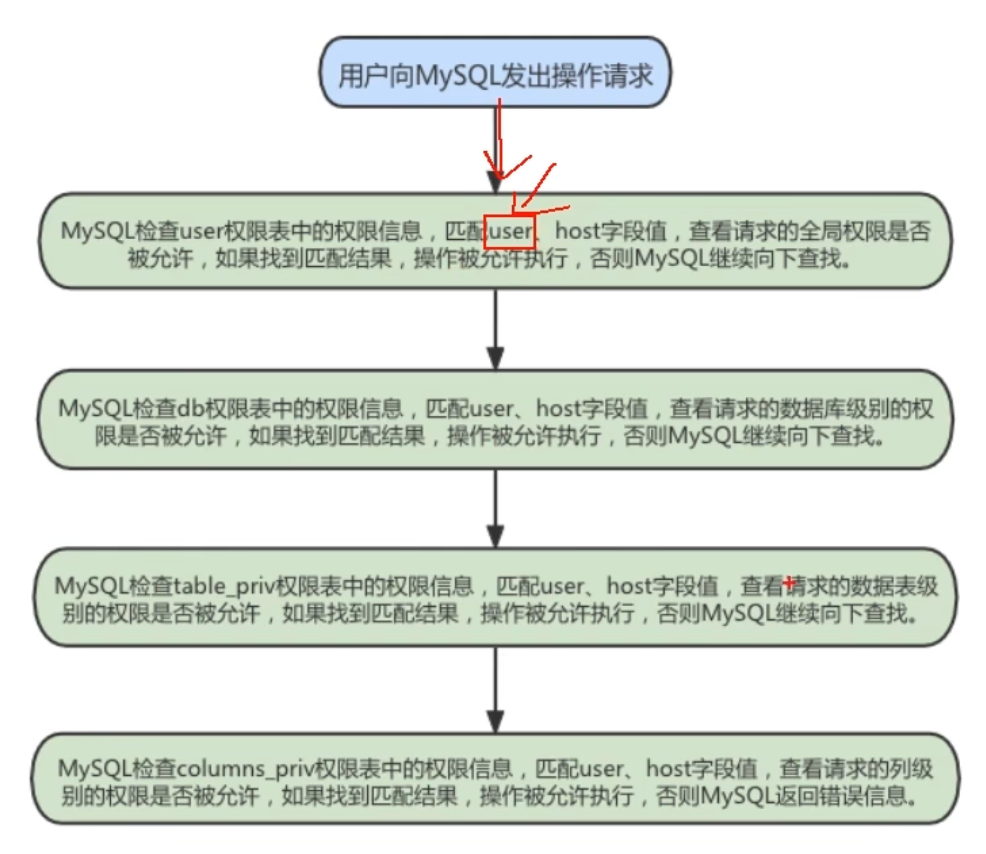

# 高级篇

# 6 MySQL架构篇

## 6.0 字符集

**常用操作**：

```mysql
#查看GBK字符集的比较规则
SHOW COLLATION LIKE 'gbk%';

#查看UTF-8字符集的比较规则
SHOW COLLATION LIKE 'utf8%';

#查看服务器的字符集和比较规则
SHOW VARIABLES LIKE '%_server';

#查看数据库的字符集和比较规则
SHOW VARIABLES LIKE '%_database';

#查看具体数据库的字符集
SHOW CREATE DATABASE 库名;

#修改具体数据库的字符集
ALTER DATABASE 库名 DEFAULT CHARACTER SET 'utf8' COLLATE 'utf8_general_ci';

#查看表的字符集
show create table 表名;

#查看表的比较规则(Collation这字段)
show table status from 库名 like '表名';

#修改表的字符集和比较规则
ALTER TABLE 表名 DEFAULT CHARACTER SET 'utf8' COLLATE 'utf8_general_ci';
```

请求到响应过程中字符集的变化


> 实际开发中，统一成utf8就没这么多事了。

客户端使用的字符集一致的情况，这样减少了很多无谓的字符集转换，为了方便我们设置，MySQL提供了一条非常简便的语句：

```mysql
SET NAMES 字符集名;
```

这一条语句产生的效果和我们执行这3条的效果是一样的：

```mysql
SET character_set_client = 字符集名;
SET character_set_connection = 字符集名;
SET character_set_results = 字符集名;
```

比方说我的客户端使用的是 `utf8` 字符集，所以需要把这几个系统变量的值都设置为 `utf8`：

```mysql
mysql> SET NAMES utf8;
```

另外，如果你想在启动客户端的时候就把 `character_set_client`、`character_set_connection`、`character_set_results`这三个系统变量的值设置成一样的，那我们可以在启动客户端的时候指定一个叫`default-character-set` 的启动选项，比如在配置文件里可以这么写：

```mysql
[client]
default-character-set=utf8
```

它起到的效果和执行一遍 `SET NAMES ut8` 是一样一样的，都会将那三个系统变量的值设置成`utf8`

***

## 6.1 sql_mode的合理设置

#### 6.1.7.1 宽松模式 vs 严格模式

（开发中都使用严格模式）

**宽松模式**：

如果设置的是宽松模式，那么我们在插入数据的时候，即便是给了一个错误的数据，也可能会被接受，并且不报错。

`举例`：我在创建一个表时，该表中有一个字段为name，给name设置的字段类型时`char(10)` ，如果我
在插入数据的时候，其中name这个字段对应的有一条数据的`长度超过了10`，例如’1234567890abc’，超过了设定的字段长度10，那么不会报错，并且取前10个字符存上，也就是说你这个数据被存为
了’1234567890’，而’abc’就没有了。但是，我们给的这条数据是错误的，因为超过了字段长度，但是并没有报错，并且mysql自行处理并接受了，这就是宽松模式的效果。

`应用场景` ：通过设置sql mode为宽松模式，来保证大多数sql符合标准的sql语法，这样应用在不同数据
库之间进行 `迁移` 时，则不需要对业务sql 进行较大的修改。

***

**严格模式**：

出现上面宽松模式的错误，应该报错才对，所以MySQL5.7版本就将sql_mode默认值改为了严格模式。所以在`生产等环境`中，我们必须采用的是严格模式，进而 `开发、测试环境`的数据库也必须要设置，这样在开发测试阶段就可以发现问题。并且我们即便是用的MySQL5.6，也应该自行将其改为严格模式。

`开发经验` ：MySQL等数据库总想把关于数据的所有操作都自己包揽下来（比如外键，我们可以不使用外键，在业务层自行判断就行），包括数据的校验，其实开发中，我们应该在自己 `开发的项目程序级别将这些校验给做了` ，虽然写项目的时候麻烦了一些步骤，但是这样做之后，我们在进行数据库迁移或者在项目的迁移时，就会方便很多。

***

#### 6.1.7.2 模式查看和设置

- 查看当前的sql_mode

```mysql
select @@session.sql_mode

select @@global.sql_mode

#或者
show variables like 'sql_mode';
```

- 临时设置方式：设置当前窗口中设置sql_mode

```mysql
SET GLOBAL sql_mode = 'modes...'; #全局

SET SESSION sql_mode = 'modes...'; #当前会话
```

- 举例

```mysql
#改为严格模式。此方法只在当前会话中生效，关闭当前会话就不生效了。
set SESSION sql_mode='STRICT_TRANS_TABLES'; 

#改为严格模式。此方法在当前服务中生效，重启MySQL服务后失效。
set GLOBAL sql_mode='STRICT_TRANS_TABLES'; 
```

- 永久设置方式：在/etc/my.cnf中配置sql_mode
  在my.cnf文件(windows系统是my.ini文件)，新增：

```mysql
[mysqld]
sql_mode=ONLY_FULL_GROUP_BY,STRICT_TRANS_TABLES,NO_ZERO_IN_DATE,NO_ZERO_DATE,ERROR_FOR
_DIVISION_BY_ZERO,NO_ENGINE_SUBSTITUTION
```

然后 `重启MySQL`。
当然生产环境上是禁止重启MySQL服务的，所以采用 `临时设置方式 + 永久设置方式` 来解决线上的问题，那么即便是有一天真的重启了MySQL服务，也会永久生效了。

***

#### 6.1.7.3 sql_mode常用值

下面列出MySQL中最重要的3种模式

|                            |                                                              |
| -------------------------- | ------------------------------------------------------------ |
| ONLY_FULL_GROUP_BY         | 对于GROUP BY聚合操作，如果在SELECT中的列，没有在GROUP BY中出现，那么这个SQL是不合法的，因为列不在GROUP BY从句中。 |
| NO_AUTO_VALUE_ON_ZERO      | 该值影响自增长列的插入。默认设置下，插入。或NULL代表生成下一个自增长值。如果用户 希望插入的值为0，而该列又是自增长的，那么这个选项就有用了 |
| `STRICT_TRANS_TABLES`      | 在该模式下，如果一个值不能插入到一个事务表中，则中断当前的操作，对非事务表不做限制。 |
| NO_ZERO_IN_DATE            | 在严格模式下，不允许日期和月份为零。                         |
| NO ZERO_ DATE              | 设置该值，mysql(数据库不允许插入零日期，插入零日期会抛出错误而不是警告。 |
| ERROR_FOR_DIVISION_BY_ZERO | 在INSERT或UPDATE过程中，如果数据被零除，则产生错误而非警告。如果未给出该模式，那么数据被零除时MySQL返回NULL |
| NO_AUTO_CREATE_USER        | 禁止GRANT创建密码为空的用户                                  |
| NO_ENGINE_SUBSTITUTION     | 如果需要的存储引擎被禁用或未编译，那么抛出错误。不设置此值时，用默认的存储引擎替代，并抛出一个异常。 |
| PIPES_AS_CONCAT            | 将"\|\|"视为字符串的连接操作符而非或运算符，这和Oracle数据库是一样的，也和字符串的拼接函数concat相类似 |
| ANSI_QUOTES                | 启用ANSI_QUOTES后，不能用双引号来引用字符串，因为它被解释为识别 |


***

## 6.2 MySQL的数据目录

***

## 6.3 用户与权限管理

### 6.3.1 用户管理

MySQL用户可以分为 `普通用户` 和`root用户`。root用户是超级管理员，拥有所有权限，包括创建用户、删除用户和修改用户的密码等管理权限；普通用户只拥有被授子的各种权限。

`MySQL提供了许多语句用来管理用户账号`，这些语句可以用来管理包括登录和退出MySQL服务器、创建用户、删除用户、密码管理和权限管理等内容.

`MySQL数据库的安全性需要通过账户管理来保证。`

#### 6.3.1.1 登录MySQL服务器

启动MySQL服务后，可以通过mysql命令来登录MySQL服务器，命令如下：

```mysql
mysql –h hostname|hostIP –P port –u username –p DatabaseName –e "SQL语句"
# 下面详细介绍命令中的参数：
# -h参数 后面接主机名或者主机IP，hostname为主机，hostIP为主机IP。
# -P参数 后面接MySQL服务的端口，通过该参数连接到指定的端口。MySQL服务的默认端口是3306，不使用该参数时自动连接到3306端口，port为连接的端口号。
# -u参数 后面接用户名，username为用户名。
# -p参数 会提示输入密码。
# DatabaseName参数 指明登录到哪一个数据库中。如果没有该参数，就会直接登录到MySQL数据库中，然后可以使用USE命令来选择数据库。
# -e参数 后面可以直接加SQL语句。登录MySQL服务器以后即可执行这个SQL语句，然后退出MySQL服务器

```

***

#### 6.3.1.2 创建用户

在MySQL数据库中，官方推荐使用：`CREATE USER`  语句创建新用户。MySQL 8版本移除了PASSWORD加密方法，因此不再推荐使用INSERT语句直接操作MySQL中的user表来增加用户。

使用CREATE USER语句来创建新用户时，`必须拥有CREATE USER权限`。每添加一个用户,，CREATE USER语句会在MySQL.user表中添加一条新记录，但是`新创建的账户没有任何权限`。如果添加的账户已经存在，CREATE USER语句就会返回一个错误。

CREATE USER语句的`基本语法`形式如下：

```mysql
CREATE USER 用户名 [IDENTIFIED BY '密码'][,用户名 [IDENTIFIED BY '密码']];
```

- 用户名参数表示新建用户的账户，由 `用户（User）` 和 `主机名（Host）` 构成；
- “[ ]”表示可选，也就是说，可以指定用户登录时需要密码验证，也可以不指定密码验证，这样用户可以直接登录。不过，不指定密码的方式不安全，不推荐使用。如果指定密码值，这里需要使用IDENTIFIED BY指定明文密码值。
- CREATE USER语句可以同时创建多个用户。

举例：

```mysql
create user 'zhang3' identified by 'Wxq3012@'; # 默认host是 %
CREATE USER 'zhang3'@'localhost' IDENTIFIED BY 'Wxq3012@';
CREATE USER 'li4'@'%' IDENTIFIED BY 'Wxq3012@';
```

```mysql
mysql> use mysql;
mysql> select host,user from user;
+-----------+---------------+
| host      | user          |
+-----------+---------------+
| %         | li4           |
| %         | zhang3        |
| localhost | mysql.session |
| localhost | mysql.sys     |
| localhost | root          |
| localhost | zhang3        |
+-----------+---------------+
6 rows in set (0.00 sec)

# 刚才创建的三个用户都已经存在了，user表中的user和host两个字段是联合主键。
```

```mysql
# 可以使用新账号登录
[root@VM-4-4-centos ~]# mysql -uzhang3 -pWxq3012@
mysql> show databases;
+--------------------+
| Database           |
+--------------------+
| information_schema |
+--------------------+
1 row in set (0.00 sec)
mysql>
```

只能看到一个库，说明新账号目前权限很小。

***

#### 6.3.1.3 修改用户（很少操作）

修改用户名：

```mysql
UPDATE mysql.user SET USER='wang5' WHERE USER='li4';
FLUSH PRIVILEGES; # 执行后，li4才能再次登录成功
或者
UPDATE mysql.user SET USER='xiao3' WHERE USER='zhang3' and host = '%';
FLUSH PRIVILEGES;
```

#### 6.3.1.4 删除用户

在MySQL数据库中，可以使用 `DROP USER` 语句来删除普通用户，也可以直接在mysql.user表中删除用户。

**方式1：使用DROP方式删除（推荐）**

使用DROP USER语句来删除用户时，必须用于DROP USER权限。DROP USER语句的基本语法形式如下：

```mysql
DROP USER user[,user]…;
```

举例：

```mysql
DROP USER wang5 ;                 # 默认删除host为%的用户
DROP USER 'zhang3'@'localhost';   # 指定删除host为localhost的用户
```

**方式2：使用DELETE方式删除（了解）**

```mysql
DELETE FROM mysql.user WHERE Host=’hostname’ AND User=’username’;
```

执行完DELETE命令后要使用FLUSH命令来使用户生效，命令如下：

```mysql
FLUSH PRIVILEGES;
```

> 注意：
> `不推荐`通过`DELETE FROM USER u WHERE USER='li4'` 进行删除，系统会有残留信息保留。而drop user命令会删除用户以及对应的权限，执行命令后你会发现mysql.user表和mysql.db表的相应记录都消失了。

***

#### 6.3.1.5 设置当前用户密码

适用于roo用户修改自己的密码，以及普通用户登录后修改自己的密码。

root用户拥有很高的权限，因此必须保证root用户的密码安全。root用户可以通过多种方式来修改密码，使用`ALTER USER` 修改用户密码是MySQL `官方推荐` 的方式。此外，也可以通过 `SET语句` 修改密码。由于MySQL s中巳移除了PASSWORD()函数，因此不再使用UPDATE语句直接操作用户表修改密码。

`旧的写法`如下 ：

```mysql
# 修改当前用户的密码：（MySQL5.7测试有效）
SET PASSWORD = PASSWORD('Wxq3015@');
```

这里介绍 `推荐的写法` ：

1. `使用ALTER USER命令来修改当前用户密码` 用户可以使用ALTER命令来修改自身密码，如下语句代表修改当前登录用户的密码。基本语法如下：

   ```mysql
   ALTER USER USER() IDENTIFIED BY 'new_password';
   ```

   举例

   ```mysql
   ALTER USER USER() IDENTIFIED BY 'Wxq3020@';
   ```

2. `使用SET语句来修改当前用户密码`

   使用root用户登录MySQL后，可以使用SET语句来修改密码，具体SQL语句如下：

   ```mysql
   SET PASSWORD='new_password';
   ```

   该语句会自动将密码加密后再赋给`当前用户`。

   举例

   ```mysql
   SET PASSWORD='Wxq3019@';
   ```

***

#### 6.3.1.6 修改其它用户密码

root用户不仅可以修改自己的密码，还可以修改其它普通用户的密码。root用户登录MySQL服务器后，可以通过`ALTER语句` 和 `SET语句` 来修改普通用户的密码。由于PASSWORD()函数已移除，因此使用UPDATE直接操作用户表的方式已不再使用。

1. `使用ALTER语句来修改普通用户的密码` 可以使用ALTER USER语句来修改普通用户的密码。基本语法形式如下：

   ```mysql
   ALTER USER user [IDENTIFIED BY '新密码']
   [,user[IDENTIFIED BY '新密码']]…;
   ```

   举例

   ```mysql
   alter user 'zhang3'@'localhost' identified by 'Wxq3065@';
   ```

2. `使用SET命令来修改普通用户的密码` 使用root用户登录到MySQL服务器后，可以使用SET语句来修改普通用户的密码。SET语句的代码如下：

   ```mysql
   SET PASSWORD FOR 'username'@'hostname'='new_password';
   ```

   举例

   ```mysql
   SET PASSWORD FOR 'zhang3'@'localhost'='Wxq4065@';
   ```

3. 使用`UPDATE语句`修改普通用户的密码（`不推荐`）

   ```mysql
   UPDATE MySQL.user SET authentication_string=PASSWORD("123456")
   WHERE User = "username" AND Host = "hostname";
   ```

#### 6.3.1.7 MySQL8密码管理(了解)

##### 6.3.1.7.1 密码过期策略

在MySQL中，数据库管理员可以 `手动设置` 账号密码过期，也可以建立一个 `自动` 密码过期策略。
过期策略可以是 `全局的`，也可以为 `每个账号` 设置单独的过期策略。

```mysql
ALTER USER user PASSWORD EXPIRE;
```

练习：

```mysql
ALTER USER 'kangshifu'@'localhost' PASSWORD EXPIRE;
```

**方式①：使用SQL语句更改该变量的值并持久化**

```mysql
SET PERSIST default_password_lifetime = 180; # 建立全局策略，设置密码每隔180天过期
```

**方式②：配置文件my.cnf中进行维护**

```mysql
[mysqld]
default_password_lifetime=180 #建立全局策略，设置密码每隔180天过期
```

**手动设置指定时间过期方式2：单独设置**

每个账号既可延用全局密码过期策略，也可单独设置策略。在 `CREATE USER` 和 `ALTER USER` 语句上加入 `PASSWORD EXPIRE` 选项可实现单独设置策略。下面是一些语句示例。

```mysql
#设置kangshifu账号密码每90天过期：
CREATE USER 'kangshifu'@'localhost' PASSWORD EXPIRE INTERVAL 90 DAY;
ALTER USER 'kangshifu'@'localhost' PASSWORD EXPIRE INTERVAL 90 DAY;
#设置密码永不过期：
CREATE USER 'kangshifu'@'localhost' PASSWORD EXPIRE NEVER;
ALTER USER 'kangshifu'@'localhost' PASSWORD EXPIRE NEVER;
#延用全局密码过期策略：
CREATE USER 'kangshifu'@'localhost' PASSWORD EXPIRE DEFAULT;
ALTER USER 'kangshifu'@'localhost' PASSWORD EXPIRE DEFAULT;
```

***

##### 6.3.1.7.2 密码重用策略

手动设置密码重用方式1：全局

- 方式①：使用SQL

```mysql
SET PERSIST password_history = 6; #设置不能选择最近使用过的6个密码
SET PERSIST password_reuse_interval = 365; #设置不能选择最近一年内的密码
```

- 方式②：my.cnf配置文件

```mysql
[mysqld]
password_history=6
password_reuse_interval=365
```

手动设置密码重用方式2：单独设置

```mysql
#不能使用最近5个密码：
CREATE USER 'kangshifu'@'localhost' PASSWORD HISTORY 5;
ALTER USER 'kangshifu'@'localhost' PASSWORD HISTORY 5;
#不能使用最近365天内的密码：
CREATE USER 'kangshifu'@'localhost' PASSWORD REUSE INTERVAL 365 DAY;
ALTER USER 'kangshifu'@'localhost' PASSWORD REUSE INTERVAL 365 DAY;
#既不能使用最近5个密码，也不能使用365天内的密码
CREATE USER 'kangshifu'@'localhost'
PASSWORD HISTORY 5
PASSWORD REUSE INTERVAL 365 DAY;
ALTER USER 'kangshifu'@'localhost'
PASSWORD HISTORY 5
PASSWORD REUSE INTERVAL 365 DAY;
```

***

### 6.3.2 权限管理

关于MySQL的权限简单的理解就是MySQL允许你做你权力以内的事情，不可以越界。比如只允许你执行SELECT操作，那么你就不能执行UPDATE操作。只允许你从某台机器上连接MySQL，那么你就不能从除那台机器以外的其他机器连接MySQL。

#### 6.3.2.1 权限列表

MySQL到底都有哪些权限呢？

```mysql
show privileges;
```

> （1）`CREATE和DROP权限` ，可以创建新的数据库和表，或删除（移掉）已有的数据库和表。如果将MySQL数据库中的DROP权限授予某用户，用户就可以删除MySQL访问权限保存的数据库。
>
> （2）`SELECT、INSERT、UPDATE和DELETE权限` 允许在一个数据库现有的表上实施操作。
> （3） `SELECT权限`只有在它们真正从一个表中检索行时才被用到。
>
> （4）`INDEX权限` 允许创建或删除索引，INDEX适用于已有的表。如果具有某个表的CREATE权限，就可以在CREATE TABLE语句中包括索引定义。
>
> （5） `ALTER权限` 可以使用ALTER TABLE来更改表的结构和重新命名表。
> （6） `CREATE ROUTINE权限` 用来创建保存的程序（函数和程序），ALTER ROUTINE权限用来更改和删除保存的程序，`EXECUTE权限` 用来执行保存的程序。
> （7） `GRANT权限` 允许授权给其他用户，可用于数据库、表和保存的程序。
>
> （8）`FILE权限` 使用户可以使用LOAD DATA INFILE和SELECT … INTO OUTFILE语句读或写服务器上的文件，任何被授予FILE权限的用户都能读或写MySQL服务器上的任何文件（说明用户可以读任何数据库目录下的文件，因为服务器可以访问这些文件）。

**MySQL的权限如何分布：**

| 权限分布 | 可能设置的权限                                               |
| -------- | ------------------------------------------------------------ |
| 表权限   | 'Select','Insert','Update','Delete','Create','Drop','Grant','References','index','Alter' |
| 列权限   | 'Select','Insert','Update','References'                      |
| 过程权限 | 'Execute','Alter','Routine','Grant'                          |

***

#### 6.3.2.2 授予权限的原则

权限控制主要是出于安全因素，因此需要遵循以下几个 `经验原则` ：

> 1、只授予能 `满足需要的最小权限` ，防止用户干坏事。比如用户只是需要查询，那就只给select权限就可以了，不要给用户赋予update、insert或者delete权限。
>
> 2、创建用户的时候 `限制用户的登录主机` ，一般是限制成指定IP或者内网IP段。
> 3、为每个用户`设置满足密码复杂度的密码` 。
> 4、 `定期清理不需要的用户` ，回收权限或者删除用户。

#### 6.3.2.3 授予权限

给用户授权的方式有 2 种，分别是通过把 `角色赋予用户给用户授权` 和 `直接给用户授权` 。用户是数据库的使用者，我们可以通过给用户授予访问数据库中资源的权限，来控制使用者对数据库的访问，消除安全隐患。

**授权命令**：

```mysql
GRANT 权限1,权限2,…权限n ON 数据库名称.表名称 TO 用户名@用户地址 [IDENTIFIED BY ‘密码口令’];
```

- 该权限如果发现没有该用户，则会直接新建一个用户。
- 给`zhang3`用户(密码Wxq4065@)用本地命令行方式，授予`dbtest1`这个库下的所有表的插删改查的权限

```mysql
GRANT SELECT,INSERT,DELETE,UPDATE ON dbtest1.* TO zhang3@localhost ;
```

- 授予通过网络方式登录的wu用户(没有该用户，则会直接新建一个用户) ，对所有库所有表的全部权限（那跟root唯一的区别是，该用户不能给别的用户赋予权限，只有root才可以），密码设为Wxq3012@。注意这里唯独不包括grant的权限

```mysql
# 已测试可用，但是最好执行后直接新建一个用户
GRANT ALL PRIVILEGES ON *.* TO 'wu'@'%' IDENTIFIED BY 'Wxq3012@'; 
```

- 如果需要赋予包括GRANT的权限，添加参数`WITH GRANT OPTION`这个选项即可，表示该用户可以将自己拥有的权限授权给别人。经常有人在创建操作用户的时候不指定WITH GRANT OPTION选项导致后来该用户不能使用GRANT命令创建用户或者给其它用户授权。

  比如上面给了`wu`账号全部权限，但没有赋予他能给其它账号授权的权限。如果添加参数`WITH GRANT OPTION`，那么wu也可以给其它账号赋予权限。


- 可以使用GRANT重复给用户添加权限，`权限叠加`，比如你先给用户添加一个SELECT权限，然后又给用户添加一个INSERT权限，那么该用户就同时拥有了 SELECT和INSERT权限。

>1）GRANT SELECT ON dbtest1.* TO zhang3@localhost ;
>
>2）GRANT INSERT ON dbtest1.* TO zhang3@localhost ;
>
>如果先执行上面第一条，再执行第二条，权限是追加，而不是覆盖，最终拥有权限 SELECT、INSERT

> 我们在开发应用的时候，经常会遇到一种需求，就是要根据用户的不同，对数据进行横向和纵向的分组。
>
> - 所谓横向的分组，就是指用户可以接触到的数据的范围，比如可以看到哪些表的数据；
> - 所谓纵向的分组，就是指用户对接触到的数据能访问到什么程度，比如能看、能改，甚至是删除。
>
> 比如：`GRANT 权限1,权限2,…权限n ON 数据库名称.表名称 TO 用户名@用户地址 [IDENTIFIED BY ‘密码口令’];`
>
> `数据库名称.表名称`就是横向的分组；
>
> `权限1,权限2,…权限n`就是纵向的分组；

***

#### 6.3.2.4 查看权限

- 查看`当前用户`权限

```mysql
SHOW GRANTS;
# 或
SHOW GRANTS FOR CURRENT_USER;
# 或
SHOW GRANTS FOR CURRENT_USER();
```

- 查看某用户的全局权限

```mysql
SHOW GRANTS FOR 'user'@'主机地址' ;
# 举例：root用户查看wu账号的权限
SHOW GRANTS FOR 'wu'@'%' ;
```

***

#### 6.3.2.5 收回权限

收回权限就是取消已经赋予用户的某些权限。**收回用户不必要的权限可以在一定程度上保证系统的安全性**。MySQL中使用 `REVOKE语句` 取消用户的某些权限。使用REVOKE收回权限之后，用户账户的记录将从db、host、tables_priv和columns_priv表中删除，但是用户账户记录仍然在user表中保存（删除user表中的账户记录使用DROP USER语句）。

**注意：在将用户账户从user表删除之前，应该收回相应用户的所有权限。**

- 收回权限命令

```mysql
REVOKE 权限1,权限2,…权限n ON 数据库名称.表名称 FROM 用户名@用户地址;
```

举例：

```mysql
#收回wu账号全库全表的所有权限
REVOKE ALL PRIVILEGES ON *.* FROM wu@'%';
#收回指定dbtest1库下的所有表的插删改查权限
REVOKE SELECT,INSERT,UPDATE,DELETE ON dbtest1.* FROM jing@'%';
```

- 注意： 须用户重新登录后才能生效

> 总结
>
> 有一些程序员喜欢使用 Root 超级用户来访问数据库，完全把 `权限控制`放在 `应用层面` 实现。这样当然也是可以的。但建议大家，尽量使用数据库自己的角色和用户机制来控制访问权限，不要轻易用Root 账号。因为 Root账号密码放在代码里面不安全，一旦泄露，数据库就会完全 `失去保护`。
>
> 而且，MysQL 的权限控制功能十分完善，应该尽量利用，可以提高效率，而且安全可靠。

***

### 6.3.3 权限表

MySQL服务器通过 `权限表` 来**控制用户对数据库的访问**，权限表存放在`mysql数据库`中。MySQL数据库系统会根据这些权限表的内容为每个用户赋子相应的权限。这些权限表中最重要的是 `user表、db表`。除此之外，还有`table-priv表`、`column-priv表` 和`proc-priv表`等。**在MySQL启动时，服务器将这些数据库表中权限信息的内容读入内存。**

```mysql
use mysql;
show tables;
desc user;  # 列出user表的字段信息
select host,user,authentication_string from user; # authentication_string是密码
```

#### 6.3.3.1 user表

user表是MySQL中最重要的一个权限表， `记录用户账号和权限信息` ，有49个字段。如下图：


*这些字段可以分成4类，分别是范围列（或用户列）、权限列、安全列和资源控制列。*

**范围列（或用户列）**

- host ： 表示连接类型
  - `%` 表示所有远程通过 TCP方式的连接
  - `IP 地址` 如 (192.168.1.2、127.0.0.1) 通过制定ip地址进行的TCP方式的连接
  - `机器名` 通过制定网络中的机器名进行的TCP方式的连接
  - `::1` IPv6的本地ip地址，等同于IPv4的 127.0.0.1
  - `localhost` 本地方式通过命令行方式的连接 ，比如mysql -u xxx -p xxx 方式的连接。
- user ： 表示用户名，同一用户通过不同方式链接的权限是不一样的。
- password ： 密码
  - 所有密码串通过 password(明文字符串) 生成的密文字符串。MySQL 8.0 在用户管理方面增加了角色管理，默认的密码加密方式也做了调整，由之前的 `SHA1` 改为了 `SHA2` ，不可逆 。同时加上 MySQL 5.7 的禁用用户和用户过期的功能，MySQL 在用户管理方面的功能和安全性都较之前版本大大的增强了。
  - mysql 5.7 及之后版本的密码保存到 `authentication_string` 字段中不再使用password 字段。

**权限列**

- Grant_priv字段
  表示是否拥有GRANT权限
- Shutdown_priv字段
  表示是否拥有停止MySQL服务的权限
- Super_priv字段
  表示是否拥有超级权限

- Execute_priv字段
  表示是否拥有EXECUTE权限。拥有EXECUTE权限，可以执行存储过程和函数。
- Select_priv , Insert_priv等
  为该用户所拥有的权限。

**安全列**

- 安全列只有6个字段，其中两个是ssl相关的（ssl_type、ssl_cipher），用于 `加密`；两个是x509相关的（x509_issuer、x509_subject），用于`标识用户` ；另外两个Plugin字段用于 `验证用户身份` 的插件，该字段不能为空。如果该字段为空，服务器就使用内建授权验证机制验证用户身份。

**资源控制列**

- 资源控制列的字段用来 限制用户使用的资源 ，包含4个字段，分别为：
  - ①max_questions，用户每小时允许执行的查询操作次数；
  - ②max_updates，用户每小时允许执行的更新操作次数；
  - ③max_connections，用户每小时允许执行的连接操作次数；
  - ④max_user_connections，用户允许同时建立的连接次数。
    查看字段：

***

#### 6.3.3.2 db表

该表记录某一用户是否拥有针对`某一数据库`的相关操作权限

使用DESCRIBE查看db表的基本结构：

```mysql
DESCRIBE mysql.db;
```

1. **用户列**
   db表用户列有3个字段，分别是Host、User、Db。这3个字段分别表示主机名、用户名和数据库名。表示从某个主机连接某个用户对某个数据库的操作权限，这`3个字段`的组合构成了db表的`主键`。
2. **权限列**
   Create_routine_priv和Alter_routine_priv这两个字段决定用户是否具有创建和修改存储过程的权限。

***

#### 6.3.3.3 tables_priv表和columns_priv表

tables_priv表用来 `对表设置操作权限` （用来记录用户对某一张表的权限），columns_priv表用来对表的 `某一列设置权限` （用来记录用户对某一列的权限）。tables_priv表和columns_priv表的结构分别如图：

```mysql
desc mysql.tables_priv;
```

tables_priv表有8个字段，分别是Host、Db、User、Table_name、Grantor、Timestamp、Table_priv和
Column_priv，各个字段说明如下：

- `Host 、 Db 、 User 和 Table_name` 四个字段分别表示主机名、数据库名、用户名和表名。
- Grantor表示修改该记录的用户。
- Timestamp表示修改该记录的时间。
- `Table_priv` 表示对象的操作权限。包括Select、Insert、Update、Delete、Create、Drop、Grant、References、Index和Alter。
- Column_priv字段表示对表中的列的操作权限，包括Select、Insert、Update和References。

```mysql
desc mysql.columns_priv;
```

***

#### 6.3.3.4 procs_priv表

procs_priv表可以对 `存储过程和存储函数设置操作权限` 

略。

### 6.3.4 访问控制(了解)

正常情况下，并不希望每个用户都可以执行所有的数据库操作 当MySQL 允许一个用户执行各种操作时，它将首先核实该用户向MySQL服务器发送的连接请求，然后确认用户的操作请求是否被允许。这个过程称为MysQL中的`访问控制过程`。MySQL的访问控制分为两个阶段：`连接核实阶段`和 `请求核实阶段`。

#### 6.3.4.1 连接核实阶段

当用户试图连接MySQL服务器时，服务器基于用户的身份以及用户是否能提供正确的密码验证身份来确定接受或者拒绝连接。即客户端用户会在连接请求中提供用户名、主机地址、用户密码，MySQL服务器接收到用户请求后，会`使用user表中的host、user和authentication_string这3个字段匹配客户端提供信息`。

服务器只有在user表记录的Host和User字段匹配客户端主机名和用户名，并且提供正确的密码时才接受连接。`如果连接核实没有通过，服务器就完全拒绝访问；否则，服务器接受连接，然后进入阶段2等待用户请求`。

#### 6.3.4.2 请求核实阶段 

一旦建立了连接，服务器就进入了访问控制的阶段2，也就是请求核实阶段。对此连接上进来的每个请求，服务器检查该请求要执行什么操作、是否有足够的权限来执行它，这正是需要授权表中的权限列发挥作用的地方。这些权限可以来自user、db、table_priv和column_priv表。

确认权限时，MySQL首先 `检查user表` ，如果指定的权限没有在user表中被授予，那么MySQL就会继续 `检查db表` ，db表是下一安全层级，其中的权限限定于数据库层级，在该层级的SELECT权限允许用户查看指定数据库的所有表中的数据；如果在该层级没有找到限定的权限，则MySQL继续 `检查tables_priv表` 以及 `columns_priv表` ，如果所有权限表都检查完毕，但还是没有找到允许的权限操作，MySQL将 返回错误信息 ，用户请求的操作不能执行，操作失败。请求核实的过程如图所示：**比如`user表`已经匹配到了，就不再往下查找，否则查找`db表`，以此类推。**



> 提示： MySQL通过向下层级的顺序（从user表到columns_priv表）检查权限表，但并不是所有的权限都要执行该过程。例如，一个用户登录到MySQL服务器之后只执行对MySQL的管理操作，此时只涉及管理权限，因此MySQL只检查user表。另外，如果请求的权限操作不被允许，MySQL也不会继续检查下一层级的表。

***

### 6.3.5 角色管理

#### 6.3.5.1 角色的理解-MySQL8.0.中引入

**角色是在MySQL8.0.中引入的新功能**。在MySQL中，`角色是权限的集合`，可以为角色添加或移除权限。用户可以被赋予角色，同时也被授予角色包含的权限。对角色进行操作需要较高的权限。并且像用户账户一样，角色可以拥有授予和撤消的权限。

引入角色的目的是 `方便管理拥有相同权限的用户` 。`恰当的权限设定，可以确保数据的安全性，这是至关重要的`。


***

#### 6.3.5.2 创建角色

创建角色使用 `CREATE ROLE` 语句，语法如下：

```mysql
CREATE ROLE 'role_name'[@'host_name'] [,'role_name'[@'host_name']]...
```

角色名称的命名规则和用户名类似。如果 `host_name省略，默认为% ， role_name不可省略` ，不可为空。

练习：我们现在需要创建一个经理的角色，就可以用下面的代码：

```mysql
CREATE ROLE 'manager'@'localhost';
```

***

#### 6.3.5.3 给角色赋予权限

创建角色之后，默认这个角色是没有任何权限的，我们需要给角色授权。给角色授权的语法结构是：

```mysql
GRANT privileges ON table_name TO 'role_name'[@'host_name'];
```

上述语句中privileges代表权限的名称，多个权限以逗号隔开。可使用SHOW语句查询权限名称，下图列出了部分权限列表。

```mysql
SHOW PRIVILEGES\G;
```

练习1：
我们现在想给经理角色授予商品信息表、盘点表和应付账款表的只读权限，就可以用下面的代码来实现：

```mysql
GRANT SELECT ON demo.settlement TO 'manager';
GRANT SELECT ON demo.goodsmaster TO 'manager';
GRANT SELECT ON demo.invcount TO 'manager';
```

***

#### 6.3.5.4 查看角色的权限

赋予角色权限之后，我们可以通过 SHOW GRANTS 语句，来查看权限是否创建成功了：

```mysql
mysql> SHOW GRANTS FOR 'manager';
+-------------------------------------------------------+
| Grants for manager@% |
+-------------------------------------------------------+
| GRANT USAGE ON *.* TO `manager`@`%` |
| GRANT SELECT ON `demo`.`goodsmaster` TO `manager`@`%` |
| GRANT SELECT ON `demo`.`invcount` TO `manager`@`%` |
| GRANT SELECT ON `demo`.`settlement` TO `manager`@`%` |
+-------------------------------------------------------+
```

只要你`创建了一个角色`，系统就会`自动默认`给你一个“ `USAGE` ”权限，意思是 `连接登录数据库的权限` 。代码的最后三行代表了我们给角色“manager”赋予的权限，也就是对商品信息表、盘点表和应付账款表的只读权限。

结果显示，库管角色拥有商品信息表的只读权限和盘点表的增删改查权限。

***

#### 6.3.5.5 回收角色的权限

角色授权后，可以对角色的权限进行维护，对权限进行添加或撤销。添加权限使用GRANT语句，与角色授权相同。撤销角色或角色权限使用REVOKE语句。修改了角色的权限，会影响拥有该角色的账户的权限。
撤销角色权限的SQL语法如下：

```mysql
REVOKE privileges ON tablename FROM 'rolename';
```

练习1：撤销school_write角色的权限。
（1）使用如下语句撤销school_write角色的权限。

```mysql
REVOKE INSERT, UPDATE, DELETE ON school.* FROM 'school_write';
```

（2）撤销后使用SHOW语句查看school_write对应的权限，语句如下。

```mysql
SHOW GRANTS FOR 'school_write';
```

***

#### 6.3.5.6 删除角色

当我们需要对业务重新整合的时候，可能就需要对之前创建的角色进行清理，删除一些不会再使用的角色。
删除角色的操作很简单，你只要掌握语法结构就行了。

```mysql
DROP ROLE role [,role2]...
```

注意， 如果你删除了角色，那么用户也就失去了通过这个角色所获得的所有权限 。

练习：执行如下SQL删除角色school_read。

```mysql
DROP ROLE 'school_read';
```

***

#### 6.3.5.7 给用户赋予角色

角色创建并授权后，要赋给用户并处于 `激活状态` 才能发挥作用。给用户添加角色可使用GRANT语句，语法形式如下：

```mysql
GRANT role [,role2,...] TO user [,user2,...];
```

在上述语句中，role代表角色，user代表用户。可将多个角色同时赋予多个用户，用逗号隔开即可。

练习：给kangshifu用户添加角色school_read权限。
（1）使用GRANT语句给kangshifu添加school_read权限，SQL语句如下

```mysql
GRANT 'school_read' TO 'kangshifu'@'localhost';
```

（2）添加完成后使用SHOW语句查看是否添加成功，SQL语句如下。

```mysql
SHOW GRANTS FOR 'kangshifu'@'localhost';
```

（3）使用kangshifu用户登录，然后查询当前角色，如果角色未激活，结果将显示NONE。SQL语句如下。

```mysql
SELECT CURRENT_ROLE();
```

***

#### 6.3.5.8 激活角色

**方式1：使用set default role 命令激活角色**

举例：

```mysql
SET DEFAULT ROLE ALL TO 'kangshifu'@'localhost';
```

举例：使用 SET DEFAULT ROLE 为下面4个用户默认激活所有已拥有的角色如下：

```mysql
SET DEFAULT ROLE ALL TO
 'dev1'@'localhost',
 'read_user1'@'localhost',
 'read_user2'@'localhost',
 'rw_user1'@'localhost';
```

**方式2：将activate_all_roles_on_login设置为ON**

- 默认情况：

```mysql
mysql> show variables like 'activate_all_roles_on_login';
+-----------------------------+-------+
| Variable_name        | Value |
+-----------------------------+-------+
| activate_all_roles_on_login | OFF  |
+-----------------------------+-------+
1 row in set (0.00 sec)
```

- 设置：

```mysql
SET GLOBAL activate_all_roles_on_login=ON;
```

这条 SQL 语句的意思是，对 `所有角色永久激活` 。运行这条语句之后，用户才真正拥有了赋予角色的所有权限。

***

#### 6.3.5.9 撤销用户的角色

撤销用户角色的SQL语法如下：

```mysql
REVOKE role FROM user;
```

练习：撤销kangshifu用户的school_read角色。
（1）撤销的SQL语句如下

```mysql
REVOKE 'school_read' FROM 'kangshifu'@'localhost';
```

（2）撤销后，执行如下查询语句，查看kangshifu用户的角色信息

```mysql
SHOW GRANTS FOR 'kangshifu'@'localhost';
```

执行发现，用户kangshifu之前的school_read角色已被撤销。

***

#### 6.3.5.10 设置强制角色(mandatory role)

**方式1：服务启动前设置**

```mysql
[mysqld]
mandatory_roles='role1,role2@localhost,r3@%.atguigu.com'
```

**方式2：运行时设置**

```mysql
SET PERSIST mandatory_roles = 'role1,role2@localhost,r3@%.example.com';  #系统重启后仍然有效
SET GLOBAL mandatory_roles = 'role1,role2@localhost,r3@%.example.com';  #系统重启后失效
```

***

### 6.3.6 配置文件的使用

#### 6.3.6.1 配置文件格式

与在命令行中指定启动选项不同的是，配置文件中的启动选项被划分为若干个组，每个组有一个组名，用中括号 `[] `扩起来，像这样：

`vim /etc/my.cnf`

```properties
[server]
(具体的启动选项...)
[mysqld]
(具体的启动选项...)
[mysqld_safe]
(具体的启动选项...)
[client]
(具体的启动选项...)
[mysql]
(具体的启动选项...)
[mysqladmin]
(具体的启动选项...)
```

略。

***

## 6.4 逻辑架构

### 6.4.1 逻辑架构分析

#### 6.4.1.1 服务器处理客户端请求

首先 MysQL 是典型的C/S 架构，即`CIient /server `架构，，服务器端程序使用的`mysqld`。

不论客户端进程和服务器进程是采用哪种方式进行通信，最后实现的效果都是：**客户端进程向服务器进程发送一段文本（SQL语句），服务器进程处理后再向客户端进程发送一段文本（处理结果）**

那服务器进程对客户端进程发送的请求做了什么处理，才能产生最后的处理结果呢？这里以查询请求为例展示：


下面具体展开看一下：


`SQL Interface`：接收SQL指令，返回查询结果

`Parser解析器`：语法解析、语义解析，生成语法树

`Optimizer优化器`：核心组件，对SQL进行优化，比如能否使用索引等

`Caches查询缓存`（MySQL8.0已经移除）：以Key-Value方式缓存结果，如果两次查询SQL完全一致（包括空格），就使用已经缓存过的

#### 6.4.1.2 Connectors

Connectors，指的是不同语言中与SQL的交互。MySQL首先是一个网络程序，在TCP之上定义了自己的应用层协议。所以要使用MySQL，我们可以编写代码，跟MySQL Server建立`TCP连接`，之后按照其定义好的协议进行交互。或者比较方便的办法是调用SDK，比如Native C AP、JDBC、PHP等各语言MySQL Connector， 或者通过ODBC。 **但通过SDK来访问MySQL，本质上还是在TCP连接上通过MysQL协议跟MysQL进行交互。**

接下来的MySQL Server结构可以分为如下的三层：

#### 6.4.1.3 第一层：连接层 

系统（客户端）访问 `MySQL` 服务器前，做的第一件事就是建立 `TCP` 连接。
经过三次握手建立连接成功后， `MySQL` 服务器对 `TCP` 传输过来的账号密码做身份认证、权限获取。

- **用户名或密码不对，会收到一个Access denied for user错误，客户端程序结束执行**
- **用户名密码认证通过，会从权限表查出账号拥有的权限与连接关联，之后的权限判断逻辑，都将依赖于此时读到的权限**

接着我们来思考一个问题

一个系统只会和MySQL服务器建立一个连接吗？只能有一个系统和MySQL服务器建立连接吗？

当然不是，多个系统都可以和MySQL服务器建立连接，每个系统建立的连接肯定不止一个。所以，为了解決TCP无限创建与TCP频繁创建销毀带来的资源耗尽、性能下降问题。MySQL服务器里有专门的`TCP连接池`限制连接数，采用`长连接模式` 复用TCP连接，来解决上述问题。

`TCP` 连接收到请求后，必须要分配给一个线程专门与这个客户端的交互。所以还会有个`线程池`，去走后
面的流程。每一个连接从线程池中获取线程，省去了创建和销毁线程的开销。

这些内容我们都日纳到 MySQL 的`连接管理`组件中。

所以`连接管理`的职责是负责认证、管理连接、获取权限信息

***

#### 6.4.1.4 第二层：服务层

第二层架构主要完成大多数的核心服务功能，如SQL接口，并完成`缓存的查询`，SQL的分析和优化及部分内置函数的执行。所有跨存储引擎的功能也在这一层实现，如过程、函数等。

在该层，服务器会 `解析查询` 并创建相应的内部`解析树`，并对其完成相应的`优化`：如确定查询表的顺序，是否利用索引等，最后生成相应的执行操作。

如果是SELECT语句，服务器还会 `查询内部的缓存`。如果缓存空间足够大，这样在解决大量读操作的环境中能够很好的提升系统的性能。

- **SQL Interface: SQL接口**

  - 接收用户的SQL命令，并且返回用户需要查询的结果。比如SELECT … FROM就是调用SQLInterface
  - MySQL支持DML（数据操作语言）、DDL（数据定义语言）、存储过程、视图、触发器、自定义函数等多种SQL语言接口

- **Parser: 解析器**

  - 在解析器中对 SQL 语句进行`语法分析`、`语义分析`。将SQL语句分解成数据结构，并将这个结构传递到后续步骤，以后SQL语句的传递和处理就是基于这个结构的。如果在分解构成中遇到错误，那么就说明这个SQL语句是不合理的。
  - 在SQL命令传递到解析器的时候会被解析器验证和解析，并为其创建`语法树` ，并根据数据字典丰富查询语法树，会 `验证`该客户端是否具有执行该查询的`权限` 。创建好语法树后，MySQL还会对SQl查询进行语法上的优化，进行查询重写。

- **Optimizer: 查询优化器**

  - SQL语句在语法解析之后、查询之前会使用查询优化器确定 SQL 语句的执行路径，生成一个`执行计划` 
  - 这个执行计划表明应该 `使用哪些索引` 进行查询（全表检索还是使用索引检索），表之间的连接顺序如何，最后会按照执行计划中的步骤调用存储引擎提供的方法来真正的执行查询，并将查询结果返回给用户。
  - 它使用“`选取-投影-连接` ”策略进行查询。例如

  ```mysql
  SELECT id,name FROM student WHERE gender = '女';
  ```

  - 这个SELECT查询先根据WHERE语句进行`选取` ，而不是将表全部查询出来以后再进行gender过滤。 这个SELECT查询先根据id和name进行属性 `投影` ，而不是将属性全部取出以后再进行过滤，将这两个查询条件 `连接`起来生成最终查询结果。

- **Caches & Buffers： 查询缓存组件**

  - MySQL内部维持着一些Cache和Buffer，比如Query Cache用来缓存一条SELECT语句的执行结果，如果能够在其中找到对应的查询结果，那么就不必再进行查询解析、优化和执行的整个过程了，直接将结果反馈给客户端。
  - 这个缓存机制是由一系列小缓存组成的。比如表缓存，记录缓存，key缓存，权限缓存等 。
  - 这个查询缓存可以在 `不同客户端之间共享` 。
  - 从MySQL 5.7.20开始，不推荐使用查询缓存，并在 `MySQL 8.0中删除` 。

#### 6.4.1.5 第三层：引擎层

和其它数据库相比，MySQL有点与众不同，它的架构可以在多种不同场景中应用并发挥良好作用，主要体现在存储引擎的架构上，`插件式的存储引擎` 架构将查询处理和其它的系统任务以及数据的存储提取相分离。这种架构可以根据业务的需求和实际需要选择合适的存储引擎。同时开源的MySQL 还允许 `开发人员设置自己的存储引擎`。

这种高效的模块化架构为那些希望专门针对特定应用程序需求 （例如数据仓库、事务处理或高可用性情况）的人提供了巨大的好处，同时享受使用一组独立于任何接口和服务的优势存储引擎

插件式存储引擎层（ Storage Engines），`真正的负责了MySQL中数据的存储和提取，对物理服务器级别维护的底层数据执行操作`，服务器通过API与存储引擎进行通信。不同的存储引擎具有的功能不同，这样我们可以根据自己的实际需要进行选取。

查询存储引擎指令：`show engines;`

***

#### 6.4.1.6 存储层

所有的数据，数据库、表的定义，表的每一行的内容，索引，都是存在 `文件系统` 上，以`文件` 的方式存在的，并完成与存储引擎的交互。当然有些存储引擎比如InnoDB，也支持不使用文件系统直接管理裸设备，但现代文件系统的实现使得这样做没有必要了。在文件系统之下，可以使用本地磁盘，可以使用DAS、NAS、SAN等各种存储系统。

#### 6.4.1.7 小结

以上简化如下：


简化为三层结构：

1. 连接层：客户端和服务器端建立连接，客户端发送 SQL 至服务器端；
2. SQL 层（服务层）：对 SQL 语句进行查询处理；与数据库文件的存储方式无关；
3. 存储引擎层：与数据库文件打交道，负责数据的存储和读取。

***

### 6.4.2 SQL执行流程

#### 6.4.2.1 MySQL 中的SQL执行流程


**MySQL的查询流程**：

1. **查询缓存**：Server 如果在查询缓存中发现了这条 SQL 语句，就会直接将结果返回给客户端；如果没有，就进入到解析器阶段。需要说明的是，因为查询缓存往往效率不高，所以在 MySQL8.0 之后就抛弃了这个功能。

查询缓存是提前把查询结果缓存起来，这样下次不需要执行就可以直接拿到结果。需要说明的是，在MySQL 中的查询缓存，不是缓存查询计划，而是查询对应的结果。这就意味着查询匹配的 `鲁棒性大大降低` ，只有 `相同的查询操作才会命中查询缓存` 。两个查询请求在任何字符上的不同（例如：空格、注释、大小写），都会导致缓存不会命中。因此 MySQL 的 查询缓存命中率不高 。

同时，如果查询请求中包含某些系统函数、用户自定义变量和函数、一些系统表，如 mysql 、information_schema、 performance_schema 数据库中的表，那这个请求就不会被缓存。以某些系统函数举例，可能同样的函数的两次调用会产生不一样的结果，比如函数 `NOW`，每次调用都会产生最新的当前时间，如果在一个查询请求中调用了这个函数，那即使查询请求的文本信息都一样，那不同时间的两次查询也应该得到不同的结果，如果在第一次查询时就缓存了，那第二次查询的时候直接使用第一次查询的结果就是错误的！

此外，既然是缓存，那就有它 `缓存失效的时候` 。MySQL的缓存系统会监测涉及到的每张表，只要该表的结构或者数据被修改，如对该表使用了`INSERT 、 UPDATE 、 DELETE 、 TRUNCATE TABLE 、 ALTER TABLE 、 DROP TABLE 或 DROP DATABASE 语句`，那使用该表的所有高速缓存查询都将变为无效并从高速缓存中删除！对于 `更新压力大的数据库` 来说，查询缓存的`命中率会非常低`。

MySQL也提供了这种`按需使用`的方式。你可以将my.conf参数query_cache_type设置成DEMAND，代表当sql语句中有SQL_CACHE关键字时才缓存。比如：

```mysql
#query_cache_type有三个值 0代表关闭查询缓存，1代表开启，2 DEMAND
query_cache_type=2
```

这样对于默认的SQL语句都不使用查询缓存。而对于你确定要使用查询缓存的语句，可以用 SQL_CACHE 显式指定，像下面这个语句一样：

```mysql
select SQL_CACHE * from test where ID=5;
```

查看缓存是否开启：明显mysql5.7默认也是没有开启的

```mysql
show variables like '%query_cache_type';
+------------------+-------+
| Variable_name    | Value |
+------------------+-------+
| query_cache_type | OFF   |
+------------------+-------+
1 row in set (0.00 sec)
```

监控查询缓存的命中率：

```mysql
show status like '%Qcache%'
```


***

2. **解析器**：在解析器中对 SQL 语句进行`语法分析`、`语义分析`。


如果没有命中查询缓存，就要开始真正执行语句了。首先，MySQL 需要知道你要做什么，因此需要对 SQL语句做解析。SQL语句的分析分为词法分析与语法分析。

分析器先做`词法分析`。你输入的是由多个字符串和空格组成的一条 SQL 语句，MySQL 需要识别出里面的字符串分别是什么，代表什么。`【简单理解就是检查出那些是关键字，那些是表名等】`

MySQL 从你输入的"select"这个关键字识别出来，这是一个查询语句。它也要把字符串“T"识别成表名T”，把字符串“D”识别成“列ID”。

接着，要做“ `语法分析` ”。根据词法分析的结果，语法分析器（比如：Bison）会根据语法规则，判断你输入的这个 SQL 语句是否 `满足 MySQL 语法` 。`【可能关键字表名等写的都对，但是合在一起语法错误了】`

如果你的语句不对，就会收到 You have an error in your SQL syntax 的错误提醒，比如语句 from 写成了"rom”。

如果SQL语句正确，则会生成一个这样的`语法树`：


下图是SQL词法分析的过程步骤：


至此我们解析器的工作任务也基本圆满了，接下来进入到优化器。

***

3. **优化器**：到这里，其实已经知道SQL要执行什么操作了，在优化器中会确定 SQL 语句的执行路径，比如是根据 `全表检索` ，还是根据 `索引检索`等。
   举例：如下语句是执行两个表的 join：

```mysql
select * from test1 join test2 using(ID)
where test1.name='zhangwei' and test2.name='mysql高级课程';
```

> `方案1`：可以先从表 test1 里面取出 name='zhangwei’的记录的 ID 值，再根据 ID 值关联到表 test2
> 再判断 test2 里面 name的值是否等于 ‘mysql高级课程’。
> `方案2`：可以先从表 test2 里面取出 name=‘mysql高级课程’ 的记录的 ID 值，再根据 ID 值关联到 test1，再判断 test1 里面 name的值是否等于 zhangwei。这两种执行方法的逻辑结果是一样的，但是执行的效率会有不同，而优化器的作用就是决定选择使用哪一个方案。优化器阶段完成后，这个语句的执行方案就确定下来了，然后进入执行器阶段。
>
> 如果你还有一些疑问，比如优化器是怎么选择索引的，有没有可能选择错等。后面讲到索引我们再谈。

在查询优化器中，可以分为 `逻辑查询` 优化阶段和 `物理查询` 优化阶段

- 物理查询优化则是通过 `索引`和 `表连接方式` 等技术来进行优化，这里重点需要掌握索引的使用。
- 逻辑查询优化就是通过 SQL `等价变换` 提升查询效率，直白一点就是说，换一种查询写法执行效率可能更高(比如子查询能否改成多表查询呢，因为多表查询比子查询效率更高)

4. **执行器**：
   截止到现在，还没有真正去读写真实的表，仅仅只是产出了一个执行计划。于是就进入了 `执行器阶段` 。

在执行之前需要判断该用户是否 `具备权限` 。如果没有，就会返回权限错误。如果具备权限，就执行 SQL查询并返回结果。在 MySQL8.0 以下的版本，如果设置了查询缓存，这时会将查询结果进行缓存。

```mysql
select * from test where id=1;
```

比如：表 test 中，ID 字段没有索引，那么执行器的执行流程是这样的：

> 调用 InnoDB 引擎接口取这个表的第一行，判断 ID 值是不是1，如果不是则跳过，如果是则将这行存在`结果集`中；调用引擎接口取“下一行”，重复相同的判断逻辑，直到取到这个表的最后一行。
> 执行器将上述遍历过程中所有满足条件的行组成的记录集作为结果集返回给客户端。

至此，这个语句就执行完成了。对于有索引的表，执行的逻辑也差不多。

SQL 语句在 MySQL 中的流程是：**SQL语句→查询缓存→解析器→优化器→执行器。**


***

#### 6.4.2.2 MySQL8 中SQL执行原理

*profiling 为记录你执行sql的详细记录*

**①确认profiling 是否开启**

```mysql
mysql> select @@profiling;
mysql> show variables like 'profiling';
```


profiling=0 代表关闭，我们需要把 profiling 打开，即设置为 1：

```mysql
mysql> set profiling=1;
```

**②多次执行相同SQL查询**

然后我们`执行两次`下面的 SQL 查询（你可以执行任何一个 SQL 查询）：

```mysql
mysql> select * from employees;
```

**③查看profiles**

查看当前会话所产生的所有 profiles：

```mysql
mysql> show profiles;  # 显示最近的几次查询语句
```


Query_ID=6,Query_ID=7代表的就是上面执行了两次的SQL，Duration代表耗时。

- `show profiles`展示的是简要的耗时信息，如果想了解某个SQL的具体耗时情况，执行`show profile` 查看。

**④查看profile**
显示执行计划，查看程序的执行步骤：

```mysql
mysql> show profile;
```


Duration是时间，比如上图 preparing 这个准备步骤用的时间是 0.000031，我们平时开发如果遇到查询慢的语句，`可以通过这个命令查询具体哪个步骤耗时长，然后进行优化`。

当然你也可以查询指定的 Query ID，比如：查看Query_ID=6 这条语句的具体耗时情况。

```mysql
mysql> show profile for query 6;
```

#### 6.4.2.3 MySQL5.7 中SQL执行原理

上述MySQL8.0的两次SQL查询操作在MySQL5.7中测试，发现前后两次相同的sql语句，执行的查询过程仍然是相同的（show profile;后展示的详细耗时相同）。

不是会使用缓存吗？这里我们需要 `显式开启查询缓存模式` 。在MySQL5.7中如下设置：

**① 配置文件中开启查询缓存**
在 /etc/my.cnf 中新增一行：

```mysql
query_cache_type=1
```

**②重启mysql服务**

```mysql
systemctl restart mysqld
```

**③开启查询执行计划**

由于重启过服务，需要重新执行如下指令，开启profiling。

```mysql
mysql> set profiling=1;
```

**④执行语句两次**

```mysql
mysql> select * from locations;
mysql> select * from locations;
```

**⑤查看profiles**


**⑥查看profile**

显示执行计划，查看程序的执行步骤：

```mysql
mysql> show profile for query 1;
```


```mysql
mysql> show profile for query 2;
```


结论不言而喻。执行编号2时，比执行编号1时少了很多信息，从截图中可以看出查询语句直接从缓存中获取数据。

可以查询其它信息，cpu,block,io：

```mysql
mysql>show profile cpu,block io for query 7;
```


除了查看CPU，IO阻塞等参数情况，还可以查询下列参数的利用情况。


### 6.4.3 数据库缓冲池

`InnoDB` 存储引擎是以页为单位来管理存储空间的，我们进行的增删改查操作其实本质上都是在访问页面（包括读页面、写页面、创建新页面等操作）。而磁盘 I/O 需要消耗的时间很多，而在内存中进行操作，效率则会高很多，为了能让数据表或者索引中的数据随时被我们所用，DBMS 会申请 `占用内存来作为数据缓冲池` ，在真正访问页面之前，需要把在磁盘上的页缓存到内存中的 `Buffer Pool`之后才可以访问。

这样做的好处是可以让磁盘活动最小化，从而 `减少与磁盘直接进行 I/O 的时间` 。要知道，这种策略对提升 SQL 语句的查询性能来说至关重要。如果索引的数据在缓冲池里，那么访问的成本就会降低很多。

#### 6.4.3.1 缓冲池 vs 查询缓存

**缓冲池和查询缓存是一个东西吗？不是。**

**①缓冲池（Buffer Pool）**
首先我们需要了解在 InnoDB 存储引擎中，缓冲池都包括了哪些。

在 InnoDB 存储引擎中有一部分数据会放到内存中，缓冲池则占了这部分内存的大部分，它用来存储各种数据的缓存，如下图所示：


从图中，你能看到 InnoDB 缓冲池包括了数据页、索引页、插入缓冲、锁信息、自适应 Hash 和数据字典信息等。

**缓存池的重要性：**

对于使用 `InnoDB` 作为存储引擎的表来说，不管是用于存储用户数据的索引（包括聚族索引和二级索引），还是各种系统数据，都是以`页` 的形式存放在 `表空间` 中的，而所谓的表空间只不过是InnoDB对文件系统上一个或几个实际文件的抽象，也就是说我们的数据说到底还是存储在磁盘上的。但是各位也都知道，磁盘的速度慢的跟乌龟一样，怎么能配得上`“快如风。疾如电”`的CPU 呢？这里，缓冲池可以帮助我们消除CPU和磁盘之间的`鸿沟`。所以InnoDB存储引擎在处理客户端的请求时，当需要访问某个页的数据时，就会把 `完整的页的数据全部加载到内存中`，也就是说即使我们只需要访问一个页的一条记录，那也需要先把整个页的数据加載到内存中。将整个页加载到內存中后就可以进行读写访问了，在进行完读写访问之后并不着急把该页对应的内存空间释放掉，而是将其缓存起来，这样将来有请求再次访问该页面时，就可以 `省去磁盘IO` 的开销了。

**缓存原则**：

`“ 位置 * 频次 ”`这个原则，可以帮我们对 I/O 访问效率进行优化。
首先，位置决定效率，提供缓冲池就是为了在内存中可以直接访问数据。

其次，频次决定优先级顺序。因为缓冲池的大小是有限的，比如磁盘有 200G，但是内存只有 16G，缓冲池大小只有 1G，就无法将所有数据都加载到缓冲池里，这时就涉及到优先级顺序，会 `优先对使用频次高的热数据进行加载` 。

**缓冲池的预读特性：**

了解了缓冲池的作用之后，我们还需要了解缓冲池的另一个特性：`预读`。

缓冲池的作用就是提升 IO 效率，而我们进行读取数据的时候存在一个“局部性原理”，也就是说我们使用了一些数据， `大概率还会使用它周围的一些数据`，因此采用“预读”的机制提前加载，可以减少未来可能的磁盘 IO操作。

**②查询缓存**
那么什么是查询缓存呢？
查询缓存是提前把 `查询结果缓存` 起来，这样下次不需要执行就可以直接拿到结果。需要说明的是，在MySQL 中的查询缓存，不是缓存查询计划，而是查询对应的结果。
因为命中条件苛刻，而且只要数据表发生变化，查询缓存就会失效，因此命中率低。

#### 6.4.3.2 缓冲池如何读取数据

缓冲池管理器会尽量将经常使用的数据保存起来，在数据库进行页面读操作的时候，`首先会判断该页面是否在缓冲池中，如果存在就直接读取`，如果不存在，就会通过内存或磁盘将页面存放到缓冲池中再进行读取。缓存在数据库中的结构和作用如下图所示：


*如果我们执行 SQL 语句的时候更新了缓存池中的数据，那么这些数据会马上同步到磁盘上吗？*

实际上，当我们对数据库中的记录进行修改的时候，首先会修改缓冲池中页里面的记录信息，然后数据库会以`一定的频率刷新`到磁盘上。注意并不是每次发生更新操作，都会立刻进行磁盘回写。缓冲池会采用一种叫做`checkpoint 的机制`将数据回写到磁盘上，这样做的好处就是提升了数据库的整体性能。

比如，当`缓冲池不够用`时，需要释放掉一些不常用的页，此时就可以强行采用checkpoint 的方式，将不常用的脏页回写到磁盘上，然后再从缓冲池中将这些页释放掉。这里脏页(dirty page）指的是缓冲池中被修改过的页，与磁盘上的数据页不一致。

#### 6.4.3.3 查看/设置缓冲池的大小

如果你使用的是MySQL MySAM存储引擎，它只缓存索引，不缓存数据，对应的键缓存参数为 `key_buffer_size`，你可以用它查看。

如果你使用的是 InnoDB 存储引擎，可以通过查看` innodb_buffer_pool_size` 变量来查看缓冲池的大小。命令如下：

```mysql
show variables like 'innodb_buffer_pool_size';
```

```mysql
mysql> show variables like 'innodb_buffer_pool_size';
+-------------------------+-----------+
| Variable_name           | Value     |
+-------------------------+-----------+
| innodb_buffer_pool_size | 134217728 |
+-------------------------+-----------+
1 row in set (0.00 sec)
```

你能看到此时 InnoDB 的缓冲池大小只有 134217728/1024/1024=128MB。我们可以修改缓冲池大小，比如改为256MB，方法如下：

```mysql
set global innodb_buffer_pool_size = 268435456;
```

或者`配置文件`：

```mysql
[server]
innodb_buffer_pool_size = 268435456
```

***

#### 6.4.3.4 多个Buffer Pool实例（缓冲池）

Buffer Pool本质是InnoDB向操作系统申请的一块 `连续的内存空间`，在多线程环境下，访问Buffer Pool中的数据都需要`加锁`处理。在Bufer Pool 特别大而且多线程并发访问特别高的情况下，单一的Buffer Pool 可能会影响请求的处理速度。所以在Buffer Pool 特别大的时候，我们可以把它们`拆分成若干个小的Buffer Pool`，每个Buffer Pool 都称为一个`实例`，它们都是独立的，独立的去申请内存空间，独立的管理各种链表。所以在多线程并发访问时并不会相互影响，从而提高并发处理能力。

我们可以在服务器启动的时候通过设置` innodb_buffer_pool_instances` 的值来修改Buffer Pool实例的个数，比方说这样：

```mysql
[server]
innodb_buffer_pool_instances = 2
```

这样就表明我们要创建2个 `Buffer Pool`实例。

我们看下如何查看缓冲池的个数，使用命令：

```mysql
show variables like 'innodb_buffer_pool_instances';
```

那每个 `Buffer Pool` 实例实际占多少内存空间呢？其实使用这个公式算出来的：

```mysql
innodb_buffer_pool_size/innodb_buffer_pool_instances
```

也就是总共的大小除以实例的个数，结果就是每个`Buffer Pool`实例占用的大小。

不过也不是说Buffer Pool实例创建的越多越好，`分别管理各个Buffer Pool也是需要性能开销`的，InnoDB规定：当 innodb_butfer_pool_size的的值小于`1G`的时候设置多个实例是无效的，InnoDB会默以把 innodb_buffer_pool_instances 的值修改为1。而我们鼓励在Buffer Pool大于或等于1G的时候设置多个Buffer Pool实例。

***

#### 6.4.3.5 引申问题

Buffer Pool是MySQL内存结构中十分核心的一个组成，你可以先把它想象成一个黑盒子。

**黑盒下的更新数据流程**

当我们查询数据的时候，会先去Buffer Pool中查询。如果Buffer Pool中不存在，存储引擎会先将数据从磁盘加载到 Buffer Pool中，然后将数据返回给客户端;同理，当我们更新某个数据的时候，如果这个数据不存在于BufferPool，同样会先将数据加载进来，然后修改内存的数据。被修改过的数据会在之后统一刷入磁盘


这个过程看似没啥问题，实则是有问题的。假设我们修改Buffer Pool中的数据成功，但是还没来得及将数据刷入磁盘MySQL就挂了怎么办？按照上图的逻辑，此时更新之后的数据只存在于Buffer Pool中，如果此时MySQL宕机了，这部分数据将会永久地丢失；

再者，我更新到一半突然发生错误了，想要回滚到更新之前的版本，该怎么办？连数据持久化的保证、事务回滚都做不到还谈什么崩溃恢复？

答案：`Redo Log & Undo Log`

***

## 6.5 存储引擎

为了管理方便，人们把 `连接管理`、`查询缓存`、`语法解析`、 `查询优化` 这些并不涉及真实数据存储的功能划分为 `MySQL server` 的功能，把真实存取数据的功能划分为 `存储引擎` 的功能。所以在 MySQL server 完成了查询优化后，只需按照生成的`执行计划` 调用底层存储引擎提供的APl，获取到数据后返回给客户端就好了。

MySQL中提到了存储引擎的概念。简而言之，`存储引擎就是指表的类型`。其实存储引擎以前叫做 `表处理器`，后来改名为 `存储引擎`，它的功能就是接收上层传下来的指令，然后对表中的数据进行提取或写入操作。

### 6.5.1 查看存储引擎 

- **查看mysql提供什么存储引擎**：

```mysql
show engines;
```


显式如下：

```mysql
show engines \G;
```

查询结果显示，MySQL 8支持9种存储引擎，分别为`MEMORY`、`MRG_ MYISAM`、`CSV`、`FEDERATED`、`PERFORMANCE_SCHEMA`, `MyISAM`、` InnoDB`、`BLACKHOLE` 和 `ARCHIVE`

- `Engine参数`表示存储引擎名称
- `Support参数`表示MySQL数据库管理系统是否支持该存储引擎：YES表示支持，NO表示不支持
- `DEFAULT`表示系统默认支持的存储引擎
- `Comment参数`表示对存储引擎的评论
- `Transactions参数`表示存储引擎是否支持事务：YES表示支持，NO表示不支持。
- `XA参数`表示存储引擎所支持的分布式是否符合XA规范：YES表示支持，NO表示不支持。代表着该存储引l擎是否支持分布式事务。
- `Saveponits参数`表示存储引擎是否支持事务处理的保存点：YES表示支持，NO表示不支持。也就是说，该存储引擎是否支持部分事务回滚。

### 6.5.2 设置系统默认的存储引擎

每个表都对应一个存储引擎。如果创建表没有显示指定，就使用默认的存储引擎。

- **查看默认的存储引擎**：

```mysql
show variables like '%storage_engine%';
#或
SELECT @@default_storage_engine;
```


- **修改默认的存储引擎**
  如果在创建表的语句中没有显式指定表的存储引擎的话，那就会`默认`使用 `InnoDB` 作为表的存储引擎。如果我们想改变表的默认存储引擎的话，可以这样写启动服务器的命令行：

```mysql
SET DEFAULT_STORAGE_ENGINE=MyISAM;
```

或者修改`my.cnf` 文件：

```mysql
default-storage-engine=MyISAM
# 重启服务
systemctl restart mysqld.service
```

### 6.5.3 设置表的存储引擎

存储引擎是负责对表中的数据进行提取和写入工作的，我们可以为 `不同的表设置不同的存储引擎` ，也就是说不同的表可以有不同的物理存储结构，不同的提取和写入方式。

#### 6.5.3.1 创建表时指定存储引擎

我们之前创建表的语句都没有指定表的存储引擎，那就会使用默认的存储引擎`InnoDB` 。如果我们想显式的指定一下表的存储引擎，那可以这么写：

```mysql
CREATE TABLE 表名(
 建表语句;
) ENGINE = 存储引擎名称;
```

#### 6.5.3.2 修改表的存储引擎

如果表已经建好了，我们也可以使用下边这个语句来修改表的存储引擎：

```mysql
ALTER TABLE 表名 ENGINE = 存储引擎名称;
```

***

### 6.5.4 引擎介绍

#### 6.5.4.1 InnoDB 引擎：具备外键支持功能的事务存储引擎

其实不建议使用外键约束。

- MySQL从3.23.34a开始就包含InnoDB存储引擎。 `大于等于5.5之后，默认采用InnoDB引擎`。
- InnoDB是MySQL的 `默认事务型引擎` ，它被设计用来处理大量的短期(short-lived)事务。可以确保事务的完整提交(Commit)和回滚(Rollback)。
- 除了增加和查询外（增加和查询MyISAM效率高），还需要更新、删除操作，那么，应`优先选择InnoDB`存储引擎。
- `除非有非常特别的原因需要使用其他的存储引擎，否则应该优先考虑InnoDB引擎`。
- 数据文件结构：
  - 表名.frm 存储表结构（MySQL8.0时，合并在表名.ibd中）
  - 表名.ibd 存储数据和索引
- InnoDB是为`处理巨大数据量的最大性能设计` 。
  - 在以前的版本中，字典数据以元数据文件、非事务表等来存储。现在这些元数据文件被删除了。比如：`.frm ， .par ， .trn ， .isl ， .db.opt` 等都在MySQL8.0中不存在了。
- 对比MyISAM的存储引擎，`InnoDB写的处理效率差一些` ，并且会占用更多的磁盘空间以保存数据和索引。
- MyISAM只缓存索引，不缓存真实数据；InnoDB不仅缓存索引还要缓存真实数据， `对内存要求较高`，而且内存大小对性能有决定性的影响。

#### 6.5.4.2 MyISAM 引擎：主要的非事务处理存储引擎

- MyISAM提供了大量的特性，包括全文索引、压缩、空间函数(GIS)等，但MyISAM `不支持事务、行级锁、外键` ，有一个毫无疑问的缺陷就是 `崩溃后无法安全恢复` 。
- `5.5之前默认的存储引擎`
- 优势是访问的 `速度快` ，对事务完整性没有要求或者以SELECT、INSERT为主的应用
- 针对数据统计有额外的常数存储。故而 count(*) 的查询效率很高
- 数据文件结构：
  - `表名.frm` 存储表结构
  - `表名.MYD` 存储数据 (MYData)
  - `表名.MYI` 存储索引 (MYIndex)
- 应用场景：*只读应用或者以读为主的业务*

### 6.5.5 MyISAM和InnoDB的区别

***

## 6.6 InnDB数据存储结构


对上面的第一条记录进行快速解读：

1. `03 02 01`：“变长字段长度列表”，逆序，

   03：`col4='ccc'`;

   02：`col2='bb'`;

   01：`col1='a'`;

2. `00`："null值列表"，00相当于二进制`0000`，说明全部都是0，没有字段为NULL

3. `00 00 10 00 2c`：记录头信息，5个字节，这里不做解释

4. `00 00 00 2b 68 00`：行ID，系统自动生成的ROW_ID主键

5. `00 00 00 00 06 05`：transaction_id 事务ID

6. `80 00 00 00 32 01 10`：roll_pointer 回滚指针

7. `61`：a

8. `62 62`：bb

9. `62 62 20 20 20 20 20 20 20 20  `：bb，char定长类型，使用20填充

10. `63 63 63`：ccc

***

对上面的第三条记录进行快速解读：

1. `03 01`：“变长字段长度列表”，逆序，

   03：`col4='fff'`;

   01：`col1='d'`;

2. `06`："null值列表"，06相当于二进制`0110`，因此知道第二和第三个字段值是NULL

3. `00 00 20 ff 98`：记录头信息，5个字节，这里不做解释

4. `00 00 00 2b 68 02`：行ID，系统自动生成的ROW_ID主键

5. `00 00 00 00 06 07`：transaction_id 事务ID

6. `80 00 00 00 32 01 10`：roll_pointer 回滚指针

7. `64`：d

8. `66 66 66`：fff

***

### 附录：数据页加载的三种方式

InnoDB从磁盘中读取数据的`最小单位` 是数据页。而你想得到的id=xxx的数据，就是这个数据页众多行中的一行。对于MySQL存放的数据，逻辑概念上我们称之为表，在磁盘等物理层面而言是按` 数据页` 形式进行存放的，当其加载到MySQL中我们称之为 `缓存页`。

如果缓冲池中没有该页数据，那么缓冲池有以下三种读取数据的方式，每种方式的读取效率都是不同的：

**1. 内存读取**

如果该数据存在于内存中，基本上执行时间在 1ms 左右，效率还是很高的。


**2. 随机读取**

如果数据没有在内存中，就需要在磁盘上对该页进行查找，整体时间预估在 `10ms `左右，这10ms 中有 6ms 是磁盘的实际繁忙时间（包括了 `寻道和半圈旋转时间`），有3ms 是对可能发生的排队时间的估计值，另外还有 1ms的传输时间，将页从磁盘服务器缓冲区传输到数据库缓冲区中。这10ms 看起来很快，但实际上对于数据库来说消耗的时间已经非常长了，因为这还只是一个页的读取时间。


**3. 顺序读取**

顺序读取其实是一种批量读取的方式，因为我们请求的 `数据在磁盘上往往都是相邻存储的`，顺序读取可以帮我们批量读取页面，这样的话，一次性加载到缓冲池中就不需要再对某他页面单独进行磁盘 I/O 操作了。如果一个磁盘的吞吐量是 40MB/S，那么对于一个 16KB 大小的页来说，一次可以顺序读取 2560 （40MB/16kB）个页，相当于一个页的读取时间为 0.4ms。采用批量读取的方式，即使是从磁盘上进行读取，效率也比从内存中只单独读取一个页的效率要高。