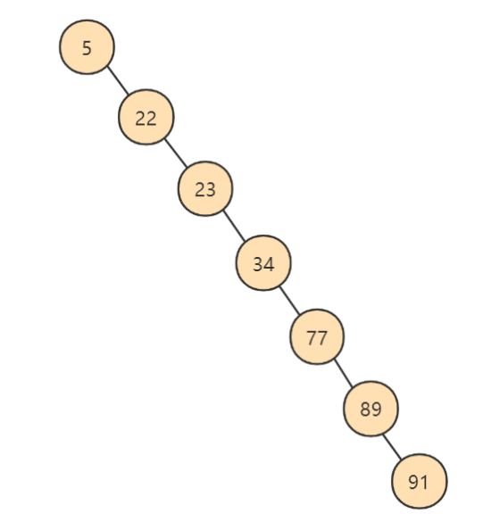
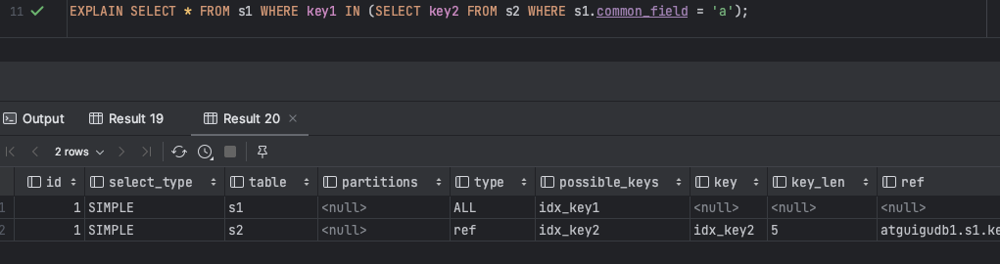
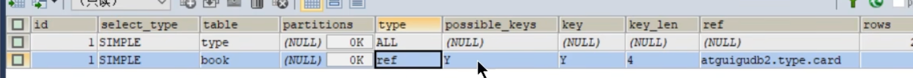
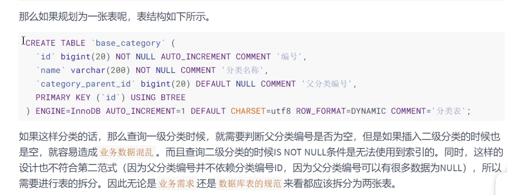
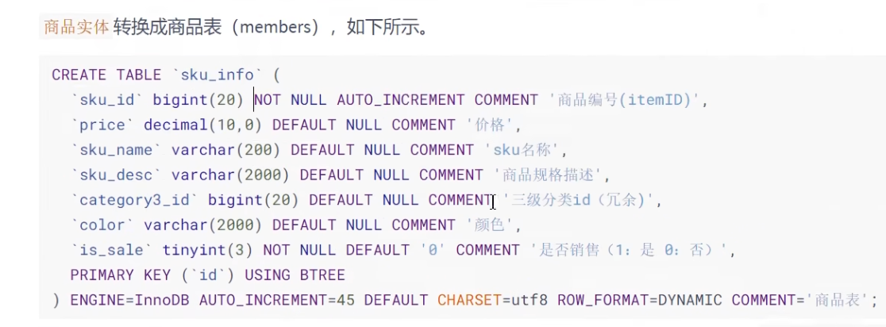

***

# 7 索引及调优篇

## 7.1 索引的数据结构

### 7.1.1 为什么使用索引

索引是存储引擎用于快速找到数据记录的一种数据结构，就好比一本教课书的目录部分，通过目录中找到对应文章的页码，便可快速定位到需要的文章。MySQL中也是一样的道理，进行数据查找时，首先查看查询条件是否命中某条索引，符合则 `通过索引查找`相关数据，如果不符合则需要 `全表扫描`，即需要一条一条地查找记录，直到找到与条件符合的记录。


如上图所示，数据库没有索引的情況下，数据 `分布在硬盘不同的位置上面`，读取数据时，摆臂需要前后摆动查找数这样操作非常消耗时间。如果` 数据顺序摆放`，那么也需要从1到6行按顺序读取，这样就相当于进行了6次I/O操作，`依旧非常耗时`。如果我们不借助任何索引结构帮助我们快速定位数据的话，我们查找Col2=89 这条记录，就要逐行去查找、去比较。从Co12=34 开始，进行比较，发现不是，继续下一行。我们当前的表只有不到10行数据，但如果表很大的话，有`上千万条数据`，就意味着要做`很多很多次磁盘工I/O`才能找到。现在要查找 Col2=89这条记录。CPU必须先去磁盘查找这条记录，找到之后加载到内存，再对数据进行处理。这个过程最耗时问的就是磁盘I/O（涉及到磁盘的旋转时间（速度较快）、磁头的寻道时间（速度慢、费时））

假如给数据使用`二叉树` 这样的数据结构进行存储，如下图所示:


对字段Col2 添加了索引，就相当于在硬盘上为Col2维护了一个索引的数据结构，即这个`二叉搜索树`。二叉搜索树的每个结点存储的是`（K，V）结构`，key 是Col2，value 是该key 所在行的文件指针（地址）。比如：该二叉搜索树的根节点就是：`(34,0x97）`。现在对Col2 添加了索引，这时再去查找 Col2=89这条记录的时候会先去查找该二叉搜索树（二叉树的遍历查找）。读34到内存，89>34；继续右侧数据，读89 到内存，89==89；找到数据返回。找到之后就根据当前结点的value快速定位到要查找的记录对应的地址。我们可以发现，只需要 `查找两次`就可以定位到记录的地址，查询速度就提高了。

这就是我们为什么要建索引，目的就是为了 `减少磁盘I/O的次数`，加快查询速率。

### 7.1.2 索引及其优缺点 

#### 7.1.2.1 索引概述

MySQL官方对索引的定义为：`索引（Index）是帮助MySQL高效获取数据的数据结构`。

`索引的本质`：索引是数据结构。你可以简单理解为“排好序的快速查找数据结构”，满足特定查找算法。这些数据结构以某种方式指向数据， 这样就可以在这些数据结构的基础上实现 `高级查找算法`。

`索引是在存储引擎中实现的` ，因此每种存储引擎的索引不一定完全相同，并且每种存储引擎不一定支持所有索引类型。同时，存储引擎可以定义每个表的 `最大索引数` 和 `最大索引长度`。所有存储引擎支持每个表至少16个索引，总索引长度至少为256字节。有些存储引擎支持更多的索引数和更大的索引长度。

#### 7.1.2.2 优点

1. 类似大学图书馆建书目索引，提高数据检索的效率，降低 `数据库的IO成本` ，这也是创建索引最主要的原因。

2. 通过创建唯一索引，可以保证数据库表中每一行 `数据的唯一性` 。
3. 在实现数据的参考完整性方面，可以` 加速表和表之间的连接`。换句话说，对于有依赖关系的子表和父表联合查询时，可以提高查询速度。
4. 在使用分组和排序子句进行数据查询时，可以显著` 减少查询中分组和排序的时间` ，降低了CPU的消耗。

#### 7.1.2.3 缺点

1. 创建索引和维护索引要 `耗费时间` ，并且随着数据量的增加，所耗费的时间也会增加。

2. 索引需要占 `磁盘空间` ，除了数据表占数据空间之外，每一个索引还要占一定的物理空间， `存储在磁盘上` ，如果有大量的索引，索引文件就可能比数据文件更快达到最大文件尺寸。
3. 虽然索引大大提高了查询速度，同时却会 `降低更新表的速度` 。当对表中的数据进行增加、删除和修改的时候，索引也要动态地维护，这样就降低了数据的维护速度。

*因此，选择使用索引时，需要综合考虑索引的优点和缺点。*

> 提示：
>
> 索引可以提高查询的速度，但是会影响插入记录的速度。这种情况下，最好的办法是先删除表中的索引，然后插入数据，插入完成后再创建索引。

### 7.1.3 InnoDB中索引的推演

#### 7.1.3.1 索引之前的查找

先来看一个精确匹配的例子：

```mysql
SELECT [列名列表] FROM 表名 WHERE 列名 = xxx;
```

##### 7.1.3.1.1 在一个页中的查找

假设目前表中的记录比较少，所有的记录都可以被存放到一个页中，在查找记录的时候可以根据搜索条件的不同分为两种情况：

- 以主键为搜索条件

  可以在页目录中使用`二分法`快速定位到对应的槽，然后再遍历该槽对应分组中的记录即可快速找到指定的记录。

- 以其他列作为搜索条件

  因为在数据页中并没有对非主键列建立所谓的页目录，所以我们无法通过二分法快速定位相应的槽。这种情况下只能从 `最小记录（表的第一条记录）` 开始 `依次遍历` 单链表（因为每条记录在磁盘不是顺序的）中的每条记录，然后对比每条记录是不是符合搜索条件。很显然，这种查找的效率是非常低的

##### 7.1.3.1.2 在很多页中查找

大部分情况下我们表中存放的记录都是非常多的，需要好多的数据页来存储这些记录。在很多页中查找记录的话可以分为两个步骤：

- 定位到记录所在的页。

- 从所在的页内中查找相应的记录。

在没有索引的情况下，不论是根据主键列或者其他列的值进行查找，由于我们并不能快速的定位到记录所在的页，所以只能 `从第一个页`沿着 `双向链表`一直往下找，在每一个页中根据我们上面的查找方式去查找指定的记录。因为要遍历所有的数据页，所以这种方式显然是 `超级耗时`的。如果一个表有一亿条记录呢？此时 `索引` 应运而生。

#### 7.1.3.2 设计索引

建一个表：

```mysql
mysql> CREATE TABLE index_demo(
 ->   c1 INT,
 ->   c2 INT,
 ->   c3 CHAR(1),
 ->   PRIMARY KEY(c1)
 -> ) ROW_FORMAT = Compact;
```

这个新建的`index_demo`表中有2个INT类型的列，1个CHAR(1)类型的列，而且我们规定了c1列为主键，这个表使用 `Compact` 行格式来实际存储记录的。这里我们简化了index_demo表的行格式示意图：


我们只在示意图里展示记录的这几个部分:

- `record_type` ：记录头信息的一项属性，表示记录的类型， 0 表示普通记录、 2 表示最小记录、 3 表示最大记录、 1 暂时还没用过，下面讲。
- `next_record`：记录头信息的一项属性，表示下一条地址相对于本条记录的地址偏移量，我们用箭头来表明下一条记录是谁。
- `各个列的值` ：这里只记录在 `index_demo` 表中的三个列，分别是 `c1 、 c2 和 c3` 。
- `其他信息` ：除了上述3种信息以外的所有信息，包括其他隐藏列的值以及记录的额外信息。

将记录格式示意图的其他信息项暂时去掉并把它竖起来的效果就是这样：


把一些记录放到页里的示意图就是：


##### 7.1.3.2.1 一个简单的索引设计方案

我们在根据某个搜索条件查找一些记录时为什么要遍历所有的数据页呢？因为各个页中的记录并没有规
律，我们并不知道我们的搜索条件匹配哪些页中的记录，所以不得不依次遍历所有的数据页。所以如果我们 `想快速的定位到需要查找的记录在哪些数据页` 中该咋办？我们可以为快速定位记录所在的数据页而`建立一个目录` ，建这个目录必须完成下边这些事：

- **下一个数据页中用户记录的主键值必须大于上一个页中用户记录的主键值**。

  假设：每个数据页最多能存放3条记录 (实际上一个数据页非常大，可以存放下好多记录）。有了这个假设之

  后我们向 index_demo 表插入3条记录：

  ```mysql
  mysql> INSERT INTO index_demo VALUES(1. 4. 'u'). I(3, 9.'d'), (5, 3.'y');
  Query OK, 3 rows affected (0.01 sec)
  Records: 3 Duplicates: 0 Warnings: 0
  ```

  那么这些记录已经按照主键值的大小串联成一个单向链表了，如图所示：

  

  从图中可以看出来，`index_demo` 表中的3条记录都被插入到了编号为`10` 的数据页中了。此时我们再来插入

  一条记录：

  ```mysql
  mysql> INSERT INTO index_demo VALUES(4,4,'a');
  ```

  因为 `页10` 最多只能放3条记录，所以我们不得不再分配一个新页：

  

  注意，新分配的 `数据页编号` 可能并不是连续的。它们只是通过维护着上一个页和下一个页的编号而建立了 `链表关系`。另外，`页10` 中用户记录最大的主键值是 `5`，而`页28`中有一条记录的主键值是`4`，因为`5＞4`，所以这就不符合下一个数据页中用户记录的主键值必须大于上一个页中用户记录的主键值的要求，所以在插入主键值为4的记录的时候需要伴随着一次 `记录移动`，也就是把主键值为5的记录移动到页28中，然后再把主键值为4的记录插入到页10中，这个过程的示意图如下：

  

  这个过程表明了在对页中的记录进行增删改操作的过程中，我们必须通过一些诸如 `记录移动`的操作来始终保证这个状态一直成立：下一个数据页中用户记录的主键值必须大于上一个页中用户记录的主键值。这个过程我们称为 `页分裂`。

- **给所有的页建立一个目录项**。

  由于数据页的`编号可能是不连续`的，所以在向index_demo表中插入许多条记录后，可能是这样的效果：

  

  如果要查20，虽然页里的数据都是有序递增的，但是还是不知道那个页，依然需要从第一页第一条数据匹配（为什么不能直接匹配页的最后一条数据呢？如果比最后一条记录都大，那么直接去下一页找，这样效率不更快吗。答：因为是`单链表结构`，要想找到最后一条记录还是需要从第一天依次往后找。），依次往后匹配，显然这样的效率也是很差的。因此需要给每一页建立`目录项`。

  因为这些`16KB` 的页在物理存储上是 `不连续 `的，所以如果想从这么多页中根据主键值 `快速定位某些记录所在的页`，我们需要给它们做个 `目录`，每个页对应一个目录项，每个目录项包括下边两个部分：

  - 页的用户记录中最小的主键值，我们用`key` 来表示。
  - 页号，我们用`page_no` 表示。

  所以我们为上边几个页做好的目录就像这样子（可以理解成page_no记录的是页的地址，比如查找20时，通过目录项很快找到是目录项3，然后直接定位到`页9`）


以`页28` 为例，它对应 `目录项2`，这个目录项中包含着该页的页号`28` 以及该页中用户记录的最小主键值`5`。我们只需要把几个目录项在物理存储器上连续存储（比如：数组），就可以实现根据主键值快速查找某条记录的功能了。比如：查找主键值为 `20` 的记录，具体查找过程分两步：

1. 先从目录项中根据`二分法` 快速确定出主键值为`20` 的记录在 `目录项3`中（因为 `12<20<209`），它对应的页是 `页9`。
2. 再根据前边说的在页中查找记录的方式去 `页9`中定位具体的记录

至此，针对数据页做的简易目录就搞定了。这个目录有一个别名，称为 `索引`

***

##### 7.1.3.2.2 InnoDB中的索引方案

###### ①迭代1次 目录项纪录的页

上边称为一个简易的索引方案，是因为我们为了在根据主键值进行查找时使用 `二分法` 快速定位具体的目录项而 `假设`所有目录项都可以在物理存储器上 `连续存储`，但是这样做有几个问题：

- InnoDB是使用`页`来作为管理存储空间的`基本单位`，最多能保证 `16KB` 的连续存储空间，而随着表中记录数量的增多，需要 `非常大的连续的存储空间` 才能把所有的目录项都放下，这对记录数量非常多的表是不现实的.
- 我们时常会对 `记录进行增删`，假设我们把 `页28`中的记录都删除了，那意味着 `目录项2` 也就没有存在的必要了，这就需要把目录项2后的目录项都向前移动一下，这样牵一发而动全身的操作效率很差。

所以，我们需要一种可以 `灵活管理所有目录项` 的方式。我们发现目录项其实长得跟我们的用户记录差不多，只不过目录项中的两个列是 `主键`和`页号` 而已，为了和用户记录做一下区分，我们把这些用来表示目录项的记录称为`目录项记录`。那InnoDB怎么区分一条记录是普通的`用户记录`还是 `目录项记录` 呢？使用记录头信息里的`record_type` 属性，它的各个取值代表的意思如下：

- 0：普通记录
- 1:   目录项纪录
- 2:   最小记录
- 3:   最大记录

我们把前面使用到的目录项放到数据页中的样子就是这样：


从图中可以看出来，我们新分配了一个编号为30的页来专门存储目录项记录。这里再次强调 `目录项记录`和普通的 `用户记录` 的

**不同点**：

- `目录项记录` 的 `record_type` 值是1，而 `普通用户记录` 的 `record_type` 值是0。
- 目录项记录只有 `主键值和页的编号` 两个列，而普通的用户记录的列是用户自己定义的，可能包含 `很多列` ，另外还有InnoDB自己添加的隐藏列。
- 了解：记录头信息里还有一个叫`min_rec_mask` 的属性，只有在存储 `目录项记录`的页中的主键值
- 最小的 `目录项记录` 的 `min_rec_mask`值为`1`，其他别的记录的 `min_rec_mask`值都是 `0`。

**相同点：**

两者用的是一样的数据页，都会为主键值生成 `Page Directory`（页目录），从而在按照键值进行查找时可以使用 `二分法` 来加快查询速度。

现在以查找主键为 `20` 的记录为例，根据某个主键值去查找记录的步骤就可以大致拆分成下边两步：

1.  先到存储 `目录项记录` 的页，也就是页30中通过 `二分法` 快速定位到对应目录项，因为 `12 < 20 < 209` ，所以定位到对应的记录所在的页就是页9。
2.  再到存储用户记录的页9中根据 `二分法` 快速定位到主键值为 `20` 的用户记录。

###### ②迭代2次 多个目录项纪录的页

虽然说 `目录项记录` 中只存储主键值和对应的页号，比用户记录需要的存储空间小多了，但是不论怎么说一个页只有`16KB` 大小，能存放的 `目录项记录` 也是有限的，那如果表中的数据太多，以至于一个数据页不足以存放所有的`目录项记录`，如何处理呢？

这里我们假设一个存储目录项记录的页 `最多只能存放4条目录项记录`，所以如果此时我们再向上图中插入一条主键值为 `320` 的用户记录的话，那就需要分配一个新的存储`目录项记录` 的页：


从图中可以看出，我们插入了一条主键值为320的用户记录之后需要两个新的数据页：

- 为存储该用户记录而新生成了 `页31` 。
- 因为原先存储目录项记录的 `页30的容量已满` （我们前边假设只能存储4条目录项记录），所以不得不需要一个新的`页32` 来存放 `页31` 对应的目录项。

现在因为存储目录项记录的页不止一个，所以如果我们想根据主键值查找一条用户记录大致需要3个步骤，以查找主键值为 `20` 的记录为例：

1. 确定 `目录项记录页`
   我们现在的存储目录项记录的页有两个，即 `页30`和`页32` ，又因为页30表示的目录项的主键值的范围是 `[1, 320)`，页32表示的目录项的主键值不小于 `320`，所以主键值为 `20` 的记录对应的目录项记录在 `页30` 中。
2. 通过目录项记录页 `确定用户记录真实所在的页` 。
   在一个存储 `目录项记录` 的页中通过主键值定位一条目录项记录的方式说过了。
3. 在真实存储用户记录的页中定位到具体的记录。

***

###### ③迭代3次 目录项记录页的目录页

问题来了，在这个查询步骤的第1步中我们需要定位存储目录项记录的页，但是这些 `页是不连续的`，如果我们表中的数据非常多则会 `产生很多存储目录项记录的页` ，那我们怎么根据主键值快速定位—个存储目录项记录的页呢？那就为这些存储目录项记录的页再生成一个 `更高级的目录`，就像是一个多级目录一样，`大目录里状套小目`录，小目录里才是实际的数据，所以现在各个页的示意图就是这样子：


如图，我们生成了一个存储`更高级`目录项的`页33` ，这个页中的两条记录分别代表页30和页32，如果用户记录的主键值在 `[1, 320)`之间，则到页30中查找更详细的目录项记录，如果主键值`不小于320` 的话，就到页32中查找更详细的目录项记录。

我们可以用下边这个图来描述它：


这个`数据结构`，它的名称是 `B+树` 。

***

###### ④B+Tree

不论是存放 `用户记录` 的数据页，还是存放 `目录项记录` 的数据页，我们都把它们存放到B+树这个数据结构中了，所以我们也称这些数据页为 `节点`。从图中可以看出，我们的实际用户记录其实都存放在B+树的最底层的节点上，这些节点也被称为 `叶子节点`，其余用来存放 `目录项`的节点称为 `非叶子节点`或者`内节点`，其中B树最上边的那个节点也称为` 根节点`。

一个B+树的节点其实可以分成好多层，规定最下边的那层，也就是`存放我们用户记录`的那层为第 `0`层，之后依次往上加。之前我们做了一个非常极端的假设：存放用户记录的页`最多存放3条记录` ，存放目录项记录的页 `最多存放4条记录` 。其实真实环境中一个页存放的记录数量是非常大的，假设所有存放用户记录的叶子节点代表的数据页可以存放`100条用户记录`，所有存放目录项记录的内节点代表的数据页可以存放`1000条目录项记录` ，那么：

- 如果B+树只有1层，也就是只有1个用于存放用户记录的节点，最多能存放 `100` 条记录。
- 如果B+树有2层，最多能存放 `1000×100=10,0000` 条记录。
- 如果B+树有3层，最多能存放 `1000×1000×100=1,0000,0000` 条记录。
- 如果B+树有4层，最多能存放 `1000×1000×1000×100=1000,0000,0000` 条记录。相当多的记录！！！

你的表里能存放 `100000000000` 条记录吗？所以一般情况下，我们 `用到的B+树都不会超过4层` ，那我们通过主键值去查找某条记录最多只需要做4个页面内的查找（查找3个目录项页和一个用户记录页），又因为在每个页面内有所谓的 `Page Directory`（页目录），所以在页面内也可以通过 `二分法` 实现快速定位记录。

***

#### 7.1.3.3 常见索引概念

索引按照物理实现方式，索引可以分为 2 种：`聚簇（聚集）`和`非聚簇（非聚集）`索引。我们也把非聚集索引称为二级索引或者辅助索引。

##### 7.1.3.3.1 聚簇索引

`聚族索引`并不是一种单独的索引类型，而是`一种数据存储方式`（所有的用户记录都存储在了叶子节点），也就是所谓的 `索引即数据`，`数据即索引`。

> 术语"聚簇"表示数据行和相邻的键值聚簇的存储在一起

**特点**：

- 使用记录主键值的大小进行记录和页的排序，这包括三个方面的含义：
  - `页内` 的记录是按照主键的大小顺序排成一个 `单向链表`。
  - 各个存放 `用户记录的页` 也是根据页中用户记录的主键大小顺序排成一个 `双向链表` 。
  - 存放`目录项记录的页` 分为不同的层次，在同一层次中的页也是根据页中目录项记录的主键大小顺序排成一个 `双向链表`。
- B+树的 `叶子节点 存储的是完整的用户记录`。
  所谓完整的用户记录，就是指这个记录中存储了所有列的值（包括隐藏列）。

我们把具有这两种特性的B+树称为 `聚簇索引`，所有完整的用户记录都存放在这个`聚簇索引`的叶子节点处。这种聚簇索引并不需要我们在MySQL语句中显式的使用`INDEX` 语句去创建， `InnoDB` 存储引擎会 `自动`的为我们创建聚筷索引

**优点**：

- `数据访问更快` ，因为聚簇索引将索引和数据保存在同一个B+树中，因此从聚簇索引中获取数据比非聚簇索引更快
- 聚簇索引对于主键的 `排序查找` 和 `范围查找` 速度非常快
- 按照聚簇索引排列顺序，查询显示一定范围数据的时候，由于数据都是紧密相连，数据库不用从多个数据块中提取数据，所以 `节省了大量的io操作` 。

**缺点**：

- `插入速度严重依赖于插入顺序` ，按照主键的顺序插入是最快的方式，否则将会出现页分裂，严重影响性能。因此，对于InnoDB表，我们一般都会定义一个自增的ID列为主键

  -`更新主键的代价很高` ，因为将会导致被更新的行移动。因此，对于InnoDB表，我们一般定义主键为不可更新

- `二级索引访问需要两次索引查找` ，第一次找到主键值，第二次根据主键值找到行数据

**限制：**

- 对于MySQL数据库目前只有lnnoDB数据引擎支持聚簇索引，而MyISAM并不支持聚簇索引。

- 由于数据物理存储排序方式只能有一种，所以每个MySQL的 `表只能有一个聚簇索引`。一般情况下就是该表的主键。
- 如果没有定义主键，Innodb会选择 `非空的唯一索引代替`。如果没有这样的索引，Innodb会隐式的定义一个主键来作为聚簇索引。
- 为了充分利用聚簇索引的聚簇的特性，所以innodb表的主键列尽量 `选用有序的顺序id`，而不建议用无序的id，比如UUID、MD5、HASH、字符串列作为主键无法保证数据的顺序增长。

***

##### 7.1.3.3.2 二级索引（辅助索引、非聚簇索引）

上边介绍的 聚簇索引只能在搜索条件是 `主键值` 时才能发挥作用，因为B+树中的数据都是按照主键进行排序的。那如果我们想以别的列作为搜索条件该怎么办呢？肯定不能是从头到尾沿着链表依次遍历记录一遍。

答案：我们可以 `多建几棵B+树`，不同的B+树中的数据采用不同的排序规则。比方说我们用` c2`列的大小作为数据页、页中记录的排序规则，再建一棵B+树，效果如下图所示：


> 比如要查找 select * from table where c2 = 4;
>
> 那么先从上图中按照规则查找，最后查找到在页34和页35中一共3条记录，但是因为我们要查找*，说明要查全部字段，明显上图耳机索引中只保存了c2和c1主键，因此可以通过找到的c2对应的c1回到，聚簇索引中使用c1继续查找，这样就能找到我们要的数据了，这就是"回表"。

这个B+树与上边介绍的聚簇索引有几处不同：

- 使用记录`c2列`的大小进行记录和页的排序，这包括三个方面的含义：
   - 页内的记录是按照c2列的大小顺序排成一个 `单向链表`。
   - 各个存放`用户记录的页` 也是根据页中记录的c2列大小顺序排成一个`双向链表`。
   - 存放` 目录项记录的页` 分为不同的层次，在同一层次中的页也是根据页中目录项记录的c2列大小顺序排成一个`双向链表`。

- B+树的叶子节点存储的并不是完整的用户记录，而只是 `c2列+主键`这两个列的值。
- 目录项记录中不再是 `主键＋页号` 的搭配，而变成了`c2列+页号` 的搭配

所以如果我们现在想通过c2列的值查找某些记录的话就可以使用我们刚刚建好的这个B+树了。以查找c2列的值为`4` 的记录为例，查找过程如下：

1. 确定 `目录项记录页`
   根据`根页面`，也就是 `页44`，可以快速定位到`目录项记录` 所在的页为 `页42` （因为`2<4<9`）

2. 通过 `目录项记录` 页确定用户记录真实所在的页。

   在`页42`中可以快速定位到实际存储用户记录的页，但是由于`c2列`并没有唯一性约束，所以c2列值为4的记录可能分布在多个数据页中，又因为`2＜ 4 ≤ 4`，所以确定实际存储用户记录的页在 `页34`和`页35`中。

3. 在真实存储用户记录的页中定位到具体的记录。

   到 `页34` 和 `页35`中定位到具体的记录

4. 但是这个B+树的叶子节点中的记录只存储了`c2 和c1` （也就是 `主键`）两个列，所以我们必须再根据主键值去聚簇索引中再查找一遍完整的用户记录。

**概念**：`回表` 我们根据这个以c2列大小排序的B+树只能确定我们要查找记录的主键值，所以如果我们想根据c2列的值查找到完整的用户记录的话，仍然需要到 `聚簇索引` 中再查一遍，这个过程称为 `回表` 。也就是根据c2列的值查询一条完整的用户记录需要使用到 `2` 棵B+树！

为什么我们还需要一次 `回表` 操作呢？直接把完整的用户记录放到叶子节点不OK吗？

如果每一个都完整存放用户记录，那倘若100w的用户数据，每个都要完整记录，那不是有几个二级索引，就需要翻几倍去储存，`加大了储存空间的开销`

因为这种按照 `非主键列`建立的B+树需要一次回表操作才可以定位到完整的用户记录，所以这种B+树也被称为 `二级索引`（英文名 `secondary index`），或者 `辅助索引`。由于我们使用的是c2列的大小作为B+树的排序规则，所以我们也称这个B树是为c2列建立的索引。

非聚簇索引的存在不影响数据在聚簇索引中的组织，所以一张表可以有多个非聚簇索引。


小结：聚簇索引与非聚簇索引的原理不同，在使用上也有一些区别：

1. 聚簇索引的`叶子节点` 存储的就是我们的数据记录，非聚簇索引的叶子节点存储的是 `数据位置`。 聚簇索引不会影响数据表的物理存储顺序。
2. 一个表`只能有一个聚簇索引`，因为只能有一种排序存储的方式，但可以有 多个`非聚簇索引`，也就是多个索引目录提供数据检索。
3. 使用聚簇索引的时候，数据的`查询效率高`，但如果对数据进行插入，删除，更新等操作，效率会比非聚簇索引低。

##### 7.1.3.3.3 联合索引

我们也可以同时以多个列的大小作为排序规则，也就是`同时为多个列建立索引`，比方说我们想让B+树按照 `c2和c3列` 的大小进行排序，这个包含两层含义：

- 先把各个记录和页按照c2列进行排序。
- 在记录的c2列相同的情况下，采用c3列进行排序

为c2和c3列建立的索引的示意图如下：


如图所示，我们需要注意以下几点：

- 每条`目录项记录` 都由`c2、c3、页号` 这三个部分组成，各条记录先按照c2列的值进行排序，如果记录的c2列相同，则按照c3列的值进行排序
- B+树`叶子节点`处的用户记录由` c2、c3和主键c1`列组成。

注意一点，以c2和c3列的大小为排序规则建立的B+树称为 `联合索引`，本质上也是一个二级索引。它的意思与分别

为c2和c3列分别建立索弓的表述是不同的，不同点如下：

- 建立` 联合索引`只会建立如上图一样的`1棵B+树`。
- 为c2和c3列分别建立索引会分别以c2和c3列的大小为排序规则建立`2棵B+树`

#### 7.1.3.4 InnoDB的B+树索引的注意事项

##### 7.1.3.4.1 根页面位置万年不动

我们前边介绍B+树索引的时候，为了大家理解上的方便，先把存储用户记录的叶子节点都画出来，然后接着画存储目录项记录的内节点，实际上B+树的形成过程是这样的：

- 每当为某个表创建一个B+树索引(聚簇索引不是人为创建的，默认就有）的时候，都会为这个索引创建一个`根节点 `页面。最开始表中没有数据的时候，每个B+树索引对应的根节点 中既没有用户记录，也没有目录项记录。
- 随后向表中插入用户记录时，先把用户记录存储到这个`根节点`中。
- 当根节点中的可用 `空间用完时` 继续插入记录，此时会将根节点中的所有记录复制到一个新分配的页，比如`页a`中，然后对这个新页进行 `页分裂`的操作，得到另一个新页，比如 `页b`。这时新插入的记录根据键值（也就是聚簇索引中的主键值，二级索引中对应的索引列的值）的大小就会被分配到`页a`或者 `页b`中，而`根节点`便升级为存储目录项记录的页。

这个过程特别注意的是：一个B+树索引的根节点自诞生之日起，便`不会再移动`。这样只要我们对某个表建立一个索引，那么它的`根节点`的页号便会被记录到某个地方，然后凡是InnoDB 存储引擎需要用到这个索引的时候，都会从那个固定的地方取出根节点的页号，从而来访问这个索引。

##### 7.1.3.4.2 内节点中目录项记录的唯一性

我们知道B+树索引的内节点中目录项记录的内容是 `索引列 ＋ 页号` 的搭配，但是这个搭配对于二级索引来说有点儿不严谨。还拿 `index_demo` 表为例，假设这个表中的数据是这样的:

| c1   | c2   | c3   |
| ---- | ---- | ---- |
| 1    | 1    | 'u'  |
| 3    | 1    | 'd'  |
| 5    | 1    | 'y'  |
| 7    | 1    | 'a'  |

如果二级索引中目录项记录的内容只是` 索引列 ＋ 页号`的搭配的话，那么为 `c2`列建立索引后的B+树应该长这样：


如果我们想新插入一行记录，其中c1、c2、c3的值分别是：`9`、`1`、`‘c’`，那么在修改这个为2列建立的二级索引对应的B+树时便碰到了个大问题：由于 `页3`中存储的目录项记录是由 `c2列 ＋ 页号` 的值构成的，`页3`中的两条目录项记录对应的c2列的值都是 `1`，而我们 新插入的这条记录 的c2列的值也是 1，那我们这条新插入的记录到底应该放到 `页4`中，还是应该放到`页5`中啊？答案是：对不起，懵了

为了让新插入记录能找到自己在那个页里，我们需要`保证在B+树的同一层内节点的目录项记录除页号这个字段以外是唯一的`。所以对于二级索引的内节点的目录项记录的内容实际上是由三个部分构成的

- 索引列的值
- 主键值
- 页号

也就是我们把 `主键值` 也添加到二级索引内节点中的目录项记录了，这样就能保证B+树每一层节点中各条目录项记录除页号这个字段外是唯一的，所以我们为c2列建立二级索引后的示意图实际上应该是这样子的（这个才是最终二级索引的样子，上面img106.png只是为了方便讲解，因此没有将主键画出来，实际最终二级索引最终效果是下面这样）：


##### 7.1.3.4.3 一个页面最少存储2条记录

一个B+树只需要很少的层级就可以轻松存储数亿条记录，查询速度相当不错！这是因为B+树本质上就是一个大的多层级目录，每经过一个目录时都会过滤掉许多无效的子目录，直到最后访问到存储真实数据的目录。那如果一个大的目录中只存放一个子目录是个啥效果呢？那就是目录层级非常非常非常多，而且最后的那个存放真实数据的目录中只能存放一条记录。费了半天劲只能存放一条真实的用户记录？`所以InnoDB的一个数据页至少可以存放两条记录`。

***

### 7.1.4 MyISAM中的索引方案

**B树索引适用存储引擎如表所示：**

| 索引/存储引擎 | MylSAM | InnoDB | Memory |
| ------------- | ------ | ------ | ------ |
| B-Tree索引    | 支持   | 支持   | 支持   |

即使多个存储引擎支持同一种类型的的索引，但是他们的实现原理也是不同的。lnnodb和MyISAM默认的索引是Btree索引;而Memory默认的索引是Hash索引。

MyISAM引擎使用 `B+Tree` 作为索引结构，叶子节点的data域存放的是`数据记录的地址`

#### 7.1.4.1 MyISAM索引的原理

MyISAM没有聚簇索引，都是二级索引。

下图是MyISAM索引的原理图。

我们知道 InnoDB中`索引即数据`，也就是聚簇索引的那棵B+树的叶子节点中已经把所有完整的用户记录都包含了，而MyISAM 的索引方案虽然也使用树形结构，但是却将`索引和数据分开存储`：

- 将表中的记录`按照记录的插入顺序` 单独存储在一个文件中，称之为` 数据文件`。这个文件并不划分为若干个数据页，有多少记录就往这个文件中塞多少记录就成了。由于在插入数据的时候并 `没有刻意按照主键大小排序`，所以我们并不能在这些数据上使用二分法进行查找。
- 使用MyISAM 存储引擎的表会把索引信息另外存储到一个称为 `索引文件` 的另一个文件中。 MyISAM 会单独为表的主键创建一个索引，只不过在索引的叶子节点中存储的不是完整的用户记录，市是 `主键值 ＋ 数据记录地址`的组合。


这里设表一共有三列，假设我们以Col1为主键，上图是一个MyISAM表的主索引(Primary key) 示意。可以看出

`MyISAM的索引文件仅仅保存数据记录的场址`。在MyISAM中，主键索引和二级索引 (Secondary key)在结构上没有任何区别，只是主键索引要求key是唯一的，而二级索引的key可以重复。如果我们在Col2上建立一个二级索引，则此索引的结构如下图所示：


同样也是一棵B+Tree， data域保存数据记录的地址。因此，MyISAM中索引检索的算法为：首先按照B+Tree搜索算法搜索索引，如果指定的Key存在，则取出其data域的值，然后以data域的值为地址，读取相应数据记录。

#### 7.1.4.2 MyISAM与InnoDB对比

**MyISAM的索引方式都是“非聚簇”的，与InnoDB包含1个聚簇索引是不同的。小结两种引擎索引的区别：**

1. 在InnoDB存储引擎中，我们只需要根据主键值对 `聚簇索引` 进行一次查找就能找到对应的记录，而在 `MyISAN中`却需要进行一次`回表`操作，意味着MyISAM中建立的索引相当于全部都是 `二级索引`。
2. InnoDB的数据文件本身就是索引文件，而MyISAM索引文件和数据文件是分离的，索引文件仅保存数据记录的地址。
3. InnoDB的非聚簇索引data域存储相应记录 `主键的值`，而MyISAM索引记录的是地址。换句话说，InnoDB的所有非聚簇索引都引用主键作为data域。
4. MyISAN的回表操作是十分 `快速`的，因为是拿着地址偏移量直接到文件中取数据的，反观innoDB是通过获取主键之后再去聚族索引里找记录，虽然说也不慢，但还是比不上直接用地址去访问。
5. InnoDB要求表 `必须有主键（MyISAM可以没有）`。如果没有显示指定，则MySQL系统会自动选择一个可以非空旦唯一标识数据记录的列作为主键。如果不存在这种列，则`MySQL自动为InnoDB表生成一个隐含字段作为主键`，这个字段长度为6个字节，类型为长整型。

#### 7.1.4.3 小结

了解不同存储引擎的索引实现方式对于正确使用和优化索引都非常有帮助。比如：

`举例1`：知道了InnoDB的索引实现后，就很容易明白 `为什么不建议使用过长的字段作为主键`，因为所有二级索引都引用主键索引，过长的主键索引会令二级索引变得过大。

`举例2`：用非单调的字段作为主键在InnoDB中不是个好主意，因为InnoDB数据文件本身是一棵B+Tree，非单调的主键会造成在插入新记录时，数据文件为了维持B+Tree的特性而频繁的分裂调整，十分低效，而使用 `自增字段作为主键则是一个很好的选择`。

### 7.1.5 索引的代价

索引是个好东西，可不能乱建，它在空间和时间上都会有消耗：

- **空间上的代价**
  每建立一个索引都要为它建立一棵B+树，每一棵B+树的每一个节点都是一个数据页，一个页默认会占用 `16KB` 的存储空间，一棵很大的B+树由许多数据页组成，那就是很大的一片存储空间。
- **时间上的代价**
  每次对表中的数据进行 `增、删、改` 操作时，都需要去修改各个B+树索引。而且我们讲过，B+树每层节点都是按照索引列的值 `从小到大的顺序排序` 而组成了 `双向链表` 。不论是叶子节点中的记录，还是内节点中的记录（也就是不论是用户记录还是目录项记录）都是按照索引列的值从小到大的顺序而形成了一个单向链表。而增、删、改操作可能会对节点和记录的排序造成破坏，所以存储引擎需要额外的时间进行一些 `记录移位 ， 页面分裂 、 页面回收` 等操作来维护好节点和记录的排序。如果我们建了许多索引，每个索引对应的B+树都要进行相关的维护操作，会给性能拖后腿。

> 一个表上索引建的越多，就会占用越多的存储空间，在增删改记录的时候性能就越差。为了能建立又好又少的索引，我们得学学这些索引在哪些条件下起作用的。

### 7.1.6 MySQL数据结构选择的合理性

从MySQL的角度讲，不得不考虑一个现实问题就是磁盘IO。如果我们能让索引的数据结构尽量减少硬盘的IO操作，所消耗的时间也就越小。可以说， `磁盘的 IO操作次数`对索引的使用效率至关重要。

查找都是索引操作，一般来说索引非常大，尤其是关系型数据库，当数据量比较大的时候，索引的大小有可能几个G甚至更多，为了减少索引在内存的占用，`数据库索引是存储在外部磁盘上的`。当我们利用索引查询的时候，不可能把整个索引全部加载到内存，只能`逐一加载`，那么MySQL衡量查询效率的标准就是磁盘IO次数

#### 7.1.6.1 全表遍历

这里都懒得说了。

#### 7.1.6.2 Hash结构


Hash 本身是一个函数，又被称为散列函数，它可以帮助我们大幅提升检索数据的效率。

Hash 算法是通过某种确定性的算法（比如 MD5、SHAI、SHAz、SHA3） 将输入转变为输出。`相同的输入永远可以得到相同的输出`，假设输入内容有微小偏差，在输出中通常会有不同的结果。

举例：如果你想要验证两个文件是否相同，那么你不需要把两份 文件直接拿来比对，只需要让对方把 Hash 函数计算得到的结果告诉你即可，然后在本地同样对文件进行 Hash 函数的运算，最后通过比较这两个 Hash 函数的结果是否相同，就可以知道这两个文件是否相同。

**加速查找速度的数据结构，常见的有两类：**

（1)树，例如平衡二叉搜索树，查询/插入/修改/删除的平均时间复杂度都是 O(log2N)；

（2)哈希，例如HashMap，查询/插入/修改/删除的平均时间复杂度都是O(1)；

采用 Hash 进行检索效率非常高，基本上一次检索就可以找到数据，而B+树需要自顶向下依次查找，多次访问节点才能找到数据，中间需要多次 I/0操作，`从效率来说Hash 比 B+ 树更快`。

在哈希的方式下，一个元素k处于h(k)中，即利用哈希函数h，根据关键字k计算出槽的位置。函数h将关键字域映射到哈希表T[0...m-1]的槽位上。


上图中哈希函数h有可能将两个不同的关键字映射到相同的位置，这叫做`碰撞`，在数据库中一般采用 `链接法` 来解决。在链接法中，将散列到同一槽位的元素放在一个链表中，如下图所示：


***

实验：体会数组和hash表的查找方面的效率区别

```java
// 算法复杂度为 O(n)
@Test
public void test1(){
	int[] arr = new int[100000];
	for(int i = 0;i < arr.length;i++){
		arr[i] = i + 1;
	}
	long start = System.currentTimeMillis();
	for(int j = 1; j<=100000;j++){
		int temp = j;
		for(int i = 0;i < arr.length;i++){
			if(temp == arr[i]){
				break;
			}
		}
	}
	long end = System.currentTimeMillis();
	System.out.println("time： " + (end - start));  //time： 823
}

//算法复杂度为 O(1)
@Test
public void test2(){
	HashSet<Integer> set = new HashSet<>(100000);
	for(int i = 0;i < 100000;i++){
		set.add(i + 1);
	}
	long start = System.currentTimeMillis();
	for(int j = 1; j<=100000;j++) {
		int temp = j;
		boolean contains = set.contains(temp);
	}
	long end = System.currentTimeMillis();
	System.out.println("time： " + (end - start));  //time： 5
}

```


***

**Hash结构效率高，那为什么索引结构要设计成树型呢？**

`原因1`：Hash 索引仅能满足（=）（<>） 和 IN 查询。如果进行 `范围查询`，哈希型的索引，时间复杂度会退化为` O(n)`;而树型的“有序”特性，依然能够保持`O(log2N）` 的高效率。

`原因2`：Hash 索引还有一个缺陷，数据的存储是 `没有顺序的`，在ORDER BY 的情况下，使用Hash 索引还需要对数据重新排序。

`原因3`：对于联合索引的情况，Hash 值是将联合索引键合并后一起来计算的，无法对单独的一个键或者几个索引键进行查询。

`原因4`：对于等值查询来说，通常 Hash 索引的效率更高，不过也存在一种情况，就是 `索引列的重复值如果很多`，效率就会降低。这是因为遇到 Hash 冲突时，需要遍历桶中的行指针来进行比较，找到查询的关键字，非常耗时。所以，Hash 索引通常不会用到重复值多的列上，比如列为性别、年龄的情况等。

**Hash索引适用存储引擎如表所示**：

| 索引/存储引擎 | MylSAM | InnoDB | Memory |
| ------------- | ------ | ------ | ------ |
| HASH索引      | 不支持 | 不支持 | `支持` |

**Hash索引的适用性**

Hash 索引存在着很多限制，相比之下在数据库中 B+ 树索引的使用面会更广，不过也有一些场景采用 Hash 索引效率更高，比如在键值型（key-Value）数据库中，`Redis 存储的核心就是Hash 表`。

另外，InnoDB 本身不支持 Hash 索引，但是提供 `自适应 Hash 索引` (Adaptive Hasth Index）。什么情况下才会使用自适应 Hash 索引呢？如果某个数据经常被访问，当满足一定条件的时候，就会将这个数据页的地址存放到Hash 表中。这样下次查询的时候，就可以直接找到这个页面的所在位置。这样让B+树也具备了 Hash 索引的优点。

比如下面：如果每次都查询 col = 'x'，没有Hash的话，每次都要从B+树中一层一层往下找，还得回表，最后才能找到数据存储的地址。

而有了自适应Hash，将每次查询的保存到Hash中，下次还是这个条件过来查询时，先去Hash中查看有没有找到，如果找到，直接就获取到了数据地址，这样效率就会加快很多。找不到才走上面的B+树查找流程。


采用自适应 Hash 索引目的是方便根据 SQL 的查询条件加速定位到叶子节点，特别是当 B+ 树比较深的时候，通过自适应 Hash 索引可以明显提高数据的检索效率。

我们可以通过`innodb_adaptive_hash_index`变量来查看是否开启了`自适应 Hash`，比如：

```mysql
show variables like '%adaptive_hash_index';
```

#### 7.1.6.3 二叉搜索树

如果我们利用二叉树作为索引结构，那么磁盘的IO次数和索引树的高度是相关的。

1. 二叉搜索树的特点

2. 查找规则


创造出来的二分搜索树如下图所示：



为了提高查询效率，就需要 `减少磁盘IO数` 。为了减少磁盘IO的次数，就需要尽量 `降低树的高度` ，需要把原来“瘦高”的树结构变的`“矮胖”`，树的每层的分叉越多越好。

***

#### 7.1.6.4 AVL树（平衡二叉搜索树）


针对同样的数据，如果我们把二叉树改成 `M 叉树` （M>2）呢？当 M=3 时，同样的 31 个节点可以由下面的`三叉树`来进行存储：


***

#### 7.1.6.5 B-Tree


一个 M 阶的 B 树（M>2）有以下的特性：

> 1. 根节点的儿子数的范围是 [2,M]。
> 2. 每个中间节点包含 k-1 个关键字和 k 个孩子，孩子的数量 = 关键字的数量 +1，k 的取值范围为[ceil(M/2), M]。
> 3. 叶子节点包括 k-1 个关键字（叶子节点没有孩子），k 的取值范围为 [ceil(M/2), M]。
> 4. 假设中间节点节点的关键字为：Key[1], Key[2], …, Key[k-1]，且关键字按照升序排序，即 Key[i]
>    <Key[i+1]。此时 k-1 个关键字相当于划分了 k 个范围，也就是对应着 k 个指针，即为：P[1], P[2], >…,P[k]，其中 P[1] 指向关键字小于 Key[1] 的子树，P[i] 指向关键字属于 (Key[i-1], Key[i]) 的子树，P[k]>指向关键字大于 Key[k-1] 的子树。
> 5. 所有叶子节点位于同一层。

上面那张图所表示的 B 树就是一棵 3 阶的 B 树。我们可以看下磁盘块 2，里面的关键字为（8，12），它有 3 个孩子 (3，5)，(9，10) 和 (13，15)，你能看到 (3，5) 小于 8，(9，10) 在 8 和 12 之间，而 (13，15)大于 12，刚好符合刚才我们给出的特征。

然后我们来看下如何用 B 树进行查找。假设我们想要 `查找的关键字是 9` ，那么步骤可以分为以下几步：

> 1. 我们与根节点的关键字 (17，35）进行比较，9 小于 17 那么得到指针 P1；
> 2. 按照指针 P1 找到磁盘块 2，关键字为（8，12），因为 9 在 8 和 12 之间，所以我们得到指针 P2；
> 3. 按照指针 P2 找到磁盘块 6，关键字为（9，10），然后我们找到了关键字 9。

你能看出来在 B 树的搜索过程中，我们比较的次数并不少，但如果把数据读取出来然后在内存中进行比较，这个时间就是可以忽略不计的。而读取磁盘块本身需要进行 I/O 操作，消耗的时间比在内存中进行比较所需要的时间要多，是数据查找用时的重要因素。 `B 树相比于平衡二叉树来说磁盘 I/O 操作要少`，在数据查询中比平衡二叉树效率要高。所以 `只要树的高度足够低，IO次数足够少`，就可以提高查询性能。


#### 7.1.6.6 B+Tree

这个就是Innodb使用的结构，最开始讲索引就一致说到这个。


**B+ 树和 B 树的差异（重要，要读懂）**：

> 1.  有 k 个孩子的节点就有 k 个关键字。也就是孩子数量 = 关键字数，而 B 树中，孩子数量 = 关键字数+1。
> 2.  非叶子节点的关键字也会同时存在在子节点中，并且是在子节点中所有关键字的最大（或最小）。
> 3.  非叶子节点仅用于索引，不保存数据记录，跟记录有关的信息都放在叶子节点中。而 B 树中， `非叶子节点既保存索引，也保存数据记录` 。
> 4.  所有关键字都在叶子节点出现，叶子节点构成一个有序链表，而且叶子节点本身按照关键字的大小从小到大顺序链接。

B 树和 B+ 树都可以作为索引的数据结构，在 MySQL 中采用的是 B+ 树。但B树和B+树各有自己的应用场景，不能说B+树完全比B树好，反之亦然。

***

整个过程一共进行了3次IO操作，看起来以+树和B树的查询过程差不多，但是B+树和B树有个根本的差异在于，**B+树的中间节点井不直接存储数据**：。这样的好处都有什么呢？

- 首先，**B+树查询效率更稳定**。因为 B+树每次只有访问到叶子节点才能找到对应的数据，而在B树中，非叶子节点也会存储数据，这样就会造成查询效率不稳定的情况，有时候访问到了非叶子节点就可以找到关键字，而有时需要访问到叶子节点才能找到关键字【这里应该说的是B树的优点，因为B树最夸张点比如查询26，再根节点就查到了，只查询一次IO，而B+树需要查询三次IO，B+树查询稳定指的是每次都是需要查询3次，而B树如果再非叶子节点找到了，就小于3次】。
- 其次，B+树的查询效率更高。这是因为通常 B+树比B树 `更矮胖`（阶数更大，深度更低），查询所需要的磁盘I/O也会更少。同样的磁盘页大小，B+树可以存储更多的节点关键字（因为B+树非叶子节点不存数据，因此存的更多啦，而B树非叶子节点也存数据，因此存的更少啦，一样的数据量B树会更深）。
- 不仅是对单个关键字的查询上，`在查询范围上，B+树的效率也比 B树高`。这是因为所有关键字都出现在B+树的叶子节点中，叶子节点之间会有指针，数据又是递增的，这使得我们范围查找可以通过指针连接查找。而在B树中则需要通过中序遍历才能完成查询范围的查找，`效率要低很多。`

>- **思考题：为了减少IO，索引树会一次性加载吗？**
>
> 不会。
>
> 1、数据库索 是存储在磁盘上的，如果数据量很大，必然导致索引的大小也会很大，超过几个G。
>
> 2、当我们利用索引查询时候，是不可能将全部几个G的索引都加载进内存的，我们能做的只能是：逐一加载每一个磁盘页，因为磁盛页对应着索引树的节点。
>
>- **思考题：B+树的存储能力如何？为何说一般查找行记录，最多只需1~3次磁盘IO**
>
> 储存能力很强，倘若一开始的根页可以存放100条数据条目，那如果页目录可以存放1000条，那二级存*放的量就100*1000，三级就是100*1000*1000,4级就是100*1000*1000*1000，那为什么最多只需要加载最大3次呢，因为根页的数据在一开始已经加载了所有无需加载，那么就算最大加载4级，那也就需要加载最大3次（根页面万年不动，因此一开始根节点就会加载到内存，常驻内存）
>
>- **思考题：为什么说B+树比B-树更适合实际应用中操作系统的文件索引和数据库索引？**
>
> *因为B+树查询更为稳定，且适合范围的快速查找*
>
>- **思考题：Hash 索引与 B+ 树索引的区别**
>  *HASH索引的`范围查找效率`比B+树索引效率低很多，且`不支持联合索引`*
>
>- **思考题：Hash 索引与 B+ 树索引是在建索引的时候手动指定的吗？**
>  *不是的，是一开始我们创建表的时候，每次插入数据，他背后都会去维护对应索引，如果又新加的二级索引才会再创建索引*

***

#### 7.1.6.7 R树

略。

#### 7.1.6.8 小结

使用索引可以帮助我们从海量的数据中快速定位想要查找的数据，不过索引也存在一些不足，比如占用存储空间、降低数据库写操作的性能等，如果有多个索引还会增加索引选择的时间。当我们使用索引时，需要平衡索引的利（提升查询效率） 和弊（维护索引所需的代价）。

在实际工作中，我们还需要基于需求和数据本身的分布情况来确定是否使用索引，尽管 `索引不是万能的`，但`数据量大的时候不使用索引是不可想象的`，毕竟索引的本质，是帮助我们提升数据检索的效率。

#### 7.1.6.9 算法时间复杂度

## 7.2 索引的创建与设计原则

### 7.2.1 索引的声明和使用

#### 7.2.1.1 索引的分类

MySQL的索引包括普通索引、唯一性索引、全文索引、单列索引、多列索引和空间索引等。

- 从 `功能逻辑` 上说，索引主要有 4 种，分别是普通索引、唯一索引、主键索引、全文索引。
- 按照 `物理实现方式` ，索引可以分为 2 种：聚簇索引和非聚簇索引。
- 按照 `作用字段个数`进行划分，分成单列索引和联合索引。

**1. 普通索引**

在创建普通索引时，不附加任何限制条件，只是用于提高查询效率。这类索引可以创l建在`任何数据类型中`，其值是否唯一和非空，要由字段本身的完整性约束条件决定。建立索引以后，可以通过索引进行查询。例如，在表`student `的字段`name` 上建立一个普通索引，查询记录时就可以根据该索引进行查询。

**2. 唯一性索引**

(添加了唯一性约束的字段，自动创建唯一性索引)

使用 `UNIQUE参数` 可以设置索引为唯一性索引，在创建唯一性索引时，限制该索引的值必须是唯一的，但允许有空值。在一张数据表里 `可以有多个`唯一索引。

例如，在表 `student` 的字段`email` 中创建唯一性索引，那么字段email的值就必须是唯一的。通过唯一性索引，可以更快速地确定某条记录。

**3. 主键索引**

主键索引就是一种`特殊的唯一性索引`，在唯一索引的基础上增加了不为空的约束，也就是 NOT NULL+UNIQUE,张表里 `最多只有一个` 主键索引。

`why？` 这是由主键索引的物理实现方式决定的，因为数据存储在文件中只能按照一种顺序进行存储

**4. 单列索引**

在表中的单个字段上创建索引。单列索引只根据该字段进行索引。单列索引可以是普通索引，也可以是唯一性索引，还可以是全文索引。只要保证该索引只对应一个字段即可。一个表可以`有多个`单列索引

**5. 多列（组合、联合)索引**

多列索引是在表的 `多个字段组合` 上创建一个索引。该索引指向创建时对应的多个字段，可以通过这几个字段进行查询，但是只有查询条件中使用了这些字段中的第一个字段时才会被使用。例如，在表中的字段id、name和gender上建立一个多列索引` idx_id_name_gender`，只有在查询条件中使用了字段`id`时该索引才会被使用。使用组合索引时遵循 `最左前缀集合`。

**6.全文索引**

略。

随着大数据时代的到来，关系性数据库应对全文索引的需求已力不从心，逐渐被 `solr`、`ElasticSearch`等专门的搜索引擎所代替。

**7. 补充：空间索引**

略。

***

#### 7.2.1.2 创建索引

MySQL支持多种方法在单个或多个列上创建索引：在创建表的定义语句 `CREATE TABLE `中指定索引列，使用

`ALTER TABLE` 语句在存在的表上创建索引，或者使用 `CREATE INDEX` 语句在已存在的表上添加索引。

使用CREATE TABLE创建表时，除了可以定义列的数据类型外，还可以定义主键约束、外键约束或者唯一性约束，而不论创建哪种约束，在定义约束的同时相当于在指定列上创建了一个索引。

举例：

##### 7.2.1.2.1 创建表的时候创建索引

1. **隐式方式创建索引：**

下面是`隐式`的方式创建索引。在声明有主键约束、外键约束或者唯一性约束的字段上，会自动的添加相关的索引。

```mysql
# dept 表有一个索引
CREATE TABLE dept(
dept_id INT PRIMARY KEY AUTO_INCREMENT,  # 设置了主键会自动添加上索引
dept_name VARCHAR(20)
);

# emp 表有三个索引
CREATE TABLE emp(
emp_id INT PRIMARY KEY AUTO_INCREMENT, # 设置了主键会自动添加上索引
emp_name VARCHAR(20) UNIQUE, # 设置了唯一约束会自动添加上索引
dept_id INT,
CONSTRAINT emp_dept_id_fk FOREIGN KEY(dept_id) REFERENCES dept(dept_id) # 设置了外键约束会自动添加上索引
);
```

查看索引指令：

```mysql
SHOW INDEX FROM 表名;
或者
SHOW INDEXES FROM 表名;
```

****

2. **显式方式创建索引：**

但是，如果显示创建表时创建索引的话，基本语法格式如下：

```mysql
CREATE TABLE table_name [col_name data_type]
[UNIQUE | FULLTEIT | SPATIAL] [INDEX | KEY] [index_name] (col_name [length]) [ASC | DESC]
```

- `UNIQUE` 、`FULLTEXT`和 `SPATIAL` 为可选参数，分别表示唯一索引、 全文索引和空间索引，
- `INDEX`与 `KEY` 为同义词，两者的作用相同，用来指定创建索引;
- `index_name` 指定索引的名称，为可选参数，如果不指定，那么MySQL默认colname为索引名；
- `col_name` 为需要创建索引的字段列，该列必须从数据表中定义的多个列中选择;
- `length` 为可选参数，表示索引的长度，只有字符串类型的字段才能指定索引长度：
- `ASC` 或`DESC `指定升序或者降序的索引值存储。

①**创建普通索引**:

```mysql
CREATE TABLE book(
	book_id INT ,
	book_name VARCHAR(100),
	authors VARCHAR(100),
	info VARCHAR(100) ,
	comment VARCHAR(100),
	year_publication YEAR,
	INDEX idx_bname(book_name)  # 建立普通索引
);

# 加了这个索引之后，在数据量大的时候，下面查询效率就变得高
select * from book where book_name = 'mysql高级';

# 性能分析工具：EXPLAIN，有助于排查SQL是否用到索引，这个在后面会详细讲解
EXPLAIN select * from book where book_name = 'mysql高级';
```


②**创建唯一索引**:

声明有唯一索引的字段，在添加数据时，要保证唯一性，但是可以添加null.

```mysql
CREATE TABLE book1(
	book_id INT ,
	book_name VARCHAR(100),
	authors VARCHAR(100),
	info VARCHAR(100) ,
	comment VARCHAR(100),
	year_publication YEAR,
	UNIQUE INDEX uk_idx_cmt(comment)  # 建立唯一索引
);
```

③**主键索引**:

创建主键索引，只有跟隐式创建一样，只有这一种方式：

```mysql
CREATE TABLE dept1(
dept_id INT PRIMARY KEY,  # 设置了主键会自动添加上索引
dept_name VARCHAR(20)
); 

# 通过删除主键约束的方式可以删除主键索引,注意哦，如果主键加了 AUTO_INCREMENT 那么删除会失败。
ALTER TABLE dept1 DROP PRIMARY KEY;
```

④**创建单列索引**:

上面讲的其实都是单列索引。

```mysql
CREATE TABLE test2(
	id INT NOT NULL,
	name CHAR(50) NULL,
	INDEX single_idx_name(name(20))
);
```

⑤**创建组合索引**:

创建表test3，在表中的`id、name和age`字段上建立组合索引，SQL语句如下：

严格按照索引指定字段的顺序，id、name、age。B+Tree是先按照id进行排序，id相同按照name再进行排序,id 和 name 还相同，则按照age进行排序，如果用的不恰当，那么索引可能就不生效了，`最左匹配原则`

```mysql
CREATE TABLE test3(
	id INT(11) NOT NULL,
	name CHAR(30) NOT NULL,
	age INT(11) NOT NULL,
	info VARCHAR(255),
	INDEX multi_idx(id,name,age)
);

# 查看是否使用到索引
EXPLAIN select * from test3 where id = 1001 and name = 'mysql';
```


⑥**创建全文索引**:

了解。

***

##### 7.2.1.2.2 在已存在的表上创建索引

在已经存在的表中创建索引可以使用ALTER TABLE语句`或者`CREATE INDEX语句。

**使用ALTER TABLE语句创建索引** ALTER TABLE语句创建索引的基本语法如下：

```mysql
ALTER TABLE table_name ADD [UNIQUE | FULLTEXT | SPATIAL] [INDEX | KEY][index_name] (col_name[length],...) [ASC | DESC]
```

**使用CREATE INDEX创建索引** CREATE INDEX语句可以在已经存在的表上添加索引，在MySQL中，
CREATE INDEX被映射到一个ALTER TABLE语句上，基本语法结构为：

```mysql
CREATE [UNIQUE | FULLTEXT | SPATIAL] INDEX index_name
ON table_name (col_name[length],...) [ASC | DESC]

```

***

先创建一个没有任何索引的表：

```mysql
CREATE TABLE book6(
	book_id INT ,
	book_name VARCHAR(100),
	authors VARCHAR(100),
	info VARCHAR(100) ,
	comment VARCHAR(100),
	year_publication YEAR
);
# 查看索引
show index from book6;
# 创建普通索引
ALTER TABLE book6 ADD INDEX idx_cmt(comment);
# 创建唯一索引
ALTER TABLE book6 ADD UNIQUE uk_idx_bname(book_name);
# 创建联合索引
ALTER TABLE book6 ADD index mul_bid_bname_info(book_id,book_name,info);

#CREATE INDEX方式创建
CREATE INDEX idx_cmt ON book6(COMMENT);
CREATE UNIQUE INDEX uk_idx_bname ON book6(book_name);
CREATE INDEX mul_bid_bname_info ON book6(book_id,book_name,info);
```

***

#### 7.2.1.3 删除索引

**使用ALTER TABLE删除索引** ALTER TABLE删除索引的基本语法格式如下：

```mysql
ALTER TABLE table_name DROP INDEX index_name;
```

**使用DROP INDEX语句删除索引** DROP INDEX删除索引的基本语法格式如下：

```mysql
DROP INDEX index_name ON table_name;
```

举例：

```mysql
ALTER TABLE book DROP INDEX idx_bk_id;
或者
DROP INDEX idx_bk_id ON book;
```

> 提示：
>
> 添加 AUTO_INCREMENT 约束字段的唯一约束不能被删除。

举例：删除联合索引其中一个字段name


```mysql
ALTER TABLE test3 DROP COLUMN name;
```


> 提示：
>
> 删除表中的列时，如果要删除的列为索引的组成部分，则该列也会从索引中删除。如果组成索引的所有列都被删除，则整个索引将被删除。

### 7.2.2 MySQL8.0索引新特性

#### 7.2.2.1 支持降序索引

举例：分别在MySQL 5.7版本和MySQL 8.0版本中创建数据表ts1，结果如下：

```mysql
CREATE TABLE ts1(a int,b int,index idx_a_b(a,b desc));
```

在MySQL 5.7版本中查看数据表ts1的结构，结果如下：


从结果可以看出，`索引`仍然是`默认的升序`。

在MySQL 8.0版本中查看数据表ts1的结构，结果如下:


从结果可以看出，索引已经是降序了。下面继续测试降序索引在执行计划中的表现。
分别在MySQL 5.7版本和MySQL 8.0版本的数据表ts1中插入800条随机数据，执行语句如下：

```mysql
DELIMITER //
	CREATE PROCEDURE ts_insert()
	BEGIN
		DECLARE i INT DEFAULT 1;
		WHILE i < 800
		DO
		insert into ts1 select rand()*80000,rand()*80000;
		SET i = i + 1;
		END WHILE;
		commit;
	END //
DELIMITE ;

#调用
CALL ts_insert();
```

在MySQL 5.7版本中查看数据表ts1的执行计划，结果如下：

```mysql
EXPLAIN SELECT * FROM ts1 ORDER BY a,b DESC LIMIT 5;
```


从结果可以看出，执行计划中扫描数为799，而且使用了`Using filesort`。

> **提示** :
> `Using filesort`是MySQL中一种速度比较慢的外部排序，能避免是最好的。
> 多数情况下，管理员可以通过优化索引来尽量避免出现Using filesort，从而提高数据库执行速度。

在MySQL 8.0版本中查看数据表ts1的执行计划。从结果可以看出，执行计划中扫描数为5，而且没有使用Using filesort。


> **注意**:
> `降序索引`只对查询中`特定的排序顺序有效`，如果`使用不当`，反而查询`效率更低`。
> 例如，上述查询排序条件改为order by a desc, b desc，MySQL 5.7的执行计划要明显好于MySQL 8.0。

将排序条件修改为order by a desc, b desc后，下面来对比不同版本中执行计划的效果。 在MySQL 5.7版本中查看数据表ts1的执行计划，结果如下：

```mysql
EXPLAIN SELECT * FROM ts1 ORDER BY a DESC,b DESC LIMIT 5;
```

在MySQL 8.0版本中查看数据表ts1的执行计划。
从结果可以看出，修改后MySQL 5.7的执行计划要明显好于MySQL 8.0。

#### 7.2.2.2 隐藏索引

在MysQL5.7版本及之前，只能通过显式的方式删除索引。此时，如果发现删除索引后出现错误，又只能通过显式创建索引的方式将删除的索引创建回来。如果数据表中的数据量非常大，或者数据表本身比较大，这种操作就会消耗系统过多的资源，操作成本非常高。

从MySQL 8.x开始支持`隐藏索引 (invisible indexes）`，只需要将待删除的索引设置为隐藏索引，使查询优化器不再使用这个索引（即使使用force index（强制使用索引） ，优化器也不会使用该索引），确认将索引设置为隐藏索引后系统不受任何响应，就可以彻底删除索引。 `这种通过先将索引设置为隐藏索引，再删除索引的方式就是软删除`。

同时，如果你想验证某个索引删除之后的 查询性能影响，就可以暂时先隐藏该索引。

> 注意：
>
> 主键不能被设置为隐藏索引。 当表中没有显式主键时，表中第一个唯一非空索引会成为隐式主键，也不能设置为隐藏索引。

索引默认是可见的，在使用CREATE TABLE, CREATE INDEx或 者ALTER TABLE等语句时可以通过 VISIBLE 或者FNVISIBLE 关键词设置索引的可见性。

### 7.2.3 索引的设计原则

为了使索引的使用效率更高，在创建索引时，必须考虑在哪些字段上创建索引和创建什么类型的索引。`索引设计不合理或者缺少索引都会对数据库和应用程序的性能造成障碍`。高效的索引对于获得良好的性能非常重要。设计索引时，应该考虑相应准则。

**1、数据准备**

**创建数据库、创建表**：

```mysql
CREATE DATABASE atguigudb1;

USE atguigudb1;

#1.创建学生表和课程表
CREATE TABLE `student_info` (
	`id` INT(11) NOT NULL AUTO_INCREMENT,
	`student_id` INT NOT NULL ,
	`name` VARCHAR(20) DEFAULT NULL,
	`course_id` INT NOT NULL ,
	`class_id` INT(11) DEFAULT NULL,
	`create_time` DATETIME DEFAULT CURRENT_TIMESTAMP ON UPDATE CURRENT_TIMESTAMP,
	 PRIMARY KEY (`id`)
) ENGINE=INNODB AUTO_INCREMENT=1 DEFAULT CHARSET=utf8;   # AUTO_INCREMENT=1 设置初始值的意思

CREATE TABLE `course` (
	`id` INT(11) NOT NULL AUTO_INCREMENT,
	`course_id` INT NOT NULL ,
	`course_name` VARCHAR(40) DEFAULT NULL,
	PRIMARY KEY (`id`)
) ENGINE=INNODB AUTO_INCREMENT=1 DEFAULT CHARSET=utf8;

```

**创建模拟数据必需的存储函数**:

```mysql
#函数1：创建随机产生字符串函数
DELIMITER //
CREATE FUNCTION rand_string(n INT)
	RETURNS VARCHAR(255) #该函数会返回一个字符串
BEGIN
	DECLARE chars_str VARCHAR(100) DEFAULT 'abcdefghijklmnopqrstuvwxyzABCDEFJHIJKLMNOPQRSTUVWXYZ';
	DECLARE return_str VARCHAR(255) DEFAULT '';
	DECLARE i INT DEFAULT 0;
	WHILE i < n DO
	   SET return_str =CONCAT(return_str,SUBSTRING(chars_str,FLOOR(1+RAND()*52),1));
	   SET i = i + 1;
    END WHILE;
    RETURN return_str;
END //
DELIMITER ;
```

```mysql
#函数2：创建随机数函数
DELIMITER //
CREATE FUNCTION rand_num (from_num INT ,to_num INT) RETURNS INT(11)
BEGIN 
DECLARE i INT DEFAULT 0; 
SET i = FLOOR(from_num +RAND()*(to_num - from_num+1))  ;
RETURN i; 
END //
DELIMITER ;
```

**创建插入模拟数据的存储过程**:

```mysql
# 存储过程1：创建插入课程表存储过程
DELIMITER //
CREATE PROCEDURE insert_course( max_num INT )
BEGIN 
	DECLARE i INT DEFAULT 0; 
	SET autocommit = 0;   #设置手动提交事务
	REPEAT  #循环
	SET i = i + 1;  #赋值
	INSERT INTO course (course_id, course_name ) VALUES
	(rand_num(10000,10100),rand_string(6)); 
	UNTIL i = max_num 
	END REPEAT; 
	COMMIT;  #提交事务
END //
DELIMITER ;
```

```mysql
# 存储过程2：创建插入学生信息表存储过程
DELIMITER //
CREATE PROCEDURE insert_stu( max_num INT )
BEGIN 
	DECLARE i INT DEFAULT 0; 
	SET autocommit = 0;   #设置手动提交事务
	REPEAT  #循环
	SET i = i + 1;  #赋值
	INSERT INTO student_info (course_id, class_id ,student_id ,NAME ) VALUES
(rand_num(10000,10100),rand_num(10000,10200),rand_num(1,200000),rand_string(6)); 
	UNTIL i = max_num 
	END REPEAT; 
	COMMIT;  #提交事务
END //
DELIMITER ;
```

查看全部存储过程：

如果您想查看所有的函数（Functions），可以将`type`的值改为`'FUNCTION'`

```mysql
SELECT NAME FROM mysql.proc WHERE db = 'atguigudb1' AND type = 'PROCEDURE';

SELECT NAME FROM mysql.proc WHERE db = 'atguigudb1' AND type = 'FUNCTION';
```

**调用存储过程**:

```mysql
CALL insert_course(100);
CALL insert_stu(1000000);

select count(*) from course;
select count(*) from student_info;
```

***

#### 7.2.3.1 哪些情况适合创建索引

##### 7.2.3.1.1 字段的数值有唯一性的限制

索引本身可以起到约束的作用，比如唯一索引、主键索引都是可以起到唯一性约束的，因此在我们的数据表中，如果 `某个字段是唯一性的`，就可以直接 `创建唯一性索引`，或者 `主键索引`。这样可以更快速地通过该索引来确定某条记录。

例如，学生表中 `学号` 是具有唯一性的字段，为该字段建立唯一性索引可以很快确定某个学生的信息，如果使用`姓名`的话，可能存在同名现象，从而降低查询速度。

> `业务上具有唯一特性的字段，即使是组合字段，也必须建成唯一索引`。（来源：Alibaba）
> 说明：不要以为唯一索引影响了 insert 速度，这个速度损耗可以忽略，但提高查找速度是明显的。

##### 7.2.3.1.2 频繁作为WHERE查询条件的字段

某个字段在SELECT语句的 WHERE 条件中经常被使用到，那么就需要给这个字段创建索引了。尤其是在数据量大的情况下，创建普通索引就可以大幅提升数据查询的效率。

比如student_info数据表（含100万条数据），假设我们想要查询 student_id=123110 的用户信息。

如果我们没有对` student_id` 字段创建索引（目前表student_info只有一个主键索引），进行如下查询：

```mysql
select course_id,class_id,name,create_time,student_id
from student_info
where student_id = 123110; # 276ms 
```

给`student_id`创建索引：

```mysql
ALTER TABLE student_info ADD INDEX idx_sid(student_id);
或者
CREATE INDEX idx_sid ON student_info(student_id);
```

再次查询，明显快了很多：

```mysql
select course_id,class_id,name,create_time,student_id
from student_info
where student_id = 123110; # 70 ms
```

- 

##### 7.2.3.1.3 经常GROUP BY 和 ORDER BY条件的列

索引就是让数据按照某种顺序进行存储或检索，因此当我们使用 GROUP BY 对数据进行分组查询，或者使用 ORDER BY 对数据进行排序的时候，就需要 `对分组或者排序的字段进行索引` 。

如果待排序的列有多个，那么可以在这些列上建立 `组合索引` 。

比如，按照 `student_id` 对学生选修的课程进行分组，显示不同的student_id 和课程数量，显示 100 个即可。

如果我们不对 student_id 创建索引，执行下面的SQL 语句：

```mysql
# 先删除刚才创建过的索引
DROP INDEX idx_sid on student_info;
# 没有索引查询
SELECT student_id, count(*) as num FROM student_info group by student_id limit 100; # 760 ms
```

有student_id索引下，执行SQL语句：

```mysql
# 重新创建回索引
ALTER TABLE student_info ADD INDEX idx_sid(student_id);
# 有索引查询
SELECT student_id, count(*) as num FROM student_info group by student_id limit 100; # 53 ms
```

效率提升很明显。而且，得到的结果中student_id 字段的数值也是`按照顺序展示`的。

同样，如果是 ORDER BY，也需要对字段创建索引。

如果同时有 `GROUP BY` 和 `ORDER BY` 的情况：比如我们按照student_id 进行分组，同时按照创建时间降序的方式进行排序，这时我们就需要同时进行 GROUP BY 和ORDER BY，那么是不是需要单独创建 student_id 的索引和create_time 的索引呢？

当我们对 student_id 和create_time 分别创建索引，执行下面的 SQL 查询：

先关闭严格模式：

```mysql
select @@sql_mode;
# 去掉 ONLY_FULL_GROUP_BY
set @@sql_mode = 'STRICT_TRANS_TABLES,NO_ZERO_IN_DATE,NO_ZERO_DATE,ERROR_FOR_DIVISION_BY_ZERO,NO_AUTO_CREATE_USER,NO_ENGINE_SUBSTITUTION';
```

再创建一个索引，现在有两个单列索引了`idx_sid`和`idx_cre_time`：

```mysql
ALTER TABLE student_info ADD INDEX idx_cre_time(create_time);
```

执行SQL：

```mysql
SELECT student_id, count(*) as num FROM student_info
group by student_id
order by create_time desc limit 100; #  2 s 756 ms
```

看看执行计划：

```mysql
EXPLAIN  SELECT student_id, count(*) as num FROM student_info
group by student_id
order by create_time desc limit 100;
```


看执行计划，只用到了`idx_sid`这个索引，因为SQL执行顺序是先执行的 group by 。

添加联合索引：

```mysql
ALTER TABLE student_info ADD INDEX idx_sid_cre_time(student_id,create_time);
```

再次查询明显快很多：

```mysql
SELECT student_id, count(*) as num FROM student_info
group by student_id
order by create_time desc limit 100;   # 456 ms
```

看看执行计划，这次用到了联合索引idx_sid_cre_time：

```mysql
EXPLAIN  SELECT student_id, count(*) as num FROM student_info
group by student_id
order by create_time desc limit 100;
```


***

##### 7.2.3.1.4 UPDATE、DELETE的WHERE条件列

当我们对某条数据进行 UPDATE 或者 DELETE 操作的时候，是否也需要对 WHERE 的条件列创建索引呢？

我们先看一下对数据进行 UPDATE 的情况：我们想要把 name 为 'TeSXnt'  对应的student_id 修改为10002，当我们没有对 name 进行索引的时候，执行 SQL 语句：

```mysql
UPDATE student_info SET student_id = 10001 WHERE name = 'TeSXntAAA' # 732 ms
```

你能看到效率不高

添加索引：

```mysql
ALTER TABLE student_info ADD INDEX idx_name(name);
```

然后执行类似的SQL 语句：

```mysql
UPDATE student_info SET student_id = 10001 WHERE name = 'TeSXntAAA' # 64 ms
```

明显效果有了很大提升。

对数据按照某个条件进行查询后再进行 UPDATE 或 DELETE 的操作，如果对 WHERE 字段创建了索引，就能大幅提升效率。原理是因为我们需要先根据 WHERE 条件列检索出来这条记录，然后再对它进行更新或删除。`如果进行更新的时候，更新的字段是非索引字段，提升的效率会更明显，这是因为非索引字段更新不需要对索引进行维护`。

##### 7.2.3.1.5 DISTINCT字段需要创建索引

有时候我们需要对某个字段进行去重，使用 DISTINCT，那么对这个字段创建索引，也会提升查询效率。
比如，我们想要查询课程表中不同的 student_id 都有哪些，如果我们没有对 student_id 创建索引，执行SQL 语句：

```mysql
SELECT DISTINCT(student_id) FROM student_info; 
```

运行结果（600637条记录，运行时间683ms）

如果对student_id创建了索引，再次执行SQL：

```mysql
SELECT DISTINCT(student_id) FROM student_info; # 3 s 779 ms
```

运行结果（600637条记录，运行时间10ms）

你能看到 SQL 查询效率有了提升，同时显示出来的 student_id 还是按照 `递增的顺序` 进行展示的。这是因为索引会对数据按照某种顺序进行排序，所以在去重的时候也会快很多。

##### 7.2.3.1.6 多表 JOIN 连接操作时，创建索引注意事项

- 首先， `连接表的数量尽量不要超过 3 张`，因为每增加一张表就相当于增加了一次嵌套的循环，数量级增长会非常快，严重影响查询的效率。
- 其次， `对 WHERE 条件创建索引` ，因为 WHERE 才是对数据条件的过滤。如果在数据量非常大的情况下，没有 WHERE 条件过滤是非常可怕的。
- 最后， `对用于连接的字段创建索引`，并且该字段在多张表中的 `类型必须一致` 。比如 `course_id` 在student_info 表和 course 表中都为 int(11) 类型，而不能一个为 int 另一个为 varchar 类型（因为不一致会进行隐式类型转换，比如'101'和101，隐式转换会使用函数，一使用函数就说明索引失效了）。

举个例子，如果我们只对 student_id 创建索引，执行 SQL 语句：

```mysql
SELECT b.course_id, a.name, a.student_id, b.course_name
FROM student_info as a JOIN course as b
ON a.course_id = b.course_id
WHERE a.name = 'TeSXntAAA';  # 288ms 
```

创建了name索引，执行上面SQL语句耗时：50ms

##### 7.2.3.1.7 使用列的类型小的创建索引

我们这里所说的 `类型大小`指的就是该类型表示的数据范围的大小。

我们在定义表结构的时候要显式的指定列的类型，以整数类型为例，有`TINVEINT`、`MEDIUMINT`、`INT`、`BIGINT` 等，它们占用的存储空间依次递增，能表示的整数范围当然也是依次递增。如果我们想要对某个整数列建立索引的话，在表示的整数范围允许的情况下，尽量让索引列使用较小的类型，比如我们能使用 `INT` 就不要使用`BIGINT`，能使用`MEDIUMINT` 就不要使用 `INT`。这是因为：

- 数据类型越小，在查询时进行的比较操作越快
- 数据类型越小，索引占用的存储空间就越少，在一个数据页内就可以 `放下更多的记录`，从而减少磁盘`I/O`带来的性能损耗，也就意味着可以把更多的数据页缓存在内存中，从而加快读写效率。

这个建议对于 表的 `主键非说更加适用`，因为不仅是聚簇索引中会存储主键值，其他所有的二级索引的节点处都会存储一份记录的主键值，如果主键使用更小的数据类型，也就意味着节省更多的存储空间和更高效的I/O。

##### 7.2.3.1.8 使用字符串前缀创建索引

假设我们的字符串很长，那存储—个字符串就需要占用很大的存储空间。在我们需要为这个字符串列建立索引时，那就意味着在对应的B+树中有这么两个问题：

- B+树索引中的记录需要把该列的完整字符串存储起来，更费时。而且字符串越长，`在索引中占用的存储空间越大`。
- 如果B+树索引中索引列存储的字符串很长，那在做字符串 `比较时会占用更多的时间`。

我们可以通过截取字段的前面部分内容建立索引，这个就叫 `前缀索引`。这样在查找记录时虽然不能精确的定位到记录的位置，但是能定位到相应前缀所在的位置，然后根据前缀相同的记录的主键值回表查询完整的字符串值。既 `节约空间`，又`减少了字符串的比较时间`，还大体能解决排序的问题。

例如，TEXT和BLOG类型的字段，进行全文检索会很浪费时间，如果只检索字段前面的若干字符，这样可以提高检索速度。

创建一张商户表，因为地址字段比较长，在地址字段上建立前缀索引:

```mysql
# 创建表
create table shop(address varchar(120) not null);
# 只取前缀作为索引
alter table shop add index(address(12));
```

问题是，截取多少呢？截取得多了，达不到节省索引存储空间的目的；截取得少了，重复内容太多，字段的散列度(选择性)会降低。**怎么计算不同的长度的选择性呢**？

先看一下字段在全部数据中的选择度：

```mysql
select count(distinct address) / count(*) from shop;
```

通过不同长度去计算，与全表的选择性对比：

**公式**：

```mysql
count(distinct left(列名, 索引长度))/count(*)
```

例如：

```mysql
select count(distinct left(address,10)) / count(*) as sub10, -- 截取前10个字符的选择度

count(distinct left(address,15)) / count(*) as sub11, -- 截取前15个字符的选择度
count(distinct left(address,20)) / count(*) as sub12, -- 截取前20个字符的选择度
count(distinct left(address,25)) / count(*) as sub13 -- 截取前25个字符的选择度
from shop;
```

**引申另一个问题：索引列前缀对排序的影响**

如果使用了索引列前缀，比方说前边只把address列的 `前12个字符`放到了二级索引中，下边这个查询可能就有点儿尴尬了：

```mysql
select * from shop
order by address
limit 12;
```

因为二级索引中不包含完整的address列信息，所以无法对前12个字符相同，后边的字符不同的记录进行排序，也就是使用索引列前缀的方式 `无法支持使用索引排序（要想使用上面的索引排序，那就不要使用前缀的方式）`，只能使用文件排序。

**拓展：Alibaba《Java开发手册》**

【 `强制` 】在 varchar 字段上建立索引时，必须指定索引长度，没必要对全字段建立索引，根据实际文本区分度决定索引长度。

**说明**：索引的长度与区分度是一对矛盾体，一般对字符串类型数据，长度为 20 的索引（意思是建议截取前20个字符），区分度会 `高达90% 以上` ，可以使用 `count(distinct left(列名, 索引长度))/count(*)`的区分度来确定。

##### 7.2.3.1.9 区分度高（散列性高）的列放在前面

`列的基数`指的是某一列中不重复数据的个数，比方说某个列包含值2，5，8，2，5，8，2，5，8，虽然有9条记录，但该列的基数却是3。也就是说，`在记录行数一定的情况下，列的基数越大，该列中的值越分散；列的基数越小，该列中的值越集中`。这个列的基数指标非常重要，直接影响我们是否能有效的利用索引。最好为列的基数大的列建立索引，为基数太小列的建立索引效果可能不好。

可以使用公式` select count (distinct a)/count(*）from t1` 计算区分度，越接近1越好，一般超过 33%就算是比较高效的索引了。

拓展：联合索引把区分度高(散列性高)的列放在前面

##### 7.2.3.1.10 使用最频繁的列放到联合索引左侧

这样也可以较少的建立一些索引。同时，由于"`最左前缀原则`"，可以增加联合索引的使用率。

##### 7.2.3.1.11 在多个字段都要创建索引的情况下，联合索引优于单值索引

##### 7.2.3.1.12 限制索引的数目

在实际工作中，我们也需要注意平衡，索引的数目不是越多越好。我们需要限制每张表上的索引数量，建议单张表索引数量 `不超过6个`。原因：

1. 每个索引都需要占用 `磁盘空间`，索引越多，需要的磁盘空间就越大。
2. 索引会影响 `INSERT`、`DELETE`、`UPDATE`等语句的性能，因为表中的数据更改的同时，索引也会进行调整和更新，会造成负担。
3. 优化器在选择如何优化查询时，会根据统一信息，对每一个可以用到的 `索引来进行评估`，以生成出一个最好的执行计划，如果同时有很多个索引都可以用于查询，会增加MySQL优化器生成执行计划时间，降低查询性能。

***

#### 7.2.3.2 哪些情况不适合创建索引

##### 7.2.3.2.1 在WHERE中使用不到的字段，不要设置索引

WHERE 条件（包括 GROUP BY、ORDER BY) 里用不到的字段不需要创建索引，索引的价值是快速定位，如果起不到定位的字段通常是不需要创建索引的。举个例子：

```mysql
SELECT course_id, student_id, create_time
FROM student_info
WHERE student_id = 41251;
```

因为我们是按照 student_id 来进行检索的，所以不需要对其他字段创建索引，即使这些字段出现在 SELECT 字段中。

##### 7.2.3.2.2 数据量小的表最好不要使用索引

如果表记录太少，比如`少于 1000个`，那么是不需要创建索引的。表记录太少，是否创建索引`对查询效率的影响并不大`。甚至说，查询花费的时间可能比遍历索引的时间还要短，索引可能不会产生优化效果。

##### 7.2.3.2.3 有大量重复数据的列上不要建立索引

在条件表达式中经常用到的不同值较多的列上建立索引，但字段中如果有大量重复数据，也不用创建索引。比如在学生表的`“性别“`字段上只有“男’与“女"两个不同值，因此无须建立索引。如果建立索引，不但不会提高查询效率，反而会 `严重降低数据更新速度`。|

`举例1`：要在 100 万行数据中查找其中的50万行（比如性别为男的数据），一旦创建了索引，你需要先访问 50万次索引，然后再访问 50 万次数据表，这样加起来的开销比不使用索引可能还要大。

`举例2`：假设有一个学生表，学生总数为 100 万人，男性只有10个人，也就是占总人口的 10 万分之1。这种情况建立索引才有意义。

> 当数据重复度大，比如 高于 10% 的时候，也不需要对这个字段使用索引。

##### 7.2.3.2.4 避免对经常更新的表进行过多的索引

`第一层含义`：频繁更新的字段不一定要创建索引。因为更新数据的时候，也需要更新索引，如果索引太多，在更新索引的时候也会造成负担，从而影响效率。

`第二层含义`：避免对经常更新的表创建过多的索引，并且索引中的列尽可能少。此时，虽然提高了查询速度，同时却会降低更新表的速度。

##### 7.2.3.2.5 不建议用无序的值作为索引

例如`身份证`、`UUID`(在索引比较时需要转为ASCII，并且插入时可能造成页分裂，比如插入的身份证，跟前面的比较，是排到前面的，就导致索引后移可能造成页分裂)、`MD5`、`HASH`、`无序长字符串`等。

##### 7.2.3.2.6 删除不再使用或者很少使用的索引

表中的数据被大量更新，或者数据的使用方式被改变后，原有的一些索引可能不再需要。数据库管理员应当定期找出这些索引，将它们删除，从而减少索引对更新操作的影响

##### 7.2.3.2.7 不要定义冗余或重复的索引

1. **冗余索引**

有时候有意或者无意的就对同一个列创建了多个索引，比如：`index(a,b,c) `相当于`index(a)`、`index(a,b)`、`index(a,b,c)`

举例：建表语句如下

```mysql
CREATE TABLE person_info(
	 id INT UNSIGNED NOT NULL AUTO_INCREMENT,
	 name VARCHAR(100) NOT NULL,
	 birthday DATE NOT NULL,
	 phone_number CHAR(11) NOT NULL,
	 country varchar(100) NOT NULL,
	  PRIMARY KEY (id),
	  KEY idx_name_birthday_phone_number (name(10), birthday, phone_number),
	  KEY idx_name (name(10)) # 这个idx_name就是冗余索引
);  
```

通过`idx_name_birthday_phone_number` 索引就可以对 `name` 列进行快速搜索，再创建一个专门针对 `name` 列的索引就算是一个 `冗余索引` ，维护这个索引只会增加维护的成本，并不会对搜索有什么好处。

2. **重复索引**

另一种情况，我们可能会对某个列 `重复建立索引`，比方说这样：

```mysql
CREATE TABLE repeat_index_demo (
	 col1 INT PRIMARY KEY,
	 col2 INT,
	 UNIQUE uk_idx_c1 (col1), # 重复
	 INDEX idx_c1 (col1) # 重复
); 
```

col1 既是`主键、又给它定义为一个唯一索引`，还给它定义了一个`普通索引`，可是主键本身就会生成聚簇索引，所以定义的唯一索引和普通索引是`重复`的，这种情况要避免。

##### 7.2.3.2.8 小结

索引是一把`双刃剑`，可提高查询效率，但也会降低插入和更新的速度并占用磁盘空间。

选择索引的最终目的是为了使查询的速度变快，上面给出的原则是最基本的准则，但不能拘泥于上面的准则，大家要在以后的学习和工作中进行不断的实践，根据应用的实际情况进行分析和判断，选择最合适的索引方式。

***

## 7.3 性能分析工具的使用

在数据库调优中，我们的目标就是`响应时间更快，吞吐量更大`。利用宏观的监控工具和微观的日志分析可以帮我们快速找到调优的思路和方式。

### 7.3.1 数据库服务器的优化步骤

当我们遇到数据库调优问题的时候，该如何思考呢？这里把思考的流程整理成下面这张图。

整个流程划分成了 `观察`（Show status） 和 `行动`（Action） 两个部分。字母 S 的部分代表观察（会使用相应的分析工具），字母 A 代表的部分是行动（对应分析可以采取的行动）。


我们可以通过观察了解数据库整体的运行状态，通过性能分析工具可以让我们了解执行慢的 SQL 都有哪些，查看具体的 SQL 执行计划，甚至是 SQL 执行中的每一步的成本代价，这样才能定位问题所在，找到了问题，再采取相应的行动。

**详细解释一下这张图：**

首先在 S1 部分，我们需要观察服务器的状态是否存在周期性的波动。如果 `存在周期性波动`，有可能是周期性节点的原因，比如双十一、促销活动等。这样的话，我们可以通过 A1这一步骤解决，也就是加缓存，或者更改缓存失效策略。

如果缓存策略没有解决，或者不是周期性波动的原因，我们就需要进一步 `分析查询延迟和卡顿的原因`。接下来进入S2这一步，我们需要`开启慢查询`。慢查询可以帮我们定位执行慢的 SQL 语句。我们可以通过设置`long_query_time` 参数定义"慢”的阈值，如果 SQL 执行时间超过了 long-query-time，则会认为是慢查询。当收集上来这些慢查询之后，我们就可以通过分析工具对慢查询日志进行分析。

在S3这一步骤中，我们就知道了执行慢的 SQL，这样就可以针对性地用 `EXPLAIN `查看对应 SQL 语句的执行计划，或者使用 `show profile` 查看 SQL中每一个步骤的时间成本。这样我们就可以了解SQL 查询慢是因为`执行时间长`，还是`等待时间长`。

如果是 SQL 等待时间长，我们进入A2步骤。在这一步骤中，我们可以 `调优服务器的参数`，比如适当增加数据库缓冲池等。如果是 SQL执行时间长，就进入 A3 步骤，这一步中我们需要考虑是索引设计的问题？还是查询关联的数据表过多？还是因为数据表的字段设计问题导致了这一现象。然后在这些维度上进行对应的调整。

如果 A2 和A3 都不能解決问题，我们需要考虑数据库自身的 SQL 查询性能是否已经达到了瓶颈，如果确认没有达到`性能瓶领`，就需要重新检查，重复以上的步骤。如果已经达到了 性能瓶颈，进入 A4 阶段，需要考虑`增加服务器`，采用`读写分离` 的架构，或者考虑对数据库进行 `分库分表`，比如垂直分库、 垂直分表和水平分表等。

以上就是数据库调优的流程思路。如果我们发现执行 SQL时存在不规则延迟或卡顿的时候，就可以采用分析工具帮我们定位有问题的 SQL，这三种分析工具你可以理解是 SQL调优的三个步骤：`慢查询`、`EXPLAIN` 和 `SHOW PROFILING`。

**小结**：


### 7.3.2 查看系统性能参数

在MySQL中，可以使用 `SHOW STATUS` 语句查询一些MySQL数据库服务器的 `性能参数 、 执行频率` 。SHOW STATUS语句语法如下：

```mysql
SHOW [GLOBAL|SESSION] STATUS LIKE '参数';
# 举例：
show status like 'Innodb_rows_%';
show status like 'Com_%';
```

**一些常用的性能参数如下**：

> • Connections：连接MySQL服务器的次数。
> • Uptime：MySQL服务器的上线时间。
> • Slow_queries：慢查询的次数。
> • Innodb_rows_read：Select查询返回的行数
> • Innodb_rows_inserted：执行INSERT操作插入的行数
> • Innodb_rows_updated：执行UPDATE操作更新的行数
> • Innodb_rows_deleted：执行DELETE操作删除的行数
> • Com_select：查询操作的次数。
> • Com_insert：插入操作的次数。对于批量插入的 INSERT 操作，只累加一次。
> • Com_update：更新操作的次数。
> • Com_delete：删除操作的次数。

***

### 7.3.3 统计SQL的查询成本：last_query_cost

一条SQL 查询语句在执行前需要确定查询执行计划，如果存在多种执行计划的话，MySQL 会计算每个执行计划所需要的成本，从中选择 `成本最小`的一个作为最终执行的执行计划。

如果我们想要查看某条 SQL 语句的查询成本，可以在执行完这条 SQL 语句之后，通过查看当前会话中的`Iast-query-cost `变量值来得到当前查询的成本。它通常也是我们`评价一个查询的执行效率`的一个常用指标。这个查询成本对应的是 `SQL 语句所需要读取的页的数量`。

我们依然使用第8章的student_info 表为例：

```mysql
CREATE TABLE `student_info` (
	`id` INT(11) NOT NULL AUTO_INCREMENT,
	`student_id` INT NOT NULL ,
	`name` VARCHAR(20) DEFAULT NULL,
	`course_id` INT NOT NULL ,
	`class_id` INT(11) DEFAULT NULL,
	`create_time` DATETIME DEFAULT CURRENT_TIMESTAMP ON UPDATE CURRENT_TIMESTAMP,
	PRIMARY KEY (`id`)
) ENGINE=INNODB AUTO_INCREMENT=1 DEFAULT CHARSET=utf8;
```

如果我们想要查询 id=900001 的记录，然后看下查询成本，我们可以直接在聚簇索引上进行查找：

```mysql
SELECT student_id, class_id, NAME, create_time FROM student_info
WHERE id = 900001;
```

运行结果（1 条记录，运行时间为 `0.042s` ）

然后再看下`查询上次执行sql的优化器的成本`，实际上我们只需要检索一个页即可：

```mysql
mysql> SHOW STATUS LIKE 'last_query_cost';
+-----------------+----------+
| Variable_name  | Value  |
+-----------------+----------+
| Last_query_cost | 1.000000 |
+-----------------+----------+
```

如果我们想要查询 id 在 900001 到 9000100 之间的学生记录呢？

```mysql
SELECT student_id, class_id, NAME, create_time FROM student_info
WHERE id BETWEEN 900001 AND 900100;
```

运行结果（100 条记录，运行时间为 `0.046s` ）：
然后再看下`查询上次执行sql的优化器的成本`，这时我们大概需要进行 `20 个页`的查询。

```mysql
mysql> SHOW STATUS LIKE 'last_query_cost';
+-----------------+-----------+
| Variable_name  | Value   |
+-----------------+-----------+
| Last_query_cost | 21.134453 |
+-----------------+-----------+
```

你能看到页的数量是刚才的 20 倍，但是查询的效率并没有明显的变化，实际上这两个 SQL 查询的时间基本上一样，就是因为采用了`顺序读取的方式`将页面一次性加载到缓冲池中，然后再进行查找。虽然 `页数量（last_query_cost）增加了不少` ，但是通过缓冲池的机制，并 `没有增加多少查询时间` 。
**使用场景**：它对于比较开销是非常有用的，特别是我们有好几种查询方式可选的时候。

>SQL 查询是一个动态的过程，从页加载的角度来看，我们可以得到以下两点结论：
>
>1. `位置決定效率`。如果页就在数据库`缓冲池` 中，那么效率是最高的，否则还需要从`内存`或者`磁盘` 中进行读取，当然针对单个页的读取来说，如果页存在于内存中，会比在磁盘中读取效率高很多。
>2. `批量决定效率`。如果我们从磁盘中对单一页进行随机读，那么效率是很低的 （差不多 10ms)，而采用顺序读取的方式，批量对页进行读取，平均一页的读取效率就会提升很多，甚至要快于单个页面在内存中的随机读取。
>
>所以说，遇到 I/O 并不用担心，方法找对了，效率还是很高的。我们首先要考虑数据存放的位置，如果是经常使用的数据就要尽量放到`缓冲池` 中，其次我们以充分利用磁盘的吞吐能力，一次性批量读取数据，这样单个页的读取效率也就得到了提升。

### 7.3.4 定位执行慢的SQL：慢查询日志

MySQL的慢查询日志，用来记录在MySQL中 `响应时间超过阀值` 的语句，具体指运行时间超过 `long_query_time` 值的SQL，则会被记录到慢查询日志中。long_query_time的默认值为 `10`，意思是运行10秒以上（不含10秒）的语句，认为是超出了我们的最大忍耐时间值。

它的主要作用是，帮助我们发现那些执行时间特别长的 SQL 查询，并旦有针对性地进行优化，从而提高系统的整体效率。当我们的数据库服务器发生阻塞、运行变慢的时候，检查一下慢查询日志，找到那些慢查询，对解决问题很有帮助。比如一条sql执行超过5秒钟，我们就算慢SQL，希望能收集超过5秒的sql，结合explain进行全面分析。

默认情况下，MySQL数据库 `没有开启慢查询日志`，需要我们手动来设置这个参数。`如果不是调优需要的话，一般不建议启动该参数`，因为开启慢查询日志会或多或少带来一定的性能影响。

慢查询日志支持将日志记录写入文件。

#### 7.3.4.1 开启慢查询日志参数

**①开启slow_query_log**

在使用前，我们需要先看下慢查询是否已经开启，使用下面这条命令即可：

```mysql
show variables like '%slow_query_log%';
```

开启：

```mysql
set global slow_query_log='ON';
```

然后我们再来查看下慢查询日志`是否开启`，以及`慢查询日志文件的位置`：


你能看到这时慢查询分析已经开启，同时文件保存在 `/var/lib/mysql/atguigu02-slow.log`文件中。

**②修改long_query_time阈值**

接下来我们来看下慢查询的`时间阈值设置`(*就是超过多少的执行时间算是慢查询*)，使用如下命令：

```mysql
show variables like '%long_query_time%';
```

这里如果我们想把时间缩短，比如设置为 `1` 秒，可以这样设置：

```mysql
#测试发现：设置global的方式对当前session的long_query_time失效。对新连接的客户端有效。所以可以一并执行下述语句
mysql > set global long_query_time = 1;
mysql> show global variables like '%long_query_time%';
mysql> set long_query_time=1;
mysql> show variables like '%long_query_time%';

```

**补充：配置文件中一并设置参数**

如下的方式相较于前面的命令行方式，可以看作是永久设置的方式。

修改`my.cnf` 文件，[mysqld]下增加或修改参数 `long_query_time`、`slow-query-log` 和`slow_query_log_file` 后，然后重启MySQL服务器。

```properties
[mysqld]
slow-query-1og =ON #开启慢查询日志的开关
slow_query_1og_file=/var/1ib/mysql/atguigu-slow.1og #慢查询日志的目录和文件名信息
long_query_time=3 #设置慢查询的网值为3秒，超出此设定值的SQL即被记录到慢查询日志
1og_output=FILE
```

如果不指定存储路径，慢查询日志将默认存储到MySQL数据库的数据文件夹下。如果不指定文件名，默认文件名为`hostname-slow.log`。

#### 7.3.4.2 查看慢查询数目

查询当前系统中有多少条慢查询记录

```mysql
SHOW GLOBAL STATUS LIKE '%Slow_queries%';
```

#### 7.3.4.3 案例演示

**步骤1. 建表**:

```mysql
CREATE TABLE `student` (
	`id` INT(11) NOT NULL AUTO_INCREMENT,
	`stuno` INT NOT NULL ,
	`name` VARCHAR(20) DEFAULT NULL,
	`age` INT(3) DEFAULT NULL,
	`classId` INT(11) DEFAULT NULL,
	PRIMARY KEY (`id`)
) ENGINE=INNODB AUTO_INCREMENT=1 DEFAULT CHARSET=utf8;
```

**步骤2：设置参数 log_bin_trust_function_creators**

创建函数，假如报错

```mysql
This function has none of DETERMINISTIC......
```

- 命令开启：允许创建函数设置：

```mysql
set global log_bin_trust_function_creators=1;   # 不加global只是当前窗口有效。
```

**步骤3：创建函数**
随机产生字符串（跟上一章同一个函数）：

```mysql
DELIMITER //
CREATE FUNCTION rand_string(n INT)
RETURNS VARCHAR(255) #该函数会返回一个字符串
BEGIN
DECLARE chars_str VARCHAR(100) DEFAULT
'abcdefghijklmnopqrstuvwxyzABCDEFJHIJKLMNOPQRSTUVWXYZ';
DECLARE return_str VARCHAR(255) DEFAULT '';
DECLARE i INT DEFAULT 0;
WHILE i < n DO
   SET return_str =CONCAT(return_str,SUBSTRING(chars_str,FLOOR(1+RAND()*52),1));
   SET i = i + 1;
  END WHILE;
  RETURN return_str;
END //
DELIMITER ;
#测试
SELECT rand_string(10);
```

产生随机数值（跟上一章同一个函数）：

```mysql
DELIMITER //
CREATE FUNCTION rand_num (from_num INT ,to_num INT) RETURNS INT(11)
BEGIN 
DECLARE i INT DEFAULT 0; 
SET i = FLOOR(from_num +RAND()*(to_num - from_num+1))  ;
RETURN i; 
END //
DELIMITER ;
#测试：
SELECT rand_num(10,100);
```

**步骤4：创建存储过程**

```mysql
DELIMITER //
CREATE PROCEDURE insert_stu1(  START INT , max_num INT )
BEGIN 
DECLARE i INT DEFAULT 0; 
SET autocommit = 0;   #设置手动提交事务
REPEAT  #循环
SET i = i + 1;  #赋值
INSERT INTO student (stuno, NAME ,age ,classId ) VALUES
((START+i),rand_string(6),rand_num(10,100),rand_num(10,1000)); 
UNTIL i = max_num 
END REPEAT; 
COMMIT;  #提交事务
END //
DELIMITER ;
```

**步骤5：调用存储过程**

```mysql
#调用刚刚写好的函数, 4000000条记录,从100001号开始
CALL insert_stu1(100001,4000000);
```

***

#### 7.3.4.4 测试及分析

**①测试**

```mysql
select * from student where stuno = 3453451; # 1s 345ms
select * from student where name = 'KInnBR'; # 1s 282ms
```

**②分析**

```mysql
show status like 'slow_queries';
```

> **补充说明：**
>
> 除了上述变量，控制慢查询日志的还有一个系统变量：min_examined_row_limit。这个变量的意思是，`查询扫描过的最少记录数`。这个变量和查询执行时间，共同组成了判别一个查询是否是慢查询的条件。如果查询扫描过的记录数大于等于这个变量的值，并且查询执行时间超过 long_query_time 的值，那么，这个查询就被记录到慢查询日志中；反之，则不被记录到慢查询日志中。
>
> mysql> show variables like 'min%';
>
> 这个值默认是`0`。与`long_query_time=10 `合在一起，表示只要查询的执行时间超过 10秒钟，哪怕一个记录也没有扫描过，都要被记录到慢查询日志中。你也可以根据需要，通过修改“my.ini”文件，来修改查询时长，或者通过 SET指令，用SQL语句修改“min_examined_ row_limit”的值。

#### 7.3.4.5 慢查询日志分析工具：mysqldumpslow

在生产环境中，如果要手工分析日志，查找、分析SQL，显然是个体力活，MySQL提供了日志分析工具`mysqldumpslow`。
*通过mysqldumpslow 可以查看慢查询日志*

**查看mysqldumpslow的帮助信息**

注意是linux下执行

```linux
[root@VM-4-4-centos ~]# mysqldumpslow --help
```

**mysqldumpslow 命令的具体参数如下**：

> - -a: 不将数字抽象成N，字符串抽象成S
>
> - `-s: 是表示按照何种方式排序`：
>   c: 访问次数
>   l: 锁定时间
>   r: 返回记录
>   `t: 查询时间`
>
>   al:平均锁定时间
>   ar:平均返回记录数
>   at:平均查询时间 （默认方式）
>   ac:平均查询次数
>
> - `-t: 即为返回前面多少条的数据`；
>   `-g: 后边搭配一个正则匹配模式，大小写不敏感的`；

举例：我们想要按照查询时间排序，查看前五条 SQL 语句，这样写即可：

```mysql
[root@VM-4-4-centos data]# mysqldumpslow -a -s t -t 5 /usr/local/mysql/data/VM-4-4-centos-slow.log

Reading mysql slow query log from /usr/local/mysql/data/VM-4-4-centos-slow.log
Count: 1  Time=235.62s (235s)  Lock=0.00s (0s)  Rows=0.0 (0), root[root]@[120.25.220.23]
  /* ApplicationName=DataGrip 2023.2 */ CALL insert_stu1(100001,4000000)

Count: 3  Time=1.06s (3s)  Lock=0.00s (0s)  Rows=1.0 (3), root[root]@[120.25.220.23]
  /* ApplicationName=DataGrip 2023.2 */ select * from student where stuno = 3453451

Count: 2  Time=1.17s (2s)  Lock=0.00s (0s)  Rows=8.0 (16), root[root]@[120.25.220.23]
  /* ApplicationName=DataGrip 2023.2 */ select * from student where name = 'KInnBR'

Count: 1  Time=1.17s (1s)  Lock=0.00s (0s)  Rows=0.0 (0), root[root]@[120.25.220.23]
  /* ApplicationName=DataGrip 2023.2 */ select * from student where name = 'JonEfP'

Died at /usr/local/mysql/bin/mysqldumpslow line 167, <> chunk 7.
[root@VM-4-4-centos data]# 
```

`工作常用参考`：

```mysql
#得到返回记录集最多的10个SQL
mysqldumpslow -s r -t 10 /var/lib/mysql/atguigu-slow.log

#得到访问次数最多的10个SQL
mysqldumpslow -s c -t 10 /var/lib/mysql/atguigu-slow.log

#得到按照时间排序的前10条里面含有左连接的查询语句
mysqldumpslow -s t -t 10 -g "left join" /var/lib/mysql/atguigu-slow.log

#另外建议在使用这些命令时结合 | 和more 使用 ，否则有可能出现爆屏情况
mysqldumpslow -s r -t 10 /var/lib/mysql/atguigu-slow.log | more
```

***

#### 7.3.4.6 关闭慢查询日志

**MySQL服务器停止慢查询日志功能有两种方法**：

**①方式1：永久性方式**

```properties
#配置文件
[mysqld]
slow_query_log=OFF
```

或者，把slow_query_log一项注释掉 或 删除

```properties
[mysqld]
#slow_query_log =OFF
```

重启MySQL服务，执行如下语句查询慢日志功能。

```mysql
SHOW VARIABLES LIKE '%slow%';  #查询慢查询日志所在目录
SHOW VARIABLES LIKE '%long_query_time%';  #查询超时时长
```

**②方式2：临时性方式**

使用SET语句来设置。
（1）停止MySQL慢查询日志功能，具体SQL语句如下。

```mysql
SET GLOBAL slow_query_log=off;
```

`（2）重启MySQL服务`，使用SHOW语句查询慢查询日志功能信息，具体SQL语句如下

```mysql
SHOW VARIABLES LIKE '%slow%';
#以及
SHOW VARIABLES LIKE '%long_query_time%';
```

***

#### 7.3.4.7 删除慢查询日志

使用SHOW语句显示慢查询日志信息，具体SQL语句如下。

```mysql
SHOW VARIABLES LIKE 'slow_query_log%;
```

从执行结果可以看出，慢查询日志的目录默认为MySQL的数据目录，在该目录下 `手动删除慢查询日志文件` 即可。

使用命令 `mysqladmin flush-logs` 来重新生成查询日志文件，具体命令如下，执行完毕会在数据目录下重新生成慢查询日志文件。

```mysql
# 这个命令涉及很多日志，比如undo,redo,慢查询日志等；如果只想重置慢查询日志，那么加上 slow 即可
mysqladmin -uroot -p flush-logs slow
```

>提示
>
>慢查询日志都是使用mysqladmin flush-logs命令来删除重建的。使用时一定要注意，一旦执行了这个命令，慢查询日志都只存在新的日志文件中，如果需要旧的的查询日志，就必须事先备份。

### 7.3.5 查看SQL执行成本：SHOW PROFILE

show profile在《逻辑架构》 章节中讲过，这里作为复习。

Show Profile是MySQL提供的可以用来分析当前会话中SQL 都做了什么、执行的资源消耗情况的工具，可用于sql调优的测量。`默认情况下处于关闭状态`，并保存最近15次的运行结果。

我们可以在会话级别开启这个功能

```mysql
show variables like 'profiling';
```

通过设置 `profiling='ON’` 来开启 show profile：

```mysql
set profiling = 'ON';
```

然后执行相关的查询语句。接着看下当前会话都有哪些 profiles，使用下面这条命令：

```mysql
show profiles;
```


你能看到当前会话一共有 3 个查询。如果我们想要查看`最近一次查询的开销`，可以使用：

```mysql
show profile;
```


我们也可以查看指定的Query ID 的开销，比如`show profile for query 3` 查询结果是一样的。在 SHOWPROFILE 中我们可以查看不同部分的开销，比如cpu、block.io 等：

```mysql
show profile cpu,block io for query 3;
```


通过上面的结果，我们可以弄清楚每一步骤的耗时，以及在不同部分，比如 CPU、block.io 的执行时间，这样我们就可以判断出来 SQL 到底慢在哪里。

**show profile的常用查询参数：**

1. ALL：显示所有的开销信息。
2. BLOCK IO： 显示块IO开销。
3. CONTEXT SWITCHES：上下文切换开销。
4. CPU：显示CPU开销信息。
5. IPC：显示发送和接收开销信息。
6. MEMORY：显示内存开销信息。
7. PAGE FAULTS： 显示页面错误开销信息。
8. SOURCE：显示和Source_function, Source_ file, source_line相关的开销信息
9. SWAPS： 显示交换次数开销信息。

**日常开发需注意的结论：**

1. `converting HEAP to MyISAY` ：查询结果太大，内存不够，数据往磁盘上搬了。
2. `Creating tmp table` ：创建临时表。先拷贝数据到临时表，用完后再删除临时表。
3. `copying to tmp table on disk `：把内存中临时表复制到磁盘上，警惕！
4. `locked`.

**如果在show profle诊断结果中出现了以上4条结果中的任何一条，则sql 语句需要优化。**

**注意：**

不过 SHOW PROFILE 命令将被弃用，我们可以从 information_schema 中的profiling 数据表进行查看

***

### 7.3.6 分析查询语句：EXPLAIN

#### 7.3.6.1 概述

`定位了查询慢的 SQL 之后，我们就可以使用 EXPLAIN 或 DESCRIBE 工具做针对性的分析查询语句`。DESCRIBE语句的使用方法与EXPLAIN语句是一样的，并且分析结果也是一样的。

MySQL中有专门负责优化SELECT语句的优化器模块，主要功能：通过计算分析系统中收集到的统计信息，为客户端请求的Query提供它认为最优的 `执行计划`（他认为最优的数据检索方式，但不见得是DBA人为是最优的，这部分最耗费时间）。

这个执行计划展示了接下来具体执行查询的方式，比如多表连接的顺序是什么，对于每个表采用什么访问方法来具体执行查询等等。MySQL为我们提供了 EXPLAIN语句来帮助我们查看某个查询语句的具体执行计划，大家看懂EXPLAIN 语句的各个输出项，可以有针对性的提升我们查询语句的性能。

1. **能做什么？**

- 表的读取顺序
- 数据读取操作的操作类型
- 哪些索引可以使用
- `哪些索引被实际使用`
- 表之间的引用
- `每张表有多少行被优化器查询`

2. **官网介绍**（略）
3. **版本情况**

- MySQL 5.6.3以前只能`EXPLAIN SELECT` ； MYSQL 5.6.3以后就可以 `EXPLAIN SELECT, UPDATE, DELETE`
- 在5.7以前的版本中，想要显示` partitions `需要使用` explain partitions` 命令，想要最示`filtered `需要使用 `explain extended` 命令。在5.7版本后，默认explain直接显示partitions和filtered中的信息。

#### 7.3.6.2 基本语法

EXPLAIN 或 DESCRIBE语句的语法形式如下：

```mysql
EXPLAIN SELECT select_options
或者
DESCRIBE SELECT select_options
```

如果我们想看看某个查询的执行计划的话，可以在具体的查询语句前边加一个 `EXPLAIN`，就像这样：

```mysql
EXPLAIN SELECT 1;
或
EXPLAIN DELETE FROM t_stu where id = 1; # 不会去删除，而是查看这个语句的执行计划
```

输出的上述信息就是所谓的`执行计划`。在这个执行计划的辅助下，我们需要知道应该怎样改进自己的查询语句以使查询执行起来更高效。其实除了以 `SELECT` 开头的查询语句，其余的`DELETE`、`INSERT`、`REPLACE` 以及`UPDATE `语句等都可以加上 EXPLAIN，用来查看这些语句的执行计划，只是平时我们对 SELECT 语句更感兴趣。

**注意：执行EXPLAIN时并没有真正的执行该后面的语句，因此可以安全的查看执行计划。**

EXPLAIN 语句输出的各个列的作用如下：


#### 7.3.6.3 数据准备

**建表**:

```mysql
CREATE TABLE s1 (
	 id INT AUTO_INCREMENT,
	 key1 VARCHAR(100),
	 key2 INT,
	 key3 VARCHAR(100),
	 key_part1 VARCHAR(100),
	 key_part2 VARCHAR(100),
	 key_part3 VARCHAR(100),
	 common_field VARCHAR(100),
	  PRIMARY KEY (id),
	  INDEX idx_key1 (key1),
	  UNIQUE INDEX idx_key2 (key2),
	  INDEX idx_key3 (key3),
	  INDEX idx_key_part(key_part1, key_part2, key_part3)
) ENGINE=INNODB CHARSET=utf8;
```

```mysql
CREATE TABLE s2 (
	 id INT AUTO_INCREMENT,
	 key1 VARCHAR(100),
	 key2 INT,
	 key3 VARCHAR(100),
	 key_part1 VARCHAR(100),
	 key_part2 VARCHAR(100),
	 key_part3 VARCHAR(100),
	 common_field VARCHAR(100),
	  PRIMARY KEY (id),
	  INDEX idx_key1 (key1),
	  UNIQUE INDEX idx_key2 (key2),
	  INDEX idx_key3 (key3),
	  INDEX idx_key_part(key_part1, key_part2, key_part3)
) ENGINE=INNODB CHARSET=utf8;
```

**设置参数 log_bin_trust_function_creators**:

创建函数，假如报错，需开启如下命令：允许创建函数设置：

```mysql
set global log_bin_trust_function_creators=1;   # 不加global只是当前窗口有效。
```

**创建函数**:

```mysql
DELIMITER //
CREATE FUNCTION rand_string1(n INT)
	RETURNS VARCHAR(255) #该函数会返回一个字符串
BEGIN
DECLARE chars_str VARCHAR(100) DEFAULT 'abcdefghijklmnopqrstuvwxyzABCDEFJHIJKLMNOPQRSTUVWXYZ';
	DECLARE return_str VARCHAR(255) DEFAULT '';
	DECLARE i INT DEFAULT 0;
	WHILE i < n DO
		SET return_str =CONCAT(return_str,SUBSTRING(chars_str,FLOOR(1+RAND()*52),1));
		SET i = i + 1;
	END WHILE;
	RETURN return_str;
END //
DELIMITER ;
```

**创建存储过程**:
创建往`s1`表中插入数据的存储过程：

```mysql
DELIMITER //
CREATE PROCEDURE insert_s1 (IN min_num INT (10),IN max_num INT (10))
BEGIN
	DECLARE i INT DEFAULT 0;
	SET autocommit = 0;
	REPEAT
	SET i = i + 1;
	INSERT INTO s1 VALUES(
	 (min_num + i),
	 rand_string1(6),
	 (min_num + 30 * i + 5),
	 rand_string1(6),
	 rand_string1(10),
	 rand_string1(5),
	 rand_string1(10),
	 rand_string1(10));
	UNTIL i = max_num
	END REPEAT;
	COMMIT;
END //
DELIMITER ;
```

创建往`s2`表中插入数据的存储过程：

```mysql
DELIMITER //
CREATE PROCEDURE insert_s2 (IN min_num INT (10),IN max_num INT (10))
BEGIN
	DECLARE i INT DEFAULT 0;
	SET autocommit = 0;
	REPEAT
	SET i = i + 1;
	INSERT INTO s2 VALUES((min_num + i),
		rand_string1(6),
		(min_num + 30 * i + 5),
		rand_string1(6),
		rand_string1(10),
		rand_string1(5),
		rand_string1(10),
		rand_string1(10));
	UNTIL i = max_num
	END REPEAT;
	COMMIT;
END //
DELIMITER ;
```

**调用存储过程**：
s1表数据的添加：加入1万条记录：

```mysql
CALL insert_s1(10001,10000);
```

s2表数据的添加：加入1万条记录：

```mysql
CALL insert_s2(10001,10000);
```

***

#### 7.3.6.4 EXPLAIN各列作用

##### 7.3.6.4.1 table

不论我们的查询语句有多复杂，里边儿 `包含了多少个表` ，到最后也是需要对每个表进行 `单表访问` 的，所以MySQL规定`EXPLAIN语句输出的每条记录都对应着某个单表的访问方法`，该条记录的table列代表着该表的表名（有时不是真实的表名字，可能是简称）。

```mysql
# 查询的每一行记录都对应着一个单表
EXPLAIN SELECT * FROM s1;

# s1：驱动表，s2：被驱动表
EXPLAIN SELECT * FROM s1 INNER JOIN s2;
```


在一个大的查询语句中每个SELECT关键字都对应一个唯一的id，每一个表都对应一条记录。

##### 7.3.6.4.2 id

**查询优化器可能对涉及子查询的查询语句进行重写**，如下：

并没有按照规则说，有几个SELECT出现几个不同的id的情况

```sql
EXPLAIN SELECT * FROM s1 WHERE key1 IN (SELECT key2 FROM s2 WHERE s1.common_field = 'a');
```



子查询有点类似于嵌套查询，n*n，而关联查询类似于 n+n，所以优化器会帮我们将子查询优化成关联查询。

出现了三条记录，如下：

第三条id=null，这个是临时表，`UNION` 需要去重。

```mysql
EXPLAIN SELECT * FROM s1 UNION SELECT * FROM s2;
```


`UNION ALL`不去重，所以只有两条数据

```mysql
EXPLAIN SELECT * FROM s1 UNION ALL SELECT * FROM s2;
```


> 小结
>
> - id如果相同，可以认为是一组（同一趟），从上往下顺序执行
> - 在所有组中，id值越大，优先级越高，越先执行
> - 关注点：id号每个号码，表示一趟独立的查询, 一个sql的查询趟数越少越好

***

##### 7.3.6.4.3 select_type

一条大的查询语句里边可以包含若干个SELECT关键字,`每个SELECT关键字代表着一个小的查询语句`，而每个SELECT关键字的FROM子句中都可以包含若干张表(这些表用来做连接查询），`每一张表都对应着执行计划输出中的一条记录`，对于在同一个SELECT关键字中的表来说，它们的id值是相同的。

MySQL为每—个SELECT关键字代表的小查询都定义了一个称之为 `select_type` 的属性，意思是我们只要知道了某个小查询的 select_type属性，就知道了这个 小查询在整个大查询中扮演了一个什么角色，我们看一下select_type都能取哪些值，请看官方文档：


**具体分析如下**：

```mysql
EXPLAIN SELECT * FROM s1;
```


当然，连接查询也算是 `SIMPLE` 类型，比如：

```mysql
EXPLAIN SELECT * FROM s1 INNER JOIN s2;
```


> 查询语句中不包含` UNION` 或者不包含`子查询`的查询都算作是 SIMPLE 类型。

- 对于包含UNION或者UNION ALL 或者子查询的大查询来说，它是由几个小查询组成的，其中最左边查询的 select_type 值就是 `PRIMARY`，其余的小查询的 select_type 值就是 `UNION`
- MySQL选择使用临时表来完成 UNION查询的去重工作，针对该临时表的查询的 select_type 就是 `UNION RESULT`

```mysql
EXPLAIN SELECT * FROM s1 UNION SELECT * FROM s2;
```


```mysql
EXPLAIN SELECT * FROM s1 UNION ALL SELECT * FROM s2;
```


如果包含子查询的查询语句不能够转为对应的 semi-join 的形式（就是子查询没有改成多表连接的方式），并且该子查询是不相关子查询，该子查询的第一个 SELECT 关键字代表的那个查询的 select_type 就是 `SUBQUERY`

```mysql
EXPLAIN SELECT * FROM s1 WHERE key1 IN (SELECT key1 FROM s2 ) OR key3 = 'a';
```


如果包含子查询的查询语句不能够转为对应的 semi-join 的形式（就是子查询没有改成多表连接的方式），并且该子查询是相关子查询，该子查询的第一个 SELECT 关键字代表的那个查询的 select_type 就是 `DEPENDENT SUBQUERY`，注意的是，select_type 为 `DEPENDENT SUBQUERY`的查询可能会被执行多次。

```mysql
EXPLAIN SELECT * FROM s1 WHERE key1 IN (SELECT key1 FROM s2 WHERE s2.key2 = s1.key2 ) OR key3 = 'a';
```


在包含UNION或者UNION ALL的大查询中，如果各个小查询都依赖于外层查询的话，那除了最左边的那个小查询之外，其余的小查询的 select_type 的值就是 `DEPENDENT UNION`

```mysql
EXPLAIN SELECT * FROM s1
 WHERE key1 IN (SELECT key1 FROM s2 WHERE key1 = 'a' UNION SELECT key1 FROM s1 WHERE key1 = 'b') ;
```


对于包含派生表的查询，该派生表对应的子查询的 select_type 就是 `DERIVED`

```mysql
EXPLAIN SELECT * FROM
(SELECT key1,count(*) as c FROM s1 GROUP BY key1) as derived_s1 WHERE c > 1;
```


当查询优化器在执行包含子查询的语句时，选择将子查询物化之后与外层查询进行连接查询时，该子查询对应的 select_type、属性就是 `MATERIALIZED`

```mysql
EXPLAIN SELECT * FROM s1 WHERE key1 IN (SELECT key1 FROM s2);
```


***

##### 7.3.6.4.4 partitions(可略)

##### 7.3.6.4.5 type（重点）

执行计划的一条记录就代表着MySQL对某个表的 `执行查询时的访问方法`，又称“访问类型”，其中的`type` 列就表明了这个访问方法是啥，是较为重要的一个指标。比如，看到 `type `列的值是`ref`，表明MySQL 即将使用ref 访问方法来执行对 s1 表的查询。

完整的访问方法如下： `system ， const ， eq_ref ， ref ， fulltext ， ref_or_null ，index_merge ， unique_subquery ， index_subquery ， range ， index ， ALL`。

越往前越好，ALL就是最糟糕的全表查询。

我们详细解释一下：

- `system`

  当表中 `只有一条记录` 并且该表使用的存储引擎的统计数据是精确的，比如MyISAM、Memory，那么对该表的访问方法就是 `system`（如果是Innodb，即使表只有一条数据类型还是 ALL ）。比方说我们新建一个MyISAM 表，并为其插入`一条`记录：

  

  表只有一条数据的时候，type 是 `system`，这是最高效的。如果再往这个表插入一条数据，一共两条数据，再次查看这个表的执行计划，此时 type 是 `ALL`。

- `const`

  当我们根据主键或者唯一二级索引列与常数进行等值匹配时，对单表的访问方法就是const

  ```mysql
  EXPLAIN SELECT * FROM s1 WHERE id = 10005;
  
  EXPLAIN SELECT * FROM s1 WHERE key2 = 10066;
  ```

- `eq_ref`

  在连接查询时，如果被驱动表是通过主键或者唯一二级索引列等值匹配的方式进行访问的（如果该主键或者唯一二级索引是联合索引的话，所有的索引列都必须进行等值比较），则对该被驱动表的访问方法就是 `eq_ref`

  ```mysql
  EXPLAIN SELECT * FROM s1 INNER JOIN s2 ON s1.id = s2.id;
  ```

  

- `ref`

  当通过普通的二级索引列与常量进行等值匹配时来查询某个表，那么对该表的访问方法就可能是ref

  ```mysql
  EXPLAIN SELECT * FROM s1 WHERE key1 = 'a';
  ```

  当对普通二级索引进行等值匹配查询，该索引列的值也可以是null值时，那么对该表的访问方法就可能是`ref_or_null`

  ```mysql
  EXPLAIN SELECT * FROM s1 WHERE key1 = 'a' OR key1 is null ;
  ```

- `index_merge`

  单表访问方法时在某些场景下可以使用、`Intersection`、`union`、`sort-Union`、这三种索引合并的方式来执行查询

  ```mysql
  EXPLAIN SELECT * FROM s1 WHERE key1 = 'a' OR key3 = 'a' ;
  ```

  

- `unique_subquery`

  unigue_subguery，是针对在一些包含 IN 子查询的查询语句中：如果查询优化器决定将IN子查询转换为EXISTS子查询，而且子查询可以使用到主键进行等值匹配的话，那么该子查询执行计划的type列的值就是 `unique_subquery`

  ```mysql
  EXPLAIN SELECT * FROM s1 WHERE key2 IN (SELECT id FROM s2 WHERE s1.key1 = s2.key1) OR key3 = 'a'
  ```

  

- `range`

  如果使用索引获取某些‘范围区间’的记录，那么就可能使用到 ‘range’访问方法

  ```mysql
  EXPLAIN SELECT * FROM s1 WHERE key1 IN ('a','b') ;
  
  EXPLAIN SELECT * FROM s1 WHERE key1 > 'a'and key1 < 'b' ;
  ```

- `index`

  当我们可以使用索引覆盖，但需要扫描全部的索引记录时，该表的访问方法就是 index

  ```mysql
  EXPLAIN SELECT key_part2 FROM s1 WHERE key_part3 = 'a' ;
  ```

- `ALL`

  全表扫描

  ```mysql
  EXPLAIN SELECT * FROM s1
  ```

>**小结**：
>
>结果值从最好到最坏依次是： `system > const > eq_ref > ref` > fulltext > ref_or_null > index_merge > unique_subquery > index_subquery > `range > index > ALL`其中比较重要的几个提取出来（见上图中的蓝色）。
>
>SQL 性能优化的目标：至少要达到 range 级别，要求是 ref 级别，最好是 consts级别。（阿里巴巴开发手册要求）

***

##### 7.3.6.4.6 possible_key 和 key

在EXPLAIN语句输出的执行计划中，`possible_keys`列表示在某个查询语句中，对某个表执行 `单表查询时可能用到的索引` 有哪些。一般查询涉及到的字段上若存在索引，则该索引将被列出，但不一定被查询使用。`key`列表示`实际用到的索引` 有哪些，如果为NULL，则没有使用索引。

SQL可能被优化器进行优化，可能possible_keys没值，但是key有值的情况。

思考：possible_keys 很多不是一个好事，因为优化器要比较很多索引，选出最好的（优化器觉得最好不代表执行时间就是最短的）那个索引进行使用，这是要耗时间的。

```mysql
EXPLAIN SELECT * FROM s1 WHERE key1 > 'z' and key3 = 'a'
```


key1和key3都有索引，优化器会先看使用哪个索引成本更低，明显优化器选的key3索引，因为先根据key3='a' 筛选后，剩余结果就比较少，再从剩余结果中过滤 key1。

***

##### 7.3.6.4.7 key_len（重点）

实际用到的索引长度（即：字节数）

帮你检查是否充分的利用了联合索引，值越大越好。

```mysql
EXPLAIN SELECT * FROM s1 WHERE key_part1= 'a';  # key_len = 303
EXPLAIN SELECT * FROM s1 WHERE key_part1= 'a' and key_part2 = 'b';  # key_len = 606
```

***

##### 7.3.6.4.8 ref

了解

##### 7.3.6.4.9 rows（重点）

预估的需要读取的记录条数，值越小越好。

##### 7.3.6.4.10 filtered

##### 7.3.6.4.11 Extra（重点）

##### 7.3.6.4.12 小结

***

## 7.4 索引优化与查询优化

都有哪些维度可以进行数据库调优？简言之：

- 索引失效、没有充分利用到索引-->`索引建立 `
- 关联查询太多JOIN（设计缺陷或不得已的需求）-->`SQL优化`
- 服务器调优及各个参数设置 （缓冲、线程数等）-->`调整my.cnf`
- 数据过多-->`分库分表`

关于数据库调优的知识点非常分散。不同的DBMS，不同的公司，不同的职位，不同的项目遇到的问题都不尽相同。这里我们分为三个章节进行细致讲解。

虽然SQL 查询优化的技术有很多，但是大方向上完全可以分成 `物理查询优化`和`逻辑查询优化`两大块。

- 物理查询优化是通过 `索引`和 `表连接方式` 等技术来进行优化，这里重点需要掌握索引的使用。
- 逻辑查询优化就是通过 SQL `等价变换` 提升查询效率，直白一点就是说，换一种查询写法执行效率可能更高。

### 7.4.1 数据准备

`学员表` 插 `50万` 条， `班级表` 插 `1万` 条。

```mysql
CREATE DATABASE atguigudb2;
```

#### 步骤1：建表

```mysql
#班级表
CREATE TABLE `class` (
`id` INT(11) NOT NULL AUTO_INCREMENT,
`className` VARCHAR(30) DEFAULT NULL,
`address` VARCHAR(40) DEFAULT NULL,
`monitor` INT NULL ,
PRIMARY KEY (`id`)
) ENGINE=INNODB AUTO_INCREMENT=1 DEFAULT CHARSET=utf8;

#学员表
CREATE TABLE `student` (
`id` INT(11) NOT NULL AUTO_INCREMENT,
`stuno` INT NOT NULL ,
`name` VARCHAR(20) DEFAULT NULL,
`age` INT(3) DEFAULT NULL,
`classId` INT(11) DEFAULT NULL,
PRIMARY KEY (`id`)
#CONSTRAINT `fk_class_id` FOREIGN KEY (`classId`) REFERENCES `t_class` (`id`)
) ENGINE=INNODB AUTO_INCREMENT=1 DEFAULT CHARSET=utf8;
```

#### 步骤2：设置参数

命令开启：允许创建函数设置（可先跳过这个）：

```mysql
set global log_bin_trust_function_creators=1;   
# 不加global只是当前窗口有效。
```

#### 步骤3：创建函数

*保证每条数据都不同。*

```mysql
#随机产生字符串
DELIMITER //
CREATE FUNCTION rand_string(n INT) RETURNS VARCHAR(255)
BEGIN  
DECLARE chars_str VARCHAR(100) DEFAULT
'abcdefghijklmnopqrstuvwxyzABCDEFJHIJKLMNOPQRSTUVWXYZ';
DECLARE return_str VARCHAR(255) DEFAULT '';
DECLARE i INT DEFAULT 0;
WHILE i < n DO 
SET return_str =CONCAT(return_str,SUBSTRING(chars_str,FLOOR(1+RAND()*52),1)); 
SET i = i + 1;
END WHILE;
RETURN return_str;
END //
DELIMITER ;

#假如要删除
#drop function rand_string;
```

*随机产生班级编号*

```mysql
#用于随机产生多少到多少的编号
DELIMITER //
CREATE FUNCTION rand_num (from_num INT ,to_num INT) RETURNS INT(11)
BEGIN 
DECLARE i INT DEFAULT 0; 
SET i = FLOOR(from_num +RAND()*(to_num - from_num+1))  ;
RETURN i; 
END //
DELIMITER ;

#假如要删除
#drop function rand_num;
```

#### 步骤4：创建存储过程

```mysql
#创建往stu表中插入数据的存储过程
DELIMITER //
CREATE PROCEDURE insert_stu(  START INT , max_num INT )
BEGIN 
	DECLARE i INT DEFAULT 0; 
	SET autocommit = 0;   #设置手动提交事务
	REPEAT  #循环
	SET i = i + 1;  #赋值
	INSERT INTO student (stuno, name ,age ,classId ) VALUES
	((START+i),rand_string(6),rand_num(1,50),rand_num(1,1000)); 
	UNTIL i = max_num 
	END REPEAT; 
	COMMIT;  #提交事务
END //
DELIMITER ;

#假如要删除
#drop PROCEDURE insert_stu;
```

创建往class表中插入数据的存储过程

```mysql
#执行存储过程，往class表添加随机数据
DELIMITER //
CREATE PROCEDURE `insert_class`( max_num INT )
BEGIN 
	DECLARE i INT DEFAULT 0; 
	SET autocommit = 0;  
	REPEAT 
	SET i = i + 1; 
	INSERT INTO class ( classname,address,monitor ) VALUES
	(rand_string(8),rand_string(10),rand_num(1,100000)); 
	UNTIL i = max_num 
	END REPEAT; 
	COMMIT;
END //
DELIMITER ;

#假如要删除
#drop PROCEDURE insert_class;
```

#### 步骤5：调用存储过程

```mysql
#执行存储过程，往class表添加1万条数据 
CALL insert_class(10000);
#执行存储过程，往stu表添加50万条数据 
CALL insert_stu(100000,500000);
```

#### 步骤6：删除某表上的索引

```mysql
DELIMITER //
CREATE  PROCEDURE `proc_drop_index`(dbname VARCHAR(200),tablename VARCHAR(200))
BEGIN
   DECLARE done INT DEFAULT 0;
   DECLARE ct INT DEFAULT 0;
   DECLARE _index VARCHAR(200) DEFAULT '';
   DECLARE _cur CURSOR FOR  SELECT  index_name  FROM
information_schema.STATISTICS  WHERE table_schema=dbname AND table_name=tablename AND
seq_in_index=1 AND  index_name <>'PRIMARY' ;
#每个游标必须使用不同的declare continue handler for not found set done=1来控制游标的结束
   DECLARE  CONTINUE HANDLER FOR NOT FOUND set done=2 ;   
#若没有数据返回,程序继续,并将变量done设为2
    OPEN _cur;
    FETCH _cur INTO _index;
    WHILE _index<>'' DO
       SET @str = CONCAT("drop index " , _index , " on " , tablename );
       PREPARE sql_str FROM @str ;
       EXECUTE sql_str;
       DEALLOCATE PREPARE sql_str;
       SET _index='';
       FETCH _cur INTO _index;
    END WHILE;
 CLOSE _cur;
END //
DELIMITER ;

```

### 7.4.2 索引失效案例

MySQL中`提高性能`的一个最有效的方式是对数据表 `设计合理的索引`。索引提供了高效访问数据的方法，并且加快查询的速度，因此索引对查询的速度有着至关重要的影响。

- 使用索引可以`快速地定位` 表中的某条记录，从而提高数据库查询的速度，提高数据库的性能。
- 如果查询时没有使用索引，查询语句就会扫描表中的所有记录。在数据量大的情况下，这样查询的速度会很慢。

大多数情况下都（默认） 采用`B+树` 来构建索引。只是空间列类型的索引使用`R-树`，并且MEMORY表还支持 hash索引。

其实，用不用索引，最终都是优化器说了算。优化器是基于什么的优化器？基于` cost开销`

(CostBaseoptimizer），它不是基于规则(Rule-Basedoptimizer），也不是基于 `语义`。怎么样开销小就怎么来。另外，**SQL语句是否使用索引，跟数据库版本、数据量、数据选择度都有关系。**

#### 7.4.2.1 全值匹配我最爱

```mysql
EXPLAIN SELECT SQL_NO_CACHE * FROM student WHERE age = 30;
EXPLAIN SELECT SQL_NO_CACHE * FROM student WHERE age = 30 AND classId = 4;
# 211 ms [无索引], 81 ms [age索引], 65 ms [age、classId索引], 50 ms [age、classId、name索引]
EXPLAIN SELECT SQL_NO_CACHE * FROM student WHERE age = 30 AND classId = 4 AND name = 'abcd'; 

CREATE INDEX idx_age ON student(age);
CREATE INDEX idx_age_classid ON student(age,classId);
CREATE INDEX idx_age_classid_name ON student(age,classId,name);
```

#### 7.4.2.2 最佳左前缀法则

在MySQL建立联合索引时会遵守最佳左前级匹配原则，即最左优先，在检索数据时从联合索引的最左边开始匹

配。

MySQL可以为多个字段创建索引，一个索引可以包括16个字段。对于多列索引，`过滤条件要使用索引必须按照索引建立时的顺序，依次满足，一旦跳过某个字段，索引后面的字段都无法被使用`。如果查询条件中没有使用这些字段中第1个字段时，多列（或联合）索引不会被使用。

>**拓展：Alibaba《Java开发手册》**
>索引文件具有 B-Tree 的最左前缀匹配特性，如果左边的值未确定，那么无法使用此索引。

#### 7.4.2.3 主键插入顺序

对于一个使用 `InnoDB` 存储引擎的表来说，在我们没有显式的创建索引时，表中的数据实际上都是存储在 `聚簇索引`的叶子节点的。而记录又是存储在数据页中的，数据页和记录又是按照记录 `主键值从小到大` 的顺序进行排序，所以如果我们`插入` 的记录的 主键值是依次增大的话，那我们每插满一个数据页就换到下一个数据页继续插，而如果我们插入的 `主键值忽大忽小` 的话，就比较麻烦了，假设某个数据页存储的记录已经满了，它存储的主键值在

`1~100`之间：


可这个数据页已经满了，再插进来咋办呢？我们需要把当前 `页面分裂` 成两个页面，把本页中的一些记录移动到新创建的这个页中。页面分裂和记录移位意味着什么？意味着： `性能损耗` ！所以如果我们想尽量避免这样无谓的性能损耗，最好让插入的记录的 `主键值依次递增` ，这样就不会发生这样的性能损耗了。

所以我们建议：让主键具有 `AUTO_INCREMENT` ，让存储引擎自己为表生成主键，而不是我们手动插入 ，比如： `person_info` 表：

```mysql
CREATE TABLE person_info(
	 id INT UNSIGNED NOT NULL AUTO_INCREMENT,
	 name VARCHAR(100) NOT NULL,
	 birthday DATE NOT NULL,
	 phone_number CHAR(11) NOT NULL,
	 country varchar(100) NOT NULL,
	  PRIMARY KEY (id),
	  KEY idx_name_birthday_phone_number (name(10), birthday, phone_number)
);  
```

我们自定义的主键列 `id` 拥有 `AUTO_INCREMENT` 属性，在插入记录时存储引擎会自动为我们填入自增的主键值。这样的主键占用空间小，顺序写入，减少页分裂。

#### 7.4.2.4 函数、计算、类型转换(自动或手动)导致索引失效

创建索引

```mysql
CREATE INDEX idx_name ON student(NAME);
```

下面两条SQL最终查询效果一样，但是效率不一样

**举例：函数**

```mysql
# 索引生效
EXPLAIN SELECT SQL_NO_CACHE * FROM student WHERE student.name LIKE 'abc%';
# 索引失效
EXPLAIN SELECT SQL_NO_CACHE * FROM student WHERE LEFT(student.name,3) = 'abc';
```

**再举例：计算**

- student表的字段stuno上设置有索引

```mysql
CREATE INDEX idx_sno ON student(stuno);
```

```mysql
# 索引生效
EXPLAIN SELECT SQL_NO_CACHE id, stuno, NAME FROM student WHERE stuno = 900000;
# 索引失效
EXPLAIN SELECT SQL_NO_CACHE id, stuno, NAME FROM student WHERE stuno+1 = 900001;
```

**再举例：类型转换**

- student表的字段name上设置有索引

```mysql
CREATE INDEX idx_name ON student(NAME);
```

```mysql
# 索引生效
EXPLAIN SELECT id, stuno, NAME FROM student WHERE NAME = '123';
# 索引失效
EXPLAIN SELECT id, stuno, NAME FROM student WHERE NAME = 123;
```

#### 7.4.2.5 范围条件右边的列索引失效

清空表的索引

```mysql
show index from student;
call proc_drop_index('atguigudb2','student');
```

```mysql
CREATE INDEX idx_age_classid_name ON student(age,classId,name);
EXPLAIN SELECT SQL_NO_CACHE * FROM student WHERE age = 30 AND classId > 20 AND name = 'abc';
```

age 和 classId 都是 int 类型，key_len=10，说明刚好用到了联合索引的，age,classId. 没有用到 name。

如果想都用上，那么要创建索引如下：范围的要放到最后

```mysql
CREATE INDEX idx_age_name_classid ON student(age,name,classId);
```


> 应用开发中范围查询，例如：金额查询，日期查询往往都是范围查询。应将查询条件放置where语句最后(创建的联合索引中，务必把范围涉及到的字段写在最后，跟SQL的查询条件顺序没有关系)

- 

#### 7.4.2.6 不等于(!=或者<>)索引失效

```mysql
CREATE INDEX idx_name ON student(NAME);
# 索引失效
EXPLAIN SELECT SQL_NO_CACHE * FROM student WHERE name <> 'abc';
# 索引失效
EXPLAIN SELECT SQL_NO_CACHE * FROM student WHERE name != 'abc';
```

#### 7.4.2.7 is null可以使用索引 is not null无法使用索引

```mysql
# 索引生效
EXPLAIN SELECT SQL_NO_CACHE * FROM student WHERE age IS NULL;
# 索引失效
EXPLAIN SELECT SQL_NO_CACHE * FROM student WHERE age IS NOT NULL;
```

> 结论：最好在设计数据表的时候就将 `字段设置为 NOT NULL 约束`，比如你可以将 INT 类型的字段，默认值设置为0。将字符类型的默认值设置为空字符串 ('')。
>
> 拓展：同理，在查询中使用`not like` 也无法使用索引，导致全表扫描。

#### 7.4.2.8 like通配符%开头索引失效

在使用LIKE关键字进行查询的查询语句中，如果匹配字符串的第一个字符为“%"，索引就不会起作用。只有“%"不在第一个位置，索引才会起作用

> 拓展：Alibaba《Java开发手册》
> 【强制】页面搜索严禁`左模糊`或者`全模糊`，如果需要请走搜索引擎来解决。

#### 7.4.2.9 OR前后存在非索引的列，索引失效

在WHERE 子句中，如果在OR 前的条件列进行了索引，而在 OR 后的条件列没有进行索引，那么索引会失效。也

就是说，**OR前后的两个条件中的列都是索引时，查询中才使用索引。**

因为 OR的含义就是两个只要满足一个即可，因此 `只有一个条件列进行了索引是没有意义的`，只要有条件列没有进行索引，就会进行 `全表扫描`，因此索引的条件列也会失效。

#### 7.4.2.10数据库和表的字符集统一使用utf8mb4

统一使用utf8mb4( 5.5.3版本以上支持)兼容性更好，统一字符集可以避免由于字符集转换产生的乱码。不同的 `字符集` 进行比较前需要进行 `转换` 会造成索引失效。因为转换需要用到函数

#### 7.4.2.11 练习及一般性建议


**一般性建议：**

- 对于单列索引，尽量选择针对当前query过滤性更好的索引
- 在选择组合索引的时候，当前query中过滤性最好的字段在索引字段顺序中，位置越靠前越好。
- 在选择组合索引的时候，尽量选择能够包含当前query中的where子句中更多字段的索引。
- 在选择组合索引的时候，如果某个字段可能出现范围查询时，尽量把这个字段放在索引次序的最后面。

**总之，书号 SQL 语句时，尽量避免造成索引失效的情况。**

### 7.4.3 关联查询优化

#### 7.4.3.1 数据准备

#### 7.4.3.2 采用左外连接


```mysql
EXPLAIN SELECT SQL_NO_CACHE * FROM `type` LEFT JOIN book ON type.card = book.card;
```

当两个表card都没有建立索引时，上面的语句采用的全表扫描：


大白话解释：假如type表有20条数据，book表有30条数据，因为左连接，type表（`type是驱动表，book是被驱动表`）数据都是要的。流程如下：

先从type取出1条数据，然后根据连接条件去book遍历30次，找到就放到结果集中，接着又从type取第2条数据去book遍历30次，最终执行 20*30=600次。

添加索引优化后上面的SQL执行计划看下图，type变成了 ref，这种性能是非常不错的。

```mysql
ALTER TABLE book ADD INDEX Y ( card);  #【被驱动表】，可以避免全表扫描
```



可以看到第二行的 type 变为了 ref，rows 也变成了优化比较明显。这是由左连接特性决定的。
`左外连接LEFT JOIN条件`用于确定如何从右表搜索行，左边一定都有，所以 `右边是我们的关键点,一定需要建立索引`。

#### 7.4.3.3 采用内连接

```mysql
drop index X on type;
drop index Y on book;（如果已经删除了可以不用再执行该操作）
```

换成 inner join（`MySQL自动选择驱动表`），因为inner join 是查询两个表的交集，所以两个表是平级的。

```mysql
EXPLAIN  SELECT SQL_NO_CACHE * FROM type INNER JOIN book ON type.card=book.card; 
```

结论：

- 对于内连接来说，查询优化器可以决定谁作为驱动表，谁作为被驱动表出现的。
- 对于内连接来说，如果表的连接条件中只能有一个字段有索引，则有索引的字段所在的表会被作为被驱动表出现

#### 7.4.3.4 join语句原理

join方式连接多个表，`本质就是各个表之间数据的循环匹配`。MySQL5.5 版本之前，MySQL只支持一种表间关联方式，就是嵌套循环(Nested Loop Join)。如果关联表的数据量很大，则join关联的执行时间会非常长。在MySQL5.5以后的版本中，MySQL通过引入BNLJ算法来优化嵌套执行。

1. **驱动表和被驱动表**

驱动表就是主表，被驱动表就是从表、非驱动表

- **对于内连接来说：**

  ```mysql
  SELECT * FROM A JOIN B ON ...
  ```

  A一定是驱动表吗？不一定，优化器会根据你查询语句做优化，决定先查哪张表。先查询的那张表就是驱动表，反之就是被驱动表。通过 explain关键字可以查看

- **对于外连接来说：**

  ```mysql
  SELECT * FROM A LEFT JOIN B ON ...
  或
  SELECT * FROM B RIGHT JOIN A ON ...
  ```

  通常，大家会认为A就是驱动表，B就是被驱动表。但也未必，优化器会作相应的优化。

2. **Simple Nested-Loop Join**（简单嵌套循环连接）

   没有索引的情况，算法相当简单，从表A中取出一条数据1，遍历表B，将匹配到的数据放到result...以此类推，驱动表A中的每一条记录与被驱动表B的记录进行判断：

   

   可以看到这种方式效率是非常低的，以上述表A数据100条，表B数据1000条计算，则A*B=10万次。开销统计如下：

   | 开销统计         | SNLJ  |
   | ---------------- | ----- |
   | 外表扫描次数：   | 1     |
   | 内表扫描次数：   | A     |
   | 读取记录数       | A+B*A |
   | JOIN比较次数     | B*A   |
   | 回表读取记录次数 | 0     |

   当然mysql 肯定不会这么粗暴的去进行表的连接，所以就出现了后面的两种对Nested-Loop Join 优化算法。

3. **Index Nested-Loop Join（索引嵌套循环连接）**

   Index Nested-Loop Join其优化的思路主要是为了 `减少内层表数据的匹配次数`，所以要求被驱动表上必须` 有索引`才行。通过外层表匹配条件直接与内层表索引进行匹配，避免和内层表的每条记录去进行比较，这样极大的减少对内层表的匹配次数。

   

   驱动表中的每条记录通过被驱动表的索引进行访问，因为索引查询的成本是比较固定的，故mysql优化器都倾向于使用记录数少的表作为驱动表 （外表）。

   | 开销统计           | SNLJ  | INLJ                   |
   | ------------------ | ----- | ---------------------- |
   | 外表扫描次数：     | 1     | 1                      |
   | 内表扫描次数：     | A     | 0                      |
   | 读取记录数：       | A+B*A | A+B(match)             |
   | JOIN比较次数：     | B*A   | A*Index(Height)        |
   | 回表读取记录次数： | 0     | B(match) (if possible) |

   如果被驱动表加索引，效率是非常高的，但如果索引不是主键索引，所以还得进行一次回表查询。相比，被驱动表的索引是主键索引，效率会更高

4. **Block Nested-Loop Join（块嵌套环连接）**

   如果存在索引，那么会使用index的方式进行join，，如果join的列没有索引，被驱动表要扫描的次数太多了。每次访问被驱动表，其表中的记录都会被加载到内存中，然后再从驱动表中取一条与其匹配，匹配结束后清除内存，然后再从驱动表中加载一条记录，然后把被驱动表的记录在加载到内存匹配，这样周而复始，大大增加了IO的次数【大白话描述上面的过程：就是A表中读取一条数据到内存中，然后将B表数据全部读取到内存中，进行匹配，匹配完后，内存将A，B数据销毁；继续从A表读取下一条记录到内存中，然后又将B表数据全部读取到内存中，进行匹配。循环】。为了减少被驱动表的IO次数，就出现了`Block Nested-Loop Join`的方式。

   不再是逐条获取驱动表的数据，而是一块一块的获取，引 `join buffer缓冲区`，将驱动表join相关的部分数据列（大小受 join buffer的限制）缓存到 join buffer中，然后全表扫描被驱动表，被驱动表的每一条记录一次性的join buffer中的所有驱动表记录进行匹配(内存中操作），将简单嵌套循环中的多次比较合并成一次，降低了被驱动表的访问频率【大白话描述：A表不是每次加一条到内存，而是直接一批加到内存，假如A表100条数据，每次批量加入60条，只需加两次，而B表页只需加两次】。

   > 注意：
   >
   > 这里缓存的不只是关联表的列，select 后面的列也会缓存起来。
   >
   > 在一个有N个join关联的sql中会分配N-1个join bufer。所以查询的时候尽量减少不必要的字段，可以让join buffer中可以存放更多的列。


参数设置（BNLJ）：

- block_nested_loop

通过`show variables like '%optimizer_switch%'`，查看`block_nested_loop`状态默认是开启的。

- join_buffer_size

驱动表能不能一次加载完，要看 join buffer 能不能存储所有的数据，默认情况下 `join_buffer_size=256k`

join_buffer_size的最大值在32位系统可以申请4G，而在64位系统下可以申请大于4G的Join Buffer空间（64位Windows 除外，其大值会被截断为 4GB 并发出警告）。

***

#### 7.4.3.5 Join 小结

1. **整体效率比较：INLJ > BNLJ > SNLJ**

2. 永远用小结果集驱动大结果集(其本质就是减少外层循环的数据数量）（小的度量单位指的是表行数*每行大小）

   ```mysql
   select t1.b,t2.* from t1 straight_join t2 on (t1.b=t2.b) where t2.id<=100; # 推荐
   
   select t1.b,t2.* from t2 straight_join t1 on (t1.b=t2.b) where t2.id<=100; # 不推荐
   ```

   对上面进行解释：`straight_join`关键字表示不用优化器优化，明确关键字左边就是驱动表。其实驱动表的数据是需要放到缓存中，select 后面是 `t1.b,t2.*`，t1就用了一个b，因此t1作为驱动表合适，这样加载到内存每条记录就不用这么多字段，总体加载的记录就更多，先大概这样理解吧。

3. 为被驱动表匹配的条件增加索引(減少内层表的循环匹配次数）

4. 增大join buffer size的大小（一次缓存的数据越多，那么内层包的扫表次数就越少)

5. 减少驱动表不必要的字段查询（字段越少，join buffer 所缓存的数据就越多）

### 7.4.4 子查询优化

- 能够直接多表关联的尽量直接关联，不用子查询。（减少查询的趟数）
- 不建议使用子查询，建议将子查询SQL拆开结合程序多次查询，或使用 JOIN 来代替子查询。
- 子查询会内层查询语句的查询结果建立一个临时表，临时表建不了索引，如果临时表很多数据，非常影响性能。

**看看能不能将子查询优化成内外连接查询**
MySQL从4.1版本开始支持子查询，使用子查询可以进行SELECT语句的嵌套查询，即一个SELECT查询的结果作为另一个SELECT语句的条件。 `子查询可以一次性完成很多逻辑上需要多个步骤才能完成的SQL操作`。

子查询是 MySQL 的一项重要的功能，可以帮助我们通过一个 SQL 语句实现比较复杂的查询。但是，子查询的执行`效率不高`。

**原因**：

① 执行子查询时，MySQL需要为内层查询语句的查询结果`建立一个临时表` ，然后外层查询语句从临时表中查询记录。查询完毕后，再 `撤销这些临时表` 。这样会消耗过多的CPU和IO资源，产生大量的慢查询。

② 子查询的结果集存储的临时表，不论是内存临时表还是磁盘临时表都 `不会存在索引` ，所以查询性能会受到一定的影响。

③ 对于返回结果集比较大的子查询，其对查询性能的影响也就越大。

**在MySQL中，可以使用连接（JOIN）查询来替代子查询**。连接查询 `不需要建立临时表`，其 `速度比子查询要快` ，如果查询中使用索引的话，性能就会更好。

***

举例1:查询学生表中是班长的学生信息。

- 使用子查询

```mysql
EXPLAIN SELECT * FROM student stu1
WHERE stu1.stuno IN (
SELECT monitor
FROM class c
WHERE monitor IS NOT NULL
)
```

- 推荐：使用多表查询

```mysql
EXPLAIN SELECT stu1.* FROM student stu1 JOIN class c 
ON stu1.stuno = c.monitor
WHERE c.monitor IS NOT NULL
```

举例2:查询学生表中不是班长的学生信息。

- 使用子查询

```mysql
EXPLAIN SELECT * FROM student stu1
WHERE stu1.stuno NOT IN (
SELECT monitor
FROM class c
WHERE monitor IS NOT NULL
)
```

- 推荐：使用多表查询

```mysql
EXPLAIN SELECT stu1.* FROM student stu1 LEFT OUTER JOIN class c 
ON stu1.stuno = c.monitor
WHERE c.monitor IS NULL
```

> **结论**：
> 尽量不要使用NOT IN 或者 NOT EXISTS，用 `xxx LEFT JOIN xxx ON xx WHERE xx IS NULL`替代，替换后可以极大提升效率

***

### 7.4.5 排序优化

**问题**：在 WHERE 条件字段上加索引，但是为什么在 ORDER BY 字段上还要加索引呢？

**回答：**

在MySQL中，支持两种排序方式，分别是`Filesort `和`Index` 排序（Filesort效率很低）。

- Index 排序中，索引可以保证数据的有序性，不需要再进行排序，效率更高
- Filesort 排序则一般在 `内存中`进行排序，占用 `CPU 较多`。如果待排结果较大，会产生临时文件I/O 到磁盘进行排序的情况，效率较低。

**优化建议**：

1. SQL 中，可以在 WHERE 子句和 ORDER BY 子句中使用索引，目的是在 WHERE 子句中 `避免全表扫描` ，在 ORDER BY 子句 `避免使用 FileSort 排序` 。当然，某些情况下全表扫描，或者 FileSort 排序不一定比索引慢。但总的来说，我们还是要避免，以提高查询效率。
2. 尽量使用 Index 完成 ORDER BY 排序。如果 WHERE 和 ORDER BY 后面是相同的列就使用`单索引列`；如果不同就使用`联合索引`。
3. 无法使用 Index 时，需要对 FileSort 方式进行调优。

```mysql
# 创建索引
CREATE INDEX idx_age_classid_name ON student (age,classid,name);
# 不limit,索引失效
EXPLAIN SELECT SQL_NO_CACHE * FROM student ORDER BY age,classid;
# 索引生效
EXPLAIN SELECT SQL_NO_CACHE age,classid FROM student ORDER BY age,classid;

#解释上面为什么有了 (age,classid,name) 联合索引，第一条SQL却没有用上索引，因为查询的是*，在二级索引查到后还得回表，这样下来优化器计算到还不如不用索引呢。第二条SQL索引生效是因为只查询了age,classid，刚好二级索引就有这两个数据，不用回表，因此优化器考虑就用上了索引。

#补充：如果上面第一条SQL加上了limit 10，那么这时就用上了索引，为什么呢，因为优化器考虑到，你就查十条记录，那就用上索引，然后十条记录回表效率更好。
```

- order by 时顺序错误，索引失效(ORDER BY  classid, age)
- order by 时方向反，索引失效（ORDER BY age ASC,classid DESC）
- order by 时方向都反，索引生效（ORDER BY age DESC,classid DESC）

***

**小结(参考)：**

```mysql
INDEX a_b_c (a,b,c)
order by 能使用索引最左前缀

- ORDER BY a
- ORDER BY a,b
- ORDER BY a,b,c
- ORDER BY a DESC,b DESC,c DESC
  如果WHERE使用索引的最左前缀定义为常量，则order by 能使用索引
- WHERE a = const ORDER BY b,c
- WHERE a = const AND b = const ORDER BY c
- WHERE a = const ORDER BY b,c
- WHERE a = const AND b > const ORDER BY b,c
  不能使用索引进行排序
- ORDER BY a ASC,b DESC,c DESC  /* 排序不一致 */
- WHERE g = const ORDER BY b,c  /*丢失a索引*/
- WHERE a = const ORDER BY c   /*丢失b索引*/
- WHERE a = const ORDER BY a,d  /*d不是索引的一部分*/
- WHERE a in (...) ORDER BY b,c /*对于排序来说，多个相等条件也是范围查询*/
```

### 7.4.6 GROUP BY 优化

- group by 使用索引的原则几乎跟order by一致 ，group by 即使没有过滤条件用到索引，也可以直接使用索引。
- group by 先排序再分组，遵照索引建的`最佳左前缀法则`
- 当无法使用索引列，增大 `max_length_for_sort_data` 和 `sort_buffer_size` 参数的设置
- where效率高于having，`能写在where限定的条件就不要写在having中`
- `减少使用order by`，和业务沟通能不排序就不排序，或将`排序放到程序端去做`。order by、group by、distinct这些语句较为耗费CPU，数据库的CPU资源是极其宝贵的。
- 包含了order by、group by、distinct这些查询的语句，where条件过滤出来的结果集请保持在1000行以内，否则SQL会很慢。


### 7.4.7 优化分页查询

一般分页查询时，通过创建覆盖索引能够比较好地提高性能。一个常见又非常头疼的问题就是`limit 2000000,10`，此时需要MySQL排序前2000010 记录，仅仅返回2000000-2000010 的记录，其他记录丢弃，查询排序的代价非常大。

```mysql
EXPLAIN SELECT * FROM student LIMIT 2000000, 10;
```

**优化思路一**：

在索引上完成排序分页操作，最后根据主键关联回原表查询所需要的其他列内容。

```mysql
EXPLAIN SELECT * FROM student t,(SELECT id FROM student ORDER BY id LIMIT 2000000,10) a WHERE t.id = a.id;
```

**优化思路二**:

该方案适用于主键自增的表，可以把Limit 查询转换成某个位置的查询 。

```mysql
EXPLAIN SELECT * FROM student WHERE id > 2000000 LIMIT 10;
```

### 7.4.8 优先考虑覆盖索引

#### 7.4.8.1 什么是覆盖索引？

`直接通过二级索引对应的数据找到了查询结果，无需回表`

- **理解方式一**：索引是高效找到行的一个方法，但是一般数据库也能使用索引找到一个列的数据，因此它不必读取整个行。毕竟索引叶子节点存储了它们索引的数据；当能通过读取索引就可以得到想要的数据，那就不需要读取行了。`一个索引包含了满足查询结果的数据就叫做覆盖索引`。

- **理解方式二**：非聚簇复合索引的一种形式，它包括在查询里的SELECT、JOIN和WHERE子句用到的所有列（即建索引的字段正好是覆盖查询条件中所涉及的字段）。

简单说就是， `索引列+主键` 包含 `SELECT 到 FROM之间查询的列` 。

```mysql
# 创建索引
CREATE INDEX idx_age_classid_name ON student (age,classid,name);
# 查询的是*，因此优化器考虑不使用索引，因为使用索引每次要回表，干脆直接不用索引
EXPLAIN SELECT SQL_NO_CACHE * FROM student ORDER BY age,classid;
# 查询的刚好是索引有的字段，因此使用了索引
EXPLAIN SELECT SQL_NO_CACHE age,classid FROM student ORDER BY age,classid;
```

举例1:

```mysql
# 创建索引
CREATE INDEX idx_age_name ON student (age,name);
# 没有使用索引
EXPLAIN SELECT * FROM student WHERE age <> 20;
# 使用了idx_age_name 索引
EXPLAIN SELECT age,name FROM student WHERE age <> 20;

# 解释：不是说使用了 <> 号，就不会用上索引吗，为什么上面的又用上了索引呢？
# 因为优化器考虑的是成本，如果用上了索引，比不用上反而成本更低，那就可以使用。
# 所以<>不使用索引不是绝对的，得看最终成本。
```

举例2:

```mysql
# 没有使用索引
EXPLAIN SELECT * FROM student WHERE name like '%abc';
# 使用了idx_age_name 索引
EXPLAIN SELECT age,name FROM student WHERE name like '%abc';

# 解释跟上面一样，没有绝对的不使用。
```

#### 7.4.8.2 覆盖索引的利弊

**好处**：

1. 避免Innodb表进行索引的二次查询（回表）
2. 可以把随机IO（回表时回去的可能在不同的页）变成顺序IO加快查询效率

**弊端**：
索引字段的维护 总是有代价的。因此，在建立冗余索引来支持覆盖索引时就需要权衡考虑了。这是业务DBA，或者称为业务数据架构师的工作。

***

### 7.4.9 如何给字符串添加索引

有一张教师表，表定义如下：

```mysql
create table teacher(
	ID bigint unsigned primary key,
	email varchar(64),
	...
)engine=innodb;
```

讲师要使用邮箱登录，所以业务代码中一定会出现类似于这样的语句：

```mysql
mysql> select col1, col2 from teacher where email='xxx';
```

如果email这个字段上没有索引，那么这个语句就只能做 `全表扫描`。

### 7.4.9.1 前缀索引

MySQL是支持前缀索引的。默认地，如果你创建索引的语句不指定前缀长度，那么索引就会包含整个字符串。

```mysql
mysql> alter table teacher add index index1(email);
#或
mysql> alter table teacher add index index2(email(6));
```

这两种不同的定义在数据结构和存储上有什么区别呢？下图就是这两个索引的示意图。


`如果使用的是index1`（即email整个字符串的索引结构），执行顺序是这样的：

1. 从index1索引树找到满足索引值是’zhangssxyz@xxx.com’的这条记录，取得ID2的值；
2. 到主键上查到主键值是ID2的行，判断email的值是正确的，将这行记录加入结果集；
3. 取index1索引树上刚刚查到的位置的下一条记录，发现已经不满足email='zhangssxyz@xxx.com’的条件了，循环结束。

这个过程中，只需要回主键索引取一次数据，所以系统认为只扫描了一行。

`如果使用的是index2`（即email(6)索引结构），执行顺序是这样的：

1. 从index2索引树找到满足索引值是’zhangs’的记录，找到的第一个是ID1；
2. 到主键上查到主键值是ID1的行，判断出email的值不是’zhangssxyz@xxx.com’，这行记录丢弃；
3. 取index2上刚刚查到的位置的下一条记录，发现仍然是’zhangs’，取出ID2，再到ID索引上取整行然后判断，这次值对了，将这行记录加入结果集；
4. 重复上一步，直到在idxe2上取到的值不是’zhangs’时，循环结束。

也就是说`使用前缀索引，定义好长度，就可以做到既节省空间，又不用额外增加太多的查询成本`。前面已经讲过区分度，区分度越高越好。因为区分度越高，意味着重复的键值越少。

### 7.4.9.2 前缀索引对覆盖索引的影响

**结论**：

*使用前缀索引就用不上覆盖索引对查询性能的优化了，这也是你在选择是否使用前缀索引时需要考虑的一个因素*。

***

### 7.4.10 索引下推

#### 7.4.10.1 使用前后对比

Index Condition Pushdown(`ICP`)是MySQL 5.6中新特性，是一种在存储引擎层使用索引过滤数据的一种优化方式。

- 如果没有 ICP，存储引擎会遍历索引以定位基表中的行，并将它们返回给 MySQL 服务器，由 MySQL服务器评估`WHERE` 后面的条件是否保留行。
- 启用 ICP 后，如果部分` WHERE` 条件可以仅使用索引中的列进行筛选，则MySQL 服务器会把这部分 `WHERE `条件放到存储引擎筛选。然后，存储引擎通过使用索引条目来筛选数据，并且只有在满足这一条件时才从表中读取行。
  - 好处：ICP可以减少存储引擎必须访问基表的次数和MySQL服务器必须访问存储引擎的次数。
  - 但是，ICP的`加速效果` 取决于在存储引擎内通过 `ICP筛选` 掉的数据的比例。

举例1：

```mysql
EXPLAIN SELECT * FROM s1 WHERE key1 > 'z' AND key1 LIKE '%a';
```


**误以为**：`like '%a'`，前面包含了%开头，所以用不上索引，但是` key1 > 'z'` 能用上索引。因此先通过二级索引使用  `key1 > 'z'` 过滤一遍，假如剩下100条数据，这100条数据都进行回表，然后在主键索引中再过滤 `key1 LIKE '%a'`，假如过滤完只剩下10条数据。这样效率比较低。

**索引下推：**先` key1 > 'z'` 使用索引过滤剩下100条数据，然后刚好后面的过滤也是key1，因此不着急进行回表，而是继续在100条数据中继续过滤，最终剩下10条记录，这个时候再去回表。效率更高。【这个刚好两个条件都是key1，举例不够通用性，看下面举例2】

***

举例2:

```mysql
# 创建索引
CREATE INDEX zip_last_first ON people(zipcode,lastname,firstname);
# 索引下推-按照举例1中的解释，和很好理解
EXPLAIN SELECT * FROM people
WHERE zipcode='001'
AND lastname LIKE '%张%' # 这个可以用到索引下推，假如改成 AND lastname LIKE '张%'；那这个就可以直接通过二级索引进行过滤了，反而使用索引下推没有提高多大的性能。所以为什么使用索引下推，是因为后面的查询可能不规范，没有合理用上二级索引，才考虑用上了索引下推。
AND addree LIKE '%北京%'  # 这个不可以 
```

#### 7.4.10.2 ICP的开启/关闭

- 默认情况下启动索引条件下推，可以通过设置系统变量 `optimizer_switch`控制：

  `index_condition_pushdown`

  ```mysql
  # 打开索引下推
  SET optimizer_switch = index_condition_pushdown=on;
  
  # 关闭索引下推
  SET optimizer_switch = index_condition_pushdown=off;
  ```

  当使用索引条件下推时，`EXPLAIN`语句输出结果中 `Extra`列内容显示为 `Using index condition` 

#### 7.4.10.3 开启和关闭ICP的性能对比

数据量大开启索引下推效率更高。

#### 7.4.10.4 ICP的使用条件

① 只能用于`二级索引`(secondary index)（因此聚簇索引不用回表）

②explain显示的执行计划中type值（join 类型）为 `range 、 ref 、 eq_ref 或者ref_or_null`。

③ 并非全部where条件都可以用ICP筛选，如果where条件的字段不在索引列中，还是要读取整表的记录到server端做where过滤。

④ ICP可以用于MyISAM和InnnoDB存储引擎

⑤ MySQL 5.6版本的不支持分区表的ICP功能，5.7版本的开始支持。

⑥ 当SQL使用覆盖索引时，不支持ICP优化方法。（因为ICP必须要回表，二覆盖索引不回表）

***

### 7.4.11 其它查询优化策略

#### 7.4.11.1 EXISTS 和 IN 区分

**问题**：
不太理解哪种情况下应该使用 EXISTS，哪种情况应该用 IN。选择的标准是看能否使用表的索引吗？

**回答：**

索引是个前提，其实选择与否还要看表的大小。你可以将选择的标准理解为小表驱动大表。在这种方式下效率是最高的。比如下面这样：

```mysql
# SQL1
SELECT * FROM A WHERE cc IN (SELECT cc FROM B)
# SQL2
SELECT * FROM A WHERE EXISTS (SELECT cc FROM B WHERE B.cc=A.cc)
```

**SQL1**:先执行`SELECT cc FROM B`得到结果后，才执行外层查询【适合B是小表，A是大表】

**SQL2**:这是相关子查询，循环将A每一条记录送到子查询中查询，A表循环结束即查询结束【适合A是小表，B是大表】

当A小于B时，用EXISTS，因为EXISTS的实现，相当于外表循环，实现的逻辑类似于：

```mysql
for i in A
    for j in B
        if j.cc == i.cc then
```

当B小于A时，用IN，因为实现的逻辑类似于：

```mysql
for i in B
    for j in A
        if j.cc == i.cc then
```

哪个表小就用哪个表来驱动，A表小就用EXISTS，B表小就用IN。

***

#### 7.4.11.2 COUNT(*) 与 COUNT(具体字段)效率

问：在 MySQL 中统计数据表的行数，可以使用三种方式： `SELECT COUNT(*) 、 SELECT COUNT(1) 和 SELECT COUNT(具体字段)` ，使用这三者之间的查询效率是怎样的？

前提：如果你要统计的是某个字段的非空数据行数，则另当别论，毕竟比较执行效率的前提是结果一样才可以。

**<font color="red">环节1</font>**： `COUNT(*)`和`COUNT(1）`都是对所有结果进行 `COUNT`,`COUNT(*)`和`COUNT(1`）本质上并没有区别 （二者执行时间可能略有差别，不过你还是可以把它俩的执行效率看成是相等的）。如果有 WHERE 子句，则是对所有符合筛选条件的数据行进行统计;如果没有WHERE 子句，则是对数据表的数据行数进行统计。

**<font color="red">环节2</font>**：如果是 MyISAM 存储引擎，统计数据表的行数只需要 `O(1) `的复杂度，这是因为每张 MyISAM 的数据表都有一个meta 信息存储了`row_count` 值，而一致性则由表级锁来保证。

如果是 InnoDB 存储引擎，因为 InnoDB 支持事务，采用行级锁和 MVCC 机制，所以无法像 MyISAM一样，维护一个row_count变量，因此需要采用扫描全表，是`O(n）`的复杂度，进行循环＋计数的方式来完成统计。

**<font color="red">环节3</font>**：在 InnoDB 引擎中，如果采用 `COUNT（具体字段）`来统计数据行数，要尽量采用二级索引。因为主键采用的索引是聚簇索引，聚簇索引包含的信息多，明显会大于二级索引（非聚簇索引）。对于 `COUNT（*) `和 `COUNT(1) `来说，它们不需要查找具体的行，只是统计行数，系统会 自动 采用占用空间更小的二级索引来进行统计。

如果有多个二级索引，会使用`key_len` 小的二级索引进行扫描。当没有二级索引的时候，才会采用主键索引来进行统计。

#### 7.4.11.3 关于SELECT(*)

在表查询中，建议明确字段，不要使用 * 作为查询的字段列表，推荐使用SELECT <字段列表> 查询。原因：

① MySQL 在解析的过程中，会通过 `查询数据字典` 将"*"按序转换成所有列名，这会大大的耗费资源和时间。

② 无法使用 `覆盖索引`

#### 7.4.11.4 LIMIT 1 对优化的影响

针对的是会扫描全表的 SQL 语句，如果你可以确定结果集只有一条，那么加上 `LIMIT 1`的时候，当找到一条结果的时候就不会继续扫描了，这样会加快查询速度。

如果数据表已经对字段建立了唯一索引，那么可以通过索引进行查询，不会全表扫描的话，就不需要加上 `LIMIT 1` 了。

#### 7.4.11.5 多使用COMMIT

只要有可能，在程序中尽量多使用 COMMIT，这样程序的性能得到提高，需求也会因为 COMMIT 所释放
的资源而减少。

COMMIT 会有所`释放的资源`：

- 回滚段上用于恢复数据的信息
- 被程序语句获得的锁
- redo / undo log buffer 中的空间
- 管理上述 3 种资源中的内部花费

### 7.4.12 淘宝数据库，主键如何设计的？

聊一个实际问题：淘宝的数据库，主键是如何设计的？

某些错的离谱的答案还在网上年复一年的流传着，甚至还成为了所谓的MySQL军规。
其中，一个最明显的错误就是关于MySQL的主键设计。

大部分人的回答如此自信：用8字节的 BIGINT 做主键，而不要用INT。 `错`！

这样的回答，只站在了数据库这一层，而没有 `从业务的角度` 思考主键。主键就是一个自增ID吗？站在 2022年的新年档口，用自增做主键，架构设计上可能 `连及格都拿不到` 。

#### 7.4.12.1 自增ID的问题

自增ID做主键，简单易懂，几乎所有数据库都支持自增类型，只是实现上各自有所不同而已。自增ID除了简单，其他都是缺点，总体来看存在以下几方面的问题：

1. `可靠性不高`
   存在自增ID回溯的问题，这个问题直到最新版本的MySQL 8.0才修复。
2. `安全性不高`
   对外暴露的接口可以非常容易猜测对应的信息。比如：/User/1/这样的接口，可以非常容易猜测用户ID的值为多少，总用户数量有多少，也可以非常容易地通过接口进行数据的爬取。
3. `性能差`
   自增ID的性能较差，需要在数据库服务器端生成。
4. `交互多`
   业务还需要额外执行一次类似 `last_insert_id()` 的函数才能知道刚才插入的自增值，这需要多一次的网络交互。在海量并发的系统中，多1条SQL，就多一次性能上的开销。
5. `局部唯一性`
   最重要的一点，自增ID是局部唯一，只在当前数据库实例中唯一，而不是全局唯一，在任意服务器间都是唯一的。对于目前分布式系统来说，这简直就是噩梦。

#### 7.4.12.2 业务字段做主键

为了能够唯一地标识一个会员的信息，需要为 `会员信息表` 设置一个主键。那么，怎么为这个表设置主键，才能达到我们理想的目标呢？ 这里我们考虑业务字段做主键。


在这个表里，哪个字段比较合适呢？

卡号不行，因为卡的主人可能会将卡给别人；

手机号不行，因为一样的道理，手机号可能运营商会回收，然后给其它的人；

身份证号也不行，因为身份证号属于隐私，客户可以不想提供。

`所以，建议尽量不要用跟业务有关的字段做主键。毕竟，作为项目设计的技术人员，我们谁也无法预测在项目的整个生命周期中，哪个业务字段会因为项目的业务需求而有重复，或者重用之类的情况出现`。

>**经验**：
>刚开始使用 MySQL 时，很多人都很容易犯的错误是喜欢用业务字段做主键，想当然地认为了解业务需求，但实际情况往往出乎意料，而`更改主键设置的成本非常高`。

#### 7.4.12.3 淘宝的主键设计

在淘宝的电商业务中，订单服务是一个核心业务。请问， `订单表的主键` 淘宝是如何设计的呢？是自增ID吗？

打开淘宝，看一下订单信息：


从上图可以发现，订单号不是自增ID！我们详细看下上述4个`订单号`：

```
1550672064762308113
1481195847180308113
1431156171142308113
1431146631521308113
```

订单号是19位的长度，且订单的最后5位都是一样的，都是08113。且订单号的前面14位部分是单调递增的。

大胆猜测，淘宝的订单ID设计应该是：

```mysql
订单ID = 时间 + 去重字段 + 用户ID后6位尾号
```

这样的设计能做到`全局唯一`，且对`分布式系统查询及其友好`。

***

#### 7.4.12.4 推荐的主键设计

**非核心业务** ：对应表的主键自增ID，如告警、日志、监控等信息。

**核心业务** ：`主键设计至少应该是全局唯一且是单调递增`。全局唯一保证在各系统之间都是唯一的，单调递增是希望插入时不影响数据库性能。

这里推荐最简单的一种主键设计：UUID。

**UUID的特点**：
全局唯一，占用36字节，数据无序，插入性能差。

**认识UUID**：

- 为什么UUID是全局唯一的？
- 为什么UUID占用36个字节？
- 为什么UUID是无序的？

MySQL数据库的UUID组成如下所示：

```mysql
UUID = 时间+UUID版本（16字节）- 时钟序列（4字节） - MAC地址（12字节）
```

以UUID值`e0ea12d4-6473-11eb-943c-00155dbaa39d`举例：


`为什么UUID是全局唯一的？`
在UUID中时间部分占用60位，存储的类似TIMESTAMP的时间戳，但表示的是从1582-10-15 00：00：00.00到现在的100ns的计数。可以看到UUID存储的时间精度比TIMESTAMPE更高，时间维度发生重复的概率降低到1/100ns。
时钟序列是为了避免时钟被回拨导致产生时间重复的可能性。MAC地址用于全局唯一。

`为什么UUID占用36个字节？`
UUID根据字符串进行存储，设计时还带有无用"-"字符串，因此总共需要36个字节。

`为什么UUID是随机无序的呢？`
因为UUID的设计中，将时间低位放在最前面(秒分时)，而这部分的数据是一直在变化的，并且是无序，非单调递增的。

`改造UUID`
若将时间高低位互换，则时间就是单调递增的了，也就变得单调递增了。**MySQL 8.0可以更换时间低位和时间高位的存储方式，这样UUID就是有序的UUID了**。

MySQL 8.0还解决了UUID存在的空间占用的问题，除去了UUID字符串中无意义的"-"字符串，并且将字符串用二进制类型保存，这样存储空间降低为了16字节。

可以通过MySQL8.0提供的uuid_to_bin函数实现上述功能，同样的，MySQL也提供了bin_to_uuid函数进行

```mysql
SET @uuid = UUID();
SELECT @uuid,uuid_to_bin(@uuid),uuid_to_bin(@uuid,TRUE);
```


通过函数`uuid_to_bin(@uuid,true)`将UUID转化为有序UUID了。全局唯一 + 单调递增，这不就是我们想要的主键！

`有序UUID性能测试`
16字节的有序UUID，相比之前8字节的自增ID，性能和存储空间对比究竟如何呢？
我们来做一个测试，插入1亿条数据，每条数据占用500字节，含有3个二级索引，最终的结果如下所示：


从上图可以看到插入1亿条数据有序UUID是最快的，而且在实际业务使用中有序UUID在 `业务端就可以生成` 。
还可以进一步减少SQL的交互次数。另外，虽然有序UUID相比自增ID多了8个字节，但实际只增大了3G的存储空间，还可以接受

>在当今的互联网环境中，非常不推荐自增ID作为主键的数据库设计。更推荐类似有序UUID的全局唯一的实现。
>另外在真实的业务系统中，主键还可以加入业务和系统属性，如用户的尾号，机房的信息等。这样的主键设计就更为考验架构师的水平了。

`如果不是MySQL8.0 肿么办？`

手动赋值字段做主键！

比如，设计各个分店的会员表的主键，因为如果每台机器各自产生的数据需要合并，就可能会出现主键重复的问题。

可以在总部 MySQL 数据库中，有一个管理信息表，在这个表中添加一个字段，专门用来记录当前会员编号的最大值。

门店在添加会员的时候，先到总部 MySQL 数据库中获取这个最大值，在这个基础上加 1，然后用这个值作为新会员的“id”，同时，更新总部 MySQL 数据库管理信息表中的当 前会员编号的最大值。

这样一来，各个门店添加会员的时候，都对同一个总部 MySQL 数据库中的数据表字段进 行操作，就解决了各门店添加会员时会员编号冲突的问题。

***

## 7.5 数据库的设计规范

### 7.5.1 为什么需要数据库设计

**我们在设计数据表的时候，要考虑很多问题**。比如：

- 用户都需要什么数据？需要在数据表中保存哪些数据？
- 如何保证数据表中数据的 `正确性` ，当插入、删除、更新的时候该进行怎样的约束检查？
- 如何降低数据表的 `数据冗余度`，保证数据表不会因为用户量的增长而迅速扩张？
- 如何让负责数据库维护的人员 `更方便` 地使用数据库？
- 使用数据库的应用场景也各不相同，可以说针对不同的情况，设计出来的数据表可能 `千差万别`。

**现实情况中，面临的场景：**

当数据库运行了一段时间之后，我们才发现数据表设计的有问题。重新调整数据表的结构，就需要做数据迁移，还有可能影响程序的业务逻辑，以及网站正常的访问。

**如果是糟糕的数据库设计可能会造成以下问题：**

- 数据冗余、信息重复，存储空间浪费
- 数据更新、插入、删除的异常
- 无法正确表示信息
- 丟失有效信息
- 程序性能差

**良好的数据库设计则有以下优点：**

- 节省数据的存储空间
- 能够保证数据的完整性
- 方便进行数据库应用系统的开发

总之，开始设置数据库的时候，我们就需要重视数据表的设计。为了建立 `冗余较小、 结构合理` 的数据库，设计数据库时必须遵循一定的规则。

### 7.5.2 范式

#### 7.5.2.1 范式简介

在`关系型数据库`中，关于数据表设计的`基本原则、规则`就称为`范式`。可以理解为，一张数据表的设计结构需要满足的某种设计标准的`级别` 。要想设计一个结构合理的关系型数据库，必须满足一定的范式。

#### 7.5.2.2 范式都包括哪些

目前关系型数据库有六种常见范式，按照范式级别，从低到高分别是：

- `第一范式（1NF）`
- `第二范式（2NF）`
- `第三范式（3NF）`
- `巴斯-科德范式（BCNF）`
- `第四范式(4NF）`
- `第五范式（5NF，又称完美范式）`

数据库的范式设计越高阶，冗余度就越低，同时高阶的范式一定符合低阶范式的要求，满足最低要求的范式是第一范式(1NF）。在第一范式的基础上进一步满足更多规范要求的称为第二范式 （2NF），其余范式以次类推。

一般来说，在关系型数据库设计中，最高也就遵循到 `BCNF` ，普遍还是`3NF`。但也不绝对，有时候为了提高某些查询性能，我们还需要破坏范式规则，也就是 `反规范化`。


***

#### 7.5.2.3 键和相关属性的概念

范式的定义会使用到主键和候选键，数据库中的键（Key）由一个或者多个属性组成。数据表中常用的几种键和属性的定义：

- `超键`：能唯一标识元组的属性集叫做超键。
- `候选键` ：如果超键不包括多余的属性，那么这个超键就是候选键。
- `主键`：用户可以从候选键中选择一个作为主键。
- `外键`：如果数据表 R1 中的某属性集不是 R1 的主键，而是另一个数据表R2 的主键，那么这个属性集就是数据表R1 的外键。
- `主属性`：包含在任一候选键中的属性称为主属性。
- `非主属性` ：与主属性相对，指的是不包含在任何一个候选键中的属性。

通常，我们也将候选键称之为“`码`”，把主键也称为“`主码`”。因为键可能是由多个属性组成的，针对单个属性，我们还可以用主属性和非主属性来进行区分。

**举例**：*这里有两个表*

`球员表(player)` ：球员编号 | 姓名 | 身份证号 | 年龄 | 球队编号
`球队表(team)` ：球队编号 | 主教练 | 球队所在地

- `超键` ：对于球员表来说，超键就是包括球员编号或者身份证号的任意组合，比如（球员编号）（球员编号，姓名）（身份证号，年龄）等。
- `候选键` ：就是最小的超键，对于球员表来说，候选键就是（球员编号）或者（身份证号）。
- `主键` ：我们自己选定，也就是从候选键中选择一个，比如（球员编号）。
- `外键` ：球员表中的球队编号。
- `主属性 、 非主属性` ：在球员表中，主属性是（球员编号）（身份证号），其他的属性（姓名）（年龄）（球队编号）都是非主属性。

#### 7.5.2.4 第一范式(1st NF)

第一范式主要是确保数据表中每个字段的值心须具有 `原子性`，也就是说数据表中每个字段的值为 `不可再次拆分`的最小数据单元。

我们在设计某个字段的时候，对于字段x来说，不能把字段x拆分成字段x1和字段x2。事实上，任何的 DBMS都会满足第一范式的要求，不会将字段进行拆分。

**举例1**：

*假设一家公司要存储员工的姓名和联系方式。它创建一个如下表*：


该表不符合 1NF ，因为规则说“表的每个属性必须具有原子（单个）值”，lisi和zhaoliu员工的emp_mobile 值违反了该规则。为了使表符合 1NF ，我们应该有如下表数据：


**举例2**：

user 表的设计不符合第一范式


其中，user_info字段为用户信息，可以进一步拆分成更小粒度的字段，不符合数据库设计对第一范式的要求。
将`user_info`拆分后如下：


**举例3**：
属性的`原子性`是 `主观的` 。

例如，Employees关系中雇员姓名应当使用1个（fullname）、2个（firstname和lastname）还是3个（firstname、middlename和lastname）属性表示呢？答案取决于应用程序。

如果应用程序需要分别处理雇员的姓名部分（如：用于搜索目的），则有必要把它们分开。否则，不需要。

表1：


表2：


*地址被再细粒度拆分*

***

#### 7.5.2.5 第二范式(2nd NF)

第二范式要求，在满足第一范式的基础上，还要`满足数据表里的每一条数据记录，都是可唯一标识的。而且所有非主键字段，都必须完全依赖主键，不能只依赖主键的一部分`。如果知道主键的所有属性的值，就可以检索到任何元组（行）的任何属性的任何值。（要求中的主键，其实可以拓展替换为候选键）。

**举例1**：

`成绩表` （学号，课程号，成绩）关系中【学号，课程号两个合一起构成主键】，（学号，课程号）可以决定成绩，但是学号不能决定成绩，课程号也不能决定成绩，所以“（学号，课程号）→成绩”就是 `完全依赖关系` 。

**举例2**：

`比赛表` player_game ，里面包含球员编号、姓名、年龄、比赛编号、比赛时间和比赛场地等属性，这里候选键和主键都为（球员编号，比赛编号），我们可以通过候选键（或主键）来决定如下的关系：

```mysql
(球员编号, 比赛编号) → (姓名, 年龄, 比赛时间, 比赛场地，得分)
```

但是这个数据表不满足第二范式，因为数据表中的字段之间还存在着如下的对应关系：

```mysql
(球员编号) → (姓名，年龄)
(比赛编号) → (比赛时间, 比赛场地)
```

对于非主属性来说，并非完全依赖候选键。这样会产生怎样的问题呢？

1. `数据冗余` ：如果一个球员可以参加 m 场比赛，那么球员的姓名和年龄就重复了 m-1 次。一个比赛也可能会有 n 个球员参加，比赛的时间和地点就重复了 n-1 次。
2. `插入异常` ：如果我们想要添加一场新的比赛，但是这时还没有确定参加的球员都有谁，那么就没法插入。
3. `删除异常` ：如果我要删除某个球员编号，如果没有单独保存比赛表的话，就会同时把比赛信息删除掉。
4. `更新异常` ：如果我们调整了某个比赛的时间，那么数据表中所有这个比赛的时间都需要进行调整，否则就会出现一场比赛时间不同的情况。

为了避免出现上述的情况，我们可以把球员比赛表设计为下面的三张表。


这样的话，每张数据表都符合第二范式，也就避免了异常情况的发生。

> `1NF` 告诉我们字段属性需要是`原子性`的，而 `2NF` 告诉我们一张表就是一个`独立的对象`，一张表只表达一个意思。

**举例3**：用户一个订单下可能有多个产品
定义了一个名为 Orders 的关系，表示订单和订单行的信息：


违反了第二范式，因为有非主键属性仅依赖于候选键（或主键）的一部分。例如，可以仅通过orderid找到订单的 orderdate，以及 customerid 和 companyname，而没有必要再去使用productid。

修改：
Orders表和OrderDetails表如下，此时符合第二范式。


***

#### 7.5.2.6 第三范式(3rd NF)

第三范式是在第二范式的基础上，确保数据表中的每一个非主键字段都和主键字段直接相关，也就是说，`要求数据表中的所有非主键字段不能依赖于其他非主键字段。`（即，不能存在非主属性 A依赖于 非主属性 B，非主属性B依赖于主键C的情况，即存在“A--B一C"的决定关系）通俗地讲，该规则的意思是所有 `非主键属性` 之间不能有依赖关系，必须`相互独立`。

这里的主键可以拓展为候选键。

**举例1**：

`部门信息表` ：每个部门有部门编号（dept_id）、部门名称、部门简介等信息。
`员工信息表` ：每个员工有员工编号、姓名、部门编号。列出部门编号后就不能再将部门名称、部门简介等与部门有关的信息再加入员工信息表中。如果不存在部门信息表，则根据第三范式（3NF）也应该构建它，否则就会有大量的数据冗余。

**举例2**：


商品类别名称依赖于商品类别编号，不符合第三范式。
修改：
表1：符合第三范式的 `商品类别表` 的设计


表2：符合第三范式的 `商品表` 的设计


商品表goods通过商品类别id字段（category_id）与商品类别表goods_category进行关联。

**举例3**：
`球员player表` ：球员编号、姓名、球队名称和球队主教练。现在，我们把属性之间的依赖关系画出来，如下图所示：


你能看到球员编号决定了球队名称，同时球队名称决定了球队主教练，非主属性球队主教练就会传递依赖于球员编号，因此不符合 3NF 的要求。

如果要达到 3NF 的要求，需要把数据表拆成下面这样：


举例4：

修改第二范式中的举例3。
此时的Orders关系包含 orderid、orderdate、customerid 和 companyname 属性，主键定义为 orderid。

customerid 和companyname均依赖于主键——orderid。例如，你需要通过orderid主键来查找代表订单中客户的customerid，同样，你需要通过 orderid 主键查找订单中客户的公司名称（companyname）。然而， customerid和companyname也是互相依靠的。为满足第三范式，可以改写如下：


> 符合3NF后的数据模型通俗地讲，2NF和3NF通常以这句话概括：“每个非键属性依赖于键，依赖于整个键，并且除了键别无他物”。

#### 7.5.2.7 小结

`范式的优点`：数据的标准化有助于消除数据库中的` 数据冗余`，第三范式(3NF)通常被认为在性能、扩展性和数据完整性方面达到了最好的平衡。

`范式的缺点`：范式的使用，可能`降低查询的效率`。因为范式等级越高，设计出来的数据表就越越多、越精细，数据的冗余度就越低，进行数据查询的时候就可能需要 `关联多张表`，这不但代价昂贵，也可能使一些 `索引策略无效`。

范式只是提出了设计的标准，实际上设计数据表时，末必一定要符合成些标准。开发中，我们会出现为了性能和读取效率违反范式化的原则，通过`增加少量的冗余`或重复的数据来提高数据库的`读性能`，减少关联查询，join表的次数，实现`空间换取时间`的目的。因此在实际的设计过程中要理论结合实际，灵活运用。

> 范式本身没有优劣之分，只有适用场景不同。没有完美的设计，只有合适的设计，我们在数据表的设计中，还需要根据需求将范式和反范式混合使用。

### 7.5.3 反范式化

#### 7.5.3.1 概述

有的时候不能简单按照规范要求设计数据表，因为有的数据看似元余，其实对业务来说十分重要。这个时候，我们就要遵循 `业务优先` 的原则，首先满足业务需求，再尽量减少冗余。

如果数据库中的数据量比较大，系统的UV和PV访问频次比较高，则完全按照MySQL的三大范式设计数据表，读数据时会产生大量的关联查询，在一定程度上会影响数据库的读性能。如果我们想对查询效率进行优化， `反范式优化`也是一种优化思路。此时，可以通过在数据表中`增加冗余字段` 来提高数据库的读性能。

**规范化 vs 性能**

>1. 为满足某种商业目标，数据库性能比规范化数据库更重要
>2. 在数据规范化的同时，要综合考虑数据库的性能
>3. 通过在给定的表中添加额外的字段，以大量减少需要从中搜索信息所需的时间
>4. 通过在给定的表中插入计算列，以方便查询

#### 7.5.3.2 应用举例

**举例1**：

员工的信息存储在`employees 表` 中，部门信息存储在`departments 表` 中。通过 employees 表中的 department_id字段与 departments 表建立关联关系。如果要查询一个员工所在部门的名称：

```mysql
select employee_id,department_name from employees e join departments d
on e.department_id = d.department_id;
```

如果经常需要进行这个操作，连接查询就会浪费很多时间。可以在 employees 表中增加一个冗余字段department_name，这样就不用每次都进行连接操作了。

**举例2**：

反范式化的 goods商品信息表 设计如下：


***

- 

#### 7.5.3.3 反范式的新问题

- 存储 `空间变大` 了
- 一个表中字段做了修改，另一个表中冗余的字段也需要做同步修改，否则 `数据不一致`
- 若采用存储过程来支持数据的更新、删除等额外操作，如果更新频繁，会非常 `消耗系统资源`
- 在 `数据量小` 的情况下，反范式不能体现性能的优势，可能还会让数据库的设计更加复杂

***

#### 7.5.3.4 反范式的使用场景

当冗余信息有价值或者能 `大幅度提高查询效率` 的时候，我们才会采取反范式的优化。

##### 7.5.3.4.1 增加冗余字段的建议

增加冗余字段一定要符合如下两个条件。只有满足这两个条件，才可以考虑增加冗余字段。

1）这个冗余字段`不需要经常进行修改`；

2）这个冗余字段 `查询的时候不可或缺`。

##### 7.5.3.4.2 历史快照、历史数据的需要

- 在现实生活中，我们经常需要一些冗余信息，比如订单中的收货人信息，包括姓名、电话和地址等。每次发生的 `订单收货信息` 都属于 `历史快照` ，需要进行保存，
- 但用户可以随时修改自己的信息，这时保存这些冗余信息是非常有必要的。
  反范式优化也常用在 `数据仓库` 的设计中，因为数据仓库通常 `存储历史数据` ，对增删改的实时性要求不强，对历史数据的分析需求强。这时适当允许数据的冗余度，更方便进行数据分析。

### 7.5.4 BCNF（巴斯范式）

略

### 7.5.5 第四范式

略

### 7.5.6 第五范式、域键范式

略

### 7.5.7 实战案例

商超进货系统中的 进货单表进行剖析：

进货单表：


这个表中的字段很多，表里的数据量也很惊人。大量重复导致表变得庞大，效率极低。如何改造？

>在实际工作场景中，这种由于数据表结构设计不合理，而导致的数据重复的现象并不少见。往往是系统虽然能够运行，承载能力却很差，稍微有点流量，就会出现内存不足、CUP 使用率飙升的情况，甚至会导致整个项目失败。

#### 7.5.7.1 迭代1次：考虑1NF

第一范式要求：`所有的字段都是基本数据字段，不可进一步拆分`。这里需要确认，所有的列中，每个字段只包含一种数据。

这张表里，我们把“property这一字段，拆分成'specification（规格）“和“unit（单位）”，这2个字段如下：


#### 7.5.7.2 迭代2次：考虑2NF

第二范式要求，在满足第一范式的基础上，`还要满足数据表里的每一条数据记录，都是可唯一标识的。而且所有字段，都必须完全依赖主键，不能只依赖主键的一部分`。

第1步，就是要确定这个表的主键。通过观察发现，字段“listnumber(单号)”+“barcode(条码)”可以唯一标识每一条记录，可以作为主键。

第2步，确定好了主键以后，判断哪些字段完全依赖主键，哪些字段只依赖于主键的一部分。把只依赖于主键一部分的字段拆分出去，形成新的数据表。

首先，进货单明细表里面的“goodsname (名称)”specification(规格)”unit(单位）”这些信息是商品的属性，只依赖于“barcode(条码)”，不完全依赖主键，可以拆分出去。我们把这3个字段加上它们所依赖的字段“barcode(条码）”，拆分形成一个新的数据表“商品信息表”。这样一来，原来的数据表就被拆分成了两个表。

商品信息表：


此外，字段"supplierid(供应商编号)”suppliername(供应商名称”stock(仓库)”只依赖于“listnumber(单号)”，不完全依赖于主键，所以，我们可以把“supplierid"、"suppliername"、"stock"这3个字段拆出去，再加上它们依赖的字段'listnumber(单号)”，就形成了一个新的表“进货单头表”。剩下的字段，会组成新的表，我们叫它“进货单明细表”


拆分后的3个数据表就全部满足了第二范式的要求。

#### 7.5.7.3 迭代3次：考虑3NF

我们的进货单头表，还有数据冗余的可能。因为“suppliername”依赖于"supplierid(供应商编号)”，那么就可以按照第三范式的原则进行拆分了。拆分如下：


最终由最开始的一张表变成下面四张表：


#### 7.5.7.4 反范式化：业务优先的原则

在进货单明细表中，`quantity * importprice = importvalue`,“importprice“，”quantity”和“importvalue"是可以通过任意两个计算出第三个来，这就存在冗余字段。如果严格按照第三范式的要求，现在我们应该进行进一步优化。优化的办法是删除其中一个字段，只保留另外2个，这样就没有冗余数据了。

可是，真的可以这样做吗？要回答这个问题，我们就要先了解下实际工作中的`业务优先原则`。

所谓的业务优先原则，就是指一切以业务需求为主，技术服务于业务。`完全按照理论的设计不一定就是最优，还要根据实际情况来决定`。这里我们就来分析一下不同选择的利与弊。

对于 quantity * importprice = importvalue， 看起来”importvalue”似乎是冗余字段，但并不会导致数据不一致。可是，如果我们把这个字段取消，是会影响业务的。

因为有的时候，供货商会经常进行一些促销活动，按金额促销，那他们拿来的进货单只有金额，没有价格。而“importprice”反而是通过“importvalue”/“quantity”计算出来的，经过四舍五入，会产生较大的误差。这样日积月累，最终会导致查询结果出现较大偏差，影响系统的可靠性。

***

### 7.5.8 ER模型

数据库设计是牵一发而动全身的。那有没有什么办法提前看到数据库的全貌呢？比如需要哪些数据表、数据表中应该有哪些字段，数据表与数据表之间有什么关系、通过什么字段进行连接，等等。这样我们才能进行整体的梳理和设计。

其实，ER模型就是一个这样的工具。ER 模型也叫作 `实体关系模型`，是用来描述现实生活中客观存在的事物、事物的属性，以及事物之间关系的一种数据模型。`在开发基于数据库的信息系统的设计阶段，通常使用 ER模型来描述信息需求和信息特性，帮助我们理清业务逻辑，从而设计出优秀的数据库。`

#### 7.5.8.1 ER模型包括哪些要素？

ER 模型中有三个要素，分别是`实体`、`属性`和`关系`。

-  `实体` ，可以看做是数据对象，往往对应于现实生活中的真实存在的个体。在 ER 模型中，用 `矩形` 来表示。实体分为两类，分别是 `强实体`和 `弱实体`。强实体是指不依赖于其他实体的实体；弱实体是指对另一个实体有很强的依赖关系的实体。
-  `属性` ，则是指实体的特性。比如超市的地址、联系电话、员工数等。在 ER 模型中用 `椭圆形` 来表示。
-  `关系` ，则是指实体之间的联系。比如超市把商品卖给顾客，就是一种超市与顾客之间的联系。在 ER 模型中用 `菱形` 来表示。

**注意**：实体和属性不容易区分。这里提供一个原则：我们要从系统整体的角度出发去看，`可以独立存在的是实体，不可再分的是属性`。也就是说，属性不能包含其他属性。

#### 7.5.8.2 关系的类型

在 ER 模型的 3 个要素中，关系又可以分为 3 种类型，分别是`一对一`、`一对多`、`多对多`。

- `一对一` ：指实体之间的关系是一一对应的，比如个人与身份证信息之间的关系就是一对一的关系。一个人只能有一个身份证信息，一个身份证信息也只属于一个人。
- `一对多` ：指一边的实体通过关系，可以对应多个另外一边的实体。相反，另外一边的实体通过这个关系，则只能对应唯一的一边的实体。比如说，我们新建一个班级表，而每个班级都有多个学生，每个学生则对应一个班级，班级对学生就是一对多的关系。
- `多对多 `：指关系两边的实体都可以通过关系对应多个对方的实体。比如在进货模块中，供货商与超市之间的关系就是多对多的关系，一个供货商可以给多个超市供货，一个超市也可以从多个供货商那里采购商品。再比如一个选课表，有许多科目，每个科目有很多学生选，而每个学生又可以选择多个科目，这就是多对多的关系。

#### 7.5.8.3 建模分析

ER 模型看起来比较麻烦，但是对我们把控项目整体非常重要。如果你只是开发一个小应用，或许简单设计几个表够用了，一旦要设计有一定规模的应用，在项目的初始阶段，建立完整的 ER 模型就非常关键了。

开发应用项目的实质，其实就是 `建模` 。

我们设计的案例是 `电商业务` ，由于电商业务太过庞大且复杂，所以我们做了业务简化，比如针对SKU（StockKeepingUnit，库存量单位）和SPU（Standard Product Unit，标准化产品单元）的含义上，我们直接使用了SKU，并没有提及SPU的概念。本次电商业务设计总共有8个实体，如下所示。

- 地址实体
- 用户实体
- 购物车实体
- 评论实体
- 商品实体
- 商品分类实体
- 订单实体
- 订单详情实体

其中， `用户` 和 `商品分类` 是强实体，因为它们不需要依赖其他任何实体。而其他属于弱实体，因为它们虽然都可以独立存在，但是它们都依赖用户这个实体，因此都是弱实体。知道了这些要素，我们就可以给电商业务创建 ER 模型了，如图：


在这个图中，地址和用户之间的添加关系，是一对多的关系，而商品和商品详情示一对1的关系，商品和订单是多对多的关系。 这个 ER 模型，包括了 8个实体之间的 8种关系。

> （1）用户可以在电商平台添加多个地址；
> （2）用户只能拥有一个购物车；
> （3）用户可以生成多个订单；
> （4）用户可以发表多条评论；
> （5）一件商品可以有多条评论；
> （6）每一个商品分类包含多种商品；
> （7）一个订单可以包含多个商品，一个商品可以在多个订单里。
> （8）订单中又包含多个订单详情，因为一个订单中可能包含不同种类的商品

***

#### 7.5.8.4 ER模型的细化

有了这个 ER 模型，我们就可以从整体上 `理解` 电商的业务了。刚刚的 ER 模型展示了电商业务的框架，但是只包括了订单，地址，用户，购物车，评论，商品，商品分类和订单详情这八个实体，以及它们之间的关系，还不能对应到具体的表，以及表与表之间的关联。我们需要把 `属性加上` ，用 `椭圆` 来表示，这样我们得到的 ER 模型就更加完整了。

因此，我们需要进一步去设计一下这个 ER 模型的各个局部，也就是细化下电商的具体业务流程，然后把它们综合到一起，形成一个完整的 ER 模型。这样可以帮助我们理清数据库的设计思路。

接下来，我们再分析一下各个实体都有哪些属性，如下所示。

> （1） `地址实体` 包括用户编号、省、市、地区、收件人、联系电话、是否是默认地址。
> （2） `用户实体` 包括用户编号、用户名称、昵称、用户密码、手机号、邮箱、头像、用户级别。
>
> （3） `购物车实体` 包括购物车编号、用户编号、商品编号、商品数量、图片文件url。
> （4） `订单实体` 包括订单编号、收货人、收件人电话、总金额、用户编号、付款方式、送货地址、下单时间。
> （5） `订单详情实体` 包括订单详情编号、订单编号、商品名称、商品编号、商品数量。
>
> （6） `商品实体` 包括商品编号、价格、商品名称、分类编号、是否销售，规格、颜色。
> （7） `评论实体` 包括评论id、评论内容、评论时间、用户编号、商品编号
> （8） `商品分类实体` 包括类别编号、类别名称、父类别编号

这样细分之后，我们就可以重新设计电商业务了，ER 模型如图：


#### 7.5.8.5 ER模型图转换成数据表

通过绘制 ER 模型，我们已经理清了业务逻辑，现在，我们就要进行非常重要的一步了：把绘制好的ER模型，转换成具体的数据表，下面介绍下转换的原则：

（1） 一个`实体`通常转换成一个`数据表`；

（2）一个`多对多的关系`，通常也转换成一个 `数据表`；

（3）一个`1对1`，或者`1对多`的关系，往往通过表的`外键` 来表达，而不是设计一个新的数据表；

（4）`属性` 转换成表的`字段`。

下面结合前面的ER模型，具体讲解一下怎么运用这些转换的原则，把 ER 模型转换成具体的数据表，从而把抽象出来的数据模型，落实到具体的数据库设计当中。

##### 7.5.8.5.1 一个实体转换成一个数据表







##### 7.5.8.5.2 一个多对多的关系转换成一个数据表


##### 7.5.8.5.3 通过外键来表达一对多的关系


##### 7.5.8.5.4 把属性转换成表的字段

其实，任何一个基于数据库的应用项目，都可以通过这种 `先建立 ER 模型` ，再 `转换成数据表` 的方式，完成数据库的设计工作。创建 ER 模型不是目的，目的是把业务逻辑梳理清楚，设计出优秀的数据库。我建议你不是为了建模而建模，要利用创建 ER 模型的过程来整理思路，这样创建 ER 模型才有意义。


### 7.5.9 数据表的设计原则

综合以上内容，总结出数据表设计的一般原则：“三少一多”

1. **数据表的个数越少越好**
2. **数据表中的字段个数越少越好**
3. **数据表中联合主键的字段个数越少越好**
4. **使用主键和外键(不是指外键约束)越多越好**

### 7.5.10 数据库对象编写建议

#### 7.5.10.1 关于库

1. 【强制】库的名称必须控制在32个字符以内，只能使用英文字母、数字和下划线，建议以英文字母开头。
2. 【强制】库名中英文 `一律小写` ，不同单词采用 `下划线`分割。须见名知意。
3. 【强制】库的名称格式：业务系统名称_子系统名。
4. 【强制】库名禁止使用关键字（如type,order等）。
5. 【强制】创建数据库时必须 `显式指定字符集` ，并且字符集只能是utf8或者utf8mb4。创建数据库SQL举例：CREATE DATABASE crm_fund `DEFAULT CHARACTER SET 'utf8'` ;
6. 【建议】对于程序连接数据库账号，遵循 `权限最小原则`使用数据库账号只能在一个DB下使用，不准跨库。程序使用的账号`原则上不准有drop权限` 。
7. 【建议】临时库以`tmp_` 为前缀，并以日期为后缀；备份库以 `bak_` 为前缀，并以日期为后缀。

#### 7.5.10.2 关于表、列

1. 【强制】表和列的名称必须控制在32个字符以内，表名只能使用英文字母、数字和下划线，建议以 `英文字母开头` 。

2. 【强制】 `表名、列名一律小写` ，不同单词采用下划线分割。须`见名知意`。

3. 【强制】表名要求有模块名强相关，同一模块的表名尽量使用 `统一前缀`。比如：crm_fund_item

4. 【强制】创建表时必须 `显式指定字符集` 为utf8或utf8mb4。

5. 【强制】表名、列名`禁止使用关键字`（如type,order等）。

6. 【强制】创建表时必须 `显式指定表存储引擎` 类型。如无特殊需求，一律为InnoDB。

7. 【强制】建表必须有comment。

8. 【强制】字段命名应尽可能使用表达实际含义的英文单词或 `缩写` 。如：公司 ID，不要使用corporation_id, 而用corp_id 即可。

9. 【强制】布尔值类型的字段命名为`is_描述` 。如member表上表示是否为enabled的会员的字段命名为 is_enabled。

10. 【强制】`禁止在数据库中存储图片、文件等大的二进制数据通常文件很大`，短时间内造成数据量快速增长，数据库进行数据库读取时，通常会进行大量的随机IO操作，文件很大时，IO操作很耗时。通常存储于文件服务器，数据库只存储文件地址信息。

11. 【建议】建表时关于主键： `表必须有主键`
    (1)强制要求主键为id，类型为int或bigint，且为auto_increment 建议使用unsigned无符号型。

    (2)标识表里每一行主体的字段不要设为主键，建议设为其他字段如user_id，order_id等，并建立unique key索引。因为如果设为主键且主键值为随机插入，则会导致innodb内部页分裂和大量随机I/O，性能下降。

12. 【建议】核心表（如用户表）必须有行数据的 `创建时间字段` （create_time）和 `最后更新时间字段 （update_time）`，便于查问题。

13. 【建议】表中所有字段尽量都是 `NOT NULL` 属性，业务可以根据需要定义 `DEFAULT值` 。 因为使用NULL值会存在每一行都会占用额外存储空间、数据迁移容易出错、聚合函数计算结果偏差等问题。

14. 【建议】所有存储相同数据的`列名和列类型必须一致`（一般作为关联列，如果查询时关联列类型
    不一致会自动进行数据类型隐式转换，会造成列上的索引失效，导致查询效率降低）。

15. 【建议】中间表（或临时表）用于保留中间结果集，名称以`tmp_`开头。
    备份表用于备份或抓取源表快照，名称以 `bak_`开头。中间表和备份表定期清理。

**【示范】一个较为规范的建表语句**：

```mysql
CREATE TABLE user_info (
	 `id` int unsigned NOT NULL AUTO_INCREMENT COMMENT '自增主键',
	 `user_id` bigint(11) NOT NULL COMMENT '用户id',
	 `username` varchar(45) NOT NULL COMMENT '真实姓名',
	 `email` varchar(30) NOT NULL COMMENT '用户邮箱',
	 `nickname` varchar(45) NOT NULL COMMENT '昵称',
	 `birthday` date NOT NULL COMMENT '生日',
	 `sex` tinyint(4) DEFAULT '0' COMMENT '性别',
	 `short_introduce` varchar(150) DEFAULT NULL COMMENT '一句话介绍自己，最多50个汉字',
	 `user_resume` varchar(300) NOT NULL COMMENT '用户提交的简历存放地址',
	 `user_register_ip` int NOT NULL COMMENT '用户注册时的源ip',
	 `create_time` timestamp NOT NULL DEFAULT CURRENT_TIMESTAMP COMMENT '创建时间',
	 `update_time` timestamp NOT NULL DEFAULT CURRENT_TIMESTAMP ON UPDATE
	CURRENT_TIMESTAMP COMMENT '修改时间',
	 `user_review_status` tinyint NOT NULL COMMENT '用户资料审核状态，1为通过，2为审核中，3为未通过，4为还未提交审核',
	PRIMARY KEY (`id`),
	 UNIQUE KEY `uniq_user_id` (`user_id`),
	 KEY `idx_username`(`username`),
	 KEY `idx_create_time_status`(`create_time`,`user_review_status`)
) ENGINE=InnoDB DEFAULT CHARSET=utf8 COMMENT='网站用户基本信息'
```

#### 7.5.10.3 关于索引

1. 【强制】InnoDB表必须主键为id int/bigint auto_increment，且主键值`禁止被更新` 。
2. 【强制】InnoDB和MyISAM存储引擎表，索引类型必须为 `BTREE` 。
3. 【建议】主键的名称以`pk_` 开头，唯一键以 `uni_` 或`uk_`开头，普通索引以`idx_`开头，一律
   使用小写格式，以字段的名称或缩写作为后缀。
4. 【建议】多单词组成的columnname，取前几个单词首字母，加末单词组成column_name。如:sample 表 member_id 上的索引：idx_sample_mid。
5. 【建议】单个表上的索引个数 `不能超过6个` 。
6. 【建议】在建立索引时，多考虑建立 `联合索引` ，并把区分度最高的字段放在最前面。
7. 【建议】在多表 JOIN 的SQL里，保证被驱动表的连接列上有索引，这样JOIN 执行效率最高。
8. 【建议】建表或加索引时，保证表里互相不存在 `冗余索引` 。 比如：如果表里已经存在key(a,b)，则key(a)为冗余索引，需要删除。

#### 7.5.10.4 SQL编写

1. 【强制】程序端SELECT语句必须指定具体字段名称，`禁止写成 *`。
2. 【建议】程序端insert语句指定具体字段名称，不要写成INSERT INTO t1 VALUES(…)。
3. 【建议】除静态表或小表（100行以内），DML语句必须有WHERE条件，且使用索引查找。
4. 【建议】INSERT INTO…VALUES(XX),(XX),(XX)… 这里XX的值不要超过5000个。 值过多虽然上线很快，但会引起主从同步延迟。
5. 【建议】SELECT语句不要使用UNION（需要生成临时表去重），推荐使用UNION ALL（不用去重），并且UNION子句个数限制在5个以内。
6. 【建议】线上环境，多表 JOIN 不要超过5个表。
7. 【建议】减少使用ORDER BY，和业务沟通能不排序就不排序，或将排序放到程序端去做。ORDER BY、GROUP BY、DISTINCT 这些语句较为耗费CPU，数据库的CPU资源是极其宝贵的。
8. 【建议】包含了ORDER BY、GROUP BY、DISTINCT 这些查询的语句，WHERE 条件过滤出来的结果集请保持在1000行以内，否则SQL会很慢。
9. 【建议】对单表的多次alter操作必须合并为一次对于超过100W行的大表进行alter table，必须经过DBA审核，并在业务低峰期执行，多个alter需整合在一起。 因为alter table会产生 `表锁` ，期间阻塞对于该表的所有写入，对于业务可能会产生极大影响。
10. 【建议】批量操作数据时，需要控制事务处理间隔时间，进行必要的sleep。
11. 【建议】事务里包含SQL不超过5个。
    因为过长的事务会导致锁数据较久，MySQL内部缓存、连接消耗过多等问题。
12. 【建议】事务里更新语句尽量基于主键或UNIQUE KEY，如UPDATE… WHERE id=XX;否则会产生间隙锁，内部扩大锁定范围，导致系统性能下降，产生死锁。

***

### 7.5.11 PowerDesigner的使用

概念数据模型（工具上可以将概念数据模型转成物理数据模型）:


物理数据模型（工具上可以将物理数据模型转成概念数据模型）:


工具可以直接将上面的模型导出数据库创建SQL文件。

***

## 7.6 数据库其它调优策略

### 7.6.1 数据库调优的措施

#### 7.6.1.1 调优的目标

- 尽可能 `节省系统资源` ，以便系统可以提供更大负荷的服务。（吞吐量更大）
- 合理的结构设计和参数调整，以提高用户操作 `响应的速度` 。（响应速度更快）
- 减少系统的瓶颈，提高`MySQL数据库整体的性能`。

#### 7.6.1.2 如何定位调优问题

不过随着用户量的不断增加，以及应用程序复杂度的提升，我们很难用`“更快〞`去定义数据库调优的目标，因为用户在不同时间段访问服务器遇到的瓶颈不同，比如双十一促销的时候会带来大规模的 `并发访问` ；还有用户在进行不同业务操作的时候，数据库的 `事务处理` 和`SQL查询` 都会有所不同。因此我们还需要更加精细的定位，去确定调优的目标。

如何确定呢？一般情况下，有如下几种方式：

- **用户的反馈（主要）**

  用户是我们的服务对象，因此他们的反馈是最直接的。虽然他们不会直接提出技术建议，但是有些问题往往是用户第一时间发现的。我们要重视用户的反馈，找到和数据相关的问题。

- **日志分析（主要）**

  我们可以通过查看数据库日志和操作系统日志等方式找出异常情况，通过它们来定位遇到的问题。

- **服务器资源使用监控**

  通过监控服务器的 CPU、内存、IO 等使用情况，可以实时了解服务器的性能使用，与历史情况进行对比。

- **数据库内部状况监控**

  在数据库的监控中，`活动会话 (Active Session）监控` 是一个重要的指标。通过它，你可以清楚地了解数据库当前是否处于非常繁忙的状态，是否存在 SQL 堆积等。

- **其它**

  除了活动会话监控以外，我们也可以对` 事务`、`锁等待` 等进行监控，这些都可以帮助我们对数据库的运行状态有更全面的认识。

#### 7.6.1.3 调优的维度与步骤

我们需要调优的对象是整个数据库管理系统，它不仅包括 SQL 查询，还包括数据库的部署配置、架构等。从这个角度来说，我们思考的维度就不仅仅局限在 SQL优化上了。通过如下的步骤我们进行梳理：

##### 7.6.1.3.1 第1步：选择合适的DBMS

选择MySQL。

##### 7.6.1.3.2 第2步：优化表设计

选择了 DBMS 之后，我们就需要进行表设计了。而数据表的设计方式也直接影响了后续的SQL 查询语句。RDEMS中，每个对象都可以定义为一张表，表与表之间的关系代表了对象之间的关系。如果用的是 MySQL，我们还可以根据不同表的使用需求，选择不同的存储引擎。除此以外，还有一些优化的原则可以参考：

1. 表结构要尽量 `遵循三范式的原则`。这样可以让数据结构更加清晰规范，减少冗余字段，同时也减少了在更新，插入和删除数据时等异常情况的发生。I
2. 如果 `查询` 应用比较多，尤其是需要进行 `多表联查` 的时候，可以采用` 反范式` 进行优化。反范式采用 `空间换时间`的方式，通过增加冗余字段提高查询的效率。
3. 表字段的数据类型 选择，关系到了查询效率的高低以及存储空间的大小。一般来说，如果字段可以采用数值类型就不要采用字符类型;字符长度要尽可能设计得短一些。针对字符类型来说，当确定字符长度固定时，就可以采用CHAR 类型；当长度不固定时，通常采用VARCHAR 类型。

数据表的结构设计很基础，也很关键。`好的表结构可以在业务发展和用户量增加的情况下依然发挥作用，不好的表结构设计会让数据表变得非常擁肿，查询效率也会降低.`

##### 7.6.1.3.3 第3步：优化逻辑查询

逻辑查询优化就是通过改变 SQL 语句的内容让 SQL执行效率更高效，采用的方式是对 SQL 语句进行等价变换，对查询进行重写。比如子查询改成多表连接等。

##### 7.6.1.3.4 第4步：优化物理查询

物理查询优化是在确定了逻辑查询优化之后，采用物理优化技术（比如索引等），通过计算代价模型对各种可能的访问路径进行估算，从而找到执行方式中代价最小的作为执行计划。`在这个部分中，我们需要掌握的重点是对索引的创建和使用`。

##### 7.6.1.3.5 第5步：使用Redis作为缓存

除了可以对 SQL 本身进行优化以外，我们还可以请`外援`提升查询的效率。
因为数据都是存放到数据库中，我们需要从数据库层中取出数据放到内存中进行业务逻辑的操作，当用户量增大的时候，如果频繁地进行数据查询，会消耗数据库的很多资源。

如果我们将常用的数据直接放到内存中，就会大幅提升查询的效率。键值存储数据库可以帮我们解决这个问题。常用的键值存储数据库有 Redis 和 Memcached，它们都可以将数据存放到内存中。

##### 7.6.1.3.6 第6步：库级优化

**读写分离**：

如果读和写的业务量都很大，并且它们都在同一个数据库服务器中进行操作，那么数据库的性能就会出现瓶颈，这时为了提升系统的性能，优化用户体验，我们可以采用 `读写分离` 的方式降低主数据库的负载，比如用主数据库(master）完成写操作，用从数据库 (slave） 完成读操作。


怕万一主机或者从机挂了怎么办呢？每个进行一个备份


**数据分片**：

对数据库分库分表。 当数据量级达到千万级以上时，有时候我们需要把一个数据库切成多份，放到不同的数据库服务器上，减少对单一数据库服务器的访问压力。如果你使用的是 MySQL，就可以使用 MysQL 自带的分区表功能，当然你也可以考虑自己做 `垂直拆分（分库）`、`水平拆分（分表）`、 `垂直＋水平拆分 （分库分表）`。


> 但需要注意的是，分拆在提升数据库性能的同时，也会增加`维护和使用成本`。

***

### 7.6.2 优化MySQL服务器

这部分的内容需要较全面的知识，一般只有`专业的数据库管理员` 才能进行这一类的优化。对于可以定制参数的操作系统，也可以针对MysQL进行操作系统优化。

#### 7.6.2.1 优化服务器硬件

服务器的硬件性能直接决定着MySQL数据库的性能。硬件的性能瓶颈直接决定MySQL数据库的运行速度和效率。针对性能瓶颈提高硬件配置，可以提高MySQL数据库查询、更新的速度。

> （1） `配置较大的内存`
> （2） `配置高速磁盘系统`
> （3） `合理分布磁盘I/O`
> （4） `配置多处理器`

#### 7.6.2.2 优化MySQL的参数


可以通过如下几个MySQL状态值来适当调整线程池的大小：

```mysql
mysql> show global status like 'Thread%';
+-------------------+-------+
| Variable_name   | Value |
+-------------------+-------+
| Threads_cached  | 2   |
| Threads_connected | 1   |
| Threads_created  | 3   |
| Threads_running  | 2   |
+-------------------+-------+
4 rows in set (0.01 sec)
```

当 Threads_cached 越来越少，但 Threads_connected 始终不降，且 Threads_created 持续升高，可适当增加 thread_cache_size 的大小。

这里给出一份my.cnf的`参考`配置：

```properties
[mysqld]
port=3306 
serverid=1 
socket=/tmp/mysql.sock  
skip-locking #避免MySQL的外部锁定，减少出错几率增强稳定性。  
skip-name-resolve #禁止MySQL对外部连接进行DNS解析，使用这一选项可以消除MySQL进行DNS解析的时间。但需要注意，如果开启该选项，则所有远程主机连接授权都要使用IP地址方式，否则MySQL将无法正常处理连接请求！  
back_log=384
key_buffer_size=256M 
max_allowed_packet=4M 
thread_stack=256K
table_cache=128K 
sort_buffer_size=6M 
read_buffer_size=4M
read_rnd_buffer_size=16M 
join_buffer_size=8M 
myisam_sort_buffer_size=64M 
table_cache=512 
thread_cache_size=64 
query_cache_size=64M
tmp_table_size=256M 
max_connections=768 
max_connect_errors = 10000000
wait_timeout = 10 
thread_concurrency = 8 #该参数取值为服务器逻辑CPU数量*2，在本例中，服务器有2颗物理CPU，而每颗物理CPU又支持H.T超线程，所以实际取值为4*2=8  
skip-networking #开启该选项可以彻底关闭MySQL的TCP/IP连接方式，如果WEB服务器是以远程连接的方式访问MySQL数据库服务器则不要开启该选项！否则将无法正常连接！  
table_cache=1024
innodb_additional_mem_pool_size=4M #默认为2M
innodb_flush_log_at_trx_commit=1
innodb_log_buffer_size=2M #默认为1M  
innodb_thread_concurrency=8 #你的服务器CPU有几个就设置为几。建议用默认一般为8  
tmp_table_size=64M #默认为16M，调到64-256最挂
thread_cache_size=120 query_cache_size=32M

```

很多情况还需要具体情况具体分析！

***

### 7.6.3 优化数据库结构

#### 7.6.3.1 拆分表：冷热数据分离


#### 7.6.3.2 增加中间表

略

#### 7.6.3.3 增加冗余字段

设计数据库表时应尽量遵循范式理论的规约，尽可能减少冗余字段，让数据库设计看起来精致、优雅。但是，合理地加入`冗余字段可以提高查询速度`。

表的规范化程度越高，表与表之间的关系就越多，需要连接查询的情况也就越多。尤其在数据量大，而且需要频繁进行连接的时候，为了提升效率，我们也可以考虑增加冗余字段来减少连接。

#### 7.6.3.4 优化数据类型


#### 7.6.3.5 优化插入记录的速度

插入记录时，影响插入速度的主要是索引、唯一性校验、一次插入记录条数等。根据这些情况可以分别进行优化。这里我们分为MyISAM引擎和InnoDB存储引擎来讲。

**MyISAM引擎的表：**

**① 禁用索引**

`对于非空表`，插入记录时，MySQL会根据表的索引对插入的记录建立索引。如果插入大量数据，建立索引就会降低插入记录的速度。为了解决这种情况，可以在插入记录之前禁用索引，数据插入完毕后再开启索引。禁用索引的语句如下：

```mysql
ALTER TABLE table_name DISABLE KEYS;
```

重新开启索引的语句如下：

```mysql
ALTER TABLE table_name ENABLE KEYS;
```

若对于空表批量导入数据，则不需要进行此操作，因为MyISAM 引擎的表是在导入数据之后才建立索引的。

**② 禁用唯一性检查**

插入数据时，MySQL会对插入的记录进行唯—性校验。这种唯一性校验会降低插入记录的速度。为了降低这种情况对查询速度的影响，可以在插入记录之前禁用唯一性检查，等到记录插入完毕后再开启。禁用唯一性检查的语句如下：

```mysql
SET UNIQUE_CHECKS=0;
```

开启唯一性检查的语句如下：

```mysql
SET UNIQUE_CHECKS=1;
```

**③ 使用批量插入**

```mysql
# 如果是这样写的，每个SQL都要做一次解析，优化和执行
insert into student values(1,'zhangsan',18,1);
insert into student values(2,'lisi',17,1);
insert into student values(3,'wangwu',17,1);
insert into student values(4,'zhaoliu',19,1);

#使用一条INSERT语句插入多条记录的情形如下：这样只需要解析一次
insert into student values
(1,'zhangsan',18,1),
(2,'lisi',17,1),
(3,'wangwu',17,1),
(4,'zhaoliu',19,1);

#第2种情形的插入速度要比第1种情形快。
```

**④ 使用LOAD DATA INFILE 批量导入**

当需要批量导入数据时，如果能用LOAD DATA INFILE语句，就尽量使用。因为LOAD DATA INFILE语句导入数据的速度比INSERT语句快。

`博客：https://blog.51cto.com/u_16213372/7273472`

***

**InnoDB引擎的表：**

**① 禁用唯一性检查**

插入数据之前执行` set unique_checks=0 `来禁止对唯一索引的检查，数据导入完成之后再运行 `set unique_checks=1`。这个和MyISAM 引擎的使用方法一样。

**② 禁用外键检查**

插入数据之前执行禁止对外键的检查，数据插入完成之后再恢复对外键的检查。禁用外键检查的语句如下：

```mysql
SET foreign_key_checks=0;
```

恢复对外键的检查语句如下：

```mysql
SET foreign_key_checks=1;
```

**③ 禁止自动提交**

插入数据之前禁止事务的自动提交，教据导入完成之后，执行恢复自动提交操作。禁止自动提交的语句如下：

```mysql
set autocommit=0;
```

恢复自动提交的语句如下：

```mysql
set autocommit=1;
```

***

#### 7.6.3.6 使用非空约束

在设计字段的时候，如果业务允许，建议`尽量使用非空约束`，能加非空就加非空。这样做的好处是：

1. 进行比较和计算时，省去要对NULL值的字段判断是否为空的开销，提高存储效率。
2. 非空字段也容易创建索引。因为索引NULL列需要额外的空间来保存，所以要占用更多的空间。使用非空约束，就可以节省存储空间（每个字段1个bit）。

#### 7.6.3.7 分析表、检查表与优化表

略

### 7.6.4 大表优化

当MySQL单表记录数过大时，数据库的CRUD性能会明显下降，一些常见的优化措施如下：

#### 7.6.4.1 限定查找范围

**禁止不带任何限制数据范国条件的查询语句**。比如：我们当用户在查询计单历史的时候，我们可以控制在一个月的范围内：

#### 7.6.4.2 读写分离

经典的数据库拆分方案，主库负责写，从库负责读。

**一主一从模式**： 


**双主双从模式**：


#### 7.6.4.3 垂直拆分

当数据量级达到 `千万级` 以上时，有时候我们需要把一个数据库切成多份，放到不同的数据库服务器上，减少对单一数据库服务器的访问压力。


**垂直拆分的优点**：

> 可以使得列数据变小，在查询时减少读取的Block数，减少I/O次数。此外，垂直分区可以简化表的结构，易于维护。

**垂直拆分的缺点**：

> 主键会出现冗余，需要管理冗余列，并会引起 JOIN 操作。此外，垂直拆分会让事务变得更加复杂。

#### 7.6.4.4 水平拆分


下面补充一下数据库分片的`两种常见方案`：

- **客户端代理**：
  分片逻辑在应用端，封装在jar包中，通过修改或者封装JDBC层来实现。 当当网的Sharding-JDBC 、阿里的TDDL是两种比较常用的实现。
- **中间件代理**：
  在应用和数据中间加了一个代理层。分片逻辑统一维护在中间件服务中。我们现在谈的 Mycat 、360的Atlas、网易的DDB等等都是这种架构的实现。