- 

***

# 8 事务篇

## 8.1 事务基础知识

### 8.1.1 数据库事务概述

事务是数据库区别于文件系统的重要特性之一，当我们有了事务就会让数据库始终保持`一致性`，同时我们还能通过事务的机制 `恢复到某个时间点`，这样可以保证已提交到数据库的修改不会因为系统崩溃而丢失。

#### 8.1.1.1 存储引擎支持

`SHOW ENGINES` 命令来查看当前 MySQL 支持的存储引擎都有哪些，以及这些存储引擎是否支持事务。


能看出在 MySQL 中，只有`InnoDB 是支持事务的`。

#### 8.1.1.2 基本概念

**事务**：
一组逻辑操作单元，使数据从一种状态变换到另一种状态。

**事务处理的原则**：
保证所有事务都作为 `一个工作单元` 来执行，即使出现了故障，都不能改变这种执行方式。当在一个事务中执行多个操作时，要么所有的事务都被提交( `commit` )，那么这些修改就 `永久` 地保存下来；要么数据库管理系统将 `放弃` 所作的所有 `修改` ，整个事务回滚( `rollback` )到最初状态。

#### 8.1.1.3 事务的ACID特性

- **原子性（atomicity）**

`原子性`是指事务是 **一个不可分割的工作单位**，要么全部提交，要么全部失败回滚。

- **一致性（consistency）**

根据定义，一致性是指事务执行前后，数据从一个 `合法性状态` 变换到另外一个 `合法性状态` 。这种状态是 `语义上` 的而不是语法上的，跟具体的业务有关。

那什么是合法的数据状态呢？满足 `预定的约束` 的状态就叫做合法的状态。通俗一点，这状态是由你自己来定义的（比如满足现实世界中的约束）。满足这个状态，数据就是一致的，不满足这个状态，数据就是不一致的！

如果事务中的某个操作失败了，系统就会自动撤销当前正在执行的事务，返回到事务操作之前的状态。

- **隔离型（isolation）**

事务的隔离性是指一个事务的执行 `不能被其他事务干扰` ，即一个事务内部的操作及使用的数据对 并发 的其他事务是隔离的，并发执行的各个事务之间不能互相干扰。

如果无法保证隔离性会怎么样？假设A账户有200元，B账户0元。A账户往B账户转账两次，每次金额为50元，分别在两个事务中执行。如果无法保证隔离性，会出现下面的情形：

```mysql
UPDATE accounts SET money = money - 50 WHERE NAME = 'AA';
UPDATE accounts SET money = money + 50 WHERE NAME = 'BB';
```


- **持久性（durability）**

持久性是指一个事务一旦被提交，它对数据库中数据的改变就是 `永久性的` ，接下来的其他操作和数据库故障不应该对其有任何影响。

持久性是通过 `事务日志` 来保证的。日志包括了 `重做日志` 和 `回滚日志` 。当我们通过事务对数据进行修改的时候，首先会将数据库的变化信息记录到重做日志中，然后再对数据库中对应的行进行修改。

这样做的好处是，即使数据库系统崩溃，数据库重启后也能找到没有更新到数据库系统中的重做日志，重新执行，从而使事务具有持久性。

>总结
>
>ACID 是事务的四大特性，在这四个特性中，原子性是基础，隔离性是手段，一致性是约束条件，而持久性是我们的目的。
>
>数据库事务，其实就是数据库设计者为了方便起见，把需要保证 原子性、隔离性、一致性和持久性的一个或多个数据库操作称为一个事务。

#### 8.1.1.4 事务的状态

我们现在知道 `事务` 是一个抽象的概念，它其实对应着一个或多个数据库操作，MySQL根据这些操作所执行的不同阶段把 `事务` 大致划分成几个状态：

- **活动的**（active）
  事务对应的数据库操作正在执行过程中时，我们就说该事务处在 `活动的` 状态。
- **部分提交的**（partially committed）
  当事务中的最后一个操作执行完成，但由于操作都在内存中执行，所造成的影响并 `没有刷新到磁盘时`，我们就说该事务处在 `部分提交的` 状态。
- **失败的**（failed）
  当事务处在 `活动的` 或者 `部分提交的` 状态时，可能遇到了某些错误（数据库自身的错误、操作系统错误或者直接断电等）而无法继续执行，或者人为的停止当前事务的执行，我们就说该事务处在 `失败的` 状态。
- **中止的**（aborted）
  如果事务执行了一部分而变为 `失败的`状态，那么就需要把已经修改的事务中的操作还原到事务执行前的状态。换句话说，就是要撤销失败事务对当前数据库造成的影响。我们把这个撤销的过程称之为`回滚` 。当 `回滚` 操作执行完毕时，也就是数据库恢复到了执行事务之前的状态，我们就说该事务处在了 `中止的` 状态。
- **提交的**（committed）
  当一个处在 `部分提交的` 状态的事务将修改过的数据都 `同步到磁盘` 上之后，我们就可以说该事务处在了 `提交的` 状态。

一个基本的状态转换图如下所示：


### 8.1.2 如何使用事务

使用事务有两种方式，分别为`显式事务` 和 `隐式事务` 。

#### 8.1.2.1 显式事务

**步骤1**： `START TRANSACTION` 或者 `BEGIN` ，作用是显式开启一个事务。

```mysql
mysql> BEGIN;
#或者
mysql> START TRANSACTION;
```

`START TRANSACTION`语句相较于 BEGIN 特别之处在于，后边能跟随几个 修饰符 ：

① `READ ONLY` ：标识当前事务是一个 `只读事务` ，也就是属于该事务的数据库操作只能读取数据，而不能修改数据。

② `READ WRITE` (默认)：标识当前事务是一个 `读写事务` ，也就是属于该事务的数据库操作既可以读取数据，也可以修改数据。

③ `WITH CONSISTENT SNAPSHOT` ：启动一致性读。

比如：

```mysql
START TRANSACTION READ ONLY; #开启一个只读事务

START TRANSACTION READ ONLY, WITH CONSISTENT SNAPSHOT ;#开启只读事务和一致性读

START TRANSACTION READ WRITE, WITH CONSISTENT SNAPSHOT #开启读写事务和一致性读
```

**步骤2**：一系列事务中的操作（主要是DML，不含DDL）

**步骤3**：提交事务 或 中止事务（即回滚事务）

```mysql
# 提交事务。当提交事务后，对数据库的修改是永久性的。
mysql> COMMIT;

# 回滚事务。即撤销正在进行的所有没有提交的修改
mysql> ROLLBACK;

# 将事务回滚到某个保存点。
mysql> ROLLBACK TO [SAVEPOINT]
```

#### 8.1.2.2 隐式事务

MySQL中有一个系统变量 `autocommit`：

```mysql
mysql> SHOW VARIABLES LIKE 'autocommit';
+---------------+-------+
| Variable_name | Value |
+---------------+-------+
| autocommit  | ON  |
+---------------+-------+
1 row in set (0.01 sec)
```

当autocommit=ON，就是默认提交（针对DML操作是有效的，对DDL操作是无效的，因为DDL执行完就会默认提交），相当于每条都是一个事务，执行完后就会自动commit

```mysql
UPDATE account SET balance=balance-10 WHERE id=1; # 此时这条DML操作是一个独立的事务
UPDATE account SET balance=balance+10 WHERE id=2; # 此时这条DML操作是一个独立的事务
```


当然，如果我们想关闭这种`自动提交` 的功能，可以使用下边两种方法之一：

- 显式的的使用`START TRANSACTION`或者 `BEGIN`语句开启一个事务。这样在本次事务提交或者回滚前会暂时关闭掉自动提交的功能。

- 把系统变量`autocommit` 的值设置为 `OFF` ，就像这样：

  ```mysql
  SET autocommit = OFF;
  #或
  SET autocommit = 0;
  ```

#### 8.1.2.3 隐式提交数据的情况

- **数据定义语言**（Data definition language，缩写为：DDL）

  数据库对象，指的就是`数据库`、`表`、`视图`、`存储过程` 等结构。当我们使用 `CREATE`、 `ALTER`、 `DROP` 等语句去修改数据库对象时，就会隐式的提交前边语句所属于的事务。

- **隐式使用或修改mysql数据库中的表**

  当我们使用 `ALTER USER`、 `CREATE USER`、`DROP USER`、 `GRANT` 、 `RENAME USER`、 `REVOKE` 、 `SETPASSWORD` 等语句时也会隐式的提交前边语句所属于的事务。

- **事务控制或关于锁定的语句**

  ① 当我们在一个事务还没提交或者回滚时就又使用 `START TRANSACTION` 或者`BEGIN` 语句开启了另一个事务时，会 隐式的提交` 上一个事务。

  ② 当前的 `autocommit`系统变量的值为 `OFF` ，我们手动把它调为 `ON` 时，也会 `隐式的提交` 前边语句所属的事务。

  ③ 使用 `LOCK TABLES 、 UNLOCK TABLES` 等关于锁定的语句也会 `隐式的提交` 前边语句所属的事务

- **加载数据的语句**

  使用`LOAD DATA` 语句来批量往数据库中导入数据时，也会 `隐式的提交` 前边语句所属的事务。

- **关于MySQL复制的一些语句**

  使用 `START SLAVE、STOP SLAVE、RESET SLAVE、CHANGE MASTER To` 等语句时会 `隐式的提交` 前边语句 所属的事务。

- **其它的一些语句**

  使用 `ANALYZE TABLE、CACHE INDEX、CHECK TABLE、FLUSH、LOAD INDEX INTO CACHE、OPTIMIZE TABLE、REPAIR TABLE 、RESET` 等语句也会`隐式的提交`前边语句所属的事务。

#### 8.1.2.4 使用举例3:SAVEPOINT

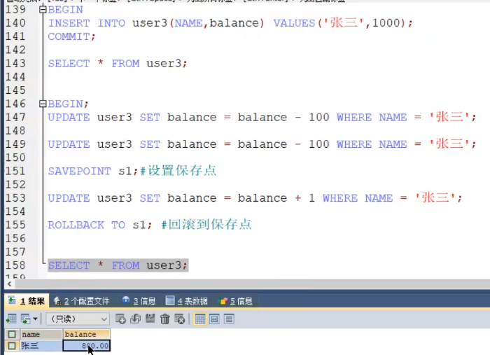

执行完上面后，其实还没到最终状态（提交或者回滚），只是回到保存点而已，所以现在假如再执行 `ROLLBACK;`，那么张三的余额是1000。

### 8.1.3 事务隔离级别

MySQL是一个 `客户端/服务器` 架构的软件，对于同一个服务器来说，可以有若干个客户端与之连接，每个客户端与服务器连接上之后，就可以称为一个`会话（ Session）`。每个客户端都可以在自己的会话中向服务器发出请求语句，一个请求语句可能是某个事务的一部分，也就是对于服务器来说可能同时处理多个事务。事务有`隔离性`的特性，理论上在某个事务`对某个数据进行访问`时，其他事务应该进行` 排队` ，当该事务提交之后，其他事务才可以继续访问这个数据。但是这样对性能影响太大，我们既想保持事务的隔离性，又想让服务器在处理访问同一数据的多个事务时 `性能尽量高些`，那就看二者如何权衡取舍了。

#### 8.1.3.1 数据准备

我们需要创建一个表：

```mysql
CREATE TABLE student ( 
  studentno INT, 
  name VARCHAR(20), 
  class varchar (20),
  PRIMARY KEY (studentno)
) Engine=InnoDB CHARSEl=utf8;
```

然后向这个表里插入一条数据：

```mysql
INSERT INTO student VALUES（1，'小谷'，，'1班')；
```

#### 8.1.3.2 数据并发问题

针对事务的隔离性和并发性，我们怎么做取舍呢？先看一下访问相同数据的事务 在 `不保证串行执行` 的情况下可能会出现哪些问题：

##### 8.1.3.2.1 脏写 (Dirty Write )

- 对于两个事务 Session A、 Session B，如果事务Session A `修改了` 另一个 `未提交` 事务Session B `修改过` 的数据，那就意味着发生了 脏写，示意图如下：

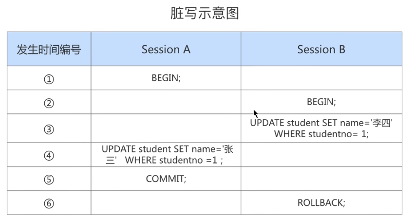

Session A和Session B各开启了一个事务，Session B中的事务先将studentno列为1的记录的name列更新为李四，然后Session A中的事务接着又把这条studentno列为1的记录的name列更新为张三。如果之后session B中的事务进行了`回滚`，那么Session A中的更新也将不复存在，这种现象就称之为脏写。这时Session A中的事务就没有效果了，明明把`数据更新了，最后也提交事务了`，最后看到的数据什么变化也没有。这里大家对事务的隔离级比较了解的话，会发现默认隔离级别下，上面SessionA中的更新语句会处于等待状态，这里只是跟大家说明一下会出现这样现象。

##### 8.1.3.2.2 脏读 (Dirty Read )

- 对于两个事务 session A、 Sesion B, Session A 读取了已经被 Session B 更新 但还 `没有被提交` 的字段。之后若Session B 回滚，Session A 读取 的内容就是 `临时且无效的`。

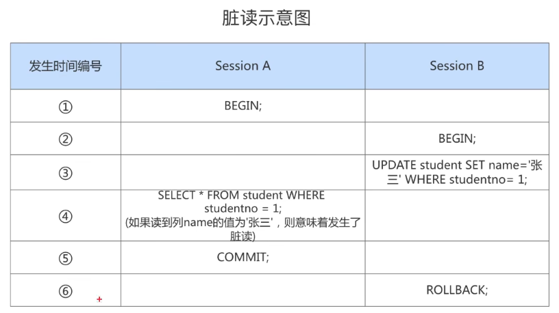

##### 8.1.3.2.3 不可重复读 ( Non-Repeatable Read )

- 对于两个事务Session A Session B, Session A `读取`了一个字段，然后 Session B`更新`了该字段。之后 Session A`再次读取` 同一个字段，`值就不同了`。那就意味着发生了不可重复读。

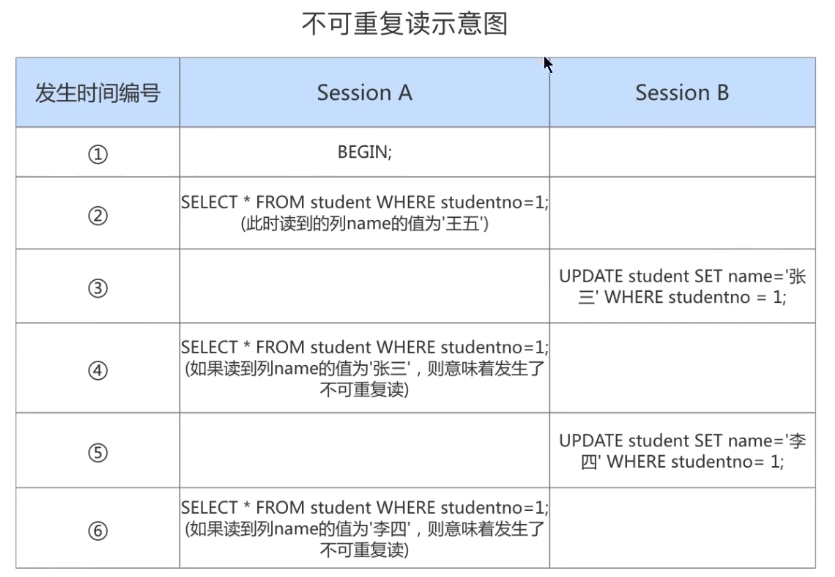

我们在Session B中提交了几个 `隐式事务（注意是隐式事务，意味着语句结束事务就提交了）`，这些事务都修改了studentno列为1的记录的列name的值，每次事务提交之后，如果Session A中的事务都可以查看到最新的值，这种现象也被称之为 `不可重复读`。

##### 8.1.3.2.4 幻读(Phantom）

对于两个事务Session A、Session B,Session A 从一个表中 `读取`了一个字段，然后 Session B在该表中`插入`了一些新的行。之后，如果 Session A `再次读取`同一个表，就会多出几行。那就意味着发生了`幻读`。

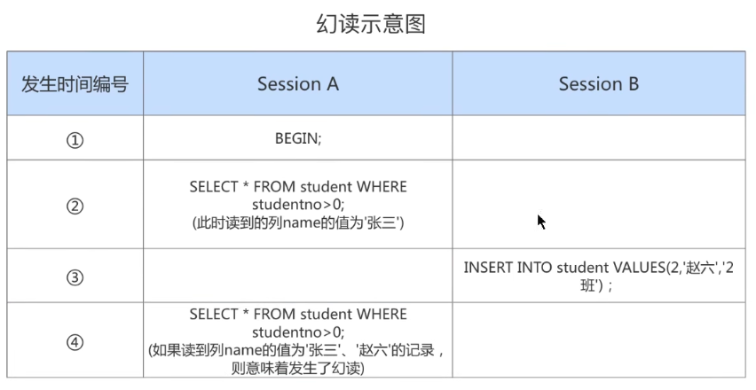

Session A中的事务先根据条件 studentno＞0 这个条件查询表student，得到了name列值为张三的记录；之后Session B中提交了一个 `隐式事务`，该事务向表student中插入了一条新记录；之后Session A中的事务再根据相同的条件 studentno＞0查询表student，得到的结果集中包含session B中的事务新插入的那条记录，这种现象也被称之为`幻读`。我们把新插入的那些记录称之为 `幻影记录`。

**注意1：**

有的同学会有疑问，那如果 Session B 中`删除了`一些符合 studentno＞0的记录而不是插入新记录，那Session A

之后再根据 studentno＞0 的条件读取的 `记录变少了`，这种现象算不算`幻读` 呢？这种现象 `不属于幻读`，幻读强调的是一个事务按照某个 `相同条件多次读取` 记录时，后读取时读到了`之前有读到的记录。`

**注意2：**

那对于先前已经读到的记录，之后又读取不到这种情况，算啥呢？这相当于对每一条记录都发生了 `不可重复读`的现象。幻读只是重点强调了读取到了之前读取没有获取到的记录。

#### 8.1.3.3 SQL中的四种隔离级别

按照`严重性`来排一下序：

```mysql
脏写 > 脏读 > 不可重复读 > 幻读
```

我们愿意舍弃一部分隔离性来换取一部分性能在这里就体现在：设立一些隔离级别，隔离级别越低，并发问题发生的就越多。`SQL标准` 中设立了4个` 隔离级别`：

- `READ UNCOMMITTED` ：读未提交，在该隔离级别，所有事务都可以看到其他未提交事务的执行结果。不能避免脏读、不可重复读、幻读。
- `READ COMMITTED` ：读已提交，它满足了隔离的简单定义：一个事务只能看见已经提交事务所做的改变。这是大多数数据库系统的默认隔离级别 （但不是MySQL默认的）。可以避免脏读，但不可重复读、幻读问题仍然存任。
- `REPEATABLE READ` ：可重复读，事务A在读到一条数据之后，此时事务B对该数据进行了修改并提交，那么事务A再读该数据，读到的还是原来的内容。可以避免脏读、不可重复读，但幻读问题仍然存在。`这是MySQL的默认隔离级别`。
- `SERIALIZABLE`：可串行化，确保事务可以从一个表中读取相同的行。在这个事务持续期间，禁止其他事务对该表执行插入、更新和删除操作。所有的并发问题都可以避免，但性能十分低下。能避免脏读、不可重复读和幻读。

`SQL标准` 中规定，针对不同的隔离级别，并发事务可以发生不同严重程度的问题，具体情况如下：

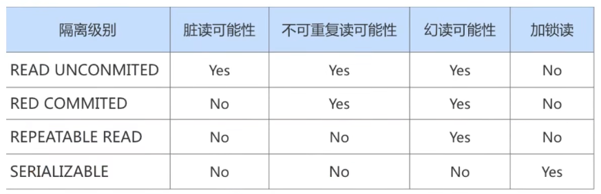

`脏写` 怎么没涉及到？因为脏写这个问题太严重了，不论是哪种隔离级别，都不允许脏写的情况发生。

不同的隔离级别有不同的现象，并有不同的锁和并发机制，隔离级别越高，数据库的并发性能就越差，4种事务

隔离级别与并发性能的关系如下：

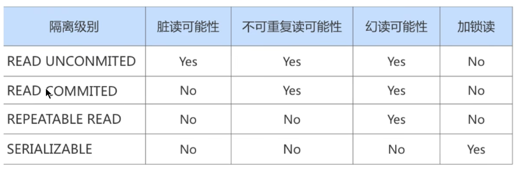

#### 8.1.3.4 MySQL支持的四种隔离级别

不同的数据库厂商对SQL标准中规定的四种隔离级别支持不一样。比如，`Oracle` 就只支持 `READ COMMITTED (默认隔离级别`）和`SERIALIZABLE隔离级别`。MySQL虽然支持4种隔离级别，但与SQL标准中所规定的各级隔离级别允许发生的问题却有些出入，MySQL在`REPEATABLE READ`隔离级别下，是可以禁止幻读问题的发生的，禁止幻读的原因我们在第16章讲解。

MySQL的默认隔离级别为REPEATABLE READ，我们可以手动修改一下事务的隔离级别。

```mysql
# 查看隔离级别，MySQL 5.7.20的版本之前：
mysql> SHOW VARIABLES LIKE 'tx_isolation';
+---------------+-----------------+
| Variable_name | Value      |
+---------------+-----------------+
| tx_isolation | REPEATABLE-READ |
+---------------+-----------------+
1 row in set (0.00 sec)

# MySQL 5.7.20版本之后，引入transaction_isolation来替换tx_isolation

# 查看隔离级别，MySQL 5.7.20的版本及之后：
mysql> SHOW VARIABLES LIKE 'transaction_isolation';
+-----------------------+-----------------+
| Variable_name     | Value      |
+-----------------------+-----------------+
| transaction_isolation | REPEATABLE-READ |
+-----------------------+-----------------+
1 row in set (0.02 sec)
#或者不同MySQL版本中都可以使用的：
SELECT @@transaction_isolation;
```

#### 8.1.3.5 如何设置事务的隔离级别

**通过下面的语句修改事务的隔离级别**：

```mysql
SET [GLOBAL|SESSION] TRANSACTION ISOLATION LEVEL 隔离级别;
#其中，隔离级别格式：
> READ UNCOMMITTED
> READ COMMITTED
> REPEATABLE READ
> SERIALIZABLE
```

或者：

```mysql
SET [GLOBAL|SESSION] TRANSACTION_ISOLATION = '隔离级别'
#其中，隔离级别格式：
> READ-UNCOMMITTED
> READ-COMMITTED
> REPEATABLE-READ
> SERIALIZABLE
```

**关于设置时使用GLOBAL或SESSION的影响**：

设置隔离级别：

```mysql
set session transaction_isolation = 'read-uncommitted';
```

查看隔离级别

```mysql
SELECT @@transaction_isolation;
```


> 上面的设置重启服务后失效，要想永久生效可以再配置文件中设置。

#### 8.1.3.6 不同隔离级别举例

创建表

```mysql
CREATE TABLE account (
id INT PRIMARY KEY AUTO_INCREMENT, 
NAME VARCHAR(15), 
balance DECIMAL (10, 2)
);
```

加入两条数据

```mysql
INSERT INTO account VALUES (1, '张三',100), (2, '李四' , 0);
```

演示脏读不好的地方：假如张三给李四转了100块，但是还没提交，张三跟李四说转过去了，你看下，李四查了账确实转过来了，然后张三此时回滚了操作，不想转100了。那李四后面查就发现没转过来啊，之前看是转过来了啊，懵了。

后面举例略。

> 补充：如果是可串行化级别，那么如果事务1使用SELECT语句查询某个数据，那么事务2就不能对这行数据进行修改，如果使用UPDATE时，会卡住等待（所以为什么隔离级别越高，并发越差）。

***

## 8.2 MySQL事务日志

事务有4种特性：`原子性`、`一致性`、`隔离性`和`持久性`。那么事务的四种特性到底是基于什么机制实现呢？

- 事务的隔离性由 `锁机制` 实现。
- 而事务的原子性、一致性和持久性由事务的 redo 日志和undo 日志来保证。
  - `REDO LOG` 称为 `重做日志` ，提供再写入操作，恢复提交事务修改的页操作，用来保证事务的持久性。
  - `UNDO LOG` 称为 `回滚日志` ，回滚行记录到某个特定版本，用来保证事务的原子性、一致性。

有的DBA或许会认为 UNDO是REDO 的逆过程，其实不然。REDO 和UNDO 都可以视为是一种`恢复操作`，但是：

- redo log：是存储引擎层(innodb)生成的日志，记录的是`”物理级别“`上的页修改操作，比如页号xx、偏移量yyy
   写入了 222 数据。主要为了保证数据的可靠性；
- undo log：是存储引擎层(innodb)生成的日志，记录的是`逻辑操作`日志，比如对某一行数据进行了INSERT语句操作，那么undo log就记录一条与之相反的DELETE操作。主要用于 `事务的回滚`(undo log 记录的是每个修改操作的`逆操作`）和` 一致性非锁定读`(undo log 回滚行记录到某种特定的版本--MVCC，即多版本井发控制)。

### 8.2.1 redo日志

InnoDB存储引擎是以 `页为单位` 来管理存储空间的。在真正访问页面之前，需要把在` 磁盘上`的页缓存到内存中的 `Buffer Pool `之后才可以访问。所有的变更都必须 `先更新缓冲池` 中的数据，然后缓冲池中的`脏页` 会以一定的频率被刷入磁盘（checkPoint机制），通过缓冲池来优化CPU和磁盘之间的鸿沟，这样就可以保证整体的性能不会下降太快。

#### 8.2.1.1 为什么需要redo日志

一方面，缓冲池可以帮助我们消除CPU和磁盘之间的鸿沟，checkpoint机制可以保证数据的最终落盘，然而由于checkpoint `并不是每次变更的时候就触发` 的，而是master线程隔一段时间去处理的。所以最坏的情况就是事务提交后，刚写完缓冲池，数据库宕机了，那么这段数据就是丢失的，无法恢复。

另一方面，事务包含 `持久性` 的特性，就是说对于一个已经提交的事务，在事务提交后即使系统发生了崩溃，这个事务对数据库中所做的更改也不能丢失。

那么如何保证这个持久性呢？ `一个简单的做法` ：在事务提交完成之前把该事务所修改的所有页面都刷新到磁盘，但是这个简单粗暴的做法有些问题：

- **修改量与刷新磁盘工作量严重不成比例**
  有时候我们仅仅修改了某个页面中的一个字节，但是我们知道在InnoDB中是以页为单位来进行磁盘I/O的，也就是说我们在该事务提交时不得不将一个完整的页面从内存中刷新到磁盘，我们又知道一个页面默认是16KB 大小，只修改—个字节就要刷新16KB的数据到磁盘上显然是太小题大做了。
- 随机IO刷新较慢
  一个事务可能包含很多语句，即使是一条语句也可能修改许多页面，假如该事务修改的这些页面可能并不相邻，这就意味着在将某个事务修改的BufferPool中的页面`刷新到磁盘` 时，需要进行很多的 `随机IO` ，随机IO比顺序IO要慢，尤其对于传统的机械硬盘来说。

`另一个解决的思路` ：我们只是想让已经提交了的事务对数据库中数据所做的修改永久生效，即使后来系统崩溃，在重启后也能把这种修改恢复出来。所以我们其实没有必要在每次事务提交时就把该事务在内存中修改过的全部页面刷新到磁盘，只需要把 `修改` 了哪些东西 `记录一下` 就好。比如，某个事务将系统表空间中 `第10号` 页面中偏移量为 `100` 处的那个字节的值 `1` 改成 `2` 。

InnoDB引擎的事务采用了WAL技术 (`Write-Ahead Logging`） ，这种技术的思想就是`先写日志，再写磁盘`，只有日志写入成功，才算事务提交成功，这里的日志就是redo log。 当发生宕机且数据未刷到磁盘的时候，可以通过redo log来恢复，保证ACID中的D，这就是redo log的作用。


#### 8.2.1.2 redo日志的好处、特点

##### ①好处

- **redo日志降低了刷盘频率**
- **redo日志占用的空间非常小**

##### ②特点

- **redo日志是顺序写入磁盘的**
- **事务执行过程中，redo log不断记录**

#### 8.2.1.3 redo的组成

Redo log可以简单分为以下两个部分：redo log buffer、redo log file（记录日志也是先存在缓存中（redo log buffer），然后再持久化到磁盘（redo log file））

- `重做日志的缓冲 (redo log buffer)`，保存在内存中，是易失的。

 在服务器启动时就向操作系统申请了一大片称之为redo log buffer的 `连续内存` 空间，翻译成中文就是redo日志缓冲区。这片内存空间被划分成若干个连续的`redo log block`(里面还细分为 header、body和trailer)。—个redo log block占用`512字节`大小。

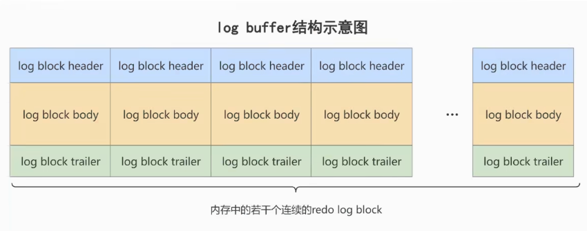

**参数设置**：`innodb_log_buffer_size`：
redo log buffer 大小，`默认 16M`，最大值是4096M，最小值为1M。

```mysql
mysql> show variables like '%innodb_log_buffer_size%';
+------------------------+----------+
| Variable_name     | Value  |
+------------------------+----------+
| innodb_log_buffer_size | 16777216 |
+------------------------+----------+
```

- `重做日志文件 (redo log file)`，保存在硬盘中，是持久的。

  REDO日志文件如图所示，其中的ib_logfile0和ib_logfile1即为REDO日志。 /usr/local/mysql/data

  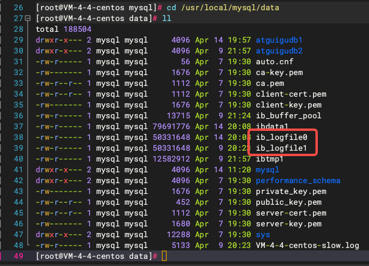

#### 8.2.1.4 redo的整体流程

以一个更新事务为例，`redo log` 流转过程，如下图所示：


```mysql
第1步：先将原始数据从磁盘中读入内存中来，修改数据的内存拷贝
第2步：生成一条重做日志并写入redo log buffer，记录的是数据被修改后的值
第3步：当事务commit时，将redo log buffer中的内容刷新到 redo log file，对 redo log file采用追加写的方式
第4步：定期将内存中修改的数据刷新到磁盘中
```

#### 8.2.1.5 redo log的刷盘策略

*redo log的写入并不是直接写入磁盘的*，InnoDB引擎会在写redo log的时候先写`redo log buffer`，之后以 `一定的频率` 刷入到真正的`redo log file` 中。这里的一定频率怎么看待呢？这就是我们要说的刷盘策略。

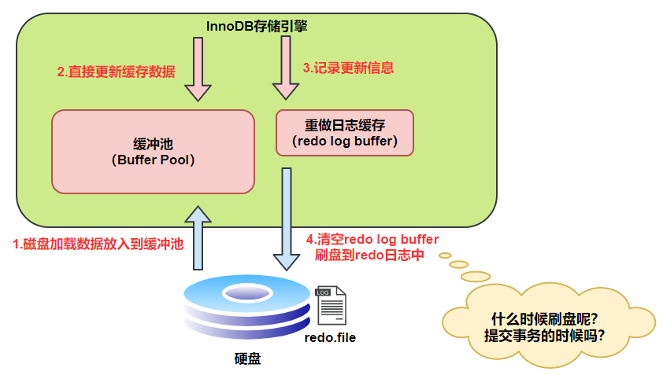

注意，redo log buffer刷盘到redo log file的过程并不是真正的刷到磁盘中去，只是刷入到 `文件系统缓存（page cache）`中去（这是现代操作系统为了提高文件写入效率做的一个优化），真正的写入会交给系统自己来决定（比如page cache足够大了）。
那么对于InnoDB来说就存在一个问题，如果交给系统来同步，同样如果系统宕机，那么数据也丢失了（虽然整个系统宕机的概率还是比较小的）。

针对这种情况，InnoDB给出 `innodb_flush_log_at_trx_commit`参数，该参数控制 commit提交事务时，如何将 redo log buffer 中的日志刷新到 redo log file 中。它支持`三种策略`：

- **设置为0** ：
  表示每次事务提交时`不进行刷盘操作`。（通过系统默认master thread每隔1s进行一次重做日志的同步）
- **设置为1** ：
  表示`每次事务提交时都将进行同步`，刷盘操作（ `默认值` ）
- **设置为2** ：
  表示`每次事务提交`时都只把 `redo log buffer 内容写入 page cache（操作系统的缓存）`，不进行同步。由os自己决定什么时候同步到磁盘文件。

```mysql
show variables like 'innodb_flush_log_at_trx_commit';
```

另外，InnoDB 存储引擎有一个后台线程，`每隔1秒`，就会把redo log buffer 中的内容写到文件系统缓存(page cache ）， 然后调用刷盘操作。

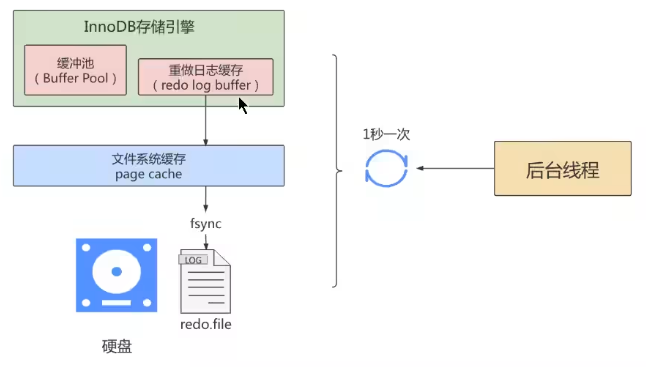

也就是说，一个没有提交事务的`redo log` 记录，也可能会刷盘。因为在事务执行过程redo log 记录是会写入`redo log buffer` 中，这些redo log 记录会被 `后台线程`刷盘。

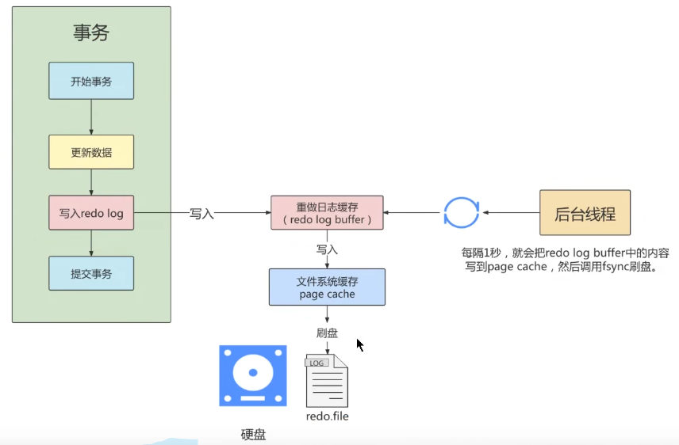

除了后台线程每秒 `1次` 的轮询操作，还有一种情况，当`redo log buffer` 占用的空间即将达到 `innodb_log_buffer_size`（这个参数默认是16M）的一半的时候，后台线程会主动刷盘。

#### 8.2.1.6 不同刷盘策略演示

①流程图

- 当参数为：`1` 的情况

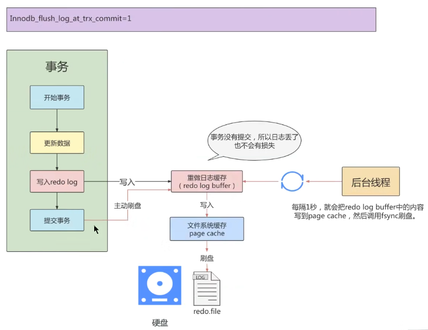

有这样一种情况，假如整个流程从`开始事务`到`提交事务`执行时间为2秒，而后台线程1秒刷一次，那么虽然参数是1，但是还没到提交事务呢，已经过了1秒了，这个时候还没等你提交事务主动刷盘呢，就有一部分数据已经被后台线程刷进去了。

> 小结：innodb_flush_log_at_trx_commit=1
>
> 为`1`时，只要事务提交成功，`redo log` 记录就一定在硬盘里，不会有任何数据丢失。
>
> 如果事务执行期间MySQL挂了或宕机，这部分日志丢了，但是事务并没有提交，所以日志丢了也不会有损失。可以保证ACID的D，数据绝对不会丢失，但是效率最差的。
>
> 建议使用默认值，虽然操作系统宕机的概率理论小于数据库宕机的概率，但是一般既然使用了事务，那么数据的安全相对来说更重要些。

***

当参数为 `2` 的情况：

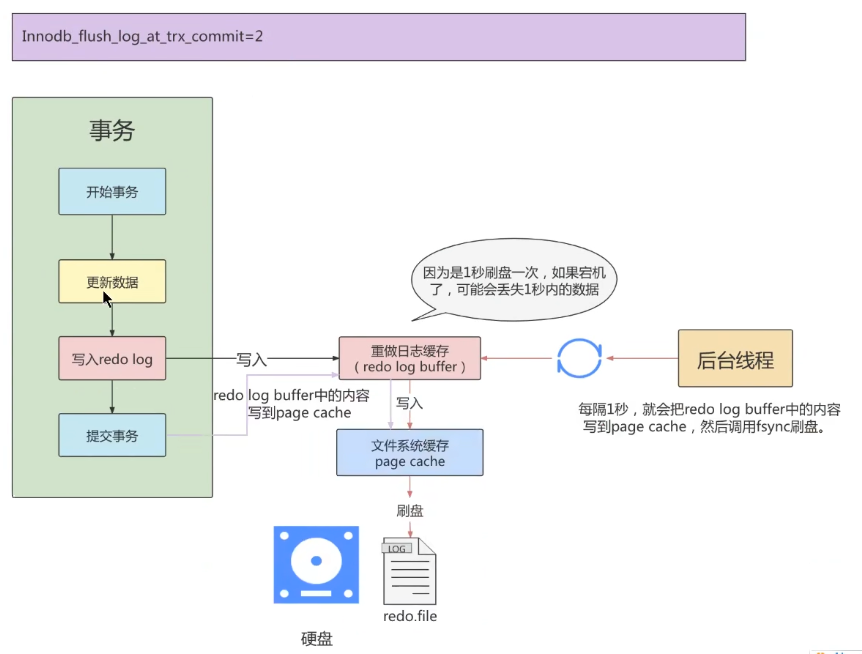

> 小结 innodb_ flush_log_at_trx_commit =2
>
> 为`2`时，只要事务提交成功，`redo log buffer` 中的内容只写入文件系统缓存 (page cache）。
>
> 如果仅仅只是 MySQL 挂了不会有任何数据丢失，但是操作系统宕机可能会有`1`秒数据的丢失，这种情况下无法满足ACID中的D。但是数值2肯定是效率最高的。

***

- 当参数为 `0` 的情况：

  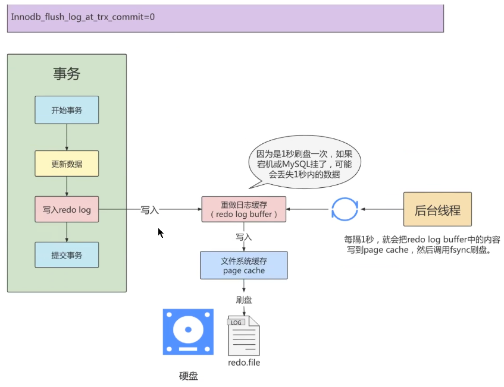

> 小结 innodb_ flush_log_at_trx_commit =0
>
> 为`0`时，效率最高，效率 `0>2>1`，但是风险也最高。默认1效率最低，但是风险最低。

> 补充：虽然用户可以通过设置参数innodb_flush_log_at_trx_commit为0或2来提高事务提交的性能，但需清楚，这种设置方法丧失了事务的ACID特性。

#### 8.2.1.7 写入redo log buffer过程

##### 8.2.1.7.1 补充概念：Mini-Transaction

MySQL把对底层页面中的一次原子访问的过程称之为一个 `Mini-Transaction`，简称`mtr`，比如，向某个索引对应的B+树中插入一条记录的过程就是一个`Mini-Transaction`。一个所谓的`mtr`可以包含一组redo日志，在进行崩溃恢复时这一组`redo` 日志作为一个不可分割的整体。

一个事务可以包含若干条语句，每一条语句其实是由若干个`mtr`组成，每一个`mtr` 又可以包含若干条redo日志，画个图表示它们的关系就是这样：


##### 8.2.1.7.2 redo日志写入log buffer

向 `log buffer` 中写入redo日志的过程是顺序的，也就是先往前边的block中写，当该block的空闲空间用完之后再往下一个block中写。当我们想往 `log buffer` 中写入redo日志时，第一个遇到的问题就是应该写在哪个`block`的哪个偏移量处，所以InnoDB 的设计者特意提供了一个称之为`buf_free`的全局变量，该变量指明后续写入的redo日志应该写入到` log buffer` 中的哪个位置，如图所示：


每个mtr都会产生一组redo日志，用示意图来描述一下这些mtr产生的日志情况：


不同的事务可能是 并发 `执行的`，所以 `T1`、 `T2` 之间的 `mtr`可能是 `交替执行` 的。


有的mtr产生的redo日志量非常大，比如`mtr_t1_2`产生的redo日志占用空间比较大，占用了3个block来存储。

##### 8.2.1.7.3 redo log block 的结构图

—个redo log block是由 `日志头`、`日志体`、`日志尾`组成。日志头占用12宇节，日志尾占用8字节，所以一个block真正能存储的数据就是512-12-8=492字节。

> 为什么一个block设计成512字节？
>
> 这个和磁盘的扇区有关，机械磁盘默认的扇区就是512字节，如果你要写入的数据大于512字节，那么要写入的扇区肯定不止一个，这时就要涉及到盘片的转动，找到下一个扇区，假设现在需要写入两个扇区A和B，如果扇区A写入成功，而扇区B写入失败，那么就会出现` 非原子性` 的写入，而如果每次只写入和扇区的大小一样的512字节，那么每次的写入都是原子性的。

#### 8.2.1.8 redo log file

略

##### 8.2.1.8.1 相关参数设置

- `innodb_log_group_home_dir` ：指定 redo log 文件组所在的路径，默认值为`./`(在服务器 /usr/local/mysql/data)，表示在数据库的数据目录下。MySQL的默认数据目录（ `var/lib/mysql` ）下默认有两个名为 `ib_logfile0` 和`ib_logfile1` 的文件，log buffer中的日志默认情况下就是刷新到这两个磁盘文件中。此redo日志文件位置还可以修改。
- `innodb_log_files_in_group`（log_files文件个数）：指明redo log file的个数，命名方式如：ib_logfile0，iblogfile1…iblogfilen。默认2个，最大100个。

```mysql
mysql> show variables like 'innodb_log_files_in_group';
+---------------------------+-------+
| Variable_name       | Value |
+---------------------------+-------+
| innodb_log_files_in_group | 2   |
+---------------------------+-------+
#ib_logfile0
#ib_logfile1
```

- `innodb_flush_log_at_trx_commit`：控制 redo log 刷新到磁盘的策略，默认为1。

- `innodb_log_file_size`（log_files文件个数中单个大小）：单个 redo log 文件设置大小，默认值为 `48M` 。

- 最大值为512G，注意最大值指的是整个 redo log 系列文件之和，即（innodb_log_files_in_group * innodb_log_file_size ）不能大于最大值512G。

  ```mysql
  mysql> show variables like 'innodb_log_file_size';
  +----------------------+----------+
  | Variable_name    | Value  |
  +----------------------+----------+
  | innodb_log_file_size | 50331648 |
  +----------------------+----------+
  ```

根据业务修改其大小，以便容纳较大的事务。编辑`my.cnf`文件并重启数据库生效，如下所示

```mysql
[root@localhost ~]# vim /etc/my.cnf
innodb_log_file_size=200M
```

##### 8.2.1.8.2 日志文件组

从上边的描述中可以看到，磁盘上的`redo` 日志文件不只一个，而是以一个日志文件组的形式出现的。这些文件以`ib_logfile[数字]`（数字 可以是0、1、2…）的形式进行命名，每个的redo日志文件大小都是一样的。在将redo日志写入日志文件组时，是从`ib_logfile0 `开始写，如果 `ib_logfile0` 写满了，就接着` ib_logfile1`写。同理，`ib_logfile1` 写满了就去写 `ib_logfile2`，依此类推。如果写到最后一个文件该咋办？那就重新转到`ib_logfile0` 继续写，所以整个过程如下图所示：


总共的redo日志文件大小其实就是： `innodb_log_file_size × innodb_log_files_in_group` 采用循环使用的方式向redo日志文件组里写数据的话，会导致后写入的redo日志覆盖掉前边写的redo日志？
当然！所以InnoDB的设计者提出了checkpoint的概念。

##### 8.2.1.8.3 checkpoint

在整个日志文件组中还有两个重要的属性，分别是`write pos`、 `checkpoint`

- `write pos` 是当前记录的位置，一边写一边后移
  - `checkpoint` 是当前要擦除的位置，也是往后推移（写入到磁盘中后，开始后移，因此write pos 往后到 checkpoint之间的数据都是在缓冲池中还没写入磁盘的，而write pos 往前到 checkpoint之间的数据都是可以继续写的，这是空闲区域或者是已经写入磁盘的可以被覆盖的数据）

每次刷盘 redo log 记录到日志文件组中，write pos位置就会后移更新。每次 MySQL 加载日志文件组恢复数据时，会清空加载过的redo log 记录，并把checkpoint后移更新。write pos 和checkpoint 之间的还空着的部分可以用来写入新的redo log 记录。


如果 write pos 追上 checkpoint ，表示日志文件组满了，这时候不能再写入新的 redo log记录，MySQL 得停下来，清空一些记录，把 checkpoint 推进一下。


#### 8.2.1.9 redo log 小结

相信大家都知道redo log 的作用和它的刷盘时机、存储形式：

**InnoDB 的更新操作采用的是 Write Ahead Log(预先日志持久化)策略，即先写日志，再写入磁盘。**

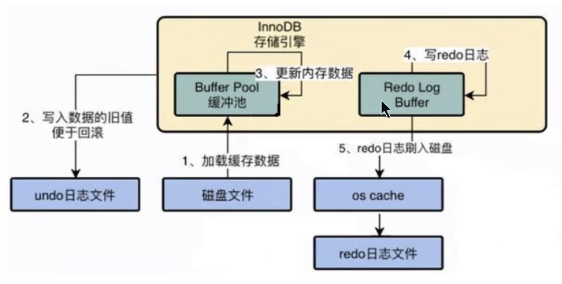

### 8.2.2 Undo日志

redo log是事务持久性的保证，`undo log`是事务`原子性`的保证。在事务中 `更新数据` 的 `前置操作` 其实是要先写入一个 `undo log` 。查询操作不会写入undo log

#### 8.2.2.1 如何理解Undo日志

undo log `会产生redo log`，也就是undo log的产生会伴随着redo log的产生，这是因为undo log 也需要持久性的保护。

#### 8.2.2.2 Undo日志的作用

- **作用1：回滚数据**

用户对undo日志可能 `有误解`：误以为undo用于将数据库物理地恢复到执行语句或事务之前的样子。但事实并非如此。undo是`逻辑日志`，因此只是将数据库逻辑地恢复到原来的样子。所有修改都被逻辑地取消了，但是数据结构和页本身在回滚之后可能大不相同。

这是因为在多用户并发系统中，可能会有数十、数百甚至数千个并发事务。数据库的主要任务就是协调对数据记录的并发访问。比如，一个事务在修改当前一个页中某几条记录，同时还有别的事务在对同一个页中另几条记录进行修改。因此，不能将一个页回滚到事务开始的样子，因为这样会影响其他事务正在进行的工作。

- **作用2：MVCC**

undo的另一个作用是MVCC，即在InnoDB存储引擎中MVCC的实现是通过undo来完成。当用户读取一行记录时，若该记录已经被其他事务占用，当前事务可以通过undo读取之前的行版本信息，以此实现非锁定读取。

#### 8.2.2.3 Undo的存储结构

##### 8.2.2.3.1 回滚段与undo页

InnoDB对undo log的管理采用段的方式，也就是 `回滚段（rollback segment）` 。每个回滚段记录了1024 个 `undo log segment`，而在每个`undo log segment`段中进行 `undo页` 的申请。

- 在 `InnoDB1.1版本之前` （不包括1.1版本），只有`一个rollback segment`，因此支持同时在线的事务限制为 `1024` 。虽然对绝大多数的应用来说都已经够用。

- 从`1.1版本开始`InnoDB支持最大 `128个rollback segment` ，故其支持同时在线的事务限制提高到了 `128*1024` 。

  ```mysql
  mysql> show variables like 'innodb_undo_logs';
  +------------------+-------+
  | Variable_name  | Value |
  +------------------+-------+
  | innodb_undo_logs | 128  |
  +------------------+-------+
  ```

##### 8.2.2.3.2 回滚段与事务


##### 8.2.2.3.3 回滚段中的数据分类

1. `未提交的回滚数据(uncommitted undo information）`：该数据所关联的事务并末提交，用于实现读一致性，所以该数据不能被其他事务的数据覆盖。
2. `已经提交但未过期的回滚数据(cormitted undo information)`：该数据关联的事务已经提交，但是仍受到 undo retention参数的保持时间的影响。
3. `事务已经提交并过期的数据 (expired undo information)`：事务已经提交，而且数据保存时间已经超过undo retention参数指定的时间，属于已经过期的数据。当回滚段满了之后，会优先覆盖〝事务已经提交并过期的数据”。

事务提交后并不能马上删除undo log及undo log所在的页。这是因为可能还有其他事务需要通过undo log来得到行记录之前的版本。故事务提交时将undo log放入一个链表中，是否可以最终删除undo log及undo log所在页由purge线程来判断。

#### 8.2.2.4 Undo的类型

在InnoDB存储引擎中，undo log分为：

-  `insert undo log`

insert undo log是指在insert操作中产生的undo log。因为insert操作的记录，只对事务本身可见，对其他事务不可见（这是事务隔离性的要求），故该undo log可以在事务提交后直接删除。不需要进行purge操作。

- `update undo log`

  update undo log记录的是对delete 和update操作产生的undo log。该undo log可能需要提供MVCC机制，因此不能在事务提交时就进行删除。提交时放入undo log链表，等待purge线程进行最后的删除。

#### 8.2.2.5 Undo log的生命周期

##### 8.2.2.5.1 简要生成过程

以下是undotredo事务的简化过程

假设有2个数值，分别为A=1和B=2，然后将A修改为3，B修改为4

```mysql
1. start transaction;
2．记录 A=1 到undo 1og:
3. update A =3:
4．记录 A=3 到redo 1og:

5．记录 B=2 到undo 1og:
6. update B = 4;
7．记录B= 4到redo 1og:
8．将redo 1og刷新到磁盘
9. commit
```

- 在1-8步骤的任意一步系统宕机，事务末提交，该事务就不会对磁盘上的数据做任何影响。
- 如果在8-9之间宕机，恢复之后可以选择回滚，也可以选择继续完成事务提交，因为此时redo log已经持久化。
- 若在9之后系统宕机，内存映射中变更的数据还来不及刷回磁盘，那么系统恢复之后，可以根据redo log把数据刷回磁盘。

**只有Buffer Pool的流程**：


**有了Redo Log和Undo Log之后**：


在更新Buffer Poo中的数据之前，我们需要先将该数据事务开始之前的状态写入Undo Log中。假设更新到一半出错了，我们就可以通过Undo Log来回滚到事务开始前。

##### 8.2.2.5.2 详细生成过程

对于InnoDB引擎来说，每个行记录除了记录本身的数据之外，还有几个隐藏的列：

- `DB_ROW_ID`：如果没有为表显式的定义主键，并且表中也没有定义唯一索引，那么InnoDB会自动为表添加一个row_id的隐藏列作为主键。
- `DB_TRX_ID`：每个事务都会分配一个事务ID，当对某条记录发生变更时，就会将这个事务的事务ID号写入trx_id中。
- `DB_ROLL_PTR`：回滚指针，本质上就是指向 undo log 的指针。

**当我们执行INSERT时：**

```mysql
begin;
INSERT INTO user (name) VALUES ("tom");
```

插入的数据都会生成一条 insert undo log，并且数据的回滚指针会指向它。undo log会记录undo log的序号、插入主键的列和值…，那么在进行rollback的时候，通过主键直接把对应的数据删除即可。


**当我们继续执行UPDATE时(续上面)**：

对于更新的操作会产生update undo log，并且会分更新主键的和不更新主键的，假设现在执行：

```mysql
UPDATE user SET name = 'Sun' WHERE id=7:
```


这时会把老的记录写入`新的undo log`，让回滚指针指向新的undo log，它的undo no是1，并且新的undo log会指向`老的undo log` (undo no=0) 。

假设现在执行：

```mysql
UPDATE user SET id=2 WHERE id=1;
```


对于更新主键的操作，会先把原来的数据deletemark标识打开，这时并没有真正的删除数据，真正的删除会交给清理线程去判断，然后在后面插入一条新的数据，新的数据也会产生undo log，并且undo log的序号会递增。

可以发现每次对数据的变更都会产生一个undo log，当一条记录被变更多次时，那么就会产生多条undo log，undo log记录的是变更前的日志，并且每个undolog的序号是递增的，那么当要回滚的时候，按照序号 `依次向前推`，就可以找到我们的原始数据了。

##### 8.2.2.5.3 undo log 是如何回滚的

以上面的例子来说，假设执行rolback，那么对应的流程应该是这样：

1. 通过undo no=3 的日志把id=2的数据删除
2. 通过undo no=2 的日志把id=1的数据的deletemark还原成0
3. 通过undo no=1 的日志把id=1的数据的name还原成Tom
4. 通过undo no=0的日志把id=1的数据删除

##### 8.2.2.5.4 undo log 的删除

- 针对于insert undo log

因为 insert 操作的记录，只对事务本身可见，对其他事务不可见。故该undo log可以在事务提交后直接删除，不需要进行purge操作。

- 针对于update undo log

该undo log可能需要提供MVCC机制，因此不能在事务提交时就进行删除。提交时放入undo log链表，等待purge线程进行最后的删除。

> 补充：
>
> purge线程两个主要作用是：清理undo页 和 清除page里面带有Delete_Bit标识的数据行。在InnoDB中，事务中的Delete作实际上并不是真正的删除掉数据行，而是一种Delete Mark操作，在记录上标识Delete_ Bit， 而不删除记录。是一种“假删除”：只是做了个标记，真正的删除工作需要后合purge线程去完成。

#### 8.2.2.6 小结

先找是否有加载对应的BufferPool有就使用没有就加载读取 ----> 写入UndoLog —>操作执行数据 —> 写入RedoLogBuffer内存 ----> 写入RedoLog到磁盘文件


`undo log`是**逻辑日志**，对事务回滚时，只是将数据库逻辑地恢复到原来的样子。

`redo log`是**物理日志**，记录的是数据页的物理变化，undo log不是redo log的逆过程（逻辑上的逆过程，但是物理上不是直接的逆过程）。

***

## 8.3 锁

`redo` 和 `undo`日志用来实现`原子性`、`一致性`和`持久性`。而事务的 `隔离性` 由 `锁` 来实现。

### 8.3.1 概述

`锁`是计算机协调多个进程或线程 `并发访问某一资源`的机制。在程序开发中会存在多线程同步的问题，当多个线程并发访问某个数据的时候，尤其是针对一些敏感的数据（比如订单、 金额等），我们就需要保证这个数据在任何时刻 `最多只有一个线程` 在访问，保证数据的` 完整性` 和`一致性`。在开发过程中加锁是为了保证数据的一致性，这个思想在数据库领域中同样很重要。

在数据库中，除传统的计算资源（如CPU、RAM、I/O等）的争用以外，数据也是一种供许多用户共享的资源。为保证数据的一致性，需要对 `并发操作进行控制`，因此产生了 `锁`。同时 `锁机制`也为实现MySQL的各个隔离级别提供了保证。`锁冲突` 也是影响数据库 `并发访问性能`的一个重要因素。所以锁对数据库而言显得尤其重要，也更加复杂。

### 8.3.2 MySQL并发事务访问相同记录

并发事务访问相同记录的情况大致可以划分为3种：

#### 8.3.2.1 读-读情况

`读-读` 情况，即并发事务相继 `读取相同的记录` 。读取操作本身不会对记录有任何影响，并不会引起什么问题，所以允许这种情况的发生。

#### 8.3.2.2 写-写情况

`写-写` 情况，即并发事务相继对相同的记录做出改动。

在这种情况下会发生 `脏写` 的问题，任何一种隔离级别都不允许这种问题的发生。所以在多个未提交事务相继对一条记录做改动时，需要让它们 `排队执行` ，这个排队的过程其实是通过 `锁` 来实现的。

这个所谓的锁其实是一个 `内存中的结构` ，在事务执行前本来是没有锁的，也就是说一开始是没有 `锁结构` 和记录进行关联的，如图所示：


当一个事务想对这条记录做改动时，首先会看看内存中有没有与这条记录关联的 `锁结构` ，当没有的时候就会在内存中生成一个 `锁结构` 与之关联。

比如，事务 T1 要对这条记录做改动，就需要生成一个 `锁结构与之关联`：


在`锁结构`里有很多信息，为了简化理解，只把两个比较重要的属性拿了出来：

- `trx信息`：代表这个锁结构是哪个事务生成的。
- `is_waiting`：代表当前事务是否在等待。

当事务 `T1` 改动了这条记录后，就生成了—个 `锁结构` 与该记录关联，因为之前没有别的事务为这条记录加锁，所以`is_waiting` 属性就是`false`我们把这个场景就称之为` 获取锁成功`，或者 `加锁成功`，然后就可以继续执行操作了。

在事务`T1` 提交之前，另一个事务`T2`也想对该记录做改动，那么先看看有没有 `锁结构` 与这条记录关联，发现有一个锁结构 与之关联后，然后也生成了一个锁结构与这条记录关联，不过锁结构的 `is_waiting` 属性值为`true`，表示当前事务需要等待，我们把这个场景就称之为 `获取锁失败`，或者 `加锁失败`，图示：


在事务`T1`提交之后，就会把该事务生成的 `锁结构释放` 掉，然后看看还有没有别的事务在等待获取锁，发现了事务

`T2`还在等待获取锁，所以把事务 T2对应的锁结构的`is_waiting` 属性设置为` false`，然后把该事务对应的线程

唤醒，让它继续执行，此时事务T2就算获取到锁了。效果图就是这样：


**小结几种说法**：

- 不加锁
  意思就是不需要在内存中生成对应的 `锁结构` ，可以直接执行操作。
- 获取锁成功，或者加锁成功
  意思就是在内存中生成了对应的 `锁结构` ，而且锁结构的`is_waiting`属性为 `false` ，也就是事务可以继续执行操作。
- 获取锁失败，或者加锁失败，或者没有获取到锁
  意思就是在内存中生成了对应的 `锁结构` ，不过锁结构的 `is_waiting` 属性为`true`，也就是事务需要等待，不可以继续执行操作。

#### 8.3.2.3 读-写或写-读情况

`读-写` 或`写-读` ，即一个事务进行读取操作，另一个进行改动操作。这种情况下可能发生 `脏读 、 不可重复读 、 幻读` 的问题。

各个数据库厂商对 SQL标准 的支持都可能不一样。比如`MySQL`在 `REPEATABLE READ` 隔离级别上就已经解决了 `幻读` 问题。

#### 8.3.2.4 并发问题的解决方案

怎么解决 `脏读 、 不可重复读 、 幻读` 这些问题呢？其实有两种可选的解决方案：

- 方案一：读操作利用多版本并发控制（ `MVCC` ），写操作进行 `加锁`。

  所谓的`MVCC`，就是生成一个`ReadView`，通过ReadView找到符合条件的记录版本（历史版本由 `undo日志`构建）。查询语句只能读到在生成ReadView之前 `己提交事务所做的更改`，在生成ReadView之前未提交的事务或者之后才开启的事务所做的更改是看不到的。而`写操作` 肯定针对的是` 最新版本的记录`，读记录的历史版本和改动记录的最新版本本身并不冲突，也就是采用MVCC时，`读-写`操作并不冲突。

  > 普通的SELECT语句在READ COMMITTED和REPEATABLE READ隔离级别下会使用到MVCC读取记录。
  >
  > -  在 `READ COMMITTED`隔离级别下，一个事务在执行过程中每次执行SELECT操作时都会生成一个ReadView，ReadView的存在本身就保证了 `事务不可以读取到未提交的事务所做的更改` ，也就是避免了脏读现象；
  > -  在 `REPEATABLE READ` 隔离级别下，一个事务在执行过程中只有 `第一次执行SELECT操作` 才会生成一个ReadView，之后的SELECT操作都 `复用` 这个ReadView，这样也就避免了不可重复读和幻读的问题。

- 方案二：读、写操作都采用 `加锁` 的方式。

如果我们的一些业务场景不允许读取记录的旧版本，而是每次都心须去 `读取记录的最新版本`。比如，在银行存款的事务中，你需要先把账户的余额读出来，然后将其加上本次存款的数额，最后再写到数据库中。在将账户余额读取出来后，就不想让别的事务再访问该余额，直到本次存款事务执行完成，其他事务才可以访问账户的余额。这样在读取记录的时候就需要对其进行 `加锁` 操作，这样也就意味着`读操作`和 `写操作`也像`写-写操作`那样 `排队`执行。

`脏读` 的产生是因为当前事务读取了另一个未提交事务写的一条记录，如果另一个事务在写记录的时候就给这条记录加锁，那么当前事务就无法继续读取该记录了，所以也就不会有脏读问题的产生了。

`不可重复读` 的产生是因为当前事务先读取一条记录，另外一个事务对该记录做了改动之后并提交之后，当前事务再次读取时会获得不同的值，如果在当前事务读取记录时就给该记录加锁，那么另一个事务就无法修改该记录，自然也不会发生不可重复读了。

`幻读`问题的产生是因为当前事务读取了一个范围的记录，然后另外的事务向该范围内插入了新记录，当前事务再次次读取该范围的记录时发现了新插入的新记录。采用加锁的方式解决幻读问题就有一些麻烦，因为当前事务在第一次读取记录时幻影记录并不存在，所以读取的时候加锁就有点尴尬（因为你并不知道给谁加锁），【比如A读取age<30的记录有3条，并把这3条记录加了锁，但是B可以继续insert a ge<30的记录，这样A再次读取就4条记录了，这就出现了幻读了。】


**小结对比发现**：

- 采用 `MVCC` 方式的话，`读-写` 操作彼此并不冲突， `性能更高` 。
- 采用 `加锁` 方式的话，`读-写` 操作彼此需要 排队执行 ，`影响性能`。

一般情况下我们当然愿意采用 `MVCC` 来解决 `读-写` 操作并发执行的问题，但是业务在某些特殊情况下，要求必须采用 `加锁` 的方式执行。

### 8.3.3 锁的不同角度分类

#### 8.3.3.1 从数据操作的类型划分：读锁/共享锁、写锁/排他锁

对于数据库中并发事务的`读-读` 情况并不会引起什么问题。对于 `写-写`、`读-写`或`写-读`这些情况可能会引起一些问题，需要使用 `MVCC `或者` 加锁 `的方式来解决它们。在使用`加锁` 的方式解决问题时，由于既要允许 `读-读`情况不受影响，又要使` 写-写`、`读-写` 或`写-读`情况中的操作 `相互阻塞`，所以MySQL实现一个由两种类型的锁组成的锁系统来解决。这两种类型的锁通常被称为 `共享锁 (Shared Lock, S Lock） `和`排他锁 (Exclusive Lock, X Lock)` 也叫 `读锁 (readlock）`和`写锁 (write lock)`。

- `读锁`：也称为 `共享锁`、英文用`S`表示。针对同一份数据，多个事务的读操作可以同时进行而不会互相影响，相互不阻塞的。

- `写锁`：也称为`排他锁`、英文用`X` 表示。当前写操作没有完成前，它会阻断其他写锁和读锁。这样就能确保在给定的时间里，只有一个事务能执行写入，并防止其他用户读取正在写入的同一资源。

**需要注意的是对于 InnoDB 引擎来说，读锁和写锁可以加在表上，也可以加在行上。**

**举例（行级读写锁）**：如果一个事务T1 已经获得了某个行r的读锁，那么此时另外的一个事务 T2是可以去获得这个行r的读锁的，因为读取操作井没有改变行r的数据：但是，如果某个事务 T3根获得行r的写锁，则它必须等待事务 T1、T2 释放掉行r上的读锁才行。

总结：这里的兼容是指对同一张表或记录的锁的兼容性情况。

|      | X锁    | S锁    |
| ---- | ------ | ------ |
| X锁  | 不兼容 | 不兼容 |
| S锁  | 不兼容 | `兼容` |

##### 8.3.3.1.1 锁定读

在采用 `加锁` 方式解决 `脏读`、 `不可重复读`、`幻读` 这些问题时，读取一条记录时需要获取该记录的 `S锁`，其实是不严谨的，有时候需要在读取记录时就获取记录的`X锁`，来禁止别的事务读写该记录，为此MySQL提出了两种比较特殊的 `SELECT` 语句格式：

- 对读取的记录加`S锁`：

  ```mysql
  SELECT ... LOCK IN SHARE MODE;
  #或
  SELECT ... FOR SHARE; #(8.日新增语法）
  ```

在普通的SELECT语句后边加` LOCK IN SHARE MODE`，如果当前事务执行了该语句，那么它会为读取到的记录加`S锁`，这样允许别的事务继续获取这些记录的`S锁`（比方说别的事务也使用 `SELECT ... LOCK IN SHARE MODE` 语句来读取这些记录），但是不能获取这些记录的`X锁`（比如使用 `SELECT ... FOR UPDATE` 语句来读取这些记录，或者直接修改这些记录）。如果别的事务想要获取这些记录的`X锁`，那么它们会阻塞，直到当前事务提交之后将这些记录上的`S锁`释放掉。

- 对读取的记录加`X锁`：

  ```mysql
  SELECT ... FOR UPDATE
  ```

在普通的SELECT语句后边加 `FOR UPDATE`，如果当前事务执行了该语句，那么它会为**读取到的记录**加`X锁`（没有读取到的记录不加锁，其他事务也能读取），这样既不允许别的事务获取这些记录的 `S锁`（比方说别的事务使用 `SELECT ... LOCK IN SHARE MODE `语句来读取这些记录），也不允许获取这些记录的`X锁`（比如使用 `SELECT ...FOR UPDATE` 语句来读取这些记录，或者直接修改这些记录）。如果别的事务想要获取这些记录的`S锁` 或者 `X锁`，那么它们会阻塞，直到当前事务提交之后将这些记录上的`X锁`释放掉。

**MySQL8.0新特性：**

在5.7及之前的版本，SELECT ... FOR UPDATE，如果获取不到锁，会一直等待，直到 `innodb_lock-wait_timeout` 超时。在8.0版本中，SELECT ... FOR UPDATE, SELECT ... FOR SHARE 添加 `NOWAIT` 、`SKIP LOCKED` 语法，跳过锁等待，或者跳过锁定。

- 通过添加NOWAIT、SKIP LOCKED语法，能够立即返回。如果查询的行已经加锁：

  - 那么NOWAIT会立即报错返回
  - 而SKIP LOCKED也会立即返回，只是返回的结果中不包含被锁定的行。

  ```mysql
  select * from account for update nowait;
  
  select * from account for update skip locked;
  ```

##### 8.3.3.1.2 写操作

平常所用到的 `写操作` 无非是 `DELETE` 、`UPDATE`、`INSERT `这三种：

- `DELETE`：

  对一条记录做DELETE操作的过程其实是先在 `B+`树中定位到这条记录的位置，然后获取这条记录的`X锁`，再执行`delete mark` 操作(将记录中隐藏字段delete mark改成1)。我们也可以把这个定位待删除记录在B+树中位置的过程看成是一个获取`X锁`的`锁定读`。

- `UPDATE`：在对一条记录做UPDATE操作时分为`三种情况`：

  - `情况1`：未修改该记录的键值（主键），并且被更新的列占用的存储空间在修改前后未发生变化。

    则先在 B+树中定位到这条记录的位置，然后再获取一下记录的`X锁`，最后在原记录的位置进行修改操作。我们也可以把这个定位待修改记录在B+树中位置的过程看成是一个获取`X锁` 的`锁定读`。

  - `情况2`：未修改该记录的键值，并且至少有一个被更新的列占用的存储空间在修改前后发生变化。
    则先在 B+树中定位到这条记录的位置，然后获取一下记录的`X锁`，将该记录彻底删除掉（就是把记录彻底移入垃圾链表），最后再插入一条新记录。这个定位待修改记录在B+树中位置的过程看成是一个获取`X 锁`的`锁定读`，新插入的记录由 `INSERT`操作提供的`隐式锁`进行保护。

  - `情况3`：修改了该记录的键值，则相当于在原记录上做DELETE操作之后再来一次 INSERT 操作，加锁操作
    就需要按照DELETE 和INSERT 的规则进行了。

- `INSERT` ：

  一般情况下，新插入一条记录的操作并不加锁，通过一种称之为`隐式锁` 的结构来保护这条新插入的记录在本事务提交前不被别的事务访问。

#### 8.3.3.2 从数据操作的粒度划分：表级锁、页级锁、行锁

为了尽可能提高数据库的并发度，每次锁定的数据范围越小越好，理论上每次只锁定当前操作的数据的方案会得到最大的并发度，但是管理锁是很`耗资源` 的事情（涉及获取、检查、释放锁等动作）。因此数据库系统需要在`高并发响应` 和 `系统性能` 两方面进行平衡，这样就产生了"`锁粒度 (Lock granularity）`"的概念。

对一条记录加锁影响的也只是这条记录而已，我们就说这个锁的粒度比较细；其实一个事务也可以在 `表级别`进行加锁，自然就被称之为 `表级锁` 或者 `表锁`，对一个表加锁影响整个表中的记录，我们就说这个锁的粒度比较粗。锁的粒度主要分为表级锁、页级锁和行锁。

##### 8.3.3.2.1 表锁（Table Lock）

该锁会锁定整张表，它是 MySQL 中最基本的锁策路，并 `不依赖于存储引擎` （不管你是MySQL 的什么存储引擎，对于表锁的策略都是一样的），并且表锁是 `开销最小` 的策路（因为粒度比较大）。由于表级锁一次会将整个表锁定，所以可以很好的`避绝死锁`问题。当然，锁的粒度大所带来最大的负面影响就是出现锁资源争用的概率也会最高，导致 `并发率大打折扣`。

###### 8.3.3.2.1.1 表级别的S锁、X锁

在对某个表执行SELECT、INSERT、DELETE、UPDATE语句时，InnoDB存储引擎是不会为这个表添加表级别的 `S锁`或者`X锁` 的。在对某个表执行一些诸如 `ALTER TABLE` 、 `DROP TABLE` 这类的 DDL 语句时，其他事务对这个表并发执行诸如SELECT、INSERT、DELETE、UPDATE的语句会发生阻塞。同理，某个事务中对某个表执行SELECT、INSERT、DELETE、UPDATE语句时，在其他会话中对这个表执行 `DDL` 语句也会发生阻塞。这个过程其实是通过在 `server层` 使用一种称之为 `元数据锁` （英文名： Metadata Locks ，简称 MDL ）结构来实现的。

一般情况下，不会使用InnoDB存储引擎提供的表级别的 `S锁` 和 `X锁` 。只会在一些特殊情况下，比方说 崩溃恢复 过程中用到。比如，在系统变量 `autocommit=0`，`innodb_table_locks = 1` 时， 手动 获取InnoDB存储引擎提供的表t 的 `S锁`或者 `X锁` 可以这么写：

- `LOCK TABLES t READ` ：InnoDB存储引擎会对表 t 加表级别的 `S锁` 。

- `LOCK TABLES t WRITE` ：InnoDB存储引擎会对表 t 加表级别的 `X锁` 。

  ```mysql
  LOCK TABLES account READ; # 加S锁
  show open tables where in_use > 0; # 查看当前的锁
  unlock tables;  # 解锁
  LOCK TABLES account WRITE # 加X锁
  ```

  

不过尽量避免在使用InnoDB存储引擎的表上使用`LOCK TABLES` 这样的手动锁表语句，它们并不会提供什么额外的保护，只是会降低并发能力而已。InnoDB的厉害之处还是实现了更细粒度的`行锁` ，关于InnoDB表级别的 `S锁`和 `X锁` 大家了解一下就可以了。

MySQL的表级锁有两种模式：（以`MyISAM表`进行操作的演示）

- 表共享读锁（Table Read Lock）
- 表独占写锁（Table Write Lock）


###### 8.3.3.2.1.2 意向锁（intention lock）

InnoDB 支持 `多粒度锁 (multiple granularity locking）`，它允许 `行级锁` 与 `表级锁` 共存，而**意向锁**就是其中的一种 `表锁`。

1. 意向锁的存在是为了协调行锁和表锁的关系，支持多粒度（表锁与行锁）的锁并存。
2. 意向锁是一种 `不与行级锁冲突表级锁`，这一点非常重要。
3. 表明“某个事务正在某些行持有了锁或该事务准备去持有锁”

意向锁分为两种：

- `意向共享锁 (intention shared lock,IS)`：事务有意向对表中的某些行加`共享锁`（S锁）

  ```mysql
  # 事务要获取某些行的 S 锁，必须先获得表的 IS 锁。
  SELECT column FROM table ... LOCK IN SHARE MODE;
  ```

- `意向排他锁 (intention exclusive lock,IX)`：事务有意向对表中的某些行加`排他锁`（X锁）

  ```mysql
  # 事务要获取某些行的 X 锁，必须先获得表的 IX 锁。
  SELECT column FROM table... FOR UPDATE;
  ```

  即：意向锁是由存储引擎 `自己维护的`，用户无法手动操作意向锁，在为数据行加共享 / 排他锁之前，InooDB 会先获取该数据行 `所在数据表的对应意向锁`。

**1.意向锁要解决的问题**

现在有两个事务，分别是T1和T2，其中T2试图在该表级别上应用共享或排它锁，如果没有意向锁存在，那么T2就需要去检查各个页或行是否存在锁；如果存在意向锁，那么此时就会受到由T1控制的`表级别意向锁的阻塞`。T2在锁定该表前不必检查各个页或行锁，而只需检查表上的意向锁。简单来说就是给更大一级别的空间示意里面是否已经上过锁。

在数据表的场景中，**如果我们给某一行数据加上了排它锁，数据库会自动给更大一级的空间，比如数据页或数据表加上意向锁，告诉其他人这个数据页或数据表已经有人上过排它锁了**，这样当其他人想要获取数据表排它锁的时候，只需要了解是否有人已经获取了这个数据表的意向排他锁即可。

- 如果事务想要获得数据表中某些记录的`共享锁`，就需要在数据表上 `添加意向共享锁`
- 如果事务想要获得数据表中某些记录的`排他锁`，就需要在数据表上 `添加意向排他锁`。

这时，意向锁会告诉其他事务已经有人锁定了表中的某些记录。

意向锁之间的兼容互斥性，如下所示：

|                  | 意向共享锁（IS） | 意向排他锁（IX） |
| ---------------- | ---------------- | ---------------- |
| 意向共享锁（IS） | 兼容             | 兼容             |
| 意向排他锁（IX） | 兼容             | 兼容             |

即意向锁之间是互相兼容的，里然意向锁和自家兄弟互相兼容，但是它会与普通的排他/ 共享锁互斥。

|                       | 意向共享锁（IS） | 意向排他锁（IX） |
| --------------------- | ---------------- | ---------------- |
| 【表级别】共享锁（S） | 兼容             | 互斥             |
| 【表级别】排他锁（X） | 互斥             | 互斥             |

**注意：上表的排他/共享锁指的都是表锁，意向锁不会与行级的共享/排他锁互斥。**

###### 8.3.3.2.1.3 自增锁（AUTO- INC锁）（了解）

在使用MySQL过程中，我们可以为表的某个列添加 `AUTO_INCREMENT`属性。举例：

```mysql
CREATE TABLE `teacher` (
	 `id` int NOT NULL AUTO_INCREMENT,
	 `name` varchar(255) NOT NULL,
	 PRIMARY KEY (`id`)
) ENGINE=InnoDB DEFAULT CHARSET=utf8mb4 COLLATE=utf8mb4_0900_ai_ci;
```

由于这个表的id字段声明了AUTO_INCREMENT，意味着在书写插入语句时不需要为其赋值，SQL语句修改如下所示。

```mysql
INSERT INTO `teacher` (name) VALUES ('zhangsan'), ('lisi');
```

现在我们看到的上面插入数据只是一种简单的插入模式，所有插入数据的方式总共分为三类，分别是“`Simple inserts`”, “`Bulk inserts` ”和"`Mixed-mode inserts`”。

1. **“Simple inserts”（简单插入）**

可以 `预先确定要插入的行数`（当语句被初始处理时）的语句。包括没有嵌套子查询的单行和多行`INSERT... VALUES(）` 和`REPLACE` 语句。比如我们上面举的例子就属于该类插入，已经确定要插入的行数。

2. **“Bulk inserts”（批量插入）**

事先不知道要插入的行数（和所需自动递增值的数量）的语句。比如`INSERT...SELECT`, `REPLACE ...`,`SELECT` 和` LOAD DATA `语句，但不包括纯INSERT。 InnoDB在每处理一行，为AUTO_INCREMENT列分配一个新值。

3. **“Mixed-mode inserts”（混合模式插入）**

这些是“Simple inserts”语句但是指定部分新行的自动递增值。例如` INSERT INTO teacher (id, name) VALUES(1, "a"),(NULL, "B"),(5,"c'),(NULL,"d')`：只是指定了部分id的値。另一种类型的“混合模式插入“是 `INSERT ... ON DUPLICATE KEY UPDATE`。

```mysql
mysql> INSERT INTO teacher (id,name) VALUES (1,'a'),(NULL,'b'),(5,'c'),(NULL,'d');
Query OK, 4 rows affected (0.01 sec)
mysql> select * from teacher;
+----+------+
| id | name |
+----+------+
|  1 | a    |
|  2 | b    |
|  5 | c    |
|  6 | d    |
+----+------+
4 rows in set (0.00 sec)
mysql>
```

对于上面数据插入的案例，MySQL中采用了 `自增锁` 的方式来实现，**AUTO-INC锁是当向使用含有AUTO_INCREMENT列的表中插入数据时需要获取的一种特殊的表级锁**，在执行插入语句时就在表级别加一个AUTO-INC锁，然后为每条待插入记录的AUTO_ INCREMENT修饰的列分配递增的值，在该语向执行结束后，再把AUTO-INC锁释放掉。**一个事务在持有AUTO-INC锁的过程中，其他事务的插入语句都要被阻塞**，可以保证一个语句中分配的递增值是连续的。也正因为此，`其并发性显然并不高`，当我们向一个有AUTO_INCREMENT关键字的主键插入值的时候，每条语句都要对这个表锁进行竞争，这样的并发潜力其实是很低下的，所以innodb通过 `innodb_autoinc_lock_mode`的不同取值来提供不同的锁定机制，来显著提高SQL语句的可伸缩性和性能。

innodb_autoinc_lock_mode有三种取值，分别对应与不同锁定模式：

- `(1)innodb_autoinc_lock_mode = 0 (“传统”锁定模式）`

在此锁定模式下，所有类型的insert语句都会获得一个特殊的表级`AUTO-INC锁`，用于插入具有`AUTO_INCREMENT`列的表。这种模式其实就如我们上面的例子，即每当执行insert的时候，都会得到一个表级锁(AUTO-INC锁），使得语句中生成的auto_increment为顺序，且在binlog中重放的时候，可以保证master与slave中数据的auto_increment是相同的。因为是表级锁，当在同一时间多个事务中执行insert的时候，对于AUTO-NC锁的争夺会 `限制并发`能力。

- `(2)innodb_autoinc_1ock_mode =1 （“连续”锁定模式）`

在MySQL 8.0 之前，连续锁定模式是`默认`的。

在这个模式下，“Bulk inserts"仍然使用AUTO-INC表级锁，并保持到语句结束。这适用于所有`INSERT... SELECT`,`REPLACE ... SELECT`和`LOAD DATA`语句。同一时刻只有一个语句可以持有AUTO-INC锁。

对于“Simple inserts”（要插入的行数事先已知，如果事务拿到锁后，假如知道要插入10条记录，那么一次性申请十个值就行了，然后就释放这个锁，然后自己该添加添加，也不影响其他事务获取锁），则通过在 `mutex（轻量锁）`的控制下获得所需数量的自动递增值来避免表级AUTO-INC锁（先获得），它只在分配过程的持续时间内保持，而不是直到语句完成。不使用表级AUTO-INC锁，除非AUTO-INC锁由另一个事务保持。如果另一个事务保持AUTO-INC锁，则"Simple inserts”等待AUTO-INC锁，如同它是一个“bulk inserts”。

- `(3) innodb_autoinc_1ock_mode= 2（“交错”锁定模式）`

从MySQL 8.0 开始，交错锁模式是 `默认` 设置。

在这种锁定模式下，所有类NSERT语句都不会使用表级AUTO-INC 锁，并且可以同时执行多个语句。这是最快和最可扩展的锁定模式，但是当使用基于语句的复制或恢复方案时，**从二进制日志重播SQL语句时，这是不安全的。**

在此锁定模式下，自动递增值 `保证` 在所有并发执行的所有类型的insert语向中是`唯一`	且` 单调递增`的。但是，由于多个语句可以同时生成数字（即，跨语句交叉编号），**为任何给定语句插入的行生成的值可能不是连续的。**

如果执行的语句是“simple inserts'，其中要插入的行数已提前知道，除了“Mixed-mode inserts"之外，为单个语句生成的数字不会有间隙。然而，当执行“bulk inserts”时，在由任何给定语句分配的自动递增值中可能存在间隙。

***

###### 8.3.3.2.1.4 元数据锁（MDL锁）

MySQL5.5引入了meta data lock，简称MDL锁，属于表锁范畴。MDL 的作用是，保证读写的正确性。比如，如果一个查询正在遍历一个表中的数据，而执行期间另一个线程对这个 `表结构做变更` ，增加了一列，那么查询线程拿到的结果跟表结构对不上，肯定是不行的。

因此，当对一个表做增删改查操作的时候，加 `MDL`读锁；当要对表做结构变更操作的时候，加 `MDL` 写锁。

读锁之间不互斥，因此你可以有多个线程同时对一张表增删改查。读写锁之间、写锁之间是互斥的，用来保证变更表结构操作的安全性，解决了DML和DDL操作之间的一致性问题。 `不需要显式使用`，在访问一个表的时候会被自动加上。

***

##### 8.3.3.2.2 InnoDB中的行锁

行锁（Row Lock） 也称为记录锁，顾名思义，就是锁住某一行（某条记录row）。需要的注意的是，MySQL服务器层并没有实现行锁机制，**行级锁只在存储引擎层实现**。

**优点**：锁定力度小，发生 `锁冲突概率低`，可以实现的 `并发度高`。

**缺点**：对于 `锁的开销比较大`，加锁会比较慢，容易出现`死锁`情况。

InnoDB与MyISAM的最大不同有两点：一是支持事务 (TRANSACTION)；二是采用了行级锁.

###### 8.3.3.2.2.1 记录锁（Record Locks）


记录锁是有S锁和X锁之分的，称之为 `S型记录锁` 和 `X型记录锁` 。

- 当一个事务获取了一条记录的S型记录锁后，其他事务也可以继续获取该记录的S型记录锁，但不可以继续获取X型记录锁；
- 当一个事务获取了一条记录的X型记录锁后，其他事务既不可以继续获取该记录的S型记录锁，也不可以继续获取X型记录锁。

###### 8.3.3.2.2.2 间隙锁 （Gap Locks）

MySQL 在 `REPEATABLE READ` 隔离级别下是可以解决幻读问题的，解决方案有两种，可以使用 `MVCC` 方案解决，也可以采用 `加锁` 方案解决。但是在使用加锁方案解决时有个大问题，就是事务在第一次执行读取操作时，那些幻影记录尚不存在，我们无法给这些 `幻影记录` 加上 `记录锁` 。InnoDB提出了一种称之为Gap Locks 的锁，官方的类型名称为： `LOCK_GAP` ，我们可以简称为 `gap锁` 。

间隙锁容易导致死锁。

###### 8.3.3.2.2.3 临键锁（Next-Key Locks）

有时候我们既想 `锁住某条记录` ，又想 阻止 其他事务在该记录前边的 `间隙插入新记录` ，所以InnoDB就提出了一种称之为 `Next-Key Locks` 的锁，官方的类型名称为： `LOCK_ORDINARY`，我们也可以简称为next-key锁 。Next-Key Locks是在存储引擎 `innodb` 、事务级别在 可重复读 的情况下使用的数据库锁，innodb默认的锁就是Next-Key locks。

###### 8.3.3.2.2.4 插入意向锁（insert Intention Locks）

##### 8.3.3.2.3 页锁

**页锁**就是在 `页的粒度`上进行锁定，锁定的数据资源比行锁要多，因为一个页中可以有多个行记录。

当我们使用页锁的时候，会出现数据浪费的现象，但这样的浪费最多也就是一个页上的数据行。`页锁的开销介于表锁和行锁之间，会出现死锁。锁定粒度介于表锁和行锁之间，并发度一般`。

每个层级的锁数量是有限制的，因为锁会占用内存空间， `锁空间的大小是有限的` 。当某个层级的锁数量超过了这个层级的阈值时，就会进行`锁升级` 。锁升级就是用更大粒度的锁替代多个更小粒度的锁，比如InnoDB 中行锁升级为表锁，这样做的好处是占用的锁空间降低了，但同时数据的并发度也下降了。

#### 8.3.3.3 从对待锁的态度划分：乐观锁、悲观锁

从对待锁的态度来看锁的话，可以将锁分成乐观锁和悲观锁，从名字中也可以看出这两种锁是两种看待`数据并发的思维方式` 。需要注意的是，乐观锁和悲观锁并不是锁，而是锁的 `设计思想` 。

##### 8.3.3.3.1 悲观锁（Pessimistic Locking）

悲观锁是一种思想，顾名思义，就是很悲观，对数据被其他事务的修改持保守态度，会`通过数据库自身的锁机制来实现`，从而保证数据操作的排它性。

悲观锁总是假设最坏的情况，每次去拿数据的时候都认为别人会修改，所以每次在拿数据的时候都会上锁，这样别人想拿这个数据就会 `阻塞` 直到它拿到锁（`共享资源每次只给一个线程使用，其它线程阻塞，用完后再把资源转让给其它线程`）。

比如行锁，表锁等，读锁，写锁等，都是在做操作之前先上锁，当其他线程想要访问数据时，都需要阻塞挂起。Java中 `synchronized` 和 `ReentrantLock` 等独占锁就是悲观锁思想的实现。

注意：**`select ... for update`语句执行过程中所有扫描的行都会被锁上，因此在MySQL中用悲观锁必领确定使用了索引，而不是全表扫描，否则将会把整个表锁住**。

悲观锁不适用的场景较多，它存在一些不足，因为悲观锁大多数情况下依靠数据库的锁机制来实现，以保证程序的并发访问性，同时这样对数据库性能开销影响也很大，特别是 `长事务` 而言，这样的`开销往往无法承受`，这时就需要乐观锁。

##### 8.3.3.3.2 乐观锁（Optimistic Locking）

适用于读操作多，改操作少。不使用数据库锁机制，而是程序上判断。

乐观锁认为对同一数据的并发操作不会总发生，属于小概率事件，不用每次都对数据上锁，但是在更新的时候会判断一下在此期间别人有没有去更新这个数据，也就是`不采用数据库自身的锁机制，而是通过程序来实现`。在程序上，我们可以采用`版本号机制`或者`CAS机制`实现。`乐观锁适用于多读的应用类型`，这样可以提高吞吐量。在 Java中`java.util.concurrent.atomic`包下的原子变量类就是使用了乐观锁的一种实现方式：CAS实现的。

**1.乐观锁的版本号机制**

在表中设计一个 `版本字段 version` ，第一次读的时候，会获取version 字段的取值。然后对数据进行更新或删除操作时，会执行 `UPDATE ... SET version=version+1 WHERE version=version`。此时如果已经有事务对这条数据进行了更改，修改就不会成功。

这种方式类似我们熟悉的 SVN、CVS 版本管理系统，当我们修改了代码进行提交时，首先会检查当前版本号与服务器上的版本号是否一致，如果一致就可以直接提交，如果不一致就需要更新服务器上的最新代码，然后再进行提交。

**2.乐观锁的时间戳机制**

时间戳和版本号机制一样，也是在更新提交的时候，将当前数据的时间戳和更新之前取得的时间戳进行比较，如果两者一致则更新成功，否则就是版本冲突。

你能看到乐观锁就是程序员自己控制数据并发操作的权限，基本是通过给数据行增加一个戳（版本号或者时间戳），从而证明当前拿到的数据是否最新。

##### 8.3.3.3.3 两种锁的适用场景

从这两种锁的设计思想中，我们总结一下乐观锁和悲观锁的适用场景：

1. `乐观锁` 适合 `读操作多` 的场景，相对来说写的操作此较少。它的优点在于 `程序实现`，`不存在死锁 `问题，不过适用场景也会相对乐观，因为它阻止不了除了程序以外的数据库操作。
2. `悲观锁` 适合 `写操作多` 的场景，因为写的操作具有` 排它性`。采用悲观锁的方式，可以在数据库层面阻止其他事务对该数据的操作权限，防止`读 - 写`和`写 - 写`的冲突。

我们把乐观锁和悲观锁总结如下图所示。

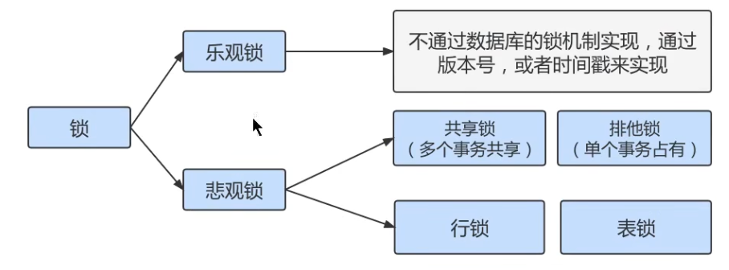

#### 8.3.3.4 按加锁的方式划分：显示锁、隐式锁

##### 8.3.3.4.1 隐式锁

##### 8.3.3.4.2 显示锁

#### 8.3.3.5 其它锁之：全局锁

全局锁就是对 整个数据库实例 `加锁`。当你需要让整个库处于 `只读状态` 的时候，可以使用这个命令，之后其他线程的以下语句会被阻塞：数据更新语句（数据的增删改）、数据定义语句（包括建表、修改表结构等）和更新类事务的提交语句。全局锁的典型使用 `场景` 是：做 `全库逻辑备份` 。

**全局锁的命令**：

```mysql
Flush tables with read lock
```

#### 8.3.3.5 其它锁之：死锁

死锁是指两个或多个事务在同一资源上相互占用，并请求锁定对方占用的资源，从而导致恶性循环。死锁示例：


这时候，事务1在等待事务2释放id=2的行锁，而事务2在等待事务1释放id=1的行锁。 事务1和事务2在互相等待对方的资源释放，就是进入了死锁状态。当出现死锁以后，有 `两种策略`：

- 一种策略是，直接进入等待，直到超时。这个超时时间可以通过参数`innodb_lock_wait_timeout` 来设置,默认50秒。

  缺点：对于在线服务来说，这个等待时间往往是无法接受的。

  那将此值修改短一些，比如1s，0.1s是否合适？不合适，容易误伤到普通的锁等待。

  ```mysql
  show variables like 'innodb_lock_wait_timeout';
  ```

- 另一种策略是，发起死锁检测，发现死锁后，主动回滚死锁链条中的某一个事务（将持有最少行级排他锁的事务进行回滚），让其他事务得以继续执行。将参数`innodb_deadlock_detect`设置为`on` ，表示开启这个逻辑。

#### 8.3.3.5 如何避免死锁

- 合理设计索引，使业务 SQL 尽可能通过索引定位更少的行，减少锁竞争。
- 调整业务逻辑 SQL执行顺序，避免update/delete 长时间持有锁的SQL在事务前面。
- 避免大事务，尽量将大事务拆成多个小事务来处理，小事务缩短锁定资源的时间，发生锁冲突的几率也更小。
- 在并发比较高的系统中，不要显示加锁，特别是是在事务里显示加锁。如select ... for update 语句，如果是在事务里运行了 start transaction 或设置了autocommit 等于0，那么就会锁定所查找到的记录。
- 降低隔离级别。如果业务允许，将隔离级别调低也是较好的选择，比如将隔离级别从RR调整为RC，可以避免掉很多因为gap锁造成的死锁。

### 8.3.4 锁的内存结构

### 8.3.5 锁监控

***

## 8.4 多版本并发控制

### 8.4.1 什么是MVCC

`MVCC` （Multiversion Concurrency Control），多版本并发控制。顾名思义，MVCC 是通过数据行的多个版本管理来实现数据库的 `并发控制` 。这项技术使得在InnoDB的事务隔离级别下执行 `一致性读` 操作有了保证。换言之，就是为了查询一些正在被另一个事务更新的行，并且可以看到它们被更新之前的值，这样在做查询的时候就不用等待另一个事务释放锁。

### 8.4.2 快照读和当前读

#### 8.4.2.1 快照读

#### 8.4.2.2 当前读

### 8.4.3 复习

#### 8.4.3.1 再谈隔离级别

#### 8.4.3.2 隐藏字段、Undo Log版本链

### 8.4.4 MVCC实现原理之ReadView

#### 8.4.4.1 什么是ReadView

#### 8.4.4.2 设计思路

#### 8.4.4.3 ReadView的规则

#### 8.4.4.4 MVCC整体操作流程

### 8.4.5 举例说明

#### 8.4.5.1 READ COMMITTED 隔离级别下

#### 8.4.5.2 REPEATABLE READ 隔离级别下

#### 8.4.5.3 如何解决幻读

### 8.4.6 总结