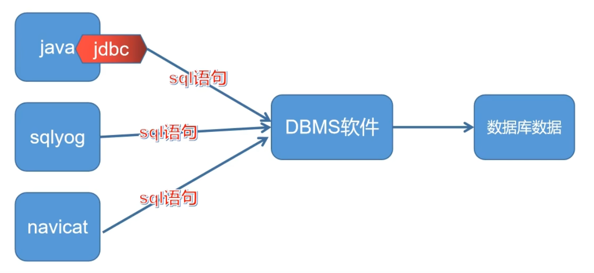
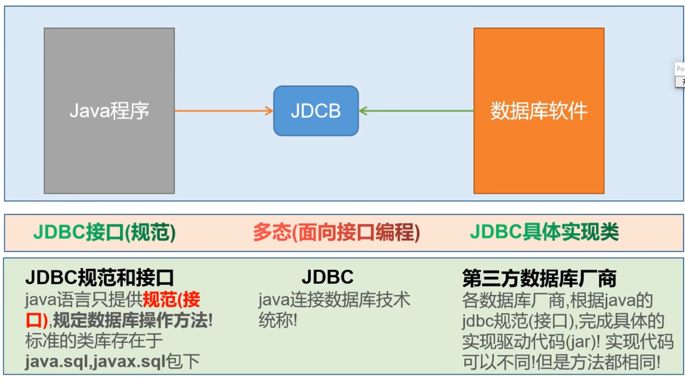
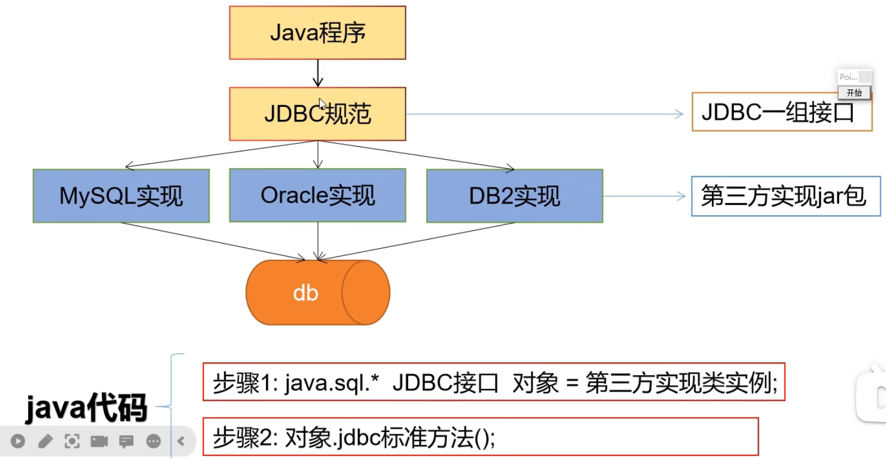

## 1.1 为什么要学习JDBC技术？


## 1.2 JDBC介绍

**JDBC**: Java Database Connectivity ｜ Java 连接数据库技术！

通俗点说,在Java代码中，使用JDBC提供的方法,可以发送字符串类型的SQL语句到数据库管理软件(MySQL,Oracle等),并且获取语句执行结果！进而实现数据库数据CURD操作的技术！





***

**jdbc本质理解**




**总结：**

jdbc是java连接数据库技术的统称

jdbc是由两部分组成：

1. 是Java提供的jdbc规范（接口）
2. 是各个数据库厂商的实现驱动ar包！

jdbc技术是一种典型的面向接口编程！

**优势：**

我们只需要学习jdbc接口规定方法,即可操作所有数据库软件，项目中期需要切换数据库,我们只需要更新第三方驱动ar包,不需要更改代码！

***

## 1.3 代码演示JDBC步骤

```mysql
1.注册驱动
2.获取连接
3.创建发送sql语句对象
4.发送sql语句，并获取返回结果
5.结果集解析
6.资源关闭
```

### 1.3.1 驱动和连接

演示基本查询：

```java
package com.example.jdbcdemo.com.example.api;

import com.mysql.jdbc.Driver;
import java.sql.Connection;
import java.sql.DriverManager;
import java.sql.ResultSet;
import java.sql.SQLException;
import java.sql.Statement;
public class StatementQueryPart {
    public static void main(String[] args) throws SQLException {
        /** 1.注册驱动
         *    依赖：驱动版本 8+ ：com.mysql.cj.jdbc.Driver
         *         驱动版本 5+ ：com.mysql.jdbc.Driver
         */
        //DriverManager.registerDriver(new Driver());
        Class.forName("com.mysql.jdbc.Driver");
        // 2.获取连接  jdbc:数据库厂商名://ip地址:port/数据库名
        Connection connection = DriverManager.getConnection("jdbc:mysql://192.168.0.245:3306/y_mexico_system", "shaoyou", "Ycs11g8ap_BkQp#35fc&Xin7f");
        // 3.创建发送sql语句对象
        Statement statement = connection.createStatement();
        // 4.发送sql语句，并获取返回结果
        String sql = "select * from t_loan_order;";
        ResultSet resultSet = statement.executeQuery(sql);
        // 5.结果集解析
        while (resultSet.next()) {
            int loanId = resultSet.getInt("loan_id");
            String mobile = resultSet.getString("mobile");
            System.out.println(loanId + " - " + mobile);
        }
        // 6.资源关闭
        resultSet.close();
        statement.close();
        connection.close();
    }
}
```

优化上面（重点）：

```java
/** 1.注册驱动
 *    依赖：驱动版本 8+ ：com.mysql.cj.jdbc.Driver
 *         驱动版本 5+ ：com.mysql.jdbc.Driver
 */
// 方案一：看里面的源码其实重复注册了
// DriverManager.registerDriver(new Driver());
// 方案二：解决了重复注册，但是 new Driver() 固定用的是 com.mysql.jdbc.Driver;的包，将来换成oracle要修改源代码，也不好
// new Driver();
// 方案三：解决全部问题，将来可以将字符串从配置文件读取，所以即使切换数据库，不用修改源码，只需修改配置文件即可
// 其实所有方案的目的就是为了执行Driver类里的静态代码（注册驱动），选择下面的反射方式去加载类，加载类就会执行静态代码
Class.forName("com.mysql.jdbc.Driver");
```

> 补充：URL路径属性可选信息：
>
> serverTimezone=America/Mexico_City&useUnicode=true&characterEncoding=utf8&useSSL=true
>
> mysql8.0.25以后，自动识别时区，serverTimezone=America/Mexico_City不用添加；之前的还是要添加上面的。

### 1.3.2  Statement

重点记住两个方法：

- `executeQuery()`：DQL语句使用这个
- `executeUpdate()`：非DQL语句使用这个

> SQL分类：DDL（容器创建，修改，删除）DML(插入，修改，删除）DQL(查询）DCL(权限控制）TPL(事务控制语言)


