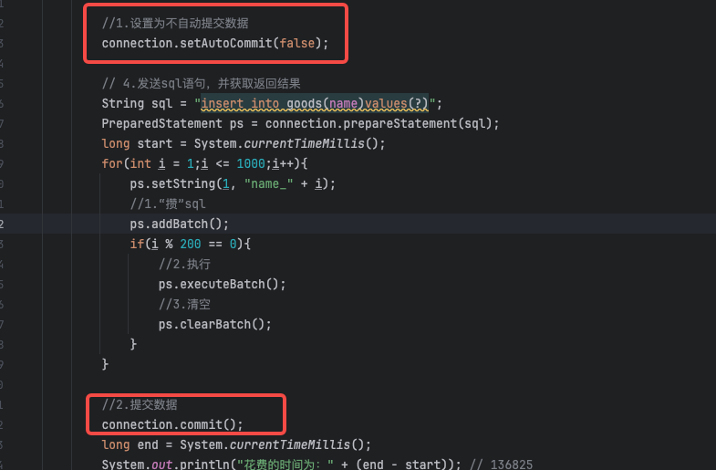

# 1 为什么要学习JDBC技术？

很多框架底层都是封装了jdbc，框架很多，但是底层技术jdbc基本不变。


## 1.1 JDBC介绍

**JDBC**: Java Database Connectivity ｜ Java 连接数据库技术！

通俗点说,在Java代码中，使用JDBC提供的方法,可以发送字符串类型的SQL语句到数据库管理软件(MySQL,Oracle等),并且获取语句执行结果！进而实现数据库数据CURD操作的技术！


***

**jdbc本质理解**


***


***

**总结：**

jdbc是java连接数据库技术的统称

jdbc是由两部分组成：

1. 是Java提供的jdbc规范（接口）
2. 是各个数据库厂商的实现驱动ar包！

jdbc技术是一种典型的面向接口编程！

**优势：**

我们只需要学习jdbc接口规定方法,即可操作所有数据库软件，项目中期需要切换数据库,我们只需要更新第三方驱动jar包,不需要更改代码！

***

## 1.2 代码演示JDBC步骤


**驱动和连接**

演示基本查询：

```java
package com.example.jdbcdemo.com.example.api;

import com.mysql.jdbc.Driver;
import java.sql.Connection;
import java.sql.DriverManager;
import java.sql.ResultSet;
import java.sql.SQLException;
import java.sql.Statement;
public class StatementQueryPart {
    public static void main(String[] args) throws SQLException {
        // 1.注册驱动 （mysql的驱动包里面Driver类已经在static代码块中进行了注册，这样不用我们自己再去注册了）
        //DriverManager.registerDriver(new Driver());
        Class.forName("com.mysql.jdbc.Driver");
        // 2.获取连接  jdbc:数据库厂商名://ip地址:port/数据库名
        Connection connection = DriverManager.getConnection("jdbc:mysql://127.0.0.1:3306/test", "shaoyou", "123456");
        // 3.创建发送sql语句对象
        Statement statement = connection.createStatement();
        // 4.发送sql语句，并获取返回结果
        String sql = "select * from t_loan_order;";
        ResultSet resultSet = statement.executeQuery(sql);
        // 5.结果集解析
        while (resultSet.next()) {
            int loanId = resultSet.getInt("loan_id");
            String mobile = resultSet.getString("mobile");
            System.out.println(loanId + " - " + mobile);
        }
        // 6.资源关闭
        resultSet.close();
        statement.close();
        connection.close();
    }
}
```

优化上面（重点）：

```java
/** 1.注册驱动
 *    依赖：驱动版本 8+ ：com.mysql.cj.jdbc.Driver
 *         驱动版本 5+ ：com.mysql.jdbc.Driver
 */
// 方案一：看里面的源码其实重复注册了
// DriverManager.registerDriver(new Driver());
// 方案二：解决了重复注册，但是 new Driver() 固定用的是 com.mysql.jdbc.Driver;的包，将来换成oracle要修改源代码，也不好
// new Driver();
// 方案三：解决全部问题，将来可以将字符串从配置文件读取，所以即使切换数据库，不用修改源码，只需修改配置文件即可
Class.forName("com.mysql.jdbc.Driver");
```

> 其实所有方案的目的就是为了执行Driver类里的静态代码（注册驱动），选择下面的反射方式去加载类，加载类就会执行静态代码

***

## 1.3 总结

JDBC是sun公司提供一套用于数据库操作的接口，java程序员只需要面向这套接口编程即可。

**不同的数据库厂商，需要针对这套接口，提供不同实现**。不同的实现的集合，即为不同数据库的驱动一一面向接口编程

***

# 2 使用PreparedStatement实现CRUD操作

## 2.1 操作和访问数据库
数据库连接被用于向数据库服务器发送命令和 SQL 语句，并接受数据库服务器返回的结果。其实一个数据库连接就是一个Socket连接。

- 在 java.sql 包中有 3 个接口分别定义了对数据库的调用的不同方式：
  - `Statement`：用于执行静态 SQL 语句并返回它所生成结果的对象【有弊端不使用】。
  - `PrepatedStatement`：SQL 语句被预编译并存储在此对象中，可以使用此对象多次高效地执行该语句。
  - `CallableStatement`：用于执行 SQL 存储过程


## 2.2 使用Statement操作数据表的弊端

- 通过调用 Connection 对象的 createStatement() 方法创建该对象。该对象用于执行静态的 SQL 语句，并且返回执行结果。
- Statement 接口中定义了下列方法用于执行 SQL 语句：

```java
int excuteUpdate(String sql)：      //执行更新操作INSERT、UPDATE、DELETE
ResultSet executeQuery(String sql)：//执行查询操作SELECT
```

- 但是使用Statement操作数据表存在弊端：
  - **问题一：存在拼串操作，繁琐**
  - **问题二：存在SQL注入问题**

- SQL 注入是利用某些系统没有对用户输入的数据进行充分的检查，而在用户输入数据中注入非法的 SQL 语句段或命令(如：SELECT user, password FROM user_table WHERE user=‘a’ OR 1 = ’ AND password = ’ OR ‘1’ = ‘1’) ，从而利用系统的 SQL 引擎完成恶意行为的做法。

- 对于 Java 而言，要防范 SQL 注入，只要用 PreparedStatement(从Statement扩展而来) 取代 Statement 就可以了。
- 看伪代码演示：

```java
// 如果用户名故意输入：1' or 
//密码输入：='1' or '1' = '1
//因为是字符串拼接，导致最终拼接出来的SQL含义变了，这样可以查出来所有数据，这就是SQL注入
SELECT user,password FROM user_table WHERE USER = '1' or ' AND PASSWORD = '='1' or '1' = '1';
```

综上：


***

## 2.3 PreparedStatement的使用

### 2.3.1 PreparedStatement介绍

- 可以通过调用 Connection 对象的 **preparedStatement(String sql)** 方法获取 PreparedStatement 对象
- **PreparedStatement 接口是 Statement 的子接口，它表示一条预编译过的 SQL 语句**
- PreparedStatement 对象所代表的 SQL 语句中的参数用问号(?)来表示，调用 PreparedStatement 对象的 setXxx() 方法来设置这些参数. setXxx() 方法有两个参数，第一个参数是要设置的 SQL 语句中的参数的索引(从 1 开始)，第二个是设置的 SQL 语句中的参数的值

### 2.3.2 PreparedStatement vs Statement

- 代码的可读性和可维护性。
- **PreparedStatement 能最大可能提高性能：**
  - DBServer会对**预编译**语句提供性能优化。因为预编译语句有可能被重复调用，所以语句在被DBServer的编译器编译后的执行代码被缓存下来，那么下次调用时只要是相同的预编译语句就不需要编译，只要将参数直接传入编译过的语句执行代码中就会得到执行。
  - 在statement语句中,即使是相同操作但因为数据内容不一样,所以整个语句本身不能匹配,没有缓存语句的意义.事实是没有数据库会对普通语句编译后的执行代码缓存。这样每执行一次都要对传入的语句编译一次。
  - (语法检查，语义检查，翻译成二进制命令，缓存)
- PreparedStatement 可以防止 SQL 注入

### 2.3.3 Java与SQL对应数据类型转换表

| Java类型           | SQL类型                  |
| ------------------ | ------------------------ |
| boolean            | BIT                      |
| byte               | TINYINT                  |
| short              | SMALLINT                 |
| int                | INTEGER                  |
| long               | BIGINT                   |
| String             | CHAR,VARCHAR,LONGVARCHAR |
| byte array         | BINARY , VAR BINARY      |
| java.sql.Date      | DATE                     |
| java.sql.Time      | TIME                     |
| java.sql.Timestamp | TIMESTAMP                |

### 2.3.4 使用PreparedStatement实现增、删、改操作

```java
//通用的增、删、改操作（体现一：增、删、改 ； 体现二：针对于不同的表）
// select id,name from t_user where id = ?
public void update(String sql,Object ... args){
	Connection conn = null;
	PreparedStatement ps = null;
	try {
		//1.获取数据库的连接
		conn = JDBCUtils.getConnection();
		//2.获取PreparedStatement的实例 (或：预编译sql语句)
		ps = conn.prepareStatement(sql);
		//3.填充占位符
		for(int i = 0;i < args.length;i++){
			ps.setObject(i + 1, args[i]);
		}
		//4.执行sql语句
		ps.execute();
	} catch (Exception e) {
		e.printStackTrace();
	}finally{
		//5.关闭资源
		JDBCUtils.closeResource(conn, ps);
	}
}
```

### 2.3.5 使用PreparedStatement实现查询操作

略。后面使用框架。

> 说明：使用PreparedStatement实现的查询操作可以替换Statement实现的查询操作，解决Statement拼串和SQL注入问题。

# 3 批量插入

## 3.1 批量执行SQL语句

当需要成批插入或者更新记录时，可以采用Java的批量**更新**机制，这一机制允许多条语句一次性提交给数据库批量处理。通常情况下比单独提交处理更有效率

JDBC的批量处理语句包括下面三个方法：

- **addBatch(String)：添加需要批量处理的SQL语句或是参数；**
- **executeBatch()：执行批量处理语句；**
- **clearBatch():清空缓存的数据**

通常我们会遇到两种批量执行SQL语句的情况：

- 多条SQL语句的批量处理；
- 一个SQL语句的批量传参；

## 3.2 高效的批量插入

举例：向数据表中插入20000条数据

- 数据库中提供一个goods表。创建如下：

```mysql
CREATE TABLE goods(
id INT PRIMARY KEY AUTO_INCREMENT,
NAME VARCHAR(20)
);
```

**实现层次一：使用PreparedStatement**

```java
public static void main(String[] args) throws Exception {
    Class.forName("com.mysql.cj.jdbc.Driver");
    Connection connection = DriverManager.getConnection(
            "jdbc:mysql://47.76.68.216:3306/mybatis_plus",
            "root",
            "P@ssw0rd123!");
    // 4.发送sql语句，并获取返回结果
    String sql = "insert into goods(name)values(?)";
    PreparedStatement ps = connection.prepareStatement(sql);
    long start = System.currentTimeMillis();
    for(int i = 1;i <= 1000;i++){
        ps.setString(1, "name_" + i);
        ps.executeUpdate();
    }
    long end = System.currentTimeMillis();
    System.out.println("花费的时间为：" + (end - start));  // 136825
    // 6.资源关闭
    ps.close();
    connection.close();
}
```

##### 实现层次二

```java
/*
 * 修改1： 使用 addBatch() / executeBatch() / clearBatch()
 * 修改2：mysql服务器默认是关闭批处理的，我们需要通过一个参数，让mysql开启批处理的支持。
 * 		 ?rewriteBatchedStatements=true 写在配置文件的url后面：
       jdbc:mysql://localhost:3306/t_stu?rewriteBatchedStatements=true
 * 修改3：使用更新的mysql 驱动：mysql-connector-java-5.1.37-bin.jar
 * 
 */
public static void main(String[] args) throws Exception {
    Class.forName("com.mysql.cj.jdbc.Driver");
    Connection connection = DriverManager.getConnection(
            "jdbc:mysql://47.76.68.216:3306/mybatis_plus?rewriteBatchedStatements=true",
            "root",
            "P@ssw0rd123!");
    // 4.发送sql语句，并获取返回结果
    String sql = "insert into goods(name)values(?)";
    PreparedStatement ps = connection.prepareStatement(sql);
    long start = System.currentTimeMillis();
    for(int i = 1;i <= 1000;i++){
        ps.setString(1, "name_" + i);
        //1.“攒”sql
        ps.addBatch();
        if(i % 200 == 0){
            //2.执行
            ps.executeBatch();
            //3.清空
            ps.clearBatch();
        }
    }
    long end = System.currentTimeMillis();
    System.out.println("花费的时间为：" + (end - start)); // 1217
    // 6.资源关闭
    ps.close();
    connection.close();
}
```

**实现层次三**

在上面的基础增加这两行



***

# 4 数据库连接池

## 4.1 JDBC数据库连接池的必要性

- 在使用开发基于数据库的web程序时，传统的模式基本是按以下步骤：
  - **在主程序（如servlet、beans）中建立数据库连接**
  - **进行sql操作**
  - **断开数据库连接**
- 这种模式开发，存在的问题:

  - 普通的JDBC数据库连接使用 DriverManager 来获取，每次向数据库建立连接的时候都要将 Connection 加载到内存中，再验证用户名和密码(得花费0.05s～1s的时间)。需要数据库连接的时候，就向数据库要求一个，执行完成后再断开连接。这样的方式将会消耗大量的资源和时间。**数据库的连接资源并没有得到很好的重复利用。**若同时有几百人甚至几千人在线，频繁的进行数据库连接操作将占用很多的系统资源，严重的甚至会造成服务器的崩溃。
  - **对于每一次数据库连接，使用完后都得断开。**否则，如果程序出现异常而未能关闭，将会导致数据库系统中的内存泄漏，最终将导致重启数据库。（回忆：何为Java的内存泄漏？）
  - **这种开发不能控制被创建的连接对象数**，系统资源会被毫无顾及的分配出去，如连接过多，也可能导致内存泄漏，服务器崩溃。

## 4.2 数据库连接池技术

- 为解决传统开发中的数据库连接问题，可以采用数据库连接池技术。
- **数据库连接池的基本思想**：就是为数据库连接建立一个“缓冲池”。预先在缓冲池中放入一定数量的连接，当需要建立数据库连接时，只需从“缓冲池”中取出一个，使用完毕之后再放回去。
- **数据库连接池**负责分配、管理和释放数据库连接，它**允许应用程序重复使用一个现有的数据库连接，而不是重新建立一个**。
- 数据库连接池在初始化时将创建一定数量的数据库连接放到连接池中，这些数据库连接的数量是由**最小数据库连接数来设定**的。无论这些数据库连接是否被使用，连接池都将一直保证至少拥有这么多的连接数量。连接池的**最大数据库连接数量**限定了这个连接池能占有的最大连接数，当应用程序向连接池请求的连接数超过最大连接数量时，这些请求将被加入到等待队列中。

***

**工作原理：**


- **数据库连接池技术的优点**

**1. 资源重用**

由于数据库连接得以重用，避免了频繁创建，释放连接引起的大量性能开销。在减少系统消耗的基础上，另一方面也增加了系统运行环境的平稳性。

**2. 更快的系统反应速度**

数据库连接池在初始化过程中，往往已经创建了若干数据库连接置于连接池中备用。此时连接的初始化工作均已完成。对于业务请求处理而言，直接利用现有可用连接，避免了数据库连接初始化和释放过程的时间开销，从而减少了系统的响应时间

**3. 新的资源分配手段**

对于多应用共享同一数据库的系统而言，可在应用层通过数据库连接池的配置，实现某一应用最大可用数据库连接数的限制，避免某一应用独占所有的数据库资源

**4. 统一的连接管理，避免数据库连接泄漏**

在较为完善的数据库连接池实现中，可根据预先的占用超时设定，强制回收被占用连接，从而避免了常规数据库连接操作中可能出现的资源泄露

***

## 4.3 多种开源的数据库连接池

- JDBC 的数据库连接池使用 `javax.sql.DataSource` 来表示，**DataSource 只是一个接口**，该接口通常由服务器(Weblogic, WebSphere, Tomcat)提供实现，也有一些开源组织提供实现：
  - `DBCP` 是Apache提供的数据库连接池。tomcat 服务器自带dbcp数据库连接池。速度相对c3p0较快，但因自身存在BUG，Hibernate3已不再提供支持。
  - `C3P0` 是一个开源组织提供的一个数据库连接池，**速度相对较慢，稳定性还可以。**hibernate官方推荐使用
  - `Proxool `是sourceforge下的一个开源项目数据库连接池，有监控连接池状态的功能，稳定性较c3p0差一点
  - `BoneCP` 是一个开源组织提供的数据库连接池，速度快
  - `Druid` 是阿里提供的数据库连接池，据说是集DBCP 、C3P0 、Proxool 优点于一身的数据库连接池，但是速度不确定是否有BoneCP快
- DataSource 通常被称为数据源，它包含连接池和连接池管理两个部分，习惯上也经常把 DataSource 称为连接池
- **DataSource用来取代DriverManager来获取Connection，获取速度快，同时可以大幅度提高数据库访问速度。**
- 特别注意：
  - 数据源和数据库连接不同，数据源无需创建多个，它是产生数据库连接的工厂，因此整个应用只需要一个数据源即可。
  - 当数据库访问结束后，程序还是像以前一样关闭数据库连接：conn.close(); 但conn.close()并没有关闭数据库的物理连接，它仅仅把数据库连接释放，归还给了数据库连接池。

***

### 4.3.1 C3P0数据库连接池(了解)

- 获取连接方式一

```java
//使用C3P0数据库连接池的方式，获取数据库的连接：不推荐
public static Connection getConnection1() throws Exception{
	ComboPooledDataSource cpds = new ComboPooledDataSource();
	cpds.setDriverClass("com.mysql.jdbc.Driver"); 
	cpds.setJdbcUrl("jdbc:mysql://localhost:3306/test");
	cpds.setUser("root");
	cpds.setPassword("abc123");
//	cpds.setMaxPoolSize(100);
	Connection conn = cpds.getConnection();
	return conn;
}
```

- 获取连接方式二

```java
//使用C3P0数据库连接池的配置文件方式，获取数据库的连接：推荐
// helloc3p0跟下面xml配置的<named-config name="helloc3p0">一样
private static DataSource cpds = new ComboPooledDataSource("helloc3p0");
public static Connection getConnection2() throws SQLException{
	Connection conn = cpds.getConnection();
	return conn;
}
```

其中，src下的配置文件为：【c3p0-config.xml】这个名字不要改，系统默认读取

```xml
<?xml version="1.0" encoding="UTF-8"?>
<c3p0-config>
	<named-config name="helloc3p0">
		<!-- 获取连接的4个基本信息 -->
		<property name="user">root</property>
		<property name="password">abc123</property>
		<property name="jdbcUrl">jdbc:mysql:///test</property>
		<property name="driverClass">com.mysql.jdbc.Driver</property>
		
		<!-- 涉及到数据库连接池的管理的相关属性的设置 -->
		<!-- 若数据库中连接数不足时, 一次向数据库服务器申请多少个连接 -->
		<property name="acquireIncrement">5</property>
		<!-- 初始化数据库连接池时连接的数量 -->
		<property name="initialPoolSize">5</property>
		<!-- 数据库连接池中的最小的数据库连接数 -->
		<property name="minPoolSize">5</property>
		<!-- 数据库连接池中的最大的数据库连接数 -->
		<property name="maxPoolSize">10</property>
		<!-- C3P0 数据库连接池可以维护的 Statement 的个数 -->
		<property name="maxStatements">20</property>
		<!-- 每个连接同时可以使用的 Statement 对象的个数 -->
		<property name="maxStatementsPerConnection">5</property>

	</named-config>
</c3p0-config>
```

### 4.3.2 DBCP数据库连接池

- DBCP 是 Apache 软件基金组织下的开源连接池实现，该连接池依赖该组织下的另一个开源系统：Common-pool。如需使用该连接池实现，应在系统中增加如下两个 jar 文件
  - Commons-dbcp.jar：连接池的实现
  - Commons-pool.jar：连接池实现的依赖库

- **Tomcat 的连接池正是采用该连接池来实现的。**该数据库连接池既可以与应用服务器整合使用，也可由应用程序独立使用。
- 数据源和数据库连接不同，数据源无需创建多个，它是产生数据库连接的工厂，因此整个应用只需要一个数据源即可。

- 当数据库访问结束后，程序还是像以前一样关闭数据库连接：conn.close(); 但上面的代码并没有关闭数据库的物理连接，它仅仅把数据库连接释放，归还给了数据库连接池。
- 配置属性说明

| 属性                       | 默认值 | 说明                                                         |
| -------------------------- | ------ | ------------------------------------------------------------ |
| initialSize                | 0      | 连接池启动时创建的初始化连接数量                             |
| maxActive                  | 8      | 连接池中可同时连接的最大的连接数                             |
| maxIdle                    | 8      | 连接池中最大的空闲的连接数，超过的空闲连接将被释放，如果设置为负数表示不限制 |
| minIdle                    | 0      | 连接池中最小的空闲的连接数，低于这个数量会被创建新的连接。该参数越接近maxIdle，性能越好，因为连接的创建和销毁，都是需要消耗资源的；但是不能太大。 |
| maxWait                    | 无限制 | 最大等待时间，当没有可用连接时，连接池等待连接释放的最大时间，超过该时间限制会抛出异常，如果设置-1表示无限等待 |
| poolPreparedStatements     | false  | 开启池的Statement是否prepared                                |
| maxOpenPreparedStatements  | 无限制 | 开启池的prepared 后的同时最大连接数                          |
| minEvictableIdleTimeMillis |        | 连接池中连接，在时间段内一直空闲， 被逐出连接池的时间        |
| removeAbandonedTimeout     | 300    | 超过时间限制，回收没有用(废弃)的连接                         |
| removeAbandoned            | false  | 超过removeAbandonedTimeout时间后，是否进 行没用连接（废弃）的回收 |

- 获取连接方式一：

```java
public static Connection getConnection3() throws Exception {
	BasicDataSource source = new BasicDataSource();
	source.setDriverClassName("com.mysql.jdbc.Driver");
	source.setUrl("jdbc:mysql:///test");
	source.setUsername("root");
	source.setPassword("abc123");
	source.setInitialSize(10);
	Connection conn = source.getConnection();
	return conn;
}
```

- 获取连接方式二：

```java
//使用dbcp数据库连接池的配置文件方式，获取数据库的连接：推荐
private static DataSource source = null;
static{
	try {
		Properties pros = new Properties();
		InputStream is = DBCPTest.class.getClassLoader().getResourceAsStream("dbcp.properties");
		pros.load(is);
		//根据提供的BasicDataSourceFactory创建对应的DataSource对象
		source = BasicDataSourceFactory.createDataSource(pros);
	} catch (Exception e) {
		e.printStackTrace();
	}
}
public static Connection getConnection4() throws Exception {
	Connection conn = source.getConnection();
	return conn;
}
```

其中，src下的配置文件为：【dbcp.properties】

```properties
driverClassName=com.mysql.jdbc.Driver
url=jdbc:mysql://localhost:3306/test?rewriteBatchedStatements=true&useServerPrepStmts=false
username=root
password=abc123
initialSize=10
#...
```

### 4.3.3 Druid（德鲁伊）数据库连接池

Druid是阿里巴巴开源平台上一个数据库连接池实现，它结合了C3P0、DBCP、Proxool等DB池的优点，同时加入了日志监控，可以很好的监控DB池连接和SQL的执行情况，可以说是针对监控而生的DB连接池，**可以说是目前最好的连接池之一。**

```java
package com.atguigu.druid;
import java.sql.Connection;
import java.util.Properties;
import javax.sql.DataSource;
import com.alibaba.druid.pool.DruidDataSourceFactory;

public class TestDruid {
	public static void main(String[] args) throws Exception {
		Properties pro = new Properties();		 pro.load(TestDruid.class.getClassLoader().getResourceAsStream("druid.properties"));
    // 这里可以根dbcp一样使用static来保证DataSource只有一个
		DataSource ds = DruidDataSourceFactory.createDataSource(pro);
		Connection conn = ds.getConnection();
		System.out.println(conn);
	}
}
```

其中，src下的配置文件为：【druid.properties】

```properties
url=jdbc:mysql://localhost:3306/test?rewriteBatchedStatements=true
username=root
password=123456
driverClassName=com.mysql.jdbc.Driver
initialSize=10
maxActive=20
maxWait=1000
filters=wall
```

- 详细配置参数：

| **配置**                      | **缺省** | **说明**                                                     |
| ----------------------------- | -------- | ------------------------------------------------------------ |
| name                          |          | 配置这个属性的意义在于，如果存在多个数据源，监控的时候可以通过名字来区分开来。 如果没有配置，将会生成一个名字，格式是：”DataSource-” + System.identityHashCode(this) |
| url                           |          | 连接数据库的url，不同数据库不一样。例如：mysql : jdbc:mysql://10.20.153.104:3306/druid2 oracle : jdbc:oracle:thin:@10.20.149.85:1521:ocnauto |
| username                      |          | 连接数据库的用户名                                           |
| password                      |          | 连接数据库的密码。如果你不希望密码直接写在配置文件中，可以使用ConfigFilter。详细看这里：https://github.com/alibaba/druid/wiki/使用ConfigFilter |
| driverClassName               |          | 根据url自动识别 这一项可配可不配，如果不配置druid会根据url自动识别dbType，然后选择相应的driverClassName(建议配置下) |
| initialSize                   | 0        | 初始化时建立物理连接的个数。初始化发生在显示调用init方法，或者第一次getConnection时 |
| maxActive                     | 8        | 最大连接池数量                                               |
| maxIdle                       | 8        | 已经不再使用，配置了也没效果                                 |
| minIdle                       |          | 最小连接池数量                                               |
| maxWait                       |          | 获取连接时最大等待时间，单位毫秒。配置了maxWait之后，缺省启用公平锁，并发效率会有所下降，如果需要可以通过配置useUnfairLock属性为true使用非公平锁。 |
| poolPreparedStatements        | false    | 是否缓存preparedStatement，也就是PSCache。PSCache对支持游标的数据库性能提升巨大，比如说oracle。在mysql下建议关闭。 |
| maxOpenPreparedStatements     | -1       | 要启用PSCache，必须配置大于0，当大于0时，poolPreparedStatements自动触发修改为true。在Druid中，不会存在Oracle下PSCache占用内存过多的问题，可以把这个数值配置大一些，比如说100 |
| validationQuery               |          | 用来检测连接是否有效的sql，要求是一个查询语句。如果validationQuery为null，testOnBorrow、testOnReturn、testWhileIdle都不会其作用。 |
| testOnBorrow                  | true     | 申请连接时执行validationQuery检测连接是否有效，做了这个配置会降低性能。 |
| testOnReturn                  | false    | 归还连接时执行validationQuery检测连接是否有效，做了这个配置会降低性能 |
| testWhileIdle                 | false    | 建议配置为true，不影响性能，并且保证安全性。申请连接的时候检测，如果空闲时间大于timeBetweenEvictionRunsMillis，执行validationQuery检测连接是否有效。 |
| timeBetweenEvictionRunsMillis |          | 有两个含义： 1)Destroy线程会检测连接的间隔时间2)testWhileIdle的判断依据，详细看testWhileIdle属性的说明 |
| numTestsPerEvictionRun        |          | 不再使用，一个DruidDataSource只支持一个EvictionRun           |
| minEvictableIdleTimeMillis    |          |                                                              |
| connectionInitSqls            |          | 物理连接初始化的时候执行的sql                                |
| exceptionSorter               |          | 根据dbType自动识别 当数据库抛出一些不可恢复的异常时，抛弃连接 |
| filters                       |          | 属性类型是字符串，通过别名的方式配置扩展插件，常用的插件有： 监控统计用的filter:stat日志用的filter:log4j防御sql注入的filter:wall |
| proxyFilters                  |          | 类型是List，如果同时配置了filters和proxyFilters，是组合关系，并非替换关系 |

# 5 Apache-DBUtils实现CRUD操作

## 5.1 Apache-DBUtils简介

- commons-dbutils 是 Apache 组织提供的一个开源 JDBC工具类库，它是对JDBC的简单封装，学习成本极低，并且使用dbutils能极大简化jdbc编码的工作量，同时也不会影响程序的性能。

- API介绍：
  - org.apache.commons.dbutils.QueryRunner
  - org.apache.commons.dbutils.ResultSetHandler
  - 工具类：org.apache.commons.dbutils.DbUtils
- API包说明：


## 5.2 主要API的使用

### 5.2.1 DbUtils

- DbUtils ：提供如关闭连接、装载JDBC驱动程序等常规工作的工具类，里面的所有方法都是静态的。主要方法如下：
  - public static void close(…) throws java.sql.SQLException：　DbUtils类提供了三个重载的关闭方法。这些方法检查所提供的参数是不是NULL，如果不是的话，它们就关闭Connection、Statement和ResultSet。
  - public static void closeQuietly(…): 这一类方法不仅能在Connection、Statement和ResultSet为NULL情况下避免关闭，还能隐藏一些在程序中抛出的SQLEeception。
  -  public static void commitAndClose(Connection conn)throws SQLException： 用来提交连接的事务，然后关闭连接
  - public static void commitAndCloseQuietly(Connection conn)： 用来提交连接，然后关闭连接，并且在关闭连接时不抛出SQL异常。
  - public static void rollback(Connection conn)throws SQLException：允许conn为null，因为方法内部做了判断
  - public static void rollbackAndClose(Connection conn)throws SQLException
  - rollbackAndCloseQuietly(Connection)
  - public static boolean loadDriver(java.lang.String driverClassName)：这一方装载并注册JDBC驱动程序，如果成功就返回true。使用该方法，你不需要捕捉这个异常ClassNotFoundException。

### 5.2.2 QueryRunner类

- **该类简单化了SQL查询，它与ResultSetHandler组合在一起使用可以完成大部分的数据库操作，能够大大减少编码量。**

- QueryRunner类提供了两个构造器：

  - 默认的构造器
  - 需要一个 javax.sql.DataSource 来作参数的构造器

- QueryRunner类的主要方法：

  - 更新

    - public int update(Connection conn, String sql, Object… params) throws SQLException:用来执行一个更新（插入、更新或删除）操作。
    - …

  - **插入**

    - public T insert(Connection conn,String sql,ResultSetHandler rsh, Object… params) throws SQLException：只支持INSERT语句，其中 rsh - The handler used to create the result object from the ResultSet of auto-generated keys. 返回值: An object generated by the handler.即自动生成的键值
    - …

  - **批处理**

    - public int[] batch(Connection conn,String sql,Object[][] params)throws SQLException： INSERT, UPDATE, or DELETE语句
    - public T insertBatch(Connection conn,String sql,ResultSetHandler rsh,Object[][] params)throws SQLException：只支持INSERT语句
    - …

    **查询**

    - public Object query(Connection conn, String sql, ResultSetHandler rsh,Object… params) throws SQLException：
    - 个查询操作，在这个查询中，对象数组中的每个元素值被用来作为查询语句的置换参数。该方法会自行处理 PreparedStatement 和 ResultSet 的创建和关闭。
    - …

  ***

  测试

  ```java
  // 测试添加
  @Test
  public void testInsert() throws Exception {
  	QueryRunner runner = new QueryRunner();
  	Connection conn = JDBCUtils.getConnection3();
  	String sql = "insert into customers(name,email,birth)values(?,?,?)";
  	int count = runner.update(conn, sql, "何成飞", "he@qq.com", "1992-09-08");
  	System.out.println("添加了" + count + "条记录");
  	JDBCUtils.closeResource(conn, null);
  }
  ```

测试删除

```java
// 测试删除
@Test
public void testDelete() throws Exception {
	QueryRunner runner = new QueryRunner();
	Connection conn = JDBCUtils.getConnection3();
	String sql = "delete from customers where id < ?";
	int count = runner.update(conn, sql,3);
	System.out.println("删除了" + count + "条记录");
	JDBCUtils.closeResource(conn, null);
}
```

### 5.2.3 ResultSetHandler接口及实现类

- 该接口用于处理 java.sql.ResultSet，将数据按要求转换为另一种形式。
- ResultSetHandler 接口提供了一个单独的方法：Object handle (java.sql.ResultSet .rs)。
- 接口的主要实现类：
  - ArrayHandler：把结果集中的第一行数据转成对象数组。
  - ArrayListHandler：把结果集中的每一行数据都转成一个数组，再存放到List中。
  - **BeanHandler：**将结果集中的第一行数据封装到一个对应的JavaBean实例中。
  - **BeanListHandler：**将结果集中的每一行数据都封装到一个对应的JavaBean实例中，存放到List里。
  - ColumnListHandler：将结果集中某一列的数据存放到List中。
  - KeyedHandler(name)：将结果集中的每一行数据都封装到一个Map里，再把这些map再存到一个map里，其key为指定的key。
  - **MapHandler：**将结果集中的第一行数据封装到一个Map里，key是列名，value就是对应的值。
  - **MapListHandler：**将结果集中的每一行数据都封装到一个Map里，然后再存放到List
  - **ScalarHandler：**查询单个值对象

***

测试

```java
/*
 * 测试查询:查询一条记录
 * 
 * 使用ResultSetHandler的实现类：BeanHandler
 */
@Test
public void testQueryInstance() throws Exception{
	QueryRunner runner = new QueryRunner();
	Connection conn = JDBCUtils.getConnection3();
	String sql = "select id,name,email,birth from customers where id = ?";
	BeanHandler<Customer> handler = new BeanHandler<>(Customer.class);
	Customer customer = runner.query(conn, sql, handler, 23);
	System.out.println(customer);	
	JDBCUtils.closeResource(conn, null);
}
```

```java
/*
 * 测试查询:查询多条记录构成的集合
 * 
 * 使用ResultSetHandler的实现类：BeanListHandler
 */
@Test
public void testQueryList() throws Exception{
	QueryRunner runner = new QueryRunner();
	Connection conn = JDBCUtils.getConnection3();
	String sql = "select id,name,email,birth from customers where id < ?";
	BeanListHandler<Customer> handler = new BeanListHandler<>(Customer.class);
	List<Customer> list = runner.query(conn, sql, handler, 23);
	list.forEach(System.out::println);
	JDBCUtils.closeResource(conn, null);
}
```


