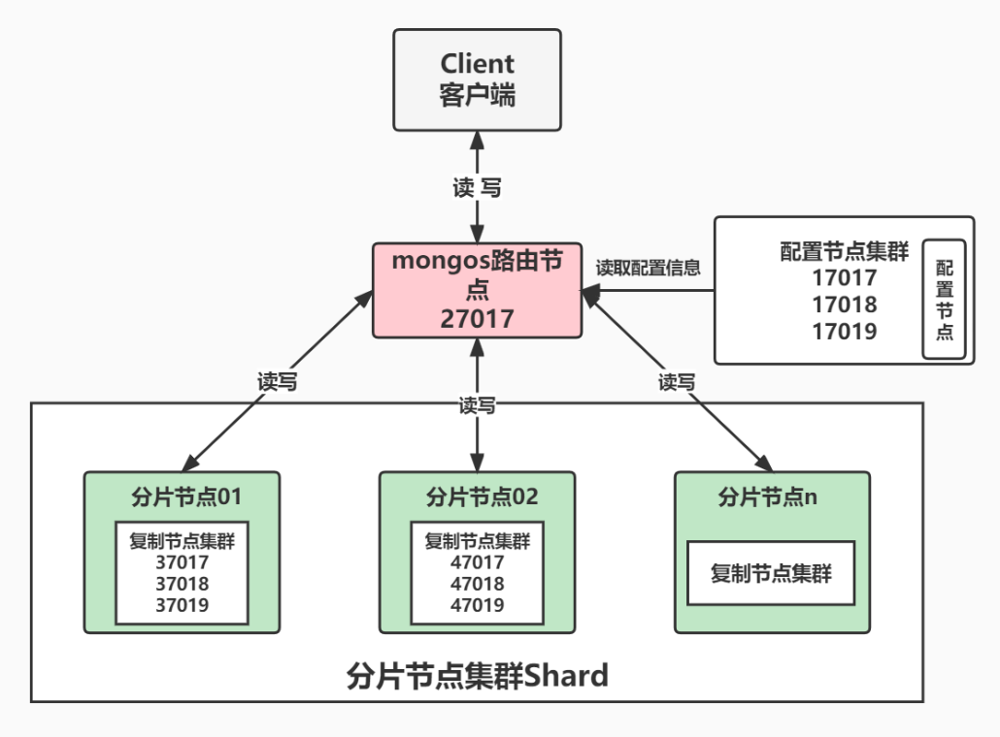

[TOC]

# MongoDB 概述篇

## **1.** 什么是MongoDB?

MongoDB 是一个基于**分布式文件/文档存储的数据库**，由 C++ 编写，可以为 Web 应用提供可扩展、高性能、易部署的**数据存储解决方案**。MongoDB 是一个介于**关系数据库**和**非关系数据库**之间的产品，是 非关系数据库中功能最丰富、最像关系数据库的。

在高负载的情况下，通过添加更多的节点，可以保证服务器性能。

### **1.1 NoSQL** **和** MongoDB

NoSQL(Not Only SQL)支持类似SQL的功能，与RDBMS(关系型数据库)相辅相成。其性能较高，

不使用SQL意味着没有结构化的存储要束之后架构更加灵活。

 NoSQL数据库四大家族:

- 列存储 Hbase 
- **键值(Key-Value)存储Redis** 
- 图像存储 Neo4j 
- **文档存储MongoDB**

### **1.2** 抽象的体系结构


### **1.3 MongoDB** 和RDBMS对比

| **RDBMS**                       | **MongoDB**                                  |
| ------------------------------- | -------------------------------------------- |
| database(数据库)                | database(数据库)                             |
| table (表)                      | collection( 集合)                            |
| row( 行)                        | document( **BSON** **文档**)                 |
| column (列)                     | field (字段)                                 |
| index(唯一索引、主键索引)       | index (支持地理位置索引、全文索引 、哈希索引 |
| join (主外键关联)               | embedded Document (嵌套文档)                 |
| primary key(指定1至N个列做主键) | primary key (指定_id field做为主键)          |

## 2. 什么是BSON?

BSON(Binary JSON)是一种类**JSON的一种二进制形式的存储格式**。它和JSON一样，支持内嵌的文档 对象和数组对象，但是BSON有JSON没有的一些数据类型，如Date和Binary Data类型。BSON可以做为 **网络数据交换**的一种**存储形式**，是一种schema-less的存储形式，它的优点是灵活性高，但它的缺点是 空间利用率不佳。

举个栗子:

```markdown
{key:value,key2:value2}
```

- 其中key是字符串类型，后面的value值，它的类型一般是字符、double、Array、ISODate等类型。

BSON有三个特点:

- 轻量性
- 可遍历性
- 高效性

### **BSON**在MongoDB中的使用

MongoDB使用了BSON这种结构来存储数据和网络数据交换。把这种格式转化成一文档这个概念 (Document)，这里的一个Document也可以理解成关系数据库中的一条记录(Record)，只是这里的 Document的变化更丰富一些，如Document可以嵌套。

MongoDB中Document 中可以出现的数据类型:

| **数据类型**       | **说明**       | **解释说明**                                 | Document举例            |
| ------------------ | -------------- | -------------------------------------------- | ----------------------- |
| String             | 字符串         | UTF-8 编码的字符串才是 合法的                | {key:“cba”}             |
| Integer            | 整型数值       | 根据你所采用的服务器， 可分为 32 位 或 64 位 | {key:1}                 |
| Boolean            | 布尔值         | 用于存储布尔值(真/ 假)                       | {key:true}              |
| Double             | 双精度浮  点值 | 用于存储浮点值                               | {key:3.14}              |
| ObjectId           | 对象ID         | 用于创建文档的ID                             | {_id:new ObjectId()}    |
| Array              | 数组           | 用于将数组或列表或多个 值存储为一个键        | {arr:[“a”,“b”]}         |
| Timestamp          | 时间戳         | 从开始纪元开始的毫秒数                       | { ts: new Timestamp() } |
| Object             | 内嵌文档       | 文档可以作为文档中某个 key的value            | {o:{foo:“bar”}}         |
| Null               | 空值           | 表示空值或者未定义的对象                     | {key:null}              |
| Date或者   ISODate | 格林尼治       | 日期时间，用Unix日期格式来存储当前日期或时间 | {birth:new Date()}      |
| Code               | 代码           | 可以包含JS代码                               | {x:function(){}}        |

特殊数据类型File:

- 二进制转码小于16M，用Base64存储
- 二进制转码大于16M，用GridFS存储
  - GridFS 用两个集合来存储一个文件:fs.files与 fs.chunk
- 举例:真正存储需要使用mongofiles -d gridfs put song.mp3

## **3.** **如何抉择是否使用**MongoDB

| **应用特征**                                       | **Yes / No** |
| -------------------------------------------------- | ------------ |
| **应用不需要事务及复杂** **join** **支持**         | Yes          |
| 新应用，需求会变，数据模型无法确定，想快速迭代开发 | Yes          |
| 应用需要2000-3000以上的读写QPS(更高也可以)         | Yes          |
| 应用需要TB甚至 PB 级别数据存储                     | Yes          |
| 应用发展迅速，需要能快速水平扩展                   | Yes          |
| 应用要求存储的数据不丢失                           | Yes          |
| 应用需要99.999%高可用                              | Yes          |
| 应用需要大量的地理位置查询、文本查询               | Yes          |

### **3.1** **适用场景**

- 网站数据:MongoDB 非常适合实时的插入，更新与查询，并具备网站实时数据存储所需的复制及 高度伸缩性。
-  缓存:由于性能很高，MongoDB 也适合作为信息基础设施的缓存层。在系统重启之后，由 Mongo搭建的持久化缓存层可以避免下层的数据源过载。 
- **大尺寸、低价值的数据:**使用传统的关系型数据库存储一些大尺寸低价值数据时会比较浪费，在此 之前，很多时候程序员往往会选择传统的文件进行存储。
- **高伸缩性的场景:**MongoDB 非常适合由数十或数百台服务器组成的数据库，Mongo 的路线图中 已经包含对MapReduce 引擎的内置支持以及集群高可用的解决方案。
- **用于对象及JSON** **数据的存储:**Mongo 的BSON 数据格式非常适合文档化格式的存储及查询

### **3.2** **行业具体应用场景**

- **游戏场景，**使用 MongoDB 存储游戏用户信息，用户的装备、积分等直接以内嵌文档的形式存储， 方便查询、更新。
-  **物流场景，**使用 MongoDB 存储订单信息，订单状态在运送过程中会不断更新，以 MongoDB 内 嵌数组的形式来存储，一次查询就能将订单所有的变更读取出来。
- **社交场景，**使用 MongoDB 存储存储用户信息，以及用户发表的朋友圈信息，通过地理位置索引实 现附近的人、地点等功能。
- **物联网场景，**使用 MongoDB 存储所有接入的智能设备信息，以及设备汇报的日志信息，并对这些 信息进行多维度的分析。
- **直播，**使用 MongoDB 存储用户信息、礼物信息等。

## **4.** 安装与启动

```sh
# 1.下载社区版 MongoDB 4.1.3
# 下载地址:https://www.mongodb.com/download-center#community
wget https://fastdl.mongodb.org/linux/mongodb-linux-x86_64-rhel70-4.1.3.tgz 

# 2.将压缩包解压即可
mkdir /usr/local/hero/
tar -zxvf mongodb-linux-x86_64-rhel70-4.1.3.tgz -C /usr/local/hero/

# 3.创建数据目录和日志目录
cd /usr/local/hero/mongodb-linux-x86_64-rhel70-4.1.3
mkdir datas
mkdir logs
mkdir conf
touch logs/mongodb.log

# 4.创建mongodb.conf文件
vim /usr/local/hero/mongodb-linux-x86_64-rhel70-4.1.3/conf/mongo.conf 
# 5.指定配置文件方式的启动服务端 
/usr/local/hero/mongodb-linux-x86_64-rhel70-4.1.3/bin/mongod -f /usr/local/hero/mongodb-linux-x86_64-rhel70-4.1.3/conf/mongo.conf
```

### **4.1** **配置文件**

```properties
#监听的端口，默认27017
port=27017
#数据库目录，默认/data/db 
dbpath=/usr/local/hero/mongodb-linux-x86_64-rhel70-4.1.3/datas
#日志路径 
logpath=/usr/local/hero/mongodb-linux-x86_64-rhel70-4.1.3/logs/mongodb.log 
#是否追加日志
logappend=true 
#是否已后台启动的方式登陆 
fork=true 
#监听IP地址，默认全部可以访问 
bind_ip=0.0.0.0
# 是开启用户密码登陆 
auth=false
```

### **4.2** 启动脚本start-mongo.sh (方便启动)

```sh
touch start-mongo.sh
chmod 755 start-mongo.sh
vim start-mongo.sh
```

```sh
#! /bin/bash
clear
/usr/local/hero/mongodb-linux-x86_64-rhel70-4.1.3/bin/mongod -f /usr/local/hero/mongodb-linux-x86_64-rhel70-4.1.3/conf/mongo.conf
echo "start mongo..."
ps -ef | grep mongodb
```

### 4.3 关闭脚本stop-mongo.sh (方便关闭)

```sh
touch stop-mongo.sh
chmod 755 stop-mongo.sh
vim  stop-mongo.sh
```

```sh
#! /bin/bash
clear
/usr/local/hero/mongodb-linux-x86_64-rhel70-4.1.3/bin/mongod --shutdown -f /usr/local/hero/mongodb-linux-x86_64-rhel70-4.1.3/conf/mongo.conf
echo "stop mongo..."
ps -ef | grep mongodb
```

## 5.访问MongoDB


### **5.1** **客户端登录**

```sh
# 启动mongo shell
cd /usr/local/hero/mongodb-linux-x86_64-rhel70-4.1.3/bin
./mongo

# 退出
exit

# 指定主机和端口的方式启动
/usr/local/hero/mongodb-linux-x86_64-rhel70-4.1.3/bin/mongo--host=主机IP--
port=端口
/usr/local/hero/mongodb-linux-x86_64-rhel70-4.1.3/bin/mongo--host=127.0.0.1
   --port=27017
```

**配置环境变量:**

```sh
vim /etc/profile
export MONGO_HOME=/usr/local/hero/mongodb-linux-x86_64-rhel70-4.1.3
export PATH=$MONGO_HOME/bin:$PATH
source /etc/profile
```

# MongoDB 命令篇

## **1.** 基本操作

### **1.1** **创建数据库**

语法:如果数据库不存在，则创建数据库，否则切换到指定数据库。

```sql
use DATABASE_NAME
```

举个栗子(命令行中):

```sql
> use hero
switched to db hero
> db
hero
>
```

如果你想查看所有数据库，可以使用 **show dbs** 命令:

```sql
show dbs
```

可以看到，我们刚创建的数据库 hero并不在数据库的列表中， 要显示它，我们需要向 hero 数据库插入 一些数据。

```sql
> db.hero.insert({name:'hero',age:18,country:'china'})
WriteResult({ "nInserted" : 1 })
> show dbs
admin   0.000GB
config  0.000GB
hero    0.000GB
local   0.000GB
```


### **1.2**删除数据库

语法:删除当前数据库，默认为 test，你可以使用 db 命令查看当前数据库名

```sql
db.dropDatabase()
```

举个栗子:以下实例我们删除了数据库 hero。

```sql
> db.dropDatabase()
{"dropped":"hero","ok":1}
```

通过 show dbs 命令数据库是否删除成功

```sql
> show dbs
admin   0.000GB
config  0.000GB
local   0.000GB
>
```

### **1.3 **创建集合

语法:使用 **createCollection()** 方法来创建集合

```sql
db.createCollection(name,options)
```

参数说明:

- name: 要创建的集合名称
- options: 可选参数, 指定有关内存大小及索引的选项，可以是如下参数:

| **字段**           | 类型  | 描述                                                         |
| ------------------ | ----- | ------------------------------------------------------------ |
| capped(可 选)      | 布 尔 | 如果为 true，则创建固定集合。固定集合是指有着固定大小的集合，当达 到最大值时，它会自动覆盖最早的文档，**当该值为** **true** **时，必须指定** **size** **参数** |
| autoIndexId(可 选) | 布 尔 | 如为 true，自动在 _id 字段创建索引。默认为 false。           |
| size(可 选)        | 数值  | 为固定集合指定一个最大值(以字节计)                           |
| max(可 选)         | 数值  | 指定固定集合中包含文档的最大数量。                           |

- 在插入文档时，MongoDB 首先检查固定集合的 size 字段，然后检查 max 字段。 

举个栗子:在 hero数据库中创建 mycollection1和mycollection2集合

```sql
> use hero
switched to db hero
> db.createCollection("mycollection1")
{ "ok" : 1 }
> db.createCollection("mycollection2", { capped : true, size : 6142800, max :10000 } )
```

如果要查看已有集合，可以使用 `show collections` 或 `show tables`命令:

```sql
> show collections
mycollection1
mycollection2
```

###  **1.4** **删除集合**

集合删除语法格式如下:

```sql
db.collection_name.drop()
```

举个栗子:删除 hero 数据库中的集合 mycollection1:

```sql
> db.mycollection1.drop() 
true
```

## **2.** **集合数据操作**

MongoDB将所有文档存储在集合中。**集合是具有一组共享公共索引的相关文档**。集合类似于关系数据库中的表。

### **2.1** **数据添加**

#### **2.1.1** **插入单条数据**

文档的数据结构和JSON基本一样。所有存储在集合中的数据都是BSON格式。BSON是一种类JSON的一 种二进制形式的存储格式。

```sql
db.collection.insertOne(文档)
```

举个栗子:这个操作会给文档增加一个“_id”，然后将文档保存在MongoDB中。

users这个集合不存在，也会自动创建

```sql
db.users.insertOne(
   {name: "hero",age: 18,status: "PP"}
)
```

```sql
> show tables
mycollection2
users
> 
```

验证:

```sql
db.users.find()
```

#### **2.1.2** **插入多条数据**

在大数据环境下，往往文档数据的插入是成千上万条的，如果直接使用之前学习的insert插入，每次插 入都是一次TCP请求，成千上万的文档插入就意味着成千上万次的TCP请求，每一次请求都需要携带消息 头，当数据量比较多的时候，消息头是非常大的，会影响数据最终的落地速度。

所以在插入成千上万的文档的时候，建议使用批量插入，一次批量插入只需要申请一次TCP请求，这样 就避免了很多的零碎的请求开销，加快了数据落地速度。

```sql
db.集合名.insertMany([文档,文档])
```

举个栗子:

```sql
db.users.insertMany(
   [
     { name: "benson", age: 42, status: "AA", },
     { name: "yilia", age: 22, status: "AA", },
     { name: "vincent", age: 34, status: "DD", }
] )
```

### **2.2** **数据查询**

#### **2.2.1 **语法说明

**1 比较条件查询语法**

```sql
db.集合名.find(条件)
```

| **操作** | **条件格式**        | **例子**                                     | **RDBMS中的条件** |
| -------- | ------------------- | -------------------------------------------- | ----------------- |
| 等于     | { key: value}       | db.集合名.find({字段名:值}).pretty()         | where 字段名= 值  |
| 大于     | { key:{$gt:value}}  | db.集合名.find({字段名:{$gt: 值}}).pretty()  | where 字段名> 值  |
| 小于     | { key:{$lt:value}}  | db.集合名.find({字段名:{$lt: 值}}).pretty()  | where 字段名< 值  |
| 大于等于 | { key:{$gte:value}} | db.集合名.find({字段名:{$gte: 值}}).pretty() | where 字段名>= 值 |
| 小于等于 | { key:{$lte:value}} | db.集合名.find({字段名:{$lte: 值}}).pretty() | where 字段名<= 值 |
| 不等于   | { key:{$ne:value}}  | db.集合名.find({字段名:{$ne: 值}}).pretty()  | where 字段名!= 值 |

**2 逻辑条件查询语法**

```sql
and 条件
	MongoDB 的 find() 方法可以传入多个键(key)，每个键(key)以逗号隔开，即常规 SQL 的 AND 条件
	格式：db.集合名.find({key1:value1, key2:value2}).pretty()

or 条件
	db.集合名.find({$or:[{key1:value1}, {key2:value2}]}).pretty()
	
not 条件 
	db.集合名.find({key:{$not:{$操作符:value}}).pretty()
```

 **3 分页查询语法**

```sql
db.集合名.find({条件}).sort({排序字段:排序方式})).skip(跳过的行数).limit(一页显示多少 数据)
```

#### **2.2.2** **常见查询案例**

**初始化测试数据**

```sql
use hero 
```

```sql
db.goods.insertMany([
   { item: "journal", qty: 25, size: { h: 14, w: 21, uom: "cm" }, status: "A"},
   { item: "notebook", qty: 50, size: { h: 8.5, w: 11, uom: "in" }, status: "A"},
   { item: "paper", qty: 100, size: { h: 8.5, w: 11, uom: "in" }, status: "D" },
   { item: "planner", qty: 75, size: { h: 22.85, w: 30, uom: "cm" }, status: "D" },
   { item: "postcard", qty: 45, size: { h: 10, w: 15.25, uom: "cm" }, status: "A" },
   { item: "postcard", qty: 55, size: { h: 10, w: 15.25, uom: "cm" }, status:"C" }
]);
```

1.查询所有数据

```sql
db.goods.find()
```

2.按条件查询

```sql
db.goods.find(
    { status: "D" }
)
```

3.$in

```sql
# 如果我们想查询status带有A的 或者 带有D的: 
db.goods.find(
    { status: { $in: [ "A", "D" ] }}
)
```

4.and

```sql
# 想查询status:A 并且qty<30的 
db.goods.find(
    { status: "A", qty: { $lt: 30 } }
)
```

5.or

```sql
# 假如我们想查询status:A 或者 qty<30的数据 
db.goods.find(
    { $or: [ { status: "A" }, { qty: { $lt: 30 } } ] }
)
```

6.多条件组合

```sql
# 查询:status=A并且(qty < 30 或者item中以p为开头的) 
db.goods.find( {
	status:"A",$or: [ { qty: { $lt:30} }, { item:/^p/} ] })
```

7.嵌套查询

```sql
# 例子1:查询size: { h: 14, w: 21, uom: "cm" }这一条数据 
db.goods.find(
    { size: { h: 14, w: 21, uom: "cm" }}
)
```

```sql
# 列子2:带点符号的嵌套查询 
db.goods.find(
    { "size.uom": "in" }
)
```

8.查询数组

```sql
# 插入数据 
db.goods_arr.insertMany([
   { item: "journal", qty: 25, tags: ["blank", "red"], dim_cm: [ 14, 21 ] },
   { item: "notebook", qty: 50, tags: ["red", "blank"], dim_cm: [ 14, 21 ] },
   { item: "paper", qty: 100, tags: ["red", "blank", "plain"], dim_cm: [ 14,
21 ] },
   { item: "planner", qty: 75, tags: ["blank", "red"], dim_cm: [ 22.85, 30 ]
},
   { item: "postcard", qty: 45, tags: ["blue"], dim_cm: [ 10, 15.25 ] }
]);
```

- 查询字段tags 值是包含两个元素"blank", "red" 的数组的所有文档(顺序必须一致)

  ```sql
  db.goods_arr.find(
      { tags: ["blank","red"] }
  )
  ```

- 查询字段tags 值是包含两个元素"blank", "red" 的数组的所有文档(不考虑顺序)

  ```sql
  db.goods_arr.find(
      { tags: { $all: ["red", "blank"] } }
  )
  ```

- 查询所有doc中dim_cm数组的第二个参数大于25的所有文档

  ```sql
  db.goods_arr.find(
      { "dim_cm.1": { $gt: 25 } }
  )
  ```

- 查询tags数组长度等于3的所有文档

  ```sql
  db.goods_arr.find(
      { "tags": { $size: 3 } }
  )
  ```

9.查询null或者丢失的字段

```sql
# 插入数据 
db.goods_null.insertMany([
   { _id: 1, item: null },
   { _id: 2 } 
])
```

```sql
db.goods_null.find(
    { item: null }
)
```

### **2.3** **数据更新**

#### **2.3.1** **语法说明:**

```sql
db.集合名.update( 
  <query>,
	<update>, 
  {
  	upsert: <boolean>,
		multi: <boolean>,
		writeConcern: <document>
  } 
)
```


**其他方法:**

| **方法**                   | **描述**                                                     |
| -------------------------- | ------------------------------------------------------------ |
| db.collection.updateOne()  | 即使可能有多个文档通过过滤条件匹配到，但是也最多也只更新 一个文档 |
| db.collection.updateMany() | 更新所有通过过滤条件匹配到的文档.                            |
| db.collection.replaceOne() | 即使可能有多个文档通过过滤条件匹配到，但是也最多也只替换 一个文档 |
| db.collection.update()     | 即使可能有多个文档通过过滤条件匹配到，但是也最多也只更新 或者替换一个文档。 要更新多个文档，请使用 multi 选项 |

注意:

- **原子性:**MongoDB中所有的写操作在单一文档层级上是原子操作
- **_id**字段:一旦设定不能更新 _id 字段的值，也不能用有不同 _id 字段值的文档来替换已经存在的文档。

**初始化测试数据**

```sql
# 先删除user文档，然后重新创建user文档并插入记录
db.users.drop()
```

```sql
db.users.insertMany(
   [
     {_id: 7,name: "benson",age: 19,type: 1,status: "P",favorites: { artist:"Picasso", food: "pizza" },finished: [ 17, 3 ],badges: [ "blue", "black"],points: [{ points: 85, bonus: 20 },{ points: 85, bonus: 10 }]},
     {_id: 8,name: "yilia",age: 42,type: 1,status: "A",favorites: { artist:"Miro", food: "meringue" },finished: [ 11, 25 ],badges: [ "green" ],points: [{ points: 85,bonus: 20 },{ points: 64, bonus: 12 }]},
     {_id: 9,name: "vincent",age: 22,type: 2,status: "A",favorites: {artist: "Cassatt", food: "cake" },finished: [ 6 ],badges: [ "blue","Picasso" ],points: [{ points: 81, bonus: 8 },{ points: 55, bonus: 20 }]},
     {_id: 10,name: "mention",age: 34,type: 2,status: "D",favorites: {artist: "Chagall", food: "chocolate" },finished: [ 5, 11 ],badges: ["Picasso", "black" ],points: [{ points: 53, bonus: 15 },{ points: 51, bonus:15 }]},
     {_id: 11,name: "carol",age: 23,type: 2,status: "D",favorites: { artist:"Noguchi", food: "nougat" },finished: [ 14, 6 ],badges: [ "orange" ],points:[{ points: 71, bonus: 20 }]},
     {_id: 12, name: "della",age: 43,type: 1,status: "A",favorites: { food:"pizza", artist: "Picasso" },finished: [ 18, 12 ],badges: [ "black", "blue"],points: [{ points: 78, bonus: 8 },{ points: 57, bonus: 7 }]}
] )
```

```sql
# 查询 users
db.users.find()
```

#### **2.3.2 update**案例

**更新操作案例**

**案例:**下面的例子对 users 集合使用 db.users .update() 方法来更新过滤条件 favorites.artist 等于 "Picasso" 匹配的第一个 文档。

**更新操作**:

- 使用 $set 操作符把 favorites.food 字段值更新为 "ramen" 并把 type 字段的值更新为 0
- 使用 $currentDate 操作符更新 lastModified 字段的值到当前日期
  - 如果 lastModified 字段不存在， $currentDate 会创建该字段;

查找:favorites.artist 等于 "Picasso"

```sql
db.users.find({"favorites.artist":"Picasso"})
```

```sql
# 改一条
db.users.update(
   { "favorites.artist": "Picasso" },
   {
     $set: { "favorites.food": "ramen", type: 0,  },
     $currentDate: { lastModified: true }
   }
)
```

使用 db.collection.update() 并包含 multi: true 选项来更新多个文档:

```sql
# 改多条
db.users.update(
   { "favorites.artist": "Picasso" },
   {
     $set: { "favorites.food": "ramen", type: 10,  },
     $currentDate: { lastModified: true }
   },
   { multi: true }
)
```


#### 2.3.3 updateOne案例

**更新单个文档案例**

- 使用 $set 操作符更新 favorites.food 字段的值为 "Chongqing small noodles" 并更新 type 字段的 值为 3,

```sql
db.users.updateOne(
   { "favorites.artist": "Picasso" },
   {
     $set: { "favorites.food": "Chongqing small noodles", type: 3 },
     $currentDate: { lastModified: true }
   }
) 
```


#### **2.3.4 updateMany**案例

**更新多条文档案例**

下面的例子对 users 集合使用 db.users .updateMany() 方法来更新所有根据过滤条件 favorites.artist 等于 "Picasso" 匹配的文档。

更新操作:

- 使用 $set 操作符更新 favorites.food 字段的值为 "Spicy fragrant pot" 并更新 type 字段的值为 3

```sql
db.users.updateMany(
   { "favorites.artist": "Picasso" },
   {
     $set: { "favorites.food": "Spicy fragrant pot", type: 3 },
     $currentDate: { lastModified: true }
   }
)
```


#### **2.3.5 replaceOne**案例

**文档替换案例**

下面的例子对 users 集合使用 db.collection.replaceOne() 方法将通过过滤条件 name 等于 "della" 匹配 到的 第一个文档替换为新文档:

更新除 _id 字段外文档的整个内容，传递一个全新的文档: db.collection.replaceOne() 或者 db.collection.update() 作为第二个参数。当替换文档时，替换的文档必须仅仅由 <field> : <value> 组成。

**替换文档可以有不同于原文档的字段**。
 在替换文档中，由于 _id 字段是不变的，所以，你可以省略 _id 字段;如果你包含了 _id 字段，它的值必须和当前的值相同。 

查找name 等于 "della":

```sql
db.users.find({"name":"della"})
```

替换操作:

```sql
db.users.replaceOne(
   { name: "della" },
   { name: "louise", age: 34, type: 2, status: "P", favorites: { "artist":
"Dali", food: "donuts" } }
)
```

查询替换后的文件:

```sql
db.users.find({name:"louise"})
```

#### 补充:运算符与修饰符解释

字段运算符

| **字段运算符 ** | 解释                                                         |
| --------------- | ------------------------------------------------------------ |
| $inc            | 按指定的数量增加字段的值。                                   |
| $min            | 仅当指定的值小于现有字段值时才更新字段。                     |
| $max            | 仅当指定的值大于现有字段值时才更新字段。                     |
| $rename         | 重命名字段                                                   |
| $mul            | 将字段的值乘以指定的量。                                     |
| $setOnInsert    | 如果更新导致文档插入，则设置字段的值。对修改现有文档的更新操作没有影 响。 |

**数组运算符**

| **数组运算符**  | **解释**                                                     |
| --------------- | ------------------------------------------------------------ |
| $               | 充当占位符以更新与查询条件匹配的第一个元素。                 |
| $[]             | 充当占位符以更新数组中与查询条件匹配的文档中的所有元素       |
| $[<identifier>] | 充当占位符以更新与arrayFilters匹配查询条件的文档的条件匹配的所有元素。 |
| $addToSet       | 仅当数组中尚不存在元素时才将元素添加到数组中。               |
| $pop            | 删除数组的第一个或最后一个项目                               |
| $pull           | 删除与指定查询匹配的所有数组元素。                           |
| $push           | 将数据添加到数组。                                           |
| $pullAll        | 从数组中删除所有匹配的值。                                   |

**修饰符**

| **修饰符** | **解释**                                             |
| ---------- | ---------------------------------------------------- |
| $each      | 修改push和addToSet运算符以附加多个项目以进行阵列更新 |
| $position  | 修改push运算符以指定数组中添加元素的位置             |
| $slice     | 修改push运算符以限制更新数组的大小                   |
| $sort      | 修改push运算符以重新排序存储在数组中的文档           |

### **2.4** **数据删除**

#### 2.4.1 **语法说明**

```sql
db.collection.remove(
    <query>,
{
        writeConcern: <document>
    }
)
justOne: <boolean>,
```

参数说明:

- query :(可选)删除的文档的条件。
-  justOne : (可选)如果设为 true 或 1，则只删除一个文档，如果不设置该参数，或使用默认值 false，则删除所有匹配条件的文档。
-  writeConcern :(可选)用来指定MongoDB对写操作的回执行为。

#### **2.4.2** **删除案例**

根据条件删除数据

```sql
db.goods.remove({status:'A'}) 
```

删除全部数据

```sql
db.goods.remove({})
```

删除一条数据

```sql
db.goods.deleteOne({status:"A"})
```

删除多条数据

```sql
db.goods.deleteMany({status:"A"})
```

## **3.** **聚合操作**

聚合是MongoDB的高级查询语言，它允许我们通过转化合并由多个文档的数据来生成新的在单个文档 里不存在的文档信息。一般都是将记录按条件分组之后进行一系列求最大值，最小值，平均值的简单操 作，也可以对记录进行复杂数据统计，数据挖掘的操作。

聚合操作的输入是集中的文档，输出可以是一个文档也可以是多个文档

**聚合操作分类:**

- 单目的聚合操作(Single Purpose Aggregation Operation) 
- 聚合管道(Aggregation Pipeline)
-  MapReduce 编程模型

下面详解一下三类操作

初始化测试数据

```sql
db.authors.insertMany([
    { "author" : "Vincent", "title" : "Java Primer", "like" : 10 },
    { "author" : "della", "title" : "iOS Primer", "like" : 30 },
    { "author" : "benson", "title" : "Android Primer", "like" : 20 },
    { "author" : "Vincent", "title" : "Html5 Primer", "like" : 40 },
    { "author" : "louise", "title" : "Go Primer", "like" : 30 },
    { "author" : "yilia", "title" : "Swift Primer", "like" : 8 }
])
```

### 3.1 **单目的聚合操作**

单目的聚合命令常用的有:count() 、 distinct() 和group()

```sql
db.COLLECTION_NAME.find({}).count()
```

count()求数量

```sql
db.authors.count()
db.authors.count({"author":"Vincent"})
```

distinct(“field”)查询某字段并去重

```sql
db.authors.distinct("author")
```

### 3.2 **聚合管道**Aggregation Pipeline

#### **1**)语法说明

MongoDB中聚合(Aggregation)主要用于统计数据(如:统计平均值，求和...)，并返回计算后的数据 结果。

使用 db.COLLECTION.aggregate([{},...]) 方法来构建和使用聚合管道，每个文档通过一个由一个 或者多个阶段(stage)组成的管道，经过一系列的处理，输出相应的结果。聚合管道将文档在一个管道 处理完毕后将结果传递给下一个管道处理，管道操作可以重复。

常用操作:

-  `$`match :用于过滤数据，只输出符合条件的文档。$match是标准查询操作
- $project :修改输入文档的结构。可以用来重命名、增加或删除域，也可以用于创建计算结果以 及嵌套文档。
- `$`group :将集合中的文档分组，可用于统计结果。 
- `$`sort :将输入文档排序后输出。 
- $limit :用来限制聚合管道返回的文档数。


#### **2**)筛选、分组、排序和分页

##### **$match**:筛选案例

含义:用来筛选，通过match来筛选符合条件的文档 

查找出like值大于30的操作

```sql
db.authors.aggregate(
    {"$match": {"like": {"$gt" : 30} }}
)
```

##### **$group:** **分组案例**

按照字段进行分组，和RDBMS的group by 类似

**按照id进行分组求和**

```sql
db.authors.aggregate(
    {"$match": {"like": {"$gte" : 25} }},
    {"$group": {"_id": "$author", "count": {"$sum": 1}}}
)
```

**对多个字段进行分组**

```sql
db.authors.aggregate(
    {"$match": {"like": {"$gte" : 10} }},
    {"$group": {"_id": {"author": "$author", "like": "$like"}, "count":
{"$sum": 1}}}
  )
```

**分组取最大值**

```sql
db.authors.aggregate(
    {"$group": {"_id": "$author", "count": {"$max": "$like"}}}
)
```

**分组取平均值**

```sql
db.authors.aggregate(
    {"$group": {"_id": "$author", "count": {"$avg": "$like"}}}
)
```

**将分组后的每个文档指定的值放在set集合中，集合不重复，无序**

```sql
db.authors.aggregate(
    {"$group": {"_id": "$author", "like": {"$addToSet": "$like"}}}
)
```

**将分组后的每个文档指定的值放在数组中，允许重复，有序**

```sql
db.authors.aggregate(
    {"$group": {"_id": "$author", "like": {"$push": "$like"}}}
)
```

##### **$project**:投射案例

作用:用来排除字段，也可以对现有的字段进行重命名

- 字段名:0 就是不显示这个字段 
- 字段名:1 就是显示这个字段

```sql
db.authors.aggregate(
    {"$match": {"like": {"$gte" : 10} }},
    {"$project": {"_id": 0, "author":1, "title": 1}}
)
```

```sql
db.authors.aggregate(
    {"$match": {"like": {"$gte" : 10} }},
    {"$project": {"_id": 0, "author":1, "B-Name": "$title"}}
)
```

##### **$sort**:排序案例

用于对上一次处理的结果进行排序，1:升续 -1:降续

```sql
db.authors.aggregate(
    {"$match": {"like": {"$gte" : 10} }},
    {"$group": {"_id": "$author", "count": {"$sum": 1}}},
    {"$sort": {"count": -1}}
)
```

##### **$limit:** **限制条数案例**

```sql
db.authors.aggregate(
    {"$match": {"like": {"$gte" : 10} }},
    {"$group": {"_id": "$author", "count": {"$sum": 1}}},
    {"$sort": {"count": -1}},
    {"$limit": 1}
)
```

#### **3**)算数表达式案例

**主要是对其中的一些列进行加减乘除**

##### **$add**

```sql
$add: [exp1, exp2, ... expN]: 对数组中的多个元素进行相加 $fieldname: 用于来引用该字段的值
```

```sql
# 对like字段值进行+1操作 
db.authors.aggregate(
    {"$project": {"newLike": {"$add": ["$like", 1]}}}
)
```

##### **$subtract**

```sql
# 对like字段值减2操作 
db.authors.aggregate(
    {"$project": {"newLike": {"$subtract": ["$like", 2]}}}
)
```

##### **$multiply**

对数组中的多个元素相乘

```sql
db.authors.aggregate(
    {"$project": {"newLike": {"$multiply": ["$like", 10]}} }
)
```

##### **$divide**

```sql
db.authors.aggregate(
    {"$project": {"newLike": {"$divide": ["$like", 10]}} }
)
```

##### **$mod**

求数组中第一个元素除以第二个元素的余数

```sql
db.authors.aggregate(
    {"$project": {"newLike": {"$mod": ["$like", 3]}} }
)
```

##### **$substr**

字符串截取操作

```sql
db.authors.aggregate(
    {"$project": {"newTitle": {"$substr": ["$title", 1, 2] } }}
)
```

##### **$concat**

字符串操作:将数组中的多个元素拼接在一起

```sql
db.authors.aggregate(
{"$project": {"newTitle": {"$concat": ["$title", "(", "$author", ")"] }
  }}
  )
```

##### **$toLower**

字符串转小写

```sql
db.authors.aggregate(
    {"$project": {"newTitle": {"$toLower": "$title"} }}
)
```

##### **$toUpper**

字符串操作，转大写

```sql
db.authors.aggregate(
    {"$project": {"newAuthor": {"$toUpper": "$author"} }}
)
```

#### **4**)日期表达式案例

**用于获取日期中的任意一部分，年月日时分秒 星期等**

```sql
$year、$month、$dayOfMonth、$dayOfWeek、$dayOfYear、$hour、$minute、$second
```

```sql
# 新增一个字段: 
db.authors.update(
    {},
    {"$set": {"publishDate": new Date()}},
    true,
    true
)
# 查询出版月份 
db.authors.aggregate(
    {"$project": {"month": {"$month": "$publishDate"}}}
)
```

#### **5**)逻辑运算符案例

**$cmp**比较

$cmp: [exp1, exp2]:

- 等于返回 0 
- 小于返回一个负数 
- 大于返回一个正数

```sql
db.authors.aggregate(
    {"$project": {"result": {"$cmp": ["$like", 20]} }}
)
```

```sql
$eq: 用于判断两个表达式是否相等 
$ne: 不相等
$gt: 大于
$gte: 大于等于
$lt: 小于 
$lte: 小于等于
```

```sql
db.authors.aggregate(
    {"$project": {"result": {"$eq": ["$author", "Vincent"]}}}
)
```

**$and**且

$and:[exp1, exp2, ..., expN] 

用于连接多个条件，一假and假，全真and为真

```sql
db.authors.aggregate(
    {"$project": {
        "result": {"$and": [{"$eq": ["$author","Vincent"]}, {"$gt":["$like", 20]}]}}
} )
```

**$or**或

$or: [exp1, exp2, ..., expN] 

用于连接多个条件，一真or真，全假and为假

```sql
db.authors.aggregate(
    {"$project": {
        "result": {"$or": [{"$eq": ["$author", "Vincent"]}, {"$gt": ["$like",20]}]}}
} )
```

##### **$not**取反

$not: exp 

用于取反操作

```sql
db.authors.aggregate(
    {"$project": {"result": {"$not": {"$eq": ["$author", "Vincent"]}}}}
)
```

**$cond**三元运算符

$cond: [booleanExp, trueExp, falseExp]

```sql
db.authors.aggregate(
    {"$project": {
        "result": {"$cond": [ {"$eq": ["$author", "Vincent"]}, "111", "222"
    ]}} })
```

**$ifNull**非空

$ifNull: [expr, replacementExpr]

 如果条件的值为null，则返回后面表达式的值，当字段不存在时字段的值也是null

```sql
db.authors.aggregate(
    {"$project": {
        "result": {"$ifNull": ["$author_aaa", "not exist is null"]}}
    }
)
```

### **3.3 MapReduce** **编程模型**

MapReduce是一种计算模型，简单的说就是将大批量的工作**分解(Map)执行**，然后再将结果**合并成 最终结果(Reduce**)。 Aggregation Pipeline查询速度快于MapReduce，但是MapReduce的强大之处 在于能够在**多台Server上并行执行复杂的聚合逻辑**。

**MongoDB不允许Aggregation Pipeline的单个聚合操作占用过多的系统内存**，如果一个聚合操作消耗 20%以上的内存，那么MongoDB直接停止操作，并向客户端输出错误消息。所以MapReduce价值之大 还在Aggregation Pipeline之上。

#### **1**)语法说明

```sql
db.collection.mapReduce(
	function() {emit(key,value);}, //map 函数 		function(key,values) {return reduceFunction}, //reduce 函数 {
  out: collection,
	query: document,
	sort: document,
	limit: number,
	finalize: <function>,
	verbose: <boolean>
} )
```

使用 MapReduce 要实现两个函数:Map 和 Reduce 函数

- Map 调用 emit(key, value)，遍历collection 中所有的记录，并将 key 与 value 传递给 Reduce
-  Reduce 处理Map传递过来的所有记录

参数说明: 

- map:是JavaScript的函数，负责将每一个输入文档转换为零或多个文档，生成键值对序列，作为reduce 函数参数 
- reduce:是JavaScript的函数，对map操作的输出做合并的化简的操作
  - 将key-value变成KeyValues，也就是把values数组变成一个单一的值value 
- out:统计结果存放集合
- query: 筛选条件，只有满足条件的文档才会调用map函数。
- sort: 和limit结合的sort排序参数(也是在发往map函数前给文档排序)可以优化分组机制 
- limit: 发往map函数的文档数量的上限(没有limit单独使用sort的用处不大) 
- finalize:可以对reduce输出结果最后进行的处理 
- verbose:是否包括结果信息中的时间信息，默认为fasle

**初始化测试数据**

```sql
db.posts.insert({"post_text":"测试mapreduce。","user_name":"Vincent", "status":"active"})
db.posts.insert({"post_text":"适合于大数据量的聚合操作。","user_name":"Vincent", "status":"active"})
db.posts.insert({"post_text":"thisistest。","user_name":"Benson", "status":"active"})
db.posts.insert({"post_text":"技术文档。","user_name":"Vincent", "status":"active" })
db.posts.insert({"post_text":"helloword","user_name":"Louise", "status":"no active"})
db.posts.insert({"post_text":"lala","user_name":"Louise", "status":"active"})
db.posts.insert({"post_text":"天气预报。","user_name":"Vincent", "status":"no active"})
db.posts.insert({"post_text":"微博头条转发。","user_name":"Benson", "status":"no active"})
```

```sql
db.posts.find()
```

#### **2**)案例

我们将在 posts 集合中使用 MapReduce 函数来选取已发布的文章(status:"active")，并通过user_name分组，计算每个用户的文章数:

```sql
db.posts.mapReduce(
   function() { emit(this.user_name,1); },
   function(key, values) {return Array.sum(values)},
      {
         query:{status:"active"},
         out:"post_total"
} )
```

查询结果：

```sql
{
        "result" : "post_total",
        "timeMillis" : 26,
        "counts" : {
                "input" : 5,
                "emit" : 5,
                "reduce" : 1,
                "output" : 3
        },
        "ok" : 1
}
```

- result:储存结果的collection的名字，这是个临时集合，MapReduce的连接关闭后自动就被删除了。
- timeMillis:执行花费的时间，毫秒为单位
- counts
  - input:满足条件被发送到map函数的文档个数
  - emit:在map函数中emit被调用的次数，也就是所有集合中的数据总量 
  - ouput:结果集合中的文档个数
  - reduce:在reduce函数被调用的次数
- ok:是否成功，成功为1
- err:如果失败，这里可以有失败原因，不过从经验上来看，原因比较模糊，作用不大

使用 find 操作符来查看 MapReduce 的查询结果:

```sql
db.posts.mapReduce(
   function() { emit(this.user_name,1); },
   function(key, values) {return Array.sum(values)},
      {
         query:{status:"active"},
         out:"post_total"
} ).find()
```

# MongoDB 架构篇

## **1.** **逻辑结构**


MongoDB 与 MySQL 中的架构相差不多，底层都使用了**可插拔的存储引擎**以满足用户的不同需要。用 户可以根据程序的数据特征选择不同的存储引擎，在最新版本的 MongoDB 中使用了 WiredTiger 作为 默认的存储引擎，WiredTiger 提供了不同粒度的并发控制和压缩机制，能够为不同种类的应用提供了最 好的性能和存储率。

在存储引擎上层的就是 MongoDB 的**数据模型**和**查询语言**了，由于 MongoDB 对数据的存储与 RDBMS 有较大的差异，所以它创建了一套不同的数据模型和查询语言。

## **2.** **数据模型**

**描述数据模型:**

- 内嵌:内嵌的方式指的是把相关联的数据保存在同一个文档结构之中。MongoDB的文档结构允许 一个字段或者一个数组内的值作为一个嵌套的文档。 
- 引用:引用方式通过存储数据引用信息来实现两个不同文档之间的关联，应用程序可以通过解析这 些数据引用来访问相关数据。

**如何选择数据模型?**

选择内嵌:

- 数据对象之间有包含关系 ,一般是数据对象之间有**一对多**或者**一对一**的关系 。 
- 需要经常一起读取的数据。
-  有 map-reduce/aggregation 需求的数据放在一起，这些操作都只能操作单个 collection。

选择引用:

- 当内嵌数据会导致很多数据的重复，并且读性能的优势又不足于覆盖数据重复的弊端 。 
- 需要表达比较复杂的多对多关系的时候 。
-  大型层次结果数据集，嵌套不要太深。

## **3.** **存储引擎**

### **3.1** **概述**

存储引擎是MongoDB的核心组件，负责管理数据如何存储在硬盘和内存上。MongoDB支持的存储引擎 有MMAPv1 ，**WiredTiger**和InMemory。

InMemory存储引擎用于将数据只存储在内存中，只将少量的元数据(meta-data)和诊断日志 (Diagnostic)存储到硬盘文件中，由于不需要Disk的IO操作，就能获取所需的数据，InMemory存储 引擎大幅度降低了数据查询的延迟(Latency)。

从MongoDB3.2开始默认的**存储引擎是WiredTiger**，3.2版本之前的默认存储引擎是MMAPv1 MongoDB4.x版本不再支持MMAPv1存储引擎。

```yml
storage:
    journal:
				enabled: true 
		dbPath: /data/mongo/ 
		##是否一个库一个文件夹 
		directoryPerDB: true 
		##数据引擎
		engine: wiredTiger 
		##WT引擎配置 
		WiredTiger:
				engineConfig: 
				##WT最大使用cache(根据服务器实际情况调节) 
				cacheSizeGB: 2 
				##是否将索引也按数据库名单独存储 
				directoryForIndexes: true
				journalCompressor:none (默认snappy) 
		##表压缩配置
		collectionConfig:
				blockCompressor: zlib (默认snappy,还可选none、zlib)
		##索引配置 
		indexConfig:
    		prefixCompression: true
```


### **3.2 WiredTiger**存储引擎优势

1. 文档空间分配方式
   - WiredTiger使用的是B+Tree存储
   - MMAPv1 线性存储
2. 并发级别
   - WiredTiger **文档级别锁**
   - MMAPv1引擎使用表级锁
3. 数据压缩
   - WiredTiger采用snappy (默认) 和 zlib 压缩表数据
   - WiredTiger 相比MMAPV1(无压缩) 空间节省数倍
4. 内存使用
   - WiredTiger 可以指定内存的使用大小
5. Cache使用
   - WiredTiger引擎使用了二阶缓存**WiredTiger Cache**，**File System Cache**来保证Disk上的数 据的最终一致性
   -  MMAPv1 只有journal 日志

### **3.3 WiredTiger**引擎包含的文件和作用

- WiredTiger.basecfg:存储基本配置信息，与 ConfigServer有关系 
- WiredTiger.lock:定义锁操作 
- WiredTiger.turtle:存储WiredTiger.wt的元数据
  - WiredTiger.wt:存储table*的元数据*
    - table.wt:存储各张表的数据 
- journal:存储WAL(Write Ahead Log)


### **3.4 WiredTiger**存储引擎实现原理

#### **3.4.1** **数据落盘**

WiredTiger的写操作会默认写入 Cache ，并持久化到journal 日志文件 (Write Ahead Log)，每60s或 Log文件达到2G做一次 checkpoint 产生快照文件。

WiredTiger初始化时，恢复至最新的快照状态，然后再根据WAL恢复数据，保证数据的完整性。


WiredTiger采用Copy on write的方式管理写操作(insert、update、delete)，写操作会先缓存在 Cache里，持久化时，写操作不会在原来的leaf page上进行，而是写入新分配的page，每次checkpoint 都会产生一个新的root page。

Cache是基于BTree的，节点是一个Page，Root Page是根节点，Internal Page是中间索引节点，Leaf Page真正存储数据，数据以Page为单位读写。

#### **3.4.2 checkpoint**机制

1. 对所有的table进行一次checkpoint，每个table的checkpoint的元数据更新至WiredTiger.wt 
2. 对WiredTiger.wt进行checkpoint，将该table checkpoint的元数据更新至临时文件

WiredTiger.turtle.set

3. 将WiredTiger.turtle.set重命名为WiredTiger.turtle。
4. 上述过程如果中间失败，WiredTiger在下次连接初始化时，首先将数据恢复至最新的快照状态，然后根据WAL恢复数据，以保证存储可靠性。

#### **3.4.3 Journaling**日志恢复机制

在数据库宕机时 , 为保证 MongoDB 中数据的持久性，MongoDB 使用了 Write Ahead Logging 向磁盘 上的 journal 文件预先进行写入。除了 journal 日志，MongoDB 还使用检查点(checkpoint)来保证 数据的一致性，当数据库发生宕机时，就需要checkpoint 和 journal 文件协作完成数据的恢复工作。

- 在**数据文件**中查找上一个检查点的标识符 
- 在 **journal** 文件中查找标识符对应的记录 
- 重做对应记录之后的全部操作


# MongoDB 索引篇

## **1.** **什么是索引**

索引是一种单独的、物理的对数据库表中一列或多列的值进行排序的一种存储结构，它是某个表中一列或若干列值的集合和相应的指向表中物理标识这些值的数据页的逻辑指针清单。

索引作用**相当于图书的目录**，可以根据目录中的页码快速找到所需的内容。 索引目标**提高数据库的查询效率**，没有索引的话，查询会进行全表扫描(scan every document in a

collection)，数据量大时严重降低了查询效率。

默认情况下Mongo在一个集合(collection)创建时，自动地对集合的_id创建了唯一索引。 **注意:**

- 并不是字段的索引越多越好，所以虽然能提高查询速度，但是带来的负面问题就是写入速度会降低
-   只需要在经常查询的地方添加索引即可

## **2.** **索引管理**

创建索引并在后台运行

```sql
db.COLLECTION_NAME.createIndex(keys,options)
# 语法中 Key 值为你要创建的索引字段，1 为指定按升序创建索引，如果你想按降序来创建索引指定为-1 即可。
```

可选参数列表如下:


获取针对某个集合的索引

```sql
db.COLLECTION_NAME.getIndexes()
```

查询某集合索引大小

```sql
db.COLLECTION_NAME.totalIndexSize()
```

重建索引

```sql
db.COLLECTION_NAME.reIndex()
```

删除索引

```sql
db.COLLECTION_NAME.dropIndex("INDEX-NAME") db.COLLECTION_NAME.dropIndexes()
```

**注意:** **_id** **对应的索引是删除不了的**

## **3.** **索引类型**

初始化数据:

```sql
db.goods.insertMany(
    [
        { item: "canvas", qty: 100, size: { h: 28, w: 35.5, uom: "cm" }, status:"A" },
        { item: "journal", qty: 25, size: { h: 14, w: 21, uom: "cm" }, status:"A" },
        { item: "mat", qty: 85, size: { h: 27.9, w: 35.5, uom: "cm" }, status:"A" },
        { item: "mousepad", qty: 25, size: { h: 19, w: 22.85, uom: "cm" },status: "P" },
        { item: "notebook", qty: 50, size: { h: 8.5, w: 11, uom: "in" }, status:"P" },
        { item: "paper", qty: 100, size: { h: 8.5, w: 11, uom: "in" }, status:"D" },
        { item: "planner", qty: 75, size: { h: 22.85, w: 30, uom: "cm" }, status:"D" },
        { item: "postcard", qty: 45, size: { h: 10, w: 15.25, uom: "cm" },status: "A" },
        { item: "sketchbook", qty: 80, size: { h: 14, w: 21, uom: "cm" }, status:"A" },
        { item: "sketch pad", qty: 95, size: { h: 22.85, w: 30.5, uom: "cm" },status: "A" }
]);


db.inventory.insertMany(
    [
        {_id:1,item:"abc",stock:[{size:"S",color:"red", quantity:25 },{size:"S", color:"blue", quantity:10 },{size:"M", color:"blue",quantity: 50 }]},
        {_id:2,item:"def",stock:[{size:"S",color:"blue",quantity:20},{size:"M",color:"blue",quantity:5},{size:"M",color:"black",quantity:10},{size:"L",color:"red",quantity:2}]},
        {_id:3,item:"ijk",stock:[{size:"M",color:"blue",quantity:15},{size:"L",color:"blue",quantity:100},{size:"L",color:"red",quantity:25}]}
])
```

#### **3.1** **单键索引** **Single Field**

**创建方式**

MongoDB支持所有数据类型中的单个字段索引，并且可以在文档的任何字段上定义。 单个例上创建索引:

```sql
db.集合名.createIndex({"字段名":排序方式})
```

**案例** 

**1、创建单字段的升序降序索引**

```sql
db.goods.createIndex( { qty: 1 } ) 
# 执行计划 
db.goods.find({qty:100}).explain()
```

- 升序:1 
- 降序:-1

**2、创建嵌套字段内部的索引(对子文档建立索引)**

```sql
db.goods.find({'size.w':30}).explain() # 执行计划 
db.goods.createIndex( { "size.w": 1 } ) db.goods.find({'size.w':30}).explain()
```

**3、创建document中嵌套字段的索引**

上一个例子中是给一个字段中的子字段添加索引，现在我们把整个字段创建索引

删除全部的索引

```sql
db.goods.dropIndexes()
```

创建索引

```sql
db.goods.createIndex( { "size": 1 } ) db.goods.find({size:{h:28,w:35.5,uom:'cm'}}).explain() # 执行计划
```

#### **3.2** **复合索引** **Compound Index**

通常我们需要在多个字段的基础上搜索表/集合，这种情况建议在建立**复合索引**。

创建复合索引时要注意:**字段顺序、排序方式**

```sql
db.集合名.createIndex( { "字段名1" : 排序方式, "字段名2" : 排序方式 } )
```

举个栗子:对qty和status添加索引

```sql
db.goods.createIndex( { "qty": 1 , "status":1} ) # 执行计划
db.goods.find({qty:100 , status:'A'}).explain()
```

#### **3.3** **多键索引**Multikey indexes

针对属性包含数组数据的情况，MongoDB支持针对数组中每一个Element创建索引。这种索引也就是Multikey indexes支持strings，numbers和nested documents。 

多建索引并不是我们上面讲解的复合索引，多建索引就是**为数组中的每一个元素创建索引值**。 

初始化数据

```sql
db.inventory.remove({})
db.inventory.insertMany([
    { _id: 5, type: "food", item: "aaa", ratings: [ 5, 8, 9 ] },
    { _id: 6, type: "food", item: "bbb", ratings: [ 5, 9 ] },
    { _id: 7, type: "food", item: "ccc", ratings: [ 9, 5, 8 ] },
    { _id: 8, type: "food", item: "ddd", ratings: [ 9, 5 ] },
    { _id: 9, type: "food", item: "eee", ratings: [ 5, 9, 5 ] }
])
```

**1、创建基于数组多建索引**

- 这样ratings下面的每一个值都会创建索引，并且这些索引指向了同一个文档

```sql
db.inventory.createIndex( { ratings: 1 } )
db.inventory.find( { ratings: [ 5, 9 ] } ).explain() # 执行计划
# 会发现:"isMultiKey" : true, 表明查询使用到了多键索引
# "indexBounds" : {"ratings" : ["[5.0, 5.0]","[[ 5.0, 9.0 ], [ 5.0, 9.0 ]]"]} # 这就是mongodb中使用多建索引的强大之处，mongodb首先会去整个文档的数组中查找首字母是5的; # 然后找到了"[5.0, 5.0]","[[ 5.0, 9.0 ], [ 5.0, 9.0 ]” 这些数组，然后在找下一个是9 的，最终过滤出想要的结果
```

**2、多建索引之基于内嵌文档的数组多建索引(略)**

#### **3.4** **地理空间索引** **Geospatial Index**(了解)

针对地理空间坐标数据创建索引

- 2dsphere索引，用于存储和查找球面上的点 
- 2d索引，用于存储和查找平面上的点

```sql
db.company.insert(
    {loc : { type: "Point", coordinates: [ 116.482451, 39.914176 ] },name:
"来广营地铁站-叶青北园",category : "Parks"}
)
db.company.ensureIndex( { loc : "2dsphere" } )
# 参数不是1或-1，为2dsphere 或者 2d。还可以建立组合索引。 
db.company.find({
    "loc" : {
        "$geoWithin" : {
} })
```

#### **3.5** **全文索引** Text Index

MongoDB提供了针对string内容的文本查询，Text Index支持任意属性值为string或string数组元素的索引查询。

注意:

- 一个集合仅支持最多一个Text Index，当然这个文本的索引可以覆盖多个字段的。 
- 中文分词支持不佳!推荐使用ES进行全文检索。

```sql
db.集合.createIndex({"字段": "text"}) 
db.集合.find({"$text": {"$search": "coffee"}})
```

举个栗子:

```sql
db.store.insert([
     { _id: 1, name: "Java Hut", description: "Coffee and cakes" },
     { _id: 2, name: "Burger Buns", description: "Gourmet hamburgers" },
     { _id: 3, name: "Coffee Shop", description: "Just coffee" },
     { _id: 4, name: "Clothes Clothes Clothes", description: "Discount
clothing" },
     { _id: 5, name: "Java Shopping", description: "Indonesian goods" }
])
```

创建全文索引

```sql
db.store.createIndex({name:"text",description:"text"})
```

进行检索:查找带有java coffee shop字段的文档

```sql
db.store.find({$text:{$search:"javacoffeeshop"}}).explain() 2 #$text是一个查询操作符，用来在一个有文本索引的集合上进行检索数据用的
```

#### **3.6** **哈希索引** Hashed Index(略)
## **4.** **查询执行计划**explain（看PDF）

### **4.1 queryPlanner**

##### **4.1.1** **返回值详解**

### **4.2 executionStats**

##### **4.2.1** **返回值详解**

##### **4.2.2 executionTimeMillis** **分析**

##### **4.2.3 nReturned** **分析**

##### **4.2.4 stage**分析
### **4.3 allPlansExecution**

## **5.** 慢查询分析
## **6. MongoDB** **索引底层实现原理分析**

# MongoDB 实战篇

## **1. Java** **访问**MongoDB

### **1.1 pom**

```xml
<dependency>
    <groupId>org.mongodb</groupId>
    <artifactId>mongo-java-driver</artifactId>
    <version>3.10.1</version>
</dependency>
```

### **1.2** **文档添加**

```java
public class MongoDBDemo {
    //客户端
    private static MongoClient mongoClient;
    //数据库
    private static MongoDatabase database;
    //集合
    private static MongoCollection<Document> collection;
    static {
        mongoClient = new MongoClient("8.217.253.19", 27017);
        database = mongoClient.getDatabase("hero");
        collection = database.getCollection("employee");
    }
    public static void main(String[] args) {
        docAdd();
        //docQueryAll();
        //docQueryFilter();
        mongoClient.close();
    }
    //添加文档
    private static void docAdd() {
        Document doc1 = Document.parse("{name:'benson',city:'beijing',birth_day:new ISODate('2022-08-01'),expectSalary:18000}");
            Document doc2 = Document.parse("{name:'Vincent',city:'beijing',birth_day:new ISODate('1997-06-08'),expectSalary:102000}");
                collection.insertOne(doc1);
                collection.insertOne(doc2);
    }
}
```

### **1.3** **文档查询**

```java
private static void docQueryAll() {
        //查询所有，倒序排列
        FindIterable<Document> findIterable = collection
                .find()//查询所有
                .sort(Document.parse("{expectSalary:-1}"));//按expectSalary倒序
        for (Document document : findIterable) {
            System.out.println(document);
        }
    }
```

### **1.4** **文档查询过滤**

```java
 private static void docQueryFilter() {
        //查询expectSalary大于21000的所有雇员，倒序排列 
        FindIterable<Document> findIterable = collection
                .find(Filters.gt("expectSalary", 21000))
                .sort(Document.parse("{expectSalary:-1}"));//按expectSalary倒序
        for (Document document : findIterable) {
            System.out.println(document);
        }
    }
```

## **2. Spring Boot** **访问** **MongoDB**

第1步:基于maven新建springboot工程

```xml
<dependency>
   <groupId>org.springframework.boot</groupId>
   <artifactId>spring-boot-starter-data-mongodb</artifactId>
</dependency>
```

第2步:配置文件application.properties

```properties
# spring-data配置方式1
# spring.data.mongodb.uri=mongodb://123.57.135.5:27017/hero
# spring.data.mongodb.database=hero

# spring-data配置方式2
spring.data.mongodb.host=8.217.253.19
spring.data.mongodb.port=27017
spring.data.mongodb.database=hero
#logging.level.ROOT=DEBUG
```

### **2.1 MongoTemplate** **方式**

```java
@RunWith(SpringRunner.class)
@SpringBootTest
public class MongoTemplateTests {

    @Autowired
    private MongoTemplate mongoTemplate;

  // 增
    @Test
    public void add() {
        Employee employee = Employee.builder()
                .id("22").firstName("wang").lastName("benson").empId(2).salary(12200).build();
        mongoTemplate.save(employee);
    }

 // 查询全部
    @Test
    public void findAll() {
        List<Employee> employees = mongoTemplate.findAll(Employee.class);
        employees.forEach(System.out::println);
    }
  // 根据 ID 查询
      @Test
    public void findById() {
        Employee employee = Employee.builder().id("22").build();
        Query query = new Query(Criteria.where("id").is(employee.getId()));
        List<Employee> employees = mongoTemplate.find(query, Employee.class);
        employees.forEach(System.out::println);
    }

  // 根据名称查询
    @Test
    public void findByName() {
        Employee employee = Employee.builder().lastName("hero").build();
        Query query2 = new Query(Criteria.where("lastName").regex("^.*" +
                employee.getLastName() + ".*$"));
        List<Employee> empList = mongoTemplate.find(query2, Employee.class);
        empList.forEach(System.out::println);
    }
  // 更新
    @Test
    public void update() {
        Employee employee = Employee.builder().id("22").build(); //使用更新的文档更新所有与查询文档条件匹配的对象
        Query query = new Query(Criteria.where("id").is(employee.getId()));
        UpdateDefinition updateDefinition = new Update().set("lastName","aaa");
        UpdateResult updateResult = mongoTemplate.updateMulti(query, (Update) updateDefinition, Employee.class);
        System.out.println("update id:{}" + updateResult.getUpsertedId());
    }

  // 删除
    @Test
    public void del() {
        Employee employee = Employee.builder().lastName("aaa").build();
        Query query = new Query(Criteria.where("lastName").is(employee.getLastName()));
        mongoTemplate.remove(query, Employee.class);
    }
}
```

### 2**.2 MongoRepository** **方式**

```java
import lombok.*;
import org.springframework.data.annotation.Id;
import org.springframework.data.mongodb.core.mapping.Document;

import java.io.Serializable;

@Data
@AllArgsConstructor
@NoArgsConstructor
@Builder
@Document("employee")
public class Employee implements Serializable {
    @Id
    private String id;
    private int empId;
    private String firstName;
    private String lastName;
    private float salary;
}
```

```java
public interface EmployeeRepository extends MongoRepository<Employee,String> {}
```

```java
@RunWith(SpringRunner.class)
@SpringBootTest
public class MongoRepositoryTests {

    @Autowired
    private EmployeeRepository employeeRepository;

    @Test
    public void add() {
        Employee employee = Employee.builder()
                .id("23").firstName("wang22").lastName("benson").empId(2).salary(12200).build();
        employeeRepository.save(employee);
    }

    @Test
    public void findAll() {
        List<Employee> employees = employeeRepository.findAll();
        employees.forEach(System.out::println);
    }
}
```

# MongoDB 高可用集群篇

## **1.** **主从复制**

master-slave架构中master节点负责数据的读写，slave没有写入权限只负责读取数据。


在主从结构中，主节点的操作记录成为oplog(operation log)。oplog存储在系统数据库local的 oplog.$main集合中，这个集合的每个文档都代表主节点上执行的一个操作。从服务器会定期从主服务 器中获取oplog记录，然后在本机上执行! 对于存储oplog的集合，MongoDB采用的是固定集合，也就是说随着操作过多，新的操作会覆盖旧的操作!

主从结构（一主一从、一主多从）没有自动故障转移功能，需要指定master和slave端，不推荐在生产中使用。 **MongoDB4.0后不再支持主从复制!**

## **2.** **复制集**replica sets

### **2.1** **什么是复制集?**


复制集是由一组拥有相同数据集的MongoDB实例做组成的集群。

复制集是一个集群，它是2台及2台以上的服务器组成，以及复制集成员包括**Primary主节点**，**Secondary从节点**和**投票节点**。

复制集提供了数据的**冗余备份**，并在**多个服务器上存储数据副本**，提高了数据的可用性，保证数据的安全性。

有一台Master机器，负责客户端的写入操作，然后有一台或者多台的机器做Slave，用来同步Master机 器数据。一旦Master宕机，集群会快速的在Slave机器中选出一台机器来切换成为Master。这样使用多 台服务器来维护相同的数据副本，提高MongoDB的可用性。

整个复制集中，只有主节点负责write操作，read操作不限制。

### **2.2** **为什么要使用复制集?**

- 高可用
  - 防止设备(服务器、网络)故障 
  - 提供自动 failover 功能 
  - 保证高可用
- 灾难恢复
  - 当发生故障时，可以从其他节点恢复数据，容灾备份
- 读写分离
  - 我们可以在备节点上执行读操作，减少主节点的压力 比如:**用于分析、报表，数据挖掘，系统任务等等**

### **2.3** **原理剖析**

一个复制集中Primary节点上能够完成读写操作，Secondary节点仅能用于读操作。

Primary节点需要记录所有改变数据库状态的操作，这些记录保存在 oplog 中，这个文件存储在 local 数 据库。各个Secondary节点通过此 oplog 来复制数据并应用于本地，保持本地的数据与主节点的一致。 oplog 具有幂等性，即无论执行几次其结果一致，比 MySQL的 binlog日志 更好用。

oplog日志组成结构

```json
{
    "ts" : Timestamp(1446011584, 2),
    "h" : NumberLong("1687359108795812092"),
    "v" : 2,
    "op" : "i",
    "ns" : "test.nosql",
    "o" : { "_id" : ObjectId("563062c0b085733f34ab4129"), "name" :
"mongodb","score" : "10"}
}
// ts:操作时间，当前timestamp + 计数器，计数器每秒都被重置 // h: 操作的全局唯一标识，类似于GTID
// v: oplog版本信息
// op:操作类型
// i:插入操作
// u:更新操作
// d:删除操作
// c:执行命令(如createDatabase，dropDatabase)
// n: 空操作，特殊用途
// ns:操作针对的集合
// o: 操作内容
// o2:更新查询条件,仅update操作包含该字段
```

复制集数据同步分为: 

- **初始化同步:**指**全量**从主节点**同步**数据，如果Primary节点数据量比较大同步时间会比较长
- **keep复制同步:**指初始化同步过后，节点之间的实时同步一般是**增量同步**

初始化同步有以下两种情况会触发:

- Secondary第一次加入 
- Secondary落后的数据量超过了oplog的大小，这样也会被全量复制

### **2.4** **心跳检测机制**

MongoDB的Primary节点选举基于心跳触发。一个复制集Primary节点维持心跳，每个节点维护其他N- 1个节点的状态。


**心跳检测:**

整个集群需要保持一定的通信才能知道哪些节点活着哪些节点挂掉。Primary节点会向副本集中的其他 节点每2秒就会发送一次pings包，如果其他节点在10秒钟之内没有返回就标示为不能访问。每个节点内 部都会维护一个状态映射表，表明当前每个节点是什么角色、日志时间戳等关键信息。如果Primary节 点发现自己无法与大部分节点通讯则把自己降级为Secondary只读节点。

主节点选举触发的时机:

- 第一次初始化一个复制集 
- Secondary节点权重比Primary节点高时，发起替换选举 
- Secondary节点发现集群中没有Primary时，发起选举 
- Primary节点不能访问到大部分(Majority)成员时主动降级

当触发选举时，Secondary节点尝试将自身选举为Primary。主节点选举是一个**二阶段过程** **+** **多数派协议**。

##### **2.4.1** **二阶段过程**

**第一阶段:**

检测自身是否有被选举的资格，如果符合资格会向其它节点发起本节点是否有选举资格的 FreshnessCheck，进行同僚仲裁

**第二阶段:** 发起者向集群中存活节点发送Elect选举请求，仲裁者收到请求的节点会执行一系列合法性检查，如果检查通过，则仲裁者给发起者投一票。单个复制集中最多50个节点，其中只有7个具有投票权

- pv0通过30秒选举锁防止一次选举中两次投票
- pv1使用terms(一个单调递增的选举计数器)来防止在一次选举中投两次票的情况

##### **2.4.2** **多数派协议**

发起者如果获得超过半数的投票，则选举通过，自身成为Primary节点。

获得低于半数选票的原因，除了常见的网络问题外，相同优先级的节点同时通过第一阶段的同僚仲裁并 进入第二阶段也是一个原因。因此，当选票不足时，会sleep[0,1]秒内的随机时间，之后再次尝试选举。

## **3.** **复制集搭建**


### **3.1** **配置脚本**

```properties
# 初始化集群数据文件存储目录和日志文件 
mkdir -p /data/mongo/logs
mkdir -p /data/mongo/data/server1 
mkdir -p /data/mongo/data/server2 
mkdir -p /data/mongo/data/server3

touch /data/mongo/logs/server1.log
touch /data/mongo/logs/server2.log
touch /data/mongo/logs/server3.log
# 创建集群配置文件目录 
mkdir /root/mongocluster
```

##### **1**)主节点配置 **mongo_37017.conf**

```properties
tee /root/mongocluster/mongo_37017.conf <<-'EOF'
# 主节点配置 
dbpath=/data/mongo/data/server1 
bind_ip=0.0.0.0
port=37017
fork=true 
logpath=/data/mongo/logs/server1.log 
# 集群名称
replSet=heroMongoCluster
EOF
```

##### 2)从节点1配置 mongo_37018.conf

```properties
tee /root/mongocluster/mongo_37018.conf <<-'EOF'
dbpath=/data/mongo/data/server2
bind_ip=0.0.0.0
port=37018
fork=true
logpath=/data/mongo/logs/server2.log
replSet=heroMongoCluster
EOF
```

##### 3)从节点2配置 **mongo_37019.conf**

```properties
tee /root/mongocluster/mongo_37019.conf <<-'EOF'
dbpath=/data/mongo/data/server3
bind_ip=0.0.0.0
port=37019
fork=true
logpath=/data/mongo/logs/server3.log
replSet=heroMongoCluster
EOF
```

##### **4**)初始化节点配置

**启动集群脚本**

```sh
cd /root/mongocluster
```

```sh
tee /root/mongocluster/start-mongo-cluster.sh <<-'EOF'
#! /bin/bash
clear
/usr/local/hero/mongodb-linux-x86_64-rhel70-4.1.3/bin/mongod -f /root/mongocluster/mongo_37017.conf
/usr/local/hero/mongodb-linux-x86_64-rhel70-4.1.3/bin/mongod -f /root/mongocluster/mongo_37018.conf
/usr/local/hero/mongodb-linux-x86_64-rhel70-4.1.3/bin/mongod -f /root/mongocluster/mongo_37019.conf
echo "start mongo cluster..."
ps -ef | grep mongodb
EOF
```

```sh
chmod 755 /root/mongocluster/start-mongo-cluster.sh
```

**关闭集群脚本**

```sh
tee /root/mongocluster/stop-mongo-cluster.sh <<-'EOF'
#! /bin/bash
clear
/usr/local/hero/mongodb-linux-x86_64-rhel70-4.1.3/bin/mongod --shutdown -f /root/mongocluster/mongo_37017.conf
/usr/local/hero/mongodb-linux-x86_64-rhel70-4.1.3/bin/mongod --shutdown -f /root/mongocluster/mongo_37018.conf
/usr/local/hero/mongodb-linux-x86_64-rhel70-4.1.3/bin/mongod --shutdown -f /root/mongocluster/mongo_37019.conf
echo "stop mongo cluster..."
ps -ef | grep mongodb
EOF
```

```sh
chmod 755 /root/mongocluster/stop-mongo-cluster.sh
```

##### **5**)初始化集群命令

启动

```sh
./start-mongo-cluster.sh
```

启动三个节点 然后进入Primary 节点 运行如下命令(yc服务器内网IP):

```sh
./mongo --host=172.31.0.2 --port=37017
```

上面的服务器都是独立的，现在让他们产生集群关系

```sql
var cfg ={"_id":"heroMongoCluster",
            "protocolVersion" : 1,
            "members":[
                {"_id":1,"host":"172.31.0.2:37017","priority":10},
                {"_id":2,"host":"172.31.0.2:37018"}
] }
rs.initiate(cfg)
```

查看

```sh
rs.status()

# heroMongoCluster:PRIMARY> 出现 PRIMARY 说明当前节点是主节点
```

节点的动态增删

```sql
# 增加节点 
rs.add("172.31.0.2:37019")

# 删除slave 节点
rs.remove("172.31.0.2:37019")
```

##### **6**)测试复制集

操作演示

```sh
进入主节点 -----> 插入数据 ------> 进入从节点验证
```

> 注意:默认节点下从节点不能读取数据。调用 rs.slaveOk() 解决

为了保证高可用，在集群当中如果主节点挂掉后，会自动 在从节点中选举一个 重新做为主节点。

```sql
rs.status()
```

节点说明:

- Primary节点: 可以查询和新增数据
- Secondary节点:只能查询 不能新增 基于priority 权重可以被选为主节点 
- Arbiter节点: 不能查询数据 和新增数据 ，不能变成主节点

***

停止37017主节点看看，剩下是否会重选出主节点

```sh
/usr/local/hero/mongodb-linux-x86_64-rhel70-4.1.3/bin/mongod --shutdown -f /root/mongocluster/mongo_37017.conf
```

发现会重新选出

***

重启37017节点看看

```sh
/usr/local/hero/mongodb-linux-x86_64-rhel70-4.1.3/bin/mongod -f /root/mongocluster/mongo_37017.conf
```

37017节点回来又变成了主节点（因为上面配置的他的权重高）

***

### **3.2** **复制集成员的配置参数**


从节点3配置 mongo_37020.conf

```properties
dbpath=/data/mongo/data/server4
bind_ip=0.0.0.0
port=37020
fork=true
logpath=/data/mongo/logs/server4.log
replSet=heroMongoCluster
```


### **3.3** **有仲裁节点复制集搭建**

### **3.3** **有仲裁节点复制集搭建**

> 仲裁节点不复制数据，既不能写也不能读，它只参与投票。那有什么作用呢？
>
> 作用就是，从节点只关注读，不用分散注意力还要去参与投票，投票由仲裁节点来（功能更单一，职责更清晰），这样集群更稳定。

```sh
mkdir -p /data/mongo/data/server4
touch /data/mongo/logs/server4.log
vim /root/mongocluster/mongo_37020.conf
```

从节点3配置 mongo_37020.conf

```properties
dbpath=/data/mongo/data/server4
bind_ip=0.0.0.0
port=37020
fork=true
logpath=/data/mongo/logs/server4.log
replSet=heroMongoCluster
```

和上面的配置步骤相同 只是增加了 一个特殊的仲裁节点 注入节点:执行 rs.addArb("IP:端口");

```sql
rs.addArb("172.31.0.2:37020")
```


***

## **4.** **分片集群** **Shard Cluster**

### **4.1** **什么是分片**

分片(sharding)是MongoDB用来将大型集合水平分割到不同服务器(或者复制集)上所采用的方法。不需要功能强大的大型计算机就可以存储更多的数据，处理更大的负载。

### **4.2** **为什么要分片**

- 存储容量需求超出单机磁盘容量 
- 活跃的数据集超出单机内存容量，导致很多请求都要从磁盘读取数据，影响性能 
- IOPS超出单个MongoDB节点的服务能力，随着数据的增长，单机实例的瓶颈会越来越明显 
- 副本集具有节点数量限制


垂直扩展:增加更多的CPU和存储资源来扩展容量。

水平扩展:将数据集分布在多个服务器上，**水平扩展即分片**。


### **4.3** **分片工作原理**


**分片集群由以下3个服务组成:**

- Shards Server:每个shard由一个或多个mongod进程组成，用于存储数据
- Router Server:数据库集群的请求入口，所有请求都通过Router(mongos)进行协调，不需要在应 用程序添加一个路由选择器，就是一个请求分发中心它负责把应用程序的请求转发到对应的Shard 服务器
- Config Server:配置服务器。存储所有数据库元信息(路由、分片)的配置

**片键(Shard Key):** 为了在数据集合中分配文档，MongoDB使用分片主键分割集合。

**区块(Chunk):**在一个Shards Server内部，MongoDB还是会把数据分为**区块chunk**，每个**chunk**代表这个Shards Server内部一部分数据，包含基于分片主键的左闭右开的区间范围chunk。


### **4.4** 分片策略

#### **4.4.1** **合理选择**Shard Key

无非从两个方面考虑，**数据的查询**和**写入**，关键在于**权衡性能 和 负载**。 最好的效果:

- 数据查询时能命中更少的分片
- 数据写入时能够随机的写入每个分片

数据库中没有合适的 **Shard Key** 供选择，或者使用的Shard Key基数太小，即变化少(如:星期，只有 7天可变化)，可以选择使用**组合片键(A + B)**，甚至可以添加冗余字段组合。一般是**粗粒度** **+** **细粒度** 进行组合。

#### **4.4.2** **范围分片(**Range based sharding)


- 范围分片是基于分片Shard Key的值切分数据，每一个Chunk将会分配到一个范围
- 范围分片适合满足在一定范围内的查找
- 例如:查找X的值在[20,30)之间的数据，mongo 路由根据Config Server中存储的元数据，直接定 位到指定的Shards的Chunk
- 缺点:如果Shard Sey有明显递增(或者递减)趋势，则新插入的文档多会分布到同一个chunk， 所以**并发写入会出现明显瓶颈**

#### 4.4.3 hash分片(Hash based sharding)


- Hash分片是计算一个分片Shard Key的hash值，每一个区块将分配一个范围的hash值
- Hash分片与范围分片互补，能将文档随机的分散到各个Chunk，充分的利用分布式写入能力，弥 补了范围分片的不足
- 缺点:**范围查询**性能不佳，所有范围查询要分发到后端所有的Shard才能找出满足条件的文档

## **5.** **分片集群的搭建过程**



```sh
# 初始化集群数据文件存储目录和日志文件 
mkdir -p /data/mongo/config1 
mkdir -p /data/mongo/config2 
mkdir -p /data/mongo/config3

# 初始化日志文件
touch /data/mongo/logs/config1.log 
touch /data/mongo/logs/config2.log 
touch /data/mongo/logs/config3.log 

# 创建集群配置文件目录
mkdir /root/mongoconfig
```

### 1)配置 并启动config **节点集群**

节点1 config-17017.conf

```sh
tee /root/mongoconfig/config-17017.conf <<-'EOF'
# 数据库文件位置
dbpath=/data/mongo/config1
#日志文件位置
logpath=/data/mongo/logs/config1.log
# 以追加方式写入日志
logappend=true
# 是否以守护进程方式运行
fork = true
bind_ip=0.0.0.0
port = 17017
# 表示是一个配置服务器
configsvr=true #配置服务器副本集名称
replSet=configsvr
EOF
```

节点2 config-17018.conf

```sh
tee /root/mongoconfig/config-17018.conf <<-'EOF'
# 数据库文件位置
dbpath=/data/mongo/config2
#日志文件位置
logpath=/data/mongo/logs/config2.log
# 以追加方式写入日志
logappend=true
# 是否以守护进程方式运行
fork = true
bind_ip=0.0.0.0
port = 17018
# 表示是一个配置服务器
configsvr=true #配置服务器副本集名称
replSet=configsvr
EOF
```

节点3 config-17019.conf

```sh
tee /root/mongoconfig/config-17019.conf <<-'EOF'
# 数据库文件位置
dbpath=/data/mongo/config3
#日志文件位置
logpath=/data/mongo/logs/config3.log
# 以追加方式写入日志
logappend=true
# 是否以守护进程方式运行
fork = true
bind_ip=0.0.0.0
port = 17019
# 表示是一个配置服务器
configsvr=true #配置服务器副本集名称
replSet=configsvr
EOF
```

启动集群脚本

```sh
tee /root/mongoconfig/start-mongo-config.sh <<-'EOF'
#! /bin/bash
clear
/usr/local/hero/mongodb-linux-x86_64-rhel70-4.1.3/bin/mongod -f /root/mongoconfig/config-17017.conf
/usr/local/hero/mongodb-linux-x86_64-rhel70-4.1.3/bin/mongod -f /root/mongoconfig/config-17018.conf
/usr/local/hero/mongodb-linux-x86_64-rhel70-4.1.3/bin/mongod -f /root/mongoconfig/config-17019.conf
echo "start mongo config cluster..."
ps -ef | grep mongodb
EOF
```

```sh
chmod 755 /root/mongoconfig/start-mongo-config.sh
```

关闭集群脚本

```sh
tee /root/mongoconfig/stop-mongo-config.sh <<-'EOF'
#! /bin/bash
clear
/usr/local/hero/mongodb-linux-x86_64-rhel70-4.1.3/bin/mongod --shutdown -f /root/mongoconfig/config-17017.conf
/usr/local/hero/mongodb-linux-x86_64-rhel70-4.1.3/bin/mongod --shutdown -f /root/mongoconfig/config-17018.conf
/usr/local/hero/mongodb-linux-x86_64-rhel70-4.1.3/bin/mongod --shutdown -f /root/mongoconfig/config-17019.conf
echo "stop mongo config cluster..."
ps -ef | grep mongodb
EOF
```

```sh
chmod 755 /root/mongoconfig/stop-mongo-config.sh
```

***

启动config集群

```sh
cd /root/mongoconfig
./start-mongo-config.sh
```

进入一个节点：

```sh
./mongo --host=172.31.0.2 --port=17017
```

让三个节点产生关系

```sh
use admin
var cfg ={"_id":"configsvr",
        "members":[
            {"_id":1,"host":"172.31.0.2:17017"},
            {"_id":2,"host":"172.31.0.2:17018"},
            {"_id":3,"host":"172.31.0.2:17019"}]
        };
rs.initiate(cfg)
```

### **2**)配置shard1和shard2集群

**shard1集群搭建37017到37019**

```sh
# 1)初始化集群数据文件存储目录和日志文件
mkdir -p /data/mongo/datashard/server1
mkdir -p /data/mongo/datashard/server2
mkdir -p /data/mongo/datashard/server3

mkdir /data/mongo/logs/datashard

touch /data/mongo/logs/datashard/server1.log
touch /data/mongo/logs/datashard/server2.log
touch /data/mongo/logs/datashard/server3.log

mkdir /root/mongoshard

# 2)主节点配置 mongo_37017.conf
tee /root/mongoshard/mongo_37017.conf <<-'EOF'
# 主节点配置
dbpath=/data/mongo/datashard/server1
bind_ip=0.0.0.0
port=37017
fork=true
logpath=/data/mongo/logs/datashard/server1.log
# 集群名称
replSet=shard1
shardsvr=true
EOF

# 3)从节点1配置 mongo_37018.conf
tee /root/mongoshard/mongo_37018.conf <<-'EOF'
dbpath=/data/mongo/datashard/server2
bind_ip=0.0.0.0
port=37018
fork=true
logpath=/data/mongo/logs/datashard/server2.log
replSet=shard1
shardsvr=true
EOF

# 4)从节点2配置 mongo_37019.conf
tee /root/mongoshard/mongo_37019.conf <<-'EOF'
dbpath=/data/mongo/datashard/server3
bind_ip=0.0.0.0
port=37019
fork=true
logpath=/data/mongo/logs/datashard/server3.log
replSet=shard1
shardsvr=true
EOF
```

**启动集群脚本**

```sh
tee /root/mongoshard/start-mongo-shard1.sh <<-'EOF'
#! /bin/bash
clear
/usr/local/hero/mongodb-linux-x86_64-rhel70-4.1.3/bin/mongod -f /root/mongoshard/mongo_37017.conf
/usr/local/hero/mongodb-linux-x86_64-rhel70-4.1.3/bin/mongod -f /root/mongoshard/mongo_37018.conf
/usr/local/hero/mongodb-linux-x86_64-rhel70-4.1.3/bin/mongod -f /root/mongoshard/mongo_37019.conf
echo "start mongo shard1 cluster..."
ps -ef | grep mongodb
EOF

chmod 755 /root/mongoshard/start-mongo-shard1.sh
```

**关闭集群脚本**

```sh
tee /root/mongoshard/stop-mongo-shard1.sh <<-'EOF'
#! /bin/bash
clear
/usr/local/hero/mongodb-linux-x86_64-rhel70-4.1.3/bin/mongod --shutdown -f /root/mongoshard/mongo_37017.conf
/usr/local/hero/mongodb-linux-x86_64-rhel70-4.1.3/bin/mongod --shutdown -f /root/mongoshard/mongo_37018.conf
/usr/local/hero/mongodb-linux-x86_64-rhel70-4.1.3/bin/mongod --shutdown -f /root/mongoshard/mongo_37019.conf
echo "stop mongo shard1 cluster..."
ps -ef | grep mongodb
EOF

chmod 755 /root/mongoshard/stop-mongo-shard1.sh
```

启动集群

```sh
cd /root/mongoshard
./start-mongo-shard1.sh
```

**初始化集群命令**

先进入到其中一个节点

```sh
/usr/local/hero/mongodb-linux-x86_64-rhel70-4.1.3/bin/mongo --host=172.31.0.2 --port=37017
```

```sh
var cfg ={"_id":"shard1",
            "protocolVersion" : 1,
            "members":[
                {"_id":1,"host":"172.31.0.2:37017"},
                {"_id":2,"host":"172.31.0.2:37018"},
                {"_id":3,"host":"172.31.0.2:37019"}
] }
rs.initiate(cfg)
rs.status()
```

**shard2集群搭建47017到47019**

```sh
# 1)初始化集群数据文件存储目录和日志文件
mkdir -p /data/mongo/datashard/server4
mkdir -p /data/mongo/datashard/server5
mkdir -p /data/mongo/datashard/server6

touch /data/mongo/logs/datashard/server4.log
touch /data/mongo/logs/datashard/server5.log
touch /data/mongo/logs/datashard/server6.log


# 2)主节点配置 mongo_47017.conf
tee /root/mongoshard/mongo_47017.conf <<-'EOF'
# 主节点配置
dbpath=/data/mongo/datashard/server4
bind_ip=0.0.0.0
port=47017
fork=true
logpath=/data/mongo/logs/datashard/server4.log
# 集群名称
replSet=shard2
shardsvr=true
EOF

# 3)从节点1配置 mongo_47018.conf
tee /root/mongoshard/mongo_47018.conf <<-'EOF'
dbpath=/data/mongo/datashard/server5
bind_ip=0.0.0.0
port=47018
fork=true
logpath=/data/mongo/logs/datashard/server5.log
replSet=shard2
shardsvr=true
EOF

# 4)从节点2配置 mongo_47019.conf
tee /root/mongoshard/mongo_47019.conf <<-'EOF'
dbpath=/data/mongo/datashard/server6
bind_ip=0.0.0.0
port=47019
fork=true
logpath=/data/mongo/logs/datashard/server6.log
replSet=shard2
shardsvr=true
EOF
```

**启动集群脚本**

```sh
tee /root/mongoshard/start-mongo-shard2.sh <<-'EOF'
#! /bin/bash
clear
/usr/local/hero/mongodb-linux-x86_64-rhel70-4.1.3/bin/mongod -f /root/mongoshard/mongo_47017.conf
/usr/local/hero/mongodb-linux-x86_64-rhel70-4.1.3/bin/mongod -f /root/mongoshard/mongo_47018.conf
/usr/local/hero/mongodb-linux-x86_64-rhel70-4.1.3/bin/mongod -f /root/mongoshard/mongo_47019.conf
echo "start mongo shard2 cluster..."
ps -ef | grep mongodb
EOF

chmod 755 /root/mongoshard/start-mongo-shard2.sh
```

**关闭集群脚本**

```sh
tee /root/mongoshard/stop-mongo-shard2.sh <<-'EOF'
#! /bin/bash
clear
/usr/local/hero/mongodb-linux-x86_64-rhel70-4.1.3/bin/mongod --shutdown -f /root/mongoshard/mongo_47017.conf
/usr/local/hero/mongodb-linux-x86_64-rhel70-4.1.3/bin/mongod --shutdown -f /root/mongoshard/mongo_47018.conf
/usr/local/hero/mongodb-linux-x86_64-rhel70-4.1.3/bin/mongod --shutdown -f /root/mongoshard/mongo_47019.conf
echo "stop mongo shard2 cluster..."
ps -ef | grep mongodb
EOF

chmod 755 /root/mongoshard/stop-mongo-shard2.sh
```

启动集群

```sh
cd /root/mongoshard
./start-mongo-shard2.sh
```

**初始化集群命令**

```sh
/usr/local/hero/mongodb-linux-x86_64-rhel70-4.1.3/bin/mongo --host=172.31.0.2 --port=47017
```

```sh
var cfg ={"_id":"shard2",
            "protocolVersion" : 1,
            "members":[
                {"_id":1,"host":"172.31.0.2:47017"},
                {"_id":2,"host":"172.31.0.2:47018"},
                {"_id":3,"host":"172.31.0.2:47019"}
] }
rs.initiate(cfg)
rs.status()
```

### **3**)配置和启动路由节点

```sh
touch /data/mongo/logs/route.log
```

route-27017.conf

```sh
tee /root/mongoshard/route-27017.conf <<-'EOF'
port=27017
bind_ip=0.0.0.0
fork=true
logpath=/data/mongo/logs/route.log
configdb=configsvr/172.31.0.2:17017,172.31.0.2:17018,172.31.0.2:17019
EOF
```

启动路由节点使用 mongos (注意不是mongod)

```sh
/usr/local/hero/mongodb-linux-x86_64-rhel70-4.1.3/bin/mongos -f /root/mongoshard/route-27017.conf
```

### **4**)mongos(路由)中添加分片节点

进入路由mongos 节点

```sh
/usr/local/hero/mongodb-linux-x86_64-rhel70-4.1.3/bin/mongo --port 27017
```

> 到此，路由节点 27017 与配置集群节点已经绑定，下面开始让路由节点与分片节点01、分片节点02绑定。

这里进入到客户端里面执行 mongos>

```sh
sh.status()
sh.addShard("shard1/172.31.0.2:37017,172.31.0.2:37018,172.31.0.2:37019");
sh.addShard("shard2/172.31.0.2:47017,172.31.0.2:47018,172.31.0.2:47019");
sh.status()
```

### **5**)开启数据库和集合分片(指定片键)

继续使用mongos完成分片开启和分片大小设置

(为myRangeDB这个库开启，这个库还没创建)

```sh
use admin
db.runCommand( { enablesharding :"myRangeDB"});
# 为指定集合开启分片功能
db.runCommand( { shardcollection : "myRangeDB.coll_shard",key : {_id: 1} } ) # 1 指的是范围分片
```

**向集合中插入数据测试**

通过路由循环向集合中添加数

```sh
use myRangeDB;
for(var i=1;i<= 1000;i++){
    db.coll_shard.insert({"name":"test"+i,salary:(Math.random()*20000).toFixed(2)});
}
```

查看分片情况

```sh
db.coll_shard.stats();
sharded true
# 可以观察到当前数据全部分配到了一个shard集群上。这是因为MongoDB并不是按照文档的级别将数 据散落在各个分片上的，而是按照范围分散的。也就是说collection的数据会拆分成块chunk，然后 分布在不同的shard
# 这个chunk很大，现在这种服务器配置，只有数据插入到一定量级才能看到分片的结果
# 默认的chunk大小是64M，可以存储很多文档

# 查看chunk大小:
use config
db.settings.find()
# 修改chunk大小
db.settings.save( { _id:"chunksize", value: NumberLong(128)} )
```

***

使用hash分片

这里进入到路由客户端里面执行 mongos>

```sh
use admin
db.runCommand({"enablesharding":"myHashDB"})
db.runCommand({"shardcollection":"myHashDB.coll_shard","key":{"_id":"hashed"}})
```

```sh
use myHashDB;
for(var i=1;i<= 1000;i++){
    db.coll_shard.insert({"name":"test"+i,salary:(Math.random()*20000).toFixed(2)});
}
```

下面命令一起执行看效果

```sh
use myHashDB
rs.slaveOk() 
show tables
db.coll_shard.find().count()
```


### **6**)验证分片效果


