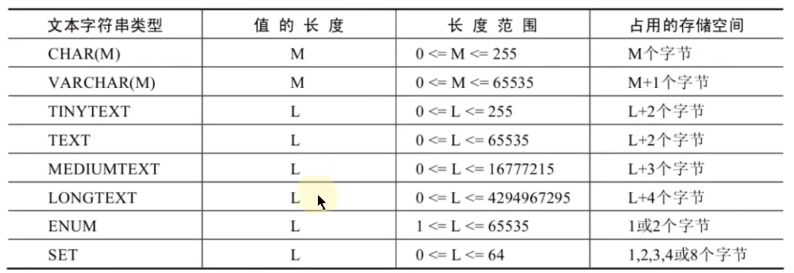

# 基础篇

# 1 数据库概述与MySQL安装篇

## 1.1 数据库概述

> **一、为什么要使用数据库**

- 持久化(persistence)：`把数据保存到可掉电式存储设备中以供之后使用`。大多数情况下，特别是企业级应用，`数据持久化意味着将内存中的数据保存到硬盘上加以”固化”`，而持久化的实现过程大多通过各种关系数据库来完成。
- 持久化的主要作用是`将内存中的数据存储在关系型数据库中`，当然也可以存储在磁盘文件、XML数据文件中。


***

> **二、数据库与数据库管理系统**

1、相关概念

| **概念**                                           | **概述**                                                     |
| -------------------------------------------------- | ------------------------------------------------------------ |
| DB：数据库（Database）                             | 即存储数据的“仓库”，其本质是一个文件系统。它保存了一系列有组织的数据。 |
| DBMS：数据库管理系统（Database Management System） | 是一种操纵和管理数据库的大型软件，用于建立、使用和维护数据库，对数据库进行统一管理和控制。用户通过数据库管理系统访问数据库中表内的数据。 |
| SQL：结构化查询语言（Structured Query Language）   | 专门用来与数据库通信的语言。                                 |

2、数据库与数据库管理系统的关系

数据库管理系统(DBMS)可以管理多个数据库，一般开发人员会针对每一个应用创建一个数据库。为保存应用中实体的数据，一般会在数据库创建多个表，以保存程序中实体用户的数据。

数据库管理系统、数据库和表的关系如图所示：


> **三、MySQL介绍**

1、概述

- 开放源代码的关系型数据库管理系统
- 分为 `社区版` 和 `商业版`
- MySQL是可以定制的，采用了 GPL（GNU General Public License） 协议，你可以修改源码来开发自己的MySQL系统。
- MySQL支持大型数据库，支持5000万条记录的数据仓库，32位系统表文件最大可支持 4GB ，64位系统支持最大的表文件为 8TB 。
- MySQL使用 标准的SQL数据语言 形式。

***

2、关于MySQL 8.0
`MySQL从5.7版本直接跳跃发布了8.0版本`，可见这是一个令人兴奋的里程碑版本。MySQL 8版本在功能上做了显著的改进与增强，开发者对MySQL的源代码进行了重构，最突出的一点是多MySQL Optimizer优化器进行了改进。

***

3、Why choose MySQL?

1. 开放源代码，使用成本低。
2. 性能卓越，服务稳定。
3. 软件体积小，使用简单，并且易于维护。
4. 历史悠久，社区用户非常活跃，遇到问题可以寻求帮助。
5. 许多互联网公司在用，经过了时间的验证。

***

> **四、RDBMS 与 非RDBMS**

**1、关系型数据库(RDBMS)**

- 这种类型的数据库是`最古老` 的数据库类型，关系型数据库模型是把复杂的数据结构归结为简单的`二元关系`（即二维表格形式）。
- 关系型数据库以 `行(row)`和 `列(column)`的形式存储数据，以便于用户理解。这一系列的行和列被称为 `表(table)`，一组表组成了一个`库(database)`。
- 表与表之间的数据记录有关系(relationship)。现实世界中的各种实体以及实体之间的各种联系均用`关系模型` 来表示。
- 关系型数据库，就是建立在 `关系模型` 基础上的数据库。
- SQL 就是关系型数据库的查询语言。


- 优势
  - `复杂查询` 可以用SQL语句方便的在一个表以及多个表之间做非常复杂的数据查询。
  - `事务支持` 使得对于安全性能很高的数据访问要求得以实现。

***

**2、非关系型数据库(非RDBMS)**

**介绍**

非关系型数据库，可看成传统关系型数据库的功能 `阉割版本` ，基于键值对存储数据，不需要经过SQL层的解析， `性能非常高` 。同时，通过减少不常用的功能，进一步`提高性能`。

**有哪些非关系型数据库**

- **键值型数据库**

  - 键值型数据库通过 Key-Value 键值的方式来存储数据，其中Key-Value可以是简单的对象，也可以是复杂的对象。Key作为唯一的标识符，优点是查找速度快，在这方面明显优于关系性数据库，缺点是无法像关系性数据库一样使用条件过滤（比如：WHERE），如果你不知道去哪里找数据，就要遍历所有的键，这就会消耗大量的计算。**文档型数据库**

  - 键值型数据库典型的使用场景是作为`内存缓存` 。 `Redis` 是最流行的键值型数据库。

- **文档型数据库**

  - 此类数据库可存放并获取文档，可以是`XML、JSON等格式`。在数据库中`文档`作为处理信息的基本单位，一个文档就相当于一条记录。文档数据库所存放的文档，就相当于键值数据库所存放的“值”。
  - `MongoDB`是最流行的文档型数据库。此外，还有CouchDB等。

- **搜索引擎数据库**
  - 搜索引擎数据库是应用在`搜索引擎领域的数据存储形式`，由于搜索引擎会爬取大量的数据，并以特定的格式进行存储，这样在检索的时候才能保证性能最优。核心原理是“`倒排索引`”。
  - 典型产品：Solr、`Elasticsearch`、Splunk 等。

***

> 五、关系型数据库设计规则

**1、表、记录、字段**

- E-R（entity-relationship，实体-联系）模型中有三个主要概念是： `实体集` 、`属性` 、`联系集`。

- 一个实体集（class）对应于数据库中的一个表（table），一个实体（instance）则对应于数据库表中的一行（row），也称为一条记录（record）。一个属性（attribute）对应于数据库表中的一列（column），也称为一个字段（field）。

```java
ORM思想(Object Relational Mapping)体现：
数据库中的一个表 <—> Java或Python中的一个类
表中的一条数据 <—> 类中的一个对象（或实体）
表中的一个列 <---->类中的一个字段、属性(field)
```

**2、表的关联关系 **

- 表与表之间的数据记录有关系(relationship)。现实世界中的各种实体以及实体之间的各种联系均用关系模型来表示。
- 四种：
  - 一对一关联
  - 一对多关联
  - 多对多关联
  - 自我引用

***

## 1.2 MySQL环境搭建 


可以改成其它服务器可访问数据库的IP地址和端口号就行。如果访问的是本机，并且端口号是3306，那么可以使用简洁写法`mysql -u root -p`


***

```java
// 1.说一说你了解的常见数据库
关系型：Oracle、MySQL、SQL Server、DB2、PGSQL
非关系型：Redis、MongoDB、ES...
  
// 2.谈一谈你对MySQL历史、特点的理解
历史：
  由瑞典的MySQL AB公司创立，1995开发出的MySQL
  2008年，MySQL被SUN公司收购
  2009年，Oracle收购SUN公司，进而Oracle就获取了MySQL
  2016年，MySQL8.0.0版本推出
特点：
  开源的、关系型数据库
  支持千万级别的数据量的存储，大型数据库
  
// 3.说说你对DB、DBMS、SQL的理解
DB：database， 看做是数据库文件。（类似于：.doc. txt..mp3、.avi、。。。 )
DBMS：数据库管理系统。（类似于word工具、Wps工具、记事本工具、qq影音播放器等）
MysQL数据库服务器中安装了MySQL DBMS,使用MysQL DBMS 来管理和操作DB，使用的是SQL语言。

// 4.你知道哪些非关系型数据库的类型呢？（了解）
键值型数据库：Redis
文档型数据库：MongoDB
搜索引擎数据库：ES、Solr
```

***

# 2 SELECT使用篇

> SQL概述

**1、SQL背景知识**

- 1974 年，IBM 研究员发布了一篇揭开数据库技术的论文《SEQUEL：一门结构化的英语查询语言》，直到今天这门结构化的查询语言并没有太大的变化，相比于其他语言， `SQL的半衰期可以说是非常长 了`。
- SQL（Structured Query Language，结构化查询语言）是使用关系模型的数据库应用语言， 与数据直接打交道，由 IBM 上世纪70年代开发出来。
- SQL 有两个重要的标准，分别是 `SQL92` 和 `SQL99`
- 不同的数据库生产厂商都支持SQL语句，但都有特有内容。


***

**2、SQL 分类**
**DDL （Data Definition Languages、数据定义语言）**

这些语句定义了不同的数据库、表、视图、索引等数据库对象，还可以用来创建、删除、修改数据库和数据表的结构。

**DML （Data Manipulation Language、数据操作语言）**

主要的语句关键字包括 `INSERT `、` DELETE` 、 `UPDATE` 、 `SELECT` 等。

**DCL （Data Control Language、数据控制语言）**

要的语句关键字包括` GRANT` 、 `REVOKE` 、` COMMIT` 、 `ROLLBACK` 、 `SAVEPOINT` 等。

```java
因为查询语句使用的非常的频繁，所以很多人把查询语句单拎出来一类：DQL（数据查询语言）。
还有单独将 COMMIT、ROLLBACK 取出来称为TCL （Transaction Control Language，事务控制语言）。
```

***

## 2.1 SQL语言的规则与规范

**1、基本规则**

- SQL 可以写在一行或者多行。为了提高可读性，各子句分行写，必要时使用缩进
- 每条命令以 ; 或 \g 或 \G 结束
- 关于标点符号
  - 必须保证所有的()、单引号、双引号是成对结束的
  - 必须使用英文状态下的半角输入方式
  - `字符串型`和`日期时间类型`的数据可以使用`单引号（' '）`表示
  - 列的`别名`，尽量使用`双引号（" "）`，而且不建议省略as

**2、SQL大小写规范 （建议遵守）**

- MySQL 在 `Windows` 环境下是`大小写不敏感`的

- MySQL 在`Linux` 环境下是`大小写敏感`的
  - 数据库名、表名、表的别名、变量名是严格区分大小写的
  - 关键字、函数名、列名(或字段名)、列的别名(字段的别名) 是忽略大小写的。

- 推荐采用统一的书写规范：
  - 数据库名、表名、表别名、字段名、字段别名等都小写
  - SQL 关键字、函数名、绑定变量等都大写

**3、注释**

```java
单行注释：#注释文字(MySQL特有的方式)
单行注释：-- 注释文字(--后面必须包含一个空格。)
多行注释：/* 注释文字 */
```

**4、数据导入指令**

在`命令行`客户端登录mysql，使用source指令导入

```shell
mysql> source d:\mysqldb.sql
```

***

## 2.2 基本的SELECT语句

**1、SELECT**

```mysql
SELECT 1; #没有任何子句
SELECT 9/2; #没有任何子句
SELECT 9/2 FROM DUAL; #也可以这样，DUAL是伪表
```

**2、SELECT … FROM**

```mysql
# 语法
SELECT  标识选择哪些列
FROM   标识从哪个表中选择

# 举例
SELECT *
FROM  departments;
```

```java
一般情况下，除非需要使用表中所有的字段数据，最好不要使用通配符‘*’。使用通配符虽然可以节省输入查询语句的时间，但是获取不需要的列数据通常会降低查询和所使用的应用程序的效率。通配符的优势是，当不知道所需要的列的名称时，可以通过它获取它们。
在生产环境下，不推荐你直接使用 SELECT * 进行查询。
```

**3、列的别名**

在列名和别名之间加入`关键字AS`，别名使用双引号

```mysql
# 举例
SELECT last_name AS name, commission_pct comm
FROM  employees;
```

**4、去除重复行**

默认情况下，查询会返回全部行，包括重复行。`DISTINCT`

```mysql
SELECT DISTINCT department_id,salary
FROM employees;
```

```java
这里有两点需要注意：
1、DISTINCT 需要放到所有列名的前面，如果写成 SELECT salary, DISTINCT department_id FROM employees 会报错。
  
2、DISTINCT 其实是对后面所有列名的组合进行去重，你能看到最后的结果是 74 条，因为这 74 个部门id不同，都有 salary 这个属性值。如果你想要看都有哪些不同的部门（department_id），只需要写 DISTINCT department_id 即可，后面不需要再加其他的列名了。
```

**5、空值参与运算**

所有运算符或列值遇到null值，运算的结果都为null

```mysql
SELECT employee_id,salary,commission_pct,12 * salary * (1 + commission_pct) "annual_sal"
FROM employees;
```

这里你一定要注意，在 MySQL 里面， 空值不等于空字符串。一个空字符串的长度是 0，而一个空值的长度是空。而且，在 MySQL 里面，空值是占用空间的。

**6、着重号**

`` 着重号

```mysql
SELECT * FROM `ORDER`;
```

我们需要保证表中的字段、表名等没有和保留字、数据库系统或常用方法冲突。如果真的相同，请在SQL语句中使用一对``（着重号）引起来。

**7、查询常数**

我们想对 employees 数据表中的员工姓名进行查询，同时增加一列字段 corporation ，这个字段固定值为“Wing”，可以这样写：

```mysql
SELECT 'Wing' as corporation, last_name FROM employees;
```

***

**8、显示表结构**

使用`DESCRIBE` 或 `DESC` 命令，表示表结构。

```mysql
DESCRIBE employees;
或
DESC employees;
```

```mysql
mysql> desc employees;

+----------------+-------------+------+-----+---------+-------+
| Field     | Type    | Null | Key | Default | Extra |
+----------------+-------------+------+-----+---------+-------+
| employee_id  | int(6)   | NO  | PRI | 0    |    |
| first_name   | varchar(20) | YES |   | NULL  |    |
| last_name   | varchar(25) | NO  |   | NULL  |    |
| email     | varchar(25) | NO  | UNI | NULL  |    |
| phone_number  | varchar(20) | YES |   | NULL  |    |
| hire_date   | date    | NO  |   | NULL  |    |
| job_id     | varchar(10) | NO  | MUL | NULL  |    |
| salary     | double(8,2) | YES |   | NULL  |    |
| commission_pct | double(2,2) | YES |   | NULL  |    |
| manager_id   | int(6)   | YES | MUL | NULL  |    |
| department_id | int(4)   | YES | MUL | NULL  |    |
+----------------+-------------+------+-----+---------+-------+
11 rows in set (0.00 sec)
```

```java
各个字段的含义分别解释如下：
Field：表示字段名称。
Type：表示字段类型，这里 barcode、goodsname 是文本型的，price 是整数类型的。
Null：表示该列是否可以存储NULL值。
Key：表示该列是否已编制索引。PRI表示该列是表主键的一部分；UNI表示该列是UNIQUE索引的一部分；MUL表示在列中某个给定值允许出现多次。
Default：表示该列是否有默认值，如果有，那么值是多少。
Extra：表示可以获取的与给定列有关的附加信息，例如AUTO_INCREMENT等。
```

**9、过滤数据**

```mysql
SELECT 字段1,字段2
FROM 表名
WHERE 过滤条件

# 举例
SELECT employee_id, last_name, job_id, department_id
FROM  employees
WHERE department_id = 90;
```

***

## 2.3 四大类运算符

### 2.3.1 算术运算符

算术运算符主要用于数学运算，其可以连接运算符前后的两个数值或表达式，对数值或表达式进行加（+）、减（-）、乘（*）、除（/）和取模（%）运算。


#### 2.3.1.1 加法与减法运算符

```mysql
mysql> SELECT 100, 100 + 0, 100 - 0, 100 + 50, 100 + 50 -30, 100 + 35.5, 100 - 35.5
FROM dual;

+-----+---------+---------+----------+--------------+------------+------------+
| 100 | 100 + 0 | 100 - 0 | 100 + 50 | 100 + 50 -30 | 100 + 35.5 | 100 - 35.5 |
+-----+---------+---------+----------+--------------+------------+------------+
| 100 |   100 |   100 |    150 |      120 |    135.5 |    64.5 |
+-----+---------+---------+----------+--------------+------------+------------+
1 row in set (0.00 sec)
```

```java
由运算结果可以得出如下结论：
1.一个整数类型的值对整数进行加法和减法操作，结果还是一个整数；
2.一个整数类型的值对浮点数进行加法和减法操作，结果是一个浮点数；
3.加法和减法的优先级相同，进行先加后减操作与进行先减后加操作的结果是一样的；
4.在Java中，+的左右两边如果有字符串，那么表示字符串的拼接。但是在MySQL中+只表示数值相加。如果遇到非数值类型，先尝试转成数值，如果转失败，就按0计算。（补充：MySQL中字符串拼接要使用字符串函数CONCAT()实现）
```

***

#### 2.3.1.2 乘法与除法运算符

```mysql
mysql> SELECT 100, 100 * 1, 100 * 1.0, 100 / 1.0, 100 / 2,100 + 2 * 5 / 2,100 /3, 100
DIV 0 FROM dual;

+-----+---------+-----------+-----------+---------+-----------------+---------+-------
----+
| 100 | 100 * 1 | 100 * 1.0 | 100 / 1.0 | 100 / 2 | 100 + 2 * 5 / 2 | 100 /3 | 100
DIV 0 |
+-----+---------+-----------+-----------+---------+-----------------+---------+-------
----+
| 100 |   100 |   100.0 |  100.0000 | 50.0000 |     105.0000 | 33.3333 |  
 NULL |
+-----+---------+-----------+-----------+---------+-----------------+---------+-------
----+
1 row in set (0.00 sec)
```

```mysql
#计算出员工的年基本工资
SELECT employee_id,salary,salary * 12 annual_sal
FROM employees;
```

```java
由运算结果可以得出如下结论：
1.一个数乘以整数1和除以整数1后仍得原数；
2.一个数乘以浮点数1和除以浮点数1后变成浮点数，数值与原数相等；
3.一个数除以整数后，不管是否能除尽，结果都为一个浮点数；
```

#### 2.3.1.3 求模（求余）运算符

```mysql
mysql> SELECT 12 % 3, 12 MOD 5 FROM dual;
+--------+----------+
| 12 % 3 | 12 MOD 5 |
+--------+----------+
|    0 |     2 |
+--------+----------+
1 row in set (0.00 sec)
```

```mysql
#筛选出employee_id是偶数的员工
SELECT * FROM employees
WHERE employee_id MOD 2 = 0;
```

### 2.3.2 比较运算符

比较运算符用来对表达式左边的操作数和右边的操作数进行比较，比较的结果为真则返回1，比较的结果为假则返回0，其他情况则返回NULL。

**比较运算符经常被用来作为SELECT查询语句的条件来使用，返回符合条件的结果记录。**


***

#### 2.3.2.1 等号运算符

- 等号运算符（=）判断等号两边的值、字符串或表达式是否相等，如果相等则返回1，不相等则返回0。
- 在使用等号运算符时，遵循如下规则：
  - 如果等号两边的值、字符串或表达式都为字符串，则MySQL会按照字符串进行比较，其比较的是每个字符串中字符的ANSI编码是否相等。
  - 如果等号两边的值都是整数，则MySQL会按照整数来比较两个值的大小。
  - 如果等号两边的值一个是整数，另一个是字符串，则MySQL会将字符串转化为数字进行比较。
  - 如果等号两边的值、字符串或表达式中有一个为NULL，则比较结果为NULL。
- 对比：SQL中赋值符号使用 :=

#### 2.3.2.2 安全等于运算符

安全等于运算符（<=>）与等于运算符（=）的作用是相似的， `唯一的区别 是‘<=>’可以用来对NULL进行判断`。在两个操作数均为NULL时，其返回值为1，而不为NULL；当一个操作数为NULL时，其返回值为0，而不为NULL。

```mysql
mysql> SELECT 1 <=> '1', 1 <=> 0, 'a' <=> 'a', (5 + 3) <=> (2 + 6), '' <=> NULL,NULL <=> NULL FROM dual;
+-----------+---------+-------------+---------------------+-------------+-------------
--+
| 1 <=> '1' | 1 <=> 0 | 'a' <=> 'a' | (5 + 3) <=> (2 + 6) | '' <=> NULL | NULL <=>
NULL |
+-----------+---------+-------------+---------------------+-------------+-------------
--+
|     1 |    0 |      1 |          1 |      0 |      
1 |
+-----------+---------+-------------+---------------------+-------------+-------------
--+
1 row in set (0.00 sec)
```

```mysql
#查询commission_pct等于0.40
SELECT employee_id,commission_pct FROM employees WHERE commission_pct = 0.40;
SELECT employee_id,commission_pct FROM employees WHERE commission_pct <=> 0.40;
#如果把0.40改成 NULL 呢？
```

可以看到，使用安全等于运算符时，两边的操作数的值都为NULL时，返回的结果为1而不是NULL，其他返回结果与等于运算符相同。

***

#### 2.3.2.3 不等于运算符

不等于运算符（<>和!=）用于判断两边的数字、字符串或者表达式的值是否不相等，如果不相等则返回1，相等则返回0。不等于运算符不能判断NULL值。如果两边的值有任意一个为NULL，或两边都为NULL，则结果为NULL。 SQL语句示例如下：

```mysql
mysql> SELECT 1 <> 1, 1 != 2, 'a' != 'b', (3+4) <> (2+6), 'a' != NULL, NULL <> NULL;

+--------+--------+------------+----------------+-------------+--------------+
| 1 <> 1 | 1 != 2 | 'a' != 'b' | (3+4) <> (2+6) | 'a' != NULL | NULL <> NULL |
+--------+--------+------------+----------------+-------------+--------------+
|    0 |  1  |    1  |       1  |   NULL  |     NULL |
+--------+--------+------------+----------------+-------------+--------------+
1 row in set (0.00 sec)
```

此外，还有非符号类型的运算符：


#### 2.3.2.4 空运算符

空运算符（IS NULL或者ISNULL）判断一个值是否为NULL，如果为NULL则返回1，否则返回0。 SQL语句示例如下：

```mysql
SELECT NULL IS NULL, ISNULL(NULL), ISNULL('a'), 1 IS NULL;
```

```mysql
#查询commission_pct等于NULL。比较如下的四种写法
SELECT employee_id,commission_pct FROM employees WHERE commission_pct IS NULL;
SELECT employee_id,commission_pct FROM employees WHERE commission_pct <=> NULL;
SELECT employee_id,commission_pct FROM employees WHERE ISNULL(commission_pct);
SELECT employee_id,commission_pct FROM employees WHERE commission_pct = NULL;
```

#### 2.3.2.5 非空运算符

非空运算符（IS NOT NULL）判断一个值是否不为NULL，如果不为NULL则返回1，否则返回0。 SQL语句示例如下：

```mysql
SELECT NULL IS NOT NULL, 'a' IS NOT NULL,  1 IS NOT NULL;
```

```mysql
#查询commission_pct不等于NULL
SELECT employee_id,commission_pct FROM employees WHERE commission_pct IS NOT NULL;
SELECT employee_id,commission_pct FROM employees WHERE NOT commission_pct <=> NULL;
SELECT employee_id,commission_pct FROM employees WHERE NOT ISNULL(commission_pct);
```

#### 2.3.2.6 最小值运算符

语法格式为：LEAST(值1，值2，…，值n)。其中，“值n”表示参数列表中有n个值。

在有两个或多个参数的情况下，返回最小值。

```mysql
SELECT LEAST (1,0,2), LEAST('b','a','c'), LEAST(1,NULL,2);

+---------------+--------------------+-----------------+
| LEAST (1,0,2) | LEAST('b','a','c') | LEAST(1,NULL,2) |
+---------------+--------------------+-----------------+
|    0    |    a      |    NULL    |
+---------------+--------------------+-----------------+
1 row in set (0.00 sec)
```

由结果可以看到，当参数是整数或者浮点数时，LEAST将返回其中最小的值；

当参数为字符串时，返回字母表中顺序最靠前的字符；当比较值列表中有NULL时，不能判断大小，返回值为NULL。

#### 2.3.2.7 最大值运算符

语法格式为：GREATEST(值1，值2，…，值n)。

其中，n表示参数列表中有n个值。当有两个或多个参数时，返回值为最大值。

假如任意一个自变量为NULL，则GREATEST()的返回值为NULL。

```mysql
mysql> SELECT GREATEST(1,0,2), GREATEST('b','a','c'), GREATEST(1,NULL,2);
+-----------------+-----------------------+--------------------+
| GREATEST(1,0,2) | GREATEST('b','a','c') | GREATEST(1,NULL,2) |
+-----------------+-----------------------+--------------------+
|        2 | c           |        NULL |
+-----------------+-----------------------+--------------------+
1 row in set (0.00 sec)
```

由结果可以看到，当参数中是整数或者浮点数时，GREATEST将返回其中最大的值；当参数为字符串时，返回字母表中顺序最靠后的字符；

当比较值列表中有NULL时，不能判断大小，返回值为NULL。

#### 2.3.2.8 BETWEEN AND运算符

BETWEEN运算符使用的格式通常为SELECT D FROM TABLE WHERE C BETWEEN A AND B，此时，当C大于或等于A，并且C小于或等于B时，结果为1，否则结果为0。

```mysql
mysql> SELECT 1 BETWEEN 0 AND 1, 10 BETWEEN 11 AND 12, 'b' BETWEEN 'a' AND 'c';

+-------------------+----------------------+-------------------------+
| 1 BETWEEN 0 AND 1 | 10 BETWEEN 11 AND 12 | 'b' BETWEEN 'a' AND 'c' |
+-------------------+----------------------+-------------------------+
|         1 |           0 |            1 |
+-------------------+----------------------+-------------------------+
1 row in set (0.00 sec)
```

```mysql
SELECT last_name, salary
FROM  employees
WHERE salary BETWEEN 2500 AND 3500
```

#### 2.3.2.9 IN运算符

IN运算符用于判断给定的值是否是IN列表中的一个值，如果是则返回1，否则返回0。

如果给定的值为NULL，或者IN列表中存在NULL，则结果为NULL。

```mysql
mysql> SELECT 'a' IN ('a','b','c'), 1 IN (2,3), NULL IN ('a','b'), 'a' IN ('a', NULL);
+----------------------+------------+-------------------+--------------------+
| 'a' IN ('a','b','c') | 1 IN (2,3) | NULL IN ('a','b') | 'a' IN ('a', NULL) |
+----------------------+------------+-------------------+--------------------+
|       1     |     0  |     NULL   |     1     |
+----------------------+------------+-------------------+--------------------+
1 row in set (0.00 sec)

SELECT employee_id, last_name, salary, manager_id
FROM  employees
WHERE manager_id IN (100, 101, 201);
```

#### 2.3.2.10 NOT IN运算符

NOT IN运算符用于判断给定的值是否不是IN列表中的一个值，如果不是IN列表中的一个值，则返回1，否则返回0。

```mysql
SELECT 'a' NOT IN ('a','b','c'), 1 NOT IN (2,3);
```

#### 2.3.2.11 LIKE运算符

LIKE运算符主要用来匹配字符串，通常用于模糊匹配，如果满足条件则返回1，否则返回0。

如果给定的值或者匹配条件为NULL，则返回结果为NULL。

LIKE运算符通常使用如下通配符：

```mysql
“%”：匹配0个或多个字符。
“_”：只能匹配一个字符。
```

SQL语句示例如下：

```mysql
mysql> SELECT NULL LIKE 'abc', 'abc' LIKE NULL; 
+-----------------+-----------------+
| NULL LIKE 'abc' | 'abc' LIKE NULL |
+-----------------+-----------------+
|      NULL  |      NULL  |
+-----------------+-----------------+
1 row in set (0.00 sec)
SELECT first_name
FROM employees
WHERE first_name LIKE 'S%';
SELECT last_name
FROM  employees
WHERE last_name LIKE '_o%';
```

#### 2.3.2.12 REGEXP运算符

REGEXP运算符用来匹配字符串，语法格式为： `expr REGEXP 匹配条件` 。

如果expr满足匹配条件，返回1；如果不满足，则返回0。若expr或匹配条件任意一个为NULL，则结果为NULL。

- REGEXP运算符在进行匹配时，常用的有下面几种通配符：

```java
（1）‘^’匹配以该字符后面的字符开头的字符串。
（2）‘$’匹配以该字符前面的字符结尾的字符串。
（3）‘.’匹配任何一个单字符。
（4）“[...]”匹配在方括号内的任何字符。例如，“[abc]”匹配“a”或“b”或“c”。为了命名字符的范围，使用一个‘-’。“[a-z]”匹配任何字母，而“[0-9]”匹配任何数字。
（5）‘*’匹配零个或多个在它前面的字符。例如，“x*”匹配任何数量的‘x’字符，“[0-9]*”匹配任何数量的数字，而“*”匹配任何数量的任何字符。
```

```mysql
SELECT 'shkstart' REGEXP '^s', 'shkstart' REGEXP 't$', 'shkstart' REGEXP 'hk';
SELECT 'atguigu' REGEXP 'gu.gu', 'atguigu' REGEXP '[ab]';
```

### 2.3.3 逻辑运算符

逻辑运算符主要用来判断表达式的真假，在MySQL中，逻辑运算符的返回结果为1、0或者NULL。

MySQL中支持4种逻辑运算符如下：


#### 2.3.3.1 逻辑非运算符

逻辑非（NOT或!）运算符表示当给定的值为0时返回1；当给定的值为非0值时返回0；

当给定的值为NULL时，返回NULL。

```mysql
SELECT NOT 1, NOT 0, NOT(1+1), NOT !1, NOT NULL;  
SELECT last_name, job_id
FROM  employees
WHERE job_id NOT IN ('IT_PROG', 'ST_CLERK', 'SA_REP');
```

#### 2.3.3.2 逻辑与运算符

逻辑与（AND或&&）运算符是当给定的所有值均为非0值，并且都不为NULL时，返回1；

当给定的一个值或者多个值为0时则返回0；否则返回NULL。

```mysql
SELECT 1 AND -1, 0 AND 1, 0 AND NULL, 1 AND NULL;
SELECT employee_id, last_name, job_id, salary
FROM  employees
WHERE salary >=10000
AND  job_id LIKE '%MAN%';
```

#### 2.3.3.3 逻辑或运算符

逻辑或（OR或||）运算符是当给定的值都不为NULL，并且任何一个值为非0值时，则返回1，否则返回0；

当一个值为NULL，并且另一个值为非0值时，返回1，否则返回NULL；当两个值都为NULL时，返回NULL。

```mysql
SELECT 1 OR -1, 1 OR 0, 1 OR NULL, 0 || NULL, NULL || NULL; 
#查询基本薪资不在9000-12000之间的员工编号和基本薪资
SELECT employee_id,salary FROM employees
WHERE NOT (salary >= 9000 AND salary <= 12000);

SELECT employee_id,salary FROM employees
WHERE salary <9000 OR salary > 12000;

SELECT employee_id,salary FROM employees
WHERE salary NOT BETWEEN 9000 AND 12000;

SELECT employee_id, last_name, job_id, salary
FROM  employees
WHERE salary >= 10000
OR   job_id LIKE '%MAN%';

```

```java
注意：
OR可以和AND一起使用，但是在使用时要注意两者的优先级，由于AND的优先级高于OR，因此先对AND两边的操作数进行操作，再与OR中的操作数结合。
```

#### 2.3.3.4 逻辑异或运算符

```
异，不一样就是1，一样就是0
```

逻辑异或（XOR）运算符是当给定的值中任意一个值为NULL时，则返回NULL；

如果两个非NULL的值都是0或者都不等于0时，则返回0；如果一个值为0，另一个值不为0时，则返回1。

```mysql
mysql> SELECT 1 XOR -1, 1 XOR 0, 0 XOR 0, 1 XOR NULL, 1 XOR 1 XOR 1, 0 XOR 0 XOR 0;

+----------+---------+---------+------------+---------------+---------------+
| 1 XOR -1 | 1 XOR 0 | 0 XOR 0 | 1 XOR NULL | 1 XOR 1 XOR 1 | 0 XOR 0 XOR 0 |
+----------+---------+---------+------------+---------------+---------------+
|     0 |    1 |    0 |    NULL |       1 |       0 |
+----------+---------+---------+------------+---------------+---------------+
1 row in set (0.00 sec)

```

```mysql
select last_name,department_id,salary
from employees
where department_id in (10,20) XOR salary > 8000;
```

### 2.3.4 位运算符

位运算符是在二进制数上进行计算的运算符。位运算符会先将操作数变成二进制数，然后进行位运算，最后将计算结果从二进制变回十进制数。

MySQL支持的位运算符如下：


使用频率低，略。

***

## 2.4 排序与分页

### 2.4.1 排序

**1、排序数据**

##### 排序规则

- 使用 `ORDER BY` 子句排序
  - ASC（ascend）: 升序
  - DESC（descend）:降序
- ORDER BY 子句在`SELECT语句的结尾`。

**2、单列排序**

- 如果不指明排序规则，则默认为ASC 升序

```mysql
SELECT  last_name, job_id, department_id, hire_date
FROM   employees
ORDER BY hire_date ; #默认为asc 升序
```

**3、多列排序**

- 若有多个排序规则，则从左到右依次书写
- 从左到右，优先级别依次降低

```mysql
SELECT last_name, department_id, salary
FROM  employees
ORDER BY department_id, salary DESC;
```

***

### 2.4.2 分页

- LIMIT 子句必须放在整个SELECT语句的最后！
- 约束返回结果的数量可以 减少数据表的网络传输量 ，也可以 提升查询效率 。
- 如果我们知道返回结果只有1 条，就可以使用 LIMIT 1 ，告诉 SELECT 语句只需要返回一条记录即可。
- 这样的好处就是 SELECT 不需要扫描完整的表，只需要检索到一条符合条件的记录即可返回。

***

## 2.5 多表查询

### 2.5.1 笛卡尔积

`多表查询`，也称为`关联查询`，指 *两个或更多个表一起完成查询操作*。

`前提条件`：这些一起查询的表之间是有关系的（一对一、一对多），它们之间一定是有关联字段，这个关联字段可能建立了外键，也可能没有建立外键。

比如：员工表和部门表，这两个表依靠“部门编号”进行关联。

```mysql
#案例：查询员工的姓名及其部门名称
SELECT last_name, department_name
FROM employees, departments;
```

上述多表查询中出现的问题称为：`笛卡尔积的错误`。

**笛卡尔积（或交叉连接）的理解**

笛卡尔乘积是一个数学运算。假设我有两个集合 X 和 Y，那么 X 和 Y 的笛卡尔积就是 X 和 Y 的所有可能
组合，也就是第一个对象来自于 X，第二个对象来自于 Y 的所有可能。

组合的个数即为两个集合中元素个数的乘积数。


SQL92中，`笛卡尔积`也称为 `交叉连接` ，英文是 `CROSS JOIN` 。

```mysql
# 下面两条语句都会出现笛卡尔积
SELECT last_name,department_name FROM employees,departments;
SELECT last_name,department_name FROM employees CROSS JOIN departments;
```

- `在表中有相同列时，在列名之前加上表名前缀`。
- **建议：从SQL优化的角度，建议多表查询时，每个字段都指明所在的表**

***

### 2.5.2 多表查询分类

#### 2.5.2.1 等值连接 vs 非等值连接

- **等值连接**

表与表之间有字段相关联

连接 n个表,至少需要n-1个连接条件

- **非等值连接**

表与表之间没有明确的关联条件，是根据一个表中的字段的，在另一个表中一个范围的情况


```mysql
SELECT e.last_name, e.salary, j.grade_level
FROM  employees e, job_grades j  # job_grades 是工资等级表
WHERE e.salary >= j.lowest_sal AND e.salary <= j.highest_sal; 
```

#### 2.5.2.2 **自连接** vs 非自连接

- **自连接**

同一张表，自己连接自己

```mysql
#查询employees表，返回“Xxx works for Xxx”
SELECT CONCAT(worker.last_name ,' works for '
   , manager.last_name)
FROM  employees worker, employees manager
WHERE worker.manager_id = manager.employee_id ;
```

- 非自连接

不是同一个张表连接

#### 2.5.2.3 内连接 vs 外连接


**SQL92实现外连接：使用(+)创建连接**

- 在 SQL92 中采用（+）代表从表所在的位置。即左或右外连接中，(+) 表示哪个是从表。
- Oracle 对 SQL92 支持较好，而 **MySQL 则不支持 SQL92 的外连接**。

```mysql
#左外连接
SELECT last_name,department_name
FROM employees ,departments
WHERE employees.department_id = departments.department_id(+);

#右外连接
SELECT last_name,department_name
FROM employees ,departments
WHERE employees.department_id(+) = departments.department_id;

# (+)在谁那里就是相反的连接，代表谁补null
# 如果在左边就是右外连接
# 如果在右边就是左外连接
```

- 而且在 SQL92 中，只有左外连接和右外连接，没有满（或全）外连接。

***

**SQL99语法实现多表查询**

**1、基本语法**

- 使用`JOIN...ON`子句创建连接的语法结构：

```mysql
SELECT table1.column, table2.column,table3.column
FROM table1
JOIN table2 ON table1 和 table2 的连接条件
JOIN table3 ON table2 和 table3 的连接条件
```

- SQL99 采用的这种`嵌套结构非常清爽、层次性更强、可读性更强`，即使再多的表进行连接也都清晰可见。

- **语法说明**：
  - 可以使用 `ON 子句指定额外的连接条件`。
  - 这个连接条件是与其它条件分开的。
  - ON 子句使语句具有更高的`易读性`。
  - 关键字 JOIN、INNER JOIN、CROSS JOIN 的含义是一样的，都表示内连接

***

**2、内连接(INNER JOIN)的实现**

```mysql
SELECT 字段列表
FROM A表 INNER JOIN B表
ON 关联条件
WHERE 等其他子句;

# 例子
SELECT 
	employee_id, city, department_name
FROM  
	employees e
JOIN departments d ON d.department_id = e.department_id
JOIN locations l ON d.location_id = l.location_id;	
```

***

**3、外连接(OUTER JOIN)的实现**

以一张表为标准，其他表做辅助，如果没有则，辅助表用null填充

- **左外连接**(LEFT OUTER JOIN)

```mysql
#实现查询结果是A
SELECT 字段列表
FROM A表 LEFT JOIN B表
ON 关联条件
WHERE 等其他子句;

# 例子
SELECT 
	e.last_name, e.department_id, d.department_name
FROM employees e
LEFT JOIN departments d ON e.department_id = d.department_id;
```

- **右外连接**(RIGHT OUTER JOIN)

```mysql
#实现查询结果是B
SELECT 字段列表
FROM A表 RIGHT JOIN B表
ON 关联条件
WHERE 等其他子句;

# 例子
SELECT e.last_name, e.department_id, d.department_name
FROM  employees e
RIGHT JOIN departments d ON (e.department_id = d.department_id);
```

```mysql
需要注意的是，LEFT JOIN 和 RIGHT JOIN 只存在于 SQL99 及以后的标准中，在 SQL92 中不存在，
只能用 (+) 表示。
```

- **满外连接**(FULL OUTER JOIN)
  - 满外连接的结果 = 左右表匹配的数据 + 左表没有匹配到的数据 + 右表没有匹配到的数据。
  - SQL99是支持满外连接的。使用FULL JOIN 或 FULL OUTER JOIN来实现。
  - 需要注意的是，MySQL不支持FULL JOIN，但是可以用 `LEFT JOIN` UNION`RIGHT JOIN`代替。

***

**4、UNION的使用**

`合并查询结果` 利用UNION关键字，可以给出多条SELECT语句，并将它们的结果组合成单个结果集。

合并时，两个表对应的列数和数据类型必须相同，并且相互对应。各个SELECT语句之间使用UNION或UNION ALL关键字分隔。

```mysql
SELECT column,... FROM table1
UNION [ALL]
SELECT column,... FROM table2
```

- **UNION & UNION ALL**
  - `UNION` 操作符返回两个查询的结果集的并集，**去除重复记录。**
  - 
  - `UNION ALL` 返回两个查询的结果集的并集。对于两个结果集的重复部分，**不去重**
  - 

```java
注意：
执行UNION ALL语句时所需要的资源比UNION语句少。
如果明确知道合并数据后的结果数据不存在重复数据，或者不需要去除重复的数据，则尽量使用UNION ALL语句，以提高数据查询的效率。
```

```mysql
# 例子
# 查询部门编号>90或邮箱包含a的员工信息
SELECT * FROM employees WHERE email LIKE '%a%' OR department_id>90;

SELECT * FROM employees  WHERE email LIKE '%a%'
UNION
SELECT * FROM employees  WHERE department_id>90;
```

***

#### 2.5.2.4 七种SQL JOINS的实现


代码实现

```mysql
#中图：内连接 A∩B
SELECT employee_id,last_name,department_name
FROM employees e JOIN departments d
ON e.`department_id` = d.`department_id`;

#左上图：左外连接
SELECT employee_id,last_name,department_name
FROM employees e LEFT JOIN departments d
ON e.`department_id` = d.`department_id`;

#右上图：右外连接
SELECT employee_id,last_name,department_name
FROM employees e RIGHT JOIN departments d
ON e.`department_id` = d.`department_id`;

#左中图：A - A∩B
SELECT employee_id,last_name,department_name
FROM employees e LEFT JOIN departments d
ON e.`department_id` = d.`department_id`
WHERE d.`department_id` IS NULL

#右中图：B - A∩B
SELECT employee_id,last_name,department_name
FROM employees e RIGHT JOIN departments d
ON e.`department_id` = d.`department_id`
WHERE e.`department_id` IS NULL

#左下图：满外连接
# 左中图 + 右上图 A∪B
SELECT employee_id,last_name,department_name
FROM employees e LEFT JOIN departments d
ON e.`department_id` = d.`department_id`
WHERE d.`department_id` IS NULL
UNION ALL  #没有去重操作，效率高
SELECT employee_id,last_name,department_name
FROM employees e RIGHT JOIN departments d
ON e.`department_id` = d.`department_id`;

#右下图
#左中图 + 右中图 A ∪B- A∩B 或者 (A - A∩B) ∪ （B - A∩B）
SELECT employee_id,last_name,department_name
FROM employees e LEFT JOIN departments d
ON e.`department_id` = d.`department_id`
WHERE d.`department_id` IS NULL
UNION ALL
SELECT employee_id,last_name,department_name
FROM employees e RIGHT JOIN departments d
ON e.`department_id` = d.`department_id`
WHERE e.`department_id` IS NULL

```

```java
注意:
我们要控制连接表的数量。多表连接就相当于嵌套 for 循环一样，非常消耗资源，会让 SQL 查询性能下降得很严重，因此不要连接不必要的表。在许多 DBMS 中，也都会有最大连接表的限制。
  
【强制】超过三个表禁止 join。需要 join 的字段，数据类型保持绝对一致；多表关联查询时，保证被关联的字段需要有索引。
说明：即使双表 join 也要注意表索引、SQL性能。
来源：阿里巴巴《Java开发手册》
```

## 2.6 单行函数

### 2.6.1 函数的理解

可以把我们经常使用的代码封装起来，需要的时候直接调用即可。

这样既 `提高了代码效率` ，又 `提高了可维护性` 。

在 SQL 中我们也可以使用函数对检索出来的数据进行函数操作。使用这些函数，可以极大地提高用户对`数据库的管理效率` 。


从函数定义的角度出发，我们可以将函数分成 `内置函数` 和 `自定义函数` 。

***

> 不同DBMS函数的差异

我们在使用SQL语言的时候，不是直接和这门语言打交道，而是通过它使用不同的数据库软件，即 DBMS。`DBMS之间的差异性很大，远大于同一个语言不同版本之间的差异`。实际上，只有很少的函数是被DBMS同时支持的。比如，大多数DBMS使用（||）或者（+）来做拼接符，而在MySQL中的字符串拼接函数为concat()。大部分DBMS会有自己特定的函数，这就意味着`采用SQL函数的代码可移植性是很差的`，因此在使用函数的时候需要特别注意。

MySQL提供的内置函数从`实现的功能角度`可以分为数值函数、字符串函数、日期和时间函数、流程控制函数、加密与解密函数、MySQL信息函数、聚合函数等。这里，还可以讲这些丰富的内置函数再分为两类：`单行函数`、`聚合函数（或分组函数）`


***

### 2.6.2 数值函数

**1、基本函数**


```mysql
# 单行函数可以嵌套
SELECT TRUNCATE(ROUND(123.456,2),0) FROM DUAL
```

***

### 2.6.3 字符串函数


```java
注意：MySQL中，字符串的位置是从1开始的。
```

### 2.6.4 日期和时间函数

#### 2.6.4.1 获取日期、时间

| 函数                                                         | **用法**                       |
| ------------------------------------------------------------ | ------------------------------ |
| **CURDATE()** ，CURRENT_DATE()                               | 返回当前日期，只包含年、月、日 |
| **CURTIME()** ， CURRENT_TIME()                              | 返回当前时间，只包含时、分、秒 |
| **NOW()** / SYSDATE() / CURRENT_TIMESTAMP() / LOCALTIME() / LOCALTIMESTAMP() | 返回当前系统日期和时间         |
| UTC_DATE()                                                   | 返回UTC（世界标准时间）日期    |
| UTC_TIME()                                                   | 返回UTC（世界标准时间）时间    |

```mysql
SELECT
    CURDATE(), CURRENT_DATE(),
    CURTIME(), CURRENT_TIME(),
    NOW(), SYSDATE(), CURRENT_TIMESTAMP(), LOCALTIME(), LOCALTIMESTAMP(),
    UTC_DATE(), UTC_TIME()
```

***

#### 2.6.4.2 日期与时间戳的转换

| **函数**                 | 用法                                                         |
| ------------------------ | ------------------------------------------------------------ |
| UNIX_TIMESTAMP()         | 以UNIX时间戳的形式返回当前时间。SELECT UNIX_TIMESTAMP() ->1634348884 |
| UNIX_TIMESTAMP(date)     | 将时间date以UNIX时间戳的形式返回。                           |
| FROM_UNIXTIME(timestamp) | 将UNIX时间戳的时间转换为普通格式的时间                       |

```mysql
SELECT UNIX_TIMESTAMP(),UNIX_TIMESTAMP('2020-01-01 10:00:00'),FROM_UNIXTIME('1577894400') FROM DUAL
```

***

#### 2.6.4.3 获取月份、星期、星期数、天数等函数

| 函数                                     | 用法                                       |
| ---------------------------------------- | ------------------------------------------ |
| YEAR(date) / MONTH(date) / DAY(date)     | 返回具体的日期值                           |
| HOUR(time) / MINUTE(time) / SECOND(time) | 返回具体的时间值                           |
| MONTHNAME(date)                          | 返回月份：January，…                       |
| DAYNAME(date)                            | 返回星期几：MONDAY，TUESDAY … SUNDAY       |
| WEEKDAY(date)                            | 返回周几，注意，周1是0，周2是1 ... 周日是6 |
| QUARTER(date)                            | 返回日期对应的季度，范围为1～4             |
| WEEK(date) ， WEEKOFYEAR(date)           | 返回一年中的第几周                         |
| DAYOFYEAR(date)                          | 返回日期是一年中的第几天                   |
| DAYOFMONTH(date)                         | 返回日期位于所在月份的第几天               |
| DAYOFWEEK(date)                          | 返回周几,注意:周日是1，周一是2 ... 周六是7 |

```mysql
# 获取年月日时分秒
SELECT YEAR(CURDATE()), MONTH(CURDATE()), DAY(CURDATE()),
       HOUR(NOW()), MINUTE(NOW()), SECOND(NOW()) FROM DUAL

SELECT MONTHNAME(CURDATE()),DAYNAME(CURDATE()),
       WEEKDAY(CURDATE()),QUARTER(CURDATE()),
       WEEK(CURDATE()),DAYOFYEAR(CURDATE()),
       DAYOFMONTH(CURDATE()),DAYOFWEEK(CURDATE()) FROM DUAL
```

***

#### 2.6.4.4 日期的操作函数

| 函数                    | 用法                                       |
| ----------------------- | ------------------------------------------ |
| EXTRACT(type FROM date) | 返回指定日期中特定的部分，type指定返回的值 |

EXTRACT(type FROM date)函数中type的取值与含义：

| type取值           | 含义                         |
| ------------------ | ---------------------------- |
| MICROSECOND        | 返回毫秒数                   |
| SECOND             | 返回秒数                     |
| MINUTE             | 返回分钟数                   |
| HOUR               | 返回小时数                   |
| DAY                | 返回天数                     |
| WEEK               | 返回日期在一年中的第几个星期 |
| MONTH              | 返回日期在一年中的第几个月   |
| QUARTER            | 返回日期在一年中的第几个季度 |
| YEAR               | 返回日期的年份               |
| SECOND_MICROSECOND | 返回秒和毫秒值               |
| MINUTE_MICROSECOND | 返回分钟和毫秒值             |
| MINUTE_SECOND      | 返回分钟和秒值               |
| HOUR_MICROSECOND   | 返回小时和毫秒值             |
| HOUR_SECOND        | 返回小时和秒值               |
| HOUR_MINUTE        | 返回小时和分钟值             |
| DAT_MICROSECOND    | 返回天和毫秒值               |
| DAT_SECOND         | 返回天和秒值                 |
| DAT_MINUTE         | 返回天和分钟值               |

```mysql
# 只列举几个
SELECT EXTRACT(MICROSECOND FROM NOW()),
       EXTRACT(SECOND FROM NOW()),
       EXTRACT(MINUTE FROM NOW()),
       EXTRACT(HOUR FROM NOW()),
       EXTRACT(DAY FROM NOW()),
       EXTRACT(HOUR_MINUTE FROM NOW()) # 2209 意思是小时和分钟拼一起，相当于 22:09
       FROM DUAL
```

***

#### 2.6.4.5 时间和秒钟转换的函数

| 函数                 | 用法                                                         |
| -------------------- | ------------------------------------------------------------ |
| TIME_TO_SEC(time)    | 将 time 转化为秒并返回结果值。转化的公式为：`小时*3600+分钟*60+秒` |
| SEC_TO_TIME(seconds) | 将 seconds 描述转化为包含小时、分钟和秒的时间                |

```mysql
SELECT TIME_TO_SEC(CURTIME()),SEC_TO_TIME(79985) FROM DUAL
```

***

#### 2.6.4.6 计算日期和时间的函数

| 函数                                                         | 用法                                           |
| ------------------------------------------------------------ | ---------------------------------------------- |
| DATE_ADD(datetime, INTERVAL expr type)，ADDDATE(date,INTERVAL expr type) | 返回与给定日期时间相差INTERVAL时间段的日期时间 |
| DATE_SUB(date,INTERVAL expr type)，SUBDATE(date,INTERVAL expr type) | 返回与date相差INTERVAL时间间隔的日期           |


```mysql
# 在现在的时间加上一年
SELECT DATE_ADD(NOW(), INTERVAL 1 YEAR) FROM DUAL
# 在现在的时间上：分钟加1，秒钟加2
SELECT NOW(),DATE_ADD(NOW(), INTERVAL '1_2' MINUTE_SECOND ) FROM DUAL
```

| 函数                         | 用法                                                         |
| ---------------------------- | ------------------------------------------------------------ |
| ADDTIME(time1,time2)         | 返回time1加上time2的时间。当time2为一个数字时，代表的是`秒`，可以为负数 |
| SUBTIME(time1,time2)         | 返回time1减去time2后的时间。当time2为一个数字时，代表的是`秒`，可以为负数 |
| DATEDIFF(date1,date2)        | 返回date1 - date2的日期间隔天数                              |
| TIMEDIFF(time1, time2)       | 返回time1 - time2的时间间隔                                  |
| FROM_DAYS(N)                 | 返回从0000年1月1日起，N天以后的日期                          |
| TO_DAYS(date)                | 返回日期date距离0000年1月1日的天数                           |
| LAST_DAY(date)               | 返回date所在月份的最后一天的日期                             |
| MAKEDATE(year,n)             | 针对给定年份与所在年份中的天数返回一个日期                   |
| MAKETIME(hour,minute,second) | 将给定的小时、分钟和秒组合成时间并返回                       |

```mysql
SELECT NOW(),
       ADDTIME(NOW(),2), # 当前时间+2秒
       SUBTIME(NOW(),3), # 当前时间-3秒
       SUBTIME(NOW(),'1:2:3'), # 当前时间小时-1，分钟-2，秒-3
       DATEDIFF(NOW(),'2024-03-01') # 两个日期时间间隔
FROM DUAL

# 日期加上0就可以得到一串数字
SELECT NOW(),NOW() + 0 FROM DUAL; # 2024-03-13 01:00:10  20240313010010
```

***

#### 2.6.4.7 日期的格式化与解析

| 函数                              | 用法                                       |
| --------------------------------- | ------------------------------------------ |
| DATE_FORMAT(date,fmt)             | 按照字符串fmt格式化日期date值              |
| TIME_FORMAT(time,fmt)             | 按照字符串fmt格式化时间time值              |
| GET_FORMAT(date_type,format_type) | 返回日期字符串的显示格式                   |
| STR_TO_DATE(str, fmt)             | 按照字符串fmt对str进行解析，解析为一个日期 |

上述`非GET_FORMAT`函数中fmt参数常用的格式符：

| 格式符 | 说明                                                        | 格式符 | 说明                                                        |
| ------ | ----------------------------------------------------------- | ------ | ----------------------------------------------------------- |
| %Y     | 4位数字表示年份                                             | %y     | 表示两位数字表示年份                                        |
| %M     | 月名表示月份（January,…）                                   | %m     | 两位数字表示月份（01,02,03。。。）                          |
| %b     | 缩写的月名（Jan.，Feb.，…）                                 | %c     | 数字表示月份（1,2,3,…）                                     |
| %D     | 英文后缀表示月中的天数（1st,2nd,3rd,…）                     | %d     | 两位数字表示月中的天数(01,02…)                              |
| %e     | 数字形式表示月中的天数（1,2,3,4,5…）                        |        |                                                             |
| %H     | 两位数字表示小数，24小时制（01,02…）                        | %h和%I | 两位数字表示小时，12小时制（01,02…）                        |
| %k     | 数字形式的小时，24小时制(1,2,3)                             | %l     | 数字形式表示小时，12小时制（1,2,3,4…）                      |
| %i     | 两位数字表示分钟（00,01,02）                                | %S和%s | 两位数字表示秒(00,01,02…)                                   |
| %W     | 一周中的星期名称（Sunday…）                                 | %a     | 一周中的星期缩写（Sun.，Mon.,Tues.，…）                     |
| %w     | 以数字表示周中的天数(0=Sunday,1=Monday…)                    |        |                                                             |
| %j     | 以3位数字表示年中的天数(001,002…)                           | %U     | 以数字表示年中的第几周，（1,2,3。。）其中Sunday为周中第一天 |
| %u     | 以数字表示年中的第几周，（1,2,3。。）其中Monday为周中第一天 |        |                                                             |
| %T     | 24小时制                                                    | %r     | 12小时制                                                    |
| %p     | AM或PM                                                      | %%     | 表示%                                                       |

***

### 2.6.5 流程控制函数

MySQL中的流程处理函数主要包括IF()、IFNULL()和CASE()函数。

| 函数                                                         | 用法                                            |
| ------------------------------------------------------------ | ----------------------------------------------- |
| IF(value,value1,value2)                                      | 如果value的值为TRUE，返回value1，否则返回value2 |
| IFNULL(value1, value2)                                       | 如果value1不为NULL，返回value1，否则返回value2  |
| CASE WHEN 条件1 THEN 结果1 WHEN 条件2 THEN 结果2 … [ELSE resultn] END | 相当于Java的if…else if…else…                    |
| CASE expr WHEN 常量值1 THEN 值1 WHEN 常量值1 THEN 值1 … [ELSE 值n] END | 相当于Java的switch…case…                        |

```mysql
# IF()
SELECT last_name,salary,IF(salary >= 6000,'高工资','低工资') FROM employees;
SELECT last_name,IF(commission IS NOT NULL,commission,0) FROM employees;

# IFNULL()
SELECT last_name,IFNULL(commission,0) FROM employees;

# if…else if else
SELECT last_name,salary,
CASE 
WHEN salary >= 15000 THEN '等级一'
WHEN salary >= 10000 THEN '等级二'
ELSE '等级三' 
END FROM employees;

# switch…case…
SELECT last_name,department_id 
CASE department_id
WHEN 10 THEN salary*1.1,
WHEN 20 THEN salary*1.2,
WHEN 30 THEN salary*1.3,
ELSE salary* 1.4 END
FROM employees;
```

***

### 2.6.6 加密与解密函数

加密与解密函数主要用于对数据库中的数据进行加密和解密处理，以防止数据被他人窃取。这些函数在保证数据库安全时非常有用。 `8.0已弃用，不推荐使用`

比如密码，现在为了安全直接前端就已经加密，或者后端就已经加密了，不用等到入库才加密，这样更加安全和高效。

***

### 2.6.7 MySQL信息函数

MySQL中内置了一些可以查询MySQL信息的函数，这些函数主要用于帮助数据库开发或运维人员更好地对数据库进行维护工作。

| 函数                                                  | 用法                                                     |
| ----------------------------------------------------- | -------------------------------------------------------- |
| VERSION()                                             | 返回当前MySQL的版本号                                    |
| CONNECTION_ID()                                       | 返回当前MySQL服务器的连接数                              |
| DATABASE()，SCHEMA()                                  | 返回MySQL命令行当前所在的数据库                          |
| USER()，CURRENT_USER()、SYSTEM_USER()，SESSION_USER() | 返回当前连接MySQL的用户名，返回结果格式为“主机名@用户名” |
| CHARSET(value)                                        | 返回字符串value自变量的字符集                            |
| COLLATION(value)                                      | 返回字符串value的比较规则                                |

```mysql
SELECT VERSION(),CONNECTION_ID(),DATABASE(),USER(),CHARSET('王'),COLLATION('王')
```

***

### 2.6.8 其他函数

MySQL中有些函数无法对其进行具体的分类，但是这些函数在MySQL的开发和运维过程中也是不容忽视的。

| 函数                           | 用法                                                         |
| ------------------------------ | ------------------------------------------------------------ |
| CONV(value,from,to)            | 将value的值进行不同进制之间的转换                            |
| INET_ATON(ipvalue)             | 将以点分隔的IP地址转化为一个数字                             |
| INET_NTOA(value)               | 将数字形式的IP地址转化为以点分隔的IP地址                     |
| BENCHMARK(n,expr)              | 将表达式expr重复执行n次。用于测试MySQL处理expr表达式所耗费的时间 |
| CONVERT(value USING char_code) | 将value所使用的字符编码修改为char_code                       |

***

## 2.7 聚合函数

`聚合`（或聚集、分组）函数，它是对一组数据进行汇总的函数，输入的是一组数据的集合，输出的是单个值。

### 2.7.1 聚合函数介绍

- **什么是聚合函数**

聚合函数作用于一组数据，并对一组数据返回一个值。


- **聚合函数类型**
  - **AVG()**
  - **SUM()**
  - **MAX()**
  - **MIN()**
  - **COUNT() **

- 聚合函数不能嵌套调用。比如不能出现类似“AVG(SUM(字段名称))”形式的调用。

***

#### 2.7.1.1 AVG和SUM函数

可以对**数值型数据**使用AVG 和 SUM 函数。

注意：AVG统计总的数据不会统计NULL，并且除以总数也不会将NULL的算进去除，举个例子：家里有3个人，工资分别是 2000，1000，NULL，那么AVG的结果为（2000+1000）/ 2 = 1500；其实平均应该是 1000 才对。这个要注意。

SUM统计时也不会统计NULL。

```mysql
SELECT AVG(salary), SUM(salary) FROM employees

# 上面三个人的工资
# 错误的 commission_pct存在为NULL
SELECT AVG(commission_pct) FROM home

# 正确的1
SELECT SUM(commission_pct)/COUNT(1) FROM home

# 正确的2
SELECT AVG(IFNULL(commission_pct,0)) FROM home
```

***

#### 2.7.1.2 MIN和MAX函数

适用于数值类型，字符串类型，日期时间类型的字段

```mysql
SELECT MAX(salary),MIN(salary) FROM employees
```

***

#### 2.7.1.3 COUNT函数

- COUNT(*)返回表中记录总数，适用于**任意数据类型**。

- COUNT(expr) 返回**expr不为空null**的记录总数。【这个要注意】
- COUNT(1) 返回记录总数

```mysql
SELECT COUNT(*) FROM employees WHERE department_id = 50;
SELECT COUNT(commission_pct) FROM employees WHERE department_id = 50;
```


***

**问题1：用count(\*)，count(1)，count(列名)谁好呢?**

- 其实，对于MyISAM引擎的表是没有区别的。这种引擎内部有一计数器在维护着行数。Innodb引擎的表用count(*),count(1)直接读行数，复杂度是O(n)，因为innodb真的要去数一遍。但好于具体的count(列名)。【后面高级篇还会深入介绍】

**问题2：能不能使用count(列名)替换count(\*)?**

- 不要使用 count(列名)来替代 `count(*)`，`count(*)`是 SQL92 定义的标准统计行数的语法，跟数据库无关，跟 NULL 和非 NULL 无关。

  说明：count(*)会统计值为 NULL 的行，而 count(列名)不会统计此列为 NULL 值的行。

***

### 2.7.2 GROUP BY

#### 2.7.2 1 基本使用


**可以使用GROUP BY子句将表中的数据分成若干组**

```mysql
SELECT column, group_function(column)
FROM table
[WHERE	condition]
[GROUP BY	group_by_expression]
[ORDER BY	column];
```

```java
明确：
1.WHERE一定放在FROM后面
2.在SELECT列表中所有未包含在组函数中的列都应该包含在 GROUP BY子句中
```

#### 2.7.2 2 使用多个列分组


```mysql
SELECT department_id dept_id, job_id, SUM(salary)
FROM employees
GROUP BY department_id, job_id ;
```

```mysql
# 错误分组
SELECT department_id, job_id, SUM(salary)
FROM employees
GROUP BY department_id ;

# 上面的语句在Oracle是执行报错的，但是在MySQL中执行不会报错，但是job_id很明显是没有意义的，虽然不报错，但是不应该写这样的错误语句
```

***

#### 2.7.2 3 GROUP BY中使用WITH ROLLUP

使用`WITH ROLLUP`关键字之后，在所有查询出的分组记录之后增加一条记录，该记录计算查询出的所有记录的总和，即统计记录数量。

```mysql
SELECT department_id,AVG(salary)
FROM employees
WHERE department_id > 80
GROUP BY department_id 
WITH ROLLUP;
```


上面最后一条数据，就是统计全部部门的平均值，所以dapartment_id 没有值。

```java
注意：
当使用ROLLUP时，不能同时使用ORDER BY子句进行结果排序，即ROLLUP和ORDER BY是互相排斥的。
```

***

### 2.7.3 HAVING

**1、基本使用**


- **非法使用聚合函数 ： 不能在 WHERE 子句中使用聚合函数。**如下：

```mysql
SELECT  department_id, AVG(salary)
FROM  employees
WHERE  AVG(salary) > 8000
GROUP BY department_id;
```

- **使用HAVING正确写法**

```mysql
SELECT department_id, MAX(salary)
FROM employees
GROUP BY department_id
HAVING MAX(salary)>10000 ;
```

> 对比

```mysql
#练习：查询部门id为10,20,30,40这4个部门中最高工资比10000高的部门信息
#方式1：推荐，执行效率高于方式2.
SELECT department_id, MAX (salary)
FROM employees
WHERE department_id IN (10,20,30,40)
GROUP BY department id
HAVING MAX (salary) > 10000;

#方式2:
SELECT department_id, MAX (salary)
FROM employees
GROUP BY department_id
HAVING MAX (salary) > 10000 AND department_id IN (10,20,30,40);

# 结论：当过滤条件中有聚合函数时，则此过滤条件必须声明在HAVING中。当过滤条件中没有聚合函数时，则此过滤条件声明在WHERE中或HAVING中都可以。但是，建议大家声明在WHERE中
```

> WHERE和HAVING的对比

**区别1**：WHERE 可以直接使用表中的字段作为筛选条件，但不能使用分组中的计算函数作为筛选条件；**HAVING 必须要与 GROUP BY 配合使用**，可以把分组计算的函数和分组字段作为筛选条件。

这决定了，在需要对数据进行分组统计的时候，HAVING 可以完成 WHERE 不能完成的任务。这是因为，在查询语法结构中，WHERE 在 GROUP BY 之前，所以无法对分组结果进行筛选。HAVING 在 GROUP BY 之后，可以使用分组字段和分组中的计算函数，对分组的结果集进行筛选，这个功能是 WHERE 无法完成的。另外，WHERE排除的记录不再包括在分组中。

**区别2：如果需要通过连接从关联表中获取需要的数据，WHERE 是先筛选后连接，而 HAVING 是先连接后筛选**。 这一点，就决定了在关联查询中，WHERE 比 HAVING 更高效。因为 WHERE 可以先筛选，用一个筛选后的较小数据集和关联表进行连接，这样占用的资源比较少，执行效率也比较高。HAVING 则需要先把结果集准备好，也就是用未被筛选的数据集进行关联，然后对这个大的数据集进行筛选，这样占用的资源就比较多，执行效率也较低。

| 优点   | 缺点                           |                                          |
| ------ | ------------------------------ | ---------------------------------------- |
| WHERE  | 先筛选数据再关联，执行`效率高` | 不能使用分组中的计算函数进行筛选         |
| HAVING | 可以使用分组中的计算函数       | 在最后的结果集中进行筛选，执行`效率较低` |

**开发中的选择：**

WHERE 和 HAVING 也不是互相排斥的，我们可以在一个查询里面同时使用 WHERE 和 HAVING。包含分组统计函数的条件用 HAVING，普通条件用 WHERE。这样，我们就既利用了 WHERE 条件的高效快速，又发挥了 HAVING 可以使用包含分组统计函数的查询条件的优点。当数据量特别大的时候，运行效率会有很大的差别。

***

## 2.8 子查询

**子查询指一个查询语句嵌套在另一个查询语句内部的查询**，这个特性从MySQL 4.1开始引入。

SQL 中子查询的使用大大增强了 SELECT 查询的能力，因为很多时候查询需要从结果集中获取数据，或者需要从同一个表中先计算得出一个数据结果，然后与这个数据结果（可能是某个标量，也可能是某个集合）进行比较。

### 2.8.1 子查询引出


```mysql
#方式一：
SELECT salary
FROM employees
WHERE last_name = 'Abel';

SELECT last_name,salary
FROM employees
WHERE salary > 11000;

#方式二：自连接
SELECT e2.last_name,e2.salary
FROM employees e1,employees e2
WHERE e1.last_name = 'Abel'
AND e1.`salary` < e2.`salary`

#方式三：子查询
SELECT last_name,salary
FROM employees
WHERE salary > (
		SELECT salary
		FROM employees
		WHERE last_name = 'Abel'
		);
```

***

#### 2.8.1.1 基本使用

- 子查询（内查询）在主查询之前一次执行完成。
- 子查询的结果被主查询（外查询）使用 。
- 注意事项
  - 子查询要包含在括号内
  - 单行操作符对应单行子查询，多行操作符对应多行子查询

#### 2.8.1.2 子查询的分类

**分类方式1：**

我们按内查询的结果返回一条还是多条记录，将子查询分为`单行子查询`、`多行子查询`。

**分类方式2：**

我们按内查询是否被执行多次，将子查询划分为`相关(或关联)子查询`和`不相关(或非关联)子查询`。

子查询从数据表中查询了数据结果，如果这个数据结果只执行一次，然后这个数据结果作为主查询的条件进行执行，那么这样的子查询叫做`不相关子查询`。

同样，如果子查询需要执行多次，即采用循环的方式，先从外部查询开始，每次都传入子查询进行查询，然后再将结果反馈给外部，这种嵌套的执行方式就称为`相关子查询`。

***

### 2.8.2 单行子查询

#### 2.8.2.1 单行比较操作符

| 操作符 | 含义                     |
| ------ | ------------------------ |
| =      | equal to                 |
| >      | greater than             |
| >=     | greater than or equal to |
| <      | less than                |
| <=     | less than or equal to    |
| <>     | not equal to             |

```mysql
例子：参考上面引出的例子。
```

#### 2.8.2.2 HAVING 中的子查询 

**题目：查询最低工资大于50号部门最低工资的部门id和其最低工资**

```mysql
SELECT   department_id, MIN(salary)
FROM     employees
GROUP BY department_id
HAVING   MIN(salary) >
                       (SELECT MIN(salary)
                        FROM   employees
                        WHERE  department_id = 50);
```

#### 2.8.2.3 CASE中的子查询

**题目：显式员工的employee_id,last_name和location。其中，若员工department_id与location_id为1800的department_id相同，则location为’Canada’，其余则为’USA’。**

```mysql
SELECT employee_id, last_name,
       (CASE department_id
        WHEN
             (SELECT department_id FROM departments
	      WHERE location_id = 1800)           
        THEN 'Canada' ELSE 'USA' END) location
FROM   employees;
```

#### 2.8.2.4 子查询中的空值问题

```mysql
SELECT last_name, job_id
FROM   employees
WHERE  job_id =
                (SELECT job_id
                 FROM   employees
                 WHERE  last_name = 'Haas');
```


```java
子查询不返回任何行
```

#### 2.8.2.5 非法使用子查询

```mysql
SELECT employee_id, last_name
FROM   employees
WHERE  salary =
                (SELECT   MIN(salary)
                 FROM     employees
                 GROUP BY department_id);
```


```java
错误原因：多行子查询使用单行比较符
```

### 2.8.3 多行子查询

#### 2.8.3.1 多行比较操作符

- 也称为集合比较子查询
- 内查询返回多行
- 使用多行比较操作符

| 操作符 | 含义                                                         |
| ------ | ------------------------------------------------------------ |
| IN     | 等于列表中的**任意一个**                                     |
| ANY    | 需要和单行比较操作符一起使用，和子查询返回的**某一个**值比较 |
| ALL    | 需要和单行比较操作符一起使用，和子查询返回的**所有**值比较   |
| SOME   | 实际上是ANY的别名，作用相同，一般常使用ANY                   |

```mysql
体会 ANY 和 ALL 的区别
```


上面先子查询查出`job_id='IT_PROG'`这个部门的全部员工工资（9000、6000、4800、4800、4200）,然后外查询先排除`IT_PROG`这个部门，然后使用 **ANY 过滤**。（那么 3500 是否能查出来呢？可以的，因为比右边截图的工资都低；那 8000 能查出来吗？也可以，因为8000比9000低，只要比子查询任意一个结果都低就都可以查出来，因此言外之意，只要工资低于9000就可以查出来）


直接将ANY改成ALL后，效果就变成要小于子查询中的全部才可以，言外之意就是，工资低于4200才能查出来。

***

**题目：查询平均工资最低的部门id**

```mysql
#方式1：
SELECT department_id
FROM employees
GROUP BY department_id
HAVING AVG(salary) = (
			SELECT MIN(avg_sal)
			FROM (
				SELECT AVG(salary) avg_sal
				FROM employees
				GROUP BY department_id
				) dept_avg_sal
			)

#方式2：
SELECT department_id
FROM employees
GROUP BY department_id
HAVING AVG(salary) <= ALL (
				SELECT AVG(salary) avg_sal
				FROM employees
				GROUP BY department_id
)
```

***

### 2.8.4 相关子查询

#### 2.8.4.1 相关子查询执行流程

如果子查询的执行依赖于外部查询，通常情况下都是因为子查询中的表用到了外部的表，并进行了条件关联，因此每执行一次外部查询，子查询都要重新计算一次，这样的子查询就称之为`关联子查询`。

相关子查询按照一行接一行的顺序执行，主查询的每一行都执行一次子查询。

说明：**子查询中使用主查询中的列**

***

**题目：查询员工中工资大于本部门平均工资的员工的last_name,salary和其department_id**

```mysql
# 方式一：相关子查询
SELECT last name, salary, department id
FROM employees el
WHERE salary > (
      SELECT AVG (salary)
      FROM employees e2
      WHERE e2.department id = el. 'department id'
      ) ;

# 方式二：在 FROM 中使用子查询
SELECT last_name,salary,e1.department_id
FROM employees e1,(
     SELECT department_id,AVG(salary) dept_avg_sal 
     FROM employees 
     GROUP BY department_id) e2
WHERE e1.`department_id` = e2.department_id
AND e2.dept_avg_sal < e1.`salary`;
```

在ORDER BY 中使用子查询：

**题目：查询员工的id,salary,按照department_name 排序**

```mysql
SELECT employee_id,salary
FROM employees e
ORDER BY (
	  SELECT department_name
	  FROM departments d
	  WHERE e.`department_id` = d.`department_id`
	);
```

**题目：若employees表中employee_id与job_history表中employee_id相同的数目不小于2，输出这些相同id的员工的employee_id,last_name和其job_id**

```mysql
SELECT e.employee_id, last_name,e.job_id
FROM   employees e 
WHERE  2 <= (SELECT COUNT(*)
             FROM   job_history 
             WHERE  employee_id = e.employee_id);
```

#### 2.8.4.2 EXISTS 与 NOT EXISTS关键字

- 关联子查询通常也会和 EXISTS操作符一起来使用，用来检查在子查询中是否存在满足条件的行。

- 如果在子查询中不存在满足条件的行：

  - 条件返回 FALSE

  - 继续在子查询中查找

- 如果在子查询中存在满足条件的行：

  - 不在子查询中继续查找

  - 条件返回 TRUE

- NOT EXISTS关键字表示如果不存在某种条件，则返回TRUE，否则返回FALSE。

**题目：查询公司管理者的employee_id，last_name，job_id，department_id信息**

```mysql
# 方式一
SELECT employee_id, last_name, job_id, department_id
FROM   employees e1
WHERE  EXISTS ( SELECT *
                 FROM   employees e2
                 WHERE  e2.manager_id = 
                        e1.employee_id);
# 方式二：自连接
SELECT DISTINCT e1.employee_id, e1.last_name, e1.job_id, e1.department_id
FROM   employees e1 JOIN employees e2
WHERE e1.employee_id = e2.manager_id;

# 方式三：
SELECT employee_id,last_name,job_id,department_id
FROM employees
WHERE employee_id IN (
		     SELECT DISTINCT manager_id
		     FROM employees
		     );
```

**题目：查询departments表中，不存在于employees表中的部门的department_id和department_name**

```mysql
SELECT department_id, department_name
FROM departments d
WHERE NOT EXISTS (SELECT 'X'
                  FROM   employees
                  WHERE  department_id = d.department_id);
```

#### 2.8.4.3 相关更新

```mysql
# 格式
UPDATE table1 t1
SET column = (SELECT expression
                 FROM table2 t2
                 WHERE t1.column = t2.column);
```

使用相关子查询依据一个表中的数据更新另一个表的数据。

**题目：在employees中增加一个department_name字段，数据为员工对应的部门名称**

```mysql
# 1）第一步先新增字段
ALTER TABLE employees
ADD(department_name VARCHAR2(14));

# 2）批量更新操作
UPDATE employees e
SET department_name = (SELECT department_name 
	                       FROM departments d
	                       WHERE e.department_id = d.department_id);
	                       
# 例子
update t_loan_order a set a.app_user_name = (
    select d.name from t_app_user_info as d where d.item_code = a.item_code and d.product_item_code = a.item_code and d.app_user_id = a.app_user_id
    ) where  a.loan_type = 1 and a.loan_order_status = 7 and length(app_user_name) < 1 and a.request_date < '2024-04-16 12:00:00' -- order by request_date limit 500
```

***

#### 2.8.4.4 相关删除

```mysql
 # 格式
 DELETE FROM table1 t1
 WHERE column operator (SELECT expression
                        FROM table2 t2
                        WHERE t1.column = t2.column);
```

使用相关子查询依据一个表中的数据删除另一个表的数据。

**题目：删除表employees中，其与emp_history表皆有的数据**

```mysql
DELETE FROM employees e
WHERE employee_id in  
           (SELECT employee_id
            FROM emp_history 
            WHERE employee_id = e.employee_id);
```

### 2.8.5 抛一个思考题

**问题**：谁的工资比Abel的高？

**解答：**

```mysql
#方式1：自连接
SELECT e2.last_name,e2.salary
FROM employees e1,employees e2
WHERE e1.last_name = 'Abel'
AND e1.`salary` < e2.`salary`

#方式2：子查询
SELECT last_name,salary
FROM employees
WHERE salary > (
		SELECT salary
		FROM employees
		WHERE last_name = 'Abel'
		);
```

**问题：**以上两种方式有好坏之分吗？

**解答：自连接方式好！**

题目中可以使用子查询，也可以使用自连接。一般情况建议你使用自连接，因为在许多 DBMS 的处理过程中，对于自连接的处理速度要比子查询快得多。

可以这样理解：子查询实际上是通过未知表进行查询后的条件判断，而自连接是通过已知的自身数据表进行条件判断，因此在大部分 DBMS 中都对自连接处理进行了优化。

***

# 3 DDL、DML、DCL使用篇

## 3.1 创建与管理库

### 3.1.1 基础知识

#### 3.1.1.1 一条数据存储的过程

`存储数据是处理数据的第一步`。只有正确地把数据存储起来，我们才能进行有效的处理和分析。否则，只能是一团乱麻，无从下手。

那么，怎样才能把用户各种经营相关的、纷繁复杂的数据，有序、高效地存储起来呢？ 在 MySQL 中，一个完整的数据存储过程总共有 4 步，分别是`创建数据库`、`确认字段`、`创建数据表`、`插入数据`。


我们要先创建一个数据库，而不是直接创建数据表呢？

因为从系统架构的层次上看，MySQL 数据库系统从大到小依次是`数据库服务器`、`数据库`、`数据表`、数据表的`行与列`。

MySQL 数据库服务器之前已经安装。所以，我们就从创建数据库开始。

***

#### 3.1.1.2 标识符命名规则

- 数据库名、表名不得超过30个字符

- 必须只能包含 A–Z, a–z, 0–9, _共63个字符
- 数据库名、表名、字段名等对象名中间不要包含空格
- 同一个MySQL软件中，数据库不能同名；同一个库中，表不能重名；同一个表中，字段不能重名
- 必须保证你的字段没有和保留字、数据库系统或常用方法冲突。如果坚持使用，请在SQL语句中使用`（着重号）引起来
- 保持字段名和类型的一致性：在命名字段并为其指定数据类型的时候一定要保证一致性，假如数据类型在一个表里是整数，那在另一个表里可就别变成字符型了（**比如员工表有个部门ID字段，类型为数值类型，那这个字段在部门表中的数据类型也要跟员工表的保持一致，不然做表关联时，数据库还要做一次隐式转换**）

#### 3.1.1.3 MySQL中的数据类型

| 类     型(占 位符   ) | 类型举例                                                     |
| --------------------- | ------------------------------------------------------------ |
| 整数类型              | TINYINT、SMALLINT、MEDIUMINT、**INT(或INTEGER)**、BIGINT     |
| 浮点类型              | FLOAT、DOUBLE                                                |
| 定点数类型            | **DECIMAL**                                                  |
| 位类型                | BIT                                                          |
| 日期时间类型          | YEAR、TIME、**DATE**、DATETIME、TIMESTAMP                    |
| 文本字符串类型        | CHAR、**VARCHAR**、TINYTEXT、TEXT、MEDIUMTEXT、LONGTEXT      |
| 枚举类型              | ENUM                                                         |
| 集合类型              | SET                                                          |
| 二进制字符串类型      | BINARY、VARBINARY、TINYBLOB、BLOB、MEDIUMBLOB、LONGBLOB      |
| JSON类型              | JSON对象、JSON数组                                           |
| 空间数据类型          | 单值：GEOMETRY、POINT、LINESTRING、POLYGON； 集合：MULTIPOINT、MULTILINESTRING、MULTIPOLYGON、GEOMETRYCOLLECTION |

其中，常用的几类类型介绍如下：

| 数据类型      | 描述                                                         |
| ------------- | ------------------------------------------------------------ |
| INT           | 从-231到231-1的整型数据。存储大小为 4个字节                  |
| CHAR(size)    | 定长字符数据。若未指定，默认为1个字符，最大长度255           |
| VARCHAR(size) | 可变长字符数据，根据字符串实际长度保存，**必须指定长度**     |
| FLOAT(M,D)    | 单精度，占用4个字节，M=整数位+小数位，D=小数位。 D<=M<=255,0<=D<=30，默认M+D<=6 |
| DOUBLE(M,D)   | 双精度，占用8个字节，D<=M<=255,0<=D<=30，默认M+D<=15         |
| DECIMAL(M,D)  | 高精度小数，占用M+2个字节，D<=M<=65，0<=D<=30，最大取值范围与DOUBLE相同。 |
| DATE          | 日期型数据，格式’YYYY-MM-DD’                                 |
| BLOB          | 二进制形式的长文本数据，最大可达4G                           |
| TEXT          | 长文本数据，最大可达4G                                       |

***

### 3.1.2 创建和管理数据库

#### 3.1.2.1 创建数据库

```mysql
# 方式1：创建数据库(需要有权限，权限后面章节才讲)
CREATE DATABASE 数据库名; # 此方式创建使用的是默认的字符集

# 方式2：创建数据库并指定字符集
CREATE DATABASE 数据库名 CHARACTER SET 字符集; # 此方式显示指定字符集

# 方式3：判断数据库是否已经存在，不存在则创建数据库（推荐）
CREATE DATABASE IF NOT EXISTS 数据库名; 
# 如果MySQL中已经存在相关的数据库，则忽略创建语句，不再创建数据库。
# 注意：DATABASE 不能改名。一些可视化工具可以改名，它是建新库，把所有表复制到新库，再删旧库完成的。
```

#### 3.1.2.2 使用数据库

```mysql
# 查看数据库的创建信息
SHOW CREATE DATABASE 数据库名;
或者：
SHOW CREATE DATABASE 数据库名\G

# 查看当前所有的数据库
SHOW DATABASES; #有一个S，代表多个数据库

# 查看当前正在使用的数据库
SELECT DATABASE();  #使用的一个 mysql 中的全局函数

# 查看指定库下所有的表
SHOW TABLES FROM 数据库名;

# 查看当前库下所有的表
SHOW TABLES;

# 使用/切换数据库
USE 数据库名;

# 注意：要操作表格和数据之前必须先说明是对哪个数据库进行操作，否则就要对所有对象加上“数据库名.”。
```

使用上面方式一创建的数据库，默认的配置看下图


***

#### 3.1.2.3 修改数据库

```mysql
# 更改数据库字符集
ALTER DATABASE 数据库名 CHARACTER SET 字符集;  #比如：gbk、utf8等
```

#### 3.1.2.4 删除数据库

```mysql
# 方式1：删除指定的数据库
DROP DATABASE 数据库名;
# 方式2：删除指定的数据库（推荐）
DROP DATABASE IF EXISTS 数据库名;
```

***

### 3.1.3 创建表

#### 3.1.3.1 创建方式1

- 必须具备：
  - CREATE TABLE权限
  - 存储空间

```mysql
# 语法格式
CREATE TABLE [IF NOT EXISTS] 表名(
	字段1, 数据类型 [约束条件] [默认值],
	字段2, 数据类型 [约束条件] [默认值],
	字段3, 数据类型 [约束条件] [默认值],
	……
	[表约束条件]
);
#加上了IF NOT EXISTS关键字，则表示：如果当前数据库中不存在要创建的数据表，则创建数据表；如果当前数据库中已经存在要创建的数据表，则忽略建表语句，不再创建数据表。
```

- 必须指定：
  - 表名
  - 列名(或字段名)，数据类型，**长度**
- 可选指定：
  - 约束条件
  - 默认值

```mysql
# 创建表举例1：
-- 创建表
CREATE TABLE emp (
  -- int类型
  emp_id INT,
  -- 最多保存20个中英文字符
  emp_name VARCHAR(20),
  -- 总位数不超过15位
  salary DOUBLE,
  -- 日期类型
  birthday DATE
);
```

```java
注意：如果创建表时没有指明实用的字符集，则默认使用表所在的数据库的字符集。
```

***


#### 3.1.3.2 创建方式2

- 使用 AS subquery 选项，**将创建表和插入数据结合起来**
- 指定的列和子查询中的列要一一对应
- 通过列名和默认值定义列

```mysql
# 创建的emp1有employees表中的数据
CREATE TABLE emp1 AS SELECT * FROM employees; 
# 创建的emp2是空表
CREATE TABLE emp2 AS SELECT * FROM employees WHERE 1=2;
# 创建的emp3更加灵活，别名可以作为新创建的表的字段的名称
CREATE TABLE emp3
AS 
SELECT e.employee_id emp_id, e.last_name, salary*12 ANNSAL, hire_date,d.department_name
FROM employees e JOIN departments d
WHERE e.department_id = d.department_id;
```

#### 3.1.3.3 查看数据表结构

在MySQL中创建好数据表之后，可以查看数据表的结构。MySQL支持使用`DESCRIBE/DESC`语句查看数据表结构，也支持使用`SHOW CREATE TABLE`语句查看数据表结构。

```mysql
SHOW CREATE TABLE 表名\G
```

使用SHOW CREATE TABLE语句不仅可以查看表创建时的详细语句，还可以查看存储引擎和字符编码。

***

### 3.1.4 修改表

修改表指的是修改数据库中已经存在的数据表的结构。

**使用 ALTER TABLE 语句可以实现：**

- 向已有的表中添加列
- 修改现有表中的列
- 删除现有表中的列
- 重命名现有表中的列

#### 3.1.4.1 追加一个列

```mysql
# 格式
ALTER TABLE 表名 ADD 【COLUMN】 字段名 字段类型 【FIRST|AFTER 字段名】;

# 举例 默认添加到表的最后一个字段
ALTER TABLE dept80 ADD job_id varchar(15);
ALTER TABLE dept80 ADD salary DOUBLE(10,2); # 意思一共10位，两位是 默认添加到表的最后一个字段小数位

# 加到第一个位置
ALTER TABLE dept80 ADD job_id varchar(15) FIRST;
# 加到第指定字段位置后面
ALTER TABLE dept80 ADD job_id varchar(15) AFTER emp_name;
```

***

#### 3.1.4.2 修改一个列

- 可以修改列的数据类型，长度、默认值和位置
- 修改字段数据类型、长度、默认值、位置的语法格式如下：
- 还可以通过此种方式修改列的约束。这里暂先不讲。

```mysql
# 格式
ALTER TABLE 表名 MODIFY 【COLUMN】 字段名1 字段类型 【DEFAULT 默认值】【FIRST|AFTER 字段名2】;

# 举例1-修改长度
ALTER TABLE	dept80 MODIFY last_name VARCHAR(30); # 20长度改成30
# 举例1-修改长度并指定默认值，如果插入记录没有赋值时就为默认值
ALTER TABLE	dept80 MODIFY salary double(9,2) default 1000;
```

***

#### 3.1.4.3 重命名一个列

```mysql
# 格式
ALTER TABLE 表名 CHANGE 【column】 列名 新列名 新数据类型;

# 举例 department_name 改成 dept_name 名字 （还可以修改长度为varchar(15)）
ALTER TABLE  dept80 CHANGE department_name dept_name varchar(15); 
```

***

#### 3.1.4.4 删除一个列

```mysql
# 格式
ALTER TABLE 表名 DROP 【COLUMN】字段名

# 举例
ALTER TABLE dept80 DROP COLUMN  job_id; 
```

***

### 3.1.5 重命名表

```mysql
RENAME TABLE emp TO myemp;
```

### 3.1.6 删除表

- 在MySQL中，当一张数据表`没有与其他任何数据表形成关联关系`时，可以将当前数据表直接删除。
- 数据和结构都被删除
- 所有正在运行的相关事务被提交
- 所有相关索引被删除

```mysql
DROP TABLE [IF EXISTS] 数据表1 [, 数据表2, …, 数据表n];
# IF EXISTS的含义为：如果当前数据库中存在相应的数据表，则删除数据表；如果当前数据库中不存在相应的数据表，则忽略删除语句，不再执行删除数据表的操作。

# 举例
DROP TABLE dept80;
```

- DROP TABLE 语句不能回滚

***

### 3.1.7 清空表

- TRUNCATE TABLE语句：
  - 删除表中所有的数据（表结构还在）
  - 释放表的存储空间

```mysql
# 举例
TRUNCATE TABLE detail_dept;
```

- TRUNCATE语句**不能回滚**，而使用 DELETE 语句删除数据，可以回滚

```mysql
DCL 中 COMMIT 和 ROLLBACK 
1)COMMIT:提交数据。一旦执行COMNIT，则数据就被永久的保存在了数据库中，意味着数据不可以回滚。
2)ROLLBACK:回滚数据。一旦执行ROLLBACK,则可以实现数据的回滚，回滚到最近的一次 COMMIT(具体能否真的可以回滚还得看实际情况)。
```

`DELETE FROM`和`TRUNCATE TABLE`都可以删除数据，有什么区别呢？后面介绍事务再讲。

这两个的

 **相同点：**都可以实现对表中所有数据的删除，同时保留表结构

 **不同点：**

- `TRUNCATE TABLE`：一旦执行此操作，表数据全部清除。同时，数据是不可以回滚的
- `DELETE FROM`: 一旦执行此操作，表数据可以全部清除（不带WHERE）。同时，数据是可以实现回滚的（也可以不能回滚，我猜测应该有开关控制）

```java
补充DDL和DML的说明：
  1）DDL的操作一旦执行，就不可回滚(因为执行DDL后会自动提交，这个提交不受事务影响，所以指令autocommit对DDL失效)
  2）DML默认情况下，一旦执行，也是不可回滚的。但是如果在执行DML之前，执行了 SET autocommit = FALSE,则执行的DML操作就可以实现回滚（默认 autocommit = TRUE）
  
--------------------------------------------------
DDL （Data Definition Languages、数据定义语言）
这些语句定义了不同的数据库、表、视图、索引等数据库对象，还可以用来创建、删除、修改数据库和数据表的结构。

DML （Data Manipulation Language、数据操作语言）
主要的语句关键字包括 `INSERT `、` DELETE` 、 `UPDATE` 、 `SELECT` 等。

DCL （Data Control Language、数据控制语言）
要的语句关键字包括` GRANT` 、 `REVOKE` 、` COMMIT` 、 `ROLLBACK` 、 `SAVEPOINT` 等。
```

```mysql
# 演示事务回滚 （下面可直接执行）
SET autocommit = FALSE;
  
DELETE FROM emp2;  # 使用DELETE后，在下面ROLLBACK后数据会回来
#TRUNCATE TABLE emp2; # 使用TRUNCATE后，在下面ROLLBACK后数据不会回来（autocommit对这个无效）
  
SELECT * FROM emp2;
  
ROLLBACK;
  
SELECT * FROM emp2;
```

> 总结

执行DDL要慎重，因为无法回滚。比如删除一列后，想回来就不行了

***

### 3.1.8 内容拓展阿里巴巴

```java
阿里开发规范：
【参考】TRUNCATE TABLE 比 DELETE 速度快，且使用的系统和事务日志资源少，但 TRUNCATE 无事务且不触发 TRIGGER，有可能造成事故，故不建议在开发代码中使用此语句。

说明：TRUNCATE TABLE 在功能上与不带 WHERE 子句的 DELETE 语句相同。
```

> 拓展1：阿里巴巴《Java开发手册》之MySQL字段命名

- 【`强制`】表名、字段名必须使用小写字母或数字，禁止出现数字开头，禁止两个下划线中间只出现数字。数据库字段名的修改代价很大，因为无法进行预发布，所以字段名称需要慎重考虑。

  - 正例：aliyun_admin，rdc_config，level3_name
  - 反例：AliyunAdmin，rdcConfig，level_3_name

- 【`强制`】禁用保留字，如 desc、range、match、delayed 等，请参考 MySQL 官方保留字。

- 【`强制`】表必备三字段：id, gmt_create, gmt_modified。

  - 说明：其中 id 必为主键，类型为BIGINT UNSIGNED、单表时自增、步长为 1。gmt_create, gmt_modified 的类型均为 DATETIME 类型，前者现在时表示主动式创建，后者过去分词表示被动式更新

- 【`推荐`】表的命名最好是遵循 “业务名称_表的作用”。

  - 正例：alipay_task 、 force_project、 trade_config

- 【`推荐`】库名与应用名称尽量一致。

- 【参考】合适的字符存储长度，不但节约数据库表空间、节约索引存储，更重要的是提升检索速度。

  - 正例：无符号值可以避免误存负数，且扩大了表示范围。

  

***

> 拓展2：如何理解清空表、删除表等操作需谨慎？！

`表删除`操作将把表的定义和表中的数据一起删除，并且MySQL在执行删除操作时，不会有任何的确认信息提示，因此执行删除操时应当慎重。在删除表前，最好对表中的数据进行`备份`，这样当操作失误时可以对数据进行恢复，以免造成无法挽回的后果。

同样的，在使用 `ALTER TABLE` 进行表的基本修改操作时，在执行操作过程之前，也应该确保对数据进行完整的备份，因为数据库的改变是`无法撤销`的，如果添加了一个不需要的字段，可以将其删除；相同的，如果删除了一个需要的列，该列下面的所有数据都将会丢失。

***

> 拓展3：MySQL8新特性—DDL的原子化

在MySQL 8.0版本中，InnoDB表的DDL支持事务完整性，即`DDL操作要么成功要么回滚`。DDL操作回滚日志写入到data dictionary数据字典表mysql.innodb_ddl_log（该表是隐藏的表，通过show tables无法看到）中，用于回滚操作。通过设置参数，可将DDL操作日志打印输出到MySQL错误日志中。

分别在MySQL 5.7版本和MySQL 8.0版本中创建数据库和数据表，结果如下：

```mysql
CREATE DATABASE mytest;

USE mytest;

CREATE TABLE book1(
book_id INT ,
book_name VARCHAR(255)
);

SHOW TABLES;
```

（1）在`MySQL 5.7版本`中，测试步骤如下：
删除数据表book1和数据表book2，结果如下：

```shell
mysql> DROP TABLE book1,book2;
ERROR 1051 (42S02): Unknown table 'mytest.book2'
```

再次查询数据库中的数据表名称，结果如下：

```shell
mysql> SHOW TABLES;
Empty set (0.00 sec)
```

从结果可以看出，虽然删除操作时报错了，但是仍然删除了数据表book1。

***

（2）在`MySQL 8.0版本`中，测试步骤如下：
删除数据表book1和数据表book2，结果如下：

```mysql
mysql> DROP TABLE book1,book2;
ERROR 1051 (42S02): Unknown table 'mytest.book2'
```

再次查询数据库中的数据表名称，结果如下：

```shell
mysql> show tables;
+------------------+
| Tables_in_mytest |
+------------------+
| book1            |
+------------------+
1 row in set (0.00 sec)
```

从结果可以看出，数据表book1并没有被删除。

***

## 3.2 数据处理之增删改

### 3.2.1 插入数据

#### 3.2.1.1 方式1：VALUES的方式添加

**情况1：为表的所有字段按默认顺序插入数据**(不推荐)

```mysql
# 格式
INSERT INTO 表名
VALUES (value1,value2,....);
# 举例
INSERT INTO departments
VALUES (70, 'Pub', 100, 1700);
```

**情况2：为表的指定字段插入数据**（推荐）

为表的指定字段插入数据，就是在INSERT语句中只向部分字段中插入值，而其他字段的值为表定义时的默认值。

在 INSERT 子句中可以随意列出列名，但是一旦列出，VALUES中要插入的value1,…valuen需要与column1,…columnn列一一对应。如果类型不同，将无法插入，并且MySQL会产生错误。

```mysql
# 格式
INSERT INTO 表名(column1 [, column2, …, columnn]) 
VALUES (value1 [,value2, …, valuen]);
# 举例（没有指明字段会使用默认值）
INSERT INTO departments(department_id, department_name)
VALUES (80, 'IT');
```

**情况3：同时插入多条记录**

INSERT语句可以同时向数据表中插入多条记录，插入时指定多个值列表，每个值列表之间用逗号分隔开，基本语法格式如下：

```mysql
# 格式1
INSERT INTO table_name 
VALUES 
(value1 [,value2, …, valuen]),
(value1 [,value2, …, valuen]),
……
(value1 [,value2, …, valuen]);
# 格式2
INSERT INTO table_name(column1 [, column2, …, columnn]) 
VALUES 
(value1 [,value2, …, valuen]),
(value1 [,value2, …, valuen]),
……
(value1 [,value2, …, valuen]);
```

```shell
# 举例
mysql> INSERT INTO emp(emp_id,emp_name)
    -> VALUES (1001,'shkstart'),
    -> (1002,'atguigu'),
    -> (1003,'Tom');
Query OK, 3 rows affected (0.00 sec)
Records: 3  Duplicates: 0  Warnings: 0
```

使用INSERT同时插入多条记录时，MySQL会返回一些在执行单行插入时没有的额外信息，这些信息的含义如下：
●　Records：表明插入的记录条数。
●　Duplicates：表明插入时被忽略的记录，原因可能是这些记录包含了重复的主键值。
●　Warnings：表明有问题的数据值，例如发生数据类型转换。

```java
一个同时插入多行记录的INSERT语句等同于多个单行插入的INSERT语句，但是多行的INSERT语句在处理过程中效率更高。因为MySQL执行单条INSERT语句插入多行数据比使用多条INSERT语句快，所以在插入多条记录时最好选择使用单条INSERT语句的方式插入。
```

**小结：**

- `VALUES`也可以写成`VALUE`，但是VALUES是标准写法。
- 字符和日期型数据应包含在单引号中。

***

#### 3.2.1.2 方式2：将查询结果插入到表中

INSERT还可以将SELECT语句查询的结果插入到表中，此时不需要把每一条记录的值一个一个输入，只需要使用一条INSERT语句和一条SELECT语句组成的组合语句即可快速地从一个或多个表中向一个表中插入多行。

```mysql
# 格式
INSERT INTO 目标表名
(tar_column1 [, tar_column2, …, tar_columnn])
SELECT
(src_column1 [, src_column2, …, src_columnn])
FROM 源表名
[WHERE condition]
```

- 在 INSERT 语句中加入子查询。
- **不必书写** **VALUES** **子句。**
- 子查询中的值列表应与 INSERT 子句中的列名对应。

```mysql
# 举例
INSERT INTO emp2 
SELECT * 
FROM employees
WHERE department_id = 90;

INSERT INTO sales_reps(id, name, salary, commission_pct)
SELECT employee_id, last_name, salary, commission_pct
FROM employees
WHERE ob_id LIKE '%REP%';
```

***

### 3.2.2 更新数据

- 使用 UPDATE 语句更新数据。语法如下：

```mysql
UPDATE table_name
SET column1=value1, column2=value2, … , column=valuen
[WHERE condition]
```

- 可以一次更新**多条**数据。
- 如果需要回滚数据，需要保证在DML前，进行设置：**SET AUTOCOMMIT = FALSE;**

- 使用 **WHERE** 子句指定需要更新的数据。

```mysql
UPDATE employees SET  department_id = 70 WHERE  employee_id = 113;
```

- 如果省略 WHERE 子句，则表中的所有数据都将被更新。

```mysql
UPDATE copy_emp SET	department_id = 110;
```

***

### 3.2.3 删除数据

- 使用 DELETE 语句从表中删除数据

```mysql
DELETE FROM table_name [WHERE <condition>];
```

table_name指定要执行删除操作的表；“[WHERE ]”为可选参数，指定删除条件，如果没有WHERE子句，DELETE语句将删除表中的所有记录。

- 使用 WHERE 子句删除指定的记录。

```mysql
DELETE FROM departments WHERE  department_name = 'Finance';
```

- 如果省略 WHERE 子句，则表中的全部数据将被删除

```mysql
DELETE FROM  copy_emp;
```

***

### 3.2.4 MySQL8新特性：计算列

什么叫计算列呢？简单来说就是某一列的值是通过别的列计算得来的。例如，a列值为1、b列值为2，c列不需要手动插入，定义a+b的结果为c的值，那么c就是计算列，是通过别的列计算得来的。

在MySQL 8.0中，CREATE TABLE 和 ALTER TABLE 中都支持增加计算列。下面以CREATE TABLE为例进行讲解。

举例：定义数据表tb1，然后定义字段id、字段a、字段b和字段c，其中字段c为计算列，用于计算a+b的值。
首先创建测试表tb1，语句如下：

```mysql
CREATE TABLE tb1(
id INT,
a INT,
b INT,
c INT GENERATED ALWAYS AS (a + b) VIRTUAL
);
```

插入演示数据，语句如下：

```mysql
INSERT INTO tb1(a,b) VALUES (100,200);
```

查询数据表tb1中的数据，结果如下：

```shell
mysql> SELECT * FROM tb1;
+------+------+------+------+
| id   | a    | b    | c    |
+------+------+------+------+
| NULL |  100 |  200 |  300 |
+------+------+------+------+
1 row in set (0.00 sec)
```

更新 a 或者 b 后，c 会自动跟着变动。

***

## 3.3 数据类型精讲

### 3.3.1 MySQL中的数据类型

| 类     型(占 位符   ) | 类型举例                                                     |
| --------------------- | ------------------------------------------------------------ |
| 整数类型              | TINYINT、SMALLINT、MEDIUMINT、**INT(或INTEGER)**、BIGINT     |
| 浮点类型              | FLOAT、DOUBLE【这两个存在精度损失】                          |
| 定点数类型            | **DECIMAL**【小数推荐使用】                                  |
| 位类型                | BIT【可存储二进制类型，使用比较少】                          |
| 日期时间类型          | YEAR、TIME、**DATE**、DATETIME、TIMESTAMP                    |
| 文本字符串类型        | CHAR、**VARCHAR**、TINYTEXT、TEXT、MEDIUMTEXT、LONGTEXT      |
| 枚举类型              | ENUM                                                         |
| 集合类型              | SET                                                          |
| 二进制字符串类型      | BINARY、VARBINARY、TINYBLOB、BLOB、MEDIUMBLOB、LONGBLOB      |
| JSON类型              | JSON对象、JSON数组                                           |
| 空间数据类型（了解）  | 单值：GEOMETRY、POINT、LINESTRING、POLYGON； 集合：MULTIPOINT、MULTILINESTRING、MULTIPOLYGON、GEOMETRYCOLLECTION |

常见数据类型的属性，如下：

| MySQL关键字        | 含义                     |
| ------------------ | ------------------------ |
| NULL               | 数据列可包含NULL值       |
| NOT NULL           | 数据列不允许包含NULL值   |
| DEFAULT            | 默认值                   |
| PRIMARY KEY        | 主键                     |
| AUTO_INCREMENT     | 自动递增，适用于整数类型 |
| UNSIGNED           | 无符号                   |
| CHARACTER SET name | 指定一个字符集           |

```mysql
# 1）创建数据库时指定字符集
CREATE DATABASE IF NOT EXISTS dbtest12 CHARACTER SET 'utf8';

# 2）创建表的时候，指名表的字符集
CREATE TABLE temp (
id INT
) CHARACTER SET 'utf8'；

# 3）创建表，指名表中的字段时，可以指定字段的字符集
CREATE TABLE temp1 (
id INT,
NAME VARCHAR (15) CHARACTER SET 'gbk'
);

# 查看数据库使用的字符集指令
SHOW VARIABLES LIKE 'character_%'

# 如果定义字段没有指明字符集，那么会向上使用创建表时指定的字符集，如果创建表也没有指定，那么继续向上使用创建数据库指定的字符集，那如果创建数据库也没有指定，那么久找my.ini配置文件中配置的字符集。
```

***

### 3.3.2 整数类型

#### 3.3.2.1 **类型介绍**

整数类型一共有 5 种，包括 `TINYINT`、`SMALLINT`、`MEDIUMINT`、`INT（INTEGER）`和 `BIGINT`。

它们的区别如下表所示：

| **整数类型** | **字节** | 有符号数取值范围                         | 无符号数取值范围       |
| ------------ | -------- | ---------------------------------------- | ---------------------- |
| TINYINT      | 1        | -128~127                                 | 0~255                  |
| SMALLINT     | 2        | -32768~32767                             | 0~65535                |
| MEDIUMINT    | 3        | -8388608~8388607                         | 0~16777215             |
| INT、INTEGER | 4        | -2147483648~2147483647                   | 0~4294967295           |
| BIGINT       | 8        | -9223372036854775808~9223372036854775807 | 0~18446744073709551615 |

那什么时候使用有符号和有符号呢（比如要不要将8位的第一个作为符号位，如果不作为，那么可以表示256个，如果作为，则 -128～127，因为第一位是符号位）？比如我们现在有个年龄字段，年龄肯定不是负数，因此使用无符号就行，那么在设置字段时加上属性 `UNSIGNED`（看上面的表），这样就没有负数了，表示的正数范围更广。

如果超出范围会报错 `Out of range value for column 'f1' at row 1`

***

#### 3.3.2.2 **可选属性**

##### 3.3.2.2.1 M

`M:` 表示显示宽度，M的取值范围是(0, 255)。例如，int(5)：当数据宽度小于5位的时候在数字前面需要用字符填满宽度。该项功能需要配合`“ZEROFILL”`使用，表示用“0”填满宽度，否则指定显示宽度无效。

问：如果设置了显示宽度，那么插入的数据宽度超过显示宽度限制，会不会截断或插入失败？

答案：不会对插入的数据有任何影响，还是按照类型的实际宽度进行保存，即`显示宽度与类型可以存储的值范围无关`。从MySQL 8.0.17开始，整数数据类型不推荐使用显示宽度属性。

***


INT后面括号的数字跟INT本身类型存值范围没关系，如果不加 `ZEROFILL`，那么 `f1 INT` 和` f2 INT(5)`，没区别，但是如果加上了` f3 INT(5)ZEROFILL ` 才有效果，看查询结果，如果不够指定括号里的长度，那么会使用0补齐长度，如果长度够了，就不影响。

```java
注意：当使用`ZEROFILL`时，会自动使用`UNSIGNED`，因为使用0来填充，那肯定是正数
mysql 5.0才有这个功能，但是在mysql 8.0就去掉了这个，因为有点鸡肋。一般用不上这个功能
```

***

##### 3.3.2.2.2 UNSIGNED

`UNSIGNED`: 无符号类型（非负），所有的整数类型都有一个可选的属性UNSIGNED（无符号属性），无符号整数类型的最小取值为0。所以，如果需要在MySQL数据库中保存非负整数值时，可以将整数类型设置为无符号类型。

***

##### 3.3.2.2.3 ZEROFILL

`ZEROFILL`: 0填充,（如果某列是ZEROFILL，那么MySQL会自动为当前列添加UNSIGNED属性），如果指定了ZEROFILL只是表示不够M位时，用0在左边填充，如果超过M位，只要不超过数据存储范围即可。

原来，`在 int(M) 中，M 的值跟 int(M) 所占多少存储空间并无任何关系`。 int(3)、int(4)、int(8) 在磁盘上都是占用 4 bytes 的存储空间。也就是说，**int(M)，必须和UNSIGNED ZEROFILL一起使用才有意义。**如果整数值超过M位，就按照实际位数存储。只是无须再用字符 0 进行填充。

***

#### 3.3.2.3 适用场景

`TINYINT`：一般用于枚举数据，比如系统设定取值范围很小且固定的场景。

`SMALLINT`：可以用于较小范围的统计数据，比如统计工厂的固定资产库存数量等。

`MEDIUMINT`：用于较大整数的计算，比如车站每日的客流量等。

`INT`、`INTEGER`：取值范围足够大，一般情况下不用考虑超限问题，用得最多。比如商品编号。

`BIGINT`：只有当你处理特别巨大的整数时才会用到。比如双十一的交易量、大型门户网站点击量、证券公司衍生产品持仓等。

***

#### 3.3.2.4 如何选择？

在评估用哪种整数类型的时候，你需要考虑`存储空间`和`可靠性`的平衡问题：一方面，用占用字节数少的整数类型可以节省存储空间；另一方面，要是为了节省存储空间， 使用的整数类型取值范围太小，一旦遇到超出取值范围的情况，就可能引起`系统错误`，影响可靠性。

举个例子，商品编号采用的数据类型是 INT。原因就在于，客户门店中流通的商品种类较多，而且，每天都有旧商品下架，新商品上架，这样不断迭代，日积月累。

如果使用 SMALLINT 类型，虽然占用字节数比 INT 类型的整数少，但是却不能保证数据不会超出范围 65535。相反，使用 INT，就能确保有足够大的取值范围，不用担心数据超出范围影响可靠性的问题。

你要注意的是，在实际工作中，**系统故障产生的成本远远超过增加几个字段存储空间所产生的成本**。因此，我建议你首先**确保数据不会超过取值范围，在这个前提之下，再去考虑如何节省存储空间。**

***

### 3.3.3 浮点类型

#### 3.3.3.1 类型介绍

浮点数和定点数类型的特点是可以`处理小数`，你可以把整数看成小数的一个特例。因此，浮点数和定点数的使用场景，比整数大多了。 MySQL支持的浮点数类型，分别是 `FLOAT`、`DOUBLE`、`REAL`。

- FLOAT 表示单精度浮点数；
- DOUBLE 表示双精度浮点数；


- REAL默认就是 DOUBLE。如果你把 SQL 模式设定为启用“`REAL_AS_FLOAT`”，那 么，MySQL 就认为 REAL 是 FLOAT。如果要启用“REAL_AS_FLOAT”，可以通过以下 SQL 语句实现：

```mysql
SET sql_mode = “REAL_AS_FLOAT”;
```

**问题1**：FLOAT 和 DOUBLE 这两种数据类型的区别是啥呢？

FLOAT 占用字节数少，取值范围小；DOUBLE 占用字节数多，取值范围也大。

**问题2**：为什么浮点数类型的无符号数取值范围，只相当于有符号数取值范围的一半，也就是只相当于有符号数取值范围大于等于零的部分呢？

MySQL 存储浮点数的格式为：`符号(S)`、`尾数(M)`和 `阶码(E)`。因此，无论有没有符号，MySQL 的浮点数都会存储表示符号的部分。因此， 所谓的无符号数取值范围，其实就是有符号数取值范围大于等于零的部分。

```mysql
注意：FLOAT 和 DOUBLE 就不用刻意使用 UNSIGNED 描述了，不会因为使用了就能表示的正数范围更大（看上面截图的表）
```

***

#### 3.3.3.2 数据精度说明

对于浮点类型，在MySQL中单精度值使用`4`个字节，双精度值使用`8`个字节。

- MySQL允许使用`非标准语法`（其他数据库未必支持，因此如果涉及到数据迁移，则最好不要这么用）：`FLOAT(M,D)`或`DOUBLE(M,D)`。这里，M称为`精度`，D称为`标度`。(M,D)中 M=整数位+小数位，D=小数位。 D<=M<=255，0<=D<=30。
  - 例如，定义为`FLOAT(5,2)`的一个列可以显示为-999.99-999.99。如果超过这个范围会报错。
- FLOAT和DOUBLE类型在不指定(M,D)时，默认会按照实际的精度（由实际的硬件和操作系统决定）来显示。
- 说明：浮点类型，也可以加`UNSIGNED`，但是不会改变数据范围，例如：FLOAT(3,2) UNSIGNED仍然只能表示0-9.99的范围。
- 不管是否显式设置了精度(M,D)，这里MySQL的处理方案如下：
  - 如果存储时，整数部分超出了范围，MySQL就会报错，不允许存这样的值
  - 如果存储时，小数点部分若超出范围，就分以下情况：
    - 若四舍五入后，整数部分没有超出范围，则只警告，但能成功操作并四舍五入删除多余的小数位后保存。例如在FLOAT(5,2)列内插入999.009，近似结果是999.01。
    - 若四舍五入后，整数部分超出范围，则MySQL报错，并拒绝处理。如FLOAT(5,2)列内插入999.995和-999.995都会报错
- **从MySQL 8.0.17开始，FLOAT(M,D) 和DOUBLE(M,D)用法在官方文档中已经明确不推荐使用**，将来可能被移除。另外，关于浮点型FLOAT和DOUBLE的UNSIGNED也不推荐使用了，将来也可能被移除。

***

#### 3.3.3.3 精度误差说明

浮点数类型有个缺陷，就是不精准。下面我来重点解释一下为什么 MySQL 的浮点数不够精准。比如，我们设计一个表，有f1这个字段，插入值分别为0.47,0.44,0.19，我们期待的运行结果是：0.47 + 0.44 + 0.19 = 1.1。而使用sum之后查询：

查询结果是 1.0999999999999999。看到了吗？虽然误差很小，但确实有误差。 你也可以尝试把数据类型改成 FLOAT，然后运行求和查询，得到的是， 1.0999999940395355。显然，误差更大了。

那么，为什么会存在这样的误差呢？问题还是出在 MySQL 对浮点类型数据的存储方式上。

MySQL 用 4 个字节存储 FLOAT 类型数据，用 8 个字节来存储 DOUBLE 类型数据。无论哪个，都是采用二进制的方式来进行存储的。比如 9.625，用二进制来表达，就是 1001.101，或者表达成 1.001101×2^3。如果尾数不是 0 或 5（比如 9.624），你就无法用一个二进制数来精确表达。进而，就只好在取值允许的范围内进行四舍五入。

在编程中，如果用到浮点数，要特别注意误差问题，**因为浮点数是不准确的，所以我们要避免使用“=”来判断两个数是否相等。**同时，在一些对精确度要求较高的项目中，千万不要使用浮点数，不然会导致结果错误，甚至是造成不可挽回的损失。那么，MySQL 有没有精准的数据类型呢？当然有，这就是定点数类型：`DECIMAL`。

***

### 3.3.4 定点数类型

#### 3.3.4.1 类型介绍

MySQL中的定点数类型只有 DECIMAL 一种类型。

| 数据类型                 | 字节数  | 含义               |
| ------------------------ | ------- | ------------------ |
| DECIMAL(M,D),DEC,NUMERIC | M+2字节 | 有效范围由M和D决定 |

使用 DECIMAL(M,D) 的方式表示高精度小数。其中，M被称为精度，D被称为标度。0<=M<=65，0<=D<=30，D<M。例如，定义DECIMAL（5,2）的类型，表示该列取值范围是-999.99~999.99。

- DECIMAL(M,D)的最大取值范围与DOUBLE类型一样，但是有效的数据范围是由M和D决定的。DECIMAL 的存储空间并不是固定的，由精度值M决定，总共占用的存储空间为M+2个字节。也就是说，在一些对精度要求不高的场景下，比起占用同样字节长度的定点数，浮点数表达的数值范围可以更大一些。
- 定点数在MySQL内部是以`字符串`的形式进行存储，这就决定了它一定是精准的。
- 当DECIMAL类型不指定精度和标度时，其默认为DECIMAL(10,0)。当数据的精度超出了定点数类型的精度范围时，则MySQL同样会进行四舍五入处理。
- 浮点数 vs 定点数
  - 浮点数相对于定点数的优点是在长度一定的情况下，浮点类型取值范围大，但是不精准，适用于需要取值范围大，又可以容忍微小误差的科学计算场景（比如计算化学、分子建模、流体动力学等）
  - 定点数类型取值范围相对小，但是精准，没有误差，适合于对精度要求极高的场景 （比如涉及金额计算的场景）

***

下面图 5.0 和 8.0 版本都一样


***

#### 3.3.4.2 开发中经验

“由于 DECIMAL 数据类型的精准性，在我们的项目中，除了极少数（比如商品编号）用到整数类型外，其他的数值都用的是 DECIMAL，原因就是这个项目所处的零售行业，要求精准，一分钱也不能差。 ” ——来自某项目经理

***

### 3.3.5 位类型：BIT

略

### 3.3.6 日期与时间类型

日期与时间是重要的信息，在我们的系统中，几乎所有的数据表都用得到。原因是客户需要知道数据的时间标签，从而进行数据查询、统计和处理。

MySQL有多种表示日期和时间的数据类型，不同的版本可能有所差异，MySQL8.0版本支持的日期和时间类型主要有：YEAR类型、TIME类型、DATE类型、DATETIME类型和TIMESTAMP类型。

- `YEAR`类型通常用来表示年
- `DATE`类型通常用来表示年、月、日
- `TIME`类型通常用来表示时、分、秒
- `DATETIME`类型通常用来表示年、月、日、时、分、秒
- `TIMESTAMP`类型通常用来表示带时区的年、月、日、时、分、秒

| 类型      | 名称     | 字节 | 日期格式            | 最小值                  | 最大值                 |
| --------- | -------- | ---- | ------------------- | ----------------------- | ---------------------- |
| YEAR      | 年       | 1    | YYYY或YY            | 1901                    | 2155                   |
| TIME      | 时间     | 3    | HH:MM:SS            | -838:59:59              | 838:59:59              |
| DATE      | 日期     | 3    | YYYY-MM-DD          | 1000-01-01              | 9999-12-03             |
| DATETIME  | 日期时间 | 8    | YYYY-MM-DD HH:MM:SS | 1000-01-01 00:00:00     | 9999-12-31 23:59:59    |
| TIMESTAMP | 日期时间 | 4    | YYYY-MM-DD HH:MM:SS | 1970-01-01 00:00:00 UTC | 2038-01-19 03:14:07UTC |

可以看到，不同数据类型表示的时间内容不同、取值范围不同，而且占用的字节数也不一样，你要根据实际需要灵活选取。

为什么时间类型 TIME 的取值范围不是 -23:59:59～23:59:59 呢？原因是 MySQL 设计的 TIME 类型，不光表示一天之内的时间，而且可以用来表示一个时间间隔，这个时间间隔可以超过 24 小时。

***

#### 3.3.6.1 YEAR类型

YEAR类型用来表示年份，在所有的日期时间类型中所占用的存储空间最小，只需要`1个字节`的存储空间。

在MySQL中，YEAR有以下几种存储格式：

- 以4位字符串或数字格式表示YEAR类型，其格式为YYYY，最小值为1901，最大值为2155。
- 以2位字符串格式表示YEAR类型，最小值为00，最大值为99【不要用，恶心】。
  - 当取值为01到69时，表示2001到2069；
  - 当取值为70到99时，表示1970到1999；
  - 当取值整数的0或00添加的话，那么是0000年；
  - 当取值是日期/字符串的’0’添加的话，是2000年。

**从MySQL5.5.27开始，2位格式的YEAR已经不推荐使用**。YEAR默认格式就是“YYYY”，没必要写成YEAR(4)，从MySQL 8.0.19开始，不推荐使用指定显示宽度的YEAR(4)数据类型。

***

#### 3.3.6.2 DATE类型

DATE类型表示日期，没有时间部分，格式为`YYYY-MM-DD`，其中，YYYY表示年份，MM表示月份，DD表示日期。需要`3个字节`的存储空间。在向DATE类型的字段插入数据时，同样需要满足一定的格式条件。

- 以`YYYY-MM-DD`格式或者`YYYYMMDD`格式表示的字符串日期，其最小取值为1000-01-01，最大取值为9999-12-03。YYYYMMDD格式会被转化为YYYY-MM-DD格式。
- 以`YY-MM-DD`格式或者`YYMMDD`格式表示的字符串日期，此格式中，年份为两位数值或字符串满足YEAR类型的格式条件为：当年份取值为00到69时，会被转化为2000到2069；当年份取值为70到99时，会被转化为1970到1999。
- 使用`CURRENT_DATE()`或者`NOW()`函数，**会插入当前系统的日期（日期就是年月日）。**

***

#### 3.3.6.3 TIME类型

TIME类型用来表示时间，不包含日期部分。在MySQL中，需要`3个字节`的存储空间来存储TIME类型的数据，可以使用“HH:MM:SS”格式来表示TIME类型，其中，HH表示小时，MM表示分钟，SS表示秒。

在MySQL中，向TIME类型的字段插入数据时，也可以使用几种不同的格式。

1. 可以使用带有冒号的字符串，比如’`D HH:MM:SS'`、’`HH:MM:SS`’、’`HH:MM`’、’`D HH:MM`’、’`D HH`‘或’`SS`‘格式，都能被正确地插入TIME类型的字段中。其中D表示天，其最小值为0，最大值为34。如果使用带有D格式的字符串插入TIME类型的字段时，D会被转化为小时，计算格式为D*24+HH。当使用带有冒号并且不带D的字符串表示时间时，表示当天的时间，比如12:10表示12:10:00，而不是00:12:10。
2. 可以使用不带有冒号的字符串或者数字，格式为’`HHMMSS`'或者`HHMMSS`。如果插入一个不合法的字符串或者数字，MySQL在存储数据时，会将其自动转化为00:00:00进行存储。比如1210，MySQL会将最右边的两位解析成秒，表示00:12:10，而不是12:10:00。
3. 使用`CURRENT_TIME()`或者`NOW()`，**会插入当前系统的时间（时间就是时分秒）。**

***

#### 3.3.6.4 DATETIME类型

DATETIME类型在所有的日期时间类型中占用的存储空间最大，总共需要`8`个字节的存储空间。在格式上为DATE类型和TIME类型的组合，可以表示为`YYYY-MM-DD HH:MM:SS`，其中YYYY表示年份，MM表示月份，DD表示日期，HH表示小时，MM表示分钟，SS表示秒。

在向DATETIME类型的字段插入数据时，同样需要满足一定的格式条件。

- 以`YYYY-MM-DD HH:MM:SS`格式或者`YYYYMMDDHHMMSS`格式的字符串插入DATETIME类型的字段时，最小值为1000-01-01 00:00:00，最大值为9999-12-03 23:59:59。
  - 以YYYYMMDDHHMMSS格式的数字插入DATETIME类型的字段时，会被转化为YYYY-MM-DD HH:MM:SS格式。
- 以`YY-MM-DD HH:MM:SS`格式或者`YYMMDDHHMMSS`格式的字符串插入DATETIME类型的字段时，两位数的年份规则符合YEAR类型的规则，00到69表示2000到2069；70到99表示1970到1999。
- 使用函数`CURRENT_TIMESTAMP()`和`NOW()`，可以向DATETIME类型的字段插入系统的当前日期和时间。

***

#### 3.3.6.5 TIMESTAMP类型

TIMESTAMP类型也可以表示日期时间，其显示格式与DATETIME类型相同，都是`YYYY-MM-DD HH:MM:SS`，需要4个字节的存储空间。但是TIMESTAMP存储的时间范围比DATETIME要小很多，只能存储“1970-01-01 00:00:01 UTC”到“2038-01-19 03:14:07 UTC”之间的时间。其中，UTC表示世界统一时间，也叫作世界标准时间。

***

**TIMESTAMP和DATETIME的区别：**

- TIMESTAMP存储空间比较小，表示的日期时间范围也比较小
- 底层存储方式不同，TIMESTAMP底层存储的是毫秒值，距离1970-1-1 0:0:0 0毫秒的毫秒值。
- 两个日期比较大小或日期计算时，TIMESTAMP更方便、更快。
- TIMESTAMP和时区有关。TIMESTAMP会根据用户的时区不同，显示不同的结果。而DATETIME则只能反映出插入时当地的时区，其他时区的人查看数据必然会有误差的。


对应讲解视频：https://www.bilibili.com/video/BV1iq4y1u7vj?p=62&vd_source=dc02a4c6e2a8e915fb8ee431999e5b2c

***

#### 3.3.6.6 开发中经验

用得最多的日期时间类型，就是 `DATETIME`。虽然 MySQL 也支持 YEAR（年）、 TIME（时间）、DATE（日期），以及 TIMESTAMP 类型，但是在实际项目中，尽量用 DATETIME 类型。因为这个数据类型包括了完整的日期和时间信息，取值范围也最大，使用起来比较方便。毕竟，如果日期时间信息分散在好几个字段，很不容易记，而且查询的时候，SQL 语句也会更加复杂。

此外，一般存注册时间、商品发布时间等，不建议使用DATETIME存储，而是使用`时间戳`，因为DATETIME虽然直观，但不便于计算。

```shell
mysql> SELECT UNIX_TIMESTAMP();
+------------------+
| UNIX_TIMESTAMP() |
+------------------+
|       1635932762 |
+------------------+
1 row in set (0.00 sec)
```

***

### 3.3.7 文本字符串类型

在实际的项目中，我们还经常遇到一种数据，就是字符串数据。

MySQL中，文本字符串总体上分为`CHAR`、`VARCHAR`、`TINYTEXT`、`TEXT`、`MEDIUMTEXT`、`LONGTEXT`、`ENUM`、`SET`等类型。



***

#### 3.3.7.1 CHAR与VARCHAR类型

CHAR和VARCHAR类型都可以存储比较短的字符串。

| 字符串(文本)类型 | 特点     | 长度 | 长度范围        | 占用的存储空间        |
| ---------------- | -------- | ---- | --------------- | --------------------- |
| CHAR(M)          | 固定长度 | M    | 0 <= M <= 255   | M个字节               |
| VARCHAR(M)       | 可变长度 | M    | 0 <= M <= 65535 | (实际长度 + 1) 个字节 |

上面固定长度：CHAR（M）中M值为10，那么即使存不够10，也会补齐10位，实际长度是10；

上面可变长度：VARCHAR(M) 中M值为10，存Hello，长度5不够10，那么实际长度就是5；

**CHAR类型：**

- CHAR(M) 类型一般需要预先定义字符串长度。如果**不指定(M)，则表示长度默认是1个字符。**
- 如果保存时，数据的实际长度比CHAR类型声明的长度小，则会在`右侧填充`空格以达到指定的长度。**当MySQL检索CHAR类型的数据时，CHAR类型的字段会去除尾部的空格。**
- 定义CHAR类型字段时，声明的字段长度即为CHAR类型字段所占的存储空间的字节数。

**VARCHAR类型：**

- VARCHAR(M) 定义时，`必须指定`长度M，否则报错。
- MySQL4.0版本以下，varchar(20)：指的是20字节，如果存放UTF8汉字时，只能存6个（每个汉字3字节） ；MySQL5.0版本以上，varchar(20)：指的是20字符。
- 检索VARCHAR类型的字段数据时，会保留数据尾部的空格。VARCHAR类型的字段所占用的存储空间为字符串实际长度加1个字节。

***

**哪些情况使用 CHAR 或 VARCHAR 更好**

| 类型       | 特点     | 空间上       | 时间上 | 适用场景             |
| ---------- | -------- | ------------ | ------ | -------------------- |
| CHAR(M)    | 固定长度 | 浪费存储空间 | 效率高 | 存储不大，速度要求高 |
| VARCHAR(M) | 可变长度 | 节省存储空间 | 效率低 | 非CHAR的情况         |

`情况1`：存储很短的信息。比如门牌号码101，201……这样很短的信息应该用char，**因为varchar还要占个byte用于存储信息长度**，本来打算节约存储的，结果得不偿失。

`情况2`：固定长度的。比如使用uuid作为主键，那用char应该更合适。因为他固定长度，varchar动态根据长度的特性就消失了，而且还要占个长度信息。

`情况3`：十分频繁改变的column。因为varchar每次存储都要有额外的计算，得到长度等工作，如果一个非常频繁改变的，那就要有很多的精力用于计算，而这些对于char来说是不需要的。

`情况4`：具体存储引擎中的情况：

- `MyISAM` 数据存储引擎和数据列：MyISAM数据表，最好使用固定长度(CHAR)的数据列代替可变长度(VARCHAR)的数据列。这样使得整个表静态化，从而使`数据检索更快`，用空间换时间。
- `MEMORY` 存储引擎和数据列：MEMORY数据表目前都使用固定长度的数据行存储，因此无论使用CHAR或VARCHAR列都没有关系，两者都是作为CHAR类型处理的。
- `InnoDB`存储引擎，建议使用VARCHAR类型。因为对于InnoDB数据表，内部的行存储格式并没有区分固定长度和可变长度列（所有数据行都使用指向数据列值的头指针），而且**主要影响性能的因素是数据行使用的存储总量**，由于char平均占用的空间多于varchar，所以除了简短并且固定长度的，其他考虑varchar。这样节省空间，对磁盘I/O和数据存储总量比较好。

***

#### 3.3.7.2 TEXT类型

在MySQL中，TEXT用来保存文本类型的字符串，总共包含4种类型，分别为TINYTEXT、TEXT、MEDIUMTEXT 和 LONGTEXT 类型。

在向TEXT类型的字段保存和查询数据时，系统自动按照实际长度存储，不需要预先定义长度。这一点和 VARCHAR类型相同。

每种TEXT类型保存的数据长度和所占用的存储空间不同，如下：

| 文本字符串类型 | 特点               | 长度 | 长度范围                         | 占用的存储空间 |
| -------------- | ------------------ | ---- | -------------------------------- | -------------- |
| TINYTEXT       | 小文本、可变长度   | L    | 0 <= L <= 255                    | L + 2 个字节   |
| TEXT           | 文本、可变长度     | L    | 0 <= L <= 65535                  | L + 2 个字节   |
| MEDIUMTEXT     | 中等文本、可变长度 | L    | 0 <= L <= 16777215               | L + 3 个字节   |
| LONGTEXT       | 大文本、可变长度   | L    | 0 <= L<= 4294967295（相当于4GB） | L + 4 个字节   |

**由于实际存储的长度不确定，MySQL 不允许 TEXT 类型的字段做主键**。遇到这种情况，你只能采用 CHAR(M)，或者 VARCHAR(M)。

***

#### 3.3.7.3 开发中经验

TEXT文本类型，可以存比较大的文本段，搜索速度稍慢，因此如果不是特别大的内容，建议使用CHAR，VARCHAR来代替。还有TEXT类型不用加默认值，加了也没用。而且text和blob类型的数据删除后容易导致“空洞”，使得文件碎片比较多，所以频繁使用的表不建议包含TEXT类型字段，建议单独分出去，单独用一个表。

***

### 3.3.8 ENUM 类型

ENUM类型也叫作枚举类型，ENUM类型的取值范围需要在定义字段时进行指定。设置字段值时，ENUM类型只允许从成员中选取单个值，不能一次选取多个值。

其所需要的存储空间由定义ENUM类型时指定的成员个数决定。

| 文本字符串类型 | 长度 | 长度范围        | 占用的存储空间 |
| -------------- | ---- | --------------- | -------------- |
| ENUM           | L    | 1 <= L <= 65535 | 1或2个字节     |

- 当ENUM类型包含1～255个成员时，需要1个字节的存储空间；
- 当ENUM类型包含256～65535个成员时，需要2个字节的存储空间。
- ENUM类型的成员个数的上限为65535个。

```mysql
# 创建表
CREATE TABLE test_enum(
season ENUM('春','夏','秋','冬','unknow')
);

INSERT INTO test_enum
VALUES('春'),('秋');

# 忽略大小写
INSERT INTO test_enum
VALUES('UNKNOW');

# 允许按照角标的方式获取指定索引位置的枚举值
INSERT INTO test_enum
VALUES('1'),(3);

# Data truncated for column 'season' at row 1
INSERT INTO test_enum
VALUES('ab');

# 当ENUM类型的字段没有声明为NOT NULL时，插入NULL也是有效的
INSERT INTO test_enum
VALUES(NULL);
```

***

### 3.3.9 SET类型

SET表示一个字符串对象，可以包含0个或多个成员，但成员个数的上限为`64`。设置字段值时，可以取取值范围内的 0 个或多个值。

当SET类型包含的成员个数不同时，其所占用的存储空间也是不同的，具体如下：

| 成员个数范围（L表示实际成员个数） | 占用的存储空间 |
| --------------------------------- | -------------- |
| 1 <= L <= 8                       | 1个字节        |
| 9 <= L <= 16                      | 2个字节        |
| 17 <= L <= 24                     | 3个字节        |
| 25 <= L <= 32                     | 4个字节        |
| 33 <= L <= 64                     | 8个字节        |

SET类型在存储数据时成员个数越多，其占用的存储空间越大。注意：SET类型在选取成员时，可以一次选择多个成员，这一点与ENUM类型不同。

```mysql
CREATE TABLE test_set(
s SET ('A', 'B', 'C')
);

INSERT INTO test_set (s) VALUES ('A'), ('A,B');

#插入重复的SET类型成员时，MySQL会自动删除重复的成员
INSERT INTO test_set (s) VALUES ('A,B,C,A');

#向SET类型的字段插入SET成员中不存在的值时，MySQL会抛出错误。
INSERT INTO test_set (s) VALUES ('A,B,C,D');
```

```mysql
CREATE TABLE temp_mul(
gender ENUM('男','女'),
hobby SET('吃饭','睡觉','打豆豆','写代码')
);

INSERT INTO temp_mul VALUES('男','睡觉,打豆豆'); #成功

# Data truncated for column 'gender' at row 1
INSERT INTO temp_mul VALUES('男,女','睡觉,写代码'); #失败

# Data truncated for column 'gender' at row 1
INSERT INTO temp_mul VALUES('妖','睡觉,写代码');#失败

INSERT INTO temp_mul VALUES('男','睡觉,写代码,吃饭'); #成功
```

***

### 3.3.10 二进制字符串类型

略。

视频：https://www.bilibili.com/video/BV1iq4y1u7vj?p=64&spm_id_from=pageDriver&vd_source=dc02a4c6e2a8e915fb8ee431999e5b2c

***

### 3.3.11 JSON 类型

JSON（JavaScript Object Notation）是一种轻量级的`数据交换格式`。简洁和清晰的层次结构使得 JSON 成为理想的数据交换语言。它易于人阅读和编写，同时也易于机器解析和生成，并有效地提升网络传输效率。**JSON 可以将 JavaScript 对象中表示的一组数据转换为字符串，然后就可以在网络或者程序之间轻松地传递这个字符串，并在需要的时候将它还原为各编程语言所支持的数据格式。**

在MySQL 5.7中，就已经支持JSON数据类型。在MySQL 8.x版本中，JSON类型提供了可以进行自动验证的JSON文档和优化的存储结构，使得在MySQL中存储和读取JSON类型的数据更加方便和高效。创建数据表，表中包含一个JSON类型的字段 js 。

```mysql
CREATE TABLE test_json(
js json
);

INSERT INTO test_json (js) 
VALUES ('{"name":"songhk", "age":18, "address":{"province":"beijing", "city":"beijing"}}');

# 当需要检索JSON类型的字段中数据的某个具体值时，可以使用“->”和“->>”符号。
SELECT js -> '$.name' AS NAME,js -> '$.age' AS age ,js -> '$.address.province' AS province, js -> '$.address.city' AS city
    -> FROM test_json;
    
# 查出的结果看下图
```


***

### 3.3.12 空间类型

略。

视频：https://www.bilibili.com/video/BV1iq4y1u7vj?p=64&spm_id_from=pageDriver&vd_source=dc02a4c6e2a8e915fb8ee431999e5b2c

***

### 3.3.13 小结及选择建议

在定义数据类型时，如果确定是`整数`，就用`INT`； 如果是`小数`，一定用定点数类型 `DECIMAL(M,D)`； 如果是日期与时间，就用 `DATETIME`。

这样做的好处是，首先确保你的系统不会因为数据类型定义出错。不过，凡事都是有两面的，可靠性好，并不意味着高效。比如，TEXT 虽然使用方便，但是效率不如 CHAR(M) 和 VARCHAR(M)。

关于字符串的选择，建议参考如下阿里巴巴的《Java开发手册》规范：

**阿里巴巴《Java开发手册》之MySQL数据库：**

- 任何字段如果为非负数，必须是 `UNSIGNED`
- 【`强制`】小数类型为 DECIMAL，禁止使用 FLOAT 和 DOUBLE。
  - 说明：在存储的时候，FLOAT 和 DOUBLE 都存在精度损失的问题，很可能在比较值的时候，得到不正确的结果。如果存储的数据范围超过 DECIMAL 的范围，建议将数据拆成整数和小数并分开存储。
- 【`强制`】如果存储的字符串长度几乎相等，使用 CHAR 定长字符串类型（比如手机号）。
- 【`强制`】VARCHAR 是可变长字符串，不预先分配存储空间，长度不要超过 5000。如果存储长度大于此值，定义字段类型为 TEXT，独立出来一张表，用主键来对应，避免影响其它字段索引效率。

***

## 3.4 约束

### 3.4.1 约束(constraint)概述

#### 3.4.1.1 为什么需要约束

数据完整性（Data Integrity）是指数据的精确性（Accuracy）和可靠性（Reliability）。它是防止数据库中存在不符合语义规定的数据和防止因错误信息的输入输出造成无效操作或错误信息而提出的。

为了保证数据的完整性，SQL规范以约束的方式对**表数据进行额外的条件限制**。从以下四个方面考虑：

- `实体完整性（Entity Integrity）`：例如，同一个表中，不能存在两条完全相同无法区分的记录
- `域完整性（Domain Integrity）`：例如：年龄范围0-120，性别范围“男/女”
- `引用完整性（Referential Integrity）`：例如：员工所在部门，在部门表中要能找到这个部门
- `用户自定义完整性（User-defined Integrity）`：例如：用户名唯一、密码不能为空等，本部门经理的工资不得高于本部门职工的平均工资的5倍。

#### 3.4.1.2 什么是约束

约束是表级的强制规定。

可以在**创建表时规定约束（通过 CREATE TABLE 语句）**，或者在**表创建之后通过 ALTER TABLE 语句规定约束**。

#### 3.4.1.3 约束的分类

- **根据约束数据列的限制，**约束可分为：

  - **单列约束**：每个约束只约束一列
  - **多列约束**：每个约束可约束多列数据

- **根据约束的作用范围**，约束可分为：

  - **列级约束**：只能作用在一个列上，跟在列的定义后面

  - **表级约束**：可以作用在多个列上，不与列一起，而是单独定义（就是表字段都声明完了，然后再加表约束）

  - ```mysql
             位置			       支持的约束类型		           是否可以起约束名
    列级约束：	列的后面		    语法都支持，但外键没有效果		  不可以
    表级约束：	所有列的下面	   默认和非空不支持，其他支持	   可以（主键没有效果）
    
    ```

- **根据约束起的作用**，约束可分为：

  - **NOT NULL** **非空约束，规定某个字段不能为空**
  - **UNIQUE** **唯一约束**，**规定某个字段在整个表中是唯一的**
  - **PRIMARY KEY 主键(非空且唯一)约束**
  - **FOREIGN KEY** **外键约束**
  - **CHECK** **检查约束**
  - **DEFAULT** **默认值约束**

```java
注意： MySQL不支持check约束，但可以使用check约束，而没有任何效果
```

***

如何添加/删除约束？

CREATE TABLE 添加约束

ALTER TABLE 时增加约束、删除约束

注意：尽量创建表时就想好要哪些约束，创建时就加上；如果创建没加可以后面再加上。但尽量创建表就加上。

***

### 3.4.X 查看某个表已有的约束

```mysql
#information_schema数据库名（系统库）
#table_constraints表名称（专门存储各个表的约束）
SELECT * FROM information_schema.table_constraints 
WHERE table_name = '表名称';
```

***

### 3.4.2 非空约束

#### 3.4.2.1 介绍

**作用**

限定某个字段/某列的值不允许为空

**关键字**

NOT NULL

**特点**

- 默认，所有的类型的值都可以是NULL，包括INT、FLOAT等数据类型
- 非空约束只能出现在表对象的列上，只能某个列单独限定非空，不能组合非空
- 一个表可以有很多列都分别限定了非空
- 空字符串‘’不等于NULL，0也不等于NULL

#### 3.4.2.2 添加非空约束

建表时

```mysql
CREATE TABLE 表名称(
	字段名  数据类型,
    字段名  数据类型 NOT NULL,  
    字段名  数据类型 NOT NULL
);

# 举例
CREATE TABLE emp(
id INT(10) NOT NULL,
NAME VARCHAR(20) NOT NULL,
sex CHAR NULL
);

# 举例
CREATE TABLE student(
	sid int,
    sname varchar(20) not null,
    tel char(11) ,
    cardid char(18) not null
);

insert into student values(1,'张三','13710011002','110222198912032545'); #成功

insert into student values(2,'李四','13710011002',null);#身份证号为空
ERROR 1048 (23000): Column 'cardid' cannot be null

insert into student values(2,'李四',null,'110222198912032546');#成功，tel允许为空

insert into student values(3,null,null,'110222198912032547');#失败
ERROR 1048 (23000): Column 'sname' cannot be null

```

建表后

```mysql
alter table 表名称 modify 字段名 数据类型 not null;
# 举例
ALTER TABLE emp MODIFY sex VARCHAR(30) NOT NULL;
```

***

#### 3.4.2.3 删除非空约束

### 3.4.3 唯一性约束

#### 3.4.3.1 介绍

**作用**

用来限制某个字段/某列的值不能重复。

**关键字**

UNIQUE

**特点**

- 同一个表可以有多个唯一约束。
- 唯一约束可以是某一个列的值唯一，也可以多个列组合的值唯一。
- **唯一性约束允许列值为空。**
- 在创建唯一约束的时候，如果不给唯一约束命名，就默认和列名相同。
- **MySQL会给唯一约束的列上默认创建一个唯一索引。**

#### 3.4.3.2 添加唯一约束

建表时

```mysql
create table 表名称(
	字段名  数据类型,
    字段名  数据类型  unique,  
    字段名  数据类型  unique key,
    字段名  数据类型
);
create table 表名称(
	字段名  数据类型,
    字段名  数据类型,  
    字段名  数据类型,
    [constraint 约束名] unique key(字段名)
);

# 举例
create table student(
	sid int,
    sname varchar(20),
    tel char(11) unique,
    cardid char(18) unique key
);

CREATE TABLE USER(
 id INT NOT NULL,
 NAME VARCHAR(25),
 PASSWORD VARCHAR(16),
 -- 使用表级约束语法
 CONSTRAINT uk_name_pwd UNIQUE(NAME,PASSWORD) # 表示用户名和密码组合不能重复
);
```

建表后指定约束

```mysql
# 方式一
#字段列表中如果是一个字段，表示该列的值唯一。如果是两个或更多个字段，那么复合唯一，即多个字段的组合是唯一的
alter table 表名称 add unique key(字段列表); 

# 方式二
alter table 表名称 modify 字段名 字段类型 unique;

# 举例
ALTER TABLE user ADD UNIQUE(NAME,PASSWORD);
ALTER TABLE user MODIFY NAME VARCHAR(20) UNIQUE;
```

***

#### 3.4.3.3 关于复合唯一约束

就是一个约束作用在多个列上，只有这几个列都相同时才唯一。

```mysql
create table 表名称(
	字段名  数据类型,
    字段名  数据类型,  
    字段名  数据类型,
    unique key(字段列表) #字段列表中写的是多个字段名，多个字段名用逗号分隔，表示那么是复合唯一，即多个字段的组合是唯一的
);

# 举例
#学生表
create table student(
	sid int,	#学号
    sname varchar(20),			#姓名
    tel char(11) unique key,  #电话
    cardid char(18) unique key #身份证号
);
#课程表
create table course(
	cid int,  #课程编号
    cname varchar(20)     #课程名称
);
#选课表
create table student_course(
    id int,
	sid int,
    cid int,
    score int,
    unique key(sid,cid)  #复合唯一
);
```

#### 3.4.3.4 删除唯一约束

- 添加唯一性约束的列上也会自动创建唯一索引。
- 删除唯一约束只能通过删除唯一索引的方式删除。
- 删除时需要指定唯一索引名，唯一索引名就和唯一约束名一样。
- 如果创建唯一约束时未指定名称，如果是单列，就默认和列名相同；如果是组合列，那么默认是()里面排在第一个的列名相同。也可以自定义唯一性约束名。

```mysql
SELECT * FROM information_schema.table_constraints WHERE table_name = '表名'; #查看都有哪些约束

ALTER TABLE USER DROP INDEX uk_name_pwd;
```

> 注意：可以通过 `show index from 表名称;`查看表的索引

### 3.4.4 PRIMARY KEY 约束

#### 3.4.4.1 介绍

**作用**

用来唯一标识表中的一行记录。

**关键字**

primary key

**特点**

- 主键约束相当于**唯一约束+非空约束的组合**，主键约束列不允许重复，也不允许出现空值。
- 一个表最多只能有一个主键约束，建立主键约束可以在列级别创建，也可以在表级别上创建。
- 主键约束对应着表中的一列或者多列（复合主键）
- 如果是多列组合的复合主键约束，那么这些列都不允许为空值，并且组合的值不允许重复。
- **MySQL的主键名总是PRIMARY**，就算自己命名了主键约束名也没用。
- 当创建主键约束时，系统默认会在所在的列或列组合上建立对应的**主键索引**（能够根据主键查询的，就根据主键查询，效率更高）。如果删除主键约束了，主键约束对应的索引就自动删除了。
- 需要注意的一点是，不要修改主键字段的值。因为主键是数据记录的唯一标识，如果修改了主键的值，就有可能会破坏数据的完整性。

#### 3.4.4.2 添加主键约束

```mysql
# 建表时指定主键约束
create table 表名称(
	  字段名  数据类型  primary key, #列级模式
    字段名  数据类型,  
    字段名  数据类型  
);
create table 表名称(
	  字段名  数据类型,
    字段名  数据类型,  
    字段名  数据类型,
    [constraint 约束名] primary key(字段名) #表级模式
);

# (1)建表时
create table temp(
	id int primary key,
    name varchar(20)
);

#（2）建表后增加主键约束
ALTER TABLE 表名称 ADD PRIMARY KEY(字段列表); #字段列表可以是一个字段，也可以是多个字段，如果是多个字段的话，是复合主键

ALTER TABLE student ADD PRIMARY KEY (sid);
ALTER TABLE emp5 ADD PRIMARY KEY(NAME,pwd);
```

***

#### 3.4.4.3 关于复合主键

```mysql
create table 表名称(
	字段名  数据类型,
    字段名  数据类型,  
    字段名  数据类型,
    primary key(字段名1,字段名2)  #表示字段1和字段2的组合是唯一的，也可以有更多个字段
);

#学生表
create table student(
	sid int primary key,  #学号
    sname varchar(20)     #学生姓名
);

#课程表
create table course(
	cid int primary key,  #课程编号
    cname varchar(20)     #课程名称
);

#选课表
create table student_course(
	sid int,
    cid int,
    score int,
    primary key(sid,cid)  #复合主键
);

# 再举例
CREATE TABLE emp6(
id INT NOT NULL,
NAME VARCHAR(20),
pwd VARCHAR(15),
CONSTRAINT emp7_pk PRIMARY KEY(NAME,pwd)
);
```

***

#### 3.4.4.4 删除主键约束

在实际开发中，不可能删除主键约束

```mysql
alter table 表名称 drop primary key;

ALTER TABLE student DROP PRIMARY KEY;
ALTER TABLE emp5 DROP PRIMARY KEY;
```

> 说明：删除主键约束，不需要指定主键名，因为一个表只有一个主键，删除主键约束后，非空还存在。

### 3.4.5 自增列：AUTO_INCREMENT

### 3.4.5.1 介绍

**作用**

某个字段的值自增

**关键字**

auto_increment

**特点和要求**

（1）一个表最多只能有一个自增长列

（2）当需要产生唯一标识符或顺序值时，可设置自增长

（3）自增长列约束的列必须是键列（主键列，唯一键列）

（4）自增约束的列的数据类型必须是整数类型

（5）如果自增列指定了 0 和 null，会在当前最大值的基础上自增；如果自增列手动指定了具体值，直接赋值为具体值。

错误演示：

```mysql
# 错误例子1
create table employee(
	eid int auto_increment,
    ename varchar(20)
);
# ERROR 1075 (42000): Incorrect table definition; there can be only one auto column and it must be defined as a key   

# 错误例子2
create table employee(
	eid int primary key,
    ename varchar(20) unique key auto_increment
);
# ERROR 1063 (42000): Incorrect column specifier for column 'ename'  因为ename不是整数类型
```

#### 3.4.5.2 如何指定自增约束

**建表时**

```mysql
create table 表名称(
	字段名  数据类型  primary key auto_increment,
    字段名  数据类型  unique key not null,  
    字段名  数据类型  unique key,
    字段名  数据类型  not null default 默认值, 
);
create table 表名称(
	字段名  数据类型 default 默认值 ,
    字段名  数据类型 unique key auto_increment,  
    字段名  数据类型 not null default 默认值,,
    primary key(字段名)
);

create table employee(
	eid int primary key auto_increment,
    ename varchar(20)
);
```

**建表后**

```mysql
alter table 表名称 modify 字段名 数据类型 auto_increment;

create table employee(
	eid int primary key ,
    ename varchar(20)
);

alter table employee modify eid int auto_increment;

```

#### 3.4.5.3 如何删除自增约束

```mysql
#alter table 表名称 modify 字段名 数据类型 auto_increment;#给这个字段增加自增约束

alter table 表名称 modify 字段名 数据类型; #去掉auto_increment相当于删除

alter table employee modify eid int;
```

***

#### 3.4.5.4 MySQL 8.0新特性—自增变量的持久化

在MySQL 8.0之前，自增主键AUTO_INCREMENT的值如果大于max(primary key)+1，在MySQL重启后，会重置AUTO_INCREMENT=max(primary key)+1，这种现象在某些情况下会导致业务主键冲突或者其他难以发现的问题。
下面通过案例来对比不同的版本中自增变量是否持久化。
在MySQL 5.7版本中，测试步骤如下：
创建的数据表中包含自增主键的id字段，语句如下：

```mysql
CREATE TABLE test1(
id INT PRIMARY KEY AUTO_INCREMENT
);
```

插入4个空值，执行如下：

```mysql
INSERT INTO test1 VALUES(0),(0),(0),(0);
```

查询数据表test1中的数据，结果如下：

```mysql
mysql> SELECT * FROM test1;
+----+
| id |
+----+
|  1 |
|  2 |
|  3 |
|  4 |
+----+
4 rows in set (0.00 sec)
```

删除id为4的记录，语句如下：

```mysql
DELETE FROM test1 WHERE id = 4;
```

再次插入一个空值，语句如下：

```mysql
INSERT INTO test1 VALUES(0);
```

查询此时数据表test1中的数据，结果如下：

```mysql
mysql> SELECT * FROM test1;
+----+
| id |
+----+
|  1 |
|  2 |
|  3 |
|  5 |
+----+
4 rows in set (0.00 sec)
```

从结果可以看出，虽然删除了id为4的记录，但是再次插入空值时，并没有重用被删除的4，而是分配了5。
删除id为5的记录，结果如下：

```mysql
DELETE FROM test1 where id=5;
```

**重启数据库**，重新插入一个空值。

```mysql
INSERT INTO test1 values(0);
```

再次查询数据表test1中的数据，结果如下：

```mysql
mysql> SELECT * FROM test1;
+----+
| id |
+----+
|  1 |
|  2 |
|  3 |
|  4 |
+----+
4 rows in set (0.00 sec)
```

从结果可以看出，新插入的0值分配的是4，按照重启前的操作逻辑，此处应该分配6。出现上述结果的主要原因是自增主键没有持久化。
在MySQL 5.7系统中，对于自增主键的分配规则，是由InnoDB数据字典内部一个`计数器`来决定的，而该计数器只在`内存中维护`，并不会持久化到磁盘中。当数据库重启时，该计数器会被初始化。

在MySQL 8.0版本中，上述测试步骤最后一步的结果如下：

```mysql
mysql> SELECT * FROM test1;
+----+
| id |
+----+
|  1 |
|  2 |
|  3 |
|  6 |
+----+
4 rows in set (0.00 sec)
```

从结果可以看出，自增变量已经持久化了。

MySQL 8.0将自增主键的计数器持久化到`重做日志`中。每次计数器发生改变，都会将其写入重做日志中。如果数据库重启，InnoDB会根据重做日志中的信息来初始化计数器的内存值。

***

### 3.4.6 FOREIGN KEY 约束

#### 3.4.6.1 开发场景

**问题1：如果两个表之间有关系（一对一、一对多），比如：员工表和部门表（一对多），它们之间是否一定要建外键约束？**

答：不是的

**问题2：建和不建外键约束有什么区别？**

答：建外键约束，你的操作（创建表、删除表、添加、修改、删除）会受到限制，从语法层面受到限制。例如：在员工表中不可能添加一个员工信息，它的部门的值在部门表中找不到。

**问题3：那么建和不建外键约束和查询有没有关系？**

答：没有

>在 MySQL 里，外键约束是有成本的，需要消耗系统资源。对于大并发的 SQL 操作，有可能会不适合。比如大型网站的中央数据库，可能会因为外键约束的系统开销而变得非常慢。所以， MySQL 允许你不使用系统自带的外键约束，在应用层面完成检查数据一致性的逻辑。也就是说，即使你不用外键约束，也要想办法通过应用层面的附加逻辑，来实现外键约束的功能，确保数据的一致性。
>

#### 3.4.6.2 阿里开发规范

【`强制`】不得使用外键与级联，一切外键概念必须在应用层解决。

说明：（概念解释）学生表中的 student_id 是主键，那么成绩表中的 student_id 则为外键。如果更新学生表中的 student_id，同时触发成绩表中的 student_id 更新，即为级联更新。外键与级联更新适用于`单机低并发`，不适合`分布式`、`高并发集群`；级联更新是强阻塞，存在数据库`更新风暴`的风险；外键影响数据库的`插入速度`。

### 3.4.7 CHECK 约束

**作用**

检查某个字段的值是否符号xx要求，一般指的是值的范围

**关键字**

CHECK

#### 3.4.7.3 说明：MySQL 5.7 不支持

MySQL5.7 可以使用check约束，但check约束对数据验证没有任何作用。添加数据时，没有任何错误或警告

但是**MySQL 8.0中可以使用check约束了**。

```mysql
create table employee(
	eid int primary key,
    ename varchar(5),
    gender char check ('男' or '女'),
    salary DECIMAL(10,2) CHECK(salary > 2000)
);
```

### 3.4.8 DEFAULT约束

### 3.4.8.1 介绍

**作用**

给某个字段/某列指定默认值，一旦设置默认值，在插入数据时，如果此字段没有显式赋值，则赋值为默认值。

**关键字**

DEFAULT

#### 3.4.8.2 如何给字段加默认值

建表时

```mysql
create table 表名称(
	字段名  数据类型  primary key,
    字段名  数据类型  unique key not null,  
    字段名  数据类型  unique key,
    字段名  数据类型  not null default 默认值, 
);
create table 表名称(
	字段名  数据类型 default 默认值 ,
    字段名  数据类型 not null default 默认值,  
    字段名  数据类型 not null default 默认值,
    primary key(字段名),
    unique key(字段名)
);

说明：默认值约束一般不在唯一键和主键列上加
```

```mysql
# 例子1
create table employee(
	eid int primary key,
    ename varchar(20) not null,
    gender char default '男',
    tel char(11) not null default '' #默认是空字符串
);
# 例子2
CREATE TABLE myemp(
id INT AUTO_INCREMENT PRIMARY KEY,
NAME VARCHAR(15),
salary DOUBLE(10,2) DEFAULT 2000
);
```

建表后

```mysql
alter table 表名称 modify 字段名 数据类型 default 默认值;

#如果这个字段原来有非空约束，你还保留非空约束，那么在加默认值约束时，还得保留非空约束，否则非空约束就被删除了
#同理，在给某个字段加非空约束也一样，如果这个字段原来有默认值约束，你想保留，也要在modify语句中保留默认值约束，否则就删除了
alter table 表名称 modify 字段名 数据类型 default 默认值 not null;
```

```mysql
create table employee(
	eid int primary key,
    ename varchar(20),
    gender char,
    tel char(11) not null
);

mysql> desc employee;
+--------+-------------+------+-----+---------+-------+
| Field  | Type        | Null | Key | Default | Extra |
+--------+-------------+------+-----+---------+-------+
| eid    | int(11)     | NO   | PRI | NULL    |       |
| ename  | varchar(20) | YES  |     | NULL    |       |
| gender | char(1)     | YES  |     | NULL    |       |
| tel    | char(11)    | NO   |     | NULL    |       |
+--------+-------------+------+-----+---------+-------+
4 rows in set (0.00 sec)

# 添加约束
alter table employee modify gender char default '男';  #给gender字段增加默认值约束
alter table employee modify tel char(11) default ''; #给tel字段增加默认值约束

mysql> desc employee;
+--------+-------------+------+-----+---------+-------+
| Field  | Type        | Null | Key | Default | Extra |
+--------+-------------+------+-----+---------+-------+
| eid    | int(11)     | NO   | PRI | NULL    |       |
| ename  | varchar(20) | YES  |     | NULL    |       |
| gender | char(1)     | YES  |     | 男      |       |
| tel    | char(11)    | YES  |     |         |       |
+--------+-------------+------+-----+---------+-------+
4 rows in set (0.00 sec)

alter table employee modify tel char(11) default ''  not null;#给tel字段增加默认值约束，并保留非空约束

mysql> desc employee;
+--------+-------------+------+-----+---------+-------+
| Field  | Type        | Null | Key | Default | Extra |
+--------+-------------+------+-----+---------+-------+
| eid    | int(11)     | NO   | PRI | NULL    |       |
| ename  | varchar(20) | YES  |     | NULL    |       |
| gender | char(1)     | YES  |     | 男      |       |
| tel    | char(11)    | NO   |     |         |       |
+--------+-------------+------+-----+---------+-------+
4 rows in set (0.00 sec)

```

#### 3.4.8.3 如何删除默认值约束

```mysql
alter table 表名称 modify 字段名 数据类型 ;#删除默认值约束，也不保留非空约束
alter table 表名称 modify 字段名 数据类型  not null; #删除默认值约束，保留非空约束

alter table employee modify gender char; #删除gender字段默认值约束，如果有非空约束，也一并删除
alter table employee modify tel char(11)  not null;#删除tel字段默认值约束，保留非空约束

mysql> desc employee;
+--------+-------------+------+-----+---------+-------+
| Field  | Type        | Null | Key | Default | Extra |
+--------+-------------+------+-----+---------+-------+
| eid    | int(11)     | NO   | PRI | NULL    |       |
| ename  | varchar(20) | YES  |     | NULL    |       |
| gender | char(1)     | YES  |     | NULL    |       |
| tel    | char(11)    | NO   |     | NULL    |       |
+--------+-------------+------+-----+---------+-------+
4 rows in set (0.00 sec)

```

***

### 3.4.9 面试

**面试1、为什么建表时，加 not null default ‘’ 或 default 0**

答：不想让表中出现null值。

**面试2、为什么不想要 null 的值**

答:（1）不好比较。null是一种特殊值，比较时只能用专门的is null 和 is not null来比较。碰到运算符，通常返回null。

 （2）效率不高。影响提高索引效果。因此，我们往往在建表时 not null default ‘’ 或 default 0

**面试3、带AUTO_INCREMENT约束的字段值是从1开始的吗？**

在MySQL中，默认AUTO_INCREMENT的初始值是1，每新增一条记录，字段值自动加1。设置自增属性（AUTO_INCREMENT）的时候，还可以指定第一条插入记录的自增字段的值，这样新插入的记录的自增字段值从初始值开始递增，如在表中插入第一条记录，同时指定id值为5，则以后插入的记录的id值就会从6开始往上增加。添加主键约束时，往往需要设置字段自动增加属性。

**面试4、并不是每个表都可以任意选择存储引擎？**

外键约束（FOREIGN KEY）不能跨引擎使用。

MySQL支持多种存储引擎，每一个表都可以指定一个不同的存储引擎，需要注意的是：外键约束是用来保证数据的参照完整性的，如果表之间需要关联外键，却指定了不同的存储引擎，那么这些表之间是不能创建外键约束的。所以说，存储引擎的选择也不完全是随意的

# 4 其他数据库对象篇

## 4.1 试图

### 4.1.1 常见的数据库对象

| 对象                | 描述                                                         |
| ------------------- | ------------------------------------------------------------ |
| 表(TABLE)           | 表是存储数据的逻辑单元，以行和列的形式存在，列就是字段，行就是记录 |
| 数据字典            | 就是系统表，存放数据库相关信息的表。系统表的数据通常由数据库系统维护，程序员通常不应该修改，只可查看 |
| 约束(CONSTRAINT)    | 执行数据校验的规则，用于保证数据完整性的规则                 |
| 视图(VIEW)          | 一个或者多个数据表里的数据的逻辑显示，视图并不存储数据       |
| 索引(INDEX)         | 用于提高查询性能，相当于书的目录                             |
| 存储过程(PROCEDURE) | 用于完成一次完整的业务处理，没有返回值，但可通过传出参数将多个值传给调用环境 |
| 存储函数(FUNCTION)  | 用于完成一次特定的计算，具有一个返回值                       |
| 触发器(TRIGGER)     | 相当于一个事件监听器，当数据库发生特定事件后，触发器被触发，完成相应的处理 |

### 4.1.2 视图概述

#### 4.1.2.1 为什么使用视图

视图一方面可以帮我们使用表的一部分而不是所有的表，另一方面也可以针对不同的用户制定不同的查询视图。比如，针对一个公司的销售人员，我们只想给他看部分数据，而某些特殊的数据，比如采购的价格，则不会提供给他。再比如，人员薪酬是个敏感的字段，那么只给某个级别以上的人员开放，其他人的查询视图中则不提供这个字段。

刚才讲的只是视图的一个使用场景，实际上视图还有很多作用。最后，我们总结视图的优点。

#### 4.1.2.2 视图的理解

- 视图是一种`虚拟表`，本身是`不具有数据`的，占用很少的内存空间，它是 SQL 中的一个重要概念。
- **视图建立在已有表的基础上**, 视图赖以建立的这些表称为**基表**。


- 视图的创建和删除只影响视图本身，不影响对应的基表。但是当对视图中的数据进行增加、删除和修改操作时，数据表中的数据会相应地发生变化，反之亦然。
- 向视图提供数据内容的语句为 SELECT 语句, 可以将视图理解为**存储起来的** **SELECT** **语句**
  - 在数据库中，视图不会保存数据，数据真正保存在数据表中。当对视图中的数据进行增加、删除和修改操作时，数据表中的数据会相应地发生变化；反之亦然。
- 视图，是向用户提供基表数据的另一种表现形式。通常情况下，小型项目的数据库可以不使用视图，但是在大型项目中，以及数据表比较复杂的情况下，视图的价值就凸显出来了，它可以帮助我们把经常查询的结果集放到虚拟表中，提升使用效率。理解和使用起来都非常方便。

### 4.1.3 创建视图

- **在** **CREATE VIEW** **语句中嵌入子查询**

```mysql
CREATE [OR REPLACE] 
[ALGORITHM = {UNDEFINED | MERGE | TEMPTABLE}] 
VIEW 视图名称 [(字段列表)]
AS 查询语句
[WITH [CASCADED|LOCAL] CHECK OPTION]
```

- 精简版

```mysql
CREATE VIEW 视图名称 AS 查询语句
```

#### 4.1.3.1 创建单表视图

```mysql
CREATE VIEW empvu80
AS 
SELECT  employee_id, last_name, salary
FROM    employees
WHERE   department_id = 80;

#查询视图
SELECT * FROM	salvu80;
```

说明1：实际上就是我们在 SQL 查询语句的基础上封装了视图 VIEW，这样就会基于 SQL 语句的结果集形成一张虚拟表。

说明2：在创建视图时，没有在视图名后面指定字段列表，则视图中字段列表默认和SELECT语句中的字段列表一致。如果SELECT语句中给字段取了别名，那么视图中的字段名和别名相同。

#### 4.1.3.2 创建多表联合视图

略。一样的意思

#### 4.1.3.3 基于视图创建视图

当我们创建好一张视图之后，还可以在它的基础上继续创建视图。

举例：联合“emp_dept”视图和“emp_year_salary”视图查询员工姓名、部门名称、年薪信息创建 “emp_dept_ysalary”视图。

```mysql
CREATE VIEW emp_dept_ysalary
AS 
SELECT emp_dept.ename,dname,year_salary
FROM emp_dept INNER JOIN emp_year_salary
ON emp_dept.ename = emp_year_salary.ename;
```

### 4.1.4 查看视图

```mysql
# 语法1：查看数据库的表对象、视图对象
SHOW TABLES;

# 语法2：查看视图的结构
DESC / DESCRIBE 视图名称;

# 语法3：查看视图的属性信息
# 查看视图信息（显示数据表的存储引擎、版本、数据行数和数据大小等）
SHOW TABLE STATUS LIKE '视图名称'\G

#执行结果显示，注释Comment为VIEW，说明该表为视图，其他的信息为NULL，说明这是一个虚表。

# 语法4：查看视图的详细定义信息
SHOW CREATE VIEW 视图名称;
```

### 4.1.5 更新视图的数据

#### 4.1.5.1 一般情况

MySQL支持使用INSERT、UPDATE和DELETE语句对视图中的数据进行插入、更新和删除操作。当视图中的数据发生变化时，数据表中的数据也会发生变化，反之亦然。

举例略。

#### 4.1.5.2 不可更新的视图

要使视图可更新，视图中的行和底层基本表中的行之间必须存在`一对一`的关系。另外当视图定义出现如下情况时，视图不支持更新操作：

- 在定义视图的时候指定了“ALGORITHM = TEMPTABLE”，视图将不支持INSERT和DELETE操作；
- 视图中不包含基表中所有被定义为非空又未指定默认值的列，视图将不支持INSERT操作；
- 在定义视图的SELECT语句中使用了`JOIN联合查询`，视图将不支持INSERT和DELETE操作；
- 在定义视图的SELECT语句后的字段列表中使用了`数学表达式`或`子查询`，视图将不支持INSERT，也不支持UPDATE使用了数学表达式、子查询的字段值；
- 在定义视图的SELECT语句后的字段列表中使用`DISTINCT`、`聚合函数`、`GROUP BY`、`HAVING`、`UNION`等，视图将不支持INSERT、UPDATE、DELETE；
- 在定义视图的SELECT语句中包含了子查询，而子查询中引用了FROM后面的表，视图将不支持INSERT、UPDATE、DELETE；
- 视图定义基于一个`不可更新视图`；
- 常量视图。

> 虽然可以更新视图数据，但总的来说，视图作为`虚拟表`，主要用于`方便查询`，不建议更新视图的数据。**对视图数据的更改，都是通过对实际数据表里数据的操作来完成的。**

### 4.1.6 修改、删除视图

#### 4.1.6.1 修改视图

方式1：使用CREATE **OR REPLACE** VIEW 子句**修改视图**

```mysql
CREATE OR REPLACE VIEW empvu80
(id_number, name, sal, department_id)
AS 
SELECT  employee_id, first_name || ' ' || last_name, salary, department_id
FROM employees
WHERE department_id = 80;

# 说明：CREATE VIEW 子句中各列的别名应和子查询中各列相对应。
```

方式2：ALTER VIEW

```mysql
方式2：ALTER VIEW
```

#### 4.1.6.2 删除视图

- 删除视图只是删除视图的定义，并不会删除基表的数据。
- 删除视图的语法是：

```mysql
DROP VIEW IF EXISTS 视图名称;
DROP VIEW IF EXISTS 视图名称1,视图名称2,视图名称3,...;
```

- 说明：基于视图a、b创建了新的视图c，如果将视图a或者视图b删除，会导致视图c的查询失败。这样的视图c需要手动删除或修改，否则影响使用。

### 4.1.7 总结

#### 4.1.7.1 视图优点

**1. 操作简单**

将经常使用的查询操作定义为视图，可以使开发人员不需要关心视图对应的数据表的结构、表与表之间的关联关系，也不需要关心数据表之间的业务逻辑和查询条件，而只需要简单地操作视图即可，极大简化了开发人员对数据库的操作。

**2. 减少数据冗余**

视图跟实际数据表不一样，它存储的是查询语句。所以，在使用的时候，我们要通过定义视图的查询语句来获取结果集。而视图本身不存储数据，不占用数据存储的资源，减少了数据冗余。

**3. 数据安全**

MySQL将用户对数据的`访问限制`在某些数据的结果集上，而这些数据的结果集可以使用视图来实现。用户不必直接查询或操作数据表。这也可以理解为视图具有`隔离性`。视图相当于在用户和实际的数据表之间加了一层虚拟表。

同时，MySQL可以根据权限将用户对数据的访问限制在某些视图上，**用户不需要查询数据表，可以直接通过视图获取数据表中的信息**。这在一定程度上保障了数据表中数据的安全性。

**4. 适应灵活多变的需求**
当业务系统的需求发生变化后，如果需要改动数据表的结构，则工作量相对较大，可以使用视图来减少改动的工作量。这种方式在实际工作中使用得比较多。

**5. 能够分解复杂的查询逻辑**
数据库中如果存在复杂的查询逻辑，则可以将问题进行分解，创建多个视图获取数据，再将创建的多个视图结合起来，完成复杂的查询逻辑。

#### 4.1.7.2 视图不足

如果我们在实际数据表的基础上创建了视图，那么，**如果实际数据表的结构变更了，我们就需要及时对相关的视图进行相应的维护**。特别是嵌套的视图（就是在视图的基础上创建视图），维护会变得比较复杂，`可读性不好`，容易变成系统的潜在隐患。因为创建视图的 SQL 查询可能会对字段重命名，也可能包含复杂的逻辑，这些都会增加维护的成本。

实际项目中，如果视图过多，会导致数据库维护成本的问题。

所以，在创建视图的时候，你要结合实际项目需求，综合考虑视图的优点和不足，这样才能正确使用视图，使系统整体达到最优。

## 4.2 存储过程与函数

MySQL从5.0版本开始支持存储过程和函数。存储过程和函数能够将复杂的SQL逻辑封装在一起，应用程序无须关注存储过程和函数内部复杂的SQL逻辑，而只需要简单地调用存储过程和函数即可。

### 4.2.1 存储过程概述

#### 4.2.1.1 理解

**含义**：存储过程的英文是 `Stored Procedure`。它的思想很简单，就是一组经过`预先编译`的 SQL 语句的封装。

执行过程：存储过程预先存储在 MySQL 服务器上，需要执行的时候，客户端只需要向服务器端发出调用存储过程的命令，服务器端就可以把预先存储好的这一系列 SQL 语句全部执行。

**好处**：

1、简化操作，提高了sql语句的重用性，减少了开发程序员的压力
2、减少操作过程中的失误，提高效率
3、减少网络传输量（客户端不需要把所有的 SQL 语句通过网络发给服务器）
4、减少了 SQL 语句暴露在网上的风险，也提高了数据查询的安全性

**和视图、函数的对比**：

它和视图有着同样的优点，清晰、安全，还可以减少网络传输量。不过它和视图不同，视图是`虚拟表`，通常不对底层数据表直接操作，而存储过程是程序化的 SQL，可以`直接操作底层数据表`，相比于面向集合的操作方式，能够实现一些更复杂的数据处理。

一旦存储过程被创建出来，使用它就像使用函数一样简单，我们直接通过调用存储过程名即可。相较于函数，存储过程是`没有返回值`的。

#### 4.2.1.2 分类

存储过程的参数类型可以是IN、OUT和INOUT。根据这点分类如下：

1、没有参数（无参数无返回）
2、仅仅带 IN 类型（有参数无返回）
3、仅仅带 OUT 类型（无参数有返回）
4、既带 IN 又带 OUT（有参数有返回）
5、带 INOUT（有参数有返回）

注意：IN、OUT、INOUT 都可以在一个存储过程中带多个。

### 4.2.2 创建存储过程

#### 4.2.2.1 语法分析

```mysql
CREATE PROCEDURE 存储过程名(IN|OUT|INOUT 参数名 参数类型,...)
[characteristics ...]
BEGIN
	存储过程体
END
```

说明：

1、参数前面的符号的意思

- `IN`：当前参数为输入参数，也就是表示入参；

  存储过程只是读取这个参数的值。如果没有定义参数种类，`默认就是 IN`，表示输入参数。

- `OUT`：当前参数为输出参数，也就是表示出参；

  执行完成之后，调用这个存储过程的客户端或者应用程序就可以读取这个参数返回的值了。

- `INOUT`：当前参数既可以为输入参数，也可以为输出参数。

#### 4.2.2.2 代码举例

### 4.2.3 调用存储过程

略

### 4.2.4 存储函数的使用

略

### 4.2.5 存储过程和函数的查看、修改、删除

略

### 4.2.6 关于存储过程使用的争议

尽管存储过程有诸多优点，但是对于存储过程的使用，**一直都存在着很多争议**，比如有些公司对于大型项目要求使用存储过程，而有些公司在手册中明确禁止使用存储过程，为什么这些公司对存储过程的使用需求差别这么大呢？

#### 4.2.6.1 优点

**1、存储过程可以一次编译多次使用**。存储过程只在创建时进行编译，之后的使用都不需要重新编译，这就提升了 SQL 的执行效率。

**2、可以减少开发工作量**。将代码`封装`成模块，实际上是编程的核心思想之一，这样可以把复杂的问题拆解成不同的模块，然后模块之间可以`重复使用`，在减少开发工作量的同时，还能保证代码的结构清晰。

**3、存储过程的安全性强**。我们在设定存储过程的时候可以`设置对用户的使用权限`，这样就和视图一样具有较强的安全性。

**4、可以减少网络传输量**。因为代码封装到存储过程中，每次使用只需要调用存储过程即可，这样就减少了网络传输量。

**5、良好的封装性**。在进行相对复杂的数据库操作时，原本需要使用一条一条的 SQL 语句，可能要连接多次数据库才能完成的操作，现在变成了一次存储过程，只需要`连接一次即可`。

#### 4.2.6.2 缺点

基于上面这些优点，不少大公司都要求大型项目使用存储过程，比如微软、IBM 等公司。但是国内的阿里并不推荐开发人员使用存储过程，这是为什么呢？

> ##### 阿里开发规范
>
> 【强制】禁止使用存储过程，存储过程难以调试和扩展，更没有移植性。

存储过程虽然有诸如上面的好处，但缺点也是很明显的。

**1、可移植性差**。存储过程不能跨数据库移植，比如在 MySQL、Oracle 和 SQL Server 里编写的存储过程，在换成其他数据库时都需要重新编写。

**2、调试困难**。只有少数 DBMS 支持存储过程的调试。对于复杂的存储过程来说，开发和维护都不容易。虽然也有一些第三方工具可以对存储过程进行调试，但要收费。

**3、存储过程的版本管理很困难**。比如数据表索引发生变化了，可能会导致存储过程失效。我们在开发软件的时候往往需要进行版本管理，但是存储过程本身没有版本控制，版本迭代更新的时候很麻烦。

**4、它不适合高并发的场景**。高并发的场景需要减少数据库的压力，有时数据库会采用分库分表的方式，而且对可扩展性要求很高，在这种情况下，存储过程会变得难以维护，`增加数据库的压力`，显然就不适用了。

***

小结：

存储过程既方便，又有局限性。尽管不同的公司对存储过程的态度不一，但是对于我们开发人员来说，不论怎样，掌握存储过程都是必备的技能之一。

## 4.3 变量、流程控制与游标

### 4.3.1 变量

在MySQL数据库的[存储过程](https://so.csdn.net/so/search?q=存储过程&spm=1001.2101.3001.7020)和函数中，可以使用变量来存储查询或计算的中间结果数据，或者输出最终的结果数据。

在 MySQL 数据库中，变量分为`系统变量`以及`用户自定义变量`。

#### 4.3.1.1 系统变量

##### 系统变量分类

变量由系统定义，不是用户定义，属于`服务器`层面。启动MySQL服务，生成MySQL服务实例期间，MySQL将为MySQL服务器内存中的系统变量赋值，这些系统变量定义了当前MySQL服务实例的属性、特征。这些系统变量的值要么是`编译MySQL时参数`的默认值，要么是`配置文件`（例如my.ini等）中的参数值。大家可以通过网址 `https://dev.mysql.com/doc/refman/8.0/en/server-system-variables.html` 查看MySQL文档的系统变量。

**系统变量分为全局系统变量（需要添加`global` 关键字）以及会话系统变量（需要添加 `session` 关键字）**，有时也把全局系统变量简称为全局变量，有时也把会话系统变量称为local变量。**如果不写，默认会话级别**。静态变量（在 MySQL 服务实例运行期间它们的值不能使用 set 动态修改）属于特殊的全局系统变量。

每一个MySQL客户机成功连接MySQL服务器后，都会产生与之对应的会话。会话期间，MySQL服务实例会在MySQL服务器内存中生成与该会话对应的会话系统变量，这些会话系统变量的初始值是全局系统变量值的复制。如下图：


- 全局系统变量针对于所有会话（连接）有效，但`不能跨重启`
- 会话系统变量仅针对于当前会话（连接）有效。会话期间，当前会话对某个会话系统变量值的修改，不会影响其他会话同一个会话系统变量的值。
- 会话1对某个全局系统变量值的修改会导致会话2中同一个全局系统变量值的修改。

在MySQL中有些系统变量只能是全局的，例如 max_connections 用于限制服务器的最大连接数；有些系统变量作用域既可以是全局又可以是会话，例如 character_set_client 用于设置客户端的字符集；有些系统变量的作用域只能是当前会话，例如 pseudo_thread_id 用于标记当前会话的 MySQL 连接 ID。

**查看系统变量**

- **查看所有或部分系统变量**

```mysql
#查看所有全局变量
SHOW GLOBAL VARIABLES;

#查看所有会话变量
SHOW SESSION VARIABLES;
或
SHOW VARIABLES;

#查看满足条件的部分系统变量。
SHOW GLOBAL VARIABLES LIKE '%标识符%';

#查看满足条件的部分会话变量
SHOW SESSION VARIABLES LIKE '%标识符%';
```

举例

```mysql
SHOW GLOBAL VARIABLES LIKE 'admin_%';
```

- **查看指定系统变量**

作为 MySQL 编码规范，MySQL 中的系统变量以`两个“@”`开头，其中“@@global”仅用于标记全局系统变量，“@@session”仅用于标记会话系统变量。“@@”首先标记会话系统变量，如果会话系统变量不存在，则标记全局系统变量。

```mysql
#查看指定的系统变量的值
SELECT @@global.变量名;

#查看指定的会话变量的值
SELECT @@session.变量名;
#或者
SELECT @@变量名;
```

- **修改系统变量的值**

有些时候，数据库管理员需要修改系统变量的默认值，以便修改当前会话或者MySQL服务实例的属性、特征。具体方法：

方式1：修改MySQL`配置文件`，继而修改MySQL系统变量的值（该方法需要重启MySQL服务）

方式2：在MySQL服务运行期间，使用“set”命令重新设置系统变量的值

```mysql
#为某个系统变量赋值
#方式1：
SET @@global.变量名=变量值;
#方式2：
SET GLOBAL 变量名=变量值;


#为某个会话变量赋值
#方式1：
SET @@session.变量名=变量值;
#方式2：
SET SESSION 变量名=变量值;
```

举例（重启之后就失效）

```mysql
SELECT @@global.autocommit;
SET GLOBAL autocommit=0;

SELECT @@session.tx_isolation;
SET @@session.tx_isolation='read-uncommitted';

SET GLOBAL max_connections = 1000;
SELECT @@global.max_connections;
```

***

#### 4.3.1.2 用户变量

##### 用户变量分类

用户变量是用户自己定义的，作为 MySQL 编码规范，MySQL 中的用户变量以`一个“@”`开头。根据作用范围不同，又分为`会话用户变量`和`局部变量`。

- 会话用户变量：作用域和会话变量一样，只对`当前连接`会话有效。
- 局部变量：只在 BEGIN 和 END 语句块中有效。局部变量只能在`存储过程和函数`中使用。

##### 会话用户变量

- 变量的定义

```mysql
#方式1：“=”或“:=”
SET @用户变量 = 值;
SET @用户变量 := 值;

#方式2：“:=” 或 INTO关键字
SELECT @用户变量 := 表达式 [FROM 等子句];
SELECT 表达式 INTO @用户变量  [FROM 等子句];
```

- 查看用户变量的值 （查看、比较、运算等）

```mysql
SELECT @用户变量
```

举例

```mysql
SET @a = 1;
SELECT @a;
SELECT @num := COUNT(*) FROM employees;
SELECT @num;
SELECT AVG(salary) INTO @avgsalary FROM employees;
SELECT @avgsalary;
SELECT @big;  #查看某个未声明的变量时，将得到NULL值
```

##### 局部变量

定义：使用`DECLARE`语句定义一个局部变量

作用域：仅仅在定义它的 BEGIN … END 中有效

位置：只能放在 BEGIN … END 中，而且只能放在第一句

```mysql
BEGIN
	#声明局部变量
	DECLARE 变量名1 变量数据类型 [DEFAULT 变量默认值];
	DECLARE 变量名2,变量名3,... 变量数据类型 [DEFAULT 变量默认值];

	#为局部变量赋值
	SET 变量名1 = 值;
	SELECT 值 INTO 变量名2 [FROM 子句];

	#查看局部变量的值
	SELECT 变量1,变量2,变量3;
END
```

**定义变量**

```mysql
DECLARE 变量名 类型 [default 值];  # 如果没有DEFAULT子句，初始值为NULL
```

举例

```mysql
DECLARE　myparam　INT　DEFAULT 100;
```

**变量赋值**

方式1：一般用于赋简单的值

```mysql
SET 变量名=值;
SET 变量名:=值;
```

方式2：一般用于赋表中的字段值

```mysql
SELECT 字段名或表达式 INTO 变量名 FROM 表;
```

**使用变量**（查看、比较、运算等）

```mysql
SELECT 局部变量名;
```

举例1：声明局部变量，并分别赋值为employees表中employee_id为102的last_name和salary

```mysql
DELIMITER //

CREATE PROCEDURE set_value()
BEGIN
	DECLARE emp_name VARCHAR(25);
	DECLARE sal DOUBLE(10,2);
	
	SELECT last_name,salary INTO emp_name,sal FROM employees 
	WHERE employee_id = 102;
	
	SELECT emp_name,sal;
END //

DELIMITER ;
```

举例2：声明两个变量，求和并打印 （分别使用会话用户变量、局部变量的方式实现）

```mysql
#方式1：使用用户变量
SET @m=1;
SET @n=1;
SET @sum=@m+@n;

SELECT @sum;

#方式2：使用局部变量
DELIMITER //

CREATE PROCEDURE add_value()
BEGIN
	#局部变量
	DECLARE m INT DEFAULT 1;
	DECLARE n INT DEFAULT 3;
	DECLARE SUM INT;
	
	SET SUM = m+n;
	SELECT SUM;
END //

DELIMITER ;

```

举例3：创建存储过程“different_salary”查询某员工和他领导的薪资差距，并用IN参数emp_id接收员工id，用OUT参数dif_salary输出薪资差距结果。

```mysql
#声明
DELIMITER //

CREATE PROCEDURE different_salary(IN emp_id INT,OUT dif_salary DOUBLE)
BEGIN
	#声明局部变量
	DECLARE emp_sal,mgr_sal DOUBLE DEFAULT 0.0;
	DECLARE mgr_id INT;
	
	SELECT salary INTO emp_sal FROM employees WHERE employee_id = emp_id;
	SELECT manager_id INTO mgr_id FROM employees WHERE employee_id = emp_id;
	SELECT salary INTO mgr_sal FROM employees WHERE employee_id = mgr_id;
	SET dif_salary = mgr_sal - emp_sal;

END //

DELIMITER ;

#调用
SET @emp_id = 102;
CALL different_salary(@emp_id,@diff_sal);

#查看
SELECT @diff_sal;
```

**对比会话用户变量与局部变量**

```mysql
			  作用域					定义位置				  语法
会话用户变量	  当前会话				   会话的任何地方				加@符号，不用指定类型
局部变量	   定义它的BEGIN END中 		BEGIN END的第一句话		  一般不用加@,需要指定类型
```

***

### 4.3.2 定义条件与处理程序

`定义条件`是事先定义程序执行过程中可能遇到的问题，`处理程序`定义了在遇到问题时应当采取的处理方式，并且保证存储过程或函数在遇到警告或错误时能继续执行。这样可以增强存储程序处理问题的能力，避免程序异常停止运行。

说明：定义条件和处理程序在存储过程、存储函数中都是支持的。

#### 4.3.2.1 案例分析

**案例分析：**创建一个名称为“UpdateDataNoCondition”的存储过程。代码如下：

```mysql
DELIMITER //

CREATE PROCEDURE UpdateDataNoCondition()
	BEGIN
		SET @x = 1;
		UPDATE employees SET email = NULL WHERE last_name = 'Abel';
		SET @x = 2;
		UPDATE employees SET email = 'aabbel' WHERE last_name = 'Abel';
		SET @x = 3;
	END //

DELIMITER ;
```

调用存储过程：

```mysql
mysql> CALL UpdateDataNoCondition();
ERROR 1048 (23000): Column 'email' cannot be null

mysql> SELECT @x;
+------+
| @x   |
+------+
|   1  |
+------+
1 row in set (0.00 sec)
```

可以看到，此时@x变量的值为1。结合创建存储过程的SQL语句代码可以得出：在存储过程中未定义条件和处理程序，且当存储过程中执行的SQL语句报错时，MySQL数据库会抛出错误，并退出当前SQL逻辑，不再向下继续执行。

#### 4.3.2.2 定义条件

定义条件就是给MySQL中的错误码命名，这有助于存储的程序代码更清晰。它将一个`错误名字`和`指定的错误条件`关联起来。这个名字可以随后被用在定义处理程序的`DECLARE HANDLER`语句中。

定义条件使用DECLARE语句，语法格式如下：

```mysql
DECLARE 错误名称 CONDITION FOR 错误码（或错误条件）
```

错误码的说明：

-  `MySQL_error_code`和`sqlstate_value`都可以表示MySQL的错误。
  - MySQL_error_code是数值类型错误代码。
  - sqlstate_value是长度为5的字符串类型错误代码。
- 例如，在ERROR 1418 (HY000)中，1418是MySQL_error_code，'HY000’是sqlstate_value。
- 例如，在ERROR 1142（42000）中，1142是MySQL_error_code，'42000’是sqlstate_value。

**举例1：**定义“Field_Not_Be_NULL”错误名与MySQL中违反非空约束的错误类型是“ERROR 1048 (23000)”对应。

```mysql
#使用MySQL_error_code
DECLARE Field_Not_Be_NULL CONDITION FOR 1048;

#使用sqlstate_value
DECLARE Field_Not_Be_NULL CONDITION FOR SQLSTATE '23000';
```

**举例2：**定义"ERROR 1148(42000)"错误，名称为command_not_allowed。

```mysql
#使用MySQL_error_code
DECLARE command_not_allowed CONDITION FOR 1148;

#使用sqlstate_value
DECLARE command_not_allowed CONDITION FOR SQLSTATE '42000';
```

#### 4.3.2.3 定义处理程序

类似 Java 中的异常处理

略。

视频：https://www.bilibili.com/video/BV1iq4y1u7vj/?p=85&vd_source=dc02a4c6e2a8e915fb8ee431999e5b2c

### 4.3.3 流程控制

解决复杂问题不可能通过一个 SQL 语句完成，我们需要执行多个 SQL 操作。流程控制语句的作用就是控制存储过程中 SQL 语句的执行顺序，是我们完成复杂操作必不可少的一部分。只要是执行的程序，流程就分为三大类：

- `顺序结构`：程序从上往下依次执行
- `分支结构`：程序按条件进行选择执行，从两条或多条路径中选择一条执行
- `循环结构`：程序满足一定条件下，重复执行一组语句

针对于MySQL 的流程控制语句主要有 3 类。注意：只能用于存储程序。

- `条件判断语句`：IF 语句和 CASE 语句
- `循环语句`：LOOP、WHILE 和 REPEAT 语句
- `跳转语句`：ITERATE 和 LEAVE 语句

#### 4.3.3.1 分支结构之 IF

- IF 语句的语法结构是：

```mysql
IF 表达式1 THEN 操作1
[ELSEIF 表达式2 THEN 操作2]……
[ELSE 操作N]
END IF
```

根据表达式的结果为TRUE或FALSE执行相应的语句。这里“[]”中的内容是可选的。

- 特点：① 不同的表达式对应不同的操作 ② 使用在begin end中
- **举例1：**

```mysql
IF val IS NULL THEN SELECT 'val is null';
ELSE SELECT 'val is not null';
END IF;
```

略。

***

#### 4.3.3.2 分支结构之 CASE

#### 4.3.3.3 循环结构之LOOP

#### 4.3.3.4 循环结构之WHILE

#### 4.3.3.5 循环结构之REPEAT

#### 4.3.3.6 跳转语句之LEAVE语句

#### 4.3.3.7 跳转语句之ITERATE语句

略。

***

### 4.3.4 游标

#### 4.3.4.1 什么是游标

#### 4.3.4.2 使用游标步骤

#### 4.3.4.3 举例

#### 4.3.4.4 小结

#### 4.3.4.5 补充：MySQL 8.0的新特性—全局变量的持久

略。

***

## 4.4 触发器

略。

笔记：https://achang.blog.csdn.net/article/details/121644660

# 5 MySQL 8.0其它新特性

## 5.1 窗口函数

## 5.2 公用表表达式

略。

***

# 高级篇

# 6 MySQL架构篇

## 6.1 Linux环境下MySQL安装与使用

### 6.1.1 安装前说明

### 6.1.2 MySQL的Linux版安装

### 6.1.3 MySQL登录

### 6.1.4 MySQL8的密码强度评估（了解）

### 6.1.5 字符集的相关操作

### 6.1.6 SQL大小写规范

### 6.1.7 sql_mode的合理设置

## 6.2 MySQL的数据目录

## 6.3 用户与权限管理

## 6.4 逻辑架构

## 6.5 存储引擎

# 7 索引及调优篇

## 7.1 索引的数据结构

## 7.2 InnDB数据存储结构

## 7.3 索引的创建与设计原则

## 7.4 性能分析工具的使用

## 7.5 索引优化与查询优化

## 7.6 数据库的设计规范

## 7.7 数据库其它调优策略

# 8 事务篇

## 8.1 事务基础知识

## 8.2 MySQL事务日志

## 8.3 锁

## 8.4 多版本并发控制

# 9 日志与备份篇

## 9.1 其他数据库日志

## 9.2 主从复制

## 9.3 数据库备份与迁移

