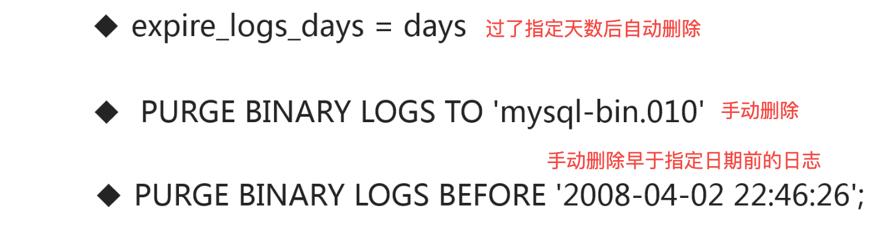

# 1 MySQL版本类问题

```mysql
1.你之前工作中使用的是什么版本的MySQL？为什么选择这个版本？
2.如何决定是否要对MySQL进行升级？如何进行升级？
3.最新的MySQL版本是什么？它有什么特性比较吸引你？
```

## 1.1 为什么选择某一MySQL版本？

**知识点**

- MySQL常见的发行版
- 各个发行版之间的区别及优缺点

**MySQL常见的发行版**

- `MySQL 官方版本`：这是Oracle收购MySQL后，对MySQL进行了一系列的修改，在功能和性能上都有了很大的提升，并且MySQL默认引擎Innodb是属于Oracle公司的。官方版本还分为<font color="red">企业版</font>和<font color="red">社区版</font>，社区版是开源免费的；而企业版需要收费，相比之下企业版性能更好，功能更多，同时还提供管理和监控的工具。尽管如此，社区版也是国内使用最多的。
- `Percona MySQL`：MySQL最初的开发者组成的MySQL开源社区维护的，在MySQL 官方版本进行的二次开发，所以功能上和MySQL 官方版本是完全兼容的，同时也提供了很多MySQL企业版的功能，比如：InnoDB 存储引擎增强，审计功能等等。Percona MySQL在性能上优于社区版，不过由于是在MySQL 官方版本进行的二次开发，所以起最新版本要落后于官方版本。
- `MariaDB`：MySQL被Oracle收购后，MySQL的创始人独立成立了一家公司开发维护的，基于5.5版本源码的基础上发展起来的。增加很多特有的功能，即使是在MySQL相同的功能之上，实现方式也可能是不同的。所以MariaDB不能保证说全部功能和MySQL是相同的，只能说大部分是兼容的。

**各个发行版之间的区别及优缺点**

服务器特性：

| MySQL                               | Percona MySQL       | MariaDB    |
| ----------------------------------- | ------------------- | ---------- |
| 开源                                | 开源                | 开源       |
| 支持分区表                          | 支持分区表          | 支持分区表 |
| InnoDB（纯正的InnoDB只有MySQL支持） | XtraDB              | XtraDB     |
| 企业版监控工具社区版不提供          | Percon Monitor 工具 | Monyog     |

高可用特性：

| MySQL          | Percona MySQL  | MariaDB                           |
| -------------- | -------------- | --------------------------------- |
| 基于日志点复制 | 基于日志点复制 | 基于日志点复制                    |
| 支持Gtid复制   | 支持Gtid复制   | 支持Gtid复制，但Gtid同MySQL不兼容 |
| MGR集群        | MGR & PXC      | Galera Cluster                    |
| MySQL Router   | Proxy SQL      | MaxScale                          |

## 1.2 如何对MySQL进行升级？

**知识点**

- 在对MySQL进行升级前要考虑什么？
- MySQL升级的步骤

**在对MySQL进行升级前要考虑什么？**

1. 升级可以给业务带来的益处
2. 升级可能对业务带来的影响
3. 数据库升级方案的制定
4. 升级失败的回滚方案

**升级可以给业务带来的益处**

- 是否可以解决`业务`上某一方面的痛点（比如升级后存储引擎的优化可以提高业务执行效率）
- 是否可以解决`运维`上某一方面的痛点

**升级可能对业务带来的影响**

- 对原业务程序的`支持`是否有影响（升级后可能某些默认配置已经变动，看是否影响旧的版本，避免因为升级后配置问题导致切换后服务无法启动等问题）
- 对原业务程序的`性能`是否有影响

**数据库升级方案的制定**

- 评估受影响的业务系统
- 升级的详细步骤（测试环境中多次演练无误后才能生产使用）
- 升级后的数据库环境检查
- 升级后的业务检查

**升级失败的回滚方案**

- 升级失败回滚的步骤
- 回滚后的数据库环境环境
- 回滚后的业务环境

**MySQL升级的步骤**

1. 对待升级数据库进行备份
2. 升级Slave服务器版本
3. 手动进行主从切换（从机要先更新版本，如果主机先更新了版本，而从机进行复制主机的binlog日志可能出现问题）
4. 升级MASTER服务器版本
5. 升级完成后进行业务检查

## 1.3 最新的MySQL版本及其新特性

**知识点**

- MySQL8.0版本主要的新特性？

服务器方面：

| 新特性                                    |
| ----------------------------------------- |
| 所有元数据使用InnoDB引擎存储,`无frm文件`  |
| 系统表采用InnoDB存储并采用独立表空间      |
| 支持定义资源管理组(目前仅支持CPU资源）    |
| 支持不可见索引和`降序索引`,支持直方图优化 |
| 支持窗口函数                              |
| `支持在线修改全局参数持久化`              |

用户及安全：

| 新特性                                   |
| ---------------------------------------- |
| 默认使用caching_ sha2_password以证插件   |
| `新增支持定义角色(role)`                 |
| 新增密码历史记录功能，`限制重复使用密码` |

InnoDB功能：

| 新特性                              |
| ----------------------------------- |
| InnoDB DDL语句支持原子操作          |
| 支持在线修改UNDO表空间              |
| 新增管理视图用于监控INNODB表状态    |
| 新增innodb_ dedicated_ server配置项 |

> 总结：https://coding.imooc.com/lesson/296.html#mid=44014

***

# 2 用户管理类问题

```mysql
1.如何在给定场景下为某用户授权？
2.如何保证数据库账号的安全？
3.如何从一个实例迁移数据库账号到另一个实例？
```

## 2.1 如何在给定场景下为某用户授权？

**知识点**

- 如何定义MySQL数据库账号？
- MySQL常用的用户权限
- 如何为用户授权？

**如何定义MySQL数据库账号？**

- 用户名@可访问控制列表

  ```mysql
  1.%代表可以从所有外部主机访问(除本地服务器访问)
  2.192.168.1.%:表示可以从192.168.1网段访问
  3.localhost:DB服务器本地访问
  ```

- 使用`CREATE USER`命令建立用户（创建但未授权的用户还不能使用）

**MySQL常用的用户权限**

|       | 语句         | 说明                 |
| ----- | ------------ | -------------------- |
| Admin | Create User  | 建立新的用户的权限   |
|       | Grant option | 为其他用户授权的权限 |
|       | Super        | 管理服务器的权限     |
| DDL   | Create       | 新建数据库，表的权限 |
|       | Alter        | 修改表结构的权限     |
|       | Drop         | 删除数据库和表的权限 |
|       | Index        | 建立和删除索引的权限 |
| DML   | Select       | 查询表中数据的权限   |
|       | Insert       | 向表中插入数据的杈限 |
|       | Update       | 更新表中数据的权限   |
|       | Delete       | 删除表中数据的权限   |
|       | Execute      | 执行存储过程的权限   |

**如何为用户授权？**

- 遵循最小权限原则

- 使用Grant 命令对用户授权

  ```mysql
  # 授权
  grant select, insert, update, delete on db.tb to user@ip;
  # 收回权限
  revoke delete,update on db.tb from user@ip;
  ```

***

## 2.2 如何保证数据库账号的安全？

**知识点**

- 数据库用户管理流程规范
- 密码管理策略

**数据库用户管理流程规范**

1. 最小权限原则
2. 密码强度策略
3. 密码过期原则（mysql8.0新功能）
4. 限制历史密码重用原则（mysql8.0新功能）

***

## 2.3 如何迁移数据库账号？

解决思路：


**导出用户建立及授权语句（推荐）**

```mysql
pt-show-grants u=root,p=123456@,h=localhost;
```

***

# 3 服务器配置类问题

```mysql
1.请分析一个Group By语句的异常原因
2.如何比较系统运行配置和配置文件中的配置是否一致？
3.举几个MYSQL中的关键性能参数
```

## 3.1 请分析一个Group By语句的异常原因


**知识点**

- SQL_MODE的作用
- 常用的SQL_MODE

**SQL_MODE**

- 配置MySQL处理SQL的方式

- set [session/global/persist] sql_mode = 'xxxxxx'

  persist是8.0才有，如果5.7使用global设置了，重启后会失效；而persist设置后重启不会失效，因为进行了持久化保存。

- [mysqld] sq|_mode=xxxxxx 

  可以在配置文件中配置

**常用的SQL_MODE**

|                            |                                                              |
| -------------------------- | ------------------------------------------------------------ |
| ONLY_FULL_GROUP_BY         | 对于GROUP BY聚合操作，如果在SELECT中的列，没有在GROUP BY中出现，那么这个SQL是不合法的，因为列不在GROUP BY从句中。 |
| ANSI_QUOTES                | 不能用双引号来引用字符串，因为它被解释为识别                 |
| PIPES_AS_CONCAT            | 将"\|\|"视为字符串的连接操作符而非"或运算符"，这和Oracle数据库是一样的，也和字符串的拼接函数concat相类似 |
| STRICT_TRANS_TABLES        | 在该模式下（严格模式），如果一个值不能插入到一个事务表中，则中断当前的操作，对非事务表不做限制。(比如如果不开启该模式，将字符串插入int类型时不会报错，是在int是0，如果想类型有问题就直接不要插入成功，直接报错，那就开启该模式) |
| ERROR_FOR_DIVISION_BY_ZERO | 在INSERT或UPDATE过程中，如果数据被零除，则产生错误而非警告。如果未给出该模式，那么数据被零除时MySQL返回NULL |
| NO_AUTO_CREATE_USER        | 在用户不存在时不允许grant语句自动建立用                      |
| NO_ZERO_IN_DATE            | 在严格模式下，不允许日期和月份为零。                         |

## 3.2 比较系统运行配置和配置文件中的配置

因为数据库运行过程中，使用set设置配置参数后，这个时候就出现运行配置和配置文件中的配置不一致问题。

**知识点**

- 使用set 命令配置动态参数
- 使用pt-config-diff工具比较配置文件

**使用set 命令配置动态参数**

- set [session | @@session.] system_var_name = expr
- set [global |@@global] system_var_name = expr
- set [persist |@@persist] system_var_name = expr 【8.0才有】

> 注意：如果set修改了配置值，也要在my.cnf配置文件中进行修改，避免重启服务后，配置被重置为了默认。

**使用pt-config-diff工具比较配置文件**

- pt-config-diff u=root,p=123456,h=localhost /etc/my.cnf

***

## 3.3 MySQL中的关键性能参数

**知识点**

- 常用的性能参数
- 服务器配置参数
- 存储引擎参数

**常用的性能参数**：

| 参数                | 说明                            |
| ------------------- | ------------------------------- |
| max_connections     | 设置MySQL允许访问的最大连接数量 |
| interactive_timeout | 设置交互连接的timeout时间       |
| wait_timeout        | 设置非交互连接的timeout时间     |
| max_allowed_packet  | 控制MySQL可以接收的数据包的大小 |

> **什么是交互连接，什么是非交互连接？**
>
> 通过MySQL 客户端连接数据库的是交互会话，通过jdbc等程序连接数据库的是非交互会话。

**服务器配置参数**：这些都是基于会话级别，如果有100个会话，那么就有100份

| 参数                 | 说明                                                   |
| -------------------- | ------------------------------------------------------ |
| sort_buffer_size     | 设置每个会话使用的排序缓存区的大小                     |
| join_buffer_size     | 设置每个会话所使用的连接缓冲的大小                     |
| read_buffer_size     | 指定了当对一个MYISAM进行表扫描时所分配的读缓存池的大小 |
| read_rnd_buffer_size | 设置控制索引缓冲区的大小                               |
| binlog_cache_size    | 设置每个会话用于缓存末提交的事务缓存大小               |

**存储引擎参数：**

| 参数                           | 说明                                                         |
| ------------------------------ | ------------------------------------------------------------ |
| innodb_flush_log_at_trx_commit | 0：每秒进行一次重做日志的磁盘刷新操作。 1：每次事务提交都会刷新事务日志到磁盘中。 2：每次事务提交写入系统缓存每秒向磁盘刷新一次 |
| innodb_buffer_pool_size        | 设置Innodb缓冲池的大小,应为系统可用内存的75%。               |
| innodb_buffer_pool_instances   | Innodb缓冲池的实例个数，每个实例的大小为总缓冲池大小/实例个数。 |

***

# 4 日志类问题

```mysql
1.常用的MySQL日志有那些？我们在什么情况下使用这些日志？
2.如何通过日志来审计用户活动？(企业版有提供审计工具)
```

**知识点**

- MySQL常用的日志类型
- 各种日志的配置和使用场景

**MySQL常用的日志类型**

| 日志名称                 | 作用                                                     |
| ------------------------ | -------------------------------------------------------- |
| 错误日志(error_log)      | 记录mysql在启动、运行或停止时出现的问题                  |
| 常规日志 ( general_log)  | 记录所有发向MySQL的请求                                  |
| 慢查日志(slow_query_log) | 记录符合条件的查询                                       |
| 二进制日志(binary _log)  | 记录全部有效的数据修改（查询不记录）日志（主从复制使用） |
| 中继日志(relay_log)      | 用于主从复制，临时存储从主库同步的二进制日志             |

**各种日志的配置和使用场景**


比如一种情况：开发人员代码中执行了更新语句的操作，执行没提示问题，但是总是看不到修改后的效果，那么可以临时打开常规日志进行排查。在流量比较大的系统临时开启后要及时关闭，因为短时间就会产生大量的日志（常规日志会记录所有客户端请求的信息）

输出日志的目录尽量不要跟数据目录放一起。

```mysql
select @@general_log;
select @@general_log_file;
```

***





***

# 5 存储引擎相关问题

```mysql
1.说一说你了解的MySQL存储引擎及其适用场景
2.在什么情况下Innodb无法在线修改表结构？
3.InnoDB是如何实现事务的？
4.Innodb读操作是否会阻塞写操作？
```

## 5.1 MySQL存储引擎及其适用场景

**知识点**

- MySQL常用的存储引擎
- MySQL常用存储引擎的使用场景

**MySQL常用的存储引擎**

| 引擎名称 | 事务 | 说明                                               |
| -------- | ---- | -------------------------------------------------- |
| MyISAM   | N    | MysQL5.6之前的默认引擎，最常用的非事务型存储引擎   |
| CSV      | N    | 以CSV格式存储的非事务型存储引擎                    |
| Archive  | N    | 只允许查询和新增数据而不允许修改的非事务型存储引擎 |
| Memory   | N    | 是一种易失性非事务型存储引擎                       |
| INNODB   | Y    | 最常用的事务型存储引擎                             |

**MyISAM的特点：**

1. 非事务型存储引擎
2. 以堆表方式存储（叶子节点直接存储的地址，这样避免二次查找，查询效率高）
3. 使用表级锁（读写操作会出现阻塞，不适用于高并发读写混合场景下使用）
4. 支持Btree索引,空间索引,全文索引

6-2 5:00分钟。

# 6 MySQL架构类问题

# 7 备份恢复类问题

# 8 管理及监控类问题

# 9 优化及异常处理

