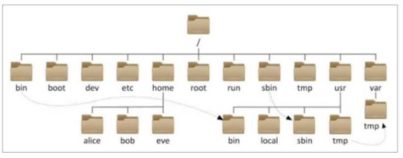
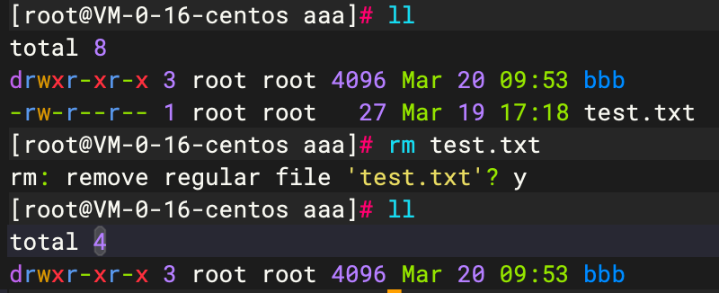
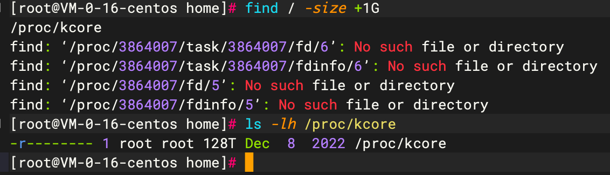
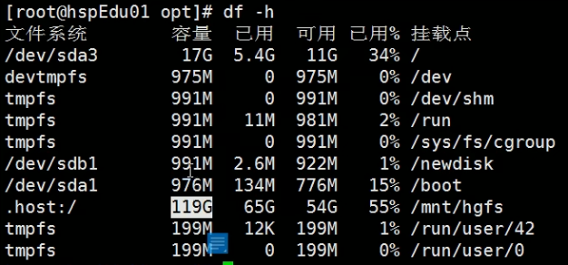
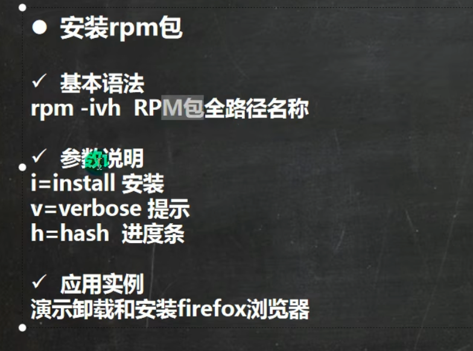

# 1 初识Linux

## 1.1 Linux初识

**在Linux世界里，一切皆文件**

CPU，等都在linux中对应着一个文件

Linux系统的组成如下：

- `Linux系统内核`、`系统级应用程序`两部分组成。
- 内核提供系统最核心的功能，如：调度CPU、调度内存、调度文件系统、调度网络通讯、调度IO等。
- 系统级应用程序，可以理解为出厂自带程序，可供用户快速上手操作系统，如：文件管理器、任务管理器、图片查看、音乐播放等。


***

**Linux发行版**

内核是免费、开源的，这也就代表了：

- 任何人都可以获得并修改内核，并且自行集成系统级程序
- 提供了内核+系统级程序的完整封装，称之为Linux发行版


***

因为任何人都可以拿到Linux内核，所以任何人都可以封装Linux，目前市面上由非常多的Linux发行版，常用的、知名的如下：


***

> 总结

1. **Linux的诞生**

   Linux由林纳斯 托瓦兹在1991年创立并发展至今成为服务器操作系统领域的核心系统。

2. **什么是Linux系统的内核**

   内核提供了Linux系统的**主要功能**，如硬件调度管理的能力。Linux内核是**免费开源**的，任何人都可以查看内核的源代码，甚至是贡献源代码

3. **什么是Linux系统发行版**

   内核无法被用户直接使用，需要配合应用程序才能被用户使用。在内核之上，封装系统级应用程序，组合在一起就称之为Linux发行版。发行版众多，课程主要基于CentOS辅以Ubuntu进行讲解

***

## 1.2 虚拟机介绍

> 什么是虚拟机

借助虚拟化技术，我们可以在系统中，通过软件：模拟计算机硬件，并给虚拟硬件安装真实的操作系统。这样，就可以在电脑中，虚拟出一个完整的电脑，以供我们学习Linux系统。


***

## 1.3 构建虚拟机环境

### 1.3.1 虚拟化软件

通过虚拟化技术，可以虚拟出计算机的硬件，那么如何虚拟呢？

我们可以通过提供虚拟化的软件来获得虚拟机。


***

### 1.3.2 网络连接的三种模式


***

### 1.3.3 虛拟机快照

如果你在使用虛拟机系统的时候(比如linux)，你想回到原先的某一个状态，也就是说你担心可能有些误操作造成系统导常 ，需要回到原先某个正常运行的状态，vrmware也提供了这样的功能，就叫快照管理

***

# 2 Linux 基础命令

## 2.1 Linux的目录结构

Linux的目录结构是一个树型结构

Windows系统可以拥有多个盘符,如C盘、D盘、E盘

Linux没有盘符这个概念,只有一个根目录/,所有文件都在它下面



***

具体的目录结构(不用背,知道即可)

- `/bin` 【常用】 (usr/bin 、/usr/local/bin) 是Binary的缩写，这个目录存放着最经常使用的命令

- `/boot`【常用】存放的是启动Linux时使用的一些核心文件，包括一些连接文件以及镜像文件

- `/dev `类似于windows的设备管理器，把所有的**硬件用文件的形式存储**

- `/etc`【常用】所有的系统管理所需要的配置文件和子目录，比如安装mysql数据库 my.conf

- `/home` 【常用】存放普通用户的主目录，在Linux中每个用户都有一个自己的目录，一般该目录名是以用户的账号命名

- `/root` 【常用】该目录为系统管理员，也称作超级权限者的用户主目录

- `/sbin` （/usr/sbin、/usr/local/sbin) s就是Super User的意思，这里存放的是系统管理员使用的系统管理程序

- `/tmp` 这个目录是用来存放一些临时文件的

- `/usr`【常用】这是一个非常重要的目录，用户的很多应用程序和文件都放在这个目录下，类似与windows下的program files目录

- `/usr/local` 【常用】这是另一个给主机额外安装软件所安装的目录。一般是通过编译源码方式安装的程序

- `/var`【常用】这个目录中存放着在不断扩充着的东西，习惯将经常被修改的目录放在这个目录下。包括各种日志文件

- `/proc` 【不能动，动了会对系统造成破坏】这个目录是一个虚拟的目录，它是系统内存的映射，访问这个目录来获取系统信息

- `/srv` 【不能动】service缩写，该目录存放一些服务启动之后需要提取的数据

- `/sys`【不能动】 这是linux2.6内核的一个很大的变化。该目录下安装了2.6内核中新出现的一个文件系统sysfs

- `/media`【常用】linux系统会自动识别一些设备，例如U盘、光驱等等，当识别后，linux会把识别的设备挂载到这个目录下

- `/mnt`【常用】系统提供该目录是为了让用户临时挂载别的文件系统的，我们可以特外部的存備挂载在/mnt/上然后进入该目录就可以查看里的内容了。di:/myshare

- `/opt` 这是给主机额外安装软件所摆放的目录。如安装ORACLE数据库就可放到该目录下。默认

  为空

***

## 2.2 Linux命令入门

### 2.2.1 命令基础

> Linux命令基础格式

无论是什么命令，用于什么用途，在Linux中，命令有其通用的格式：`command [-options] [parameter]`

- command：命令本身
- -options：[可选，非必填] 命令的一些选项，可以通过选项控制命令的行为细节
- parameter：[可选，非必填] 命令的参数，多数用于命令的指向目标等

***

### 2.2.2 ls命令入门

ls命令的作用是列出目录下的内容，语法细节如下：

`ls [-a -l -h][linux 路径]`

- -a -l -h是可选的选项
- Linux路径是此命令可选的参数

当不使用选项和参数，直接使用ls命令本体，表示：以平铺形式，列出当前工作目录下的内容


***

> HOME目录和工作目录

直接输入ls命令，表示列出当前工作目录下的内容，当前工作目录是？

Linux系统的命令行终端，在启动的时候，默认会加载:

- 当前登录用户的HOME目录作为当前工作目录，所以ls命令列出的是HOME目录的内容
- HOME目录：每个Linux操作用户在Linux系统的个人账户目录，路径在：/home/用户名

***

### 2.2.3 ls命令的参数和选项

刚刚展示了，直接使用ls命令，并未使用选项和参数。

那么ls的选项和参数具体有什么作用呢？首先我们先来看参数

- 当ls不使用参数，表示列出：当前工作目录的内容，即用户的HOME目录
- 当使用参数，ls命令的参数表示：指定一个Linux路径，列出指定路径的内容

> ls命令的-a选项

`ls [-a -l -h][linux 路径]`

- -a选项，表示：all的意思，即列出全部文件（包含隐藏的文件/文件夹）


可以看到，ls -a对比ls列出的内容更多了

- 图中以.开头的，表示是Linux系统的隐藏文件/文件夹（只要以.开头，就能自动隐藏）
- 只有通过-a选项，才能看到这些隐藏的文件/文件夹

***

> ls命令的-l选项

-l选项，表示：以列表（竖向排列）的形式展示内容，并展示更多信息


***

> ls命令选项的组合使用

语法中的选项是可以组合使用的，比如学习的-a和-l可以组合应用。

- ls -l -a
- ls -la
- ls -al

上述三种写法，都是一样的，表示同时应用-l和-a的功能


***

> ls命令的-h选项

- -h表示以易于阅读的形式，列出文件大小，如K、M、G
- -h选项必须要搭配-l一起使用


***

### 2.2.4 cd-pwd 命令

> cd切换工作目录

当Linux终端（命令行）打开的时候，会默认以用户的HOME目录作为当前的工作目录

我们可以通过cd命令，更改当前所在的工作目录。

cd命令来自英文：**Change Directory**

语法：`cd [linux 路径]`

- cd命令无需选项，只有参数，表示要切换到哪个目录下

- cd命令直接执行，不写参数，表示回到用户的HOME目录

***

> pwd查看当前工作目录

通过ls来验证当前的工作目录，其实是不恰当的。

我们可以通过pwd命令，来查看当前所在的工作目录。

pwd命令来自：**Print Work Directory**

语法：`pwd`

- pwd命令，无选项，无参数，直接输入pwd即可

***

> 相对路径和绝对路径


图，通过pwd得知当前所在是HOME目录：/home

现在想要通过cd命令，切换工作目录到`esuser`文件夹中去

那么，cd命令的参数（Linux路径）如何写呢？

- cd /home/esuser 【绝对路径写法】
- cd esuser 【相对路径写法】

上述两种写法，都可以正确的切换目录到指定的esuser中。

绝对路径：以**根目录为起点**，描述路径的一种写法，路径描述以/开头

相对路径：以**当前目录为起点**，描述路径的一种写法，路径描述无需以/开头

***

### 2.2.5 特殊路径符

接上图，假如当前工作目录处于：/home/esuser

现在想要，向上回退一级，切换目录到/home中，如何做？

- 可以直接通过cd，即可回到HOME目录
- 也可以通过特殊路径符来完成

**特殊路径符：**

- `.`：表示当前目录，比如cd ./esuser表示切换到当前目录下的esuser目录内，和cd esuser效果一致
- `..`：表示上一级目录，比如：cd .. 即可切换到上一级目录，cd ../..切换到上二级的目录
- `~`：表示HOME目录，比如：cd ~即可切换到HOME目录或cd ~/esuser，切换到HOME内的esuser目录

***

### 2.2.6 mkdir 命令

通过mkdir命令可以创建新的目录（文件夹）

mkdir来自英文：**Make Directory**

语法：`mkdir [-p] linux 路径 `

- 参数必填，表示Linux路径，即要创建的文件夹的路径，相对路径或绝对路径均可
- -p选项可选，表示自动创建不存在的父目录，适用于创建连续多层级的目录


如果想要一次性创建多个层级的目录，如下图:

会报错，因为上级目录bbb并不存在，所以无法创建ccc目录可以通过-p选项，将一整个链条都创建完成。


**注意：创建文件夹需要修改权限，请确保操作均在HOME目录内，不要在HOME外操作涉及到权限问题，HOME外无法成功后续我们会讲解权限管控的知识**

***

### 2.2.7 文件操作命令1（touch、cat、more）

> touch创建文件

可以通过touch命令创建文件

语法：`touch linux路径`

touch命令无选项，参数必填，表示要创建的文件路径，相对、绝对、特殊路径符均可以使用


> 怎么区分文件夹和文件


d就是文件夹。-就是文件

***

> cat命令 查看文件内容

有了文件后，我们可以通过cat命令查看文件的内容。

不过，现在我们还未学习vi编辑器，无法向文件内编辑内容，所以，暂时，我们先通过图形化

在图形化中，手动向文件内添加内容，以测试cat命令


准备好文件内容后，可以通过cat查看内容。

语法：`cat linux路径`

cat同样没有选项，只有必填参数，参数表示：被查看的文件路径，相对、绝对、特殊路径符都可以使用


***

> more命令查看文件内容

more命令同样可以查看文件内容，同cat不同的是：

- cat是直接将内容全部显示出来
- more支持翻页，如果文件内容过多，可以一页页的展示

语法：`more linux路径`

同样没有选项，只有必填参数，参数表示：被查看的文件路径，相对、绝对、特殊路径符都可以使用

Linux系统内置有一个文件，路径为：/etc/services，可以使用more命令查看

more /etc/services

- 在查看的过程中，通过空格翻页
- 通过q退出查看

***

### 2.2.8 文件操作命令2（cp、mv、rm）

> cp命令复制文件文件夹

cp命令可以用于复制文件\文件夹，cp命令来自英文单词：copy

语法：`cp [-r] 参数1 参数2`

- -r选项，可选，用于复制文件夹使用，表示递归
- 参数1，Linux路径，表示被复制的文件或文件夹
- 参数2，Linux路径，表示要复制去的地方

***

案例1:复制文件到当前目录


案例2:复制文件到指定目录


案例2:复制目录到指定目录


案例3:再次复制目录到指定目录（相同文件会提示是否覆盖）


案例4:再次复制目录到指定目录（如果有很多文件相同，每次都要确认很麻烦，直接前面加个/，不确认直接覆盖）

`\cp -r wing ../bbb/`

***

> mv移动文件或文件夹

mv命令可以用于移动文件\文件夹，mv命令来自英文单词：move

语法：`mv 参数1 参数2`

- 参数1，Linux路径，表示被移动的文件或文件夹
- 参数2，Linux路径，表示要移动去的地方，如果目标不存在，则进行改名，确保目标存在

移动文件


改名演示


移动文件夹


***

> rm删除文件、文件夹

rm命令可用于删除文件、文件夹

rm命令来自英文单词：remove

语法：rm [-r -f] 参数1，参数2，参数n

- 同cp命令一样，-r选项用于删除文件夹
- -f表示force，强制删除（不会弹出提示确认信息）
  - 普通用户删除内容不会弹出提示，只有root管理员用户删除内容会有提示
  - 所以一般普通用户用不到-f选项
- 参数1、参数2、......、参数N表示要删除的文件或文件夹路径，按照空格隔开

***

删除文件



删除文件（删除多个使用空格隔开）


上面的删除会逐一询问。

***

> rm删除文件、文件夹-通配符

rm命令支持通配符，用来做模糊匹配，符号*表示通配符，即匹配任意内容（包含空），示例：

- test*，表示匹配任何以test开头的内容
- *test，表示匹配任何以test结尾的内容
- 星test星，表示匹配任何包含test的内容


***

> 注意

rm是一个危险的命令，特别是在处于root（超级管理员）用户的时候。请谨慎使用

如下命令，请千万千万不要在root管理员用户下执行：

`rm -rf /`

`rm -rf /*` 【/* 说明从根目录开始删】

效果等同于在Windows上执行C盘格式化。

***

### 2.2.9 查找命令（which、find）

> which命令

我们在前面学习的Linux命令，其实它们的本体就是一个个的二进制可执行程序。和Windows系统中的.exe文件，是一个意思。

我们可以通过which命令，查看所使用的一系列命令的程序文件存放在哪里

语法：`which 查找的命令`


which命令只支持查找命令在哪里。

***

> find命令-按文件名查找文件

在Linux系统中，我们可以通过find命令去搜索指定的文件

语法：`find 起始路径 -name “被查找的文件名”`

起始路径：如果是/就说明从根目录开始查找，如果是/itcast，就说明从itcast下开始查找


/：从根目录开始

-name：按名称方式查找mysql

***

> find命令-通配符

语法：`find 起始路径 -name “被查找的文件名”`

被查找文件名，支持使用通配符*来做模糊查询

符号*表示通配符，即匹配任意内容（包含空），示例：

- test*，表示匹配任何以test开头的内容
- *test，表示匹配任何以test结尾的内容
- 星test星，表示匹配任何包含test的内容

基于通配符的含义，可以结合find命令做文件的模糊查询

例子略。

***

> find命令-按文件大小查找文件

语法：`find 起始路径 -size +|- n[KMG]`

- +、-表示大于和小于
- n表示大小数字
- kMG表示大小单位，k(小写字母)表示kb，M表示MB，G表示GB

示例：

- 查找小于10KB的文件：`find / -size -10k`
- 查找大于100MB的文件：`find / -size +100M`
- 查找大于1GB的文件：`find / -size +1G`



***

### 2.2.10 grep-wc-管道符

> grep命令

可以通过grep命令，从文件中通过关键字过滤文件行

语法：`grep [-n -i] 关键字 文件路径`

- 选项-n，可选，表示在结果中显示匹配的行的行号
- 选项-i，可选，忽略大小写
- 参数，关键字，必填，表示过滤的关键字，带有空格或其它特殊符号，建议使用””将关键字包围起来
- 参数，文件路径，必填，表示要过滤内容的文件路径，可作为内容输入端口

现在，通过touch命令在HOME目录创建itheima.txt，并通过图形化页面编辑并保存如下内容：`itheima is a brand of itcast. itcast stock code is 003032.`

过滤itheima关键字


过滤code关键字，并显示行号


***

> wc命令做数量统计

可以通过wc命令统计文件的行数、单词数量等

语法：`wc [-c -m -l -w] 文件路径`

- 选项，-c，统计bytes数量
- 选项，-m，统计字符数量
- 选项，-l，统计行数
- 选项，-w，统计单词数量
- 参数，文件路径，被统计的文件，可作为内容输入端口

> 没有任何选项的统计


2：表示有两行

11: 表示有11个单词（按空格划分）

59: 表示有59个字节


***

> 管道符

学习了grep命令后，我们在来学习一个新的特殊符号，管道符：`|`

管道符的含义是：将管道符左边命令的结果，作为右边命令的输入


上面箭头指着的命令输出结果一样。

***

管道符也可以这样使用，只要左边能给右边的输入就行


***

### 2.2.11 echo-head-tail-重定向符

> echo命令

可以使用echo命令在命令行内输出指定内容

语法：`echo 输出的内容`

需选项，只有一个参数，表示要输出的内容，复杂内容可以用””包围


效果跟Java打印控制台一样。

***

> 反引号`


***

> 重定向符


***

> head命令（跟tail相反）

显示文件的**开头部分**内容，默认显示前10行

语法：`head 文件` 查看文件头10行内容

语法：`head -n 5 文件` 查看文件头5行内容，5可以换成任意行数

***

> tail命令

使用tail命令，可以查看**文件尾部**内容，跟踪文件的最新更改，语法如下：

语法：`tail [-f num] Linux路径`

- 参数，Linux路径，表示被跟踪的文件路径
- 选项，-f，表示持续跟踪
- 选项, -num，表示，查看尾部多少行，不填默认10行

***

### 2.2.12 vi编辑器

> vi\vim编辑器介绍

vi\vim是visual interface的简称,是Linux中最经典的文本编辑器

同图形化界面中的 文本编辑器一样，vi是命令行下对文本文件进行编辑的绝佳选择

**vim是vi的加强版本，兼容vi的所有指令，不仅能编辑文本，而且还具有shell程序编辑的功能，可以不同颜色的字体来辨别语法的正确性，极大方便了程序的设计和编辑性。**

***

> vi\vim编辑器的三种工作模式

**命令模式（Command mode）**

- 命令模式下，所敲的按键编辑器都理解为命令，以命令驱动执行不同的功能。
- 此模型下，不能自由进行文本编辑。

**输入模式（Insert mode）**

- 也就是所谓的编辑模式、插入模式。
- 此模式下，可以对文件内容进行自由编辑。

**底线命令模式（Last line mode）**

- 以：开始，通常用于文件的保存、退出。


***

> 命令模式

如果需要通过vi/vim编辑器编辑文件，请通过如下命令：

`vi 文件路径`、`vim 文件路径`

vim兼容全部的vi功能，后续全部使用vim命令

- 如果文件路径表示的文件**不存在**，那么此命令会用于**编辑新文件**
- 如果文件路径表示的文件**存在**，那么此命令用于**编辑已有文件**

***


补充：

- 不显示行号命令`:set nonu`
- 快速定位到某一行，比如40行 `40 Shift + g`

***

### 2.2.13 关机&重启命令

> 基本介绍

`shutdown  -h  now`           立刻进行关机

`shudown   -h  1`                hello 1分钟后会关机（`shudown`什么也不填默认就是1分钟）

`shutdown  -r  now`           现在重新启动计算机

`halt`              关机，作用和上面一样

`reboot`              现在重新启动计算机

`sync`              把内存的数据同步到磁盘

注意：

1. 不管是重启系统还是关闭系统，首先要运行sync命令，把内存中的数据写到磁盘中
2. 目前的 shutdown/reboot/halt 等命令均已经在关机前进行了 sync

***

# 3 Linux权限管控

## 3.1 认知root用户

### 3.1.1 root用户（超级管理员）

无论是Windows、MacOS、Linux均采用多用户的管理模式进行权限管理。

- 在Linux系统中，拥有最大权限的账户名为：root（超级管理员）


***

### 3.1.2 su和exit命令

在前面，我们接触过su命令切换到root账户。

su命令就是用于账户切换的系统命令，其来源英文单词：Switch User

语法：`su [-] [用户名]`

- -符号是可选的，表示是否在切换用户后加载环境变量（后续讲解），建议带上
- 参数：用户名，表示要切换的用户，用户名也可以省略，省略表示切换到root
- **切换用户后，可以通过exit命令退回上一个用户，也可以使用快捷键：ctrl + d**
- 使用普通用户，切换到其它用户需要输入密码，如切换到root用户
- 使用root用户切换到其它用户，无需密码，可以直接切换

需要从root重新切换回普通用户，执行命令 `logout`，切成功后再次执行命令 `logout`就会退出系统。

***

> sudo 命令

在我们得知root密码的时候，可以通过su命令切换到root得到最大权限。

但是我们不建议长期使用root用户，避免带来系统损坏。

我们可以使用sudo命令，为普通的命令授权，临时以root身份执行。

语法：`sudo 其他命令`

- 在其它命令之前，带上sudo，即可为这一条命令临时赋予root授权
- 但是并不是所有的用户，都有权利使用sudo，我们需要为普通用户配置sudo认证

***

### 3.1.3 为普通用户配置sudo认证


含义：为itheima用户赋予sudo权限，并且不用密码

***

### 3.1.4 找回root密码

 自行百度

***

## 3.2 用户、用户组管理

在linux中的每个用户必须属于一个组，不能独立组外，在linux中每个文件有所有者、所在组、其他组的概念。

### 3.2.1 用户、用户组


Linux中关于权限的管控级别有2个级别，分别是：

- 针对用户的权限控制
- 针对用户组的权限控制

比如，针对某文件，可以控制用户的权限，也可以控制用户组的权限

所以，我们需要学习在Linux中进行用户、用户组管理的基础命令，为后面学习权限控制打下基础

***

> 用户组管理

以下命令需root用户执行

- 创建用户组

`groupadd 用户组名`

- 删除用户组

`groupdel 用户组名`

为后续演示，我们创建一个itcast用户组：groupadd itcast

***

> 用户管理

`以下命令需要root用户执行`

**创建用户**

`useradd [-g -d] 用户名`

- 选项：-g指定用户的组，不指定-g，会创建同名组并自动加入（linux默认行为），指定-g需要组已经存在，如已存在同名组，必须使用-g
- 选项：-d指定用户 HOME 路径，不指定，HOME目录默认在 : /home/用户名

**删除用户**

`userdel [-r] 用户名`

- 选项：-r 删除用户的HOME目录，不使用-r，删除用户时，HOME目录保留

**查看用户所属组**

`id [用户名]`

- 参数：用户名，被查看的用户，如果不提供则查看自身

**修改用户所属组**

`usermod -aG 用户组 用户名`

- 将指定用户加入指定的组

```java
扩展：想看一下有没有wudang这个组
`cat /etc/group `：展示全部组，里面看有没有就行，但是太多可以使用下面过滤
`cat /etc/group | grep wudang`
```

**给用户设置密码**

`passwd 用户名`

- 给指定用户设置密码

***

解释：useradd 如果不使用 -g ,假如增加test用户，那么会自动将这个用户加入到test这个组中（linux默认行为）


删除时没有 -r ，所以home目录中test222还是保留，要想继续删除，只能执行rm命令删除了。

***

> getent


***

### 3.2.2 用户和组相关文件

- /etc/passwd 文件

用户（user）的配置文件，记录用户的各种信息

每行的含义：**用户名：口令：用户标识号：组标识号：注释性描述：主目录：登录Shell**


- /etc/shadow 文件

口令的配置文件

每行的含义：**登录名：加空口令：最后一次修改时间：最小时间间隔：最大时间间隔：警告时间：不活动间：失效时间：标志**

- /etc/group文件

组的配置文件，记录Linux包含的组的信息

每行含义：**组名：口令：组标识号：组内用户列表**

***

## 3.3 查看权限控制

> 认知权限信息


***

```java
第一位含义：
-:表示文件
d:表示目录
l:软连接
c:字符设备文件，鼠标，键盘
b:块设备，比如硬盘
```

> rwx作用到文件

1. [r]代表可读：可以读取，查看
2. [w]代表可写：可以修改，但是不代表可以删除该文件
3. [x]代表可执行：可以被执行

> rwx作用到目录

1. [r]代表可读：可以读取，ls查看目录内容
2. [w]代表可写：可以修改，对目录内创建+删除+重命名目录
3. [x]代表可执行：可以进入该目录

***

## 3.4 修改权限控制- chmod

> chmod命令

我们可以使用chmod命令，修改文件、文件夹的权限信息。

**注意，只有文件、文件夹的所属用户或root用户可以修改。**

语法：`chmod [-R] 权限 文件或文件夹`

- 选项：-R，对文件夹内的全部内容应用同样的操作

***

示例：

- `chmod u=rwx,g=rx,o=x hello.txt`，将文件权限修改为：rwxr-x--x
  - 其中：u表示user所属用户权限，g表示group组权限，o表示other其它用户
- `chmod -R u=rwx,g=rx,o=x test`，将文件夹test以及文件夹内全部内容权限设置为：rwxr-x--x

除此之外，还有快捷写法：chmod 751 hello.txt

将hello.txt的权限修改为751，751表示什么意思呢？

***

> 权限的数字序号

权限可以用3位数字来代表，第一位数字表示用户权限，第二位表示用户组权限，第三位表示其它用户权限。数字的细节如下：r记为4，w记为2，x记为1，可以有：

- 0：无任何权限，即`---`
- 1：仅有x权限，即`--x`
- 2：仅有w权限即`-w-`
- 3：有w和x权限即`-wx`
- 4：仅有r权限即`r--`
- 5：有r和x权限即`r-x`
- 6：有r和w权限即`rw-`
- 7：有全部权限即`rwx`

例子：

将hello.txt的权限修改为：r-x--xr-x，数字序号为：chmod 515 hello.txt

将hello.txt的权限修改为：-wx-w-rw-，数字序号为：chmod 326 hello.txt

## 3.5 修改权限控制- chown

> chown命令

使用chown命令，可以修改文件、文件夹的所属用户和用户组

**普通用户无法修改所属为其它用户或组，所以此命令只适用于root用户执行**

语法：`chown [R] [用户] [:] [用户组] 文件或文件夹`

- 选项，-R，同chmod，对文件夹内全部内容应用相同规则
- 选项，用户，修改所属用户
- 选项，用户组，修改所属用户组
- :用于分隔用户和用户组

示例：

- `chown root hello.txt`，将hello.txt所属用户修改为root
- `chown :root hello.txt`，将hello.txt所属用户组修改为root
- `chown root:itheima hello.txt`，将hello.txt所属用户修改为root，用户组修改为itheima
- `chown -R root test`，将文件夹test的所属用户修改为root并对文件夹内全部内容应用同样规则

***

# 4 Linux实用操作

## 4.1 各类小技巧（快捷键）

### 4.1.1 强制停止


***

### 4.1.2 退出或登出


### 4.1.3 历史命令搜索

history命令

`history`：看全部

`history 5`：看最近5个


### 4.1.4 光标移动快捷键

ctrl + a，跳到命令开头

ctrl + e，跳到命令结尾

ctrl +键盘左键，向左跳一个单词

ctrl +键盘右键，向右跳一个单词

### 4.1.5 清屏

通过快捷键`ctrl + l`，可以清空终端内容

或通过命令`clear`得到同样效果

***

## 4.2 软件安装

掌握使用yum为CentOS系统安装软件

> Linux系统的应用商店

操作系统安装软件有许多种方式，一般分为：

- 下载安装包自行安装
  - 如win系统使用exe文件、msi文件等
  - 如mac系统使用dmg文件、pkg文件等

- 系统的应用商店内安装
  - 如win系统有Microsoft Store商店
  - 如mac系统有AppStore商店

Linux系统同样支持这两种方式，我们首先，先来学习使用：Linux命令行内的”应用商店”，yum命令安装软件

***

> yum命令

yum：RPM包软件管理器，用于自动化安装配置Linux软件，并可以自动解决依赖问题。

语法：`yum [-y] [install | remove | search] 软件名称`

- 选项：-y，自动确认，无需手动确认安装或卸载过程
- install：安装
- remove：卸载
- search：搜索

**yum命令需要root权限哦，可以su切换到root，或使用sudo提权。**

**yum命令需要联网**

***

## 4.3 systemctl

> systemctl命令

Linux系统很多软件（内置或第三方）均支持使用systemctl命令控制：启动、停止、开机自启

能够被systemctl管理的软件，一般也称之为：服务

语法：`systemctl start | stop | status | enable | disable 服务名`

- start 启动
- stop 关闭
- status 查看状态
- enable 开启开机自启
- disable 关闭开机自启

系统内置的服务比较多，比如：

- NetworkManager，主网络服务
- network，副网络服务
- firewalld，防火墙服务
- sshd，ssh服务（FinalShell远程登录Linux使用的就是这个服务）

现在可以使用systemctl去尝试一下，控制这些服务的启动、关闭、自启动啦


***


## 4.4 软连接

ln命令


***

## 4.5 日期、时区

> date命令


***

> date命令进行日期加减


***

> 日历 cal指令

`cal`：显示本月的日历

`cal 2024`：显示2024年的全部日历


## 4.6 IP地址、主机名

> IP地址


## 4.7 压缩、解压

> gzip/gunzip 指令

gzip用于压缩文件，gunzip用于解压文件

**基本语法**

`gzip 文件`：压缩文件，只能将文件压缩为 *.gz文件

`gunzip 文件.gz`：解压缩文件命令

***

> zip/unzip 指令

zip 用于压缩文件，unzip 用于解压的，这个在项目打包发布中很有用

**基本语法**

`zip [选项] xxx.zip`：将要压缩的内容（文件或者目录）

- -r ：递归压缩，即压缩目录

`unzip [选项] xxx.zip`：解压缩文件

- -d<目录>：指定压缩后文件的存放目录

***

> tar 指令

tar 指令是打包指令，最后打包后的文件是.tar.gz的文件

**基本语法**

`tar [选项] xxx.tar.gz 打包的内容`  打包目录，压缩后的文件格式.tar.gz

- -c：产生.tar打包文件
- -v：显示详细信息
- -f：指定压缩后的文件名
- -z：打包同时压缩
- -x：解包.tar文件

> 压缩文件


> 压缩目录


## 4.8 任务调度

### 4.8.1 crond 任务调度

任务调度：是指系统在某个时间执行的特定的命令或程序。

任务调度分类：

- 系统工作：有些重要的工作必须周而复始的执行。如病毒扫描等
- 个别用户工作：个别用户可能希望执行某些程序，比如对mysql数据库的备份。

**基本语法**

`crontab [选项]`

- -e：编辑crontab定时任务
- -l：查询crontab任务
- -r：删除当前用户所有的crontab任务

***


**快速入门**

设置任务调度文件：/etc/crontab

设置个人任务调度。执行`crontab -e`命令

接着输入任务到调度文件

如：*/1**** ls -l /etc/  > /tmp/to.txt 命令（意思说每小时的每分钟执行 ls -l /etc/  > /tmp/to.txt命令）

> 参数细节说明，5个占位符的说明

| 项目     | 含义                 | 范围                    |
| -------- | -------------------- | ----------------------- |
| 第一个 * | 一小时当中的第几分钟 | 0-59                    |
| 第二个 * | 一天当中的第几小时   | 0-23                    |
| 第三个 * | 一个月当中的第几天   | 1-31                    |
| 第四个 * | 一年当中的第几月     | 1-12                    |
| 第五个 * | 一周当中的星期几     | 0-7（0和7都代表星期日） |

> 特殊符号说明

| 特殊符号 | 含义                                                         |
| -------- | ------------------------------------------------------------ |
| *        | 代表任何时间。比如第一个*就代表一小时中每分钟都执行一次的意思 |
| ,        | 代表不连续的时间。比如“0 8,12,16 * * *”命令，就代表在每天的8点0分，12点0分，16点0分都执行一次命令 |
| -        | 代表连续的时间范围。比如“0 5 * * 1-6” 命令，代表在周一到周六的凌晨5点0分执行命令 |
| */n      | 代表每隔多久执行一次，比如“*/10 * * * *”命令，代表每隔十分钟就执行一遍命令 |

> 特定时间执行任务案例

| 时间         | 含义                                                         |
| ------------ | ------------------------------------------------------------ |
| 45 22 * * *  | 在22点45分执行                                               |
| 0 17 * * 1   | 每周一的17点0分执行                                          |
| 0 5 1,15 **  | 每月1号和15号的凌晨5点0分执行                                |
| 40 4 * * 1-5 | 每周一到周五的凌晨4点40分执行                                |
| */10 4 * * * | 每天的凌晨4点，每隔10分钟执行一次                            |
| 0 0 1,15 * 1 | 每月1号和15号，每周1的0点0分都会执行命令。注意：星期几和几号最好不要同时出现，因为他们定义的都是天，非常容易让管理员混乱 |

> 案例1:每隔一分钟，将当前的日期信息追加到指定文件中

```java
第一步：先创建一个my.sh文件（脚本），注意这个脚本要给rwx中的x权限。
第二步：my.sh内容 "date >> /home/esuser/mycal" (脚本，意思是将时间写到mycal文件)
第三步：执行`crontab -e`命令，将执行规则配进去，如果已经有规则，在下一行写进去【*/1 * * * * /home/esuser/my.sh】，意思是每隔一分钟，执行my.sh脚本。
  
说明：也可以手动调用脚本，终端执行命令【./my.sh】即可，但是不可能每一分钟手动执行一次，因此交给定时任务帮我们执行。
  
```

> 案例3:每天凌晨2:00将mysql数据库 testdb，备份到文件中。

提示：指令为` mysqldump -u root -p密码 数据库 > /home/db.bak`

```java
第一步：crontab -e
第二步：0 2 * * * mysqldump -u root -p密码 testdb > /home/db.bak
```

***

> crond 相关指令

- crontab -r : 终止任务调度
- `crontab -l `: 列出当前有哪些任务调度
- service crond restart 重启任务调度

***

### 4.8.2 at定时任务

**基本介绍**

1. at命令是一次性定时计划任务，at的守护进程atd会以后台模式运行，检查作业队列来运行
2. 默认情况下，atd守护进程每60秒检查作业队列，有作业时，会检查作业运行时间，如果时间与当前时间匹配，则运行此作业。
3. at命令是一次性定时计划任务，执行完一个任务后不再执行此任务了，执行一次
4. 在使用at命令的时候，一定要保证atd进程的启动，可以使用相关指令来查看【ps -ef | grep atd】

**at命令格式**

at 【选项】【时间】

Ctrl + D 结束at命令的输入

> at命令选项

| 选项         | 含义                                                     |
| ------------ | -------------------------------------------------------- |
| -m           | 当指定的任务被完成后，将给用户发送邮件，即使没有标准输出 |
| -I           | atq的别名                                                |
| -d           | atrm的别名                                               |
| -v           | 显示任务将被执行的时间                                   |
| -c           | 打印任务的内容到标准输出                                 |
| -V           | 显示版本信息                                             |
| -q<队列>     | 使用指定的队列                                           |
| -f<文件>     | 从指定文件读入任务而不是从标准输入读入                   |
| -t<时间参数> | 以时间参数的形式提交要运行的任务                         |

> at时间定义

at指定时间的方法

1. 接受在当天的hh:mm（小时：分钟）式的时间指定。假如该时间已过去，那么就放在第二天执行。例如：04:00
2. 使用midnight（深夜），noon（中午）,teatime（饮茶时间，一般是下午4点）等比较模糊的词语来指定时间
3. 采用12小时计时制，即在时间后面加上AM（上午） 或PM（下午）来说明是上午还是下午。例如：12pm
4. 指定命令执行的具体日期，指定格式为month day （月日）或mm/dd/yy（ 月/日/年）或dd.mm.yy（ 日/月/年）,指定的日期必须跟在指定时间的后面。例如：04:00 2021-03-1
5. 使用相对计时法。指定格式为：now + count time - units，now就是当前时间，time-units是时间单位，这里能够是minutes （分钟）、hours（小时）、days（天）、weeks（星期）。count是时间的数量，元天，几小时。例如：now + 5 minutes
6. 直接使用today（今天）、tomorrow（明天）来指定完成命令的时间

***

案例1：2天后的下午5点执行 /bin/ls /home

案例2：atq命令来查看系统中没有执行的工作任务

案例3：明天17点钟，输出时间到指定文件内 比如 /root/date 100.log

案例4：2分钟后，输出时间到指定文件內比t如 /root/date200.log

案例5：删除已经设置的任务，atrm 编号


***

# 5 Linux磁盘分区、挂载

## 5.1 磁盘分区

**原理介绍**

1. Linux来说无论有几个分区，分给哪一目录使用，它归根结底就只有一个根目录，一个独立目唯一的文件结构，Linux中每个分区都是用来组成整个文件系统的一部分。
2. Linux采用了一种叫“载入”的处理方法，它的整个文件系统中包含了一整套的文件和目录，且将一个分区和一个目录联系起来。这时要载入的一个分区将使它的存储空间在一个目录下获得。


***

> 查看分区指令

`lsblk`、`lsblk -f`


说明上面只有一个硬盘vda，如果再增加一个硬盘，那就是vdb，以此类推vdc...

而且该硬盘只有一个区，vad1，如果有多个区看下图效果


***

## 5.2 挂载经典案例

说明：

下面我们以增加一块硬盘为例来熟悉下磁盘的相关指令和深入理解磁盘分区、挂载、卸载的概念

- 如何增加一块硬盘
  1. 虛拟机添加硬盘
  2. 分区
  3. 格式化
  4. 挂载
  5. 设置可以自动挂载

> 虛拟机添加硬盘


sdb就是新增的硬盘。此时还没分区。

***

> 分区

fdisk /dev/sdb


***

> 格式化

mkfs -t ext4 /dev/sdb1


***

> 挂载

mount /dev/sdb1 /newdisk/


***

> 已经将sdb1挂载到了 /newdisk，那么现在不想挂载到 /newdisk ，想卸载后然后挂载到别的地方

umount /dev/sdb1


可以看到已经卸载了（但是之前保存的内容还是在硬盘的）

***

**<font color="red">注意：用命令行(mount /dev/sdb1 /newdisk/)挂载，重启后会失效</font>**

那么，每次重启后都要手动执行挂载，很麻烦，能不能永久挂载呢，可以的。

第一步执行：`vim /etc/fstab`


也可以使用UUID的方式。保存退出，重启也不会失效。

***

## 5.3 磁盘情况查询

查询系统整体磁盘使用情况

基本语法：`df -h`

因为随着时间推移，数据一直写到磁盘，作为管理员要实时观察磁盘情况，如果不足要及时新增硬盘。



***

查询指定目录的磁盘占用情况

基本语法：`du -h /目录`

- -s 指定目录占用大小汇总
- -h 带计量单位
- -a 含文件
- --max-depth=1 子目录深度
- -c 列出明细的同时，增加汇总值

例子：查询/opt 目录的磁盘占用情况，深度为1


注意上面查询没有包含文件，可以使用 `du -ha --max-depth=2 /opt`

***

> 练习

1. 统计 /opt 文件夹下**文件**的个数

   - `ls -l /opt | grep "^-" | wc -l`【"^-"意思是以-开头】

2. 统计 /opt 文件夹下**目录**的个数

   - `ls -l /opt | grep "^d" | wc -l`

3. 统计 /opt 文件夹下**文件**的个数，包括自文件夹里的

   - `ls -lR /opt | grep "^-" | wc -l`

4. 统计 /opt 文件夹下**目录**的个数，包括自文件夹里的

   - `ls -lR /opt | grep "^d" | wc -l`

5. 以树状显示目录结构

   - `tree /home/` 【如果没有tree，则使用`yum install tree`安装】

   

***

# 6 进程管理

**基本介绍**

1. 在linux中，每个执行的程序都称为一个进程，每一个进程都分配一个ID号(pid，进程号）
2. 每个进程都可能以两种方式存在的。**前台**与**后台**，所谓前台进程就是用户目前的屏幕上可以进行操作的。后台进程则是实际在操作，但由于屏幕上无法看到的进程，通常使用后台方式执行。
3. 一般系统的服务都是以后台进程的方式存在，而且都会常驻在系统中。直到关机才才结束

***

## 6.1 显示系统执行的进程

**基本介绍**

ps 命令是用来查看目前系统中，有哪些正在执行，以及它们执行的状况，可以不加任何参数


***

ps -ef


也可以过滤


***

## 6.2 终止进程 kill 和 killall

**介绍**

者是某个进程执行一半需要停止时，或是己消了很大的系统资源时，此时可以考虑停止该进程。使用kill命令来完成此项任务。

**基本语法**

`kill [选项] 进程号`（功能描述 ：通过进程号杀死进程）

`killall 进程名称`（功能描述：通过进程名称杀死进程，也支持通配符，这在系统因负载过大而变得很慢时很有用，杀死进程时，下面的子进程也会杀死）

**常用选项**

-9:表示强迫进程立即停止

***

最佳实践

- 案例1：踢掉某个非法登录用户(tom已经登录了，踢掉tom)

  

- 案例2：終止远程登录服务sshd，在适当时候再次重启sshd服务（比如系统要维护，不想让用户通过远程工具连接到linux，等维护好了再重启）

  - 看上图10748就是sshd服务，执行 `kill 10748`就可以关闭服务
  - 重启命令：`/bin/systemctl start sshd.service`

- 案例3：终止多个gedit

  - `killall gedit`

- 案例4：强制杀掉一个终端

  - `kill -9 10489`

***

## 6.3 查看进程树 pstree

**基本语法**

`pstree [选项] ` 可以更加直观的来看进程信息

常用选项

- -p：显示进程的PID
- -u：显示进程的所属用户

应用实例

- 案例1：请你用树状的形式显示进程的pid
  - `pstree -p`
- 案例2：请你用树状的形式显示进程的用户
  - `pstree -u`

***

## 6.4 服务管理

**介绍**

服务(service）本质就是进程，但是是运行在后台的，通常都会监听某个端口，等待其它程序的请求，比如（mysql,sshd 防火墙等），因此我们又称为守护进程，是Linux中非常重要的知识点

### 6.4.1 **service管理指令**

1. service 服务名 [start | stop | restart | reload | status]
2. 在Centos7.0后 **很多服务不再使用service,而是 systemctl**（后面专门讲）
3. service 指令管理的服务在 /etc/init.d 查看


***

**服务的运行级别**（基本是3的级别）


查看当前是什么级别：`systemctl get-default`


说明当前是3的级别。

***

chkconfig 指令


***

systemctl 指令


### 6.4.2 动态监控进程

**介绍**

top与ps命令很相似。它们都用来显示正在执行的进程。Top与ps最大的不同之处，在于top在执行一段时间可以更新正在运行的的进程。

语法：`top [选项]`

选项说明

- -d 秒数：指定top命令每隔几秒更新。默认是3秒
- -i：使top不显示任何闲置或者僵死进程
- -p：通过指定监控进程ID来仅仅监控某个进程的状态

***

### 6.4.3 监控网络状态

**查看系统网络情况 netstat**

**基本语法**

`netstat [选项]`

选项说明

- -an：按一定顺序排列输出
- -p：显示哪个进程在调用

例如：查看服务名为 sshd 的服务的信息。

***

# 7 RPM 与 YUM

## 7.1 rpm包的管理

**介绍**

rpm用于互联网下载包的打包及安装工具，它包含在某些Linux分发版中。它生成具有.RPM扩展名的文件。RPM是RedHat Package Manager（RedHat软件包管理工具）的缩号，类似windows的setup.exe，这一文件格式名称虽然打上了RedHat的标志，但理念是通用的

***

**rpm包的简单查询指令**

查询已安装的rpm列表 rpm -qa l grep xx

**rpm包名基本格式**

一 个rpm包名：`firefox-60.2.2-1.el7.centos.x86_64`

名称:firefox

版本号：60.2.2-1

适用操作系统：el7.centos.x86_64

表示centos7.x的64位系统

如果是i686、 i386表示32位系統，noarch表示通用


***

**rpm包的其它查询指令**

`rpm-qa` ：查询所安装的所有rpm软件包

`rpm -qa | more`：分页

`rpm -qa | grep X [rpm -qa | grep firefox ]`


`rpm -q 软件包名`：查询软件包是否安装

案例：rpm -q firefox


`rpm-qi 软件包名`：查询软件包信息

案例：`rpm-qi firefox`

`rpm -ql软件包名`：查询软件包中的文件

比如：`rpm -ql firefox`


rpm -qf 文件全路径名 查询文件所属的软件包

rpm -qf /etc/passwd

rpm -qf /root/install.log

***

卸载rpm包


***

安装rpm包




***

## 7.2 yum

**介绍**

Yum 是一个shell 前端软件包管理器。基于RPM包管理，能够从指定的服务器自动下载RPM包并且安装，可以自动处理依赖性关系，井且一次安装所有依赖的软件包

**yum的基本指令**

- 查询yum服务器是否有需要安装的软件

- yum list l grep xx 软件列表

**安装指定的yum包**

- yum install xxx 下载安装

***

# 8 搭建java ee环境

## 8.1 安装JDK


**加完后记得刷新：`source /etc/profile` （让文件生效）**

`echo $PATH`：可以查看配置的环境变量是否生效


***

## 8.2 安装 tomcat


***

## 8.3 安装mysql

```shell
cd /usr/local/
tar -xvf mysql-boost-5.7.24.tar.gz

# 创建组
groupadd mysql
# 创建mysql并加入到mysql组中
useradd -g mysql mysql 
```

官网下载Linux博客：https://blog.csdn.net/qq_44089897/article/details/119872754


彻底卸载MySQL：https://cloud.tencent.com/developer/article/1494560


视频：https://www.bilibili.com/video/BV1Sv411r7vd?p=89&vd_source=dc02a4c6e2a8e915fb8ee431999e5b2c

***

# 9 脚本 & 自动化

## 9.1 Shel编程

1. Linux运维工程师在进行服务器集群管理时，需要编写Shell程序来进行服务器管理

2. 对于JavaEE和Python程序员来说，工作的需要，你的老大会要求你编写一些Shell脚本进行程序或者是服务器的维护，比如编写一个定时备份数据库的脚本。

3. 对于大数据程序员来说，需要编写Shell程序来管理集群。

   ```mysql
   [mysql]
   # 设置mysq1客户端默认字符集
   default-character-set=utf8
   
   [mysqld]
   # 设置端口
   port=3306
   socket=/tmp/mysql.sock
   #设置mysq1根目录
   basedir=/usr/local/mysql 
   #设置数据库的数据存放目录
   datadir=/usr/local/mysql/data
   #设置最大连接数
   max_connections=200
   #设置mysq1服务端字符集，默认为1atinl
   character-set-server=utf8
   #设置默认存储引擎
   default-storage-engine=INNODB
   #设置密码永不过期
   default_password_lifetime=0
   #设置 server接受的数据包大小
   max_allowed_packet=16M
   ```

   

**Shell是什么**

Shell是一个命令行解释器，它为用户提供了一个向Linux内核发送请求以便运行程序的界面系统级程序，用户可以用Shell来启动、挂起、停止甚至是编写一些程序。


对上图说明：我们写的命令，是不能直接发给Linux内核进行执行的，而需要中间层shell，比如我们为了完成一些工作，一条指令是不够的，因此可以写很多指令到.sh文件中（也叫脚本），可以写循环、判断等等逻辑，所以怎么写脚本就需要遵循相应的语法规则，这个就是shell编程了。

***

**脚本格式要求**

1. 脚本以`#!/bin/bash`开头
2. 脚本需要有可执行权限

**编写第一个Shell脚本**

- 需求说明：创建一个Shell脚本，输出hello world!

  ```sh
  !/bin/bash
  echo "hello world"
  ```

**脚本的常用执行方式**

- 方式1(输入脚本的绝对路径或相对路径)

  说明：首先要赋子helloworld.sh 脚本的＋x权限，再执行脚本

  ```shell
  chmod u+x hello.sh
  ./hello.sh
  ```

- 方式2（sh+脚本）

  说明：不用赋予脚本＋x权限，直接执行即可

  ```shell
  chmod u-x hello.sh
  sh hello.sh
  ```

***

### 9.1.1 Shell的变量


> var.sh

```shell
#!/bin/bash
#案例1:定义变量A
A=100
#输出变量A
echo A=$A
#案例2:撤销变量A
unset A
echo A=$A
#案例3:声明静态的变量B=2，不能unset
readonly B=2
echo B=$B
#将指令返回的结果赋给变量
C=`date`
D=$(date)
echo "C=$C"
echo "D=$D"
#使用环境变量
echo "tomecat_home=$TOMCAT_HOME"

---------------------------------
#输出结果：
A=100
A=
B=2
C=Fri Mar 29 15:57:44 CST 2024
D=Fri Mar 29 15:57:44 CST 2024
tomecat_home=/opt/tomcat
```


***

### 9.1.2 设置环境变量

比如有一个变量TOMCAT_HOME的路径，这个是全局唯一的，不可能a.sh和b.sh都用到了都各自定义一个，因此定一个TOMCAT_HOME作为全局变量即可，这样就能被多个文件共享。

**基本语法**

1. export 变量名=变量值（功能描述：将shell变量輸出为环境变量/全局变量）
2. source 配置文件 (功能描述：让修改后的配置信息立即生效）
3. echo $变量名 （功能描述：查询环境变量的值）

**快速入门**

1. 在/etc/profile文件中定义TOMCAT_HOME环境变量

   ```shell
   export JAVA_HOME=/usr/local/java/jdk1.8.0_161  #注意是自己的jdk所在目录
   export PATH=$JAVA_HOME/bin:$PATH
   export CLASSPATH=.:$JAVA_HOME/lib/dt.jar:$JAVA_HOME/lib
   export TOMCAT_HOME=/opt/tomcat # 在文件末尾添加这一行
   ```

2. 查看环境变量TOMCAT_HOME的值

   ```shell
   [root@VM-0-16-centos ~]# echo $TOMCAT_HOME
   /opt/tomcat
   [root@VM-0-16-centos ~]#
   ```

3. 在另外一个shell程序中使用 TOMCAT HOME（看上面var.sh文件）

**注意：在输出TOMCAT HOME 环境变量前，需要让其生效 source /etc/profile **

***

**shell脚本的多行注释**

```shell
:<<!
需要注释的内容
!
```

***

### 9.1.3 位置参数变量

**介绍**

当我们执行一个shell脚本时，如果希望获取到命令行的参数信息，就可以使用到位置参数变量

比如：`./myshell.sh 100 200`，这个就是一个执行shell的命令行，可以在myshell脚本中获取到参数信息。

**基本语法**

- $n（功能描迷：n为数字，＄0代表命令本身，＄1-＄9代表第一到第九个参数，十以上的参数需要用大括号包含，如＄(10}）
- ＄* (功能描述：这个变量代表命令行中所有的参数，＄*把所有的参数看成一个整体）
- ＄@（功能描述：这个变量也代表命令行中所有的参数，不过＄@把每个参数区分对待）
- ＄＃（功能描述：这个变量代表命令行中所有参数的个数）

***

### 9.1.4 运算符

**基本介绍**

学习如何在shell中进行各种运算操作

**基本语法**

1. “＄(运算式）” 或“＄[运算式]” 或者 expr m + n
2. 注意expr运算符间要有空格，如果希望将 expr 的结果赋给某个变量，使用``
3. expr m - n
4. expr \ *，/，% 乘，除，取余

```shell
#!/bin/bash
#案例1:计算（2+3）*4的值
#方式1
RES1=$(((2+3)*4))
echo "res1=$RES1"
#方式2 推荐使用
RES2=$[(2+4)*2]
echo "res2=$RES2"
#方式3
TEMP=`expr 2 + 5`
RES4=`expr $TEMP \* 4`
echo "temp=$TEMP"
echo "res4=$RES4"
#案例2:请求出命令行的两个参数【整数】的和 20 50
SUM=$[$1+$2]
echo "sum=$SUM"
```

```shell
# 结果
./oper.sh 20 50 #命令
#下面是结果
res1=20
res2=12
temp=7
res4=28
sum=70
```


***

### 9.1.5 条件判断

**判断语句**

1. `=` 字符串的比较
2. 两个整数的比较
   - `-lt`：小于
   - `-le`：小于等于
   - `-eq`：等于
   - `-gt`：大于
   - `-ge`：大于等于
   - `-ne`：不等于
3. 按照文件权限进行判断
   - `-r`：有读的权限
   - `-w`：有写的权限
   - `-x`：有执行的权限
4. 按照文件类型进行判断
   - `-f`：文件存在并且是一个常规的文件
   - `-e`：文件存在
   - `-d`：文件存在并是一个目录

```shell
#!/bin/bash
#案例1："ok"是否等于"ok"
#判断语句：使用=
if [ "ok" = "ok" ]
then
        echo "equal"
fi
#案例2：23是否大于等于22
#判断语句：使用 -ge
if [ 23 -ge 22 ]
then
        echo "大于"
fi
#案例3：/root/shcode/aaa.txt 目录中的文件是否存在
#判断语句：使用-f
if [ -f /home/esuser/aaa.txt ]
then
        echo "存在"
fi
```

```shell
qual
大于
存在
```

### 9.1.6 流程控制

#### 9.1.6.1 if

上面就是if的单分支，多分支语法如下：

```shell
if [ 条件判断式 ]
then
代码
elif [ 条件判断式 ]
then
代码
fi
```

#### 9.1.6.2 case

**基本语法**

```java
case $变量名 in
"值1" )
如果变量的值等于1，则执行程序1
;;
"值2" )
如果变量的值等于2，则执行程序2
;;
...省略其它分支...
*)
如果变量的值都不是以上的值，则执行此程序
;;
esac
```

***

> 案例

```shell
#!/bin/bash
#案例1：当命令行参数是 1时，输出“周一"，是2时，就输出"周二"， 其它情况输出 "other"
case $1 in
"1")
echo "周一"
;;
"2")
echo "周二"
;;
*)
echo "other..."
;;
esac
```

```shell
[root@VM-0-16-centos esuser]# ./test1.sh 1
周一
[root@VM-0-16-centos esuser]#
```

***

#### 9.1.6.3 for

```java
// 基本语法1
for 变量 in 值1 值2 值3...
do
程序
done
  
// 基本语法2
for ((初始值;循环控制条件;变量变化))
do
程序
done
```

> 例子1

```shell
#!/bin/bash
#案例1：打印命令行输入的参数[这里可以看出＄* 和＄@的区别
for i in "$*"
do
        echo "num is $i"
done
#使用 ＄@来获取输入的参数，注意，这时是分别对待，所以有几个参数，就输出几句
echo "=============="
for j in "$@"
do
        echo "num is $j"
done
```

```shell
[root@VM-0-16-centos esuser]# ./forTest.sh 100 200 300
num is 100 200 300
==============
num is 100
num is 200
num is 300
[root@VM-0-16-centos esuser]# 
```

***

> 例子2

```shell
#!/bin/bash
SUM=0
for(( i=1; i<=$1; i++))
do
        SUM=$[$SUM+$i]
done
echo "总和SUM=$SUM"
```

```java
[root@VM-0-16-centos esuser]# ./forTest.sh 100
总和SUM=5050
[root@VM-0-16-centos esuser]# ./forTest.sh 10
总和SUM=55
[root@VM-0-16-centos esuser]#
```

***

#### 9.1.6.4 while

**基本语法**

```java
while [ 条件判断式 ]
do
程序
done
```

```shell
#!/bin/bash
SUM=0
i=0
while [ $i -le $1 ]
do
        SUM=$[$SUM+$i]
        #i自增
        i=$[$i+1]
done
echo "执行结果=$SUM"
```

```shell
[root@VM-0-16-centos esuser]# ./forTest.sh 10
执行结果=55
[root@VM-0-16-centos esuser]# ./forTest.sh 100
执行结果=5050
[root@VM-0-16-centos esuser]#
```

***

#### 9.1.6.5 read 读取控制台输入

**基本语法**

read(选项)(参数)

选项

- -p：指定读取值时的提示符
- -t：指定读取值时等待的时间（秒），如果没有在指定的时间内输入，就不再等待了

参数

- 变量：指定读取值的变量名

```shell
#!/bin/bash
#案例1：读取控制台输入一个NUM1值
read -p "请输入一个数NUM1=" NUM1
echo "你输入的NUM1=$NUM1"
#案例2：读取控制台输入一个NUM2值，在10秒内输入
read -t 10 -p"请输入一个数NUM2=" NUM2
echo "你输入的NUM2=$NUM2"
```

```shell
[root@VM-0-16-centos esuser]# ./forTest.sh 
请输入一个数NUM1=19
你输入的NUM1=19
请输入一个数NUM2=56
你输入的NUM2=56
[root@VM-0-16-centos esuser]# 
```

***

#### 9.1.6.6. 函数

shell编程和其他编程语言一样，有系统函数，也可以自定义函数，系统函数中，我们这里就介绍两个。

**basename函数**

- 功能：返回完整路径最后/的部分，常用于获取文件名
- basename [pathname] [suffix]
  - suffix为后缀，如果suffix被指定了，basename会将pathname或string中的suffix去掉

> 案例

```shell
[root@VM-0-16-centos esuser]# basename /home/aaa/test.txt
test.txt
[root@VM-0-16-centos esuser]# basename /home/aaa/test.txt .txt
test
[root@VM-0-16-centos esuser]# 
```

***

**dirname函数**

- 功能：返回完整路径最后/的前面的部分，常用于返回路径部分
- dirname 文件绝对路径

> 案例

```shell
[root@VM-0-16-centos esuser]# dirname /home/aaa/test.txt
/home/aaa
[root@VM-0-16-centos esuser]# 
```

***

#### 9.1.6.7 自定义函数

```shell
#!/bin/bash
#案例1：计算输入两个参数的和(动态的获取），getSum
#定义函数 getSum
function getSum() {
        SUM=$[$n1+$n2]
        echo "和是=$SUM"
}
#输入两个值
read -p "请输入一个数n1=" n1
read -p "请输入一个数n2=" n2
#调用自定义函数
getSum $n1 $n2
```

```shell
[root@VM-0-16-centos esuser]# ./forTest.sh 
请输入一个数n1=3
请输入一个数n2=4
和是=7
[root@VM-0-16-centos esuser]# 
```

***

## 9.2 定时备份数据库

**需求分析**

1. 每天凌晨 2:30 备份 数据库 hspedu 到/data/backup/db
2. 备份开始和备份结束能够给出相应的提示信息
3. 备份后的文件要求以备份时间为文件名，并打包成.tar.gz 的形式，比如：2021-03-12_230201.tar.gz
4. 在备份的同时，检查是否有10天前备份的数据库文件，如果有就将其删除

***

mysql_db_backup.sh 在目录/usr/sbin

```shell
#!/bin/bash
# 备份目录
BACKUP=/data/backup/db
# 当前时间
DATETIME=$(date +%Y-%m-%d_%H%M%S)
echo $DATETIME
# 数据库的地址
HOST=localhost
# 数据库的用户名
DB_USER=root
# 数据库的密码
DB_PW=root
# 备份的数据库名
DATABASE=hspedu

# 创建备份目录，如果不存在，就创建
[ ! -d "${BACKUP}/${DATETIME}" ] && mkdir -p "${BACKUP}/${DATETIME}"

# 备份数据库
mysqldump -u${DB_USER} -p${DB_PW} --host=${HOST} -q -R --databases ${DATETIME} | gzip > ${BACKUP}/${DATETIME}/$DATETIME.sql.gz

# 将文件处理成 tar.gz
cd ${BACKUP}
tar -zcvf $DATETIME.tar.gz ${DATETIME}
# 删除对应的备份目录
rm -rf ${BACKUP}/${DATETIME}

# 删除10天前的备份文件
find ${BACKUP} -atime +10 -name "*.tar.gz" -exec rm -rf {} \;
echo "备份数据库${DATABASE} 成功"
```

把这个脚本放到定时器，2:30 执行（参考上面定时器）。


博客：https://blog.csdn.net/weixin_70208651/article/details/136519295

***

## 9.3 备份日志面试题

题目：

Centos 服务器中，/tmp/log 目录每天生成一个日志文件、文件名格式 log+年月日.out，`log20220101.out`,请编写脚本，按照月份对文件迸行压缩备份，并删除原有文件。

> backup.sh - 已测试

```shell
#!/bin/bash
# 获取当前年份和月份
YEAR=$(date +%Y)
MONTH=$(date +%m)
echo "年:$YEAR,月:$MONTH"
# 设置日志目录路径
LOG_DIR="/tmp/log"
# 切换到目录
cd $LOG_DIR || echo "无法切换到日志目录 $LOG_DIR"
# 压缩并删除指定月份的日志文件
tar -czf log_${YEAR}_${MONTH}.tar.gz log${YEAR}${MONTH}*.out && rm -f log${YEAR}${MONTH}*.out

# 输出操作结果
if [ $? -eq 0 ]
then
        echo "操作成功"
else
        echo "操作失败"
fi
```

```shell
# 备份前查询
[root@VM-0-16-centos log]# ll
-rw-r--r-- 1 root root 9 Mar 30 17:25 log20240201.out
-rw-r--r-- 1 root root 9 Mar 30 17:25 log20240202.out
-rw-r--r-- 1 root root 9 Mar 30 17:30 log20240301.out
-rw-r--r-- 1 root root 9 Mar 30 17:30 log20240302.out
# 备份成功后查询（当天是2024-03-30号），两个3月份的文件已经被打包了
[root@VM-0-16-centos log]# ll
total 20
-rw-r--r-- 1 root root   9 Mar 30 17:25 log20240201.out
-rw-r--r-- 1 root root   9 Mar 30 17:25 log20240202.out
-rw-r--r-- 1 root root 146 Mar 30 17:41 log_2024_03.tar.gz
```


***

# 10 日志管理

# 11 云平台技术


# mysql5.7 linux安装

###### 2.4.1 官网压缩包（推荐）

```bash
cd /opt/mysql                                        
tar -xvzf mysql-5.7.44-linux-glibc2.12-x86_64.tar.gz -C /usr/local/ # 解压到指定位置
cd /usr/local/
mv mysql-8.0.34-linux-glibc2.28-aarch64 mysql # 重命名为mysql
mkdir data # 新建 /user/local/mysql/data 目录，后续备用
```

###### 2.4.2 配置mysql用户权限

```bash
# 创建MYSQL用户和用户组
groupadd mysql
useradd -g mysql mysql
# 修改MYSQL目录的归属用户
cd /usr/local/mysql
chown -R mysql:mysql ./
```

###### 2.4.3 MySQL的配置文件

```bash
cd /etc/
vim /etc/my.cnf
# 写入文件内容
[mysql]
# 设置mysql客户端默认字符集
default-character-set=utf8
socket=/var/lib/mysql/mysql.sock
[mysqld]
skip-name-resolve
# 设置3308端⼝
port = 3308
socket=/var/lib/mysql/mysql.sock
# 设置mysql的安装⽬录
basedir=/usr/local/mysql
# 设置mysql数据库的数据的存放⽬录
datadir=/usr/local/mysql/data
# 允许最⼤连接数
max_connections=200
# 服务端使⽤的字符集默认为8⽐特编码的latin1字符集
character-set-server=utf8
# 创建新表时将使⽤的默认存储引擎
default-storage-engine=INNODB
lower_case_table_names=1
max_allowed_packet=16M

# 创建/var/lib/mysql目录
mkdir /var/lib/mysql
chmod 777 /var/lib/mysql
```

###### 2.4.4 开始安装mysql

```bash
yum install -y libaio # 安装必须软件包
yum -y install numactl # 安装必须软件包
cd /usr/local/mysql
./bin/mysqld --initialize --user=mysql --basedir=/usr/local/mysql --datadir=/usr/local/mysql/data
# 初始化运行mysql随机密码，后续需要修改
A temporary password is generated for root@localhost: oY*(Yz6S63z7
A temporary password is generated for root@localhost: Nd*eoc-xp6Do
A temporary password is generated for root@localhost: vV(kh0.Hf;gC

A temporary password is generated for root@localhost: %>pcgnwSk01/


2024-04-07T11:30:34.799421Z 1 [Note] A temporary password is generated for root@localhost: fteIlU*zs5*7
```

###### 2.4.5 配置启动脚本

```bash
cp ./support-files/mysql.server /etc/init.d/mysqld
# 修改/etc/init.d/mysqld
vim /etc/init.d/mysqld
basedir='/usr/local/mysql'
datadir='/usr/local/mysql/data'
# 配置开机自启动
chmod +x /etc/init.d/mysqld
chkconfig --add mysqld
chkconfig --list mysqld # 检查服务状态
# 启动mysqld
service mysqld start
```

###### 2.4.6 配置全局环境变量

```bash
vim ~/.bash_profile # 编辑环境变量文件
# 文件末尾处追加如下的信息
export PATH=$PATH:/usr/local/mysql/bin
source ~/.bash_profile # 使环境变量生效
```

###### 2.4.7 远程主机登录

```bash
mysql -u root -p 
密码：P@ssw0rd123!
# 进入mysql后修改密码
mysql> alter user user() identified by "P@ssw0rd123!";
mysql> flush privileges;
# 配置root用户远程登录
mysql> use mysql;
mysql> update user set user.Host='%' where user.User='root';
mysql> flush privileges;
```

systemctl start mysqld

systemctl status mysqld

systemctl stop mysqld
