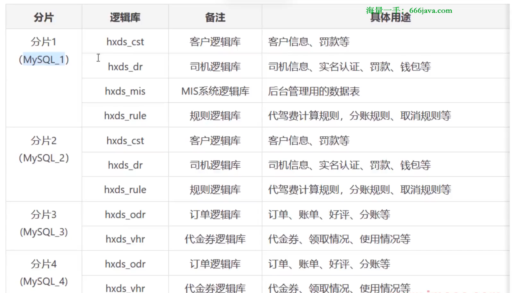
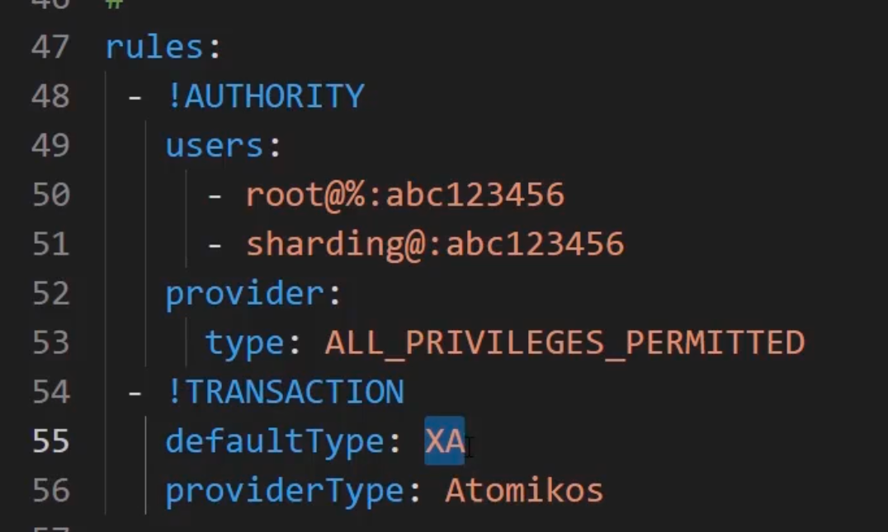
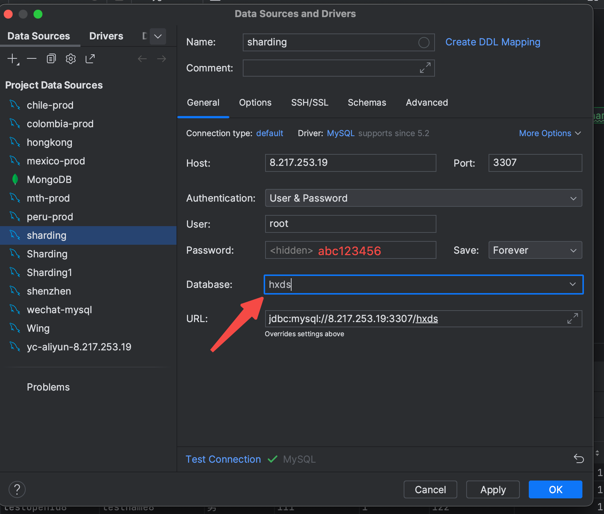

# 四个逻辑表划分

> // 这里只是假设分片在四个服务器，测试的时候只使用两个服务器来测试。
>
> MySQL1：172.18.0.2
>
> MySQL2：172.18.0.3
>
> MySQL3：172.18.0.4
>
> MySQL4：172.18.0.5



# ShardingSphere

## 安装包下载

> 参考博客：https://www.cnblogs.com/sportsky/p/16367480.html
>
> 下载地址：https://archive.apache.org/dist/shardingsphere/5.0.0/
>
> 下载完成得到：apache-shardingsphere-5.0.0-shardingsphere-proxy-bin.tar.gz
>
> 放到 /usr/local ，然后进行 tar -zxvf 解压即可

## MySQL对应驱动下载

> 下载地址：https://repo1.maven.org/maven2/mysql/mysql-connector-java/5.1.47/
>
> 下载得到：mysql-connector-java-5.1.47.jar

> 直接将 mysql-connector-java-5.1.47.jar 放到 
>
> /usr/local/apache-shardingsphere-5.0.0-shardingsphere-proxy-bin/lib 即可

## **ShardingSphere配置文件**

### **server.yaml**

> defaultType：XA【表示支持XA事务】
>
> 服务器配置的用户名密码分别是：root、abc123456



***

### **config-sharding.yaml**

> schemaName：自定义的中间件显示的数据库名称
>
> rep_s1_mis：自定义的名字

5.0.0版本可用【最简版】

```yaml

schemaName: hxds

dataSources:
  rep_s1_mis:
    url: jdbc:mysql://172.31.0.2:4406/hxds_mis?allowPublicKeyRetrieval=true&useSSL=false&useUnicode=true&characterEncoding=utf-8&useTimezone=true&serverTimezone=Asia/Shanghai&useTimezone=true&serverTimezone=Asia/Shanghai
    username: root
    password: root
    connectionTimeoutMilliseconds: 30000
    idleTimeoutMilliseconds: 60000
    maxLifetimeMilliseconds: 1800000
    maxPoolSize: 50
    minPoolSize: 1
  rep_s1_cst:
    url: jdbc:mysql://172.31.0.2:4406/hxds_cst?allowPublicKeyRetrieval=true&useSSL=false&useUnicode=true&characterEncoding=utf-8&useTimezone=true&serverTimezone=Asia/Shanghai
    username: root
    password: root
    connectionTimeoutMilliseconds: 30000
    idleTimeoutMilliseconds: 60000
    maxLifetimeMilliseconds: 1800000
    maxPoolSize: 50
    minPoolSize: 1
  rep_s2_cst:
    url: jdbc:mysql://47.101.143.172:3306/hxds_cst?allowPublicKeyRetrieval=true&useSSL=false&useUnicode=true&characterEncoding=utf-8&useTimezone=true&serverTimezone=Asia/Shanghai
    username: root
    password: P@ssw0rd123!
    connectionTimeoutMilliseconds: 30000
    idleTimeoutMilliseconds: 60000
    maxLifetimeMilliseconds: 1800000
    maxPoolSize: 50
    minPoolSize: 1
  rep_s1_dr:
    url: jdbc:mysql://172.31.0.2:4406/hxds_dr?allowPublicKeyRetrieval=true&useSSL=false&useUnicode=true&characterEncoding=utf-8&useTimezone=true&serverTimezone=Asia/Shanghai
    username: root
    password: root
    connectionTimeoutMilliseconds: 30000
    idleTimeoutMilliseconds: 60000
    maxLifetimeMilliseconds: 1800000
    maxPoolSize: 50
    minPoolSize: 1
  rep_s2_dr:
    url: jdbc:mysql://47.101.143.172:3306/hxds_dr?allowPublicKeyRetrieval=true&useSSL=false&useUnicode=true&characterEncoding=utf-8&useTimezone=true&serverTimezone=Asia/Shanghai
    username: root
    password: P@ssw0rd123!
    connectionTimeoutMilliseconds: 30000
    idleTimeoutMilliseconds: 60000
    maxLifetimeMilliseconds: 1800000
    maxPoolSize: 50
    minPoolSize: 1
  rep_s1_rule:
    url: jdbc:mysql://172.31.0.2:4406/hxds_rule?allowPublicKeyRetrieval=true&useSSL=false&useUnicode=true&characterEncoding=utf-8&useTimezone=true&serverTimezone=Asia/Shanghai
    username: root
    password: root
    connectionTimeoutMilliseconds: 30000
    idleTimeoutMilliseconds: 60000
    maxLifetimeMilliseconds: 1800000
    maxPoolSize: 50
    minPoolSize: 1
  rep_s2_rule:
    url: jdbc:mysql://47.101.143.172:3306/hxds_rule?allowPublicKeyRetrieval=true&useSSL=false&useUnicode=true&characterEncoding=utf-8&useTimezone=true&serverTimezone=Asia/Shanghai
    username: root
    password: P@ssw0rd123!
    connectionTimeoutMilliseconds: 30000
    idleTimeoutMilliseconds: 60000
    maxLifetimeMilliseconds: 1800000
    maxPoolSize: 50
    minPoolSize: 1
  rep_s1_odr:
    url: jdbc:mysql://172.31.0.2:4406/hxds_odr?allowPublicKeyRetrieval=true&useSSL=false&useUnicode=true&characterEncoding=utf-8&useTimezone=true&serverTimezone=Asia/Shanghai
    username: root
    password: root
    connectionTimeoutMilliseconds: 30000
    idleTimeoutMilliseconds: 60000
    maxLifetimeMilliseconds: 1800000
    maxPoolSize: 50
    minPoolSize: 1
  rep_s2_odr:
    url: jdbc:mysql://47.101.143.172:3306/hxds_odr?allowPublicKeyRetrieval=true&useSSL=false&useUnicode=true&characterEncoding=utf-8&useTimezone=true&serverTimezone=Asia/Shanghai
    username: root
    password: P@ssw0rd123!
    connectionTimeoutMilliseconds: 30000
    idleTimeoutMilliseconds: 60000
    maxLifetimeMilliseconds: 1800000
    maxPoolSize: 50
    minPoolSize: 1
  rep_s1_vhr:
    url: jdbc:mysql://172.31.0.2:4406/hxds_vhr?allowPublicKeyRetrieval=true&useSSL=false&useUnicode=true&characterEncoding=utf-8&useTimezone=true&serverTimezone=Asia/Shanghai
    username: root
    password: root
    connectionTimeoutMilliseconds: 30000
    idleTimeoutMilliseconds: 60000
    maxLifetimeMilliseconds: 1800000
    maxPoolSize: 50
    minPoolSize: 1
  rep_s2_vhr:
    url: jdbc:mysql://47.101.143.172:3306/hxds_vhr?allowPublicKeyRetrieval=true&useSSL=false&useUnicode=true&characterEncoding=utf-8&useTimezone=true&serverTimezone=Asia/Shanghai
    username: root
    password: P@ssw0rd123!
    connectionTimeoutMilliseconds: 30000
    idleTimeoutMilliseconds: 60000
    maxLifetimeMilliseconds: 1800000
    maxPoolSize: 50
    minPoolSize: 1

rules:
- !SHARDING
  tables:
    tb_action:
      actualDataNodes: rep_s1_mis.tb_action
    tb_dept:
      actualDataNodes: rep_s1_mis.tb_dept
    tb_feedback:
      actualDataNodes: rep_s1_mis.tb_feedback
    tb_module:
      actualDataNodes: rep_s1_mis.tb_module
    tb_permission:
      actualDataNodes: rep_s1_mis.tb_permission
    tb_role:
      actualDataNodes: rep_s1_mis.tb_role
    tb_user:
      actualDataNodes: rep_s1_mis.tb_user
    tb_customer:
      actualDataNodes: rep_s${1..2}_cst.tb_customer
      databaseStrategy:
        standard:
          shardingColumn: id
          shardingAlgorithmName: cst-inline
      keyGenerateStrategy:
        column: id
        keyGeneratorName: snowflake
    tb_customer_fine:
      actualDataNodes: rep_s${1..2}_cst.tb_customer_fine
      databaseStrategy:
        standard:
          shardingColumn: customer_id
          shardingAlgorithmName: cst-children-inline
      keyGenerateStrategy:
        column: customer_id
        keyGeneratorName: snowflake


  bindingTables:
    - tb_customer
    - tb_customer_fine

  defaultDatabaseStrategy:
    standard:
      shardingColumn: id
      shardingAlgorithmName: database_inline
  defaultTableStrategy:
    none:

  shardingAlgorithms:
    cst-inline:
      type: INLINE
      props:
        algorithm-expression: rep_s${(id % 2)+1}_cst

    cst-children-inline:
      type: INLINE
      props:
        algorithm-expression: rep_s${(customer_id % 2)+1}_cst

```


```yaml
schemaName: hxds

dataSources:
  rep_s1_mis:
    url: jdbc:mysql://172.31.0.2:4406/hxds_mis?allowPublicKeyRetrieval=true&useSSL=false&useUnicode=true&characterEncoding=utf-8&useTimezone=true&serverTimezone=Asia/Shanghai&useTimezone=true&serverTimezone=Asia/Shanghai
    username: root
    password: root
    connectionTimeoutMilliseconds: 30000
    idleTimeoutMilliseconds: 60000
    maxLifetimeMilliseconds: 1800000
    maxPoolSize: 50
    minPoolSize: 1
  rep_s1_cst:
    url: jdbc:mysql://172.31.0.2:4406/hxds_cst?allowPublicKeyRetrieval=true&useSSL=false&useUnicode=true&characterEncoding=utf-8&useTimezone=true&serverTimezone=Asia/Shanghai
    username: root
    password: root
    connectionTimeoutMilliseconds: 30000
    idleTimeoutMilliseconds: 60000
    maxLifetimeMilliseconds: 1800000
    maxPoolSize: 50
    minPoolSize: 1
  rep_s2_cst:
    url: jdbc:mysql://47.101.143.172:3306/hxds_cst?allowPublicKeyRetrieval=true&useSSL=false&useUnicode=true&characterEncoding=utf-8&useTimezone=true&serverTimezone=Asia/Shanghai
    username: root
    password: P@ssw0rd123!
    connectionTimeoutMilliseconds: 30000
    idleTimeoutMilliseconds: 60000
    maxLifetimeMilliseconds: 1800000
    maxPoolSize: 50
    minPoolSize: 1
  rep_s1_dr:
    url: jdbc:mysql://172.31.0.2:4406/hxds_dr?allowPublicKeyRetrieval=true&useSSL=false&useUnicode=true&characterEncoding=utf-8&useTimezone=true&serverTimezone=Asia/Shanghai
    username: root
    password: root
    connectionTimeoutMilliseconds: 30000
    idleTimeoutMilliseconds: 60000
    maxLifetimeMilliseconds: 1800000
    maxPoolSize: 50
    minPoolSize: 1
  rep_s2_dr:
    url: jdbc:mysql://47.101.143.172:3306/hxds_dr?allowPublicKeyRetrieval=true&useSSL=false&useUnicode=true&characterEncoding=utf-8&useTimezone=true&serverTimezone=Asia/Shanghai
    username: root
    password: P@ssw0rd123!
    connectionTimeoutMilliseconds: 30000
    idleTimeoutMilliseconds: 60000
    maxLifetimeMilliseconds: 1800000
    maxPoolSize: 50
    minPoolSize: 1
  rep_s1_rule:
    url: jdbc:mysql://172.31.0.2:4406/hxds_rule?allowPublicKeyRetrieval=true&useSSL=false&useUnicode=true&characterEncoding=utf-8&useTimezone=true&serverTimezone=Asia/Shanghai
    username: root
    password: root
    connectionTimeoutMilliseconds: 30000
    idleTimeoutMilliseconds: 60000
    maxLifetimeMilliseconds: 1800000
    maxPoolSize: 50
    minPoolSize: 1
  rep_s2_rule:
    url: jdbc:mysql://47.101.143.172:3306/hxds_rule?allowPublicKeyRetrieval=true&useSSL=false&useUnicode=true&characterEncoding=utf-8&useTimezone=true&serverTimezone=Asia/Shanghai
    username: root
    password: P@ssw0rd123!
    connectionTimeoutMilliseconds: 30000
    idleTimeoutMilliseconds: 60000
    maxLifetimeMilliseconds: 1800000
    maxPoolSize: 50
    minPoolSize: 1
  rep_s1_odr:
    url: jdbc:mysql://172.31.0.2:4406/hxds_odr?allowPublicKeyRetrieval=true&useSSL=false&useUnicode=true&characterEncoding=utf-8&useTimezone=true&serverTimezone=Asia/Shanghai
    username: root
    password: root
    connectionTimeoutMilliseconds: 30000
    idleTimeoutMilliseconds: 60000
    maxLifetimeMilliseconds: 1800000
    maxPoolSize: 50
    minPoolSize: 1
  rep_s2_odr:
    url: jdbc:mysql://47.101.143.172:3306/hxds_odr?allowPublicKeyRetrieval=true&useSSL=false&useUnicode=true&characterEncoding=utf-8&useTimezone=true&serverTimezone=Asia/Shanghai
    username: root
    password: P@ssw0rd123!
    connectionTimeoutMilliseconds: 30000
    idleTimeoutMilliseconds: 60000
    maxLifetimeMilliseconds: 1800000
    maxPoolSize: 50
    minPoolSize: 1
  rep_s1_vhr:
    url: jdbc:mysql://172.31.0.2:4406/hxds_vhr?allowPublicKeyRetrieval=true&useSSL=false&useUnicode=true&characterEncoding=utf-8&useTimezone=true&serverTimezone=Asia/Shanghai
    username: root
    password: root
    connectionTimeoutMilliseconds: 30000
    idleTimeoutMilliseconds: 60000
    maxLifetimeMilliseconds: 1800000
    maxPoolSize: 50
    minPoolSize: 1
  rep_s2_vhr:
    url: jdbc:mysql://47.101.143.172:3306/hxds_vhr?allowPublicKeyRetrieval=true&useSSL=false&useUnicode=true&characterEncoding=utf-8&useTimezone=true&serverTimezone=Asia/Shanghai
    username: root
    password: P@ssw0rd123!
    connectionTimeoutMilliseconds: 30000
    idleTimeoutMilliseconds: 60000
    maxLifetimeMilliseconds: 1800000
    maxPoolSize: 50
    minPoolSize: 1

rules:
- !SHARDING
  tables:
    tb_action:
      actualDataNodes: rep_s1_mis.tb_action
    tb_dept:
      actualDataNodes: rep_s1_mis.tb_dept
    tb_feedback:
      actualDataNodes: rep_s1_mis.tb_feedback
    tb_module:
      actualDataNodes: rep_s1_mis.tb_module
    tb_permission:
      actualDataNodes: rep_s1_mis.tb_permission
    tb_role:
      actualDataNodes: rep_s1_mis.tb_role
    tb_user:
      actualDataNodes: rep_s1_mis.tb_user
      
    tb_customer:
      actualDataNodes: rep_s${1..2}_cst.tb_customer
      databaseStrategy:
        standard:
          shardingColumn: id
          shardingAlgorithmName: cst-inline
      keyGenerateStrategy:
        column: id
        keyGeneratorName: snowflake
    tb_customer_fine:
      actualDataNodes: rep_s${1..2}_cst.tb_customer_fine
      databaseStrategy:
        standard:
          shardingColumn: customer_id
          shardingAlgorithmName: cst-children-inline
      keyGenerateStrategy:
        column: customer_id
        keyGeneratorName: snowflake
    tb_customer_car:
      actualDataNodes: rep_s${1..2}_cst.tb_customer_car
      databaseStrategy:
        standard:
          shardingColumn: customer_id
          shardingAlgorithmName: cst-children-inline
      keyGenerateStrategy:
        column: customer_id
        keyGeneratorName: snowflake
        
    tb_driver:
      actualDataNodes: rep_s${1..2}_dr.tb_driver
      databaseStrategy:
        standard:
          shardingColumn: id
          shardingAlgorithmName: dr-inline
      keyGenerateStrategy:
        column: id
        keyGeneratorName: snowflake
    tb_driver_settings:
      actualDataNodes: rep_s${1..2}_dr.tb_driver_settings
      databaseStrategy:
        standard:
          shardingColumn: driver_id
          shardingAlgorithmName: dr-children-inline
      keyGenerateStrategy:
        column: driver_id
        keyGeneratorName: snowflake
    tb_wallet:
      actualDataNodes: rep_s${1..2}_dr.tb_wallet
      databaseStrategy:
        standard:
          shardingColumn: driver_id
          shardingAlgorithmName: dr-children-inline
      keyGenerateStrategy:
        column: driver_id
        keyGeneratorName: snowflake
    
    # 这个未配置
    tb_order:
      actualDataNodes: rep_s${1..2}_dr.tb_order
      databaseStrategy:
        standard:
          shardingColumn: driver_id
          shardingAlgorithmName: dr-wallet-inline
      keyGenerateStrategy:
        column: driver_id
        keyGeneratorName: snowflake

  bindingTables:
    - tb_customer
    - tb_customer_fine
    - tb_customer_car
    - tb_driver
    - tb_driver_settings
    - tb_wallet

  defaultDatabaseStrategy:
    standard:
      shardingColumn: id
      shardingAlgorithmName: database_inline
  defaultTableStrategy:
    none:

  shardingAlgorithms:
    cst-inline:
      type: INLINE
      props:
        algorithm-expression: rep_s${(id % 2)+1}_cst
    cst-children-inline:
      type: INLINE
      props:
        algorithm-expression: rep_s${(customer_id % 2)+1}_cst
        
    dr-inline:
      type: INLINE
      props:
        algorithm-expression: rep_s${(id % 2)+1}_dr
    dr-children-inline:
      type: INLINE
      props:
        algorithm-expression: rep_s${(driver_id % 2)+1}_dr
```


> rep_s1_mis只在MySQL1分片中，所以这里没有路由规则。
>
> ShardingSphere 因为要根据主键路由，所以主键要ShardingSphere来生成确定后，才取模确定保存到哪个数据库，因此主键不再真实数据库中生成，而是 ShardingSphere 提前生产。
>
> snowflake就是主键生成规则。ShardingSphere内置的雪花算法

> tb_customer 在 rep_s1_cst 或 rep_s2_cst  中，对应规则是，根据主键来，主键填写到 shardingColumn，按照 cst-inline自定义的规则（看下面）
>
> 根据主键值对二求模加一来确定哪个分片

## 启动服务

```sh
cd /usr/local/apache-shardingsphere-5.0.0-shardingsphere-proxy-bin/bin
./start.sh
```

## 工具连接测试



> 连接后，就能进行增删该查操作。


