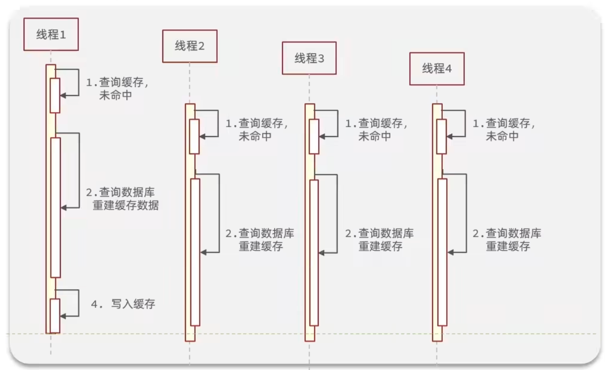

# 1 基础篇

>redis-cli -h 47.76.68.216 -p 6379 -a 123456abc

## 1.1 SQL & NoSQL

|          |                    SQL                     | NoSQL                                                        |
| :------: | :----------------------------------------: | ------------------------------------------------------------ |
| 数据结构 |             结构化(Structured)             | 非结构化                                                     |
| 数据关联 |             关联的(Relational)             | 无关联的                                                     |
| 查询方式 |                  SQL查询                   | 非SQL                                                        |
| 事务特性 |                    ACID                    | BASE                                                         |
| 存储方式 |                    磁盘                    | 内存                                                         |
|  扩展性  |                    垂直                    | 水平                                                         |
| 使用场景 | 1）数据结构固定 2)对一致性、安全性要求不高 | 1)数据结构不固定 2)相关业务对数据安全性、一致性要求较高 3）对性能要求 |

## 1.2 认识Redis

Redis诞生于2009年，全称是Remote Dictionary Server远程词典服务器，是一个基于内存的键值型NoSQL数据库。

特征：

- 键值(Key-Value)型，Value支持多种不同的数据结构，功能丰富
- `单线程`，每个命令具有原子性
- 低延迟，速度快(`基于内存`、IO多路复用、良好的编码)
- 支持数据持久化
- 支持主从集群、分片集群
- 支持多语言客户端

## 1.3 Redis安装和启动

官网：https://redis.io/

Redis是基于C语言编写的，因此首先需要安装Redis所需要的gcc依赖

```sh
yum install -y gcc tcl
```

上传 redis-6.2.6.tar.gz 到 /usr/local/src

解压：

```sh
tar -zxvf redis-6.2.6.tar.gz 
```

解压成功后依次执行以下命令

```sh
cd redis-6.2.6
make && make install
```

安装成功后打开/usr/local/bin目录（该目录为Redis默认的安装目录）

```sh
cd /usr/local/bin
ll
```

安装完成后，在任意目录输入`redis-server`命令即可启动Redis（前台方式启动）

```sh
redis-server
```

如果要让Redis以后台方式启动，则必须修改Redis配置文件，配置文件所在目录就是之前我们解压的安装包下

因为我们要修改配置文件，因此我们需要先将原文件备份一份

```sh
cd /usr/local/src/redis-6.2.6
cp redis.conf redis.conf.bck
```

**然后修改`redis.conf`文件中的一些配置**

```properties
# 允许访问的地址，默认是127.0.0.1，会导致只能在本地访问。修改为0.0.0.0则可以在任意IP访问，生产环境不要设置为0.0.0.0
bind 0.0.0.0   # 深圳VPN 120.25.220.23
# 守护进程，修改为yes后即可后台运行
daemonize yes 
# 密码，设置后访问Redis必须输入密码
requirepass yuHKs62g#js
```

**Redis其他常用配置**

```properties
# 监听的端口
port 6379
# 工作目录，默认是当前目录，也就是运行redis-server时的命令，日志、持久化等文件会保存在这个目录
dir .
# 数据库数量，设置为1，代表只使用1个库，默认有16个库，编号0~15
databases 1
# 设置redis能够使用的最大内存
maxmemory 512mb
# 日志文件，默认为空，不记录日志，可以指定日志文件名
logfile "redis.log"
```

**启动Redis**（后台运行）

```sh
# 进入redis安装目录 
cd /usr/local/src/redis-6.2.6
# 启动
redis-server redis.conf 
```

**停止Redis服务**

```sh
# 通过kill命令直接杀死进程
kill -9 redis进程id
```

```sh
# 利用redis-cli来执行 shutdown 命令，即可停止 Redis 服务，
# 因为之前配置了密码，因此需要通过 -a 来指定密码
redis-cli -a 132537 shutdown
```

**开机自启（推荐）**

我们也可以通过配置来实现开机自启

**首先，新建一个系统服务文件**

```sh
vi /etc/systemd/system/redis.service
```

**将以下命令粘贴进去**

```properties
[Unit]
Description=redis-server
After=network.target

[Service]
Type=forking
ExecStart=/usr/local/bin/redis-server /usr/local/src/redis-6.2.6/redis.conf
PrivateTmp=true

[Install]
WantedBy=multi-user.target
```

**然后重载系统服务**

```sh
systemctl daemon-reload
```

**现在，我们可以用下面这组命令来操作redis了**

./redis-server /usr/local/src/redis-6.2.6/redis.conf

```sh
# 启动
systemctl start redis
# 停止
systemctl stop redis
# 重启
systemctl restart redis
# 查看状态
systemctl status redis
# 
ps -ef | grep redis
```

**执行下面的命令，可以让redis开机自启**

```sh
systemctl enable redis
```

**Redis安装完成后就自带了命令行客户端，使用方式如下：**

```sh
redis-cli [options][commonds]
redis-cli -h 主机名 -p 端口号 -a 密码
redis-cli -h 47.76.68.216 -p 6379 -a 123456abc
```

看在使用服务命令

```sh
 netstat -lntp 
```

## 1.4 Redis数据结构

Redis是一个key-value的数据库，key一般是String类型，不过value的类型多种多样


## 1.5 Redis通用命令

通用指令是部分数据类型的，都可以使用的指令，常见的有如下表格所示

|  指令  |                             描述                             |
| :----: | :----------------------------------------------------------: |
|  KEYS  | 查看符合模板的所有key，不建议在生产环境设备上使用(因为单线程，数据量大的话，其它都得等) |
|  DEL   |              删除一个指定的key，也可以删除多个               |
| EXISTS |                       判断key是否存在                        |
| EXPIRE |      给一个key设置有效期，有效期到期时该key会被自动删除      |
|  TTL   |                   查看一个KEY的剩余有效期                    |

## 1.6 基本数据类型

### 1.6.1 String

String类型，也就是字符串类型，是Redis中最简单的存储类型。

其value是字符串，不过根据字符串的格式不同，又可以分为3类：

- `string`：普通字符串
- `int`：整数类型，可以做自增、自减操作
- `float`：浮点类型，可以做自增、自减操作

|  KEY  |    VALUE    |
| :---: | :---------: |
|  msg  | hello world |
|  num  |     10      |
| score |    92.5     |

> 不管是哪种格式，底层都是字节数组形式存储，只不过是编码方式不同。字符串类型的最大空间不能超过**512m**. 

**String的常见命令有如下表格所示**

|    命令     |                             描述                             |
| :---------: | :----------------------------------------------------------: |
|     SET     |         添加或者修改已经存在的一个String类型的键值对         |
|     GET     |                 根据key获取String类型的value                 |
|    MSET     |                批量添加多个String类型的键值对                |
|    MGET     |             根据多个key获取多个String类型的value             |
|    INCR     |                     让一个整型的key自增1                     |
|   INCRBY    | 让一个整型的key自增并指定步长，例如：incrby num 2 让num值自增2（负数就是减） |
| INCRBYFLOAT |              让一个浮点类型的数字自增并指定步长              |
|    SETNX    | 添加一个String类型的键值对，前提是这个key不存在，否则不执行  |
|  **SETEX**  |          添加一个String类型的键值对，并且指定有效期          |

**Redis的key允许有多个单词形成层级结构，多个单词之间用” ：“隔开，格式如下：**

```tex
项目名:业务名:类型:id
```

这个格式并非固定，也可以根据自己的需求来删除或添加词条。

例如我们的项目名称叫 `heima`，有`user`和`product`两种不同类型的数据，我们可以这样定义key：

- **user**相关的key：`heima:user:1`
- **product**相关的key：`heima:product:1`

如果Value是一个Java对象，例如一个User对象，则可以将对象序列化为JSON字符串后存储

|       KEY       |                   VALUE                   |
| :-------------: | :---------------------------------------: |
|  heima:user:1   |   '{"id":1, "name": "Jack", "age": 21}'   |
| heima:product:1 | {“id”:1, “name”: “小米11”, “price”: 4999} |

***

### 1.6.2 Hash

Hash类型，也叫散列，其value是一个无序字典，类似于Java中的`HashMap`结构。

String结构是将对象序列化为]SON字符串后存储，当需要修改对象某个字段时很不方便

Hash结构可以将对象中的每个字段独立存储，可以针对单个字段做CRUD：


**Hash的常见命令有：**

|         命令         |                             描述                             |
| :------------------: | :----------------------------------------------------------: |
| HSET key field value |              添加或者修改hash类型key的field的值              |
|    HGET key field    |                获取一个hash类型key的field的值                |
|        HMSET         |       hmset 和 hset 效果相同 ，4.0之后hmset可以弃用了        |
|        HMGET         |              批量获取多个hash类型key的field的值              |
|       HGETALL        |         获取一个hash类型的key中的所有的field和value          |
|        HKEYS         |             获取一个hash类型的key中的所有的field             |
|        HVALS         |             获取一个hash类型的key中的所有的value             |
|       HINCRBY        |           让一个hash类型key的字段值自增并指定步长            |
|        HSETNX        | 添加一个hash类型的key的field值，前提是这个field不存在，否则不执行 |

### 1.6.3 List

Redis中的List类型与Java中的LinkedList类似，可以看做是一个双向链表结构。既可以支持正向检索和也可以支持反向检索。

**特征也与`LinkedList`类似：**

- 有序
- 元素可以重复
- 插入和删除快
- 查询速度一般

 **List的常见命令有**

|          命令           |                             描述                             |
| :---------------------: | :----------------------------------------------------------: |
|   LPUSH key element …   |                 向列表左侧插入一个或多个元素                 |
|        LPOP key         | 移除并返回列表左侧的第一个元素，没有则返回nil（可以取多个）  |
| **RPUSH key element …** |                 向列表右侧插入一个或多个元素                 |
|        RPOP key         |         移除并返回列表右侧的第一个元素（可以取多个）         |
|   LRANGE key star end   |                 返回一段角标范围内的所有元素                 |
|      BLPOP和BRPOP       | 与LPOP和RPOP类似，只不过在没有元素时等待指定时间，而不是直接返回nil（需要传时间，单位秒） |


> **思考问题**

- **如何利用List结构模拟一个栈?**
  - 先进后出，入口和出口在同一边
- **如何利用List结构模拟一个队列?**
  - 先进先出，入口和出口在不同边
- **如何利用List结构模拟一个阻塞队列?**
  - 入口和出口在不同边
  - 出队时采用BLPOP或BRPOP

***

### 1.6.4 Set

Redis的Set结构与Java中的HashSet类似，可以看做是一个value为null的HashMap。因为也是一个hash表，因此具备与HashSet类似的特征

- 无序
- 元素不可重复
- 查找快
- 支持交集、并集、差集等功能

|         命令         |                  描述                  |
| :------------------: | :------------------------------------: |
|  SADD key member …   |       向set中添加一个或多个元素        |
|  SREM key member …   |          移除set中的指定元素           |
|      SCARD key       |          返回set中元素的个数           |
| SISMEMBER key member |      判断一个元素是否存在于set中       |
|       SMEMBERS       |          获取set中的所有元素           |
|  SINTER key1 key2 …  |           求key1与key2的交集           |
|  SDIFF key1 key2 …   |           求key1与key2的差集           |
|  SUNION key1 key2 …  | 求key1和key2的并集(重复元素只出现一次) |

### 1.6.5 SortedSet

Redis的SortedSet是一个可排序的set集合，与Java中的TreeSet有些类似，但底层数据结构却差别很大。SortedSet中的每一个元素都带有一个score属性，可以基于score属性对元素排序，底层的实现是一个跳表（SkipList）加 hash表。

**SortedSet具备下列特性：**

- 可排序
- 元素不重复
- 查询速度快

因为SortedSet的可排序特性，经常被用来实现排行榜这样的功能。

**SortedSet的常见命令有**

|             命令             |                             描述                             |
| :--------------------------: | :----------------------------------------------------------: |
|    ZADD key score member     | 添加一个或多个元素到sorted set ，如果已经存在则更新其score值 |
|       ZREM key member        |                删除sorted set中的一个指定元素                |
|      ZSCORE key member       |             获取sorted set中的指定元素的score值              |
|       ZRANK key member       |              获取sorted set 中的指定元素的排名               |
|          ZCARD key           |                  获取sorted set中的元素个数                  |
|      ZCOUNT key min max      |           统计score值在给定范围内的所有元素的个数            |
| ZINCRBY key increment member |    让sorted set中的指定元素自增，步长为指定的increment值     |
|      ZRANGE key min max      |          按照score排序后，获取指定排名范围内的元素           |
|  ZRANGEBYSCORE key min max   |          按照score排序后，获取指定score范围内的元素          |
|    ZDIFF、ZINTER、ZUNION     |                      求差集、交集、并集                      |

**注意：所有的排名默认都是升序，如果要降序则在命令的Z后面添加`REV`即可**

***

## 1.7 Java客户端

### 1.7.1 Jedis

#### 1.7.1.1 Jedis快速入门

```xml
<!--引入Jedis依赖-->
<dependency>
    <groupId>redis.clients</groupId>
    <artifactId>jedis</artifactId>
    <version>4.2.0</version>
</dependency>

<!--引入单元测试依赖-->
<dependency>
    <groupId>org.junit.jupiter</groupId>
    <artifactId>junit-jupiter</artifactId>
    <version>5.8.2</version>
    <scope>test</scope>
</dependency>

```

**编写测试类并与Redis建立连接**

```java
public class JedisTest {

    private Jedis jedis;

    @BeforeEach
    void setUp() {
        // 1.建立连接
        jedis = new Jedis("101.34.235.45",6379);
        // 2.设置密码
        jedis.auth("123456");
        // 3.选择库
        jedis.select(0);
    }
    @Test
    void testString() {
        jedis.set("name","xiaoyan");
        String s = jedis.get("name");
        System.out.println(s);
    }
    @AfterEach
    void afterAll() {
        if (jedis != null) {
            jedis.close();
        }
    }
}
```

#### 1.7.1.2 Jedis连接池

Jedis本身是线程不安全的，并且频繁的创建和销毁连接会有性能损耗，因此我们推荐大家使用Jedis连接池代替Jedis的直连方式

```java
public class JedisConnectionFactory {
    private static final JedisPool jedisPool;

    static {
        //配置连接池
        JedisPoolConfig jedisPoolConfig = new JedisPoolConfig();
        jedisPoolConfig.setMaxTotal(8);
        jedisPoolConfig.setMaxIdle(8);
        jedisPoolConfig.setMinIdle(0);
        jedisPoolConfig.setMaxWaitMillis(200);
        //创建连接池对象
        jedisPool = new JedisPool(jedisPoolConfig,"192.168.230.88",6379,1000,"132537");
    }

    public static Jedis getJedis(){
       return jedisPool.getResource();
    }
}
```

使用连接池后

```java
public class JedisTest {
    private Jedis jedis;
    @BeforeEach
    void setUp() {
        jedis = JedisConnectionFactory.getJedis();
        jedis.select(0);
    }
    @Test
    void testString() {
        jedis.set("name","hei11");
        String s = jedis.get("name");
        System.out.println(s);
    }
    @AfterEach
    void afterAll() {
        if (jedis != null) {
            jedis.close();
        }
    }
}
```

### 1.7.2 SpringDataRedis

#### 1.7.2.1 SpringDataRedis介绍

**SpringData是Spring中数据操作的模块，包含对各种数据库的集成，其中对Redis的集成模块就叫做`SpringDataRedis`**

**官网地址**：https://spring.io/projects/spring-data-redis

- 提供了对不同Redis客户端的整合（`Lettuce`和`Jedis`）
- 提供了`RedisTemplate`统一API来操作Redis
- 支持Redis的发布订阅模型
- 支持Redis哨兵和Redis集群
- 支持基于Lettuce的响应式编程
- 支持基于JDK、JSON、字符串、Spring对象的数据序列化及反序列化
- 支持基于Redis的JDKCollection实现

**SpringDataRedis中提供了RedisTemplate工具类，其中封装了各种对Redis的操作。并且将不同数据类型的操作API封装到了不同的类型中：**


#### 1.7.2.2 SpringDataRedis快速入门

```xml
<!-- redis依赖 -->
<dependency>
    <groupId>org.springframework.boot</groupId>
    <artifactId>spring-boot-starter-data-redis</artifactId>
</dependency>
<!-- common-pool -->
<dependency>
    <groupId>org.apache.commons</groupId>
    <artifactId>commons-pool2</artifactId>
</dependency>
```

```yaml
spring:
  redis:
    host: 192.168.230.88 #指定redis所在的host
    port: 6379  #指定redis的端口
    password: 132537  #设置redis密码
    lettuce:
      pool:
        max-active: 8 #最大连接数
        max-idle: 8 #最大空闲数
        min-idle: 0 #最小空闲数
        max-wait: 100ms #连接等待时间

```

```java
@SpringBootTest
class RedisDemoApplicationTests {
	@Resource
	private RedisTemplate redisTemplate;
	@Test
	void testString() {
		// 1.通过RedisTemplate获取操作String类型的ValueOperations对象
		ValueOperations ops = redisTemplate.opsForValue();
		// 2.插入一条数据
		ops.set("blogName","Vz-Blog");
		
		// 3.获取数据
		String blogName = (String) ops.get("blogName");
		System.out.println("blogName = " + blogName);
	}
}
```

#### 1.7.2.3 RedisSerializer配置

**RedisTemplate可以接收任意Object作为值写入Redis，只不过写入前会把Object序列化为字节形式，`默认是采用JDK序列化`，得到的结果是这样的**


**缺点：**

- 可读性差
- 内存占用较大

**那么如何解决以上的问题呢？我们可以通过自定义RedisTemplate序列化的方式来解决。**

```java
package com.example.redisdemo.com.example.redis.config;

import org.springframework.context.annotation.Bean;
import org.springframework.context.annotation.Configuration;
import org.springframework.data.redis.connection.RedisConnectionFactory;
import org.springframework.data.redis.core.RedisTemplate;
import org.springframework.data.redis.serializer.GenericJackson2JsonRedisSerializer;
import org.springframework.data.redis.serializer.StringRedisSerializer;

@Configuration
public class RedisConfig {

    @Bean
    public RedisTemplate<String,Object> redisTemplate(RedisConnectionFactory factory){
        // 1.创建RedisTemplate对象
        RedisTemplate<String ,Object> redisTemplate = new RedisTemplate<>();
        // 2.设置连接工厂
        redisTemplate.setConnectionFactory(factory);

        // 3.创建序列化对象
        StringRedisSerializer stringRedisSerializer = new StringRedisSerializer();
        GenericJackson2JsonRedisSerializer genericJackson2JsonRedisSerializer = new GenericJackson2JsonRedisSerializer();

        // 4.设置key和hashKey采用String的序列化方式
        redisTemplate.setKeySerializer(stringRedisSerializer);
        redisTemplate.setHashKeySerializer(stringRedisSerializer);

        // 5.设置value和hashValue采用json的序列化方式
        redisTemplate.setValueSerializer(genericJackson2JsonRedisSerializer);
        redisTemplate.setHashValueSerializer(genericJackson2JsonRedisSerializer);

        return redisTemplate;
    }
}
```

报错可能缺少引用

```xml
<!-- Jackson依赖 -->
<dependency>
    <groupId>com.fasterxml.jackson.core</groupId>
    <artifactId>jackson-databind</artifactId>
</dependency>
```

写入对象：

```java
@Test
void testSaveUser() {
    //写入数据
    redisTemplate.opsForValue().set("user:100",new User("huge",17));
    //获取数据
    User user = (User)redisTemplate.opsForValue().get("user:100");
    System.out.println(user);
}
```


尽管Json序列化可以满足我们的需求，但是依旧存在一些问题。

如上图所示，为了在反序列化时知道对象的类型，JSON序列化器会将类的class类型写入json结果中，存入Redis，会带来额外的内存开销。

那么我们如何解决这个问题呢？我们可以通过下文的`StringRedisTemplate`来解决这个问题。

***

#### 1.7.2.4 StringRedisTemplate

为了节省内存空间，我们并不会使用JSON序列化器来处理value，而是统一使用String序列化器，要求只能存储String类型的key和value。当需要存储Java对象时，手动完成对象的序列化和反序列化。


**Spring默认提供了一个StringRedisTemplate类，它的key和value的序列化方式默认就是String方式。省去了我们自定义RedisTemplate的过程**

***

```java
@Autowired
private StringRedisTemplate stringRedisTemplate;
private static final ObjectMapper mapper = new ObjectMapper();

@Test
void testSaveUser() throws JsonProcessingException {
    //创建对象
    User user = new User("网wang",17);
    // 1.创建一个Json序列化对象
    String json = mapper.writeValueAsString(user);
    //写入数据
    stringRedisTemplate.opsForValue().set("user:200",json);
    //获取数据
    String jsonUser = stringRedisTemplate.opsForValue().get("user:200");
    // 手动反序列化
    User user1 = mapper.readValue(jsonUser,User.class);
    System.out.println(user1);
}
```

***

RedisTemplate的两种序列化实践方案，两种方案各有各的优缺点，可以根据实际情况选择使用。

方案一：

1. 自定义RedisTemplate
2. 修改RedisTemplate的序列化器为GenericJackson2JsonRedisSerializer

方案二(推荐)：

1. 使用StringRedisTemplate
2. 写入Redis时，手动把对象序列化为JSON
3. 读取Redis时，手动把读取到的JSON反序列化为对象

***

hash

```java
@Test
void testHash() throws JsonProcessingException {
    stringRedisTemplate.opsForHash().put("user:300","name","xiaoli");
    stringRedisTemplate.opsForHash().put("user:300","age","22");
    Map<Object, Object> entries = stringRedisTemplate.opsForHash().entries("user:300");
    System.out.println(entries);
}
```

***

# 2 实战篇


## 2.1 短信验证码登录注册功能


- 该项目采用的是前后端分离开发模式
- 手机或者app端发起请求，请求我们的Nginx服务器，Nginx基于七层模型走的事HTTP协议，可以实现基于Lua直接绕开Tomcat访问Redis，也可以作为静态资源服务器，轻松扛下上万并发， 负载均衡到下游Tomcat服务器，打散流量，我们都知道一台4核8G的Tomcat，在优化和处理简单业务的加持下，大不了就处理1000左右的并发， 经过Nginx的负载均衡分流后，利用集群支撑起整个项目，同时Nginx在部署了前端项目后，更是可以做到动静分离，进一步降低Tomcat服务的压力，这些功能都得靠Nginx起作用，所以Nginx是整个项目中重要的一环。
- 在Tomcat支撑起并发流量后，我们如果让Tomcat直接去访问Mysql，根据经验Mysql企业级服务器只要上点并发，一般是16或32 核心cpu，32 或64G内存，像企业级mysql加上固态硬盘能够支撑的并发，大概就是4000起~7000左右，上万并发， 瞬间就会让Mysql服务器的cpu，硬盘全部打满，容易崩溃，所以我们在高并发场景下，会选择使用mysql集群，同时为了进一步降低Mysql的压力，同时增加访问的性能，我们也会加入Redis，同时使用Redis集群使得Redis对外提供更好的服务。

***

### 2.1.1 基于Session实现登录


***

**登录验证功能**


### 2.1.2 集群的session共享问题


### 2.1.3 Redis实现共享Session


**登录拦截器优化**


## 2.2 商家查询的缓存功能

### 2.2.1 添加redis缓存


### 2.2.2 缓存更新策略


业务场景：

- 低一致性需求：使用内存淘汰机制。例如店铺类型的查询缓存
- 高一致性需求：主动更新，并以超时剔除作为兜底方案。例如店铺详情查询的缓存


***

**演示线程安全问题**

正常的线程处理：线程1要执行删除缓存，然后更新数据库；而线程而只是进行查询


不正常的线程处理（每个线程的执行，程序员无法控制，由CPU调度）：线程1执行删除缓存后，由于更新逻辑长，恰巧线程2进行了读取，这就导致线程不安全。


***


为什么胜出？因为在线程1查询缓存和写入缓存之间（时间很短），还能塞入操作流程更长的更新数据库和删除缓存两个操作，概率很低。

而不胜出的线程1删除缓存和更新数据库之间（时间长），塞入线程2的查询缓存和写入缓存概率很高。

***

**总结**

缓存更新策略的最佳实践方案：

1. 低一致性需求：使用Redis自带的内存淘汰机制
2. 高一致性需求：主动更新，并以超时剔除作为兜底方案
   - 读操作：
     - 缓存命中则直接返回
     - 缓存未命中则查询数据库，并写八缓存，设定超时时问
   - 写操作：
     - 先写数据库，然后再删除缓存
     - 要确保数据库与缓存操作的原子性

***

### 2.2.3 缓存穿透

#### 2.2.3.1 产生原因

缓存穿透是指客户端请求的数据在缓存中和数据库中都不存在，这样缓存永远不会生效，这些请求都会打到数据库。

#### 2.2.3.2 解决方案

常见的解决方案有两种：

- 缓存空对象
  - 优点：实现简单，维护方便
  - 缺点：1）额外的内存消耗；2）可能造成短期的不一致
- 布隆过滤
  - 优点：内存占用较少，没有多余key
  - 缺点：1）实现复杂；2）存在误判可能


代码演示`缓存空对象`的方案：


### 2.2.4 缓存雪崩

#### 2.2.4.1 产生原因

缓存雪崩是指在同一时段大量的缓存key同时失效或者Redis服务宕机，导致大量请求到达数据库，带来巨大压力

#### 2.2.4.2 解决方案

解决方案：

- 给不同的Key的TTL添加随机值
- 利用Redis集群提高服务的可用性
- 给缓存业务添加降级限流策略
- 给业务添加多级缓存


### 2.2.5 缓存击穿（热点key）

#### 2.2.5.1 产生原因

缓存击穿问题也叫热点Key问题，就是一个被高并发访问井且缓存重建业务较复杂的key突然失效了，无数的请求访问会在瞬问给数据库带来巨大的冲击。



#### 2.2.5.2 解决方案

解决方案：

- 互斥锁
- 逻辑过期


##### 2.1.5.2.1 基于互斥锁方式解决缓存击穿问题

需求：修改根据id查询商铺的业务，基于互斥锁方式来解决缓存击穿问题


##### 2.1.5.2.2基于逻辑过期方式解决缓存击穿问题

需求：修改根据id查询商铺的业务，基于逻辑过期方式来解决缓存击穿问题


### 2.2.6 缓存工具封装

基于StringRedisTemplate封装一个缓存工具类，满足下列需求：

- 方法1：将任意Java对象序列化为json并存储在string类型的key中，并且可以设置TTL过期时间
- 方法2：将任意Java对象序列化为json并存储在string类型的key中，并且可以设置逻辑过期时间，用于处理缓存击穿问题
- 方法3：根据指定的key查询缓存，并反序列化为指定类型，利用缓存空值的方式解决缓存穿透问题
- 方法4：根据指定的key查询缓存，并反序列化为指定类型，需要利用逻辑过期解决缓存击穿问题

`CacheClient工具类`

***

## 2.3 优惠券秒杀

### 2.3.1 全局唯一ID

每个店铺都可以发布优惠券：


当用户抢购时，就会生成订单并保存到 t_voucher_order这张表中，而订单表如果使用数据库自增ID就存在一些问题：

- id的规律性太明显
- 受单表数据量的限制

### 2.3.2 全局ID生成器

全局ID生成器，是一种在分布式系统下用来生成全局唯一ID的工具，一般要满足下列特性：


为了增加ID的安全性，我们可以不直接使用Redis自增的数值，而是拼接一些其它信息：


ID的组成部分：

- 符号位：1bit，永远为0
- 时间戳：31bit，以秒为单位，可以使用69年
- 序列号：32bit，秒内的计数器，支持每秒产生2^32个不同ID

> 总结：全局唯一ID还可以使用**雪花算法（snowflake算法）**
>
> Redis自增ID策略：
>
> - 每天一个key，方便统计订单量
> - ID构造是 时间戳＋计数器

### 2.3.2 实现优惠券秒杀下单

每个店铺都可以发布优惠券，分为平价券和特价券。平价券可以任意购买，而特价券需要秒杀抢购：


表关系如下：

- tb_voucher：优惠券的基本信息，优惠金额、使用规则等
- tb_seckill_voucher：优惠券的库存、开始抢购时间，结束抢购时间。特价优惠券才需要填写这些信息

***

**实现优惠券秘杀的下单功能**

下单时需要判断两点：

- 秒杀是否开始或结束，如果尚末开始或已经结束则无法下单
- 库存是否充足，不足则无法下单


### 2.3.3 超卖问题


超卖问题是典型的多线程安全问题，针对这一问题的常见解决方案就是加锁：


**乐观锁**

乐观锁的关键是判断之前查询得到的数据是否有被修改过，常见的方式有两种：


### 2.3.4 一人一单

需求：修改秒杀业务，要求同一个优惠券，一个用户只能下一单


**一人一单的井发安全问题**

通过加锁可以解决在单机情况下的一人一单安全问题，但是在集群模式下就不行了。


### 2.3.5 分布式锁

分布式锁：满足分布式系统或集群模式 下多进程可见并且互斥的锁。


**分布式锁的实现**

分布式锁的核心是实现多进程之间互斥，而满足这一点的方式有很多，常见的有三种：


#### 2.3.5.1 基于Redis的分布式锁


业务处理时间超过了锁的有效期：依然会出现线程安全问题


为了解决上面问题，释放锁前先查看锁标识，是才删除。


**改进Redis的分布式锁**

需求：修改之前的分布式锁实现，满足：

1. 在获取锁时存入线程标示（可以用UUID表示）
2. 在释放锁时先获取锁中的线程标示，判断是否与当前线程标示一致

- 如果一致则释放锁
- 如果不一致则不释放锁

***

当判断锁一致后，准备执行释放锁时出现了阻塞（可能执行垃圾回收导致了阻塞），那么阻塞期间超时释放了锁，而其它线程又创建了锁，这个时候阻塞恢复后就执行了释放锁（阻塞前已经判断过锁标识已经一致），此时锁不是自己的了。这时又导致线程问题。


解决方案：

**Redis的Lua脚本**

Redis提供了Lua脚本功能，在一个脚本中编写多条Redis命令，确保多条命令执行时的原子性。Lua是一种编程语言，它的基本语法大家可以参考网站：https://www.runoob.com/lua/lua-tutorial.html


**再次改进Redis的分布式锁**

需求：基于Lua脚本实现分布式锁的释放锁逻辑

提示：RedisTemplate调用Lua脚本的API如下：


**基于Redis的分布式锁优化**

上面基于setnx实现的分布式锁存在下面的问题：


怎么解决上面的问题呢？自己实现？或者看看有没有框架已经实现好了，我们拿来用。刚好Redisson就实现了该功能。

> 其实实现锁，没必要自己去实现，上面全部的代码都是自己写的实现的锁，但是实际上有框架已经实现，我们直接去用框架的就行，比如Redisson，但是上面的学习可以让我们更加了解锁。

***

#### 2.3.5.2 Redisson 介绍

Redisson是一个在Redis的基础上实现的Java驻内存数据网格(In-Memory Data Grid)。它不仅提供了一系列的分布式的Java常用对象，还提供了许多分布式服务，其中就包含了各种分布式锁的实现。


官网地址：https://redisson.org

GitHub地址：https://github.com/redisson/redisson

***

**Redisson入门**


#### 2.3.5.3 Redisson 可重入锁原理

**1.解决超时释放**


***

**获取锁的Lua脚本：Redisson查看源码里面也有Lua脚本，原理和下面的基本一致**


**释放锁的Lua脚本：Redisson查看源码里面也有Lua脚本，原理和下面的基本一致**


***


自定义基于setnx实现的分布式锁存在上面的问题：

上面已经分析了，Redisson是如何解决`不可重入`的，后面的`不可重试`，`超时释放`，`主从一致性`继续看看Redisson是怎么解决的。

***

#### 2.3.5.4 Redisson 解决不可重试

```java
// 入参传入时间，那么就会在这个时间内进行重试，超过这个时间还没有获取到锁，就返回失败
redisLock.tryLock(1L,TimeUnit.SECONDS); 
```

可跟踪里面的源码看如何进行的重试。

```java
// 没有传超时时间的话，锁默认的超时时间是30秒
private long lockWatchdogTimeout = 30 * 1000; // 源码
```

***

#### 2.3.5.5 Redisson 解决超时释放

可跟踪里面的源码，会发现有个任务watchDog会刷新锁的有效期，避免业务还没完成，锁已经超时释放了。

一般不要设置超时时间，让它走看门狗。

***

**流程**

如果传入了 `redisLock.tryLock(1L,60L,TimeUnit.SECONDS);`，第二个参数 60L，主动设置锁超时时间，那么`leaseTime != -1`，看源码就不会开启watchDog，那么就不会重置锁的时间。


**总结：**

Redisson分布式锁原理：

- `可重入`：利用hash结构记录线程id和重入次数
- `可重试`：利用信号量和Pubsub功能实现等待、唤醒，获取锁失败的重试机制
- `超时续约`：利用watchDog，每隔一段时间 (releaseTime/3），重置超时时间

***

上面Redisson已经解决了前3个问题，最后一个`主从一致性`看看是怎么解决的。

#### 2.3.5.6 Redisson 解决分布式主从一致性问题

现在是集群模式，当应用向主节点写入一个锁时，还没等主节点同步到其它节点就宕机了，这时会在从节点选出一个充当主节点，而应用向新的主节点获取锁时，发现获取失败了，因为旧的主节点还没有及时将数据同步到其它节点。


出现主从不一致了，那Redisson是如何解决的呢？


使用方法

```java
redissonClient.getMultiLock()
```

***

**总结**

1）**不可重入Redis分布式锁**：

- 原理：利用setnx的互斥性；利用ex避免死锁；释放锁时判断线程标示
- 缺陷：不可重入、无法重试、锁超时失效

2）**可重入的Redis分布式锁**：

- 原理：利用hash结构，记录线程标示和重入次数；利用watchDog延续锁时间；利用信号量控制锁重试等待

- 缺陷：redis宕机引起锁失效问题

3）**Redisson的multiLock**:

- 原理：多个独立的Redis节点，必须在所有节点都获取重入锁，才算获取锁成功
- 缺陷：运维成本高、实现复杂

***

### 2.3.6 阻塞队列优化秒杀

一个请求过来，都要从头到尾执行Tomcat中的全部流程，所以吞吐量低，为了提高并发能力，参考前台小姐接单，然后`异步`开启线程（后厨）来执行比较耗时的减库存、创建订单的操作。


***


***

**改进秒杀业务，提高并发性能**

需求：

1. 新增秒杀优惠券的同时，将优惠券信息保存到Redis中
2. 基于Lua脚本，判断秒杀库存、一人一单，决定用户是否抢购成功
3. 如果抢购成功，将优惠券id和用户id封装后存入阻塞队列
4. 开启线程任务，不断从阻塞队列中获取信息，实现`异步`下单功能

Lua脚本看代码`seckill.lua`

> 基于阻塞队列的异步秒杀存在哪些问题？
>
> - **内存限制问题**（使用的是JDK的阻塞队列，使用的是JVM的内存，如果不加以限制，在高并发的情况下，就有无数的订单对象创建并且放到阻塞队列中（阻塞队列设置了上线），如果队列存满了，那就存不进去了）
> - **数据安全问题**（数据在内存中保存，重启或者宕机的话数据就丢失了；还有如果从队列取出来消费，但是消费失败了订单没有创建成功，但是队列被消费了就没了，这就存着不一致问题）

***

### 2.3.7 Redis消息队列实现异步秒杀

消息队列 ( Message Queue），字面意思就是存放消息的队列。最简单的消息队列模型包括3个角色：

- 消息队列：存储和管理消息，也被称为消息代理 (Message Broker)
- 生产者：发送消息到消息队列
- 消费者：从消息队列获取消息并处理消息


> 消息队列替换成阻塞队列不是一样的吗？
>
> 答：不一样
>
> 第一：消息队列是JVM以外的独立服务，所以不受JVM内存的限制；
>
> 第二：消息队列不仅仅是存储，它还确保数据安全，存进消息队列的消息它要做持久化，这样不管服务宕机还是重启，数据都不会丢失。而且消息被消费者消费后，还需要消费者做消费的确认。

现在实现这些功能的消息队列有，RockMQ、kafka、RabbitMQ等。但是学习这些也要成本，如果是小公司能否最快上线呢？有的，Redis也有消息队列的功能，Redis服务本来就有，这样就不用额外搭建其它的服务了。

**Redis提供了三种不同的方式来实现消息队列：**

- list结构：基于List结构模拟消息队列 

- Pubsub：基本的点对点消息模型
- Stream：比较完善的消息队列模型

***

#### 2.3.7.1 基于List结构模拟消息队列

消息队列 (Message Queue），字面意思就是存放消息的队列。而Redis的list数据结构是一个双向链表，很容易模拟出队列效果。

队列是入口和出口不在一边，因此我们可以利用：LPUSH 结合 RPOP、或者 RPUSH 结合 LPOP来实现。

不过要注意的是，当队列中没有消息时RPOP或LPOP操作会返回null，并不像JVM的阻塞队列那样会阻塞并等待消息。

因此这里应该使用`BRPOP`或者`BLPOP`来实现阻塞效果。


开启两个窗口演示效果：


> 使用Redis的List来替代BlockingQueue阻塞队列有什么好处呢：
>
> - 在JVM以外独立的存储，不依赖于JVM内存，不用担心存储上限的问题；
> - 数据安全，Redis支持数据的持久化，即使重启或者宕机数据不丢失，这样安全性就比JVM阻塞队列好；
>
> 缺点：
>
> - 无法避免消息丢失（取了消息，但是消费过程失败了，那么队列也没有消息了，就把消息给丢失了）
> - 只支持单消费者（被一个消费者消费了，其它消费者就消费不到，不能做到多消费者消费同一个消息）

***

#### 2.3.7.2 基于PubSub的消息队列

pubsub（发布订阅）是Redis2.0版本引入的消息传递模型。顾名思义，消费者可以订阅一个或多个channel， 生产者向对应channel发送消息后，所有订阅者都能收到相关消息

- `SUBSCRIBE channel [channel]`：订阅一个或多个频道

- `PUBLISH channel msg` ：向一个频道发送消息

- `PSUBSCRIBE pattern[pattern]`：订阅与pattern格式匹配的所有频道


开启三个窗口演示效果：


> 基于PubSub的消息队列有哪些优缺点？
>
> 优点：
>
> - 采用发布订阅模型，支持多生产、多消费
>
> 缺点：
>
> - 不支持数据持久化（为什么List支持，这个就不支持呢？因为List本质就是做数据存储的，Redis可以做数据存储的都是可以支持持久化的，只不过把List当成消息队列来用了;PubSub本身设计出来就是做消息发送的，因此发送一条消息时，如果这个消息没有被任何人订阅，那么这条消息就丢失了。也就是说所有发出去的消息不会再Redis中保存）
> - 无法避免消息丢失
> - 消息堆积有上限，超出时数据丢失

***

#### 2.3.7.3 基于Stream的消息队列-单消费者

Stream 是 Redis 5.0 引入的一种新`数据类型`（数据类型可以做持久化，上面有提到），可以实现一个功能非常完善的消息队列。


读取演示：BLOCK 0 就是永久阻塞


当执行到处理消息时，又来了5条消息，那么处理完重新执行循环再次获取队列消息时，获取的是最后一条消息，那么就漏读了4条消息。

> STREAM类型消息队列的XREAD命令特点：
>
> - 消息可回溯
> - 一个消息可以被多个消费者读取
> - 可以阻塞读取
> - 有消息漏读的风险

为了解决消息漏读，看下面解决方案。

#### 2.3.7.4 基于Stream的消息队列-消费者组

消费者组(Consumer Group)：将多个消费者划分到一个组中，监听同一个队列。具备下列特点：


***

消费者监听消息的基本思路：伪代码


>STREAM类型消息队列的XREADGROUP命令特点：
>
>- 消息可回溯
>- 可以多消费者争抢消息，加快消费速度
>- 可以阻塞读取
>- 没有消息漏读的风险
>- 有消息确认机制，保证消息至少被消费一次

#### 2.3.7.5 Redis消息队列比较


推荐使用Stream，但是Stream只支持消费者确认机制，不支持生产者确认机制，生产消息时失败丢失又怎么办呢？如果公司业务强大，那么更推荐专业的消息队列中间件，RabbitMQ、RockMQ等。

***

#### 2.3.7.6 基于Redis的stream结构作为消息队列，实现异步秒杀下单

替换之前的BlockingQueue阻塞队列

需求：

1. 创建一个Stream类型的消息队列，名为stream.orders

   ```sh
   6379> XGROUP CREATE stream.orders g1 0 MKSTREAM
   ```

2. 修改之前的秒杀下单Lua脚本，在认定有抢购资格后，直接向stream.orders中添加消息，内容包含voucherld、userld、orderld

3. 项目启动时，开启一个线程任务，尝试获取stream.orders中的消息，完成下单

***

## 2.4 达人探店

### 2.4.1 发布探店笔记

探店笔记类似点评网站的评价，往往是图文结合。对应的表有两个：

- tb_blog：探店笔记表，包含笔记中的标题、文字、图片等
- tb_blog_comments：其他用户对探店笔记的评价

看代码实现

***

### 2.4.2 点赞

需求：

- 同一个用户只能点赞一次，再次点击则取消点赞
- 如果当前用户已经点赞，则点赞按钮高亮显示（前端已实现，判断字段Blog类的isLike属性）

实现步骤：

1. 给Blog类中添加一个isLike字段，标示是否被当前用户点赞
2. 修改点赞功能，利用Redis的set集合判断是否点赞过，未点赞过则点赞数＋1，已点赞过则点赞数-1
3. 修改根据id查询Blog的业务，判断当前登录用户是否点赞过，赋值给isLike字段
4. 修改分页查询Blog业务，判断当前登录用户是否点赞过，赋值给isLike字段

***

### 2.4.3 点赞排行榜

在探店笔记的详情页面，应该把给该笔记点赞的人显示出来，比如最早点赞的TOP5，形成点赞排行榜：

需求：按照点赞时间先后排序，返回Top5的用户


使用SortedSet来实现排序。

***

## 2.5 好友关注

### 2.5.1 关注和取关


需求：基于该表数据结构，实现两个接口：

1. 关注和取关接口
2. 判断是否关注的接口

关注是User之间的关系，是博主与粉丝的关系，数据库中有一张tb_follow表来标示

> 注意：这里需要把主键修改为自增长，简化开发。

### 2.5.2 共同关注


redis Set 数据结构有一个方法可以获取交集。

***

### 2.5.3 关注推送

关注推送也叫做Feed流，直译为投喂。为用户持续的提供〞沉浸式” 的体验，通过无限下拉刷新获取新的信息


**Feed流的模式**

Feed流产品有两种常见模式：

- `Timeline`：不做内容饰选，简单的投照内容发布时间排序，常用于好友或关注。例如朋友圈
   ＞优点：信息全面，不会有缺失。并且实现也相对简单
   ＞缺点：信息噪音较多，用户不一定感兴趣，内容获取效率低
- `智能排序`：利用智能算法屏蔽掉违规的、用户不感兴趣的内容。推送用户感兴趣信息来吸引用户
   ＞优点：投喂用户感兴趣信息，用户粘度很高，容易沉迷
   ＞缺点：如果算法不精准，可能起到反作用

本例中的个人页面，是基于关注的好友来做Feed流，因此采用Timeline的模式。该模式的实现方案有三种：

1. 拉模式
2. 推模式
3. 推拉结合

***

**Feed流的实现方案1**

**拉模式**：也叫做读扩散。


***

**Feed流的实现方案2**

**推模式**：也叫做写扩散。


***

**Feed流的实现方案3**

**推拉结合模式**：也叫做读写混合，兼具推和拉两种模式的优点。


***


本案例使用推模式

***

**基于推模式实现关注推送功能**

**需求**：

1. 修改新增探店笔记的业务，在保存blog到数据库的同时，推送到粉丝的收件箱
2. 收件箱满足可以根据时间戳排序，必须用Redis的数据结构实现
3. 查询收件箱数据时，可以实现分页查询


***

**Feed流的分页问题**

Feed流中的数据会不断更新，所以数据的角标也在变化，因此不能采用传统的分页模式。


***

**Feed流的滚动分页**

Feed流中的数据会不断更新，所以数据的角标也在变化，因此不能采用传统的分页模式。


***

**实现关注推送页面的分页查询**

需求：在个人主页的“关注〞 卡片中，查询并展示推送的Blog信息：


***

## 2.6 附近商户

### 2.6.1 GEO数据结构


***

**练习Redis的GEO功能**

需求：

1. 添加下面几条数据：
    一北京南站（116.378248 39.865275）
    一北京站（116.42803 39.903738）
    一北京西站（116.322287 39.893729）

   ```sh
   6379> GEOADD g1 116.378248 39.865275 bjn 116.42803 39.903738 bjz 116.322287 39.893729 bjx
   ```

2. 计算北京南站到北京西站的距离

   ```sh
   6379> GEODIST g1 bjn bjx
   "5729.9533"
   ```

3. 搜索天安门 （116.397904 39.909005）附近10km内的所有火车站，并按照距离升序排序

   ```sh
   6379> GEOSEARCH g1 FROMLONLAT 116.397904 39.909005 BYRADIUS 10 km WITHDIST
   ```

***

### 2.6.2 附近商户搜索


x,y是当前用户手机开启定位后的坐标，这里前段写死。

***

## 2.7 用户签到

### 2.7.1 BitMap用法


***

### 2.7.2 签到功能


***

### 2.7.3 签到统计


关键代码：

```java
 // 6.循环遍历
 int count = 0;
 while (true) {
     // 6.1.让这个数字与1做与运算，得到数字的最后一个bit位  // 判断这个bit位是否为0
     if ((num & 1) == 0) {
         // 如果为0，说明未签到，结束
         break;
     }else {
         // 如果不为0，说明已签到，计数器+1
         count++;
     }
     // 把数字右移一位，抛弃最后一个bit位，继续下一个bit位
     num >>>= 1;
 }
```

***

## 2.8 UV统计

首先我们搞懂两个概念：

- **uv**：全称**U**nique **V**isitor，也叫独立访客量，是指通过 互联网访问、浏览这个网页的自然人。1天内同一个用户多次访问该网站，只记录1次。
- **PV**：全称**P**age **V**iew，也叫页面访问量或点击量，用户每访问网站的一个页面，记录1次PV，用户多次打开页面，则记录多次PV。往往用来衡量网站的流量。

uv统计在服务端做会比较麻烦，因为要判断该用户是否已经统计过了，需要将统计过的用户信息保存。但是如果每个访问的用户都保存到Redis中，数据量会非常恐怖。

***

### 2.8.1 HyperLogLog用法


```sh
6379> PFADD hl1 e1 e2 e3 e4 e5
6379> PFCOUNT hl1
(integer) 5
6379> PFADD hl1 e1 e2 e3 e4 e5
6379> PFCOUNT hl1
(integer) 5
 # 说明加入重复元素，只统计一次
```

> 所以HyperLogLog天生适合用来做唯一统计。

***

### 2.8.2 实现UV统计


查看redis内存命令：

```sh
6379> info memory 
# used_memory:1476080
```

```java
@Test
void testHyperLogLog() {
    String[] values = new String[1000];
    int j = 0;
    for (int i = 0; i < 1000000; i++) {
        j = i % 1000;
        values[j] = "user_" + i;
        if(j == 999){
            // 发送到Redis
            stringRedisTemplate.opsForHyperLogLog().add("hl2", values);
        }
    }
    // 统计数量
    Long count = stringRedisTemplate.opsForHyperLogLog().size("hl2");
    System.out.println("count = " + count);
}
```

> 真实数据：1000000
>
> 统计数据：997593
>
> 997593 / 1000000 = 0.997593

***

# 3 高级篇

## 3.1 分布式缓存

**单点Redis存在的问题：**

**数据丟失问题**

Redis是内存存储，服务重启可能会丢失数据

**并发能力问题**

单节点Redis并发能力虽然不错，但也无法满足如618这样的高并发场景

**故障恢复问题**

如果Redis宕机，则服务不可用，需要一种自动的故障恢复手段

**存储能力问题**

Redis基于内存，单节点能存储的数据量难以满足海量数据需求


***

### 3.1.1 Redis持久化

**RDB**

RDB全称Redis Database Backup file (Redis数据备份文件），也被叫做Redis数据快照。简单来说就是把内存中的所有数据都记录到磁盘中。当Redis实例故障重启后，从磁盘读取快照文件，恢复数据。


### 3.1.2 Redis主从

### 3.1.3 Redis哨兵

### 3.1.4 Redis分片集群


