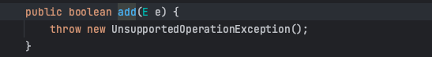

# 1 数组与集合的区别

## 1.1 数组

1. 数组长度开始时必须指定，而且一旦指定，不能更改
2. 保存的必须为同一类型（基本类型/引用类型）的元素
3. 使用数组进行增加/删除元素的代码比较复杂

> 数组扩容，不灵活，比较麻烦，实例如下:

`（见代码 com.hspedu.collection_.ArrayExample ）`

## 1.2 集合

1. 集合不仅可以用来存储不同类型（不加泛型时）不同数量的对象，还可以保存具有映射关系的数据
2. 集合是可以动态扩展容量，可以根据需要动态改变大小
3. 集合提供了更多的成员方法，能满足更多的需求

# 2 Java集合

## 2.1 Java集合框架体系

> 详细


> 简略


> 类型简单介绍

- `List`: 存储的元素是**有序**的、**可重复**的
- `Set`: 存储的元素是**无序**的、**不可重复**的
- `Queue`: 按特定的排队规则来确定先后顺序，存储的元素是**有序**的、**可重复**的
- `Map`: 使用键值对（key-value）存储，key 是无序的、不可重复的，value 是无序的、可重复的，每个键最多映射到一个值

> 简单总结

集合主要是分了两组（`单列集合`和`双列集合`），单列集合表明在集合里放的是单个元素，双列集合往往是键值对形式（key-value）

## 2.2 Collection

```ceylon
Collection 是集合类中的单列集合。他是所有单列集合的父接口。Collection的子接口有List接口和Set接口。这意味着所有的单列集合类都是继承了这个接口。它定义了一些集合共有的基本方法，如添加、删除、查询和遍历元素等方法`
```

> Iterator迭代器

1. Iterator对象称为迭代器，用于遍历Collection集合中的元素
2. 所有实现了Collection接口的集合类都有一个Iterator()方法，用以返回一个实现了Iterator接口的对象，即可以返回一个迭代器
3. Iterator仅用于遍历集合，Iterator本身并不存放对象

> 下面对Collection定义的方法进行说明

**Collection** 是集合容器的顶级接口，他继承了**Iterable 接口**，即凡是 Collection 的实现类都可以迭代，List 也是 Collection 的子接口，因此也拥有此特性。

可以看到， Collection 接口提供了十九个抽象方法，这些方法的命名都很直观的反应的这些方法的功能。通过这些方法规定了 Collection的实现类的一些基本特性：**可迭代，可转化为数组，可对节点进行添加删除，集合间可以合并或者互相过滤，可以使用 Stream 进行流式处理。**

> **1.抽象方法**

我们可以根据功能简单的分类介绍一下 Collection 接口提供的方法

```java
/** 判断类：*/
isEmpty();    //判断集合是否不含有任何元素；
contains();   //判断集合中是否含有至少一个对应元素；
containsAll();//判断集合中是否含另一个集合的所有元素；
```

```java
/** 操作类：*/
add();       //让集合包含此元素。如果因为除了已经包含了此元素以外的任何情况而不能添加，则必须抛出异常；
addAll();    //将指定集合中的所有元素添加到本集合；
remove();    //从集合移除指定元素；
removeAll(); //删除也包含在指定集合中的所有此集合的元素；
retainAll;   //从此集合中删除所有未包含在指定集合中的元素；
clear();     //从集合中删除所有元素；
```

```java
/** 辅助类：*/
size();     //获取集合的长度。如果长度超过 Integer.MAX_VALU 就返回 Integer.MAX_VALU；
iterator(); //获取集合的迭代器；
toArray();  //返回一个包含此集合中所有元素的新数组实例。因为是新实例，所以对原数组的操作不会影响新数组；
toArray(T[] a); //跟上面是重载，方法参数为T[]，此时调用 toArray()会将内部数组中的元素全部放入指定数组，如果结束后指定数组还有剩余空间，那剩余空间都放入null。
```

> **2.JDK8 新增抽象方法**

```java
/** 此外，在 JDK8 中新增了四个抽象方法，他们都提供了默认实现：*/
removeIf();       //相当于一个filter()，根据传入的函数接口的匿名实现类方法来判断是否要删除集合中的某些元素；
stream();         //JDK8 新特性中流式编程的灵魂方法，可以将集合转为 Stream 流式进行遍历，配合 Lambda 实现函数式编程；
parallelStream(); //同 stream() ，但是是生成并行流；
spliterator();    //重写了 Iterable 接口的 iterator()方法
```

> **3.equals 和 hashCode**

```java
值得一提的是 Collection 还重写了 Object 的 equals() 和 hashCode() 方法（或者说变成了抽象方法？），这样实现 Collection 的类就必须重新实现 equals() 和 hashCode() 方法。
```

### 2.2.1 List

```ceylon
List 接口是 Collection 接口的子接口，常用的List实现类有 ArrayList、Vector、LinkedList
```

- List集合类中元素有序(即添加顺序和取出顺序一致)、且可重复
- List集合中的每个元素都有其对应的顺序索引，即支持索引
- List集合可以添加任意元素，**包括null**，并且**可以添加多个**

> > **List特有方法**
>
> List继承了Collection，大部分方法与Collection重复，这里列举List特有方法
>
> ```java
> /** 操作类：*/
> add(int index, E element)；                    // 指定索引添加元素
> addAll(int index, Collection<? extends E> c);  // 根据索引插入集合
> remove(int index);                             // 指定索引删除元素
> set(int index, E element);                     // 替换指定索引的元素
> get(int index);                                // 指定索引获取元素
> indexOf(Object o);                             // 返回指定元素在此列表中第一次出现的索引
> int lastIndexOf(Object o);                     // 返回指定元素在此列表中最后一次出现的索引
> 
> ListIterator<E> listIterator();                // 返回一个增强的迭代器【2.2.1.4 ListIterator】
> ListIterator<E> listIterator(int index);       // 返回一个增强的迭代器(指定的索引后面的迭代器)
> List<E> subList(int fromIndex, int toIndex);   // 可以根据区间获取一个集合对象视图
> ```
>
> ```java
> /** default默认方法 暂时不研究，后面遇到再回头研究*/
> default void replaceAll(UnaryOperator<E> operator)
> default void sort(Comparator<? super E> c)
> default Spliterator<E> spliterator()
> ```

#### 2.2.1.1 ArrayList

> （一）ArrayList的底层实现

ArrayList底层维护了一个**Object类型的数组**，所以ArrayList里面可以存放**任意类型**的元素，**transient表示该属性不会被序列化**

**size变量**用来保存当前数组中已经添加了多少元素


> （二）ArrayList的扩容机制（面试题）

1.1 当new ArrayList对象时，如果使用的是**无参构造器**，则初始elementData**容量为0**


1.2 **第1次**添加，则扩容**elementData为10**


1.3 如需要再次扩容，则扩容elementData为1.5倍（如果是奇数的话会丢掉小数，下同），比如容量为10，当添加到第11个元素时，会触发扩容机制，扩容大小为原先1.5倍，即 10 * 1.5 = 15，当元素加到第16个时，会再次扩容原大小1.5倍，即 15 * 1.5 = 22，一直按照这个规律扩容


2.1 如果使用的是**有参构造器**，则初始elementData**容量为初始长度**，比如 ArrayList list1 = new ArrayList(3);，那么初始长度为3，后续也是按照1.5倍来扩容，比如添加到第4个元素时，扩容 3 * 1.5 = 4，当再次添加到第6个元素时，扩容 4 * 1.5 = 6，一直按照这个规律扩容

> 底层分析得出结论

1. ArrayList是由`数组`来实现数据存储的
2. ArrayList中维护了一个Object类型的`数组elementData`
3. 依上所以ArrayList可以存放任意类型的元素甚至是`空元素`，可以放入多个空值
4. transient Object[] elementData  //transient关键字表示该属性不会被序列化
5. 当创建ArrayList对象时，如果使用的是无参构造器，则初始elementData容量是0，第1次添加，则扩容elementData为10,如需再次扩容，则扩容elementData为1.5倍
6. 如果使用的是指定大小的构造器，则初始elementData容量为指定大小，如果需要扩容，则直接扩容elementData为1.5倍
7. **ArrayList是线程不安全**(执行效率高)，在`多线程`下，不建议用ArrayList

> 安全隐患一

```java
在多个线程进行add操作时可能会导致elementData数组越界。

假设某一时刻集合里已经有9个元素，即size=9，集合容量此时为10
线程A开始进入add方法，这时它获取到size的值为9，调用ensureCapacityInternal方法进行容量判断。
线程B此时也进入add方法，它获取到size的值也为9，也开始调用ensureCapacityInternal方法。
线程A发现需求大小为10，而elementData的大小就为10，可以容纳。于是它不再扩容，返回。
线程B也发现需求大小为10，也可以容纳，返回。
线程A开始进行设置值操作， elementData[size++] = e 操作。此时size变为10。
线程B也开始进行设置值操作，它尝试设置elementData[10] = e，而elementData没有进行过扩容，它的下标最大为9。于是此时会报出一个数组越界的异常ArrayIndexOutOfBoundsException.
  
// 说明：后面的源码没有了 ensureCapacityInternal等方法，只需要理解思路即可
```

> 安全隐患二

```java
另外第二步 elementData[size++] = e 设置值的操作同样会导致线程不安全。从这儿可以看出，这步操作也不是一个原子操作，它由如下两步操作构成：

elementData[size] = e;
size = size + 1;
在单线程执行这两条代码时没有任何问题，但是当多线程环境下执行时，可能就会发生一个线程的值覆盖另一个线程添加的值，具体逻辑如下：

列表大小为0，即size=0
线程A开始添加一个元素，值为A。此时它执行第一条操作，将A放在了elementData下标为0的位置上。
接着线程B刚好也要开始添加一个值为B的元素，且走到了第一步操作。此时线程B获取到size的值依然为0，于是它将B也放在了elementData下标为0的位置上。
线程A开始将size的值增加为1
线程B开始将size的值增加为2
这样线程AB执行完毕后，理想中情况为size为2，elementData下标0的位置为A，下标1的位置为B。而实际情况变成了size为2，elementData下标为0的位置变成了B，下标1的位置上什么都没有。并且后续除非使用set方法修改此位置的值，否则将一直为null，因为size为2，添加元素时会从下标为2的位置上开始。
  
// 说明：上面描述可能与现在的源码有出入，只需要理解思路即可
```

#### 2.2.1.2 Vector

Vector的add方法加上了synchronized锁，任何时刻至多只能有一个线程访问该方法，所以Vector是线程安全的

> （一）Vector的底层实现（和ArrayList很多相似）

Vector底层也维护了一个**Object类型的数组**

> （二）Vector的扩容机制

- 如果是无参，初始elementData容量为10，默认10满后，就按2倍扩容
- 如果指定大小，则每次直接按2倍扩容


> Vector和ArrayList的区别（面试题）

|           | 底层结构 | 版本   | 线程安全（同步）效率 | 扩容倍数                                                     |
| --------- | -------- | ------ | -------------------- | ------------------------------------------------------------ |
| ArrayList | 可变数组 | jdk1.2 | 不安全，效率高       | 如果有参构造，每次1.5倍扩；如果无参：1)第一次默认10; 2)从第二次开始按1.5倍扩 |
| Vector    | 可变数组 | jdk1.0 | 安全，效率不高       | 如果有参构造，每次2倍扩；如果无参：1)第一次默认10; 2)从第二次开始按2倍扩 |

#### 2.2.1.3 LinkedList 

```ceylon
LinkedList 同时实现了 List 接口和 Deque 接口，也就是说它既可以看作一个顺序容器，又可以看作一个队列（Queue）。但 LinkedList 是采用链表结构的方式来实现List接口的，因此在进行insert和remove动作时效率要比ArrayList高。LinkedList 是不同步的，也就是不保证线程安全
```

> LinkedList的底层实现

1. LinkedList中维护了一个**双向链表**，两个属性 **first** 和 **last** 分别指向 首节点和尾节点
2. 每个节点 (Node对象)，里面又维护了**prev、next、item**三个属性，其中通过prev指向前一个，通过next指向后一个节点，最终实现双向链表

> 源码分析（看Java基础笔记-静态局部内部类的使用场景）

LinkedList list1 = new LinkedList(); 调用**无参构造器**，此时没有做任何操作，这时 LinkedList 的属性 Node<E> first = null;  Node<E> last = null; 


list1.add("1"); 调用add添加的方法


第一次add后，效果如下：


第二次add后，效果如下：


> 自画内存图


> Arraylist 与 LinkedList 的区别（面试题）

1. **底层数据结构：** Arraylist 底层使用的是 **Object 数组**；LinkedList 底层使用的是**双向链表** 数据结构

2. **是否支持快速随机访问：**LinkedList 不支持高效的随机元素访问，而 ArrayList 支持。快速随机访问就是通过元素的序号快速获取元素对象(对应于get(int index)方法)。

3. **插入和删除是否受元素位置的影响**：

   ArrayList 采用数组存储，所以插入和删除元素的时间复杂度受元素位置的影响。

   LinkedList 采用链表存储，所以对于add(E e)方法的插入，删除元素时间复杂度不受元素位置的影响，近似 O(1)，如果是要在指定位置i插入和删除元素的话（(add(int index, E element)） 时间复杂度近似为o(n))因为需要先移动到指定位置再插入。

```ceylon
补充：项目中很少使用到 LinkedList (基本没有)，需要用到 LinkedList 的场景几乎都可以使用 ArrayList 来代替，并且性能通常会更好，即便是在元素增删的场景下，因为LinkedList 仅仅在头尾插入或者删除元素的时候时间复杂度近似 O(1)，其他情况增删元素的时间复杂度都是 O(n)
```

#### 2.2.1.4 ListIterator

 是Java 集合框架中的一个接口，它是**Iterator接口的子接口**，专门用于遍历 List 集合。与普通的迭代器相比， ListIterator提供了更多的功能，例如双向遍历、修改元素等。下面是对 ListIterator 的一些详细解释：

> 这里列举ListIterator特有方法

```java
/* 逆向遍历两个方法，和正向遍历 hasNext()、next()反过来 */
hasPrevious();   // 判断是否存在上一个元素
previous();      // 获取上一个元素

/* 游标位置 */
int nextIndex();      // 返回下一个元素的索引  在 AbstractList抽象类lastIndexOf方法中用到
int previousIndex();  // 返回上一个元素的索引  在 AbstractList抽象类indexOf方法中用到

/* 新增和修改元素 */
void add(E e);        //新增元素
void set(E e);        //替换元素
```

#### 2.2.1.5 AbstractList

**AbstractList继承AbstractCollection**，实现List接口，它相当于在 AbstractCollection 后的第二层方法模板。是对 List 接口的初步实现，同时也是 Collection 的进一步实现，因此除了具有集合的方法属性外，还具有固定顺序，以及索引特征。
AbstractList源码中包含了**四个类Itr ，ListItr，SubList，RandomAccessSubList**，分别来支持迭代和获取子列表

> 位置图


> 下面介绍 AbstractList 实现的方法

```java
/* AbstractList特有方法 */
removeRange(int fromIndex, int toIndex);   // 移除[fromIndex,toIndex)里的元素
```

> 1.**add/addAll**

add在 AbstractList 依然没有实现，是直接抛出的异常，add留给它的子类实现

```java
/* add */ 
public boolean add(E e) {
    add(size(), e);
    return true;
}
/* addAll */ 
public boolean addAll(int index, Collection<? extends E> c) {
    rangeCheckForAdd(index);
    boolean modified = false;
    for (E e : c) {
        add(index++, e);
        modified = true;
    }
    return modified;
}
/* 重载add */
public void add(int index, E element) {
    throw new UnsupportedOperationException();
}
```

> 2.**indexOf**

返回第一个元素出现的索引位置

```java
public int indexOf(Object o) {
    ListIterator<E> it = listIterator();
    if (o==null) {
        while (it.hasNext())
            if (it.next()==null)
                return it.previousIndex();
    } else {
        while (it.hasNext())
            if (o.equals(it.next()))
                return it.previousIndex();
    }
    return -1;
}
```

> 3.**lastIndexOf**

 返回最后一个元素出现的索引位置

```java
public int lastIndexOf(Object o) {
    ListIterator<E> it = listIterator(size());
    if (o==null) {
        while (it.hasPrevious())
            if (it.previous()==null)
                return it.nextIndex();
    } else {
        while (it.hasPrevious())
            if (o.equals(it.previous()))
                return it.nextIndex();
    }
    return -1;
}
```

> 4.**listIterator**

 返回一个增强的迭代器(指定的索引后面所有元素的迭代器)

```java
public ListIterator<E> listIterator(final int index) {
    rangeCheckForAdd(index);
    return new ListItr(index);
}
```

> 5.**removeRange**

 返回一个增强的迭代器(指定索引范围的迭代器)

```java
protected void removeRange(int fromIndex, int toIndex) {
    ListIterator<E> it = listIterator(fromIndex);
    for (int i=0, n=toIndex-fromIndex; i<n; i++) {
        it.next();
        it.remove();
    }
}
```

> 6.**clear**

 清空元素，AbstractList的实现跟AbstractCollection的实现不一样，AbstractList使用的List专门的ListIterator迭代器，AbstractCollection使用的通用Iterator迭代器

```java
public void clear() {
    removeRange(0, size());
}
```

> 7.**iterator**

 获取通用Iterator迭代器

```java
public Iterator<E> iterator() {
    return new Itr();
}
```

> 8.**listIterator**

 获取List专门的ListIterator迭代器

```java
/* 重载无参 */
public ListIterator<E> listIterator() {
    return listIterator(0);
}
/* 重载有参 */
public ListIterator<E> listIterator(final int index) {
    rangeCheckForAdd(index);
    return new ListItr(index);
}
```

> 9.**subList**

 根据传入区间获取当前集合的区间视图对象，注意修改视图也会影响原来的数组，因为看【**2.2.1.5.3 SubList**】实际是指向同一个引用（这里还涉及RandomAccessSubList类，可以看【**2.2.1.5.4 RandomAccessSubList**】）

```java
// 因为当前是AbstractList类，所以它不知道调用这个方法到底是什么List类型，ArrayList（实现了RandomAccess，for普通循环效率更高，迭代器效率低）、LinkedList（未实现RandomAccess，迭代循环效率更高，for普通循环效率低）还是其它来调用的，但是返回结果又要让调用者能区分，这样不管哪种来调用，都能用上最高效的循环方式，因此会根据不同返回不同的类型
public List<E> subList(int fromIndex, int toIndex) {
    return (this instanceof RandomAccess ?                        
            new RandomAccessSubList<>(this, fromIndex, toIndex) :
            new SubList<>(this, fromIndex, toIndex));
}
```

解释说明那么上面subList方法返回**RandomAccessSubList**或者**SubList**怎么运用呢？比如下面例子：

```java
//伪代码：
ArrayList a = new ArrayList();   // ArrayList实现了标识接口 RandomAccess
List list1 = a.subList(1,2); // 此时调用方法时，返回就是RandomAccessSubList，所以 list1的运行类型就 RandomAccessSubList
if(list1 instanceof RandomAccess){
   // 知道是可支持随机方法的，所以使用普通for循环遍历list1更加高效（依然可以用迭代器）
   for(int i = 0; i < list1.length; i++; ){
     
   }
}else{
  // 不支持随机方法的，比如LinkedList，所以使用迭代器遍历更加高效（依然可以使用for循环）
   
}
```

> 10.**equals**

 比较两个List是否相等

```java
/*
译：将指定对象与此列表进行比较是否相等。当且仅当指定对象也是一个列表，两个列表具有相同的大小，并且两个列表中所有对应的元素对相等时返回true。两个元素e1和e2相等，如果(e1==null ?E2 ==null: e1.equals(E2))。换句话说，如果两个列表以相同的顺序包含相同的元素，则定义为相等。
这个实现首先检查指定的对象是否是这个列表。如果是，则返回true;如果不是，则检查指定的对象是否为列表。如果不是，则返回false;如果是，则遍历两个列表，比较对应的元素对。如果任何比较返回false，则此方法返回false。如果其中一个迭代器的元素在另一个迭代器之前耗尽，则返回false(因为列表的长度不等);否则在迭代完成时返回true
*/
public boolean equals(Object o) {
    if (o == this)
        return true;
    if (!(o instanceof List))
        return false;
    ListIterator<E> e1 = listIterator();
    ListIterator<?> e2 = ((List<?>) o).listIterator();
    while (e1.hasNext() && e2.hasNext()) {
        E o1 = e1.next();
        Object o2 = e2.next();
        if (!(o1==null ? o2==null : o1.equals(o2)))
            return false;
    }
    return !(e1.hasNext() || e2.hasNext());
}
```

> 11.**hashCode**

 获取hashCode

```java
public int hashCode() {
    int hashCode = 1;
    for (E e : this)
        hashCode = 31*hashCode + (e==null ? 0 : e.hashCode());
    return hashCode;
}
```


****

##### 2.2.1.5.1 Itr

AbstractList的成员内部类，Itr为AbstractList提供服务，**Itr**是**Iterator**的实现类

```java
private class Itr implements Iterator<E> {
    /**
     * Index of element to be returned by subsequent call to next.
     */
    int cursor = 0;
    /**
     * Index of element returned by most recent call to next or
     * previous.  Reset to -1 if this element is deleted by a call
     * to remove.
     */
    int lastRet = -1;
    /**
     * The modCount value that the iterator believes that the backing
     * List should have.  If this expectation is violated, the iterator
     * has detected concurrent modification.
     */
    int expectedModCount = modCount;
    public boolean hasNext() {
        return cursor != size();
    }
    public E next() {
        checkForComodification();
        try {
            int i = cursor;
            E next = get(i);
            lastRet = i;
            cursor = i + 1;
            return next;
        } catch (IndexOutOfBoundsException e) {
            checkForComodification();
            throw new NoSuchElementException();
        }
    }
    public void remove() {
        if (lastRet < 0)
            throw new IllegalStateException();
        checkForComodification();
        try {
            AbstractList.this.remove(lastRet);
            if (lastRet < cursor)
                cursor--;
            lastRet = -1;
            expectedModCount = modCount;
        } catch (IndexOutOfBoundsException e) {
            throw new ConcurrentModificationException();
        }
    }
    final void checkForComodification() {
        if (modCount != expectedModCount)
            throw new ConcurrentModificationException();
    }
}
```

##### 2.2.1.5.2 ListItr

AbstractList的成员内部类，ListItr为AbstractList提供服务，**ListItr**是**ListIterator**的实现类，**ListIterator**继承了**Iterator**

```java
private class ListItr extends Itr implements ListIterator<E> {
    ListItr(int index) {
        cursor = index;
    }
    public boolean hasPrevious() {
        return cursor != 0;
    }
    public E previous() {
        checkForComodification();
        try {
            int i = cursor - 1;
            E previous = get(i);
            lastRet = cursor = i;
            return previous;
        } catch (IndexOutOfBoundsException e) {
            checkForComodification();
            throw new NoSuchElementException();
        }
    }
    public int nextIndex() {
        return cursor;
    }
    public int previousIndex() {
        return cursor-1;
    }
    public void set(E e) {
        if (lastRet < 0)
            throw new IllegalStateException();
        checkForComodification();
        try {
            AbstractList.this.set(lastRet, e);
            expectedModCount = modCount;
        } catch (IndexOutOfBoundsException ex) {
            throw new ConcurrentModificationException();
        }
    }
    public void add(E e) {
        checkForComodification();
        try {
            int i = cursor;
            AbstractList.this.add(i, e);
            lastRet = -1;
            cursor = i + 1;
            expectedModCount = modCount;
        } catch (IndexOutOfBoundsException ex) {
            throw new ConcurrentModificationException();
        }
    }
}
```

##### 2.2.1.5.3 SubList

Sublist可以简单理解是子List，这个SubList是在AbstractList中定义的，因此只能是包内可见，我们在外面没办法直接访问。

我们可以简单的把 **SubList 和 AbstractList 理解为装饰器模式的一种实现**，就像 SynchronizedList 和 List 接口的实现类一样。SubList 内部类通过对 AbstractList 的方法进行了再一次的封装，把对 AbstractList 的操作转变为了对 “视图的操作”，**SubList的构造方法中引用原list，对SubList的增删肯定会影响原list的数据**

```java
class SubList<E> extends AbstractList<E> {
    private final AbstractList<E> l;    // 把外部其它类AbstractList作为成员变量
    private final int offset;           // 表示视图的起始位置（偏移量）
    private int size;                   // SubList视图的长度
    SubList(AbstractList<E> list, int fromIndex, int toIndex) {
        if (fromIndex < 0)
            throw new IndexOutOfBoundsException("fromIndex = " + fromIndex);
        if (toIndex > list.size())
            throw new IndexOutOfBoundsException("toIndex = " + toIndex);
        if (fromIndex > toIndex)
            throw new IllegalArgumentException("fromIndex(" + fromIndex +
                                               ") > toIndex(" + toIndex + ")");
        l = list;   // 这也是为什么操作视图或者外部类都会影响对方的原因，因为都操作内存中的同一个实例
        offset = fromIndex;  // 获取当前视图在外部其它类AbstractList中的起始下标
        size = toIndex - fromIndex;  // 当前视图的长度就是外部其它类AbstractList中截取的视图长度
        this.modCount = l.modCount;
    }
    public E set(int index, E element) {
        rangeCheck(index);
        checkForComodification();
        return l.set(index+offset, element);
    }
    public E get(int index) {
        rangeCheck(index);
        checkForComodification();
        return l.get(index+offset);
    }
    public int size() {
        checkForComodification();
        return size;
    }
    public void add(int index, E element) {
        rangeCheckForAdd(index);
        checkForComodification();
        l.add(index+offset, element);
        this.modCount = l.modCount;
        size++;
    }
    public E remove(int index) {
        rangeCheck(index);
        checkForComodification();
        E result = l.remove(index+offset);
        this.modCount = l.modCount;
        size--;
        return result;
    }
    protected void removeRange(int fromIndex, int toIndex) {
        checkForComodification();
        l.removeRange(fromIndex+offset, toIndex+offset);
        this.modCount = l.modCount;
        size -= (toIndex-fromIndex);
    }
    public boolean addAll(Collection<? extends E> c) {
        return addAll(size, c);
    }
    public boolean addAll(int index, Collection<? extends E> c) {
        rangeCheckForAdd(index);
        int cSize = c.size();
        if (cSize==0)
            return false;
        checkForComodification();
        l.addAll(offset+index, c);
        this.modCount = l.modCount;
        size += cSize;
        return true;
    }
    public Iterator<E> iterator() {
        return listIterator();
    }
    public ListIterator<E> listIterator(final int index) {
        checkForComodification();
        rangeCheckForAdd(index);
        return new ListIterator<E>() {
            private final ListIterator<E> i = l.listIterator(index+offset);
            public boolean hasNext() {
                return nextIndex() < size;
            }
            public E next() {
                if (hasNext())
                    return i.next();
                else
                    throw new NoSuchElementException();
            }
            public boolean hasPrevious() {
                return previousIndex() >= 0;
            }
            public E previous() {
                if (hasPrevious())
                    return i.previous();
                else
                    throw new NoSuchElementException();
            }
            public int nextIndex() {
                return i.nextIndex() - offset;
            }
            public int previousIndex() {
                return i.previousIndex() - offset;
            }
            public void remove() {
                i.remove();
                SubList.this.modCount = l.modCount;
                size--;
            }
            public void set(E e) {
                i.set(e);
            }
            public void add(E e) {
                i.add(e);
                SubList.this.modCount = l.modCount;
                size++;
            }
        };
    }
    public List<E> subList(int fromIndex, int toIndex) {
        return new SubList<>(this, fromIndex, toIndex);
    }
    private void rangeCheck(int index) {
        if (index < 0 || index >= size)
            throw new IndexOutOfBoundsException(outOfBoundsMsg(index));
    }
    private void rangeCheckForAdd(int index) {
        if (index < 0 || index > size)
            throw new IndexOutOfBoundsException(outOfBoundsMsg(index));
    }
    private String outOfBoundsMsg(int index) {
        return "Index: "+index+", Size: "+size;
    }
    private void checkForComodification() {
        if (this.modCount != l.modCount)
            throw new ConcurrentModificationException();
    }
}
```

> 简单演示

```java
List one = new ArrayList();
one.add("1");
one.add("2");
one.add("3");
one.add("4");
System.out.println(one);                  // [1, 2, 3, 4]
System.out.println(one.getClass());       // class java.util.ArrayList
List two = one.subList(1, 3);             
System.out.println(two);                  // [2, 3]
System.out.println(two.getClass());       // class java.util.ArrayList$SubList
two.set(0,"a");
System.out.println(two);                  // [a, 3]
System.out.println(one);                  // [1, a, 3, 4]
List three = two.subList(1, 2);
System.out.println(three);                // [3]
System.out.println(three.getClass());     // class java.util.ArrayList$SubList
three.set(0,"b"); 
System.out.println(three);                // [b]
System.out.println(two);                  // [a, b]
System.out.println(one);                  // [1, a, b, 4]
```

##### 2.2.1.5.4 RandomAccessSubList

定义在AbstractList.java的外部类，**支持随机访问**，我们可以看见，他实际上还是 SubList，但是实现了 RandomAccess 接口。关于这个接口，其实只是一个标记，实现了该接口的类可以实现快速随机访问（下标），通过 for 循环+下标取值会比用迭代器更快

```java
class RandomAccessSubList<E> extends SubList<E> implements RandomAccess {
    RandomAccessSubList(AbstractList<E> list, int fromIndex, int toIndex) {
        super(list, fromIndex, toIndex);
    }
    public List<E> subList(int fromIndex, int toIndex) {
        return new RandomAccessSubList<>(this, fromIndex, toIndex);
    }
}
```


****

### 2.2.2 Sets

```ceylon
Set 接口是 Collection 接口的子接口，常用的Set实现类有 HashSet、TreeSet、LinkedHashSet
```

- Set集合无序 (添加和取出的顺序不一致)
- Set集合不允许重复元素
- Set集合没有索引，不能使用索引的方式来获取元素
- 可以添加一个null

###### 2.2.2.1 HashSet

- HashSet底层实际上是HashMap
- HashSet不保证元素是有序的，取决于hash后，再确认索引的位置


> 小试牛刀

```java
Set hashSet = new HashSet();
hashSet.add("jack");
hashSet.add("Wing");
hashSet.add("Li");
hashSet.add("jack"); // 不能添加
hashSet.add(new Person("tom"));
hashSet.add(new Person("tom")); 
// 经典面试题
hashSet.add(new String("wsy")); 
hashSet.add(new String("wsy")); // 不能添加
System.out.println(hashSet);

[com.hspedu.list_.Person@5ed828d, Wing, com.hspedu.list_.Person@371a67ec, wsy, Li, jack]
// 根据上面的输出结果，引出下面的问题：HashSet 如何确定元素是否重复。
```

> 简单模拟HashSet

```java
/* 结点，存储数据，可以指向下一个结点 */
class Node{
    Object item;// 存放数据
    Node next; // 指向下一个结点
    public Node(Object item, Node next) {
        this.item = item;
        this.next = next;
    }
}
 // 模拟一个HashSet的底层(其实就是HashMap)
 // 创建一个Node数组,有些人称为table
 Node[] table = new Node[16];
 //1.把john放在2的位置
 Node jhon = new Node("Jhon",null);
 table[2] = jhon;
 //2.将jack挂载到johj后边
 Node jack = new Node("Jack", null);
 jhon.next = jack;
 //3.继续把Rose挂载到Jack后面
 Node rose = new Node("Rose", null);
 jack.next = rose;
 //4.把Lucy放到table表索引为3的位置
 Node lucy = new Node("Lucy", null);
 table[3] = lucy;
 System.out.println("完成");
```


** **

**问题引入：**HashSet 不能添加相同的元素/数据，它是以什么为判断依据的？（面试题）

> **HashSet 的底层实现**

**HashSet** 的底层是 **HashMap，HashMap**的底层是**(数组+链表（单向）+红黑树)**

1. `第一步`：添加一个元素时，通过哈希函数得到**hash值**，通过**((n - 1) & hash)** 将hash值转成**索引值**（n是数组长度）。HashMap没有简单的直接通过对 **数组长度取模% 来散列**，它是用了**位与运算**，用hash值跟数组大小n减一做&。这种算法同样能达到取模那种效果，而且二进制的位运算，**速度快**
2. `第二步`：根据第一步得到的**索引值**找到存储数据表**table**（数组），看这个索引位置是否已经存放了元素
3. `第三步`：如果没有存放，则直接添加
4. `第四步`：如果存放了，就跟当前索引下存储的多个元素挨个调用 **equals()** 比较（实际还会先经过hash值和地址的比较，都不成立才进行最后的equals比较），如果相同，就放弃添加，如果都不相同，则添加到最后
5. `第五步`：在 **java8** 中，如果一条链表的元素个数超过 **TREEIFY_THRESHOLD（默认是8）**，**并且 table 的大小 >= MIN_TREEIFY_CAPACITY（默认是64），就会进行树化(红黑树)。如果当前数组的长度小于 64，那么会选择先进行数组扩容，而不是转换为红黑树**

> 为什么要设计成这样的数组+链表+红黑树存储方式呢？

```ceylon
因为，如果单使用数组或者链表的方式，将来数据越来越多，读取或者新增效率会越来越低，所以设计者使用了“数组+链表+红黑树”的结构，大大提高了效率
```

** **

> HashSet 源码解读

> 1.main方法debug语句

```java
HashSet hashSet = new HashSet();
hashSet.add("java");
hashSet.add("php");
hashSet.add("java");
```

** **

> 2.无参构造器

```java
HashSet hashSet = new HashSet();
```


**源码解读**：

1. HashSet无参构造器实际是创建了一个HashMap的对象实例，所以HashSet底层就是一个HashMap

** **

> 3.第一次调用add方法分析

```java
hashSet.add("java");
```


**源码解读**：

1. `e`：添加的元素，这里是"java"字符串常量
2. **PRESENT**其实是一个静态对象，没什么意义，只是起到占位的作用，因为HashMap是一个**Key-Value**结构的， **HashSet需要用它来充当所有Key的Value**

** **

> 3.1 put方法解读


**源码解读**：

1. `key`：添加的元素；`value`：占位符 **PRESENT**
2. **putVal方法**需要传入**hash(key)**，所以先进去**hash方法**看执行了什么操作（下面3.2）

3. 看完下面hash方法解读后，继续回到这里解读
4. 下一步研究**putVal方法**，看下面 3.3putVal方法解读

** **

> 3.2 hash方法解读


**源码解读**：

1. `key`：添加的元素；`h`：临时变量
2.  **key == null **则返回**hash值为0**
3. **hashCode方法**是每个对象都有的，如果没有重写hashCode方法，默认都是使用的**Object类的hashCode方法**
4. **^ 是按位异或，>>>是算术右移** 。将生成的hashcode值的高16位于低16位进行异或运算，这样得到的值再与(数组长度-1)进行**相与操作**[在后面的**putVal方法**里]，**可以得到最散列的下标值**。这里得到**hash值**后我们返回去**3.1put方法**【这里的算法目的是尽量得到不重复的hash值，避免hash碰撞】
5. 已经计算出`hash`并return，现回到 `3.1 put方法解读 第4点`

** **

> 3.3 putVal方法解读（本次只分析第一次执行add方法执行流程）


**源码解读**：

1. `hash`：上面**hash方法**计算得到的**hash值**（注意这里的hash值不等价于hashCode）
2. `key`：添加的元素；`value`：占位符 **PRESENT**
3. `tab`、`p`、`n`、`i` 都是一些辅助变量
4. `table`就是上面提到的数组（看上面**HashSet 的底层实现的第二步**），其本质就是HashMap的一个属性数组，存储类型是**Node**
5. `624行`：将`table`赋给`tab`，然后判断`tab`是否等于null，如果不为null，就继续把`tab`的长度赋给`n`，继续判断`n`是否等于0
6. 第一次add，`table`为null，会进入 `625行`
7. `625行`：执行`resize方法`，并将返回值赋给`tab`，并计算`tab`长度赋给`n`
8. 看完下面`3.4 resize方法`解读后，继续回到这里解读
9. 回到`625行`resize方法已经创建了大小为16的数组，`table`指向该数组，辅助变量 `n` 值为16
10. `626行`：**(数组长度-1)**与hash值进行**相与操作**得到**索引值**（就是当前添加的这个元素要放到哪个索引位置），先获取该索引的元素赋给辅助变量`p`，判断当前索引**是否有元素**，**如果没有，直接进入if 进行添加**
11. `627行`：创建一个Node对象，并把hash也保存到Node对象，为什么要保存hash呢？**因为将来继续添加元素，如果放到同一个索引下，那要挨个判断是否与该索引下的所有元素的hash值相等...未完，待补充**
12. 第一次add添加元素，不会进入`628行`else，直接到`657行`，`++modCount`代表修改了一次; `658行`判断是否超过临界值，超过就扩容，第一次add不满足，则执行`660行`，`afterNodeInsertion`在这里其实是一个空方法（HashMap为什么要留空方法呢？实际上是给它的子类进行重写调用的，类似于**钩子函数**），最终添加成功，执行`661行`返回null（所以**返回了null表示添加成功**）
13. 回到`608行`继续return
14. 回到`220行`成功为null，所以add最终return **true**
15. **第一次add添加操作到此分析完毕！**

** **

> 3.4 resize方法解读


**源码解读**：

1. 进入**resize()扩容方法** **重点分析一下，我们在这里先只看它的上半段，**因为旧数组不为空才能进入下半段**，**很明显第一次add不符合这个条件，后面**借助另一个程序再来分析下半段**
2. `674～675行`：先将成员属性`table`赋给 `oldTab`，再将 `oldTab` 的长度赋给 `oldCap`【临时变量说明：**oldTab**：旧数组；**oldCap**：旧数组长度；**oldThr**：旧数组的扩容临界值；**newCap**：新数组长度；**newThr**：新数组的扩容临界值；】
3. 根据判断，第一次add会进入 `690行`
4. `690行`：将默认值`DEFAULT_INITIAL_CAPACITY（默认值16）`赋给`newCap`，第一次add数组的大小是`默认值 16`
5. `691行`：将加载因子`DEFAULT_LOAD_FACTOR(值为0.75)`乘于默认值`DEFAULT_INITIAL_CAPACITY`后赋给`newThr`，计算结果为12（**12就是临界值**，当后续添加元素到13时，就进行扩容，而不是加满到16才进行扩容）
6. `698行`：将计算得到最新的扩容值`newThr`的值12赋给属性`threshold`（threshold才是真正保存扩容值的变量，其他都是临时辅助变量）
7. `700~701行`：创建了一个长度为16的数组赋给`newTab`;然后继续赋给了`table`【到这一步初始的数组已经创建完成，长度16，数组里的内容目前都为null】其实执行到这的目的是最终给扩容值`threshold`,`table`类变量赋值。
8. `702行`：`oldTab`是在`674行`赋值的，所以`oldTab`为null，不会进入if，最终返回`newTab`（`newTab`是刚创建的新数组），**resize方法结束**（回到3.3 putVal方法解读的8点）

> 补充说明

- HashMap 的加载因子`DEFAULT_LOAD_FACTOR(值为0.75)`是为了平衡**哈希表**的**性能**和**空间**占用而引入的。当哈希表的元素数量达到容量乘以加载因子时，就会触发扩容操作，将哈希表的容量增加一倍，并重新计算每个元素在新哈希表中的位置
- 加载因子的默认值是 0.75，这个值经过实验得出，可以在时间和空间上取得一个比较好的平衡点。**设置更高的加载因子可以减少哈希表的空间占用，但会增加哈希冲突的概率，导致查找性能下降。相反，设置更低的加载因子可以提高哈希表的查找性能，但会增加空间占用。**

> 第一次add总结

上半段主要是确定新的容量和阈值，并且进行扩容

> 第一次add自画内存图


** **

> 4.第二次调用add方法分析

```java
hashSet.add("php");
```

> 第二次add直接看**putVal方法**


**源码解读**：

1. 有了第一次add的分析，第二次add不一样的元素，比较简单
2. `624行`：table已经在第一次add被创建了长度为16，所以不会进入 `625行`
3. `626行`：计算出来的索引和第一次不一样，所以取出索引元素赋给`p`为空，直接执行`627行`创建新的node节点并添加到索引的位置。
4. 然后执行`657行`后面的语句，最后添加成功返回null


> 5.第三次调用add方法分析

```java
hashSet.add("java");  //注意本次添加跟第一次添加的元素相同
```

> 第三次add直接看**putVal方法**（注意本次添加计算出来的hash值和第一次计算出来的hash值是相同的）


**源码解读**：

1. 本次添加跟第一次添加元素一样，所以`626行`获取到跟第一次相同的索引元素赋给`p`，不满足条件，进入到else语句
2. `630行`：先判断**当前计算的hash值**和**已经存放到这个索引的hash值**是否相同**（不同hash值的元素和数组长度n-1进行与运算，计算结果可能为相同的索引值）**，如果相同，那么继续判断**当前添加的元素是否 == 已经添加的元素**（引用类型比较地址），如果满足那么不用进行后续判断，已经确定是相同的元素。如果上面 == 不满足，那么继续判断**当前添加的元素equals已经添加的元素**是否为true**（equals方法程序员可以重写，比如定义了Person类，重写equals方法，当age和name相同就说明是相同的元素不能重复添加）**，如果为true，说明是同一个元素，无法添加，执行`632行`将 e = p;
3. 如果`630行`结果为false，我们继续分析后续执行流程
4. `633行`：判断当前是否是一颗红黑树，如果是，则执行`634行`**红黑树**的添加逻辑，**putTreeVal方法**逻辑很复杂，本次不研究，等学习了红黑树之后再回过头来研究
5. 假如`633行`不满足，那么执行else语句，**分析else语句主要执行什么逻辑呢？**答：当一个索引下已经保存一个或多个元素形成一个链表时，else就是循环将当前添加的元素与链表所有的元素**进行上面第2步的比较**，只要存在有一个匹配上的，说明是已经存在的元素无法添加，全部不匹配说明可以添加成功，当前添加的元素直接挂在最后一个元素的后面。
6. `639行`：假如元素可以添加，那么元素添加进去之后，立即判断（TREEIFY_THRESHOLD的值为8），当前添加的元素是索引的第九个时，满足条件，会进入 `640行`调用`treeifyBin方法`进行树化。
7. 先简单看下`5.1 treeifyBin方法`，再回来分析
8. 分析完5.1后，继续执行`649行`，只要匹配到了`649行`条件成立，否则都不会执行
9. **到这HashSet全部解读完毕！**
10. 如果想看扩容和树化的效果，可以自定义一个类，重写hashCode和equels方法来添加进行尝试

** **

> 5.1 treeifyBin


**源码解读**：

1. `753行`：**判断当前tab数组的长度是否小于 64 ，如果小于64，即使同一个索引的链表已经有9个元素了，依然不会马上进行树化，而是先调用 `resize方法`进行扩容**

> 6.研究数组扩容


**源码解读**：

1. 当添加到第13个元素时，添加完成后，判断是否满足扩容`658行`满足，执行`resize方法`扩容
2. `678行`满足，if 不满足，else if 满足，执行 `685行`将扩容临界值乘于2 = 24
3. `698行`将新的临界值赋给成员变量threshold，然后重新创建一个32长度的数组
4. 将旧的数组里的数据通过for循环添加到新创建的数组中。

> HashSet扩容相关总结

1. Hashset底层是HashMap，第一次添加时，table 数组扩容到 16，临界值 (threshold)是 16*加载因子 (loadFactor)是0.75= 12（临界值）
2. 如果table 数组使用到了临界值 12（当添加第13个元素,看下面图片658行）,就会扩容到 16 * 2= 32,新的临界值就是32 * 0.75= 24 依次类推(看下面图片685行，左移一位相当于乘于2)
3. 在 **java8** 中，如果一条链表的元素个数超过 **TREEIFY_THRESHOLD（默认是8）**，**并且 table 的大小 >= MIN_TREEIFY_CAPACITY（默认是64），就会进行树化(红黑树)。如果当前数组的长度小于 64，那么会选择先进行数组扩容，而不是转换为红黑树**

###### 2.2.2.2 LinkedHashSet

- LinkedHashSet是HashSet的子类
- **LinkedHashSet**底层是一个 **LinkedHashMap**，底层维护了一个 **数组 + 链表 + 双向链表**【虽然没有了红黑树效率没有这么高，但是有顺序了】
- LinkedHashSet根据元素的 hashCode 值来决定元素的存储位置，同时使用链表维护元素的次序，这使得元素看起来是以插入顺序保存的。


> 底层源码说明

1. 在**LinkedHastset** 中维护了—个**数组** + **链表** +**双向链表**(LinkedHashset 有 head 和tail)【解释：数组：就是上面图左边的0～7；链表：上面图索引0，123的next指向HSP，这个就是跟HashSet一样的】
2. 每一个节点有 **before** 和**after** 属性，这样可以形成双向链表
3. 在添加一个元素时，**先求hash值，在求索引**，确定该元素在table的位置，然后将添加的元素加入到双向链表(如果已经存在，不添加[原则和hashset一样]）
4. 这样的话，我们遍历LinkedHashset 也能确保**插入顺序和遍历顺序一致**

> LinkedHashSet 源码解读

> 1.main方法debug语句

```java
HashSet hashSet = new LinkedHashSet();
hashSet.add("java");
```

** **

> 2.无参构造器


**源码解读**：

1. LinkedHashSet无参构造器实际是创建了一个LinkedHashMap的对象实例，**所以LinkedHashSet底层就是一个LinkedHashMap**

** **

> 3.第一次 add添加操作


**源码解读**：

1. 添加一个元素后，table数组的类型是 **HashMap$Node（Node是HashMap的一个静态内部类）**，但是真实加进去的却是 **LinkedHashMap$Entry（Entry是LinkedHashMap的一个静态内部类）**，所以根据数据多态原则，**Entry一定继承了Node**，否则是加不进去的，验证下源码果然有继承关系（见下图）【注意这个继承关系是两个内部类之间的继承，比较复杂，不像平时联系的继承A继承B这样简单】
2. 看下面 3.1


> 3.1 研究哪里添加了**LinkedHashMap$Entry**

**源码解读**：

1. 第一次add时，依然接着进入熟悉的**put方法**

   

   2. 继续进入**putVal方法**，注意此时map的类型已经是 **LinkedHashMap**

   

   3. 关键在 `627行`，因为当前是map调用了put方法才进入到这里，map类型上面已经说了是 **LinkedHashMap**，因此会先从 **LinkedHashMap**类中查是否有**newNode方法**

   

   4. 续上，刚好查出来**LinkedHashMap**类中有**newNode方法**，所以会执行到256行，所以创建出来了 **LinkedHashMap$Entry**保存到了数组中。这就解释了上面 （3.add添加操作，源码解读 1）

   

> 4. 第二次 add添加操作，就只看数据格式，不再继续debug了，看下面依然形成了双向链表


> 5. 看头节点**head**指向哪里，会发现before和 after循环点，就是无穷无尽的。（尾节点tail跟head查看方式一致，这里不再阐述）


> 6.补充说明：head和tail 是LinkedHashMap的属性


> 7. 实际上LinkedHashSet相比HashSet只是增加了双向链表，next还是跟之前一样，如果同一个索引有多个元素，next依然会保存下一个元素的地址（下面验证这个情况）

```java
class Person{
    String name;
    Person(String name){
        this.name = name;
    }
   // 这里重新了hashCode方法，当不等于“liu”固定返回1，等于“liu”返回2，目的让wing和li落到同一个索引，liu单独落到一个索引
 @Override
 public int hashCode() { 
     if(this.name.equals("liu")){
         return 2;
     }
     return 1;
 }
}
 HashSet hashSet = new LinkedHash
 hashSet.add(new Person("wing"));
 hashSet.add(new Person("li"));
 hashSet.add(new Person("liu"));

```

> 注意观察next是有值的，验证猜想，**LinkedHashSet**是**数组 + 链表 + 双向链表**


> 应用场景

**有序可重复：使用List**

**无序不可重复：使用HashSet**

**有序不可重复：LinkHashSet**

#### 2.2.2.3 TreeSet

### 2.2.3 AbstractCollection

> 什么是 AbstractCollection

- **AbstractCollection** 是 Java 集合框架中 **Collection** 接口的一个**直接实现类**， Collection 下的大多数子类都继承 **AbstractCollection** ，比如 **List** 的实现类, **Set**的实现类。
- 它实现了一些方法，也定义了几个抽象方法留给子类实现，因此它是一个**抽象类**

> 位置图，实线继承，虚线实现


> 抽象方法

1. **`public abstract Iterator<E> iterator();`**
2. **`public abstract int size();`**

```java
1)要实现不可修改的集合，程序员只需扩展此类并为iterator和size方法提供实现。（由iterator方法返回的迭代器必须实现hasNext和next）

2)要实现可修改的集合，程序员必须另外重写此类的add方法（否则将抛出UnsupportedOperationException ），并且iterator方法返回的迭代器必须另外实现其remove方法。
```

> 不支持的实现

需要注意的是，AbstractCollection 中有一些比较特别的写法，即实现了方法，但是默认一调用立刻就抛出 UnsupportedOperationException异常

子类必须以自己的方式实现这两个方法。除此外，AbstractCollection 中默认**不支持添加单个元素**，如果直接调用 `add(E)` 方法，会报错（可能针对一些实现 Collection 接口，但是又不想要实现 add(E e)方法的类准备的），如果想要使用这个方法，就必须自己去重写它



因此，如果子类是可添加的数据结构（也可以是不可添加的，猜测可能初始化了就不允许进行添加的数据结构），需要自己实现 `add(E)` 方法。

****

> 下面介绍 AbstractCollection 实现的方法

> 1.**isEmpty**

非常简短的方法，通过判断容器 size 是否为0判断集合是否为空。

```java
public boolean isEmpty() {
    return size() == 0;
}
```

> 2.**contains/containsAll**

判断元素是否存在

```java
public boolean contains(Object o) {
    Iterator<E> it = iterator();
    if (o==null) {
        while (it.hasNext())
            if (it.next()==null)
                return true;
    } else {
        while (it.hasNext())
            if (o.equals(it.next()))
                return true;
    }
    return false;
}
```

containsAll()就是在contains()基础上进行了遍历判断

```java
public boolean containsAll(Collection<?> c) {
    for (Object e : c)
        if (!contains(e))
            return false;
    return true;
}
```

> 3.addAll

addAll()方法就是在 for 循环里头调用 add()

```java
public boolean addAll(Collection<? extends E> c) {
    boolean modified = false;
    for (E e : c)
        if (add(e))
            modified = true;
    return modified;
}
```

> **4.remove只删除第一个**

remove()这个方法与 contains()逻辑基本一样，因为做了null判断，所以List是默认支持传入null的

```java
public boolean remove(Object o) {
    Iterator<E> it = iterator();
    if (o==null) {
        while (it.hasNext()) {
            if (it.next()==null) {
                it.remove();
                return true;
            }
        }
    } else {
        while (it.hasNext()) {
            if (o.equals(it.next())) {
                it.remove();
                return true;   // 删除了一个就直接return
            }
        }
    }
    return false;
}
```

> 5.**removeAll/retainAll**

removeAll()和 retainAll()的逻辑基本一致，都是通过 contains()方法判断元素在集合中是否存在，然后选择保存或者删除。由于 contains()方法只看是否存在，而不在意有几个，所以如果目标元素有多个，会都删除或者保留

```java
public boolean removeAll(Collection<?> c) {
    Objects.requireNonNull(c);
    boolean modified = false;
    Iterator<?> it = iterator();
    while (it.hasNext()) {
        if (c.contains(it.next())) {
            it.remove();     // 删除了没有return，而是继续循环
            modified = true;
        }
    }
    return modified;
}
```

```java
public boolean retainAll(Collection<?> c) {
    Objects.requireNonNull(c);
    boolean modified = false;
    Iterator<E> it = iterator();
    while (it.hasNext()) {
        if (!c.contains(it.next())) {
            it.remove();
            modified = true;
        }
    }
    return modified;
}
```

> 6.**clear**

清空数组，慎用

```java
public void clear() {
    Iterator<E> it = iterator();
    while (it.hasNext()) {
        it.next();
        it.remove();
    }
}
```

> 7.**toArray**

返回一个包含此集合中所有元素的新数组实例。因为是新实例，所以对原数组的操作不会影响新数组；

```java
public Object[] toArray() {
    // Estimate size of array; be prepared to see more or fewer elements
    Object[] r = new Object[size()];
    Iterator<E> it = iterator();
    for (int i = 0; i < r.length; i++) {
        if (! it.hasNext()) // fewer elements than expected
            return Arrays.copyOf(r, i);
        r[i] = it.next();
    }
    return it.hasNext() ? finishToArray(r, it) : r;
}
```

> 8.**toString**

AbstractCollection 重写了 toString 方法，这也是为什么调用集合的toStirng() 不是像数组那样打印一个内存地址的原因

```java
public String toString() {
    Iterator<E> it = iterator();
    if (! it.hasNext())
        return "[]";
    StringBuilder sb = new StringBuilder();
    sb.append('[');
    for (;;) {
        E e = it.next();
        sb.append(e == this ? "(this Collection)" : e);
        if (! it.hasNext())
            return sb.append(']').toString();
        sb.append(',').append(' ');
    }
}
```

> AbstractCollection总结

1. AbstractCollection 是实现 Collection 接口的一个抽象类，JDK 在这里使用了模板方法模式，**Collection 的实现类可以通过继承 AbstractCollection 获得绝大部分实现好的方法**
2. 在 AbstractCollection 中，为add()抽象方法提供了不支持的实现：即实现了方法，但是调用却会抛出 UnsupportedOperationException。根据推测，这跟 JDK8 接口默认实现的特性一样，是为了让子类可以有选择性的去实现接口的抽象方法
3. AbstractCollection 提供了对添加复数节点，替换、删除的单数和复数节点的方法实现，在这些实现里，因为做了null判断，因此是默认是支持传入的元素为null，或者集合中含有为null的元素，但是不允许传入的集合为null

### 2.2.4 Iterator

本身并不提供存储对象的能力，主要用于`遍历`Collection中的元素

> 提供如下方法

```java
1）boolean hasNext();  // 判断是否存在下一个元素
2）E next();           // 获取下一个元素
3）remove();           // 删除当前元素
```

### 2.2.5 RandomAccess

- **标记接口，没有方法体**，如果**List普通for循环运行速度比迭代器循环快**，这样的List实现通常应该实现这个接口
- 这个接口是被用来List实现的**标记**接口，支持**快速随机**访问，且只要你实现了它，你使用for循环遍历，效率会高于迭代器的遍历（说明一下，这里说的 for 循环是普通循环,而 增强 for-each 本质就等同于 迭代器遍历）

> 演示ArrayList

```java
//避免自动装箱拆箱影响,不声明泛型
List list = new ArrayList<>();
int total = 40000000;
for (int i = 0; i<total; i++){
    list.add(i);
}
//1.使用普通for循环的效率
long start1 = System.currentTimeMillis();
for(int i = 0; i < total; i++){
    Object temp  = list.get(i);
}
long end1 = System.currentTimeMillis();
System.out.println("普通循环的时间效率:" + (end1 - start1));
//2.使用迭代器的循环效率
long start2 = System.currentTimeMillis();
Iterator iterator = list.iterator();
while(iterator.hasNext()){
    Object temp = iterator.next();
}
long end2 = System.currentTimeMillis();
System.out.println("迭代器循环的时间效率:" + (end2 - start2));
//3.使用增强for循环（其实底层也是用迭代器玩的）
long start3 = System.currentTimeMillis();
for(Object num: list){
    Object temp = num;
}
long end3 = System.currentTimeMillis();
System.out.println("增强for循环的时间效率:" + (end3 - start3));
```


这里的**随机访问**，就是能够随机的访问 List 中的任何一个元素，不要想多

虽然所有的 List 实现 都支持**随机访问**，只是由于数据结构不同，导致访问效率不同。但是这里的**快速随机**访问，不是所有 List 集合能干的。

- ArrayList，底层为数组，有下标，指哪打哪，随机访问效率 O(1)
- LinkedList，底层为链表，访问一个元素，需要遍历，随机访问效率 O(n)

所以 ArrayList 实现了 `RandomAccess`，LinkedList 则没有

实现了 RandomAccess 的接口有：

- ArrayList
- Vector
- CopyOnWriteArrayList
- RandomAccessSubList
- UnmodifiableArrayList

可能你看到这，又有疑问了，**我知道这个接口是标志接口了，实现了它就能快速随机访问，所以它有什么用 ？**

在上文中，我们通过测试发现只要实现了这个接口，普通 for 循环的 效率要高于迭代器，所以你可能会说在追求效率的时候我全用 普通 for循环 就行了，这个接口的作用还是没有凸显出来。

那么下面我们看这样一个测试, 这次测试对象为 LinkedList

> 演示LinkedList

```java
//注意这次我们使用双线链表LinkedList
List list = new LinkedList();
int total = 100000;
for (int i = 0; i<total; i++){
    list.add(i);
}
//1.使用普通for循环的效率
long start1 = System.currentTimeMillis();
for(int i = 0; i < total; i++){
    Object temp  = list.get(i);
}
long end1 = System.currentTimeMillis();
System.out.println("普通循环的时间效率:" + (end1 - start1));
//2.使用迭代器的循环效率
long start2 = System.currentTimeMillis();
Iterator iterator = list.iterator();
while(iterator.hasNext()){
    Object temp = iterator.next();
}
long end2 = System.currentTimeMillis();
System.out.println("迭代器循环的时间效率:" + (end2 - start2));
```


明白了不，不同 List 集合 使用不同的遍历方式，效率完完全全不一样，不是使用谁效率就一定高，得看对象是谁

所以如果你有这么个诉求，你有个List 对象 A（传参进来的），但是**它可能是 LinkedList，可能是ArrayList，也可能是 CopyOnWriteArrayList，但是你就想它是以最高效率去遍历的**，这个时候你可以根据这个**RandomAccess** 去决定以哪种方式去遍历

```java
if(A instanceof RandomAccess){
    //使用普通for循环遍历
} else {
    //使用迭代器遍历
}
```

> 那么底层有没有这样的使用例子呢？ 我们看一下 `java.util.Collections#binarySearch`

```java
public static <T>
int binarySearch(List<? extends Comparable<? super T>> list, T key) {
    if (list instanceof RandomAccess || list.size()<BINARYSEARCH_THRESHOLD)
        return Collections.indexedBinarySearch(list, key);
    else
        return Collections.iteratorBinarySearch(list, key);
}
```

我们可以看到，在进行二分查找时，会进行判断是否实现了 RandomAccess接口 从而采取不一样的遍历方式

所以看到这你应该明白了，数据结构决定了算法的根本，RandomAccess接口 仅仅是个标志接口

不仅是二分查找，底层的普通遍历也会根据其数据结构选择相应的执行策略，选对了和数据结构相性匹配的策略当然就快了

**总结：数据结构决定算法**

## 2.3 Map

> Map接口实现类的特点

1. Map与Collection并列存在。用于保存具有映射关系的数据：Key-Value
2. Map 中的key 和 value 可以是**任何引用类型的数据**，会封装到**HashMap$Node**对象中
3. Map 中的key 不允许重复，原因和HashSet 一样，前面分析过源码
4. Map 中的vaiue 可以重复
5. **Map 的key 可以为 null, value 也可以为null，注意 key 为null，只能有一个，value 为null ,可以多个**
6. 常用String类作为Map的 key
7. **key 和 value 之间存在单向一对一关系，即通过指定的 key 总能找到对应的 value**
8. Map存放数据的key-valve示意图，一对 k-v是放在一个**HashMap$Node**中的、是因为**Node 实现了 Entry 接口**，有些书上也说 一对k-v就是一个Entry(如图）


****

##### 2.3.1 HashMap

> 小试牛刀

```java
Map map = new HashMap();
map.put("no1","Wing");
map.put("no2","Li");
map.put("no1","xiao");  // 替换
map.put(null,null);
map.put(null,"abc");  // 替换
System.out.println(map);  // 输出什么呢，最后一次key都是no1,是否能添加进去

打印：
{no2=Li, null=abc, no1=xiao}   // 根据打印的结果来看，很明显如果，key相同，那么会进行替换，这个需要注意
```

> 相同的key，后面put的value会替换旧的value，`632行`会执行，然后执行`652行`（这一行体现出替换）


> 此时 执行 map.get("no2")，看源码，是如何找到key对于的value的

**源码解读**：

1. 进入getNode方法，**hash值**跟以前计算方式一样
2. 解读`565~566行`：如果table存在，并且该索引下存在元素，那么进入`567行`，否则返回null
3. 解读`567~568行`：与该索引下的第一个元素进行比较，如果第一个就匹配，那么直接执行`569`返回，否则往下执行
4. 解读`570行`：如果该元素存在下一个next元素，那么继续挨个**do-while遍历**进行判断，直到找到，否则返回null


****

> 为了方便程序员遍历map，下面研究下map的遍历【entrySet()、 keySet() 和 values() 方法】

```java
Map map = new HashMap();
map.put("no1","Wing");
map.put("no2","Li");

// 解读：
// 1.k-v 最后是HashMap$Node node = newNode (hash, key, valve, norl)
// 2.k-v 为了方便程序员的遍历，还会创建 EntrySet 集合，该集合存放的元素的类型 Entry，而一个Entry
// 对象就有k,V EntrySet<Entry<K, V>＞即源码： transient Set<Map.Entry<k, V>>entrySet;
// 3.entrySet 中，定义的类型是 Map.Entry，但是实际上存放的还是 HashMap$Node（说明HashMap$Node肯定继承或者实现了Map.Entry）
// 4.当把HashMap$Node 对象 存放到entrySet 就方便我们的遍历，因为 Map.Entry 提供了重要方法 K getKey(); V getValue ();
Set set = map.entrySet();    
for (Object entry : set) {
  System.out.println(obj.getClass());
  System.out.println(obj);
  // 为了从 HashMap$Node 取出k-V
  // 1．先做一个向下转型
  Map.Entry entry = (Map.Entry)obj;
  // 2. 这样就能轻松获取到k和v
  System.out.println(entry.getKey() + "->" + entry.getValue());
}

// 也可以只获取key，不需要value【输出是无序的】
Set set1 = map.keySet();
for (Object k : set1) {
    System.out.println("只获取k：" + k);
}
System.out.println("k类型" + set1.getClass()); // k类型class java.util.HashMap$KeySet（HashMap的内部类）
// 只是获取value 【输出是无序的】
Collection values = map.values();
for (Object v : values) {
    System.out.println("只获取v：" + v);
}
System.out.println("v类型" + values.getClass()); // v类型class java.util.HashMap$Values（HashMap的内部类）


class java.util.HashMap$Node
no2=Li
no2->Li
class java.util.HashMap$Node
no1=Wing
no1->Wing
只获取k：no2
只获取k：no1
只获取v：Li
只获取v：Wing
```

> entry里的数据并没有重新创建，引用还是指向table里的数据（new了Cat和Person类测试）


> HashMap底层的entryset成员变量什么时候被赋值的呀？
>
> 帖子：https://www.zhihu.com/question/519542699?utm_id=0

****

> Map常用方法

1. put：添加

2. remove：根据键删除映射关系

3. get：根据键获取值

4. size：获取元素个数

5. isEmpty：判断个数是否为0

6. clear：清除

7. containsKey：查找键是否存在

   


##### 2.3.2 LinkedHashMap

##### 2.3.3 HashTable

##### 2.3.4 TreeMap


#### 四 、Set接口和常用方法

#### 课后练习

一、equals和hashCode示例1:

```
练习要求：
1、创建3个Workers放入HashSet 中
2、当name和age一样时就不能添加到HashSet
```

`示例1见代码：com.hspedu.set_.Employee `

二、equals和hashCode示例2:重写2次

```
练习要求：
1、Employ 里只要名字name和出生年份birthday相同就不能添加到HashSet
```

`示例1见代码：com.hspedu.set_.Employee02 `

三、equals和hashCode示例2:重写1次

```
练习要求：
1、Employ 里只要名字name和出生年份birthday相同就不能添加到HashSet
```

`示例1见代码：com.hspedu.set_.Employee03 `

##### 3 LinkedHashSet

> LinkedHashSet的全面说明

- LinkedHashSet是HashSet的子类
- LinkedHashSet底层是一个LinkedHashMap，底层维护了一个**数组+双向链表**
- LinkedHashSet根据元素的hashCode值来决定元素的存储位置，同时使用链表维护元素的次序图(图)，这使得元素看起来是以插入顺序保存的。
- LinkedHashSet不允许添加重复元素

> 说明

- 在LinkedHashSet中维护一个hash表和双向链表(LinkedHashSet 有head和tail)


- 每一个结点有before和after属性，这样可以形成双向链表


- 在添加一个元素时，先求hash值，再求索引，确定该元素在table的位置，然后将添加的元素加入到双向链表(如果已经存在，不添加[原则和hashset一样])

​       tail.next = newElement
​      newElement.pre = tail
​      tail = newElement;

- 这样的话，我们遍历LinkedHashSet 也能确保插入顺序和遍历顺序一致


#### Collections 工具类

```ceylon
Collections 中提供了大量对集合元素进行排序、查询和修改等操作的方法，还提供了对集合对象设置不可变、对集合对象实现同步控制等方法。以下定义的方法既可用于操作 List集合，也可用于操作Set 和 Queue 
```

> 常用操作

```java
后续补充Collections工具类的常用方法
```


