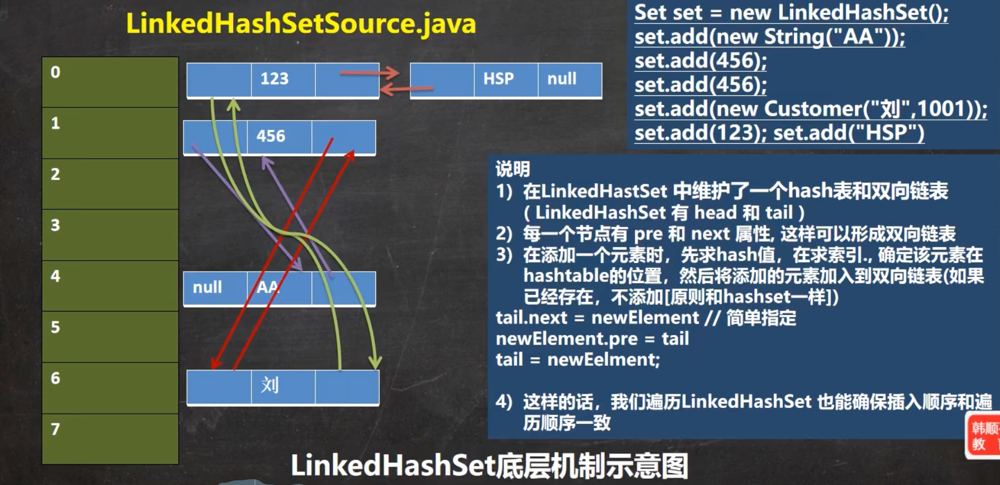

### 1 数组与集合的区别

#### 1.1 数组

1. 数组长度开始时必须指定，而且一旦指定，不能更改
2. 保存的必须为同一类型（基本类型/引用类型）的元素
3. 使用数组进行增加/删除元素的代码比较复杂

> 数组扩容，不灵活，比较麻烦，实例如下:

`（见代码 com.hspedu.collection_.ArrayExample ）`

#### 1.2 集合

1. 集合不仅可以用来存储不同类型（不加泛型时）不同数量的对象，还可以保存具有映射关系的数据
2. 集合是可以动态扩展容量，可以根据需要动态改变大小
3. 集合提供了更多的成员方法，能满足更多的需求

### 2 Java集合

#### 2.1 Java集合框架体系


> 类型简单介绍

- `List`: 存储的元素是**有序**的、**可重复**的
- `Set`: 存储的元素是**无序**的、**不可重复**的
- `Queue`: 按特定的排队规则来确定先后顺序，存储的元素是**有序**的、**可重复**的
- `Map`: 使用键值对（key-value）存储，key 是无序的、不可重复的，value 是无序的、可重复的，每个键最多映射到一个值

> 简单总结

集合主要是分了两组（`单列集合`和`双列集合`），单列集合表明在集合里放的是单个元素，双列集合往往是键值对形式（key-value）

#### 2.2 Collection

```ceylon
Collection 是集合类中的单列集合。他是所有单列集合的父接口。Collection的子接口有List接口和Set接口。这意味着所有的单列集合类都是继承了这个接口。它定义了一些集合共有的基本方法，如添加、删除、查询和遍历元素等方法
```

`演示示例见代码：com.hspedu.collection_.CollectionMethod`

> Iterator迭代器

1. Iterator对象称为迭代器，用于遍历Collection集合中的元素
2. 所有实现了Collection接口的集合类都有一个Iterator()方法，用以返回一个实现了Iterator接口的对象，即可以返回一个迭代器
3. Iterator仅用于遍历集合，Iterator本身并不存放对象

`迭代器使用见代码：com.hspedu.collection_.CollectionIterator `

> for循环增强遍历

增强for循环，可以替代itrator迭代器，特点:增强for就是简化版的iterator，本质一样。只能用于遍历集合或者数组

##### 2.2.1 List

```ceylon
List 接口是 Collection 接口的子接口，常用的List实现类有 ArrayList、Vector、LinkedList
```

- List集合类中元素有序(即添加顺序和取出顺序一致)、且可重复
- List集合中的每个元素都有其对应的顺序索引，即支持索引
- List集合可以添加任意元素，**包括null**，并且**可以添加多个**

> List常用方法

```java
add() // 在index位置插入元素
addAll() // 从index位置开始将所有元素添加进来
get() // 获取指定index位置的元素
indexOf() // 返回在集合中首次出现的位置
lastIndexOf() // 返回在当前集合中末次出现的位置
remove() // 移除index位置的元素，并返回此元素
set() // 设置指定index位置的元素(替换)
subList() // 返回一个范围位置中的子集合
```

`List接口和常用方法使用见代码：com.hspedu.list_.List_ `

`List的三种遍历方式见代码：com.hspedu.list_.ListFor`

###### 2.2.1.1 ArrayList

> （一）ArrayList的底层实现

ArrayList底层维护了一个**Object类型的数组**，所以ArrayList里面可以存放**任意类型**的元素，**transient表示该属性不会被序列化**

**size变量**用来保存当前数组中已经添加了多少元素


> （二）ArrayList的扩容机制（面试题）

1.1 当new ArrayList对象时，如果使用的是**无参构造器**，则初始elementData**容量为0**


1.2 **第1次**添加，则扩容**elementData为10**


1.3 如需要再次扩容，则扩容elementData为1.5倍（如果是奇数的话会丢掉小数，下同），比如容量为10，当添加到第11个元素时，会触发扩容机制，扩容大小为原先1.5倍，即 10 * 1.5 = 15，当元素加到第16个时，会再次扩容原大小1.5倍，即 15 * 1.5 = 22，一直按照这个规律扩容


2.1 如果使用的是**有参构造器**，则初始elementData**容量为初始长度**，比如 ArrayList list1 = new ArrayList(3);，那么初始长度为3，后续也是按照1.5倍来扩容，比如添加到第4个元素时，扩容 3 * 1.5 = 4，当再次添加到第6个元素时，扩容 4 * 1.5 = 6，一直按照这个规律扩容

> 底层分析得出结论

1. ArrayList是由`数组`来实现数据存储的
2. ArrayList中维护了一个Object类型的`数组elementData`
3. 依上所以ArrayList可以存放任意类型的元素甚至是`空元素`，可以放入多个空值
4. transient Object[] elementData  //transient关键字表示该属性不会被序列化
5. 当创建ArrayList对象时，如果使用的是无参构造器，则初始elementData容量是0，第1次添加，则扩容elementData为10,如需再次扩容，则扩容elementData为1.5倍
6. 如果使用的是指定大小的构造器，则初始elementData容量为指定大小，如果需要扩容，则直接扩容elementData为1.5倍
7. **ArrayList是线程不安全**(执行效率高)，在`多线程`下，不建议用ArrayList

> 安全隐患一

```java
在多个线程进行add操作时可能会导致elementData数组越界。

假设某一时刻集合里已经有9个元素，即size=9，集合容量此时为10
线程A开始进入add方法，这时它获取到size的值为9，调用ensureCapacityInternal方法进行容量判断。
线程B此时也进入add方法，它获取到size的值也为9，也开始调用ensureCapacityInternal方法。
线程A发现需求大小为10，而elementData的大小就为10，可以容纳。于是它不再扩容，返回。
线程B也发现需求大小为10，也可以容纳，返回。
线程A开始进行设置值操作， elementData[size++] = e 操作。此时size变为10。
线程B也开始进行设置值操作，它尝试设置elementData[10] = e，而elementData没有进行过扩容，它的下标最大为9。于是此时会报出一个数组越界的异常ArrayIndexOutOfBoundsException.
  
// 说明：后面的源码没有了 ensureCapacityInternal等方法，只需要理解思路即可
```

> 安全隐患二

```java
另外第二步 elementData[size++] = e 设置值的操作同样会导致线程不安全。从这儿可以看出，这步操作也不是一个原子操作，它由如下两步操作构成：

elementData[size] = e;
size = size + 1;
在单线程执行这两条代码时没有任何问题，但是当多线程环境下执行时，可能就会发生一个线程的值覆盖另一个线程添加的值，具体逻辑如下：

列表大小为0，即size=0
线程A开始添加一个元素，值为A。此时它执行第一条操作，将A放在了elementData下标为0的位置上。
接着线程B刚好也要开始添加一个值为B的元素，且走到了第一步操作。此时线程B获取到size的值依然为0，于是它将B也放在了elementData下标为0的位置上。
线程A开始将size的值增加为1
线程B开始将size的值增加为2
这样线程AB执行完毕后，理想中情况为size为2，elementData下标0的位置为A，下标1的位置为B。而实际情况变成了size为2，elementData下标为0的位置变成了B，下标1的位置上什么都没有。并且后续除非使用set方法修改此位置的值，否则将一直为null，因为size为2，添加元素时会从下标为2的位置上开始。
  
// 说明：上面描述可能与现在的源码有出入，只需要理解思路即可
```

###### 2.2.1.2 Vector

Vector的add方法加上了synchronized锁，任何时刻至多只能有一个线程访问该方法，所以Vector是线程安全的

> （一）Vector的底层实现（和ArrayList很多相似）

Vector底层也维护了一个**Object类型的数组**

> （二）Vector的扩容机制

- 如果是无参，初始elementData容量为10，默认10满后，就按2倍扩容
- 如果指定大小，则每次直接按2倍扩容


> Vector和ArrayList的区别（面试题）

|           | 底层结构 | 版本   | 线程安全（同步）效率 | 扩容倍数                                                     |
| --------- | -------- | ------ | -------------------- | ------------------------------------------------------------ |
| ArrayList | 可变数组 | jdk1.2 | 不安全，效率高       | 如果有参构造，每次1.5倍扩；如果无参：1)第一次默认10; 2)从第二次开始按1.5倍扩 |
| Vector    | 可变数组 | jdk1.0 | 安全，效率不高       | 如果有参构造，每次2倍扩；如果无参：1)第一次默认10; 2)从第二次开始按2倍扩 |

###### 2.2.1.3 LinkedList 

```ceylon
LinkedList 同时实现了 List 接口和 Deque 接口，也就是说它既可以看作一个顺序容器，又可以看作一个队列（Queue）。但 LinkedList 是采用链表结构的方式来实现List接口的，因此在进行insert和remove动作时效率要比ArrayList高。LinkedList 是不同步的，也就是不保证线程安全
```

> LinkedList的底层实现

1. LinkedList中维护了一个**双向链表**，两个属性 **first** 和 **last** 分别指向 首节点和尾节点
2. 每个节点 (Node对象)，里面又维护了**prev、next、item**三个属性，其中通过prev指向前一个，通过next指向后一个节点，最终实现双向链表

> 源码分析（看Java基础笔记-静态局部内部类的使用场景）

LinkedList list1 = new LinkedList(); 调用**无参构造器**，此时没有做任何操作，这时 LinkedList 的属性 Node<E> first = null;  Node<E> last = null; 


list1.add("1"); 调用add添加的方法


第一次add后，效果如下：


第二次add后，效果如下：


> 自画内存图


> Arraylist 与 LinkedList 的区别（面试题）

1. **底层数据结构：** Arraylist 底层使用的是 **Object 数组**；LinkedList 底层使用的是**双向链表** 数据结构

2. **是否支持快速随机访问：**LinkedList 不支持高效的随机元素访问，而 ArrayList 支持。快速随机访问就是通过元素的序号快速获取元素对象(对应于get(int index)方法)。

3. **插入和删除是否受元素位置的影响**：

   ArrayList 采用数组存储，所以插入和删除元素的时间复杂度受元素位置的影响。

   LinkedList 采用链表存储，所以对于add(E e)方法的插入，删除元素时间复杂度不受元素位置的影响，近似 O(1)，如果是要在指定位置i插入和删除元素的话（(add(int index, E element)） 时间复杂度近似为o(n))因为需要先移动到指定位置再插入。

```ceylon
补充：项目中很少使用到 LinkedList (基本没有)，需要用到 LinkedList 的场景几乎都可以使用 ArrayList 来代替，并且性能通常会更好，即便是在元素增删的场景下，因为LinkedList 仅仅在头尾插入或者删除元素的时候时间复杂度近似 O(1)，其他情况增删元素的时间复杂度都是 O(n)
```

##### 2.2.2 Sets

```ceylon
Set 接口是 Collection 接口的子接口，常用的Set实现类有 HashSet、TreeSet、LinkedHashSet
```

- Set集合无序 (添加和取出的顺序不一致)
- Set集合不允许重复元素
- Set集合没有索引，不能使用索引的方式来获取元素
- 可以添加一个null

###### 2.2.2.1 HashSet

- HashSet底层实际上是HashMap
- HashSet不保证元素是有序的，取决于hash后，再确认索引的位置


> 小试牛刀

```java
Set hashSet = new HashSet();
hashSet.add("jack");
hashSet.add("Wing");
hashSet.add("Li");
hashSet.add("jack"); // 不能添加
hashSet.add(new Person("tom"));
hashSet.add(new Person("tom")); 
// 经典面试题
hashSet.add(new String("wsy")); 
hashSet.add(new String("wsy")); // 不能添加
System.out.println(hashSet);

[com.hspedu.list_.Person@5ed828d, Wing, com.hspedu.list_.Person@371a67ec, wsy, Li, jack]
// 根据上面的输出结果，引出下面的问题：HashSet 如何确定元素是否重复。
```

> 简单模拟HashSet

```java
/* 结点，存储数据，可以指向下一个结点 */
class Node{
    Object item;// 存放数据
    Node next; // 指向下一个结点
    public Node(Object item, Node next) {
        this.item = item;
        this.next = next;
    }
}
 // 模拟一个HashSet的底层(其实就是HashMap)
 // 创建一个Node数组,有些人称为table
 Node[] table = new Node[16];
 //1.把john放在2的位置
 Node jhon = new Node("Jhon",null);
 table[2] = jhon;
 //2.将jack挂载到johj后边
 Node jack = new Node("Jack", null);
 jhon.next = jack;
 //3.继续把Rose挂载到Jack后面
 Node rose = new Node("Rose", null);
 jack.next = rose;
 //4.把Lucy放到table表索引为3的位置
 Node lucy = new Node("Lucy", null);
 table[3] = lucy;
 System.out.println("完成");
```


** **

**问题引入：**HashSet 不能添加相同的元素/数据，它是以什么为判断依据的？（面试题）

> **HashSet 的底层实现**

**HashSet** 的底层是 **HashMap，HashMap**的底层是**(数组+链表（单向）+红黑树)**

1. `第一步`：添加一个元素时，通过哈希函数得到**hash值**，通过**((n - 1) & hash)** 将hash值转成**索引值**（n是数组长度）。HashMap没有简单的直接通过对 **数组长度取模% 来散列**，它是用了**位与运算**，用hash值跟数组大小n减一做&。这种算法同样能达到取模那种效果，而且二进制的位运算，**速度快**
2. `第二步`：根据第一步得到的**索引值**找到存储数据表**table**（数组），看这个索引位置是否已经存放了元素
3. `第三步`：如果没有存放，则直接添加
4. `第四步`：如果存放了，就跟当前索引下存储的多个元素挨个调用 **equals()** 比较（实际还会先经过hash值和地址的比较，都不成立才进行最后的equals比较），如果相同，就放弃添加，如果都不相同，则添加到最后
5. `第五步`：在 **java8** 中，如果一条链表的元素个数超过 **TREEIFY_THRESHOLD（默认是8）**，**并且 table 的大小 >= MIN_TREEIFY_CAPACITY（默认是64），就会进行树化(红黑树)。如果当前数组的长度小于 64，那么会选择先进行数组扩容，而不是转换为红黑树**

> 为什么要设计成这样的数组+链表+红黑树存储方式呢？

```ceylon
因为，如果单使用数组或者链表的方式，将来数据越来越多，读取或者新增效率会越来越低，所以设计者使用了“数组+链表+红黑树”的结构，大大提高了效率
```

** **

> HashSet 源码解读

> 1.main方法debug语句

```java
HashSet hashSet = new HashSet();
hashSet.add("java");
hashSet.add("php");
hashSet.add("java");
```

** **

> 2.无参构造器

```java
HashSet hashSet = new HashSet();
```


**源码解读**：

1. HashSet无参构造器实际是创建了一个HashMap的对象实例，所以HashSet底层就是一个HashMap

** **

> 3.第一次调用add方法分析

```java
hashSet.add("java");
```


**源码解读**：

1. `e`：添加的元素，这里是"java"字符串常量
2. **PRESENT**其实是一个静态对象，没什么意义，只是起到占位的作用，因为HashMap是一个**Key-Value**结构的， **HashSet需要用它来充当所有Key的Value**

** **

> 3.1 put方法解读


**源码解读**：

1. `key`：添加的元素；`value`：占位符 **PRESENT**
2. **putVal方法**需要传入**hash(key)**，所以先进去**hash方法**看执行了什么操作（下面3.2）

3. 看完下面hash方法解读后，继续回到这里解读
4. 下一步研究**putVal方法**，看下面 3.3putVal方法解读

** **

> 3.2 hash方法解读


**源码解读**：

1. `key`：添加的元素；`h`：临时变量
2.  **key == null **则返回**hash值为0**
3. **hashCode方法**是每个对象都有的，如果没有重写hashCode方法，默认都是使用的**Object类的hashCode方法**
4. **^ 是按位异或，>>>是算术右移** 。将生成的hashcode值的高16位于低16位进行异或运算，这样得到的值再与(数组长度-1)进行**相与操作**[在后面的**putVal方法**里]，**可以得到最散列的下标值**。这里得到**hash值**后我们返回去**3.1put方法**【这里的算法目的是尽量得到不重复的hash值，避免hash碰撞】
5. 已经计算出`hash`并return，现回到 `3.1 put方法解读 第4点`

** **

> 3.3 putVal方法解读（本次只分析第一次执行add方法执行流程）


**源码解读**：

1. `hash`：上面**hash方法**计算得到的**hash值**（注意这里的hash值不等价于hashCode）
2. `key`：添加的元素；`value`：占位符 **PRESENT**
3. `tab`、`p`、`n`、`i` 都是一些辅助变量
4. `table`就是上面提到的数组（看上面**HashSet 的底层实现的第二步**），其本质就是HashMap的一个属性数组，存储类型是**Node**
5. `624行`：将`table`赋给`tab`，然后判断`tab`是否等于null，如果不为null，就继续把`tab`的长度赋给`n`，继续判断`n`是否等于0
6. 第一次add，`table`为null，会进入 `625行`
7. `625行`：执行`resize方法`，并将返回值赋给`tab`，并计算`tab`长度赋给`n`
8. 看完下面`3.4 resize方法`解读后，继续回到这里解读
9. 回到`625行`resize方法已经创建了大小为16的数组，`table`指向该数组，辅助变量 `n` 值为16
10. `626行`：**(数组长度-1)**与hash值进行**相与操作**得到**索引值**（就是当前添加的这个元素要放到哪个索引位置），先获取该索引的元素赋给辅助变量`p`，判断当前索引**是否有元素**，**如果没有，直接进入if 进行添加**
11. `627行`：创建一个Node对象，并把hash也保存到Node对象，为什么要保存hash呢？**因为将来继续添加元素，如果放到同一个索引下，那要挨个判断是否与该索引下的所有元素的hash值相等...未完，待补充**
12. 第一次add添加元素，不会进入`628行`else，直接到`657行`，`++modCount`代表修改了一次; `658行`判断是否超过临界值，超过就扩容，第一次add不满足，则执行`660行`，`afterNodeInsertion`在这里其实是一个空方法（HashMap为什么要留空方法呢？实际上是给它的子类进行重写调用的，类似于**钩子函数**），最终添加成功，执行`661行`返回null（所以**返回了null表示添加成功**）
13. 回到`608行`继续return
14. 回到`220行`成功为null，所以add最终return **true**
15. **第一次add添加操作到此分析完毕！**

** **

> 3.4 resize方法解读


**源码解读**：

1. 进入**resize()扩容方法** **重点分析一下，我们在这里先只看它的上半段，**因为旧数组不为空才能进入下半段**，**很明显第一次add不符合这个条件，后面**借助另一个程序再来分析下半段**
2. `674～675行`：先将成员属性`table`赋给 `oldTab`，再将 `oldTab` 的长度赋给 `oldCap`【临时变量说明：**oldTab**：旧数组；**oldCap**：旧数组长度；**oldThr**：旧数组的扩容临界值；**newCap**：新数组长度；**newThr**：新数组的扩容临界值；】
3. 根据判断，第一次add会进入 `690行`
4. `690行`：将默认值`DEFAULT_INITIAL_CAPACITY（默认值16）`赋给`newCap`，第一次add数组的大小是`默认值 16`
5. `691行`：将加载因子`DEFAULT_LOAD_FACTOR(值为0.75)`乘于默认值`DEFAULT_INITIAL_CAPACITY`后赋给`newThr`，计算结果为12（**12就是临界值**，当后续添加元素到13时，就进行扩容，而不是加满到16才进行扩容）
6. `698行`：将计算得到最新的扩容值`newThr`的值12赋给属性`threshold`（threshold才是真正保存扩容值的变量，其他都是临时辅助变量）
7. `700~701行`：创建了一个长度为16的数组赋给`newTab`;然后继续赋给了`table`【到这一步初始的数组已经创建完成，长度16，数组里的内容目前都为null】其实执行到这的目的是最终给扩容值`threshold`,`table`类变量赋值。
8. `702行`：`oldTab`是在`674行`赋值的，所以`oldTab`为null，不会进入if，最终返回`newTab`（`newTab`是刚创建的新数组），**resize方法结束**（回到3.3 putVal方法解读的8点）

> 补充说明

- HashMap 的加载因子`DEFAULT_LOAD_FACTOR(值为0.75)`是为了平衡**哈希表**的**性能**和**空间**占用而引入的。当哈希表的元素数量达到容量乘以加载因子时，就会触发扩容操作，将哈希表的容量增加一倍，并重新计算每个元素在新哈希表中的位置
- 加载因子的默认值是 0.75，这个值经过实验得出，可以在时间和空间上取得一个比较好的平衡点。**设置更高的加载因子可以减少哈希表的空间占用，但会增加哈希冲突的概率，导致查找性能下降。相反，设置更低的加载因子可以提高哈希表的查找性能，但会增加空间占用。**

> 第一次add总结

上半段主要是确定新的容量和阈值，并且进行扩容

> 第一次add自画内存图


** **

> 4.第二次调用add方法分析

```java
hashSet.add("php");
```

> 第二次add直接看**putVal方法**


**源码解读**：

1. 有了第一次add的分析，第二次add不一样的元素，比较简单
2. `624行`：table已经在第一次add被创建了长度为16，所以不会进入 `625行`
3. `626行`：计算出来的索引和第一次不一样，所以取出索引元素赋给`p`为空，直接执行`627行`创建新的node节点并添加到索引的位置。
4. 然后执行`657行`后面的语句，最后添加成功返回null


> 5.第三次调用add方法分析

```java
hashSet.add("java");  //注意本次添加跟第一次添加的元素相同
```

> 第三次add直接看**putVal方法**（注意本次添加计算出来的hash值和第一次计算出来的hash值是相同的）


**源码解读**：

1. 本次添加跟第一次添加元素一样，所以`626行`获取到跟第一次相同的索引元素赋给`p`，不满足条件，进入到else语句
2. `630行`：先判断**当前计算的hash值**和**已经存放到这个索引的hash值**是否相同**（不同hash值的元素和数组长度n-1进行与运算，计算结果可能为相同的索引值）**，如果相同，那么继续判断**当前添加的元素是否 == 已经添加的元素**（引用类型比较地址），如果满足那么不用进行后续判断，已经确定是相同的元素。如果上面 == 不满足，那么继续判断**当前添加的元素equals已经添加的元素**是否为true**（equals方法程序员可以重写，比如定义了Person类，重写equals方法，当age和name相同就说明是相同的元素不能重复添加）**，如果为true，说明是同一个元素，无法添加，执行`632行`将 e = p;
3. 如果`630行`结果为false，我们继续分析后续执行流程
4. `633行`：判断当前是否是一颗红黑树，如果是，则执行`634行`**红黑树**的添加逻辑，**putTreeVal方法**逻辑很复杂，本次不研究，等学习了红黑树之后再回过头来研究
5. 假如`633行`不满足，那么执行else语句，**分析else语句主要执行什么逻辑呢？**答：当一个索引下已经保存一个或多个元素形成一个链表时，else就是循环将当前添加的元素与链表所有的元素**进行上面第2步的比较**，只要存在有一个匹配上的，说明是已经存在的元素无法添加，全部不匹配说明可以添加成功，当前添加的元素直接挂在最后一个元素的后面。
6. `639行`：假如元素可以添加，那么元素添加进去之后，立即判断（TREEIFY_THRESHOLD的值为8），当前添加的元素是索引的第九个时，满足条件，会进入 `640行`调用`treeifyBin方法`进行树化。
7. 先简单看下`5.1 treeifyBin方法`，再回来分析
8. 分析完5.1后，继续执行`649行`，只要匹配到了`649行`条件成立，否则都不会执行
9. **到这HashSet全部解读完毕！**
10. 如果想看扩容和树化的效果，可以自定义一个类，重写hashCode和equels方法来添加进行尝试

** **

> 5.1 treeifyBin


**源码解读**：

1. `753行`：**判断当前tab数组的长度是否小于 64 ，如果小于64，即使同一个索引的链表已经有9个元素了，依然不会马上进行树化，而是先调用 `resize方法`进行扩容**

> 6.研究数组扩容


**源码解读**：

1. 当添加到第13个元素时，添加完成后，判断是否满足扩容`658行`满足，执行`resize方法`扩容
2. `678行`满足，if 不满足，else if 满足，执行 `685行`将扩容临界值乘于2 = 24
3. `698行`将新的临界值赋给成员变量threshold，然后重新创建一个32长度的数组
4. 将旧的数组里的数据通过for循环添加到新创建的数组中。

> HashSet扩容相关总结

1. Hashset底层是HashMap，第一次添加时，table 数组扩容到 16，临界值 (threshold)是 16*加载因子 (loadFactor)是0.75= 12（临界值）
2. 如果table 数组使用到了临界值 12（当添加第13个元素,看下面图片658行）,就会扩容到 16 * 2= 32,新的临界值就是32 * 0.75= 24 依次类推(看下面图片685行，左移一位相当于乘于2)
3. 在 **java8** 中，如果一条链表的元素个数超过 **TREEIFY_THRESHOLD（默认是8）**，**并且 table 的大小 >= MIN_TREEIFY_CAPACITY（默认是64），就会进行树化(红黑树)。如果当前数组的长度小于 64，那么会选择先进行数组扩容，而不是转换为红黑树**

###### 2.2.2.2 LinkedHashSet

- LinkedHashSet是HashSet的子类
- **LinkedHashSet**底层是一个 **LinkedHashMap**，底层维护了一个 **数组 + 双向链表**
- LinkedHashSet根据元素的 hashCode 值来决定元素的存储位置，同时使用链表维护元素的次序，这使得元素看起来是以插入顺序保存的。



###### 2.2.2.3 TreeSet

#### 2.3 Map

##### 2.3.1 HashMap

##### 2.3.2 LinkedHashMap

##### 2.3.3 HashTable

##### 2.3.4 TreeMap


#### 四 、Set接口和常用方法

#### 课后练习

一、equals和hashCode示例1:

```
练习要求：
1、创建3个Workers放入HashSet 中
2、当name和age一样时就不能添加到HashSet
```

`示例1见代码：com.hspedu.set_.Employee `

二、equals和hashCode示例2:重写2次

```
练习要求：
1、Employ 里只要名字name和出生年份birthday相同就不能添加到HashSet
```

`示例1见代码：com.hspedu.set_.Employee02 `

三、equals和hashCode示例2:重写1次

```
练习要求：
1、Employ 里只要名字name和出生年份birthday相同就不能添加到HashSet
```

`示例1见代码：com.hspedu.set_.Employee03 `

##### 3 LinkedHashSet

> LinkedHashSet的全面说明

- LinkedHashSet是HashSet的子类
- LinkedHashSet底层是一个LinkedHashMap，底层维护了一个**数组+双向链表**
- LinkedHashSet根据元素的hashCode值来决定元素的存储位置，同时使用链表维护元素的次序图(图)，这使得元素看起来是以插入顺序保存的。
- LinkedHashSet不允许添加重复元素

> 说明

- 在LinkedHashSet中维护一个hash表和双向链表(LinkedHashSet 有head和tail)


- 每一个结点有before和after属性，这样可以形成双向链表


- 在添加一个元素时，先求hash值，再求索引，确定该元素在table的位置，然后将添加的元素加入到双向链表(如果已经存在，不添加[原则和hashset一样])

​       tail.next = newElement
​      newElement.pre = tail
​      tail = newElement;

- 这样的话，我们遍历LinkedHashSet 也能确保插入顺序和遍历顺序一致


#### Collections 工具类

```ceylon
Collections 中提供了大量对集合元素进行排序、查询和修改等操作的方法，还提供了对集合对象设置不可变、对集合对象实现同步控制等方法。以下定义的方法既可用于操作 List集合，也可用于操作Set 和 Queue 
```

> 常用操作

```java
后续补充Collections工具类的常用方法
```


