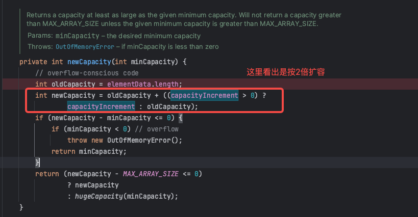
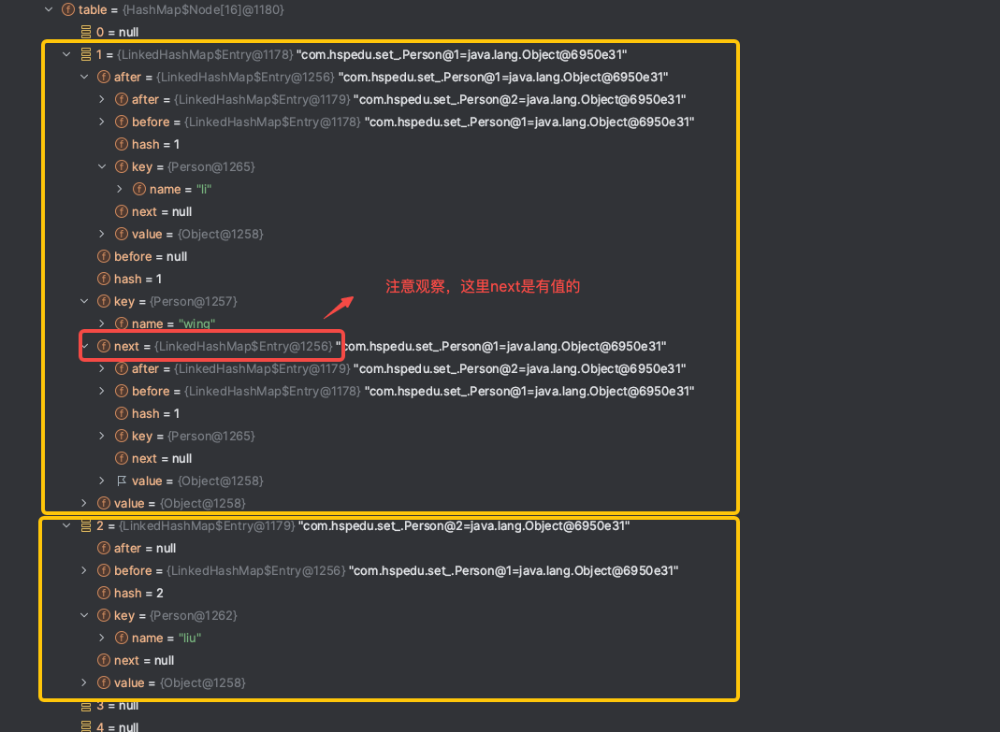
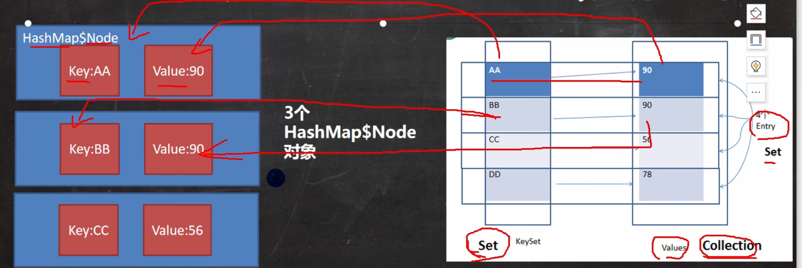

# 1 数组与集合的区别

## 1.1 数组

1. 数组长度开始时必须指定，而且一旦指定，不能更改
2. 保存的必须为同一类型（基本类型/引用类型）的元素
3. 使用数组进行增加/删除元素的代码比较复杂

> 数组扩容，不灵活，比较麻烦，实例如下:

`（见代码 com.hspedu.collection_.ArrayExample ）`

## 1.2 集合

1. 集合不仅可以用来存储不同类型（不加泛型时）不同数量的对象，还可以保存具有映射关系的数据
2. 集合是可以动态扩展容量，可以根据需要动态改变大小s
3. 集合提供了更多的成员方法，能满足更多的需求

# 2 Java集合

## 2.1 Java集合框架体系

> 详细


> 简略


> 类型简单介绍

- `List`: 存储的元素是**有序**的、**可重复**的
- `Set`: 存储的元素是**无序**的、**不可重复**的
- `Queue`: 按特定的排队规则来确定先后顺序，存储的元素是**有序**的、**可重复**的
- `Map`: 使用键值对（key-value）存储，key 是无序的、不可重复的，value 是无序的、可重复的，每个键最多映射到一个值

> 简单总结

集合主要是分了两组（`单列集合`和`双列集合`），单列集合表明在集合里放的是单个元素，双列集合往往是键值对形式（key-value）

****

## 2.2 Collection

```ceylon
Collection 是集合类中的单列集合。他是所有单列集合的父接口。Collection的子接口有List接口和Set接口。这意味着所有的单列集合类都是继承了这个接口。它定义了一些集合共有的基本方法，如添加、删除、查询和遍历元素等方法
```

> 下面对Collection定义的方法进行说明

`Collection` 是集合容器的顶级接口，他继承了`Iterable 接口`，即凡是 `Collection` 的实现类都可以迭代

可以看到， Collection 接口提供了**十九个抽象方法**，这些方法的命名都很直观的反应的这些方法的功能。通过这些方法规定了 Collection的实现类的一些基本特性：**可迭代，可转化为数组，可对节点进行添加删除，集合间可以合并或者互相过滤，可以使用 Stream 进行流式处理。**

> **1.抽象方法**

我们可以根据功能简单的分类介绍一下 Collection 接口提供的方法

```java
/** 判断类：*/
isEmpty();    //判断集合是否不含有任何元素；
contains();   //判断集合中是否含有至少一个对应元素；
containsAll();//判断集合中是否含另一个集合的所有元素；
```

```java
/** 操作类：*/
add();       //让集合包含此元素。如果因为除了已经包含了此元素以外的任何情况而不能添加，则必须抛出异常；
addAll();    //将指定集合中的所有元素添加到本集合；
remove();    //从集合移除指定元素；
removeAll(); //删除也包含在指定集合中的所有此集合的元素；
retainAll;   //从此集合中删除所有未包含在指定集合中的元素；
clear();     //从集合中删除所有元素；
```

```java
/** 辅助类：*/
size();     //获取集合的长度。如果长度超过 Integer.MAX_VALU 就返回 Integer.MAX_VALU；
iterator(); //获取集合的迭代器；
toArray();  //返回一个包含此集合中所有元素的新数组实例。因为是新实例，所以对原数组的操作不会影响新数组；
toArray(T[] a); //跟上面是重载，方法参数为T[]，此时调用 toArray()会将内部数组中的元素全部放入指定数组，如果结束后指定数组还有剩余空间，那剩余空间都放入null。
```

> **2.JDK8 新增抽象方法**

```java
/** 此外，在 JDK8 中新增了四个抽象方法，他们都提供了默认实现：*/
removeIf();       //相当于一个filter()，根据传入的函数接口的匿名实现类方法来判断是否要删除集合中的某些元素；
stream();         //JDK8 新特性中流式编程的灵魂方法，可以将集合转为 Stream 流式进行遍历，配合 Lambda 实现函数式编程；
parallelStream(); //同 stream() ，但是是生成并行流；
spliterator();    //重写了 Iterable 接口的 iterator()方法
```

> **3.equals 和 hashCode**

```java
值得一提的是 Collection 还重写了 Object 的 equals() 和 hashCode() 方法（或者说变成了抽象方法？），这样实现 Collection 的类就必须重新实现 equals() 和 hashCode() 方法。
```

****

### 2.2.1 List

```ceylon
List 接口是 Collection 接口的子接口，常用的List实现类有 ArrayList、Vector、LinkedList
```

- List集合类中元素有序(即添加顺序和取出顺序一致)、且可重复
- List集合中的每个元素都有其对应的顺序索引，即支持索引
- List集合可以添加任意元素，**包括null**，并且**可以添加多个**

> **List方法**

List继承了Collection，大部分方法与Collection重复，这里列举List方法

```java
/** 操作类：*/
add(int index, E element)；                    // 指定索引添加元素
addAll(int index, Collection<? extends E> c);  // 根据索引插入集合
remove(int index);                             // 指定索引删除元素
set(int index, E element);                     // 替换指定索引的元素
get(int index);                                // 指定索引获取元素
indexOf(Object o);                             // 返回指定元素在此列表中第一次出现的索引
int lastIndexOf(Object o);                     // 返回指定元素在此列表中最后一次出现的索引
ListIterator<E> listIterator();                // 返回一个增强的迭代器【2.2.1.4 ListIterator】(全索引数据迭代器)
ListIterator<E> listIterator(int index);       // 返回一个增强的迭代器(指定索引数据后面的迭代器)
List<E> subList(int fromIndex, int toIndex);   // 可以根据区间获取一个集合对象视图，操作视图会影响原数据（同一个引用）
```

```java
/** default默认方法 暂时不研究，后面遇到再回头研究*/
default void replaceAll(UnaryOperator<E> operator)
default void sort(Comparator<? super E> c)
default Spliterator<E> spliterator()
```

****

#### 2.2.1.1 ArrayList

**ArrayList 是一个数组队列，相当于动态数组。与Java中的数组相比，它的容量能动态增长。ArrayList继承AbstractList，并且实现List、RandomAccess[随机访问]、Cloneable[可克隆] 和 Serializable[序列化] 接口**

> ArrayList实现类介绍

> 一、类成员介绍

> 1.常量和变量

```java
/* 1)初始化未指定容量时new ArrayList()，默认的初始容量大小（常量） */
private static final int DEFAULT_CAPACITY = 10;

/* 2)初始化指定容量时new ArrayList(0)，共享的空数组实例用于空实例 */
private static final Object[] EMPTY_ELEMENTDATA = {};

/* 3)初始化未指定容量时new ArrayList()，共享的空数组实例用于默认大小的空实例。我们将其与EMPTY_ELEMENTDATA区分开，以便在添加第一个元素时知道要扩容多少。*/
private static final Object[] DEFAULTCAPACITY_EMPTY_ELEMENTDATA = {};
// 补充：如果new ArrayList()的方式，那么第一次add默认创建的初始容量是10，后续按照 1.5 扩容；如果new ArrayList(length)使用有参构造，那么按照传入的长度进行初始化，后续每次扩容也是按照 1.5 扩容。

/* 4)存储ArrayList元素的数组缓冲区，真正保存数据的地方 */
transient Object[] elementData;

/* 5)数组列表的大小(包含的元素数量) */
private int size;
```

> 2.三个构造方法

```java
/* 1)无参构造，创建一个空数组，第一次add初始容量为10 */
public ArrayList() {
    this.elementData = DEFAULTCAPACITY_EMPTY_ELEMENTDATA;
}
/* 2)有参构造，入参是初始容量值，后续就按照初始容量扩 */
public ArrayList(int initialCapacity) {
    if (initialCapacity > 0) {
        this.elementData = new Object[initialCapacity];
    } else if (initialCapacity == 0) {
        this.elementData = EMPTY_ELEMENTDATA;
    } else {
        throw new IllegalArgumentException("Illegal Capacity: "+ initialCapacity);
    }
}
/* 3)入参是Collection子类 */
public ArrayList(Collection<? extends E> c) {
    //step 1: 把当前传入建立的集合转成 Object 数组
    Object[] a = c.toArray();
    //step 2: 把数组的长度赋值给 当前正在实例化的集合对象。并且 size 不等于 0
    if ((size = a.length) != 0) {
        // step 2.1：如果传入进当前正在实例化集合的集合的运行时类型是 ArrayList 类型
        if (c.getClass() == ArrayList.class) {
            // step 2.1.1: 就让当前实例化的 集合对象的 elementData数组 指向传入进来的ArrayList集合 的elementData 数组
            elementData = a;
        } else {
            // step 2.2: 如果不是，则进行数组的拷贝，再让elementData 指向
            // 在 Arrays.copyOf方法中创建的新数组！
            elementData = Arrays.copyOf(a, size, Object[].class);
        }
    } else {
        // step 3: 如果传入进来的集合是没有元素的，即传入进来的集合的elementData的长度为0时,则当前实例化的集合对象的 
        // elementData 数组 指向 空数组，（长度为0）
        elementData = EMPTY_ELEMENTDATA;
    }
}
```

> 3.成员方法（判断类）

```java
isEmpty();    //判断集合是否不含有任何元素；
contains();   //判断集合中是否含有至少一个对应元素；
containsAll();//判断集合中是否含另一个集合的所有元素；

/* 1)isEmpty */
public boolean isEmpty() {
    return size == 0;           // size是成员变量
}
/* 2)contains */
public boolean contains(Object o) {
    return indexOf(o) >= 0;
}
/* 未重写该方法，父类AbstractList也未重写，使用的是父类AbstractCollection重写的方法 */
containsAll();   
```

> 4.成员方法（操作类）

```java
add();             //添加元素
addAll();          //将指定集合中的所有元素添加到本集合；
remove();          //从集合移除指定元素；
removeAll();       //删除也包含在指定集合中的所有此集合的元素；【逻辑较复杂，后续有时间可以回头欣赏源码//TODO】
removeRange();     // 删除指定开始和结束索引元素【受保护的方法，只能子类访问，待研究//TODO】
retainAll;         //从此集合中删除所有未包含在指定集合中的元素；//TODO
clear();           //从集合中删除所有元素；
get();             // 获取索引元素 
indexOf();         // 第一次出现该元素的索引值
lastIndexOf();     // 最后一次出现该元素的索引值   
set();             //添加元素

/* 1）add */
public boolean add(E e) {
    // 确保容量足够
    ensureCapacityInternal(size + 1); 
    // 添加元素
    elementData[size++] = e;     
    return true;
}
/* 2）add-指定索引 */
public void add(int index, E element) {
    // IndexOutOfBoundsException校验
    rangeCheckForAdd(index);
    // 确保容量足够
    ensureCapacityInternal(size + 1);  
    // 腾出该索引位置，其它元素往后移动一位
    System.arraycopy(elementData, index, elementData, index + 1, size - index);
    // 将元素放到该索引下
    elementData[index] = element;
    size++;
}
/* 3）addAll 如果c是空数组，代码也会执行，只是没效果，相当于没加 */
public boolean addAll(Collection<? extends E> c) {
    Object[] a = c.toArray();
    int numNew = a.length;
    ensureCapacityInternal(size + numNew);  
    System.arraycopy(a, 0, elementData, size, numNew);
    size += numNew;
    return numNew != 0;
}
/* 4）addAll-指定索引 */
public boolean addAll(int index, Collection<? extends E> c) {
    rangeCheckForAdd(index);
    Object[] a = c.toArray();
    int numNew = a.length;
    ensureCapacityInternal(size + numNew);  // Increments modCount
    int numMoved = size - index;
    if (numMoved > 0)
        System.arraycopy(elementData, index, elementData, index + numNew,numMoved);
    System.arraycopy(a, 0, elementData, index, numNew);
    size += numNew;
    return numNew != 0;
}
/* 5）remove-指定索引 */
public E remove(int index) {
    // 校验索引是否合法
    rangeCheck(index);
    modCount++;
    // 先得到待删除元素，剩下逻辑和fastRemove私有方法相似
    E oldValue = elementData(index);
    int numMoved = size - index - 1;
    if (numMoved > 0)
        System.arraycopy(elementData, index+1, elementData, index,
                             numMoved);
    elementData[--size] = null; // clear to let GC do its work
    return oldValue;
}
/* 6）remove-指定元素（只删除第一个匹配的元素） */
public boolean remove(Object o) {
    if (o == null) {
        for (int index = 0; index < size; index++)
            if (elementData[index] == null) {
                // 删除当前索引下元素的方法
                fastRemove(index);   
                return true;
            }
    } else {
        for (int index = 0; index < size; index++)
            // 从头遍历，匹配到equals相等即删除
            if (o.equals(elementData[index])) {
                fastRemove(index);
                return true;
            }
    }
    return false;
}
/* 7）clear-清空元素*/
public void clear() {
    modCount++;
    for (int i = 0; i < size; i++)
        elementData[i] = null;
    size = 0;
}
/* 8）get*/
public E get(int index) {
    rangeCheck(index);
    return elementData(index);
}
/* 9）indexOf*/
public int indexOf(Object o) {
    if (o == null) {
        for (int i = 0; i < size; i++)
            if (elementData[i]==null)
                return i;
    } else {
        for (int i = 0; i < size; i++)
            if (o.equals(elementData[i]))
                return i;
    }
    return -1;
}
/* 10）lastIndexOf*/
public int lastIndexOf(Object o) {
    if (o == null) {
        for (int i = size-1; i >= 0; i--)
            if (elementData[i]==null)
                return i;
    } else {
        for (int i = size-1; i >= 0; i--)
            if (o.equals(elementData[i]))
                return i;
    }
    return -1;
}
/* 11）set*/
public E set(int index, E element) {
    rangeCheck(index);
    E oldValue = elementData(index);
    elementData[index] = element;
    return oldValue;
}
```

> 5.成员方法（辅助类）

```java
/** 辅助类：*/
size();     //获取集合的长度。
iterator(); //获取集合的迭代器；
toArray();  //返回一个包含此集合中所有元素的新数组实例。因为是新实例，所以对原数组的操作不会影响新数组；
toArray(T[] a); //跟上面是重载，方法参数为T[]，此时调用 toArray()会将内部数组中的元素全部放入指定数组，如果结束后指定数组还有剩余空间，那剩余空间都放入null。
clone()  // TODO

/* 1）size */
public int size() {
    return size;
}
/* 2）iterator */
public Iterator<E> iterator() {
    return new Itr();
}
/* 3）toArray（相比较父类AbstractCollection的实现简单很多） */
public Object[] toArray() {
    return Arrays.copyOf(elementData, size);
}
/* 4）toArray(T[] a)  //TODO */
public <T> T[] toArray(T[] a) {
    if (a.length < size)
        // Make a new array of a's runtime type, but my contents:
        return (T[]) Arrays.copyOf(elementData, size, a.getClass());
    System.arraycopy(elementData, 0, a, 0, size);
    if (a.length > size)
        a[size] = null;
    return a;
}
```

> 6.私有成员方法（辅助方法）

```java
calculateCapacity();        // 获取最低容量
ensureExplicitCapacity();   // 确保容量足够
ensureCapacityInternal();   // 桥梁方法
grow();                     // 扩容数组
fastRemove();               // 删除指定索引元素

/* 1）仅在使用无参构造器初始化集合时，返回默认长度DEFAULTCAPACITY_EMPTY_ELEMENTDATA=10，否则直接返回minCapacity */ 
private static int calculateCapacity(Object[] elementData, int minCapacity) {
    if (elementData == DEFAULTCAPACITY_EMPTY_ELEMENTDATA) {
        return Math.max(DEFAULT_CAPACITY, minCapacity);
    }
    return minCapacity;
}
/* 2）扩容数组 */
private void grow(int minCapacity) {
    //旧容量
    int oldCapacity = elementData.length;
    //新容量=旧容量*1.5
    int newCapacity = oldCapacity + (oldCapacity >> 1);
    //判断新容量是否比minCapacity要小
    if (newCapacity - minCapacity < 0)
        //minCapacity赋给新容量
        newCapacity = minCapacity;
    if (newCapacity - MAX_ARRAY_SIZE > 0)
        newCapacity = hugeCapacity(minCapacity);
    //扩容数组大小
    elementData = Arrays.copyOf(elementData, newCapacity);
}
/* 3）确保容量足够 */
private void ensureExplicitCapacity(int minCapacity) {
    modCount++;
    // 需要的最小容量如果比数组大，则进行扩容
    if (minCapacity - elementData.length > 0)
        grow(minCapacity);
}
/* 4）桥梁方法 */
private void ensureCapacityInternal(int minCapacity) {
    ensureExplicitCapacity(calculateCapacity(elementData, minCapacity));
}
/////////////////////////////////////////////////////////////////////////////////////////////////////////////
/* 5）删除指定索引元素 */
private void fastRemove(int index) {
    modCount++;
    int numMoved = size - index - 1;
    if (numMoved > 0)
        //将当前索引后面所有的元素往前移动一位
        System.arraycopy(elementData, index+1, elementData, index, numMoved);
    //将空出的位置置为null
    elementData[--size] = null; 
}
```

##### 2.2.1.1.1 Itr

ArrayList的成员内部类，Itr为ArrayList提供服务，**Itr**是**Iterator**的实现类

```java
/* 基本和AbstractList的实现一致,可以对接参考 */
private class Itr implements Iterator<E> {
    int cursor;       
    int lastRet = -1; 
    int expectedModCount = modCount;
    Itr() {}
    public boolean hasNext() {
        return cursor != size;
    }
    @SuppressWarnings("unchecked")
    public E next() {
        checkForComodification();
        int i = cursor;
        if (i >= size)
            throw new NoSuchElementException();
        Object[] elementData = ArrayList.this.elementData;
        if (i >= elementData.length)
            throw new ConcurrentModificationException();
        cursor = i + 1;
        return (E) elementData[lastRet = i];
    }
    public void remove() {
        if (lastRet < 0)
            throw new IllegalStateException();
        checkForComodification();
        try {
            ArrayList.this.remove(lastRet);
            cursor = lastRet;
            lastRet = -1;
            expectedModCount = modCount;
        } catch (IndexOutOfBoundsException ex) {
            throw new ConcurrentModificationException();
        }
    }
    @Override
    @SuppressWarnings("unchecked")
    public void forEachRemaining(Consumer<? super E> consumer) {
        Objects.requireNonNull(consumer);
        final int size = ArrayList.this.size;
        int i = cursor;
        if (i >= size) {
            return;
        }
        final Object[] elementData = ArrayList.this.elementData;
        if (i >= elementData.length) {
            throw new ConcurrentModificationException();
        }
        while (i != size && modCount == expectedModCount) {
            consumer.accept((E) elementData[i++]);
        }
        // update once at end of iteration to reduce heap write traffic
        cursor = i;
        lastRet = i - 1;
        checkForComodification();
    }
    final void checkForComodification() {
        if (modCount != expectedModCount)
            throw new ConcurrentModificationException();
    }
}
```

##### 2.2.1.1.2 ListItr

ArrayList的成员内部类，ListItr为ArrayList提供服务，**ListItr**是**ListIterator**的实现类，**ListIterator**继承了**Iterator**

ListIterator扩展了可以倒着遍历**hasPrevious**和**previous**方法，并且增加了 **add** 和 **set** 方法和可以返回索引位置的 **nextIndex** 和 **previousIndex**方法

```java
/* 基本和AbstractList的实现一致,可以对接参考 */
private class ListItr extends Itr implements ListIterator<E> {
    ListItr(int index) {
        super();
        cursor = index;
    }
    public boolean hasPrevious() {
        return cursor != 0;
    }
    public int nextIndex() {
        return cursor;
    }
    public int previousIndex() {
        return cursor - 1;
    }
    @SuppressWarnings("unchecked")
    public E previous() {
        checkForComodification();
        int i = cursor - 1;
        if (i < 0)
            throw new NoSuchElementException();
        Object[] elementData = ArrayList.this.elementData;
        if (i >= elementData.length)
            throw new ConcurrentModificationException();
        cursor = i;
        return (E) elementData[lastRet = i];
    }
    public void set(E e) {
        if (lastRet < 0)
            throw new IllegalStateException();
        checkForComodification();
        try {
            ArrayList.this.set(lastRet, e);
        } catch (IndexOutOfBoundsException ex) {
            throw new ConcurrentModificationException();
        }
    }
    public void add(E e) {
        checkForComodification();
        try {
            int i = cursor;
            ArrayList.this.add(i, e);
            cursor = i + 1;
            lastRet = -1;
            expectedModCount = modCount;
        } catch (IndexOutOfBoundsException ex) {
            throw new ConcurrentModificationException();
        }
    }
}
```

##### 2.2.1.1.3 SubList

看源码//TODO

****

> ArrayList总结

1. ArrayList是由`数组`来实现数据存储的
2. ArrayList中维护了一个Object类型的`数组elementData`
3. 依上所以ArrayList可以存放任意类型的元素甚至是`空元素`，可以放入多个空值
4. transient Object[] elementData  //transient关键字表示该属性不会被序列化
5. 当创建ArrayList对象时，如果使用的是无参构造器，则初始elementData容量是0，第1次添加，则扩容elementData为10,如需再次扩容，则扩容elementData为1.5倍
6. 如果使用的是指定大小的构造器，则初始elementData容量为指定大小，如果需要扩容，则直接扩容elementData为1.5倍
7. **ArrayList是线程不安全**(执行效率高)，在`多线程`下，不建议用ArrayList

> 安全隐患一

```java
在多个线程进行add操作时可能会导致elementData数组越界。

假设某一时刻集合里已经有9个元素，即size=9，集合容量此时为10
线程A开始进入add方法，这时它获取到size的值为9，调用ensureCapacityInternal方法进行容量判断。
线程B此时也进入add方法，它获取到size的值也为9，也开始调用ensureCapacityInternal方法。
线程A发现需求大小为10，而elementData的大小就为10，可以容纳。于是它不再扩容，返回。
线程B也发现需求大小为10，也可以容纳，返回。
线程A开始进行设置值操作， elementData[size++] = e 操作。此时size变为10。
线程B也开始进行设置值操作，它尝试设置elementData[10] = e，而elementData没有进行过扩容，它的下标最大为9。于是此时会报出一个数组越界的异常ArrayIndexOutOfBoundsException.
  
// 说明：后面的源码没有了 ensureCapacityInternal等方法，只需要理解思路即可
```

> 安全隐患二

```java
另外第二步 elementData[size++] = e 设置值的操作同样会导致线程不安全。从这儿可以看出，这步操作也不是一个原子操作，它由如下两步操作构成：

elementData[size] = e;
size = size + 1;
在单线程执行这两条代码时没有任何问题，但是当多线程环境下执行时，可能就会发生一个线程的值覆盖另一个线程添加的值，具体逻辑如下：

列表大小为0，即size=0
线程A开始添加一个元素，值为A。此时它执行第一条操作，将A放在了elementData下标为0的位置上。
接着线程B刚好也要开始添加一个值为B的元素，且走到了第一步操作。此时线程B获取到size的值依然为0，于是它将B也放在了elementData下标为0的位置上。
线程A开始将size的值增加为1
线程B开始将size的值增加为2
这样线程AB执行完毕后，理想中情况为size为2，elementData下标0的位置为A，下标1的位置为B。而实际情况变成了size为2，elementData下标为0的位置变成了B，下标1的位置上什么都没有。并且后续除非使用set方法修改此位置的值，否则将一直为null，因为size为2，添加元素时会从下标为2的位置上开始。
  
// 说明：上面描述可能与现在的源码有出入，只需要理解思路即可
```

****

#### 2.2.1.2 Vector

Vector的add方法加上了synchronized锁，任何时刻至多只能有一个线程访问该方法，所以Vector是线程安全的

> （一）Vector的底层实现（和ArrayList很多相似）

Vector底层也维护了一个**Object类型的数组**

> （二）Vector的扩容机制

- 如果是无参，初始elementData容量为10，默认10满后，就按2倍扩容
- 如果指定大小，则每次直接按2倍扩容



> Vector和ArrayList的区别（面试题）

|           | 底层结构 | 版本   | 线程安全（同步）效率 | 扩容倍数                                                     |
| --------- | -------- | ------ | -------------------- | ------------------------------------------------------------ |
| ArrayList | 可变数组 | jdk1.2 | 不安全，效率高       | 如果有参构造，每次1.5倍扩；如果无参：1)第一次默认10; 2)从第二次开始按1.5倍扩 |
| Vector    | 可变数组 | jdk1.0 | 安全，效率不高       | 如果有参构造，每次2倍扩；如果无参：1)第一次默认10; 2)从第二次开始按2倍扩 |

****

##### 2.2.1.2.1 Stack

`Stack`类是`Vector`类的一个子类，它实现了标准的**后进先出**堆栈。`Stack`类仅定义默认构造函数，该构造函数创建一个空堆栈。 `Stack`包含`Vector`定义的所有方法，并添加了几个自己的方法

除了从父类`Vector`继承的方法之外，`Stack`还定义了以下方法:

> 1、 empty  测试此堆栈是否为空

```java
public boolean empty() {
    return size() == 0;
}
```

> 2、 push 将元素推入堆栈，并返回此元素

```java
public E push(E item) {
    addElement(item);
    return item;
}
```

> 3、 peek 返回堆栈顶部的元素，但不删除它

```java
public synchronized E peek() {
    int len = size();
    if (len == 0)
        throw new EmptyStackException();
    return elementAt(len - 1);
}
```

> 4、 返回堆栈顶部的元素，并删除它

```java
public synchronized E pop() {
    E obj;
    int len = size();
    obj = peek();
    removeElementAt(len - 1);
    return obj;
}
```

> 5、 search 搜索堆栈中的元素。如果找到，则返回从堆栈顶部的偏移量。否则返回`-1`

```java
public synchronized int search(Object o) {
    int i = lastIndexOf(o);
    if (i >= 0) {
        return size() - i;
    }
    return -1;
}
```

***

#### 2.2.1.3 LinkedList 

**LinkedList** 同时实现了 **List 接口**和 **Deque 接口**，也就是说它既可以看作一个顺序容器，又可以看作一个队列（Queue），又能当成一个栈（身兼数职）。但 **LinkedList 是采用链表结构的方式来实现List接口的**，因此在进行insert和remove动作时效率要比ArrayList高。LinkedList 是不同步的，也就是不保证线程安全


> LinkedList实现类介绍

> 一、类成员介绍

> 1.常量和变量

```java
/* 头节点 */
transient Node<E> first;
/* 尾节点 */
transient Node<E> last;
/* 元素个数 */
transient int size = 0;
```

> 2.两个构造方法

```java
/* 1)无参构造 */
public LinkedList() {
}
/* 2)有参构造 */
public LinkedList(Collection<? extends E> c) {
    this();
    addAll(c);
}
```

> 3.成员方法（判断类）

```java
contains();   
isEmpty();     //未重写 -> AbstractCollection
containsAll(); //未重写 -> AbstractCollection
/* 1)contains */
public boolean contains(Object o) {
    return indexOf(o) >= 0;
}
```

> 4.成员方法（操作类）

```java
add();             //添加元素
addAll();          //将指定集合中的所有元素添加到本集合；
addFirst();        //添加元素到头部
addLast();         //添加元素到尾部
remove();          //从集合移除指定元素；
removeAll();       //删除也包含在指定集合中的所有此集合的元素；【逻辑较复杂，后续有时间可以回头欣赏源码//TODO】
retainAll;         //从此集合中删除所有未包含在指定集合中的元素；//TODO
clear();           //从集合中删除所有元素；
get();             // 获取索引元素 
indexOf();         // 第一次出现该元素的索引值
lastIndexOf();     // 最后一次出现该元素的索引值   
set();             //添加元素

/* 1）添加元素 */
public boolean add(E e) {
    linkLast(e);
    return true;
}
/* 2）指定索引添加元素 */
public void add(int index, E element) {
    checkPositionIndex(index);
    if (index == size)
        linkLast(element);
    else
        linkBefore(element, node(index));  // 先调用 node()方法
}
/* 3）删除头元素 */
public E remove() {
    return removeFirst();
}
/* 4）删除指定索引元素 */
public E remove(int index) {
    checkElementIndex(index);
    return unlink(node(index));
}
/* 5）删除指定元素（只删除匹配到的第一个元素）*/
public boolean remove(Object o) {
    if (o == null) {
        for (Node<E> x = first; x != null; x = x.next) {
            if (x.item == null) {
                unlink(x);
                return true;
            }
        }
    } else {
        for (Node<E> x = first; x != null; x = x.next) {   // 从first开始查，查到第一个匹配的就删除
            if (o.equals(x.item)) {
                unlink(x);
                return true;
            }
        }
    }
    return false;
}
/* 剩下很多方法大同小异，直接阅读源码即可 */
```

> 5.成员方法（辅助类）

```java
/** 辅助类：*/
size();     //获取集合的长度。
iterator(); //获取集合的迭代器；
toArray();  
toArray(T[] a); 
clone()  
/* 直接阅读源码即可 */
```

> 6.私有或保护的成员方法（辅助方法）

```java
linkLast();    // 添加元素到尾部
linkFirst();   // 添加元素到头部
/* 1）添加元素到尾部 */ 
void linkLast(E e) {
    final Node<E> l = last;
    final Node<E> newNode = new Node<>(l, e, null);
    last = newNode;
    if (l == null)
        first = newNode;
    else
        l.next = newNode;
    size++;
    modCount++;
}
/* 2）添加元素到头部 */ 
private void linkFirst(E e) {
    final Node<E> f = first;
    final Node<E> newNode = new Node<>(null, e, f);
    first = newNode;
    if (f == null)
        last = newNode;
    else
        f.prev = newNode;
    size++;
    modCount++;
}
/* 3）根据索引获取node节点【重点，可以根据索引判断由前向后，还是由后向前遍历】*/
Node<E> node(int index) {
    // assert isElementIndex(index);
    if (index < (size >> 1)) {
        Node<E> x = first;
        for (int i = 0; i < index; i++)
            x = x.next;
        return x;
    } else {
        Node<E> x = last;
        for (int i = size - 1; i > index; i--)
            x = x.prev;
        return x;
    }
}
/* 4）将元素 e 放到 succ 这个Node 前面 */
void linkBefore(E e, Node<E> succ) {
    // assert succ != null;
    final Node<E> pred = succ.prev;
    final Node<E> newNode = new Node<>(pred, e, succ);
    succ.prev = newNode;
    if (pred == null)
        first = newNode;
    else
        pred.next = newNode;
    size++;
    modCount++;
}
/* 5）桥梁方法 */
public E removeFirst() {
    final Node<E> f = first;
    if (f == null)
        throw new NoSuchElementException();
    return unlinkFirst(f);
}
/* 6）删除头元素 */
private E unlinkFirst(Node<E> f) {
    // assert f == first && f != null;
    final E element = f.item;
    final Node<E> next = f.next;
    f.item = null;
    f.next = null; // help GC
    first = next;
    if (next == null)
        last = null;
    else
        next.prev = null;
    size--;
    modCount++;
    return element;
}
/* 7）删除元素 */
E unlink(Node<E> x) {
    // assert x != null;
    final E element = x.item;
    final Node<E> next = x.next;
    final Node<E> prev = x.prev;
    if (prev == null) {
        first = next;
    } else {
        prev.next = next;
        x.prev = null;
    }
    if (next == null) {
        last = prev;
    } else {
        next.prev = prev;
        x.next = null;
    }
    x.item = null;
    size--;
    modCount++;
    return element;
}
```

****

##### 2.2.1.3.1 Node

**LinkedList的内部类，表示链表的每个节点，双向链表，当前节点会记录上一个和下一个节点的地址**

```java
private static class Node<E> {
    E item;          // 元素
    Node<E> next;    // 下一个节点
    Node<E> prev;    // 上一个节点
    Node(Node<E> prev, E element, Node<E> next) {
        this.item = element;
        this.next = next;
        this.prev = prev;
    }
}
```

##### 2.2.1.3.2 ListItr

```java
 private class ListItr implements ListIterator<E> {
     private Node<E> lastReturned;
     private Node<E> next;
     private int nextIndex;
     private int expectedModCount = modCount;
     ListItr(int index) {
         // assert isPositionIndex(index);
         next = (index == size) ? null : node(index);
         nextIndex = index;
     }
     public boolean hasNext() {
         return nextIndex < size;
     }
     public E next() {
         checkForComodification();
         if (!hasNext())
             throw new NoSuchElementException();
         lastReturned = next;
         next = next.next;
         nextIndex++;
         return lastReturned.item;
     }
     public boolean hasPrevious() {
         return nextIndex > 0;
     }
     public E previous() {
         checkForComodification();
         if (!hasPrevious())
             throw new NoSuchElementException();
         lastReturned = next = (next == null) ? last : next.prev;
         nextIndex--;
         return lastReturned.item;
     }
     public int nextIndex() {
         return nextIndex;
     }
     public int previousIndex() {
         return nextIndex - 1;
     }
     public void remove() {
         checkForComodification();
         if (lastReturned == null)
             throw new IllegalStateException();
         Node<E> lastNext = lastReturned.next;
         unlink(lastReturned);
         if (next == lastReturned)
             next = lastNext;
         else
             nextIndex--;
         lastReturned = null;
         expectedModCount++;
     }
     public void set(E e) {
         if (lastReturned == null)
             throw new IllegalStateException();
         checkForComodification();
         lastReturned.item = e;
     }
     public void add(E e) {
         checkForComodification();
         lastReturned = null;
         if (next == null)
             linkLast(e);
         else
             linkBefore(e, next);
         nextIndex++;
         expectedModCount++;
     }
     public void forEachRemaining(Consumer<? super E> action) {
         Objects.requireNonNull(action);
         while (modCount == expectedModCount && nextIndex < size) {
             action.accept(next.item);
             lastReturned = next;
             next = next.next;
             nextIndex++;
         }
         checkForComodification();
     }
     final void checkForComodification() {
         if (modCount != expectedModCount)
             throw new ConcurrentModificationException();
     }
 }
```

##### 2.2.1.3.3 DescendingIterator

DescendingIterator 使用了 ListItr 迭代器的 previous方法 进行倒序遍历的，本质和 ListItr 迭代器没什么区别

```java
private class DescendingIterator implements Iterator<E> {
    private final ListItr itr = new ListItr(size());
    public boolean hasNext() {
        return itr.hasPrevious();
    }
    public E next() {
        return itr.previous();
    }
    public void remove() {
        itr.remove();
    }
}
```

##### 2.2.1.3.4 LLSpliterator

//TODO暂不明确用法和用途

****

>LinkedList与ArrayList的对比分析

ArrayList不是也挺好用的吗，那些操作ArrayList也能做啊，为什么还要用LinkedList呢？

ArrayList的最大特点就是能随机访问，因为元素在物理上是连续存储的，所以访问的时候，可以通过简单的算法直接定位到指定位置，所以不管队列的元素数量有多少，总能在O(1)的时间里定位到指定位置，但是连续存储也是它的缺点，导致要在中间插入一个元素的时候，所有之后的元素都要往后挪动。而LinkedList的插入只需要调整前后元素的引用即可。

****

> Arraylist 与 LinkedList 的区别（面试题）

1. **底层数据结构：** Arraylist 底层使用的是 **Object 数组**；LinkedList 底层使用的是**双向链表** 数据结构

2. **是否支持快速随机访问：**LinkedList 不支持高效的随机元素访问，而 ArrayList 支持。快速随机访问就是通过元素的序号快速获取元素对象(对应于get(int index)方法)。

3. **插入和删除是否受元素位置的影响**：

   ArrayList 采用数组存储，所以插入和删除元素的时间复杂度受元素位置的影响。

   LinkedList 采用链表存储，所以对于add(E e)方法的插入，删除元素时间复杂度不受元素位置的影响，近似 O(1)，如果是要在指定位置i插入和删除元素的话（(add(int index, E element)） 时间复杂度近似为o(n))因为需要先移动到指定位置再插入。

```ceylon
补充：项目中很少使用到 LinkedList (基本没有)，需要用到 LinkedList 的场景几乎都可以使用 ArrayList 来代替，并且性能通常会更好，即便是在元素增删的场景下，因为LinkedList 仅仅在头尾插入或者删除元素的时候时间复杂度近似 O(1)，其他情况增删元素的时间复杂度都是 O(n)
```

****

#### 2.2.1.4 ListIterator

 是Java 集合框架中的一个接口，它是**Iterator接口的子接口**，专门用于遍历 List 集合。与普通的迭代器相比， ListIterator提供了更多的功能，例如：**双向遍历、修改元素等**。下面是对 ListIterator 的一些详细解释：

> 这里列举ListIterator特有方法

```java
/* 逆向遍历两个方法，和正向遍历 hasNext()、next()反过来 */
hasPrevious();   // 判断是否存在上一个元素
previous();      // 获取上一个元素

/* 游标位置 */
int nextIndex();      // 返回下一个元素的索引  在 AbstractList 抽象类 lastIndexOf 方法中用到
int previousIndex();  // 返回上一个元素的索引  在 AbstractList 抽象类 indexOf 方法中用到

/* 新增和修改元素 */
void add(E e);        //新增元素
void set(E e);        //替换元素
```

****

#### 2.2.1.5 AbstractList

**AbstractList继承AbstractCollection，并且实现List接口**，**它相当于在 AbstractCollection 后的第二层方法模板**。是对 List 接口的初步实现，同时也是 Collection 的进一步实现，因此除了具有集合的方法属性外，还具有固定顺序，以及索引特征。
AbstractList源码中包含了**四个类Itr ，ListItr，SubList，RandomAccessSubList**，分别来支持迭代和获取子列表

> 位置图


> AbstractList 一个抽象方法

```java
/* 抽象方法-子类必须重写 */
abstract public E get(int index)           // 根据索引获取元素
```

> AbstractList抛出UnsupportedOperationException异常的三个方法

```java
/* AbstractList不强制子类实现，但是如果需要有这三个功能，子类必须要重写，否则使用会抛出UnsupportedOperationException */
/* 1)增加 */
public void add(int index, E element) {
    throw new UnsupportedOperationException();
}
/* 2)删除 */
public E remove(int index) {
    throw new UnsupportedOperationException();
}
/* 3)修改 */
public E set(int index, E element) {
    throw new UnsupportedOperationException();
}
// 因为存在初始化后数据结构后，就不再允许增删改操作，只允许查操作，所以AbstractList没有将上面三个方法做成抽象类，这样该数据结构就可以不用必须实现上面三个方法（因为本来就不需要这三个操作，所有符合逻辑；如果有一些数据结构有增删改的的操作，只需要选择重写这三个方法即可）
```

> AbstractList特有方法

```java
/* AbstractList特有方法 */
removeRange(int fromIndex, int toIndex);   // 移除[fromIndex,toIndex)里的元素
```

> 下面介绍AbstractList已经实现的方法

> 1.**add(E e)/addAll**

add和addAll都是调用上面待子类实现的**add(int index, E element)**方法

```java
/* 1)重载add */ 
public boolean add(E e) {
    add(size(), e);
    return true;
}
/* 2)addAll */ 
public boolean addAll(int index, Collection<? extends E> c) {
    rangeCheckForAdd(index);
    boolean modified = false;
    for (E e : c) {
        add(index++, e);
        modified = true;
    }
    return modified;
}
```

> 2.**iterator**

 获取通用Iterator迭代器

```java
public Iterator<E> iterator() {
    return new Itr();
}
```

> 3.**listIterator**

 返回一个List专用增强的迭代器，并传入当前游标的位置index

```java
/*重载方法，无参，默认游标在0位置*/
public ListIterator<E> listIterator() {
    return listIterator(0);
}
/*重载方法，有参，游标位置根据传入的index确定*/
public ListIterator<E> listIterator(final int index) {
    rangeCheckForAdd(index);
    return new ListItr(index);
}
```

> 4.**indexOf**

返回第一个元素出现的索引位置

```java
public int indexOf(Object o) {
    ListIterator<E> it = listIterator();       // 获取增强迭代器
    if (o==null) {
        while (it.hasNext())
            if (it.next()==null)               //执行这一行，游标被移动到了下一位
                return it.previousIndex();     //所以获取的是上一个元素的索引
    } else {
        while (it.hasNext())
            if (o.equals(it.next()))
                return it.previousIndex();
    }
    return -1;
}
```

> 5.**lastIndexOf**

 返回最后一个元素出现的索引位置

```java
public int lastIndexOf(Object o) {
    ListIterator<E> it = listIterator(size());
    if (o==null) {
        while (it.hasPrevious())
            if (it.previous()==null)
                return it.nextIndex();
    } else {
        while (it.hasPrevious())
            if (o.equals(it.previous()))
                return it.nextIndex();
    }
    return -1;
}
```

> 6.**removeRange**

 删除指定索引范围的元素

```java
protected void removeRange(int fromIndex, int toIndex) {
    ListIterator<E> it = listIterator(fromIndex);
    for (int i=0, n=toIndex-fromIndex; i<n; i++) {
        it.next();
        it.remove();
    }
}
```

> 7.**clear**

 清空元素

```java
public void clear() {
    removeRange(0, size());
}
```

> 8.**subList**

 根据传入区间获取当前集合的区间视图对象，**注意修改视图也会影响原来的数组**，因为看【**2.2.1.5.3 SubList**】实际是指向同一个引用（这里还涉及RandomAccessSubList类，可以看【**2.2.1.5.4 RandomAccessSubList**】）

```java
// 因为当前是AbstractList类，所以它不知道调用这个方法到底是什么List类型（可能是ArrayList，也可能是LinkedList，也可以是其它），ArrayList（实现了RandomAccess，for普通循环效率更高，迭代器效率低）、LinkedList（未实现RandomAccess，迭代循环效率更高，for普通循环效率低）还是其它数据结构来调用的，但是返回结果又要让调用者能区分，这样不管哪种来调用，都能知道它最高效的循环方式，因此会根据数据结构不同返回不同的类型
public List<E> subList(int fromIndex, int toIndex) {
    return (this instanceof RandomAccess ?                        
            new RandomAccessSubList<>(this, fromIndex, toIndex) :
            new SubList<>(this, fromIndex, toIndex));
}
```

解释说明那么上面subList方法返回**RandomAccessSubList**或者**SubList**怎么运用呢？比如下面例子：

```java
//伪代码：
ArrayList a = new ArrayList();   // ArrayList实现了标识接口 RandomAccess
List list1 = a.subList(1,2); // 此时调用方法时，返回就是RandomAccessSubList，因为a实现了RandomAccess，所以 list1的运行类型就 RandomAccessSubList

// 这样拿到结果list1我们可以区分用不同的方式来遍历
if(list1 instanceof RandomAccess){
   // 知道是可支持随机方法的，所以使用普通for循环遍历list1更加高效（依然可以用迭代器，只是效率比普通for低）
   for(int i = 0; i < list1.length; i++; ){
     
   }
}else{
  // 不支持随机方法的，比如LinkedList，所以使用迭代器遍历更加高效（依然可以使用for循环，只是效率比迭代器低）
   
}
```

> 9.**equals**

 比较两个List是否相等

```java
/*
译：将指定对象与此列表进行比较是否相等。当且仅当指定对象也是一个列表，两个列表具有相同的大小，并且两个列表中所有对应的元素对相等时返回true。两个元素e1和e2相等，如果(e1==null ?E2 ==null: e1.equals(E2))。换句话说，如果两个列表以相同的顺序包含相同的元素，则定义为相等。
这个实现首先检查指定的对象是否是这个列表。如果是，则返回true;如果不是，则检查指定的对象是否为列表。如果不是，则返回false;如果是，则遍历两个列表，比较对应的元素对。如果任何比较返回false，则此方法返回false。如果其中一个迭代器的元素在另一个迭代器之前耗尽，则返回false(因为列表的长度不等);否则在迭代完成时返回true
*/
public boolean equals(Object o) {
    if (o == this)
        return true;
    if (!(o instanceof List))
        return false;
    ListIterator<E> e1 = listIterator();
    ListIterator<?> e2 = ((List<?>) o).listIterator();
    while (e1.hasNext() && e2.hasNext()) {
        E o1 = e1.next();
        Object o2 = e2.next();
        if (!(o1==null ? o2==null : o1.equals(o2)))
            return false;
    }
    return !(e1.hasNext() || e2.hasNext());
}
```

> 10.**hashCode**

 获取hashCode

```java
public int hashCode() {
    int hashCode = 1;
    for (E e : this)
        hashCode = 31*hashCode + (e==null ? 0 : e.hashCode());
    return hashCode;
}
```

****

##### 2.2.1.5.1 Itr

AbstractList的成员内部类，Itr为AbstractList提供服务，**Itr**是**Iterator**的实现类

```java
private class Itr implements Iterator<E> {
    int cursor = 0;                   // 游标位置
    int lastRet = -1;                 // 最近一次调用next返回的元素的索引
    int expectedModCount = modCount;  // 用来检测是否并发修改
    public boolean hasNext() {
        return cursor != size();
    }
    public E next() {
        checkForComodification();
        try {
            int i = cursor;
            E next = get(i);                 // 调用外部类get【本类Itr没有get方法，所以直接写get()】
            lastRet = i;
            cursor = i + 1;
            return next;
        } catch (IndexOutOfBoundsException e) {
            checkForComodification();
            throw new NoSuchElementException();
        }
    }
    public void remove() {
        if (lastRet < 0)
            throw new IllegalStateException();
        checkForComodification();
        try {
            AbstractList.this.remove(lastRet);  // 调用外部类remove【本类Itr也有remove方法，AbstractList.this.的方式访问外部类】
            if (lastRet < cursor)
                cursor--;
            lastRet = -1;
            expectedModCount = modCount;
        } catch (IndexOutOfBoundsException e) {
            throw new ConcurrentModificationException();
        }
    }
    final void checkForComodification() {
        if (modCount != expectedModCount)
            throw new ConcurrentModificationException();
    }
}
```

##### 2.2.1.5.2 ListItr

AbstractList的成员内部类，ListItr为AbstractList提供服务，**ListItr**是**ListIterator**的实现类，**ListIterator**继承了**Iterator**

ListIterator扩展了可以倒着遍历**hasPrevious**和**previous**方法，并且增加了 **add** 和 **set** 方法和可以返回索引位置的 **nextIndex** 和 **previousIndex**方法

```java
private class ListItr extends Itr implements ListIterator<E> {
    ListItr(int index) {   // 支持传游标位置
        cursor = index;
    }
    public boolean hasPrevious() {
        return cursor != 0;
    }
    public E previous() {
        checkForComodification();
        try {
            int i = cursor - 1;
            E previous = get(i);
            lastRet = cursor = i;
            return previous;
        } catch (IndexOutOfBoundsException e) {
            checkForComodification();
            throw new NoSuchElementException();
        }
    }
    public int nextIndex() {
        return cursor;
    }
    public int previousIndex() {
        return cursor-1;
    }
    public void set(E e) {
        if (lastRet < 0)
            throw new IllegalStateException();
        checkForComodification();
        try {
            AbstractList.this.set(lastRet, e);
            expectedModCount = modCount;
        } catch (IndexOutOfBoundsException ex) {
            throw new ConcurrentModificationException();
        }
    }
    public void add(E e) {
        checkForComodification();
        try {
            int i = cursor;
            AbstractList.this.add(i, e);
            lastRet = -1;
            cursor = i + 1;
            expectedModCount = modCount;
        } catch (IndexOutOfBoundsException ex) {
            throw new ConcurrentModificationException();
        }
    }
}
```

##### 2.2.1.5.3 SubList

Sublist可以简单理解是子List，这个SubList是在AbstractList中定义的，因此只能是包内可见，我们在外面没办法直接访问。

我们可以简单的把 **SubList 和 AbstractList 理解为装饰器模式的一种实现**，就像 SynchronizedList 和 List 接口的实现类一样。SubList 内部类通过对 AbstractList 的方法进行了再一次的封装，把对 AbstractList 的操作转变为了对 “视图的操作”，**SubList的构造方法中引用原list，对SubList的增删肯定会影响原list的数据**

```java
class SubList<E> extends AbstractList<E> {
    private final AbstractList<E> l;    // 把外部其它类AbstractList作为成员变量
    private final int offset;           // 表示视图的起始位置（偏移量）
    private int size;                   // SubList视图的长度
    SubList(AbstractList<E> list, int fromIndex, int toIndex) {
        if (fromIndex < 0)
            throw new IndexOutOfBoundsException("fromIndex = " + fromIndex);
        if (toIndex > list.size())
            throw new IndexOutOfBoundsException("toIndex = " + toIndex);
        if (fromIndex > toIndex)
            throw new IllegalArgumentException("fromIndex(" + fromIndex +
                                               ") > toIndex(" + toIndex + ")");
        l = list;   // 这也是为什么操作视图会影响外部类的原因，因为都操作内存中的同一个实例
        offset = fromIndex;  // 获取当前视图在外部其它类AbstractList中的起始下标
        size = toIndex - fromIndex;  // 当前视图的长度就是外部其它类AbstractList中截取的视图长度
        this.modCount = l.modCount;
    }
    public E set(int index, E element) {
        rangeCheck(index);
        checkForComodification();
        return l.set(index+offset, element);
    }
    public E get(int index) {
        rangeCheck(index);
        checkForComodification();
        return l.get(index+offset);
    }
    public int size() {
        checkForComodification();
        return size;
    }
    public void add(int index, E element) {
        rangeCheckForAdd(index);
        checkForComodification();
        l.add(index+offset, element);
        this.modCount = l.modCount;
        size++;
    }
    public E remove(int index) {
        rangeCheck(index);
        checkForComodification();
        E result = l.remove(index+offset);
        this.modCount = l.modCount;
        size--;
        return result;
    }
    protected void removeRange(int fromIndex, int toIndex) {
        checkForComodification();
        l.removeRange(fromIndex+offset, toIndex+offset);
        this.modCount = l.modCount;
        size -= (toIndex-fromIndex);
    }
    public boolean addAll(Collection<? extends E> c) {
        return addAll(size, c);
    }
    public boolean addAll(int index, Collection<? extends E> c) {
        rangeCheckForAdd(index);
        int cSize = c.size();
        if (cSize==0)
            return false;
        checkForComodification();
        l.addAll(offset+index, c);
        this.modCount = l.modCount;
        size += cSize;
        return true;
    }
    public Iterator<E> iterator() {
        return listIterator();
    }
    public ListIterator<E> listIterator(final int index) {
        checkForComodification();
        rangeCheckForAdd(index);
        return new ListIterator<E>() {
            private final ListIterator<E> i = l.listIterator(index+offset);
            public boolean hasNext() {
                return nextIndex() < size;
            }
            public E next() {
                if (hasNext())
                    return i.next();
                else
                    throw new NoSuchElementException();
            }
            public boolean hasPrevious() {
                return previousIndex() >= 0;
            }
            public E previous() {
                if (hasPrevious())
                    return i.previous();
                else
                    throw new NoSuchElementException();
            }
            public int nextIndex() {
                return i.nextIndex() - offset;
            }
            public int previousIndex() {
                return i.previousIndex() - offset;
            }
            public void remove() {
                i.remove();
                SubList.this.modCount = l.modCount;
                size--;
            }
            public void set(E e) {
                i.set(e);
            }
            public void add(E e) {
                i.add(e);
                SubList.this.modCount = l.modCount;
                size++;
            }
        };
    }
    public List<E> subList(int fromIndex, int toIndex) {
        return new SubList<>(this, fromIndex, toIndex);
    }
    private void rangeCheck(int index) {
        if (index < 0 || index >= size)
            throw new IndexOutOfBoundsException(outOfBoundsMsg(index));
    }
    private void rangeCheckForAdd(int index) {
        if (index < 0 || index > size)
            throw new IndexOutOfBoundsException(outOfBoundsMsg(index));
    }
    private String outOfBoundsMsg(int index) {
        return "Index: "+index+", Size: "+size;
    }
    private void checkForComodification() {
        if (this.modCount != l.modCount)
            throw new ConcurrentModificationException();
    }
}
```

> 简单演示subList()方法

```java
List one = new ArrayList();
one.add("1");
one.add("2");
one.add("3");
one.add("4");
System.out.println(one);                  // [1, 2, 3, 4]
System.out.println(one.getClass());       // class java.util.ArrayList
List two = one.subList(1, 3);             
System.out.println(two);                  // [2, 3]
System.out.println(two.getClass());       // class java.util.ArrayList$SubList
two.set(0,"a");
System.out.println(two);                  // [a, 3]
System.out.println(one);                  // [1, a, 3, 4]
List three = two.subList(1, 2);
System.out.println(three);                // [3]
System.out.println(three.getClass());     // class java.util.ArrayList$SubList
three.set(0,"b"); 
System.out.println(three);                // [b]
System.out.println(two);                  // [a, b]
System.out.println(one);                  // [1, a, b, 4]
```

##### 2.2.1.5.4 RandomAccessSubList

定义在AbstractList.java的外部类，**支持随机访问**，我们可以看见，**他实际上还是 SubList，但是实现了 RandomAccess 接口**。关于这个接口，其实只是一个标记，实现了该接口的类可以实现快速随机访问（下标），通过 for 循环+下标取值会比用迭代器更快

```java
class RandomAccessSubList<E> extends SubList<E> implements RandomAccess {
    RandomAccessSubList(AbstractList<E> list, int fromIndex, int toIndex) {
        super(list, fromIndex, toIndex);
    }
    public List<E> subList(int fromIndex, int toIndex) {
        return new RandomAccessSubList<>(this, fromIndex, toIndex);
    }
}
```

****

#### 2.2.1.6 AbstractSequentialList

**AbstractSequentialList** 没有什么特别，介绍是为了理解 **LinkedList** 更容易

**AbstractSequentialList** 继承自**AbstractList** ，是 **LinkedList** 的父类，是**List 接口**的简化版实现

简化在哪儿呢？简化在 AbstractSequentialList **只支持按次序访问**，而不像 AbstractList 那样支持**随机访问**

想要实现一个支持按次序访问的 List的话，只需要继承这个抽象类，然后把指定的抽象方法实现就好了。需要实现的方法：

```java
1) size()
2) listIterator()  //返回一个 ListIterator
```

> 所有方法介绍

```java
/* get */
public E get(int index) {
    try {
        return listIterator(index).next();
    } catch (NoSuchElementException exc) {
        throw new IndexOutOfBoundsException("Index: "+index);
    }
}
/* set */
public E set(int index, E element) {
    try {
        ListIterator<E> e = listIterator(index);
        E oldVal = e.next();
        e.set(element);
        return oldVal;
    } catch (NoSuchElementException exc) {
        throw new IndexOutOfBoundsException("Index: "+index);
    }
}
/* add */
public void add(int index, E element) {
    try {
        listIterator(index).add(element);
    } catch (NoSuchElementException exc) {
        throw new IndexOutOfBoundsException("Index: "+index);
    }
}
/* remove */
public E remove(int index) {
    try {
        ListIterator<E> e = listIterator(index);
        E outCast = e.next();
        e.remove();
        return outCast;
    } catch (NoSuchElementException exc) {
        throw new IndexOutOfBoundsException("Index: "+index);
    }
}
/* 原生 Iterator 已被替换成 ListIterator */
 public Iterator<E> iterator() {
     return listIterator();
 }
/* 抽象方法-留给子类实现 */
public abstract ListIterator<E> listIterator(int index);
/* addAll-略 */
```

> 总结

可以看到， AbstractSequentialList 把父类 AbstractList 中没有实现或者没有支持的操作都实现了，而且都是**调用的ListIterator相关方法进行操作，就连Iterator也换成了ListIterator。**但是这个 ListIterator的获取方法交给子类实现，也就是只保留了一个抽象函数。

支持 **RandomAccess** 的对象，遍历时**使用 get 比 迭代器更快**，而 AbstractSequentialList **只支持迭代器按顺序访问**，**不支持 RandomAccess**，所以遍历 AbstractSequentialList 的子类，使用 普通 for 循环 get() 的效率要 低于 迭代器遍历：

```java
/* 普通for循环get方式获取AbstractSequentialList的子类元素【效率低】 */
for(int i = 0;i < list.size();i++)
  list.get(i);

/* 普通迭代器方式获取AbstractSequentialList的子类元素 */
for (Iterator i=list.iterator(); i.hasNext(); )
     i.next();
//AbstractSequentialList的子类使用get方式来获取，每get一次都是从头开始查，直到查找到目标索引
//迭代器就是直白的从头到尾遍历，
```

****

### 2.2.2 Set

```ceylon
Set 接口是 Collection 接口的子接口，常用的Set实现类有 HashSet、TreeSet、LinkedHashSet
```

- Set集合无序 (添加和取出的顺序不一致)
- Set集合不允许重复元素
- Set集合没有索引，不能使用索引的方式来获取元素
- 可以添加一个null

> **Set接口方法**

Set继承了Collection，全部方法与Collection重复，这里不再列举，参考Collection即可

****

#### 2.2.2.1 HashSet

**HashSet**的底层是使用一种称为**哈希表**的数据结构，**HashSet内部是使用HashMap来存储元素的(将整个元素作为key)**

> HashSet实现类介绍

> 一、类成员介绍

> 1.常量和变量

```java
/* HashSet维护了一个HashMap */
private transient HashMap<E,Object> map;
/* 占位符，没有意义，只是作为 map的 value */
private static final Object PRESENT = new Object();
```

> 2.五个构造方法

```java
/* 1)无参构造【重点】 */
public HashSet() {
    map = new HashMap<>();
}
/* 2)有参构造，入参是初始容量值，最终数组的容量会根据初始容量值进行算法运算后得出 */
public HashSet(int initialCapacity) {
    map = new HashMap<>(initialCapacity);
}
/* 3)有参构造，在2的基础上，增加一个负载因子【了解即可】 */
public HashSet(int initialCapacity, float loadFactor) {
    map = new HashMap<>(initialCapacity, loadFactor);
}
/* 4)有参构造,dummy忽略，目的将此构造函数与其他int, float构造函数区分开【注意这里new的是LinkedHashMap】 */
HashSet(int initialCapacity, float loadFactor, boolean dummy) {
    map = new LinkedHashMap<>(initialCapacity, loadFactor);
}
/* 5)有参构造【了解即可】 */
public HashSet(Collection<? extends E> c) {
    map = new HashMap<>(Math.max((int) (c.size()/.75f) + 1, 16));
    addAll(c);
}
```

> 小试牛刀

```java
Set hashSet = new HashSet();
hashSet.add("jack");
hashSet.add("Wing");
hashSet.add("Li");
hashSet.add("jack"); // 不能添加
hashSet.add(new Person("tom"));
hashSet.add(new Person("tom")); 
// 经典面试题
hashSet.add(new String("wsy")); 
hashSet.add(new String("wsy")); // 不能添加
System.out.println(hashSet);

[com.hspedu.list_.Person@5ed828d, Wing, com.hspedu.list_.Person@371a67ec, wsy, Li, jack]
// 根据上面的输出结果，引出下面的问题：HashSet 如何确定元素是否重复。
```

** **

**问题引入：**HashSet 不能添加相同的元素/数据，它是以什么为判断依据的？（面试题）

> **HashSet 的底层实现**

**HashSet** 的底层是 **HashMap，HashMap**的底层是**(数组+链表（单向）+红黑树)**

1. `第一步`：添加一个元素时，通过哈希函数得到**hash值**，通过**((n - 1) & hash)** 将hash值转成**索引值**（n是数组长度）。HashMap没有简单的直接通过对 **数组长度取模% 来散列**，它是用了**位与运算**，用hash值跟数组大小n减一做&。这种算法同样能达到取模那种效果，而且二进制的位运算，**速度快**
2. `第二步`：根据第一步得到的**索引值**找到存储数据表**table**（数组），看这个索引位置是否已经存放了元素
3. `第三步`：如果没有存放，则直接添加
4. `第四步`：如果存放了，就跟当前索引下存储的多个元素挨个调用 **equals()** 比较（实际还会先经过hash值和地址的比较，都不成立才进行最后的equals比较），如果相同，就放弃添加，如果都不相同，则添加到最后
5. `第五步`：在 **java8** 中，如果一条链表的元素个数超过 **TREEIFY_THRESHOLD（默认是8）**，**并且 table 的大小 >= MIN_TREEIFY_CAPACITY（默认是64），就会进行树化(红黑树)。如果当前数组的长度小于 64，那么会选择先进行数组扩容，而不是转换为红黑树**

> 为什么要设计成这样的数组+链表+红黑树存储方式呢？

```ceylon
因为，如果单使用数组或者链表的方式，将来数据越来越多，读取或者新增效率会越来越低，所以设计者使用了“数组+链表+红黑树”的结构，大大提高了效率
```

> 因为HashSet底层就是HashMap，所以源码内容参考HashMap，这里不再赘述......

** **

#### 2.2.2.2 LinkedHashSet

**LinkedHashSet**继承于**HashSet**,它的源码很少，只有几个构造函数，基本上都是调用父类HashSet的构造函数

- **LinkedHashSet**继承**HashSet**，并实现 **Set** 接口
- **LinkedHashSet**底层是一个 **LinkedHashMap**，底层维护了一个 **数组 + 链表 + 双向链表**【虽然没有了红黑树效率没有这么高，但是有顺序了】
- LinkedHashSet根据元素的 hashCode 值来决定元素的存储位置，同时使用链表维护元素的次序，这使得元素看起来是以插入顺序保存的。


> 底层源码说明

1. 在**LinkedHastset** 中维护了—个**数组** + **链表** +**双向链表**(LinkedHashset 有 head 和tail)【解释：数组：就是上面图左边的0～7；链表：上面"123"的next指向"HSP"，这个就是跟HashSet一样的】
2. 每一个节点有 **before** 和**after** 属性，这样可以形成双向链表
3. 在添加一个元素时，**先求hash值，在求索引**，确定该元素在table的位置，然后将添加的元素加入到双向链表(如果已经存在，不添加[原则和hashset一样]）
4. 这样的话，我们遍历LinkedHashset 也能确保**插入顺序和遍历顺序一致**

> 一、类成员介绍

> 1.常量和变量

```java
无
```

> 2.四个构造方法

```java
/* 1)无参构造-默认调用HashSet的构造方法，指定初始化容量16和负载因子0.75，dummy=true忽略，目的将此构造函数与其他int, float构造函数区分开，无特别含义 */
public LinkedHashSet() {
    super(16, .75f, true);
}
/* 2)有参构造，入参是初始容量值 */
public LinkedHashSet(int initialCapacity) {
    super(initialCapacity, .75f, true);
}
/* 3)有参构造，在2的基础上，增加一个负载因子【了解即可】 */
public LinkedHashSet(int initialCapacity, float loadFactor) {
    super(initialCapacity, loadFactor, true);
}
/* 4)有参构造【了解即可】 */
 public LinkedHashSet(Collection<? extends E> c) {
     super(Math.max(2*c.size(), 11), .75f, true);
     addAll(c);
 }
```

> 补充说明：实际上LinkedHashSet相比HashSet只是增加了双向链表，next还是跟之前一样，如果同一个索引有多个元素，next依然会保存下一个元素的地址（下面验证这个情况）

```java
class Person{
    String name;
    Person(String name){
        this.name = name;
    }
   // 这里重新了hashCode方法，当不等于“liu”固定返回1，等于“liu”返回2，目的让wing和li落到同一个索引，liu单独落到一个索引
 @Override
 public int hashCode() { 
     if(this.name.equals("liu")){
         return 2;
     }
     return 1;
 }
}
 HashSet hashSet = new LinkedHash
 hashSet.add(new Person("wing"));
 hashSet.add(new Person("li"));
 hashSet.add(new Person("liu"));
```

> 注意观察next是有值的，验证猜想，**LinkedHashSet**是**数组 + 链表 + 双向链表**



> 因为**LinkedHashSet**底层就是**LinkedHashMap**，所以源码内容参考**LinkedHashMap**，这里不再赘述......

****

#### 2.2.2.3 TreeSet

TreeSet 参考 TreeMap ，这里不再赘述。。。

****

#### 2.2.2.4 AbstractSet

**AbstractSet**没有提供具有**AbstractCollection**中的所有方法，并且只重写了**equals，hashCode，removeAll三个方法**。

AbstractSet中包含的内容特别少，就仅仅只有这三个方法，并且前两个重写自**Object**，最后一个重写自**AbstractCollection**

> equals

```java
public boolean equals(Object o) {
        if (o == this)
            return true;
				//不是Set的实例则返回false
        if (!(o instanceof Set))
            return false;
        Collection<?> c = (Collection<?>) o;
        //容量不同则返回false
        if (c.size() != size())
            return false;
        try {
            //类型，容量相同的情况下，包含所有，则相等，因为Set每个元素都是不同的，只有每个元素相同，才能在容量相同的情况下相同
            return containsAll(c);
        } catch (ClassCastException unused)   {
            return false;
        } catch (NullPointerException unused) {
            return false;
        }
    }
```

> hashCode

```java
public int hashCode() {
    int h = 0;
    Iterator<E> i = iterator();
    while (i.hasNext()) {
        E obj = i.next();
        if (obj != null)
            //每个hash码相加
            h += obj.hashCode();
    }
    return h;
}
```

> removeAll

```java
public boolean removeAll(Collection<?> c) {
    Objects.requireNonNull(c);
    boolean modified = false;
    //c的容量小，则遍历c
    if (size() > c.size()) {
        for (Iterator<?> i = c.iterator(); i.hasNext(); )
            modified |= remove(i.next());
    } else {
        //否则，则遍历set集合，这部分跟AbstractCollection一样
        for (Iterator<?> i = iterator(); i.hasNext(); ) {
            if (c.contains(i.next())) {
                i.remove();
                modified = true;
            }
        }
    }
    return modified;
}
```

AbstractSet的源码比较简单，结合源码比较容易看懂

****

### 2.2.3 Queue


**Queue**是集合中的接口，继承**Collection**接口，用于模拟队列这种数据结构，队列通常是指"**先进先出**"（FIFO） 的容器 。 队列的头部保存在队列中存放时间最长的元素 ， 队列的尾部保存在队列中存放时间最短的元素 

> 方法描述

```java
boolean add(E e);         // 将元素添加到队列
boolean offer(E e);       // 当使用有容量限制的队列时，此方法通常优于add方法，因为add方法只能通过抛出异常而无法插入元素
E remove();               // 检索并删除此队列的头部。此方法与poll的唯一不同之处在于，如果此队列为空，它将抛出异常。
E poll();                 // 检索并删除此队列的头部，如果此队列为空，则返回null
E element();              // 检索但不删除此队列的头部。此方法与peek的唯一不同之处在于，如果此队列为空，它将抛出异常
E peek();                 // 检索但不删除此队列的头部，如果此队列为空则返回null。
```

***

#### 2.2.3.1 PriorityQueue

优先队列 **PriorityQueue** 是 接口 **Queue** 的实现，可以对其中元素进行排序，可以放基本的包装类型或自定义类型，对于**包装类型默认为升序**，对于自定义类型需手动实现 Comparator 接口

> 实现

`PriorityQueue` 采用 **堆排序**，头是按指定排序方式的最小元素，堆排序只能保证根是最大 / 最小，整个堆并不是有序的。若想按特定顺序遍历，可先调用`toArray`方法将其转为数组，然后使用`Arrays.sort()`排序遍历。

> PriorityQueue实现类介绍

> 一、类成员介绍

> 1.常量和变量

```java
/* 队列内置数组默认长度 */
private static final int DEFAULT_INITIAL_CAPACITY = 11;
/* 元素数量 */
private int size = 0;
/* 平衡二叉堆（数组） */
transient Object[] queue;
```

> 2.三个构造方法

***

### 2.2.4 Iterator

本身并不提供存储对象的能力，主要用于`遍历`Collection中的元素，Collection的实现子类需要提供**iterator()**方法，该方法返回一个**Iterator迭代器**

> Iterator提供如下方法

```java
1）boolean hasNext();  // 判断是否存在下一个元素
2）E next();           // 获取下一个元素
3）remove();           // 删除当前元素
```

****

### 2.2.5 AbstractCollection

> 什么是 AbstractCollection

- **AbstractCollection** 是 Java 集合框架中 **Collection** 接口的一个**直接实现类**， Collection 下的大多数子类都继承 **AbstractCollection** ，比如 **List** 的实现类, **Set**的实现类。
- 它实现了一些方法，也定义了几个抽象方法留给子类实现，因此它是一个**抽象类**

> 位置图，实线继承，虚线实现


> 抽象方法（子类必须以自己的方式实现这两个方法）

1. **`public abstract Iterator<E> iterator();`**
2. **`public abstract int size();`**

> 不支持的实现

需要注意的是，AbstractCollection 中有一些比较特别的写法，即实现了方法，但是默认一调用立刻就抛出异常。AbstractCollection 中默认**不支持添加单个元素**，如果直接调用 `add(E)` 方法，会报错（可能针对一些实现 Collection 接口，但是又不想要实现 add(E e)方法的类准备的），如果想要使用这个方法，就必须自己去重写它。因此，如果子类是可添加的数据结构（也可以是不可添加的，猜测可能初始化了就不允许进行添加的数据结构），需要自己实现 `add(E)` 方法。


```java
问：既然AbstractCollection中的add调用就抛出异常，那为什么AbstractCollection不将add方法做成抽象，然后强制子类去实现这个方法呢？

答：因为假设有一种数据类型，在new的时候就进行初始化，然后后续就不给新增（不用add方法），那让这个数据类型强制实现add方法没有意义，所以AbstractCollection没有将add方法做成抽象，而是做成了调用就抛出异常提示，这样上面的数据类型就不用去实现add方法了，并且如果这个数据类型如果调用add方法（因为本类没有实现，所以调用的父类的AbstractCollection add方法，那么就会抛出异常，符合逻辑），如果其它数据类型支持add的添加功能的，那么只要自行去实现add方法就行了。
```

****

> 下面介绍 AbstractCollection 实现的方法

> 1.**isEmpty**

非常简短的方法，通过判断容器 size 是否为0判断集合是否为空。

```java
public boolean isEmpty() {
    return size() == 0;
}
```

> 2.**contains/containsAll**

判断元素是否存在

```java
public boolean contains(Object o) {
    Iterator<E> it = iterator();
    if (o==null) {
        while (it.hasNext())
            if (it.next()==null)
                return true;
    } else {
        while (it.hasNext())
            if (o.equals(it.next()))
                return true;
    }
    return false;
}
```

containsAll()就是在contains()基础上进行了遍历判断

```java
public boolean containsAll(Collection<?> c) {
    for (Object e : c)
        if (!contains(e))
            return false;
    return true;
}
```

> 3.addAll

addAll()方法就是在 for 循环里调用 add()

```java
public boolean addAll(Collection<? extends E> c) {
    boolean modified = false;
    for (E e : c)
        if (add(e))
            modified = true;
    return modified;
}
```

> **4.remove只删除第一个**

remove()这个方法与 contains()逻辑基本一样，因为做了null判断，所以List是默认支持传入null的

```java
public boolean remove(Object o) {
    Iterator<E> it = iterator();
    if (o==null) {
        while (it.hasNext()) {
            if (it.next()==null) {
                it.remove();
                return true;
            }
        }
    } else {
        while (it.hasNext()) {
            if (o.equals(it.next())) {
                it.remove();
                return true;   // 删除了一个就直接return
            }
        }
    }
    return false;
}
```

> 5.**removeAll/retainAll**

removeAll()和 retainAll()的逻辑基本一致，都是通过 contains()方法判断元素在集合中是否存在，然后选择保存或者删除。由于 contains()方法只看是否存在，而不在意有几个，所以如果目标元素有多个，会都删除或者保留

```java
public boolean removeAll(Collection<?> c) {
    Objects.requireNonNull(c);
    boolean modified = false;
    Iterator<?> it = iterator();
    while (it.hasNext()) {
        if (c.contains(it.next())) {
            it.remove();     // 删除了没有return，而是继续循环
            modified = true;
        }
    }
    return modified;
}
```

```java
public boolean retainAll(Collection<?> c) {
    Objects.requireNonNull(c);
    boolean modified = false;
    Iterator<E> it = iterator();
    while (it.hasNext()) {
        if (!c.contains(it.next())) {
            it.remove();
            modified = true;
        }
    }
    return modified;
}
```

> 6.**clear**

清空数组，慎用

```java
public void clear() {
    Iterator<E> it = iterator();
    while (it.hasNext()) {
        it.next();
        it.remove();
    }
}
```

> 7.**toArray**

返回一个包含此集合中所有元素的新数组实例。因为是新实例，所以对原数组的操作不会影响新数组；

```java
public Object[] toArray() {
    // Estimate size of array; be prepared to see more or fewer elements
    Object[] r = new Object[size()];
    Iterator<E> it = iterator();
    for (int i = 0; i < r.length; i++) {
        if (! it.hasNext()) // fewer elements than expected
            return Arrays.copyOf(r, i);
        r[i] = it.next();
    }
    return it.hasNext() ? finishToArray(r, it) : r;
}
```

> 8.**toString**

AbstractCollection 重写了 toString 方法，这也是为什么调用集合的toStirng() 不是像数组那样打印一个内存地址的原因

```java
public String toString() {
    Iterator<E> it = iterator();
    if (! it.hasNext())
        return "[]";
    StringBuilder sb = new StringBuilder();
    sb.append('[');
    for (;;) {
        E e = it.next();
        sb.append(e == this ? "(this Collection)" : e);
        if (! it.hasNext())
            return sb.append(']').toString();
        sb.append(',').append(' ');
    }
}
```

```java
1)要实现不可修改的集合，程序员只需扩展此类并为iterator和size方法提供实现。（由iterator方法返回的迭代器必须实现hasNext和next）
2)要实现可修改的集合，程序员必须另外重写此类的add方法（否则将抛出UnsupportedOperationException ），并且iterator方法返回的迭代器必须另外实现其remove方法。
```

> AbstractCollection总结

1. AbstractCollection 是实现 Collection 接口的一个抽象类，JDK 在这里使用了**模板方法模式**，**Collection 的实现类可以通过继承 AbstractCollection 获得绝大部分实现好的方法**
2. 在 AbstractCollection 中，为add()抽象方法提供了不支持的实现：即实现了方法，但是调用却会抛出 UnsupportedOperationException。根据推测，这跟 JDK8 接口默认实现的特性一样，是为了让子类可以有选择性的去实现接口的抽象方法
3. AbstractCollection 提供了对添加复数节点，替换、删除的单数和复数节点的方法实现，在这些实现里，因为做了null判断，因此是默认是支持传入的元素为null，或者集合中含有为null的元素，但是不允许传入的集合为null

****

### 2.2.6 RandomAccess

- **标记接口，没有方法体**，如果**List普通for循环运行速度比迭代器循环快**，这样的List实现通常应该实现这个接口
- 这个接口是被用来List实现的**标记**接口，支持**快速随机**访问，且只要你实现了它，你使用for循环遍历，效率会高于迭代器的遍历（说明一下，这里说的 for 循环是普通循环,而 增强 for-each 本质就等同于 迭代器遍历）

> 演示ArrayList

```java
//避免自动装箱拆箱影响,不声明泛型
List list = new ArrayList<>();
int total = 40000000;
for (int i = 0; i<total; i++){
    list.add(i);
}
//1.使用普通for循环的效率
long start1 = System.currentTimeMillis();
for(int i = 0; i < total; i++){
    Object temp  = list.get(i);
}
long end1 = System.currentTimeMillis();
System.out.println("普通循环的时间效率:" + (end1 - start1));
//2.使用迭代器的循环效率
long start2 = System.currentTimeMillis();
Iterator iterator = list.iterator();
while(iterator.hasNext()){
    Object temp = iterator.next();
}
long end2 = System.currentTimeMillis();
System.out.println("迭代器循环的时间效率:" + (end2 - start2));
//3.使用增强for循环（其实底层也是用迭代器玩的）
long start3 = System.currentTimeMillis();
for(Object num: list){
    Object temp = num;
}
long end3 = System.currentTimeMillis();
System.out.println("增强for循环的时间效率:" + (end3 - start3));
```


这里的**随机访问**，就是能够随机的访问 List 中的任何一个元素，不要想多

虽然所有的 List 实现 都支持**随机访问**，只是由于数据结构不同，导致访问效率不同。但是这里的**快速随机**访问，不是所有 List 集合能干的。

- ArrayList，底层为数组，有下标，指哪打哪，随机访问效率 O(1)
- LinkedList，底层为链表，访问一个元素，需要遍历，随机访问效率 O(n)

所以 ArrayList 实现了 `RandomAccess`，LinkedList 则没有

实现了 RandomAccess 的接口有：

- ArrayList
- Vector
- CopyOnWriteArrayList
- RandomAccessSubList
- UnmodifiableArrayList

可能你看到这，又有疑问了，**我知道这个接口是标志接口了，实现了它就能快速随机访问，所以它有什么用 ？**

在上文中，我们通过测试发现只要实现了这个接口，普通 for 循环的 效率要高于迭代器，所以你可能会说在追求效率的时候我全用 普通 for循环 就行了，这个接口的作用还是没有凸显出来。

那么下面我们看这样一个测试, 这次测试对象为 LinkedList

> 演示LinkedList

```java
//注意这次我们使用双线链表LinkedList
List list = new LinkedList();
int total = 100000;
for (int i = 0; i<total; i++){
    list.add(i);
}
//1.使用普通for循环的效率
long start1 = System.currentTimeMillis();
for(int i = 0; i < total; i++){
    Object temp  = list.get(i);
}
long end1 = System.currentTimeMillis();
System.out.println("普通循环的时间效率:" + (end1 - start1));
//2.使用迭代器的循环效率
long start2 = System.currentTimeMillis();
Iterator iterator = list.iterator();
while(iterator.hasNext()){
    Object temp = iterator.next();
}
long end2 = System.currentTimeMillis();
System.out.println("迭代器循环的时间效率:" + (end2 - start2));
```


明白了不，不同 List 集合 使用不同的遍历方式，效率完完全全不一样，不是使用谁效率就一定高，得看对象是谁

所以如果你有这么个诉求，你有个List 对象 A（传参进来的），但是**它可能是 LinkedList，可能是ArrayList，也可能是 CopyOnWriteArrayList，但是你就想它是以最高效率去遍历的**，这个时候你可以根据这个**RandomAccess** 去决定以哪种方式去遍历

```java
if(A instanceof RandomAccess){
    //使用普通for循环遍历
} else {
    //使用迭代器遍历
}
```

> 那么底层有没有这样的使用例子呢？ 我们看一下 `java.util.Collections#binarySearch`

```java
public static <T>
int binarySearch(List<? extends Comparable<? super T>> list, T key) {
    if (list instanceof RandomAccess || list.size()<BINARYSEARCH_THRESHOLD)
        return Collections.indexedBinarySearch(list, key);
    else
        return Collections.iteratorBinarySearch(list, key);
}
```

我们可以看到，在进行二分查找时，会进行判断是否实现了 RandomAccess接口 从而采取不一样的遍历方式

所以看到这你应该明白了，数据结构决定了算法的根本，RandomAccess接口 仅仅是个标志接口

不仅是二分查找，底层的普通遍历也会根据其数据结构选择相应的执行策略，选对了和数据结构相性匹配的策略当然就快了

**总结：数据结构决定算法**

****

## 2.3 Map

> 介绍

**Map** 集合和 **Collection** 集合不同，**Map 集合是基于键（key）/值（value）的映射**，Collection中的集合，元素是孤立存在的，向集合中存储元素采用一个个元素的方式存储；**Map中的集合，元素是成对存在的，每个元素由键与值两部分组成，通过键可以找对所对应的值**。Collection中的集合称为单列集合，**Map中的集合称为双列集合**。需要注意的是，Map中的集合不能包含重复的键，值可以重复；每个键只能对应一个值

> 下面对Map定义的方法进行说明

> **1.抽象方法**

我们可以根据功能简单的分类介绍一下 **Map** 接口提供的方法

```java
/** 判断类：*/
isEmpty();         //如果此映射不包含键-值映射，则返回true；
containsKey();     //如果此映射包含指定的键，则返回true；
containsValue();   //如果此映射包含指定的值，则返回true；
```

```java
/** 操作类：*/
put();       //添加 key-value 映射关系
putAll();    //添加 key-value 的映射列表到本列表；
remove();    //移除指定的 key-value 映射关系；
clear();     //删除所有映射关系；
```

```java
/** 辅助类：*/
size();                               //获取映射大小
get();                                //根据k获取v
Set<K> keySet();                      //用于获取key迭代器，重点！
Collection<V> values();               //用于获取value迭代器，重点！
Set<Map.Entry<K, V>> entrySet();      //用于获取key-value迭代器，重点！
```

> **2.JDK8 新增抽象方法**

```java
/** 此外，在 JDK8 中新增了四个抽象方法，他们都提供了默认实现：*/
compute();                 //TODO 默认实现
computeIfAbsent();         //TODO 默认实现
computeIfPresent();        //TODO 默认实现
forEach();                 //TODO 默认实现
getOrDefault();            //TODO 默认实现
merge();                   //TODO 默认实现
putIfAbsent();             //TODO 默认实现
remove();                  //TODO 默认实现
replace();                 //TODO 默认实现
replaceAll();              //TODO 默认实现
```

> **3.equals 和 hashCode**

```java
Map 还重写了 Object 的 equals() 和 hashCode() 方法（或者说变成了抽象方法？），这样实现 Map 的类就必须重新实现 equals() 和 hashCode() 方法。
```

****

> Map接口实现类的特点

1. Map与Collection并列存在。用于保存具有映射关系的数据：Key-Value
2. Map 中的key 和 value 可以是**任何引用类型的数据**，会封装到**HashMap$Node**对象中
3. Map 中的key 不允许重复，value 可以重复
5. **Map 的key 可以为 null, value 也可以为null，注意 key 为null，只能有一个，value 为null ,可以多个**
7. **key 和 value 之间存在单向一对一关系，即通过指定的 key 总能找到对应的 value**
8. Map存放数据的key-valve示意图，一对 k-v是放在一个**HashMap$Node**中的、是因为**Node 实现了 Entry 接口**，有些书上也说 一对k-v就是一个Entry(如图）



****

### 2.3.1 Entry

Entry 是 Map 接口的内部接口。

Map.Entry接口，可以用一个映射项工作。

由Map接口中声明的**entrySet()方法**返回一个包含映射条目的集。**每个组元素都是一个Map.Entry对象**

> Map.Entry的声明的方法总结如下表

```java
K getKey();                  // 返回此映射项的键
V getValue();                // 返回此映射项的值
V setValue(V value);         // 修改value
boolean equals(Object o);    // 如果obj是一个Map.Entry返回true，其键和值都等于调用对象
int hashCode();              // 返回此映射项的哈希码

/* jdk 1.8 加入的默认实现 */
comparingByKey();             //TODO 
comparingByValue();           //TODO 
```

***

### 2.3.2 AbstractMap

**AbstractMap是一个抽象类**，它是Map接口的一个**骨架实现**，最小化实现了此接口提供的抽象函数。在Java的Collection 框架中基本都遵循了这一规定，**骨架实现在接口与实现类之间构建了一层抽象，其目的是为了复用一些比较通用的函数以及方便扩展**，例如List接口拥有骨架实现AbstractList、Set接口拥有骨架实现AbstractSet等

> AbstractMap 一个抽象方法

```java
/* 抽象方法-子类必须重写【重点】 */
public abstract Set<Entry<K,V>> entrySet();          // 获取所有映射集合
```

> AbstractMap抛出UnsupportedOperationException异常的一个方法

```java
/* AbstractMap不强制子类实现，但是如果需要有这个功能，子类必须要重写，否则使用会抛出UnsupportedOperationException */
/* 1)增加 */
public V put(K key, V value) {
    throw new UnsupportedOperationException();
}
```

> AbstractMap 属性

```java
transient Set<K>        keySet;
transient Collection<V> values;
```

> 下面介绍AbstractMap已经实现的方法

> 1.**size**

获取映射的大小

```java
public int size() {
    return entrySet().size();
}
```

> 2.**isEmpty**

 判断映射是否为空

```java
public boolean isEmpty() {
    return size() == 0;
}
```

> 3.**containsValue**

 判断指定的value在映射中是否存在

```java
public boolean containsValue(Object value) {
    Iterator<Entry<K,V>> i = entrySet().iterator();
    if (value==null) {
        while (i.hasNext()) {
            Entry<K,V> e = i.next();
            if (e.getValue()==null)
                return true;
        }
    } else {
        while (i.hasNext()) {
            Entry<K,V> e = i.next();
            if (value.equals(e.getValue()))
                return true;
        }
    }
    return false;
}
```

> 4.**containsKey**

 判断指定的key在映射中是否存在

```java
public boolean containsKey(Object key) {
    Iterator<Map.Entry<K,V>> i = entrySet().iterator();
    if (key==null) {
        while (i.hasNext()) {
            Entry<K,V> e = i.next();
            if (e.getKey()==null)
                return true;
        }
    } else {
        while (i.hasNext()) {
            Entry<K,V> e = i.next();
            if (key.equals(e.getKey()))
                return true;
        }
    }
    return false;
}
```

> 5.**get**

 根据 key 获取 value

```java
public V get(Object key) {
    Iterator<Entry<K,V>> i = entrySet().iterator()
    if (key==null) {
        while (i.hasNext()) {
            Entry<K,V> e = i.next();
            if (e.getKey()==null)
                return e.getValue();
        }
    } else {
        while (i.hasNext()) {
            Entry<K,V> e = i.next();
            if (key.equals(e.getKey()))
                return e.getValue();
        }
    }
    return null;
}
```

> 6.**remove**

 移除指定的key，对应的映射关系

```java
public V get(Object key) {
    Iterator<Entry<K,V>> i = entrySet().iterator()
    if (key==null) {
        while (i.hasNext()) {
            Entry<K,V> e = i.next();
            if (e.getKey()==null)
                return e.getValue();
        }
    } else {
        while (i.hasNext()) {
            Entry<K,V> e = i.next();
            if (key.equals(e.getKey()))
                return e.getValue();
        }
    }
    return null;
}
```

***

### 2.3.3 HashMap

**优质博客：[HashMap源码解析](https://blog.csdn.net/zxt0601/article/details/77413921)**

> HashMap集合简介

HashMap**的底层是(数组+链表（单向）+红黑树)**

- HashMap 基于哈希表的 Map 接口实现，是以 key-value 存储形式存在，即主要用来存放键值对。HashMap 的实现不是同步的，这意味着**它不是线程安全的**。它的 **key、value 都可以为 null**，此外，HashMap 中的映射不是有序的
- **jdk1.8 之前** HashMap 由 **数组 + 链表** 组成，**数组是 HashMap 的主体，链表则是主要为了解决哈希冲突**（两个对象调用的 hashCode 方法计算的哈希值经哈希函数算出来的地址被别的元素占用）而存在的（“拉链法”解决冲突）。**jdk1.8 以后**在解决哈希冲突时有了较大的变化，当链表长度大于阈值（或者红黑树的边界值，默认为 8 ）并且当前数组的长度大于 64 时，此时此索引位置上的所有数据改为使用**红黑树**存储

> 说明补充

**补充：将链表转换成红黑树前会判断，即便阈值大于 8，但是数组长度小于 64，此时并不会将链表变为红黑树，而是选择逬行数组扩容。**

这样做的目的是因为数组比较小，尽量避开红黑树结构，这种情况下变为红黑树结构，反而会降低效率，因为红黑树需要逬行左旋，右旋，变色这些操作来保持平衡。同时数组长度小于64时，搜索时间相对要快些。所以结上所述为了提高性能和减少搜索时间，底层阈值大于8并且数组长度大于64时，链表才转换为红黑树，具体可以参考 treeifyBin() 方法。

当然虽然增了红黑树作为底层数据结构，结构变得复杂了，但是阈值大于 8 并且数组长度大于 64 时，链表转换为红黑树时，效率也变的更高效。

```ceylon
HashMap 的源码中，充斥个各种位运算代替常规运算的地方，以提升效率：
* 与运算替代模运算。用 hash & (table.length-1) 替代 hash % (table.length)
* 用if ((e.hash & oldCap) == 0)判断扩容后，节点e处于低区还是高区。
```

> HashMap实现类介绍

> 一、类成员介绍

> 1.常量和变量

```java
/* 1)默认的初始容量大小16（常量） */
static final int DEFAULT_INITIAL_CAPACITY = 1 << 4; // aka 16

/* 2)默认负载因子 0.75 */
static final float DEFAULT_LOAD_FACTOR = 0.75f;

/* 3)当向至少有这么多节点的桶中添加元素时，桶将转换为树*/
static final int TREEIFY_THRESHOLD = 8;

/* 4)//TODO */
static final int UNTREEIFY_THRESHOLD = 6;

/* 5)可以对桶进行树化的最小表容量 */
static final int MIN_TREEIFY_CAPACITY = 64;

/* 6)数组（哈希桶），存放链表，长度是2的N次方，或者初始化时为0 */
transient Node<K,V>[] table;

/* 7)保存缓存的entrySet() */
transient Set<Map.Entry<K,V>> entrySet;

/* 8)k-v映射的数量 */
transient int size;

/* 9)哈希表内元素数量的阈值，当哈希表内元素数量超过阈值时，会发生扩容resize() */
int threshold;

/* 10)哈希表的负载因子 */
final float loadFactor;
```

> 2.四个构造方法

```java
/* 1)无参构造，负载因子为默认值0.75 */
public HashMap() {
    this.loadFactor = DEFAULT_LOAD_FACTOR; 
}
/* 2)指定初始化容量的构造函数 */
public HashMap(int initialCapacity) {
    this(initialCapacity, DEFAULT_LOAD_FACTOR);
}
/* 3)同时指定初始化容量 以及 加载因子， 用的很少，一般不会修改loadFactor */
public HashMap(int initialCapacity, float loadFactor) {
    if (initialCapacity < 0)
        throw new IllegalArgumentException("Illegal initial capacity: " +
                                               initialCapacity);
    if (initialCapacity > MAXIMUM_CAPACITY)
        initialCapacity = MAXIMUM_CAPACITY;
    if (loadFactor <= 0 || Float.isNaN(loadFactor))
        throw new IllegalArgumentException("Illegal load factor: " +
                                               loadFactor);
    this.loadFactor = loadFactor;
    this.threshold = tableSizeFor(initialCapacity);
}
/* 4)新建一个哈希表，同时将另一个map m 里的所有元素加入表中 */
 public HashMap(Map<? extends K, ? extends V> m) {
     this.loadFactor = DEFAULT_LOAD_FACTOR;
     putMapEntries(m, false);
 }
```

> 3.成员方法（判断类）

```java
/** 判断类：*/
isEmpty();         //如果此映射不包含键-值映射，则返回true；
containsKey();     //如果此映射包含指定的键，则返回true；
containsValue();   //如果此映射包含指定的值，则返回true；

/* 1)判断是否为空 */
public boolean isEmpty() {
    return size == 0;
}
/* 2）判断是否存在指定的key */
public boolean containsKey(Object key) {
    return getNode(hash(key), key) != null;
}
/* 3）判断是否存在指定的value */
public boolean containsValue(Object value) {
    Node<K,V>[] tab; V v;
    //遍历哈希桶上的每一个链表
    if ((tab = table) != null && size > 0) {
        for (int i = 0; i < tab.length; ++i) {
            for (Node<K,V> e = tab[i]; e != null; e = e.next) {
                //如果找到value一致的返回true
                if ((v = e.value) == value ||
                    (value != null && value.equals(v)))
                    return true;
            }
        }
    }
    return false;
}
```

> 4.成员方法（操作类）

```java
get();                                     //通过key获取value
getOrDefault(Object key, V defaultValue)   //通过key获取value，如果找不到，则返回默认值 defaultValue
put();                                     //设置指定的key-value
clear();                                   //清除所有的key-value
remove(Object key);                        //通过key删除映射
remove(Object key, Object value);          //通过key-value删除映射
replace(K key, V value)                    //替换value值
replace(K key, V oldValue, V newValue)     //替换value值
putIfAbsent();   //如果put进去的key不存在才设置，否则即使相同key，也不会进行覆盖value(因为onlyIfAbsent设置成了true)
putAll();                                  //TODO
computeIfAbsent();                         //TODO
computeIfPresent();                        //TODO
compute();                                 //TODO
merge();                                   //TODO
forEach();                                 //TODO
replaceAll();                              //TODO
clone();                                   //TODO
writeObject();                             //TODO
readObject();                              //TODO

/* 1）通过key获取value */
public V get(Object key) {
    Node<K,V> e;
    return (e = getNode(hash(key), key)) == null ? null : e.value;
}
/* 2）通过key获取value */
public V getOrDefault(Object key, V defaultValue) {
    Node<K,V> e;
    return (e = getNode(hash(key), key)) == null ? defaultValue : e.value;
}
/* 3）设置指定的key-value */
public V put(K key, V value) {
    return putVal(hash(key), key, value, false, true);
}
/* 4）清除所有的key-value */
public void clear() {
    Node<K,V>[] tab;
    modCount++;
    if ((tab = table) != null && size > 0) {
        size = 0;
        for (int i = 0; i < tab.length; ++i)
            tab[i] = null;
    }
}
/* 5）通过key删除映射 */
public V remove(Object key) {
    Node<K,V> e;
    return (e = removeNode(hash(key), key, null, false, true)) == null ?
        null : e.value;
}
/* 6）通过key-value删除映射 */
public boolean remove(Object key, Object value) {
    return removeNode(hash(key), key, value, true, true) != null;
}
/* 7）替换value值 */
public V replace(K key, V value) {
    Node<K,V> e;
    if ((e = getNode(hash(key), key)) != null) {
        V oldValue = e.value;
        e.value = value;
        afterNodeAccess(e);
        return oldValue;
    }
    return null;
}
/* 8）替换value值 */
public boolean replace(K key, V oldValue, V newValue) {
    Node<K,V> e; V v;
    if ((e = getNode(hash(key), key)) != null &&
        ((v = e.value) == oldValue || (v != null && v.equals(oldValue)))) 
        e.value = newValue;
        afterNodeAccess(e);
        return true;
    }
    return false;
}
```

> 5.成员方法（辅助类）

```java
/** 辅助类：*/
size();            //获取映射大小
keySet();          //获取Set<K>【便于后续遍历key】
values();          //获取Collection<V>【便于后续遍历value】
entrySet();        //获取Set<Map.Entry<K,V>>【便于后续遍历key-value】

/* 1） */
public int size() {
    return size;
}
/* 2）获取所有的key集合  */
public Set<K> keySet() {
    Set<K> ks = keySet;
    if (ks == null) {
        ks = new KeySet();
        keySet = ks;
    }
    return ks;
}
/* 3）获取所有的value集合 */
public Collection<V> values() {
    Collection<V> vs = values;
    if (vs == null) {
        vs = new Values();
        values = vs;
    }
    return vs;
}
/* 4）获取Set<Map.Entry<K,V>>【便于后续遍历】 */
 public Set<Map.Entry<K,V>> entrySet() {
     Set<Map.Entry<K,V>> es;
     // 调用了entrySet方法得到的Set<Map.Entry<K,V>>一定不为null
     // 因为成员变量entrySet如果为null就一定会被创建new EntrySet()
     // 这里可能会有疑问，难道仅仅new EntrySet()就能使用了吗，会不会那里会对这个类进行了成员赋值了呢？
     // 答：为了验证，我们可以先观察EntrySet这个类，这个类并没有成员变量，都是成员方法，并且它的父类也都没有成员方法，
     // 所以可以知道，HashMap的成员变量entrySet是new了就能使用，不存在给这个对象成员初始化赋值这个操作
     // 问：那为什么不直接给成员entrySet一开始就new了呢，还要等到调用entrySet才new？
     // 答：因为如果程序员都无需进行遍历操作，系统上来就new无非有点浪费内存了，所有等程序员需要使用的时候，
     // 调用了entrySet方法时，才进行了初始化，这相当于用的时候才初始化，节省资源。
     return (es = entrySet) == null ? (entrySet = new EntrySet()) : es;
 }
```

> 6.私有或保护或默认成员方法（辅助方法）

```java
getNode()                // 根据hash、key 获取 Node
hash()                   //通过key计算hash值（注意跟hashCode方法有关，这个是Object拥有的方法，子类可以覆写）
putVal()                 // 根据hash、key、value设置映射
resize()                 // 扩容方法【重点！重点！重点！】
treeifyBin()             // 树化方法//TODO
newNode()                // 创建Node节点
putMapEntries()          // 将另一个map m 里的所有元素加入表中
replacementNode()        //TODO
newTreeNode()            //TODO
replacementTreeNode()    //TODO

/* 1）传入扰动后的哈希值 和 key 找到目标节点Node */ 
final Node<K,V> getNode(int hash, Object key) {
    Node<K,V>[] tab; Node<K,V> first, e; int n; K k;
    //查找过程和删除基本差不多， 找到返回节点，否则返回null
    if ((tab = table) != null && (n = tab.length) > 0 &&
        (first = tab[(n - 1) & hash]) != null) {
        if (first.hash == hash && // always check first node
            ((k = first.key) == key || (key != null && key.equals(k))))
            return first;
        if ((e = first.next) != null) {
            if (first instanceof TreeNode)
                return ((TreeNode<K,V>)first).getTreeNode(hash, key);
            do {
                if (e.hash == hash &&
                    ((k = e.key) == key || (key != null && key.equals(k))))
                    return e;
            } while ((e = e.next) != null);
        }
    }
    return null;
}
/* 2）“扰动函数” key的hash值，并不仅仅只是key对象的hashCode()方法的返回值，还会经过扰动函数的扰动，以使hash值更加均衡 */
static final int hash(Object key) {
    int h;
    return (key == null) ? 0 : (h = key.hashCode()) ^ (h >>> 16);
}
/* 3）往哈希表里插入一个节点的putVal函数,如果参数onlyIfAbsent是true，那么不会覆盖相同key的值value。如果evict是false。那么表示是在初始化时调用的 */
final V putVal(int hash, K key, V value, boolean onlyIfAbsent,
               boolean evict) {
    //tab存放当前的哈希桶，p用作临时链表节点，n,i辅助变量
    Node<K,V>[] tab; Node<K,V> p; int n, i;
    //如果当前哈希表是空的，代表是初始化
    if ((tab = table) == null || (n = tab.length) == 0)
        //那么直接去扩容哈希表，并且将扩容后的哈希桶长度赋值给n，新的哈希表桶的引用赋给tab
        n = (tab = resize()).length;
    //如果当前index的节点是空的，表示没有发生哈希碰撞。 直接构建一个新节点Node，挂载在index处即可
    if ((p = tab[i = (n - 1) & hash]) == null)
        tab[i] = newNode(hash, key, value, null);
    else {//否则 发生了哈希冲突
        Node<K,V> e; K k;
        //如果哈希值相等，key也相等，则是覆盖value操作
        if (p.hash == hash &&
            ((k = p.key) == key || (key != null && key.equals(k))))
            e = p; //将当前节点引用赋值给e
        else if (p instanceof TreeNode)//红黑树暂且不谈//不是覆盖操作，则插入一个普通链表节点
            e = ((TreeNode<K,V>)p).putTreeVal(this, tab, hash, key, value);
        else {//不是覆盖操作，只是hash碰撞了索引相同，则插入一个普通链表节点
            for (int binCount = 0; ; ++binCount) {
                if ((e = p.next) == null) { //for循环遍历到尾部，追加新节点到尾部
                    p.next = newNode(hash, key, value, null);
                    //如果追加节点后，哈希桶的当前索引下如果已经到第9个元素了（包含），则转化为红黑树
                    if (binCount >= TREEIFY_THRESHOLD - 1) // -1 for 1st
                        treeifyBin(tab, hash);
                    break;
                }
                //如果找到了要覆盖的节点，那么就不是追加操作，而是覆盖操作
                if (e.hash == hash &&
                    ((k = e.key) == key || (key != null && key.equals(k))))
                    break;
                p = e;
            }
        }
        //如果e不是null，说明找到了覆盖的节点
        if (e != null) { // existing mapping for key
            //则覆盖节点值（onlyIfAbsent=false才覆盖），并返回原oldValue
            V oldValue = e.value;
            if (!onlyIfAbsent || oldValue == null)
                e.value = value;
            //这是一个空实现的函数，用作LinkedHashMap重写使用
            afterNodeAccess(e);
            return oldValue;
        }
    }
    //如果执行到了这里，说明插入了一个新的节点，所以会修改modCount，以及返回null。
    ++modCount;
    //更新size，并判断是否需要扩容
    if (++size > threshold)
        resize();
    //这是一个空实现的函数，用作LinkedHashMap重写使用
    afterNodeInsertion(evict);
    return null;
}
/* 4)扩容方法【重点！重点！重点！】 */
final Node<K,V>[] resize() {
    //oldTab 为当前表的哈希桶
    Node<K,V>[] oldTab = table;
    //当前哈希桶的容量 length
    int oldCap = (oldTab == null) ? 0 : oldTab.length;
    //当前的阈值
    int oldThr = threshold;
    //初始化新的容量和阈值为0
    int newCap, newThr = 0;
    //如果当前容量大于0
    if (oldCap > 0) {
        //如果当前容量已经到达上限
        if (oldCap >= MAXIMUM_CAPACITY) {
            //则设置阈值是2的31次方-1
            threshold = Integer.MAX_VALUE;
            //同时返回当前的哈希桶，不再扩容
            return oldTab;
        }
        //否则新的容量为旧的容量的两倍
        else if ((newCap = oldCap << 1) < MAXIMUM_CAPACITY &&
                 oldCap >= DEFAULT_INITIAL_CAPACITY)  //如果旧的容量大于等于默认初始容量16
            //那么新的阈值也等于旧的阈值的两倍
            newThr = oldThr << 1; // double threshold
    }
    //如果当前表是空的，但是有阈值。代表是初始化时指定了容量、阈值的情况
    else if (oldThr > 0) // initial capacity was placed in threshold
        //那么新表的容量就等于旧的阈值
        newCap = oldThr;
    //如果当前表是空的，而且也没有阈值。代表是初始化时没有任何容量/阈值参数的情况 
    else {               // zero initial threshold signifies using defaults
        //此时新表的容量为默认的容量 16
        newCap = DEFAULT_INITIAL_CAPACITY;
        //新的阈值为默认容量16 * 默认加载因子0.75f = 12
        newThr = (int)(DEFAULT_LOAD_FACTOR * DEFAULT_INITIAL_CAPACITY);
    }
    if (newThr == 0) {  //如果新的阈值是0，对应的是  当前表是空的，但是有阈值的情况
        float ft = (float)newCap * loadFactor; //根据新表容量 和 加载因子 求出新的阈值
        //进行越界修复
        newThr = (newCap < MAXIMUM_CAPACITY && ft < (float)MAXIMUM_CAPACITY ?
                  (int)ft : Integer.MAX_VALUE);
    }
    //更新阈值 
    threshold = newThr;
    @SuppressWarnings({"rawtypes","unchecked"})
    //根据新的容量 构建新的哈希桶
    Node<K,V>[] newTab = (Node<K,V>[])new Node[newCap];
    //更新哈希桶引用
    table = newTab;
    //如果以前的哈希桶中有元素
    //下面开始将当前哈希桶中的所有节点转移到新的哈希桶中
    if (oldTab != null) {
        //遍历老的哈希桶
        for (int j = 0; j < oldCap; ++j) {
            //取出当前的节点 e
            Node<K,V> e;
            //如果当前桶中有元素,则将链表赋值给e
            if ((e = oldTab[j]) != null) {
                //将原哈希桶置空以便GC
                oldTab[j] = null;
                //如果当前链表中就一个元素，（没有发生哈希碰撞）
                if (e.next == null)
                    //直接将这个元素放置在新的哈希桶里
                    //注意这里取下标是用“哈希值”与“桶的长度-1”,由于桶的长度是2的n次方,这么做其实是等于 一个模运算,但是效率更高
                    newTab[e.hash & (newCap - 1)] = e;
                //如果发生过哈希碰撞 ,而且是节点数超过8个，已经转化成了红黑树（暂且不谈 避免过于复杂， 后续专门研究一下红黑树）
                else if (e instanceof TreeNode)
                    ((TreeNode<K,V>)e).split(this, newTab, j, oldCap);
                else { // preserve order
                    //低位链表的头结点、尾节点
                    Node<K,V> loHead = null, loTail = null;
                    //高位链表的头节点、尾节点
                    Node<K,V> hiHead = null, hiTail = null;
                    Node<K,V> next; //临时节点 存放e的下一个节点
                    do {
                        next = e.next;
                        //这里又是一个利用位运算 代替常规运算的高效点： 利用哈希值 与 旧的容量，可以得到哈希值去模后，
                        //是大于等于oldCap还是小于oldCap，等于0代表小于oldCap，应该存放在低位，否则存放在高位
                        if ((e.hash & oldCap) == 0) {
                            //给头尾节点指针赋值
                            if (loTail == null)
                                loHead = e;
                            else
                                loTail.next = e;
                            loTail = e;
                        }//高位也是相同的逻辑
                        else {
                            if (hiTail == null)
                                hiHead = e;
                            else
                                hiTail.next = e;
                            hiTail = e;
                        } //循环直到链表结束
                    } while ((e = next) != null);
                    //将低位链表存放在原index处
                    if (loTail != null) {
                        loTail.next = null;
                        newTab[j] = loHead;
                    }
                    //将高位链表存放在新index处
                    if (hiTail != null) {
                        hiTail.next = null;
                        newTab[j + oldCap] = hiHead;
                    }
                }
            }
        }
    }
    return newTab;
}
/* 5)删除指定key的Node节点 */
//从哈希表中删除某个节点， 如果参数matchValue是true，则必须key 、value都相等才删除
//如果movable参数是false，在删除节点时，不移动其他节点
final Node<K,V> removeNode(int hash, Object key, Object value,
                           boolean matchValue, boolean movable) {
    Node<K,V>[] tab; Node<K,V> p; int n, index;
    //如果哈希表不为空，则根据hash值算出的index下 有节点的话
    if ((tab = table) != null && (n = tab.length) > 0 &&
        (p = tab[index = (n - 1) & hash]) != null) {
        //node是待删除节点
        Node<K,V> node = null, e; K k; V v;
        //如果链表头的就是需要删除的节点
        if (p.hash == hash &&
            ((k = p.key) == key || (key != null && key.equals(k))))
            node = p; //将待删除节点引用赋给node
        else if ((e = p.next) != null) { //否则循环遍历 找到待删除节点，赋值给node
            if (p instanceof TreeNode)
                node = ((TreeNode<K,V>)p).getTreeNode(hash, key);
            else {
                do {
                    if (e.hash == hash &&
                        ((k = e.key) == key ||
                         (key != null && key.equals(k)))) {
                        node = e;
                        break;
                    }
                    p = e;
                } while ((e = e.next) != null);
            }
        }
        //如果有待删除节点node，且 matchValue为false，或者matchValue为true且值也相等
        if (node != null && (!matchValue || (v = node.value) == value ||
                                 (value != null && value.equals(v)))) {
            if (node instanceof TreeNode)
                ((TreeNode<K,V>)node).removeTreeNode(this, tab, movable);
            else if (node == p)  //如果node == p，说明是链表头是待删除节点
                tab[index] = node.next;
            else //否则待删除节点在表中间
                p.next = node.next;
            ++modCount;
            --size; //修改size
            afterNodeRemoval(node); //LinkedHashMap回调函数
            return node;
        }
    }
    return null;
}
/* 6)创建Node节点 */
Node<K,V> newNode(int hash, K key, V value, Node<K,V> next) {
    return new Node<>(hash, key, value, next);
}
/* 7)将另一个Map的所有元素加入表中，参数evict初始化时为false，其他情况为true */
final void putMapEntries(Map<? extends K, ? extends V> m, boolean evict) {
    //拿到m的元素数量
    int s = m.size();
    //如果数量大于0
    if (s > 0) {
        //如果当前表是空的
        if (table == null) { // pre-size
            //根据m的元素数量和当前表的加载因子，计算出阈值
            float ft = ((float)s / loadFactor) + 1.0F;
            int t = ((ft < (float)MAXIMUM_CAPACITY) ?
                     (int)ft : MAXIMUM_CAPACITY);
            if (t > threshold)
                threshold = tableSizeFor(t);
        }
        //如果当前元素表不是空的，但是 m的元素数量大于阈值，说明一定要扩容
        else if (s > threshold)
            resize();
        //遍历 m 依次将元素加入当前表中
        for (Map.Entry<? extends K, ? extends V> e : m.entrySet()) {
            K key = e.getKey();
            V value = e.getValue();
            putVal(hash(key), key, value, false, evict);
        }
    }
}
```

> 7.HashMap预留钩子函数入口，提供给实现类进行钩子回调

```java
void afterNodeAccess(Node<K,V> p) { }
void afterNodeInsertion(boolean evict) { }
void afterNodeRemoval(Node<K,V> p) { }
```

****

#### 2.3.3.1 Node

HashMap的**静态成员内部类**，**链表节点Node**是**Map.Entry**的实现类

看源码可知，每个Node都有一个next，**由此可知，这是一个单链表**

```java
static class Node<K,V> implements Map.Entry<K,V> {
    final int hash;
    final K key;
    V value;
    Node<K,V> next;  //链表后置节点
    Node(int hash, K key, V value, Node<K,V> next) {
        this.hash = hash;
        this.key = key;
        this.value = value;
        this.next = next;
    }
    public final K getKey()        { return key; }
    public final V getValue()      { return value; }
    public final String toString() { return key + "=" + value; }
    //每一个节点的hash值，是将key的hashCode 和 value的hashCode 异或得到的
    public final int hashCode() {
        return Objects.hashCode(key) ^ Objects.hashCode(value);
    }
    //设置新的value 同时返回旧value
    public final V setValue(V newValue) {
        V oldValue = value;
        value = newValue;
        return oldValue;
    }
    public final boolean equals(Object o) {
        if (o == this)
            return true;
        if (o instanceof Map.Entry) {
            Map.Entry<?,?> e = (Map.Entry<?,?>)o;
            if (Objects.equals(key, e.getKey()) &&
                Objects.equals(value, e.getValue()))
                return true;
        }
        return false;
    }
}
```

***

#### 2.3.3.2 EntrySet

HashMap的成员内部类，**EntrySet**是**AbstractSet**抽象类的实现子类

```java
final class EntrySet extends AbstractSet<Map.Entry<K,V>> {
    public final int size()                 { return size; }
    public final void clear()               { HashMap.this.clear(); }
    //一般我们用到EntrySet，都是为了获取iterator
    public final Iterator<Map.Entry<K,V>> iterator() {
        return new EntryIterator();
    }
    //最终还是调用getNode方法
    public final boolean contains(Object o) {
        if (!(o instanceof Map.Entry))
            return false;
        Map.Entry<?,?> e = (Map.Entry<?,?>) o;
        Object key = e.getKey();
        Node<K,V> candidate = getNode(hash(key), key);
        return candidate != null && candidate.equals(e);
    }
    //最终还是调用removeNode方法
    public final boolean remove(Object o) {
        if (o instanceof Map.Entry) {
            Map.Entry<?,?> e = (Map.Entry<?,?>) o;
            Object key = e.getKey();
            Object value = e.getValue();
            return removeNode(hash(key), key, value, true, true) != null;
        }
        return false;
    }
    public final Spliterator<Map.Entry<K,V>> spliterator() {
        return new EntrySpliterator<>(HashMap.this, 0, -1, 0, 0);
    }
    public final void forEach(Consumer<? super Map.Entry<K,V>> action) {
        Node<K,V>[] tab;
        if (action == null)
            throw new NullPointerException();
        if (size > 0 && (tab = table) != null) {
            int mc = modCount;
            for (int i = 0; i < tab.length; ++i) {
                for (Node<K,V> e = tab[i]; e != null; e = e.next)
                    action.accept(e);
            }
            if (modCount != mc)
                throw new ConcurrentModificationException();
        }
    }
}
```

***

#### 2.3.3.3 KeySet

HashMap的成员内部类，**KeySet**是**AbstractSet**抽象类的实现子类

```java
final class KeySet extends AbstractSet<K> {
    public final int size()                 { return size; }
    public final void clear()               { HashMap.this.clear(); }
    // 一般使用iterator方法获取一个迭代器
    public final Iterator<K> iterator()     { return new KeyIterator(); }
    public final boolean contains(Object o) { return containsKey(o); }
    public final boolean remove(Object key) {
        return removeNode(hash(key), key, null, false, true) != null;
    }
    public final Spliterator<K> spliterator() {
        return new KeySpliterator<>(HashMap.this, 0, -1, 0, 0);
    }
    public final void forEach(Consumer<? super K> action) {
        Node<K,V>[] tab;
        if (action == null)
            throw new NullPointerException();
        if (size > 0 && (tab = table) != null) {
            int mc = modCount;
            for (int i = 0; i < tab.length; ++i) {
                for (Node<K,V> e = tab[i]; e != null; e = e.next)
                    action.accept(e.key);
            }
            if (modCount != mc)
                throw new ConcurrentModificationException();
        }
    }
}
```

***

#### 2.3.3.4 Values

HashMap的成员内部类，**Values**是**AbstractCollection**抽象类的实现子类

```java
final class Values extends AbstractCollection<V> {
    public final int size()                 { return size; }
    public final void clear()               { HashMap.this.clear(); }
    public final Iterator<V> iterator()     { return new ValueIterator(); }
    public final boolean contains(Object o) { return containsValue(o); }
    public final Spliterator<V> spliterator() {
        return new ValueSpliterator<>(HashMap.this, 0, -1, 0, 0);
    }
    public final void forEach(Consumer<? super V> action) {
        Node<K,V>[] tab;
        if (action == null)
            throw new NullPointerException();
        if (size > 0 && (tab = table) != null) {
            int mc = modCount;
            for (int i = 0; i < tab.length; ++i) {
                for (Node<K,V> e = tab[i]; e != null; e = e.next)
                    action.accept(e.value);
            }
            if (modCount != mc)
                throw new ConcurrentModificationException();
        }
    }
}
```

***

#### 2.3.3.5 HashIterator

HashMap的成员内部类，**HashIterator**是一个抽象类，注意它是单独的一个抽象类，并没有去实现**Iterator**，**HashIterator用于迭代使用**

```java
abstract class HashIterator {
    Node<K,V> next;        // next entry to return
    Node<K,V> current;     // current entry
    int expectedModCount;  // for fast-fail
    int index;             // current slot
    HashIterator() {
        //因为hashmap也是线程不安全的，所以要保存modCount。用于fail-fast策略
        expectedModCount = modCount;
        Node<K,V>[] t = table;
        current = next = null;
        index = 0;
        //next 初始时，指向 哈希桶上第一个不为null的链表头
        if (t != null && size > 0) { // advance to first entry
            do {} while (index < t.length && (next = t[index++]) == null)
        }
    }
    public final boolean hasNext() {
        return next != null;
    }
    //由这个方法可以看出，遍历HashMap时，顺序是按照哈希桶从低到高，链表从前往后，依次遍历的。属于无序集合
    final Node<K,V> nextNode() {
        Node<K,V>[] t;
        Node<K,V> e = next;
        if (modCount != expectedModCount)
            throw new ConcurrentModificationException();
        if (e == null)
            throw new NoSuchElementException();
        //依次取链表下一个节点
        if ((next = (current = e).next) == null && (t = table) != null) {
            //如果当前链表节点遍历完了，则取哈希桶下一个不为null的链表头
            do {} while (index < t.length && (next = t[index++]) == null)
        }
        return e;
    }
    public final void remove() {
        Node<K,V> p = current;
        if (p == null)
            throw new IllegalStateException();
        //fail-fast策略
        if (modCount != expectedModCount)
            throw new ConcurrentModificationException();
        current = null;
        K key = p.key;
        //最终还是利用removeNode 删除节点
        removeNode(hash(key), key, null, false, false);
        expectedModCount = modCount;
    }
}
```

***

#### 2.3.3.6 EntryIterator

HashMap的成员内部类，**EntryIterator**继承**HashIterator**抽象类，并且实现**Iterator**接口【Iterator接口中的**hasNext方法**在它的父类**HashIterator**进行了重写，而**next方法**在本类中进行了重写（但实际还是调用的父类中的**nextNode方法**），所以迭代的逻辑都是在父类**HashIterator**中进行的实现】

```java
final class EntryIterator extends HashIterator implements Iterator<Map.Entry<K,V>> {
    public final Map.Entry<K,V> next() { 
      return nextNode(); 
    }
}
```

***

#### 2.3.3.7 KeyIterator

HashMap的成员内部类，**KeyIterator**继承**HashIterator**抽象类，并且实现**Iterator**接口【参考上面EntryIterator】

```java
final class KeyIterator extends HashIterator
    implements Iterator<K> {
    public final K next() { return nextNode().key; }
}
```

***

#### 2.3.3.8 ValueIterator

HashMap的成员内部类，**ValueIterator**继承**HashIterator**抽象类，并且实现**Iterator**接口【参考上面EntryIterator】

```java
final class ValueIterator extends HashIterator
    implements Iterator<V> {
    public final V next() { return nextNode().value; }
}
```

***

#### 2.3.3.9 Order Class

HashMap的成员内部类【UnsafeHolder、HashMapSpliterator、KeySpliterator、ValueSpliterator、EntrySpliterator、TreeNode】，暂不清楚用途//TODO

***

> 遍历HashMap小练习

```java
HashMap map = new HashMap();
map.put("no1","Wing");
Set set = map.entrySet();
System.out.println("set【entrySet】运行类型："+set.getClass()); // 
for (Object obj : set) {
    System.out.println("set【entrySet】遍历后的运行类型："+obj.getClass());
    // 为了从 HashMap$Node 取出k-V
    // 1．先做一个向下转型
    Map.Entry entry = (Map.Entry)obj;
    // 2. 这样就能轻松获取到k和v
    System.out.println(entry.getKey() + "->" + entry.getValue());
}
System.out.println("==================================================");
// 也可以只获取key，不需要value【输出是无序的】
Set set1 = map.keySet();
System.out.println("set1【keySet】运行类型："+set1.getClass());
for (Object k : set1) {
    System.out.println("set1【keySet】遍历后的运行类型："+k.getClass());
    System.out.println("k：" + k);
}
System.out.println("==================================================");
// 只是获取value 【输出是无序的】
Collection values = map.values();
System.out.println("values【values】运行类型："+values.getClass());
for (Object v : values) {
    System.out.println("values【values】遍历后的运行类型："+v.getClass());
    System.out.println("只获取v：" + v);
}
// 结果
set【entrySet】运行类型：class java.util.HashMap$EntrySet
set【entrySet】遍历后的运行类型：class java.util.HashMap$Node
no1->Wing
==================================================
set1【keySet】运行类型：class java.util.HashMap$KeySet
set1【keySet】遍历后的运行类型：class java.lang.String
k：no1
==================================================
values【values】运行类型：class java.util.HashMap$Values
values【values】遍历后的运行类型：class java.lang.String
只获取v：Wing
```

> HashMap底层的entryset成员变量什么时候被赋值的呀？
>
> 帖子：https://www.zhihu.com/question/519542699?utm_id=0

***

### 2.3.4 LinkedHashMap

**优质博客：[LinkedHashMap源码解析](https://zhangxutong.blog.csdn.net/article/details/77429150?spm=1001.2014.3001.5502)**

概括的说，**LinkedHashMap** 是一个**关联数组、哈希表**，它是**线程不安全**的，允许**key为null,value为null**。
它继承自**HashMap**，实现了**Map<K,V>**接口。其内部还维护了一个**双向链表**，在每次**插入数据，或者访问、修改数据时，会增加节点、或调整链表的节点顺序**。以决定迭代时输出的顺序。

默认情况，遍历时的顺序是**按照插入节点的顺序**。这也是其与**HashMap**最大的区别。
也可以在构造时传入**accessOrder**参数，使得其遍历顺序**按照访问的顺序**输出

因继承自**HashMap**，所以**HashMap**除了输出无序，其他**LinkedHashMap**都有，比如扩容的策略，哈希桶长度一定是2的N次方等等。
**LinkedHashMap**在实现时，就是重写override了几个方法。以满足其输出序列有序的需求

> HashMap实现类介绍

> 一、类成员介绍

> 1.常量和变量

```java
/* 同时类里有两个成员变量head tail,分别指向内部双向链表的表头、表尾 */
transient LinkedHashMap.Entry<K,V> head;
transient LinkedHashMap.Entry<K,V> tail;

//默认是false，则迭代时输出的顺序是插入节点的顺序。若为true，则输出的顺序是按照访问节点的顺序。
//为true时，可以在这基础之上构建一个LruCach
final boolean accessOrder;
```

> 2.五个构造方法

```java
/* 1)无参构造 */
public LinkedHashMap() {
    super();
    accessOrder = false;
}
/* 2)指定初始化容量的构造函数 */
public LinkedHashMap(int initialCapacity) {
    super(initialCapacity);
    accessOrder = false;
}
/* 3)同时指定初始化容量 以及 加载因子， 用的很少，一般不会修改loadFactor */
public LinkedHashMap(int initialCapacity, float loadFactor) {
    super(initialCapacity, loadFactor);
    accessOrder = false;
}
/* 4)同时指定初始化容量 以及 加载因子，以及迭代输出节点的顺序 */
public LinkedHashMap(int initialCapacity,
                     float loadFactor,
                     boolean accessOrder) {
    super(initialCapacity, loadFactor);
    this.accessOrder = accessOrder;
}
/* 5)利用另一个Map 来构建 */
public LinkedHashMap(Map<? extends K, ? extends V> m) {
    super();
    accessOrder = false;
    //批量插入一个map中的所有数据到 本集合中
    putMapEntries(m, false);
}
```

> 小结

构造函数和`HashMap`相比，就是增加了一个`accessOrder`参数。用于控制迭代时的节点顺序

***

> 3.1 成员方法-**增**

**LinkedHashMap**并没有重写任何put方法。但是其重写了构建新节点的**newNode()**方法

**newNode()**会在HashMap的**putVal()**方法里被调用，**putVal()**方法会在批量插入数据**putMapEntries(Map<? extends K, ? extends V> m, boolean evict)**或者插入单个数据**public V put(K key, V value)**时被调用

```java
 //在构建新节点时，构建的是LinkedHashMap.Entry 不再是Node
Node<K,V> newNode(int hash, K key, V value, Node<K,V> e) {
    LinkedHashMap.Entry<K,V> p =
        new LinkedHashMap.Entry<K,V>(hash, key, value, e);
    linkNodeLast(p);
    return p;
}
//将新增的节点，连接在链表的尾部
private void linkNodeLast(LinkedHashMap.Entry<K,V> p) {
    LinkedHashMap.Entry<K,V> last = tail;
    tail = p;
    //集合之前是空的
    if (last == null)
        head = p;   // 那么头尾都指向这个节点
    else {//将新节点连接在链表的尾部
        p.before = last;
        last.after = p;
    }
}
```

以及`HashMap`专门预留给`LinkedHashMap`的`afterNodeAccess() afterNodeInsertion() afterNodeRemoval()` 方法

```java
// Callbacks to allow LinkedHashMap post-actions
void afterNodeAccess(Node<K,V> p) {}
void afterNodeInsertion(boolean evict) {}
/* 删除节点时回调这个方法，目的是处理节点的before、after和LinkedHashMap的head和tail */
void afterNodeRemoval(Node<K,V> p) {}

//LinkedHashMap 默认返回false 则不删除节点。 返回true 代表要删除最早的节点。通常构建一个LruCache会在达到Cache的上限是返回true
protected boolean removeEldestEntry(Map.Entry<K,V> eldest) {
    return false;
}
```

`void afterNodeInsertion(boolean evict)`以及`boolean removeEldestEntry(Map.Entry<K,V> eldest)`是构建LruCache需要的回调，在`LinkedHashMap`里可以忽略它们。

> 3.2 成员方法-**删**

**LinkedHashMap**也没有重写**remove()**方法，因为它的删除逻辑和**HashMap**并无区别。
但它重写了**afterNodeRemoval()**这个回调方法。该方法会在**Node<K,V> removeNode(int hash, Object key, Object value,
boolean matchValue, boolean movable)**方法中回调，**removeNode()**会在所有涉及到删除节点的方法中被调用，**是删除节点操作的真正执行者**

```java
//在删除节点e时，同步将e从双向链表上删除
void afterNodeRemoval(Node<K,V> e) { // unlink
    LinkedHashMap.Entry<K,V> p =
        (LinkedHashMap.Entry<K,V>)e, b = p.before, a = p.after;
    //待删除节点 p 的前置后置节点都置空
    p.before = p.after = null;
    //如果前置节点是null，说明删的是头节点，则现在的头结点应该是后置节点a
    if (b == null)
        head = a;
    else//否则将前置节点b的后置节点指向a
        b.after = a;
    //同理如果后置节点时null ，则尾节点应是b
    if (a == null)
        tail = b;
    else//否则更新后置节点a的前置节点为b
        a.before = b;
}
```

> 3.3 成员方法-**查**

**LinkedHashMap**重写了**get()**和**getOrDefault()**方法

```java
public V get(Object key) {
    Node<K,V> e;
    if ((e = getNode(hash(key), key)) == null)
        return null;
    if (accessOrder)
        afterNodeAccess(e);
    return e.value;
}
public V getOrDefault(Object key, V defaultValue) {
   Node<K,V> e;
   if ((e = getNode(hash(key), key)) == null)
       return defaultValue;
   if (accessOrder)
       afterNodeAccess(e);
   return e.value;
}
```

对比`HashMap`中的实现,`LinkedHashMap`只是增加了在成员变量(构造函数时赋值)`accessOrder`为true的情况下，要去回调`void afterNodeAccess(Node<K,V> e)`函数。

在`afterNodeAccess()`函数中，**会将当前被访问到的节点e，移动至内部的双向链表的尾部**【暂不研究//TODO】

```java
void afterNodeAccess(Node<K,V> e) { // move node to last
    LinkedHashMap.Entry<K,V> last; //原尾节点
    //如果accessOrder 是true ，且原尾节点不等于e
    if (accessOrder && (last = tail) != e) {
        LinkedHashMap.Entry<K,V> p =
            (LinkedHashMap.Entry<K,V>)e, b = p.before, a = p.after;
        p.after = null;
        if (b == null)
            head = a;
        else
            b.after = a;
        if (a != null)
            a.before = b;
        else
            last = b;
        if (last == null)
            head = p;
        else {
            p.before = last;
            last.after = p;
        }
        tail = p;
        ++modCount;
    }
}
```

值得注意的是，`afterNodeAccess()`函数中，会修改`modCount`,因此当你正在`accessOrder=true`的模式下,迭代`LinkedHashMap`时，如果同时查询访问数据，也会导致`fail-fast`，因为迭代的顺序已经改变

> 博客评论

原评论：确实得先理解 HashMap 的 特征，毕竟 LinkedHashMap 是仰仗了 HashMap, 然后自己内部的结点都带有 after, 和 before 指针，直接维护了所有结点的顺序。 后续遍历时有序的，这个有序跟 accessOrder (访问顺序) 属性有关，如果该属性为 true，表示不是按插入顺序了，因为 get 方法等访问会将最近访问的结点移到所在链表的尾部。 而 accessOrder 为false则还是按插入顺序，默认是false

> 4.成员方法-**containsValue**

**LinkedHashMap**重写了该方法，相比**HashMap**的实现，**更为高效**

```java
//遍历一遍链表，去比较有没有value相等的节点，并返回
public boolean containsValue(Object value) {
    for (LinkedHashMap.Entry<K,V> e = head; e != null; e = e.after) {
        V v = e.value;
        if (v == value || (value != null && value.equals(v)))
            return true;
    }
    return false;
}
```

对比`HashMap`，是用两个for循环遍历，相对低效

> 5.遍历

***

#### 2.3.4.1 Entry

**LinkedHashMap**的**静态成员内部类**

**LinkedHashMap**的节点**Entry<K,V>**继承自**HashMap.Node<K,V>**，在其基础上扩展了一下。改成了一个**双向链表**

```java
static class Entry<K,V> extends HashMap.Node<K,V> {
    Entry<K,V> before, after;  // 保存前一个节点和后一个节点的引用
    Entry(int hash, K key, V value, Node<K,V> next) {
        super(hash, key, value, next);
    }
}
```

#### 2.3.4.2 LinkedEntrySet

LinkedHashMap的成员内部类，**LinkedEntrySet**是**AbstractSet**抽象类的实现子类

```java
final class LinkedEntrySet extends AbstractSet<Map.Entry<K,V>> {
    public final int size()                 { return size; }
    public final void clear()               { LinkedHashMap.this.clear(); }
    //一般我们用到LinkedEntrySet，都是为了获取iterator
    public final Iterator<Map.Entry<K,V>> iterator() {
        return new LinkedEntryIterator();
    }
    //最终还是调用getNode方法
    public final boolean contains(Object o) {
        if (!(o instanceof Map.Entry))
            return false;
        Map.Entry<?,?> e = (Map.Entry<?,?>) o;
        Object key = e.getKey();
        Node<K,V> candidate = getNode(hash(key), key);
        return candidate != null && candidate.equals(e);
    }
    //最终还是调用removeNode方法
    public final boolean remove(Object o) {
        if (o instanceof Map.Entry) {
            Map.Entry<?,?> e = (Map.Entry<?,?>) o;
            Object key = e.getKey();
            Object value = e.getValue();
            return removeNode(hash(key), key, value, true, true) != null;
        }
        return false;
    }
    public final Spliterator<Map.Entry<K,V>> spliterator() {
        return Spliterators.spliterator(this, Spliterator.SIZED |
                                            Spliterator.ORDERED |
                                            Spliterator.DISTINCT);
    }
    public final void forEach(Consumer<? super Map.Entry<K,V>> action) {
        if (action == null)
            throw new NullPointerException();
        int mc = modCount;
        for (LinkedHashMap.Entry<K,V> e = head; e != null; e = e.after)
            action.accept(e);
        if (modCount != mc)
            throw new ConcurrentModificationException();
    }
}
```

#### 2.3.4.3 LinkedKeySet

LinkedHashMap的成员内部类，**LinkedKeySet**是**AbstractSet**抽象类的实现子类

```java
final class LinkedKeySet extends AbstractSet<K> {
    public final int size()                 { return size; }
    public final void clear()               { LinkedHashMap.this.clear(); }
    public final Iterator<K> iterator() {
        return new LinkedKeyIterator();
    }
    public final boolean contains(Object o) { return containsKey(o); }
    public final boolean remove(Object key) {
        return removeNode(hash(key), key, null, false, true) != null;
    }
    public final Spliterator<K> spliterator()  {
        return Spliterators.spliterator(this, Spliterator.SIZED |
                                            Spliterator.ORDERED |
                                            Spliterator.DISTINCT);
    }
    public final void forEach(Consumer<? super K> action) {
        if (action == null)
            throw new NullPointerException();
        int mc = modCount;
        for (LinkedHashMap.Entry<K,V> e = head; e != null; e = e.after)
            action.accept(e.key);
        if (modCount != mc)
            throw new ConcurrentModificationException();
    }
}
```

#### 2.3.4.4 LinkedValues

LinkedHashMap的成员内部类，**LinkedValues**是**AbstractCollection**抽象类的实现子类

```java
final class LinkedValues extends AbstractCollection<V> {
    public final int size()                 { return size; }
    public final void clear()               { LinkedHashMap.this.clear(); }
    public final Iterator<V> iterator() {
        return new LinkedValueIterator();
    }
    public final boolean contains(Object o) { return containsValue(o); }
    public final Spliterator<V> spliterator() {
        return Spliterators.spliterator(this, Spliterator.SIZED |
                                            Spliterator.ORDERED);
    }
    public final void forEach(Consumer<? super V> action) {
        if (action == null)
            throw new NullPointerException();
        int mc = modCount;
        for (LinkedHashMap.Entry<K,V> e = head; e != null; e = e.after)
            action.accept(e.value);
        if (modCount != mc)
            throw new ConcurrentModificationException();
    }
}
```

#### 2.3.4.5 LinkedHashIterator

LinkedHashMap的成员内部类，**LinkedHashIterator**是一个抽象类，注意它是单独的一个抽象类，并没有去实现**Iterator**，**LinkedHashIterator用于迭代使用**

```java
 abstract class LinkedHashIterator {
     LinkedHashMap.Entry<K,V> next;
     LinkedHashMap.Entry<K,V> current;
     int expectedModCount;
     LinkedHashIterator() {
         next = head;     // 头节点开始遍历
         expectedModCount = modCount;
         current = null;
     }
     public final boolean hasNext() {
         return next != null;
     }
     final LinkedHashMap.Entry<K,V> nextNode() {
         LinkedHashMap.Entry<K,V> e = next;
         if (modCount != expectedModCount)
             throw new ConcurrentModificationException();
         if (e == null)
             throw new NoSuchElementException();
         current = e;
         next = e.after;   //通过节点保存的after找到下一个节点
         return e;
     }
     public final void remove() {
         Node<K,V> p = current;
         if (p == null)
             throw new IllegalStateException();
         if (modCount != expectedModCount)
             throw new ConcurrentModificationException();
         current = null;
         K key = p.key;
         removeNode(hash(key), key, null, false, false);
         expectedModCount = modCount;
     }
 }
```

#### 2.3.4.6 LinkedEntryIterator

LinkedHashMap的成员内部类，**LinkedEntryIterator**继承**LinkedHashIterator**抽象类，并且实现**Iterator**接口【Iterator接口中的**hasNext方法**在它的父类**HashIterator**进行了重写，而**next方法**在本类中进行了重写（但实际还是调用的父类中的**nextNode方法**），所以迭代的逻辑都是在父类**LinkedHashIterator**中进行的实现】

```java
final class LinkedEntryIterator extends LinkedHashIterator
    implements Iterator<Map.Entry<K,V>> {
    public final Map.Entry<K,V> next() { return nextNode(); }
}
```

#### 2.3.4.7 LinkedKeyIterator

LinkedHashMap的成员内部类，**LinkedKeyIterator**继承**LinkedHashIterator**抽象类，并且实现**Iterator**接口【参考上面LinkedEntryIterator】

```java
final class LinkedKeyIterator extends LinkedHashIterator
    implements Iterator<K> {
    public final K next() { return nextNode().getKey(); }
}
```

#### 2.3.4.8 LinkedValueIterator

LinkedHashMap的成员内部类，**LinkedValueIterator**继承**LinkedHashIterator**抽象类，并且实现**Iterator**接口【参考上面LinkedEntryIterator】

```java
final class LinkedValueIterator extends LinkedHashIterator
    implements Iterator<V> {
    public final V next() { return nextNode().value; }
}
```

> 总结

`LinkedHashMap`相对于`HashMap`的源码比，是很简单的。因为大树底下好乘凉。它继承了`HashMap`，仅重写了几个方法，以**改变它迭代遍历时的顺序**。这也是其与`HashMap`相比最大的不同

在每次**插入数据，或者访问、修改数据**时，**会增加节点、或调整链表的节点顺序**。以决定迭代时输出的顺序

- `accessOrder` ,默认是false，则迭代时输出的顺序是**插入节点的顺序**。若为true，则输出的顺序是按照访问节点的顺序。为true时，可以在这基础之上构建一个`LruCache`.
- `LinkedHashMap`并没有重写任何put方法。但是其重写了构建新节点的`newNode()`方法.在每次构建新节点时，将**新节点链接在内部双向链表的尾部**
- `LinkedHashMap`并没有重写任何put方法。但是其重写了构建新节点的`newNode()`方法.在每次构建新节点时，将**新节点链接在内部双向链表的尾部**
- `accessOrder=true`的模式下,在`afterNodeAccess()`函数中，会将当前**被访问**到的节点e，**移动**至内部的双向链表**的尾部**。值得注意的是，`afterNodeAccess()`函数中，会修改`modCount`,因此当你正在`accessOrder=true`的模式下迭代`LinkedHashMap`时，如果同时查询访问数据，也会导致`fail-fast`，因为迭代的顺序已经改变
- `nextNode()` 就是迭代器里的`next()`方法 。
  该方法的实现可以看出，迭代`LinkedHashMap`，就是从**内部维护的双链表的表头开始循环输出**（没有从表尾开始循环）。
  而双链表节点的顺序在`LinkedHashMap`的**增、删、改、查时都会更新。以满足按照插入顺序输出，还是访问顺序输出**
- 它与`HashMap`比，还有一个小小的优化，重写了`containsValue()`方法，直接遍历内部链表去比对value值是否相等

> 思考

那么，还有最后一个小问题？为什么它不重写`containsKey()`方法，也去循环比对内部链表的key是否相等呢？

`博客评论1:`

HashMap最大的优点就是通过对key取hash来快速地位key在桶中的位置，这是结合了数组查找的优点，同时也是对链表节点查找的改进。所以如果LinkedHashMap覆写containsKey()方法，去循环比对内部链表的key是否相等，是低效的

`博客评论2:`

containsKey()是找Key，在HashMap中只需要遍历hash table数组，复杂度相对固定，如果重写的话复杂度就和实际size相关了，在冲突严重时效率下降

***

### 2.3.5 SortedMap

**SortedMap**接口是**Map**的子接口，**SortedMap**中增加了元素的排序，这意味着**可以给SortedMap中的元素排序。**

> SortedMap 六个特有抽象方法

```java
// 1)
Comparator<? super K> comparator();
// 2)
SortedMap<K,V> subMap(K fromKey, K toKey);
// 3)
SortedMap<K,V> headMap(K toKey);
// 4)
SortedMap<K,V> tailMap(K fromKey);
// 5)
K firstKey();
// 6)
K lastKey();
```

***

### 2.3.6 NavigableMap

`NavigableMap` 扩展了 `SortedMap`，具有了针对给定搜索目标返回最接近匹配项的导航方法。方法 lowerEntry、floorEntry、ceilingEntry 和 higherEntry 分别返回与小于、小于等于、大于等于、大于给定键的键关联的 Map.Entry 对象，如果不存在这样的键，则返回 null。类似地，方法 lowerKey、floorKey、ceilingKey 和 higherKey 只返回关联的键。所有这些方法是为查找条目而不是遍历条目而设计的。

```java
/* 查 */
Map.Entry<K,V> lowerEntry(K key)               // 返回小于指定 key 的 k-v 映射
K lowerKey(K key)                              // 返回小于指定 key 的 k 映射
Map.Entry<K,V> floorEntry(K key)               // 返回小于或等于指定 key 的 k-v 映射
K floorKey(K key)                              // 返回小于或等于指定 key 的 k 映射
Map.Entry<K,V> ceilingEntry(K key)             // 返回大于或等于指定 key 的 k-v 映射
K ceilingKey(K key)                            // 返回大于或等于指定 key 的 k 映射
Map.Entry<K,V> higherEntry(K key)              // 返回大于指定 key 的 k-v 映射
K higherKey(K key);                            // 返回大于指定 key 的 k 映射
Map.Entry<K,V> firstEntry()                    // 返回最小 k-v 映射
Map.Entry<K,V> lastEntry()                     // 返回最大 k-v 映射
  
/* 查整个视图 */
NavigableMap<K,V> descendingMap()              // 返回倒序视图
NavigableSet<K> navigableKeySet()              // 返回升序的 k 列表
NavigableSet<K> descendingKeySet()             // 返回降序的 k 列表
SortedMap<K,V> subMap(K fromKey, K toKey)      // 返回部分视图(前闭后开)
SortedMap<K,V> headMap(K toKey)                // 返回小于指定key的部分视图
SortedMap<K,V> tailMap(K fromKey)              // 返回小于或等于指定key的部分视图
  
/* 删 */
Map.Entry<K,V> pollFirstEntry()                // 删除并返回最小 k-v 映射
Map.Entry<K,V> pollLastEntry()                 // 删除并返回最大 k-v 映射
```


***

### 2.3.7 TreeMap 

**优质博客：[TreeMap](https://blog.csdn.net/weixin_49307478/article/details/126835483)**

> 概述

**TreeMap** 是 **Map** 家族中的一员，也是用来存放key-value键值对的。平时在工作中使用的可能并不多，它最大的特点是遍历时是有顺序的，**根据key的排序规则来**（之前学过的有序集合比如：LinkedHashMap是根据添加顺序来的）

TreeMap是一个基于key有序的key value[散列表](https://so.csdn.net/so/search?q=散列表&spm=1001.2101.3001.7020)。

- map根据其键的自然顺序排序，或者根据map创建时提供的Comparator排序
- 不是线程安全的
- key 不可以存入null
- 底层是基于**红黑树**实现的


以上是TreeMap的类结构图：

1. 实现了`NavigableMap` 接口，`NavigableMap`又实现了`Map`接口，提供了导航相关的方法。
2. 继承了`AbstractMap`，该方法实现 `Map` 操作的骨干逻辑。
3. 实现了`Cloneable`接口，标记该类支持`clone`方法复制
4. 实现了`Serializable`接口，标记该类支持序列化

> 一、类成员介绍

> 1.常量和变量

```java
private transient Entry<K,V> root;  // 节点-红黑树
private final Comparator<? super K> comparator;   // 比较器
private transient int size = 0;  // 元素个数
```

> 2.四个构造方法

```java
/* 1)无参构造-比较器是null（比如排序String，我们不用传入比较器，因为String类已经实现了比较器） */
public TreeMap() {
    comparator = null;
}
/* 2)有参构造-传入比较器（比如自定义Person类需要排序，则要传入排序的比较器）*/
public TreeMap(Comparator<? super K> comparator) {
    this.comparator = comparator;
}
/* 3)有参构造-暂不研究*/
public TreeMap(Map<? extends K, ? extends V> m) {
    comparator = null;
    putAll(m);
}
/* 4)有参构造-暂不研究*/
public TreeMap(SortedMap<K, ? extends V> m) {
    comparator = m.comparator();
    try {
        buildFromSorted(m.size(), m.entrySet().iterator(), null, null);
    } catch (java.io.IOException cannotHappen) {
    } catch (ClassNotFoundException cannotHappen) {
    }
}
```

> 3.成员方法

> put - 添加节点

```java
public V put(K key, V value) {
    Entry<K,V> t = root;
    if (t == null) {
        compare(key, key); // 这一行应该是用来判断key的合法性（不能比较的key会出现异常）
        root = new Entry<>(key, value, null);   // 根节点为空时，直接新增节点赋给根节点
        size = 1;
        modCount++;
        return null;
    }
    int cmp; // 临时变量
    Entry<K,V> parent;  // 保存待添加元素的父节点
    Comparator<? super K> cpr = comparator;
    if (cpr != null) {  // 传入了比较器
        do {
            parent = t;
            cmp = cpr.compare(key, t.key);
            if (cmp < 0)
                t = t.left;
            else if (cmp > 0)
                t = t.right;
            else
                return t.setValue(value);
        } while (t != null);
    }
    else {    // 没有传入比较器
        if (key == null)              // key 不能为空在这里体现
            throw new NullPointerException();
        @SuppressWarnings("unchecked")
            Comparable<? super K> k = (Comparable<? super K>) key;
        // 下面开始遍历红黑树，如果查找到相同的key，则进行更新，否则添加
        do {
            parent = t;
            cmp = k.compareTo(t.key); // 两个key进行比较，得到cmp
            if (cmp < 0)              // key 比当前节点小，向左找
                t = t.left;
            else if (cmp > 0)         // key 比当前节点大，向右找
                t = t.right;
            else
                return t.setValue(value); // 找到了和当前key相等的节点，进行更新value操作
        } while (t != null);
    }
    Entry<K,V> e = new Entry<>(key, value, parent);  // 上面循环结束，找到了可插入的位置，parent也找到了，创建节点信息
    if (cmp < 0)
        parent.left = e;             // 维护父节点和当前节点的引用
    else
        parent.right = e;
    fixAfterInsertion(e);
    size++;
    modCount++;
    return null;
}
```

> get-获取元素

```java
public V get(Object key) {
    Entry<K,V> p = getEntry(key);
    return (p==null ? null : p.value);
}
```

> remove-删除元素

```java
public V remove(Object key) {
    Entry<K,V> p = getEntry(key);     // 获取元素
    if (p == null)                    
        return null;                  // 查不到删除的元素，返回null
    V oldValue = p.value;
    deleteEntry(p);                   // 执行删除
    return oldValue;
}
```

> 私有方法-辅助方法

```java
/* 插入红红调整 */ 
private void fixAfterInsertion(Entry<K,V> x) {
     x.color = RED;                                               // 插入默认为红色
     while (x != null && x != root && x.parent.color == RED) {    // 父亲为红触发红红相邻进行下面调整
         if (parentOf(x) == leftOf(parentOf(parentOf(x)))) {      // 父亲是祖父的左节点
             Entry<K,V> y = rightOf(parentOf(parentOf(x)));       // 叔叔节点【叔叔不存在，也当黑处理】
             if (colorOf(y) == RED) {                             // 叔叔节点为红的情况(简单)
                 setColor(parentOf(x), BLACK);                    // 父亲节点变黑
                 setColor(y, BLACK);                              // 父亲变黑了，叔叔也要变黑
                 setColor(parentOf(parentOf(x)), RED);            // 父亲和叔叔都变黑了，路径就多了一个黑，则祖父要变红
                 x = parentOf(parentOf(x));                       // 把当前祖父引用给x，继续循环操作
             } else {                                             // 叔叔节点为黑的情况(复杂)
                 if (x == rightOf(parentOf(x))) {                 // 判断添加的节点是否是父亲的右孩子
                     x = parentOf(x);                             // 将LR不平衡左旋成LL不平衡在下面统一处理
                     rotateLeft(x);
                 }
                 setColor(parentOf(x), BLACK);                    // LL不平衡【操作：父亲变黑，祖父变红，右旋】
                 setColor(parentOf(parentOf(x)), RED);
                 rotateRight(parentOf(parentOf(x)));
             }
         } else {                                                 // 父亲是祖父的右节点【处理和上面相反，不再赘述】
             Entry<K,V> y = leftOf(parentOf(parentOf(x)));        
             if (colorOf(y) == RED) {
                 setColor(parentOf(x), BLACK);
                 setColor(y, BLACK);
                 setColor(parentOf(parentOf(x)), RED);
                 x = parentOf(parentOf(x));
             } else {
                 if (x == leftOf(parentOf(x))) {
                     x = parentOf(x);
                     rotateRight(x);
                 }
                 setColor(parentOf(x), BLACK);
                 setColor(parentOf(parentOf(x)), RED);
                 rotateLeft(parentOf(parentOf(x)));
             }
         }
     }
     root.color = BLACK;
 }
```


```java
/* 删除调整 */
private void fixAfterDeletion(Entry<K,V> x) {
    while (x != root && colorOf(x) == BLACK) {           // 删除节点是黑色
        if (x == leftOf(parentOf(x))) {                  // 删除节点是左孩子
            Entry<K,V> sib = rightOf(parentOf(x));       // 兄弟节点
            if (colorOf(sib) == RED) {                   // 兄弟节点是红色
                setColor(sib, BLACK);
                setColor(parentOf(x), RED);
                rotateLeft(parentOf(x));
                sib = rightOf(parentOf(x));
            }
            if (colorOf(leftOf(sib))  == BLACK &&
                colorOf(rightOf(sib)) == BLACK) {
                setColor(sib, RED);
                x = parentOf(x);
            } else {
                if (colorOf(rightOf(sib)) == BLACK) {
                    setColor(leftOf(sib), BLACK);
                    setColor(sib, RED);
                    rotateRight(sib);
                    sib = rightOf(parentOf(x));
                }
                setColor(sib, colorOf(parentOf(x)));
                setColor(parentOf(x), BLACK);
                setColor(rightOf(sib), BLACK);
                rotateLeft(parentOf(x));
                x = root;
            }
        } else { // symmetric
            Entry<K,V> sib = leftOf(parentOf(x));
            if (colorOf(sib) == RED) {
                setColor(sib, BLACK);
                setColor(parentOf(x), RED);
                rotateRight(parentOf(x));
                sib = leftOf(parentOf(x));
            }
            if (colorOf(rightOf(sib)) == BLACK &&
                colorOf(leftOf(sib)) == BLACK) {
                setColor(sib, RED);
                x = parentOf(x);
            } else {
                if (colorOf(leftOf(sib)) == BLACK) {
                    setColor(rightOf(sib), BLACK);
                    setColor(sib, RED);
                    rotateLeft(sib);
                    sib = leftOf(parentOf(x));
                }
                setColor(sib, colorOf(parentOf(x)));
                setColor(parentOf(x), BLACK);
                setColor(leftOf(sib), BLACK);
                rotateRight(parentOf(x));
                x = root;
            }
        }
    }
    setColor(x, BLACK);
}
```


```java
/* 获取父节点 */
private static <K,V> Entry<K,V> parentOf(Entry<K,V> p) {
    return (p == null ? null: p.parent);
}
/* 获取左节点 */
private static <K,V> Entry<K,V> leftOf(Entry<K,V> p) {
    return (p == null) ? null: p.left;
}
/* 获取右节点 */
private static <K,V> Entry<K,V> rightOf(Entry<K,V> p) {
    return (p == null) ? null: p.right;
}
/* 右旋 */
private void rotateRight(Entry<K,V> p) {
    if (p != null) {
        Entry<K,V> l = p.left;
        p.left = l.right;
        if (l.right != null) l.right.parent = p;
        l.parent = p.parent;
        if (p.parent == null)
            root = l;
        else if (p.parent.right == p)
            p.parent.right = l;
        else p.parent.left = l;
        l.right = p;
        p.parent = l;
    }
}
/* 左旋 */
private void rotateLeft(Entry<K,V> p) {
    if (p != null) {
        Entry<K,V> r = p.right;
        p.right = r.left;
        if (r.left != null)
            r.left.parent = p;
        r.parent = p.parent;
        if (p.parent == null)
            root = r;
        else if (p.parent.left == p)
            p.parent.left = r;
        else
            p.parent.right = r;
        r.left = p;
        p.parent = r;
    }
}
/* 获取元素 */
final Entry<K,V> getEntry(Object key) {
    if (comparator != null)
        return getEntryUsingComparator(key);                    // 如果传入了比较器按比较器来比较
    if (key == null)
        throw new NullPointerException();
    @SuppressWarnings("unchecked")
        Comparable<? super K> k = (Comparable<? super K>) key;
    Entry<K,V> p = root;
    while (p != null) {                                        // 循环比较大小，然后查找左右子树
        int cmp = k.compareTo(p.key); 
        if (cmp < 0)
            p = p.left;
        else if (cmp > 0)
            p = p.right;
        else
            return p;
    }
    return null;
}
/* 删除元素 */
private void deleteEntry(Entry<K,V> p) {
    modCount++;
    size--;
    if (p.left != null && p.right != null) {   // 判断是否有两个孩子
        Entry<K,V> s = successor(p);
        p.key = s.key;
        p.value = s.value;
        p = s;
    } 
    Entry<K,V> replacement = (p.left != null ? p.left : p.right);
    if (replacement != null) {
        replacement.parent = p.parent;
        if (p.parent == null)
            root = replacement;
        else if (p == p.parent.left)
            p.parent.left  = replacement;
        else
            p.parent.right = replacement;
        // Null out links so they are OK to use by fixAfterDeletion.
        p.left = p.right = p.parent = null;
        // Fix replacement
        if (p.color == BLACK)
            fixAfterDeletion(replacement);
    } else if (p.parent == null) {             // 没有左右孩子，也没有父亲，说明该树只有一个节点，直接删除
        root = null;                           
    } else {                                   // 没有左右孩子，有父亲
        if (p.color == BLACK)
            fixAfterDeletion(p);
      
        if (p.parent != null) {
            if (p == p.parent.left)
                p.parent.left = null;
            else if (p == p.parent.right)
                p.parent.right = null;
            p.parent = null;
        }
    }
}
```

> NavigableMap中的接口实现

```java
/* 查 */
Map.Entry<K,V> lowerEntry(K key)               // 返回小于指定 key 的 k-v 映射
K lowerKey(K key)                              // 返回小于指定 key 的 k 映射
Map.Entry<K,V> floorEntry(K key)               // 返回小于或等于指定 key 的 k-v 映射
K floorKey(K key)                              // 返回小于或等于指定 key 的 k 映射
Map.Entry<K,V> ceilingEntry(K key)             // 返回大于或等于指定 key 的 k-v 映射
K ceilingKey(K key)                            // 返回大于或等于指定 key 的 k 映射
Map.Entry<K,V> higherEntry(K key)              // 返回大于指定 key 的 k-v 映射
K higherKey(K key);                            // 返回大于指定 key 的 k 映射
Map.Entry<K,V> firstEntry()                    // 返回最小 k-v 映射
Map.Entry<K,V> lastEntry()                     // 返回最大 k-v 映射
  
/* 查整个视图 */
NavigableMap<K,V> descendingMap()              // 返回倒序视图
NavigableSet<K> navigableKeySet()              // 返回升序的 k 列表
NavigableSet<K> descendingKeySet()             // 返回降序的 k 列表
SortedMap<K,V> subMap(K fromKey, K toKey)      // 返回部分视图(前闭后开)
SortedMap<K,V> headMap(K toKey)                // 返回小于指定key的部分视图
SortedMap<K,V> tailMap(K fromKey)              // 返回小于或等于指定key的部分视图
  
/* 删 */
Map.Entry<K,V> pollFirstEntry()                // 删除并返回最小 k-v 映射
Map.Entry<K,V> pollLastEntry()                 // 删除并返回最大 k-v 映射
```

TreeMap其他不叙述。。。


***

#### 2.3.7.1 Entry 

Entry是TreeMap的静态内部类，用来保存每个节点数据，节点保存的数据结构是红黑树

```java
static final class Entry<K,V> implements Map.Entry<K,V> {
    K key;                    // 节点key
    V value;                  // 节点值
    Entry<K,V> left;          // 左孩子
    Entry<K,V> right;         // 右孩子
    Entry<K,V> parent;        // 父亲
    boolean color = BLACK;    // 默认是黑色
    Entry(K key, V value, Entry<K,V> parent) {
        this.key = key;
        this.value = value;
        this.parent = parent;
    }
    /* 获取key */
    public K getKey() {
        return key;
    }
    /* 获取value */
    public V getValue() {
        return value;
    }
    /* 设置value */
    public V setValue(V value) {
        V oldValue = this.value;
        this.value = value;
        return oldValue;
    }
    public boolean equals(Object o) {
        if (!(o instanceof Map.Entry))
            return false;
        Map.Entry<?,?> e = (Map.Entry<?,?>)o;
        return valEquals(key,e.getKey()) && valEquals(value,e.getValue());
    }
    public int hashCode() {
        int keyHash = (key==null ? 0 : key.hashCode());
        int valueHash = (value==null ? 0 : value.hashCode());
        return keyHash ^ valueHash;
    }
    public String toString() {
        return key + "=" + value;
    }
}
```


***

### 2.3.8 HashTable

**HashTable与HashMap的主要异同点**

- 它们都是通过哈希表来实现的，而且都是通过链表来解决哈希冲突的，但是HashMap在链表达到一定长度之后，会将其转化为红黑树。
- 它们计算节点哈希值的方式不同，若key的hashcode为h，则HashMap通过h ^ (h >>> 16)来计算节点的哈希值，而HashTable则将h作为节点的哈希值。
- 它们计算节点对应数组索引下标的方式也不同，HashMap通过haseCode & (capacity - 1)是用来计算节点对应的数组下标，HashTable通过(hashCode & 0x7FFFFFFF) % capacity来计算节点对应的数组下标。hashCode & 0x7FFFFFFF的目的是为了将负的hash值转化为正值。
- HashTable的默认容量为11，而HashMap默认容量为16，Hashtable不要求底层数组的容量一定要为2的整数次幂，而HashMap则要求一定为2的整数次幂。但是，它们的默认负载因子都是0.75。
- Hashtable扩容时，会将容量变为原来的2倍加1，而HashMap扩容时，会将容量变为原来的2倍。
- Hashtable中key和value都不允许为null，而HashMap中key和value都允许为null（key只能有一个为null，而value则可以有多个为null）。若Hashtable中的key或者value为null，则程序运行时会抛出NullPointerException异常。
- HashTable中的大部分的方法都被synchronized修饰，所以HashTable是线程安全的，可以用于多线程环境中，而HashMap则不行

***

## 2.4 Iterable

Iterable接口表示一组对象，这些对象是Iterable的，这意味着可以迭代，这意味着实现Iterable接口，则可以迭代其元素。该接口有三个方法，两个是默认方法

```java
Iterator<T> iterator(); 
default void forEach(Consumer<? super T> action); //TODO JDK1.8加入，以后研究
default Spliterator<T> spliterator(); //TODO JDK1.8加入，以后研究
```

> Iterator迭代器

1. Iterator对象称为迭代器，用于遍历Collection集合中的元素
2. 所有实现了Collection接口的集合类都有一个Iterator()方法，用以返回一个实现了Iterator接口的对象，即可以返回一个迭代器
3. **Iterator仅用于遍历集合，Iterator本身并不存放对象**

> 遍历方式一：迭代器的使用

```java
List<String> list = new ArrayList<>();
list.add("one");
list.add("two");
Iterator<String> iterator = list.iterator();
while(iterator.hasNext()) {
    String element = iterator.next();
    System.out.println( element );
}
```

> 遍历方式二：增强for（底层还是迭代器）

```java
List<String> list = new ArrayList<> ();
list.add("one");
list.add("two");
for( String element : list ){
    System.out.println( element.toString() );
}
```

## 2.5 API方法

> 1. Arrays.toString()

```java
// 支持传入不同类型的数组并打印，这里以 int[] 数组为例（平时开发想打印数组到控制台，可以使用这个方法）
public static String toString(int[] a) {
    if (a == null)
        return "null";
    int iMax = a.length - 1;
    if (iMax == -1)
        return "[]";
    StringBuilder b = new StringBuilder();
    b.append('[');
    for (int i = 0; ; i++) {
        b.append(a[i]);
        if (i == iMax)
            return b.append(']').toString();
        b.append(", ");
    }
}
// eg
int[] ids = { 1, 2, 3, 4, 5 };
System.out.println(Arrays.toString(ids)); // [1, 2, 3, 4, 5]
```

> 2. Arrays.copyOf()

```java
// 扩容数组大小（底层使用的System.arraycopy()）
// eg
int[] ids = { 1, 2, 3, 4, 5 };
int[] result = Arrays.copyOf(ids,7); // 深复制
System.out.println(Arrays.toString(ids)); // [1, 2, 3, 4, 5]
System.out.println(Arrays.toString(result));//[1, 2, 3, 4, 5, 0, 0]
```

> 3. Arrays.sort()

```java
// 支持对数组进行排序，默认会调用数组类型实现Comparable接口实现的compareTo方法进行的排序
// 如果待排序的数组是自定义类型的类比如Person，那么Person要实现Comparable接口实现的compareTo方法，否则Arrays.sort会报错
// eg
String[] arr = new String[]{"AA", "SS", "FF", "OO", "EE", "HH"};
System.out.println("排序之前： " + Arrays.toString(arr));
Arrays.sort(arr);
System.out.println("排序之后： " + Arrays.toString(arr));
/* 结果 */
排序之前： [AA, SS, FF, OO, EE, HH]
排序之后： [AA, EE, FF, HH, OO, SS]
```

> 4. Arrays.binarySearch()

```java
二分查找，看数据结构和算法笔记
如果方法查不到，那么返回值可以算出当前元素在数组中的插入点
```

> 5. Arrays.fill()

```java
使用指定的内容填充数组
```

> 6. System.arraycopy()

```java
public static void arraycopy(Object src,int srcPos,Object dest,int destPos,int length)
src - 源数组。
srcPos - 源数组中的起始位置。
dest - 目标数组。
destPos - 目的地数据中的起始位置。
length - 要复制的数组元素的数量。
// eg1
int[] ids = { 1, 2, 3, 4, 5 };
System.arraycopy(ids, 0, ids, 3, 2);
System.out.println(Arrays.toString(ids));//[1, 2, 3, 1, 2]
// eg2
int[] ids = { 1, 2, 3, 4, 5 };  
int[] other = new int[5];
System.arraycopy(ids, 1, other, 0, 3);
System.out.println(Arrays.toString(ids));//[1, 2, 3, 4, 5]深赋值
System.out.println(Arrays.toString(other));//[2, 3, 4, 0, 0]
```

## 2.6 Collections 工具类

```ceylon
Collections 中提供了大量对集合元素进行排序、查询和修改等操作的方法，还提供了对集合对象设置不可变、对集合对象实现同步控制等方法。以下定义的方法既可用于操作 List集合，也可用于操作Set 和 Queue 
```

> 一、排序操作

- sort(List<T> list)        自然升序
- sort(List list, Comparator c)   按照自定义的比较器排序

```java
List<String> list = new ArrayList<>();
list.add("1");
list.add("5");
list.add("2");
list.add("8");
list.add("4");
// 自然升序
Collections.sort(list);
System.out.println("自然升序后：" + list);

//自然升序后：[1, 2, 4, 5, 8]
```

> 二、查找操作

- binarySearch(List list, Object key)： 二分查找法，前提是 List 已经排序过了

```java

```

> 三、同步控制

```java

```

> 四、其他

```java
1）addAll(Collection<? super T> c, T... elements)   // 往集合中添加元素
  
List<String> allList = new ArrayList<>();
Collections.addAll(allList, "10","2","6");
System.out.println("addAll：" + allList);
// addAll：[10, 2, 6]
```

太多，后续可以回头看看这个工具类，挺齐全的。。。

***

# 3 比较器

***Java 实现对象排序的方式有两种：***

**`自然排序`**： java.lang.Comparable

**`定制排序`**： java.util.Comparator

## 3.1 Comparable

**优质博客：[Comparable详解](https://blog.csdn.net/qq_21484461/article/details/132842060)**

> 引言

在**Java**编程中，我们经常需要对对象进行排序。为了实现排序，Java 提供了 `java.lang.Comparable` 接口，它允许我们定义对象之间的自然顺序。下面讲解如何使用 `Comparable` 接口来进行**自然排序**

> 什么是自然排序？

**自然排序是一种默认的对象排序方式**，它是根据对象的内在特征或属性来排序的。例如，对于整数，自然排序是按照数字的大小进行排序；对于字符串，自然排序是按照字母的字典顺序进行排序。自然排序通常是最直观和常见的排序方式，它使得对象在集合中以一种有序的方式存储和检索。

在 Java 中，自然排序是通过 `Comparable` 接口来实现的。这个接口定义了一个 `compareTo` 方法，允许程序员自己来决定当前对象如何与其他对象进行比较。

***

> 介绍

 **Comparable**是排序接口。**若一个类实现了Comparable接口，就意味着该类支持排序**。

> Comparable是一个泛型接口，声明如下：

```java
public interface Comparable<T> {
  public int compareTo(T o);
}
```

**compareTo()** 方法接受一个 **类型为T** 的参数，并返回一个**整数值**。该方法通常用于比较对象的某个属性或特征，并按照一定的规则定义了比较的结果。返回值的意义如下：

- 如果返回值小于0，表示当前对象小于传入的对象。
- 如果返回值等于0，表示当前对象等于传入的对象。
- 如果返回值大于0，表示当前对象大于传入的对象。

**通过实现Comparable接口，我们可以使用Java提供的排序算法对对象进行排序。例如，使用Arrays.sort()方法对数组进行排序，或者使用Collections.sort()方法对集合进行排序。**

> java中的sort()方法排序演示（自然排序）

```java
public class CompareTest1 {
    @Test
    public void test() {
        String[] arr = new String[]{"AA", "SS", "FF", "OO", "EE", "HH"};
        System.out.println("排序之前： " + Arrays.toString(arr));
        Arrays.sort(arr);
        System.out.println("排序之后： " + Arrays.toString(arr));
    }
}
排序之前： [AA, SS, FF, OO, EE, HH]
排序之后： [AA, EE, FF, HH, OO, SS]
  
//问：这里我们是没有自定义比较器的，那么它是怎么比较的呢？
//答：因为这里比较的是String,String这个类已经定义了compareTo方法（按自然排序，意思就是首字母从a-z等来排序），如果是Integet数组排序也是一样的意思，Integer也定义了compareTo方法（按自然排序，数字从小到大排序）。
  
//所以到这可能上面提到的“自然排序”就是这个意思，按照实现好的来进行排序。
```

```java
Fruit[] arr = new Fruit[5];   //Fruit没有实现Comparable接口
arr[0] = new Fruit("apple", 18);
arr[1] = new Fruit("pear", 6);
// 排序
Arrays.sort(arr);  //java.lang.ClassCastException: xxx.Fruit cannot be cast to java.lang.Comparable
// 执行到这会报错，因为Fruit没有实现Comparable接口并实现compareTo方法
```

> 为了解决这个错误，对象之间的排序将用到比较器，这样调用Arrays.sort(arr)就能找到compareTo方法了 
> Java 实现对象排序的方式有两种：

> 自然排序： java.lang.Comparable

```java
public class Fruit implements Comparable<Fruit> {
    private String name;
    private double price;
    public Fruit() {
    }
    public Fruit(String name, double price) {
        this.name = name;
        this.price = price;
    }
    // 水果价格从低到高进行排序，若价格相同则按水果名称从高到低排序
    @Override
    public int compareTo(Fruit fruit) {
        if (this.price > fruit.price) {
            return 1;
        } else if (this.price < fruit.price) {
            return -1;
        } else {
            // this.name.compareTo(fruit.name) 按名称从低到高，前面加负号，表示相反
            return -this.name.compareTo(fruit.name);
        }
    }
}
Fruit[] arr = new Fruit[5];   //Fruit已经实现Comparable接口
arr[0] = new Fruit("apple", 18);
arr[1] = new Fruit("pear", 6);
// 排序
Arrays.sort(arr);   // 正常，可以按照指定要求进行排序
```

> 定制排序： java.util.Comparator

```java
Fruit[] arr = new Fruit[5]          //Fruit没有实现任何接口，是一个普通类
arr[0] = new Fruit("apple", 18);
arr[1] = new Fruit("pear", 6);
System.out.println("排序之前： " + Arrays.toString(arr));
Arrays.sort(arr, new Comparator<Fruit>() { // 使用匿名内部类传参，也可以定义一个类实现Comparator，然后传实现了的引用也可以
    // 按照水果名称从低到高排序,若名称相同则按照价格从高到低排序
    @Override
    public int compare(Fruit o1, Fruit o2) {
        if (o1.getName().equals(o2.getName())) {
            return -Double.compare(o1.getPrice(), o2.getPrice());
        } else {
            return o1.getName().compareTo(o2.getName());
        }
    }
});
```

***

要使一个类可以进行自然排序，需要实现 `Comparable` 接口并提供 `compareTo` 方法的具体实现。在 `compareTo` 方法中，您需要指定对象之间的比较规则。

下面是一个示例，展示了如何实现 `Comparable` 接口来对自定义类进行排序：

```java
public class Student implements Comparable<Student> {
    private String name;
    private int age;
    public Student(String name, int age) {
        this.name = name;
        this.age = age;
    }
    @Override
    public int compareTo(Student other) {
        // 按照年龄升序排序
        return this.age - other.age;
    }
}
```

在上述示例中，`Student` 类实现了 `Comparable<Student>` 接口，并重写了 `compareTo` 方法。按照年龄升序排序是通过比较当前对象的年龄属性和另一个对象的年龄属性来实现的。

> 一、使用自然排序

一旦类实现了 `Comparable` 接口，对象就可以被用于自然排序，例如放入 `TreeSet` 或通过 `Collections.sort` 方法进行排序。

> 1 使用 **TreeSet** 进行自然排序【未学，等学完了TreeSet回头来看//TODO】

`TreeSet` 是一个有序集合，它使用自然排序来维护元素的顺序。在将对象添加到 `TreeSet` 中时，会自动调用对象的 `compareTo` 方法来确定它们的排序位置。

```java
public static void main(String[] args) {
    TreeSet<Student> studentSet = new TreeSet<>();
    studentSet.add(new Student("Alice", 22));
    studentSet.add(new Student("Bob", 20));
    studentSet.add(new Student("Charlie", 25));
}
```

在上述示例中，`Student` 对象被添加到 `TreeSet` 中，由于 `Student` 类实现了 `Comparable` 接口，`TreeSet` 会根据年龄属性自动对学生对象进行排序

***

> 2 使用 **Collections.sort** 进行自然排序

如果您有一个列表或数组，想要对其中的元素进行排序，可以使用 `Collections.sort` 方法。这个方法要求列表中的元素必须实现 `Comparable` 接口。

```java
public static void main(String[] args) {
    List<Student> students = new ArrayList<>();
    students.add(new Student("Alice", 22));
    students.add(new Student("Bob", 20));
    students.add(new Student("Charlie", 25));
    Collections.sort(students);
}
```

在上述示例中，`Collections.sort`方法对学生列表进行了排序。由于 `Student` 类实现了 `Comparable` 接口，它根据年龄属性自动进行了升序排序。

***

> 二、自然排序的更多用法

当使用 `Comparable` 接口进行自然排序时，除了基本的对象比较之外，还可以应用一些高级用法来实现更多的排序需求。下面将介绍一些常见的 `Comparable` 接口的更多用法：

> 1 多属性排序

有时需要对对象进行多属性排序，例如，先按年龄升序排序，然后按姓名字母顺序排序。为了实现多属性排序，可以在 `compareTo` 方法中逐一比较不同属性，确保按照所需顺序比较

```java
public class Student implements Comparable<Student> {
    private String name;
    private int age;
    public Student(String name, int age) {
        this.name = name;
        this.age = age;
    }
    @Override
    public int compareTo(Student other) {
        // 先按年龄升序排序
        int ageComparison = this.age - other.age;
        if (ageComparison != 0) {
            return ageComparison;
        }
        // 如果年龄相等，则按姓名字母顺序排序
        return this.name.compareTo(other.name);  // String类定义的compareTo比较方法
    }
}
```

在上述示例中，`compareTo` 方法首先比较年龄属性，如果年龄相等，则再比较姓名属性

***

> 2 排序顺序反转

如果需要按相反的顺序进行排序，可以在 `compareTo` 方法中反转比较结果。通常，可以使用 `-` 运算符来实现反转

```java
public class ReverseStringComparator implements Comparable<String> {
    @Override
    public int compareTo(String str) {
        // 反转字符串的比较结果
        return -str.compareTo(this.toString());
    }
}
```

在上述示例中，`ReverseStringComparator` 类实现了 `Comparable` 接口，但在 `compareTo` 方法中使用了 `-` 运算符来反转字符串的比较结果。

***

> 3 复杂对象排序

如果要对复杂对象进行排序，可能需要在 `compareTo` 方法中考虑多个属性和子对象的比较。这可以通过递归比较或使用嵌套 `Comparable` 接口来实现。

```java
/* Address类 */
public class Address implements Comparable<Address>{
    String province;
    public Address(String province) {
        this.province = province;
    }
    @Override
    public int compareTo(Address o) {
        return this.province.compareTo(o.province);
    }
    @Override
    public String toString() {
        return "Address{" +
                "province='" + province + '\'' +
                '}';
    }
}
/* Person类 */
public class Person implements Comparable<Person>{
    private String name;
    private int age;
    private Address address;
    public Person(String name, int age, Address address) {
        this.name = name;
        this.age = age;
        this.address = address;
    }
    @Override
    public int compareTo(Person other) {
        // 先按年龄升序排序
        int ageComparison = this.age - other.age;
        if (ageComparison != 0) {
            return ageComparison;
        }
        // 如果年龄相等，则按姓名字母顺序排序
        int nameComparison = this.name.compareTo(other.name);
        if (nameComparison != 0) {
            return nameComparison;
        }
        // 如果姓名相等，则比较居住地址对象
        return this.address.compareTo(other.address);
    }
    @Override
    public String toString() {
        return "Person{name='" + name + "', age=" + age + ", address=" + address + '}';
    }
}
/* main方法 */
public static void main(String[] args) {
    List<Person> persons = new ArrayList<Person>();
    persons.add(new Person("小A",35,new Address("1")));
    persons.add(new Person("小C",25,new Address("2")));
    persons.add(new Person("小B",25,new Address("5")));
    persons.add(new Person("小B",25,new Address("3")));
    // 排序
    Collections.sort(persons);
    // 循环
    for (Person person : persons) {
        System.out.println(person);
    }
}
/* 输出结果 */
Person{name='小B', age=25, address=Address{province='3'}}
Person{name='小B', age=25, address=Address{province='5'}}
Person{name='小C', age=25, address=Address{province='2'}}
Person{name='小A', age=35, address=Address{province='1'}}
```

在上述示例中，`Person` 类实现了 `Comparable` 接口，通过逐一比较年龄、姓名和地址属性，以实现复杂对象的排序

***

> 4 使用泛型定义自己的Comparable（策略模式）【后续研究//TODO】


***

## 3.2 Comparator

**优质博客：[Comparable和Comparator](https://blog.csdn.net/weixin_43570367/article/details/102961660)**

> 引入

**在实际开发中，遇到当元素的类型实现了Comparable 接口，但是它的排序方式不适合当前的操作；或者根本没有实现Comparable
接口，而又不方便修改代码（比如第三方提供的jar包代码）。那么可以考虑使用 Comparator 的对象进行排序**

> Comparator接口的介绍与使用

**什么是Comparator接口？**

**Comparator接口是一个用于比较两个对象大小的接口**，它定义了一个抽象方法**compare(T o1, T o2)**，根据o1和o2的大小返回一个**整数值**。Comparator接口位于java.util包中，它是一个泛型接口，可以指定比较的对象类型

***

> Comparator接口的作用

提供一种**自定义的比较规则**，可以用于对没有实现Comparable接口的类的对象进行排序，或者对实现了Comparable接口的类的对象进行不同的排序。Comparable接口是另一个用于比较对象大小的接口，它定义了一个抽象方法compareTo(T o)，根据this和o的大小返回一个整数值。Comparable接口位于java.lang包中，它也是一个泛型接口，可以指定比较的对象类型

***

> **Comparator**与**Comparable**接口不同之处

1. Comparator位于包`java.util`下，而Comparable位于包`java.lang`下
2. **Comparable接口将比较代码嵌入需要进行比较的类的自身代码中，而Comparator接口在一个独立的类中实现比较**
3. 如果前期类的设计没有考虑到类的Compare问题而没有实现Comparable接口，后期可以通过Comparator接口来实现比较算法进行排序，并且为了使用不同的排序标准做准备，比如：升序、降序
4. **Comparable接口强制进行自然排序，而Comparator接口不强制进行自然排序，可以指定排序顺序**

> 演示第二点不同

```java
/* 待比较的实体类没有继承Comparable接口 */
public class Person {
    private String name;
    private int age;
    public Person(String name, int age) {
        this.name = name;
        this.age = age;
    }
    /* get、set方法 */
}
/* 定义一个比较器类（如果只是比较一次，可以不用专门定义一个类，可以使用匿名内部类） */
public class ComparatorPerson implements Comparator<Person> {
    @Override
    public int compare(Person o1, Person o2) {
        // 先按年龄升序排序
        int ageComparison = o1.getAge() - o2.getAge();
        if (ageComparison != 0) {
            return ageComparison;
        }
        // 如果年龄相等，则按姓名字母顺序排序
        return o1.getName().compareTo(o2.getName());
    }
}
/* main*/
List<Person> persons = new ArrayList<Person>();
persons.add(new Person("小A",35));
persons.add(new Person("小C",25));
persons.add(new Person("小D",25));
persons.add(new Person("小B",25));
ComparatorPerson comparatorPerson = new ComparatorPerson();//比较器
// 方式1
// Collections.sort(persons,comparatorPerson);//排序
// 方式2:匿名内部类(这样的好处就不用再去专门定义一个comparatorPerson类去实现Comparator接口)
Collections.sort(persons,new Comparator<Person>(){
    @Override
    public int compare(Person o1, Person o2) {
        // 先按年龄升序排序
        int ageComparison = o1.getAge() - o2.getAge();
        if (ageComparison != 0) {
            return ageComparison;
        }
        // 如果年龄相等，则按姓名字母顺序排序
        return o1.getName().compareTo(o2.getName());
    }
});
// 循环
for (Person person : persons) {
    System.out.println(person);
}
/* 输出结果 */
Person{name='小B', age=25}
Person{name='小C', age=25}
Person{name='小D', age=25}
Person{name='小A', age=35}
```

> java中的sort()方法排序演示（自然排序）

```java
public class CompareTest1 {
    @Test
    public void test() {
        String[] arr = new String[]{"AA", "SS", "FF", "OO", "EE", "HH"};
        System.out.println("排序之前： " + Arrays.toString(arr));
        Arrays.sort(arr);
        System.out.println("排序之后： " + Arrays.toString(arr));
    }
}
排序之前： [AA, SS, FF, OO, EE, HH]
排序之后： [AA, EE, FF, HH, OO, SS]
```

> 示例代码2

```java
public class CompareTest3 {
    /**
     * 按字符从大到小进行排序
     */
    @Test
    public void test() {
        String[] arr = new String[]{"AA", "CC", "KK", "MM", "GG", "FF", "DD"};
        System.out.println("原来的字符串： " + Arrays.toString(arr));
        Arrays.sort(arr, new Comparator<String>() {
            @Override
            public int compare(String o1, String o2) {
                return -o1.compareTo(o2);
            }
        });
        System.out.println("按字符从大到小排序后的字符串： " + Arrays.toString(arr));
    }
}
原来的字符串： [AA, CC, KK, MM, GG, FF, DD]
按字符从大到小排序后的字符串： [MM, KK, GG, FF, DD, CC, AA]
```

> 总结

**当定制排序和自然排序同时存在时，最终的排序结果是按照定制排序进行排序的**

