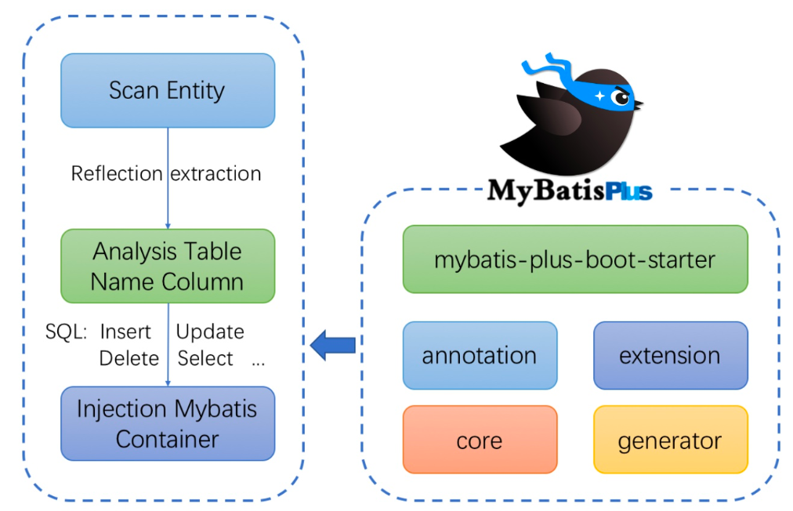
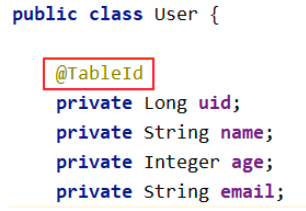
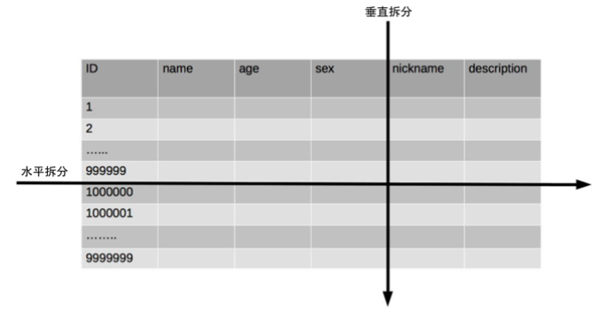
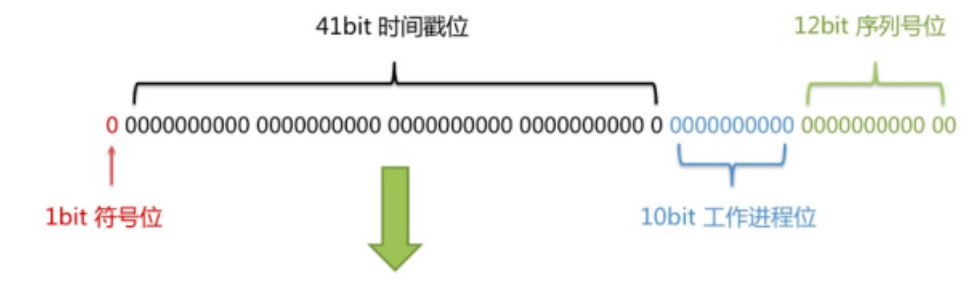
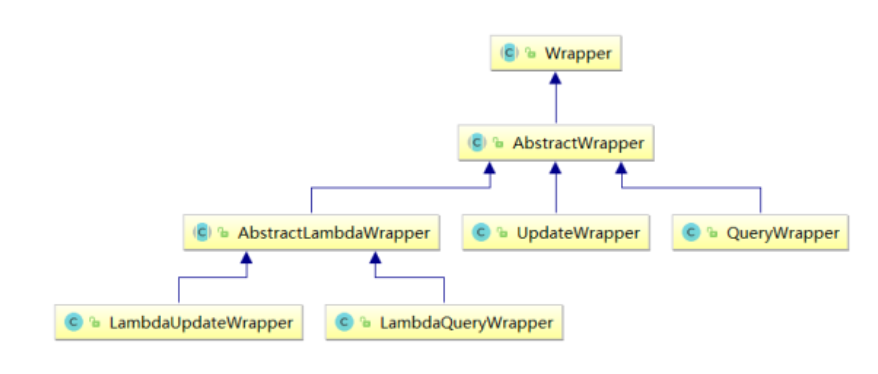

# 1 MyBatis-Plus简介

## 1.1 简介

**MyBatis-Plus**(简称 MP)是一个 **MyBatis**的增强工具**，在 MyBatis 的基础上**只做增强不做改变，为 **简化开发、提高效率而生**。MyBatis-Plus提供了通用的mapper和service，可以在不编写任何SQL语句的情况下，快速的实现对单表的CRUD、批量、逻程删除、分页等操作。本视频从MyBatis-Plus的特性及使用，到MyBatis-Plus所提供的优秀的插件，以及多数据源的配置都有详细的讲解。并对ldea中的快速开发插件MyBatisX也进行了功能的演示

***

## 1.2 特性

- **无侵入**:只做增强不做改变，引入它不会对现有工程产生影响，如丝般顺滑
- **损耗小**:启动即会自动注入基本 CURD，性能基本无损耗，直接面向对象操作
- **强大的CRUD操作**:内置通用 Mapper、通用 Service，仅仅通过少量配置即可实现单表大部分 CRUD 操作，更有强大的条件构造器，满足各类使用需求
-  **支持** **Lambda** **形式调用**:通过 Lambda 表达式，方便的编写各类查询条件，无需再担心字段写错 **支持主键自动生成**:支持多达 4 种主键策略(内含分布式唯一 ID 生成器 - Sequence)，可自由配置，完美解决主键问题
-  **支持** **ActiveRecord** **模式**:支持 ActiveRecord 形式调用，实体类只需继承 Model 类即可进行强大的 CRUD 操作
-  **支持自定义全局通用操作**:支持全局通用方法注入( Write once, use anywhere ) **内置代码生成器**:采用代码或者 Maven 插件可快速生成 Mapper 、 Model 、 Service 、 Controller 层代码，支持模板引擎，更有超多自定义配置等您来使用
-  **内置分页插件**:基于 MyBatis 物理分页，开发者无需关心具体操作，配置好插件之后，写分页等 同于普通 List 查询
-  **分页插件支持多种数据库**:支持 MySQL、MariaDB、Oracle、DB2、H2、HSQL、SQLite、 Postgre、SQLServer 等多种数据库
-  **内置性能分析插件**:可输出 SQL 语句以及其执行时间，建议开发测试时启用该功能，能快速揪出 慢查询

## 1.3 支持数据库

任何能使用MyBatis进行 CRUD, 并且支持标准 SQL 的数据库，具体支持情况如下：

- MySQL，Oracle，DB2，H2，HSQL，SQLite，PostgreSQL，SQLServer，Phoenix，Gauss ， ClickHouse，Sybase，OceanBase，Firebird，Cubrid，Goldilocks，csiidb 
- 达梦数据库，虚谷数据库，人大金仓数据库，南大通用(华库)数据库，南大通用数据库，神通数据 库，瀚高数据库

## 1.4 框架结构



## 1.5 代码及文档地址

官方地址:http://mp.baomidou.com
代码发布地址:
Github: https://github.com/baomidou/mybatis-plus

Gitee: https://gitee.com/baomidou/mybatis-plus 

文档发布地址:https://baomidou.com/pages/24112f

***

# 2 入门案例

## 2.1 开发环境

IDE:idea 2019.2

JDK:JDK8+ 

构建工具:maven 3.5.4 

MySQL版本:MySQL 5.7 

Spring:5.3.1 

MyBatis-Plus:3.4.3.4

***

## 2.2 创建数据库及表

**创建表**

```mysql
CREATE DATABASE `mybatis_plus` /*!40100 DEFAULT CHARACTER SET utf8mb4 */;
use `mybatis_plus`;
CREATE TABLE `user` (
`id` bigint(20) NOT NULL COMMENT '主键ID', 
`name` varchar(30) DEFAULT NULL COMMENT '姓名', 
`age` int(11) DEFAULT NULL COMMENT '年龄', 
`email` varchar(50) DEFAULT NULL COMMENT '邮箱', 
PRIMARY KEY (`id`)
) ENGINE=InnoDB DEFAULT CHARSET=utf8;
```

**添加数据**

```mysql
INSERT INTO user (id, name, age, email) VALUES
(1, 'Jone', 18, 'test1@baomidou.com'),
(2, 'Jack', 20, 'test2@baomidou.com'),
(3, 'Tom', 28, 'test3@baomidou.com'),
(4, 'Sandy', 21, 'test4@baomidou.com'),
(5, 'Billie', 24, 'test5@baomidou.com');
```

## 2.3 创建Spring Boot工程

引入依赖

```xml
<dependencies>
    <dependency>
        <groupId>org.springframework.boot</groupId>
        <artifactId>spring-boot-starter</artifactId>
    </dependency>
    <dependency>
        <groupId>org.springframework.boot</groupId>
        <artifactId>spring-boot-starter-test</artifactId>
        <scope>test</scope>
    </dependency>
    <!-- mybatis-plus -->
    <dependency>
        <groupId>com.baomidou</groupId>
        <artifactId>mybatis-plus-boot-starter</artifactId>
        <version>3.5.1</version>
    </dependency>
    <!-- 用于简化实体类开发 -->
    <dependency>
        <groupId>org.projectlombok</groupId>
        <artifactId>lombok</artifactId>
        <optional>true</optional>
    </dependency>
    <dependency>
        <groupId>mysql</groupId>
        <artifactId>mysql-connector-java</artifactId>
        <scope>runtime</scope>
    </dependency>
</dependencies>
```

配置application.yml

```yaml
spring:
  # 配置数据源信息
  datasource:
    # 配置数据源类型
    type: com.zaxxer.hikari.HikariDataSource
    # 配置连接数据库信息
    driver-class-name: com.mysql.cj.jdbc.Driver
    url: jdbc:mysql://47.76.68.216:3306/mybatis_plus?useSSL=false&serverTimezone=UTC
    username: root
    password: P@ssw0rd123!
```


启动类

```java
@SpringBootApplication
@MapperScan("com.atguigu.mybatisplus.mapper")
public class MybatisplusApplication {
    public static void main(String[] args) {
        SpringApplication.run(MybatisplusApplication.class, args);
	} 
}
```

添加实体

```java
@Data //lombok注解 
public class User {
    private Long id;
    private String name;
    private Integer age;
    private String email;
}
```

添加mapper

```java
public interface UserMapper extends BaseMapper<User> {
}
```

在application.yml中配置日志输出

```yaml
# 配置MyBatis日志
mybatis-plus:
  configuration:
    log-impl: org.apache.ibatis.logging.stdout.StdOutImpl
```

## 2.4 通用mapper

相关操作：

**注意mybatisplus默认的方法都是针对单表进行的操作**，如果有自定义的单表SQL，可参考下面testSelectByMapByMe方法（类名和mapper.xml的名都是跟表名一致，因为也是单表查询）

```java
@SpringBootTest
class MybatisPlusTest {

    @Autowired
    private UserMapper userMapper;

    /* 查询全部 */
    @Test
    public void testSelectList() {
        //selectList()根据MP内置的条件构造器查询一个list集合，null表示没有条件，即查询所有
        userMapper.selectList(null).forEach(System.out::println);
    }

    /* 新增记录 */
    @Test
    public void testInsert(){
        User user = new User();
        user.setName("张三");
        user.setAge(23);
        user.setEmail("zhangsan@atguigu.com");
        //INSERT INTO user ( id, name, age, email ) VALUES ( ?, ?, ?, ? )
        int result = userMapper.insert(user);
        System.out.println("受影响行数:"+result);
        //1475754982694199298 雪花算法自动生成的ID
        System.out.println("id自动获取:"+user.getId());
    }

    /* 通过id删除记录 */
    @Test
    public void testDeleteById(){
        //通过id删除用户信息
        //DELETE FROM user WHERE id=?
        int result = userMapper.deleteById(1475754982694199298L);
        System.out.println("受影响行数:"+result);
    }

    /* 通过map条件删除记录 */
    @Test
    public void testDeleteByMap(){
        //根据map集合中所设置的条件删除记录
        //DELETE FROM user WHERE name = ? AND age = ?
        Map<String, Object> map = new HashMap<>();
        map.put("age", 23);
        map.put("name", "张三");
        int result = userMapper.deleteByMap(map);
        System.out.println("受影响行数:"+result);
    }
    /* 通过id批量删除记录 */
    @Test
    public void testDeleteBatchIds(){
        //通过多个id批量删除
        //DELETE FROM user WHERE id IN ( ? , ? , ? )
        List<Long> idList = Arrays.asList(1L, 2L, 3L);
        int result = userMapper.deleteBatchIds(idList);
        System.out.println("受影响行数:"+result);
    }

    /* 修改记录 */
    @Test
    public void testUpdateById(){
        User user = new User();
        user.setId(4L);
        user.setName("heihei");
        user.setAge(66);
        //UPDATE user SET name=?, age=? WHERE id=?
        int result = userMapper.updateById(user);
        System.out.println("受影响行数:"+result);
    }

    /* 根据id查询用户信息 */
    @Test
    public void testSelectById(){
        //根据id查询用户信息
        //SELECT id,name,age,email FROM user WHERE id=?
        User user = userMapper.selectById(4L);
        System.out.println(user);
    }

    /* 根据多个id查询多个用户信息 */
    @Test
    public void testSelectBatchIds(){
        //根据多个id查询多个用户信息
        //SELECT id,name,age,email FROM user WHERE id IN ( ? , ? )
        List<Long> idList = Arrays.asList(4L, 5L);
        List<User> list = userMapper.selectBatchIds(idList);
        list.forEach(System.out::println);
    }

    /*通过map条件查询用户信息*/
    @Test
    public void testSelectByMap(){
        //通过map条件查询用户信息
        //SELECT id,name,age,email FROM user WHERE name = ? AND age = ?
        Map<String, Object> map = new HashMap<>();
        map.put("age", 24);
        map.put("name", "Billie");
        List<User> list = userMapper.selectByMap(map);
        list.forEach(System.out::println);
    }

    /*自定义一个查询SQL*/
    @Test
    public void testSelectByMapByMe(){
        //通过map条件查询用户信息
        //SELECT id,name,age,email FROM user WHERE name = ? AND age = ?
        Map<String, Object> map  = userMapper.selectMapById(4L);
        System.out.println(map);
    }
}
```

```java
public interface UserMapper extends BaseMapper<User> {
    /* 根据id查询用户信息为map集合 */
    Map<String, Object> selectMapById(Long id);
}
```

```xml
<mapper namespace="com.atguigu.mybatisplus.mapper.UserMapper">
    <select id="selectMapById" resultType="map" >
        select id,name,age,email from user where id = #{id}
    </select>
</mapper>
```

## 2.5 通用Service

说明:

- 通用 Service CRUD 封装IService接口，进一步封装 CRUD 采用 `get查询单行`、`remove删除`、`list查询集合`、`page分页`前缀命名方式区分 Mapper 层避免混淆，

- 泛型 T 为任意实体对象
- 建议如果存在自定义通用 Service 方法的可能，请创建自己的 IBaseService 继承Mybatis-Plus 提供的基类 
- 官网地址:https://baomidou.com/pages/49cc81/#service-crud-%E6%8E%A5%E5%8F%A3

***

MyBatis-Plus中有一个接口 IService和其实现类 ServiceImpl，封装了常见的业务层逻辑 详情查看源码IService和ServiceImpl

***

# 3 **常用注解**

## 3.1 **@TableName**

如果表名跟实体类名不一致，可以在实体类类型上添加`@TableName("t_user")`，标识实体类对应的表即可。

**通过全局配置解决问题**

在开发的过程中，我们经常遇到以上的问题，即实体类所对应的表都有固定的前缀，例如t_或tbl_，此时可以使用MyBatis-Plus提供的全局配置，为实体类所对应的表名设置默认的前缀，那么就 不需要在每个实体类上通过@TableName标识实体类对应的表

```yaml
mybatis-plus:
  configuration:
		# 配置MyBatis日志
    log-impl: org.apache.ibatis.logging.stdout.StdOutImpl
  global-config:
		db-config:
			# 配置MyBatis-Plus操作表的默认前缀 
			table-prefix: t_
```

## 3.2 **@TableId**

经过以上的测试，MyBatis-Plus在实现CRUD时，会默认将`id`作为主键列，并在插入数据时，默认基于雪花算法的策略生成id

若实体类和表中表示主键的不是id，而是其他字段，例如uid，MyBatis-Plus会自动识别uid为主键列吗?

我们实体类中的属性id改为uid，将表中的字段id也改为uid，测试添加功能,发现会出错。

**通过@TableId解决问题**

在实体类中uid属性上通过@TableId将其标识为主键，即可成功执行SQL语句



***

**@TableId的value属性**

若实体类中主键对应的属性为`id`，而表中表示主键的字段为`uid`，此时若只在属性id上添加注解 `@TableId`，则抛出异常Unknown column 'id' in 'field list'，即MyBatis-Plus仍然会将id作为表的 主键操作，而表中表示主键的是字段uid，此时需要通过@TableId注解的value属性，指定表中的主键字段，`@TableId("uid")`或 `@TableId(value="uid")`

**@TableId的type属性**

type属性用来定义主键策略

**常用的主键策略:**

| **值**                 | **描述**                                                     |
| ---------------------- | ------------------------------------------------------------ |
| IdType.ASSIGN_ID(默认) | 基于雪花算法的策略生成数据id，与数据库id是否设置自增无关     |
| IdType.AUTO            | 使用数据库的自增策略，注意，该类型请确保数据库设置了id自增， 否则无效 |

**配置全局主键策略:**

```yaml
mybatis-plus:
  configuration:
		# 配置MyBatis日志
    log-impl: org.apache.ibatis.logging.stdout.StdOutImpl
  global-config:
		db-config:
			# 配置MyBatis-Plus操作表的默认前缀 
			table-prefix: t_
			# 配置MyBatis-Plus的主键策略 (这样就相当于统一配置成全部实体的主键ID都是跟随数据库自增)
			id-type: auto
```

***

## 3.3 **雪花算法**

**背景**

需要选择合适的方案去应对数据规模的增长，以应对逐渐增长的访问压力和数据量。数据库的扩展方式主要包括:业务分库、主从复制，数据库分表。

**数据库分表**

将不同业务数据分散存储到不同的数据库服务器，能够支撑百万甚至千万用户规模的业务，但如果业务继续发展，同一业务的单表数据也会达到单台数据库服务器的处理瓶颈。例如，淘宝的几亿用户数据，如果全部存放在一台数据库服务器的一张表中，肯定是无法满足性能要求的，此时就需要对单表数据进
行拆分。单表数据拆分有两种方式:垂直分表和水平分表。示意图如下:



**垂直分表**

垂直分表适合将表中某些不常用且占了大量空间的列拆分出去。

例如，前面示意图中的 nickname 和 description 字段，假设我们是一个婚恋网站，用户在筛选其他用 户的时候，主要是用 age 和 sex 两个字段进行查询，而 nickname 和 description 两个字段主要用于展 示，一般不会在业务查询中用到。description 本身又比较长，因此我们可以将这两个字段独立到另外 一张表中，这样在查询 age 和 sex 时，就能带来一定的性能提升。

**水平分表**

水平分表适合表行数特别大的表，有的公司要求单表行数超过 5000 万就必须进行分表，这个数字可以 作为参考，但并不是绝对标准，关键还是要看表的访问性能。对于一些比较复杂的表，可能超过 1000 万就要分表了;而对于一些简单的表，即使存储数据超过 1 亿行，也可以不分表。

但不管怎样，当看到表的数据量达到千万级别时，作为架构师就要警觉起来，因为这很可能是架构的性
能瓶颈或者隐患。

水平分表相比垂直分表，会引入更多的复杂性，例如要求全局唯一的数据id该如何处理

***

**主键自增**

1. 以最常见的用户 ID 为例，可以按照 1000000 的范围大小进行分段，1 ~ 999999 放到表 1中， 1000000 ~ 1999999 放到表2中，以此类推。
2. 复杂点:分段大小的选取。分段太小会导致切分后子表数量过多，增加维护复杂度;分段太大可能会 导致单表依然存在性能问题，一般建议分段大小在 100 万至 2000 万之间，具体需要根据业务选取合适的分段大小。
3. 优点:可以随着数据的增加平滑地扩充新的表。例如，现在的用户是 100 万，如果增加到 1000 万， 只需要增加新的表就可以了，原有的数据不需要动。
4. 缺点:分布不均匀。假如按照 1000 万来进行分表，有可能某个分段实际存储的数据量只有 1 条，而 另外一个分段实际存储的数据量有 1000 万条。

***

**取模**

1. 同样以用户 ID 为例，假如我们一开始就规划了 10 个数据库表，可以简单地用 user_id % 10 的值来 表示数据所属的数据库表编号，ID 为 985 的用户放到编号为 5 的子表中，ID 为 10086 的用户放到编号 为 6 的子表中。
2. 复杂点:初始表数量的确定。表数量太多维护比较麻烦，表数量太少又可能导致单表性能存在问题。
3. 优点:表分布比较均匀。
4. 缺点:扩充新的表很麻烦，所有数据都要重分布。

***

**雪花算法**

雪花算法是由Twitter公布的分布式主键生成算法，它能够保证不同表的`主键的不重复性`，以及相同表的`主键的有序性`。

- 核心思想: 长度共64bit(一个long型)。

首先是一个符号位，1bit标识，由于long基本类型在Java中是带符号的，最高位是符号位，正数是0，负数是1，所以id一般是正数，最高位是0。

41bit时间截(毫秒级)，存储的是时间截的差值(当前时间截 - 开始时间截)，结果约等于69.73年。 10bit作为机器的ID(5个bit是数据中心，5个bit的机器ID，可以部署在1024个节点)。 12bit作为毫秒内的流水号(意味着每个节点在每毫秒可以产生 4096 个 ID)。

- 优点:整体上按照时间自增排序，并且整个分布式系统内不会产生ID碰撞，并且效率较高



***

## 3.4 @TableField

经过以上的测试，我们可以发现，MyBatis-Plus在执行SQL语句时，要保证实体类中的属性名和 表中的字段名一致， 如果实体类中的属性名和字段名不一致的情况，会出现什么问题呢?

**情况1**

若实体类中的属性使用的是驼峰命名风格，而表中的字段使用的是下划线命名风格 例如实体类属性`userName`，表中字段`user_name` 此时MyBatis-Plus会`自动`将下划线命名风格转化为驼峰命名风格 相当于在MyBatis中配置

**情况2**

若实体类中的属性和表中的字段不满足情况1 例如实体类属性`name`，表中字段`username` 此时需要在实体类属性上使用`@TableField("username")`设置属性所对应的字段名

***

## 3.5 @TableLogic

**逻辑删除**

- 物理删除:真实删除，将对应数据从数据库中删除，之后查询不到此条被删除的数据 
- 逻辑删除:假删除，将对应数据中代表是否被删除字段的状态修改为“被删除状态”，之后在数据库 中仍旧能看到此条数据记录
-  使用场景:可以进行数据恢复

***

# 4 条件构造器和常用接口

## 4.1 wrapper介绍



Wrapper : 条件构造抽象类，最顶端父类

-  AbstractWrapper : 用于查询条件封装，生成 sql 的 where 条件
  - QueryWrapper : 查询条件封装 
  - UpdateWrapper : Update 条件封装 
  - AbstractLambdaWrapper : 使用Lambda 语法
    - LambdaQueryWrapper :用于Lambda语法使用的查询Wrapper
    - LambdaUpdateWrapper : Lambda 更新封装Wrapper

***

## 4.2 QueryWrapper

### 4.2.1 组装查询条件

```java
 @Test
 public void test01(){
     //查询用户名包含a，年龄在20到30之间，并且邮箱不为null的用户信息
     //SELECT id,username AS name,age,email,is_deleted FROM t_user WHERE
     //is_deleted=0 AND (username LIKE ? AND age BETWEEN ? AND ? AND email IS NOT NULL)
     QueryWrapper<User> queryWrapper = new QueryWrapper<>();
     queryWrapper.like("name", "h")
             .between("age", 20, 90)
             .isNotNull("email");
     List<User> list = userMapper.selectList(queryWrapper);
     list.forEach(System.out::println);
 }
```

### 4.2.2 组装排序条件

```java
@Test
public void test02(){
    //按年龄降序查询用户，如果年龄相同则按id升序排列
    //SELECT id,username AS name,age,email,is_deleted FROM t_user WHERE is_deleted=0 ORDER BY age DESC,id ASC
    QueryWrapper<User> queryWrapper = new QueryWrapper<>();
    queryWrapper.orderByDesc("age")
            .orderByAsc("id");
    List<User> users = userMapper.selectList(queryWrapper);
    users.forEach(System.out::println);
}
```

### 4.2.3 组装删除条件

```java
 @Test
 public void test03(){
     //删除email为空的用户
     //DELETE FROM t_user WHERE (email IS NULL)
     QueryWrapper<User> queryWrapper = new QueryWrapper<>();
     queryWrapper.isNull("email"); //条件构造器也可以构建删除语句的条件
     int result = userMapper.delete(queryWrapper);
     System.out.println("受影响的行数:" + result);
 }
```

***

### 4.2.4 修改条件的优先级

```java
/*将(年龄大于20并且用户名中包含有a)或邮箱为null的用户信息修改 */
@Test
 public void test04() {
     QueryWrapper<User> queryWrapper = new QueryWrapper<>();
     //UPDATE user SET age=?, email=? WHERE is_deleted=0 AND (name LIKE ? AND age > ? OR email IS NULL)
     queryWrapper
             .like("name", "a")
             .gt("age", 20)
             .or()
             .isNull("email");
     User user = new User();
     user.setAge(18);
     user.setEmail("user@atguigu.com");
     // 第一个参数是修改的内容，第二个参数是查询条件
     int result = userMapper.update(user, queryWrapper);
     System.out.println("受影响的行数:" + result);
 }
```

```java
/*将用户名中包含有a并且(年龄大于20或邮箱为null)的用户信息修改*/
@Test
public void test05() {
    QueryWrapper<User> queryWrapper = new QueryWrapper<>();
    //UPDATE user SET age=?, email=? WHERE is_deleted=0 AND (name LIKE ? AND (age > ? OR email IS NULL))
    //lambda表达式内的逻辑优先运算
    queryWrapper.like("name", "a")
        .and(i -> i.gt("age", 20).or().isNull("email"));
    User user = new User();
    user.setAge(18);
    user.setEmail("user@atguigu.com");
    int result = userMapper.update(user, queryWrapper);
    System.out.println("受影响的行数:" + result);
}
```

***

### 4.2.5 组装select字句

```java
/*查询用户信息的username和age字段*/
@Test
public void test06() {
    //SELECT username,age FROM t_user
    QueryWrapper<User> queryWrapper = new QueryWrapper<>();
    queryWrapper.select("name", "age");
    //selectMaps()返回Map集合列表，通常配合select()使用，避免User对象中没有被查询到的列值为null
    List<Map<String, Object>> maps = userMapper.selectMaps(queryWrapper);
    maps.forEach(System.out::println);
    // 转换结果列表
    List<User> resultList = new ArrayList<>();
    // 遍历Map列表
    for (Map<String, Object> map : maps) {
        // hutool工具
        User user = BeanUtil.toBean(map, User.class);
        resultList.add(user);
    }
    // 打印转换后的对象列表
    resultList.forEach(System.out::println);
}
```

### 4.2.6 实现子查询

```java
@Test
public void test07() {
    //查询id小于等于3的用户信息
    //SELECT id,name,age,email,is_deleted FROM user WHERE is_deleted=0 AND (id IN (select id from user where id <= 10))
    QueryWrapper<User> queryWrapper = new QueryWrapper<>();
    queryWrapper.inSql("id", "select id from user where id <= 10");
    List<User> list = userMapper.selectList(queryWrapper);
    list.forEach(System.out::println);
}
```

***

## 4.3 UpdateWrapper

实现跟上面一样的修改功能：

修改建议使用这个方式，因为不用创建实体类对象

```java
 /*将用户名中包含有a并且(年龄大于20或邮箱为null)的用户信息修改*/
 @Test
 public void test08() {
     // 组装set子句以及修改条件
     UpdateWrapper<User> updateWrapper = new UpdateWrapper<>(); //lambda表达式内的逻辑优先运算
     updateWrapper
             .set("age", 18)//修改的值
             .set("email", "user@atguigu.com")//修改的值
             .like("name", "a")
             .and(i -> i.gt("age", 20).or().isNull("email"));
     //UPDATE user SET age=?,email=? WHERE is_deleted=0 AND (name LIKE ? AND (age > ? OR email IS NULL))
     int result = userMapper.update(null, updateWrapper);
     System.out.println(result);
 }
```

## 4.4 condition

在真正开发的过程中，组装条件是常见的功能，而这些条件数据来源于用户输入，是可选的，因 此我们在组装这些条件时，必须先判断用户是否选择了这些条件，若选择则需要组装该条件，若 没有选择则一定不能组装，以免影响SQL执行的结果

**思路一:**

```java
 @Test
 public void test09() {
     //定义查询条件，有可能为null(用户未输入或未选择)
     String username = null;
     Integer ageBegin = 10;
     Integer ageEnd = null;
     QueryWrapper<User> queryWrapper = new QueryWrapper<>();
     //StringUtils.isNotBlank()判断某字符串是否不为空且长度不为0且不由空白符(whitespace)构成
     if(StringUtils.isNotBlank(username)){
         queryWrapper.like("username","a");
     }
     if(ageBegin != null){
         queryWrapper.ge("age", ageBegin);
     }
     if(ageEnd != null){
         queryWrapper.le("age", ageEnd);
     }
     //SELECT id,username AS name,age,email,is_deleted FROM t_user WHERE (age >=? AND age <= ?)
     List<User> users = userMapper.selectList(queryWrapper);
     users.forEach(System.out::println);
 }
```

**思路二:**

上面的实现方案没有问题，但是代码比较复杂，我们可以使用带condition参数的重载方法构建查 询条件，简化代码的编写

```java
@Test
public void test08UseCondition() {
    //定义查询条件，有可能为null(用户未输入或未选择)
    String username = null;
    Integer ageBegin = 10;
    Integer ageEnd = null;
    QueryWrapper<User> queryWrapper = new QueryWrapper<>();
    //StringUtils.isNotBlank()判断某字符串是否不为空且长度不为0且不由空白符(whitespace)构成
    queryWrapper
        .like(StringUtils.isNotBlank(username), "username", "a")
        .ge(ageBegin != null, "age", ageBegin)
        .le(ageEnd != null, "age", ageEnd);
    //SELECT id,username AS name,age,email,is_deleted FROM t_user WHERE (age >=? AND age <= ?)
    List<User> users = userMapper.selectList(queryWrapper);
    users.forEach(System.out::println);
}
```

***

## 4.5 LambdaQueryWrapper

```java
@Test
public void test10() {
    //定义查询条件，有可能为null(用户未输入)
    String username = "a";
    Integer ageBegin = null;
    Integer ageEnd = 24;
    LambdaQueryWrapper<User> queryWrapper = new LambdaQueryWrapper<>();
    //避免使用字符串表示字段，防止运行时错误
    queryWrapper
            .like(StringUtils.isNotBlank(username), User::getName, username)
            .ge(ageBegin != null, User::getAge, ageBegin)
            .le(ageEnd != null, User::getAge, ageEnd);
    List<User> users = userMapper.selectList(queryWrapper);
    users.forEach(System.out::println);
}
```

## 4.6 LambdaUpdateWrapper

```java
@Test
public void test11() { //组装set子句
    LambdaUpdateWrapper<User> updateWrapper = new LambdaUpdateWrapper<>();
    updateWrapper
            .set(1!=1,User::getAge, 18)
            .set(User::getEmail, "user@atguigu.com")
            .like(User::getName, "a")
            .and(i -> i.lt(User::getAge, 24).or().isNull(User::getEmail));
    //lambda表达式内的逻辑优先运算
    User user = new User();
    int result = userMapper.update(user, updateWrapper);
    System.out.println("受影响的行数:" + result);
}
```

# 5 插件

## 5.1 分页插件

MyBatis Plus自带分页插件，只要简单的配置即可实现分页功能

```java
@Configuration
@MapperScan("com.atguigu.mybatisplus.mapper")
public class MybatisPlusConfig {
@Bean
public MybatisPlusInterceptor mybatisPlusInterceptor() {
        MybatisPlusInterceptor interceptor = new MybatisPlusInterceptor();
        interceptor.addInnerInterceptor(new
                PaginationInnerInterceptor(DbType.MYSQL));
        return interceptor;
    }
}
```

```java
@Test
public void testPage(){
    //设置分页参数
    Page<User> page = new Page<>(1, 5);
    userMapper.selectPage(page, null);
    //获取分页数据
    List<User> list = page.getRecords();
    list.forEach(System.out::println);
    System.out.println("当前页:"+page.getCurrent());
    System.out.println("每页显示的条数:"+page.getSize());
    System.out.println("总记录数:"+page.getTotal());
    System.out.println("总页数:"+page.getPages());
    System.out.println("是否有上一页:"+page.hasPrevious());
    System.out.println("是否有下一页:"+page.hasNext());
}
```

service：

```java
Page<Blog> page = blogService.query()
                .eq("user_id", user.getId()).page(new Page<>(current, SystemConstants.MAX_PAGE_SIZE));
```

## 5.2 xml自定义分页

自己写的SQL也想使用分页插件功能。

**UserMapper中定义接口方法**

```java
/**
 * 根据年龄查询用户列表，分页显示
 * @param page 分页对象,xml中可以从里面进行取值,传递参数 Page 即自动分页,必须放在第一位
 * @param age 年龄
 * @return
 */
Page<User> selectPageVo(@Param("page") Page<User> page, @Param("age") Integer age);
```

**UserMapper.xml中编写SQL**

```xml
<!--SQL片段，记录基础字段-->
<sql id="BaseColumns">id,name,age,email</sql>
<!-- 配置了type-aliases-package: com.atguigu.mybatisplus.pojo可以直接使用User -->
<select id="selectPageVo" resultType="User">
    SELECT <include refid="BaseColumns"></include> FROM user WHERE age > #{age}
</select>
```

**测试**

```java
@Test
public void testSelectPageVo(){
    //设置分页参数
    Page<User> page = new Page<>(1, 3);
    userMapper.selectPageVo(page, 22);
    //获取分页数据
    List<User> list = page.getRecords();
    list.forEach(System.out::println);
    System.out.println("当前页:"+page.getCurrent());
    System.out.println("每页显示的条数:"+page.getSize());
    System.out.println("总记录数:"+page.getTotal());
    System.out.println("总页数:"+page.getPages());
    System.out.println("是否有上一页:"+page.hasPrevious());
    System.out.println("是否有下一页:"+page.hasNext());
}
```

***

## 5.3 乐观锁

**场景**

一件商品，成本价是`80元`，售价是`100元`。老板先是通知小李，说你去把商品价格增加`50元`。小李正在玩游戏，耽搁了一个小时。正好一个小时后，老板觉得商品价格增加到150元，价格太 高，可能会影响销量。又通知小王，你把商品价格降低30元。

此时，小李和小王同时操作商品后台系统。小李操作的时候，系统先取出商品价格100元;小王 也在操作，取出的商品价格也是100元。小李将价格加了50元，并将100+50=150元存入了数据 库;小王将商品减了30元，并将100-30=70元存入了数据库。是的，如果没有锁，小李的操作就 完全被小王的覆盖了。现在商品价格是70元，比成本价低10元。几分钟后，这个商品很快出售了1千多件商品，老板亏1万多。

***

**乐观锁与悲观锁**

上面的故事，如果是乐观锁，小王保存价格前，会检查下价格是否被人修改过了。如果被修改过了，则重新取出的被修改后的价格，150元，这样他会将120元存入数据库。

如果是悲观锁，小李取出数据后，小王只能等小李操作完之后，才能对价格进行操作，也会保证最终的价格是120元。

***

**模拟修改冲突**

**数据库中增加商品表**

```mysql
CREATE TABLE product
(
id BIGINT(20) NOT NULL COMMENT '主键ID',
NAME VARCHAR(30) NULL DEFAULT NULL COMMENT '商品名称',
price INT(11) DEFAULT 0 COMMENT '价格',
VERSION INT(11) DEFAULT 0 COMMENT '乐观锁版本号', 
PRIMARY KEY (id)
);

# 新增数据
INSERT INTO product (id, NAME, price) VALUES (1, '外星人笔记本', 100);
```

**添加实体**

```java
@Data
public class Product {
    private Long id;
    private String name;
    private Integer price;
    private Integer version;
}
```

**添加mapper**

```java
public interface ProductMapper extends BaseMapper<Product> {
}
```

**测试出现问题**

```java
@Test
public void testConcurrentUpdate() {
    //1、小李
    Product p1 = productMapper.selectById(1L);
    System.out.println("小李取出的价格:" + p1.getPrice());
    //2、小王
    Product p2 = productMapper.selectById(1L);
    System.out.println("小王取出的价格:" + p2.getPrice());
    //3、小李将价格加了50元，存入了数据库
    p1.setPrice(p1.getPrice() + 50);
    int result1 = productMapper.updateById(p1);
    System.out.println("小李修改结果:" + result1);
    //4、小王将商品减了30元，存入了数据库
    p2.setPrice(p2.getPrice() - 30);
    int result2 = productMapper.updateById(p2);
    System.out.println("小王修改结果:" + result2);
    //最后的结果
    Product p3 = productMapper.selectById(1L);
    //价格覆盖，最后的结果:70
    System.out.println("最后的结果:" + p3.getPrice());
}
```

***

**乐观锁实现流程**

数据库中添加version字段

取出记录时，获取当前version

```sql
SELECT id,`name`,price,`version` FROM product WHERE id=1
```

更新时，version + 1，如果where语句中的version版本不对，则更新失败

```mysql
UPDATE product SET price=price+50, `version`=`version` + 1 WHERE id=1 AND
`version`=1
```

***

**Mybatis-Plus实现乐观锁**

**修改实体类**

```java
@Data
public class Product {
    private Long id;
    private String name;
    private Integer price;
    @Version
    private Integer version;
}
```

**添加乐观锁插件配置**

```java
@Bean
public MybatisPlusInterceptor mybatisPlusInterceptor(){ MybatisPlusInterceptor interceptor = new MybatisPlusInterceptor(); //添加分页插件
interceptor.addInnerInterceptor(new
PaginationInnerInterceptor(DbType.MYSQL)); //添加乐观锁插件
    interceptor.addInnerInterceptor(new OptimisticLockerInnerInterceptor());
    return interceptor;
}
```

**测试修改冲突**

小李查询商品信息:

`SELECT id,name,price,version FROM t_product WHERE id=?`

小王查询商品信息:

`SELECT id,name,price,version FROM t_product WHERE id=? `

小李修改商品价格，自动将version+1
 `UPDATE t_product SET name=?, price=?, version=? WHERE id=? AND version=? `Parameters: 外星人笔记本(String), 150(Integer), 1(Integer), 1(Long), 0(Integer) 

小王修改商品价格，此时version已更新，条件不成立，修改失败
 `UPDATE t_product SET name=?, price=?, version=? WHERE id=? AND version=? `Parameters: 外星人笔记本(String), 70(Integer), 1(Integer), 1(Long), 0(Integer) 

**最终，小王修改失败，查询价格:150**
 SELECT id,name,price,version FROM t_product WHERE id=?

***

解决方案是，最后判断：`int result2 = productMapper.updateById(p2);`

如果result2营销的行数为0，那么抛出异常，让前端重新添加一次。

***

# 6 通用枚举

表中的有些字段值是固定的，例如性别(男或女)，此时我们可以使用MyBatis-Plus的通用枚举 来实现

**数据库表添加字段sex**

```mysql
ALTER TABLE user ADD sex int default 0;
```

**创建通用枚举类型**

```java
@Getter
public enum SexEnum {
    MALE(1, "男"),
    FEMALE(2, "女");
    @EnumValue
    private Integer sex;
    private String sexName;
    SexEnum(Integer sex, String sexName) {
        this.sex = sex;
        this.sexName = sexName;
    } 
}
```

修改User实体增加

```java
private SexEnum sex;
```

**配置扫描通用枚举**

```yaml
spring:
  datasource:
    type: com.zaxxer.hikari.HikariDataSource
    driver-class-name: com.mysql.cj.jdbc.Driver
    url: jdbc:mysql://47.76.68.216:3306/mybatis_plus?useSSL=false&serverTimezone=UTC
    username: root
    password: P@ssw0rd123!
mybatis-plus:
  configuration:
    log-impl: org.apache.ibatis.logging.stdout.StdOutImpl
  type-aliases-package: com.atguigu.mybatisplus.pojo
  # 配置扫描通用枚举
  type-enums-package: com.atguigu.mybatisplus.enums
```

测试

```java
@Test
public void testSexEnum(){
    User user = new User();
    user.setName("Enum");
    //设置性别信息为枚举项，会将@EnumValue注解所标识的属性值存储到数据库
    user.setAge(20); 
    user.setSex(SexEnum.MALE);
    //INSERT INTO t_user ( username, age, sex ) VALUES ( ?, ?, ? )
    //Parameters: Enum(String), 20(Integer), 1(Integer)
    userMapper.insert(user);
}
```

# 7 代码生成器

**引入依赖**

```xml
<dependency>
    <groupId>com.baomidou</groupId>
    <artifactId>mybatis-plus-generator</artifactId>
    <version>3.5.1</version>
</dependency>
<dependency>
    <groupId>org.freemarker</groupId>
    <artifactId>freemarker</artifactId>
    <version>2.3.31</version>
</dependency>
```

```java
public class FastAutoGeneratorTest {
    public static void main(String[] args) {
        FastAutoGenerator.create("jdbc:mysql://47.76.68.216:3306/mybatis_plus?useSSL=false&serverTimezone=UTC", "root", "123456")
                        .globalConfig(builder -> {
                            builder.author("wing") // 设置作者
                            // .enableSwagger() // 开启 swagger 模式
                            .fileOverride() // 覆盖已生成文件
                            .outputDir("/Users/wing/architect/MybatisPlusAutoCode"); // 指定输出目录
                        })
                        .packageConfig(builder -> {
                            builder.parent("com.atguigu") // 设置父包名
                                    .moduleName("mybatisplus") // 设置父包模块名
                                    .pathInfo(Collections.singletonMap(OutputFile.mapperXml, "/Users/wing/architect/MybatisPlusAutoCode")); // 设置mapperXml生成路径
                        })
                        .strategyConfig(builder -> {
                            builder.addInclude("user") // 设置需要生成的表名
                                    .addTablePrefix("t_", "c_"); // 设置过滤表前缀
                             })
                        .templateEngine(new FreemarkerTemplateEngine()) // 使用Freemarker 引擎模板，默认的是Velocity引擎模板
                        .execute();
    }
}
```

# 8 多数据源

适用于多种场景:纯粹多库、 读写分离、 一主多从、 混合模式等 目前我们就来模拟一个纯粹多库的一个场景，其他场景类似 场景说明:

我们创建两个库，分别为:mybatis_plus(以前的库不动)与mybatis_plus_1(新建)，将 mybatis_plus库的product表移动到mybatis_plus_1库，这样每个库一张表，通过一个测试用例 分别获取用户数据与商品数据，如果获取到说明多库模拟成功

***

**创建数据库及表**

```mysql
CREATE DATABASE `mybatis_plus_1` /*!40100 DEFAULT CHARACTER SET utf8mb4 */;
use `mybatis_plus_1`;
CREATE TABLE product
(
id BIGINT(20) NOT NULL COMMENT '主键ID',
name VARCHAR(30) NULL DEFAULT NULL COMMENT '商品名称', price INT(11) DEFAULT 0 COMMENT '价格',
version INT(11) DEFAULT 0 COMMENT '乐观锁版本号', PRIMARY KEY (id)
);
```

添加测试数据

```mysql
INSERT INTO product (id, NAME, price) VALUES (1, '外星人笔记本', 100);
```

删除mybatis_plus库product表

```mysql
use mybatis_plus;
DROP TABLE IF EXISTS product;
```

```yaml
spring:
# 配置数据源信息 datasource:
dynamic:
# 设置默认的数据源或者数据源组,默认值即为master
primary: master
# 严格匹配数据源,默认false.true未匹配到指定数据源时抛异常,false使用默认数据源 strict: false
datasource:
        master:
          url: jdbc:mysql://localhost:3306/mybatis_plus?characterEncoding=utf-
8&useSSL=false
          driver-class-name: com.mysql.cj.jdbc.Driver
          username: root
          password: 123456
        slave_1:
          url: jdbc:mysql://localhost:3306/mybatis_plus_1?characterEncoding=utf-
8&useSSL=false
          driver-class-name: com.mysql.cj.jdbc.Driver
          username: root
          password: 123456
```

指定数据源

```java
@DS("master") //指定所操作的数据源
@Service
public class UserServiceImpl extends ServiceImpl<UserMapper, User> implements UserService {
}
```

```java
@DS("slave_1")
@Service
public class ProductServiceImpl extends ServiceImpl<ProductMapper, Product>
implements ProductService {
}
```

测试

```java
/* 查询全部 */
@Test
public void testDynamicDataSource(){
    System.out.println(userService.getById(4L));
    System.out.println(productService.getById(1L));
}
```

结果: 

1、都能顺利获取对象，则测试成功

2、**如果我们实现读写分离，将写操作方法加上主库数据源，读操作方法加上从库数据源，自动切换，是不是就能实现读写分离?**


