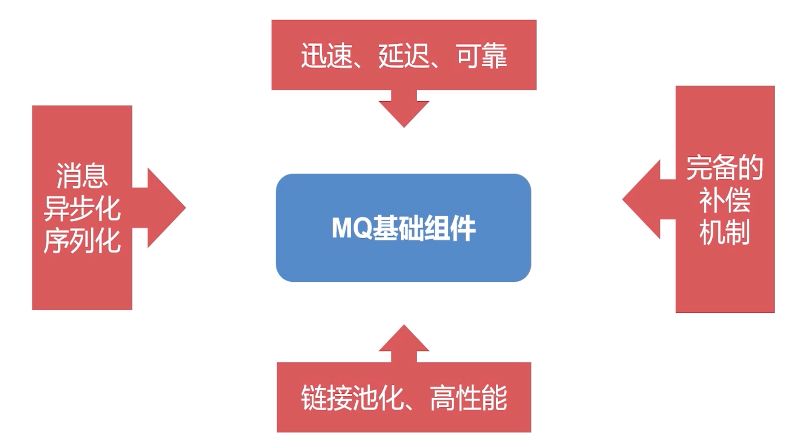
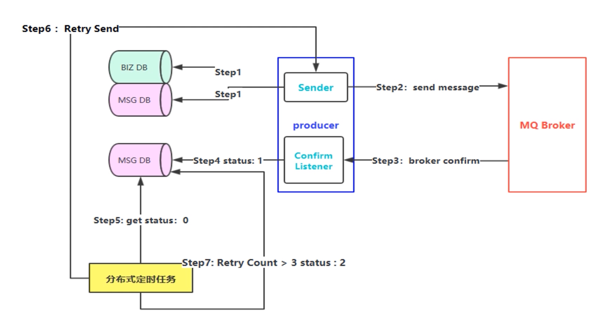

> 需要用到zookeeper，后续再来重新梳理这个组件。

# 1 基础组件实现关键点

> 基础组件封装设计
>
> - 迅速消息发送
> - 确认消息发送
> - 延迟消息发送



***

# 2 模块划分介绍

- **rabbit-parent**

父工程，用来管理所有的子模块，只保留一个`pom.xml`文件

```xml
<project xmlns="http://maven.apache.org/POM/4.0.0" xmlns:xsi="http://www.w3.org/2001/XMLSchema-instance" xsi:schemaLocation="http://maven.apache.org/POM/4.0.0 http://maven.apache.org/xsd/maven-4.0.0.xsd">
  	<modelVersion>4.0.0</modelVersion>
	<parent>
		<groupId>org.springframework.boot</groupId>
		<artifactId>spring-boot-starter-parent</artifactId>
		<version>2.1.5.RELEASE</version>
		<relativePath/> <!-- lookup parent from repository -->
	</parent>
	<groupId>com.bfxy.base.rabbit</groupId>
  	<artifactId>rabbit-parent</artifactId>
  	<packaging>pom</packaging>
  	<name>rabbit-parent</name>
  	<description>rabbit-parent</description>
  	<version>0.0.1-SNAPSHOT</version>

	<modules>
		<module>rabbit-common</module>
		<module>rabbit-api</module>
		<module>rabbit-core-producer</module>
		<module>rabbit-task</module>
	</modules>

	<!-- 因为是快速开发组件，所以这里的版本依赖这里配置了 -->
	<properties>
		<project.build.sourceEncoding>UTF-8</project.build.sourceEncoding>
		<java.version>8</java.version>
        <fasterxml.uuid.version>3.1.4</fasterxml.uuid.version>
        <org.codehaus.jackson.version>1.9.13</org.codehaus.jackson.version>
        <druid.version>1.0.24</druid.version>
        <elastic-job.version>2.1.4</elastic-job.version>
		<guava.version>20.0</guava.version>
	    <commons-lang3.version>3.3.1</commons-lang3.version>
	    <commons-io.version>2.4</commons-io.version>
	    <commons-collections.version>3.2.2</commons-collections.version>
		<curator.version>2.11.0</curator.version>
		<fastjson.version>1.1.26</fastjson.version>        
	</properties>

  	<dependencies>
		<dependency>
			<groupId>org.springframework.boot</groupId>
			<artifactId>spring-boot-starter</artifactId>
		</dependency>  	
		<dependency>
			<groupId>org.springframework.boot</groupId>
			<artifactId>spring-boot-starter-test</artifactId>
			<scope>test</scope>
		</dependency>
        <dependency>
            <groupId>org.projectlombok</groupId>
            <artifactId>lombok</artifactId>
            <scope>provided</scope>
        </dependency>		
		<dependency>
		    <groupId>com.google.guava</groupId>
		    <artifactId>guava</artifactId>
		    <version>${guava.version}</version>
		</dependency>
		<dependency>
			<groupId>org.apache.commons</groupId>
			<artifactId>commons-lang3</artifactId>
		</dependency>
		<dependency>
			<groupId>commons-io</groupId>
			<artifactId>commons-io</artifactId>
			<version>${commons-io.version}</version>
		</dependency>
		<dependency>
			<groupId>com.alibaba</groupId>
			<artifactId>fastjson</artifactId>
			<version>${fastjson.version}</version>
		</dependency>    	
        <!--对json格式的支持 -->
        <dependency>
            <groupId>org.codehaus.jackson</groupId>
            <artifactId>jackson-mapper-asl</artifactId>
            <version>${org.codehaus.jackson.version}</version>
        </dependency>
        <dependency>
            <groupId>com.fasterxml.jackson.core</groupId>
            <artifactId>jackson-databind</artifactId>
        </dependency>   
        <dependency>
            <groupId>com.fasterxml.uuid</groupId>
            <artifactId>java-uuid-generator</artifactId>
            <version>${fasterxml.uuid.version}</version>
        </dependency>  
  	</dependencies>
</project>
```

- **rabbit-api**

  对外提供的统一API接口

- **rabbit-common**

  公共的，其他模块都要用的工具类等

- **rabbit-core-producer**

  发送消息核心模块

- rabbit-task

  封装当当网定时任务

***

# 3 基础组件API封装

先封装 rabbit-api 模块

## 3.1 pom.xml

```xml
<project xmlns="http://maven.apache.org/POM/4.0.0" xmlns:xsi="http://www.w3.org/2001/XMLSchema-instance" xsi:schemaLocation="http://maven.apache.org/POM/4.0.0 http://maven.apache.org/xsd/maven-4.0.0.xsd">
  <modelVersion>4.0.0</modelVersion>
  <parent>
    <groupId>com.bfxy.base.rabbit</groupId>
    <artifactId>rabbit-parent</artifactId>
    <version>0.0.1-SNAPSHOT</version>
  </parent>
  <artifactId>rabbit-api</artifactId>
</project>
```

## 3.2 消息类型封装

```java
/**
 *  消息类型
 */
public final class MessageType {

	/**
	 * 	迅速消息：不需要保障消息的可靠性, 也不需要做confirm确认
	 */
	public static final String RAPID = "0";
	
	/**
	 * 	确认消息：不需要保障消息的可靠性，但是会做消息的confirm确认
	 */
	public static final String CONFIRM = "1";
	
	/**
	 * 	可靠性消息： 一定要保障消息的100%可靠性投递，不允许有任何消息的丢失
	 * 	PS: 保障数据库和所发的消息是原子性的（最终一致的）
	 */
	public static final String RELIANT = "2";
	
}
```

## 3.3 发送消息实体封装

```java
/**
 *  消息发送实体
 */
@Data
public class Message implements Serializable {

	private static final long serialVersionUID = 841277940410721237L;

	/* 	消息的唯一ID	    */
	private String messageId;
	
	/*	消息的主题        */
	private String topic;
	
	/*	消息的路由规则	*/
	private String routingKey = "";
	
	/*	消息的附加属性	*/
	private Map<String, Object> attributes = new HashMap<String, Object>();
	
	/*	延迟消息的参数配置	*/
	private int delayMills;
	
	/*	消息类型：默认为confirm消息类型	*/
	private String messageType = MessageType.CONFIRM;

	public Message() {
	}
	
	public Message(String messageId, String topic, String routingKey, Map<String, Object> attributes, int delayMills) {
		this.messageId = messageId;
		this.topic = topic;
		this.routingKey = routingKey;
		this.attributes = attributes;
		this.delayMills = delayMills;
	}
	
	public Message(String messageId, String topic, String routingKey, Map<String, Object> attributes, int delayMills,
			String messageType) {
		this.messageId = messageId;
		this.topic = topic;
		this.routingKey = routingKey;
		this.attributes = attributes;
		this.delayMills = delayMills;
		this.messageType = messageType;
	}
	
}
```

这样三方需要调用组件发送消息时，传Message对象过来，这样我们就知道消息的全部内容了，但是使用方每次new Message 设置参数不方便，我们使用建造者模式来方便使用者创建出 Message实体。

## 3.4 MessageBuilder 封装

```java

/**
 *  建造者模式: 创建Message
 */
public class MessageBuilder {

	private String messageId;
	private String topic;
	private String routingKey = "";
	private Map<String, Object> attributes = new HashMap<String, Object>();
	private int delayMills;
	private String messageType = MessageType.CONFIRM;
	
  // 私有化构造方法
	private MessageBuilder() {
	}
	
	public static MessageBuilder create() {
		return new MessageBuilder();
	}
	
	public MessageBuilder withMessageId(String messageId) {
		this.messageId = messageId;
		return this;
	}
	
	public MessageBuilder withTopic(String topic) {
		this.topic = topic;
		return this;
	}
	
	public MessageBuilder withRoutingKey(String routingKey) {
		this.routingKey = routingKey;
		return this;
	}

	public MessageBuilder withAttributes(Map<String, Object> attributes) {
		this.attributes = attributes;
		return this;
	}
	
	public MessageBuilder withAttribute(String key, Object value) {
		this.attributes.put(key, value);
		return this;
	}
	
	public MessageBuilder withDelayMills(int delayMills) {
		this.delayMills = delayMills;
		return this;
	}
	
	public MessageBuilder withMessageType(String messageType) {
		this.messageType = messageType;
		return this;
	}

	public Message build() {
		
		// 1. check messageId 
		if(messageId == null) {
			messageId = UUID.randomUUID().toString();
		}
		// 2. topic is null
		if(topic == null) {
			throw new MessageRunTimeException("this topic is null");
		}
		Message message = new Message(messageId, topic, routingKey, attributes, delayMills, messageType);
		return message;
	}
	
}
```

## 3.5 自定义异常封装

组件中有异常的话，可以抛出自定义的异常

MessageException

```java
/**
 *  自定义异常
 */
public class MessageException extends Exception {

	private static final long serialVersionUID = 6347951066190728758L;

	public MessageException() {
		super();
	}
	public MessageException(String message) {
		super(message);
	}
	public MessageException(String message, Throwable cause) {
		super(message, cause);
	}
	public MessageException(Throwable cause) {
		super(cause);
	}
}
```

MessageRunTimeException

```java
/**
 *  自定义运行时异常
 */
public class MessageRunTimeException extends RuntimeException {

	private static final long serialVersionUID = 8651828913888663267L;

	public MessageRunTimeException() {
		super();
	}
	public MessageRunTimeException(String message) {
		super(message);
	}
	public MessageRunTimeException(String message, Throwable cause) {
		super(message, cause);
	}
	public MessageRunTimeException(Throwable cause) {
		super(cause);
	}
}
```

> 如果组件需要更加细化异常的话，可以再定义一个更加具体的异常类继承 MessageException 或者 MessageRunTimeException 

## 3.6 生产者API接口

暴露给使用者，用来发送消息的API

```java
/**
 * 	生产者API接口
 */
public interface MessageProducer {

	/**
	 * 	$send消息的发送 附带SendCallback回调执行响应的业务逻辑处理
	 * @param message
	 * @param sendCallback
	 * @throws MessageRunTimeException
	 */
	void send(Message message, SendCallback sendCallback) throws MessageRunTimeException;
	
	/**
	 * 	message消息的发送
	 * @param message
	 * @throws MessageRunTimeException
	 */
	void send(Message message) throws MessageRunTimeException;
	
	/**
	 * 	$send 消息的批量发送
	 * @param messages
	 * @throws MessageRunTimeException
	 */
	void send(List<Message> messages) throws MessageRunTimeException;
	
}
```

回调处理接口

```java
/**
 * 	回调函数处理
 */
public interface SendCallback {
  void onSuccess();
	void onFailure();
}
```

## 3.7 消费者API接口

组件主要的作用是用来发送消息，所以没有提供消费者功能，但是后续如果需要组件也有消费者功能，可以扩展进来。

```java
/**
 * 	消费者监听消息
 */
public interface MessageListener {
	void onMessage(Message message);
}
```

> rabbit-api封装完成

# 4 生产者核心模块封装

pom.xml

```xml
<project xmlns="http://maven.apache.org/POM/4.0.0" xmlns:xsi="http://www.w3.org/2001/XMLSchema-instance" xsi:schemaLocation="http://maven.apache.org/POM/4.0.0 http://maven.apache.org/xsd/maven-4.0.0.xsd">
  	<modelVersion>4.0.0</modelVersion>
  	<parent>
    	<groupId>com.bfxy.base.rabbit</groupId>
    	<artifactId>rabbit-parent</artifactId>
    	<version>0.0.1-SNAPSHOT</version>
  	</parent>
  	<artifactId>rabbit-core-producer</artifactId>
  	
  	<dependencies>
      <!-- rabbit-common 已经依赖了 rabbit-api -->
  		<dependency>
    		<groupId>com.bfxy.base.rabbit</groupId>
    		<artifactId>rabbit-common</artifactId> 
    		<version>0.0.1-SNAPSHOT</version>			
  		</dependency>
      
  		<dependency>
    		<groupId>com.bfxy.base.rabbit</groupId>
    		<artifactId>rabbit-task</artifactId> 
    		<version>0.0.1-SNAPSHOT</version>			
  		</dependency>  		
  	</dependencies>
</project>
```

`rabbit-core-producer`

> 这个模块需要被第三方引入到工程，被当成SDK，所以在META-INF下创建一个 spring.factoriest文件,Spring扫描时会读取到这个文件，然后自动装配文件里配置好的类。

## 4.1 自动装配

spring.factories：

```xml
# Auto Configure
org.springframework.boot.autoconfigure.EnableAutoConfiguration=\
com.bfxy.rabbit.producer.autoconfigure.RabbitProducerAutoConfiguration
```

RabbitProducerAutoConfiguration：

```java
/**
 *  自动装配配置类
 */
@EnableElasticJob
@Configuration
@ComponentScan({"com.bfxy.rabbit.producer.*"})
public class RabbitProducerAutoConfiguration {

}
```

## 4.2 发送消息核心类ProducerClient

实现API中的接口

```java

/**
 *  发送消息的实际实现类
 */
@Component
public class ProducerClient implements MessageProducer {

	@Autowired
	private RabbitBroker rabbitBroker;
	
  // 发送单条消息
	@Override
	public void send(Message message) throws MessageRunTimeException {
    // 判断如果为null则抛出空指针异常
		Preconditions.checkNotNull(message.getTopic());
    // 获取当前消息的类型：迅速消息、确认消息、可靠性消息
		String messageType = message.getMessageType();
		switch (messageType) {
      // 迅速消息
			case MessageType.RAPID:
				rabbitBroker.rapidSend(message);
				break;
      // 确认消息
			case MessageType.CONFIRM:
				rabbitBroker.confirmSend(message);
				break;
      // 可靠性消息
			case MessageType.RELIANT:
				rabbitBroker.reliantSend(message);
				break;
		default:
			break;
		}
	}

	// 批量发送消息
	@Override
	public void send(List<Message> messages) throws MessageRunTimeException {
		messages.forEach( message -> {
			message.setMessageType(MessageType.RAPID);
			MessageHolder.add(message);
		});
		rabbitBroker.sendMessages();
	}
	
  // 发送消息附带回调处理
	@Override
	public void send(Message message, SendCallback sendCallback) throws MessageRunTimeException {
		// TODO Auto-generated method stub
		
	}
}
```

## 4.3 发送消息底层实现

具体发送不同种类型消息的接口

```java
/**
 * 	具体发送不同种类型消息的接口
 */
public interface RabbitBroker {
	// 迅速消息
	void rapidSend(Message message);
	// 确认消息
	void confirmSend(Message message);
	// 可靠性消息
	void reliantSend(Message message);
  // 迅速批量消息
	void sendMessages();
}
```

真正的发送不同类型的消息实现类

```java
/**
 * 	真正的发送不同类型的消息实现类
 */
@Slf4j
@Component
public class RabbitBrokerImpl implements RabbitBroker {

	@Autowired
	private RabbitTemplateContainer rabbitTemplateContainer;
	
	@Autowired
	private MessageStoreService messageStoreService;

	/**
	 * 	迅速消息
	 */
	@Override
	public void rapidSend(Message message) {
		message.setMessageType(MessageType.RAPID);
		sendKernel(message);
	}

	/**
	 * 	确认消息
	 */
	@Override
	public void confirmSend(Message message) {
		message.setMessageType(MessageType.CONFIRM);
		sendKernel(message);
	}

	/**
	 * 	可靠性消息
	 */
	@Override
	public void reliantSend(Message message) {
		message.setMessageType(MessageType.RELIANT);
		BrokerMessage bm = messageStoreService.selectByMessageId(message.getMessageId());
		if(bm == null) {
			//1. 把数据库的消息发送日志先记录好
			Date now = new Date();
			BrokerMessage brokerMessage = new BrokerMessage();
			brokerMessage.setMessageId(message.getMessageId());
			brokerMessage.setStatus(BrokerMessageStatus.SENDING.getCode());
			//tryCount 在最开始发送的时候不需要进行设置
			brokerMessage.setNextRetry(DateUtils.addMinutes(now, BrokerMessageConst.TIMEOUT));
			brokerMessage.setCreateTime(now);
			brokerMessage.setUpdateTime(now);
			brokerMessage.setMessage(message);
			messageStoreService.insert(brokerMessage);			
		}
		//2. 执行真正的发送消息逻辑
		sendKernel(message);
	}

	/**
	 * 	迅速批量消息
	 */
	@Override
	public void sendMessages() {
		List<Message> messages = MessageHolder.clear();
		messages.forEach(message -> {
			MessageHolderAyncQueue.submit((Runnable) () -> {
				CorrelationData correlationData =
						new CorrelationData(String.format("%s#%s#%s",
								message.getMessageId(),
								System.currentTimeMillis(),
								message.getMessageType()));
				String topic = message.getTopic();
				String routingKey = message.getRoutingKey();
				RabbitTemplate rabbitTemplate = rabbitTemplateContainer.getTemplate(message);
				rabbitTemplate.convertAndSend(topic, routingKey, message, correlationData);
				log.info("#RabbitBrokerImpl.sendMessages# send to rabbitmq, messageId: {}", message.getMessageId());
			});
		});
	}

	/**
	 * 	发送消息的核心方法 使用异步线程池进行发送消息
	 */
	private void sendKernel(Message message) {
		AsyncBaseQueue.submit((Runnable) () -> {
			// 消息的唯一标示：使用MessageId、System.currentTimeMillis()、MessageType进行拼接
			CorrelationData correlationData = 
					new CorrelationData(String.format("%s#%s#%s",
							message.getMessageId(),
							System.currentTimeMillis(),
							message.getMessageType()));
			String topic = message.getTopic();
			String routingKey = message.getRoutingKey();
			RabbitTemplate rabbitTemplate = rabbitTemplateContainer.getTemplate(message);
			rabbitTemplate.convertAndSend(topic, routingKey, message, correlationData);
			log.info("#RabbitBrokerImpl.sendKernel# send to rabbitmq, messageId: {}", message.getMessageId());			
		});
	}

}
```

## 4.4 异步线程池

自定义线程池【后面学了JUC编程后回来继续看这个】

> 个人理解：如果不使用异步，流程是业务向MQ发送消息后，需要等待MQ响应后才能继续执行下面业务；
>
> 而如果使用异步发送消息，那么业务向MQ发送消息后无需等待MQ响应，依然继续往下执行业务，因此效率更高，但是可靠性得不到保证，刚好如果发的是迅速消息，那就无所谓了。

```java
/**
 *  自定义线程池
 */
@Slf4j
public class AsyncBaseQueue {

	private static final int THREAD_SIZE = Runtime.getRuntime().availableProcessors();
	
	private static final int QUEUE_SIZE = 10000;
	
	private static ExecutorService senderAsync =
			new ThreadPoolExecutor(THREAD_SIZE,
					THREAD_SIZE,
					60L,
					TimeUnit.SECONDS,
					new ArrayBlockingQueue<Runnable>(QUEUE_SIZE),
					new ThreadFactory() {
						@Override
						public Thread newThread(Runnable r) {
							Thread t = new Thread(r);
							t.setName("rabbitmq_client_async_sender");
							return t;
						}
					},
					new java.util.concurrent.RejectedExecutionHandler() {
						@Override
						public void rejectedExecution(Runnable r, ThreadPoolExecutor executor) {
							log.error("async sender is error rejected, runnable: {}, executor: {}", r, executor);
						}
					});
			
		public static void submit(Runnable runnable) {
			senderAsync.submit(runnable);
		}	
			
}
```

> 由于 RabbitTemplate 在Spring中是单例存在，每发一次消息都要对这个单例对象进行一次修改，这样效率很低。因此可以将 RabbitTemplate 进行池化处理，提前创建出不同主题的 RabbitTemplate 对象保存到池子中，使用的时候直接获取即可。

## 4.5 池化封装RabbitTemplate

池化封装

```java
/**
 *  池化封装
 * 	每一个topic 对应一个RabbitTemplate
 *	1.	提高发送的效率
 * 	2. 	可以根据不同的需求制定化不同的RabbitTemplate, 比如每一个topic 都有自己的routingKey规则
 */
@Slf4j
@Component
public class RabbitTemplateContainer implements RabbitTemplate.ConfirmCallback {

	// 创建RabbitTemplate需要用到连接工厂
	@Autowired
	private ConnectionFactory connectionFactory;

	@Autowired
	private MessageStoreService messageStoreService;

	// 保存不同主题的RabbitTemplate对象
	private Map<String, RabbitTemplate> rabbitMap = Maps.newConcurrentMap();

	// 根据指定字符拆分
	private Splitter splitter = Splitter.on("#");
	
	private SerializerFactory serializerFactory = JacksonSerializerFactory.INSTANCE;
	
	public RabbitTemplate getTemplate(Message message) throws MessageRunTimeException {
		// 判断是否为null
		Preconditions.checkNotNull(message);
		// 获取主题
		String topic = message.getTopic();
		// 从map中根据主题获取 RabbitTemplate
		RabbitTemplate rabbitTemplate = rabbitMap.get(topic);
		// 如果已经存在，直接返回对应的 RabbitTemplate
		if(rabbitTemplate != null) {
			return rabbitTemplate;
		}
		log.info("#RabbitTemplateContainer.getTemplate# topic: {} is not exists, create one", topic);

		// 创建一个RabbitTemplate
		RabbitTemplate newTemplate = new RabbitTemplate(connectionFactory);
		newTemplate.setExchange(topic);
		newTemplate.setRoutingKey(message.getRoutingKey());
		newTemplate.setRetryTemplate(new RetryTemplate());
		
		//	添加序列化反序列化和converter对象
		Serializer serializer = serializerFactory.create();
		GenericMessageConverter gmc = new GenericMessageConverter(serializer);
		RabbitMessageConverter rmc = new RabbitMessageConverter(gmc);
		newTemplate.setMessageConverter(rmc);
		
		String messageType = message.getMessageType();
		// 如果不是迅速消息，都要设置回调方法
		if(!MessageType.RAPID.equals(messageType)) {
			newTemplate.setConfirmCallback(this);
		}

		// 存在不put，不存在则put
		rabbitMap.putIfAbsent(topic, newTemplate);
		
		return rabbitMap.get(topic);
	}

	/**
	 * 	无论是 confirm 消息 还是 reliant 消息 ，发送消息以后 broker都会去回调confirm
	 */
	@Override
	public void confirm(CorrelationData correlationData, boolean ack, String cause) {
		// 	具体的消息应答,使用工具类按指定字符拆分
		List<String> strings = splitter.splitToList(correlationData.getId());
		// 消息ID
		String messageId = strings.get(0);
		// 消息时间
		long sendTime = Long.parseLong(strings.get(1));
		// 消息类型
		String messageType = strings.get(2);
		if(ack) {
			//	当Broker 返回ACK成功时, 就是更新一下日志表里对应的消息发送状态为 SEND_OK
			
			// 	如果当前消息类型为reliant 我们就去数据库查找并进行更新
			if(MessageType.RELIANT.endsWith(messageType)) {
				this.messageStoreService.succuess(messageId);
			}
			log.info("send message is OK, confirm messageId: {}, sendTime: {}", messageId, sendTime);
		} else {
			log.error("send message is Fail, confirm messageId: {}, sendTime: {}", messageId, sendTime);
			
		}
	}
}
```

***

# 5 可靠性消息投递



## 5.1 表与表对应的相关类

MSG DB 表

rabbit-producer-message-schema.sql

```sql
CREATE TABLE IF NOT EXISTS `broker_message` (
  `message_id` varchar(128) NOT NULL,
  `message` varchar(4000) comment '全量消息',
  `try_count` int(4) DEFAULT 0 comment '最大努力尝试次数',
  `status` varchar(10) DEFAULT '' comment '0 待确认 1 投递成功已确认 2 投递失败',
  `next_retry` timestamp NOT NULL DEFAULT '0000-00-00 00:00:00' comment '下一次尝试的时间',
  `create_time` timestamp NOT NULL DEFAULT '0000-00-00 00:00:00' comment '创建时间',
  `update_time` timestamp NOT NULL DEFAULT '0000-00-00 00:00:00' comment '更新时间',
  PRIMARY KEY (`message_id`)
) ENGINE=InnoDB DEFAULT CHARSET=utf8;
```

对应实体

```java
/**
 * 	消息记录表实体映射
 */
public class BrokerMessage implements Serializable {
	
	private static final long serialVersionUID = 7447792462810110841L;

	private String messageId;

    private Message message;

    /** 最大努力尝试次数 */
    private Integer tryCount = 0;

    /** 0 待确认 1 投递成功已确认 2 投递失败 */
    private String status;

    /** 下一次尝试的时间 */
    private Date nextRetry;

    private Date createTime;

    private Date updateTime;

    public void setMessageId(String messageId) {
        this.messageId = messageId == null ? null : messageId.trim();
    }

    public void setStatus(String status) {
        this.status = status == null ? null : status.trim();
    }
   // 省略get/set方法

}
```

mapper

```java
@Mapper
public interface BrokerMessageMapper {
	
    int deleteByPrimaryKey(String messageId);
    
    int insert(BrokerMessage record);

    int insertSelective(BrokerMessage record);

    BrokerMessage selectByPrimaryKey(String messageId);

    int updateByPrimaryKeySelective(BrokerMessage record);

//    int updateByPrimaryKeyWithBLOBs(BrokerMessage record);

    int updateByPrimaryKey(BrokerMessage record);
	
	void changeBrokerMessageStatus(@Param("brokerMessageId")String brokerMessageId, @Param("brokerMessageStatus")String brokerMessageStatus, @Param("updateTime")Date updateTime);

	List<BrokerMessage> queryBrokerMessageStatus4Timeout(@Param("brokerMessageStatus")String brokerMessageStatus);
	
	List<BrokerMessage> queryBrokerMessageStatus(@Param("brokerMessageStatus")String brokerMessageStatus);
	
	int update4TryCount(@Param("brokerMessageId")String brokerMessageId, @Param("updateTime")Date updateTime);
	
}
```

mapper.xml

```xml
<?xml version="1.0" encoding="UTF-8" ?>
<!DOCTYPE mapper PUBLIC "-//mybatis.org//DTD Mapper 3.0//EN" "http://mybatis.org/dtd/mybatis-3-mapper.dtd" >
<mapper namespace="com.bfxy.rabbit.producer.mapper.BrokerMessageMapper" >
  <resultMap id="BaseResultMap" type="com.bfxy.rabbit.producer.entity.BrokerMessage" >
    <id column="message_id" property="messageId" jdbcType="VARCHAR" />
    <result column="message" property="message" jdbcType="VARCHAR" typeHandler="com.bfxy.rabbit.common.mybatis.handler.MessageJsonTypeHandler" />
    <result column="try_count" property="tryCount" jdbcType="INTEGER" />
    <result column="status" property="status" jdbcType="VARCHAR" />
    <result column="next_retry" property="nextRetry" jdbcType="TIMESTAMP" />
    <result column="create_time" property="createTime" jdbcType="TIMESTAMP" />
    <result column="update_time" property="updateTime" jdbcType="TIMESTAMP" />
  </resultMap>
  <sql id="Base_Column_List" >
    message_id, message, try_count, status, next_retry, create_time, update_time
  </sql>
  <select id="selectByPrimaryKey" resultMap="BaseResultMap" parameterType="java.lang.String" >
    select 
    <include refid="Base_Column_List" />
    from broker_message
    where message_id = #{messageId,jdbcType=VARCHAR}
  </select>
  <delete id="deleteByPrimaryKey" parameterType="java.lang.String" >
    delete from broker_message
    where message_id = #{messageId,jdbcType=VARCHAR}
  </delete>
  <insert id="insert" parameterType="com.bfxy.rabbit.producer.entity.BrokerMessage" >
    insert into broker_message (message_id, message, try_count, 
      status, next_retry, create_time, 
      update_time)
    values (#{messageId,jdbcType=VARCHAR}, #{message,jdbcType=VARCHAR, typeHandler=com.bfxy.rabbit.common.mybatis.handler.MessageJsonTypeHandler}, #{tryCount,jdbcType=INTEGER}, 
      #{status,jdbcType=VARCHAR}, #{nextRetry,jdbcType=TIMESTAMP}, #{createTime,jdbcType=TIMESTAMP}, 
      #{updateTime,jdbcType=TIMESTAMP})
  </insert>
  <insert id="insertSelective" parameterType="com.bfxy.rabbit.producer.entity.BrokerMessage" >
    insert into broker_message
    <trim prefix="(" suffix=")" suffixOverrides="," >
      <if test="messageId != null" >
        message_id,
      </if>
      <if test="message != null" >
        message,
      </if>
      <if test="tryCount != null" >
        try_count,
      </if>
      <if test="status != null" >
        status,
      </if>
      <if test="nextRetry != null" >
        next_retry,
      </if>
      <if test="createTime != null" >
        create_time,
      </if>
      <if test="updateTime != null" >
        update_time,
      </if>
    </trim>
    <trim prefix="values (" suffix=")" suffixOverrides="," >
      <if test="messageId != null" >
        #{messageId,jdbcType=VARCHAR},
      </if>
      <if test="message != null" >
        #{message,jdbcType=VARCHAR, typeHandler=com.bfxy.rabbit.common.mybatis.handler.MessageJsonTypeHandler},
      </if>
      <if test="tryCount != null" >
        #{tryCount,jdbcType=INTEGER},
      </if>
      <if test="status != null" >
        #{status,jdbcType=VARCHAR},
      </if>
      <if test="nextRetry != null" >
        #{nextRetry,jdbcType=TIMESTAMP},
      </if>
      <if test="createTime != null" >
        #{createTime,jdbcType=TIMESTAMP},
      </if>
      <if test="updateTime != null" >
        #{updateTime,jdbcType=TIMESTAMP},
      </if>
    </trim>
  </insert>
  <update id="updateByPrimaryKeySelective" parameterType="com.bfxy.rabbit.producer.entity.BrokerMessage" >
    update broker_message
    <set >
      <if test="message != null" >
        message = #{message,jdbcType=VARCHAR, typeHandler=com.bfxy.rabbit.common.mybatis.handler.MessageJsonTypeHandler},
      </if>
      <if test="tryCount != null" >
        try_count = #{tryCount,jdbcType=INTEGER},
      </if>
      <if test="status != null" >
        status = #{status,jdbcType=VARCHAR},
      </if>
      <if test="nextRetry != null" >
        next_retry = #{nextRetry,jdbcType=TIMESTAMP},
      </if>
      <if test="createTime != null" >
        create_time = #{createTime,jdbcType=TIMESTAMP},
      </if>
      <if test="updateTime != null" >
        update_time = #{updateTime,jdbcType=TIMESTAMP},
      </if>
    </set>
    where message_id = #{messageId,jdbcType=VARCHAR}
  </update>
  <update id="updateByPrimaryKey" parameterType="com.bfxy.rabbit.producer.entity.BrokerMessage" >
    update broker_message
    set message = #{message,jdbcType=VARCHAR, typeHandler=com.bfxy.rabbit.common.mybatis.handler.MessageJsonTypeHandler},
      try_count = #{tryCount,jdbcType=INTEGER},
      status = #{status,jdbcType=VARCHAR},
      next_retry = #{nextRetry,jdbcType=TIMESTAMP},
      create_time = #{createTime,jdbcType=TIMESTAMP},
      update_time = #{updateTime,jdbcType=TIMESTAMP}
    where message_id = #{messageId,jdbcType=VARCHAR}
  </update>
  

  <update id="changeBrokerMessageStatus" >
    update broker_message bm
    set bm.status = #{brokerMessageStatus,jdbcType=VARCHAR},
      	bm.update_time = #{updateTime, jdbcType=TIMESTAMP}
    where bm.message_id = #{brokerMessageId,jdbcType=VARCHAR}  
  </update>
  
  
  <select id="queryBrokerMessageStatus4Timeout" resultMap="BaseResultMap" >
  	<![CDATA[
	    select message_id, message, try_count, status, next_retry, create_time, update_time
	    from broker_message bm
	    where bm.status = #{brokerMessageStatus,jdbcType=VARCHAR}  	
	    and bm.next_retry < sysdate()
    ]]>
  </select>
  
  <select id="queryBrokerMessageStatus" resultMap="BaseResultMap" >
	    select message_id, message, try_count, status, next_retry, create_time, update_time
	    from broker_message bm
	    where bm.status = #{brokerMessageStatus,jdbcType=VARCHAR}  	
  </select>
  
   <update id="update4TryCount" >
    update broker_message bm
    set bm.try_count = bm.try_count + 1,
      bm.update_time = #{updateTime,jdbcType=TIMESTAMP}
    where bm.message_id = #{brokerMessageId,jdbcType=VARCHAR}
   </update>
  
</mapper>
```

## 5.2 数据源相关配置

rabbit-producer-message.properties

```properties
rabbit.producer.druid.type=com.alibaba.druid.pool.DruidDataSource
rabbit.producer.druid.jdbc.url=jdbc:mysql://localhost:3306/broker_message?characterEncoding=UTF-8&autoReconnect=true&zeroDateTimeBehavior=convertToNull&useUnicode=true&serverTimezone=GMT
rabbit.producer.druid.jdbc.driver-class-name=com.mysql.jdbc.Driver
rabbit.producer.druid.jdbc.username=root
rabbit.producer.druid.jdbc.password=root
rabbit.producer.druid.jdbc.initialSize=5
rabbit.producer.druid.jdbc.minIdle=1
rabbit.producer.druid.jdbc.maxActive=100
rabbit.producer.druid.jdbc.maxWait=60000
rabbit.producer.druid.jdbc.timeBetweenEvictionRunsMillis=60000
rabbit.producer.druid.jdbc.minEvictableIdleTimeMillis=300000
rabbit.producer.druid.jdbc.validationQuery=SELECT 1 FROM DUAL
rabbit.producer.druid.jdbc.testWhileIdle=true
rabbit.producer.druid.jdbc.testOnBorrow=false
rabbit.producer.druid.jdbc.testOnReturn=false
rabbit.producer.druid.jdbc.poolPreparedStatements=true
rabbit.producer.druid.jdbc.maxPoolPreparedStatementPerConnectionSize= 20
rabbit.producer.druid.jdbc.filters=stat,wall,log4j
rabbit.producer.druid.jdbc.useGlobalDataSourceStat=true
```

数据源配置

```java
/**
 * 	数据源配置
 */
@Configuration
@PropertySource({"classpath:rabbit-producer-message.properties"})
public class RabbitProducerDataSourceConfiguration {
	
	private static Logger LOGGER = org.slf4j.LoggerFactory.getLogger(RabbitProducerDataSourceConfiguration.class);
	
	@Value("${rabbit.producer.druid.type}")
	private Class<? extends DataSource> dataSourceType;
	
	@Bean(name = "rabbitProducerDataSource")
	@Primary
	@ConfigurationProperties(prefix = "rabbit.producer.druid.jdbc")
	public DataSource rabbitProducerDataSource() throws SQLException {
		DataSource rabbitProducerDataSource = DataSourceBuilder.create().type(dataSourceType).build();
		LOGGER.info("============= rabbitProducerDataSource : {} ================", rabbitProducerDataSource);
		return rabbitProducerDataSource;
	}
	
    public DataSourceProperties primaryDataSourceProperties(){
        return new DataSourceProperties();
    }
    
    public DataSource primaryDataSource(){
        return primaryDataSourceProperties().initializeDataSourceBuilder().build();
    }
	
}
```

项目启动自动进行数据库表结构的创建

```java
/**
 * 	帮我执行SQL脚本
 * 	帮我进行数据库表结构的创建
 */
@Configuration
public class BrokerMessageConfiguration {

    @Autowired
    private DataSource rabbitProducerDataSource;
    
    @Value("classpath:rabbit-producer-message-schema.sql")
    private Resource schemaScript;
    
    @Bean
    public DataSourceInitializer initDataSourceInitializer() {
    	System.err.println("--------------rabbitProducerDataSource-----------:" + rabbitProducerDataSource);
        final DataSourceInitializer initializer = new DataSourceInitializer();
        initializer.setDataSource(rabbitProducerDataSource);
        initializer.setDatabasePopulator(databasePopulator());
        return initializer;
    }

    private DatabasePopulator databasePopulator() {
        final ResourceDatabasePopulator populator = new ResourceDatabasePopulator();
        populator.addScript(schemaScript);
        return populator;
    }
}
```

指定mapper.xml在哪个目录下

```java
@Configuration
// 数据源加载之后，才加载这个类
@AutoConfigureAfter(value = {RabbitProducerDataSourceConfiguration.class})
public class RabbitProducerMyBatisConfiguration {

	@Resource(name= "rabbitProducerDataSource")
	private DataSource rabbitProducerDataSource;
	
	@Bean(name="rabbitProducerSqlSessionFactory")
	public SqlSessionFactory rabbitProducerSqlSessionFactory(DataSource rabbitProducerDataSource) {
		
		SqlSessionFactoryBean bean = new SqlSessionFactoryBean();
		bean.setDataSource(rabbitProducerDataSource);
		ResourcePatternResolver resolver = new PathMatchingResourcePatternResolver();
		try {
			// 指定mapper.xml在哪个目录下
			bean.setMapperLocations(resolver.getResources("classpath:com/bfxy/rabbit/producer/mapping/*.xml"));
			SqlSessionFactory sqlSessionFactory = bean.getObject();
			sqlSessionFactory.getConfiguration().setCacheEnabled(Boolean.TRUE);
			return sqlSessionFactory;
		} catch (Exception e) {
			throw new RuntimeException(e);
		}
	}
	
	@Bean(name="rabbitProducerSqlSessionTemplate")
	public SqlSessionTemplate rabbitProducerSqlSessionTemplate(SqlSessionFactory sqlSessionFactory) {
		return new SqlSessionTemplate(sqlSessionFactory);
	}
	
}
```

扫描

```java
@Configuration
// RabbitProducerDataSourceConfiguration加载之后，才加载这个类
@AutoConfigureAfter(RabbitProducerDataSourceConfiguration.class)
public class RabbitProducerMybatisMapperScanerConfig {
	
	@Bean(name="rabbitProducerMapperScannerConfigurer")
    public MapperScannerConfigurer rabbitProducerMapperScannerConfigurer() {
        MapperScannerConfigurer mapperScannerConfigurer = new MapperScannerConfigurer();
        mapperScannerConfigurer.setSqlSessionFactoryBeanName("rabbitProducerSqlSessionFactory");
        mapperScannerConfigurer.setBasePackage("com.bfxy.rabbit.producer.mapper");
        return mapperScannerConfigurer;
    }
}
```

## 5.3 业务实现落地

Service

```java
@Service
public class MessageStoreService {

	@Autowired
	private BrokerMessageMapper brokerMessageMapper;
	
	public int insert(BrokerMessage brokerMessage) {
		return this.brokerMessageMapper.insert(brokerMessage);
	}
	
	public BrokerMessage selectByMessageId(String messageId) {
		return this.brokerMessageMapper.selectByPrimaryKey(messageId);
	}

	public void succuess(String messageId) {
		this.brokerMessageMapper.changeBrokerMessageStatus(messageId,
				BrokerMessageStatus.SEND_OK.getCode(),
				new Date());
	}
	
	public void failure(String messageId) {
		this.brokerMessageMapper.changeBrokerMessageStatus(messageId,
				BrokerMessageStatus.SEND_FAIL.getCode(),
				new Date());
	}
	
	public List<BrokerMessage> fetchTimeOutMessage4Retry(BrokerMessageStatus brokerMessageStatus){
		return this.brokerMessageMapper.queryBrokerMessageStatus4Timeout(brokerMessageStatus.getCode());
	}
	
	public int updateTryCount(String brokerMessageId) {
		return this.brokerMessageMapper.update4TryCount(brokerMessageId, new Date());
	}

}
```

常量信息

```java
public interface BrokerMessageConst {
	int TIMEOUT = 1;
}
```

消息的发送状态

```java
public enum BrokerMessageStatus {

	// 消息发送，待MQ确认
	SENDING("0"),
	// 消息发送，MQ返回ACK
	SEND_OK("1"),
	// 消息发送失败
	SEND_FAIL("2"),
	SEND_FAIL_A_MOMENT("3");
	
	private String code;
	
	private BrokerMessageStatus(String code) {
		this.code = code;
	}
	
	public String getCode() {
		return this.code;
	}
}
```

# 6 ESJOB定时任务

`rabbit-task`

pom.xml

```xml
<project xmlns="http://maven.apache.org/POM/4.0.0" xmlns:xsi="http://www.w3.org/2001/XMLSchema-instance" xsi:schemaLocation="http://maven.apache.org/POM/4.0.0 http://maven.apache.org/xsd/maven-4.0.0.xsd">
  	<modelVersion>4.0.0</modelVersion>
  	<parent>
    	<groupId>com.bfxy.base.rabbit</groupId>
    	<artifactId>rabbit-parent</artifactId>
    	<version>0.0.1-SNAPSHOT</version>
  	</parent>
  	<artifactId>rabbit-task</artifactId>
  	<properties>
		<elastic-job.version>2.1.4</elastic-job.version>
	</properties>
	<dependencies>
	    <!-- spring boot dependency -->
	    <dependency>
	      	<groupId>org.springframework.boot</groupId>
	      	<artifactId>spring-boot-starter</artifactId>
	    </dependency>
		<!--  elastic-job dependency -->
	    <dependency>
	      <groupId>com.dangdang</groupId>
	      <artifactId>elastic-job-lite-core</artifactId>
	      <version>${elastic-job.version}</version>
	    </dependency>
	    <dependency>
	      <groupId>com.dangdang</groupId>
	      <artifactId>elastic-job-lite-spring</artifactId>
	      <version>${elastic-job.version}</version>
	    </dependency>
	    <dependency>
	    	<groupId>org.springframework.boot</groupId>
	    	<artifactId>spring-boot-configuration-processor</artifactId>
	    	<optional>true</optional>
	    </dependency>
	</dependencies>    	
</project>
```


# 7 公共模块封装

`rabbit-common`

```xml
<project xmlns="http://maven.apache.org/POM/4.0.0" xmlns:xsi="http://www.w3.org/2001/XMLSchema-instance" xsi:schemaLocation="http://maven.apache.org/POM/4.0.0 http://maven.apache.org/xsd/maven-4.0.0.xsd">
  	<modelVersion>4.0.0</modelVersion>
  	<parent>
    	<groupId>com.bfxy.base.rabbit</groupId>
    	<artifactId>rabbit-parent</artifactId>
    	<version>0.0.1-SNAPSHOT</version>
  	</parent>
  	<artifactId>rabbit-common</artifactId>
  	<dependencies>
      <!-- 引入基础API -->
  		<dependency>
    		<groupId>com.bfxy.base.rabbit</groupId>
    		<artifactId>rabbit-api</artifactId>
    		<version>0.0.1-SNAPSHOT</version>  			
  		</dependency>
  		<dependency>
  			<groupId>org.springframework.boot</groupId>
  			<artifactId>spring-boot-starter-amqp</artifactId>
  		</dependency>
		<dependency>
			<groupId>org.springframework.boot</groupId>
			<artifactId>spring-boot-starter-jdbc</artifactId>
		</dependency>
	    <dependency>
	      <groupId>org.mybatis.spring.boot</groupId>
	      <artifactId>mybatis-spring-boot-starter</artifactId>
	      <version>1.1.1</version>
	    </dependency>
		<dependency>
		    <groupId>com.alibaba</groupId>
		    <artifactId>druid</artifactId>
		    <version>1.1.10</version>
		</dependency>
		<dependency>
			<groupId>mysql</groupId>
			<artifactId>mysql-connector-java</artifactId>
		</dependency>   		
  	</dependencies>
</project>
```

## 7.1 序列化与反序列化工具类封装

序列化和反序列化工厂

```java
public interface SerializerFactory {
	Serializer create();
}
```

序列化和反序列化的接口

```java
public interface Serializer {
	/** 传一个对象，序列化成字节数组 */
	byte[] serializeRaw(Object data);
	/** 传一个对象，序列化成字符串 */
	String serialize(Object data);
	/** 传字符串，反序列化成指定泛型的对象 */
	<T> T deserialize(String content);
	/** 传字节数组，反序列化成指定泛型的对象 */
	<T> T deserialize(byte[] content);
}
```

序列化和反序列化工厂接口实现

```java
public class JacksonSerializerFactory implements SerializerFactory{

	public static final SerializerFactory INSTANCE = new JacksonSerializerFactory();
	
	@Override
	public Serializer create() {
		return JacksonSerializer.createParametricType(Message.class);
	}
}
```

序列化和反序列化的接口实现

```java
public class JacksonSerializer implements Serializer {

    private static final Logger LOGGER = LoggerFactory.getLogger(JacksonSerializer.class);
    private static final ObjectMapper mapper = new ObjectMapper();

    static {
        mapper.disable(SerializationFeature.INDENT_OUTPUT);
        mapper.disable(DeserializationFeature.FAIL_ON_UNKNOWN_PROPERTIES);
        mapper.configure(JsonParser.Feature.ALLOW_BACKSLASH_ESCAPING_ANY_CHARACTER, true);
        mapper.configure(JsonParser.Feature.ALLOW_COMMENTS, true);
        mapper.configure(JsonParser.Feature.ALLOW_NON_NUMERIC_NUMBERS, true);
        mapper.configure(JsonParser.Feature.ALLOW_NUMERIC_LEADING_ZEROS, true);
        mapper.configure(JsonParser.Feature.ALLOW_SINGLE_QUOTES, true);
        mapper.configure(JsonParser.Feature.ALLOW_UNQUOTED_CONTROL_CHARS, true);
        mapper.configure(JsonParser.Feature.ALLOW_UNQUOTED_FIELD_NAMES, true);
    }

    private final JavaType type;

    private JacksonSerializer(JavaType type) {
        this.type = type;
    }

    public JacksonSerializer(Type type) {
        this.type = mapper.getTypeFactory().constructType(type);
    }

    public static JacksonSerializer createParametricType(Class<?> cls) {
        return new JacksonSerializer(mapper.getTypeFactory().constructType(cls));
    }

    /** 传一个对象，序列化成字节数组 */
    public byte[] serializeRaw(Object data) {
        try {
            return mapper.writeValueAsBytes(data);
        } catch (JsonProcessingException e) {
            LOGGER.error("序列化出错", e);
        }
        return null;
    }

    /** 传一个对象，序列化成字符串 */
    public String serialize(Object data) {
        try {
            return mapper.writeValueAsString(data);
        } catch (JsonProcessingException e) {
            LOGGER.error("序列化出错", e);
        }
        return null;
    }

    /** 传字符串，反序列化成指定泛型的对象 */
    public <T> T deserialize(String content) {
        try {
            return mapper.readValue(content, type);
        } catch (IOException e) {
            LOGGER.error("反序列化出错", e);
        }
        return null;
    }

    /** 传字节数组，反序列化成指定泛型的对象 */
    public <T> T deserialize(byte[] content) {
        try {
            return mapper.readValue(content, type);
        } catch (IOException e) {
            LOGGER.error("反序列化出错", e);
        }
        return null;
    }
}
```

> ObjectMapper详细介绍，参考帖子：https://blog.csdn.net/qq_42017395/article/details/107555339

## 7.2 消息转换

消息转换类

```java
public class GenericMessageConverter implements MessageConverter {
	
	private Serializer serializer;

	public GenericMessageConverter(Serializer serializer) {
		Preconditions.checkNotNull(serializer);
		this.serializer = serializer;
	}

	/** 【收到消息】将amqp的message 转成 自己的 com.bfxy.rabbit.api.Message 【mq传输消息只认amqp的message】*/
	@Override
	public Object fromMessage(org.springframework.amqp.core.Message message) throws MessageConversionException {
		return this.serializer.deserialize(message.getBody());
	}

	/** 【发送消息】将自己的 com.bfxy.rabbit.api.Message 转成 amqp的message 【mq传输消息只认amqp的message】*/
	@Override
	public org.springframework.amqp.core.Message toMessage(Object object, MessageProperties messageProperties)
			throws MessageConversionException {
		return new org.springframework.amqp.core.Message(this.serializer.serializeRaw(object), messageProperties);
	}

}
```

## 7.3 代理消息转换

RabbitMessageConverter

```java
/**
 * 消息转换GenericMessageConverter 类的代理（代理模式或者装饰者模式）
 */
public class RabbitMessageConverter implements MessageConverter {

	// 被代理的对象
	private GenericMessageConverter delegate;

	// 默认过期时间
    private final String delaultExprie = String.valueOf(24 * 60 * 60 * 1000);
	
	public RabbitMessageConverter(GenericMessageConverter genericMessageConverter) {
		Preconditions.checkNotNull(genericMessageConverter);
		this.delegate = genericMessageConverter;
	}
	
	@Override
	public Message toMessage(Object object, MessageProperties messageProperties) throws MessageConversionException {
        // messageProperties.setExpiration(delaultExprie);
		com.bfxy.rabbit.api.Message message = (com.bfxy.rabbit.api.Message)object;
		messageProperties.setDelay(message.getDelayMills());
		return this.delegate.toMessage(object, messageProperties);
	}

	@Override
	public Object fromMessage(Message message) throws MessageConversionException {
		com.bfxy.rabbit.api.Message msg = (com.bfxy.rabbit.api.Message) this.delegate.fromMessage(message);
		return msg;
	}
}
```


