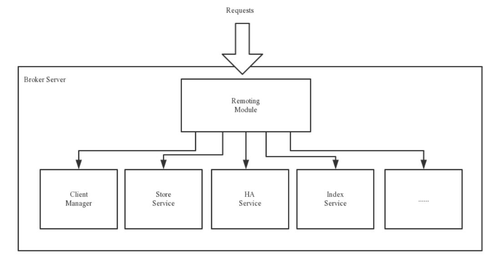

[TOC]

# 第1章 RocketMQ概述

## 一、MQ概述

### 1、MQ简介

MQ，Message Queue，是一种提供 `消息队列服务` 的中间件，也称为消息中间件，是一套提供了消息生产、存储、消费全过程API的软件系统。消息即数据。一般消息的体量不会很大。

### 2、MQ用途

从网上可以查看到很多的关于MQ用途的叙述，但总结起来其实就以下三点。

#### 限流削峰

MQ可以将系统的 `超量` 请求暂存其中，以便系统后期可以慢慢进行处理，从而避免了请求的丢失或系统 被压垮。


#### 异步解耦

上游系统对下游系统的调用若为同步调用，则会大大降低系统的吞吐量与并发度，且系统耦合度太高。 而异步调用则会解决这些问题。所以两层之间若要实现由同步到异步的转化，一般性做法就是，在这两 层间添加一个MQ层

#### 数据收集

分布式系统会产生海量级数据流，如:业务日志、监控数据、用户行为等。针对这些数据流进行实时或 批量采集汇总，然后对这些数据流进行大数据分析，这是当前互联网平台的必备技术。通过MQ完成此 类数据收集是最好的选择。

### 3、常见MQ产品

#### ActiveMQ

ActiveMQ是使用Java语言开发一款MQ产品。早期很多公司与项目中都在使用。但现在的社区活跃度已 经很低。现在的项目中已经很少使用了。

#### RabbitMQ

RabbitMQ是使用ErLang语言开发的一款MQ产品。其吞吐量较Kafka与RocketMQ要低，且由于其不是Java语言开发，所以公司内部对其实现定制化开发难度较大。

#### Kafka

Kafka是使用Scala/Java语言开发的一款MQ产品。其最大的特点就是高吞吐率，常用于大数据领域的实 时计算、日志采集等场景。其没有遵循任何常见的MQ协议，而是使用自研协议。对于Spring Cloud Netflix，其仅支持RabbitMQ与Kafka。

#### RocketMQ

RocketMQ是使用Java语言开发的一款MQ产品。经过数年阿里双11的考验，性能与稳定性非常高。其 没有遵循任何常见的MQ协议，而是使用自研协议。对于Spring Cloud Alibaba，其支持RabbitMQ、 Kafka，但提倡使用RocketMQ。

#### 对比

| 关键词     | ActiveMQ | RabbitMQ | Kafka                       | RocketMQ                    |
| ---------- | -------- | -------- | --------------------------- | --------------------------- |
| 开发语言   | Java     | ErLang   | Java                        | Java                        |
| 单机吞吐量 | 万级     | 万级     | 十万级                      | 十万级                      |
| Topic      | -        | -        | 百级Topic时会影响系统吞吐量 | 千级Topic时会影响系统吞吐量 |
| 社区活跃度 | 低       | 高       | 高                          | 高                          |

### 4、MQ常见协议

一般情况下MQ的实现是要遵循一些常规性协议的。常见的协议如下:

#### JMS

JMS，Java Messaging Service(Java消息服务)。是Java平台上有关MOM(Message Oriented Middleware，面向消息的中间件 PO/OO/AO)的技术规范，它便于消息系统中的Java应用程序进行消 息交换，并且通过提供标准的产生、发送、接收消息的接口，简化企业应用的开发。ActiveMQ是该协 议的典型实现。

#### STOMP

STOMP，Streaming Text Orientated Message Protocol(面向流文本的消息协议)，是一种MOM设计 的简单文本协议。STOMP提供一个可互操作的连接格式，允许客户端与任意STOMP消息代理 (Broker)进行交互。ActiveMQ是该协议的典型实现，RabbitMQ通过插件可以支持该协议。

#### AMQP

AMQP，Advanced Message Queuing Protocol(高级消息队列协议)，一个提供统一消息服务的应用 层标准，是应用层协议的一个开放标准，是一种MOM设计。基于此协议的客户端与消息中间件可传递 消息，并不受客户端/中间件不同产品，不同开发语言等条件的限制。 RabbitMQ是该协议的典型实 现。

#### MQTT

MQTT，Message Queuing Telemetry Transport(消息队列遥测传输)，是IBM开发的一个即时通讯协 议，是一种二进制协议，主要用于服务器和低功耗IoT(物联网)设备间的通信。该协议支持所有平 台，几乎可以把所有联网物品和外部连接起来，被用来当做传感器和致动器的通信协议。 RabbitMQ通 过插件可以支持该协议。

## 二、RocketMQ概述

### 1、RocketMQ简介

RocketMQ是一个统一消息引擎、轻量级数据处理平台。

RocketMQ是一款阿里巴巴开源的消息中间件。2016年11月28日，阿里巴巴向 Apache 软件基金会捐赠 RocketMQ，成为 Apache 孵化项目。2017 年 9 月 25 日，Apache 宣布 RocketMQ孵化成为 Apache 顶 级项目(TLP )，成为国内首个互联网中间件在 Apache 上的顶级项目。

官网地址:http://rocketmq.apache.org

### 2、RocketMQ发展历程（略）

# 第2章 RocketMQ的安装与启动

## 一、基本概念

### 1 消息(Message)

消息是指，消息系统所传输信息的物理载体，生产和消费数据的最小单位，每条消息必须属于一个主题。

### 2 主题(Topic)


Topic表示一类消息的集合，每个主题包含若干条消息，每条消息只能属于一个主题，是RocketMQ进行 消息订阅的基本单位。 topic:message 1:n message:topic 1:1

一个生产者可以同时发送多种Topic的消息;而一个消费者只对某种特定的Topic感兴趣，即只可以订阅 和消费一种Topic的消息。 producer:topic 1:n consumer:topic 1:1

### 3 标签(Tag)

为消息设置的标签，用于同一主题下区分不同类型的消息。来自同一业务单元的消息，可以根据不同业 务目的在同一主题下设置不同标签。标签能够有效地保持代码的清晰度和连贯性，并优化RocketMQ提 供的查询系统。消费者可以根据Tag实现对不同子主题的不同消费逻辑，实现更好的扩展性。

Topic是消息的一级分类，Tag是消息的二级分类。 Topic:货物
 tag=上海

 tag=江苏

tag=浙江
 ------- 消费者 ----- 

topic=货物 

tag = 上海 

topic=货物 tag = 上海|浙江 

topic=货物 tag = *

### 4 队列(Queue)

存储消息的物理实体。一个Topic中可以包含多个Queue，每个Queue中存放的就是该Topic的消息。

一个Topic的Queue也被称为一个Topic中消息的分区(Partition)。 一个Topic的Queue中的消息只能被一个消费者组中的一个消费者消费。一个Queue中的消息不允许同一个消费者组中的多个消费者同时消费。


在学习参考其它相关资料时，还会看到一个概念:分片(Sharding)。分片不同于分区。在RocketMQ 中，分片指的是存放相应Topic的Broker。每个分片中会创建出相应数量的分区，即Queue，每个 Queue的大小都是相同的。


### 5 消息标识(MessageId/Key)

RocketMQ中每个消息拥有唯一的MessageId，且可以携带具有业务标识的Key，以方便对消息的查询。 不过需要注意的是，MessageId有两个:在生产者send()消息时会自动生成一个MessageId(msgId)， 当消息到达Broker后，Broker也会自动生成一个MessageId(offsetMsgId)。msgId、offsetMsgId与key都 称为消息标识。

- msgId:由producer端生成，其生成规则为:

  `producerIp + 进程pid + MessageClientIDSetter类的ClassLoader的hashCode + 当前时间 + AutomicInteger自增计数器 `

- offsetMsgId:由broker端生成，其生成规则为:`brokerIp + 物理分区的offset(Queue中的偏移量)`

- key:由用户指定的业务相关的唯一标识

## 二、系统架构


RocketMQ架构上主要分为四部分构成:

### 1 Producer

消息生产者，负责生产消息。Producer通过MQ的负载均衡模块选择相应的Broker集群队列进行消息投 递，投递的过程支持快速失败并且低延迟。

RocketMQ中的消息生产者都是以生产者组(Producer Group)的形式出现的。生产者组是同一类生产 者的集合，这类Producer发送相同Topic类型的消息。一个生产者组可以同时发送多个主题的消息。

### 2 Consumer

消息消费者，负责消费消息。一个消息消费者会从Broker服务器中获取到消息，并对消息进行相关业务处理。

RocketMQ中的消息消费者都是以消费者组(Consumer Group)的形式出现的。消费者组是同一类消 费者的集合，这类Consumer消费的是同一个Topic类型的消息。消费者组使得在消息消费方面，实现`负载均衡` (将一个Topic中的不同的Queue平均分配给同一个Consumer Group的不同的Consumer，注 意，并不是将消息负载均衡)和 `容错` (一个Consmer挂了，该Consumer Group中的其它Consumer可 以接着消费原Consumer消费的Queue)的目标变得非常容易。


消费者组中Consumer的数量应该小于等于订阅Topic的Queue数量。如果超出Queue数量，则多出的 Consumer将不能消费消息。


不过，一个Topic类型的消息可以被多个消费者组同时消费。

> 注意：
>
> 1）消费者组只能消费一个 Topic 的消息，不能同时消费多个 Topic 的消息
>
> 2）一个消费者组中的消费者必须订阅完全相同的 Topic

### 3 Name Server

#### 功能介绍

NameServer是一个Broker与Topic路由的注册中心，支持Broker的动态注册与发现。

RocketMQ的思想来自于Kafka，而Kafka是依赖了Zookeeper的。所以，在RocketMQ的早期版本，即在 MetaQ v1.0与v2.0版本中，也是依赖于Zookeeper的。从MetaQ v3.0，即RocketMQ开始去掉了 Zookeeper依赖，使用了自己的NameServer。

主要包括两个功能:

- `Broker管理`:接受Broker集群的注册信息并且保存下来作为路由信息的基本数据;提供心跳检测 机制，检查Broker是否还存活。
- `路由信息管理`:每个NameServer中都保存着Broker集群的整个路由信息和用于客户端查询的队列 信息。Producer和Conumser通过NameServer可以获取整个Broker集群的路由信息，从而进行消息的投递和消费。

#### 路由注册

NameServer通常也是以集群的方式部署，不过NameServer是无状态的，即NameServer集群中的各个节点间是无差异的，各节点间相互不进行信息通讯。那各节点中的数据是如何进行数据同步的呢? 在 Broker节点启动时，轮询NameServer列表，与每个NameServer节点建立长连接，发起注册请求。在 NameServer内部维护着一个Broker列表，用来动态存储Broker的信息

> 注意：这是与其它像zk、Eureka、Nacos等注册中心不同的地方。
>
> 这种NameServer的无状态方式，有什么优缺点：
>
> 优点：NameServer集群搭建简单，扩容简单。
>
> 缺点：对于 Broker，必须指出所有NameServer地址。否则为未指出的将不会去注册。也正因为如此，NameServer并不能随便扩容。因为，若 Broker 不重新配置，新增的NameServer对于 Broker 来说是不可见的，其并不会向这个NameServer进行注册。

Broker节点为了证明自己是活着的，为了维护与NameServer间的长连接，会将最新的信息以 `心跳包` 的方式上报给NameServer，每30秒发送一次心跳。心跳包中包含 BrokerId、Broker地址(IP+Port)、 Broker名称、Broker所属集群名称等等。NameServer在接收到心跳包后，会更新心跳时间戳，记录这 个Broker的最新存活时间。

#### 路由剔除

由于Broker关机、宕机或网络抖动等原因，NameServer没有收到Broker的心跳，NameServer可能会将其从Broker列表中剔除。

NameServer中有一个定时任务，每隔10秒就会扫描一次Broker表，查看每一个Broker的最新心跳时间 戳距离当前时间是否超过120秒，如果超过，则会判定Broker失效，然后将其从Broker列表中剔除

> 护展：对于RocketMQ日常运维工作，例多Broker升级，需要/停掉Broker的工作。OP需要怎么做？
>
> OP需要你Broker的读写权限禁掉。一旦client(Consumer 或producer)向broker发送请求，都会收到broker的NO_PERMISSION响应，然后client会进行对其它Broker的重试。
>
> 当OP观察到这个Broker没有流量后，再关闭它，实现Broker 从NameServer的移除。
>
> OP：运维工程师
>
> SRE: Site Reliability Engineer，现场可靠性工程师

#### 路由发现

RocketMQ的路由发现采用的是Pull模型。当Topic路由信息出现变化时，NameServer不会主动推送给客户端，而是客户端定时拉取主题最新的路由。默认客户端每30秒会拉取一次最新的路由。

> 扩展：
>
> 1)Push模型：推送模型。其实时性较好，是一个“发布-订阅”模型，需要维护一个长链接。而长连接的维护是需要资源成本的。该模型适合于的场景：
>
> - 实时性要求较高
> - Client数量不多，Server数据变化较频繁
>
> 2）Pull模型：拉取模型。存在的问题是，实时性较差。
>
> 3）Long Polling模型：长轮询模型。其是对Push与Pull模型的整合，充分利用了这两种模型的优势，屏蔽了它们的劣势。

#### 客户端NameServer选择策略

> 这里的客户端指的是 Producer 与 Consumer

客户端在配置时必须要写上NameServer集群的地址，那么客户端到底连接的是哪个NameServer节点 呢?客户端首先会生产一个随机数，然后再与NameServer节点数量取模，此时得到的就是所要连接的 节点索引，然后就会进行连接。如果连接失败，则会采用round-robin策略，逐个尝试着去连接其它节 点。

首先采用的是 `随机策略` 进行的选择，失败后采用的是 `轮询策略` 。

### 4 Broker

#### 功能介绍

Broker充当着消息中转角色，负责存储消息、转发消息。Broker在RocketMQ系统中负责接收并存储从 生产者发送来的消息，同时为消费者的拉取请求作准备。Broker同时也存储着消息相关的元数据，包括 消费者组消费进度偏移offset、主题、队列等。

#### 模块构成

下图为Broker Server的功能模块示意图。



`Remoting Module`:整个Broker的实体，负责处理来自clients端的请求。而这个Broker实体则由以下模 块构成。

`Client Manager`:客户端管理器。负责接收、解析客户端(Producer/Consumer)请求，管理客户端。例 如，维护Consumer的Topic订阅信息

`Store Service`:存储服务。提供方便简单的API接口，处理 消息存储到物理硬盘 和 消息查询 功能。 

`HA Service`:高可用服务，提供Master Broker 和 Slave Broker之间的数据同步功能。

`Index Service`:索引服务。根据特定的Message key，对投递到Broker的消息进行索引服务，同时也提 供根据Message Key对消息进行快速查询的功能。

#### 集群部署


为了增强Broker性能与吞吐量，Broker一般都是以集群形式出现的。各集群节点中可能存放着相同 Topic的不同Queue。不过，这里有个问题，如果某Broker节点宕机，如何保证数据不丢失呢?其解决 方案是，将每个Broker集群节点进行横向扩展，即将Broker节点再建为一个HA集群，解决单点问题。

Broker节点集群是一个主从集群，即集群中具有Master与Slave两种角色。Master负责处理读写操作请 求，Slave负责对Master中的数据进行备份。当Master挂掉了，Slave则会自动切换为Master去工作。所 以这个Broker集群是主备集群。一个Master可以包含多个Slave，但一个Slave只能隶属于一个Master。 Master与Slave 的对应关系是通过指定相同的BrokerName、不同的BrokerId 来确定的。BrokerId为0表 示Master，非0表示Slave。每个Broker与NameServer集群中的所有节点建立长连接，定时注册Topic信 息到所有NameServer。

### 5 工作流程

#### 具体流程

1)启动NameServer，NameServer启动后开始监听端口，等待Broker、Producer、Consumer连接。

2)启动Broker时，Broker会与所有的NameServer建立并保持长连接，然后每30秒向NameServer定时 发送心跳包。

3)发送消息前，可以先创建Topic，创建Topic时需要指定该Topic要存储在哪些Broker上，当然，在创 建Topic时也会将Topic与Broker的关系写入到NameServer中。不过，这步是可选的，也可以在发送消 息时自动创建Topic。

4)Producer发送消息，启动时先跟NameServer集群中的其中一台建立长连接，并从NameServer中获 取路由信息，即当前发送的Topic消息的Queue与Broker的地址(IP+Port)的映射关系。然后根据算法 策略从队选择一个Queue，与队列所在的Broker建立长连接从而向Broker发消息。当然，在获取到路由 信息后，Producer会首先将路由信息缓存到本地，再每30秒从NameServer更新一次路由信息。

5)Consumer跟Producer类似，跟其中一台NameServer建立长连接，获取其所订阅Topic的路由信息， 然后根据算法策略从路由信息中获取到其所要消费的Queue，然后直接跟Broker建立长连接，开始消费 其中的消息。Consumer在获取到路由信息后，同样也会每30秒从NameServer更新一次路由信息。不过 不同于Producer的是，Consumer还会向Broker发送心跳，以确保Broker的存活状态。

#### Topic的创建模式

手动创建Topic时，有两种模式:

- 集群模式:该模式下创建的Topic在该集群中，所有Broker中的Queue数量是相同的。 
- Broker模式:该模式下创建的Topic在该集群中，每个Broker中的Queue数量可以不同。

自动创建Topic时，默认采用的是Broker模式，会为每个Broker默认创建4个Queue。

#### 读/写队列

从物理上来讲，读/写队列是同一个队列。所以，不存在读/写队列数据同步问题。读/写队列是逻辑上进 行区分的概念。一般情况下，读/写队列数量是相同的。

例如，创建Topic时设置的写队列数量为8，读队列数量为4，此时系统会创建8个Queue，分别是0 1 2 3 4 5 6 7。Producer会将消息写入到这8个队列，但Consumer只会消费0 1 2 3这4个队列中的消息，4 5 6 7中的消息是不会被消费到的。

再如，创建Topic时设置的写队列数量为4，读队列数量为8，此时系统会创建8个Queue，分别是0 1 2 3 4 5 6 7。Producer会将消息写入到0 1 2 3 这4个队列，但Consumer只会消费0 1 2 3 4 5 6 7这8个队列中 的消息，但是4 5 6 7中是没有消息的。此时假设Consumer Group中包含两个Consumer，Consumer1消 费0 1 2 3，而Consumer2消费4 5 6 7。但实际情况是，Consumer2是没有消息可消费的。

也就是说，当读/写队列数量设置不同时，总是有问题的。那么，为什么要这样设计呢?

其这样设计的目的是为了，方便Topic的Queue的缩容。

例如，原来创建的Topic中包含16个Queue，如何能够使其Queue缩容为8个，还不会丢失消息?可以动 态修改写队列数量为8，读队列数量不变。此时新的消息只能写入到前8个队列，而消费都消费的却是 16个队列中的数据。当发现后8个Queue中的消息消费完毕后，就可以再将读 队列数量动态设置为8。整 个缩容过程，没有丢失任何消息。

perm用于设置对当前创建Topic的操作权限:2表示只写，4表示只读，6表示读写。

## 三、单机安装与启动

### 1 准备工作

**修改配置**

```sh
vim /etc/profile
```

最底下添加下面一行

```markdown
export NAMESRV_ADDR=公网IP:9876
```

刷新配置

```sh
source /etc/profile
```

**将linux服务器的JDK17切换为1.8**

```
mv jdk-8u411-linux-x64.tar.gz /usr/local/java
cd /usr/local/java
tar -zxvf jdk-8u411-linux-x64.tar.gz
vim /etc/profile
```

修改下面的配置

```sh
export JAVA_HOME=/usr/local/java/jdk1.8.0_411
```

刷新配置

```sh
source /etc/profile
```

#### 下载RocketMQ安装包

将下载的安装包上传到Linux。

/


解压到 `/opt/apps/`。

```sh
unzip rocketmq-all-5.1.0-bin-release.zip -d /opt/apps/
```

### 2、修改初始内存

#### 修改runserver.sh

```sh
cd /opt/apps/rocketmq-all-5.1.0-bin-release/bin
vim runserver.sh
```


#### 修改runbroker.sh

```sh
vim runbroker.sh
```


#### 修改 tools.sh

```sh
vim tools.sh
```


**修改 broker.conf**

```sh
cd /opt/apps/rocketmq-all-5.1.0-bin-release/conf
vim broker.conf
```

最底下添加下面三行

```markdown
namesrvAddr=内网IP:9876   # 暂且改成内网IP，服务才能起来
autoCreateTopicEnable=true
brokerIP1=内网IP  # 暂且改成内网IP，服务才能起来
```

参数解释：

`namesrvAddr`：nameSrv地址，填公网IP

`autoCreateTopicEnable`：自动创建主题，不然需要手动创建出来

`brokerIP1`:broker也需要一个公网IP，如果不指定，那么是阿里云的内网地址(broker将内网地址上报给namesrv，producter向namesrv获取broker地址拿到的是内网地址，producter通过内网地址去请求broker是请求不到的，所以这里要配置成公网IP)。

### 3、启动

#### 启动NameServer

```sh
cd /opt/apps/rocketmq-all-5.1.0-bin-release/bin
# 启动 后台运行，并且日志输出到namesrv.log
nohup sh mqnamesrv > ../namesrv.log &
# 看启动日志
tail -f ~/logs/rocketmqlogs/namesrv.log
# 
jps
```

#### 启动broker

```sh
# 启动
# nohup sh mqbroker -c ../conf/broker.conf > ../broker.log &
nohup sh /opt/apps/rocketmq-all-5.1.0-bin-release/bin/mqbroker -c /opt/apps/rocketmq-all-5.1.0-bin-release/conf/broker.conf &
# 看启动
jps 
```

**启动可视化工具**

```sh
cd /opt/apps

nohup java -jar rocketmq-dashboard-1.0.0.jar --server.port=8001 --rocketmq.config.namesrvAddr=172.22.242.114:9876 > dashboard.log &
```

### 4、发送/接收消息测试

#### 发送消息

```sh
export NAMESRV_ADDR=172.22.242.114:9876

sh bin/tools.sh org.apache.rocketmq.example.quickstart.Producer
```

#### 接收消息

```sh
cd /opt/apps/rocketmq-all-5.1.0-bin-release

sh bin/tools.sh org.apache.rocketmq.example.quickstart.Consumer
```

### 5、关闭Server

无论是关闭name server还是broker，都是使用bin/mqshutdown命令。

```sh
cd /opt/apps/rocketmq-all-5.1.0-bin-release

sh bin/mqshutdown broker

sh bin/mqshutdown namesrv
```

## 四、 控制台的安装与启动

RocketMQ有一个可视化的dashboard，通过该控制台可以直观的查看到很多数据。

### 1 下载

下载地址:https://github.com/apache/rocketmq-externals/tags


### 2 修改配置

修改其src/main/resources中的application.properties配置文件

- 原来的端口号为8080，修改为一个不常用的

- 指定RocketMQ的name server地址

  ```sql
  rocketmq.config.namesrvAddr=172.31.0.2:9876
  ```

### 3 添加依赖

在解压目录rocketmq-console的pom.xml中添加如下JAXB依赖。

```xml
<dependency>
     <groupId>javax.xml.bind</groupId>
     <artifactId>jaxb-api</artifactId>
     <version>2.3.0</version>
 </dependency>
 <dependency>
     <groupId>com.sun.xml.bind</groupId>
     <artifactId>jaxb-impl</artifactId>
     <version>2.3.0</version>
 </dependency>
 <dependency>
     <groupId>com.sun.xml.bind</groupId>
     <artifactId>jaxb-core</artifactId>
     <version>2.3.0</version>
 </dependency>
 <dependency>
     <groupId>javax.activation</groupId>
     <artifactId>activation</artifactId>
     <version>1.1.1</version>
 </dependency>
```


### 4 打包

### 5 启动

### 6 访问

## 五、集群搭建理论


### 1 数据复制与刷盘策略


#### 复制策略

复制策略是Broker的Master与Slave间的数据同步方式。分为同步复制与异步复制:

- 同步复制:消息写入master后，master会等待slave同步数据成功后才向producer返回成功ACK 
- 异步复制:消息写入master后，master立即向producer返回成功ACK，无需等待slave同步数据成功

> 异步复制策略会降低系统的写入延迟，RT变小，提高了系统的吞吐量

#### 刷盘策略

刷盘策略指的是broker中消息的 落盘 方式，即消息发送到broker内存后消息持久化到磁盘的方式。分为 同步刷盘与异步刷盘

- 同步刷盘:当消息持久化到broker的磁盘后才算是消息写入成功。 
- 异步刷盘:当消息写入到broker的内存后即表示消息写入成功，无需等待消息持久化到磁盘。 

### 2 Broker集群模式

根据Broker集群中各个节点间关系的不同，Broker集群可以分为以下几类:

#### 单Master

只有一个broker(其本质上就不能称为集群)。这种方式也只能是在测试时使用，生产环境下不能使 用，因为存在单点问题。

#### 多Master

broker集群仅由多个master构成，不存在Slave。同一Topic的各个Queue会平均分布在各个master节点上。

- 优点:配置简单，单个Master宕机或重启维护对应用无影响，在磁盘配置为RAID10时，即使机器 宕机不可恢复情况下，由于RAID10磁盘非常可靠，消息也不会丢(异步刷盘丢失少量消息，同步 刷盘一条不丢)，性能最高; 
- 缺点:单台机器宕机期间，这台机器上未被消费的消息在机器恢复之前不可订阅(不可消费)， 消息实时性会受到影响。

> 以上优点的前提是，这些master都配置了RAID磁盘阵列，如果没有配置，一旦出现某master宕机，则会发生大量消息丢失的情况。

#### 多Master多Slave模式-异步复制

broker集群由多个master构成，每个master又配置了多个slave(在配置了RAID磁盘阵列的情况下，一 个master一般配置一个slave即可)。master与slave的关系是主备关系，即master负责处理消息的读写 请求，而slave仅负责消息的备份与master宕机后的角色切换。

异步复制即前面所讲的 `复制策略` 中的 `异步复制策略` ，即消息写入master成功后，master立即向 producer返回成功ACK，无需等待slave同步数据成功。

该模式的最大特点之一是，当master宕机后slave能够 `自动切换` 为master。不过由于slave从master的同 步具有短暂的延迟(毫秒级)，所以当master宕机后，这种异步复制方式可能会存在少量消息的丢失问

题。

> Slave 从 Master同步的延迟越短，其可能丢失的消息就越少
>
> 对于Master的RAID磁盘阵列，若使用的也是异步复制策略，同样也存在延迟问题，同样也可能会丢失消息。但RAID阵列的秘诀是微秒级的，所以其丢失的数量会更少。

#### 多Master多Slave模式-同步双写

该模式是 `多Master多Slave模式` 的 `同步复制` 实现。所谓 `同步双写` ，指的是消息写入master成功后，master会等待slave同步数据成功后才向producer返回成功ACK，即master与slave都要写入成功后才会 返回成功ACK，也即 `双写` 。

该模式与 `异步复制模式` 相比，优点是消息的安全性更高，不存在消息丢失的情况。但单个消息的RT略 高，从而导致性能要略低(大约低10%)。

该模式存在一个大的问题:对于目前的版本，Master宕机后，Slave `不会自动切换` 到Master

#### 最佳实践

一般会为Master配置RAID10磁盘阵列，然后再为其配置一个Slave。即利用了RAID10磁盘阵列的高 效、安全性，又解决了可能会影响订阅的问题。

## 六、磁盘阵列RAID(补充-略)

### 1 RAID历史

### 2 RAID等级

### 3 关键技术

#### 镜像技术

#### 数据条带技术

#### 数据校验技术

### 4 RAID分类

#### 软 RAID

#### 硬 RAID

#### 混合 RAID

### 5 常见RAID等级详解

#### JBOD

#### RAID0

#### RAID1

#### RAID10

#### RAID01

## 七、集群搭建实践

### 1 集群架构

这里要搭建一个双主双从异步复制的Broker集群。为了方便，这里使用了两台主机来完成集群的搭建。 这两台主机的功能与broker角色分配如下表。

### 2 克隆生成rocketmqOS1

### 3 修改rocketmqOS1配置文件

#### 配置文件位置

#### 修改broker-a.properties

#### 修改broker-b-s.properties

#### 其它配置

### 4 克隆生成rocketmqOS2

### 5 修改rocketmqOS2配置文件

#### 修改broker-b.properties

#### 修改broker-a-s.properties

### 6 启动服务器

#### 启动NameServer集群

#### 启动两个Master

#### 启动两个Slave

## 八、mqadmin命令

### 1 修改bin/tools.sh

### 2 运行mqadmin

### 3 该命令的官网详解

# 第3章 RocketMQ工作原理

## 一、消息的生产

### 1 消息的生产过程

Producer可以将消息写入到某Broker中的某Queue中，其经历了如下过程:

- Producer发送消息之前，会先向NameServer发出获取 `消息Topic的路由信息` 的请求 
- NameServer返回该Topic的 `路由表` 及 `Broker列表`
- Producer根据代码中指定的Queue选择策略，从Queue列表中选出一个队列，用于后续存储消息 
- Produer对消息做一些特殊处理，例如，消息本身超过4M，则会对其进行压缩 
- Producer向选择出的Queue所在的Broker发出RPC请求，将消息发送到选择出的Queue

### 2 Queue选择算法

对于无序消息，其Queue选择算法，也称为消息投递算法，常见的有两种:

**轮询算法**

默认选择算法。该算法保证了每个Queue中可以均匀的获取到消息。

> 该算法存在一个问题：由于某些原因，在某些Broker上的Queue可能投递延迟较严重。从而导致Producer的缓存队列中出现较大的消息积压，营销消息的投递性能

**最小投递延迟算法**

该算法会统计每次消息投递的时间延迟，然后根据统计出的结果将消息投递到时间延迟最小的Queue。 如果延迟相同，则采用轮询算法投递。该算法可以有效提升消息的投递性能。

> 该算法也是存在一个问题：消息在Queue上的分配不均匀。投递延迟小的Queue其可能会存在大量的消息。而对该 Queue的消费者压力会增加，降低消息的消费能力，可能会导致MQ中消息的堆积。

## 二、消息的存储

RocketMQ中的消息存储在本地文件系统中，这些相关文件默认在当前用户主目录下的store目录中。


- abort:该文件在Broker启动后会自动创建，正常关闭Broker，该文件会自动消失。若在没有启动 Broker的情况下，发现这个文件是存在的，则说明之前Broker的关闭是非正常关闭。 
- checkpoint:其中存储着commitlog、consumequeue、index文件的最后刷盘时间戳 
- commitlog:其中存放着commitlog文件，而消息是写在commitlog文件中的 
- config:存放着Broker运行期间的一些配置数据 
- consumequeue:其中存放着consumequeue文件，队列就存放在这个目录中 
- index:其中存放着消息索引文件indexFile
- lock:运行期间使用到的全局资源锁

### 1 commitlog文件

**目录与文件**

commitlog目录中存放着很多的mappedFile文件，当前Broker中的所有消息都是落盘到这些 mappedFile文件中的。mappedFile文件大小为1G(小于等于1G)，文件名由20位十进制数构成，表示 当前文件的第一条消息的起始位移偏移量。

需要注意的是，一个Broker中仅包含一个commitlog目录，所有的mappedFile文件都是存放在该目录中 的。即无论当前Broker中存放着多少Topic的消息，这些消息都是被顺序写入到了mappedFile文件中 的。也就是说，这些消息在Broker中存放时并没有被按照Topic进行分类存放。

**消息单元**


mappedFile文件内容由一个个的 `消息单元` 构成。每个消息单元中包含消息总长度MsgLen、消息的物理位置physicalOffset、消息体内容Body、消息体长度BodyLength、消息主题Topic、Topic长度 TopicLength、消息生产者BornHost、消息发送时间戳BornTimestamp、消息所在的队列QueueId、消 息在Queue中存储的偏移量QueueOffset等近20余项消息相关属性。

### 2 consumequeue


**目录与文件**


为了提高效率，会为每个Topic在~/store/consumequeue中创建一个目录，目录名为Topic名称。在该 Topic目录下，会再为每个该Topic的Queue建立一个目录，目录名为queueId。每个目录中存放着若干 consumequeue文件，consumequeue文件是commitlog的索引文件，可以根据consumequeue定位到具 体的消息。

consumequeue文件名也由20位数字构成，表示当前文件的第一个索引条目的起始位移偏移量。与 mappedFile文件名不同的是，其后续文件名是固定的。因为consumequeue文件大小是固定不变的。

**索引条目**


每个consumequeue文件可以包含30w个索引条目，每个索引条目包含了三个消息重要属性:消息在 mappedFile文件中的偏移量CommitLog Offset、消息长度、消息Tag的hashcode值。这三个属性占20 个字节，所以每个文件的大小是固定的30w * 20字节。

### 3 对文件的读写


**消息写入**

一条消息进入到Broker后经历了以下几个过程才最终被持久化。

- Broker根据queueId，获取到该消息对应索引条目要在consumequeue目录中的写入偏移量，即 QueueOffset
-  将queueId、queueOffset等数据，与消息一起封装为消息单元
-  将消息单元写入到commitlog
- 同时，形成消息索引条目 
- 将消息索引条目分发到相应的consumequeue

**消息拉取**

当Consumer来拉取消息时会经历以下几个步骤:

- Consumer获取到其要消费消息所在Queue的` 消费偏移量offset` ，计算出其要消费消息的 `消息offset`
- Consumer向Broker发送拉取请求，其中会包含其要拉取消息的Queue、消息offset及消息 Tag。
- Broker计算在该consumequeue中的queueOffset
- 从该queueOffset处开始向后查找第一个指定Tag的索引条目。 
- 解析该索引条目的前8个字节，即可定位到该消息在commitlog中的commitlog offset 
- 从对应commitlog offset中读取消息单元，并发送给Consumer


### 4 与Kafka的对比

## 三、indexFile

### 1 索引条目结构

### 2 indexFile的创建

### 3 查询流程

## 四、消息的消费

### 1 获取消费类型

### 2 消费模式

### 3 Rebalance机制

### 4 Queue分配算法

### 5 至少一次原则

## 五、订阅关系的一致性

### 1 正确订阅关系

### 2 错误订阅关系

## 六、offset管理

### 1 offset本地管理模式

### 2 offset远程管理模式

### 3 offset用途

### 4 重试队列

### 5 offset的同步提交与异步提交

## 七、消费幂等

### 1 什么是消费幂等

### 2 消息重复的场景分析

### 3 通用解决方案

### 4 消费幂等的实现

## 八、消息堆积与消费延迟

### 1 概念

### 2 产生原因分析

### 3 消费耗时

### 4 消费并发度

### 5 单机线程数计算

### 6 如何避免

## 九、消息的清理

# 第4章 RocketMQ应用

## 一、普通消息

### 1 消息发送分类

### 2 代码举例

## 二、顺序消息

### 1 什么是顺序消息

### 2 为什么需要顺序消息

### 3 有序性分类

### 4 代码举例

## 三、延时消息

### 1 什么是延时消息

### 2 延时等级

### 3 延时消息实现原理

### 4 代码举例

## 四、事务消息

### 1 问题引入

### 2 解决思路

### 3 基础

### 4 XA模式三剑客

### 5 XA模式架构

### 6 注意

### 7 代码举例

## 五、批量消息

### 1 批量发送消息

### 2 批量消费消息

### 3 代码举例

## 六、消息过滤

### 1 Tag过滤

### 2 SQL过滤

### 3 代码举例

## 七、消息发送重试机制

### 1 说明

### 2 同步发送失败策略

### 3 异步发送失败策略

### 4 消息刷盘失败策略

## 八、消息消费重试机制

### 1 顺序消息的消费重试

### 2 无序消息的消费重试

### 3 消费重试次数与间隔

### 4 重试队列

### 5 消费重试配置方式

### 6 消费不重试配置方式

## 九、死信队列

### 1 什么是死信队列

### 2 死信队列的特征

### 3 死信消息的处理