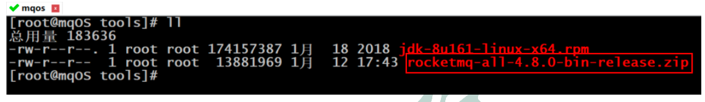
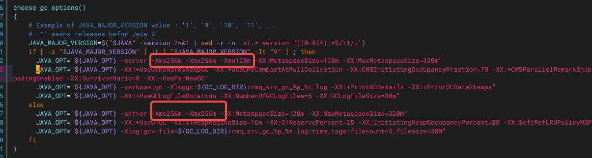
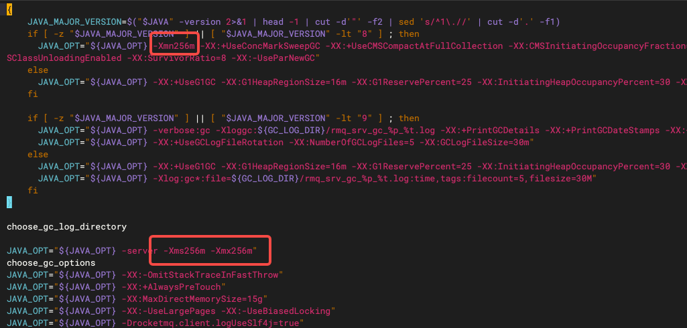
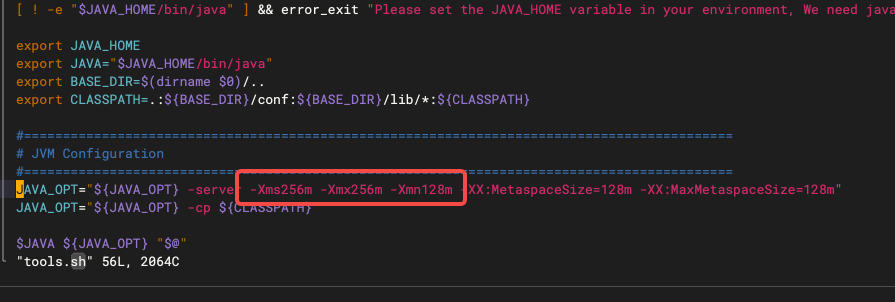
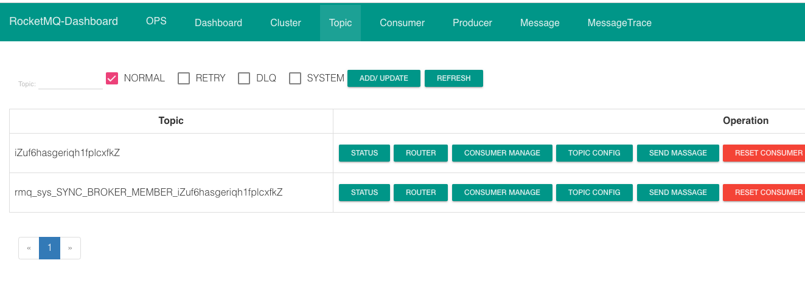
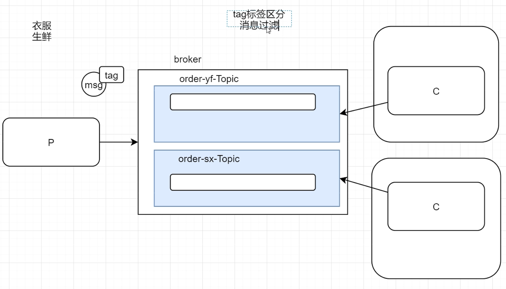
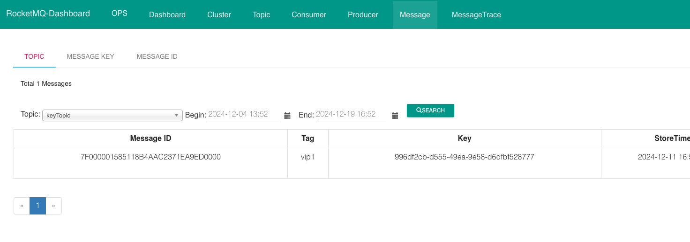
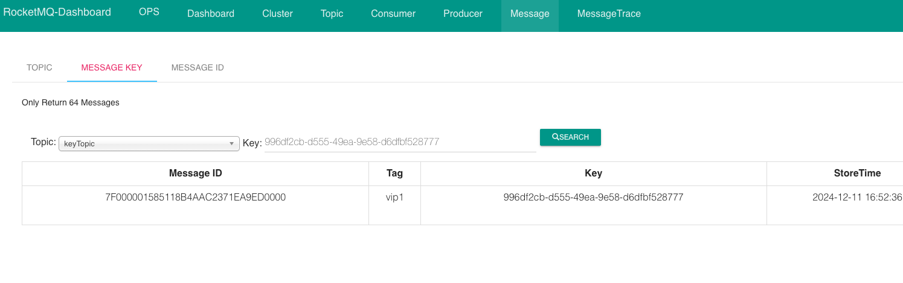
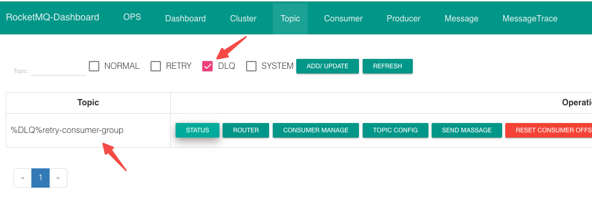
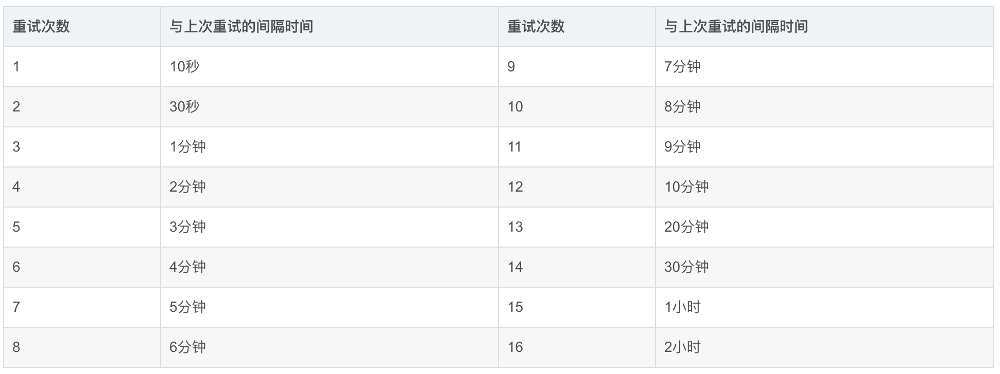

# 1 rocketmq 服务部署

**单机安装与启动**

## 1.1 准备工作

**修改配置**

```sh
vim /etc/profile
```

最底下添加下面一行

```markdown
export NAMESRV_ADDR=公网IP:9876
```

刷新配置

```sh
source /etc/profile
```

**将linux服务器的JDK17切换为1.8**【不然可能出现 broker服务起不来】

```
mv jdk-8u411-linux-x64.tar.gz /usr/local/java
cd /usr/local/java
tar -zxvf jdk-8u411-linux-x64.tar.gz
vim /etc/profile
```

修改下面的配置

```sh
export JAVA_HOME=/usr/local/java/jdk1.8.0_411
```

刷新配置

```sh
source /etc/profile
```

下载RocketMQ安装包

将下载的安装包上传到Linux。



解压到 `/opt/apps/`。

```sh
unzip rocketmq-all-5.1.0-bin-release.zip -d /opt/apps/
```

***

## 1.2 修改初始内存

### 1.2.1 runserver.sh

```sh
cd /opt/apps/rocketmq-all-5.1.0-bin-release/bin
vim runserver.sh
```



### 1.2.2 runbroker.sh

```sh
vim runbroker.sh
```



### 1.2.3 tools.sh

```sh
vim tools.sh
```



***

## 1.3 修改配置文件

**修改 broker.conf**

```sh
cd /opt/apps/rocketmq-all-5.1.0-bin-release/conf
vim broker.conf
```

最底下添加下面三行

```sh
namesrvAddr=内网IP:9876   # 已验证
autoCreateTopicEnable=true
brokerIP1=外网IP  # 已验证
```

参数解释：

`namesrvAddr`：nameSrv地址，填内网IP

`autoCreateTopicEnable`：自动创建主题，不然需要手动创建出来

`brokerIP1`:broker也需要一个公网IP，如果不指定，那么是阿里云的内网地址(broker将内网地址上报给namesrv，producter向namesrv获取broker地址拿到的是内网地址，producter通过内网地址去请求broker是请求不到的，所以这里要配置成公网IP)。

***

## 1.4 启动

### 1.4.1 启动NameServer

```sh
cd /opt/apps/rocketmq-all-5.1.0-bin-release/bin
# 启动 后台运行，并且日志输出到namesrv.log
nohup sh mqnamesrv > ../namesrv.log &
# 看启动日志
tail -f ~/logs/rocketmqlogs/namesrv.log
# 
jps
```

### 1.4.2 启动broker

```sh
# 启动
# nohup sh mqbroker -c ../conf/broker.conf > ../broker.log &
nohup sh /opt/apps/rocketmq-all-5.1.0-bin-release/bin/mqbroker -c /opt/apps/rocketmq-all-5.1.0-bin-release/conf/broker.conf &
# 看启动
jps 
```

### 1.4.3 **启动可视化工具**

```sh
cd /opt/apps

nohup java -jar rocketmq-dashboard-1.0.0.jar --server.port=8001 --rocketmq.config.namesrvAddr=172.22.242.114:9876 > dashboard.log &
```

访问可视化界面：http://47.101.143.172:8001/



***

# 2 验证服务状态

测试发送

```java
@Test
void contextLoads() throws Exception {
    DefaultMQProducer producer = new DefaultMQProducer("test-producer-group");
    producer.setNamesrvAddr("47.101.143.172:9876");
    producer.setSendMsgTimeout(15000);
    producer.start();
    Message message = new Message("testTopic", "tagA",  "我是一个简单的消息".getBytes());
    SendResult send = producer.send(message);
    System.out.println(send.getSendStatus());
    producer.shutdown();
}
```

# 3 快速入门

消费者代码：

```java
@Test
public void simpleConsumer() throws Exception {
    // 创建一个消费者
    DefaultMQPushConsumer consumer = new DefaultMQPushConsumer("test-consumer-group");
    // 连接namesrv
    consumer.setNamesrvAddr(MqConstant.NAME_SRV_ADDR);
    // 订阅一个主题  * 标识订阅这个主题中所有的消息  后期会有消息过滤
    consumer.subscribe("testTopic", "*");
    // 设置一个监听器 (一直监听的， 异步回调方式)
    consumer.registerMessageListener(new MessageListenerConcurrently() {
        @Override
        public ConsumeConcurrentlyStatus consumeMessage(List<MessageExt> msgs, ConsumeConcurrentlyContext 					context) {
            // 这个就是消费的方法 （业务处理）
            System.out.println("我是消费者");
            System.out.println(msgs.get(0).toString());
            System.out.println("消息内容:" + new String(msgs.get(0).getBody()));
            System.out.println("消费上下文:" + context);
            // 返回值  CONSUME_SUCCESS成功，消息会从mq出队
            // RECONSUME_LATER（报错/null） 失败 消息会重新回到队列 过一会重新投递出来 给当前消费者或者其他消费者消费的
            return ConsumeConcurrentlyStatus.CONSUME_SUCCESS;
        }
    });
    // 启动
    consumer.start();
    // 挂起当前的jvm
    System.in.read();
}
```

## 3.1 同步消息

需要同步等待MQ返回ACK

```java
@Test
public void simpleProducer() throws Exception {
    // 创建一个生产者  (制定一个组名)
    DefaultMQProducer producer = new DefaultMQProducer("test-producer-group");
    // 连接namesrv
    producer.setNamesrvAddr(MqConstant.NAME_SRV_ADDR);
    // 启动
    producer.start();
    // 创建一个消息
    for (int i = 0; i < 10; i++) {
        Message message = new Message("testTopic", "我是一个简单的消息".getBytes());
        // 发送同步消息，能收到结果
        SendResult sendResult = producer.send(message);
        System.out.println(sendResult.getSendStatus());
    }
    // 关闭生产者
    producer.shutdown();
}
```

## 3.2 异步消息

无需同步等待MQ返回ACK，而是MQ通过异步回调的方式进行ACK

```java
@Test
public void asyncProducer() throws Exception {
    DefaultMQProducer producer = new DefaultMQProducer("async-producer-group");
    producer.setNamesrvAddr(MqConstant.NAME_SRV_ADDR);
    producer.start();
    Message message = new Message("asyncTopic", "我是一个异步消息".getBytes());
    producer.send(message, new SendCallback() {
        @Override
        public void onSuccess(SendResult sendResult) {
            System.out.println("发送成功");
        }

        @Override
        public void onException(Throwable e) {
            System.err.println("发送失败:" + e.getMessage());
        }
    });
    System.out.println("我先执行");
    System.in.read();
}

```

## 3.3 单向消息

生产者发完不管MQ的结果（危险，容易丢失消息，但是效率高）

```java
@Test
public void onewayProducer() throws Exception {
    DefaultMQProducer producer = new DefaultMQProducer("oneway-producer-group");
    producer.setNamesrvAddr(MqConstant.NAME_SRV_ADDR);
    producer.start();
    //        Message message = new Message("onewayTopic", "日志xxx".getBytes());
    Message message = new Message("asyncTopic", "日志xxx".getBytes());
    producer.sendOneway(message);
    System.out.println("成功");
    producer.shutdown();
}
```

## 3.4 延迟消息

消息放入MQ后，过一段时间，才会被监听到，然后消费 

**消费者**

```java
 @Test
 public void msConsumer() throws Exception {
     DefaultMQPushConsumer consumer = new DefaultMQPushConsumer("ms-consumer-group");
     consumer.setNamesrvAddr(MqConstant.NAME_SRV_ADDR);
     consumer.subscribe("orderMsTopic", "*");
     consumer.registerMessageListener(new MessageListenerConcurrently() {
         @Override
         public ConsumeConcurrentlyStatus consumeMessage(List<MessageExt> msgs, ConsumeConcurrentlyContext            context) {
             System.out.println("收到消息了" + new Date());
             System.out.println(new String(msgs.get(0).getBody()));
             return ConsumeConcurrentlyStatus.CONSUME_SUCCESS;
         }
     });
     consumer.start();
     System.in.read();
 }

```

生产者

```java
 @Test
 public void msProducer() throws Exception {
     DefaultMQProducer producer = new DefaultMQProducer("ms-producer-group");
     producer.setNamesrvAddr(MqConstant.NAME_SRV_ADDR);
     producer.start();
     Message message = new Message("orderMsTopic", "订单号，座位号".getBytes());
     // 给消息设置一个延迟时间
     // 18个级别，比如级别3对应10s
     // messageDelayLevel = "1s 5s 10s 30s 1m 2m 3m 4m 5m 6m 7m 8m 9m 10m 20m 30m 1h 2h"
     message.setDelayTimeLevel(4);
     // 发延迟消息
     producer.send(message);
     System.out.println("发送时间" + new Date());
     producer.shutdown();
 }
```

## 3.5 批量消息

**生产者**

```java
@Test
public void testBatchProducer() throws Exception {
    // 创建默认的生产者
    DefaultMQProducer producer = new DefaultMQProducer("batch-producer-group");
    // 设置nameServer地址
    producer.setNamesrvAddr(MqConstant.NAME_SRV_ADDR);
    // 启动实例
    producer.start();
    List<Message> msgs = Arrays.asList(
            new Message("batchTopic", "我是一组消息的A消息".getBytes()),
            new Message("batchTopic", "我是一组消息的B消息".getBytes()),
            new Message("batchTopic", "我是一组消息的C消息".getBytes())
    );
    SendResult send = producer.send(msgs);
    System.out.println(send);
    // 关闭实例
    producer.shutdown();
}
```

**消费者**

```java
@Test
public void msConsumer() throws Exception {
    DefaultMQPushConsumer consumer = new DefaultMQPushConsumer("batch-consumer-group");
    consumer.setNamesrvAddr(MqConstant.NAME_SRV_ADDR);
    consumer.subscribe("batchTopic", "*");
    consumer.registerMessageListener(new MessageListenerConcurrently() {
        @Override
        public ConsumeConcurrentlyStatus consumeMessage(List<MessageExt> msgs, ConsumeConcurrentlyContext context) {
            System.out.println("收到消息了" + new Date());
            System.out.println(msgs.size());
            System.out.println(new String(msgs.get(0).getBody()));
            return ConsumeConcurrentlyStatus.CONSUME_SUCCESS;
        }
    });
    consumer.start();
    System.in.read();
}
```

> 打印结果：
>
> 收到消息了Mon Dec 09 21:48:15 CST 2024
> 1
> 收到消息了Mon Dec 09 21:48:15 CST 2024
> 1
> 收到消息了Mon Dec 09 21:48:15 CST 2024
> 1
> 我是一组消息的C消息
> 我是一组消息的B消息
> 我是一组消息的A消息

## 3.6 顺序消息

**生产者**

```java
@Test
public void orderlyProducer() throws Exception {
    DefaultMQProducer producer = new DefaultMQProducer("orderly-producer-group");
    producer.setNamesrvAddr(MqConstant.NAME_SRV_ADDR);
    producer.start();
    // 发送顺序消息  发送时要确保有序 并且要发到同一个队列下面去
    msgModels.forEach(msgModel -> {
        Message message = new Message("orderlyTopic", msgModel.toString().getBytes());
        try {
            // 发 相同的订单号去相同的队列
            producer.send(message, new MessageQueueSelector() {
                // mqs 指的是队列总数
                @Override
                public MessageQueue select(List<MessageQueue> mqs, Message msg, Object arg) {
                    // 在这里 选择队列
                    int hashCode = arg.toString().hashCode();
                    // 2 % 4 =2
                    // 3 % 4 =3
                    // 4 % 4 =0
                    // 5 % 4 =1
                    // 6 % 4 =2  周期性函数
                    int i = hashCode % mqs.size();
                    return mqs.get(i);
                }
            }, msgModel.getOrderSn()); // msgModel.getOrderSn() 会传进去，arg 就是该值
        } catch (Exception e) {
            e.printStackTrace();
        }
    });
    producer.shutdown();
    System.out.println("发送完成");
}
```

**消费者**

```java
 @Test
 public void orderlyConsumer() throws Exception {
     DefaultMQPushConsumer consumer = new DefaultMQPushConsumer("orderly-consumer-group");
     consumer.setNamesrvAddr(MqConstant.NAME_SRV_ADDR);
     consumer.subscribe("orderlyTopic", "*");
     // MessageListenerConcurrently 并发模式 多线程的  消费失败重试16次
     // 【只有一个消费者，并且只消费一个队列，但是采用的是 多线程并发模式，那么消费也是无序的，因为一个消费者会使用线程池，多线程消费】
     // MessageListenerOrderly 顺序模式 单线程的   消费失败无限重试Integer.Max_Value
     // 【单消费者，单线程，严格保证消息顺序】
     // 这里使用顺序模式，保证消费顺序
     consumer.registerMessageListener(new MessageListenerOrderly() {
         @Override
         public ConsumeOrderlyStatus consumeMessage(List<MessageExt> msgs, ConsumeOrderlyContext context) {
             System.out.println("线程id:" + Thread.currentThread().getId());
             System.out.println(new String(msgs.get(0).getBody()));
             return ConsumeOrderlyStatus.SUCCESS;
         }
     });
     /*
         消息 A、B、C 需要消费，但是消费者消费A消息报错，那会触发对A消息的重试机制
         针对上面的重试机制：
         MessageListenerConcurrently 并发模式（不要求消息顺序消费）：重试16次（时间间隔不同），重试全部机会还是不行，会投递到死信队列
         MessageListenerOrderly 顺序模式（严格要求消息顺序消费）：无限重试Integer.Max_Value，因为顺序一定要有序A没有成功消费，B永远不能消费
      */
     consumer.start();
     System.in.read();
 }
```

## 3.7 标签消息

### 3.7.1 tag 标签 

Rocketmg 提供消息过滤功能，通过tag 进行区分

我们往一个主题里面发送消息的时候，根据业务逻辑，可能需要区分，比如带有 tagA标签的被A消费，带有tagB 标签的被 B消费，还有在事务监听的类里面，只要是事务消息都要走同一个监听，我们也需要通过过滤才区别对待。

> 比如订单消息，订单还分为 衣服、生鲜，这两个处理方式大体一致，只是细微区别。
>
> 如果不使用标签，按之前的方式，那么完全可以分开两个主题，`order-yf-Topic`，`order-sx-Topic`，使用两个消费者组分别监听。这样也能实现功能，但是不够细化，因为都是属于订单，只是细节处理不同。
>
> 可以使用TAG，只用一个 `order-Topic`，发送消息时，不仅要设置topic，还要设置 tag。使用两个消费者组分别监听（两个消费者组设置监听不同的tag）【同一个消费者组里的全部消费者必须保持监听的 topic和 tag一致，可以看下面面试题有讲解】，这样的话发的消息虽然发到同一个Topic，但是携带的TAG不同，消费者可以根据TAG进行区分即可。



**生产者**

```java
 @Test
 public void tagProducer() throws Exception {
     DefaultMQProducer producer = new DefaultMQProducer("tag-producer-group");
     producer.setNamesrvAddr(MqConstant.NAME_SRV_ADDR);
     producer.start();
     Message message = new Message("tagTopic", "vip1", "我是vip1的文章".getBytes());
     Message message2 = new Message("tagTopic", "vip2", "我是vip2的文章".getBytes());
     producer.send(message);
     producer.send(message2);
     System.out.println("发送成功");
     producer.shutdown();
 }
```

**消费者1**

```java
/**
 * vip1 - 只订阅vip1
 *
 * @throws Exception
 */
@Test
public void tagConsumer1() throws Exception {
    DefaultMQPushConsumer consumer = new DefaultMQPushConsumer("tag-consumer-group-a");
    consumer.setNamesrvAddr(MqConstant.NAME_SRV_ADDR);
    consumer.subscribe("tagTopic", "vip1");
    consumer.registerMessageListener(new MessageListenerConcurrently() {
        @Override
        public ConsumeConcurrentlyStatus consumeMessage(List<MessageExt> msgs, ConsumeConcurrentlyContext context) {
            System.out.println("我是vip1的消费者，我正在消费消息" + new String(msgs.get(0).getBody()));
            return ConsumeConcurrentlyStatus.CONSUME_SUCCESS;
        }
    });
    consumer.start();
    System.in.read();
}
```

> 打印：
>
> 我是vip1的消费者，我正在消费消息我是vip1的文章

**消费者2**

```java
/**
 * vip1 || vip2 两个都订阅
 *
 * @throws Exception
 */
@Test
public void tagConsumer2() throws Exception {
    DefaultMQPushConsumer consumer = new DefaultMQPushConsumer("tag-consumer-group-b");
    consumer.setNamesrvAddr(MqConstant.NAME_SRV_ADDR);
    consumer.subscribe("tagTopic", "vip2"); // 只订阅vip2
    //consumer.subscribe("tagTopic", "vip1 || vip2"); // 订阅vip1 和 vip2
    consumer.registerMessageListener(new MessageListenerConcurrently() {
        @Override
        public ConsumeConcurrentlyStatus consumeMessage(List<MessageExt> msgs, ConsumeConcurrentlyContext context) {
            System.out.println("我是vip1和vip2的消费者，我正在消费消息" + new String(msgs.get(0).getBody()));
            return ConsumeConcurrentlyStatus.CONSUME_SUCCESS;
        }
    });
    consumer.start();
    System.in.read();
}
```

> 打印：
>
> 我是vip2的消费者，我正在消费消息我是vip2的文章

***

**什么时候该用 Topic，什么时候该用 Tag?**

可以从以下几个方面进行判断：

1. 消息类型是否一 致：如普通消息、事务消息、定时（延时）消息、顺序消息，不同的消息类型使用不同的 Topic，无法通过 Tag 进行区分。
2. 业务是否相关联：没有直接关联的消息，如淘宝交易消息，京东物流消息使用不同的 Topic进行区分;而同样是天猫交易消息，电器类订单、女装类订单、化妆品类订单的消息可以用 Tag 进行区分。
3. 消息优先级是否一致：如同样是物流消息，盒马必须小时内送达，天猫超市 24 小时内送达，淘宝物流则相对会慢一些，不同优先级的消息用不同的 Topic 进行区分。
4. 消息量级是否相当：有些业务消息虽然量小但是实时性要求高，如果跟某些万亿量级的消息使用同一个 Topic，则有可能会因为过长的等待时间而“饿死”，此时需要将不同量级的消息进行拆分，使用不同的 Topic。

***

### 3.7.2 key 业务ID

可以设置自己的业务唯一ID，方便后续通过自己生成的业务ID查阅和去重。

**生产者**

```java
 @Test
 public void keyProducer() throws Exception {
     DefaultMQProducer producer = new DefaultMQProducer("key-producer-group");
     producer.setNamesrvAddr(MqConstant.NAME_SRV_ADDR);
     producer.start();
     String key = UUID.randomUUID().toString();
     System.out.println(key);
     Message message = new Message("keyTopic", "vip1", key, "我是vip1的文章".getBytes());
     producer.send(message);
     System.out.println("发送成功");
     producer.shutdown();
 }
```

> 打印：
>
> 996df2cb-d555-49ea-9e58-d6dfbf528777
> 发送成功

对应控制面板：



可以通过业务ID查询



**消费者**

```java
 @Test
 public void keyConsumer() throws Exception {
     DefaultMQPushConsumer consumer = new DefaultMQPushConsumer("key-consumer-group");
     consumer.setNamesrvAddr(MqConstant.NAME_SRV_ADDR);
     consumer.subscribe("keyTopic", "*");
     consumer.registerMessageListener(new MessageListenerConcurrently() {
         @Override
         public ConsumeConcurrentlyStatus consumeMessage(List<MessageExt> msgs, ConsumeConcurrentlyContext context) {
             MessageExt messageExt = msgs.get(0);
             System.out.println("我是vip1的消费者，我正在消费消息" + new String(messageExt.getBody()));
             System.out.println("我们业务的标识：" + messageExt.getKeys());
             return ConsumeConcurrentlyStatus.CONSUME_SUCCESS;
         }
     });
     consumer.start();
     System.in.read();
 }
```

> 打印：
>
> 我是vip1的消费者，我正在消费消息我是vip1的文章
> 我们业务的标识：996df2cb-d555-49ea-9e58-d6dfbf528777

***

## 3.8 广播消息

广播模式（Broadcasting）是一种重要的应用场景，允许消息被多个消费者消费，即每个订阅该主题的消费者都会收到消息，不管是否在同一个消费组中

**简介**

在 RocketMQ 的广播模式下，消息会被所有的消费者接收并处理，不像集群模式（Clustering）中，消息只会被一个消费者消费。广播模式的常见使用场景是通知类消息，比如通知所有用户更新版本等。

***

**生产者**

在广播模式中，消息发送端不需要特殊的设置，与集群模式没有区别。以下是发送消息的代码示例：

```java
 @Test
 public void orderlyProducer() throws Exception {
     DefaultMQProducer producer = new DefaultMQProducer("producer_group");
     producer.setNamesrvAddr(MqConstant.NAME_SRV_ADDR);
     producer.start();
     for (int i = 0; i < 10; i++) {
         Message message = new Message("TopicTest", "TagA", (i + " - Hello RocketMQ Broadcasting").getBytes())
         producer.send(message);
     }
     producer.shutdown();
 }
```

**消费者**

广播模式的关键在于消费者端的配置。RocketMQ 提供了 `setMessageModel` 方法来设置消费模式为广播模式：

> 消费者1和消费者2代码一样

**消费者1**

```java
@Test
    public void orderlyConsumer1() throws Exception {
        DefaultMQPushConsumer consumer = new DefaultMQPushConsumer("consumer_group");
        consumer.setNamesrvAddr(MqConstant.NAME_SRV_ADDR);
        // 设置广播模式
        consumer.setMessageModel(MessageModel.BROADCASTING);
        consumer.subscribe("TopicTest", "*");

        consumer.registerMessageListener(new MessageListenerConcurrently() {
            @Override
            public ConsumeConcurrentlyStatus consumeMessage(List<MessageExt> msgs, ConsumeConcurrentlyContext context) {
                for (MessageExt msg : msgs) {
                    try {
                        System.out.printf(new Date() + " - %s orderlyConsumer1 Receive New Messages: %s %n", Thread.currentThread().getName(), new String(msg.getBody()));
                        Thread.sleep(10);
                    } catch (InterruptedException e) {
                        throw new RuntimeException(e);
                    }
                }
                return ConsumeConcurrentlyStatus.CONSUME_SUCCESS;
            }
        });
        consumer.start();
        System.in.read();

    }
```

**消费者2**

代码同消费者1

**测试**

> 在广播模式下，即使有多个消费者都属于同一个消费组，它们都会接收到发送的每一条消息。通过在不同的消费者实例中打印日志，可以观察到每个消费者都收到了相同的消息。

##### 消息模型模式设置

在上面的消费者代码中，以下这一行代码指定了广播模式：

```java
consumer.setMessageModel(MessageModel.BROADCASTING);
```

如果不设置这行代码，默认是集群模式（`MessageModel.CLUSTERING`），即每条消息只会被消费组中的一个消费者处理。

**注意事项**

1. **消息可能丢失：** 广播模式下，RocketMQ 不会保证每个消费者都能成功消费消息。如果消费者宕机或网络故障，可能会导致消息无法被消费。
2. **消息重复：** 消费者可能会多次收到同一条消息，因此消费逻辑需要保证幂等性。
3. **不支持顺序消费：** 广播模式不支持消息的顺序消费。

**总结**

RocketMQ 的广播模式适用于需要通知所有消费者的场景，例如广播通知、版本更新通知等。相比集群模式，广播模式的特点是每个消费者都能接收到同样的消息，但缺点是无法保证消息的可靠性，需要根据具体[业务场景](https://edu.csdn.net/cloud/pm_summit?utm_source=blogglc&spm=1001.2101.3001.7020)来选择。

***

## 3.9 事务消息(用的少)

> 这个基本不用，分布式事务一般用 seata，这里只作为了解

**先写库还是先发消息？**

首先，咱们来看一下工作场景，订单`ID1030`被创建后要保存到数据库，同时该1030订单通过MQ投递给其他系统进行消费。如果要保证订单数据入库与消息投递状态要保证最终一致，要怎么做？这里有两种常见做法：

> 注意：这里的事务（最终一致性）指的是，生产者事务与投递MQ一致性，就是生产者本地事务提交了，就一定要保证消息投递给了MQ，如果生产者本地出错回滚了事务，那么MQ也不应该存在消息，以至于被消费者消费到。
>
> 可能有一种疑惑，那如果生产者事务提交了，也正确将消息投递到了MQ，但是消费者从MQ取到消息进行消费却失败了，能否将生产者已经提交的事务也回滚呢？
>
> 这个是rocketmq 事务做不到的，这就不是事务消息的范畴，而是基于TCC、SAGA等分布式事务中间件来完成的。
>
> （或者简单的方式，消费者消费失败后，调用对应的服务，将已经提交了事务正常入库的1030订单执行删除等操作）

- **第一种，先写库，再发送数据**

```java
// 伪代码
//插入1030号订单
orderDao .insert (1030,order);
//向1030号订单新增3条订单明细，10081-10083，
orderDetailDao. insert (10081, 1030, orderDetail1);
orderDetailDao.insert (10082, 1030, orderDetail2);
orderDetailDao.insert (10083, 1030, orderDetail3);
//向MQ发送数据，如果数据发送失败
SendResult result = producer. send (orderMessage)
 if(result.getState().equals("SEND_OK"))){
    // MQ 收到消息，提交事务
		connection.commit();
 }else {
    // 否则回滚事务
   connection.rollback();
 }
```

如果生产者发送消息时，因为网络原因导致10秒消息才返口SendResul结果，这就意味这10秒内数据库事务无法提交，大量并发下，数据库连接资源会在这10秒内迅速耗尽，后续请求进入连接池等待状态，最终导致系统停止响应。【数据库资源很宝贵，这是很严重的问题】

- **第二种，先发消息，再写库**

```java
// 伪代码
//向MQ发送数据，如果数据发送失败
SendResult result = producer. send (orderMessage)
if(result.getState().equals("SEND_OK"))){
  //插入1030号订单
  orderDao .insert (1030,order);
  //向1030号订单新增3条订单明细，10081-10083，
  orderDetailDao. insert (10081, 1030, orderDetail1);
  orderDetailDao.insert (10082, 1030, orderDetail2);
  orderDetailDao.insert (10083, 1030, orderDetail3);
	connection.commit();
}
```

问题更严重，因为消息已经被发送了，消费者可以立即消费，比如下游消费者为1030订单自动设置了“快递信息”，可是如果后续orderDao向数据库插入数据产生异常导致业务失败。我们还需要再次发送-取消1030订单"的消息把下游1030订单分配的快递信息"给撤销，这些都是在业务层面上的额外处理，这无疑提高了对程序员的要求与处理的难度。

那有没有什么方式可以既不阻塞数据库事务，也能保证最终一致性呢？ 有，RocketMQ提供了事务消息可以保障应用本地事务与MQ最终一致性。

***

- **第三种，RocketMQ事务消息**


发出事务消息代码

```java
public class MessageType4 {
	public static void main(String[] args) throws MQClientException, InterruptedException, UnsupportedEncodingException {
    
		//事务消息一定要使用TransactionMQProducer事务生产者创建
		TransactionMOProducer producer = new TransactionMOProducer("transaction_producer_group");
		//从NameServer获取配罝数据
		producer.setNamesrvAddr("192.168.31.103:9876");

    //CachedThreadPool线程池用于回查本地事务状态
		ExecutorService cachedThreadPool = Executors.newCachedThreadPool (new ThreadFactory() {
			@Override
			public Thread newThread (Runnable r) {
				Thread thread = new Thread(r);
				thread.setName("check-transaction-thread");
				return thread;
      }
    });
		//将生产者与线程池绑定
		producer.setExecutorService(cachedThreadPool);
		//绑定事务监听器，用于执行代码
		TransactionListener transactionListener = new OrderTransactionListenerImp1();
		producer.setTransactionListener (transactionListener);
		//启动生产者
		producer.start();
    
    //创建消息对象
    Message msg =
    	new Message ("orden-","order-1030",
    "1030"，"1030订 单 与明细的完整JSON数据（略）".getBytes（））；
    // 一定要调用sendMessageInTransaction发送事务消息
    // 参数1：消息对象
    // 参数2：其他参数，目前用不到
    producer.sendMessageInTransaction (msg, null);
 }
}
```

TransactionListenerimpl-处理本地事务业务代码

```java
public class OrderTransactionListenerImpl implements TransactionListener {

	@Override
  //执行本地事务代码
  public LocalTransactionState executeLocalTransaction (Message msg, Object arg) {
		log.info("正在执行本地事务，订单编号" +msg-getkeys(））;
	// 伪代码
	try{
    //插入1030号订单
    orderDao.insert (1030,order);
		//向1030号订单新增2条订单明细，10081-10082，
		orderDetailDao.insert (10081, 1030, orderDetail1);
		orderDetailDao.insert (10082, 1030, orderDetail2);
    connection.commit ();
    //返回Commit，消費者可以消費1030訂単消息
    return LocalTransactionState.COMMIT_MESSAGE;
  } catch Exception e){
		//返回Ro11back，Broker直接将数据删除，消费者不能收到1030订单消息
		connection.rollback();
		return LocalTransactionState.ROLLBACK_MESSAGE;
  }
  
 		//1og.info("模拟网络中断，Broker并未收到生产者本地事务状态回执，返回UNKNOW")；
		//return LocalTransactionState.UNKNOW;
} 
  
 @Override
//会查本地事务处理状态
public LocalTransactionState checkLocalTransaction (MessageExt msg) {
	String keys = msg.getkeys();
	log.info("触发回查，正在检查"+ keys＋"订单状态");
	// 伪代码
	Order order = orderDao.selectById(1030);
	if(order != null){
		//查询到记录，代表数据库己处理成功，回查返回Commit，消费者可以消费1030订单消息
		return LocalTransactionState.COMMIT_MESSAGE;
	}else{
		//未查询到记录，代表数据库处理失败，回查返回Ro11back，Broker直接将数据删除，消费者不能收到1030订单消息
		return LocalTransactionState. ROLLBACK_MESSAGE;
  }

	1og.info("回查结果，"+ keys＋"订单己入库，发送Commit指令")；
	return LocalTransactionState.COMMIT MESSAGE;
	}
}
```

**实验了解RocketMQ事务执行过程**

**标准流程**

1. producer.sendMessageInTransaction(msg, null); 执行成功

此时1030订单消息已被发送到MQ服务器 (Broker），不过该消息在Broker此时状态为“half-message'，相当于存储在MQ中的“临时消息”，此时无法投递给消费者。

2. 生产者发送消息成功后自动触发OrderTransactionListenerImpl.executeLocalTransaction() 执行本地事务。

当消息发送成功，紧接着生产者向本地数据库写数据，数据库写入后提交commit，同时executeLocalTransaction方法返回COMMIT_MESSAGE ，再次向MQ服务器发送一个commit提交消息（这个过程对生产者不可见），此前在Broker中保存1030订单消息状态就从'half-message'变为"已提交”，broker将消息发给下游的消费者处理。

***

**异常流程1**：`producer.sendMessageInTransaction(msg, null)` 执行失败，抛出异常此时没有任何消息被发出，本地事务也不会执行，除了报错外不会产生任何不一致。

**异常流程2**：`producer.sendMessagelnTransaction(msg, nul)`;执行成功，本地事务执行失败 ，会返回ROLLBACK_MESSAGE代表回滚，生产者会再次向MQ服务器发送一个rollback回滚消息，此前在Broker中保存1030订单消息就会被直接删除，不会发送给消费者，本地事务也可以保证与MQ消息一致。

**异常流程3**：`producer.sendMessagelnTransaction(msg, nul)`;执行成功，本地事务执行成功，但给Broker返回Commit消息时断网了，导致broker无法收到提交指令。

此时本地数据库订单数据已入库，但MQ因为断网无法收到生产者的发来的“commit 消息，1030订单数据一直处于“half message'的状态，消息无法被投递到消费者，本地事务与MQ消息的一致性被破坏。

RocketMQ为了解决这个问题，设计了回查机制，对于broker中的half message，每过一小段时间就自动尝试与生产者通信，试图调用通

OrderTransactionListenerimpl.checkLocalTransaction方法确认之前的本地事务是否成功。

由MQ服务器主动发起，生产者调用OrderTransactionListenerimpl.checkLocalTransaction(检查之前数据库事务是否完成。

- checkLocalTransaction查询到订单数据，说明之前的数据库事务已经完成，返回COMMIT_ MESSAGE，这样Broker中的1030订单消息就可以被发送给消费者进行处理。

- checkLocalTransaction未查询到订单数据，说明之前的数据库事务没有处理成功，返回ROLLBACK_ MESSAGE这样Broker中的1030订单消息就会被删除。

> RocketMQ事务消息解决了上面第一种和第二种方式的问题。


***

# 4 集群架构详解

架构图


> 比如生产者要发送一条TopicA的消息，会先根据算法确定发送到哪一个Broker，假设确定发送Broker1，再根据算法算出需要发送到
>
> Queue0~Queue5中哪一个Queue。确定好后直接发过去。
>
> 【`一个TopicA的完整数据` = `Broker1中TopicA分片的数据` + `Broker2中TopicA分片的数据` + `Broker3中TopicA分片的数据`】
>
> ***
>
> 集群模式下消费者监听跟单个Broker节点方式一样，一个TopicA消费者组里的全部消费者均分Broker1～Broker3 中 TopicA一共12个Queue。【假如一个消费者组只有一个消费者，那么当前这个消费者监听12个Queue，如果有两个消费者，那么两个消费者分别监听6个Queue，注意消费者个数 <= 队列数，否则多出来的消费者不监听任何消费队列，比如有13个消费者，那么有一个消费者空闲，另外12个消费者分别监听一个Queue】

从本质上来说，RocketMQ中的Queue是数据分片的产物。为了更好地理解Queue的定义，我们还需要引入一个新的概念：Topic分片。在分布式数据库和分布式缓存领域，分片概念已经有了清晰的定义。同理，对于RocketMQ，一个Topic可以分布在各个Broker上，我们可以把一个Topic分布在一个Broker上的子集定义为一个Topic分片。对应上图，TopicA有3个Topic分片，分布在Broker1,Broker2和Broker3上，TopicB有2个Topic分片，分布在Broker1和Broker2上，TopicC有2个Topic分片，分布在Broker2和Broker3上。

将Topic分片再切分为若干等分，其中的一份就是一个Queue。每个Topic分片等分的Queue的数量可以不同，由用户在创建Topic时指定。

我们知道，数据分片的主要目的是突破单点的资源（网络带宽，CPU，内存或文件存储）限制从而实现水平扩展。RocketMQ 在进行Topic分片以后，已经达到水平扩展的目的了，为什么还需要进一步切分为Queue呢？

解答这个问题还需要从负载均衡说起。以消息消费为例，借用Rocket MQ官方文档中的Consumer负载均衡示意图来说明：


如图所示，TOPIC_A在一个Broker上的Topic分片有5个Queue，一个Consumer Group内有2个Consumer按照集群消费的方式消费消息，按照平均分配策略进行负载均衡得到的结果是：第一个 Consumer 消费3个Queue，第二个Consumer 消费2个Queue。如果增加Consumer，每个Consumer分配到的Queue会相应减少。Rocket MQ的负载均衡策略规定：Consumer数量应该小于等于Queue数量，如果Consumer超过Queue数量，那么多余的Consumer 将不能消费消息。

在一个Consumer Group内，Consumer和Queue之间的对应关系是一对多的关系：一个Queue最多只能分配给一个Consumer，一个Cosumer可以分配得到多个Queue。这样的分配规则，每个Queue只有一个消费者，可以避免消费过程中的多线程处理和资源锁定，有效提高各Consumer消费的[并行](https://marketing.csdn.net/p/3127db09a98e0723b83b2914d9256174?pId=2782&utm_source=glcblog&spm=1001.2101.3001.7020)度和处理效率。

由此，我们可以给出Queue的定义：

Queue是Topic在一个Broker上的分片等分为指定份数后的其中一份，是负载均衡过程中资源分配的基本单元。

> 上面的架构图，还没体现出主从，为了实现高可用，其中一个Broker宕机后，也有对应备用Broker顶上。
>
> 还可以再搭建三个服务器节点 Broker1_slave、Broker2_slave、Broker3_slave，分别作为 Broker1、Broker2、Broker3 的备用节点。Broker1_slave 与 Broker1 一致，其他也是一致。

***

# 5 RocketMQ 消息重复消费问题

## 5.1 **重复消费问题的出现**

什么情况下会发生重复消费的问题：

1. 生产者多次投递消息：如果生产者发送消息时，连接有延迟，MQ还没收到消息，生产者又发送了一次消息；
2. 消费者方扩容时会重试：topic中有四个queue，queue2中有一个消息MSG，如果此时只有一个消费者，MSG就会被被consumer1获取到；


但是consumer1获取到消息时，位点还没来得及前移，又有了一个消费者Consumer2，这样就会产生重平衡；


Consumer1消费0和1队列，Consumer2消费2和3队列，因为上一步的消息还没消费成功，所以会给Consumer2一份消息，这样就会产生重复消费的问题。

***

## 5.2 **重复消费问题的解决方案**

一般情况下，我们会在消费者端解决重复消费的问题，消费者端需要进行去重，去重关键点就是要找到消息的唯一标记，所以我们在发送消息时会带有一个key，消费者拿到相同的key就不进行操作了。（一般使用redis存储消费过的key，或者使用mysql存储消费记录，把key设置成[唯一索引](https://so.csdn.net/so/search?q=唯一索引&spm=1001.2101.3001.7020)。）

### 5.2.1 mysql解决方案

简单建一个去重表，有id，key两个字段，key设置唯一索引。

**错误做法**

```java
if(key存在){
	直接返回;
}
执行业务逻辑。
插入key记录到MySQL;
```

这样做是不正确的，因为不能保证[并发](https://marketing.csdn.net/p/3127db09a98e0723b83b2914d9256174?pId=2782&utm_source=glcblog&spm=1001.2101.3001.7020)安全，如果有两个线程同时进来，这样都会查不到这个key，都会执行消费的逻辑。


**正确做法**

```java
try{
    插入key记录到MySQL;//MySQL唯一索引内部会保证唯一
}catch (SQLException e) {
    if (e instanceof SQLIntegrityConstraintViolationException) {
        // 唯一索引冲突异常
        // 说明消息来过了
        记录日志;
        return ConsumeConcurrentlyStatus.CONSUME_SUCCESS;
    }
    其他错误依然会报错，会重新投递到消息队列；
}
处理业务逻辑
如果业务报错 则删除掉这个去重表记录
return ConsumeConcurrentlyStatus.CONSUME_SUCCESS;
```


### 5.2.2 redis解决方案

略。

***

# 6 RocketMQ 重试机制

## 6.1 生产者重试

**生产者**

```java
 @Test
 public void retryProducer() throws Exception {
     DefaultMQProducer producer = new DefaultMQProducer("retry-producer-group");
     producer.setNamesrvAddr(MqConstant.NAME_SRV_ADDR);
     producer.start();
     // 同步发送失败重投次数，默认为2
     producer.setRetryTimesWhenSendFailed(2);
     // 异步发送失败重试次数，默认为2
     producer.setRetryTimesWhenSendAsyncFailed(2);
     String key = UUID.randomUUID().toString();
     System.out.println(key);
     Message message = new Message("retryTopic", "vip1", key, "我是vip666的文章".getBytes());
     producer.send(message);
     System.out.println("发送成功");
     producer.shutdown();
 }
```

## 6.2 消费者重试

**消费者**

```java
/**
 * 重试的时间间隔
 * 10s 30s 1m 2m 3m 4m 5m 6m 7m 8m 9m 10m 20m 30m 1h 2h
 * 默认重试16次
 * 1.能否自定义重试次数 【可以，consumer.setMaxReconsumeTimes(2);】
 * 2.如果重试了16次(并发模式) 顺序模式下(int最大值次)都是失败的?  是一个死信消息 则会放在一个死信主题中去 主题的名称:%DLQ%retry-consumer-group
 * 【这里案例使用的是MessageListenerConcurrently并发模式，所以默认重试16次，如果是 MessageListenerOrderly顺序模式，那么会重试int最大值次】
 * 3.当消息处理失败的时候 该如何正确的处理?
 * --------------
 * 生产重试的次数一般设置 5次
 * @throws Exception
 */
@Test
public void retryConsumer() throws Exception {
    DefaultMQPushConsumer consumer = new DefaultMQPushConsumer("retry-consumer-group");
    consumer.setNamesrvAddr(MqConstant.NAME_SRV_ADDR);
    consumer.subscribe("retryTopic", "*");
    // 设定重试次数
    consumer.setMaxReconsumeTimes(2);
    //
    consumer.registerMessageListener(new MessageListenerConcurrently() {
        @Override
        public ConsumeConcurrentlyStatus consumeMessage(List<MessageExt> msgs, ConsumeConcurrentlyContext context) {
            MessageExt messageExt = msgs.get(0);
            System.out.println(new Date());
            System.out.println(messageExt.getReconsumeTimes());
            System.out.println(new String(messageExt.getBody()));
            // 业务报错了 返回null 返回 RECONSUME_LATER 都会重试
            return ConsumeConcurrentlyStatus.RECONSUME_LATER;
        }
    });
    consumer.start();
    System.in.read();
}
```

> 打印：
>
> Wed Dec 11 20:14:16 CST 2024
> 0
> 我是vip666的文章
> Wed Dec 11 20:14:26 CST 2024
> 1
> 我是vip666的文章
> Wed Dec 11 20:14:56 CST 2024
> 2
> 我是vip666的文章

**死信Topic**

上面消费者重试全部的次数依然失败后，MQ会自动将消息投递到死信主题，这个由MQ自动创建



**可以用一个消费者消费死信Topic**

```java
 @Test
 public void retryDeadConsumer() throws Exception {
     DefaultMQPushConsumer consumer = new DefaultMQPushConsumer("retry-dead-consumer-group");
     consumer.setNamesrvAddr(MqConstant.NAME_SRV_ADDR);
     consumer.subscribe("%DLQ%retry-consumer-group", "*");
     consumer.registerMessageListener(new MessageListenerConcurrently() {
         @Override
         public ConsumeConcurrentlyStatus consumeMessage(List<MessageExt> msgs, ConsumeConcurrentlyContext context) {
             MessageExt messageExt = msgs.get(0);
             System.out.println(new Date());
             System.out.println(new String(messageExt.getBody()));
             System.out.println("记录到特别的位置 文件 mysql 通知人工处理");
             // 业务报错了 返回null 返回 RECONSUME_LATER 都会重试
             return ConsumeConcurrentlyStatus.CONSUME_SUCCESS;
         }
     });
     consumer.start();
     System.in.read();
 }
```

> 打印：
>
> Wed Dec 11 20:21:23 CST 2024
> 我是vip666的文章
> 记录到特别的位置 文件 mysql 通知人工处理

***

> 至此，存在一个问题，如果有很多不同topic消费者都重试失败，都需要写一个 retryDeadConsumer 方法来监听对应的死信Topic吗？这样不太好。所以有下面的实现方案。

该方式用的多：

```java
 @Test
 public void retryConsumer2() throws Exception {
     DefaultMQPushConsumer consumer = new DefaultMQPushConsumer("retry-consumer-group");
     consumer.setNamesrvAddr(MqConstant.NAME_SRV_ADDR);
     consumer.subscribe("retryTopic", "*");
     // 设定重试次数
     consumer.registerMessageListener(new MessageListenerConcurrently() {
         @Override
         public ConsumeConcurrentlyStatus consumeMessage(List<MessageExt> msgs, ConsumeConcurrentlyContext context) {
             MessageExt messageExt = msgs.get(0);
             System.out.println(new Date());
             // 业务处理
             try {
                 int i = 10 / 0;
             } catch (Exception e) {
                 // 重试
                 int reconsumeTimes = messageExt.getReconsumeTimes();
                 if (reconsumeTimes >= 3) {
                     // 不要重试了
                     System.out.println("记录到特别的位置 文件 mysql 通知人工处理");
                     return ConsumeConcurrentlyStatus.CONSUME_SUCCESS;
                 }
                 return ConsumeConcurrentlyStatus.RECONSUME_LATER;
             }
             // 业务报错了 返回null 返回 RECONSUME_LATER 都会重试
             return ConsumeConcurrentlyStatus.CONSUME_SUCCESS;
         }
     });
     consumer.start();
     System.in.read();
 }
```

# 7 RocketMQ 重试机制详解及最佳实践

## 7.1 生产者重试

生产者在发送消息时，`同步消息`失败会重投，`异步消息`有重试，`单向消息`没有任何保证。消息重投保证消息尽可能发送成功、不丢失，但可能会造成消息重复，消息重复在RocketMQ中是无法避免的问题。消息重复在一般情况下不会发生，当出现消息量大、网络抖动，消息重复就会是大概率事件。另外，生产者主动重发、consumer负载变化也会导致重复消息。

***

生产者端的消息失败，也就是Producer往MQ上发消息没有发送成功。

- 比如网络抖动致使生产者发送消息到MQ失败。

这种消息失败重试可以手动设置发送失败重试的次数。

**官方说明**

> `Producer`的`send`方法本身支持内部重试。
>
> **重试逻辑：**
>
> - 默认至多重试2次。
> - 这个方法的总耗时时间不超过`sendMsgTimeout`设置的值，默认10s。
>
> 如果本身向`Broker`发送消息产生超时[异常](https://marketing.csdn.net/p/3127db09a98e0723b83b2914d9256174?pId=2782&utm_source=glcblog&spm=1001.2101.3001.7020)，就不会再重试。
>
> - 以上策略也是在一定程度上保证了消息可以发送成功。
>
> 如果业务对消息可靠性要求比较高，建议增加相应的重试逻辑：
>
> - 比如调用`send`同步方法发送失败时，则尝试将消息存储到`DB`。
> - 然后由后台线程定时重试，确保消息一定到达`Broker`。

**重试策略**

消息发送重试有三种策略：

> 同步发送失败策略、异步发送失败策略和消息刷盘失败策略。

### 7.1.1 同步发送失败策略

> 普通消息，消息发送默认采用`round-robin`策略(轮转)来选择所发送到的队列。
>
> - 如果发送失败，默认重试2次。
>
> 但在重试时是不会选择上次发送失败的`Broker`，而是选择其它`Broker`。

```java
DefaultMQProducer producer = new DefaultMQProducer("pg");
// 设置同步发送失败时重试发送的次数，默认为2次
producer.setRetryTimesWhenSendFailed(3);
// 设置发送超时时限为5s，默认10s
producer.setSendMsgTimeout(5000);
```

### 7.1.2 异步发送失败策略

>异步发送失败重试时，异步重试不会选择其他`Broker`，仅在当前`Broker`上做重试。
>
>- 所以该策略无法保证消息不丢失。

```java
DefaultMQProducer producer = new DefaultMQProducer("pg");
producer.setNamesrvAddr("rocketmqOS:9876");
// 指定异步发送失败后不进行重试发送
producer.setRetryTimesWhenSendAsyncFailed(0);
```

### 7.1.3 消息刷盘失败策略(了解)

> 消息刷盘超时，默认是不会将消息尝试发送到其他`Broker`。
>
> 对于重要消息可以通过在`Broker`的配置文件设置`retryAnotherBrokerWhenNotStoreOK`属性为`true`来开启。

### 7.1.4 **几种情况**

异步发送在发送过程中出现异常进行重试：

> 在解析请求结果时，发现响应状态码有其它异常（消息可能未正确被`Broker`处理）会继续进行重试。
>
> - 重试依然选择当前`Broker`。
>
> 但是如果响应结果不为空的话，即使处理响应时发生异常也不会进行重试。

同步发送时：

> 如果发送过程中没有异常，但是发送结果不OK，也会选择另一个`Broker`继续进行重试。

**顺序消息发送失败不进行重试【重点记忆】**：

> 顺序消息：指的是同步+指定消息队列的方式发送。

***

## 7.2 消费者重试

消息正常的到了消费者，结果消费者发生异常，处理失败了。

> 例如反序列化失败，消息数据本身无法处理等。

### 7.2.1 **顺序消息**

**顺序消息的消费重试**

> 顺序消息，当`Consumer`消费消息失败后，为了保证消息的顺序性，其会自动不断地进行消息重试，直到消费成功。
>
> - 消费重试默认间隔时间为`1000ms`。
>
> 重试期间应用会出现消息消费被阻塞的情况。

```java
DefaultMQPushConsumer consumer = new DefaultMQPushConsumer("cg");
// 顺序消息消费失败的消费重试时间间隔，单位毫秒，默认为1000，其取值范围为[10, 30000]
consumer.setSuspendCurrentQueueTimeMillis(100);
```

由于对顺序消息的重试是无休止的，不间断的，直至消费成功。

- 所以，对于顺序消息的消费，务必要保证应用能够及时监控并处理消费失败的情况，避免消费被永久性阻塞。

> **注意：**顺序消息没有发送失败重试机制，但具有消费失败重试机制【重点记忆】。

**消费状态**

> 顺序消费目前两个状态：`SUCCESS`和`SUSPEND_CURRENT_QUEUE_A_MOMENT`。
>
> `SUSPEND_CURRENT_QUEUE_A_MOMENT`意思是先暂停消费一下：
>
> - 过`SuspendCurrentQueueTimeMillis`时间间隔后再重试一下，而不是放到**重试队列**里。

```java
public enum ConsumeOrderlyStatus {
    SUCCESS,
    
    @Deprecated
    ROLLBACK,
    
    @Deprecated
    COMMIT,
    
    SUSPEND_CURRENT_QUEUE_A_MOMENT;
}
```

### 7.2.2 **并发消息**

**并发消息的消费重试**

> 在[并发](https://marketing.csdn.net/p/3127db09a98e0723b83b2914d9256174?pId=2782&utm_source=glcblog&spm=1001.2101.3001.7020)消费中，可能会有多个线程同时消费一个队列的消息。
>
> 因此**即使发送端通过发送顺序消息保证消息在同一个队列中按照`FIFO`的顺序，也无法保证消息实际被顺序消费（这个与之前学的呼应上，发送消息只发到一个队列，消费者也只有一个，但是消费者端使用的是并发模式MessageListenerConcurrently，因此也不能保证消费顺序，要想强制有序，那么不要使用并发模式，使用顺序模式MessageListenerOrderly）**。
>
> - 所以并发消费也可以称之为**无序消费**。
>
> 对于无序消息(普通消息、延时消息、事务消息)：
>
> - 当`Consumer`消费消息失败时，可以通过设置返回**状态**达到消息重试的效果。

注意：

> 无序消息的重试只针对**集群消费**模式生效。
>
> **广播消费**模式不提供失败重试特性：即消费失败后，失败消息不再重试，继续消费新的消息。

**消费状态**

`Consumer`端消息消费有两种状态：

> 一个是成功(`CONSUME_SUCCESS`)，一个是失败&稍后重试(`RECONSUME_LATER`)。
>
> `Consumer`为了保证消息消费成功，只有使用方明确表示消费成功。
>
> - 返回`CONSUME_SUCCESS`，`RocketMQ`才会认为消息消费成功。
>
> 若是消息消费失败，只要返回：`ConsumeConcurrentlyStatus.RECONSUME_LATER`。
>
> - `RocketMQ`就会认为消息消费失败了，要重新投递。

```java
public enum ConsumeConcurrentlyStatus {
    CONSUME_SUCCESS,
    RECONSUME_LATER;   
}
```

**重试机制**

> 为了保证消息是确定被至少消费成功一次，`RocketMQ`会把这批消息重发回`Broker`。
>
> - `Topic`不是原`Topic`而是一个`RETRY Topic`。

在延迟的某个时间点（默认是10秒，业务可设置）后，再次投递。

> 而若是一直这样重复消费都持续失败到必定次数（默认16次），就会投递到**死信队列**。

**RECONSUME_LATER策略：**

> 若是消费失败，那么1S后再次消费，若是失败，那么5S后，再次消费，…… 直至2H后若是消费还失败。
>
> - 那么该条消息就会终止发送给消费者了,就会投递到**死信队列**。

消息重试间隔时间如下：



> 某条消息在一直消费失败的前提下，将会在接下来的4小时46分钟之内进行16次重试。
>
> - 超过这个时间范围消息将不再重试投递，而被投递至**死信队列**。

**基本原理**

> 重试的 `Message`，`RocketMQ` 的做法并不是将其投递回原 `Topic`，而是**重试队列**。
>
> 每个 `ConsumerGroup` 都有自己的重试队列：
>
> - 其名称是由特定的前缀拼接上 `ConsumerGroup` 所组成，默认 `%RETRY%+消费者组名称`。
> - 所以在 `Consumer` 启动时，就会同时消费其 `ConsumerGroup` 对应的**重试队列**和**普通队列**。
>
> 消费失败的 `Message`，`Consumer` 会将其投回 `Broker`：
>
> - 相当于这条 `Message` 已经被消费掉了，之后重试的只是内容相同、但实际不是同一条的 `Message`。
> - 然后会校验重试的次数，如果达到16次则会进入**死信队列** **，**组成为 `%DLQ%+消费者组名称`。
> - 未达到最大重试次数，则会根据重试间隔时间等级将其投递到延迟队列`SCHEDULE_TOPIC_XXXX`中。
> - 然后等到了延迟等级对应的时间之后，再投递到 `ConsumerGroup` 所对应的**重试队列**当中，供后续消费

***

> 特别说明：上面的重试次数等，都支持可配置，代码可以查看`6.2 消费者重试`


***

# 报错注意点

1. 检查阿里云是否放开 10909、10911【两个端口都放开 0.0.0.0 可访问】
2. 如果代码提示找不到主题，那先在可视化工具手动创建【我们配置了主题自动创建 autoCreateTopicEnable=true ，不知道为什么不生效】

***

# 面试题：

> RocketMQ同一个消费组内的消费者订阅了不同tag，会有问题吗？
>
> https://blog.csdn.net/zjj2006/article/details/122014993

