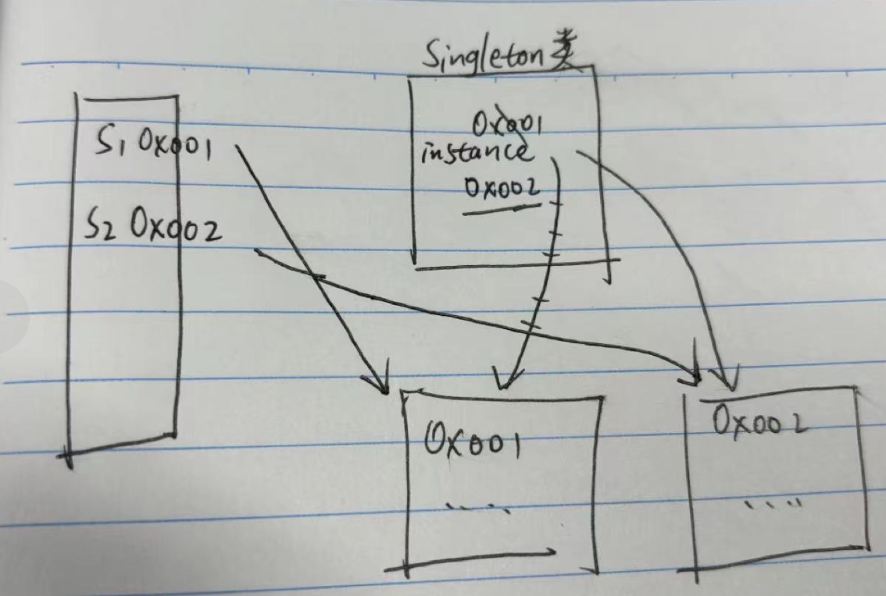
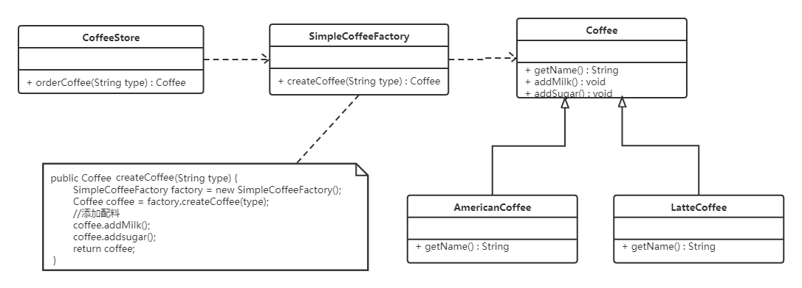
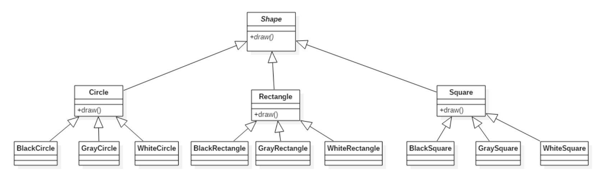
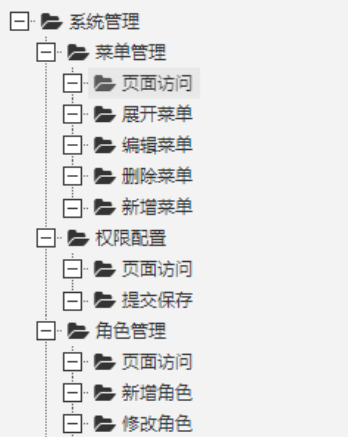

# 1 设计模式概述

策略模式

- 定义了一个算法族，分别封装起来，使得它们之间可以互相变换。策略让算法的变化独立于使用它的客户。


***

## 1.1 软件设计模式的概念

软件设计模式（Software Design Pattern），又称设计模式，是一套被反复使用、多数人知晓的、经过分类编目的、代码设计经验的总结。它描述了在软件设计过程中的一些不断重复发生的问题，以及该问题的解决方案。也就是说，它是解决特定问题的一系列套路，是前辈们的代码设计经验的总结，具有一定的普遍性，可以反复使用。

## 1.2 学习设计模式的必要性

设计模式的本质是面向对象设计原则的实际运用，是对类的封装性、继承性和多态性以及类的关联关系和组合关系的充分理解。

正确使用设计模式具有以下优点。

- 可以提高程序员的思维能力、编程能力和设计能力。
- 使程序设计更加标准化、代码编制更加工程化，使软件开发效率大大提高，从而缩短软件的开发周期。
- 使设计的代码可重用性高、可读性强、可靠性高、灵活性好、可维护性强。

## 1.3 设计模式分类

* **创建型模式**

  用于描述“怎样创建对象”，它的主要特点是“将对象的创建与使用分离”。GoF（四人组）书中提供了单例、原型、工厂方法、抽象工厂、建造者等 5 种创建型模式。

* **结构型模式**

  用于描述如何将类或对象按某种布局组成更大的结构，GoF（四人组）书中提供了代理、适配器、桥接、装饰、外观、享元、组合等 7 种结构型模式。

* **行为型模式**

  用于描述类或对象之间怎样相互协作共同完成单个对象无法单独完成的任务，以及怎样分配职责。GoF（四人组）书中提供了模板方法、策略、命令、职责链、状态、观察者、中介者、迭代器、访问者、备忘录、解释器等 11 种行为型模式。

# 2 UML图

统一建模语言（Unified Modeling Language，UML）是用来设计软件的可视化建模语言。它的特点是简单、统一、图形化、能表达软件设计中的动态与静态信息。

UML 从目标系统的不同角度出发，定义了用例图、类图、对象图、状态图、活动图、时序图、协作图、构件图、部署图等 9 种图。

## 2.1 类图概述

类图(Class diagram)是显示了模型的静态结构，特别是模型中存在的类、类的内部结构以及它们与其他类的关系等。类图不显示暂时性的信息。类图是面向对象建模的主要组成部分。

## 2.2 类图的作用

* 在软件工程中，类图是一种静态的结构图，描述了系统的类的集合，类的属性和类之间的关系，可以简化了人们对系统的理解；
* 类图是系统分析和设计阶段的重要产物，是系统编码和测试的重要模型。

## 2.3 类图表示法

### 2.3.1 类的表示方式 

在UML类图中，类使用包含类名、属性(field) 和方法(method) 且带有分割线的矩形来表示，比如下图表示一个Employee类，它包含name,age和address这3个属性，以及work()方法。 


属性/方法名称前加的加号和减号表示了这个属性/方法的可见性，UML类图中表示可见性的符号有三种：

* +：表示public

* -：表示private

* #：表示protected

属性的完整表示方式是： **可见性  名称 ：类型 [ = 缺省值]**  

方法的完整表示方式是： **可见性  名称(参数列表) [ ： 返回类型]**

> 注意：
>
> ​	1，中括号中的内容表示是可选的
>
> ​	2，也有将类型放在变量名前面，返回值类型放在方法名前面

**举个栗子：**


上图Demo类定义了三个方法：

* method()方法：修饰符为public，没有参数，没有返回值。
* method1()方法：修饰符为private，没有参数，返回值类型为String。
* method2()方法：修饰符为protected，接收两个参数，第一个参数类型为int，第二个参数类型为String，返回值类型是int。

### 2.3.2 类与类之间关系的表示方式

#### 2.3.2.1 关联关系

关联关系是对象之间的一种引用关系，用于表示一类对象与另一类对象之间的联系，如老师和学生、师傅和徒弟、丈夫和妻子等。关联关系是类与类之间最常用的一种关系，分为一般关联关系、聚合关系和组合关系。我们先介绍一般关联。

关联又可以分为单向关联，双向关联，自关联。

**1，单向关联**


在UML类图中单向关联用一个带箭头的实线表示。上图表示每个顾客都有一个地址，这通过让Customer类持有一个类型为Address的成员变量类实现。

**2，双向关联**


从上图中我们很容易看出，所谓的双向关联就是双方各自持有对方类型的成员变量。

在UML类图中，双向关联用一个不带箭头的直线表示。上图中在Customer类中维护一个List\<Product>，表示一个顾客可以购买多个商品；在Product类中维护一个Customer类型的成员变量表示这个产品被哪个顾客所购买。

**3，自关联**


自关联在UML类图中用一个带有箭头且指向自身的线表示。上图的意思就是Node类包含类型为Node的成员变量，也就是“自己包含自己”。

#### 2.3.2.2 聚合关系

聚合关系是关联关系的一种，是强关联关系，是整体和部分之间的关系。

聚合关系也是通过成员对象来实现的，其中成员对象是整体对象的一部分，但是**成员对象可以脱离整体对象而独立存在**。例如，学校与老师的关系，学校包含老师，但如果学校停办了，老师依然存在。

在 UML 类图中，聚合关系可以用带空心菱形的实线来表示，菱形指向整体。下图所示是大学和教师的关系图：


#### 2.3.2.3 组合关系

组合表示类之间的整体与部分的关系，但它是一种更强烈的聚合关系。

在组合关系中，整体对象可以控制部分对象的生命周期，一旦整体对象不存在，部分对象也将不存在，**部分对象不能脱离整体对象而存在**。例如，头和嘴的关系，没有了头，嘴也就不存在了。

在 UML 类图中，组合关系用带实心菱形的实线来表示，菱形指向整体。下图所示是头和嘴的关系图：


#### 2.3.2.4 依赖关系

依赖关系是一种使用关系，它是对象之间耦合度最弱的一种关联方式，是临时性的关联。在代码中，某个类的方法通过局部变量、方法的参数或者对静态方法的调用来访问另一个类（被依赖类）中的某些方法来完成一些职责。

在 UML 类图中，依赖关系使用带箭头的虚线来表示，箭头从使用类指向被依赖的类。下图所示是司机和汽车的关系图，司机驾驶汽车：


#### 2.3.2.5 继承关系

继承关系是对象之间`耦合度最大的一种关系`，表示一般与特殊的关系，是父类与子类之间的关系，是一种继承关系。

在 UML 类图中，泛化关系用带空心三角箭头的实线来表示，箭头从子类指向父类。在代码实现时，使用面向对象的继承机制来实现泛化关系。例如，Student 类和 Teacher 类都是 Person 类的子类，其类图如下图所示：


#### 2.3.2.6 实现关系

实现关系是接口与实现类之间的关系。在这种关系中，类实现了接口，类中的操作实现了接口中所声明的所有的抽象操作。

在 UML 类图中，实现关系使用带空心三角箭头的虚线来表示，箭头从实现类指向接口。例如，汽车和船实现了交通工具，其类图如图 9 所示。


# 3 软件设计原则

在软件开发中，为了提高软件系统的可维护性和可复用性，增加软件的可扩展性和灵活性，程序员要尽量根据6条原则来开发程序，从而提高软件开发效率、节约软件开发成本和维护成本。  

## 3.1 开闭原则

**对扩展开放，对修改关闭**。在程序需要进行拓展的时候，不能去修改原有的代码，实现一个热插拔的效果。简言之，是为了使程序的扩展性好，易于维护和升级。

想要达到这样的效果，我们需要使用接口和抽象类。

因为抽象灵活性好，适应性广，只要抽象的合理，可以基本保持软件架构的稳定。而软件中易变的细节可以从抽象派生来的实现类来进行扩展，当软件需要发生变化时，只需要根据需求重新派生一个实现类来扩展就可以了。

下面以 `搜狗输入法` 的皮肤为例介绍开闭原则的应用。

【例】`搜狗输入法` 的皮肤设计。

分析：`搜狗输入法` 的皮肤是输入法背景图片、窗口颜色和声音等元素的组合。用户可以根据自己的喜爱更换自己的输入法的皮肤，也可以从网上下载新的皮肤。这些皮肤有共同的特点，可以为其定义一个抽象类（AbstractSkin），而每个具体的皮肤（DefaultSpecificSkin和HeimaSpecificSkin）是其子类。用户窗体可以根据需要选择或者增加新的主题，而不需要修改原代码，所以它是满足开闭原则的。


***

案例演示：

```java
/*抽象皮肤类*/
public abstract class AbstractSkin {
    //显示的方法
    public abstract void display();
}
```

```java
/*默认皮肤类*/
public class DefaultSkin extends AbstractSkin {
    public void display() {
        System.out.println("默认皮肤");
    }
}
```

```java
/*黑马程序员皮肤*/
public class HeimaSkin extends AbstractSkin {
    public void display() {
        System.out.println("黑马皮肤");
    }
}
```

```java
/*搜狗输入法*/
public class SougouInput {
    private AbstractSkin skin;
    public void setSkin(AbstractSkin skin) {
        this.skin = skin;
    }
    public void display() {
        skin.display();
    }
}
```

```java
public class Client {
    public static void main(String[] args) {
        //1,创建搜狗输入法对象
        SougouInput input = new SougouInput();
        //2,创建皮肤对象
        //DefaultSkin skin = new DefaultSkin();
        HeimaSkin skin = new HeimaSkin();
        //3,将皮肤设置到输入法中
        input.setSkin(skin);
        //4,显示皮肤
        input.display();
    }
}
```

## 3.2 里氏代换原则

里氏代换原则是面向对象设计的基本原则之一。

里氏代换原则：任何基类可以出现的地方，子类一定可以出现。通俗理解：子类可以扩展父类的功能，但不能改变父类原有的功能。换句话说，子类继承父类时，除添加新的方法完成新增功能外，尽量不要重写父类的方法。

如果通过重写父类的方法来完成新的功能，这样写起来虽然简单，但是整个继承体系的可复用性会比较差，特别是运用多态比较频繁时，程序运行出错的概率会非常大。

下面看一个里氏替换原则中经典的一个例子

【例】正方形不是长方形。

在数学领域里，正方形毫无疑问是长方形，它是一个长宽相等的长方形。所以，我们开发的一个与几何图形相关的软件系统，就可以顺理成章的让正方形继承自长方形。


代码如下：

**长方形类（Rectangle）：**

```java
public class Rectangle {
    private double length;
    private double width;
		... get/set方法
}
```

**正方形（Square）：**

由于正方形的长和宽相同，所以在方法setLength和setWidth中，对长度和宽度都需要赋相同值。

```java
public class Square extends Rectangle {
    public void setWidth(double width) {
        super.setLength(width);
        super.setWidth(width);
    }
    public void setLength(double length) {
        super.setLength(length);
        super.setWidth(length);
    }
}
```

类RectangleDemo是我们的软件系统中的一个组件，它有一个resize方法依赖基类Rectangle，resize方法是RectandleDemo类中的一个方法，用来实现宽度逐渐增长的效果。

```java
public class RectangleDemo {
    public static void resize(Rectangle rectangle) {
        while (rectangle.getWidth() <= rectangle.getLength()) {
            rectangle.setWidth(rectangle.getWidth() + 1);
        }
    }
    //打印长方形的长和宽
    public static void printLengthAndWidth(Rectangle rectangle) {
        System.out.println(rectangle.getLength());
        System.out.println(rectangle.getWidth());
    }
    public static void main(String[] args) {
        Rectangle rectangle = new Rectangle();
        rectangle.setLength(20);
        rectangle.setWidth(10);
        resize(rectangle);
        printLengthAndWidth(rectangle);
        System.out.println("============");
        Rectangle rectangle1 = new Square();
        rectangle1.setLength(10);
        resize(rectangle1);
        printLengthAndWidth(rectangle1);
    }
}
```

我们运行一下这段代码就会发现，假如我们把一个普通长方形作为参数传入resize方法，就会看到长方形宽度逐渐增长的效果，当宽度大于长度,代码就会停止，这种行为的结果符合我们的预期；假如我们再把一个正方形作为参数传入resize方法后，就会看到正方形的宽度和长度都在不断增长，代码会一直运行下去，直至系统产生溢出错误。所以，普通的长方形是适合这段代码的，正方形不适合。
我们得出结论：在resize方法中，Rectangle类型的参数是不能被Square类型的参数所代替，如果进行了替换就得不到预期结果。因此，Square类和Rectangle类之间的继承关系违反了里氏代换原则，**它们之间的继承关系不成立，正方形不是长方形**。

如何改进呢？此时我们需要重新设计他们之间的关系。抽象出来一个四边形接口(Quadrilateral)，让Rectangle类和Square类实现Quadrilateral接口


***

改进：

```java
public interface Quadrilateral {
    //获取长
    double getLength();
    //获取宽
    double getWidth();
}
```

```java
public class Square implements Quadrilateral {
    // 边长
    private double side;
    public double getSide() {
        return side;
    }
    public void setSide(double side) {
        this.side = side;
    }
    public double getLength() {
        return side;
    }
    public double getWidth() {
        return side;
    }
}
```

```java
public class Rectangle implements Quadrilateral {
    private double length;
    private double width;
    public void setLength(double length) {
        this.length = length;
    }
    public void setWidth(double width) {
        this.width = width;
    }
    public double getLength() {
        return length;
    }
    public double getWidth() {
        return width;
    }
}
```

现在resize这个方法就不能传入正方形了，因为正方形没有继承长方形了:

```java
public class RectangleDemo {
    public static void main(String[] args) {
        //创建长方形对象
        Rectangle r = new Rectangle();
        r.setLength(20);
        r.setWidth(10);
        //调用方法进行扩宽操作
        resize(r);
        printLengthAndWidth(r);
    }
    //扩宽的方法
    public static void resize(Rectangle rectangle) {
        //判断宽如果比长小，进行扩宽的操作
        while(rectangle.getWidth() <= rectangle.getLength()) {
            rectangle.setWidth(rectangle.getWidth() + 1);
        }
    }
    //打印长和宽
    public static void printLengthAndWidth(Quadrilateral quadrilateral) {
        System.out.println(quadrilateral.getLength());
        System.out.println(quadrilateral.getWidth());
    }
}
```

## 3.3 依赖倒转原则

高层模块不应该依赖低层模块，两者都应该依赖其抽象；抽象不应该依赖细节，细节应该依赖抽象。简单的说就是要求对抽象进行编程，不要对实现进行编程，这样就降低了客户与实现模块间的耦合。

下面看一个例子来理解依赖倒转原则

【例】组装电脑

现要组装一台电脑，需要配件cpu，硬盘，内存条。只有这些配置都有了，计算机才能正常的运行。选择cpu有很多选择，如Intel，AMD等，硬盘可以选择希捷，西数等，内存条可以选择金士顿，海盗船等。

**类图如下：**


代码如下：

**希捷硬盘类（XiJieHardDisk）:**

```java
public class XiJieHardDisk implements HardDisk {
    public void save(String data) {
        System.out.println("使用希捷硬盘存储数据" + data);
    }
    public String get() {
        System.out.println("使用希捷希捷硬盘取数据");
        return "数据";
    }
}
```

**Intel处理器（IntelCpu）：**

```java
public class IntelCpu implements Cpu {
    public void run() {
        System.out.println("使用Intel处理器");
    }
}
```

**金士顿内存条（KingstonMemory）：**

```java
public class KingstonMemory implements Memory {
    public void save() {
        System.out.println("使用金士顿作为内存条");
    }
}
```

**电脑（Computer）：**

```java
public class Computer {
    private XiJieHardDisk hardDisk;
    private IntelCpu cpu;
    private KingstonMemory memory;
    get/set...
    public void run() {
        System.out.println("计算机工作");
        cpu.run();
        memory.save();
        String data = hardDisk.get();
        System.out.println("从硬盘中获取的数据为：" + data);
    }
}
```

**测试类（TestComputer）：**

测试类用来组装电脑。

```java
public class TestComputer {
    public static void main(String[] args) {
        Computer computer = new Computer();
        computer.setHardDisk(new XiJieHardDisk());
        computer.setCpu(new IntelCpu());
        computer.setMemory(new KingstonMemory());
        computer.run();
    }
}
```

上面代码可以看到已经组装了一台电脑，但是似乎组装的电脑的cpu只能是Intel的，内存条只能是金士顿的，硬盘只能是希捷的，这对用户肯定是不友好的，用户有了机箱肯定是想按照自己的喜好，选择自己喜欢的配件。

根据依赖倒转原则进行改进：

代码我们只需要修改Computer类，让Computer类依赖抽象（各个配件的接口），而不是依赖于各个组件具体的实现类。

**类图如下：**


**电脑（Computer）：**

```java
public class Computer {
    private HardDisk hardDisk;
    private Cpu cpu;
    private Memory memory;
		get/set...
    public void run() {
        System.out.println("计算机工作");
        cpu.run();
        memory.save();
        String data = hardDisk.get();
        System.out.println("从硬盘中获取的数据为：" + data);
    }
}
```

面向对象的开发很好的解决了这个问题，一般情况下抽象的变化概率很小，让用户程序依赖于抽象，实现的细节也依赖于抽象。即使实现细节不断变动，只要抽象不变，客户程序就不需要变化。这大大降低了客户程序与实现细节的耦合度。

## 3.4 接口隔离原则

客户端不应该被迫依赖于它不使用的方法；一个类对另一个类的依赖应该建立在最小的接口上。

下面看一个例子来理解接口隔离原则

【例】安全门案例

我们需要创建一个`黑马`品牌的安全门，该安全门具有防火、防水、防盗的功能。可以将防火，防水，防盗功能提取成一个接口，形成一套规范。类图如下：


上面的设计我们发现了它存在的问题，黑马品牌的安全门具有防盗，防水，防火的功能。现在如果我们还需要再创建一个传智品牌的安全门，而该安全门只具有防盗、防水功能呢？很显然如果实现SafetyDoor接口就违背了接口隔离原则，那么我们如何进行修改呢？看如下类图：


代码如下：

**AntiTheft（接口）：**

```java
public interface AntiTheft {
    void antiTheft();
}
```

**Fireproof（接口）：**

```java
public interface Fireproof {
    void fireproof();
}
```

**Waterproof（接口）：**

```java
public interface Waterproof {
    void waterproof();
}
```

**HeiMaSafetyDoor（类）：**

```java
public class HeiMaSafetyDoor implements AntiTheft,Fireproof,Waterproof {
    public void antiTheft() {
        System.out.println("防盗");
    }
    public void fireproof() {
        System.out.println("防火");
    }
    public void waterproof() {
        System.out.println("防水");
    }
}
```

**ItcastSafetyDoor（类）：**

```java
public class ItcastSafetyDoor implements AntiTheft,Fireproof {
    public void antiTheft() {
        System.out.println("防盗");
    }
    public void fireproof() {
        System.out.println("防火");
    }
}
```

测试类：

```java
public class Client {
    public static void main(String[] args) {
        //创建黑马安全门对象
        HeimaSafetyDoor door = new HeimaSafetyDoor();
        //调用功能
        door.antiTheft();
        door.fireProof();
        door.waterProof();
        System.out.println("============");
        //创建传智安全门对象
        ItcastSafetyDoor door1 = new ItcastSafetyDoor();
        //调用功能
        door1.antiTheft();
        door1.fireproof();
    }
}
```


## 3.5 迪米特法则

迪米特法则又叫最少知识原则。

只和你的直接朋友交谈，不跟“陌生人”说话（Talk only to your immediate friends and not to strangers）。

其含义是：如果两个软件实体无须直接通信，那么就不应当发生直接的相互调用，可以通过第三方转发该调用。其目的是降低类之间的耦合度，提高模块的相对独立性。

迪米特法则中的“朋友”是指：当前对象本身、当前对象的成员对象、当前对象所创建的对象、当前对象的方法参数等，这些对象同当前对象存在关联、聚合或组合关系，可以直接访问这些对象的方法。

下面看一个例子来理解迪米特法则

【例】明星与经纪人的关系实例

明星由于全身心投入艺术，所以许多日常事务由经纪人负责处理，如和粉丝的见面会，和媒体公司的业务洽淡等。这里的经纪人是明星的朋友，而粉丝和媒体公司是陌生人，所以适合使用迪米特法则。

类图如下：


代码如下：

**明星类（Star）**

```java
public class Star {
    private String name;
    public Star(String name) {
        this.name=name;
    }
    public String getName() {
        return name;
    }
}
```

**粉丝类（Fans）**

```java
public class Fans {
    private String name;
    public Fans(String name) {
        this.name=name;
    }
    public String getName() {
        return name;
    }
}
```

**媒体公司类（Company）**

```java
public class Company {
    private String name;
    public Company(String name) {
        this.name=name;
    }
    public String getName() {
        return name;
    }
}
```

**经纪人类（Agent）**

```java
public class Agent {
    private Star star;
    private Fans fans;
    private Company company;
    set...
    public void meeting() {
        System.out.println(fans.getName() + "与明星" + star.getName() + "见面了。");
    }
    public void business() {
        System.out.println(company.getName() + "与明星" + star.getName() + "洽淡业务。");
    }
}
```

测试类：

```java
public class Client {
    public static void main(String[] args) {
        //创建经纪人类
        Agent agent = new Agent();
        //创建明星对象
        Star star = new Star("林青霞");
        agent.setStar(star);
        //创建粉丝对象
        Fans fans = new Fans("李四");
        agent.setFans(fans);
        //创建媒体公司对象
        Company company = new Company("黑马媒体公司");
        agent.setCompany(company);
        agent.meeting();//和粉丝见面
        agent.business();//和媒体公司洽谈业务
    }
}
```

## 3.6 合成复用原则

合成复用原则是指：尽量先使用**组合**或者**聚合**等关联关系来实现，其次才考虑使用**继承**关系来实现。

通常类的复用分为继承复用和合成复用（使用**组合**或者**聚合**等关联关系）两种。

继承复用虽然有简单和易实现的优点，但它也存在以下缺点：

1. 继承复用破坏了类的封装性。因为继承会将父类的实现细节暴露给子类，父类对子类是透明的，所以这种复用又称为“白箱”复用。
2. 子类与父类的耦合度高。父类的实现的任何改变都会导致子类的实现发生变化，这不利于类的扩展与维护。
3. 它限制了复用的灵活性。从父类继承而来的实现是静态的，在编译时已经定义，所以在运行时不可能发生变化。


采用组合或聚合复用时，可以将已有对象纳入新对象中，使之成为新对象的一部分，新对象可以调用已有对象的功能，它有以下优点：

1. 它维持了类的封装性。因为成分对象的内部细节是新对象看不见的，所以这种复用又称为“黑箱”复用。
2. 对象间的耦合度低。可以在类的成员位置声明抽象（就是声明要使用类的父类或者父接口）。
3. 复用的灵活性高。这种复用可以在运行时动态进行，新对象可以动态地引用与成分对象类型相同的对象。

下面看一个例子来理解合成复用原则

【例】汽车分类管理程序

汽车按“动力源”划分可分为汽油汽车、电动汽车等；按“颜色”划分可分为白色汽车、黑色汽车和红色汽车等。如果同时考虑这两种分类，其组合就很多。类图如下： 


从上面类图我们可以看到使用继承复用产生了很多子类，如果现在又有新的动力源或者新的颜色的话，就需要再定义新的类。我们试着将继承复用改为聚合复用看一下。


***

# 4 创建者模式

创建型模式的主要关注点是“怎样创建对象？”，它的主要特点是“将对象的创建与使用分离”。

这样可以降低系统的耦合度，使用者不需要关注对象的创建细节。

创建型模式分为：

* 单例模式
* 工厂方法模式
* 抽象工程模式
* 原型模式
* 建造者模式

## 4.1 单例设计模式

单例模式（Singleton Pattern）是 Java 中最简单的设计模式之一。这种类型的设计模式属于创建型模式，它提供了一种创建对象的最佳方式。

这种模式涉及到一个单一的类，该类负责创建自己的对象，同时确保只有单个对象被创建。这个类提供了一种访问其唯一的对象的方式，可以直接访问，不需要实例化该类的对象。

### 4.1.1 单例模式的结构

单例模式的主要有以下角色：

* 单例类。只能创建一个实例的类
* 访问类。使用单例类

### 4.1.2 单例模式的实现

> 单例设计模式分类两种：
>
> ​	饿汉式：类加载就会导致该单实例对象被创建	
>
> ​	懒汉式：类加载不会导致该单实例对象被创建，而是首次使用该对象时才会创建

1. 饿汉式-方式1（静态变量方式）

   ```java
   /**
    * 饿汉式
    *      静态变量创建类的对象
    */
   public class Singleton {
       //私有构造方法
       private Singleton() {}
       //在成员位置创建该类的对象
       private static Singleton instance = new Singleton();
       //对外提供静态方法获取该对象
       public static Singleton getInstance() {
           return instance;
       }
   }
   ```

   <font color='red'>说明：</font>

   ​	该方式在成员位置声明Singleton类型的静态变量，并创建Singleton类的对象instance。instance对象是随着类的加载而创建的。如果该对象足够大的话，而一直没有使用就会造成内存的浪费。

   ***

2. 饿汉式-方式2（静态代码块方式，跟上面没什么区别）

   ```java
   /**
    * 饿汉式
    *      在静态代码块中创建该类对象
    */
   public class Singleton {
       private Singleton() {}
       private static Singleton instance;
       static {
           instance = new Singleton();
       }
       public static Singleton getInstance() {
           return instance;
       }
   }
   ```

   <font color='red'>说明：</font>

   ​	该方式在成员位置声明Singleton类型的静态变量，而对象的创建是在静态代码块中，也是对着类的加载而创建。所以和饿汉式的方式1基本上一样，当然该方式也存在内存浪费问题。

   ***

3. 懒汉式-方式1（线程不安全）

   ```java
   /**
    * 懒汉式
    *  线程不安全
    */
   public class Singleton {
       private Singleton() {}
       private static Singleton instance;
       public static Singleton getInstance() {
           if(instance == null) {
               instance = new Singleton();
           }
           return instance;
       }
   }
   ```

   <font color='red'>说明：</font>

   ​	从上面代码我们可以看出该方式在成员位置声明Singleton类型的静态变量，并没有进行对象的赋值操作，那么什么时候赋值的呢？当调用getInstance()方法获取Singleton类的对象的时候才创建Singleton类的对象，这样就实现了懒加载的效果。但是，如果是多线程环境，会出现线程安全问题。

   ```java
   public static void main(String[] args) {
       Singleton s1 = Singleton.getInstance();
       Singleton s2 = Singleton.getInstance();
       //判断两次获取到的Singleton对象是否是同一个对象
       System.out.println(s1 == s2);
   }
   ```

   画图演示线程不安全问题：

   

   ***

4. 懒汉式-方式2（线程安全）

   ```java
   /**
    * 懒汉式
    *  线程安全
    */
   public class Singleton {
       private Singleton() {}
       private static Singleton instance;
       public static synchronized Singleton getInstance() {
           if(instance == null) {
               instance = new Singleton();
           }
           return instance;
       }
   }
   ```

   <font color='red'>说明：</font>

   ​	该方式也实现了懒加载效果，同时又解决了线程安全问题。但是在getInstance()方法上**添加了synchronized关键字，导致该方法的执行效果特别低**。从上面代码我们可以看出，其实就是在初始化instance的时候才会出现线程安全问题，一旦初始化完成就不存在了。

   ***

5. 懒汉式-方式3（双重检查锁）

   再来讨论一下懒汉模式中加锁的问题，对于 `getInstance()` 方法来说，绝大部分的操作都是读操作，读操作是线程安全的，所以我们没必让每个线程必须持有锁才能调用该方法，我们需要调整加锁的时机。由此也产生了一种新的实现模式：双重检查锁模式

   ```java
   /**
    * 双重检查方式
    */
   public class Singleton { 
       private Singleton() {}
       private static Singleton instance;
       public static Singleton getInstance() {
   		//第一次判断，如果instance不为null，不进入抢锁阶段，直接返回实例
           if(instance == null) {
               synchronized (Singleton.class) {
                   //抢到锁之后再次判断是否为null
                   if(instance == null) {
                       instance = new Singleton();
                   }
               }
           }
           return instance;
       }
   }
   ```

   双重检查锁模式是一种非常好的单例实现模式，解决了单例、性能、线程安全问题，上面的双重检测锁模式看上去完美无缺，其实是存在问题，在多线程的情况下，可能会出现空指针问题，出现问题的原因是JVM在实例化对象的时候会进行优化和指令重排序操作。

   要解决双重检查锁模式带来空指针异常的问题，只需要使用 `volatile` 关键字, `volatile` 关键字可以保证可见性和有序性。

   ```java
   /**
    * 双重检查方式
    */
   public class Singleton {
       private Singleton() {}
       private static volatile Singleton instance;
       public static Singleton getInstance() {
   		//第一次判断，如果instance不为null，不进入抢锁阶段，直接返回实际
           if(instance == null) {
               synchronized (Singleton.class) {
                   //抢到锁之后再次判断是否为空
                   if(instance == null) {
                       instance = new Singleton();
                   }
               }
           }
           return instance;
       }
   }
   ```

   <font color="red">小结：</font>

   添加 `volatile` 关键字之后的双重检查锁模式是一种比较好的单例实现模式，能够保证在多线程的情况下线程安全也不会有性能问题。

***


6. 懒汉式-方式4（静态内部类方式）

   静态内部类单例模式中实例由内部类创建，由于 JVM 在加载外部类的过程中, 是不会加载静态内部类的, 只有内部类的属性/方法被调用时才会被加载, 并初始化其静态属性。静态属性由于被 `static` 修饰，保证只被实例化一次，并且严格保证实例化顺序。

   ```java
   /**
    * 静态内部类方式
    */
   public class Singleton {
       private Singleton() {}
       private static class SingletonHolder {
           private static final Singleton INSTANCE = new Singleton();
       }
       public static Singleton getInstance() {
           return SingletonHolder.INSTANCE;
       }
   }
   ```

   <font color='red'>说明：</font>

   ​	第一次加载Singleton类时不会去初始化INSTANCE，只有第一次调用getInstance，虚拟机加载SingletonHolder

   并初始化INSTANCE，这样不仅能确保线程安全，也能保证 Singleton 类的唯一性。

   <font color="red">小结：</font>

   ​	静态内部类单例模式是一种优秀的单例模式，是开源项目中比较常用的一种单例模式。在没有加任何锁的情况下，保证了多线程下的安全，并且没有任何性能影响和空间的浪费。

   ***

7. 枚举方式

   枚举类实现单例模式是极力推荐的单例实现模式，因为枚举类型是线程安全的，并且只会装载一次，设计者充分的利用了枚举的这个特性来实现单例模式，枚举的写法非常简单，而且枚举类型是所用单例实现中唯一一种不会被破坏的单例实现模式。

   ```java
   /**
    * 枚举方式
    */
   public enum Singleton {
       INSTANCE;
   }
   ```

   ```java
   public static void main(String[] args) {
       Singleton instance = Singleton.INSTANCE;
       Singleton instance1 = Singleton.INSTANCE;
       System.out.println(instance == instance1);
   }
   ```

   <font color='red'>说明：</font>

   ​	枚举方式属于恶汉式方式。

### 4.1.3 存在的问题

#### 4.1.3.1 问题演示

破坏单例模式：

使上面定义的单例类（Singleton）可以创建多个对象，枚举方式除外。有两种方式，分别是**序列化**和**反射**。

* 序列化反序列化

  **Singleton类：**

  ```java
  public class Singleton implements Serializable {
      private Singleton() {}
      private static class SingletonHolder {
          private static final Singleton INSTANCE = new Singleton();
      }
      public static Singleton getInstance() {
          return SingletonHolder.INSTANCE;
      }
  }
  ```

  **Test类：**

  ```java
  public class Test {
      public static void main(String[] args) throws Exception {
          //往文件中写对象
          //writeObject2File();
          //从文件中读取对象
          Singleton s1 = readObjectFromFile();
          Singleton s2 = readObjectFromFile();
          //判断两个反序列化后的对象是否是同一个对象
          System.out.println(s1 == s2);
      }
      private static Singleton readObjectFromFile() throws Exception {
          //创建对象输入流对象
          ObjectInputStream ois = new ObjectInputStream(new FileInputStream("C:\\Users\\Think\\Desktop\\a.txt"));
          //第一个读取Singleton对象
          Singleton instance = (Singleton) ois.readObject();
          return instance;
      }
      public static void writeObject2File() throws Exception {
          //获取Singleton类的对象
          Singleton instance = Singleton.getInstance();
          //创建对象输出流
          ObjectOutputStream oos = new ObjectOutputStream(new FileOutputStream("C:\\Users\\Think\\Desktop\\a.txt"));
          //将instance对象写出到文件中
          oos.writeObject(instance);
          oos.close();
      }
  }
  ```

  > 上面代码运行结果是`false`，表明序列化和反序列化已经破坏了单例设计模式。

  * 反射

    **Singleton类：**

    ```java
    public class Singleton {
        private Singleton() {}
        private static volatile Singleton instance;
        public static Singleton getInstance() {
            if(instance != null) {
                return instance;
            }
            synchronized (Singleton.class) {
                if(instance != null) {
                    return instance;
                }
                instance = new Singleton();
                return instance;
            }
        }
    }
    ```

    **Test类：**

    ```java
    public class Test {
        public static void main(String[] args) throws Exception {
            //获取Singleton类的字节码对象
            Class clazz = Singleton.class;
            //获取Singleton类的私有无参构造方法对象
            Constructor constructor = clazz.getDeclaredConstructor();
            //取消访问检查
            constructor.setAccessible(true);
            //创建Singleton类的对象s1
            Singleton s1 = (Singleton) constructor.newInstance();
            //创建Singleton类的对象s2
            Singleton s2 = (Singleton) constructor.newInstance();
            //判断通过反射创建的两个Singleton对象是否是同一个对象
            System.out.println(s1 == s2);
        }
    }
    ```

    > 上面代码运行结果是`false`，表明序列化和反序列化已经破坏了单例设计模式

  > <font color="red">注意：</font>枚举方式不会出现这两个问题。


#### 4.1.3.2 问题的解决

* 序列化、反序列方式破坏单例模式的解决方法

  在Singleton类中添加`readResolve()`方法，在反序列化时被反射调用，如果定义了这个方法，就返回这个方法的值，如果没有定义，则返回新new出来的对象。

  **Singleton类：**

  ```java
  public class Singleton implements Serializable {
      private Singleton() {}
      private static class SingletonHolder {
          private static final Singleton INSTANCE = new Singleton();
      }
      //对外提供静态方法获取该对象
      public static Singleton getInstance() {
          return SingletonHolder.INSTANCE;
      }
      /**
       * 下面是为了解决序列化反序列化破解单例模式
       */
      private Object readResolve() {
          return SingletonHolder.INSTANCE;
      }
  }
  ```

  **源码解析：**

  略。

  * 反射方式破解单例的解决方法

    ```java
    public class Singleton {
        private static volatile Singleton instance;
        private Singleton() {
            /*
               反射破解单例模式需要添加的代码
            */
            if(instance != null) {
                throw new RuntimeException();
            }
        }
        //对外提供静态方法获取该对象
        public static Singleton getInstance() {
            if(instance != null) {
                return instance;
            }
            synchronized (Singleton.class) {
                if(instance != null) {
                    return instance;
                }
                instance = new Singleton();
                return instance;
            }
        }
    }
    ```

    <font color="red">说明:</font>

    ​	这种方式比较好理解。当通过反射方式调用构造方法进行创建创建时，直接抛异常。不运行此中操作。

### 4.1.4 JDK源码解析-Runtime单例类

Runtime类就是使用的单例设计模式。

1. 通过源代码查看使用的是哪儿种单例模式

   ```java
   public class Runtime {
       private static Runtime currentRuntime = new Runtime();
       public static Runtime getRuntime() {
           return currentRuntime;
       }
       private Runtime() {}
       ...
   }
   ```

   从上面源代码中可以看出Runtime类使用的是饿汉式（静态属性）方式来实现单例模式的。

2. 使用Runtime类中的方法

   ```java
   public class RuntimeDemo {
       public static void main(String[] args) throws IOException {
           //获取Runtime类对象
           Runtime runtime = Runtime.getRuntime();
           //返回 Java 虚拟机中的内存总量。
           System.out.println(runtime.totalMemory());
           //返回 Java 虚拟机试图使用的最大内存量。
           System.out.println(runtime.maxMemory());
           //创建一个新的进程执行指定的字符串命令，返回进程对象
           Process process = runtime.exec("ipconfig");
           //获取命令执行后的结果，通过输入流获取
           InputStream inputStream = process.getInputStream();
           byte[] arr = new byte[1024 * 1024* 100];
           int b = inputStream.read(arr);
           System.out.println(new String(arr,0,b,"gbk"));
       }
   }
   ```

***

## 4.2 工厂模式

### 4.2.1 概述

需求：设计一个咖啡店点餐系统。  

设计一个咖啡类（Coffee），并定义其两个子类（美式咖啡【AmericanCoffee】和拿铁咖啡【LatteCoffee】）；再设计一个咖啡店类（CoffeeStore），咖啡店具有点咖啡的功能。

具体类的设计如下：


在java中，万物皆对象，这些对象都需要创建，如果创建的时候直接new该对象，就会对该对象耦合严重，假如我们要更换对象，所有new对象的地方都需要修改一遍，这显然违背了软件设计的开闭原则。如果我们使用工厂来生产对象，我们就只和工厂打交道就可以了，彻底和对象解耦，如果要更换对象，直接在工厂里更换该对象即可，达到了与对象解耦的目的；所以说，工厂模式最大的优点就是：**解耦**。

咖啡抽象类：

```java
public abstract class Coffee {
    public abstract String getName();
    //加糖
    public void addsugar() {
        System.out.println("加糖");
    }
    //加奶
    public void addMilk() {
        System.out.println("加奶");
    }
}
```

美式咖啡:

```java
public class AmericanCoffee extends Coffee {
    public String getName() {
        return "美式咖啡";
    }
}
```

拿铁咖啡:

```java
public class LatteCoffee extends Coffee {
    public String getName() {
        return "拿铁咖啡";
    }
}
```

咖啡店：

```java
public class CoffeeStore {
    public Coffee orderCoffee(String type) {
        //声明Coffee类型的变量，根据不同类型创建不同的coffee子类对象
        Coffee coffee = null;
        if("american".equals(type)) {
            coffee = new AmericanCoffee();
        } else if("latte".equals(type)) {
            coffee = new LatteCoffee();
        } else {
            throw new RuntimeException("对不起，您所点的咖啡没有");
        }
        //加配料
        coffee.addMilk();
        coffee.addsugar();
        return coffee;
    }
}
```

测试：

```java
public class Client {
    public static void main(String[] args) {
        //1,创建咖啡店类
        CoffeeStore store = new CoffeeStore();
        //2,点咖啡
        Coffee coffee = store.orderCoffee("american");
        System.out.println(coffee.getName());
    }
}
```

在本教程中会介绍三种工厂的使用

* 简单工厂模式（不属于GOF的23种经典设计模式）
* 工厂方法模式
* 抽象工厂模式

### 4.2.2 简单工厂模式

简单工厂不是一种设计模式，反而比较像是一种编程习惯。

#### 4.2.2.1 结构

简单工厂包含如下角色：

* 抽象产品 ：定义了产品的规范，描述了产品的主要特性和功能。
* 具体产品 ：实现或者继承抽象产品的子类
* 具体工厂 ：提供了创建产品的方法，调用者通过该方法来获取产品。

#### 4.2.2.2 实现

现在使用简单工厂对上面案例进行改进，类图如下：



工厂类代码如下：

```java
public class SimpleCoffeeFactory {
    public Coffee createCoffee(String type) {
        Coffee coffee = null;
        if("americano".equals(type)) {
            coffee = new AmericanoCoffee();
        } else if("latte".equals(type)) {
            coffee = new LatteCoffee();
        }
        return coffee;
    }
}
```

修改后的咖啡店代码如下：

```java
public class CoffeeStore {
    public Coffee orderCoffee(String type) {
        SimpleCoffeeFactory factory = new SimpleCoffeeFactory();
        //调用生产咖啡的方法
        Coffee coffee = factory.createCoffee(type);
        //加配料
        coffee.addMilk();
        coffee.addsugar();
        return coffee;
    }
}
```

工厂（factory）处理创建对象的细节，一旦有了SimpleCoffeeFactory，CoffeeStore类中的orderCoffee()就变成此对象的客户，后期如果需要Coffee对象直接从工厂中获取即可。这样也就解除了和Coffee实现类的耦合，同时又产生了新的耦合，CoffeeStore对象和SimpleCoffeeFactory工厂对象的耦合，工厂对象和商品对象的耦合。

后期如果再加新品种的咖啡，我们势必要需求修改SimpleCoffeeFactory的代码，违反了开闭原则。工厂类的客户端可能有很多，比如创建美团外卖等MeiTuanStore，这样只需要修改工厂类的代码，省去其他的修改操作。

#### 4.2.2.4 优缺点

**优点：**

封装了创建对象的过程，可以通过参数直接获取对象。把对象的创建和业务逻辑层分开，这样以后就避免了修改客户代码，如果要实现新产品直接修改工厂类，而不需要在原代码中修改，这样就降低了客户代码修改的可能性，更加容易扩展。

**缺点：**

增加新产品时还是需要修改工厂类的代码，违背了“开闭原则”。

#### 4.2.2.3 扩展

**静态工厂**

在开发中也有一部分人将工厂类中的创建对象的功能定义为静态的，这个就是静态工厂模式，它也不是23种设计模式中的。代码如下：

```java
public class SimpleCoffeeFactory {
    public static Coffee createCoffee(String type) {
        Coffee coffee = null;
        if("americano".equals(type)) {
            coffee = new AmericanoCoffee();
        } else if("latte".equals(type)) {
            coffee = new LatteCoffee();
        }
        return coffe;
    }
}
```

CoffeeStore：

```java
public Coffee orderCoffee(String type) {
    /*SimpleCoffeeFactory factory = new SimpleCoffeeFactory();
    //调用生产咖啡的方法
    Coffee coffee = factory.createCoffee(type);*/
    // 只需要这一句就可以
    Coffee coffee = SimpleCoffeeFactory.createCoffee(type);
    //加配料
    coffee.addMilk();
    coffee.addsugar();
    return coffee;
}
```

### 4.2.3 工厂方法模式

针对上例中的缺点，使用工厂方法模式就可以完美的解决，完全遵循开闭原则。

#### 4.2.3.1 概念

定义一个用于创建对象的接口，让子类决定实例化哪个产品类对象。工厂方法使一个产品类的实例化延迟到其工厂的子类。

#### 4.2.3.2 结构

工厂方法模式的主要角色：

* 抽象工厂（Abstract Factory）：提供了创建产品的接口，调用者通过它访问具体工厂的工厂方法来创建产品。
* 具体工厂（ConcreteFactory）：主要是实现抽象工厂中的抽象方法，完成具体产品的创建。
* 抽象产品（Product）：定义了产品的规范，描述了产品的主要特性和功能。
* 具体产品（ConcreteProduct）：实现了抽象产品角色所定义的接口，由具体工厂来创建，它同具体工厂之间一一对应。

#### 4.2.3.3 实现

使用工厂方法模式对上例进行改进，类图如下：


代码如下：

抽象工厂：

```java
public interface CoffeeFactory {
    Coffee createCoffee();
}
```

具体工厂：

```java
public class LatteCoffeeFactory implements CoffeeFactory {
    public Coffee createCoffee() {
        return new LatteCoffee();
    }
}
public class AmericanCoffeeFactory implements CoffeeFactory {
    public Coffee createCoffee() {
        return new AmericanCoffee();
    }
}
```

咖啡店类：

```java
public class CoffeeStore {
    private CoffeeFactory factory;
    public CoffeeStore(CoffeeFactory factory) {
        this.factory = factory;
    }
    public Coffee orderCoffee() {
        Coffee coffee = factory.createCoffee();
        coffee.addMilk();
        coffee.addsugar();
        return coffee;
    }
}
```

测试类：

```java
public static void main(String[] args) {
    //创建咖啡店对象
    CoffeeStore store = new CoffeeStore();
    //创建对象
    //CoffeeFactory factory = new AmericanCoffeeFactory();
    CoffeeFactory factory = new LatteCoffeeFactory();
    store.setFactory(factory);
    //点咖啡
    Coffee coffee = store.orderCoffee();
    System.out.println(coffee.getName());
}
```

从以上的编写的代码可以看到，要增加产品类时也要相应地增加工厂类，不需要修改工厂类的代码了，这样就解决了简单工厂模式的缺点。

工厂方法模式是简单工厂模式的进一步抽象。由于使用了多态性，工厂方法模式保持了简单工厂模式的优点，而且克服了它的缺点。

#### 4.2.3.4 优缺点

**优点：**

- 用户只需要知道具体工厂的名称就可得到所要的产品，无须知道产品的具体创建过程；
- 在系统增加新的产品时只需要添加具体产品类和对应的具体工厂类，无须对原工厂进行任何修改，满足开闭原则；

**缺点：**

* 每增加一个产品就要增加一个具体产品类和一个对应的具体工厂类，这增加了系统的复杂度。

### 4.2.4 抽象工厂模式

前面介绍的工厂方法模式中考虑的是一类产品的生产，如畜牧场只养动物、电视机厂只生产电视机、传智播客只培养计算机软件专业的学生等。

这些工厂只生产同种类产品，同种类产品称为同等级产品，也就是说：工厂方法模式只考虑生产同等级的产品，但是在现实生活中许多工厂是综合型的工厂，能生产多等级（种类） 的产品，如电器厂既生产电视机又生产洗衣机或空调，大学既有软件专业又有生物专业等。

本节要介绍的抽象工厂模式将考虑多等级产品的生产，将同一个具体工厂所生产的位于不同等级的一组产品称为一个产品族，下图所示横轴是产品等级，也就是同一类产品；纵轴是产品族，也就是同一品牌的产品，同一品牌的产品产自同一个工厂。


#### 4.2.4.1 概念

是一种为访问类提供一个创建一组相关或相互依赖对象的接口，且访问类无须指定所要产品的具体类就能得到同族的不同等级的产品的模式结构。

抽象工厂模式是工厂方法模式的升级版本，工厂方法模式只生产一个等级的产品，而抽象工厂模式可生产多个等级的产品。

#### 4.2.4.2 结构

抽象工厂模式的主要角色如下：

* 抽象工厂（Abstract Factory）：提供了创建产品的接口，它包含多个创建产品的方法，可以创建多个不同等级的产品。
* 具体工厂（Concrete Factory）：主要是实现抽象工厂中的多个抽象方法，完成具体产品的创建。
* 抽象产品（Product）：定义了产品的规范，描述了产品的主要特性和功能，抽象工厂模式有多个抽象产品。
* 具体产品（ConcreteProduct）：实现了抽象产品角色所定义的接口，由具体工
* 厂来创建，它 同具体工厂之间是多对一的关系。

#### 4.2.4.2 实现

现咖啡店业务发生改变，不仅要生产咖啡还要生产甜点，如提拉米苏、抹茶慕斯等，要是按照工厂方法模式，需要定义提拉米苏类、抹茶慕斯类、提拉米苏工厂、抹茶慕斯工厂、甜点工厂类，很容易发生类爆炸情况。其中拿铁咖啡、美式咖啡是一个产品等级，都是咖啡；提拉米苏、抹茶慕斯也是一个产品等级；拿铁咖啡和提拉米苏是同一产品族（也就是都属于意大利风味），美式咖啡和抹茶慕斯是同一产品族（也就是都属于美式风味）。所以这个案例可以使用抽象工厂模式实现。类图如下：


代码如下：

甜品抽象类：

```java
public abstract class Dessert {
    public abstract void show();
}
```

甜品实现类1：

```java
public class Trimisu extends Dessert {
    public void show() {
        System.out.println("提拉米苏");
    }
}
```

甜品实现类2：

```java
public class MatchaMousse extends Dessert {
    public void show() {
        System.out.println("抹茶慕斯");
    }
}
```

抽象工厂：

```java
public interface DessertFactory {
    Coffee createCoffee();
    Dessert createDessert();
}
```

具体工厂：

```java
//美式甜点工厂
public class AmericanDessertFactory implements DessertFactory {
    public Coffee createCoffee() {
        return new AmericanCoffee();
    }
    public Dessert createDessert() {
        return new MatchaMousse();
    }
}
//意大利风味甜点工厂
public class ItalyDessertFactory implements DessertFactory {
    public Coffee createCoffee() {
        return new LatteCoffee();
    }
    public Dessert createDessert() {
        return new Tiramisu();
    }
}
```

如果要加同一个产品族的话，只需要再加一个对应的工厂类即可，不需要修改其他的类。

#### 4.2.4.3 优缺点

**优点：**

当一个产品族中的多个对象被设计成一起工作时，它能保证客户端始终只使用同一个产品族中的对象。

**缺点：**

当产品族中需要增加一个新的产品时，所有的工厂类都需要进行修改。

#### 4.2.4.4 使用场景

* 当需要创建的对象是一系列相互关联或相互依赖的产品族时，如电器工厂中的电视机、洗衣机、空调等。

* 系统中有多个产品族，但每次只使用其中的某一族产品。如有人只喜欢穿某一个品牌的衣服和鞋。

* 系统中提供了产品的类库，且所有产品的接口相同，客户端不依赖产品实例的创建细节和内部结构。

如：输入法换皮肤，一整套一起换。生成不同操作系统的程序。

### 4.2.5 模式扩展

**简单工厂+配置文件解除耦合**

可以通过工厂模式+配置文件的方式解除工厂对象和产品对象的耦合。在工厂类中加载配置文件中的全类名，并创建对象进行存储，客户端如果需要对象，直接进行获取即可。

第一步：定义配置文件

为了演示方便，我们使用properties文件作为配置文件，名称为bean.properties

```properties
american=com.itheima.pattern.factory.config_factory.AmericanCoffee
latte=com.itheima.pattern.factory.config_factory.LatteCoffee
```

第二步：改进工厂类

```java
public class CoffeeFactory {
    private static Map<String,Coffee> map = new HashMap();
    static {
        Properties p = new Properties();
        InputStream is = CoffeeFactory.class.getClassLoader().getResourceAsStream("bean.properties");
        try {
            p.load(is);
            //遍历Properties集合对象
            Set<Object> keys = p.keySet();
            for (Object key : keys) {
                //根据键获取值（全类名）
                String className = p.getProperty((String) key);
                //获取字节码对象
                Class clazz = Class.forName(className);
                Coffee obj = (Coffee) clazz.newInstance();
                map.put((String)key,obj);
            }
        } catch (Exception e) {
            e.printStackTrace();
        }
    }
    public static Coffee createCoffee(String name) {
        return map.get(name);
    }
}
```

测试：

```java
public static void main(String[] args) {
    Coffee coffee = CoffeeFactory.createCoffee("american");
    System.out.println(coffee.getName());
    System.out.println("=============");
    Coffee latte = CoffeeFactory.createCoffee("latte");
    System.out.println(latte.getName());
}
```

静态成员变量用来存储创建的对象（键存储的是名称，值存储的是对应的对象），而读取配置文件以及创建对象写在静态代码块中，目的就是只需要执行一次。

## 4.3 原型模式

### 4.3.1 概述

用一个已经创建的实例作为原型，通过复制该原型对象来创建一个和原型对象相同的新对象。

### 4.3.2 结构

原型模式包含如下角色：

* 抽象原型类：规定了具体原型对象必须实现的的 clone() 方法。
* 具体原型类：实现抽象原型类的 clone() 方法，它是可被复制的对象。
* 访问类：使用具体原型类中的 clone() 方法来复制新的对象。

接口类图如下：


### 4.3.3 实现

原型模式的克隆分为浅克隆和深克隆。

> 浅克隆：创建一个新对象，新对象的属性和原来对象完全相同，对于非基本类型属性，仍指向原有属性所指向的对象的内存地址。
>
> 深克隆：创建一个新对象，属性中引用的其他对象也会被克隆，不再指向原有对象地址。

Java中的Object类中提供了 `clone()` 方法来实现浅克隆。 Cloneable 接口是上面的类图中的抽象原型类，而实现了Cloneable接口的子实现类就是具体的原型类。代码如下：

**Realizetype（具体的原型类）：**

```java
public class Realizetype implements Cloneable {
    public Realizetype() {
        System.out.println("具体的原型对象创建完成！");
    }
    @Override
    protected Realizetype clone() throws CloneNotSupportedException {
        System.out.println("具体原型复制成功！");
        return (Realizetype) super.clone();
    }
}
```

**PrototypeTest（测试访问类）：**

```java
public class PrototypeTest {
    public static void main(String[] args) throws CloneNotSupportedException {
        Realizetype r1 = new Realizetype();
        Realizetype r2 = r1.clone();

        System.out.println("对象r1和r2是同一个对象？" + (r1 == r2));//false
    }
}

具体的原型对象创建完成！
具体原型复制成功！
原型对象和克隆出来的是否是同一个对象？false
  
//没有打印“具体的原型对象创建完成！”说明这个克隆不是new对象，而是浅拷贝。
```

### 4.3.4 案例

**用原型模式生成“三好学生”奖状**

同一学校的“三好学生”奖状除了获奖人姓名不同，其他都相同，可以使用原型模式复制多个“三好学生”奖状出来，然后在修改奖状上的名字即可。

类图如下：


代码如下：

```java
//奖状类
public class Citation implements Cloneable {
    private String name;
    public void setName(String name) {
        this.name = name;
    }
    public String getName() {
        return (this.name);
    }
    public void show() {
        System.out.println(name + "同学：在2020学年第一学期中表现优秀，被评为三好学生。特发此状！");
    }
    @Override
    public Citation clone() throws CloneNotSupportedException {
        return (Citation) super.clone();
    }
}

//测试访问类
public class CitationTest {
    public static void main(String[] args) throws CloneNotSupportedException {
        Citation c1 = new Citation();
        c1.setName("张三");
        //复制奖状
        Citation c2 = c1.clone();
        //将奖状的名字修改李四
        c2.setName("李四");
        c1.show();
        c2.show();
    }
}
```

### 4.3.5 使用场景

* 对象的创建非常复杂，可以使用原型模式快捷的创建对象。
* 性能和安全要求比较高。

### 4.3.6 扩展（深克隆）

将上面的“三好学生”奖状的案例中Citation类的name属性修改为Student类型的属性。代码如下：

```java
//奖状类
public class Citation implements Cloneable {
    private Student stu;
    public Student getStu() {
        return stu;
    }
    public void setStu(Student stu) {
        this.stu = stu;
    }
    void show() {
        System.out.println(stu.getName() + "同学：在2020学年第一学期中表现优秀，被评为三好学生。特发此状！");
    }
    @Override
    public Citation clone() throws CloneNotSupportedException {
        return (Citation) super.clone();
    }
}

//学生类
public class Student {
    private String name;
    private String address;
    public Student(String name, String address) {
        this.name = name;
        this.address = address;
    }
    public Student() {
    }
    get/set
}

//测试类
public class CitationTest {
    public static void main(String[] args) throws CloneNotSupportedException {
        Citation c1 = new Citation();
        Student stu = new Student("张三", "西安");
        c1.setStu(stu);
        //复制奖状
        Citation c2 = c1.clone();
        //获取c2奖状所属学生对象
        Student stu1 = c2.getStu();
        stu1.setName("李四");
        //判断stu对象和stu1对象是否是同一个对象
        System.out.println("stu和stu1是同一个对象？" + (stu == stu1));
        c1.show();
        c2.show();
    }
}
```

运行结果为：


<font color="red">说明：</font>

​	stu对象和stu1对象是同一个对象，就会产生将stu1对象中name属性值改为“李四”，两个Citation（奖状）对象中显示的都是李四。这就是浅克隆的效果，对具体原型类（Citation）中的引用类型的属性进行引用的复制。这种情况需要使用深克隆，深克隆百度。

## 4.4 建造者模式

### 4.4.1 概述

将一个复杂对象的构建与表示分离，使得同样的构建过程可以创建不同的表示。


* 分离了部件的构造(由Builder来负责)和装配(由Director负责)。 从而可以构造出复杂的对象。这个模式适用于：某个对象的构建过程复杂的情况。
* 由于实现了构建和装配的解耦。不同的构建器，相同的装配，也可以做出不同的对象；相同的构建器，不同的装配顺序也可以做出不同的对象。也就是实现了构建算法、装配算法的解耦，实现了更好的复用。
* 建造者模式可以将部件和其组装过程分开，一步一步创建一个复杂的对象。用户只需要指定复杂对象的类型就可以得到该对象，而无须知道其内部的具体构造细节。

### 4.4.2 结构

建造者（Builder）模式包含如下角色：

* 抽象建造者类（Builder）：这个接口规定要实现复杂对象的那些部分的创建，并不涉及具体的部件对象的创建。 

* 具体建造者类（ConcreteBuilder）：实现 Builder 接口，完成复杂产品的各个部件的具体创建方法。在构造过程完成后，提供产品的实例。 

* 产品类（Product）：要创建的复杂对象。

* 指挥者类（Director）：调用具体建造者来创建复杂对象的各个部分，在指导者中不涉及具体产品的信息，只负责保证对象各部分完整创建或按某种顺序创建。 

类图如下：


### 4.4.3 实例

**创建共享单车**

生产自行车是一个复杂的过程，它包含了车架，车座等组件的生产。而车架又有碳纤维，铝合金等材质的，车座有橡胶，真皮等材质。对于自行车的生产就可以使用建造者模式。

这里Bike是产品，包含车架，车座等组件；Builder是抽象建造者，MobikeBuilder和OfoBuilder是具体的建造者；Director是指挥者。类图如下：


具体的代码如下：

```java
//自行车类
public class Bike {
    private String frame;//车架
    private String seat;//车座
    get/set
}

// 抽象 builder 类
public abstract class Builder {
    // protected子类可使用
    protected Bike mBike = new Bike();
    public abstract void buildFrame();//构建车架
    public abstract void buildSeat();//构建车座
    public abstract Bike createBike();//构建自行车
}
//摩拜单车Builder类
public class MobikeBuilder extends Builder {
    public void buildFrame() {
        mBike.setFrame("铝合金车架");
    }
    public void buildSeat() {
        mBike.setSeat("真皮车座");
    }
    public Bike createBike() {
        return mBike;
    }
}
//ofo单车Builder类
public class OfoBuilder extends Builder {
    public void buildFrame() {
        mBike.setFrame("碳纤维车架");
    }
    public void buildSeat() {
        mBike.setSeat("橡胶车座");
    }
    public Bike createBike() {
        return mBike;
    }
}
//指挥者类
public class Director {
    private Builder mBuilder;
    public Director(Builder builder) {
        mBuilder = builder;
    }
    public Bike construct() {
        mBuilder.buildFrame();
        mBuilder.buildSeat();
        return mBuilder.createBike();
    }
}
//测试类
public class Client {
    public static void main(String[] args) {
        showBike(new OfoBuilder());
        showBike(new MobikeBuilder());
    }
    private static void showBike(Builder builder) {
        Director director = new Director(builder);
        Bike bike = director.construct();
        System.out.println(bike.getFrame());
        System.out.println(bike.getSeat());
    }
}
```

**注意：**

上面示例是 Builder模式的常规用法，指挥者类 Director 在建造者模式中具有很重要的作用，它用于指导具体构建者如何构建产品，控制调用先后次序，并向调用者返回完整的产品类，但是有些情况下需要简化系统结构，可以把指挥者类和抽象建造者进行结合

```java
// 抽象 builder 类
public abstract class Builder {
    protected Bike mBike = new Bike();
    public abstract void buildFrame();
    public abstract void buildSeat();
    public abstract Bike createBike();
    public Bike construct() {
        this.buildFrame();
        this.BuildSeat();
        return this.createBike();
    }
}
```

**说明：**

这样做确实简化了系统结构，但同时也加重了抽象建造者类的职责，也不是太符合单一职责原则，如果construct() 过于复杂，建议还是封装到 Director 中。

### 4.4.4 优缺点

**优点：**

- 建造者模式的封装性很好。使用建造者模式可以有效的封装变化，在使用建造者模式的场景中，一般产品类和建造者类是比较稳定的，因此，将主要的业务逻辑封装在指挥者类中对整体而言可以取得比较好的稳定性。
- 在建造者模式中，客户端不必知道产品内部组成的细节，将产品本身与产品的创建过程解耦，使得相同的创建过程可以创建不同的产品对象。
- 可以更加精细地控制产品的创建过程 。将复杂产品的创建步骤分解在不同的方法中，使得创建过程更加清晰，也更方便使用程序来控制创建过程。
- 建造者模式很容易进行扩展。如果有新的需求，通过实现一个新的建造者类就可以完成，基本上不用修改之前已经测试通过的代码，因此也就不会对原有功能引入风险。符合开闭原则。

**缺点：**

造者模式所创建的产品一般具有较多的共同点，其组成部分相似，如果产品之间的差异性很大，则不适合使用建造者模式，因此其使用范围受到一定的限制。

### 4.4.5 使用场景

建造者（Builder）模式创建的是复杂对象，其产品的各个部分经常面临着剧烈的变化，但将它们组合在一起的算法却相对稳定，所以它通常在以下场合使用。

- 创建的对象较复杂，由多个部件构成，各部件面临着复杂的变化，但构件间的建造顺序是稳定的（自行车的车座，车架材质可能变，但是组装顺序方式都是一样的）。
- 创建复杂对象的算法独立于该对象的组成部分以及它们的装配方式，即产品的构建过程和最终的表示是独立的。

### 4.4.6 模式扩展

建造者模式除了上面的用途外，在开发中还有一个常用的使用方式，就是当一个类构造器需要传入很多参数时，如果创建这个类的实例，代码可读性会非常差，而且很容易引入错误，此时就可以利用建造者模式进行重构。

重构前代码如下：

```java
public class Phone {
    private String cpu;
    private String screen;
    private String memory;
    private String mainboard;
    public Phone(String cpu, String screen, String memory, String mainboard) {
        this.cpu = cpu;
        this.screen = screen;
        this.memory = memory;
        this.mainboard = mainboard;
    }
   get/set/toString...
}

public class Client {
    public static void main(String[] args) {
        //构建Phone对象
        Phone phone = new Phone("intel","三星屏幕","金士顿","华硕");
        System.out.println(phone);
    }
}
```

上面在客户端代码中构建Phone对象，传递了四个参数，如果参数更多呢？代码的可读性及使用的成本就是比较高。

重构后代码：

```java
public class Phone {
    private String cpu;
    private String screen;
    private String memory;
    private String mainboard;
    // 私有构造方法
    private Phone(Builder builder) {
        cpu = builder.cpu;
        screen = builder.screen;
        memory = builder.memory;
        mainboard = builder.mainboard;
    }
    public static final class Builder {
        private String cpu;
        private String screen;
        private String memory;
        private String mainboard;
        public Builder() {}
        public Builder cpu(String val) {
            cpu = val;
            return this;
        }
        public Builder screen(String val) {
            screen = val;
            return this;
        }
        public Builder memory(String val) {
            memory = val;
            return this;
        }
        public Builder mainboard(String val) {
            mainboard = val;
            return this;
        }
        public Phone build() {
            return new Phone(this);}
    }
}
public class Client {
    public static void main(String[] args) {
        Phone phone = new Phone.Builder()
                .cpu("intel")
                .mainboard("华硕")
                .memory("金士顿")
                .screen("三星")
                .build();
        System.out.println(phone);
    }
}
```

重构后的代码在使用起来更方便，某种程度上也可以提高开发效率。从软件设计上，对程序员的要求比较高。

## 4.5 创建者模式对比

### 4.5.1 工厂方法模式VS建造者模式

工厂方法模式注重的是整体对象的创建方式；而建造者模式注重的是部件构建的过程，意在通过一步一步地精确构造创建出一个复杂的对象。

我们举个简单例子来说明两者的差异，如要制造一个超人，如果使用工厂方法模式，直接产生出来的就是一个力大无穷、能够飞翔、内裤外穿的超人；而如果使用建造者模式，则需要组装手、头、脚、躯干等部分，然后再把内裤外穿，于是一个超人就诞生了。

### 4.5.2 抽象工厂模式VS建造者模式

抽象工厂模式实现对产品家族的创建，一个产品家族是这样的一系列产品：具有不同分类维度的产品组合，采用抽象工厂模式则是不需要关心构建过程，只关心什么产品由什么工厂生产即可。

建造者模式则是要求按照指定的蓝图建造产品，它的主要目的是通过组装零配件而产生一个新产品。

如果将抽象工厂模式看成汽车配件生产工厂，生产一个产品族的产品，那么建造者模式就是一个汽车组装工厂，通过对部件的组装可以返回一辆完整的汽车。

# 5 结构型模式

结构型模式描述如何将类或对象按某种布局组成更大的结构。它分为`类结构型模式`和`对象结构型模式`，前者采用`继承`机制来组织接口和类，后者釆用`组合或聚合`来组合对象。

由于组合关系或聚合关系比继承关系耦合度低，满足“合成复用原则”，所以对象结构型模式比类结构型模式具有更大的灵活性。

结构型模式分为以下 7 种：

* 代理模式
* 适配器模式
* 装饰者模式
* 桥接模式
* 外观模式
* 组合模式
* 享元模式

## 5.1 代理模式

### 5.1.1 概述

由于某些原因需要给某对象提供一个代理以控制对该对象的访问。这时，访问对象不适合或者不能直接引用目标对象，代理对象作为访问对象和目标对象之间的中介。

Java中的代理按照代理类生成时机不同又分为`静态代理`和`动态代理`。静态代理代理类在编译期就生成，而动态代理代理类则是在Java运行时动态生成。**动态代理又有JDK代理和CGLib代理两种。**

### 5.1.2 结构

代理（Proxy）模式分为三种角色：

* 抽象主题（Subject）类： 通过接口或抽象类声明真实主题和代理对象实现的业务方法。
* 真实主题（Real Subject）类： 实现了抽象主题中的具体业务，是代理对象所代表的真实对象，是最终要引用的对象。
* 代理（Proxy）类 ： 提供了与真实主题相同的接口，其内部含有对真实主题的引用，它可以访问、控制或扩展真实主题的功能。

### 5.1.3 静态代理

我们通过案例来感受一下静态代理。

【例】火车站卖票

如果要买火车票的话，需要去火车站买票，坐车到火车站，排队等一系列的操作，显然比较麻烦。而火车站在多个地方都有代售点，我们去代售点买票就方便很多了。这个例子其实就是典型的代理模式，火车站是目标对象，代售点是代理对象。类图如下：


代码如下：

```java
//卖票接口
public interface SellTickets {
    void sell();
}
//火车站  火车站具有卖票功能，所以需要实现SellTickets接口
public class TrainStation implements SellTickets {
    public void sell() {
        System.out.println("火车站卖票");
    }
}
//代售点
public class ProxyPoint implements SellTickets {
    private TrainStation station = new TrainStation();
    public void sell() {
        System.out.println("代理点收取一些服务费用");
        station.sell();
    }
}
//测试类
public class Client {
    public static void main(String[] args) {
        ProxyPoint pp = new ProxyPoint();
        pp.sell();
    }
}
```

从上面代码中可以看出测试类直接访问的是ProxyPoint类对象，也就是说ProxyPoint作为访问对象和目标对象的中介。同时也对sell方法进行了增强（代理点收取一些服务费用）。

### 5.1.4 JDK动态代理

接下来我们使用动态代理实现上面案例，先说说JDK提供的动态代理。Java中提供了一个动态代理类Proxy，Proxy并不是我们上述所说的代理对象的类，而是提供了一个创建代理对象的静态方法（newProxyInstance方法）来获取代理对象。

代码如下

方式一：

```java
//卖票接口
public interface SellTickets {
    void sell();
}
//火车站  火车站具有卖票功能，所以需要实现SellTickets接口
public class TrainStation implements SellTickets {
    public void sell() {
        System.out.println("火车站卖票");
    }
}
//工厂类
public class ProxyFactory1 implements InvocationHandler {
    private Object factory ; //被代理对象的引用
    public Object getFactory(){
        return factory;
    }
    public void setFactory(Object factory){
        this.factory = factory;
    }
    //反射执行方法
    //1.Object ：jdk创建的代理类，无需赋值
    //2.Method : 目标类当中的方法，jdk提供，不需要赋值
    //3.Object[]：目标类当中的方法参数 ，jdk提供，不需要赋值
    @Override
    public Object invoke(Object proxy, Method method, Object[] args) throws Throwable {
        System.out.println("代售点收取一定的服务费用(jdk动态代理)");
        method.invoke(factory, args);//执行目标类当中的方法
        System.out.println("售后服务(jdk动态代理)");
        return null;
    }
    public Object getProxyInstance() {
        return Proxy.newProxyInstance(factory.getClass().getClassLoader(), factory.getClass().getInterfaces(), this);
    }
}
//测试类
public static void main(String[] args) {
    //1,创建代理工厂对象
    ProxyFactory1 proxy = new ProxyFactory1();
    TrainStation station = new TrainStation();
    proxy.setFactory(station);
    //2,获取代理对象
    SellTickets sellTickets = (SellTickets)proxy.getProxyInstance();
    //3,调用代理方法
    sellTickets.sell();
}
代售点收取一定的服务费用(jdk动态代理)
火车站卖票
售后服务(jdk动态代理)
```

方式二：

```java
//卖票接口
public interface SellTickets {
    void sell();
}
//火车站  火车站具有卖票功能，所以需要实现SellTickets接口
public class TrainStation implements SellTickets {
    public void sell() {
        System.out.println("火车站卖票");
    }
}
//工厂类
public class ProxyFactory {

    //声明目标对象
    private TrainStation station = new TrainStation();

    //获取代理对象的方法
    public SellTickets getProxyObject() {
        //返回代理对象
        /*
            ClassLoader loader : 类加载器，用于加载代理类。可以通过目标对象获取类加载器
            Class<?>[] interfaces ： 代理类实现的接口的字节码对象
            InvocationHandler h ： 代理对象的调用处理程序
         */
        SellTickets proxyObject = (SellTickets)Proxy.newProxyInstance(
                station.getClass().getClassLoader(),
                station.getClass().getInterfaces(),
                new InvocationHandler() {

                    /*
                        Object proxy : 代理对象。和proxyObject对象是同一个对象，在invoke方法中基本不用
                        Method method ： 对接口中的方法进行封装的method对象
                        Object[] args ： 调用方法的实际参数

                        返回值： 方法的返回值。
                     */
                    public Object invoke(Object proxy, Method method, Object[] args) throws Throwable {
                        //System.out.println("invoke方法执行了");
                        System.out.println("代售点收取一定的服务费用(jdk动态代理)");
                        //执行目标对象的方法
                        Object obj = method.invoke(station, args);
                        return obj;
                    }
                }
        );
        return proxyObject;
    }
}
//测试类
public static void main(String[] args) {
    //获取代理对象
    //1,创建代理工厂对象
    ProxyFactory factory = new ProxyFactory();
    //2,使用factory对象的方法获取代理对象
    SellTickets proxyObject = factory.getProxyObject();
    //3,调用卖调用的方法
    proxyObject.sell();
}
代售点收取一定的服务费用(jdk动态代理)
火车站卖票
```

<font color="red">使用了动态代理，我们思考下面问题：</font>

* ProxyFactory是代理类吗？

  ProxyFactory不是代理模式中所说的代理类，而代理类是程序在运行过程中动态的在内存中生成的类。

```java
public final class $Proxy0 extends Proxy implements SellTickets {
    private static Method m3;
    public $Proxy0(InvocationHandler invocationHandler) {
        super(invocationHandler);
    }
    static {
            m3 = Class.forName("com.itheima.proxy.dynamic.jdk.SellTickets").getMethod("sell", new Class[0]);
    }
    public final void sell() {
        this.h.invoke(this, m3, null);
    }
}
```

从上面的类中，我们可以看到以下几个信息：

* 代理类（$Proxy0）实现了SellTickets。这也就印证了我们之前说的真实类和代理类实现同样的接口。
* 代理类（$Proxy0）将我们提供了的匿名内部类对象传递给了父类。

* 动态代理的执行流程是什么样？


执行流程如下：

    1. 在测试类中通过代理对象调用sell()方法
    2. 根据多态的特性，执行的是代理类（$Proxy0）中的sell()方法
    3. 代理类（$Proxy0）中的sell()方法中又调用了InvocationHandler接口的子实现类对象的invoke方法
    4. invoke方法通过反射执行了真实对象所属类(TrainStation)中的sell()方法

### 5.1.5 CGLIB动态代理

同样是上面的案例，我们再次使用CGLIB代理实现。

如果没有定义SellTickets接口，只定义了TrainStation(火车站类)。很显然JDK代理是无法使用了，因为<font color="red">JDK动态代理要求必须定义接口</font>，对接口进行代理。

CGLIB是一个功能强大，高性能的代码生成包。它为没有实现接口的类提供代理，为JDK的动态代理提供了很好的补充。

CGLIB是第三方提供的包，所以需要引入jar包的坐标：

```xml
<dependency>
    <groupId>cglib</groupId>
    <artifactId>cglib</artifactId>
    <version>2.2.2</version>
</dependency>
```

代码如下：

```java
//火车站
public class TrainStation {
    public void sell() {
        System.out.println("火车站卖票");
    }
}
//代理对象工厂，用来获取代理对象
public class ProxyFactory1 implements MethodInterceptor {
    private Object factory ; //被代理对象的引用
    public Object getFactory(){
        return factory;
    }
    public void setFactory(Object factory){
        this.factory = factory;
    }
    public TrainStation getProxyObject() {
        //创建Enhancer对象，类似于JDK代理中的Proxy类
        Enhancer enhancer = new Enhancer();
        //设置父类的字节码对象。指定父类
        enhancer.setSuperclass(TrainStation.class);
        //设置回调函数
        enhancer.setCallback(this);
        //创建代理对象
        TrainStation proxyObject = (TrainStation) enhancer.create();
        return proxyObject;
    }
    public Object intercept(Object o, Method method, Object[] objects, MethodProxy methodProxy) throws Throwable {
        System.out.println("代售点收取一定的服务费用(CGLib代理)");
        //要调用目标对象的方法
        Object obj = method.invoke(factory, objects);
        System.out.println("1");
        return obj;
    }
}
//测试类
public static void main(String[] args) {
    //创建代理工厂对象
    ProxyFactory1 factory = new ProxyFactory1();
    TrainStation trainStation = new TrainStation();
    factory.setFactory(trainStation);
    //获取代理对象
    TrainStation proxyObject = factory.getProxyObject();
    //调用代理对象中的sell方法卖票
    proxyObject.sell();
}
```

### 5.1.6 三种代理的对比

* jdk代理和CGLIB代理

  使用CGLib实现动态代理，CGLib底层采用ASM字节码生成框架，使用字节码技术生成代理类，在JDK1.6之前比使用Java反射效率要高。唯一需要注意的是，**<font color="red">CGLib不能对声明为final的类或者方法进行代理，因为CGLib原理是动态生成目标类的子类。</font>**

  在JDK1.6、JDK1.7、JDK1.8逐步对JDK动态代理优化之后，在调用次数较少的情况下，JDK代理效率高于CGLib代理效率，只有当进行大量调用的时候，JDK1.6和JDK1.7比CGLib代理效率低一点，但是到JDK1.8的时候，JDK代理效率高于CGLib代理。所以**<font color="red">如果有接口使用JDK动态代理，如果没有接口使用CGLIB代理</font>。**

* 动态代理和静态代理

  动态代理与静态代理相比较，最大的好处是接口中声明的所有方法都被转移到调用处理器一个集中的方法中处理（InvocationHandler.invoke）。这样，在接口方法数量比较多的时候，我们可以进行灵活处理，而不需要像静态代理那样每一个方法进行中转。

  如果接口增加一个方法，静态代理模式除了所有实现类需要实现这个方法外，所有代理类也需要实现此方法。增加了代码维护的复杂度。而动态代理不会出现该问题

### 5.1.7 优缺点

**优点：**

- 代理模式在客户端与目标对象之间起到一个中介作用和保护目标对象的作用；
- 代理对象可以扩展目标对象的功能（增强）；
- 代理模式能将客户端与目标对象分离，在一定程度上降低了系统的耦合度；

**缺点：**

* 增加了系统的复杂度；

### 5.1.8 使用场景 

* 防火墙（Firewall）代理

  当你将浏览器配置成使用代理功能时，防火墙就将你的浏览器的请求转给互联网；当互联网返回响应时，代理服务器再把它转给你的浏览器。

* 保护（Protect or Access）代理

  控制对一个对象的访问，如果需要，可以给不同的用户提供不同级别的使用权限。

## 5.2 适配器模式

### 5.2.1 概述

如果去欧洲国家去旅游的话，他们的插座如下图最左边，是欧洲标准。而我们使用的插头如下图最右边的。因此我们的笔记本电脑，手机在当地不能直接充电。所以就需要一个插座转换器，转换器第1面插入当地的插座，第2面供我们充电，这样使得我们的插头在当地能使用。生活中这样的例子很多，手机充电器（将220v转换为5v的电压），读卡器等，其实就是使用到了适配器模式。


**定义：**

​	将一个类的接口转换成客户希望的另外一个接口，使得原本由于接口不兼容而不能一起工作的那些类能一起工作。

适配器模式分为`类适配器模式`和`对象适配器模式`，前者类之间的耦合度比后者高(前者继承，后者聚合/组合)，且要求程序员了解现有组件库中的相关组件的内部结构，所以应用相对较少些。

### 5.2.2 结构

适配器模式（Adapter）包含以下主要角色：

* 目标（Target）接口：当前系统业务所期待的接口，它可以是抽象类或接口。
* 适配者（Adaptee）类【欧洲插座】：它是被访问和适配的现存组件库中的组件接口。
* 适配器（Adapter）类：它是一个转换器，通过继承或引用适配者的对象，把适配者接口转换成目标接口，让客户按目标接口的格式访问适配者。

### 5.2.3 类适配器模式

实现方式：定义一个适配器类来实现当前系统的业务接口，同时又继承现有组件库中已经存在的组件。

【例】读卡器

现有一台电脑只能读取SD卡，而要读取TF卡中的内容的话就需要使用到适配器模式。创建一个读卡器，将TF卡中的内容读取出来。

类图如下：


代码如下：

```java
//SD卡的接口
public interface SDCard {
    //读取SD卡方法
    String readSD();
    //写入SD卡功能
    void writeSD(String msg);
}
//SD卡实现类
public class SDCardImpl implements SDCard {
    public String readSD() {
        return "TFCard read msg ： hello word TFcard";
    }
    public void writeSD(String msg) {
        System.out.println("sd card write msg : " + msg);
    }
}
//TF卡接口
public interface TFCard {
    //读取TF卡方法
    String readTF();
    //写入TF卡功能
    void writeTF(String msg);
}
//TF卡实现类
public class TFCardImpl implements TFCard {
    public String readTF() {
        return "tf card read msg : hello word tf card";
    }
    public void writeTF(String msg) {
        System.out.println("tf card write a msg : " + msg);
    }
}
//电脑类
public class Computer {
    public String readSD(SDCard sdCard) {
        if(sdCard == null) {
            throw new NullPointerException("sd card null");
        }
        return sdCard.readSD();
    }
}
//定义适配器类（SD兼容TF）
public class SDAdapterTF extends TFCardImpl implements SDCard {
    public String readSD() {
        System.out.println("adapter read tf card ");
        return readTF();
    }
    public void writeSD(String msg) {
        System.out.println("adapter write tf card");
        writeTF(msg);
    }
}
//测试类
public class Client {
    public static void main(String[] args) {
        Computer computer = new Computer();
        SDCard sdCard = new SDCardImpl();
        System.out.println(computer.readSD(sdCard));
        System.out.println("------------");
        SDAdapterTF adapter = new SDAdapterTF();
        System.out.println(computer.readSD(adapter));
    }
}
```

类适配器模式违背了合成复用原则。类适配器是客户类有一个接口规范的情况下可用，反之不可用（有SDCard这个接口才可用）。

### 5.2.4 对象适配器模式

实现方式：对象适配器模式可釆用将现有组件库中已经实现的组件引入适配器类中，该类同时实现当前系统的业务接口。

【例】读卡器

我们使用对象适配器模式将读卡器的案例进行改写。类图如下：


代码如下：

类适配器模式的代码，我们只需要修改适配器类（SDAdapterTF）和测试类。

```java
//创建适配器对象（SD兼容TF）
public class SDAdapterTF implements SDCard {
    private TFCard tfCard;
    public SDAdapterTF(TFCard tfCard) {
        this.tfCard = tfCard;
    }
    public String readSD() {
        System.out.println("adapter read tf card ");
        return tfCard.readTF();
    }
    public void writeSD(String msg) {
        System.out.println("adapter write tf card");
        tfCard.writeTF(msg);
    }
}
//测试类
public class Client {
    public static void main(String[] args) {
        Computer computer = new Computer();
        System.out.println(computer.readSD(new SDCardImpl()));
        System.out.println("------------");
        SDAdapterTF adapter = new SDAdapterTF(new TFCardImpl());
        System.out.println(computer.readSD(adapter));
    }
}
```

> 注意：还有一个适配器模式是接口适配器模式。当不希望实现一个接口中所有的方法时，可以创建一个抽象类Adapter ，实现所有方法，只是方法中没有具体实现。而此时我们只需要继承该抽象类即可。

### 5.2.5 应用场景

* 以前开发的系统存在满足新系统功能需求的类，但其接口同新系统的接口不一致。
* 使用第三方提供的组件，但组件接口定义和自己要求的接口定义不同。

### 5.2.6 JDK源码解析

Reader（字符流）、InputStream（字节流）的适配使用的是InputStreamReader。

InputStreamReader继承自java.io包中的Reader，对他中的抽象的未实现的方法给出实现。如：

```java
public int read() throws IOException {
    return sd.read();
}

public int read(char cbuf[], int offset, int length) throws IOException {
    return sd.read(cbuf, offset, length);
}
```

如上代码中的sd（StreamDecoder类对象），在Sun的JDK实现中，实际的方法实现是对sun.nio.cs.StreamDecoder类的同名方法的调用封装。类结构图如下：


从上图可以看出：

* InputStreamReader是对同样实现了Reader的StreamDecoder的封装。
* StreamDecoder不是Java SE API中的内容，是Sun  JDK给出的自身实现。但我们知道他们对构造方法中的字节流类（InputStream）进行封装，并通过该类进行了字节流和字符流之间的解码转换。

<font color="red">结论：</font>

​	从表层来看，InputStreamReader做了InputStream字节流类到Reader字符流之间的转换。而从如上Sun JDK中的实现类关系结构中可以看出，是StreamDecoder的设计实现在实际上采用了适配器模式。

## 5.3 装饰者模式

### 5.3.1 概述

我们先来看一个快餐店的例子。

快餐店有炒面、炒饭这些快餐，可以额外附加鸡蛋、火腿、培根这些配菜，当然加配菜需要额外加钱，每个配菜的价钱通常不太一样，那么计算总价就会显得比较麻烦。


使用继承的方式存在的问题：

* 扩展性不好

  如果要再加一种配料（火腿肠），我们就会发现需要给FriedRice和FriedNoodles分别定义一个子类。如果要新增一个快餐品类（炒河粉）的话，就需要定义更多的子类。

* 产生过多的子类

**定义：**

指在不改变现有对象结构的情况下，动态地给该对象增加一些职责（即增加其额外功能）的模式。

### 5.3.2 结构

装饰（Decorator）模式中的角色：

* 抽象构件（Component）角色 ：定义一个抽象接口以规范准备接收附加责任的对象。
* 具体构件（Concrete  Component）角色 ：实现抽象构件，通过装饰角色为其添加一些职责。
* 抽象装饰（Decorator）角色 ： 继承或实现抽象构件，并包含具体构件的实例，可以通过其子类扩展具体构件的功能。
* 具体装饰（ConcreteDecorator）角色 ：实现抽象装饰的相关方法，并给具体构件对象添加附加的责任。

### 5.3.3 案例

我们使用装饰者模式对快餐店案例进行改进，体会装饰者模式的精髓。

类图如下：


代码如下：

```java
//快餐接口
public abstract class FastFood {
    private float price;
    private String desc;
    public FastFood() {}
    public FastFood(float price, String desc) {
        this.price = price;
        this.desc = desc;
    }
    get/set...
    public abstract float cost();  //获取价格
}
//炒饭
public class FriedRice extends FastFood {
    public FriedRice() {
        super(10, "炒饭");
    }
    public float cost() {
        return getPrice();
    }
}
//炒面
public class FriedNoodles extends FastFood {
    public FriedNoodles() {
        super(12, "炒面");
    }
    public float cost() {
        return getPrice();
    }
}
//配料类
public abstract class Garnish extends FastFood {
    private FastFood fastFood;
    public FastFood getFastFood() {
        return fastFood;
    }
    public void setFastFood(FastFood fastFood) {
        this.fastFood = fastFood;
    }
    public Garnish(FastFood fastFood, float price, String desc) {
        super(price,desc);
        this.fastFood = fastFood;
    }
}
//鸡蛋配料
public class Egg extends Garnish {
    public Egg(FastFood fastFood) {
        super(fastFood,1,"鸡蛋");
    }
    public float cost() {
        return getPrice() + getFastFood().getPrice();
    }
    @Override
    public String getDesc() {
        return super.getDesc() + getFastFood().getDesc();
    }
}
//培根配料
public class Bacon extends Garnish {
    public Bacon(FastFood fastFood) {
        super(fastFood,2,"培根");
    }
    public float cost() {
        return getPrice() + getFastFood().getPrice();
    }
    @Override
    public String getDesc() {
        return super.getDesc() + getFastFood().getDesc();
    }
}
//测试类
public class Client {
    public static void main(String[] args) {
        //点一份炒饭
        FastFood food = new FriedRice();
        //花费的价格
        System.out.println(food.getDesc() + " " + food.cost() + "元");
        System.out.println("========");
        //点一份加鸡蛋的炒饭
        FastFood food1 = new FriedRice();
        food1 = new Egg(food1);
        //花费的价格
        System.out.println(food1.getDesc() + " " + food1.cost() + "元");
        System.out.println("========");
        //点一份加培根的炒面
        FastFood food2 = new FriedNoodles();
        food2 = new Bacon(food2);
        //花费的价格
        System.out.println(food2.getDesc() + " " + food2.cost() + "元");
    }
}
```

**好处：**

* 饰者模式可以带来比继承更加灵活性的扩展功能，使用更加方便，可以通过组合不同的装饰者对象来获取具有不同行为状态的多样化的结果。装饰者模式比继承更具良好的扩展性，完美的遵循开闭原则，继承是静态的附加责任，装饰者则是动态的附加责任。

* 装饰类和被装饰类可以独立发展，不会相互耦合，装饰模式是继承的一个替代模式，装饰模式可以动态扩展一个实现类的功能。

### 5.3.4 使用场景

* 当不能采用继承的方式对系统进行扩充或者采用继承不利于系统扩展和维护时。

  不能采用继承的情况主要有两类：

  * 第一类是系统中存在大量独立的扩展，为支持每一种组合将产生大量的子类，使得子类数目呈爆炸性增长；
  * 第二类是因为类定义不能继承（如final类）

* 在不影响其他对象的情况下，以动态、透明的方式给单个对象添加职责。

* 当对象的功能要求可以动态地添加，也可以再动态地撤销时。

### 5.3.5 JDK源码解析

IO流中的包装类使用到了装饰者模式。BufferedInputStream，BufferedOutputStream，BufferedReader，BufferedWriter。

我们以BufferedWriter举例来说明，先看看如何使用BufferedWriter

```java
public class Demo {
    public static void main(String[] args) throws Exception{
        //创建BufferedWriter对象
        //创建FileWriter对象
        FileWriter fw = new FileWriter("C:\\Users\\Think\\Desktop\\a.txt");
        BufferedWriter bw = new BufferedWriter(fw);

        //写数据
        bw.write("hello Buffered");

        bw.close();
    }
}
```

使用起来感觉确实像是装饰者模式，接下来看它们的结构：


> <font color="red">小结：</font>
>
> ​	BufferedWriter使用装饰者模式对Writer子实现类进行了增强，添加了缓冲区，提高了写数据的效率。

### 5.3.6 代理和装饰者的区别

静态代理和装饰者模式的区别：

* 相同点：
  * 都要实现与目标类相同的业务接口
  * 在两个类中都要声明目标对象
  * 都可以在不修改目标类的前提下增强目标方法
* 不同点：
  * 目的不同
    装饰者是为了增强目标对象
    静态代理是为了保护和隐藏目标对象
  * 获取目标对象构建的地方不同
    装饰者是由外界传递进来，可以通过构造方法传递
    静态代理是在代理类内部创建，以此来隐藏目标对象

## 5.4 桥接模式

### 5.4.1 概述

现在有一个需求，需要创建不同的图形，并且每个图形都有可能会有不同的颜色。我们可以利用继承的方式来设计类的关系：



我们可以发现有很多的类，假如我们再增加一个形状或再增加一种颜色，就需要创建更多的类。

试想，在一个有多种可能会变化的维度的系统中，用继承方式会造成类爆炸，扩展起来不灵活。每次在一个维度上新增一个具体实现都要增加多个子类。为了更加灵活的设计系统，我们此时可以考虑使用桥接模式。

**定义：**

​	将抽象与实现分离，使它们可以独立变化。它是用组合关系代替继承关系来实现，从而降低了抽象和实现这两个可变维度的耦合度。

### 5.4.2 结构

桥接（Bridge）模式包含以下主要角色：

* 抽象化（Abstraction）角色 ：定义抽象类，并包含一个对实现化对象的引用。
* 扩展抽象化（Refined  Abstraction）角色 ：是抽象化角色的子类，实现父类中的业务方法，并通过组合关系调用实现化角色中的业务方法。
* 实现化（Implementor）角色 ：定义实现化角色的接口，供扩展抽象化角色调用。
* 具体实现化（Concrete Implementor）角色 ：给出实现化角色接口的具体实现。

### 5.4.3 案例

【例】视频播放器

需要开发一个跨平台视频播放器，可以在不同操作系统平台（如Windows、Mac、Linux等）上播放多种格式的视频文件，常见的视频格式包括RMVB、AVI、WMV等。该播放器包含了两个维度，适合使用桥接模式。

类图如下：


代码如下：

```java
//视频文件
public interface VideoFile {
    void decode(String fileName);
}
//avi文件
public class AVIFile implements VideoFile {
    public void decode(String fileName) {
        System.out.println("avi视频文件："+ fileName);
    }
}
//rmvb文件
public class REVBBFile implements VideoFile {
    public void decode(String fileName) {
        System.out.println("rmvb文件：" + fileName);
    }
}
//操作系统版本
public abstract class OperatingSystemVersion {
    protected VideoFile videoFile;

    public OperatingSystemVersion(VideoFile videoFile) {
        this.videoFile = videoFile;
    }
    public abstract void play(String fileName);
}
//Windows版本
public class Windows extends OperatingSystem {
    public Windows(VideoFile videoFile) {
        super(videoFile);
    }
    public void play(String fileName) {
        videoFile.decode(fileName);
    }
}
//mac版本
public class Mac extends OperatingSystemVersion {
    public Mac(VideoFile videoFile) {
        super(videoFile);
    }
    public void play(String fileName) {
		videoFile.decode(fileName);
    }
}
//测试类
public class Client {
    public static void main(String[] args) {
        OperatingSystem os = new Windows(new AVIFile());
        os.play("战狼3");
    }
}
```

**好处：**

* 桥接模式提高了系统的可扩充性，在两个变化维度中任意扩展一个维度，都不需要修改原有系统。

  如：如果现在还有一种视频文件类型wmv，我们只需要再定义一个类实现VideoFile接口即可，其他类不需要发生变化。

* 实现细节对客户透明

### 5.4.4 使用场景

* 当一个类存在两个独立变化的维度，且这两个维度都需要进行扩展时。
* 当一个系统不希望使用继承或因为多层次继承导致系统类的个数急剧增加时。
* 当一个系统需要在构件的抽象化角色和具体化角色之间增加更多的灵活性时。避免在两个层次之间建立静态的继承联系，通过桥接模式可以使它们在抽象层建立一个关联关系。

## 5.5 外观模式

### 5.5.1 概述

有些人可能炒过股票，但其实大部分人都不太懂，这种没有足够了解证券知识的情况下做股票是很容易亏钱的，刚开始炒股肯定都会想，如果有个懂行的帮帮手就好，其实基金就是个好帮手，支付宝里就有许多的基金，它将投资者分散的资金集中起来，交由专业的经理人进行管理，投资于股票、债券、外汇等领域，而基金投资的收益归持有者所有，管理机构收取一定比例的托管管理费用。

**定义：**

​	又名门面模式，是一种通过为多个复杂的子系统提供一个一致的接口，而使这些子系统更加容易被访问的模式。该模式对外有一个统一接口，外部应用程序不用关心内部子系统的具体的细节，这样会大大降低应用程序的复杂度，提高了程序的可维护性。

​	外观（Facade）模式是“迪米特法则”的典型应用


### 5.5.2 结构

外观（Facade）模式包含以下主要角色：

* 外观（Facade）角色：为多个子系统对外提供一个共同的接口。
* 子系统（Sub System）角色：实现系统的部分功能，客户可以通过外观角色访问它。

### 5.5.3 案例

【例】智能家电控制

小明的爷爷已经60岁了，一个人在家生活：每次都需要打开灯、打开电视、打开空调；睡觉时关闭灯、关闭电视、关闭空调；操作起来都比较麻烦。所以小明给爷爷买了智能音箱，可以通过语音直接控制这些智能家电的开启和关闭。类图如下：


代码如下：

```java
//灯类
public class Light {
    public void on() {
        System.out.println("打开了灯....");
    }
    public void off() {
        System.out.println("关闭了灯....");
    }
}
//电视类
public class TV {
    public void on() {
        System.out.println("打开了电视....");
    }
    public void off() {
        System.out.println("关闭了电视....");
    }
}
//空调类
public class AirCondition {
    public void on() {
        System.out.println("打开了空调....");
    }
    public void off() {
        System.out.println("关闭了空调....");
    }
}
//智能音箱
public class SmartAppliancesFacade {
    private Light light;
    private TV tv;
    private AirCondition airCondition;
    public SmartAppliancesFacade() {
        light = new Light();
        tv = new TV();
        airCondition = new AirCondition();
    }
    public void say(String message) {
        if(message.contains("打开")) {
            on();
        } else if(message.contains("关闭")) {
            off();
        } else {
            System.out.println("我还听不懂你说的！！！");
        }
    }
    //起床后一键开电器
    private void on() {
        System.out.println("起床了");
        light.on();
        tv.on();
        airCondition.on();
    }
    //睡觉一键关电器
    private void off() {
        System.out.println("睡觉了");
        light.off();
        tv.off();
        airCondition.off();
    }
}
//测试类
public class Client {
    public static void main(String[] args) {
        //创建外观对象
        SmartAppliancesFacade facade = new SmartAppliancesFacade();
        //客户端直接与外观对象进行交互
        facade.say("打开家电");
        facade.say("关闭家电");
    }
}
```

**好处：**

* 降低了子系统与客户端之间的耦合度，使得子系统的变化不会影响调用它的客户类。
* 对客户屏蔽了子系统组件，减少了客户处理的对象数目，并使得子系统使用起来更加容易。

**缺点：**

* 不符合开闭原则，修改很麻烦

### 5.5.4 使用场景

* 对分层结构系统构建时，使用外观模式定义子系统中每层的入口点可以简化子系统之间的依赖关系。
* 当一个复杂系统的子系统很多时，外观模式可以为系统设计一个简单的接口供外界访问。
* 当客户端与多个子系统之间存在很大的联系时，引入外观模式可将它们分离，从而提高子系统的独立性和可移植性。

### 5.5.5 源码解析

使用tomcat作为web容器时，接收浏览器发送过来的请求，tomcat会将请求信息封装成ServletRequest对象，如下图①处对象。但是大家想想ServletRequest是一个接口，它还有一个子接口HttpServletRequest，而我们知道该request对象肯定是一个HttpServletRequest对象的子实现类对象，到底是哪个类的对象呢？可以通过输出request对象，我们就会发现是一个名为RequestFacade的类的对象。


RequestFacade类就使用了外观模式。先看结构图：


**为什么在此处使用外观模式呢？**

​	定义 RequestFacade 类，分别实现 ServletRequest和HttpServletRequest ，同时定义私有成员变量 Request ，并且方法的实现调用 Request  的实现。然后，将 RequestFacade上转为 ServletRequest  传给 servlet 的 service 方法，这样即使在 servlet 中被下转为 RequestFacade ，也不能访问私有成员变量对象中的方法。既用了 Request ，又能防止其中方法被不合理的访问。

***

## 5.6 组合模式

### 5.6.1 概述


​	对于这个图片肯定会非常熟悉，上图我们可以看做是一个文件系统，对于这样的结构我们称之为树形结构。在树形结构中可以通过调用某个方法来遍历整个树，当我们找到某个叶子节点后，就可以对叶子节点进行相关的操作。可以将这颗树理解成一个大的容器，容器里面包含很多的成员对象，这些成员对象即可是容器对象也可以是叶子对象。但是由于容器对象和叶子对象在功能上面的区别，使得我们在使用的过程中必须要区分容器对象和叶子对象，但是这样就会给客户带来不必要的麻烦，作为客户而已，它始终希望能够一致的对待容器对象和叶子对象。

**定义：**

​	又名部分整体模式，是用于把一组相似的对象当作一个单一的对象。组合模式依据树形结构来组合对象，用来表示部分以及整体层次。这种类型的设计模式属于结构型模式，它创建了对象组的树形结构。

### 5.6.2 结构

组合模式主要包含三种角色：

* 抽象根节点（Component）：定义系统各层次对象的共有方法和属性，可以预先定义一些默认行为和属性。
* 树枝节点（Composite）：定义树枝节点的行为，存储子节点，组合树枝节点和叶子节点形成一个树形结构。
* 叶子节点（Leaf）：叶子节点对象，其下再无分支，是系统层次遍历的最小单位。

### 5.6.3 案例实现

【例】软件菜单

如下图，我们在访问别的一些管理系统时，经常可以看到类似的菜单。一个菜单可以包含菜单项（菜单项是指不再包含其他内容的菜单条目），也可以包含带有其他菜单项的菜单，因此使用组合模式描述菜单就很恰当，我们的需求是针对一个菜单，打印出其包含的所有菜单以及菜单项的名称。



要实现该案例，我们先画出类图：


**代码实现：**

不管是菜单还是菜单项，都应该继承自统一的接口，这里姑且将这个统一的接口称为菜单组件。

```java
//菜单组件  不管是菜单还是菜单项，都应该继承该类
public abstract class MenuComponent {
    protected String name;
    protected int level;
    //添加菜单
    public void add(MenuComponent menuComponent){
        throw new UnsupportedOperationException();
    }
    //移除菜单
    public void remove(MenuComponent menuComponent){
        throw new UnsupportedOperationException();
    }
    //获取指定的子菜单
    public MenuComponent getChild(int i){
        throw new UnsupportedOperationException();
    }
    //获取菜单名称
    public String getName(){
        return name;
    }
    public void print(){
        throw new UnsupportedOperationException();
    }
}
```

这里的MenuComponent定义为抽象类，因为有一些共有的属性和行为要在该类中实现，Menu和MenuItem类就可以只覆盖自己感兴趣的方法，而不用搭理不需要或者不感兴趣的方法，举例来说，Menu类可以包含子菜单，因此需要覆盖add()、remove()、getChild()方法，但是MenuItem就不应该有这些方法。这里给出的默认实现是抛出异常，你也可以根据自己的需要改写默认实现。

```java
public class Menu extends MenuComponent {
    private List<MenuComponent> menuComponentList;
    public Menu(String name,int level){
        this.level = level;
        this.name = name;
        menuComponentList = new ArrayList<MenuComponent>();
    }
    @Override
    public void add(MenuComponent menuComponent) {
        menuComponentList.add(menuComponent);
    }
    @Override
    public void remove(MenuComponent menuComponent) {
        menuComponentList.remove(menuComponent);
    }
    @Override
    public MenuComponent getChild(int i) {
        return menuComponentList.get(i);
    }
    @Override
    public void print() {
        for (int i = 1; i < level; i++) {
            System.out.print("--");
        }
        System.out.println(name);
        for (MenuComponent menuComponent : menuComponentList) {
            menuComponent.print();
        }
    }
}
```

Menu类已经实现了除了getName方法的其他所有方法，因为Menu类具有添加菜单，移除菜单和获取子菜单的功能。

```java
public class MenuItem extends MenuComponent {
    public MenuItem(String name,int level) {
        this.name = name;
        this.level = level;
    }
    @Override
    public void print() {
        for (int i = 1; i < level; i++) {
            System.out.print("--");
        }
        System.out.println(name);
    }
}
```

MenuItem是菜单项，不能再有子菜单，所以添加菜单，移除菜单和获取子菜单的功能并不能实现。

测试：

```java
public static void main(String[] args) {
    //创建一级菜单
    MenuComponent component = new Menu("系统管理",1);
    //创建菜单树
    MenuComponent menu1 = new Menu("菜单管理",2);
    menu1.add(new MenuItem("页面访问",3));
    menu1.add(new MenuItem("展开菜单",3));
    menu1.add(new MenuItem("编辑菜单",3));
    menu1.add(new MenuItem("删除菜单",3));
    menu1.add(new MenuItem("新增菜单",3));
    MenuComponent menu2 = new Menu("权限管理",2);
    menu2.add(new MenuItem("页面访问",3));
    menu2.add(new MenuItem("提交保存",3));
    MenuComponent menu3 = new Menu("角色管理",2);
    menu3.add(new MenuItem("页面访问",3));
    menu3.add(new MenuItem("新增角色",3));
    menu3.add(new MenuItem("修改角色",3));
    //将二级菜单添加到一级菜单中
    component.add(menu1);
    component.add(menu2);
    component.add(menu3);
    //打印菜单名称(如果有子菜单一块打印)
      component.print();
    menu1.print();
}
```

### 5.6.4 组合模式的分类

在使用组合模式时，根据抽象构件类的定义形式，我们可将组合模式分为`透明组合模式`和`安全组合模式`两种形式。

* 透明组合模式

  透明组合模式中，抽象根节点角色中声明了所有用于管理成员对象的方法，比如在示例中 `MenuComponent` 声明了 `add`、`remove` 、`getChild` 方法，这样做的好处是确保所有的构件类都有相同的接口。透明组合模式也是组合模式的标准形式。

  透明组合模式的缺点是不够安全，因为叶子对象和容器对象在本质上是有区别的，叶子对象不可能有下一个层次的对象，即不可能包含成员对象，因此为其提供 add()、remove() 等方法是没有意义的，这在编译阶段不会出错，但在运行阶段如果调用这些方法可能会出错（如果没有提供相应的错误处理代码）

* 安全组合模式

  在安全组合模式中，在抽象构件角色中没有声明任何用于管理成员对象的方法，而是在树枝节点 `Menu` 类中声明并实现这些方法。安全组合模式的缺点是不够透明，因为叶子构件和容器构件具有不同的方法，且容器构件中那些用于管理成员对象的方法没有在抽象构件类中定义，因此客户端不能完全针对抽象编程，必须有区别地对待叶子构件和容器构件。

  

### 5.6.5 优点

* 组合模式可以清楚地定义分层次的复杂对象，表示对象的全部或部分层次，它让客户端忽略了层次的差异，方便对整个层次结构进行控制。
* 客户端可以一致地使用一个组合结构或其中单个对象，不必关心处理的是单个对象还是整个组合结构，简化了客户端代码。
* 在组合模式中增加新的树枝节点和叶子节点都很方便，无须对现有类库进行任何修改，符合“开闭原则”。
* 组合模式为树形结构的面向对象实现提供了一种灵活的解决方案，通过叶子节点和树枝节点的递归组合，可以形成复杂的树形结构，但对树形结构的控制却非常简单。

### 5.6.6 使用场景

组合模式正是应树形结构而生，所以组合模式的使用场景就是出现树形结构的地方。比如：文件目录显示，多级目录呈现等树形结构数据的操作。

## 5.7 享元模式

### 5.7.1 概述

**定义：**

​	运用共享技术来有效地支持大量细粒度对象的复用。它通过共享已经存在的对象来大幅度减少需要创建的对象数量、避免大量相似对象的开销，从而提高系统资源的利用率。

### 5.7.2 结构

享元（Flyweight ）模式中存在以下两种状态：

1. 内部状态，即不会随着环境的改变而改变的可共享部分。
2. 外部状态，指随环境改变而改变的不可以共享的部分。享元模式的实现要领就是区分应用中的这两种状态，并将外部状态外部化。

享元模式的主要有以下角色：

* 抽象享元角色（Flyweight）：通常是一个接口或抽象类，在抽象享元类中声明了具体享元类公共的方法，这些方法可以向外界提供享元对象的内部数据（内部状态），同时也可以通过这些方法来设置外部数据（外部状态）。
* 具体享元（Concrete Flyweight）角色 ：它实现了抽象享元类，称为享元对象；在具体享元类中为内部状态提供了存储空间。通常我们可以结合单例模式来设计具体享元类，为每一个具体享元类提供唯一的享元对象。
* 非享元（Unsharable Flyweight)角色 ：并不是所有的抽象享元类的子类都需要被共享，不能被共享的子类可设计为非共享具体享元类；当需要一个非共享具体享元类的对象时可以直接通过实例化创建。
* 享元工厂（Flyweight Factory）角色 ：负责创建和管理享元角色。当客户对象请求一个享元对象时，享元工厂检査系统中是否存在符合要求的享元对象，如果存在则提供给客户；如果不存在的话，则创建一个新的享元对象。

### 5.7.3 案例实现

【例】俄罗斯方块

下面的图片是众所周知的俄罗斯方块中的一个个方块，如果在俄罗斯方块这个游戏中，每个不同的方块都是一个实例对象，这些对象就要占用很多的内存空间，下面利用享元模式进行实现。


**先来看类图：**


**代码如下：**

俄罗斯方块有不同的形状，我们可以对这些形状向上抽取出AbstractBox，用来定义共性的属性和行为。

```java
public abstract class AbstractBox {
    public abstract String getShape();
    public void display(String color) {
        System.out.println("方块形状：" + this.getShape() + " 颜色：" + color);
    }
}
```

接下来就是定义不同的形状了，IBox类、LBox类、OBox类等。

```java
public class IBox extends AbstractBox {
    public String getShape() {return "I";}
}
public class LBox extends AbstractBox {
    public String getShape() {return "L";}
}
public class OBox extends AbstractBox {
    public String getShape() {return "O";}
}
```

提供了一个工厂类（BoxFactory），用来管理享元对象（也就是AbstractBox子类对象），该工厂类对象只需要一个，所以可以使用单例模式。并给工厂类提供一个获取形状的方法。

```java
public class BoxFactory {
    private static HashMap<String, AbstractBox> map;
    private BoxFactory() {
        map = new HashMap<String, AbstractBox>();
				map.put("I",new IBox());
				map.put("L",new LBox());
				map.put("O",new OBox());
    }
    public static final BoxFactory getInstance() {
        return SingletonHolder.INSTANCE;
    }
    private static class SingletonHolder {
        private static final BoxFactory INSTANCE = new BoxFactory();
    }
    public AbstractBox getBox(String key) {
        return map.get(key);
    }
}
```

### 5.7.5 优缺点和使用场景

**1，优点**

- 极大减少内存中相似或相同对象数量，节约系统资源，提供系统性能
- 享元模式中的外部状态相对独立，且不影响内部状态

**2，缺点：**

为了使对象可以共享，需要将享元对象的部分状态外部化，分离内部状态和外部状态，使程序逻辑复杂

**3，使用场景：**

- 一个系统有大量相同或者相似的对象，造成内存的大量耗费。
- 对象的大部分状态都可以外部化，可以将这些外部状态传入对象中。
- 在使用享元模式时需要维护一个存储享元对象的享元池，而这需要耗费一定的系统资源，因此，应当在需要多次重复使用享元对象时才值得使用享元模式。

### 5.7.6 JDK源码解析

Integer类使用了享元模式。我们先看下面的例子：

```java
public class Demo {
    public static void main(String[] args) {
        Integer i1 = 127;
        Integer i2 = 127;
        System.out.println("i1和i2对象是否是同一个对象？" + (i1 == i2));
        Integer i3 = 128;
        Integer i4 = 128;
        System.out.println("i3和i4对象是否是同一个对象？" + (i3 == i4));
    }
}
```

运行上面代码，结果如下：


上面代码可以看到，直接给Integer类型的变量赋值基本数据类型数据的操作底层使用的是 `valueOf()` ，所以只需要看该方法即可

可以看到 `Integer` 默认先创建并缓存 `-128 ~ 127` 之间数的 `Integer` 对象，当调用 `valueOf` 时如果参数在 `-128 ~ 127` 之间则计算下标并从缓存中返回，否则创建一个新的 `Integer` 对象。

# 6 行为型模式

行为型模式用于描述程序在运行时复杂的流程控制，即描述多个类或对象之间怎样相互协作共同完成单个对象都无法单独完成的任务，它涉及算法与对象间职责的分配。

行为型模式分为`类行为模式`和`对象行为模式`，前者采用继承机制来在类间分派行为，后者采用组合或聚合在对象间分配行为。由于组合关系或聚合关系比继承关系耦合度低，满足“合成复用原则”，所以对象行为模式比类行为模式具有更大的灵活性。

行为型模式分为：

* 模板方法模式
* 策略模式
* 命令模式
* 职责链模式
* 状态模式
* 观察者模式
* 中介者模式
* 迭代器模式
* 访问者模式
* 备忘录模式
* 解释器模式

以上 11 种行为型模式，除了模板方法模式和解释器模式是类行为型模式，其他的全部属于对象行为型模式。

## 6.1 模板方法模式

### 6.1.1 概述

在面向对象程序设计过程中，程序员常常会遇到这种情况：设计一个系统时知道了算法所需的关键步骤，而且确定了这些步骤的执行顺序，但某些步骤的具体实现还未知，或者说某些步骤的实现与具体的环境相关。

例如，去银行办理业务一般要经过以下4个流程：取号、排队、办理具体业务、对银行工作人员进行评分等，其中取号、排队和对银行工作人员进行评分的业务对每个客户是一样的，可以在父类中实现，但是办理具体业务却因人而异，它可能是存款、取款或者转账等，可以延迟到子类中实现。

**定义：**

定义一个操作中的算法骨架，而将算法的一些步骤延迟到子类中，使得子类可以不改变该算法结构的情况下重定义该算法的某些特定步骤。


###  6.1.2 结构

模板方法（Template Method）模式包含以下主要角色：

* 抽象类（Abstract Class）：负责给出一个算法的轮廓和骨架。它由一个模板方法和若干个基本方法构成。

  * 模板方法：定义了算法的骨架，按某种顺序调用其包含的基本方法。

  * 基本方法：是实现算法各个步骤的方法，是模板方法的组成部分。基本方法又可以分为三种：

    * 抽象方法(Abstract Method) ：一个抽象方法由抽象类声明、由其具体子类实现。

    * 具体方法(Concrete Method) ：一个具体方法由一个抽象类或具体类声明并实现，其子类可以进行覆盖也可以直接继承。

    * 钩子方法(Hook Method) ：在抽象类中已经实现，包括用于判断的逻辑方法和需要子类重写的空方法两种。

      一般钩子方法是用于判断的逻辑方法，这类方法名一般为isXxx，返回值类型为boolean类型。

* 具体子类（Concrete Class）：实现抽象类中所定义的抽象方法和钩子方法，它们是一个顶级逻辑的组成步骤。


### 6.1.3 案例实现

【例】炒菜

炒菜的步骤是固定的，分为倒油、热油、倒蔬菜、倒调料品、翻炒等步骤。现通过模板方法模式来用代码模拟。类图如下：


代码如下：

```java
public abstract class AbstractClass {
    
    public final void cookProcess() {
        //第一步：倒油
        this.pourOil();
        //第二步：热油
        this.heatOil();
        //第三步：倒蔬菜
        this.pourVegetable();
        //第四步：倒调味料
        this.pourSauce();
        //第五步：翻炒
        this.fry();
    }

    public void pourOil() {
        System.out.println("倒油");
    }

    //第二步：热油是一样的，所以直接实现
    public void heatOil() {
        System.out.println("热油");
    }

    //第三步：倒蔬菜是不一样的（一个下包菜，一个是下菜心）
    public abstract void pourVegetable();

    //第四步：倒调味料是不一样
    public abstract void pourSauce();


    //第五步：翻炒是一样的，所以直接实现
    public void fry(){
        System.out.println("炒啊炒啊炒到熟啊");
    }
}

public class ConcreteClass_BaoCai extends AbstractClass {

    @Override
    public void pourVegetable() {
        System.out.println("下锅的蔬菜是包菜");
    }

    @Override
    public void pourSauce() {
        System.out.println("下锅的酱料是辣椒");
    }
}

public class ConcreteClass_CaiXin extends AbstractClass {
    @Override
    public void pourVegetable() {
        System.out.println("下锅的蔬菜是菜心");
    }

    @Override
    public void pourSauce() {
        System.out.println("下锅的酱料是蒜蓉");
    }
}

public class Client {
    public static void main(String[] args) {
        //炒手撕包菜
        ConcreteClass_BaoCai baoCai = new ConcreteClass_BaoCai();
        baoCai.cookProcess();

        //炒蒜蓉菜心
        ConcreteClass_CaiXin caiXin = new ConcreteClass_CaiXin();
        caiXin.cookProcess();
    }
}
```

> 注意：为防止恶意操作，一般模板方法都加上 final 关键词。


### 6.1.3 优缺点

**优点：**

* 提高代码复用性

  将相同部分的代码放在抽象的父类中，而将不同的代码放入不同的子类中。

* 实现了反向控制

  通过一个父类调用其子类的操作，通过对子类的具体实现扩展不同的行为，实现了反向控制 ，并符合“开闭原则”。

**缺点：**

* 对每个不同的实现都需要定义一个子类，这会导致类的个数增加，系统更加庞大，设计也更加抽象。
* 父类中的抽象方法由子类实现，子类执行的结果会影响父类的结果，这导致一种反向的控制结构，它提高了代码阅读的难度。


### 6.1.4 适用场景

* 算法的整体步骤很固定，但其中个别部分易变时，这时候可以使用模板方法模式，将容易变的部分抽象出来，供子类实现。
* 需要通过子类来决定父类算法中某个步骤是否执行，实现子类对父类的反向控制。


### 6.1.5 JDK源码解析

InputStream类就使用了模板方法模式。在InputStream类中定义了多个 `read()` 方法，如下：

```java
public abstract class InputStream implements Closeable {
    //抽象方法，要求子类必须重写
    public abstract int read() throws IOException;

    public int read(byte b[]) throws IOException {
        return read(b, 0, b.length);
    }

    public int read(byte b[], int off, int len) throws IOException {
        if (b == null) {
            throw new NullPointerException();
        } else if (off < 0 || len < 0 || len > b.length - off) {
            throw new IndexOutOfBoundsException();
        } else if (len == 0) {
            return 0;
        }

        int c = read(); //调用了无参的read方法，该方法是每次读取一个字节数据
        if (c == -1) {
            return -1;
        }
        b[off] = (byte)c;

        int i = 1;
        try {
            for (; i < len ; i++) {
                c = read();
                if (c == -1) {
                    break;
                }
                b[off + i] = (byte)c;
            }
        } catch (IOException ee) {
        }
        return i;
    }
}
```

从上面代码可以看到，无参的 `read()` 方法是抽象方法，要求子类必须实现。而 `read(byte b[])` 方法调用了 `read(byte b[], int off, int len)` 方法，所以在此处重点看的方法是带三个参数的方法。 

在该方法中第18行、27行，可以看到调用了无参的抽象的 `read()` 方法。

总结如下： 在InputStream父类中已经定义好了读取一个字节数组数据的方法是每次读取一个字节，并将其存储到数组的第一个索引位置，读取len个字节数据。具体如何读取一个字节数据呢？由子类实现。


## 6.2 策略模式

### 6.2.1 概述

先看下面的图片，我们去旅游选择出行模式有很多种，可以骑自行车、可以坐汽车、可以坐火车、可以坐飞机。


作为一个程序猿，开发需要选择一款开发工具，当然可以进行代码开发的工具有很多，可以选择Idea进行开发，也可以使用eclipse进行开发，也可以使用其他的一些开发工具。


**定义：**

​	该模式定义了一系列算法，并将每个算法封装起来，使它们可以相互替换，且算法的变化不会影响使用算法的客户。策略模式属于对象行为模式，它通过对算法进行封装，把使用算法的责任和算法的实现分割开来，并委派给不同的对象对这些算法进行管理。


