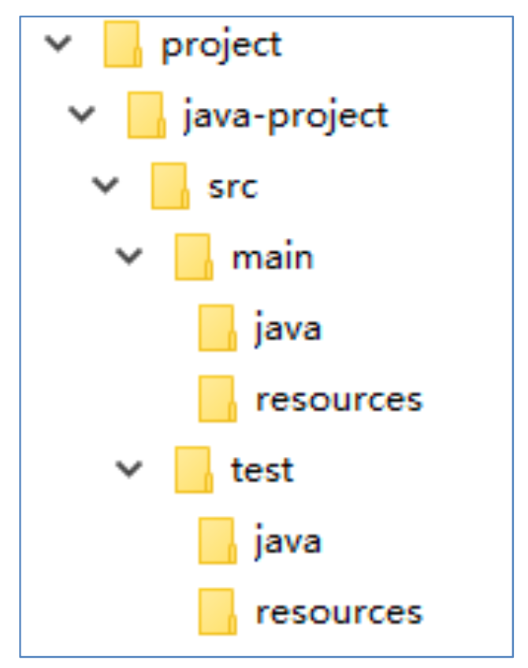
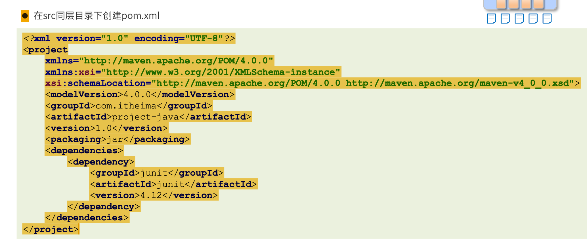
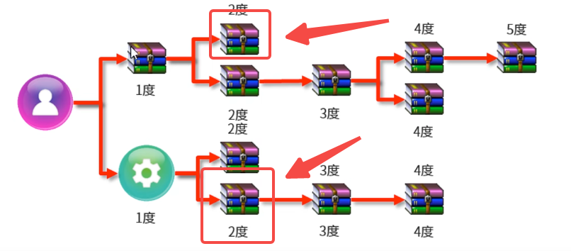
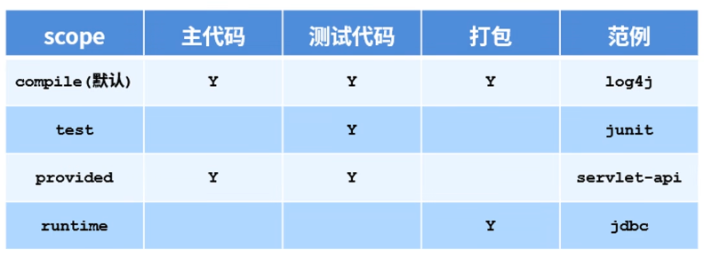

# 基础

# 1 Maven简介

> Maven查坐标：https://mvnrepository.com/tags/maven

传统项目管理状态分析

- jar包不统一，jar包不兼容
- 工程升级维护过程操作繁琐
- ...


## 1.1 Maven是什么

- Maven 的本质是一个项目管理工具，将项目开发和管理过程抽象成一个项目对象模型 (POM)
- POM (Proiect Obiect Model)：项目对象模型


## 1.2 Maven的作用

- 项目构建：提供标准的、跨平台的自动化项目构建方式
- 依赖管理：方便快捷的管理项目依赖的资源 （jar包），避免资源问的版本冲突问题
- 统一开发结构：提供标准的、统一的项目结构


***

# 2 下载与安装

Maven下载

- 官网：http://maven.apache.org/
- 下载地址：http://maven.apache.org/download.cgi

下载和环境变量看`maven环境变量.md`笔记。

# 3 Maven基础概念

## 3.1 仓库

- 仓库：用于存储资源，包含各种jar包
- 仓库分类：
  - 本地仓库：自己电脑上存储资源的仓库，连接远程仓库获取资源
  - 远程仓库：非本机电脑上的仓库，为本地仓库提供资源
    - 中央仓库：Maven团队维护，存储所有资源的仓库
    -  私服：部门/公司范国内存储资源的仓库，从中央仓库获取资源
- 私服的作用：
  - 保存具有版权的资源，包含购买或自主研发的jar
    - 中央仓库中的jar都是开源的，不能存储具有版权的资源
  -  一定范围内共享资源，仅对内部开放，不对外共享


> 假如公司有好几十号人，然后每个人本地都没有，都从中央仓库拉去，中央仓库不在国内，这样拉取速度就非常的慢，因此公司就可以建立私服。相当于提前把中央仓库的资源拉取到私服，这样本地没有的话不用去中央仓库拉，去私服拉取就可以，这样速度就很快，因为私服是公司的服务器。

***

## 3.2 坐标


- 什么是坐标？
   Maven中的坐标用于描述仓库中资源的位置
   https://repo1.maven.org/maven2/
- Maven坐标主要组成
  - `groupld`：定义当前Maven项目隶属组织名称（通常是域名反写，例如：org.mybatis)
  -  `artifactld`：定义当前Maven项目名称 （通常是模块名称，例如CRM、SMS)
  -  `version`：定义当前项目版本号
- Maven坐标的作用
   使用唯一标识，唯一性定位资源位置，通过该标识可以将资源的识别与 下载工作交由机器完成

```xml
    <!-- 模型版本 -->
    <modelVersion>4.0.0</modelVersion>
    <!-- 公司或者组织的唯一标志，并且配置时生成的路径也是由此生成， 如com.companyname.project-group，maven会将该项目打成的jar包放本地路径：/com/companyname/project-group -->
    <groupId>com.companyname.project-group</groupId>
 
    <!-- 项目的唯一ID，一个groupId下面可能多个项目，就是靠artifactId来区分的 -->
    <artifactId>project</artifactId>
 
    <!-- 版本号 -->
    <version>1.0</version>
```

**父（Super）POM**

父（Super）POM是 Maven 默认的 POM。所有的 POM 都继承自一个父 POM（无论是否显式定义了这个父 POM）。父 POM 包含了一些可以被继承的默认设置。因此，当 Maven 发现需要下载 POM 中的依赖时，它会到 Super POM 中配置的默认仓库 http://repo1.maven.org/maven2 去下载。

***

# 3 第一个Maven项目

**约定配置**

Maven 提倡使用一个共同的标准目录结构，Maven 使用约定优于配置的原则，大家尽可能的遵守这样的目录结构。如下所示：

| 目录                               | 目的                                                         |
| :--------------------------------- | :----------------------------------------------------------- |
| ${basedir}                         | 存放pom.xml和所有的子目录                                    |
| ${basedir}/src/main/java           | 项目的java源代码                                             |
| ${basedir}/src/main/resources      | 项目的资源，比如说property文件，springmvc.xml                |
| ${basedir}/src/test/java           | 项目的测试类，比如说Junit代码                                |
| ${basedir}/src/test/resources      | 测试用的资源                                                 |
| ${basedir}/src/main/webapp/WEB-INF | web应用文件目录，web项目的信息，比如存放web.xml、本地图片、jsp视图页面 |
| ${basedir}/target                  | 打包输出目录                                                 |
| ${basedir}/target/classes          | 编译输出目录                                                 |
| ${basedir}/target/test-classes     | 测试编译输出目录                                             |
| Test.java                          | Maven只会自动运行符合该命名规则的测试类                      |
| ~/.m2/repository                   | Maven默认的本地仓库目录位置                                  |

目录结构：



在上面中写了两个`Demo.java`和`DemoTest.java`文件。

继续在`src`同层目录下创建`pom.xml`文件



现在已经都完成了，那么下面开始构建这个项目。

***

## 3.1 Maven项目构建命令

Maven 构建生命周期定义了一个项目构建跟发布的过程。

一个典型的 Maven 构建（build）生命周期是由以下几个阶段的序列组成的：


| 阶段          | 处理     | 描述                                                     |
| :------------ | :------- | :------------------------------------------------------- |
| 验证 validate | 验证项目 | 验证项目是否正确且所有必须信息是可用的                   |
| 编译 compile  | 执行编译 | 源代码编译在此阶段完成                                   |
| 测试 Test     | 测试     | 使用适当的单元测试框架（例如JUnit）运行测试。            |
| 包装 package  | 打包     | 将编译后的代码打包成可分发的格式，例如 JAR 或 WAR        |
| 检查 verify   | 检查     | 对集成测试的结果进行检查，以保证质量达标                 |
| 安装 install  | 安装     | 安装打包的项目到本地仓库，以供其他项目使用               |
| 部署 deploy   | 部署     | 拷贝最终的工程包到远程仓库中，以共享给其他开发人员和工程 |

为了完成 default 生命周期，这些阶段（包括其他未在上面罗列的生命周期阶段）将被按顺序地执行。

Maven 有以下三个标准的生命周期：

**1、Clean 生命周期：**

- **clean**：删除目标目录中的编译输出文件。这通常是在构建之前执行的，以确保项目从一个干净的状态开始。

**2、Default 生命周期（也称为 Build 生命周期）：**

- **validate**：验证项目的正确性，例如检查项目的版本是否正确。
- **compile**：编译项目的源代码。
- **test**：运行项目的单元测试。
- **package**：将编译后的代码打包成可分发的格式，例如 JAR 或 WAR。
- **verify**：对项目进行额外的检查以确保质量。
- **install**：将项目的构建结果安装到本地 Maven 仓库中，以供其他项目使用。
- **deploy**：将项目的构建结果复制到远程仓库，以供其他开发人员或团队使用。

**3、Site 生命周期：**

- **site**：生成项目文档和站点信息。
- **deploy-site**：将生成的站点信息发布到远程服务器，以便共享项目文档。

***

Maven构建命令使用mvn开头，后面添加功能参数，可以一次执行多个命令，使用空格分隔


### 3.1.1 编译 compile

进入到`src`的上一级目录`project-java`中，然后执行`mvn compile`


执行完后`project-java`目录下会多一个目录`target`，这个就是编译源码后保存的.class和资源文件。

***

### 3.1.2 清理 clean

执行完 `mvn clean`后，`target`目录就会被删除

### 3.1.3 打包 package

`mvn package`将编译后的代码打包成可分发的格式，例如 JAR 或 WAR

### 3.1.4 安装 install

`mvn install`将项目的构建结果（打成jar）安装到本地 Maven 仓库中，以供其他项目使用

## 3.2 IDEA 生成 Maven 项目

### 3.2.1 配置Maven


> 创建maven项目略。

如果创建出来的文件夹都是灰色，说明不是标准的maven文件夹，可以在这个页面选择文件夹自己来添加。


***

# 4 依赖管理

Maven 一个核心的特性就是依赖管理。当我们处理多模块的项目（包含成百上千个模块或者子项目），模块间的依赖关系就变得非常复杂，管理也变得很困难。针对此种情形，Maven 提供了一种高度控制的方法。

## 4.1 依赖配置

依赖指当前项目运行所需的jar，一个项目可以设置多个依赖

格式：


## 4.2 依赖传递

依赖具有传递性

- 直接依赖：在当前项目中通过依赖配置建立的依赖关系
- 间接依赖：当前项目依赖了其他的项目，其他项目又依赖其他资源，则当前项目间接依赖其他资源


project02依赖了`log4j 1.2.13` 和` project03`，而project03又依赖了`log4j 1.2.14`和`junit 4.12`，看圈起来的说明project02间接依赖了project03的`log4j 1.2.14`和`junit 4.12`。

> project02此时一共依赖了两个log4j，只是版本不一样，所以只生效了一个，project02依赖了project03，project03依赖了junit，因此project02相当于间接依赖了 junit 4.12，也可以使用junit。

依赖传递冲突问题

- `路径优先`：当依赖中出现相同的资源时，层级越深，优先级越低，层级越浅，优先级越高

- `声明优先`：当资源在相同层级被依赖时，配置顺序靠前的覆盖配置顺序靠后的，如下：

  两个圈起来的是一样的，此时层级都一样，那么使用上面的，因为在同一个pom.xml中上面对应的1度优先于下面的1度。

  

- `特殊优先`：当同级配置了相同资源的不同版本，后配置的覆盖先配置的，比如下面：

  1.2.14的覆盖1.2.13的。


## 4.3 可选依赖

续上，比如project03不想让project02知道它引用了什么，该怎么配置呢？

可选依赖：指对外隐藏当前所依赖的资源一一不透明


> 这种做法是，在project03主动隐藏依赖，project02中直接看不到。

## 4.4 排除依赖

假如project03中没有隐藏依赖，那么project02中就可以看到project03中的依赖，现在project02想主动隐藏project03中关联的依赖，怎么做呢？

排除依赖：指主动断开依赖的资源，被排除的资源无需指定版本一一不需要

看下面project02能看到project03中的log4j1.2.13


此时使用排除依赖，刷新后project02就看不到project03中的log4j了：


## 4.5 依赖范围

- 依赖的jar默认情况可以在任何地方使用，可以通过scope标签设定其作用范国
- 作用范围
  - 主程序范围有效 (main文件夹范围内）
  - 测试程序范围有效(test文件夹范围内）
  - 是否参与打包 (package指令范围内）



**依赖范围传递性**（了解）

- 带有依赖范围的资源在进行传递时，作用范围将受到影响


***

# 5 生命周期与插件

## 5.1 构建生命周期

Maven构建生命周期描述的是一次构建过程经历经历了多少个事件


Maven对项目构建的生命周期划分为3套

- clean：清理工作
- default：核心工作，例如编，测试，打包，部氰等
- site：产生报告，发布站点等

***

**1 clean生命周期**

- pre-clean：执行一些需要在clean之前完成的工作
- clean：移除所有上一次构建生成的文件
- post-clean：执行一些需要在clean之后立刻完成的工作

***

**2 default生命周期**


***

**3 site生命周期**


> 那么上面生命周期这么多事情谁在做呢？就是插件在做

## 5.2 插件

- 插件与生命周期内的阶段绑定，在执行到对应生命周期时执行对应的插件功能
- 默认maven在各个生命周期上绑定有预设的功能
- 通过插件可以自定义其他功能


当执行到这个阶段时，就执行配置好的插件。


***

# 进阶

# 6 分模块开发与设计

**工程与模块划分**


# 7 聚合

> 上面拆分模块后，有四个模块，ssm_controller、ssm_service、ssm_dao、ssm_pojo，假如现在ssm_dao这个模块自己单独更新并提交上去了，这个时候其他模块并不知道，这样其他模块运行可能会出错。
>
> 这个时候需要有一个父类来统一管理这些模块，比如在父类中执行编译，那么全部模块就同时编译，这样就不会出现某个模块单独编译后导致其他模块不可用的情况。

多模块构建维护


***

# 8 继承

模块依赖关系维护


***

作用：通过继承可以实现在子工程中沿用父工程中的配置

- maven中的继承与java中的继承相似，在子工程中配置继承关系

制作方式：

- 在父工程中定义依赖管理


- 在子工程中声明其父工程坐标与对应的位置


**继承与聚合**

- 作用
  - 聚合用于快速构建项目
  -  继承用于快速配置
- 相同点：
  - 聚合与继承的pom.xml文件打包方式均为pom，可以将两种关系制作到同一个pom文件中
  - 聚合与继承均属于设计型模块，并无实际的模块内容

- 不同点：
  - **聚合是在当前模块中配置关系，聚合可以感知到参与聚合的模块有哪些**
  - **继承是在子模块中配置关系，父模块无法感知哪些子模块继承了自己**

> 如果父工程使用了下面配置，管理版本的同时，还引用了一个common工具类，那么继承它的子工程都能用到这个common工具类。【**建议如果所有继承它的子工程都需要用到的资源，才在父工程中引入，否则在自己的pom.xml中自己引入就好，各取所需**；不然父工程引用了资源，有些子工程用不上，这就冗余了。】
>
> ```xml
> <!-- 只是版本管理 -->
> <dependencyManagement>
>   <dependencies>
>       <dependency>
>           <groupId>org.common</groupId>
>           <artifactId>common</artifactId>
>           <version>1.0</version>
>       </dependency>
>   </dependencies>
> </dependencyManagement>
> 
> <!-- 真正引入 -->
> <dependencies>
>     <dependency>
>         <groupId>org.common</groupId>
>         <artifactId>common</artifactId>
>     </dependency>
> </dependencies>
> ```

***

# 9 属性

版本统一的重要性，相当于定义一个全局变量，用的地方使用就行，这样改变量，其它使用的地方都会一起改变


定义变量：


使用变量：


***

**属性类别**

1. 自定义属性
2. 内置属性
3. Setting属性
4. Java系统属性
5. 环境变量属性

***

**自定义属性**


***

**内置属性**


***

> 其它属性略。

# 10 版本管理


# 11 跳过测试

略

# 12 私服

略


