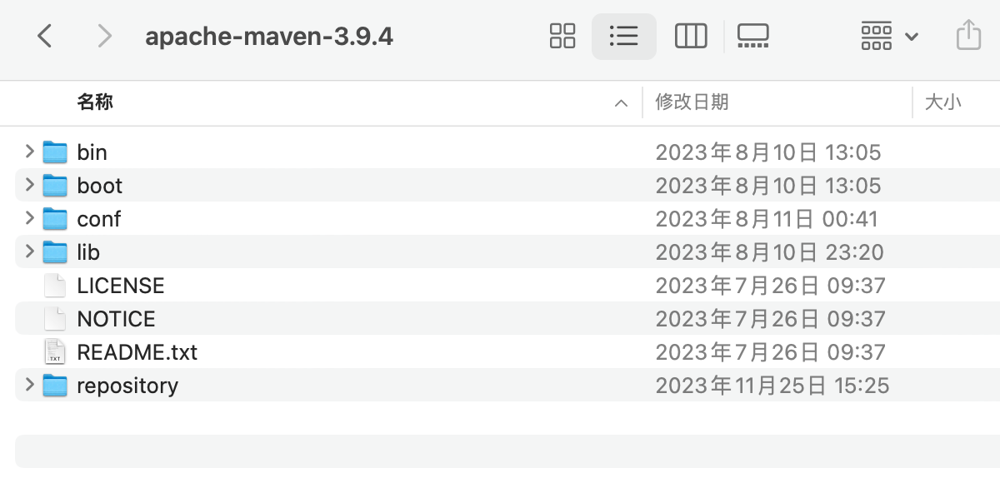
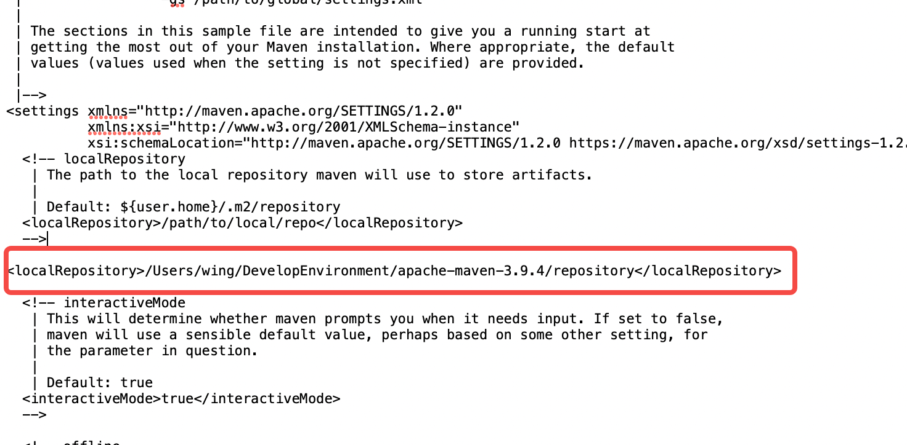
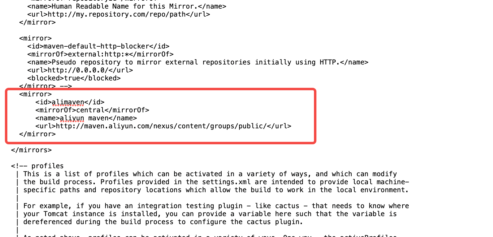

# 1 Mac配置Maven环境变量

## 1 下载安装包


```java
tar -xvf apache-maven-3.8.8-bin.tar.gz
# 解压后文件夹为apache-maven-3.8.8
```

本机下载到：`/Users/wing/DevelopEnvironment/apache-maven-3.9.4`

## 2 配置环境变量

在终端输入：`mvn -v`，显示如下，not found。还没有配置


1、**打开.zshrc配置文件**

```sh
wing@WangShaoYoudeMacBook-Pro ~ % open -e .zshrc
```

2、把最下面的Maven配置添加到文件中

```sh
JAVA_HOME=/Library/Java/JavaVirtualMachines/jdk-1.8.jdk/Contents/Home
PATH=$JAVA_HOME/bin:$PATH:.
CLASSPATH=$JAVA_HOME/lib/tools.jar:$JAVA_HOME/lib/dt.jar:.
export JAVA_HOME
export PATH
export CLASSPATH

export MAVEN_HOME=/Users/wing/DevelopEnvironment/apache-maven-3.9.4
export PATH=${MAVEN_HOME}/bin:$PATH:.

```

3、保存退出

D:/SoftWare/Development_tool/Java_tool/apache-maven-3.5.3

4、使配置文件生效

```
根目录> source ~/.zshrc
```

5、检验

终端输入`mvn -v`


# 2 配置本地仓库

本地仓库放的就是你利用maven下载的依赖

在Maven的根目录创建`repository`文件夹



## 1 修改conf下的配置文件

修改`setting.xml`，然后先找到这个localRepository标签，可以看到是被注释的，我们要打开注释，设置本地仓库的路径(复制repository的路径)



# 3 配置阿里云镜像

因为maven下载依赖是从中央仓库下载的，服务器在国外，下载太慢了，我们需要改为国内的镜像还是上面的文件中改



```xml
    <mirror>
   	<id>alimaven</id>
   	<mirrorOf>central</mirrorOf>
   	<name>aliyun maven</name>
   	<url>http://maven.aliyun.com/nexus/content/groups/public/</url>
    </mirror>
```

# 4 Idea中配置Maven


都改成自己设置的，然后点OK。


改完点击OK即可
