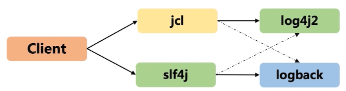

# 1 Java 日志框架的历史

## 1.1 Java 日志历史

在 Java 应用的开发中，常见的日志框架有` JCL（commons-logging）`，`slf4j`，`JUL（java.util.logging）`，`log4j`，`log4j2`，`logback`等。这些日志框架大致可以分为两类，一类是日志门面（JCL、slf4j），定义日志的抽象接口；另一类是日志实现（JUL，log4j，log4j2，logback），负责真正地处理日志。那么，这么多的日志框架，它们的出现过程是怎样的呢？

- log4j 是 Java 社区最早的日志框架，推出后一度成为 Java 的事实日志标准
- 在 Java1.4 中，Sun 在标准库中推出了自己的日志框架 java.util.logging，功能相对简陋
- 虽然 JUL 相对简陋，但还是有类库采用了它，这就出现了同一个项目中同时使用 log4j 和 JUL 要维护两套配置的问题，Apache 试图解决这个问题，推出了 JCL日志门面，定义了一套日志接口，底层实现支持 log4j 和 JUL，但是并没有解决多套配置的问题
- log4j 的主力开发 Ceki Gülcü 由于某些原因离开了 Apache，创建了 slf4j 日志门面，并实现了性能比 log4j 性能更好的 logback
- Apache 成立了不兼容 log4j1.x 的 log4j2 项目，引入了 logback 的特性

这就是目前 Java 世界中日志框架的发展历程，所以，你也可以看到 logback 和 log4j2 其实是最新发展出来的日志框架，也基本成为了 Java 世界的事实标准。

## 1.2 最常使用的日志框架

大家最常使用的日志框架有三款：log4j、log4j2 以及 logback。当然，我们需要知道 log4j 在 2015.08.05 这一天被 Apache 宣布停止维护了，并建议用户切换到 log4j2 上面去。所以，即使是市面上依然有很多工程使用了 log4j，它们大多都是 “老工程” 了。我这里也就不过多的去介绍 log4j 了。

### 1.2.1 log4j2

Apache log4j2 是对 log4j 的升级，它比其前身 log4j1.x 提供了重大改进，并提供了 logback 中可用的许多改进，同时修复了 logback 架构中的一些问题。同时，需要特别注意，log4j2 不兼容 log4j，它们不可以混用。

目前开发 Java 工程我们都会考虑使用 SpringBoot，而 SpringBoot 也在 1.4 版本发布通告：不再支持 log4j。所以，如果你确实很熟悉 log4j，又想要使用它，请尽快学习 log4j2。

### 1.2.2 logback(推荐)

logback，它是一个 “可靠、通用、快速而又灵活的 Java 日志框架”。logback 当前分成三个模块：logback-core、logback- classic 以及 logback-access。

- logback-core 是其它两个模块的基础模块
- logback-classic 是 log4j 的一个改良版本，此外 logback-classic 完整实现 SLF4J API 使你可以很方便地更换成其它日志系统
- logback-access 模块与 Servlet 容器（如 Tomcat、Jetty）集成，以提供 HTTP 访问日志功能

logback 是 Slf4j 的原生实现框架，同样也是出自 log4j 一个人之手，但拥有比 log4j 更多的优点、特性和更做强的性能，现在基本都用来代替 log4j 成为主流。同时，你需要知道，`SpringBoot 默认采用 logback 实现日志管理`。所以，我个人的建议是：如果你还没有确定在工程中采用哪种日志框架，**选择 logback 就好了**

## 1.3 日志门面模式

### 1.3.1 门面模式（外观模式）

这里，我们先不谈什么是 “日志门面模式”，先去搞清楚什么是门面模式，也叫做外观模式。先来看看它的定义：

> 外部与一个子系统的通信必须通过一个统一的外观对象进行，为子系统中的一组接口提供一个一致的界面，外观模式定义了一个高层接口，这个接口使得这一子系统更加容易使用。外观模式又称为门面模式，它是一种对象结构型模式。

我们先来看三个类，这是三个电器类，每个类中都定义了关闭电器的方法：

```java
public static class Conditioner {
    public void turnOff() {
        System.out.println("关闭空调");
    }
}
public static class Fridge {
    public void turnOff() {
        System.out.println("关闭冰箱");
    }
}
public static class Television {
    public void turnOff() {
        System.out.println("关闭电视");
    }
}
```

只有这些类定义的情况，如果我要关闭冰箱，我只能自己去 new 一个 Fridge，然后调用 turnOff 方法。但是，如果要关闭其他的，我们还需要做同样的操作，这就要求我们要记住所有的电器类，非常的麻烦。于是，我们可以编写一个 “门面”：

```java
public static class Facade {
    public void turnOff(String select) {
        switch (select) {
            case "A":
                new Conditioner().turnOff();
                break;
            case "B":
                new Fridge().turnOff();
                break;
            case "C":
                new Television().turnOff();
                break;
            default:
                // nothing to do
        }
    }
}
```

到这里，你也应该就明白了门面模式的意义了。说白了就是对子系统封装了一层，给予了一个高层次的接口(门面对象)，进而方便客户端调用。

### 1.3.2  日志门面模式

在之前我已经说过，JCL、slf4j 是日志门面，而像 log4j2、logback 这些是日志实现。那么，之所以需要有日志门面，道理就很清晰了：为了在应用中屏蔽掉底层日志框架的具体实现。这样的话，即使有一天要更换代码的日志框架，只需要修改 jar 包，最多再改改日志输出相关的配置文件就可以了。这就是解除了应用和日志框架之间的耦合。举个简单的例子：

- 我们自己的系统中使用了 logback
- 我们的系统使用了 A.jar，A.jar 中使用的是 log4j
- 我们的系统又使用了 B.jar，B.jar 中使用的是 slf4j-simple

这样，我们的系统就不得不同时支持并维护 logback、log4j、slf4j-simple 三种日志框架，非常不便。解决这个问题的方式就是引入一个适配层，由适配层决定使用哪一种日志系统，而调用端只需要做的事情就是打印日志而不需要关心如何打印日志，slf4j 或者 JCL 就是这种适配层。

***

# 2 使用日志门面和日志框架

## 2.1 门面和框架选择

**SLF4J 和JCL是怎么绑定日志实现的**

- 目前市面上常见两类的组合（门面＋实现）
  - 一定要知道 SLF4j 和JCL（将来不区分大小写）是日志门面，而不是功能实现
  - 常见的两类组合：`jcl + log4j2`、`slf4j + logback`



## 2.2 JCL 绑定日志实现（log4j2）

