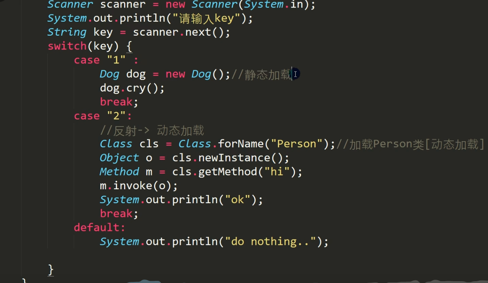
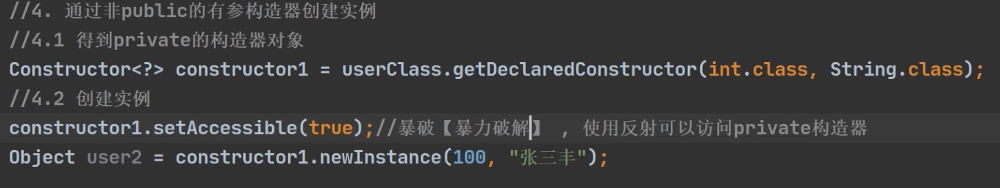

# 1 反射机制

## 1.1 引出反射

请看下面的问题

1. 根据配置文件 re.properties 指定信息，创建对象并调用方法

```properties
classfullpath=com.hspedu.Cat 
method=hi
```

```java
public class Cat {
    private String name = "招财猫";
    public int age = 10;
    public Cat(){}
    public Cat(String name){
      this.name = name;
    }
    public void hi(){
        System.out.println("hi " + name);
    }
}
```

思考：使用现有技术，你能做的吗？

```java
public class ReflectionQuestion {
    public static void main(String[] args) throws IOException {
        //需求：根据配置文件re.properties指定信息，创建Cat对象并调用方法hi
        //1、传统方式 很容易实现
        Cat cat = new Cat();
        cat.hi();
      
        //2、尝试使用 Properties 类来读取配置文件的信息
        Properties properties = new Properties();
        properties.load(new InputStreamReader(
                Files.newInputStream(Paths.get("src\\main\\resources\\re.properties"))));
        String classfullpath = properties.get("classfullpath").toString(); 
        String method = properties.get("method").toString(); 
        System.out.println(classfullpath);// com.hspedu.Cat
        System.out.println(method);// hi
        // 很遗憾，这里只能读取到配置文件的字符串信息，没办法创建对象和调用方法
      
        // 3、使用反射解决
        // 1）加载类，返回 Class 类型的对象
        Class aClass = Class.forName(classfullpath);
        // 2）通过 aClass 得到加载的对应的对象实例
        Object o = aClass.newInstance();
        // 3）在反射中，可以把方法也视为对象
        Method method1 = aClass.getMethod(method);
        // 4）通过方法对象来实现调用方法
        method1.invoke(o); // 传统方法：对象.方法(),反射机制：方法.invoke(对象)
    }
}
```

2. 这样的需求在学习框架时特别多，即通过外部文件配置，在不修改源码情况下，来控制程序，也符合设计模式的 ocp原则（开闭原则：不修改源码，扩展功能）

***

> 反射机制

1. 反射机制允许程序在执行期借助于Reflection ARI取得任何类的内部信息(比如成员变量，构造器，成员方法等等)，并能操作对象的属性及方法。反射在设计模式和框架底层都会用到
2. 加载完类之后，在堆中就产生了一个Class类型的对象（一个类只有一个Class对象），这个对象包含了类的完整结构信息。通过这个对象得到类的结构。这个对象就像一面镜子，透过这个镜子看到类的结构，所以，形象的称之为：**反射**

***

> Java反射机制可以完成

1. 在运行时判断任意一个对象所属的类
2. 在运行时构造任意一个类的对象
3. 在运行时得到任意一个类所具有的成员变量和方法

4. 在运行时调用任意一个对象的成员变量和方法

5. 生成动态代理

***

## 1.2 反射相关的主要类

1. `java.lang.Class`:代表一个类，Class对象表示某个类加载后在堆中的对象
2. `java.lang.reflect.Method`：代表类的方法
3. `java.lang.reflect.Field`： 代表类的成员变量
4. `java.lang.reflect.Constructor`：代表类的构造方法

```java
// 续上面源码
Field nameField = aClass.getField("age");
System.out.println(nameField.get(o));  // 10
Constructor constructor1 = aClass.getConstructor(); //()中可以指定构造器参数类型，这里没有写，返回的是无参构造器
Constructor constructor2 = aClass.getConstructor(String.class); //返回的是有参构造器
```

***

## 1.3 反射优点和缺点

- 优点：可以动态的创建和使用对象（也是框架底层核心），使用灵活，没有反射机制，框架技术就失去底层支撑
- 缺点：使用反射基本是解释执行，对执行速度有影响

***

```java
// 根据上面知识演示使用 new 和 反射，循环百万次，每次循环创建Cat对象，并调用 hi 方法，看耗时，很明显反射耗时很长（演示代码略）
// 那么既然反射耗时这么长，能否优化呢？
```

> 反射调用优化-关闭访问检查

1. Method和Field、Constructor対象都有setAccessible(方法
2. setAccessible作用是启动和禁用访问安全检查的外关

3. 参数值为true表示 反射的对象在使用时**取消访问检查，提高反射的效率**。参数值为false则表示反射的对象执行访问检查

***

# 2 Class类

## 2.1 基本介绍

1. Class也是类，因此也继承Object类
2. Class类对象不是new出来的，而是系统创建的
3. 对于某个类的Class类对象，在内存中只有一份，因为类只加载一次
4. 每个类的实例都会记得自己是由哪个 Class 实例所生成
5. 通过Class对象可以完整地得到一个类的完整结构
6. Class对象是存放在堆的
7. 类的字节码二进制数据，是放在方法区的（jdk7之前是永久代，jdk8以及后是元空间）

***

## 2.2 常用方法

| 方法名                                            | 功能说明                                                     |
| ------------------------------------------------- | ------------------------------------------------------------ |
| static Class forName (String name)                | 返回指定类名 name 的 Class 对象                              |
| Object newInstance()                              | 调用缺省构造函数，返回该Class对象的一个实例                  |
| getName()                                         | 返回此Class对象所表示的实体（类、接口、数组类、基本类型等）名称 |
| Class getSuperClass()                             | 返回当前Class对象的父类的Class对象                           |
| Class [] getinterfaces()                          | 获取当前Class对象的接口                                      |
| ClassLoader getClassLoader()                      | 返回该类的类加载器                                           |
| Class getSuperclass()                             | 返回表示此Class所表示的实体的超类的Class                     |
| Constructor[] getConstructors()                   | 返回一个包含某些Constructor对象的数组                        |
| Field[] getDeclaredFields()                       | 返回Field对象的一个数组                                      |
| Method getMethod(String name,Class... paramTypes) | 返回一个Method对象，此对象的形参类型为paramType              |

```java
public class TestClass {
    public static void main(String[] args) throws Exception {
        // 1. 获取到 Car 类对应的Class对象
        String classAllPath = "src.main.java.com.hspedu.Car";
        // 2. 输出 cls
        Class cls = Class.forName(classAllPath);
        System.out.println(cls);  // 显示 cls 是哪一个类的Class对象 class src.main.java.com.hspedu.Car
        System.out.println(cls.getClass()); // 输出 clas 运行类型：class java.lang.Class
        // 3. 包名
        System.out.println("包名：" + cls.getPackage().getName());
        // 4. 全类名
        System.out.println("全类名：" + cls.getName());
        // 5. 通过Class创建对象实例
        Car car = (Car)cls.newInstance();
        System.out.println(car.toString());
        // 6. 通过反射获取属性
        Field brand = cls.getField("brand");
        System.out.println("brand：" + brand.get(car));
        // 7. 通过反射给属性赋值
        brand.set(car,"奔驰");
        System.out.println("brand：" + brand.get(car));
        // 8. 通过反射获取全部属性
        Field[] fields = cls.getFields();
        for (Field field : fields) {
            System.out.print(field.getName() + ",");
        }
    }
}

// 打印结果：
class src.main.java.com.hspedu.Car
class java.lang.Class
包名：src.main.java.com.hspedu
全类名：src.main.java.com.hspedu.Car
Car{brand='宝马', price=10000, color='白色'}
brand：宝马
brand：奔驰
brand,price,color,
```

***

## 2.3 获取Class类对象

**方式一（Class.forName()）：**

前提：已知一个类的全类名，且该类在类路径下，可通过 Class 类的静态方法 forName() 获取，可能抛出 `ClassNotFoundException`，实例：`Class cls = Class.forName("java.lang.Cat");`

**应用场景**：多用于配置文件，读取类全路径，加载类

***

**方式二（类.class）：**

前提：若已知具体的类，通过类的 class 获取，该方式最为安全可靠，程序性能最高，实例：`Class cls = Cat.class;`

比如：`Constructor c = cls.getConstructor(String.class);`

**应用场景**：多用于参数传递，比如通过反射得到对应构造器对象

***

**方式三（对象.getClass）：**

前提：已知某个类的实例，调用该实例的getClass()方法获取Class对象，实例：`Class cls = 对象.getClass();`

**应用场景**：通过创建好的对象，获取Class对象

***

**其他方式：**

1) **加载器方式**

ClassLoader cl = 对象.getClass().getClassLoader();

Class cla = cl.loadClass("类的全类名");

2) **基本数据类型**

基本数据（int,char,boolean,float,double,byte,long,short）按如下方式得到 Class 类对象

`Class cls = 基本数据类型.class`

3) **包装类**

基本数据类型对应的包装类，可以通过.type得到Class类对象

`Class cls = 包装类.TYPE`

***

```java
public class GetClass {
    public static void main(String[] args) throws Exception {
        // 1. Class.forName 方式
        String classAllPath = "src.main.java.com.hspedu.Car";
        Class cls1 = Class.forName(classAllPath);
        System.out.println(cls1);

        // 2. 类名.class，应用场景：用于参数传递
        Class cls2 = Car.class;
        System.out.println(cls2);

        // 3. 对象.getClass，应用场景：有对象实例
        Car car = new Car();
        Class cls3 = car.getClass();
        System.out.println(cls3);

        // 4. 通过类加载器来获取类的Class对象
        ClassLoader classLoader = car.getClass().getClassLoader();
        Class cls4 = classLoader.loadClass(classAllPath);
        System.out.println(cls4);

        // cls1、cls2、cls3、cls4 其实是同一个对象
        System.out.println(cls1.hashCode());
        System.out.println(cls2.hashCode());
        System.out.println(cls3.hashCode());
        System.out.println(cls4.hashCode());

        // 5. 基本数据类型
        Class<Integer> integerClass = int.class;
        Class<Boolean> booleanClass = boolean.class;
        System.out.println(integerClass);
        System.out.println(booleanClass);

        // 6. 基本数据类型包装类
        Class<Integer> integerClass1 = Integer.TYPE;
        Class<Boolean> booleanClass1 = Boolean.TYPE;
        System.out.println(integerClass1);
        System.out.println(booleanClass1);

        // 是同一个对象 int 和 Integer 是自动装箱和拆箱的
        System.out.println(integerClass.hashCode());
        System.out.println(integerClass1.hashCode());
    }
}

// 打印结果：
class src.main.java.com.hspedu.Car
class src.main.java.com.hspedu.Car
class src.main.java.com.hspedu.Car
class src.main.java.com.hspedu.Car
356573597
356573597
356573597
356573597
int
boolean
int
boolean
1735600054
1735600054
```

***

> 哪些类型有Class对象

如下类型有Class对象

1. 外部类，成员内部类，静态内部类，局部内部类，匿名内部类

2. interface :接口

3. 数组

4. enum ：枚举

5. annotation ：注解
5. 基本数据类型
5. void

```java
public static void main(String[] args) throws Exception {
   Class<String> c1 = String.class;// 外部类
   Class<Serializable> c2 = Serializable.class;//接口
   Class<Integer[]> c3 = Integer[].class;//数组
   Class<float[][]> c4 = float[][].class;//二维数组
   Class<Deprecated> c5 = Deprecated.class;//注解
   Class<Thread.State> c6 = Thread.State.class;//枚举
   Class<Long> c7 = long.class;//基本数据类型
   Class<Void> c8 = void.class;//void数据类型
   Class<Class> c9 = Class.class;
   System.out.println(c1);
   System.out.println(c2);
   System.out.println(c3);
   System.out.println(c4);
   System.out.println(c5);
   System.out.println(c6);
   System.out.println(c7);
   System.out.println(c8);
   System.out.println(c9);
}

// 打印结果：
class java.lang.String
interface java.io.Serializable
class [Ljava.lang.Integer;
class [[F
interface java.lang.Deprecated
class java.lang.Thread$State
long
void
class java.lang.Class
```

***

# 3 类加载

反射机制是 java 实现动态语言的关键，也就是通过反射实现类动态加载。

1. **静态加载**：编译时加载相关的类，如果没有则报错，依赖性太强
2. **动态加载**：运行时加载需要的类，如果运行时不用该类，则不报错，降低了依赖性



 因为 new Dog() 是静态加载，因此必须编写 Dog；Person 类是动态加载，所以，没有编写 Person 类也不会报错，只有当动态加载该类时，才会报错

`tips:类加载看JVM`

***

# 4 反射获取类的结构信息

```java
public class ReflectionUtils {
    public static void main(String[] args) throws Exception {
        Class<?> personCls = Class.forName("src.main.java.com.hspedu.reflection.question.Person");
        //获取全类名
        System.out.println("全类名："+personCls.getName());
        //获取简单类名
        System.out.println("简单类名："+personCls.getSimpleName());
        //获取所有public修饰的属性，包含本类以及父类的
        Field[] fields = personCls.getFields();
        for (Field field : fields) {
            System.out.println("所有public属性包括父类的："+field.getName());
        }
        //获取所有权限的属性，包含本类以及父类
        Field[] declaredFields = personCls.getDeclaredFields();
        for (Field declaredField : declaredFields) {
            System.out.println("所有权限属性包括父类的："+declaredField.getName());
        }
        //获取所有public修饰的方法，包含本类以及父类的（全部父类）
        Method[] methods = personCls.getMethods();
        for (Method method : methods) {
            System.out.println("所有public方法包括父类的："+method.getName());
        }
        //获取所有权限修饰的方法，包含本类以及父类的（全部父类）
        Method[] declaredMethods = personCls.getDeclaredMethods();
        for (Method method : declaredMethods) {
            System.out.println("所有权限方法包括父类的："+method.getName());
        }
        //其他不再一一下，看API文档就行
        //获取本类所有构造器
        //获取包信息
        //获取父类信息
        //获取接口信息
    }
}
```



两个参数的构造器是私有的，在正常情况下是不允许new来创建对象的，但是在反射中可以，将accessible设置为true，这样就能顺利创建对象了。


