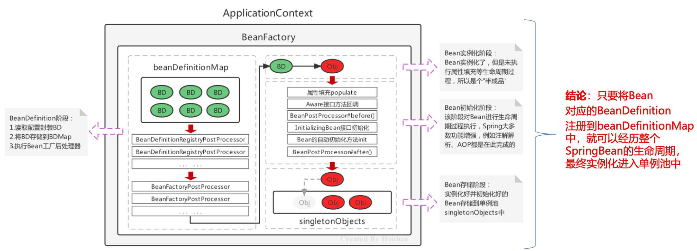

# 1 IOC

## 1.1 传统Javaweb开发的困惑 

### 1.1.1 传统Javaweb开发代码分析-用户模块 


### 1.1.2 传统Javaweb开发困惑及解决方案


## 1.2  IoC、DI和AOP思想提出


### 1.2.1 IoC 控制反转思想的提出 

> 实际开发中，对象之间的耦合关系，就类似手表内部的齿轮，每个齿轮都紧密啮合在一起，一旦某个齿轮发生故障
>  ，那么整个系统也意味着崩溃。尽可能让对象之间的关系保持松耦合状态是我们期望的


> IoC思想: Inversion of Control，翻译为“控制反转”或“反转控制”，强调的是原来在程序中创建Bean的权利反 转给第三方。
>
> 例如:原来在程序中手动的去 new UserServiceImpl()，手动的去new UserDaoImpl()，而根据IoC思想的指导， 寻求一个第三方去创建UserServiceImpl对象和UserDaoImpl对象。这样程序与具体对象就失去的直接联系

> 谁去充当第三方角色呢? 工厂设计模式，BeanFactory来充当第三方的角色，来产生Bean实例
>
> BeanFactory怎么知道产生哪些Bean实例呢? 可以使用配置文件配置Bean的基本信息，BeanFactory根据配置文件来生产Bean实例


> 例如，用IoC思想去反转UserServiceImpl的创建权，由原来程序中创建反转给通过BeanFactory去创建


### 1.2.2 DI 依赖注入思想的提出

> 上面使用BeanFactory的方式已经实现的"控制反转"，将Bean的创建权交给了BeanFactory，如果我们想将 UserDao的创建权也反转给BeanFactory，与此同时UserService内部还需要用到UserDao实例对象，那应该怎 样操作呢?
>
> 1)在程序中，通过BeanFactory获得UserService 
>
> 2)在程序中，通过BeanFactory获得UserDao 
>
> 3)在程序中，将UserDao设置给UserService

> 面试题:IoC 和 DI 的关系?
>
> 首先，先回答IoC和DI的是什么:
>  IoC: Inversion of Control，控制反转，将Bean的创建权由原来程序反转给第三方
>  DI:Dependency Injection，依赖注入，某个Bean的完整创建依赖于其他Bean(或普通参数)的注入
>
> 其次，在回答IoC和DI的关系:
>
> 第一种观点:IoC强调的是Bean创建权的反转，而DI强调的是Bean的依赖关系，认为不是一回事
>
> 第二种观点:IoC强调的是Bean创建权的反转，而DI强调的是通过注入的方式反转Bean的创建权，认为DI 是IoC的其中一种实现方式

### 1.2.3 AOP 面向切面思想的提出 


> 困惑二的解决方案是，借助于IoC思想，将Bean的创建权反转给BeanFactory，而BeanFactory生产的Bean是 目标Bean的代理对象，这样就可以在代理对象中对目标对象方法进行相应的增强。

### 1.2.5 思想、框架和编码关系

> Java中常用的框架:
>
> 不同语言，不同领域都有属于自己的框架，使用框架开发是作为程序员的最基础的底线。Java语言中的框架， 可以分为基础框架和服务框架:
>
> \- 基础框架:完成基本业务操作的框架，如MyBatis、Spring、SpringMVC、Struts2、Hibernate等 - 服务框架:特定领域的框架，一般还可以对外提供服务框架，如MQ、ES、Nacos等

## 1.3 Spring框架的诞生

 ### 1.3.1 Spring 框架概述

> spring是一个开源的轻量级Java开发应用框架，可以简化企业级应用开发。Spring解决了开发者在JavaEE开发 中遇到的许多常见的问题，提供了功能强大IOC、AOP及Web MVC等功能。是当前企业中Java开发几乎不能 缺少的框架之一。Spring的生态及其完善，不管是Spring哪个领域的解决方案都是依附于在Spring Framework基础框架的。

### 1.3.2 BeanFactory 快速入门

根据下图，分析一下Spring的BeanFactory的开发步骤:


> 1)导入Spring的jar包或Maven坐标; 
>
> 2)定义UserService接口及其UserServiceImpl实现类; 
>
> 3)创建beans.xml配置文件，将UserServiceImpl的信息配置到该xml中; 
>
> 4)编写测试代码，创建BeanFactory，加载配置文件，获取UserService实例对象。

1)导入Spring的jar包或Maven坐标

```xml
<!--Spring核心--> 
<dependency>
	<groupId>org.springframework</groupId> 
  <artifactId>spring-context</artifactId> 
  <version>5.3.7</version>
</dependency>
```

2)定义UserService接口及其UserServiceImpl实现类

```java
public interface UserService {}
public class UserServiceImpl implements UserService {}
```

3)创建beans.xml配置文件，将UserServiceImpl的信息配置到该xml中

```xml
<bean id="userService"class="com.itheima.service.impl.UserServiceImpl"></bean>
```

4)编写测试代码，创建BeanFactory，加载配置文件，获取UserService实例对象

```java
//创建BeanFactory
DefaultListableBeanFactory beanFactory = new DefaultListableBeanFactory(); //创建读取器
XmlBeanDefinitionReader reader = new XmlBeanDefinitionReader(beanFactory); //加载配置文件
reader.loadBeanDefinitions("beans.xml");
//获取Bean实例对象
UserDao userService = (UserService) beanFactory.getBean("userService");
```

### 1.3.3 ApplicationContext快速入门

> ApplicationContext 称为Spring容器，内部封装了BeanFactory，比BeanFactory功能更丰富更强大，使用 ApplicationContext 进行开发时，xml配置文件的名称习惯写成applicationContext.xml

```java
//创建ApplicationContext,加载配置文件，实例化容器 
ApplicationContext applicationContext =
new ClassPathxmlApplicationContext(“applicationContext.xml"); //根据beanName获得容器中的Bean实例
UserService userService = (UserService) applicationContext.getBean("userService"); System.out.println(userService);
```

### 1.3.4 BeanFactory与ApplicationContext的关系 

> 1)BeanFactory是Spring的早期接口，称为Spring的Bean工厂 ApplicationContext是后期更高级接口，称之为 Spring 容器;
>
> 2)ApplicationContext在BeanFactory基础上对功能进行了扩展，例如:监听功能、国际化功能等。BeanFactory的 API更偏向底层，ApplicationContext的API大多数是对这些底层API的封装;
>
> 3)Bean创建的主要逻辑和功能都被封装在BeanFactory中，ApplicationContext不仅继承了BeanFactory，而且 ApplicationContext内部还维护着BeanFactory的引用，所以，ApplicationContext与BeanFactory既有继承关系，又 有融合关系。
>
> 4)Bean的初始化时机不同，原始BeanFactory是在首次调用getBean时才进行Bean的创建，而ApplicationContext则 是配置文件加载，容器一创建就将Bean都实例化并初始化好。

> ApplicationContext除了继承了BeanFactory外，还继承了ApplicationEventPublisher(事件发布器)、 ResouresPatternResolver(资源解析器)、MessageSource(消息资源)等。但是ApplicationContext的核心功 能还是BeanFactory。


> applicationContext内部维护着beanFactory的引用，在学习过程中会查看beanFactory内部维护的属性，断点查 看如下图示内容的


> 验证BeanFactory和ApplicationContext对Bean的初始化时机，在UserDaoImpl的无参构造内打印一句话，验证 构造方法的执行时机

> 断点观察，BeanFactory方式时，当调用getBean方法时才会把需要的Bean实例创建，即延迟加载;而 ApplicationContext是加载配置文件，容器创建时就将所有的Bean实例都创建好了，存储到一个单例池中，当调 用getBean时直接从单例池中获取Bean实例返回

### 1.3.5 BeanFactory的继承体系

> BeanFactory是核心接口，项目运行过程中肯定有具体实现参与，这个具体实现就是DefaultListableBeanFactory ，而ApplicationContext内部维护的Beanfactory的实现类也是它


### 1.3.6 ApplicationContext的继承体系

> 只在Spring基础环境下，即只导入spring-context坐标时，此时ApplicationContext的继承体系


> 只在Spring基础环境下，常用的三个ApplicationContext作用如下:


## 1.4 基于xml的Spring应用

### 1.4.1 SpringBean 的配置详解

> Spring开发中主要是对Bean的配置，Bean的常用配置一览如下:


**1)Bean的基础配置** 

例如:配置UserDaoImpl由Spring容器负责管理

```xml
<bean id="userDao" class="com.itheima.dao.impl.UserDaoImpl"/>
```

此时存储到Spring容器(singleObjects单例池)中的Bean的beanName是userDao，值是UserDaoImpl对象，可以根据beanName获取Bean实例

```java
applicationContext.getBean("userDao");
```

如果不配置id，则Spring会把当前Bean实例的全限定名作为beanName

```java
applicationContext.getBean("com.itheima.dao.impl.UserDaoImpl");
```

> 通过断点调试，观察可以发现单例池中存在 userDao 实例


**2)Bean的别名配置**

可以为当前Bean指定多个别名，根据别名也可以获得Bean对象

```xml
<bean id="userDao" name="aaa,bbb" class="com.itheima.dao.impl.UserDaoImpl"/>
```

此时多个名称都可以获得UserDaoImpl实例对象

```java
applicationContext.getBean("userDao"); applicationContext.getBean("aaa"); 
applicationContext.getBean("bbb");
```


**3)Bean的范围配置**

默认情况下，单纯的Spring环境Bean的作用范围有两个:Singleton和Prototype

- **singleton**:单例，默认值，Spring容器创建的时候，就会进行Bean的实例化，并存储到容器内部的单例池中 ，每次getBean时都是从单例池中获取相同的Bean实例;

- **prototype**:原型，Spring容器初始化时不会创建Bean实例，当调用getBean时才会实例化Bean，每次 getBean都会创建一个新的Bean实例。

**4)Bean的延迟加载**

> 当lazy-init设置为true时为延迟加载，也就是当Spring容器创建的时候，不会立即创建Bean实例，等待用到时在创 建Bean实例并存储到单例池中去，后续在使用该Bean直接从单例池获取即可，本质上该Bean还是单例的

```xml
<bean id="userDao" class="com.itheima.dao.impl.UserDaoImpl" lazy-init="true"/>
```

**5)Bean的初始化和销毁方法配置**

Bean在被实例化后，可以执行指定的初始化方法完成一些初始化的操作，Bean在销毁之前也可以执行指定的销毁 方法完成一些操作，初始化方法名称和销毁方法名称通过

```xml
<bean id="userDao" class="com.itheima.dao.impl.UserDaoImpl" init-method="init" destroy-method="destroy"/>
```

```java
public class UserDaoImpl implements UserDao {
public UserDaoImpl() { System.out.println("UserDaoImpl创建了..."); } public void init(){ System.out.println("初始化方法..."); }
public void destroy(){ System.out.println("销毁方法..."); }
}
```

> 扩展:除此之外，我们还可以通过实现 InitializingBean 接口，完成一些Bean的初始化操作，如下:


**6)Bean的实例化配置**

Spring的实例化方式主要如下两种:

-  构造方式实例化:底层通过构造方法对Bean进行实例化
-  工厂方式实例化:底层通过调用自定义的工厂方法对Bean进行实例化

工厂方式实例化Bean，又分为如下三种:

-   静态工厂方法实例化Bean
-   实例工厂方法实例化Bean
-   实现FactoryBean规范延迟实例化Bean

***

**静态工厂方法实例化Bean**

> 静态工厂方法实例化Bean，其实就是定义一个工厂类，提供一个静态方法用于生产Bean实例，在将该工厂类及其 静态方法配置给Spring即可

```java
//工厂类
public class UserDaoFactoryBean {
	//非静态工厂方法
	public static UserDao getUserDao(String name){
	//可以在此编写一些其他逻辑代码
	return new UserDaoImpl(); 
  }
}
```

> 静态工厂方法实例化Bean，其实就是定义一个工厂类，提供一个静态方法用于生产Bean实例，在将该工厂类及其 静态方法配置给Spring即可


```xml
<bean id="userDao" class="com.itheima.factory.UserDaoFactoryBean" factory-method="getUserDao">
<constructor-arg name="name" value="haohao"/> </bean>
```

PS:<constructor-arg>标签不仅仅是为构造方法传递参数，只要是为了实例化对象而传递的参数都可以通过 <constructor-arg>标签完成，例如上面通过静态工厂方法实例化Bean所传递的参数也是要通过<constructor-arg> 进行传递的

> 当Spring解析上面时发现配置了 factory- method ，那么Spring就知道原来不是把UserDaoFactoryBean实例化对象放到容器中，而是调用 getUserDao 方法后得到的实例放到容器中。

那为什么要使用上面的方式呢？有什么好处

这种方式可以更加灵活，可以在getUserDao方法中编写自己的其他逻辑代码。

> 如果引用第三方Jar包，有类似这样的静态工厂创建实例的场景，想把创建出来的实例交给Spring管理，就可以这样配置

***

**实例工厂方法实例化Bean**

实例工厂方法，也就是非静态工厂方法产生Bean实例，与静态工厂方式比较，该方式需要先有工厂对象，在用工厂 对象去调用非静态方法，所以在进行配置时，要先配置工厂Bean，在配置目标Bean

```java
//工厂类
public class UserDaoFactoryBean2 {
	//非静态工厂方法
	public UserDao getUserDao(String name){
	//可以在此编写一些其他逻辑代码
	return new UserDaoImpl(); 
  }
}
```

```xml
<!-- 配置实例工厂Bean -->
<bean id="userDaoFactoryBean2" class="com.itheima.factory.UserDaoFactoryBean2"/> 

<!-- 配置实例工厂Bean的哪个方法作为工厂方法 -->
<bean id="userDao" factory-bean="userDaoFactoryBean2" factory-method="getUserDao">
	<constructor-arg name="name" value="haohao"/> 
</bean>
```

通过断点观察单例池singletonObjects，发现单例池中既有工厂Bean实例，也有目标Bean实例，且都是在Spring 容器创建时，就完成了Bean的实例化


> 如果引用第三方Jar包，有类似这样的实例工厂创建实例的场景，想把创建出来的实例交给Spring管理，就可以这样配置

***

**实现FactoryBean规范延迟实例化Bean**

> 上面不管是静态工厂方式还是非静态工厂方式，都是自定义的工厂方法，Spring提供了FactoryBean的接口规范， FactoryBean接口定义如下:

```java
public interface FactoryBean<T> {
String OBJECT_TYPE_ATTRIBUTE = “factoryBeanObjectType”; 
  T getObject() throws Exception; //获得实例对象方法 
 	Class<?> getObjectType(); //获得实例对象类型方法 
  default boolean isSingleton() {
		return true; 
  }
}
```

定义工厂实现FactoryBean

```java
public class UserDaoFactoryBean3 implements FactoryBean<UserDao> { 			public UserDao getObject() throws Exception {
		return new UserDaoImpl(); 
	}
	public Class<?> getObjectType() { 	
    return UserDao.class;
	} 
}
```

配置FactoryBean交由Spring管理即可

```xml
<bean id="userDao" class="com.itheima.factory.UserDaoFactoryBean3"/>
```

通过Spring容器根据beanName可以正常获得UserDaoImpl

```java
ApplicationContext applicationContext =
new ClassPathxmlApplicationContext("applicationContext.xml");
Object userDao = applicationContext.getBean("userDao"); System.out.println(userDao);
```

> 通过断点观察发现Spring容器创建时，FactoryBean被实例化了，并存储到了单例池singletonObjects中，但是 getObject() 方法尚未被执行，UserDaoImpl也没被实例化，当首次用到UserDaoImpl时，才调用getObject() ， 此工厂方式产生的Bean实例不会存储到单例池singletonObjects中，会存储到 factoryBeanObjectCache 缓存池 中，并且后期每次使用到userDao都从该缓存池中返回的是同一个userDao实例。


***

**7)Bean的依赖注入配置**

Bean的依赖注入有两种方式:


依赖注入的数据类型有如下三种:

-  普通数据类型，例如:String、int、boolean等，通过value属性指定。
-  引用数据类型，例如:UserDaoImpl、DataSource等，通过ref属性指定。 
- 集合数据类型，例如:List、Map、Properties等。

> 参考Spring_qf.md笔记

扩展:自动装配方式

如果被注入的属性类型是Bean引用的话，那么可以在<bean> 标签中使用 autowire 属性去配置自动注入方式，属 性值有两个:

- `byName`:通过属性名自动装配，即去匹配 setXxx 与 id="xxx"(name="xxx")是否一致; 
-  `byType`:通过Bean的类型从容器中匹配，匹配出多个相同Bean类型时，报错。

```xml
<bean id="userService" class="com.itheima.service.impl.UserServiceImpl" autowire="byType">
```

***

**8)Spring的其他配置标签**

Spring 的 xml 标签大体上分为两类，一种是默认标签，一种是自定义标签

- 默认标签:就是不用额外导入其他命名空间约束的标签，例如` <bean> `标签
- 自定义标签:就是需要额外引入其他命名空间约束，并通过前缀引用的标签，例如`<context:property-placeholder/> `标签

> Spring的默认标签用到的是Spring的默认命名空间

```xml
<?xml version="1.0" encoding="UTF-8"?>
<beans xmlns="http://www.springframework.org/schema/beans"
xmlns:xsi="http://www.w3.org/2001/XMLSchema-instance"
xsi:schemaLocation="http://www.springframework.org/schema/beans http://www.springframework.org/schema/beans/spring-beans.xsd"> </beans>
```

该命名空间约束下的默认标签如下:


> <beans>标签，除了经常用的做为根标签外，还可以嵌套在根标签内，使用profile属性切换开发环境

```xml
<!-- 配置测试环境下，需要加载的Bean实例 --> 
<beans profile="test"></beans>

<!-- 配置开发环境下，需要加载的Bean实例 --> 
<beans profile="dev"></beans>
```

可以使用以下两种方式指定被激活的环境:

-  使用命令行动态参数，虚拟机参数位置加载 -Dspring.profiles.active=test
-  使用代码的方式设置环境变量 System.setProperty("spring.profiles.active","test")

> <import>标签，用于导入其他配置文件，项目变大后，就会导致一个配置文件内容过多，可以将一个配置文件根
>
> 据业务某块进行拆分，拆分后，最终通过<import>标签导入到一个主配置文件中，项目加载主配置文件就连同 <import> 导入的文件一并加载了

```xml
<!--导入用户模块配置文件-->
<import resource="classpath:UserModuleApplicationContext.xml"/>

<!--导入商品模块配置文件-->
<import resource="classpath:ProductModuleApplicationContext.xml"/>
```

***

> Spring的自定义标签需要引入外部的命名空间，并为外部的命名空间指定前缀，使用 <前缀:标签> 形式的标签，称 之为自定义标签，自定义标签的解析流程也是 Spring xml扩展点方式之一，在《Spring整合其他框架》章节进行 详细介绍

```xml
<!--默认标签-->
<bean id="userDao" class="com.itheima.dao.impl.UserDaoImpl"/> 

<!--自定义标签-->
<context:property-placeholder/>
<mvc:annotation-driven/>
<dubbo:application name="application"/>
```

***

### 1.4.2 Spring 的get方法


### 1.4.3 Spring 配置非自定义Bean

以上在 xml 中配置的Bean都是自己定义的，例如:UserDaoImpl，UserServiceImpl。但是，在实际开发中有些 功能类并不是我们自己定义的，而是使用的第三方jar包中的，那么，这些Bean要想让Spring进行管理，也需要对 其进行配置

配置非自定义的Bean需要考虑如下两个问题:

- 被配置的Bean的实例化方式是什么?**无参构造、有参构造、静态工厂方式还是实例工厂方式;** 
- 被配置的Bean是否需要注入必要属性。

***

**1)配置 Druid 数据源交由Spring管理** 

导入Druid坐标

```xml
<!-- mysql驱动 --> 
<dependency>
		<groupId>mysql</groupId> 
		<artifactId>mysql-connector-java</artifactId> 
		<version>5.1.49</version>
</dependency>
<!-- druid数据源 --> 
<dependency>
		<groupId>com.alibaba</groupId> 
		<artifactId>druid</artifactId>
		<version>1.1.23</version>
</dependency>
```

配置 DruidDataSource

```xml
<!--配置 DruidDataSource数据源-->
<bean class="com.alibaba.druid.pool.DruidDataSource">
		<!--配置必要属性-->
		<property name="driverClassName" value="com.mysql.jdbc.Driver"/> <property name="url" value="jdbc://localhost:3306/mybatis"/> 
		<property name="username" value="root"/>
		<property name="password" value="root"/>
</bean>
```

**2)配置Connection交由Spring管理**
 Connection 的产生是通过DriverManager的静态方法getConnection获取的，所以我们要用静态工厂方式配置

```xml
<!--Class.forName("com.mysql.jdbc.Driver")-->
<bean class="java.lang.Class" factory-method="forName"> 
 		 <constructor-arg name="className" value="com.mysql.jdbc.Driver"/>
</bean>

<bean id="connection" class="java.sql.DriverManager" factory-method="getConnection" scope="prototype">
		<constructor-arg name="url" value="jdbc:mysql:///mybatis"/> 
		<constructor-arg name="user" value="root"/> 
		<constructor-arg name="password" value="root"/>
</bean>
```

**3)配置日期对象交由Spring管理**

产生一个指定日期格式的对象，原始代码按如下:

```java
String currentTimeStr = "2023-08-27 07:20:00";
SimpleDateFormat simpleDateFormat = new SimpleDateFormat("yyyy-MM-dd HH:mm:ss"); Date date = simpleDateFormat.parse(currentTimeStr);
```

可以看成是实例工厂方式，使用Spring配置方式产生Date实例

```xml
<bean id="simpleDateFormat" class="java.text.SimpleDateFormat">
		<constructor-arg name="pattern" value="yyyy-MM-dd HH:mm:ss"/>
</bean>

<bean id="date" factory-bean="simpleDateFormat" factory-method="parse"> 		<constructor-arg name="source" value="2023-08-27 07:20:00"/>
</bean>
```

**4)配置MyBatis的SqlSessionFactory交由Spring管理** 

导入MyBatis的相关坐标:

```xml
<!--mybatis框架--> 
<dependency>
		<groupId>org.mybatis</groupId> 
		<artifactId>mybatis</artifactId> 
		<version>3.5.5</version>
</dependency> 
<!-- mysql驱动 --> 
<dependency>
		<groupId>mysql</groupId> 
		<artifactId>mysql-connector-java</artifactId> 
		<version>5.1.49</version>
</dependency>
```

MyBatis原始获得SqlSessionFactory的方式:

```java
//加载mybatis核心配置文件，使用Spring静态工厂方式
InputStream in = Resources.getResourceAsStream(“mybatis-conifg.xml”); 
//创建SqlSessionFactoryBuilder对象，使用Spring无参构造方式  
SqlSessionFactoryBuilder builder = new SqlSessionFactoryBuilder();
//调用SqlSessionFactoryBuilder的build方法，使用Spring实例工厂方式
SqlSessionFactory sqlSessionFactory = builder.build(in);
```

SqlSessionFactory交由Spring管理配置如下:

```xml
<!--静态工厂方式产生Bean实例-->
<bean id="inputStream" class="org.apache.ibatis.io.Resources" factory- method="getResourceAsStream">
		<constructor-arg name="resource" value="mybatis-config.xml"/> 
</bean>

<!--无参构造方式产生Bean实例-->
<bean id="sqlSessionFactoryBuilder" class="org.apache.ibatis.session.SqlSessionFactoryBuilder"/> 

<!--实例工厂方式产生Bean实例-->
<bean id="sqlSessionFactory" factory-bean="sqlSessionFactoryBuilder" factory-method="build">
		<constructor-arg name="inputStream" ref="inputStream"/> 
</bean>
```

### 1.4.4 Bean 实例化的基本流程

> Spring容器在进行初始化时，会将xml配置的<bean>的信息封装成一个`BeanDefinition`对象，所有的 BeanDefinition存储到一个名为`beanDefinitionMap`的Map集合中去，Spring框架在对该Map进行遍历，使用反射创建Bean实例对象，创建好的Bean对象存储在一个名为`singletonObjects`的Map集合中，当调用getBean方法时则最终从该Map集合中取出Bean实例对象返回。


DefaultListableBeanFactory对象内部维护着一个Map用于存储封装好的BeanDefinitionMap

```java
public class DefaultListableBeanFactory extends ... implements ... { 
  //存储<bean>标签对应的BeanDefinition对象 
  //key:是Bean的beanName，value:是Bean定义对象BeanDefinition
		private final Map<String, BeanDefinition> beanDefinitionMap;
}
```

Spring框架会取出beanDefinitionMap中的每个BeanDefinition信息，反射构造方法或调用指定的工厂方法 生成Bean实例对象，所以只要将BeanDefinition注册到beanDefinitionMap这个Map中，Spring就会进行对 应的Bean的实例化操作

> Bean实例及单例池singletonObjects， beanDefinitionMap中的BeanDefinition会被转化成对应的Bean实例对象 ，存储到单例池singletonObjects中去，在DefaultListableBeanFactory的上四级父类 DefaultSingletonBeanRegistry中，维护着singletonObjects，源码如下:

```java
public class DefaultSingletonBeanRegistry extends ... implements ... { 
  //存储Bean实例的单例池
  //key:是Bean的beanName，value:是Bean的实例对象
		private final Map<String, Object> singletonObjects = new ConcurrentHashMap(256);
}
```

**Bean 实例化的基本流程**

- 加载xml配置文件，解析获取配置中的每个<bean>的信息，封装成一个个的`BeanDefinition`对象; 
- 将BeanDefinition存储在一个名为`beanDefinitionMap`的Map<String,BeanDefinition>中;
- ApplicationContext底层遍历beanDefinitionMap，创建Bean实例对象;
- 创建好的Bean实例对象，被存储到一个名为`singletonObjects`的Map<String,Object>中;
- 当执行`applicationContext.getBean(beanName)`时，从singletonObjects去匹配Bean实例返回。


### 1.4.5 Spring的后处理器

**Spring的后处理器是Spring对外开发的重要扩展点**，允许我们介入到Bean的整个实例化流程中来，以达到动态注册 BeanDefinition，动态修改BeanDefinition，以及动态修改Bean的作用。Spring主要有两种后处理器:

- `BeanFactoryPostProcessor`:Bean工厂后处理器，**在BeanDefinitionMap填充完毕，Bean实例化之前执行;** 
- `BeanPostProcessor`:Bean后处理器，一般**在Bean实例化之后，填充到单例池singletonObjects之前执行。**

**Bean工厂后处理器 – BeanFactoryPostProcessor**

BeanFactoryPostProcessor是一个接口规范，实现了该接口的类只要交由Spring容器管理的话，那么Spring就会回 调该接口的方法，用于对BeanDefinition注册和修改的功能。

BeanFactoryPostProcessor 定义如下:

```java
public interface BeanFactoryPostProcessor {
void postProcessBeanFactory(ConfigurableListableBeanFactory beanFactory);
}
```

编写BeanFactoryPostProcessor

```java
public class MyBeanFactoryPostProcessor implements BeanFactoryPostProcessor { 
  @Override
	public void postProcessBeanFactory(ConfigurableListableBeanFactory beanFactory) throws BeansException{
		System.out.println("MyBeanFactoryPostProcessor执行了..."); }
}
```

配置BeanFactoryPostProcessor

```xml
<bean class="com.itheima.processor.MyBeanFactoryPostProcessor"/>
```

postProcessBeanFactory 参数本质就是 DefaultListableBeanFactory，拿到BeanFactory的引用，自然就可以 对beanDefinitionMap中的BeanDefinition进行操作了 ，例如对UserDaoImpl的BeanDefinition进行修改操作


***

Spring 提供了一个BeanFactoryPostProcessor的子接口BeanDefinitionRegistryPostProcessor专门用于注册 BeanDefinition操作


> 上面UserDaoImpl2没有使用<bean>标签配置，在MyBeanDefinitionRegistryPostProcessor使用处理器主动设置了进去，相当于配置了<bean>标签


***

**Bean后处理器 – BeanPostProcessor**

Bean被实例化后，到最终缓存到名为singletonObjects单例池之前，中间会经过Bean的初始化过程，例如:属性的填充、初始方法init的执行等，其中有一个对外进行扩展的点BeanPostProcessor，我们称为Bean后处理。跟上面的 Bean工厂后处理器相似，它也是一个接口，实现了该接口并被容器管理的BeanPostProcessor，会在流程节点上被 Spring自动调用。

BeanPostProcessor的接口定义如下:


UserDao接口

```java
public interface UserDao {
}
```

UserDaoImpl类

```java
public class UserDaoImpl implements UserDao, InitializingBean {
    private String username;
    public void setUsername (String username) {
        this.username = username;
    }
    public UserDaoImpl () {
        System.out.println("userDao实例化");
    }
    public void init () {
        System.out.println("init初始化方法执行...");
    }
    @Override
    public void afterPropertiesSet() throws Exception {
        System.out.println("属性执行后执行...");
    }
}
```

>  InitializingBean
> 1、InitializingBean接口为bean提供了初始化方法的方式，它只包括afterPropertiesSet方法，凡是继承该接口的类，在初始化bean的时候都会执行该方法。
> 2、spring初始化bean的时候，如果bean实现了InitializingBean接口，会自动调用afterPropertiesSet方法。
> 3、在Spring初始化bean的时候，如果该bean实现了InitializingBean接口，并且同时在配置文件中指定了init-method，系统则是先调用afterPropertieSet()方法，然后再调用init-method中指定的方法。
>
> 原文链接：https://blog.csdn.net/qq_37705525/article/details/124808168

自定义MyBeanPostProcessor类

```java
public class MyBeanPostProcessor implements BeanPostProcessor {
    public Object postProcessBeforeInitialization(Object bean, String beanName) throws BeansException {
        if (bean instanceof UserDaoImpl) {
            System.out.println("BeanPostProcessor的Before方法执行");
        }
        return bean;
    }
    public Object postProcessAfterInitialization(Object bean, String beanName) throws BeansException {
        if (bean instanceof UserDaoImpl) {
            System.out.println("BeanPostProcessor的After方法执行");
        }
        return bean;
    }
}
```

applicationContext.xml

```xml
 <bean id="userDao" class="com.qfedu.dao.UserDaoImpl" init-method="init"></bean>

 <bean id="myBeanPostProcessor"class="com.qfedu.dao.MyBeanPostProcessor"></bean>
```

测试类

```java
public static void main(String[] args) {
    ClassPathXmlApplicationContext context = new ClassPathXmlApplicationContext("applicationContext.xml");
}
```

输出结果

```java
userDao实例化
BeanPostProcessor的Before方法执行
属性执行后执行...
init初始化方法执行...
BeanPostProcessor的After方法执行
```

***

每加载一个bean都会执行下面的逻辑，但是只想针对特定的bean进行处理，那么可以使用instanceof来判断。


***

**对Bean方法进行执行时间日志增强**

要求如下:

-  Bean的方法执行之前控制台打印当前时间; 
- Bean的方法执行之后控制台打印当前时间。

分析:

- 对方法进行增强主要就是代理设计模式和包装设计模式;
- 由于Bean方法不确定，所以使用动态代理在运行期间执行增强操作;
- 在Bean实例创建完毕后，进入到单例池之前，使用Proxy代替真是的目标Bean

***

编写BeanPostProcessor，增强逻辑编写在 after方法中


***

### 1.4.6 Spring Bean的生命周期

Spring Bean的生命周期是从 Bean 实例化之后，即通过反射创建出对象之后，到Bean成为一个完整对象，最终存储 到单例池中，这个过程被称为Spring Bean的生命周期。Spring Bean的生命周期大体上分为三个阶段:

- **Bean的实例化阶段**:Spring框架会取出BeanDefinition的信息进行判断当前Bean的范围是否是singleton的， 是否不是延迟加载的，是否不是FactoryBean等，最终将一个普通的singleton的Bean通过反射进行实例化;

- **Bean的初始化阶段**:Bean创建之后还仅仅是个"半成品"，还需要对Bean实例的属性进行填充、执行一些Aware 接口方法、执行BeanPostProcessor方法、执行InitializingBean接口的初始化方法、执行自定义初始化init方法 等。**该阶段是Spring最具技术含量和复杂度的阶段，Aop增强功能，后面要学习的Spring的注解功能等**、 spring高频面试题Bean的循环引用问题都是在这个阶段体现的;
- **Bean的完成阶段**:经过初始化阶段，Bean就成为了一个完整的Spring Bean，被存储到单例池 singletonObjects中去了，即完成了Spring Bean的整个生命周期。

***

由于Bean的初始化阶段的步骤比较复杂，所以着重研究Bean的初始化阶段

Spring Bean的初始化过程涉及如下几个过程: 

- Bean实例的属性填充
- Aware接口属性注入
- BeanPostProcessor的before()方法回调 
- InitializingBean接口的初始化方法回调
- 自定义初始化方法init回调
- BeanPostProcessor的after()方法回调 

PS:通过代码验证上述初始化顺序... ...

***

Bean实例属性填充

BeanDefinition 中有对当前Bean实体的注入信息通过属性propertyValues进行了存储，例如UserService的属性信 息如下:


Spring在进行属性注入时，会分为如下几种情况:

- 注入普通属性，String、int或存储基本类型的集合时，直接通过set方法的反射设置进去;

- 注入单向对象引用属性时，从容器中getBean获取后通过set方法反射设置进去，如果容器中没有，则先创建被 注入对象Bean实例(完成整个生命周期)后，在进行注入操作;【比如UserServiceImpl需要引入UserDaoImpl，而UserDaoImpl不需要引入UserServiceImpl】

- 注入双向对象引用属性时，就比较复杂了，涉及了循环引用(循环依赖)问题，下面会详细阐述解决方案。

***

多个实体之间相互依赖并形成闭环的情况就叫做"循环依赖"，也叫做"循环引用"


***

Spring提供了**三级缓存**存储 `完整Bean实例` 和 `半成品Bean实例` ，用于解决循环引用问题 在 DefaultListableBeanFactory 的上四级父类 DefaultSingletonBeanRegistry 中提供如下三个Map:


> 结合看上面流程图，执行完绿色框“实例化Service”，就保存到三级缓存中，继续判断容器是否有userDao（从一级到三级缓存都判断），发现都没有，那么就暂停。
>
> 继续先执行完绿色框“实例化Dao”，依然保存到三级缓存中，此时继续判断容器是否有userService（从一级到三级缓存都判断），发现三级缓存中有，那么就注入到Dao，与此同时将Service从三级缓存移除掉，并将Service加入到二级缓存

***

UserService和UserDao循环依赖的过程结合上述三级缓存描述如下：

- UserService 实例化对象，但尚未初始化，将UserService存储到三级缓存;
- UserService 属性注入，需要UserDao，从缓存中获取，没有UserDao;
- UserDao实例化对象，但尚未初始化，将UserDao存储到到三级缓存;
- UserDao属性注入，需要UserService，从三级缓存获取UserService，UserService从三级缓存移入二级缓存; 
- UserDao执行其他生命周期过程，最终成为一个完成Bean，存储到一级缓存，删除二三级缓存;
- UserService 注入UserDao;
- UserService执行其他生命周期过程，最终成为一个完成Bean，存储到一级缓存，删除二三级缓存

***


***


***

**常用的Aware接口**

Aware接口是一种框架辅助属性注入的一种思想，其他框架中也可以看到类似的接口。框架具备高度封装性，我们接 触到的一般都是业务代码，一个底层功能API不能轻易的获取到，但是这不意味着永远用不到这些对象，如果用到了 ，就可以使用框架提供的类似Aware的接口，让框架给我们注入该对象。


```java
public class UserServiceImpl implements UserService, ServletContextAware, ApplicationContextAware,
        BeanFactoryAware, BeanNameAware {
    private UserDao userDao;
    public void setUserDao(UserDao userDao) {
        this.userDao = userDao;
    }
    @Override
    public void setServletContext(ServletContext servletContext) {
        System.out.println("这是servletContext:" + servletContext);
    }
    @Override
    public void setApplicationContext(ApplicationContext applicationContext) throws BeansException {
        System.out.println("这是这是applicationContext:" + applicationContext);
    }
    @Override
    public void setBeanFactory(BeanFactory beanFactory) throws BeansException {
        System.out.println("这是beanFactory:" + beanFactory);
    }
    @Override
    public void setBeanName(String name) {
        System.out.println("这是name:" + name);
    }
}
```

```
这是name:userService
这是beanFactory:org.springframework.beans.factory.support.DefaultListableBeanFactory@668bc3d5: defining beans [userService,userDao]; root of factory hierarchy
这是applicationContext:org.springframework.context.support.ClassPathXmlApplicationContext@6267c3bb, started on Fri May 31 14:28:20 CST 2024
```

### 1.4.7 Spring IoC 整体流程总结


### 1.4.8 Spring xml方式整合第三方框架

**xml整合第三方框架有两种整合方案:**

- 不需要自定义名空间，不需要使用Spring的配置文件配置第三方框架本身内容，例如:MyBatis;
- 需要引入第三方框架命名空间，需要使用Spring的配置文件配置第三方框架本身内容，例如:Dubbo。

***

Spring整合MyBatis，之前已经在Spring中简单的配置了SqlSessionFactory，但是这不是正规的整合方式， MyBatis提供了mybatis-spring.jar专门用于两大框架的整合。

Spring整合MyBatis的步骤如下:

- 导入MyBatis整合Spring的相关坐标;
- 编写Mapper和Mapper.xml;
-  配置SqlSessionFactoryBean和MapperScannerConfigurer;
-  编写测试代码

***

配置SqlSessionFactoryBean和MapperScannerConfigurer:


Spring整合MyBatis的原理剖析

整合包里提供了一个SqlSessionFactoryBean和一个扫描Mapper的配置对象，SqlSessionFactoryBean一旦被实例化，就开始扫描Mapper并通过动态代理产生Mapper的实现类存储到Spring容器中。相关的有如下四个类:

- SqlSessionFactoryBean:需要进行配置，用于提供SqlSessionFactory;
- MapperScannerConfigurer:需要进行配置，用于扫描指定mapper注册BeanDefinition; 
- MapperFactoryBean:Mapper的FactoryBean，获得指定Mapper时调用getObject方法;
- ClassPathMapperScanner:definition.setAutowireMode(2) 修改了自动注入状态，所以 MapperFactoryBean中的setSqlSessionFactory会自动注入进去。

***

## 1.5 基于注解的Spring应用

### 1.5.1 Bean基本注解开发

Spring除了xml配置文件进行配置之外，还可以使用注解方式进行配置，注解方式慢慢成为xml配置的替代方案。我 们有了xml开发的经验，学习注解开发就方便了许多，注解开发更加快捷方便。

Spring提供的注解有三个版本:

- 2.0时代，Spring开始出现注解
- 2.5时代，Spring的Bean配置可以使用注解完成
- 3.0时代，Spring其他配置也可以使用注解完成，我们进入全注解时代

***

基本Bean注解，主要是使用注解的方式替代原有xml的 <bean> 标签及其标签属性的配置


可以通过@Component注解的value属性指定当前Bean实例的beanName，也可以省略不写，不写的情况下为当前 类名首字母小写


@Component就单纯一个value属性，那么xml配置 <bean> 时那些属性怎么进行配置呢?Spring 是通过注解方 式去配置的之前 <bean> 标签中的那些属性，例如:@Scope

使用@Component 注解替代<bean>标签


***

由于JavaEE开发是分层的，为了每层Bean标识的注解语义化更加明确，@Component又衍生出如下三个注解:


***

### 1.5.2 Bean依赖注入注解开发

Bean依赖注入的注解，主要是使用注解的方式替代xml的 <property> 标签完成属性的注入操作

```xml
<bean id="" class="">
		<property name="" value=""/> 
  	<property name="" ref=""/>
</bean>
```

Spring主要提供如下注解，用于在Bean内部进行属性注入的:


通过@Value 直接注入普通属性

```java
@Value("haohao") 
private String username;

@Value("haohao")
public void setUsername(String username){
	System.out.println(username); 
}
```

通过@Value 注入properties文件中的属性

```java
@Value("${jdbc.username}") 
private String username;

@Value("${jdbc.username}")
public void setUsername(String username){
	System.out.println(username); 
}
```

加载properties文件

```xml
<context:property-placeholder location="classpath:jdbc.properties"/>
```

***

@Autowired注解，用于根据类型进行注入

如果相同的类型有多个，那么会尝试再根据名字进行匹配

```java
//使用在属性上直接注入 
@Autowired
private UserDao userDao;

//使用在方法上直接注入
@Autowired
public void setUserDao(UserDao userDao){
	System.out.println(userDao); 
}
```

当容器中同一类型的Bean实例有多个时，会尝试自动根据名字进行匹配:

```java
//使用在属性上直接注入 
@Autowired
private UserDao userDao;

//使用在方法上直接注入
@Autowired
public void setUserDao(UserDao userDao){
	System.out.println(userDao); 
}
```

```java
//匹配当前Bean
@Repository("userDao")
public class UserDaoImpl implements UserDao{}

@Repository("userDao2")
public class UserDaoImpl2 implements UserDao{}
```

但是能否就是要匹配userDao2呢？可以，配合使用@Qualifier

@Qualifier配合@Autowired可以完成根据名称注入Bean实例，使用@Qualifier指定名称

```java
// 方式一
@Autowired 
@Qualifier("userDao2") 
private UserDao userDao;

// 方式二
@Autowired
@Qualifier("userDao2")
public void setUserDao(UserDao userDao){
System.out.println(userDao); }
```

***

@Resource注解既可以根据类型注入，也可以根据名称注入，无参就是根据类型注入，有参数就是根据名称注入

```java
@Resource
private UserDao userDao;

@Resource(name = "userDao2")
public void setUserDao(UserDao userDao){
	System.out.println(userDao); 
}
```

> PS:@Resource注解存在与 javax.annotation 包中，Spring对其进行了解析

***

### 1.5.3 非自定义Bean注解开发

非自定义Bean（别人提供的jar包）不能像自定义Bean一样使用@Component进行管理，非自定义Bean要通过工厂的方式进行实例化， 使用@Bean标注方法即可，@Bean的属性为beanName，如不指定，则为当前工厂方法名称dataSource


> PS:dataSource方法所在类必须要被Spring管理

如果@Bean工厂方法需要**参数**的话，则有如下几种注入方式:

- 使用@Autowired 根据类型自动进行Bean的匹配，**@Autowired可以省略 ;** 
- 使用@Qualifier 根据名称进行Bean的匹配;
- 使用@Value 根据名称进行普通数据类型匹配。

```java
@Bean
@Autowired //根据类型匹配参数
public Object objectDemo01(UserDao userDao){
	System.out.println(userDao);
	return new Object(); 
}

@Bean
public Object objectDemo02(@Qualifier("userDao") UserDao userDao, @Value("${jdbc.username}") String username){
	System.out.println(userDao); 
  System.out.println(username); 
  return new Object();
}
```

> 上面我们学习的@Qualifier("userDao")需要配合 @Autowired 一起使用的，这里为什么只需要使用 @Qualifier 就行呢？因为在参数注入，使用@Qualifier按照名称注入就行。

***


> 细节点：如果@Bean的方法，参数需要按照类型进行注入 UserService ，那么可以直接省略@Autowired。

***

### 1.5.4 Bean配置类的注解开发

@Component等注解替代了<bean>标签，但是像<import>、<context:componentScan> 等非<bean> 标签怎 样去使用注解替代呢?

```xml
<!-- 加载properties文件 -->
<context:property-placeholder location="classpath:jdbc.properties"/> 
<!-- 组件扫描 -->
<context:component-scan base-package="com.itheima"/>
<!-- 引入其他xml文件 -->
<import resource="classpath:beans.xml"/>
```

定义一个配置类替代原有的xml配置文件，<bean>标签以外的标签，一般都是在配置类上使用注解完成的

***

@Configuration注解标识的类为配置类，替代原有xml配置文件，该注解第一个作用是标识该类是一个配置类，第二个作用是具备@Component作用

```java
@Configuration
public class ApplicationContextConfig {}
```

@ComponentScan 组件扫描配置，替代原有xml文件中的<context:component-scan base-package=""/>

```java
@Configuration 
@ComponentScan({"com.qfedu.service"}) 
public class ApplicationContextConfig {}
```

ComponentScan里面base-package的配置方式:

- 指定一个或多个包名:扫描指定包及其子包下使用注解的类
- 不配置包名:扫描当前@componentScan注解配置类所在包及其子包下的类

***

@PropertySource 注解用于加载外部properties资源配置，替代原有xml中的 <context:property-placeholder location="classpath:jdbc.properties"/>

```java
@Configuration
@ComponentScan({"com.qfedu.service"}) @PropertySource({"classpath:jdbc.properties","classpath:xxx.properties"}) public class ApplicationContextConfig {}
```

测试

```java
public static void main(String[] args) {
    // xml方式的Spring容器
    // ClassPathXmlApplicationContext context = new ClassPathXmlApplicationContext("applicationContext.xml");
    // 注解方式去加载Spring的核心配置类
    ApplicationContext context = new AnnotationConfigApplicationContext(ApplicationContextConfig.class);
    // 正常打印
    Object userService = context.getBean("userServiceImpl");
    // 报错，因为只扫描了com.qfedu.service，com.qfedu.dao没扫描
    Object userDao = context.getBean("userDaoImpl");
}
```

@Import 用于加载其他配置类，替代原有xml中的<import resource="classpath:beans.xml"/>配置

```java
@Configuration
@ComponentScan({"com.qfedu.dao"})
public class OtherConfig {
}
```

在主配置类中引入副配置类

```java
@Configuration
@ComponentScan({"com.qfedu.service"}) 
@PropertySource("classpath:jdbc.properties") 
@Import(OtherConfig.class)
public class ApplicationContextConfig {}
```

测试

```java
public static void main(String[] args) {
    ApplicationContext context = new AnnotationConfigApplicationContext(ApplicationContextConfig.class);
    // 正常打印
    Object userService = context.getBean("userServiceImpl");
    // 正常打印,因为主配置类引入了副配置类，副配置类扫描了com.qfedu.dao
    Object userDao = context.getBean("userDaoImpl");
}
```

***

### 1.5.5 Spring 配置其他注解

扩展:`@Primary`注解用于标注相同类型的Bean优先被使用权，@Primary 是Spring3.0引入的，与@Component 和@Bean一起使用，标注该Bean的优先级更高，则在通过类型获取Bean或通过@Autowired根据类型进行注入时， 会选用优先级更高的


```java
@Repository // 默认Bean名称是 userDaoImpl
public class UserDaoImpl implements UserDao {}
```

```java
@Repository // 默认Bean名称是 userDaoImpl2
public class UserDaoImpl2 implements UserDao {}
```

```java
@Service
public class UserServiceImpl implements UserService{
    @Autowired
    private UserDao userDao;
    public UserDao getUserDao() {
        return userDao;
    }
}
```

测试

```java
public static void main(String[] args) {
    ApplicationContext context = new AnnotationConfigApplicationContext(ApplicationContextConfig.class);
    UserServiceImpl userService = (UserServiceImpl)context.getBean("userServiceImpl");
    System.out.println(userService);
    System.out.println(userService.getUserDao());
}
```

> 测试报错，因为 UserServiceImpl 使用 @Autowired 注入UserDao，发现容器中有两个 UserDao 类型的 Dao，@Autowired  发现有两个类型相同的，那么就尝试使用名称“ userDao” 来寻找，发现也没有，则报错。

修改其中一个Dao

```java
@Repository("userDao")
public class UserDaoImpl2 implements UserDao {}
```

这样就测试通过，因为虽然类型相同的有两个，但是按照名称匹配可以找到一个。

而又将Dao还原，此时容器中类型相同的有两个，但是按照名称匹配不到

```java
@Repository
public class UserDaoImpl2 implements UserDao {}
```

这时在其中一个Dao加入@Primary注解

```java
@Repository
@Primary
public class UserDaoImpl2 implements UserDao {}
```

上面的测试又通过了，得到结论，即使容器中有相同的类型， 使用 @Autowired 按名称也匹配不到，但是使用了 @Primary ，可以按照类型优先匹配到。

其实即使 @Autowired 按名称能匹配到，但是另一个未匹配到名称的使用了 @Primary，那么也会优先使用 @Primary 这个。

***

### 1.5.6 Spring注解的解析原理

扩展:`@Profile` 注解的作用同于xml配置时学习profile属性，是进行环境切换使用的

```xml
<beans profile="test">
```

注解 @Profile 标注在类或方法上，标注当前产生的Bean从属于哪个环境，只有激活了当前环境，被标注的Bean才能被注册到Spring容器里，不指定环境的Bean，任何环境下都能注册到Spring容器里

```java
@Repository("userDao")
@Profile("test")
public class UserDaoImpl implements UserDao{}

@Repository("userDao2")
public class UserDaoImpl2 implements UserDao{}
```

可以使用以下两种方式指定被激活的环境:

- 使用命令行动态参数，虚拟机参数位置加载 -Dspring.profiles.active=test
- 使用代码的方式设置环境变量 `System.setProperty("spring.profiles.active","test");`


### 1.5.7 Spring注解的解析原理



***

使用@Component等注解配置完毕后，要配置组件扫描才能使注解生效

- xml配置组件扫描:

  ```xml
  <context:component-scan base-package="com.itheima"/>
  ```

- 配置类配置组件扫描:

  ```java
  @Configuration 
  @ComponentScan("com.itheima") 
  public class AppConfig {
  }
  ```

***

使用xml方式配置组件扫描，而component-scan是一个context命名空间下的自定义标签，所以要找到对应的命名 空间处理器NamespaceHandler 和 解析器，查看spring-context包下的spring.handlers文件


***

### 1.5.8 Spring注解方式整合第三方框架

第三方框架整合，依然使用MyBatis作为整合对象，之前我们已经使用xml方式整合了MyBatis，现在使用注解方式 无非就是将xml标签替换为注解，将xml配置文件替换为配置类而已，原有xml方式整合配置如下:


使用@Bean将DataSource和SqlSessionFactoryBean存储到Spring容器中，而MapperScannerConfigurer使用注解@MapperScan进行指明需要扫描的Mapper在哪个包下，使用注解整合MyBatis配置方式如下:


注解方式，Spring整合MyBatis的原理，关键在于@MapperScan，@MapperScan不是Spring提供的注解，是 MyBatis为了整合Spring，在整合包org.mybatis.spring.annotation中提供的注解，源码如下:


重点关注一下@Import({MapperScannerRegistrar.class})，当@MapperScan被扫描加载时，会解析@Import注 解，从而加载指定的类，此处就是加载MapperScannerRegistrar

MapperScannerRegistrar实现了ImportBeanDefinitionRegistrar接口，Spring会自动调用 registerBeanDefinitions方法，该方法中又注册MapperScannerConfigurer类，而MapperScannerConfigurer类 作用是扫描Mapper，向容器中注册Mapper对应的MapperFactoryBean，前面讲过，此处不在赘述了:


***

Spring与MyBatis注解方式整合有个重要的技术点就是@Import，第三方框架与Spring整合xml方式很多是凭借自 定义标签完成的，而第三方框架与Spring整合注解方式很多是靠@Import注解完成的。

@Import可以导入如下三种类:

- 普通的配置类
- 实现ImportSelector接口的类
- 实现ImportBeanDefinitionRegistrar接口的类

***

> 普通配置类上面有不演示

**实现ImportSelector接口的类**

bean 

```java
// 这里没有写任何注解
public class OtherBean {
}
```

```java
// 这里没有写任何注解
public class MyImportSelector implements ImportSelector {
    @Override
    public String[] selectImports(AnnotationMetadata importingClassMetadata) {
        // 返回的数组封装的是需要被注册到Spring容器中的Bean的全限定名
        return new String[]{OtherBean.class.getName()};
    }
}
```

```java
@Configuration
@ComponentScan("com.itheima")
@MapperScan("com.itheima.mapper")
@Import(MyImportSelector.class)  // 注入MyImportSelector这个类
public class ApplicationContextConfig {
    @Bean
    public DataSource dataSource(){
        DruidDataSource dataSource = new DruidDataSource();
        dataSource.setDriverClassName("com.mysql.jdbc.Driver");
        dataSource.setUrl("jdbc:mysql://47.76.68.216:3306/mybatis_plus?useSSL=false");
        dataSource.setUsername("root");
        dataSource.setPassword("P@ssw0rd123!");
        return dataSource;
    }
    @Bean
    public SqlSessionFactoryBean sqlSessionFactoryBean(DataSource dataSource){
        SqlSessionFactoryBean sqlSessionFactoryBean = new SqlSessionFactoryBean();
        sqlSessionFactoryBean.setDataSource(dataSource);
        return sqlSessionFactoryBean;
    }
}
```

测试通过

```java
public static void main(String[] args) {
    AnnotationConfigApplicationContext annotationConfig =
            new AnnotationConfigApplicationContext(ApplicationContextConfig.class);
    OtherBean bean = annotationConfig.getBean(OtherBean.class);
    System.out.println(bean); // com.itheima.beans.OtherBean@53aad5d5
}
```

***

**实现ImportBeanDefinitionRegistrar接口的类**

@Import导入实现ImportBeanDefinitionRegistrar接口的类，实现了该接口的类的registerBeanDefinitions方法 会被自动调用，在该方法内可以注册BeanDefinition

实现ImportBeanDefinitionRegistrar接口的类

```java
public class MyImportBeanDefinitionRegistrar implements ImportBeanDefinitionRegistrar {
    public void registerBeanDefinitions(AnnotationMetadata importingClassMetadata, BeanDefinitionRegistry registry,
                                        BeanNameGenerator importBeanNameGenerator) {
        // 注册BeanDefinition
        BeanDefinition beanDefinition = new RootBeanDefinition();
        beanDefinition.setBeanClassName(OtherBean.class.getName());
        registry.registerBeanDefinition("otherBean",beanDefinition);
    }
}
```

```java
@Configuration
@ComponentScan("com.itheima")
@MapperScan("com.itheima.mapper")
// @Import(MyImportSelector.class)  注释这个
// 使用这个
@Import(MyImportBeanDefinitionRegistrar.class)
public class ApplicationContextConfig {
    @Bean
    public DataSource dataSource(){
        DruidDataSource dataSource = new DruidDataSource();
        dataSource.setDriverClassName("com.mysql.jdbc.Driver");
        dataSource.setUrl("jdbc:mysql://47.76.68.216:3306/mybatis_plus?useSSL=false");
        dataSource.setUsername("root");
        dataSource.setPassword("P@ssw0rd123!");
        return dataSource;
    }
    @Bean
    public SqlSessionFactoryBean sqlSessionFactoryBean(DataSource dataSource){
        SqlSessionFactoryBean sqlSessionFactoryBean = new SqlSessionFactoryBean();
        sqlSessionFactoryBean.setDataSource(dataSource);
        return sqlSessionFactoryBean;
    }
}
```

测试依然通过

***

改进上面，感觉直接使用 @Import(MyImportBeanDefinitionRegistrar.class) 有点low，使用自定义注解改进

```java
/**
 * 自定义注解
 */
@Retention(RetentionPolicy.RUNTIME)
@Target(ElementType.TYPE)
@Import(MyImportBeanDefinitionRegistrar.class)
public @interface MyMapperScan {
}
```

```java
@Configuration
@ComponentScan("com.itheima")
@MapperScan("com.itheima.mapper")
// @Import(MyImportSelector.class)  注释这个
// @Import(MyImportBeanDefinitionRegistrar.class) 注释这个
@MyMapperScan // 使用自定义注解
public class ApplicationContextConfig {
    @Bean
    public DataSource dataSource(){
        DruidDataSource dataSource = new DruidDataSource();
        dataSource.setDriverClassName("com.mysql.jdbc.Driver");
        dataSource.setUrl("jdbc:mysql://47.76.68.216:3306/mybatis_plus?useSSL=false");
        dataSource.setUsername("root");
        dataSource.setPassword("P@ssw0rd123!");
        return dataSource;
    }
    @Bean
    public SqlSessionFactoryBean sqlSessionFactoryBean(DataSource dataSource){
        SqlSessionFactoryBean sqlSessionFactoryBean = new SqlSessionFactoryBean();
        sqlSessionFactoryBean.setDataSource(dataSource);
        return sqlSessionFactoryBean;
    }
}
```

测试还是通过

***


### 1.5.9 全注解spring-mybatis整合演示（已自测）


mapper

```java
public interface UserMapper {
    List<User> queryUsers();
}
```

userMapper.xml

```xml
<mapper namespace="com.itheima.mapper.UserMapper">
    <resultMap id="userMap" type="com.itheima.pojo.User">
        <id column="user_id" property="userId"/>
        <result column="user_name" property="userName"/>
        <result column="user_pwd" property="userPwd"/>
        <result column="user_realname" property="realName"/>
        <result column="user_img" property="userImg"/>
    </resultMap>
    <select id="queryUsers" resultMap="userMap">
        select user_id,user_name,user_pwd,user_realname,user_img
        from users
    </select>
</mapper>
```

pojo

```java
public class User {
    private int userId;
    private String userName;
    private String userPwd;
    private String realName;
    private String userImg;
    public User() {
    }
    public User(int userId, String userName, String userPwd, String realName, String userImg) {
        this.userId = userId;
        this.userName = userName;
        this.userPwd = userPwd;
        this.realName = realName;
        this.userImg = userImg;
    }
}
```

UserService

```java
public interface UserService {
    public List<User> listUsers();
}
```

UserServiceImpl

```java
@Service
public class UserServiceImpl implements UserService {
    @Autowired
    private UserMapper userMapper;
    public List<User> listUsers() {
        List<User> users = userMapper.queryUsers();
        for (User user : users) {
            System.out.println(user);
        }
        return users;
    }
}
```

配置类ApplicationContextConfig

```java
@Configuration
@ComponentScan("com.itheima")
@MapperScan("com.itheima.mapper")
public class ApplicationContextConfig {
    @Bean
    public DataSource dataSource(){
        DruidDataSource dataSource = new DruidDataSource();
        dataSource.setDriverClassName("com.mysql.jdbc.Driver");
        dataSource.setUrl("jdbc:mysql://47.76.68.216:3306/mybatis_plus?useSSL=false");
        dataSource.setUsername("root");
        dataSource.setPassword("P@ssw0rd123!");
        return dataSource;
    }
    @Bean
    public SqlSessionFactoryBean sqlSessionFactoryBean(DataSource dataSource){
        SqlSessionFactoryBean sqlSessionFactoryBean = new SqlSessionFactoryBean();
        sqlSessionFactoryBean.setDataSource(dataSource);
        return sqlSessionFactoryBean;
    }
}
```

测试类

```java
public class ApplicationContextTest {
    public static void main(String[] args) {
        AnnotationConfigApplicationContext annotationConfigApplicationContext =
                new AnnotationConfigApplicationContext(ApplicationContextConfig.class);
        UserService bean = annotationConfigApplicationContext.getBean(UserService.class);
        bean.listUsers();
    }
}
```

输出

```
User{userId=1, userName='Wing', userPwd='12345', realName='Wang', userImg='111.png'}
User{userId=2, userName='zhaoliu', userPwd='111111', realName='赵柳', userImg='03.jpg'}
```

> 配置了 @MapperScan("com.itheima.mapper") 会默认扫描 com.itheima.mapper 包下的 UserMapper 接口；
>
> userMapper.xml如果刚好也是放在resources/com/itheima/mapper 下，会被自动扫描到。但是xml不是放在这个目录下，则不会被自动扫描到，测试会报错。

***


