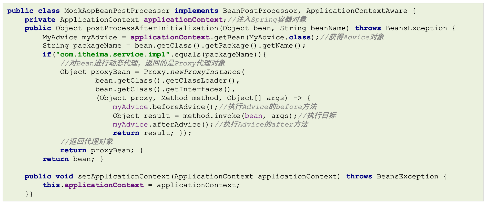
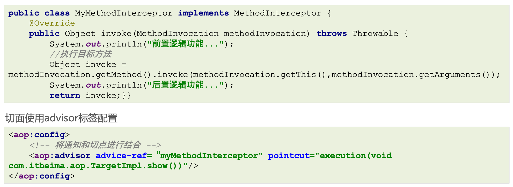
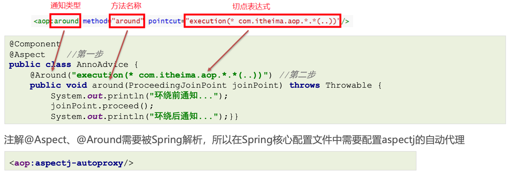
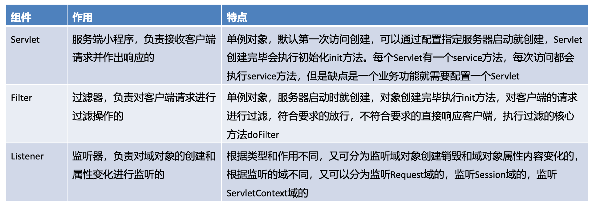
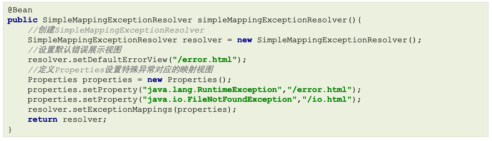
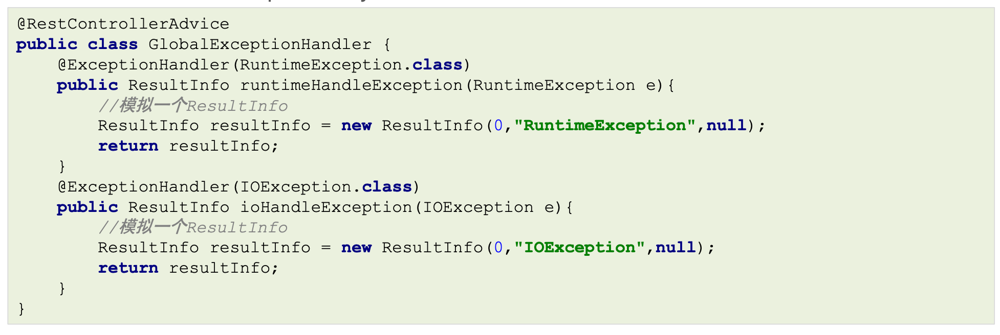
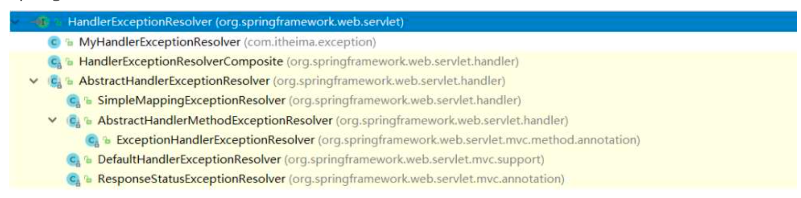

# 2 AOP

 ## 2.1 AOP 简介

### 2.1.1 AOP的概念

AOP，Aspect Oriented Programming，面向切面编程，是对面向对象编程OOP的升华。OOP是纵向对一个 事物的抽象，一个对象包括静态的属性信息，包括动态的方法信息等。而AOP是横向的对不同事物的抽象，属性与属性、方法与方法、对象与对象都可以组成一个切面，而用这种思维去设计编程的方式叫做 **面向切面编程**

 ### 2.1.2 AOP思想的实现方案

动态代理技术，在运行期间，对目标对象的方法进行增强，代理对象同名方法内可以执行原有逻辑的同时嵌入执行其他增强逻辑或其他对象的方法

### 2.1.3 模拟AOP的基础代码 

其实在之前学习BeanPostProcessor时，在BeanPostProcessor的after方法中使用动态代理对Bean进行了增 强，实际存储到单例池singleObjects中的不是当前目标对象本身，而是当前目标对象的代理对象Proxy，这样 在调用目标对象方法时，实际调用的是代理对象Proxy的同名方法，起到了目标方法前后都进行增强的功能， 对该方式进行一下优化，将增强的方法提取出去到一个增强类中，且只对com.itheima.service.impl包下的任 何类的任何方法进行增强

```java
//自定义增强类
public class MyAdvice {
  public void beforeAdvice(){ 
    System.out.println("beforeAdvice ...");
  }
  public void afterAdvice(){
  	System.out.println("afterAdvice ..."); 
  }
}
```



### 2.1.4 AOP相关概念


## 2.2 基于xml配置的AOP

### 2.2.1 xml方式AOP快速入门

前面我们自己编写的AOP基础代码还是存在一些问题的，主要如下: 

- 被增强的包名在代码写死了
- 通知对象的方法在代码中写死了


通过配置文件的方式去解决上述问题

- 配置哪些包、哪些类、哪些方法需要被增强
- 配置目标方法要被哪些通知方法所增强，在目标方法执行之前还是之后执行增强 配置方式的设计、配置文件(注解)的解析工作，Spring已经帮我们封装好了

***

**xml方式配置AOP的步骤:**
 1、导入AOP相关坐标; 

 2、准备目标类、准备增强类，并配置给Spring管理; 

 3、配置切点表达式(哪些方法被增强); 

 4、配置织入(切点被哪些通知方法增强，是前置增强还是后置增强)。

**1、导入AOP相关坐标**

```xml
<dependency> 
  <groupId>org.aspectj</groupId> 
  <artifactId>aspectjweaver</artifactId> 
  <version>1.9.6</version>
</dependency>
```

Spring-context坐标下已经包含spring-aop的包了，所以就不用额外导入了


**2、准备目标类、准备增强类，并配置给Spring管理**


**3、配置切点表达式(哪些方法被增强)** 

**4、配置织入(切点被哪些通知方法增强，是前置增强还是后置增强)**


### 2.2.2 xml方式AOP配置详解

切点表达式是配置要对哪些连接点(哪些类的哪些方法)进行通知的增强，语法如下:

```java
execution([访问修饰符]返回值类型 包名.类名.方法名(参数))
```

其中，

- 访问修饰符可以省略不写;
- 返回值类型、某一级包名、类名、方法名 可以使用 * 表示任意;
- 包名与类名之间使用单点 . 表示该包下的类，使用双点 .. 表示该包及其子包下的类; 
- 参数列表可以使用两个点 .. 表示任意参数。

切点表达式举几个例子方便理解


AspectJ的通知由以下五种类型


通知方法在被调用时，Spring可以为其传递一些必要的参数


JoinPoint 对象


ProceedingJoinPoint对象


Throwable对象


***

**AOP的另一种配置方式，该方式需要通知类实现Advice的子功能接口**（了解）

```java
public interface Advice { }
```

Advice的子功能接口


例如:通知类实现了前置通知和后置通知接口

```java
public class Advices implements MethodBeforeAdvice, AfterReturningAdvice {
	public void before(Method method, Object[] objects, Object o) throws Throwable {
		System.out.println("This is before Advice ..."); 
  }
  
	public void afterReturning(Object o, Method method, Object[] objects, Object o1) throws Throwable {
	System.out.println("This is afterReturn Advice ..."); 
  }
}
```

切面使用advisor标签配置(和第一种对比，明显配置没有显示配置哪个方法是前置通知，哪个是后置通知，它是怎么区分的呢？)

之前的通知类是普通的，需要在配置文件中指定哪个方法是前置通知，但是 Advices 是实现了接口，已经有标准了，因此配置文件没有配置，Spring也知道哪个是前置通知，哪个是后置通知。

```xml
<aop:config>
	<!-- 将通知和切点进行结合 -->
	<aop:advisor advice-ref="advices" pointcut="execution(void com.itheima.aop.TargetImpl.show())"/> 
</aop:config>
```

又例如:通知类实现了方法拦截器接口



***

使用aspect和advisor区别如下:

1)配置语法不同

2)通知类的定义要求不同，advisor 需要的通知类需要实现Advice的子功能接口

3)可配置的切面数量不同:

- 一个advisor只能配置一个固定通知和一个切点表达式;
- 一个aspect可以配置多个通知和多个切点表达式任意组合，粒度更细。

4)使用场景不同:

-  如果通知类型多、允许随意搭配情况下可以使用aspect进行配置;
- 如果通知类型单一、且通知类中通知方法一次性都会使用到的情况下可以使用advisor进行配置;
- 在通知类型已经固定，不用人为指定通知类型时，可以使用advisor进行配置，例如后面要学习的Spring事务控制的配置;

> 由于实际开发中，自定义aop功能的配置大多使用aspect的配置方式，所以我们后面主要讲解aspect的配置， advisor是为了后面Spring声明式事务控制做铺垫，此处大家了解即可。

***

动态代理的实现的选择，在调用getProxy() 方法时，我们可选用的 AopProxy接口有两个实现类，如上图，这两种 都是动态生成代理对象的方式，一种就是基于JDK的，一种是基于Cglib的


***

JDK的动态代理代码，之前已经写过了，下面看一下Cglib基于超类的动态代理


***

## 2.3 基于注解配置的AOP

### 2.3.1 注解方式AOP基本使用

Spring的AOP也提供了注解方式配置，使用相应的注解替代之前的xml配置，xml配置AOP时，我们主要配置了三 部分:目标类被Spring容器管理、通知类被Spring管理、通知与切点的织入(切面)，如下:


目标类被Spring容器管理、通知类被Spring管理


 配置aop，其实配置aop主要就是配置通知类中的哪个方法(通知类型)对应的切点表达式是什么



如果核心配置使用的是配置类的话，需要配置注解方式的aop自动代理

```java
@Configuration 
@ComponentScan("com.itheima.aop") 
@EnableAspectJAutoProxy //第三步 
public class ApplicationContextConfig { }
```

***

### 2.3.2 注解方式AOP配置详解 

各种注解方式通知类型

```java
//前置通知
@Before("execution(* com.itheima.aop.*.*(..))")
public void before(JoinPoint joinPoint){}

//后置通知
@AfterReturning("execution(* com.itheima.aop.*.*(..))")
public void AfterReturning(JoinPoint joinPoint){}

//环绕通知
@Around("execution(* com.itheima.aop.*.*(..))")
public void around(ProceedingJoinPoint joinPoint) throws Throwable {} 

//异常通知
@AfterThrowing("execution(* com.itheima.aop.*.*(..))")
public void AfterThrowing(JoinPoint joinPoint){}

//最终通知
@After("execution(* com.itheima.aop.*.*(..))")
public void After(JoinPoint joinPoint){}
```

切点表达式的抽取，使用一个空方法，将切点表达式标注在空方法上，其他通知方法引用即可

```java
@Component
@Aspect
public class AnnoAdvice {
	//切点表达式抽取
	@Pointcut("execution(* com.itheima.aop.*.*(..))") public void pointcut(){}
  
	//前置通知
	@Before("pointcut()")
	public void before(JoinPoint joinPoint){}
  
	//后置通知 
  @AfterReturning("AnnoAdvice.pointcut()")
	public void AfterReturning(JoinPoint joinPoint){}
	// ... 省略其他代码 ... 
}
```

***

### 2.3.3 注解方式AOP原理剖析

如果使用的是核心配置类的话

```java
@Configuration 
@ComponentScan("com.itheima.aop")  // 替代 <context:component-scan base-package="com.qfedu"/>
@EnableAspectJAutoProxy  // 替代 <aop:aspectj-autoproxy/>
public class ApplicationContextConfig { }
```

查看@EnableAspectJAutoProxy源码，使用的也是@Import导入相关解析类

```java
@Target({ElementType.TYPE}) 
@Retention(RetentionPolicy.RUNTIME) 
@Documented 
@Import({AspectJAutoProxyRegistrar.class}) public @interface EnableAspectJAutoProxy {
boolean proxyTargetClass() default false; boolean exposeProxy() default false;
}
```

使用@Import导入的AspectJAutoProxyRegistrar源码，一路追踪下去，最终还是注册了 AnnotationAwareAspectJAutoProxyCreator 这个类


## 2.4 基于AOP的声明式事务控制

### 2.4.1 Spring事务编程概述

事务是开发中必不可少的东西，使用JDBC开发时，我们使用connnection对事务进行控制，使用MyBatis时，我们 使用SqlSession对事务进行控制，缺点显而易见，当我们切换数据库访问技术时，事务控制的方式总会变化， Spring 就将这些技术基础上，提供了统一的控制事务的接口。Spring的事务分为:编程式事务控制 和 声明式事务 控制


Spring事务编程相关的类主要有如下三个


虽然编程式事务控制我们不学习，但是编程式事务控制对应的这些类我们需要了解一下，因为我们在通过配置的方 式进行声明式事务控制时也会看到这些类的影子

### 2.4.2 搭建测试环境

### 2.4.3 基于xml声明式事务控制

### 2.4.4. 基于注解声明式事务控制

> 看Spring_qf.md笔记

# 3 Web

## 3.1 Spring整合web环境

### 3.1.1 Javaweb三大组件及环境特点

在Java语言范畴内，web层框架都是基于Javaweb基础组件完成的，所以有必要复习一下Javaweb组件的特点



### 3.1.2 Spring整合web环境的思路及实现

略

### 3.1.3 Spring的web开发组件spring-web

> 每个请求到Servlet，doGet方法都要写一遍获取context，然后再通过getBean获取对应的bean，效率特别低
>
> ClassPathXmlApplicationContext context = new ClassPathXmlApplicationContext("applicationContext.xml");
> UserServiceImpl userService = (UserServiceImpl) context.getBean("userServiceImpl");
>
> 那能不能Tomcat启动时，就将这个对象保存起来可以给每个请求获取并使用呢？
>
> 可以，可以启动时就创建保存到servletContext域，这样请求都能获取到，下面就是使用 ContextLoaderListener 监听器来实现这个功能。

Spring其实已经为我们定义 好了一个ContextLoaderListener，遵循Spring "拿来主义" 的精神，我们直接使用Spring提供的就可以了，开发如下:

先导入Spring-web的坐标:

```xml
<dependency> 
  <groupId>org.springframework</groupId> 
  <artifactId>spring-web</artifactId> 
  <version>5.3.7</version>
</dependency>
```

在web.xml中去配置ContextLoaderListener，并指定配置文件的位置

```xml
<context-param>
	<param-name>contextConfigLocation</param-name> 
  <param-value>classpath:applicationContext.xml</param-value>
</context-param> 

<listener>
	<listener-class>org.springframework.web.context.ContextLoaderListener</listener-class> 
</listener>
```

在Servlet中直接通过WebApplicationContextUtils获取并使用

```java
@WebServlet("/accountServlet")
public class AccountServlet extends HttpServlet {
	protected void doGet(HttpServletRequest request, HttpServletResponse response) throws ServletException, 		IOException {
	ServletContext servletContext = request.getServletContext();
	ApplicationContext applicationContext = WebApplicationContextUtils.getWebApplicationContext(servletContext);
	AccountService accountService = applicationContext.getBean(AccountService.class); accountService.transferMoney("tom","lucy",500);
  }
}
```

***

## 3.2 web层MVC框架思想与设计思路

Java程序员在开发一般都是MVC+三层架构，MVC是web开发模式，传统的Javaweb技术栈实现的MVC如下


原始Javaweb开发中，Servlet充当Controller的角色，Jsp充当View角色，JavaBean充当模型角色，后期Ajax异 步流行后，在加上现在前后端分离开发模式成熟后，View就被原始Html+Vue替代。原始Javaweb开发中， Service充当Controller有很多弊端，显而易见的有如下几个:


负责共有行为的Servlet称之为前端控制器，负责业务行为的JavaBean称之为控制器Controller


# 4 MVC

## 4.1 SpringMVC简介

### 4.1.1 SpringMVC概述

SpringMVC是一个基于Spring开发的MVC轻量级框架，Spring3.0后发布的组件，SpringMVC和Spring可以无 缝整合，使用DispatcherServlet作为前端控制器，且内部提供了处理器映射器、处理器适配器、视图解析器等组 件，可以简化JavaBean封装，Json转化、文件上传等操作。


### 4.1.2 SpringMVC快速入门


导入Spring整合SpringMVC的坐标

```xml
<dependency> 
  <groupId>org.springframework</groupId> 
  <artifactId>spring-webmvc</artifactId> 
  <version>5.3.7</version>
</dependency>
```

在web.xml中配置SpringMVC的前端控制器ServletDispatcher

```xml
<servlet>
	<servlet-name>DispatcherServlet</servlet-name> 
  <servlet-class>org.springframework.web.servlet.DispatcherServlet</servlet-class> 
  <!--指定springMVC配置文件位置-->
	<init-param>
		<param-name>contextConfigLocation</param-name>
		<param-value>classpath:spring-mvc.xml</param-value> 
  </init-param>
	<!--服务器启动就创建-->
	<load-on-startup>2</load-on-startup> 
</servlet>

<servlet-mapping> 
  <servlet-name>DispatcherServlet</servlet-name> 
  <url-pattern>/</url-pattern>
</servlet-mapping>
```

创建springMVC的核心配置文件 spring-mvc.xml，并配置组件扫描web层

```xml
<?xml version="1.0" encoding="UTF-8"?>
<beans xmlns="http://www.springframework.org/schema/beans"
xmlns:xsi="http://www.w3.org/2001/xmlSchema-instance" xmlns:mvc="http://www.springframework.org/schema/mvc" xmlns:context="http://www.springframework.org/schema/context" xsi:schemaLocation="
http://www.springframework.org/schema/beans http://www.springframework.org/schema/beans/spring-beans.xsd
http://www.springframework.org/schema/context http://www.springframework.org/schema/context/spring-context.xsd
http://www.springframework.org/schema/mvc http://www.springframework.org/schema/mvc/spring-mvc.xsd">
<!-- 组件扫描web层 -->
<context:component-scan base-package="com.itheima.controller"/>
</beans>
```

编写一个控制器Controller，配置映射信息

```java
@Controller
public class UserController {
	@RequestMapping("/show") 
  public String show(){
    System.out.println("show 执行...."); //视图跳转到index.jsp
		return "/index.jsp";
  } 
}
```

### 4.1.3 SpringMVC关键组件浅析

当请求到达服务器时，是哪个组件接收的请求，是哪个组件帮我们找到的Controller，是哪个组件 帮我们调用的方法，又是哪个组件最终解析的视图?


先简单了解一下以上三个重要组件的关系


SpringMVC的默认组件，SpringMVC 在前端控制器 DispatcherServlet加载时，就会进行初始化操作，在进行初始 化时，就会加载SpringMVC默认指定的一些组件，这些默认组件配置在 DispatcherServlet.properties 文件中，该文 件存在与spring-webmvc-5.3.7.jar包下的 org\springframework\web\servlet\DispatcherServlet.properties


这些默认的组件是在DispatcherServlet中进行初始化加载的，在DispatcherServlet中存在集合存储着这些组件， SpringMVC的默认组件会在 DispatcherServlet 中进行维护，但是并没有存储在与SpringMVC的容器中


配置组件代替默认组件，如果不想使用默认组件，可以将替代方案使用Spring Bean的方式进行配置，例如，在 spring-mvc.xml中配置RequestMappingHandlerMapping

```xml
<bean class="org.springframework.web.servlet.mvc.method.annotation.RequestMappingHandlerMapping"/>
```

当我们在Spring容器中配置了HandlerMapping，则就不会在加载默认的HandlerMapping策略了，原理比较简单， DispatcherServlet 在进行HandlerMapping初始化时，先从SpringMVC容器中找是否存在HandlerMapping，如果 存在直接取出容器中的HandlerMapping，在存储到 DispatcherServlet 中的handlerMappings集合中去。

***

## 4.2 SpringMVC的请求处理

### 4.2.1 请求映射路径的配置

配置映射路径，映射器处理器才能找到Controller的方法资源，目前主流映射路径配置方式就是@RequestMapping


@RequestMapping注解，主要使用在控制器的方法上，用于标识客户端访问资源路径，常用的属性有value、path 、method、headers、params等。当@RequestMapping只有一个访问路径需要指定时，使用value属性、path属 性或省略value和path，当有多个属性时，value和path不能省略

```java
//使用value属性指定一个访问路径 
@RequestMapping(value = "/show")
public String show(){}

//使用value属性指定多个访问路径 
@RequestMapping(value = {"/show","/haohao","/abc"})
public String show(){}

//使用path属性指定一个访问路径
@RequestMapping(path = "/show") 
public String show(){}
s
//使用path属性指定多个访问路径
@RequestMapping(path = {"/show","/haohao","/abc"}) 
public String show(){}

//如果只设置访问路径时，value和path可以省略
@RequestMapping("/show") 
public String show(){} 
@RequestMapping({"/show","/haohao","/abc"})
public String show(){}
```

当@RequestMapping 需要限定访问方式时，可以通过method属性设置

```java
//请求地址是/show,且请求方式必须是POST才能匹配成功 
@RequestMapping(value = "/show",method = RequestMethod.POST) 
public String show(){}
```

@RequestMapping 在类上使用，@RequestMapping 、@GetMapping、@PostMapping还可以使用在 Controller类上，使用在类上后，该类所有方法都公用该@RequestMapping设置的属性，访问路径则为类上的映射 地址+方法上的映射地址，例如:

```java
@Controller
@RequestMapping("/xxx")
public class UserController implements ApplicationContextAware, ServletContextAware {
  
	@GetMapping("/aaa")
	public ModelAndView aaa(HttpServletResponse response) throws 	IOException, ModelAndViewDefiningException {
	return null; 
  }
}
```

> 此时的访问路径为:/xxx/aaa

### 4.2.2 请求数据的接收

接收普通请求数据，当客户端提交的数据是普通键值对形式时，直接使用同名形参接收即可

> username=haohao&age=35

```java
@GetMapping("/show")
public String show(String username, int age){
	System.out.println(username+"=="+age);
	return "/index.jsp"; 
}
```

接收普通请求数据，当请求参数有特殊格式数据，如日期时

> username=haohao&age=35&birthday=1986/01/01

```java
@GetMapping("/show")
public String show(String username,int age,Date birthday){
	System.out.println(username+"=="+age+"=="+birthday);
	return "/index.jsp"; 
}
```

Date可以正常接收，因为Spring内置的类型解析器，可以识别的日期格式是 yyyy/MM/dd，但是如果我们提交其他 格式，例如:yyyy-MM-dd 时，类型转换会报错，如下:

> username=haohao&age=35&birthday=1986-01-01

解决方案，使用@DateTimeFormat 指定日期格式，修改UserController如下:

```java
@GetMapping("/show")
public String show(String username,int age,@DateTimeFormat(pattern = "yyyy-MM-dd") Date birthday){
	System.out.println(username+"=="+age+"=="+birthday);
	return "/index.jsp"; 
}
```

接收普通请求数据，当请求参数的名称与方法参数名不一致时，可以使用@RequestParam注解进行标注

> username=haohao&age=35

```java
@GetMapping("/show")
public String show(@RequestParam(name = "username",required = true) String name, int age){
	System.out.println(name+"=="+age);
	return "/index.jsp"; 
}
```

接收实体JavaBean属性数据，单个JavaBean数据:提交的参数名称只要与Java的属性名一致，就可以进行自动封装

> username=haohao&age=35&hobbies=eat&hobbies=sleep

```java
public class User {
	private String username; 
  private Integer age; 
  private String[] hobbies; 
  private Date birthday; 
  private Address address; 
  //... 省略get和set方法 ...
}
```

```java
@GetMapping("/show")
public String show(User user){
	System.out.println(user);
	return "/index.jsp"; 
}
```

接收实体JavaBean属性数据，嵌套JavaBean数据:提交的参数名称用 . 去描述嵌套对象的属性关系即可

> username=haohao&address.city=tianjin&address.area=jinghai

同上，JavaBean中如果有日期数据，且日期格式不符合yyyy/MM/dd时，需要通过@DateTimeFormat指定日期格式

> username=haohao&birthday=1986-11-11

```java
public class User {
	private String username;
	private Integer age;
	private String[] hobbies; 
  @DateTimeFormat(pattern = "yyyy-MM-dd") 
  private Date birthday;
	private Address address;
	//... 省略get和set方法 ...
}
```

接收数组或集合数据，客户端传递多个同名参数时，可以使用数组接收

> hobbies=eat&hobbies=sleep

```java
@GetMapping("/show")
public String show(String[] hobbies){
	for (String hobby : hobbies) { 
    System.out.println(hobby);
  }
	return "/index.jsp";
}
```

接收Json数据格式数据，Json数据都是以请求体的方式提交的，且不是原始的键值对格式的，所以我们要使用 @RequestBody注解整体接收该数据。

```json
{
"username":"haohao", "age":18, "hobbies":["eat","sleep"], "birthday":"1986-01-01", "address":{
"city":"tj",
"area":"binhai" }
}
```

```java
@PostMapping("/show6")
public String show6(@RequestBody String body){
	System.out.println(body);
	return "/index.jsp"; 
}
```

使用Json工具( jackson )将Json格式的字符串转化为JavaBean进行操作

```xml
<dependency> 
  <groupId>com.fasterxml.jackson.core</groupId> 
  <artifactId>jackson-databind</artifactId> 
  <version>2.9.0</version>
</dependency>
```

```java
@PostMapping("/show")
public String show(@RequestBody String body) throws IOException {
	System.out.println(body);
	//获得ObjectMapper
	ObjectMapper objectMapper = new ObjectMapper(); 
  //将json格式字符串转化成指定的User
	User user = objectMapper.readValue(body, User.class); 	
  System.out.println(user);
	return "/index.jsp";
}
```

配置RequestMappingHandlerAdapter，指定消息转换器，就不用手动转换json格式字符串了

```xml
<bean class="org.springframework.web.servlet.mvc.method.annotation.RequestMappingHandlerAdapter">
<property name="messageConverters"> 
  <list>
		<bean class="org.springframework.http.converter.json.MappingJackson2HttpMessageConverter"/>
		</list> 
 </property>
</bean>
```

```java
@PostMapping("/show")
public String show(@RequestBody User user){
	System.out.println(user);
	return "/index.jsp"; 
}
```

接收Restful风格数据

什么是Rest风格?

Rest(Representational State Transfer)表象化状态转变(表述性状态转变)，在2000年被提出，基于HTTP、URI 、xml、JSON等标准和协议，支持轻量级、跨平台、跨语言的架构设计。是Web服务的一种新网络应用程序的设计风格和开发方式。

接收Restful风格数据 Restful风格的请求，常见的规则有如下三点:

- 用URI表示某个模块资源，资源名称为名词;

  

- 用请求方式表示模块具体业务动作，例如:GET表示查询、POST表示插入、PUT表示更新、DELETE表示删除

  

- 用HTTP响应状态码表示结果，国内常用的响应包括三部分:状态码、状态信息、响应数据

```json
{
	"code":200, 
  "message":"成功", 
  "data":{
		"username":"haohao",
		"age":18 
  }
}
```

接收Restful风格数据，Restful请求数据一般会在URL地址上携带，可以使用注解 @PathVariable(占位符参数名称)

> http://localhost/user/100

```java
@PostMapping("/user/{id}")
public String findUserById(@PathVariable("id") Integer id){
	System.out.println(id);
	return "/index.jsp"; 
}
```

请求URL资源地址包含多个参数情况

> http://localhost/user/haohao/18

```java
@PostMapping("/user/{username}/{age}")
public String findUserByUsernameAndAge(@PathVariable("username") String username,@PathVariable("age") Integer age){
	System.out.println(username+"=="+age);
	return "/index.jsp"; 
}
```

***

接收文件上传的数据，文件上传的表单需要一定的要求，如下:

- 表单的提交方式必须是POST
- 表单的enctype属性必须是multipart/form-data
- 文件上传项需要有name属性

```xml
<form action="" enctype="multipart/form-data"> 
  <input type="file" name="myFile">
</form>
```

 请求数据的接收 

服务器端，由于映射器适配器需要文件上传解析器，而该解析器默认未被注册，所以**手动注册**


使用MultipartFile类型接收上传文件


如果进行多文件上传的话，则使用MultipartFile数组即可

***

接收Http请求头数据，接收指定名称的请求头

```java
@GetMapping("/headers")
public String headers(@RequestHeader("Accept-Encoding") String acceptEncoding){
	System.out.println("Accept-Encoding:"+acceptEncoding);
	return "/index.jsp"; 
}
```

接收所有的请求头信息

```java
@GetMapping("/headersMap")
public String headersMap(@RequestHeader Map<String,String> map){
	map.forEach((k,v)->{ 
    System.out.println(k+":"+v);
	});
	return "/index.jsp"; 
}
```

获得客户端携带的Cookie数据

```java
@GetMapping("/cookies")
public String cookies(@CookieValue(value = "JSESSIONID",defaultValue = "") String jsessionid){
	System.out.println(jsessionid);
	return "/index.jsp"; 
}
```

获得转发Request域中数据，在进行资源之间转发时，有时需要将一些参数存储到request域中携带给下一个资源

```java
@GetMapping("/request1")
public String request1(HttpServletRequest request){
	//存储数据 
  request.setAttribute("username","haohao"); 
  return "forward:/request2";
}

@GetMapping("/request2")
public String request2(@RequestAttribute("username") String username){
	System.out.println(username);
	return "/index.jsp"; 
}
```

请求参数乱码的解决方案，Spring已经提供好的CharacterEncodingFilter来进行编码过滤

```xml
<!--配置全局的编码过滤器--> 
<filter>
	<filter-name>CharacterEncodingFilter</filter-name> 
  <filter class>org.springframework.web.filter.CharacterEncodingFilter</filter-class> 
  <init-param>
		<param-name>encoding</param-name>
		<param-value>UTF-8</param-value> 
  </init-param>
</filter> 

<filter-mapping>
	<filter-name>CharacterEncodingFilter</filter-name>
	<url-pattern>/*</url-pattern> 
</filter-mapping>
```

### 4.2.3 Javaweb常用对象获取

获得Javaweb常见原生对象，有时在我们的Controller方法中需要用到Javaweb的原生对象，例如:`Request`、 `Response`等，我们只需要将需要的对象以形参的形式写在方法上，SpringMVC框架在调用Controller方法时，会自动传递实参:

```java
@GetMapping("/javawebObject")
public String javawebObject(HttpServletRequest request, 	HttpServletResponse response, HttpSession session){
	System.out.println(request); 
  System.out.println(response); 		
  System.out.println(session); 
  return "/index.jsp";
}
```

### 4.3.4 请求静态资源

看`spring-qf.md`

### 4.3.5 注解驱动 <mvc:annotation-driven > 标签

根据上面的讲解，可以总结一下，要想使用@RequestMapping正常映射到资源方法，同时静态资源还能正常访问， 还可以将请求json格式字符串和JavaBean之间自由转换，我们就需要在spring-mvc.xml中尽心如下配置:


这么复杂繁琐的配置，是不是看上去有点头大?Spring是个"暖男"，将上述配置浓缩成了一个简单的配置标签，那就 是mvc的注解驱动，该标签内部会帮我们注册RequestMappingHandlerMapping、注册 RequestMappingHandlerAdapter并注入Json消息转换器等，上述配置就可以简化成如下:

```xml
<!--mvc注解驱动-->
<mvc:annotation-driven/> 
<!--配置DefaultServletHttpRequestHandler--> 
<mvc:default-servlet-handler/>
```

> PS:<mvc:annotation-driven > 标签在不同的版本中，帮我们注册的组件不同，Spring 3.0.X 版本注册是 DefaultAnnotationHandlerMapping 和 AnnotationMethodHandlerAdapter，由于框架的发展，从Spring 3.1.X 开始注册组件变为 RequestMappingHandlerMapping和RequestMappingHandlerAdapter

## 4.3 SpringMVC的响应处理

### 4.3.1 传统同步业务数据响应

Spring的接收请求的部分我们讲完了，下面在看一下Spring怎么给客户端响应数据，响应数据主要分为两大部分:

- 传统同步方式:准备好模型数据，在跳转到执行页面进行展示，此方式使用越来越少了，基于历史原因，一些旧 项目还在使用;
- 前后端分离异步方式:前端使用Ajax技术+Restful风格与服务端进行Json格式为主的数据交互，目前市场上几乎 都是此种方式了。

> 使用少，略。

### 4.3.2 前后端分离异步业务数据响应

其实此处的会写数据，跟上面回写数据给客户端的语法方式一样，只不过有如下一些区别:

- 同步方式回写数据，是将数据响应给浏览器进行页面展示的，而异步方式回写数据一般是回写给Ajax引擎的，即谁访问服务器端，服务器端就将数据响应给谁

- 同步方式回写的数据，一般就是一些无特定格式的字符串，而**异步方式回写的数据大多是Json格式字符串**

在讲解SringMVC接收请求数据时，客户端提交的Json格式的字符串，也是使用Jackson进行的手动转换成JavaBean ，可以当我们使用了@RequestBody时，直接用JavaBean就接收了Json格式的数据，原理其实就是SpringMVC底层 帮我们做了转换，此处@ResponseBody也可以将JavaBean自动给我们转换成Json格式字符串回响

```java
@GetMapping("/response5")
@ResponseBody
public User response5() throws JsonProcessingException {
	//创建JavaBean
	User user = new User(); 
  user.setUsername("haohao"); 
  user.setAge(18); 
  //直接返回User对象
	return user;
}
```

@ResponseBody注解使用优化，在进行前后端分离开发时，Controller的每个方法都是直接回写数据的，所以每个 方法上都得写@ResponseBody，可以将@ResponseBody写到Controller上，那么该Controller中的所有方法都具备 了返回响应体数据的功能了

```java
@Controller
@ResponseBody
public class UserController{
	@GetMapping("/response7")
  public ResultInfo response7() {
		//省略其他代码
		return info; 
  }
  
	@GetMapping("/response5")
	public User response5() throws JsonProcessingException {
		//省略其他代码
		return user; 
  }
		// ... 省略其他方法 ... 
}
```

进一步优化，可以使用@RestController替代@Controller和@ResponseBody，@RestController内部具备的这两个 注解的功能

```java
@RestController
public class UserController{
  
	@GetMapping("/response7") 
  public ResultInfo response7() {
		//省略其他代码
		return info; 
  }
}
```

## 4.4 SpringMVC的拦截器

### 4.4.1 拦截器 Interceptor 简介

SpringMVC的拦截器Interceptor规范，主要是对Controller资源访问时进行拦截操作的技术，当然拦截后可以进行权 限控制，功能增强等都是可以的。拦截器有点类似 Javaweb 开发中的Filter，拦截器与Filter的区别如下图:


由上图，对Filter 和 Interceptor 做个对比:


***

实现了HandlerInterceptor接口，且被Spring管理的Bean都是拦截器，接口定义如下:


HandlerInterceptor接口方法的作用及其参数、返回值详解如下:


### 4.4.2 拦截器快速入门

编写MyInterceptor01实现HandlerInterceptor接口:


配置Interceptor

```xml
<!--配置拦截器--> 
<mvc:interceptors>
	<mvc:interceptor>
		<!--配置对哪些资源进行拦截操作-->
		<mvc:mapping path="/*"/>
		<bean class="com.itheima.interceptor.MyInterceptor01"></bean>
	</mvc:interceptor> 
</mvc:interceptors>
```

### 4.4.3 拦截器执行顺序

拦截器三个方法的执行顺序
当每个拦截器都是放行状态时，三个方法的执行顺序如下:


当Interceptor1和Interceptor2处于放行，Interceptor3处于不放行时，三个方法的执行顺序如下:


拦截器执行顺序取决于 interceptor 的配置顺序


### 4.4.4 拦截器执行原理


## 4.5 SpringMVC的全注解开发 

### 4.5.1 spring-mvc.xml 中组件转化为注解形式

跟之前全注解开发思路一致， xml配置文件使用核心配置类替代，xml中的标签使用对应的注解替代


- 组件扫描，可以通过@ComponentScan注解完成;
- 文件上传解析器multipartResolver可以通过非自定义Bean的注解配置方式，即@Bean注解完成


<mvc:default-servlet-handler /> 和 <mvc:interceptor > 怎么办呢?SpringMVC 提供了一个注解叫做 @EnableWebMvc，我们看一下源码，内部通过@Import 导入了DelegatingWebMvcConfiguration类


WebMvcConfigurer类型的Bean会被注入进来，然后被自动调用，所以可以实现WebMvcConfigurer接口，完成一些 解析器、默认Servlet等的指定，WebMvcConfigurer接口定义如下:


创建MyWebMvcConfigurer实现WebMvcConfigurer接口，实现addInterceptors 和 configureDefaultServletHandling方法


最后，在SpringMVC核心配置类上添加@EnableWebMvc注解


### 4.5.2 DispatcherServlet加载核心配置类

现在是使用SpringMVCConfig核心配置类提替代的spring-mvc.xml，怎么加载呢?参照Spring的 ContextLoaderListener加载核心配置类的做法，定义了一个AnnotationConfigWebApplicationContext，通过 代码注册核心配置类


### 4.5.3 消除web.xml

目前，几乎消除了配置文件，但是web工程的入口还是使用的web.xml进行配置的，如下按照下面的配置就可以完全省略web.xml


## 4.6 SpringMVC的组件原理剖析

### 4.6.1 前端控制器初始化

前端控制器DispatcherServlet是SpringMVC的入口，也是SpringMVC的大脑，主流程的工作都是在此完成的，梳理一下 DispatcherServlet 代码。DispatcherServlet 本质是个Servlet，当配置了 load-on-startup 时，会在服务 器启动时就执行创建和执行初始化init方法，每次请求都会执行service方法

DispatcherServlet 的初始化主要做了两件事:

- 获得了一个 SpringMVC 的 ApplicationContext容器;
- 注册了 SpringMVC的九大组件。


SpringMVC 的ApplicationContext容器创建时机，Servlet 规范的 init(ServletConfig config) 方法经过子类重写 ，最终会调用 FrameworkServlet 抽象类的initWebApplicationContext() 方法，该方法中最终获得 一个根 Spring容器(Spring产生的)，一个子Spring容器(SpringMVC产生的)


在initWebApplicationContext方法中体现的父子容器的逻辑关系


跟进创建子容器的源码


子容器中的parent维护着父容器的引用


父容器和子容器概念和关系:

- 父容器:Spring 通过ContextLoaderListener为入口产生的applicationContext容器，内部主要维护的是 applicationContext.xml(或相应配置类)配置的Bean信息;
- 子容器:SpringMVC通过DispatcherServlet的init() 方法产生的applicationContext容器，内部主要维护的 是spring-mvc.xml(或相应配置类)配置的Bean信息，且内部还通过parent属性维护这父容器的引用。
- Bean的检索顺序:根据上面子父容器的概念，可以知道Controller存在与子容器中，而Controller中要注入 Service时，会先从子容器本身去匹配，匹配不成功时在去父容器中去匹配，于是最终从父容器中匹配到的 UserService，这样子父容器就可以进行联通了。但是父容器只能从自己容器中进行匹配，不能从子容器中进 行匹配。

***

注册 SpringMVC的 九大组件，在初始化容器initWebApplicationContext方法中执行了onRefresh方法，进而执 行了初始化策略initStrategies方法，注册了九个解析器组件


### 4.6.2 前端控制器执行主流程

略

## 4.7 SpringMVC的异常处理机制

### 4.7.1 SpringMVC 异常的处理流程

异常分为编译时异常和运行时异常，编译时异常我们 try-cache 进行捕获，捕获后自行处理，而运行时异常是不 可预期的，就需要规范编码来避免，在SpringMVC 中，不管是编译异常还是运行时异常，都可以最终由 SpringMVC提供的异常处理器进行统一处理，这样就避免了随时随地捕获处理的繁琐性。

当然除了繁琐之外，我们在进行前后端分离异步开发时，往往返回统一格式的结果给客户端，例如: {"code":200,"message":"","data":{"username":"haohao","age":null}}，即使报异常了，也不能把状态码500直 接扔给客户端丢给用户，需要将异常转换成符合上面格式的数据响应给客户端更友好。

***

SpringMVC 处理异常的思路是，一路向上抛，都抛给前端控制器 DispatcherServlet ，DispatcherServlet 在调用异常处理器ExceptionResolver进行处理，如下图:


### 4.7.2 SpringMVC 的异常处理方式

SpringMVC 提供了以下三种处理异常的方式:

- 简单异常处理器:使用SpringMVC 内置的异常处理器处理SimpleMappingExceptionResolver; 
- 自定义异常处理器:实现HandlerExceptionResolver接口，自定义异常进行处理;
-  注解方式:使用 @ControllerAdvice + @ExceptionHandler 来处理【推荐】。

***

使用SimpleMappingExceptionResolver处理一些简单异常，配置开启SimpleMappingExceptionResolver， 并指定异常捕获后的处理动作，当发生了异常后，会被 SimpleMappingExceptionResolver 处理，跳转到我们 配置的错误页面error.html给用户进行友好展示


可以在配置SimpleMappingExceptionResolver时，指定一些参数，例如:异常的类型


注解方式配置简单映射异常处理器



> SimpleMappingExceptionResolver这种方式适合用于试图跳转，但是现在基本都是前后端分离方式，所以这个用的很少。

***

自定义异常处理器，实现HandlerExceptionResolver接口自定义异常处理器，可以完成异常逻辑的处理


> 这也是返回页面的方式，使用少。

***

自定义异常处理器，返回Json格式字符串信息


***

使用注解`@ControllerAdvice + @ExceptionHandler` 配置异常，@ControllerAdvice 注解本质是一个 @Component，也会被扫描到，与此同时，具备AOP功能，默认情况下对所有的Controller都进行拦截操作， 拦截后干什么呢?就需要在结合@ExceptionHandler、@InitBinder、@ModelAttribute 注解一起使用了，此处我们讲解的是异常，所以是@ControllerAdvice + @ExceptionHandler的组合形式。

编写全局异常处理器类，使用@ControllerAdvice标注，且@ExceptionHandler指定异常类型


如果全局异常处理器响应的数据都是Json格式的字符串的话，可以使用@RestControllerAdvice替代 @ControllerAdvice 和 @ResponseBody



### 4.7.3 异常处理机制原理剖析

略

### 4.7.4 SpringMVC 常用的异常解析器

SpringMVC 相关的处理器异常解析器继承体系如下:



SpringMVC 常用的异常解析器


***


