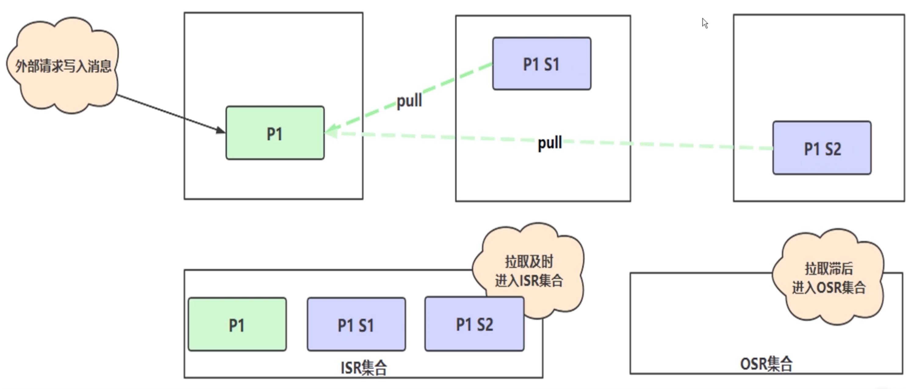
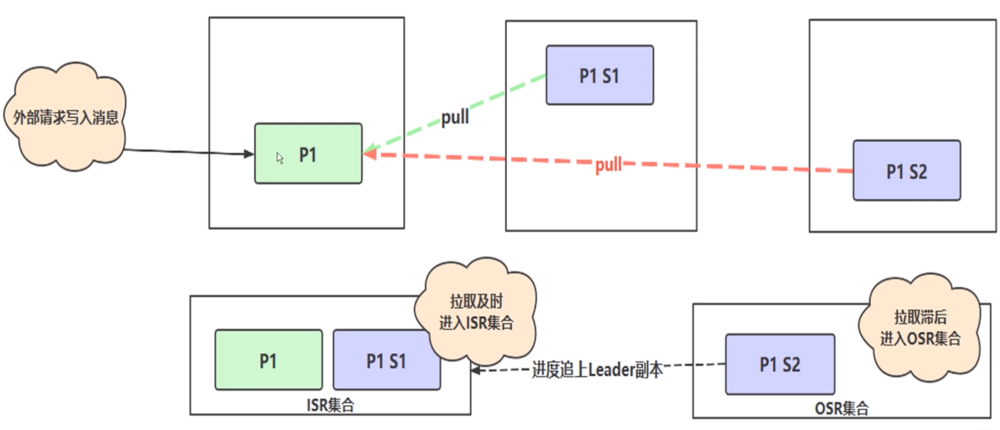
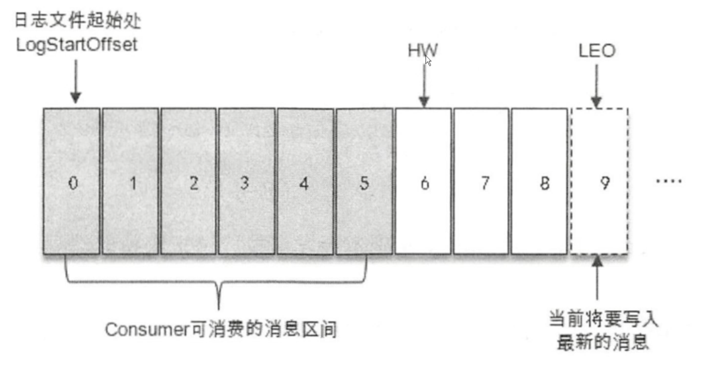
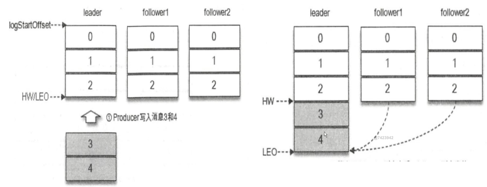
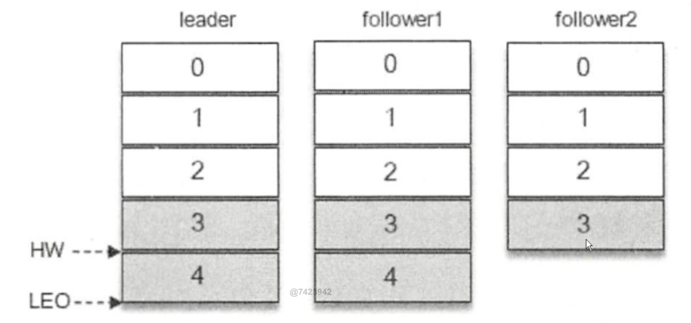

> 博客1:https://blog.csdn.net/wudidahuanggua/article/details/127086186
>
> 博客2:https://blog.csdn.net/qq_45076180/article/details/111344822

## 一、Kafka简介

### 1. Kafka是什么

Kafka是一种高吞吐量的`分布式`发布订阅消息系统（消息引擎系统），它可以处理消费者在网站中的所有动作流数据。 这种动作（网页浏览，搜索和其他用户的行动）是在现代网络上的许多社会功能的一个关键因素。 这些数据通常是由于吞吐量的要求而通过处理日志和日志聚合来解决。 对于像Hadoop一样的日志数据和离线分析系统，但又要求实时处理的限制，这是一个可行的解决方案。Kafka的目的是通过Hadoop的并行加载机制来统一线上和离线的消息处理，也是为了通过集群来提供实时的消息。

其实我们简单点理解就是系统A发送消息给kafka（消息引擎系统），系统B从kafka中读取A发送的消息。而kafka就是个中间商。

***

### 2. 消息系统简介

一个消息系统负责将数据从一个应用传递到另外一个应用，应用只需关注于数据，无需关注数据在两个或多个应用间是如何传递的。分布式消息传递基于可靠的消息队列，在客户端应用和消息系统之间异步传递消息。有两种主要的消息传递模式：点对点传递模式、发布-订阅模式。大部分的消息系统选用发布-订阅模式。`Kafka就是一种发布-订阅模式`。

***

### 3. 点对点消息传递模式

在点对点消息系统中，消息持久化到一个队列中。此时，将有一个或多个消费者消费队列中的数据。但是一条消息只能被消费一次。当一个消费者消费了队列中的某条数据之后，该条数据则从消息队列中删除。该模式即使有多个消费者同时消费数据，也能保证数据处理的顺序。这种架构描述示意图如下：

**生产者发送一条消息到queue，只有一个消费者能收到**。

***

### 4. 发布-订阅消息传递模式

在发布-订阅消息系统中，消息被持久化到一个topic中。与点对点消息系统不同的是，消费者可以订阅一个或多个topic，消费者可以消费该topic中所有的数据，同一条数据可以被多个消费者消费，数据被消费后不会立马删除。在发布-订阅消息系统中，消息的生产者称为发布者，消费者称为订阅者。该模式的示例图如下：

**发布者发送到topic的消息，只有订阅了topic的订阅者才会收到消息**。

***

### 5. kafka简单理解

上面我们提到kafka是个中间商，我们为什么不能去掉这个中间商呢，凭着我们的想象也会觉得去掉这些消息引擎系统会更好吧，那我们来谈谈`消息引擎系统存在的意义`：

原因就是`“削峰填谷”`。这四个字简直比消息引擎本身还要有名气。
所谓的“削峰填谷”就是指缓冲上下游瞬时突发流量，使其更平滑。特别是对于那种发送能力很强的上游系统，如果没有消息引擎的保护，“脆弱”的下游系统可能会直接被压垮导致全链路服务“雪崩”。但是，一旦有了消息引擎，它能够有效地对抗上游的流量冲击，真正做到将上游的“峰”填满到“谷”中，避免了流量的震荡。消息引擎系统的另一大好处在于发送方和接收方的松耦合，这也在一定程度上简化了应用的开发，减少了系统间不必要的交互。

我们想象一下在双11期间我们购物的情景来形象的理解一下削峰填谷，感受一下Kafka在这中间是怎么去“抗”峰值流量的吧：

当我们点击某个商品以后进入付费页面，可是这个简单的流程中就可能包含多个子服务，比如点击购买按钮会调用订单系统生成对应的订单，而处理该订单会依次调用下游的多个子系统服务 ，比如调用支付宝和微信支付的接口、查询你的登录信息、验证商品信息等。显然上游的订单操作比较简单，所以它的 TPS（每秒事务处理量） 要远高于处理订单的下游服务，因此如果上下游系统直接对接，势必会出现下游服务无法及时处理上游订单从而造成订单堆积的情形。特别是当出现类似于秒杀这样的业务时，上游订单流量会瞬时增加，可能出现的结果就是直接压跨下游子系统服务。

解决此问题的一个常见做法是我们对上游系统进行限速，但这种做法对上游系统而言显然是不合理的，毕竟问题并不出现在它那里。所以更常见的办法是引入像 Kafka 这样的消息引擎系统来对抗这种上下游系统 TPS 的错配以及瞬时峰值流量。

还是这个例子，当引入了 Kafka 之后。上游订单服务不再直接与下游子服务进行交互。当新订单生成后它仅仅是向 Kafka Broker 发送一条订单消息即可。类似地，下游的各个子服务订阅 Kafka 中的对应主题，并实时从该主题的各自分区（Partition）中获取到订单消息进行处理，从而实现了上游订单服务与下游订单处理服务的解耦。这样当出现秒杀业务时，Kafka 能够将瞬时增加的订单流量全部以消息形式保存在对应的主题中，既不影响上游服务的 TPS，同时也给下游子服务留出了充足的时间去消费它们。这就是 Kafka 这类消息引擎系统的最大意义所在。

***

### 6. Kafka的优点特点

- 解耦
  - 在项目启动之初来预测将来项目会碰到什么需求，是极其困难的。消息系统在处理过程中间插入了一个隐含的、基于数据的接口层，两边的处理过程都要实现这一接口。这允许你独立的扩展或修改两边的处理过程，只要确保它们遵守同样的接口约束。
- 冗余（副本）
  - 有些情况下，处理数据的过程会失败。除非数据被持久化，否则将造成丢失。消息队列把数据进行持久化直到它们已经被完全处理，通过这一方式规避了数据丢失风险。许多消息队列所采用的"插入-获取-删除"范式中，在把一个消息从队列中删除之前，需要你的处理系统明确的指出该消息已经被处理完毕，从而确保你的数据被安全的保存直到你使用完毕。
- 扩展性
  - 因为消息队列解耦了你的处理过程，所以增大消息入队和处理的频率是很容易的，只要另外增加处理过程即可。不需要改变代码、不需要调节参数。扩展就像调大电力按钮一样简单。
- 灵活性&峰值处理能力
  - 在访问量剧增的情况下，应用仍然需要继续发挥作用，但是这样的突发流量并不常见；如果为以能处理这类峰值访问为标准来投入资源随时待命无疑是巨大的浪费。使用消息队列能够使关键组件顶住突发的访问压力，而不会因为突发的超负荷的请求而完全崩溃。
- 可恢复性
  - 系统的一部分组件失效时，不会影响到整个系统。消息队列降低了进程间的耦合度，所以即使一个处理消息的进程挂掉，加入队列中的消息仍然可以在系统恢复后被处理。
- 顺序保证
  - 在大多使用场景下，数据处理的顺序都很重要。大部分消息队列本来就是排序的，并且能保证数据会按照特定的顺序来处理。Kafka保证一个Partition内的消息的有序性。
- 异步通信
  - 很多时候，用户不想也不需要立即处理消息。消息队列提供了异步处理机制，允许用户把一个消息放入队列，但并不立即处理它。想向队列中放入多少消息就放多少，然后在需要的时候再去处理它们。

***

## 二、Kafka架构

如上图所示，一个典型的Kafka集群中包含若干Producer（可以是web前端产生的Page View，或者是服务器日志，系统CPU、Memory等），若干broker（Kafka支持水平扩展，一般broker数量越多，集群吞吐率越高），若干Consumer Group，以及一个Zookeeper集群。Kafka通过Zookeeper管理集群配置，选举leader，以及在Consumer Group发生变化时进行rebalance。Producer使用push模式将消息发布到broker，Consumer使用pull模式从broker订阅并消费消息。

| 名称          | 解释                                                         |
| ------------- | ------------------------------------------------------------ |
| Broker        | 消息中间件处理节点，一个Kafka节点就是一个broker，一个或者多个Broker可以组成一个Kafka集群Topic |
| Topic         | Kafka根据topic对消息进行归类，发布到Kafka集群的每条消息都需要指定一个topicProducer |
| Producer      | 消息生产者，向Broker发送消息的客户端Consumer【该角色将消息发布到Kafka的topic中。broker接收到生产者发送的消息后，broker将该消息**追加**到当前用于追加数据的segment文件中。生产者发送的消息，存储到一个partition中（**比如TopicA有 0 和 1 两个 partition ，只会存到其中一个partition**），生产者也可以指定数据存储的partition】 |
| Consumer      | 消息消费者，从Broker读取消息的客户端ConsumerGroup            |
| ConsumerGroup | **消费者组，每个Consumer属于一个特定的Consumer Group，一条消息可以被多个不同的Consumer Group消费，但是一个Consumer Group中只能有一个Consumer能够消费该消息Partition** |
| Partition     | 分区，物理上的概念，一个topic可以分为多个partition，每个partition内部消息是有序的 |

### 1. ISR

In Sync Replicas

***

当leader节点 P1 挂了之后，在ISR集合中的才有机会被选中作为下一个leader ，而OSR集合中的永远没有机会竞选。

***

`HW`

- High Watermark，高水位线，消费者只能最多拉取到高水位线的消息。

`LEO`

- Log End Offset，日志文件的最后一条记录的offset（偏移量）

ISR 与 HW 和 LEO 有密不可分的关系。 

消费者只能拉取高水位线之前的数据，不包含高水位线。

***

上面的一些概念跟集群副本有关系：

***

假如follower1同步快（3和4都同步完成），follower2同步慢（只同步了3），那么高水位线就可以移动一位。

高水位线也可以根据配置策略进行修改，比如可以改成超过半数follower同步完成就可以提高水位线等。

