# Kafka

`Kafka`是由Apache软件基金会开发的一个开源流处理平台，由Scala和Java编写。Kafka是一种高吞吐量的分布式发布订阅消息系统，它可以收集并处理用户在网站中的所有动作流数据以及物联网设备的采样信息。

## 第一章: 初识Kafka

Apache Kafka是Apache软件基金会的开源的流处理平台，该平台提供了消息的订阅与发布的消息队列，一般用作`系统间解耦`、`异步通信`、`削峰填谷`等作用。

应用场景：

* Kafka之`异步化`、`服务解耦`、`削峰填谷`
* Kafka海量日志收集
* Kafka之数据同步应用
* Kafka之实时计算分析

***

Message Queue是什么？

消息队列是一种在`分布式`和`大数据开发中`不可或缺的中间件。在分布式开发或者大数据开发中通常使用消息队列进行缓冲、系统间解耦和削峰填谷等业务场景，常见的消息队列工作模式大致会分为两大类：

* **至多一次**：消息生产者将数据写入消息系统，然后由消费者负责去拉去消息服务器中的消息，一旦消息被确认消费之后 ，由消息服务器主动删除队列中的数据，这种消费方式一般只允许被一个消费者消费，并且消息队列中的数据不允许被重复消费。

- **没有限制**：同上述消费形式不同，生产者发完数据以后，该消息可以被多个消费者同时消费，并且同一个消费者可以多次消费消息服务器中的同一个记录。主要是因为消息服务器一般可以长时间存储海量消息。

`Kafka集群`以Topic形式负责分类集群中的Record（消息），每一个Record属于一个Topic。每个Topic底层都会对应一组分区的日志用于持久化Topic中的Record。同时在Kafka集群中，Topic的每一个日志的分区都一定会有1个Borker担当该分区的**Leader**，其他的Broker担当该分区的**follower**，Leader负责分区数据的读写操作，follower负责同步该分区的数据（不负责读写操作）。这样如果分区的Leader宕机，改分区的其他follower会选取出新的leader继续负责该分区数据的读写。其中集群的中Leader的监控和Topic的部分元数据是存储在Zookeeper中


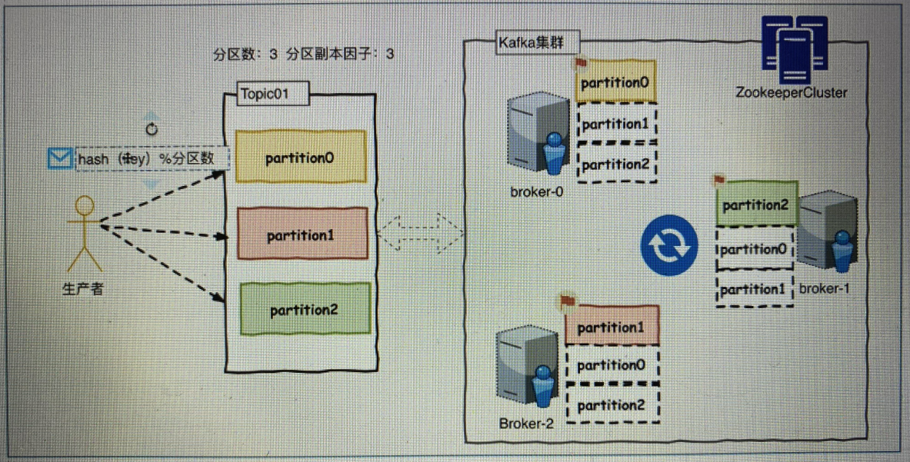


> Topic and Partition

Kafka中所有消息是通过Topic为单位进行管理，每个Kafka中的Topic通常会有多个订阅者，负责订阅发送到改Topic中的数据。Kafka负责管理集群中每个Topic的一组日志分区数据。

生产者将数据发布到相应的Topic。负责选择将哪个记录分发送到Topic中的哪个Partition（分区）。例如可以round-robin（轮询）方式完成此操作，然而这种仅是为了平衡负载。也可以根据某些语义分区功能（例如基于记录中的Key）进行此操作。

每组日志分区是一个有序的不可变的的日志序列，分区中的每一个Record都被分配了唯一的序列编号称为是`offset`，Kafka 集群会持久化所有发布到Topic中的Record信息，改Record的持久化时间是通过配置文件指定,默认是168小时。

log.retention.hours=168

Kafka底层会定期的检查日志文件，然后将过期的数据从log中移除，由于Kafka使用硬盘存储日志文件，因此使用Kafka长时间缓存一些日志文件是不存在问题的。


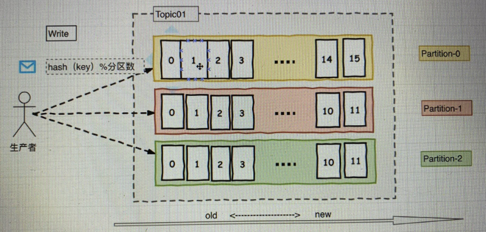


Topic分区之间消息不保证有序，但每个分区内部消息肯定有序。

在消费者消费Topic中数据的时候，每个消费者会维护本次消费对应分区的偏移量，消费者会在消费完一个批次的数据之后，会将本次消费的偏移量提交给Kafka集群，因此对于每个消费者而言可以随意的控制改消费者的偏移量。因此在Kafka中，消费者可以从一个topic分区中的任意位置读取队列数据，由于每个消费者控制了自己的消费的偏移量，因此多个消费者之间彼此相互独立。

Kafka中对Topic实现日志分区的有以下目的：

* 首先，它们允许日志扩展到超出单个服务器所能容纳的大小。每个单独的分区都必须适合托管它的服务器，但是一个Topic可能有很多分区，因此它可以处理任意数量的数据。

- 其次每个服务器充当其某些分区的Leader，也可能充当其他分区的Follwer，因此群集中的负载得到了很好的平衡。

> Consumer Group

消费者使用Consumer Group（组）名称标记自己，并且发布到Topic的每条记录都会传递到每个订阅Consumer Group中的**一个消费者实例**。如果所有Consumer实例都具有相同的Consumer Group，那么Topic中的记录会在改ConsumerGroup中的Consumer实例进行均分消费；如果所有Consumer实例具有不同的ConsumerGroup，则每条记录将广播到所有Consumer Group进程。

更常见的是，我们发现Topic具有少量的Consumer Group，每个Consumer Group可以理解为一个“逻辑的订阅者”。每个Consumer Group均由许多Consumer实例组成，以实现可伸缩性和容错能力。这无非就是发布-订阅模型，其中订阅者是消费者的集群而不是单个进程。这种消费方式Kafka会将Topic按照分区的方式均分给一个Consumer Group下的实例，如果ConsumerGroup下有新的成员介入，则新介入的Consumer实例会去接管ConsumerGroup内其他消费者负责的某些分区，同样如果一下ConsumerGroup下的有其他Consumer实例宕机，则由改ConsumerGroup其他实例接管。

由于Kafka的Topic的分区策略，因此Kafka仅提供分区中记录的有序性，也就意味着相同Topic的不同分区记录之间无顺序。因为针对于绝大多数的大数据应用和使用场景， 使用分区内部有序或者使用key进行分区策略已经足够满足绝大多数应用场景。但是，如果您需要记录全局有序，则可以通过只有一个分区Topic来实现，尽管这将意味着每个ConsumerGroup只有一个Consumer进程。


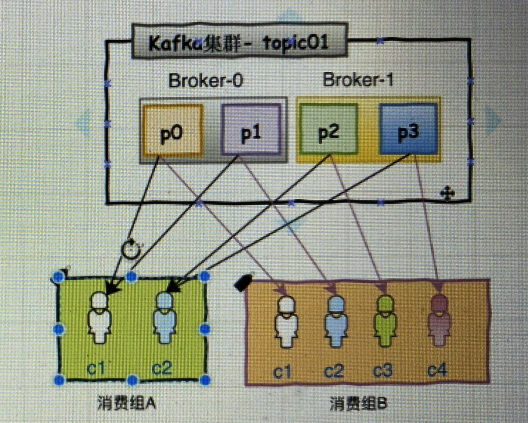

假如此时消费组B多加一个消费者c5，这时消费者c5就会空闲，因为四个分区都分给了c1~c4四个消费者了

1.但假如c3宕机了，那么kafka会将p2交给c5来消费（高可用）

2.假如这时topic01又增加一个分区p5，这时c5就会分到p5了

**结论**：一个ConsumerGroup对topic的消费能力取决于并行分区的大小，分区越多，原则上ConsumerGroup并行消费能力越强。（一个小人就是一个服务器），分区越多，一个topic下的数据就越分散，就可以就给更多地服务器去管理每一个分区，并担任每个分区的leader。


***

> In Sync Replicas

**ISR and AR**

简单来说，分区中的所有副本统称为 `AR` (Assigned Replicas)。所有与leader副本保持一定程度同步的副本（包括leader副本在内）组成 `ISR` (In Sync Replicas)。 ISR 集合是 AR 集合的一个子集。消息会先发送到leader副本，然后follower副本才能从leader中拉取消息进行同步。同步期间，follow副本相对于leader副本而言会有一定程度的滞后。前面所说的 ”一定程度同步“ 是指可忍受的滞后范围，这个范围可以通过参数进行配置。于leader副本同步滞后过多的副本（不包括leader副本）将组成 `OSR` （Out-of-Sync Replied）由此可见，AR = ISR + OSR。正常情况下，所有的follower副本都应该与leader 副本保持 一定程度的同步，即AR=ISR，OSR集合为空。

**ISR 的伸缩性**

**leader副本负责维护和跟踪** `ISR` 集合中所有follower副本的滞后状态，当follower副本落后太多或失效时，leader副本会把它从 ISR 集合中剔除。如果 `OSR` 集合中所有follower副本“追上”了leader副本，那么leader副本会把它从 OSR 集合转移至 ISR 集合。默认情况下，当leader副本发生故障时，只有在 ISR 集合中的follower副本才有资格被选举为新的leader，而在 OSR 集合中的副本则没有任何机会（不过这个可以通过配置来改变）。

***

**kafka的“同步”**

kafka不是完全同步，也不是完全异步，是一种特殊的ISR（`In Sync Replica`）

1.leader会维持一个与其保持同步的replica集合，该集合就是ISR，每一个partition都有一个ISR，它时有leader动态维护。

2.我们要保证kafka不丢失message，就要保证ISR这组集合存活（至少有一个存活），并且消息commit成功。

`拉取时间都在设置容忍范围内`

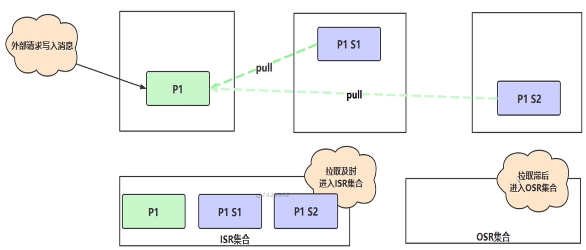

`拉取时间其中一个超过了设置容忍范围`

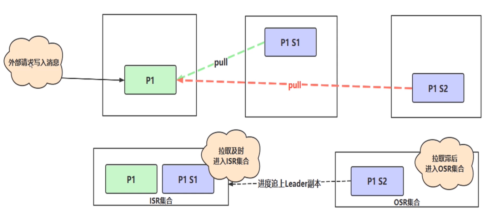

此时如果主节点宕机了,那么要从两个副节点选取其中一个为主节点, 选取原则,只会在ISR集合中选取, 而此时s2由于拉取滞后，在OSR集合中，所以s1直接变成主节点继续提供服务。

***

> **Kafka中的HW、LEO、LSO等分别代表什么？**

`HW` 、 `LEO` 等概念和 `ISR`有着紧密的关系。

`HW` （High Watermark）俗称**高水位**，它标识了一个特定的消息偏移量（offset），消费者只能拉取到这个offset之前的消息。

下图表示一个日志文件，这个日志文件中只有9条消息，第一条消息的offset（LogStartOffset）为0，最后一条消息的offset为8，offset为9的消息使用虚线表示的，代表下一条待写入的消息。日志文件的 HW 为6，表示消费者只能拉取offset在 0 到 5 之间的消息，offset为6的消息对消费者而言是不可见的。

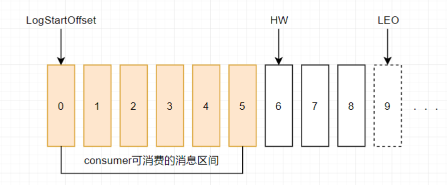


`LEO` （Log End Offset），标识当前日志文件中下一条待写入的消息的offset。上图中offset为9的位置即为当前日志文件的 LEO，LEO 的大小相当于当前日志分区中最后一条消息的offset值加1.分区 ISR 集合中的每个副本都会维护自身的 LEO ，而 ISR 集合中最小的 LEO 即为分区的 HW，对消费者而言只能消费 HW 之前的消息。

------

下面具体分析一下 ISR 集合和 HW、LEO的关系。

假设某分区的 ISR 集合中有 3 个副本，即一个 leader 副本和 2 个 follower 副本，此时分区的 LEO 和 HW 都分别为 3 。消息3和消息4从生产者出发之后先被存入leader副本。

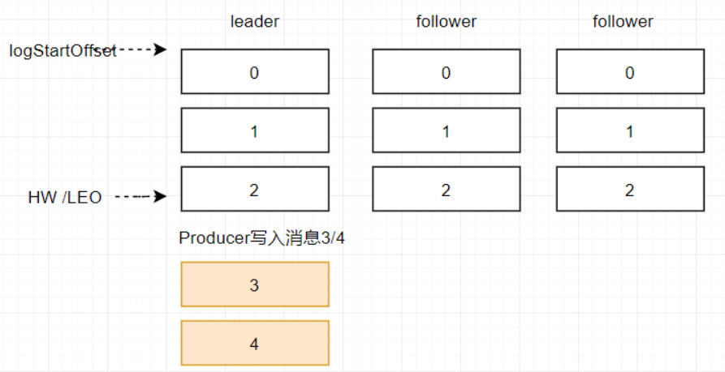

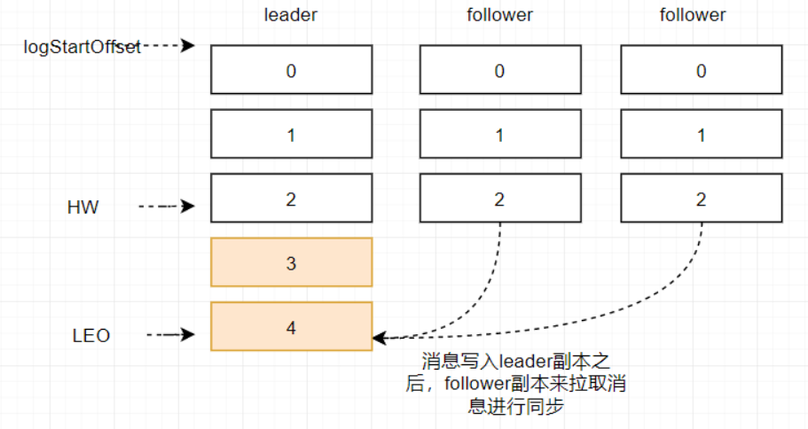

在消息被写入leader副本之后，follower副本会发送拉取请求来拉取消息3和消息4进行消息同步。

在同步过程中不同的副本同步的效率不尽相同，在某一时刻follower1完全跟上了leader副本而follower2只同步了消息3，如此leader副本的LEO为5，follower1的LEO为5，follower2的LEO 为4，那么当前分区的HW取最小值4，此时消费者可以消费到offset0至3之间的消息。

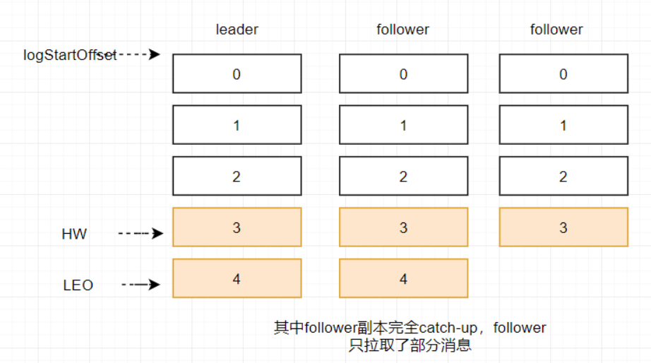

当所有副本都成功写入消息3和消息4之后，整个分区的HW和LEO都变为5，因此消费者可以消费到offset为4的消息了。

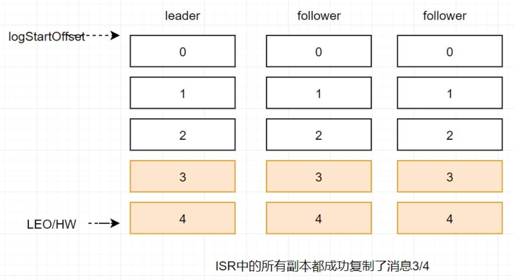

由此可见kafka的复制机制既不是完全的同步复制，也不是单纯的异步复制。事实上，同步复制要求**所有能工作的follower副本都复制完, 这条消息才会被确认已成功提交**，这种复制方式极大的影响了性能。而在异步复制的方式下，follower副本异步的从leader副本中复制数据，**数据只要被leader副本写入就会被认为已经成功提交**。在这种情况下，**如果follower副本都还没有复制完而落后于leader副本，然后leader副本宕机，则会造成数据丢失**。kafka使用这种ISR的方式有效的权衡了数据可靠性和性能之间的关系。

***

> 高性能之道-顺序写&mmap(写入性能)

Kafka的特性之一就是高吞吐率，但是Kafka的消息是保存或缓存在磁盘上的，一般认为在磁盘上读写数据是会降低性能的，但是Kafka即使是普通的服务器，Kafka也可以轻松支持每秒百万级的写入请求，超过了大部分的消息中间件，这种特性也使得Kafka在日志处理等海量数据场景广泛应用。Kafka会把收到的消息都写入到硬盘中，防止丢失数据。为了优化写入速度Kafka采用了两个技术顺序写入和MMFile 

因为硬盘是机械结构，每次读写都会寻址->写入，其中寻址是一个“机械动作”，它是最耗时的。所以硬盘最讨厌随机I/O，最喜欢顺序I/O。为了提高读写硬盘的速度，Kafka就是使用顺序I/O。这样省去了大量的内存开销以及节省了IO寻址的时间。但是单纯的使用顺序写入，Kafka的写入性能也不可能和内存进行对比，因此Kafka的数据并不是实时的写入硬盘中 。

Kafka充分利用了现代操作系统`分页存储`来利用内存提高I/O效率。Memory Mapped Files(后面简称mmap)也称为内存映射文件，在64位操作系统中一般可以表示20G的数据文件，它的工作原理是直接利用操作系统的Page实现文件到物理内存的直接映射。完成MMP映射后，用户对内存的所有操作会被操作系统自动的刷新到磁盘上，极大地降低了IO使用率。


> 高性能之道-零拷贝技术ZeroCopy(消费性能)

Kafka服务器在响应客户端读取的时候，底层使用ZeroCopy技术，直接将磁盘**无需拷贝到用户空间，而是直接将数据通过内核空间传递输出，数据并没有抵达用户空间。**

`传统IO操作`

- 1.用户进程调用read等系统调用向操作系统发出IO请求，请求读取数据到自己的内存缓冲区中。自己进入阻塞状态。
- 2.操作系统收到请求后，进一步将IO请求发送磁盘。
- 3.磁盘驱动器收到内核的IO请求，把数据从磁盘读取到驱动器的缓冲中。此时不占用CPU。当驱动器的缓冲区被读满后，向内核发起中断信号告知自己缓冲区已满。
- 4.内核收到中断，使用CPU时间将磁盘驱动器的缓存中的数据拷贝到内核缓冲区中。
- 5.如果内核缓冲区的数据少于用户申请的读的数据，重复步骤3跟步骤4，直到内核缓冲区的数据足够多为止。

- 6.将数据从内核缓冲区拷贝到用户缓冲区，同时从系统调用中返回。完成任务


`DMA`

- 1.用户进程调用read等系统调用向操作系统发出IO请求，请求读取数据到自己的内存缓冲区中。自己进入阻塞状态。
- 2.操作系统收到请求后，进一步将IO请求发送DMA。然后让CPU干别的活去。
- 3.DMA进一步将IO请求发送给磁盘。
- 4.磁盘驱动器收到DMA的IO请求，把数据从磁盘读取到驱动器的缓冲中。当驱动器的缓冲区被读满后，向DMA发起中断信号告知自己缓冲区已满。
- 5.DMA收到磁盘驱动器的信号，将磁盘驱动器的缓存中的数据拷贝到内核缓冲区中。此时不占用CPU。这个时候只要内核缓冲区的数据少于用户申请的读的数据，内核就会一直重复步骤3跟步骤4，直到内核缓冲区的数据足够多为止。
- 6.当DMA读取了足够多的数据，就会发送中断信号给CPU。

- 7.CPU收到DMA的信号，知道数据已经准备好，**于是将数据从内核拷贝到用户空间，系统调用返回**。

`跟IO中断模式相比，DMA模式下，DMA就是CPU的一个代理，它负责了一部分的拷贝工作，从而减轻了CPU的负担。DMA的优点就是：中断少，CPU负担低。`


零拷贝技术ZeroCopy实现 = DMA + 零拷贝


***

## 第二章: Kafka集群配置

虚拟机：192.168.10.12、192.168.10.13、192.168.10.14

* 修改主机名
* 安装zookeeper（参考之前）并启动

查看启动一台服务器状态为`leader`，另外两台状态为`follower`

```markdown
[root@bhz14 bin]# ./zkServer.sh status
JMX enabled by default
Using config: /usr/local/software/zookeeper-3.4.6/bin/../conf/zoo.cfg
Mode: leader
[root@bhz14 bin]# 
```


**Kafka集群环境搭建**

> 上传包并解压

```markdown
[root@bhz12 software]# pwd
/usr/local/software
[root@bhz12 software]# ll
-rw-r--r--.  1 root      root      63999924 1月  29 17:44 kafka_2.11-2.2.0.tgz
[root@bhz12 software]# tar -zxvf kafka_2.11-2.2.0.tgz -C /usr/local/        #下载到目录/usr/local/下
[root@bhz14 software]# cd /usr/local
[root@bhz14 local]# ll
drwxr-xr-x. 6 root root  89 3月  10 2019 kafka_2.11-2.2.0
[root@bhz13 local]# mv kafka_2.11-2.2.0 kafka_2.11  #重命名

```

> 修改配置文件

```markdown
[root@bhz12 config]# pwd
/usr/local/kafka_2.11/config
[root@bhz12 config]# mkdir /usr/local/kafka_2.11/kafka-logs
[root@bhz12 config]# vim server.properties
```

```markdown
borker.id=0   #另外两台分别为borker.id=1和borker.id=2
port=9092
host.name=192.168.10.12
log.dirs=/usr/local/kafka_2.11/kafka-logs
zookeeper.connect=192.168.10.12:2181,192.168.10.13:2181,192.168.10.14:2181
```

> 启动

```markdown
[root@bhz12 bin]# pwd
/usr/local/kafka_2.11/bin
[root@bhz12 bin]# ./kafka-server-start.sh /usr/local/kafka_2.11/config/server.properties &
```

> 查看进程

```markdown
[root@bhz12 kafka_2.11]# jps
16064 Kafka
16901 Jps
3230 QuorumPeerMain
[root@bhz12 kafka_2.11]#
```

启动完成！

## 第三章: Kafka基本命令

> 创建Topics

```markdown
[root@bhz12 bin]# ./kafka-topics.sh --bootstrap-server 192.168.10.12:9092,192.168.10.13:9092,192.168.10.14:9092 --create --topic topic01 --partitions 3 --replication-factor 2
```

```linux
[root@bhz12 bin]#./kafka-topics.sh 
--bootstrap-server 192.168.10.12:9092,192.168.10.13:9092,192.168.10.14:9092 
--create 
--topic topic01             #主题名
--partitions 3              #分区数
--replication-factor 2      #副本数

```

> 查看

```markdown
[root@bhz12 bin]# ./kafka-topics.sh --bootstrap-server 192.168.10.12:9092,192.168.10.13:9092,192.168.10.14:9092 --list
topic01                                                           #查出刚创建的topic
[root@bhz12 bin]#

```

> 查看分区情况

```markdown
[root@bhz12 bin]# ls /usr/local/kafka_2.11/kafka-logs/
cleaner-offset-checkpoint    meta.properties                   replication-offset-checkpoint  topic01-1
log-start-offset-checkpoint  recovery-point-offset-checkpoint  topic01-0
[root@bhz12 bin]#
```

能查看到**分区0** `topic01-0` 和**分区1** `topic01-1`

此时再去查询另外两台服务器分区情况分别为：**分区0** `topic01-0` 和**分区2** `topic01-2` 、 **分区1** `topic01-1` 和**分区2** `topic01-2`

刚好可以说明上面创建分片数3，副本数2，刚好在三台服务器上有对应的备份。

> 查看topic01详情

```markdown
[root@bhz12 bin]# ./kafka-topics.sh --bootstrap-server 192.168.10.12:9092,192.168.10.13:9092,192.168.10.14:9092 --describe --topic topic01
#Topic名称：topic01，PartitionCount分片数：3，ReplicationFactor副本数：2
Topic:topic01	PartitionCount:3	ReplicationFactor:2	Configs:segment.bytes=1073741824
   #分区0在服务器1,0上存了，并且服务器1是Leader
	Topic: topic01	Partition: 0	Leader: 1	Replicas: 1,0	Isr: 1,0  
   #分区1在服务器0,2上存了，并且服务器0是Leader
	Topic: topic01	Partition: 1	Leader: 0	Replicas: 0,2	Isr: 0,2
   #分区2在服务器2,1上存了，并且服务器2是Leader
	Topic: topic01	Partition: 2	Leader: 2	Replicas: 2,1	Isr: 2,1
[root@bhz12 bin]#
```

> 再创建一个Topic测试(分片数2，副本数3)

```markdown
[root@bhz12 bin]# ./kafka-topics.sh --bootstrap-server 192.168.10.12:9092,192.168.10.13:9092,192.168.10.14:9092 --create --topic topic02 --partitions 2 --replication-factor 3

```

> 查看topic02详情

```markdown
[root@bhz12 bin]# ./kafka-topics.sh --bootstrap-server 192.168.10.12:9092,192.168.10.13:9092,192.168.10.14:9092 --describe --topic topic02
#Topic名称：topic02，PartitionCount分片数：2，ReplicationFactor副本数：3
Topic:topic02	PartitionCount:2	ReplicationFactor:3	Configs:segment.bytes=1073741824
   #分区0在服务器1,2,0上存了，并且服务器1是Leader
	Topic: topic02	Partition: 0	Leader: 1	Replicas: 1,2,0	Isr: 1,2,0
   #分区1在服务器0,1,2上存了，并且服务器0是Leader
	Topic: topic02	Partition: 1	Leader: 0	Replicas: 0,1,2	Isr: 0,1,2
[root@bhz12 bin]#
```

> 修改topic分区（修改分区只能增，不能减）

`将上面topic02两个分区修改成3个分区`

```markdown
[root@bhz12 bin]# ./kafka-topics.sh --bootstrap-server 192.168.10.12:9092,192.168.10.13:9092,192.168.10.14:9092 --alter --topic topic02 --partitions 3
```

> 再次查看详情，已经成功修改成3个分区

```markdown
[root@bhz12 bin]# ./kafka-topics.sh --bootstrap-server 192.168.10.12:9092,192.168.10.13:9092,192.168.10.14:9092 --describe --topic topic02
Topic:topic02	PartitionCount:3	ReplicationFactor:3	Configs:segment.bytes=1073741824
	Topic: topic02	Partition: 0	Leader: 1	Replicas: 1,2,0	Isr: 1,2,0
	Topic: topic02	Partition: 1	Leader: 0	Replicas: 0,1,2	Isr: 1,2,0
	Topic: topic02	Partition: 2	Leader: 0	Replicas: 0,2,1	Isr: 0,2,1
[root@bhz12 bin]# 
```

> 删除topic02，并再次查看，只有topic01了，topic02已经删除成功

```markdown
[root@bhz12 bin]# ./kafka-topics.sh --bootstrap-server 192.168.10.12:9092,192.168.10.13:9092,192.168.10.14:9092 --delete --topic topic02
[root@bhz12 bin]# ./kafka-topics.sh --bootstrap-server 192.168.10.12:9092,192.168.10.13:9092,192.168.10.14:9092 --list
topic01
[root@bhz12 bin]#
```

先创建topic01

```markdown
[root@bhz12 bin]# ./kafka-topics.sh --bootstrap-server 192.168.10.12:9092,192.168.10.13:9092,192.168.10.14:9092 --create --topic topic01 --partitions 3 --replication-factor 3
```

> 订阅topic01，以组的形式（g1组）

```markdown
[root@bhz12 bin]# ./kafka-console-consumer.sh --bootstrap-server 192.168.10.12:9092,192.168.10.13:9092,192.168.10.14:9092 --topic topic01 --group g1 --property print.key=true --property print.value=true --property key.separator=,

```

> 发布消息

```markdown
[root@bhz13 bin]# clear
[root@bhz13 bin]# ./kafka-console-producer.sh --broker-list 192.168.10.12:9092,192.168.10.13:9092,192.168.10.14:9092 --topic topic01
>wang           #输入内容回车
>
```

此时订阅消息的窗口就会收到消息

```markdown
null,wang
```

> 查看消费组

```markdown
[root@bhz13 bin]# ./kafka-consumer-groups.sh --bootstrap-server 192.168.10.12:9092,192.168.10.13:9092,192.168.10.14:9092 --list
g1                            #查出来有一个组g1
[root@bhz13 bin]#
```

> 查看消费组的详细信息

```markdown
[root@bhz13 bin]# ./kafka-consumer-groups.sh --bootstrap-server 192.168.10.12:9092,192.168.10.13:9092,192.168.10.14:9092 -describe --group g1

TOPIC           PARTITION  CURRENT-OFFSET  LOG-END-OFFSET  LAG             CONSUMER-ID                                     HOST            CLIENT-ID
topic01         0          1               1               0               consumer-1-50be2bd7-c666-46aa-8b56-8b4138b2dba5 /192.168.10.12  consumer-1
topic01         1          1               1               0               consumer-1-50be2bd7-c666-46aa-8b56-8b4138b2dba5 /192.168.10.12  consumer-1
topic01         2          2               2               0               consumer-1-50be2bd7-c666-46aa-8b56-8b4138b2dba5 /192.168.10.12  consumer-1
[root@bhz13 bin]# 

```

***

> pom.xml

```xml
<?xml version="1.0" encoding="UTF-8"?>
<project xmlns="http://maven.apache.org/POM/4.0.0"
         xmlns:xsi="http://www.w3.org/2001/XMLSchema-instance"
         xsi:schemaLocation="http://maven.apache.org/POM/4.0.0 http://maven.apache.org/xsd/maven-4.0.0.xsd">
    <modelVersion>4.0.0</modelVersion>
    <groupId>com.msb</groupId>
    <artifactId>kafka</artifactId>
    <version>1.0-SNAPSHOT</version>
    <build>
        <plugins>
            <plugin>
                <groupId>org.apache.maven.plugins</groupId>
                <artifactId>maven-compiler-plugin</artifactId>
                <configuration>
                    <source>8</source>
                    <target>8</target>
                </configuration>
            </plugin>
        </plugins>
    </build>
    <dependencies>
            <!-- https://mvnrepository.com/artifact/org.apache.kafka/kafka-clients -->
<!--            <dependency>-->
<!--                <groupId>org.apache.kafka</groupId>-->
<!--                <artifactId>kafka-clients</artifactId>-->
<!--                <version>2.2.0</version>-->
<!--            </dependency>-->
            <dependency>
                <groupId>org.apache.kafka</groupId>
                <artifactId>kafka-streams</artifactId>
                <version>2.2.0</version>
            </dependency>
            <!-- https://mvnrepository.com/artifact/log4j/log4j -->
            <dependency>
                <groupId>log4j</groupId>
                <artifactId>log4j</artifactId>
                <version>1.2.17</version>
            </dependency>
            <!-- https://mvnrepository.com/artifact/org.slf4j/slf4j-api -->
            <dependency>
                <groupId>org.slf4j</groupId>
                <artifactId>slf4j-api</artifactId>
                <version>1.7.25</version>
            </dependency>
            <!-- https://mvnrepository.com/artifact/org.slf4j/slf4j-log4j12 -->
            <dependency>
                <groupId>org.slf4j</groupId>
                <artifactId>slf4j-log4j12</artifactId>
                <version>1.7.25</version>
            </dependency>
            <!-- https://mvnrepository.com/artifact/org.apache.commons/commons-lang3 -->
            <dependency>
                <groupId>org.apache.commons</groupId>
                <artifactId>commons-lang3</artifactId>
                <version>3.9</version>
            </dependency>
    </dependencies>
</project>
```

## 第四章: Kafka基础API

### Topic基本操作

> 查询

```java
public class TopicDMLDemo {
    public static void main(String[] args) throws ExecutionException, InterruptedException {
        //配置连接参数
        Properties props = new Properties();
//        props.put(AdminClientConfig.BOOTSTRAP_SERVERS_CONFIG,
//                    "192.168.10.12:9092,192.168.10.13:9092,192.168.10.14:9092");
        props.put(AdminClientConfig.BOOTSTRAP_SERVERS_CONFIG,
                    "bhz12:9092,bhz13:9092,bhz14:9092"); //配置好了hostname
        KafkaAdminClient adminClient= (KafkaAdminClient) KafkaAdminClient.create(props);
        //查询topics
        ListTopicsResult topicsResult = adminClient.listTopics();
        Set<String> names = topicsResult.names().get();
        for (String name : names) {
            System.out.println(name);
        }
        adminClient.close();
    }
}
```

result:

```markdown
topic01
```

> 创建Topic

```java
public class TopicDMLDemo {

    public static void main(String[] args) throws ExecutionException, InterruptedException {
        //配置连接参数
        Properties props = new Properties();
        props.put(AdminClientConfig.BOOTSTRAP_SERVERS_CONFIG,
                    "bhz12:9092,bhz13:9092,bhz14:9092");

        KafkaAdminClient adminClient= (KafkaAdminClient) KafkaAdminClient.create(props);

        //创建Topics,名称：topic02，分区数：3，副本因子：3
        CreateTopicsResult createTopicsResult = adminClient.createTopics(Arrays.asList(new NewTopic("topic02", 3, (short) 3)));
        createTopicsResult.all().get(); //同步创建
        
        //查询topics
        ListTopicsResult topicsResult = adminClient.listTopics();
        Set<String> names = topicsResult.names().get();
        for (String name : names) {
            System.out.println(name);
        }
        adminClient.close();
    }
}
```

result:

```markdown
topic01
topic02
```

> 删除Topic

```java
public class TopicDMLDemo {
    public static void main(String[] args) throws ExecutionException, InterruptedException {
        //配置连接参数
        Properties props = new Properties();
        props.put(AdminClientConfig.BOOTSTRAP_SERVERS_CONFIG,
                    "bhz12:9092,bhz13:9092,bhz14:9092");
        KafkaAdminClient adminClient= (KafkaAdminClient) KafkaAdminClient.create(props);
        //删除Topic
        DeleteTopicsResult deleteTopics = adminClient.deleteTopics(Arrays.asList("topic02"));
        deleteTopics.all().get();  //同步
        //查询topics
        ListTopicsResult topicsResult = adminClient.listTopics();
        Set<String> names = topicsResult.names().get();
        for (String name : names) {
            System.out.println(name);
        }
        adminClient.close();
    }
}
```

result:

```markdown
topic01
```

> 查看Topic详情

```java
public class TopicDMLDemo {
    public static void main(String[] args) throws ExecutionException, InterruptedException {
        //配置连接参数
        Properties props = new Properties();
        props.put(AdminClientConfig.BOOTSTRAP_SERVERS_CONFIG,
                    "bhz12:9092,bhz13:9092,bhz14:9092");
        KafkaAdminClient adminClient= (KafkaAdminClient) KafkaAdminClient.create(props);
//        查看Topic详情
        DescribeTopicsResult describeTopics =
                adminClient.describeTopics(Arrays.asList("topic01"));
        Map<String, TopicDescription> tdm = describeTopics.all().get();
        for (Map.Entry<String, TopicDescription> entry : tdm.entrySet()) {
            System.out.println(entry.getKey()+"\t"+entry.getValue());
        }
        adminClient.close();
    }
}
```

result:  三个分区三个副本

```markdown
topic01	(name=topic01, internal=false, partitions=
(partition=0, leader=192.168.10.12:9092 (id: 0 rack: null), replicas=192.168.10.12:9092 (id: 0 rack: null), 192.168.10.13:9092 (id: 1 rack: null), 192.168.10.14:9092 (id: 2 rack: null), isr=192.168.10.12:9092 (id: 0 rack: null), 192.168.10.13:9092 (id: 1 rack: null), 192.168.10.14:9092 (id: 2 rack: null)),

(partition=1, leader=192.168.10.14:9092 (id: 2 rack: null), replicas=192.168.10.14:9092 (id: 2 rack: null), 192.168.10.12:9092 (id: 0 rack: null), 192.168.10.13:9092 (id: 1 rack: null), isr=192.168.10.14:9092 (id: 2 rack: null), 192.168.10.12:9092 (id: 0 rack: null), 192.168.10.13:9092 (id: 1 rack: null)),

(partition=2, leader=192.168.10.13:9092 (id: 1 rack: null), replicas=192.168.10.13:9092 (id: 1 rack: null), 192.168.10.14:9092 (id: 2 rack: null), 192.168.10.12:9092 (id: 0 rack: null), isr=192.168.10.13:9092 (id: 1 rack: null), 192.168.10.14:9092 (id: 2 rack: null), 192.168.10.12:9092 (id: 0 rack: null)))

```

### 生产者与消费者

> 消费者

```java
public class KafkaConsumerDemo {
    public static void main(String[] args) {
        Properties props=new Properties();
        //1.配置生产者启动的关键属性参数
        //1.1连接kafka集群的服务列表，多个用逗号进行分隔
        props.put(ConsumerConfig.BOOTSTRAP_SERVERS_CONFIG,"bhz12:9092,bhz13:9092,bhz14:9092");
        props.put(ConsumerConfig.KEY_DESERIALIZER_CLASS_CONFIG, StringDeserializer.class.getName());
        props.put(ConsumerConfig.VALUE_DESERIALIZER_CLASS_CONFIG,StringDeserializer.class.getName());
        //在g1组
        props.put(ConsumerConfig.GROUP_ID_CONFIG,"g1");

        //2.创建Topic消费者
        KafkaConsumer<String,String> consumer=new KafkaConsumer<String, String>(props);
        //3.订阅topic开头的消息队列
        consumer.subscribe(Pattern.compile("^topic.*$"));

        while (true){
            //隔一秒种取一次数据
            ConsumerRecords<String, String> consumerRecords = consumer.poll(Duration.ofSeconds(1));
            Iterator<ConsumerRecord<String, String>> recordIterator = consumerRecords.iterator();
            while (recordIterator.hasNext()){
                ConsumerRecord<String, String> record = recordIterator.next();
                String key = record.key();
                //实际的数据内容
                String value = record.value();
                //消息偏移量
                long offset = record.offset();
                //当前消息所属分区
                int partition = record.partition();
                System.out.println("key:"+key+",value:"+value+",partition:"+partition+",offset:"+offset);
            }
        }
    }
}
```

> 生产者

```java
public class KafkaProducerDemo {
    public static void main(String[] args) throws InterruptedException {
        //1.配置生产者启动的关键属性参数
        //1.1连接kafka集群的服务列表，多个用逗号进行分隔
        Properties props=new Properties();
        props.put(ProducerConfig.BOOTSTRAP_SERVERS_CONFIG,"bhz12:9092,bhz13:9092,bhz14:9092");

		//Q: 对kafka的key和value做序列化，为什么需要序列化？
		//A: 因为kafka Broker在接收消息的时候，必须要以二进制的方式接收，所以必须要对Key和Value进行序列化

		//key: 是kafka用于做消息投递计算具体投递到对应的主题的哪一个partition而需要的
        props.put(ProducerConfig.KEY_SERIALIZER_CLASS_CONFIG, StringSerializer.class.getName());
		//value: 实际发送消息的内容
        props.put(ProducerConfig.VALUE_SERIALIZER_CLASS_CONFIG,StringSerializer.class.getName());
        //2.创建生产者
        KafkaProducer<String,String> producer=new KafkaProducer<String, String>(props);
        //3.发送消息
        for(Integer i=0;i< 10;i++){
            Thread.sleep(100);
            ProducerRecord<String, String> record = new ProducerRecord<>("topic01", "key" + i, "value" + i);
            producer.send(record);
        }
        producer.close();
    }
}
```

* 先启动一个消费者1进程观察消费者1控制台

```java
INFO 2022-01-31 00:08:07 org.apache.kafka.clients.consumer.internals.ConsumerCoordinator - [Consumer clientId=consumer-1, groupId=g1] Setting newly assigned partitions: topic02-2, topic02-1, topic02-0
```

可以观察到g1组下只有一个消费者时，该消费者管理三个分片：topic02-2, topic02-1, topic02-0

* 这时再启动一个相同的消费者2进程（再执行一次main方法）观察消费者2控制台

```java
INFO 2022-01-31 00:09:59 org.apache.kafka.clients.consumer.internals.ConsumerCoordinator - [Consumer clientId=consumer-1, groupId=g1] Setting newly assigned partitions: topic02-2
```

* 再观察原先的消费者1控制台有什么变化

```java
INFO 2022-01-31 00:09:59 org.apache.kafka.clients.consumer.internals.ConsumerCoordinator - [Consumer clientId=consumer-1, groupId=g1] Setting newly assigned partitions: topic02-1, topic02-0
```

由此可以发现，当相同组g1加入消费者2后，消费者2管理了一个分片：topic02-2，而此时消费者1由原先管理三个分区变成管理两个分片：topic02-1, topic02-0。如果继续启动一个消费者3进程，那么每个消费者会管理一个分片。

**结论：相同组下的消费者均分分片**

> 启动生产端发送消息

查看两个消费端消费日志：

消费者1：（消费者1消费的多是因为消费者1管理着两个分区：topic02-1, topic02-0）

```java
key:key0,value:value0,partition:1,offset:0
key:key3,value:value3,partition:1,offset:1
key:key4,value:value4,partition:0,offset:0
key:key5,value:value5,partition:1,offset:2
key:key6,value:value6,partition:0,offset:1
key:key7,value:value7,partition:0,offset:2
key:key8,value:value8,partition:1,offset:3
```

消费者2：（消费者2消费的少是因为消费者2管理着一个分区：topic02-2）

```java
key:key1,value:value1,partition:2,offset:0
key:key2,value:value2,partition:2,offset:1
key:key9,value:value9,partition:2,offset:2
```

结论：10条消息被两个消费者共同消费了。每个分区内部消息有序。

可以查看`11Kafka章节3生产者消费者02视频`

### Kafka-序列化与反序列化

一般发送的消息是字符串类型，如果要发送对象类型，就要实现序列化了。

**序列化与反序列化**：生产者需要用序列化器（Serializer）把对象转换成字节数组才能通过网络发送给Kafka；而在对侧，消费者需要用反序列化器（Deserializer）把从Kafka中收到的字节数组转换成相应的对象。

* **序列化接口**：org.apache.kafka.common.serialization.Serializer
* **反序列化接口**：org.apache.kafka.common.serialization.Deserializer

> user

```java
public class User implements Serializable {
    private Integer id;
    private String name;
    private Date birthDay;
    @Override
    public String toString() {
        return "User{" +
                "id=" + id +
                ", name='" + name + '\'' +
                ", birthDay=" + birthDay +
                '}';
    }
    public User(Integer id, String name, Date birthDay) {
        this.id = id;
        this.name = name;
        this.birthDay = birthDay;
    }
}
```

> ObjectSerializer

```java
public class ObjectSerializer implements Serializer<Object> {
    @Override
    public void configure(Map<String, ?> configs, boolean isKey) {
        System.out.println("configure");
    }
    @Override
    public byte[] serialize(String topic, Object data) {
        return SerializationUtils.serialize((Serializable) data);
    }
    @Override
    public void close() {
        System.out.println("close");
    }
}
```

> ObjectDeserializer

```java
public class ObjectDeserializer implements Deserializer<Object> {
    @Override
    public void configure(Map<String, ?> configs, boolean isKey) {
        System.out.println("configure");
    }
    @Override
    public Object deserialize(String topic, byte[] data) {
        return SerializationUtils.deserialize(data);
    }
    @Override
    public void close() {
        System.out.println("close");
    }
}
```

> 消费者

```java
public class KafkaConsumerDemo {
    public static void main(String[] args) {
        //1.创建Kafka链接参数
        Properties props=new Properties();
        props.put(ConsumerConfig.BOOTSTRAP_SERVERS_CONFIG,"CentOSA:9092,CentOSB:9092,CentOSC:9092");
        props.put(ConsumerConfig.KEY_DESERIALIZER_CLASS_CONFIG, StringDeserializer.class.getName());
        props.put(ConsumerConfig.VALUE_DESERIALIZER_CLASS_CONFIG,ObjectDeserializer.class.getName());
        props.put(ConsumerConfig.GROUP_ID_CONFIG,"group01");
        //2.创建Topic消费者
        KafkaConsumer<String,User> consumer=new KafkaConsumer<String, User>(props);
        //3.订阅topic开头的消息队列
        consumer.subscribe(Pattern.compile("^topic.*$"));
        while (true){
            ConsumerRecords<String, User> consumerRecords = consumer.poll(Duration.ofSeconds(1));
            Iterator<ConsumerRecord<String, User>> recordIterator = consumerRecords.iterator();
            while (recordIterator.hasNext()){
                ConsumerRecord<String, User> record = recordIterator.next();
                String key = record.key();
                User value = record.value();
                long offset = record.offset();
                int partition = record.partition();
                System.out.println("key:"+key+",value:"+value+",partition:"+partition+",offset:"+offset);
            }
        }
    }
}
```

> 生产者

```java
public class KafkaProducerDemo {
    public static void main(String[] args) {
        //1.创建链接参数
        Properties props=new Properties();
        props.put(ProducerConfig.BOOTSTRAP_SERVERS_CONFIG,"bhz12:9092,bhz13:9092,bhz14:9092");
        props.put(ProducerConfig.KEY_SERIALIZER_CLASS_CONFIG, StringSerializer.class.getName());
        props.put(ProducerConfig.VALUE_SERIALIZER_CLASS_CONFIG,ObjectSerializer.class.getName());
        //2.创建生产者
        KafkaProducer<String,User> producer=new KafkaProducer<String, User>(props);
        //3.封装消息队列
        for(Integer i=0;i< 10;i++){
            ProducerRecord<String, User> record = new ProducerRecord<>("topic01", "key"+i,new User(i,"user"+i,new Date()));
            producer.send(record);
        }
        producer.close();
    }
}
```

消息者消费日志:

```java
key:key5,value:User{id=5, name='user5', birthDay=Wed Feb 09 15:15:48 CST 2022},partition:3,offset:0
key:key0,value:User{id=0, name='user0', birthDay=Wed Feb 09 15:15:48 CST 2022},partition:4,offset:0
key:key4,value:User{id=4, name='user4', birthDay=Wed Feb 09 15:15:48 CST 2022},partition:4,offset:1
key:key9,value:User{id=9, name='user9', birthDay=Wed Feb 09 15:15:48 CST 2022},partition:4,offset:2
key:key7,value:User{id=7, name='user7', birthDay=Wed Feb 09 15:15:48 CST 2022},partition:2,offset:0
key:key8,value:User{id=8, name='user8', birthDay=Wed Feb 09 15:15:48 CST 2022},partition:2,offset:1
key:key1,value:User{id=1, name='user1', birthDay=Wed Feb 09 15:15:48 CST 2022},partition:0,offset:0
key:key3,value:User{id=3, name='user3', birthDay=Wed Feb 09 15:15:48 CST 2022},partition:0,offset:1
key:key2,value:User{id=2, name='user2', birthDay=Wed Feb 09 15:15:48 CST 2022},partition:1,offset:0
key:key6,value:User{id=6, name='user6', birthDay=Wed Feb 09 15:15:48 CST 2022},partition:1,offset:1
```

### Kafka-拦截器

拦截器（intercept）：kafka对应着有生产者和消费者两种拦截器

* **生产者实现接口**：

  org.apache.kafka.clients.producer.ProducerInterceptor

* **消费者实现接口**：

​        org.apache.kafka.clients.consumer.ConsumerInterceptor

测试生产者拦截器：

> UserDefineProducerInterceptor 自定义拦截器

```java
public class UserDefineProducerInterceptor implements ProducerInterceptor {
    /**
     * 发送信息之前的切面拦截
     */
    @Override
    public ProducerRecord onSend(ProducerRecord record) {
        ProducerRecord wrapRecord = new ProducerRecord(record.topic(), record.key(), record.value());
        wrapRecord.headers().add("user","mashibing".getBytes());
        return wrapRecord;
    }
    /**
     * 发送信息之后的切面拦截
     */
    @Override
    public void onAcknowledgement(RecordMetadata metadata, Exception exception) {
        System.out.println("metadata:"+metadata+",exception:"+exception);
    }
    /**
     * 生产者关闭后拦截回调，可以做资源释放等操作
     */
    @Override
    public void close() {
        System.out.println("close");
    }
    @Override
    public void configure(Map<String, ?> configs) {
        System.out.println("configure");
    }
}
```

> 生产者-加入拦截器

```java
public class KafkaProducerDemo {
    public static void main(String[] args) {
        //1.创建链接参数
        Properties props=new Properties();
        props.put(ProducerConfig.BOOTSTRAP_SERVERS_CONFIG,"bhz12:9092,bhz13:9092,bhz14:9092");
        props.put(ProducerConfig.KEY_SERIALIZER_CLASS_CONFIG, StringSerializer.class.getName());
        props.put(ProducerConfig.VALUE_SERIALIZER_CLASS_CONFIG,StringSerializer.class.getName());
        //添加生产者拦截器UserDefineProducerInterceptor
        props.put(ProducerConfig.INTERCEPTOR_CLASSES_CONFIG,UserDefineProducerInterceptor.class.getName());
        //2.创建生产者
        KafkaProducer<String,String> producer=new KafkaProducer<String, String>(props);
        //3.封账消息队列
        for(Integer i=0;i< 10;i++){
            ProducerRecord<String, String> record = new ProducerRecord<>("topic01", "key" + i, "error" + i);
            producer.send(record);
        }
        producer.close();
    }
}
```

> 消费者

```java
public class KafkaConsumerDemo {
    public static void main(String[] args) {
        //1.创建Kafka链接参数
        Properties props=new Properties();
        props.put(ConsumerConfig.BOOTSTRAP_SERVERS_CONFIG,"bhz12:9092,bhz13:9092,bhz14:9092");
        props.put(ConsumerConfig.KEY_DESERIALIZER_CLASS_CONFIG, StringDeserializer.class.getName());
        props.put(ConsumerConfig.VALUE_DESERIALIZER_CLASS_CONFIG,StringDeserializer.class.getName());
        props.put(ConsumerConfig.GROUP_ID_CONFIG,"group01");
        //2.创建Topic消费者
        KafkaConsumer<String,String> consumer=new KafkaConsumer<String, String>(props);
        //3.订阅topic开头的消息队列
        consumer.subscribe(Pattern.compile("^topic.*$"));
        while (true){
            ConsumerRecords<String, String> consumerRecords = consumer.poll(Duration.ofSeconds(1));
            Iterator<ConsumerRecord<String, String>> recordIterator = consumerRecords.iterator();
            while (recordIterator.hasNext()){
                ConsumerRecord<String, String> record = recordIterator.next();
                String key = record.key();
                String value = record.value();
                long offset = record.offset();
                int partition = record.partition();
                System.out.println("key:"+key+",value:"+value+",partition:"+partition+",offset:"+offset+",header:"+record.headers());
            }
        }
    }
}
```

测试消费者拦截器：略

### Kafka-分区器

自定义分区器应用场景：

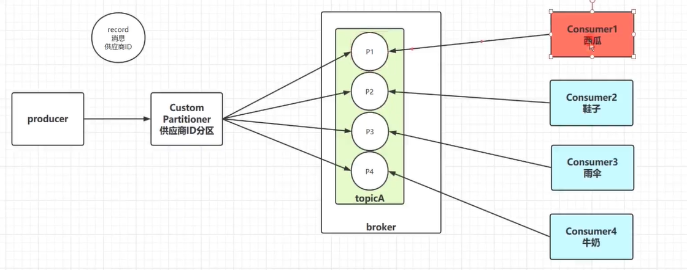

***

## 第五章: Kafka 高级API

### Offset自动控制

Kafka消费者默认对于未订阅的topic的offset的时候，也就是系统并没有存储该消费者的消费分区的记录信息，默认Kafka消费者的默认首次消费策略：**latest**

auto.offset.reset=latest

* **earliest** - 自动将偏移量重置为最早的偏移量
* **latest** - 自动将偏移量重置为最新的偏移量
* **none** - 如果未找到消费者组的先前偏移量，则向消费者抛出异常

```markdown
假如有一个生产者product，一个消费者consumer01,此时product生产三条消息分别为：hello1、hello2、hello3，这时consumer01会消费这三条消息。
1、如果将auto.offset.reset=latest，这时再来一个消费者consumer02，product此时继续生产一条消息为：hello4，这时consumer02会从hello4开始消费，不会消费到hello1、hello2、hello3
2、如果将auto.offset.reset=earliest，这时再来一个消费者consumer02，product此时继续生产一条消息为：hello4，这时consumer02会消费到hello1、hello2、hello3、hello4
3、如果将auto.offset.reset=none，这时再来一个消费者consumer02，product此时继续生产一条消息为：hello4，这时consumer02会抛出异常
```

这些不同配置项在第一次启动消费者时决定在什么位置开始读，如果生产者继续发消息，那后续这些不同配置项的消费者后续消费都是一样效果的，只是对第一次启动消费者时从哪开始消费有效。

关键代码：

```java
props.put(ConsumerConfig.AUTO_OFFSET_RESET_CONFIG,"earliest");
```

Kafka消费者在消费数据的时候默认会定期的提交消费的偏移量，这样就可以保证所有的消息至少可以被消费者消费1次,用户可以通过以下两个参数配置：

enable.auto.commit = true  默认
auto.commit.interval.ms = 5000默认

关键代码：

```java
//十秒钟自动提交offset
props.put(ConsumerConfig.AUTO_COMMIT_INTERVAL_MS_CONFIG,10000);
props.put(ConsumerConfig.AUTO_OFFSET_RESET_CONFIG,"earliest");
```

`启动消费者可以消费到之前的信息，然后十秒内关闭消费者，再重新启动消费者又消费了和刚才一样的消息；此时等待超过十秒这时会自动提交offset，这时关闭消费者再次启动后不会消费到刚才的记录`

### Offset手动提交

如果用户需要自己管理offset的自动提交，可以关闭offset的自动提交，手动管理offset提交的偏移量，注意用户提交的offset偏移量永远都要比本次消费的偏移量+1，因为提交的offset是kafka消费者下一次抓取数据的位置。

> 手动提交代码

```java
public class KafkaConsumerDemo_02 {
    public static void main(String[] args) {
        //1.创建Kafka链接参数
        Properties props=new Properties();
        props.put(ConsumerConfig.BOOTSTRAP_SERVERS_CONFIG,"bhz12:9092,bhz13:9092,bhz14:9092");
        props.put(ConsumerConfig.KEY_DESERIALIZER_CLASS_CONFIG, StringDeserializer.class.getName());
        props.put(ConsumerConfig.VALUE_DESERIALIZER_CLASS_CONFIG,StringDeserializer.class.getName());
        props.put(ConsumerConfig.GROUP_ID_CONFIG,"group02");
        props.put(ConsumerConfig.ENABLE_AUTO_COMMIT_CONFIG,false);

        //2.创建Topic消费者
        KafkaConsumer<String,String> consumer=new KafkaConsumer<String, String>(props);
        consumer.subscribe(Arrays.asList("topic01"));

        while (true){
            ConsumerRecords<String, String> consumerRecords = consumer.poll(Duration.ofSeconds(1));
            Iterator<ConsumerRecord<String, String>> recordIterator = consumerRecords.iterator();
            while (recordIterator.hasNext()){
                ConsumerRecord<String, String> record = recordIterator.next();
                String key = record.key();
                String value = record.value();
                long offset = record.offset();
                int partition = record.partition();
                //记录分区的消费元数据信息
                Map<TopicPartition, OffsetAndMetadata> offsets=new HashMap<TopicPartition, OffsetAndMetadata>();

                //记录消费分区的偏移量元数据，一定在提交的时候偏移量信息offset+1
                offsets.put(new TopicPartition(record.topic(),partition),new OffsetAndMetadata(offset));
                //异步提交消费者偏移量
                consumer.commitAsync(offsets, new OffsetCommitCallback() {
                    @Override
                    public void onComplete(Map<TopicPartition, OffsetAndMetadata> offsets, Exception exception) {
                        System.out.println("完成："+offset+"提交！");
                    }
                });
                System.out.println("key:"+key+",value:"+value+",partition:"+partition+",offset:"+offset);

            }
        }
    }
}

```

### Acks & Retries

Kafka生产者在发送完一个的消息之后，要求Leader所在的Broker在规定的额时间Ack应答，如果没有在规定时间内应答，Kafka生产者会尝试n次重新发送消息。

 默认 acks=1

* **acks=1** - Leader会将Record写到其本地日志中，但会在不等待所有Follower的完全确认的情况下做出响应。在这种情况下，如果Leader在确认记录后立即失败，但在Follower复制记录之前失败，则记录将丢失。（**为什么kafka存在数据写会丢失的原因**）

* **acks=0** - 生产者根本不会等待服务器的任何确认。该记录将立即添加到套接字缓冲区中并视为已发送。在这种情况下，不能保证服务器已收到记录。

* **acks=all** - 这意味着Leader将等待全套同步副本确认记录。这保证了只要至少一个同步副本仍处于活动状态，记录就不会丢失。这是最有力的保证。这等效于acks = -1设置。

如果生产者在规定的时间内，并没有得到Kafka的Leader的Ack应答，Kafka可以开启reties机制。

request.timeout.ms = 30000  默认
retries = 2147483647 默认

```java
public class KafkaProducerDemo_01{
    public static void main(String[] args) {
        //1.创建链接参数
        Properties props=new Properties();
        props.put(ProducerConfig.BOOTSTRAP_SERVERS_CONFIG,"CentOSA:9092,CentOSB:9092,CentOSC:9092");
        props.put(ProducerConfig.KEY_SERIALIZER_CLASS_CONFIG, StringSerializer.class.getName());
        props.put(ProducerConfig.VALUE_SERIALIZER_CLASS_CONFIG,StringSerializer.class.getName());
        props.put(ProducerConfig.INTERCEPTOR_CLASSES_CONFIG,UserDefineProducerInterceptor.class.getName());
        //将检测超时的时间设置为1ms
        props.put(ProducerConfig.REQUEST_TIMEOUT_MS_CONFIG,1);
        //设置kafka Acks acks=all意味着Leader将等待全套同步副本确认记录。这保证了只要至少一个同步副本仍处于活动状态，
        //记录就不会丢失。这是最有力的保证。这等效于acks = -1设置
        props.put(ProducerConfig.ACKS_CONFIG,"-1");
        //设置重试次数
        props.put(ProducerConfig.RETRIES_CONFIG,10);
        //2.创建生产者
        KafkaProducer<String,String> producer=new KafkaProducer<String, String>(props);
        //3.封装消息队列
        for(Integer i=0;i< 1;i++){
            ProducerRecord<String, String> record = new ProducerRecord<>("topic01", "key" + i, "value" + i);
            producer.send(record);
        }
        producer.close();
    }
}
```

### 幂等性

HTTP/1.1中对幂等性的定义是：**一次和多次请求某一个资源对于资源本身应该具有同样的结果（网络超时等问题除外）。也就是说，其任意多次执行对资源本身所产生的影响均与一次执行的影响相同。**

Kafka在0.11.0.0版本支持增加了对幂等的支持。幂等是针对生产者角度的特性。幂等可以保证上生产者发送的消息，不会丢失，而且不会重复。实现幂等的关键点就是服务端可以区分请求是否重复，过滤掉重复的请求。要区分请求是否重复的有两点：

唯一标识：要想区分请求是否重复，请求中就得有唯一标识。例如支付请求中，订单号就是唯一标识

记录下已处理过的请求标识：光有唯一标识还不够，还需要记录下那些请求是已经处理过的，这样当收到新的请求时，用新请求中的标识和处理记录进行比较，如果处理记录中有相同的标识，说明是重复记录，拒绝掉。

幂等又称为exactly once。要停止多次处理消息，必须仅将其持久化到Kafka Topic中仅仅一次。在初始化期间，kafka会给生产者生成一个唯一的ID称为Producer ID或PID。

PID和序列号与消息捆绑在一起，然后发送给Broker。由于序列号从零开始并且单调递增，因此，仅当消息的序列号比该PID / TopicPartition对中最后提交的消息正好大1时，Broker才会接受该消息。如果不是这种情况，则Broker认定是生产者重新发送该消息。

enable.idempotence= false 默认（默认关闭幂等）

注意:在使用幂等性的时候，要求必须开启retries=true和acks=all

### Kafka整合SpringBoot

#### kafka-producer

> pom.xml

```xml
<project xmlns="http://maven.apache.org/POM/4.0.0" xmlns:xsi="http://www.w3.org/2001/XMLSchema-instance" xsi:schemaLocation="http://maven.apache.org/POM/4.0.0 http://maven.apache.org/xsd/maven-4.0.0.xsd">
  	<modelVersion>4.0.0</modelVersion>
  	<groupId>com.bfxy</groupId>
  	<artifactId>kafka-producer</artifactId>
  	<version>0.0.1-SNAPSHOT</version>
	<parent>
		<groupId>org.springframework.boot</groupId>
		<artifactId>spring-boot-starter-parent</artifactId>
		<version>2.1.5.RELEASE</version>
		<relativePath/> <!-- lookup parent from repository -->
	</parent>  	
	
	<properties>
		<project.build.sourceEncoding>UTF-8</project.build.sourceEncoding>
		<project.reporting.outputEncoding>UTF-8</project.reporting.outputEncoding>
		<java.version>1.8</java.version>
	</properties>
	
	<dependencies>
		<dependency>
			<groupId>org.springframework.boot</groupId>
			<artifactId>spring-boot-starter</artifactId>
		</dependency>
		<dependency>
			<groupId>org.springframework.boot</groupId>
			<artifactId>spring-boot-starter-web</artifactId>
		</dependency> 				
		<dependency>
			<groupId>org.springframework.boot</groupId>
			<artifactId>spring-boot-starter-test</artifactId>
			<scope>test</scope>
		</dependency>
      	<dependency>
          	<groupId>org.projectlombok</groupId>
          	<artifactId>lombok</artifactId>
      	</dependency> 		
		<dependency>
		    <groupId>org.springframework.kafka</groupId>
		    <artifactId>spring-kafka</artifactId>
		</dependency>
	</dependencies>	
	
</project>
```

> application.properties

```properties
server.servlet.context-path=/producer
server.port=8001

## Spring 整合 kafka
spring.kafka.bootstrap-servers=192.168.10.12:9092
## kafka producer 发送消息失败时的一个重试的次数
spring.kafka.producer.retries=0
## 批量发送数据的配置 
spring.kafka.producer.batch-size=16384
## 设置kafka 生产者内存缓存区的大小（32M）
spring.kafka.producer.buffer-memory=33554432
## kafka消息的序列化配置
spring.kafka.producer.key-serializer=org.apache.kafka.common.serialization.StringSerializer
spring.kafka.producer.value-serializer=org.apache.kafka.common.serialization.StringSerializer

# acks=0 ： 生产者在成功写入消息之前不会等待任何来自服务器的响应。
# acks=1 ： 只要集群的首领节点收到消息，生产者就会收到一个来自服务器成功响应。
# acks=-1: 表示分区leader必须等待消息被成功写入到所有的ISR副本(同步副本)中才认为producer请求成功。这种方案提供最高的消息持久性保证，但是理论上吞吐率也是最差的。

## 	这个是kafka生产端最重要的选项
spring.kafka.producer.acks=1
```

```java
@Slf4j
@Component
public class KafkaProducerService {
	@Autowired
	private KafkaTemplate<String, Object> kafkaTemplate;
	public void sendMessage(String topic, Object object) {
		ListenableFuture<SendResult<String, Object>> future = kafkaTemplate.send(topic, object);
		future.addCallback(new ListenableFutureCallback<SendResult<String, Object>>() {
			@Override
			public void onSuccess(SendResult<String, Object> result) {
				log.info("发送消息成功: " + result.toString());
			}
			@Override
			public void onFailure(Throwable throwable) {
				log.error("发送消息失败: " + throwable.getMessage());
			}
		});
	}
}
```

```java
@SpringBootApplication
public class Application {
	public static void main(String[] args) {
		SpringApplication.run(Application.class, args);
	}
}
```

测试类：

```java
@RunWith(SpringRunner.class)
@SpringBootTest
public class ApplicationTests {
	@Autowired
	private KafkaProducerService kafkaProducerService;
	@Test
	public void send() throws InterruptedException {
		String topic = "topic02";
		for(int i=0; i < 1000; i ++) {
			kafkaProducerService.sendMessage(topic, "hello kafka" + i);
			Thread.sleep(5);
		}
		Thread.sleep(Integer.MAX_VALUE);
	}	
}
```

#### kafka-consumer

> pom.xml

```xml
<project xmlns="http://maven.apache.org/POM/4.0.0" xmlns:xsi="http://www.w3.org/2001/XMLSchema-instance" xsi:schemaLocation="http://maven.apache.org/POM/4.0.0 http://maven.apache.org/xsd/maven-4.0.0.xsd">
  	<modelVersion>4.0.0</modelVersion>
  	<groupId>com.bfxy</groupId>
  	<artifactId>kafka-consumer</artifactId>
  	<version>0.0.1-SNAPSHOT</version>
	<parent>
		<groupId>org.springframework.boot</groupId>
		<artifactId>spring-boot-starter-parent</artifactId>
		<version>2.1.5.RELEASE</version>
		<relativePath/> <!-- lookup parent from repository -->
	</parent>  	
	
	<properties>
		<project.build.sourceEncoding>UTF-8</project.build.sourceEncoding>
		<project.reporting.outputEncoding>UTF-8</project.reporting.outputEncoding>
		<java.version>1.8</java.version>
	</properties>
	
	<dependencies>
		<dependency>
			<groupId>org.springframework.boot</groupId>
			<artifactId>spring-boot-starter</artifactId>
		</dependency>
		<dependency>
			<groupId>org.springframework.boot</groupId>
			<artifactId>spring-boot-starter-web</artifactId>
		</dependency> 				
		<dependency>
			<groupId>org.springframework.boot</groupId>
			<artifactId>spring-boot-starter-test</artifactId>
			<scope>test</scope>
		</dependency>
      	<dependency>
          	<groupId>org.projectlombok</groupId>
          	<artifactId>lombok</artifactId>
      	</dependency> 		
		<dependency>
		    <groupId>org.springframework.kafka</groupId>
		    <artifactId>spring-kafka</artifactId>
		</dependency>
	</dependencies>	
	
</project>
```

> application.properties

```properties
server.servlet.context-path=/consumser
server.port=8002
spring.kafka.bootstrap-servers=192.168.10.12:9092
## consumer 消息的签收机制：手工签收
spring.kafka.consumer.enable-auto-commit=false
spring.kafka.listener.ack-mode=manual
# 该属性指定了消费者在读取一个没有偏移量的分区或者偏移量无效的情况下该作何处理：
# latest（默认值）在偏移量无效的情况下，消费者将从最新的记录开始读取数据（在消费者启动之后生成的记录）
# earliest ：在偏移量无效的情况下，消费者将从起始位置读取分区的记录
spring.kafka.consumer.auto-offset-reset=earliest
## 序列化配置
spring.kafka.consumer.key-deserializer=org.apache.kafka.common.serialization.StringDeserializer
spring.kafka.consumer.value-deserializer=org.apache.kafka.common.serialization.StringDeserializer
spring.kafka.listener.concurrency=5
```

```java
@Slf4j
@Component
public class KafkaConsumerService {

	@KafkaListener(groupId = "group02", topics = "topic02")
	public void onMessage(ConsumerRecord<String, Object> record, Acknowledgment acknowledgment, Consumer<?, ?> consumer) {
		log.info("消费端接收消息: {}", record.value());
		//	收工签收机制
		acknowledgment.acknowledge();
	}
}
```

## 第六章: Kafka海量日志收集系统实战

> 海量日志收集架构设计：

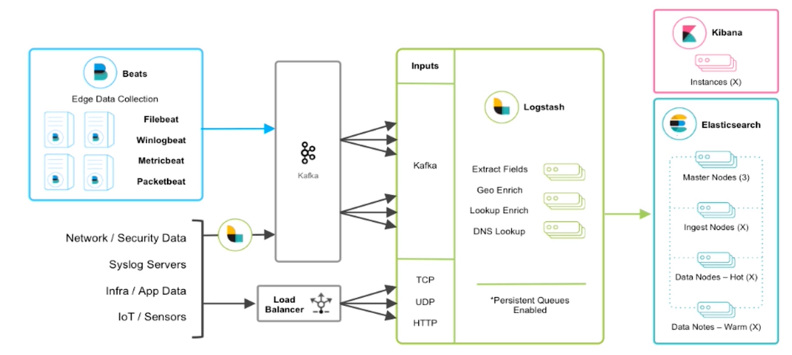


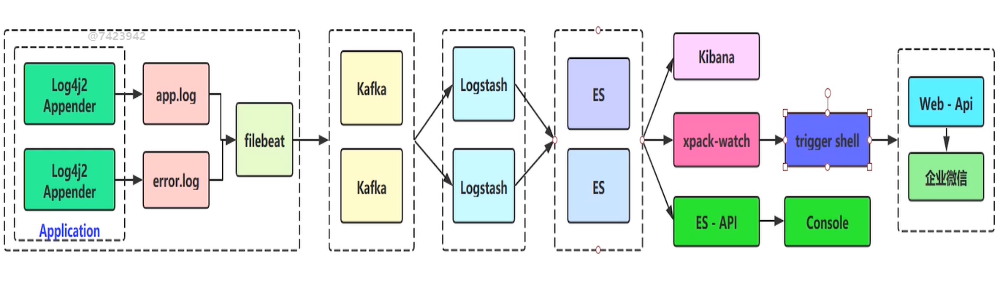

> log4j2日志输出实战

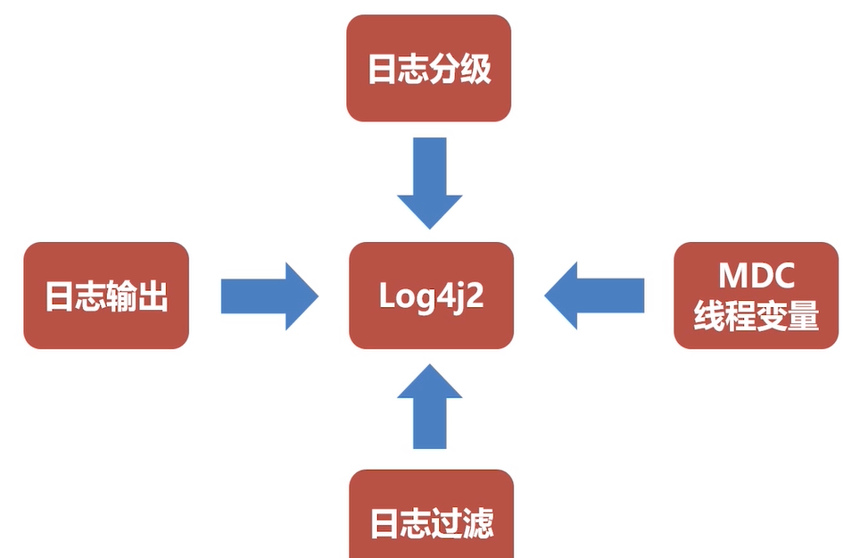


> FileBeat日志收集

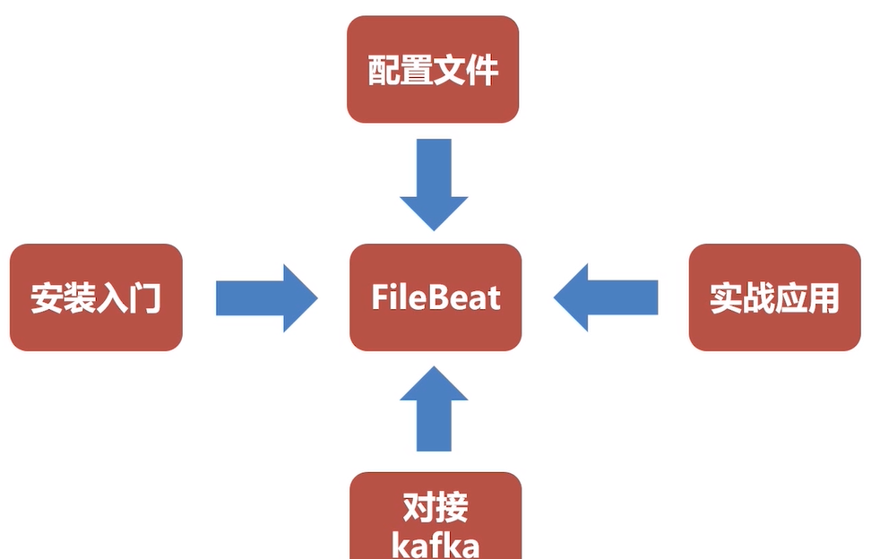


https://www.cnblogs.com/zsql/p/13137833.html

### filebeat和beats的关系

首先filebeat是Beats中的一员。
　　Beats在是一个轻量级日志采集器，其实Beats家族有6个成员，早期的ELK架构中使用Logstash收集、解析日志，但是Logstash对内存、cpu、io等资源消耗比较高。相比Logstash，Beats所占系统的CPU和内存几乎可以忽略不计。
目前Beats包含六种工具：

- Packetbeat：网络数据（收集网络流量数据）
- Metricbeat：指标（收集系统、进程和文件系统级别的CPU和内存使用情况等数据）
- Filebeat：日志文件（收集文件数据）
- Winlogbeat：windows事件日志（收集Windows事件日志数据）
- Auditbeat：审计数据（收集审计日志）
- Heartbeat：运行时间监控（收集系统运行时的数据）

### filebeat是什么

Filebeat是用于转发和集中日志数据的轻量级传送工具。Filebeat监视您指定的日志文件或位置，收集日志事件，并将它们转发到Elasticsearch或 Logstash进行索引。

　　Filebeat的工作方式如下：启动Filebeat时，它将启动一个或多个输入，这些输入将在为日志数据指定的位置中查找。对于Filebeat所找到的每个日志，Filebeat都会启动收集器。每个收集器都读取单个日志以获取新内容，并将新日志数据发送到libbeat，libbeat将聚集事件，并将聚集的数据发送到为Filebeat配置的输出。

​    工作的流程图如下：

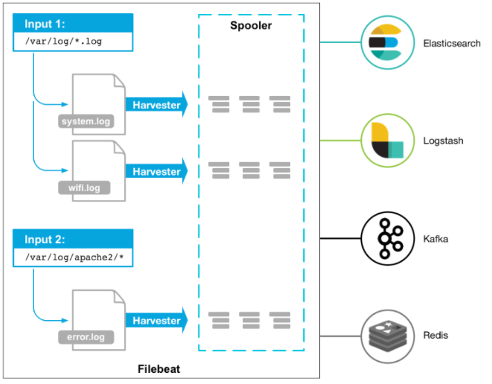


### filebeat和logstash的关系

因为logstash是jvm跑的，资源消耗比较大，所以后来作者又用golang写了一个功能较少但是资源消耗也小的轻量级的logstash-forwarder。不过作者只是一个人，加入http://elastic.co公司以后，因为es公司本身还收购了另一个开源项目packetbeat，而这个项目专门就是用golang的，有整个团队，所以es公司干脆把logstash-forwarder的开发工作也合并到同一个golang团队来搞，于是新的项目就叫filebeat了。

### filebeat的原理是什么

#### filebeat的构成

filebeat结构：由两个组件构成，分别是inputs（输入）和harvesters（收集器），这些组件一起工作来跟踪文件并将事件数据发送到您指定的输出，harvester负责读取单个文件的内容。harvester逐行读取每个文件，并将内容发送到输出。为每个文件启动一个harvester。harvester负责打开和关闭文件，这意味着文件描述符在harvester运行时保持打开状态。如果在收集文件时删除或重命名文件，Filebeat将继续读取该文件。这样做的副作用是，磁盘上的空间一直保留到harvester关闭。默认情况下，Filebeat保持文件打开，直到达到close_inactive

关闭harvester可以会产生的结果：

- 文件处理程序关闭，如果harvester仍在读取文件时被删除，则释放底层资源。
- 只有在scan_frequency结束之后，才会再次启动文件的收集。
- 如果该文件在harvester关闭时被移动或删除，该文件的收集将不会继续

　　一个input负责管理harvesters和寻找所有来源读取。如果input类型是log，则input将查找驱动器上与定义的路径匹配的所有文件，并为每个文件启动一个harvester。每个input在它自己的Go进程中运行，Filebeat当前支持多种输入类型。每个输入类型可以定义多次。日志输入检查每个文件，以查看是否需要启动harvester、是否已经在运行harvester或是否可以忽略该文件

#### filebeat如何保存文件的状态

Filebeat保留每个文件的状态，并经常将状态刷新到磁盘中的注册表文件中。该状态用于记住harvester读取的最后一个偏移量，并确保发送所有日志行。如果无法访问输出（如Elasticsearch或Logstash），Filebeat将跟踪最后发送的行，并在输出再次可用时继续读取文件。当Filebeat运行时，每个输入的状态信息也保存在内存中。当Filebeat重新启动时，来自注册表文件的数据用于重建状态，Filebeat在最后一个已知位置继续每个harvester。对于每个输入，Filebeat都会保留它找到的每个文件的状态。由于文件可以重命名或移动，文件名和路径不足以标识文件。对于每个文件，Filebeat存储唯一的标识符，以检测文件是否以前被捕获。

#### filebeat如何保证至少一次数据消费

Filebeat保证事件将至少传递到配置的输出一次，并且不会丢失数据。是因为它将每个事件的传递状态存储在注册表文件中。在已定义的输出被阻止且未确认所有事件的情况下，Filebeat将继续尝试发送事件，直到输出确认已接收到事件为止。如果Filebeat在发送事件的过程中关闭，它不会等待输出确认所有事件后再关闭。当Filebeat重新启动时，将再次将Filebeat关闭前未确认的所有事件发送到输出。这样可以确保每个事件至少发送一次，但最终可能会有重复的事件发送到输出。通过设置shutdown_timeout选项，可以将Filebeat配置为在关机前等待特定时间

### 安装filebeat

安装到192.168.10.12服务器，安装过程略

filebeat.yml文件解读

```markdown
###################### Filebeat Configuration Example #########################
filebeat.prospectors:

- input_type: log

  paths:
    ## app-服务名称.log, 为什么写死，防止发生轮转抓取历史数据
    - /usr/local/logs/app-collector.log
  #定义写入 ES 时的 _type 值
  document_type: "app-log"
  multiline:
    #pattern: '^\s*(\d{4}|\d{2})\-(\d{2}|[a-zA-Z]{3})\-(\d{2}|\d{4})'   # 指定匹配的表达式（匹配以 2017-11-15 08:04:23:889 时间格式开头的字
符串）
    pattern: '^\['                              # 指定匹配的表达式（匹配以 "{ 开头的字符串）
    negate: true                                # 是否匹配到
    match: after                                # 合并到上一行的末尾
    max_lines: 2000                             # 最大的行数
    timeout: 2s                                 # 如果在规定时间没有新的日志事件就不等待后面的日志
  fields:
    logbiz: collector
    logtopic: app-log-collector   ## 按服务划分用作kafka topic
    evn: dev

- input_type: log

  paths:
    - /usr/local/logs/error-collector.log
  document_type: "error-log"
  multiline:
    #pattern: '^\s*(\d{4}|\d{2})\-(\d{2}|[a-zA-Z]{3})\-(\d{2}|\d{4})'   # 指定匹配的表达式（匹配以 2017-11-15 08:04:23:889 时间格式开头的字
符串）
    pattern: '^\['                              # 指定匹配的表达式（匹配以 "{ 开头的字符串）
    negate: true                                # 是否匹配到
    match: after                                # 合并到上一行的末尾
    max_lines: 2000                             # 最大的行数
    timeout: 2s                                 # 如果在规定时间没有新的日志事件就不等待后面的日志
  fields:
    logbiz: collector
    logtopic: error-log-collector   ## 按服务划分用作kafka topic
    evn: dev

output.kafka: # 抓取到kafka，也可以直接抓取到elasticsearch
  enabled: true
  hosts: ["192.168.10.12:9092"]
  topic: '%{[fields.logtopic]}'
  partition.hash:
    reachable_only: true
  compression: gzip
  max_message_bytes: 1000000
  required_acks: 1  #0:不做任何保障;1:有一个节点存储了就返回ACK;-1:所有副本都写入才返回ACK;
logging.to_files: true

```

### 启动filebeat

```markdown
[root@bhz12 filebeat-6.6.0]# pwd
/usr/local/filebeat-6.6.0
[root@bhz12 filebeat-6.6.0]# /usr/local/filebeat-6.6.0/filebeat &
[1] 8916
[root@bhz12 filebeat-6.6.0]# ps -ef | grep filebeat
root      8916  4605  0 13:29 pts/2    00:00:00 /usr/local/filebeat-6.6.0/filebeat
root      8957  4605  0 13:30 pts/2    00:00:00 grep --color=auto filebeat
[root@bhz12 filebeat-6.6.0]# 
```

### 搭建Logstash环境


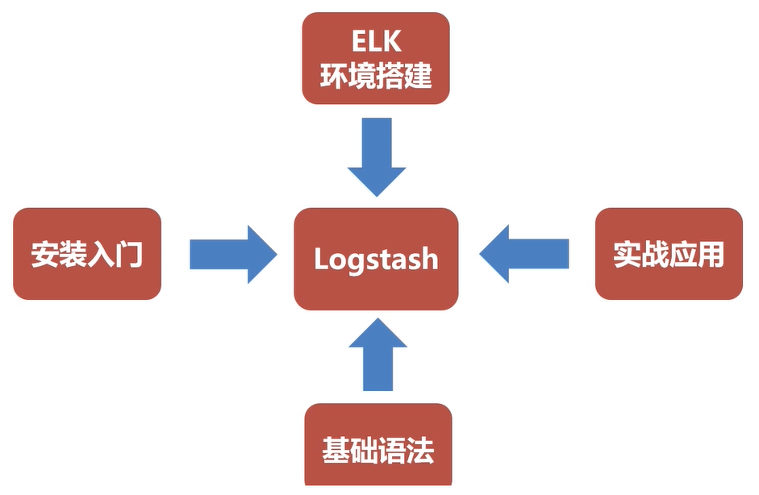

filebeat将日志保存到kafka中，Logstash充当kafka的消费者

### 安装Logstash

安装在192.168.10.13服务器上


