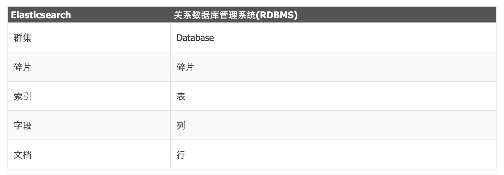

> 优秀博客：https://blog.csdn.net/Franklin7B/article/details/132714901
>
> 优秀博客（ES 8.0整合SpringBoot操作）：https://blog.csdn.net/qq_50864152/article/details/136736296
>
> 博客（ES 8.0整合SpringBoot操作）：https://www.cnblogs.com/yayuya/p/17217175.html
>
> 进阶案例：https://blog.csdn.net/letere/article/details/136234519

> API ES 查询博客：https://blog.csdn.net/mijichui2153/article/details/106920402

# Elasticsearch

## 1 Elasticsearch是什么？

Elasticsearch（简称ES）是一个分布式、可扩展、实时的搜索与数据分析引擎。ES不仅仅只是全文搜索，还支持结构化搜索、数据分析、复杂的语言处理、地理位置和对象间关联关系等。

ES的底层依赖Lucene，Lucene可以说是当下最先进、高性能、全功能的搜索引擎库。但是Lucene仅仅只是一个库。为了充分发挥其功能，你需要使用Java并将Lucene直接集成到应用程序中。更糟糕的是，您可能需要获得信息检索学位才能了解其工作原理，因为Lucene非常复杂。

鉴于Lucene如此强大却难以上手的特点，诞生了ES。ES也是使用Java编写的，它的内部使用Lucene做索引与搜索，它的目的是隐藏Lucene的复杂性，取而代之的提供一套简单一致的RESTful API。

**ES具有如下特点**：

- 一个分布式的实时文档存储引擎，每个字段都可以被索引与搜索
- 一个分布式实时分析搜索引擎，支持各种查询和聚合操作
- 能胜任上百个服务节点的扩展，并可以支持PB级别的结构化或者非结构化数据

***

## 2 ElasticSearch作用

### 2.1 关系型数据库有什么问题?

传统的关系数据库提供事务保证，具有不错的性能，高可靠性，久经历史考验，而且使用简单，功能强大，同时也积累了大量的成功案例。

后来，随着访问量的上升，几乎大部分使用 MySQL 架构的网站在数据库上都开始出现了性能问题，web 程序不再仅仅专注在功能上，同时也在追求性能。

**读写分离**
由于数据库的写入压力增加，读写集中在一个数据库上让数据库不堪重负，大部分网站开始使用主从复制技术来达到读写分离，以提高读写性能和读库的可扩展性。Mysql 的 master-slave 模式成为这个时候的网站标配了

**分表分库**
开始流行使用分表分库来缓解写压力和数据增长的扩展问题。这个时候，分表分库成了一个热门技术，也是业界讨论的热门技术问题

**MySQL 的扩展性瓶颈**
大数据量高并发环境下的 MySQL 应用开发越来越复杂，也越来越具有技术挑战性。分表分库的规则把握都是需要经验的。虽然有像淘宝这样技术实力强大的公司开发了透明的中间件层来屏蔽开发者的复杂性，但是避免不了整个架构的复杂性。分库分表的子库到一定阶段又面临扩展问题。还有就是需求的变更，可能又需要一种新的分库方式

关系数据库很强大，但是它并不能很好的应付所有的应用场景。MySQL 的扩展性差（需要复杂的技术来实现），大数据下 IO 压力大，表结构更改困难，正是当前使用 MySQL 的开发人员面临的问题。

***

### 2.2 ElasticSearch有什么优势？

非关系型、搜索引擎、近实时搜索与分析、高可用、天然分布式、横向可扩展

### 2.3 ES使用场景

1. 搜索引擎
   电商网站的商品搜索、站内搜索、模糊查询、全文检索服务
2. 非关系型数据库
   业务宽表（数据库字段太多，查询太慢，索引没有办法再做优化）
   数据库做统计查询
3. 大数据近实时分析引擎
4. 日志分析

***

## 3 ElasticSearch概念

### 3.1 搜索引擎原理

一次完整的搜索从用户输入要查询的关键词开始，比如想查找 Lucene 的相关学习资料，我们都会在 Google 或百度等搜索引擎中输入关键词，比如输入“Lucene ，全文检索框架”，之后系统根据用户输入的关键词返回相关信息。一次检索大致可分为四步：

**第一步：查询分析**
正常情况下用户输入正确的查询，比如搜索“里约奥运会”这个关键词，用户输入正确完成一次搜索，但是搜索通常都是全开放的，任何的用户输入都是有可能的，很大一部分还是非常口语化和个性化的，有时候还会存在拼写错误，用户不小心把“淘宝”打成“涛宝”，这时候需要用自然语言处理技术来做拼写纠错等处理，以正确理解用户需求。

**第二步：分词技术**
这一步利用自然语言处理技术将用户输入的查询语句进行分词，如标准分词会把“lucene全文检索框架”分成 lucene | 全 | 文｜检｜索｜框｜架｜， IK分词会分成： lucene｜全文｜检索｜框架｜,还有简单分词等多种分词方法。

**第三步：关键词检索**
提交关键词后在倒排索引库中进行匹配，倒排索引就是关键词和文档之间的对应关系，就像给文档贴上标签。比如在文档集中含有 "lucene" 关键词的有文档1 、文档 6、文档9，含有 "全文检索" 关键词的有文档1 、文档6 那么做与运算，同时含有 "lucene" 和 "全文检索" 的文档就是文档1和文档6，在实际的搜索中会有更复杂的文档匹配模型。

**第四步：搜索排序**
对多个相关文档进行相关度计算、排序，返回给用户检索结果。

***

### 3.2 Lucene 倒排索引核心原理

Lucene 是一个成熟的权威检索库，具有高性能、可伸缩的特点，并且开源、免费。在其基础上开发的分布式搜索引擎便是 Elasticsearch。

Elasticsearch 的搜索原理简单过程是，索引系统通过扫描文章中的每一个词，对其创建索引，指明在文章中出现的次数和位置，当用户查询时，索引系统就会根据事先的索引进行查找，并将查找的结果反馈给用户的检索方式。

***

### 3.3 倒排索引

倒排索引是整个 ES 的核心，正常的搜索以一本书为例，应该是由 “目录 -> 章节 -> 页码 -> 内容” 这样的查找顺序，这样是正排索引的思想。

但是设想一下，我在一本书中快速查找 “elasticsearch” 这个关键字所在的页面该怎么办？

倒排索引的思路是通过单词到文档ID的关系对应。

***

## 4 Elasticsearch 整体架构

### 4.1 术语

**Document**：文档，指一行数据；
**Index**：索引，是多个document的集合（和sql数据库的表对应）；
**Shard**：分片，当有大量的文档时，由于内存的限制、磁盘处理能力不足、无法足够快的响应客户端的请求等，一个节点可能不够。这种情况下，数据可以分为较小的分片。每个分片放到不同的服务器上。
当你查询的索引分布在多个分片上时，ES会把查询发送给每个相关的分片，并将结果组合在一起，而应用程序并不知道分片的存在。即：这个过程对用户来说是透明的
**Replica**：副本，为提高查询吞吐量或实现高可用性，可以使用分片副本。
副本是一个分片的精确复制，每个分片可以有零个或多个副本。ES中可以有许多相同的分片，其中之一被选择更改索引操作，这种特殊的分片称为主分片。
当主分片丢失时，如：该分片所在的数据不可用时，集群将副本提升为新的主分片。
**Node**：节点，形成集群的每个服务器称为节点，一个节点可以包含多个shard
**Cluster**：集群，ES可以作为一个独立的单个搜索服务器。不过，为了处理大型数据集，实现容错和高可用性，ES可以运行在许多互相合作的服务器上。这些服务器的集合称为集群。

***

分片与副本的关系：

假如没有集群只有一个shard对外提供服务，一个shard保存了全部的数据。为了提高并发访问量，shard做成集群。这样全部数据分散保存到三个shard中（三个shard数据加起来就是完整数据）。假如其中一个shard宕机了，那么完整数据就少了三分之一了，这样就不能对外提供完整服务了，就出现了replica，一个replica就是一个shard备份，假如其中一个shard宕机了，它的replica副本就会晋升为主分片继续对外提供服务。这样整体又能对外提供完整服务了。（下图就是6台服务器节点）

# logstash

> 官网下载地址：https://www.elastic.co/cn/downloads/past-releases#logstash
>
> 注：logstash版本号需要与es版本号保持一致
>
> 优秀博客：https://blog.csdn.net/zjcjava/article/details/99258682?spm=1001.2101.3001.6650.4&utm_medium=distribute.pc_relevant.none-task-blog-2%7Edefault%7Ebaidujs_baidulandingword%7ECtr-4-99258682-blog-127319892.235%5Ev43%5Epc_blog_bottom_relevance_base7&depth_1-utm_source=distribute.pc_relevant.none-task-blog-2%7Edefault%7Ebaidujs_baidulandingword%7ECtr-4-99258682-blog-127319892.235%5Ev43%5Epc_blog_bottom_relevance_base7&utm_relevant_index=9

logstash是一种分布式日志收集框架，开发语言是JRuby，当然是为了与Java平台对接，不过与Ruby语法兼容良好，非常简洁强大，经常与ElasticSearch，Kibana配置，组成著名的ELK技术栈，非常适合用来做日志数据的分析。

当然它可以单独出现，作为日志收集软件，你可以收集日志到多种存储系统或临时中转系统，如MySQL，Redis，Kakfa，HDFS, Lucene，Solr等，并不一定是ElasticSearch。

## 1 Logstash安装

## 2 Logstash原理

Logstash 事件处理管道有三个阶段：`输入 → 过滤器 → 输出`。

inputs 模块负责收集数据，filters 模块可以对收集到的数据进行格式化、过滤、简单的数据处理，outputs 模块负责将数据同步到目的地，Logstash的处理流程，就像管道一样，数据从管道的一端，流向另外一端。

inputs 和 outputs 支持编解码器，使您能够在数据进入或离开管道时对数据进行编码或解码，而无需使用单独的过滤器。

> 提示：**inputs/filters/outputs是通过插件机制扩展各种能力**。

**inputs**：inputs 可以收集多种数据源的数据，下面是常见的数据源：

- file：扫描磁盘中的文件数据，例如： 扫描日志文件。
- syslog：监听端口514以获取 syslog 消息，并根据 RFC3164 格式解析。
- mysql ：扫描 Mysql 的表数据
- redis：从 redis 服务器中读取数据，使用 redis 通道和 redis 列表。
  - Redis通常用作集中式 Logstash 安装中的“代理”，用于排队来自远程 Logstash “发件人”的 Logstash 事件
- Filebeat：轻量级的文件数据采集器，可以取代file的能力。
- 消息队列 kafka、rabbitmq 等：支持从各种消息队列读取数据。

**filters**：filters 是一个可选模块，可以在数据同步到目的地之前，对数据进行一些格式化、过滤、简单的数据处理操作。常用的filters功能：

- grok：logstash 中最常用的日志解释和结构化插件。
  - grok 是一种采用组合多个预定义的正则表达式，用来匹配分割文本并映射到关键字的工具。
- mutate ：支持事件的变换，例如重命名、移除、替换、修改等
- drop ：完全丢弃事件
- clone ：克隆事件
- geoip：添加关于 IP 地址的地理位置信息

**outputs**：Logstatsh的最后一个处理节点，outputs负责将数据同步到目的地。下面是常见的目的地：

- elasticsearch：将事件数据发送到Elasticsearch。
- file：将事件数据写入磁盘上的文件，也可以将数据同步到一个文件中。
- graphite：将事件数据发送到 Graphite，这是一个流行的用于存储和绘制度量指标的开源工具。
- statsd：将事件数据发送到 Statsd，这是一个“监听通过 UDP 发送的统计信息（如计数器和定时器）的服务，并将聚合数据发送到一个或多个可插拔的后端服务”的服务。

 **Codecs**：codecs 就是编码器，负责对数据进行序列号处理，主要就是 json 和文本两种编码器。

## 3 Logstash入门使用

### 3.1 Input 插件

## 4 Logstash高级使用

### 4.1 jdbc 插件

### 4.2 syslog 插件

### 4.3 filter 插件

### 4.4 Output 插件

***

# filebeat

> 博客：https://blog.csdn.net/weixin_53269650/article/details/139172686

## 为什么要用Filebeat？

当面对成百上千、甚至成千上万的[服务器](https://so.csdn.net/so/search?q=服务器&spm=1001.2101.3001.7020)、虚拟机和容器生成的日志时，Filebeat可以提供一种轻量型方法，用于转发和汇总日志与文件，关于Filebeat的记住以下两点：

- 轻量级日志采集器
- 输送至ElasticSearch或者Logstash，在Kibana中实现可视化

## 架构

用于监控、收集服务器日志文件.

流程如下：

- 首先是input输入，可以指定多个数据输入源，然后通过通配符进行日志文件的匹配
- 匹配到日志后，就会使用Harvester（收割机），将日志源源不断的读取到来
- 然后收割机收割到的日志，就传递到Spooler（卷轴），然后卷轴就在将他们传到对应的地方

***

如上图所示，我们可以直接把 [beats](https://www.elastic.co/products/beats) 里的数据直接传入到 Elasticsearch，也可以直接接入到 Logstash 之中。

数据采集流程：

- Beats 采集（Filebeat/Metricbeat）–> Elasticsearch –> Kibana
- Beats 采集（Filebeat/Metricbeat）–> Logstash –> Elasticsearch –> Kibana

既然 Beats 可以直接把数据直接写入到 Elasticsearch 之中，为什么我们还需要 Logstash 呢？这主要的原因是因为 Logstash 有丰富的 filter 供我们使用，可以帮我们加工数据，并最终把我们的数据转为我们喜欢的格式。Beats 在 ELK 中是一个非常轻量级的应用。是用 go 语言写的。它不需要有很强大的运行环境来运行。它通常运行于客户端中。

## 下载

官网下载地址：https://www.elastic.co/cn/downloads/beats/filebeat

***

## 1 filebeat基本概念

### 1.1 简介

> Filebeat 是一个轻量级的开源日志数据收集器，属于 Elastic 公司的 Beats 产品系列之一。它设计用于从各种来源收集日志数据，并将其传输到 Elasticsearch 或者 Logstash 等后端存储或处理系统中进行进一步的分析和可视化。

​         Filebeat 是一种轻量型日志采集器，内置有多种模块 (auditd、Apache、NGINX、System、MySQL 等等），可针对常见格式的日志大大简化收集、解析和可视化过程，只需一条命令即可。之所以能实现这一点，是因为它将自动默认路径（因操作系统而异）与 Elasticsearch采集节点管道的定义和 Kibana 仪表板组合在一起。不仅如此，数个Filebeat 模块还包括预配置的 Machine Learning 任务。另一点需要声明的是：根据采集的数据形式不同，形成了由多个模块组成的 Beats。 Beats 是开源数据传输程序集，可以将其作为代理安装在服务器上，将操作数据发送给 Elasticsearch，或者通过 Logstash，在Kibana 中可视化数据之前，在Logstash 中进一步处理和增强数据

### 1.2 filebeat特点

（1）轻量型日志采集器，占用资源更少，对机器配罝要求极低。

（2）操作简便，可将采集到的日志信息直接发送到ES 集群、Logstash、Kafka 集群等消息队列中。

（3）异常中断重启后会继续上次停止的位置。（通过＄{filebeat_home}\data\registry 文件来记录日志的偏移量）。

（4）使用压力敏感协议 (backpressure-sensitive）来传输数据，在logstash 忙的时候，Filebeat 会减慢读取-传输速度，一旦logstash 恢复，则 Filebeat 恢复原来的速度。

   (5）Filebeat 带有内部模块(auditd, Apache, Nginx, System 和 MysQL)，可通过一个指定命令来简化通用日志格式的收集，解析和可视化

### 1.3 Filebeat与logstash对比

filebeat与logstash对比

（1)   Filebeat 是轻量级数据托运者，您可以在服务器上将其作为代理安装，以将特定类型的操作数据发送到 Elasticsearch。 与 Logstash 相比，其占用空间小，使用的系统资源更少。

   (2）Logstash 具有更大的占用空间，但**提供了大量的输入，过滤和输出插件**，用于收集，丰富和转换来自各种来源的数据。

（3） Logstash 是使用 Java 编写，插件是使用 jruby 编写，对机器的资源要求会比较高。在采集日志方面，对 CPU、内存上都要比 Filebeat 高很多

**1. Filebeat：**

**轻量级和高效性：**Filebeat 是一个轻量级的数据收集器，具有低资源消耗和高效的性能。它设计用于从各种来源收集日志数据，并将其传输到 Elasticsearch 或者 Logstash 等后端存储或处理系统中进行进一步的分析和可视化。

**模块化配置：**Filebeat 提供了丰富的模块化配置选项，使用户可以轻松地配置和管理不同类型的数据收集任务，而无需编写复杂的配置文件。

**集成性：**Filebeat 与 Elastic Stack（ELK）紧密集成，可以直接将收集到的日志数据发送到 Elasticsearch 进行索引和分析，也可以与 Logstash 结合进行进一步的数据处理和转换。

**2. Logstash：**

**灵活性：**Logstash 是一个通用的数据收集和处理工具，具有强大的数据转换和丰富的插件生态系统，可以处理各种类型的数据和实现复杂的数据管道。

**数据转换：**Logstash 可以对收集到的数据进行灵活的转换和处理，包括解析、标准化、过滤、增强等操作，可以实现更多的数据处理需求。

**可扩展性：**Logstash 是一个高度可配置和可扩展的工具，支持自定义插件和过滤器，可以根据实际需求进行灵活的定制和扩展。

***

### 1.4 FileBeat在ELK中的角色 

> Filebeat 是 ELK（Elasticsearch、Logstash、Kibana）堆栈中的一个组件，用于从不同的日志文件位置收集数据并将其发送到 Logstash 或者 Elasticsearch 进行进一步处理和分析。它的主要角色是作为一个轻量级的日志收集器，专门负责从各种来源（如日志文件、系统日志等）收集日志数据，并将其传输到其他 ELK 组件进行处理。
>

Filebeat 的主要功能和角色包括：

1. **数据收集：**Filebeat 可以监视指定的日志文件、日志目录或者其他位置，并实时地收集其中的日志数据。
2. **数据传输：**收集到的日志数据被 Filebeat 发送到指定的目标，通常是 Logstash 或者直接发送到 Elasticsearch 进行索引。
3. **轻量级：**Filebeat 是一个轻量级的日志收集器，具有低内存消耗和低 CPU 占用的特点，适合于在各种环境中部署和运行。
4. **模块化配置：**Filebeat 提供了丰富的模块化配置选项，可以轻松地配置和管理不同类型日志数据的收集和传输。

总的来说，Filebeat 在 ELK 堆栈中扮演着数据收集和传输的角色，帮助用户将日志数据从各种来源收集起来，并将其传输到 ELK 的其他组件中进行存储、处理和分析。

### 1.5 FileBeat诞生背景 

Filebeat 的诞生背景可以追溯到 Elastic 公司为了解决日益增长的日志数据管理挑战而开发的需求。在大规模的分布式系统中，日志数据是非常重要的资源，可以帮助监控系统的运行状况、故障排除、安全审计等方面。然而，随着系统规模的增长和日志数据量的增加，传统的日志收集和分析工具面临着一些挑战，包括：

- **效率问题：**传统的日志收集工具可能存在性能瓶颈，无法有效地处理大规模的日志数据，导致数据丢失或延迟。
- **复杂性问题：**配置和管理大规模的日志收集和分析系统可能会非常复杂，需要大量的人力资源和技术支持。
- **可扩展性问题：**一些传统的日志管理工具可能无法轻松地扩展以应对不断增长的数据量和系统规模。

为了解决这些问题，Elastic 公司推出了 ELK 堆栈，其中包括 Elasticsearch、Logstash、Kibana 等组件，以提供一个完整的日志管理解决方案。而 Filebeat 则是 ELK 堆栈中的一个关键组件，专门负责从各种来源收集日志数据，并将其传输到其他 ELK 组件进行进一步处理和分析。Filebeat 的设计目标是轻量级、高效、易于部署和管理，以满足大规模分布式系统中日志数据收集的需求。

***

# ELK

> 优秀博客：https://blog.csdn.net/m0_51510236/article/details/130413227

**概述**

我们都知道，在生产环境中经常会遇到很多异常，报错信息，需要查看日志信息排查错误。现在的系统大多比较复杂，即使是一个服务背后也是一个集群的机器在运行，**如果逐台机器去查看日志显然是很费力的，也不现实**。

如果能把日志全部收集到一个平台，然后像百度，谷歌一样**通过关键字搜索出相关的日志**，岂不快哉。于是就有了**集中式日志系统**。ELK就是其中一款使用最多的开源产品。

0、beats :日志收集客户端
1、Logstash：日志收集服务端
2、Elasticsearch ：日志搜索引擎持久化
3、Kinaba ：数据分析工具

## **1 什么是ELK**

ELK其实是` Elasticsearch`，`Logstash` 和 `Kibana `三个产品的首字母缩写，这三款都是开源产品。

**ElasticSearch**(简称ES)，是一个实时的分布式搜索和分析引擎，它可以用于全文搜索，结构化搜索以及分析。

**Logstash**，是一个数据收集引擎，主要用于进行数据收集、解析，并将数据发送给ES。支持的数据源包括本地文件、ElasticSearch、MySQL、Kafka等等。

**Kibana**，为 Elasticsearch 提供了分析和 Web 可视化界面，并生成各种维度表格、图形。

## 2 kibana

