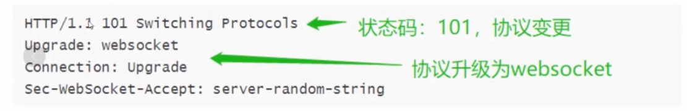

### 一、什么是Websocket
WebSocket 是一种在单个 TCP 连接上进行 **全双工** 通信的协议，它可以让客户端和服务器之间进行实时的双向通信。

WebSocket 使用一个长连接，在客户端和服务器之间保持持久的连接，从而可以实时地发送和接收数据。

在 WebSocket 中，客户端和服务器之间可以互相发送消息，客户端可以使用 JavaScript 中的 WebSocket API 发送消息到服务器，也可以接收服务器发送的消息。

### 二、Websocket特点

简单来说，websocket 具有 **双向通信，实时性强，支持二进制，控制开销** 的特点。

1、**协议标识符是`ws`（如果加密，则为`wss`），服务器网址就是 URL**。

2、**实时通信**，服务器可以随时主动给客户端下发数据。

3、**保持连接状态**，Websocket需要先创建连接，所以是一种有状态的协议，之后通信时就可以省略部分状态信息。

4、**控制开销**，连接创建后，服务器和客户端之间交换数据时，用于协议控制的数据包头部相对较小。在不包含扩展的情况下，对于服务器到客户端的内容，此头部大小只有2至10字节（和数据包长度有关）；对于客户端到服务器的内容，头部还需要加上额外的4字节的掩码。

5、**实现简单**，建立在 TCP 协议之上，服务器端的实现比较容易，并且没有同源限制，客户端可以与任意服务器通信。

6、**支持二进制传输**，Websocket定义了二进制帧，可以发送文本，也可以发送二进制数据。

7、**与 HTTP 协议有着良好的兼容性**。默认端口也是80和443，并且握手阶段采用 HTTP 协议，因此握手时不容易屏蔽，能通过各种 HTTP 代理服务器。

8、**支持扩展**，用户可以扩展协议、实现部分自定义的子协议，如部分浏览器支持压缩等。

***

### 三、WebSocket与HTTP的区别

websocket和http都是基于TCP的应用层协议，使用的也是 80 端口（若运行在 TLS 之上时，默认使用 443 端口）。

其**区别主要就在于连接的性质和通信方式**。

WebSocket是一种双向通信的协议，通过一次握手即可建立持久性的连接，服务器和客户端可以随时发送和接收数据。

而HTTP协议是一种请求-响应模式的协议，每次通信都需要发送一条请求并等待服务器的响应。

WebSocket的实时性更好，延迟更低，并且在服务器和客户端之间提供双向的即时通信能力，适用于需要实时数据传输的场景。

***

### 四、常见应用场景

1. **实时聊天**：WebSocket能够提供双向、实时的通信机制，使得实时聊天应用能够快速、高效地发送和接收消息，实现即时通信。
2. **实时协作**：用于实时协作工具，如协同编辑文档、白板绘画、团队任务管理等，团队成员可以实时地在同一页面上进行互动和实时更新。
3. **实时数据推送**：用于实时数据推送场景，如股票行情、新闻快讯、实时天气信息等，服务器可以实时将数据推送给客户端，确保数据的及时性和准确性。
4. **多人在线游戏**：实时的双向通信机制，适用于多人在线游戏应用，使得游戏服务器能够实时地将游戏状态和玩家行为传输给客户端，实现游戏的实时互动。
5. **在线客服**：WebSocket可以用于在线客服和客户支持系统，实现实时的客户沟通和问题解决，提供更好的用户体验，减少等待时间。

***

场景：用户扫码付款

问题：服务器无法直接向浏览器发送请求

场景替代方案：轮询

轮询缺陷：浪费带宽，实时性差，服务器压力大

***

### 五、通信流程

1. 浏览器发起http请求，请求建立WebSocket连接

2. 服务器响应同意协议更改

