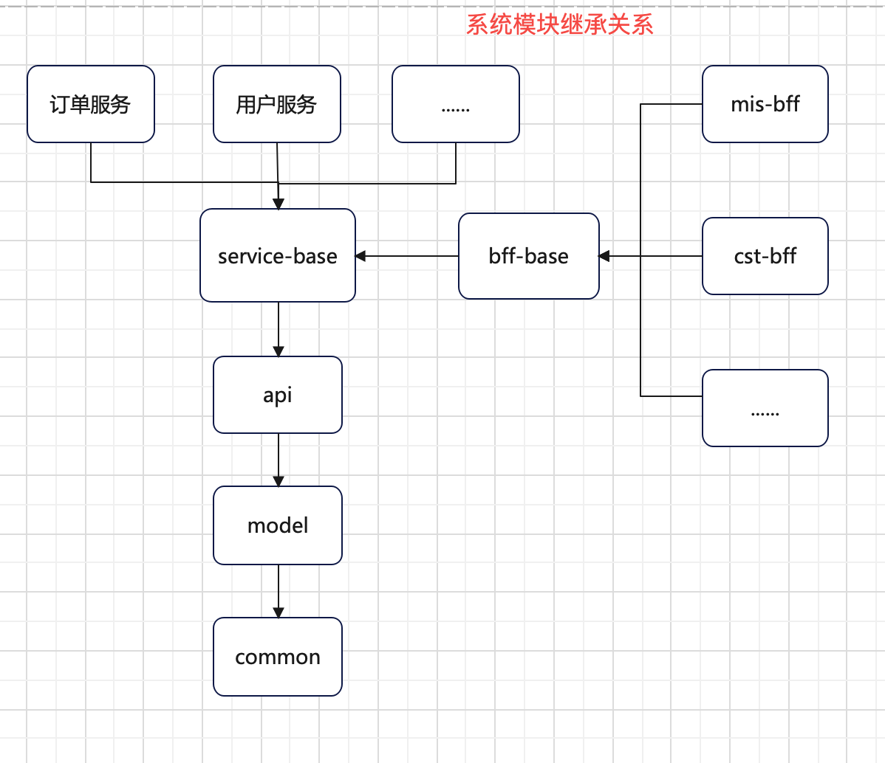

# 1 系统代码结构

```sh
# 项目名称
fs-dev
    # 网关服务(系统的统一入口)
    gateway
    # bff模块（与微服务进行交互，获取所需数据并整合返回给用户端）
    bff
        - bff-base # bff服务的基础依赖
        - customer
        - mis
        - ...
    # 微服务模块（提供具体的服务，如用户服务、订单服务、文件服务等）
    service
        - service-base # 微服务的基础依赖
        - cst
        - odr
        - pay
        - ...
    # api接口模块(管理全系统api，一目了然)
    api
    # 模型层（bo、vo、entity）
    model
    # 公共模块
    common
        - aspect      # 通用切面
        - constant    # 常量
        - enums       # 枚举
        - exception   # 系统异常
        - interceptor # 拦截器
        - result      # 响应前端实体类
        - util        # 工具类
    # 扩展模块（mybatis逆向工程、代码生成器等）
    eff
        - mybatis-generator
```

# 2 系统模块继承关系

> 项目模块之间有严格继承关系：
>
> ​	`common`作为最基础模块 
>
> ​	`model` 继承 `common`
>
> ​	`api` 继承 `model`
>
> ​    `service-base`、`bff-base` 继承 `api`
>
> ​    全部微服务继承 `service-base`
>
> ​    全部bff服务继承 `bff-base`




 


