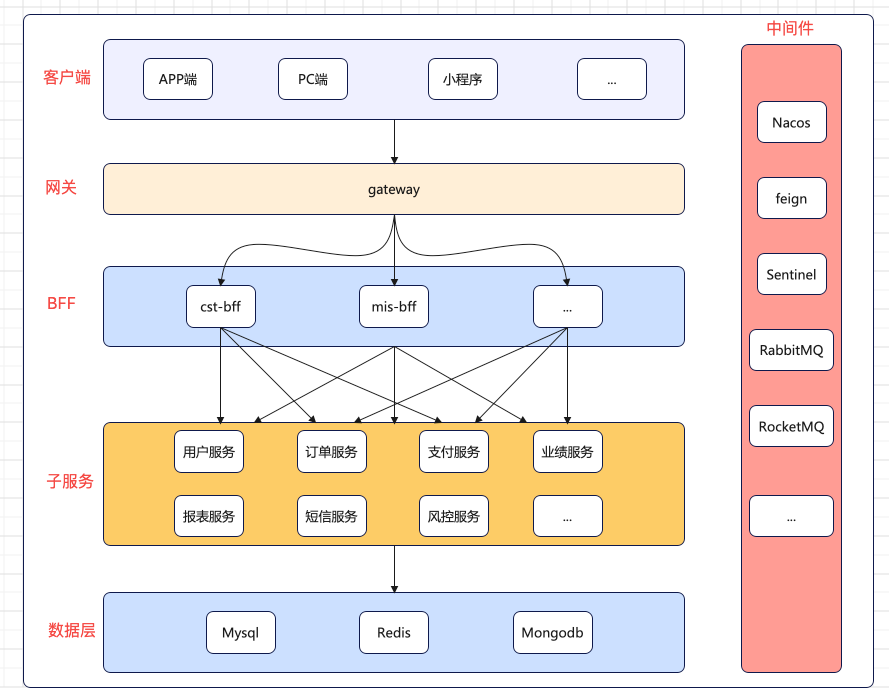
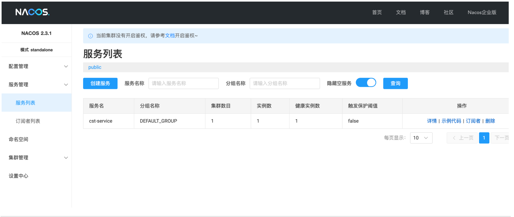

# 1 系统结构与技术栈

## 1.1 技术栈

| 技术         | 版本       | 功能          |
| ------------ | ---------- | ------------- |
| JDK          | 17         |               |
| Maven        | 3.3.0+     | 依赖管理      |
| Mysql        | 8.0+       | 数据库        |
| SpringBoot   | 3.0.13     |               |
| SpringCloud  | 2022.0.4   |               |
| Nacos        | 2022.0.0.0 | 注册&配置中心 |
| Openfeign    | 4.0.4      | 远程调用      |
| Mybatis Plus | 3.5.10.1   | 持久层增强    |
| Swagger3     | 2.3.0      | 在线文档      |
| ...          | ...        | ...           |

## 1.2 系统架构图



## 1.3 项目模块介绍

```sh
# 项目名称
fs-dev
    # 网关服务(系统的统一入口)
    gateway
    # bff服务（与子服务进行交互，获取所需数据并整合返回给用户端）
    bff
        - bff-base # 全部bff服务的基础依赖
        - cst-bff
        - mis-bff
        - ...
    # 子服务模块（提供具体的服务，如用户服务、订单服务、文件服务等）
    service
        - service-base # 全部子服务的基础依赖
        - cst
        - odr
        - pay
        - ...
    # api接口模块(管理全系统api，一目了然)
    api
    # 模型层（from、res、bo、vo、dto、entity）
    model
    # 公共模块
    common
        - aspect      # 通用切面
        - constant    # 常量
        - enums       # 枚举
        - exception   # 系统异常
        - interceptor # 拦截器
        - result      # 响应前端实体类
        - util        # 工具类
    # 扩展模块（mybatis逆向工程、代码生成器等）
    eff
        - mybatis-generator
```

## 1.4 什么是 BFF 架构？

从本质上讲，**Backend for Frontend**是一种架构模式，它为每个前端接口提供专用的后端层。每个前端（例如移动应用、Web 应用、智能设备等）可能具有不同的性能、数据和交互需求。BFF 不会依赖单个整体式或通用 API，而是根据给定前端的特定需求定制后端。

本质上，对于每个客户端或客户端组（例如移动客户端或 Web 客户端），您都需要构建一个单独的后端，以便：

- 整合或协调对各种服务的调用。
- 以客户端友好的格式准备数据。
- 处理与前端相关的特定逻辑。

这样可以分离关注点，从而更容易针对客户端的特定用例优化每个后端。


***

# 2 系统模块继承关系

> 项目模块之间有严格继承关系：
>
> ​	`common`作为最基础模块 
>
> ​	`model` 继承 `common`
>
> ​	`api` 继承 `model`
>
> ​    `service-base` 继承 `api`
>
> ​    全部子服务继承 `service-base`
>
> ​    `bff-base`继承所有的子服务
>
> ​    全部bff服务继承`bff-base`


***

# 3 logback日志

> 日志对于系统来说，重要程度不言而喻，线上的问题都需要通过日志来排查，因此好的日志功能和`日志归档`，有助于程序员快速定位线上问题。

## 3.1 日志唯一ID

**拦截器**

```java
/**
 * 日志拦截器
 */
@Component
public class LogInterceptor implements HandlerInterceptor {
    @Override
    public boolean preHandle(HttpServletRequest request, HttpServletResponse response, Object handler){
        // 增加日志流水号
        MDC.put("LOG_ID", System.currentTimeMillis() + RandomUtils.randomString(5));
        return true;
    }
    @Override
    public void postHandle(HttpServletRequest request, HttpServletResponse response, Object handler, ModelAndView modelAndView) {
        MDC.remove("LOG_ID");
    }
    @Override
    public void afterCompletion(HttpServletRequest request, HttpServletResponse response, Object handler, Exception ex) {
        MDC.remove("LOG_ID");
    }
}
```

**注册拦截器**

```java
/**
 * 拦截器配置器
 */
@Configuration
public class InterceptorConfig implements WebMvcConfigurer {
    @Resource
    LogInterceptor logInterceptor;

    @Override
    public void addInterceptors(InterceptorRegistry registry) {
        registry.addInterceptor(logInterceptor);
    }
}
```

**TraceId传递**

```java
@Configuration
public class FeignInterceptor implements RequestInterceptor {
    @Override
    public void apply(RequestTemplate requestTemplate) {
        requestTemplate.header(Strings.TRACE_ID, MDC.get(Strings.TRACE_ID));
    }
}
```

## 3.2 项目日志使用

> 日志等级：debug  < info < warn < error 【只列举最常用的这几个】

```java
@Slf4j
public class xxxServiceImpl {
    public Object hello() {
        log.debug("debug!~~~~");
        log.info("info!~~~~");
        log.warn("warn!~~~~");
        log.error("error!~~~~");
    }
}
```

## 3.4 日志归档说明

> 每一个服务都有自己的日志文件夹，日志会按日期和文件大小自动进行归档
>
> 1）文件大小归档举例：在同一天`info.log`文件大小已经超过 `2MB`，日志会自动按当前日期进行归档，如：
>
> `log-info-2025-01-01.0.log`、
>
> `log-info-2025-01-01.1.log`，
>
> 按顺序进行编号。
>
> 
>
> 2）日期归档举例：过了一天都会重新用新的一天进行归档（即使文件大小不超过 `2MB`），如：
>
> `log-info-2025-01-01.0.log`、
>
> `log-info-2025-01-02.0.log`
>
> 按日期进行编号。
>
> 
>
> 3）日志文件保留天数`15天`，超过自动删除


# 4 规范响应

> `app`、`pc`、`ipad`等设备接入我们系统，需要有统一的响应结果，更方便前端进行处理和展示。
>
> 系统的错误，不应该直接返回给前端，不应该让用户能直接看到500错误信息，而应该返回友好地统一提示，比如：`系统繁忙，请稍后再试！`

## 4.1 响应实体类

```java
/**
 * 自定义响应数据类型枚举
 *
 * @Description: 自定义响应数据结构
 * 				本类可提供给 H5/ios/安卓/公众号/小程序 使用
 * 				前端接受此类数据（json object)后，可自行根据业务去实现相关功能
 */
public class GraceResult {
    // 响应业务状态码
    private Integer status;
    // 响应消息
    private String msg;
    // 是否成功
    private Boolean success;
    // 响应数据，可以是Object，也可以是List或Map等
    private Object data;

    /**
     * 成功返回，带有数据的，直接往OK方法丢data数据即可
     * @param data
     * @return
     */
    public static GraceResult ok(Object data) {
        return new GraceResult(data);
    }
    /**
     * 成功返回，不带有数据的，直接调用ok方法，data无须传入（其实就是null）
     * @return
     */
    public static GraceResult ok() {
        return new GraceResult(ResponseStatusEnum.SUCCESS);
    }
   ......
}
```

## 4.2 响应结果枚举

> 系统的错误提示，都配置在这个类中

```java
/**
 * 响应结果枚举，用于提供给GraceResult返回给前端
 * 本枚举类中包含了很多的不同的状态码供使用，可以自定义
 * 便于对状态码进行管理
 */
public enum ResponseStatusEnum {

    SUCCESS(200, true, "操作成功！"),
    FAILED(500, false, "操作失败！"),

    SYSTEM_ERROR(500, false, "系统出现异常，请联系管理员！"),
    SYSTEM_ERROR_GRACE(500, false, "系统繁忙，请稍后再试！"),

    // 50x
    UN_LOGIN(501,false,"请登录后再继续操作！"),
    TICKET_INVALID(502,false,"会话失效，请重新登录！"),
    USER_ALREADY_EXIST_ERROR(5021,false,"该用户已存在，不可重复注册！"),
    USER_ISNOT_EXIST_ERROR(5023,false,"该用户不存在，请前往注册！"),
    WECHAT_NUM_ALREADY_MODIFIED_ERROR(5024,false,"用户昵称已被修改，请等待1年后再修改！"),

    NO_AUTH(503,false,"您的权限不足，无法继续操作！"),
    MOBILE_ERROR(504,false,"短信发送失败，请稍后重试！"),
    SMS_NEED_WAIT_ERROR(505,false,"短信发送太频繁~请稍后再试！"),
    SMS_CODE_ERROR(506,false,"验证码过期或不匹配，请稍后再试！"),
    USER_FROZEN(507,false,"用户已被冻结，请联系管理员！"),
    USER_UPDATE_ERROR(508,false,"用户信息更新失败，请联系管理员！"),
    USER_INACTIVE_ERROR(509,false,"请前往[账号设置]修改信息激活后再进行后续操作！"),
    USER_INFO_UPDATED_ERROR(5091,false,"用户信息修改失败！"),
    USER_INFO_UPDATED_NICKNAME_EXIST_ERROR(5092,false,"昵称已经存在！"),

    // 文件异常 51x
    FILE_UPLOAD_NULL_ERROR(510,false,"文件不能为空，请选择一个文件再上传！"),
    FILE_UPLOAD_FAILD(511,false,"文件上传失败！"),
    FILE_FORMATTER_FAILD(512,false,"文件图片格式不支持！"),
    FILE_MAX_SIZE_500KB_ERROR(5131,false,"仅支持500kb大小以下的文件上传！"),
    FILE_MAX_SIZE_2MB_ERROR(5132,false,"仅支持2MB大小以下的文件上传！"),
    FILE_NOT_EXIST_ERROR(514,false,"你所查看的文件不存在！"),

    // 自定义系统级别异常 54x
    SYSTEM_INDEX_OUT_OF_BOUNDS(541, false, "系统错误，数组越界！"),
    SYSTEM_ARITHMETIC_BY_ZERO(542, false, "系统错误，无法除零！"),
    SYSTEM_NULL_POINTER(543, false, "系统错误，空指针！"),
    SYSTEM_NUMBER_FORMAT(544, false, "系统错误，数字转换异常！"),
    SYSTEM_PARSE(545, false, "系统错误，解析异常！"),
    SYSTEM_IO(546, false, "系统错误，IO输入输出异常！"),
    SYSTEM_FILE_NOT_FOUND(547, false, "系统错误，文件未找到！"),
    SYSTEM_CLASS_CAST(548, false, "系统错误，类型强制转换错误！"),
    SYSTEM_PARSER_ERROR(549, false, "系统错误，解析出错！"),
    SYSTEM_DATE_PARSER_ERROR(550, false, "系统错误，日期解析出错！"),
    SYSTEM_NO_EXPIRE_ERROR(552, false, "系统错误，缺少过期时间！"),
    HTTP_URL_CONNECT_ERROR(551, false, "目标地址无法请求！"),

    // admin 管理系统 56x
    ADMIN_USERNAME_NULL_ERROR(561, false, "管理员登录名不能为空！"),
    ADMIN_USERNAME_EXIST_ERROR(562, false, "管理员账户名已存在！"),
    ADMIN_NAME_NULL_ERROR(563, false, "管理员负责人不能为空！"),
    ADMIN_PASSWORD_ERROR(564, false, "密码不能为空或者两次输入不一致！"),
    ADMIN_CREATE_ERROR(565, false, "添加管理员失败！"),
    ADMIN_PASSWORD_NULL_ERROR(566, false, "密码不能为空！"),
    ADMIN_LOGIN_ERROR(567, false, "管理员不存在或密码不正确！"),
    ADMIN_FACE_NULL_ERROR(568, false, "人脸信息不能为空！"),
    ADMIN_FACE_LOGIN_ERROR(569, false, "人脸识别失败，请重试！"),
    ADMIN_DELETE_ERROR(5691, false, "删除管理员失败！"),

    // 人脸识别错误代码
    FACE_VERIFY_TYPE_ERROR(600, false, "人脸比对验证类型不正确！"),
    FACE_VERIFY_LOGIN_ERROR(601, false, "人脸登录失败！"),

    // 系统错误，未预期的错误
    SYSTEM_OPERATION_ERROR(556, false, "操作失败，请重试或联系管理员"),
    SYSTEM_RESPONSE_NO_INFO(557, false, ""),
    SYSTEM_ERROR_GLOBAL(558, false, "全局降级：系统繁忙，请稍后再试！"),
    SYSTEM_ERROR_FEIGN(559, false, "客户端Feign降级：系统繁忙，请稍后再试！"),
    SYSTEM_ERROR_ZUUL(560, false, "请求系统过于繁忙，请稍后再试！"),
    SYSTEM_PARAMS_SETTINGS_ERROR(5611, false, "参数设置不规范！"),
    SYSTEM_ERROR_BLACK_IP(5621, false, "请求过于频繁，请稍后重试！"),
    SYSTEM_SMS_FALLBACK_ERROR(5587, false, "短信业务繁忙，请稍后再试！"),
    SYS_DATA_ERROR(5588, false, "系统参数为空，请检查系统参数表sys_params！"),
    SYSTEM_ERROR_NOT_BLANK(5599, false, "系统错误，参数不能为空！"),

    DATA_DICT_EXIST_ERROR(5631, false, "数据字典已存在，不可重复添加或修改！"),
    DATA_DICT_DELETE_ERROR(5632, false, "删除数据字典失败！"),

    JWT_SIGNATURE_ERROR(5555, false, "用户校验失败，请重新登录！"),
    JWT_EXPIRE_ERROR(5556, false, "登录有效期已过，请重新登录！"),

    SENTINEL_BLOCK_FLOW_LIMIT_ERROR(5801, false, "系统访问繁忙，请稍后再试！"),

    // 支付错误相关代码
    PAYMENT_USER_INFO_ERROR(5901, false, "用户id或密码不正确！"),
    PAYMENT_ACCOUT_EXPIRE_ERROR(5902, false, "该账户授权访问日期已失效！"),
    PAYMENT_HEADERS_ERROR(5903, false, "请在header中携带支付中心所需的用户id以及密码！"),
    PAYMENT_ORDER_CREATE_ERROR(5904, false, "支付中心订单创建失败，请联系管理员！");

		...
}
```

# 5 异常相关

> 系统出现异常不可避免，`统一异常处理器`，可以让程序员更关注于业务，大部分异常可以交由统一处理器处理即可。
>
> **重点**：尽量少使用 try catch 代码块，除非已经明确知道该代码会有异常出现并需要处理。
>
> **原因**：try catch 代码块过多的话，会导致业务代码阅读困难。
>
> **好处**：有些系统异常是需要及时抛出的，而**不应该直接 try 进行异常吞并**，让异常正常抛出后早期就能及时发现，然后程序员才能及时进行修复，这样才能让系统更加健壮。

## 5.1 全局异常处理器

```java
/**
 * 全局兜底异常处理器
 *
 * 其他服务若没有配置异常处理器，则使用该处理器
 * 若配置了异常处理器，则使用配置的处理器
 * 正常使用该处理器即可
 */
@Slf4j
@ControllerAdvice
public class GraceExceptionHandler {

    // 处理系统自定义异常
    @ExceptionHandler(MyCustomException.class)
    @ResponseBody
    public GraceResult returnMyCustomException(MyCustomException e) {
        log.error("业务异常：", e);
        return GraceResult.exception(ResponseStatusEnum.SYSTEM_ERROR_GRACE);
    }

    // 处理异常兜底
    @ExceptionHandler(Exception.class)
    @ResponseBody
    public GraceResult returnException(Exception e) {
        log.error("系统异常：", e);
        return GraceResult.exception(ResponseStatusEnum.SYSTEM_ERROR_GRACE);
    }
}
```

## 5.2 系统抛出异常

```java
// 直接使用该方法抛出即可
GraceException.display(ResponseStatusEnum.ORDER_NOT_FIND);
```

# 6 Swagger 文档

> 在线接口文档

## 6.1 pom坐标

```xml
<dependency>
    <groupId>org.springdoc</groupId>
    <artifactId>springdoc-openapi-starter-webmvc-ui</artifactId>
    <version>2.3.0</version>
</dependency>
```

## 6.2 yml配置

```yaml
springdoc:
  api-docs:
    enabled: true
    path: /doc-api.html
  swagger-ui:
    path: /swagger-ui.html
    disable-swagger-default-url: on
```

## 6.3 配置类

```java
@OpenAPIDefinition(
        info = @Info(
                title = "cst",
                description = "客户子系统",
                version = "1.0"
        )
)
@Configuration
public class SpringDocConfig {
}
```

# 7 接口出入参打印

> 统一接口的出入参数打印，使用Spring AOP切面功能实现

```java
@Slf4j
@Aspect
@Component
public class LogAspect {
    /**
     * 切入点
     * controller包下，包括子包以 Controller结尾的控制器全部方法打印请求接口入参和接口响应出参
     */
    @Pointcut("execution(public * com.yz.*.controller..*Controller.*(..))")
    public void log() {
    }
    /**
     *  Before建议通常在连接点之前执行，而Around建议可以在方法调用前后执行自定义行为。
     *  因此，@Before和@Around的执行顺序取决于它们在切面中的声明顺序。通常，@Before会先执行
     *  在本系统@Before会先执行
     */
    @Before("log()")
    public void doBefore(JoinPoint joinPoint) {
        // 开始打印请求日志
        ServletRequestAttributes attributes =
                (ServletRequestAttributes) RequestContextHolder.getRequestAttributes();
        HttpServletRequest request = attributes.getRequest();
        Signature signature = joinPoint.getSignature();
        String name = signature.getName();

        // 打印请求信息
        log.info("------------- 开始 -------------");
        String requestURL = request.getRequestURL().toString();
        int index = StrUtils.findNthOccurrence(requestURL, Strings.SLASH.charAt(0), 3);
        String uri = requestURL.substring(index,requestURL.length());
        log.info("请求uri: {}", uri);
        // 打印请求参数
        Object[] args = joinPoint.getArgs();

        // 排除特殊类型的参数，如文件类型
        Object[] arguments = new Object[args.length];
        for (int i = 0; i < args.length; i++) {
            if (args[i] instanceof ServletRequest
                    || args[i] instanceof ServletResponse
                    || args[i] instanceof MultipartFile) {
                continue;
            }
            arguments[i] = args[i];
        }

        // 请求参数排除字段，敏感字段或太长的字段不显示：身份证、手机号、邮箱、密码等
//        String[] excludeProperties = {"mobile","password"};
        // 目前先不排除，敏感字段也正常打印
        String[] excludeProperties = {};
        PropertyPreFilters filters = new PropertyPreFilters();
        PropertyPreFilters.MySimplePropertyPreFilter excludefilter = filters.addFilter();
        excludefilter.addExcludes(excludeProperties);
        log.info("请求参数: {}", JSONUtils.toJSONString(arguments, excludefilter));
    }

    @Around("log()")
    public Object doAround(ProceedingJoinPoint joinPoint) throws Throwable {
        // 1.执行真正的controller之前的自定义操作
        long startTime = System.currentTimeMillis();

        // 2.执行真正的controller
        Object result = joinPoint.proceed();
        String pointName = joinPoint.getTarget().getClass().getName()
                + "."
                + joinPoint.getSignature().getName();

        // 3.执行真正的controller之后的自定义操作
        // 响应结果排除字段，敏感字段或太长的字段不显示：身份证、手机号、邮箱、密码等
        String[] excludeProperties = {};
        PropertyPreFilters filters = new PropertyPreFilters();
        PropertyPreFilters.MySimplePropertyPreFilter excludefilter = filters.addFilter();
        excludefilter.addExcludes(excludeProperties);
        log.info("返回结果: {}", JSONUtils.toJSONString(result, excludefilter));
        log.info("------------- 结束 耗时：{} ms -------------", System.currentTimeMillis() - startTime);
        long endTime = System.currentTimeMillis() - startTime;
        if (endTime > 2000) {
            log.error("执行位置{}，执行时间太长了，耗费了{}毫秒", pointName, endTime);
        } else if (endTime > 1000) {
            log.warn("执行位置{}，执行时间稍微有点长，耗费了{}毫秒", pointName, endTime);
        } else {
//            log.debug("执行位置{}，执行时间正常，耗费了{}毫秒", pointName, endTime);
        }
        return result;
    }
}
```

# 8 请求参数校验工具

## 8.1 pom 坐标

```xml
<!-- validation参数校验工具 -->
<dependency>
    <groupId>org.springframework.boot</groupId>
    <artifactId>spring-boot-starter-validation</artifactId>
    <version>2.3.7.RELEASE</version>
</dependency>
```

## 8.2 常用使用注解

```shell
# 字段不允许为null，可以为""字符串
@NotNull(name = "name不能为空")               
private String name;

# 字段不允许为null，也不允许为""字符串
@NotBlank(name = "name不能为空")               
private String name;

# 值不能小于1
@Min(value = 1, message = "age不能小于1")      
private Integer age;

@Range(min = 10, max = 50, message = "length必须在10~50之间")
private Integer length;

# deptName值只能是 0-9a-zA-Z 和 中文
@Pattern(regexp = "^[0-9a-zA-Z\\u4e00-\\u9fa5]{1,10}$", message = "deptName内容不正确")
private String deptName;

# 多注解一起使用：出行方式不能为空，并且只能是 driving、walking、bicycling
@NotBlank(message = "mode不能为空")
@Pattern(regexp = "^driving$|^walking$|^bicycling$")
private String mode;

# 邮箱格式
@Email
```

> @Pattern 注解支持正则表达式，可以实现更复杂的校验

## 8.3 异常处理器统一处理参数校验异常

```java
// 处理参数校验异常
@ResponseBody
@ExceptionHandler(MethodArgumentNotValidException.class)
public GraceResult returnNotValidException(MethodArgumentNotValidException e) {
    // 出错的方法全路径名
    String method = e.getParameter().getMethod().toString();
    BindingResult result = e.getBindingResult();
    Map<String, String> errors = getErrors(result);
    String errorKey = "";
    String errorVal = "";
    for (String key : errors.keySet()) {
        String val = errors.get(key);
        errorKey = key;
        errorVal = val;
        break;
    }
    log.error("校验异常：{} {} 【{}】", errorKey, errorVal, method);
    return GraceResult.errorMsg(errorVal);
}
```

# 9 MyBatisPlus

> 说明：只在`mapper层`使用 MyBatisPlus 的功能，`service层`不使用 MyBatisPlus 功能

## 9.1 mapper层增强

举例：

```java
// BaseMapper 由 MyBatisPlus 提供
public interface TUserMapper extends BaseMapper<TUser> {
}
```

## 9.2 SQL通用属性条件填充

> 注意：使用mybatis plus的才会填充，自定义SQL不进行填充

### 9.2.1 insert和update

```java
/**
 * 通用字段填充
 */
@Component
public class MyBatisPlusFieldConfig implements MetaObjectHandler {
    /**
     * 使用mp做添加操作时候，这个方法执行
     * @param metaObject
     */
    @Override
    public void insertFill(MetaObject metaObject) {
        LocalDateTime localDateTime = LocalDateTime.now();
        //设置属性值
        this.setFieldValByName("createTime",localDateTime,metaObject);
        this.setFieldValByName("updateTime",localDateTime,metaObject);
        // 0:正常，1已删除
        this.setFieldValByName("isDelete",0,metaObject);
    }

    /**
     * 使用mp做修改操作时候，这个方法执行
     * @param metaObject
     */
    @Override
    public void updateFill(MetaObject metaObject) {
        this.setFieldValByName("updateTime",LocalDateTime.now(),metaObject);
    }
}
```

### 9.2.2 select

```java
@TableLogic // 逻辑删除字段 查询语句自动添加 is_delete = 0
private int isDelete;
```

## 9.3 分页功能

```java
@Configuration
public class MybatisPlusConfig {
    /**
     * 分页插件
     */
    @Bean
    public MybatisPlusInterceptor paginationInterceptor() {
        MybatisPlusInterceptor interceptor = new MybatisPlusInterceptor();
        interceptor.addInnerInterceptor(new PaginationInnerInterceptor(DbType.MYSQL));
        return interceptor;
    }
}
```


***

# 10 系统的实体对象描述

## 10.1 BO、VO、DTO

**这三者是通用分类方案，在本系统中，子服务系统中使用**

> `BO`：
>
> ​         `全称`：Business Object(业务对象)
>
> ​         `职责`：在子服务控制层接收bff层传来的参数
>
> `VO`：
>
> ​         `全称`：View Object(视图对象)
>
> ​         `职责`：负责响应给前端进行数据展示
>
> `DTO`：
>
> ​         `全称`：Data Transfer Object(数据传输对象)
>
> ​         `职责`：负责系统内部数据传递，用于service层和controller层之间的数据传递

## 10.2 From、Res

**这两个是我们本系统自定义的实体对象，在 bff服务层中使用**

>`From`：
>
>​         `职责`：在bff层控制层接收前端传来的参数
>
>`Res`：
>
>​         `职责`：在bff层负责将全部子服务的返回数据进行组装成前端所需要的完整数据

***

# 11 sa-token权限控制


# 12 nacos 服务注册、配置中心

## 12.1 pom

```xml
<!-- nacos -->
<dependency>
    <groupId>com.alibaba.cloud</groupId>
    <artifactId>spring-cloud-starter-alibaba-nacos-config</artifactId>
</dependency>
<dependency>
    <groupId>com.alibaba.cloud</groupId>
    <artifactId>spring-cloud-starter-alibaba-nacos-discovery</artifactId>
</dependency>
```

## 12.2 yml配置

```yaml
spring:
  cloud:
    nacos:
      #配置子系统在Web管理页面上的注册信息
      config:
        group: DEFAULT_GROUP
        prefix: ${spring.application.name}
        file-extension: yaml
        # 本地环境
        server-addr: 127.0.0.1:8848
        import-check:
          enabled: false
      #        namespace: hxds
      #配置子系统在Nacos上的注册信息
      discovery:
        #        namespace: hxds
        #        username: nacos
        #        password: nacos
        # 本地环境
        server-addr: 127.0.0.1:8848
        heart-beat-interval: 1000
        heart-beat-timeout: 1000
        group: DEFAULT_GROUP
```

## 12.3 启动类

```java
@EnableDiscoveryClient  // 开启服务的注册和发现功能
```

***

## 12.4 nacos控制台



***

# 13 feign 远程服务调用

## 13.1 pom

```xml
<!--openfeign-->
<dependency>
    <groupId>org.springframework.cloud</groupId>
    <artifactId>spring-cloud-starter-openfeign</artifactId>
</dependency>
<!-- Feign进行跨服务传递文件依赖-->
<dependency>
    <groupId>io.github.openfeign.form</groupId>
    <artifactId>feign-form</artifactId>
    <version>3.8.0</version>
</dependency>
<dependency>
    <groupId>io.github.openfeign.form</groupId>
    <artifactId>feign-form-spring</artifactId>
    <version>3.8.0</version>
</dependency>
<dependency>
    <groupId>org.springframework.cloud</groupId>
    <artifactId>spring-cloud-loadbalancer</artifactId>
</dependency>
```

## 13.2 yml配置

```yaml
feign:
  client:
    config:
      default:
        connectTimeout: 10000
        readTimeout: 300000
```

## 13.3 启动类

```java
// 开启 feign 调用
@EnableFeignClients
```

# 14 gateway 网关

# 15 多语言过滤器

**filterExcludeUrlPath.properties**

```properties
# 需要过滤的URL
filter.urls[0]=/mis/test/*
filter.urls[1]=/mis/config/*
...

# 排除过滤的URL
filter.excludeUrls[0]=/mis/aaa
filter.excludeUrls[1]=/mis/bbb
...
```

**FilterExcludeUrlProperties.java**

```java
/**
 * 自定义过滤器排除URI
 */
@Component
@Data
@PropertySource("classpath:filterExcludeUrlPath.properties")
@ConfigurationProperties(prefix = "filter")
public class FilterExcludeUrlProperties {
    // 需要过滤的URL
    private List<String> urls;
    // 排除过滤的URL
    private List<String> excludeUrls;
}
```

**过滤器 HttpRequestFilter**

```java
/**
 * 过滤器
 */
@Component
public class HttpRequestFilter extends OncePerRequestFilter {
    @Resource
    private FilterExcludeUrlProperties filterExcludeUrlProperties;
    // 路径匹配规则器
    private AntPathMatcher antPathMatcher = new AntPathMatcher();
    // 请求体参数
    private String body;
    @Override
    protected void doFilterInternal(HttpServletRequest httpServletRequest,
                                    HttpServletResponse httpServletResponse,
                                    FilterChain chain)
            throws ServletException, IOException {

        // 1. 获取当前请求URI
        String requestURI = httpServletRequest.getRequestURI();
        // System.out.println(requestURI);

        // 2. 根据自定义配置判断，是否执行过滤 true过滤，false放行
        boolean filterFlag = filterPath(requestURI);
        if (filterFlag) {
            // 缓存请求体
            BufferedReader bufferedReader = httpServletRequest.getReader();

            // 3.获取原始请求body参数
            body = bufferedReader.lines().collect(Collectors.joining(System.lineSeparator()));
            if (StrUtils.isBlank(body)) {
                body = "{}";
            }

            // 4.解析请求体内容为JSON对象
            JSONObject bodyJson = JSONUtils.parseObj(body);
            //System.out.println(bodyJson);

            // 5.获取请求头语言编码
            String language = httpServletRequest.getHeader(FieldConstants.LANGUAGE);

            // 6.重置请求体 language 参数
            //请求头有设置语言编码，则优先使用
            if (StrUtils.isNotBlank(language)) {
                bodyJson.put(FieldConstants.LANGUAGE,language);
                // 重置后请求body参数
                body = JSONUtils.toJsonStr(bodyJson);
            }
            String finalLanguage = (String)bodyJson.get(FieldConstants.LANGUAGE);
            if (StrUtils.isBlank(finalLanguage)) {
                // 请求头和请求体都没有 language 参数，则默认西语
                finalLanguage = Strings.LOCALE_ES_LOWER;
                bodyJson.put(FieldConstants.LANGUAGE,finalLanguage);
                // 重置后请求body参数
                body = JSONUtils.toJsonStr(bodyJson);
            }

            // 7. 包装 HttpServletRequestWrapper 对象，以便后续的处理
            HttpServletRequestWrapper requestWrapper = new HttpServletRequestWrapper(httpServletRequest) {};

            // 8. 包装 自定义的 HttpResponseWrapper 对象，以便后续的处理
            HttpResponseWrapper responseWrapper = new HttpResponseWrapper(httpServletResponse);

            // 9. 放行，调用下一个过滤器或Servlet
            chain.doFilter(requestWrapper, responseWrapper);

            // 10.获取响应数据
            String responseData = responseWrapper.getResponseData(StandardCharsets.UTF_8.name());
            //System.out.println(responseData);

            // 11. 解析响应数据为JSON对象
            JSONObject responseJson = JSONUtils.parseObj(responseData);

            // 12. 对响应数据进行处理
            // 根据语言编码赋值对应的值
            responseJson.put("msg","你好呀");

            // 13. 将修改后的 JSON 对象转换为字符串
            responseData = JSONUtils.toJsonStr(responseJson);

            // 14. 将修改后的 JSON 对象设置为最终的响应数据
            responseWrapper.setResponseData(responseData, StandardCharsets.UTF_8.name());

            // 15. 将响应数据写入原始的响应对象，解决响应数据无法被多个过滤器处理问题
            OutputStream outputStream = httpServletResponse.getOutputStream();
            outputStream.write(responseData.getBytes(StandardCharsets.UTF_8));
            outputStream.flush();
        } else {
            // 16. 非过滤路径的请求，直接放行
            chain.doFilter(httpServletRequest, httpServletResponse);
        }
    }
   ...
}
```


# 问题解决汇总

## 1 日期格式

**问题：**

> 返回日期数据给前端，前端展示的日期内容是：2025-01-18T10:43:09
>
> 要的效果是：2025-01-18 10:43:09

**解决方案：**

```java
// 实体类增加该注释
@JsonFormat(pattern = Times.DATE_PATTERN_YYYY_MM_DD_HH_MM_SS)
```

***

## 2 雪花主键值精度丢失

**问题：**

> 返回雪花生成的主键值给前端，前端展示的Long类型出现进度丢失

**解决方案：**

```java
/**
 * 把Long类型和浮点类型数据转换成字符串，返回前端的时候避免丢失精度
 */
@JsonComponent
public class JsonSerializerManage {
    @Bean
    public ObjectMapper jacksonObjectMapper(Jackson2ObjectMapperBuilder builder) {
        ObjectMapper objectMapper = builder.createXmlMapper(false).build();
        //忽略value为null 时 key的输出
        objectMapper.setSerializationInclusion(JsonInclude.Include.NON_NULL);

        SimpleModule module = new SimpleModule();
        //长整型和浮点型在JavaScript上面都会丢失精度，所以要转换成字符串类型
        module.addSerializer(Long.class, ToStringSerializer.instance);
        module.addSerializer(Long.TYPE, ToStringSerializer.instance);
        module.addSerializer(Double.class, ToStringSerializer.instance);
        module.addSerializer(Double.TYPE, ToStringSerializer.instance);
        module.addSerializer(Float.class, ToStringSerializer.instance);
        module.addSerializer(Float.TYPE, ToStringSerializer.instance);
        objectMapper.registerModule(module);
        return objectMapper;
    }
}
```


***


# 数据库

## 新增的表

```java
// 1. 系统接口状态码表
t_response_error_enums
// 2. 系统用户表
t_system_user
// 3. 系统菜单表
t_system_menu
// 4. 系统权限表
tb_system_permission
// 5. 系统角色表
t_system_role
// 6. 部门表
t_system_dept
```


## 相关SQL

创建多字段唯一索引

```sql
ALTER TABLE t_system_role
ADD CONSTRAINT unq_role_code_language UNIQUE (role_code, language);
```

删除指定索引

```sql
ALTER TABLE t_system_user DROP INDEX unq_root;
```


## 表的索引（待设计）


 


